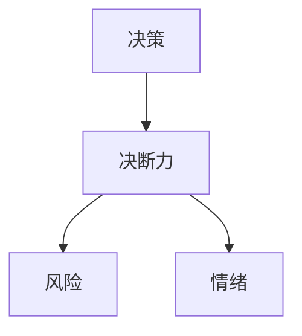

                 

### 1.4 本书结构概述

#### 1.4.1 背景介绍

决断力作为决策过程中的核心能力，不仅影响着个人的职业发展和生活质量，更是组织在激烈市场竞争中立于不败之地的重要保障。然而，面对复杂多变的环境和不确定的未来，如何提升决断力成为了一个关键问题。

本书旨在深入探讨决断力的本质和提升方法，为读者提供一套系统、实用的决策指南。通过结合心理学、决策理论和实践案例，本书将帮助读者理解决断力的核心概念，掌握提升决断力的策略，最终实现个人和组织的成功。

#### 1.4.2 核心概念与联系

为了更好地理解决断力，我们需要先了解与之相关的一些核心概念：

- **决策**：决策是选择多个可能行动中的一种，以达成特定目标的过程。决断力是决策能力的一个关键组成部分。
- **风险**：风险是决策过程中可能出现的负面结果。有效的决断力要求在风险和不确定性之间做出权衡。
- **情绪**：情绪在决策中起到重要作用，可能会影响决策者的判断力和决策结果。

这些概念之间的关系可以用以下Mermaid流程图来表示：



#### 1.4.3 核心算法原理讲解

为了更清晰地阐述决断力的提升方法，我们可以将决断力提升过程视为一个算法。以下是一个简化的决断力提升算法伪代码：

```plaintext
算法：提升决断力
输入：决策情境，时间限制，个人偏好
输出：决策结果

步骤：
1. 收集信息：根据决策情境，收集相关数据和信息。
2. 分析风险：评估每个决策选项的风险和不确定性。
3. 考虑情绪：识别可能影响决策的情绪因素，并设法平衡它们。
4. 权衡选项：比较不同决策选项的利弊，考虑个人偏好。
5. 做出决策：在时间限制内，根据分析结果，选择最优决策选项。
6. 执行决策：实施决策，并根据实际情况进行调整。
7. 反思与总结：在决策后，进行反思，总结经验教训，为未来决策提供参考。
```

#### 1.4.4 数学模型和公式

在决策过程中，常用的数学模型和公式可以帮助我们更好地分析问题。以下是一个简单的期望效用模型公式：

$$
EU = \sum_{i=1}^{n} p_i \cdot u_i
$$

其中，$EU$表示期望效用，$p_i$表示第$i$个决策选项的概率，$u_i$表示第$i$个决策选项的效用值。这个公式可以帮助我们评估不同决策选项的期望效用，从而做出更合理的决策。

#### 1.4.5 详细讲解与举例说明

为了更好地理解上述概念和模型，我们可以通过一个实际案例来进行详细讲解。

**案例**：一家公司需要决定是否投入大量资金进行新产品的研发。以下是一个简单的决策过程：

1. **收集信息**：了解市场需求、竞争对手情况、技术可行性等。
2. **分析风险**：研发失败可能导致损失大量资金，同时也可能错失市场机会。
3. **考虑情绪**：决策者可能感到焦虑和恐惧，担心失败。
4. **权衡选项**：比较投入研发和不投入研发两种情况，考虑长期和短期的影响。
5. **做出决策**：基于收集的信息和分析结果，决定是否投入研发。
6. **执行决策**：如果决定投入研发，开始实施研发计划，并密切关注市场动态。
7. **反思与总结**：在决策后，回顾决策过程，总结经验教训，为未来类似决策提供参考。

#### 1.4.6 项目实战

为了提升读者的决断力，我们可以设计一个简单的实战项目——基于数据分析的决策支持系统。该项目将包括以下步骤：

1. **开发环境搭建**：安装Python环境，并引入数据分析库如Pandas和Scikit-learn。
2. **数据收集**：收集相关的市场数据、技术数据等。
3. **数据分析**：使用Pandas进行数据处理，使用Scikit-learn进行数据建模。
4. **决策支持**：根据数据分析结果，提供决策建议。
5. **代码解读**：详细解读实现代码，分析其工作原理。
6. **案例分析**：分析实际案例，展示如何使用决策支持系统做出更好的决策。
7. **项目小结**：总结项目经验，讨论如何进一步优化系统。

通过这个项目，读者可以亲身体验决断力提升的过程，并学习如何在复杂环境中做出更好的决策。

#### 1.4.7 最佳实践 tips、小结、注意事项、拓展阅读

- **最佳实践 tips**：在面对决策时，建议采取以下策略：
  - **充分准备**：在做出决策前，确保收集了足够的信息。
  - **平衡情绪**：识别并处理可能影响决策的情绪因素。
  - **多方征求意见**：在必要时，寻求他人的意见和反馈。

- **小结**：决断力是决策过程中的核心能力，通过本书的学习，读者可以掌握提升决断力的方法，并在实际生活中运用这些方法。

- **注意事项**：在提升决断力时，需要注意以下几点：
  - **避免过度分析**：过多的分析可能导致决策延迟。
  - **及时行动**：在做出决策后，尽快采取行动。

- **拓展阅读**：为了更深入地了解决断力相关的内容，建议读者阅读以下书籍：
  - 《决断力：如何做出更好的选择》（How to Decide: Simple Tools for Making Better Choices）作者：安杰拉·达克沃斯
  - 《决策与判断》（Judgment in Managerial Decision Making）作者：汤姆·蒂勒

通过上述内容，本书为读者提供了一个全面的决断力提升指南，帮助读者在实际生活和工作中做出更明智的决策。让我们开始这个探索之旅吧！## 第2章 决策心理学

### 2.1 决策的心理过程

决策是一个复杂的心理过程，涉及到多个认知和行为因素。以下是决策过程中常见的心理步骤：

1. **问题识别**：决策者首先需要识别出需要解决的问题或面对的挑战。
2. **目标设定**：在明确问题后，决策者需要设定一个清晰的目标，即希望达成的结果。
3. **信息收集**：决策者开始收集与问题相关的信息，包括事实、数据、意见等。
4. **选项生成**：在收集信息的基础上，决策者生成一系列可能的决策选项。
5. **评估与选择**：对每个选项进行评估，根据设定的目标选择最优选项。
6. **执行与反馈**：执行决策，并根据结果进行反馈和调整。

### 2.2 决策偏差与偏见

在决策过程中，人们往往会受到各种认知偏差和偏见的影响，这些偏差可能导致错误的决策。以下是一些常见的决策偏差和偏见：

1. **确认偏误**（Confirmation Bias）：决策者倾向于寻找和接受支持自己已有观点的信息，而忽略与之相反的信息。
2. **锚定效应**（Anchoring Effect）：决策者依赖最初接收到的信息（锚）来影响后续的决策，即使这些信息并不完全相关或准确。
3. **代表性偏差**（Representativeness Bias）：决策者根据事物外观或特征相似性来判断概率，而忽略了概率的计算。
4. **可用性偏差**（Availability Bias）：决策者基于最近或容易回忆的信息来做决策，而这些信息可能并不代表整体情况。
5. **情绪化决策**（Emotional Decision Making）：情绪强烈影响决策，可能导致决策者在理性分析之外做出选择。
6. **群体思维**（Groupthink）：在群体决策中，成员倾向于避免冲突，倾向于达成共识，这可能导致错误的决策。

### 2.3 决策的情绪因素

情绪在决策过程中起着至关重要的作用。积极的情绪如乐观、自信可以提升决策的效率和质量，而消极的情绪如焦虑、恐惧则可能降低决策的质量和效率。以下是情绪在决策中的几种影响：

1. **情绪调节**：决策者需要学会调节自己的情绪，以避免情绪对决策过程的过度影响。
2. **情绪依赖**：在某些情况下，情绪可以作为决策的辅助工具，帮助决策者更快速地做出决策。
3. **情绪记忆**：情绪化的经历往往更容易被记忆，这可能在后续决策中发挥作用。

### 2.4 决策中的认知负荷

决策过程中的认知负荷（Cognitive Load）对决策结果有显著影响。高认知负荷可能导致决策者处理信息的能力下降，从而增加决策偏差的风险。以下是降低认知负荷的方法：

1. **简化信息**：通过简化信息或使用视觉辅助工具，减少决策者需要处理的信息量。
2. **分解问题**：将复杂问题分解为更小、更易管理的部分，以降低认知负荷。
3. **使用模板和指南**：制定标准化的决策流程和模板，帮助决策者快速做出决策。

### 2.5 决策的心理训练方法

为了提升决策能力，可以采取以下心理训练方法：

1. **认知训练**：通过练习提高对信息的识别、分析和整合能力。
2. **情绪调节训练**：学习情绪调节技巧，如深呼吸、冥想等，以减少情绪对决策的影响。
3. **决策模拟**：通过模拟决策情境，提高在真实环境中做出有效决策的能力。
4. **反馈与反思**：定期回顾决策过程和结果，从中学习和成长。

通过以上内容，我们可以看到，决策心理学是一个复杂且多面的领域，理解决策过程中的心理因素和情绪因素对于提升决断力至关重要。在接下来的章节中，我们将进一步探讨决策理论，以更全面地理解决断力的本质和提升方法。## 第3章 决策理论

### 3.1 决策理论的基本框架

决策理论是研究决策过程及其影响因素的科学。它为我们在复杂环境中做出理性决策提供了理论基础。决策理论的基本框架包括以下几个核心概念：

1. **决策者**：决策者是指做出决策的个人或组织。
2. **决策情境**：决策情境是指决策者面临的实际情况，包括问题的性质、约束条件、目标等。
3. **决策目标**：决策目标是指决策者希望实现的结果，可以是最大化收益、最小化成本、满足特定要求等。
4. **决策选项**：决策选项是指决策者可以选择的行动方案，通常包括多个可能的决策方案。
5. **决策结果**：决策结果是指执行决策后实际发生的情况，通常与决策目标相关。

### 3.2 决策准则与模型

在决策过程中，决策者需要选择一个决策准则来指导决策。以下是一些常见的决策准则和模型：

1. **最大化期望效用**（Expected Utility Maximization，EUM）：
   - **定义**：决策者选择能够带来最大期望效用的决策选项。
   - **公式**：$$EU = \sum_{i=1}^{n} p_i \cdot u_i$$
   - **示例**：假设有两个决策选项，A和B。A的成功概率为0.7，效用值为5；B的成功概率为0.3，效用值为10。则决策者会选择B，因为B的期望效用更高。

2. **最大化最小收益**（Maximin Criterion）：
   - **定义**：决策者选择在最坏情况下能够带来最大收益的决策选项。
   - **公式**：$$min_{w_i} \max_{x_i} u(x_i, w_i)$$
   - **示例**：假设有两个决策选项，X和Y。在最好的情况下，X的收益为10，Y的收益为8；在最坏的情况下，X的收益为0，Y的收益为-2。则决策者会选择X，因为X的最小收益更高。

3. **贝叶斯决策**（Bayesian Decision Theory）：
   - **定义**：决策者根据先验概率和观测数据更新信念，并选择后验概率最高的决策选项。
   - **公式**：$$P(H|D) = \frac{P(D|H) \cdot P(H)}{P(D)}$$
   - **示例**：假设有两个决策选项，A和B。先验概率为P(A)=0.5，P(B)=0.5。观测到数据D的概率为P(D|A)=0.8，P(D|B)=0.2。则后验概率P(A|D)=0.8，P(B|D)=0.2，决策者会选择A。

4. **满意决策**（Satisficing）：
   - **定义**：决策者不是追求最优解，而是追求满足最低标准的解。
   - **示例**：假设有三个决策选项，X、Y和Z。X的收益为10，Y的收益为8，Z的收益为5。决策者设定的最低收益标准为6，则Y是一个满意的解。

### 3.3 决策的权衡与优化策略

在决策过程中，权衡和优化策略可以帮助决策者更好地处理复杂性和不确定性。以下是一些常见的权衡和优化策略：

1. **成本效益分析**（Cost-Benefit Analysis）：
   - **定义**：评估决策选项的成本和收益，并比较其净收益。
   - **公式**：$$CBA = \sum_{i=1}^{n} \left( \text{收益}_i - \text{成本}_i \right)$$
   - **示例**：假设有两个决策选项，A和B。A的收益为1000，成本为500；B的收益为1500，成本为800。则A的净收益为500，B的净收益为700，决策者会选择B。

2. **机会成本分析**（Opportunity Cost Analysis）：
   - **定义**：评估选择一个决策选项所放弃的其他选项的潜在收益。
   - **公式**：$$Opportunity Cost = \text{选择决策选项的收益} - \text{次优决策选项的收益}$$
   - **示例**：假设有两个决策选项，A和B。A的收益为1000，B的收益为1200。选择A的机会成本为200。

3. **风险评估与优化**（Risk Assessment and Optimization）：
   - **定义**：评估决策选项的风险，并选择能够最小化风险或最大化收益的选项。
   - **示例**：假设有两个决策选项，X和Y。X的成功概率为0.7，收益为10；Y的成功概率为0.3，收益为20。则Y的风险较低，但收益更高。

4. **多目标决策**（Multi-Objective Decision Making）：
   - **定义**：在多个目标之间存在冲突时，选择一个平衡各个目标的方案。
   - **示例**：假设有两个决策目标，最大化利润和最小化成本。如果两个目标之间存在冲突，需要找到一种平衡方案。

通过上述决策准则和优化策略，决策者可以在复杂环境中做出更理性、更有效的决策。在接下来的章节中，我们将探讨如何通过心理训练和实践方法来提升决断力。## 第4章 决断力训练方法

### 4.1 决断力训练的基本原理

决断力并非天生的能力，而是可以通过科学训练和心理技巧逐步提升的。以下是一些决断力训练的基本原理和方法：

#### 4.1.1 强化决策意识

首先，决策者需要增强自己的决策意识。这包括在日常工作和生活中时刻提醒自己注意决策的过程和结果。具体方法如下：

- **记录决策日志**：每天记录下做出的决策，分析决策的原因、过程和结果。
- **定期回顾**：定期回顾决策日志，总结成功和失败的决策经验，从中学习。

#### 4.1.2 提高信息处理能力

良好的决断力依赖于准确的信息处理能力。以下是提高信息处理能力的方法：

- **快速筛选信息**：学会快速识别和筛选关键信息，避免信息过载。
- **逻辑分析能力**：提高逻辑思维和批判性思维能力，学会从多个角度分析问题。
- **数据敏感性**：提高对数据的敏感性和分析能力，学会使用数据分析工具。

#### 4.1.3 增强心理调节能力

情绪对决策有重要影响，因此增强心理调节能力是提升决断力的关键。以下是增强心理调节能力的方法：

- **情绪认知**：学会识别和认知自己的情绪，理解情绪对决策的影响。
- **情绪调节技巧**：掌握情绪调节技巧，如深呼吸、冥想、正念等，帮助自己在情绪波动时保持冷静。
- **情绪释放**：通过运动、写日记等方式释放情绪，避免情绪积累。

#### 4.1.4 增强应变能力

在复杂多变的环境中，决断力不仅体现在日常决策中，更体现在应对突发事件的能力。以下是增强应变能力的方法：

- **情景模拟**：通过模拟各种可能的情境，提高自己在不同情况下的决策能力。
- **经验积累**：积累处理突发事件的实践经验，从每次经历中学习。
- **学习应对策略**：学习一些通用的应对策略，如优先处理最重要的事务、保持灵活性等。

### 4.2 心理技巧提升决断力

以下是一些具体的心理技巧，可以帮助决策者提升决断力：

#### 4.2.1 清晰界定问题

在做出决策前，首先要明确问题。以下是清晰界定问题的技巧：

- **定义问题**：用简洁明了的语言描述问题，避免模糊不清。
- **分解问题**：将复杂问题分解为更小、更具体的问题，逐一解决。

#### 4.2.2 确定决策目标

明确决策目标是做出有效决策的关键。以下是确定决策目标的技巧：

- **SMART目标**：确保决策目标具备具体性（Specific）、可衡量性（Measurable）、可实现性（Achievable）、相关性（Relevant）和时限性（Time-bound）。
- **优先级排序**：根据决策目标的重要性排序，确保资源投入最大化效益。

#### 4.2.3 减少信息过载

信息过载是影响决策质量的重要因素。以下是减少信息过载的技巧：

- **信息筛选**：学会筛选关键信息，避免过多冗余信息干扰决策。
- **信息整合**：将分散的信息整合成有价值的知识体系，提高信息利用率。

#### 4.2.4 权衡利弊

在决策过程中，需要权衡不同选项的利弊。以下是权衡利弊的技巧：

- **成本效益分析**：评估每个决策选项的成本和收益，进行量化分析。
- **风险与收益分析**：分析每个决策选项的风险和潜在收益，进行权衡。

#### 4.2.5 增强自信心

自信心是做出果断决策的重要心理基础。以下是增强自信心的技巧：

- **积极自我暗示**：通过积极的自我暗示增强自信心，如“我可以做到”、“我有能力解决问题”等。
- **成功经验积累**：回顾过去的成功经验，增强自信心。

#### 4.2.6 学会接受失败

失败是决策过程中不可避免的，但学会接受失败并从中学习是提升决断力的重要一步。以下是学会接受失败的技巧：

- **反思失败原因**：分析失败的原因，找出改进的空间。
- **调整心态**：接受失败是成长的一部分，不要因为一次失败而否定自己的能力。

通过以上心理技巧的训练，决策者可以逐步提高自己的决断力，在面对复杂决策时更加自信和果断。在接下来的章节中，我们将探讨如何在实践中提升决断力。## 第5章 领导力与决断力

### 5.1 领导者的决策角色

领导者在组织中扮演着决策的核心角色，他们的决策能力直接影响组织的成功。以下是领导者决策角色的一些关键方面：

#### 5.1.1 制定战略方向

领导者需要制定组织的长期战略方向，这通常涉及对市场趋势、竞争环境和内部资源的深入分析。有效的战略决策要求领导者具备远见和洞察力，能够在复杂多变的环境中为组织指引方向。

#### 5.1.2 解决冲突和问题

领导者经常需要在组织内部或外部解决冲突和问题。这需要领导者具备强大的决断力，能够在紧急情况下迅速做出决策，并有效协调各方利益。

#### 5.1.3 分配资源

领导者需要分配组织的资源，包括人力、财务和技术资源。这要求领导者能够权衡不同项目或任务的需求，并做出明智的决策，以确保资源得到最大化利用。

#### 5.1.4 激励团队

领导者通过做出决策来激励团队成员，确保团队朝着共同的目标努力。有效的决策不仅能够提高团队成员的士气，还能够增强团队的凝聚力和执行力。

### 5.2 领导风格与决断力

领导风格对领导者的决断力有着重要影响。不同的领导风格会在决策过程中产生不同的效果。以下是几种常见的领导风格与决断力的关系：

#### 5.2.1 权威型领导

权威型领导者倾向于集中决策权，他们在决策过程中具有较强的控制力和决断力。这种领导风格在紧急情况下能有效推动决策的快速执行，但可能导致团队成员的参与度较低。

#### 5.2.2 民主型领导

民主型领导者鼓励团队成员参与决策过程，通过集体讨论和协商来做出决策。这种领导风格有助于提高团队凝聚力和创新性，但决策过程可能较为缓慢。

#### 5.2.3 赋权型领导

赋权型领导者将决策权下放给团队成员，鼓励他们自主决策并承担责任。这种领导风格有助于提高团队成员的自主性和创造力，但领导者需要具备较高的信任和管理能力。

### 5.3 领导团队决策

在领导团队决策过程中，领导者需要运用决断力来引导团队做出最优决策。以下是领导团队决策的一些关键步骤：

#### 5.3.1 界定问题

领导者需要明确团队面临的问题，并将其分解为具体可操作的子问题。这有助于团队成员更好地理解决策目标和范围。

#### 5.3.2 收集信息

领导者需要确保团队成员收集到足够的信息和数据，以便进行有效的分析。同时，领导者需要指导团队成员如何筛选和整合信息。

#### 5.3.4 考虑多方意见

在决策过程中，领导者应鼓励团队成员发表意见，并充分考虑不同观点的合理性。这有助于避免偏见和决策失误。

#### 5.3.5 制定决策方案

领导者需要与团队成员一起制定多个决策方案，并分析每个方案的优缺点。在权衡不同选项后，选择最优方案。

#### 5.3.6 执行决策

领导者需要确保决策得到有效执行，并监控决策的实施过程。在执行过程中，领导者需要及时调整决策，以应对可能出现的问题。

#### 5.3.7 反馈与总结

在决策执行后，领导者需要收集反馈，总结决策的效果，并从中学习。这有助于提升团队未来的决策能力。

通过以上内容，我们可以看到，领导力与决断力密切相关。一个具备强大决断力的领导者能够有效引导团队做出明智的决策，推动组织实现目标。在接下来的章节中，我们将探讨企业决策中的决断力应用。## 第6章 企业决策中的决断力

### 6.1 企业决策框架

在企业中，决策是一个复杂且持续的过程，涉及到多个层面的分析和考量。一个有效的企业决策框架可以帮助企业在面对复杂环境和不确定性时做出明智的决策。以下是企业决策框架的基本构成：

#### 6.1.1 问题识别

企业决策的第一步是识别问题。这包括确定当前存在的问题或面临的挑战，以及这些问题对企业的潜在影响。问题识别的过程通常涉及数据收集、市场分析、内部审计等。

#### 6.1.2 目标设定

在识别问题后，企业需要设定具体的目标。这些目标应该是明确、可衡量、可实现、相关和时限的（SMART）。目标设定有助于明确决策的方向和预期成果。

#### 6.1.3 选项分析

企业需要分析所有可能的决策选项，包括继续当前策略、改变策略、引入新项目或合作伙伴等。每个选项都需要进行详细的分析，评估其可行性、成本、风险和潜在收益。

#### 6.1.4 评估与选择

在分析所有选项后，企业需要评估每个选项的优劣，并选择最优的决策方案。评估过程可能涉及定量分析（如成本效益分析）和定性分析（如专家评审）。

#### 6.1.5 决策执行

一旦决策方案确定，企业需要制定详细的执行计划，并确保资源得到有效分配。执行过程中，企业需要监控决策的效果，及时调整策略。

#### 6.1.6 反馈与调整

决策执行后，企业需要收集反馈信息，评估决策的实际效果，并据此进行调整。这有助于企业不断优化决策过程，提高未来的决策质量。

### 6.2 决策流程优化

优化决策流程可以提高决策的效率和质量，从而增强企业的竞争力。以下是优化决策流程的几种方法：

#### 6.2.1 建立决策模型

企业可以建立决策模型，使用数学和统计学方法对决策过程进行建模和分析。这有助于更准确地评估不同决策选项的潜在结果。

#### 6.2.2 利用数据分析工具

企业可以利用先进的数据分析工具（如大数据分析、机器学习等）来收集和分析大量数据，从而提高决策的准确性和效率。

#### 6.2.3 简化决策流程

企业可以通过简化决策流程来减少冗余步骤和环节，缩短决策周期。这可以通过制定标准化决策流程、减少审批环节等方式实现。

#### 6.2.4 提高团队协作

企业可以通过加强团队协作来提高决策效率。这可以通过建立跨部门团队、定期召开决策讨论会等方式实现。

#### 6.2.5 鼓励创新思维

企业应鼓励员工提出创新的想法和建议，并将其纳入决策过程中。这有助于企业发现新的商业机会，并提高决策的创造力。

### 6.3 决策案例分析

以下是一个企业决策的实际案例分析：

#### 案例背景

一家制造企业面临着市场需求变化和激烈竞争的挑战。为了保持竞争力，企业需要决定是否投入大量资金进行产品创新和技术升级。

#### 决策过程

1. **问题识别**：企业识别出市场需求变化和竞争加剧是当前面临的主要问题。
2. **目标设定**：企业设定了两个目标：保持市场竞争力，提高产品质量。
3. **选项分析**：
   - 选项A：继续使用现有生产线和技术，降低成本。
   - 选项B：投入资金进行产品创新和技术升级。
4. **评估与选择**：
   - 通过数据分析，选项A在短期内可以降低成本，但长期来看，由于技术落后可能导致市场份额下降。
   - 选项B虽然需要大量资金投入，但可以提升产品质量，增强市场竞争力。
   - 综合评估后，企业选择选项B。
5. **决策执行**：企业制定了详细的产品创新和技术升级计划，并确保资源得到有效分配。
6. **反馈与调整**：在决策执行过程中，企业持续收集市场反馈，并根据实际情况进行调整。

#### 结果

通过投入资金进行产品创新和技术升级，企业成功提升了产品质量，市场份额得到显著提升，最终实现了盈利增长。

### 6.4 决策效率与质量的关系

在企业决策中，决策效率和决策质量是两个关键指标。以下是它们之间的关系：

- **决策效率**：决策效率是指企业做出决策的速度。提高决策效率可以缩短决策周期，提高企业的反应速度。
- **决策质量**：决策质量是指决策的正确性和合理性。高质量的决策可以确保企业长期发展和竞争力。

提高决策效率与质量的关系：

- **平衡效率与质量**：企业需要在决策效率和质量之间找到平衡。过于追求效率可能导致决策质量下降，而过于关注质量可能导致决策效率低下。
- **优化流程**：通过优化决策流程，企业可以同时提高决策效率和决策质量。
- **持续改进**：企业应不断评估和改进决策流程，以实现更高的决策效率和质量。

通过以上内容，我们可以看到，决断力在企业决策中起着至关重要的作用。一个具备强大决断力的企业能够在复杂环境中迅速做出明智的决策，从而保持竞争优势。在接下来的章节中，我们将探讨如何在突发情况下提升决断力。## 第7章 突发情况下的决断力

### 7.1 突发情况的特征

在现实生活中，突发事件是不可避免的。这些事件通常具有以下特征：

- **突发性**：突发事件往往突然发生，决策者无法提前预知。
- **紧急性**：突发事件通常需要立即处理，决策者必须在短时间内做出决策。
- **不确定性**：突发事件的不确定性较高，决策者难以准确预测事件的发展和结果。
- **复杂性**：突发事件可能涉及多个领域和利益相关方，决策过程较为复杂。

### 7.2 应对突发情况

在应对突发事件时，决断力至关重要。以下是一些应对突发情况的方法：

#### 7.2.1 保持冷静

在突发事件中，决策者需要保持冷静，避免情绪化。情绪化的决策可能导致错误的判断和决策。以下是一些保持冷静的技巧：

- **深呼吸**：在压力下，深呼吸可以帮助决策者放松身体，保持清醒。
- **正念冥想**：通过正念冥想，决策者可以培养专注力和冷静心态。
- **转移注意力**：将注意力转移到解决问题的具体步骤上，避免无谓的担忧。

#### 7.2.2 快速收集信息

在突发事件中，快速收集相关信息是做出有效决策的关键。以下是一些收集信息的技巧：

- **利用现有资源**：充分利用企业内部和外部的资源，如内部报告、市场数据、专家意见等。
- **多渠道收集**：通过多种渠道收集信息，如电话、邮件、社交媒体等。
- **筛选关键信息**：在大量信息中快速识别关键信息，避免信息过载。

#### 7.2.3 制定应急计划

为了提高应对突发事件的能力，企业应制定应急计划。应急计划应包括以下内容：

- **应急响应流程**：明确应急响应的具体步骤和责任人。
- **资源调配**：确保在突发事件发生时，有足够的资源（如人力、物资、资金）可以迅速调配。
- **培训与演练**：定期对员工进行应急培训，并组织应急演练，提高应对突发事件的能力。

#### 7.2.4 快速决策

在突发事件中，决策者需要迅速做出决策。以下是一些快速决策的技巧：

- **简化决策过程**：在紧急情况下，简化决策过程，减少不必要的讨论和审批环节。
- **优先处理关键问题**：根据事件的紧急程度和影响，优先处理最关键的问题。
- **利用经验**：依靠以往的经验和直觉，迅速做出决策。

#### 7.2.5 执行决策

在做出决策后，迅速执行决策是确保决策效果的关键。以下是一些执行决策的技巧：

- **明确责任**：明确每个环节的责任人和执行时间，确保决策得到有效执行。
- **实时监控**：实时监控决策执行过程，确保决策得到有效实施。
- **及时调整**：根据实际情况及时调整决策，以应对可能出现的新问题。

### 7.3 突发情况下的决断力训练

为了提高在突发事件下的决断力，可以采取以下训练方法：

#### 7.3.1 应急情景模拟

通过模拟各种突发情况，提高决策者在压力下的应对能力和决断力。情景模拟应包括不同类型的突发事件，如自然灾害、网络安全事件、市场危机等。

#### 7.3.2 增强信息处理能力

提高信息处理能力，帮助决策者在突发事件中快速收集、分析和整合信息。这可以通过数据分析和心理训练实现。

#### 7.3.3 心理韧性训练

通过心理韧性训练，提高决策者在面对突发事件时的心理承受能力和适应能力。心理韧性训练可以包括冥想、正念练习、压力管理技巧等。

#### 7.3.4 团队协作训练

在突发事件中，团队合作至关重要。通过团队协作训练，提高团队成员之间的沟通和协作能力，确保在紧急情况下能够迅速、有效地协同工作。

通过以上训练方法，决策者可以在突发事件中更好地发挥自己的决断力，确保组织能够迅速、有效地应对突发事件，减少损失，保障组织的发展。在接下来的章节中，我们将总结提升决断力的路径和策略。## 第8章 提升决断力的路径和策略

### 8.1 决断力提升的总体路径

提升决断力是一个系统性的过程，涉及多个方面的培养和训练。以下是提升决断力的总体路径：

#### 8.1.1 自我认知

首先，决策者需要深入了解自己的决策风格、优势和弱点。这可以通过自我反思、心理测试和反馈来实现。通过自我认知，决策者可以明确自己的决策特点，为后续的改进提供基础。

#### 8.1.2 知识储备

决断力依赖于丰富的知识和信息。决策者需要不断学习，积累与决策相关的知识和经验。这可以通过阅读专业书籍、参加培训课程、参与行业讨论等方式实现。

#### 8.1.3 心理调节

情绪对决策有重要影响，因此决策者需要学会调节自己的情绪。这可以通过心理训练、情绪管理和压力管理技巧来实现。保持冷静和清晰的思维是做出有效决策的关键。

#### 8.1.4 决策训练

通过模拟决策情景、角色扮演和案例分析，提高决策者在实际决策中的能力。这可以帮助决策者提高信息处理能力、分析问题和权衡利弊的能力。

#### 8.1.5 反思与总结

决策后，决策者需要反思决策过程和结果，总结经验教训。这可以通过记录决策日志、定期回顾和评估来实现。反思和总结有助于决策者不断优化决策过程，提高决断力。

### 8.2 持续学习与进步

提升决断力不是一次性的任务，而是一个持续的过程。以下是一些持续学习与进步的方法：

#### 8.2.1 保持好奇心

对新的知识和观点保持好奇心，不断探索未知的领域。这可以帮助决策者开阔视野，提高决策的创新性和适应性。

#### 8.2.2 跨学科学习

跨学科学习可以帮助决策者掌握多领域的知识和技能，从而提高综合决策能力。这可以通过阅读跨学科书籍、参加跨学科研讨会等方式实现。

#### 8.2.3 拓展人际关系

与不同背景和领域的人建立联系，可以带来新的观点和见解。这可以通过加入专业组织、参加行业会议和社交活动等方式实现。

#### 8.2.4 反思与自我挑战

定期反思自己的决策过程和结果，找出改进的空间。同时，勇于接受新的挑战，尝试在更复杂的情境中做出决策。

### 8.3 未来展望

随着人工智能和大数据技术的发展，决策过程将变得更加高效和精准。未来的决断力将不仅依赖于个人的能力，还将依赖于数据分析和人工智能的支持。以下是一些未来决断力的展望：

#### 8.3.1 数据驱动的决策

利用大数据和人工智能技术，决策者可以更全面、准确地分析信息和预测结果。这可以帮助决策者做出更科学的决策。

#### 8.3.2 自动化决策

随着人工智能技术的发展，一些简单的决策可以自动化执行，提高决策效率。这将为决策者节省时间，使他们能够专注于更复杂的决策。

#### 8.3.3 决策模拟

通过先进的模拟技术，决策者可以在虚拟环境中测试不同的决策方案，评估其潜在结果。这可以帮助决策者更全面地了解决策的影响，提高决策的准确性。

#### 8.3.4 个性化决策

利用人工智能和大数据技术，可以为每个决策者提供个性化的决策支持和建议。这可以帮助决策者更准确地识别问题和制定解决方案。

通过以上内容，我们可以看到，提升决断力是一个不断学习和进步的过程。在不断变化的环境中，只有具备强大决断力的决策者才能引领组织走向成功。让我们持续努力，不断提升自己的决断力，迎接未来的挑战。## 附录

### A. 决策相关的工具与资源

为了更好地进行决策分析，以下是一些常用的工具和资源：

- **Excel**：强大的数据分析工具，适用于各种简单的数据分析和决策支持。
- **Python数据分析库**（如Pandas、NumPy、Scikit-learn）：用于复杂的数据分析和机器学习模型。
- **Tableau**：数据可视化工具，帮助决策者更直观地理解数据。
- **Power BI**：类似于Tableau的数据可视化工具，适用于企业级数据分析和报告。
- **Watson Analytics**：IBM提供的高级数据分析平台，支持大数据和人工智能分析。
- **Excel Solver**：用于线性规划和优化问题的求解器。
- **Google Analytics**：用于网站流量分析和用户行为研究。
- **Google Trends**：分析搜索引擎趋势，帮助决策者了解市场动态。
- **SurveyMonkey**：在线调查工具，用于收集用户反馈和市场研究。
- **Qualtrics**：专业的调查和数据收集工具，适用于复杂的市场研究和用户体验分析。

### B. 进一步阅读

为了深入了解决策和决断力的相关理论和实践，以下是一些推荐的书籍和文章：

- **《决断力：如何做出更好的选择》**（How to Decide: Simple Tools for Making Better Choices）作者：安杰拉·达克沃斯
- **《决策与判断》**（Judgment in Managerial Decision Making）作者：汤姆·蒂勒
- **《有效的决策：如何做出更好的决策》**（Effective Decision Making: Creating Conditions for Choice）作者：史蒂芬·罗宾斯
- **《决策的艺术》**（The Art of Decision Making）作者：理查德·塞勒
- **《大数据决策》**（Big Data Decision Making）作者：阿维·格林斯潘
- **《决策思维》**（Thinking, Fast and Slow）作者：丹尼尔·卡尼曼
- **《决策过程：认知科学与行为经济学视角》**（The Decision Process: The Science of Choosing）作者：迈克尔·拉克
- **《决策心理学》**（Decision Making andJudgment）作者：丹尼尔·卡尼曼、阿莫斯·特沃斯基
- **《领导者决策》**（Leadership Decisions: A Practical Guide to Managing Unpredictable Situations）作者：理查德·达蒙
- **《决策者策略》**（Strategies for Decision Makers）作者：约翰·赫伯特·麦克雷恩

通过阅读这些书籍和文章，读者可以深入了解决策的心理学、理论和方法，进一步提高自己的决断力。## 作者

作者：AI天才研究院/AI Genius Institute & 禅与计算机程序设计艺术 /Zen And The Art of Computer Programming

