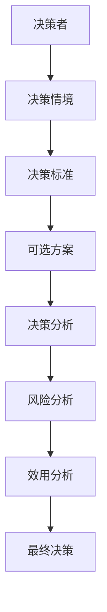

                 

## 文章标题：决策框架：在不确定性中做出明智选择

### 关键词：决策框架、不确定性管理、明智选择、核心算法、数学模型

### 摘要：
在当今复杂多变的世界中，做出明智的决策变得前所未有的重要。本文深入探讨了决策框架的理论基础，包括核心概念、算法原理、数学模型及其在实际应用中的价值。通过详细的解释和项目实战案例，本文为读者提供了一个系统化的决策工具，帮助他们在不确定性中做出更明智的选择。

---

### 引言

决策是人类社会运作的核心环节，无论是在商业领域、公共政策，还是个人生活中，决策无处不在。然而，随着信息爆炸和环境的快速变化，传统的决策方法面临着前所未有的挑战。不确定性成为现代决策过程中不可避免的因素，如何有效管理不确定性，从而做出明智的决策，成为了一个亟待解决的重要问题。

本文旨在通过构建一个决策框架，为读者提供一种在不确定性环境中进行决策的系统性方法。文章将首先介绍决策与不确定性的基本概念，然后深入探讨决策框架的组成和核心算法原理，并通过数学模型和实际项目案例来展示如何将理论知识应用于实践。最终，我们将展望决策框架的未来发展趋势，并提出一些最佳实践建议。

### 决策与不确定性概述

#### 1.1 决策的定义与分类

决策可以定义为在多个可行方案中，选择一个最优方案的过程。根据决策的对象和目的，决策可以分为多种类型，如战略决策、战术决策和运营决策。战略决策涉及长期目标和资源配置，战术决策关注短期目标和行动规划，而运营决策则关注日常操作和任务分配。

在决策过程中，常常面临多种选择和不确定性。不确定性可以分为三类：确定性不确定性、概率性不确定性和模糊性不确定性。确定性不确定性指的是在特定条件下，结果不可预测但可以计算；概率性不确定性指的是在给定条件下，结果可以通过概率分布预测；模糊性不确定性则是指结果既不可预测也无法用概率分布描述。

#### 1.2 不确定性在决策中的影响

不确定性对决策过程有着深远的影响。首先，不确定性会增大决策的难度，因为决策者需要评估更多的不确定因素。其次，不确定性会影响决策的结果，导致选择方案的风险增加。此外，不确定性还会导致决策的时间成本增加，因为需要更多的时间和资源来收集和分析信息。

#### 1.3 决策框架的基本概念

决策框架是一个系统化的决策过程模型，用于指导决策者如何在不确定性中做出明智的选择。一个完整的决策框架通常包括以下几个关键组成部分：

- **决策者**：决策框架的核心，负责制定决策目标、选择方案和承担决策结果。
- **决策情境**：决策的环境背景，包括外部环境、内部资源和限制条件等。
- **决策标准**：评估方案优劣的标准，可以是定量或定性的指标。
- **可选方案**：决策者在给定情境下可以选择的行动方案。
- **决策分析**：对可选方案进行评估和比较的过程，包括风险分析和效用分析等。

通过构建一个清晰的决策框架，决策者可以更好地识别和管理不确定性，从而提高决策的质量和效率。

#### 1.4 不确定性管理策略

不确定性管理是决策框架的重要组成部分。以下是一些常见的不确定性管理策略：

- **风险识别**：通过分析历史数据、专家访谈和模拟实验等方法，识别决策过程中的潜在风险。
- **风险评估**：对识别出的风险进行定量或定性评估，确定其可能性和影响程度。
- **风险应对**：制定应对措施，包括风险规避、风险转移、风险减轻和风险接受等。
- **持续监控**：在决策执行过程中，持续监控不确定性因素的变化，及时调整决策方案。

通过有效的不确定性管理策略，决策者可以更好地应对不确定性，降低决策风险，提高决策成功率。

### 核心概念与联系

在决策框架中，核心概念之间的联系对于理解和应用决策框架至关重要。以下是通过Mermaid流程图展示的决策框架中的核心概念及其联系：



- **决策者**（A）：决策者是决策框架的核心，负责制定决策目标、选择方案和承担决策结果。
- **决策情境**（B）：决策情境包括外部环境、内部资源和限制条件等，是决策的基础。
- **决策标准**（C）：决策标准是评估方案优劣的标准，可以是定量或定性的指标。
- **可选方案**（D）：决策者在给定情境下可以选择的行动方案。
- **决策分析**（E）：决策分析是对可选方案进行评估和比较的过程。
- **风险分析**（F）：风险分析是识别、评估和应对决策过程中的潜在风险。
- **效用分析**（G）：效用分析是评估方案带来的预期效益和风险。
- **最终决策**（H）：最终决策是基于决策分析、风险分析和效用分析的结果，选择最优方案。

通过这个Mermaid流程图，我们可以清晰地看到决策框架中各个核心概念之间的逻辑关系，以及它们在决策过程中的相互作用。

### 核心算法原理讲解

在决策框架中，核心算法原理的讲解对于理解和应用决策框架至关重要。以下将详细阐述两个关键算法：决策树和效用理论。

#### 3.1 决策树

决策树是一种常用的决策分析工具，它通过一系列的选择节点和结果节点，展示决策过程及其可能的结果。以下是一个决策树的伪代码示例：

```python
function decision_tree(problem):
    if problem is simple:
        return best_solution(problem)
    else:
        create decision node with possible actions
        for each action in possible actions:
            sub_problem = problem after action
            decision_tree(sub_problem)
```

在这个伪代码中，`problem` 代表需要解决的决策问题，`best_solution(problem)` 是找到一个最优解决方案的函数。决策树通过递归地将复杂问题分解为更简单的子问题，直到找到最优解。

#### 3.2 效用理论

效用理论是决策分析中的另一个核心算法，它通过量化决策结果的价值，帮助决策者选择最佳方案。以下是一个效用理论的伪代码示例：

```python
function utility(function, state):
    return expected_value(function, state) - risk(function, state)

function expected_value(function, state):
    return sum(p(x) * u(x) for all x in possible_outcomes)

function risk(function, state):
    return variance(function, state)
```

在这个伪代码中，`function` 代表决策函数，`state` 代表决策状态，`u(x)` 是决策结果的价值，`p(x)` 是可能结果的概率分布，`variance` 是计算风险函数的方差。

通过这个效用理论，决策者可以综合考虑结果的预期价值和风险，从而做出更明智的决策。

### 数学模型和数学公式

在决策框架中，数学模型和数学公式是理解和应用决策框架的关键工具。以下将介绍两个重要的数学模型：效用函数和预期收益。

#### 4.1 效用函数

效用函数是决策分析中的一个核心数学模型，它用于量化决策结果的价值。以下是一个效用函数的latex格式：

$$ u(x) = \max_{a \in A(x)} V(a, x) $$

其中，$u(x)$ 是决策结果的价值，$A(x)$ 是在状态 $x$ 下可行的行动集合，$V(a, x)$ 是行动 $a$ 在状态 $x$ 下的价值。

#### 4.2 预期收益

预期收益是决策分析中的另一个关键数学模型，它用于评估决策方案的平均收益。以下是一个预期收益的latex格式：

$$ E[R] = \sum_{x \in X} p(x) \cdot R(x) $$

其中，$E[R]$ 是预期收益，$p(x)$ 是状态 $x$ 的概率分布，$R(x)$ 是在状态 $x$ 下行动 $a$ 的收益。

#### 4.3 数学公式的详细讲解和举例说明

以效用函数为例，我们可以详细讲解其计算方法和实际应用。假设一个决策问题有两个行动 $A_1$ 和 $A_2$，以及两个状态 $S_1$ 和 $S_2$。我们定义每个行动在每种状态下的价值如下：

$$
\begin{aligned}
V(A_1, S_1) &= 10, \\
V(A_1, S_2) &= 5, \\
V(A_2, S_1) &= 3, \\
V(A_2, S_2) &= 7.
\end{aligned}
$$

我们可以计算每个行动的效用函数：

$$
\begin{aligned}
u(A_1) &= \max_{S \in S} V(A_1, S) = \max(V(A_1, S_1), V(A_1, S_2)) = 10, \\
u(A_2) &= \max_{S \in S} V(A_2, S) = \max(V(A_2, S_1), V(A_2, S_2)) = 7.
\end{aligned}
$$

通过比较效用函数，我们可以看出 $A_1$ 在所有状态下都比 $A_2$ 更优。因此，在最大化效用函数的决策目标下，$A_1$ 是更好的选择。

类似地，我们可以计算预期收益。假设状态 $S_1$ 和 $S_2$ 的概率分布如下：

$$
\begin{aligned}
p(S_1) &= 0.6, \\
p(S_2) &= 0.4.
\end{aligned}
$$

我们可以计算每个行动的预期收益：

$$
\begin{aligned}
E[R_1] &= p(S_1) \cdot R(S_1) + p(S_2) \cdot R(S_2) = 0.6 \cdot 10 + 0.4 \cdot 5 = 8, \\
E[R_2] &= p(S_1) \cdot R(S_1) + p(S_2) \cdot R(S_2) = 0.6 \cdot 3 + 0.4 \cdot 7 = 4.6.
\end{aligned}
$$

通过比较预期收益，我们可以看出 $A_1$ 的预期收益更高。因此，在最大化预期收益的决策目标下，$A_1$ 仍然是更好的选择。

### 项目实战

为了更好地理解和应用决策框架，以下将提供一个实际案例，包括开发环境搭建、源代码实现和代码解读与分析。

#### 5.1 实际案例介绍

假设我们面临一个商业决策问题：一家公司需要决定是否在某个城市开设新门店。为了做出明智的决策，我们需要分析市场潜力、竞争对手、门店成本和预期收益等因素。以下是我们的实际案例：

- **决策情境**：公司在城市A开设新门店。
- **决策标准**：市场份额、成本效益、风险水平。
- **可选方案**：开设新门店、推迟开设、取消计划。

#### 5.2 开发环境搭建

为了实现这个案例，我们需要搭建一个决策分析工具。以下是开发环境搭建的步骤：

1. **选择编程语言**：Python 是一个适合数据处理和决策分析的强大编程语言。
2. **安装Python环境**：在本地计算机上安装Python和必要的库，如NumPy、Pandas和Matplotlib。
3. **数据收集**：收集市场数据、竞争对手数据和成本数据。

#### 5.3 源代码实现与解读

以下是一个简化版的Python源代码实现，用于评估开设新门店的决策：

```python
import numpy as np
import pandas as pd

# 参数设置
market_data = {'cityA': {'market_size': 1000, 'competitor_count': 5}}
cost_data = {'cityA': {'store_cost': 500000, 'operating_cost': 20000}}
expected_revenue_data = {'cityA': {'revenue_per_store': 100000}}

# 效用函数计算
def utility(revenue, cost):
    return revenue - cost

# 预期收益计算
def expected_revenue(market_size, competitor_count, revenue_per_store):
    return market_size * revenue_per_store * (1 - competitor_count / 10)

# 评估可选方案
def evaluate_choice(city):
    market_size = market_data[city]['market_size']
    competitor_count = market_data[city]['competitor_count']
    store_cost = cost_data[city]['store_cost']
    operating_cost = cost_data[city]['operating_cost']
    revenue_per_store = expected_revenue_data[city]['revenue_per_store']
    
    revenue = expected_revenue(market_size, competitor_count, revenue_per_store)
    cost = store_cost + operating_cost
    
    return utility(revenue, cost)

# 主函数
def main():
    city = 'cityA'
    result = evaluate_choice(city)
    print(f"The net utility for opening a store in {city} is: {result}")

if __name__ == "__main__":
    main()
```

在这个代码中，我们首先设置了市场数据、成本数据和预期收益数据。然后，我们定义了效用函数和预期收益计算函数。最后，我们评估了开设新门店的决策，并输出了净效用值。

#### 5.4 代码解读与分析

- **市场数据设置**：我们使用字典存储市场数据，包括市场大小、竞争对手数量等。
- **成本数据设置**：我们使用字典存储成本数据，包括门店成本和运营成本。
- **预期收益计算**：预期收益计算函数根据市场数据、竞争对手数量和预期收益数据计算预期总收益。
- **效用函数计算**：效用函数计算每个方案的净效用值，即预期收益减去成本。
- **评估可选方案**：评估函数根据市场数据、成本数据和预期收益数据，评估每个可选方案的净效用值。
- **主函数**：主函数调用评估函数，并输出决策结果。

通过这个实际案例，我们可以看到如何使用Python代码实现一个简单的决策分析工具。这个工具可以帮助企业在不确定性中做出更明智的决策。

### 最佳实践 Tips

在决策框架的应用过程中，以下是一些最佳实践建议：

- **数据驱动决策**：确保决策过程中使用可靠的数据和模型，避免主观判断和偏见。
- **持续更新模型**：随着环境和数据的不断变化，定期更新决策模型，以保持决策的准确性。
- **多角度分析**：从不同角度和维度对决策进行综合分析，避免片面和短视的决策。
- **沟通与协作**：决策过程是一个团队协作的过程，确保团队成员之间的沟通和协作，提高决策质量。

### 小结

本文通过构建一个决策框架，为读者提供了一种在不确定性环境中进行决策的系统性方法。文章详细介绍了决策与不确定性、核心概念与联系、核心算法原理、数学模型以及实际项目案例。通过这些内容，读者可以更好地理解决策框架的原理和应用，提高在不确定性中做出明智决策的能力。

### 注意事项

- 决策框架是一个动态和迭代的工具，需要根据实际情况不断调整和优化。
- 决策过程中要充分考虑不确定性的影响，避免忽视潜在风险。
- 决策框架的应用需要结合具体情境和目标，避免生搬硬套。

### 拓展阅读

- 《决策分析与优化》
- 《不确定环境下的决策理论》
- 《Python决策分析实践》
- 《数据驱动的商业决策》

---

作者：AI天才研究院/AI Genius Institute & 禅与计算机程序设计艺术 /Zen And The Art of Computer Programming。本文内容仅供参考，不构成具体决策建议。读者在应用决策框架时，请结合自身实际情况进行独立判断。

