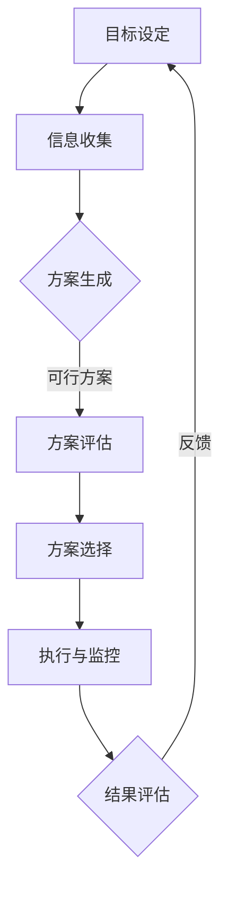
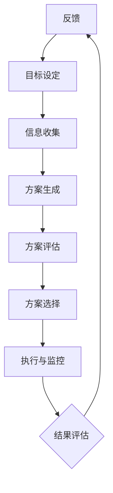
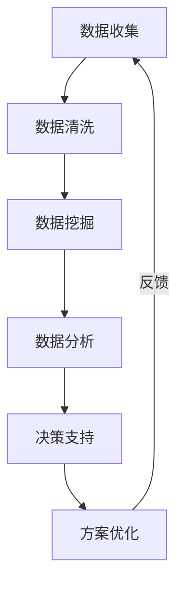
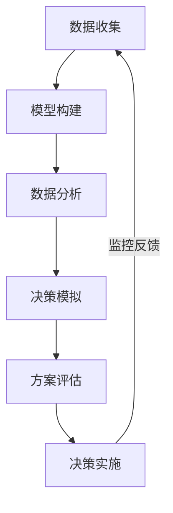
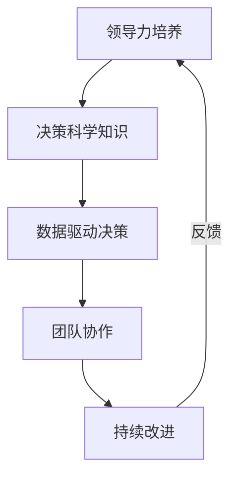

                 

### 引言

在当今快节奏、竞争激烈的社会环境中，决策科学的重要性愈发凸显。无论是在个人生活中还是在组织管理中，决策都扮演着至关重要的角色。尤其是在领导决策中，高质量的决策不仅能够提高组织的效率，还能确保企业在面对复杂多变的市场环境中保持竞争力。

#### 决策的定义与类型

决策，是指从多个可能的选项中，选择一个最优或最合适的选项的过程。根据决策的性质和目的，决策可以大致分为以下几种类型：

1. **程序化决策**：这类决策是针对重复性和结构化问题，通常依赖于预先设定的规则和标准来做出。
2. **非程序化决策**：这类决策涉及复杂的、非重复性问题，需要创造性地分析和解决。
3. **理性决策**：基于逻辑和分析，追求最大化效用和最小化损失。
4. **有限理性决策**：在时间和信息有限的情况下，决策者只能追求“足够好”的解决方案。

#### 领导决策的质量对组织的影响

领导决策的质量直接影响到组织的运行和长远发展。以下是一些关键影响：

1. **战略方向**：正确的决策能够确保组织在正确的方向上前进。
2. **资源分配**：决策的质量影响资源的有效利用，包括资金、人力和物资。
3. **风险控制**：决策的科学性能够帮助组织预见和规避潜在的风险。
4. **团队士气**：高质量的决策能够提高团队的士气和信任。

#### 本书的目标和结构

本书旨在系统地探讨决策科学，特别是领导决策的质量提升方法。具体目标如下：

1. **介绍决策科学的基础概念和理论**：帮助读者建立决策科学的基本认知。
2. **分析决策制定的过程**：深入探讨决策的各个阶段和关键要素。
3. **提供提高决策质量的方法和工具**：分享实战经验和技术手段。
4. **结合实际案例和领导实践**：通过案例分析，展示决策科学在真实环境中的应用。

本书的结构如下：

- **引言**：概述决策科学的重要性和本书的目标。
- **第1章 决策科学基础**：介绍决策的定义、类型和核心概念。
- **第2章 决策制定过程**：分析决策制定的过程、信息收集、方案评估等。
- **第3章 提高决策质量的方法**：探讨如何利用数据分析、算法提升决策质量。
- **第4章 决策科学工具与技术**：介绍决策支持系统、多准则决策分析等方法。
- **第5章 领导决策实践**：分析领导决策的特点、问题和挑战。
- **第6章 企业决策案例**：结合企业战略、运营、人力资源等决策进行讨论。
- **第7章 决策科学与领导力的结合**：探讨决策科学在领导力提升中的应用。

通过以上章节的逐步深入，读者将能够系统地了解决策科学，掌握提高领导决策质量的方法和技巧，从而在复杂多变的环境中做出更明智、更有效的决策。在接下来的章节中，我们将一步步展开详细讨论，为读者提供实用的决策科学知识。

## 第1章 决策科学基础

### 1.1 决策的定义与类型

决策是一个选择过程，其本质在于从多个可选方案中选出最符合目标需求的方案。在决策科学中，决策通常被定义为“在不确定性和多种选择中，选择一个最优或足够好的行动方案的过程”。决策类型可以根据其性质和特点进行分类，主要分为程序化决策和非程序化决策。

**程序化决策**通常涉及结构化和重复性问题，这类决策可以形成一套固定的决策规则和流程。例如，生产计划制定、库存管理等问题都可以通过程序化决策来解决。程序化决策的优势在于其稳定性和可预测性，但缺点在于面对复杂和动态环境时，灵活性不足。

**非程序化决策**则涉及复杂和不常见的问题，通常需要决策者进行深入分析和创新。例如，新产品开发、市场进入策略等问题都属于非程序化决策。非程序化决策的优势在于其灵活性和创新性，但缺点在于不确定性和风险较高。

### 1.2 决策科学的核心概念

决策科学是一套系统化的理论和方法，用于指导决策的制定和执行。其核心概念包括：

1. **目标设定**：明确决策的目标是决策科学的第一步。目标应具体、可衡量和可实现。
2. **信息收集**：在制定决策前，需要收集和整理与决策相关的信息。信息的质量和完整性直接影响到决策的科学性。
3. **方案生成**：根据目标和信息，生成多个可行的方案。方案的质量取决于其创新性和可行性。
4. **方案评估**：对每个方案进行评估，比较其优缺点和潜在风险。评估方法包括定量分析和定性分析。
5. **方案选择**：在评估的基础上，选择最优或足够好的方案。选择的标准可以是最大化利益、最小化损失、实现目标等。
6. **执行与监控**：决策一旦确定，需要执行并持续监控其效果。监控有助于及时发现问题和调整方案。

### 1.3 决策科学的发展历程

决策科学的发展历程可以追溯到20世纪中期，当时经济学和管理学开始关注决策问题。以下是决策科学发展历程中的几个关键阶段：

1. **古典决策理论**（20世纪40-50年代）：以贝叶斯决策和期望效用理论为基础，强调理性决策和最大化期望效用。
2. **有限理性决策理论**（20世纪60年代）：由赫伯特·西蒙提出，认为人在决策过程中存在认知限制，追求“足够好”的解决方案。
3. **多准则决策理论**（20世纪70年代）：涉及多个目标或准则的决策问题，强调综合评价和权衡。
4. **行为决策理论**（20世纪80年代）：研究人在决策过程中的心理和行为因素，如偏见、情绪等。
5. **大数据与人工智能决策**（21世纪）：利用大数据和人工智能技术，实现自动化和智能化决策。

### 1.4 决策框架的Mermaid流程图

为了更好地理解决策过程，可以使用Mermaid流程图来展示决策框架。以下是决策框架的Mermaid表示：



- **目标设定**：明确决策的目标。
- **信息收集**：收集与决策相关的信息。
- **方案生成**：生成多个可行的方案。
- **方案评估**：评估每个方案的优缺点和风险。
- **方案选择**：选择最优或足够好的方案。
- **执行与监控**：执行决策并监控效果。
- **结果评估**：评估决策结果，提供反馈。

### 1.5 决策模型分类

在决策科学中，常见的决策模型可以分为以下几类：

1. **确定型决策模型**：在所有参数和条件都是已知和确定的情境下，使用线性规划、整数规划等方法进行决策。
2. **风险型决策模型**：在不确定条件下，使用概率论和统计方法进行决策，如贝叶斯决策、期望效用理论等。
3. **不确定型决策模型**：在完全不确定的条件下，使用乐观原则、悲观原则等定性方法进行决策。

通过了解这些决策模型，决策者可以根据具体情况选择合适的决策方法，以提高决策的科学性和有效性。

### 总结

本章介绍了决策科学的定义、类型、核心概念、发展历程以及决策框架的Mermaid流程图。决策科学不仅是一种理论，更是一种实践，它能够帮助决策者在复杂和不确定的环境中做出更明智的选择。在接下来的章节中，我们将深入探讨决策制定的过程、提高决策质量的方法和技术，以及领导决策的实践应用。

## 第2章 决策制定过程

### 2.1 决策制定的过程

决策制定是一个系统化的过程，通常包括以下几个关键步骤：

1. **问题识别**：识别和定义决策问题。问题识别是决策过程的起点，明确问题类型和范围。
2. **目标设定**：确定决策的目标和预期成果。明确的目标有助于引导后续的决策过程。
3. **信息收集**：收集与决策相关的信息。信息的质量和完整性直接影响到决策的科学性。
4. **方案生成**：根据目标和信息，生成多个可行的方案。方案的数量和质量取决于决策问题的复杂程度。
5. **方案评估**：对每个方案进行评估，比较其优缺点和潜在风险。评估方法包括定量分析和定性分析。
6. **方案选择**：在评估的基础上，选择最优或足够好的方案。选择的标准可以是最大化利益、最小化损失、实现目标等。
7. **执行与监控**：执行决策并持续监控其效果。监控有助于及时发现问题和调整方案。

### 2.2 信息收集与分析

信息收集是决策制定过程中的重要环节。准确和全面的信息有助于决策者更好地理解问题，评估各个方案。以下是一些关键步骤：

1. **数据收集**：通过调研、访谈、问卷等方式，收集与决策相关的数据。
2. **数据分析**：使用统计学和数据分析方法，对收集到的数据进行处理和分析。常见的分析方法包括回归分析、聚类分析、决策树等。
3. **信息筛选**：从大量的数据中筛选出对决策有用的信息。信息筛选应基于决策目标，确保信息的准确性和相关性。
4. **信息整合**：将来自不同来源的信息进行整合，形成完整的决策信息基础。

### 2.3 选择方案与评估

方案选择是决策过程中的核心步骤，涉及到多个可行方案的评价和比较。以下是一些关键步骤：

1. **方案生成**：根据目标和信息，生成多个可行的方案。方案的数量和质量取决于决策问题的复杂程度。
2. **方案评估**：对每个方案进行评估，比较其优缺点和潜在风险。评估方法包括定量分析和定性分析。
   - **定量分析**：使用数据驱动的评估方法，如成本效益分析、风险评估等。
   - **定性分析**：通过专家评估、问卷调查、访谈等方法，从定性角度评估方案。
3. **多准则决策分析**：当决策问题涉及多个目标和准则时，使用多准则决策分析方法进行综合评价和权衡。
4. **方案选择**：在评估的基础上，选择最优或足够好的方案。选择的标准可以是最大化利益、最小化损失、实现目标等。

### 2.4 决策制定中的心理因素

心理因素在决策过程中扮演着重要角色，可能对决策质量产生显著影响。以下是一些关键心理因素：

1. **确认偏误**：决策者倾向于接受支持自己已有观点的信息，而忽视反对意见。
2. **过度自信**：决策者可能高估自己的知识和能力，从而导致决策偏差。
3. **情绪影响**：情绪状态可能影响决策者的判断和选择，例如，焦虑可能导致风险回避。
4. **群体思维**：在团体决策中，个体可能因追求一致而放弃独立思考，从而导致决策质量下降。

### 2.5 决策制定的Mermaid流程图

为了更好地理解决策制定过程，可以使用Mermaid流程图来展示各步骤之间的关系。以下是决策制定过程的Mermaid表示：



- **问题识别**：识别和定义决策问题。
- **目标设定**：确定决策的目标和预期成果。
- **信息收集**：收集与决策相关的信息。
- **方案生成**：生成多个可行的方案。
- **方案评估**：评估每个方案的优缺点和潜在风险。
- **方案选择**：选择最优或足够好的方案。
- **执行与监控**：执行决策并持续监控其效果。
- **结果评估**：评估决策结果，提供反馈。

通过以上流程，决策者可以系统地制定和执行决策，确保决策的科学性和有效性。

### 总结

本章详细阐述了决策制定的过程，包括问题识别、目标设定、信息收集与分析、方案生成、方案评估、方案选择以及执行与监控。此外，还讨论了决策制定中的心理因素，如确认偏误、过度自信、情绪影响和群体思维。通过理解这些步骤和因素，决策者可以更有效地制定决策，提高决策质量。在接下来的章节中，我们将探讨如何利用数据分析、算法和工具来进一步提高决策质量。

## 第3章 提高决策质量的方法

### 3.1 决策质量评估标准

提高决策质量是决策科学的核心目标之一。为了有效评估决策质量，需要明确评估标准。以下是常用的决策质量评估标准：

1. **准确性**：决策结果的准确性是衡量决策质量的首要标准。准确的决策能够确保组织目标的实现。
2. **一致性**：决策在相似情境下的结果应保持一致性。一致性的决策有助于建立组织的可靠性和公信力。
3. **可靠性**：决策的可靠性指的是在多次重复决策过程中，结果的一致性和稳定性。
4. **效率**：决策的效率是指决策过程的速度和成本。高效的决策能够节省资源，提高组织的运作效率。
5. **适应性**：决策的适应性指的是在动态和不确定的环境中，决策能够灵活调整和适应新情况。
6. **可理解性**：决策结果应清晰易懂，使相关人员能够理解和执行。

### 3.2 数据驱动的决策

数据驱动的决策是指利用大数据和分析技术来指导决策过程。这种方法能够提高决策的科学性和准确性，以下是数据驱动决策的关键步骤：

1. **数据收集**：收集与决策相关的数据，包括内部数据和外部数据。内部数据可能来自组织的历史记录、财务报表等；外部数据可能来自市场研究、竞争分析等。
2. **数据清洗**：对收集到的数据进行清洗和预处理，确保数据的准确性和一致性。数据清洗包括去除重复数据、填补缺失值、修正错误等。
3. **数据挖掘**：使用数据挖掘技术，从大量数据中提取有价值的信息和模式。常见的数据挖掘技术包括回归分析、聚类分析、关联规则分析等。
4. **数据分析**：对挖掘出的数据进行分析，以识别趋势、预测未来和评估决策效果。数据分析方法包括时间序列分析、机器学习、统计分析等。
5. **决策支持**：基于数据分析结果，为决策者提供支持。这包括生成可视化报表、预测模型和决策建议。

### 3.3 利用数据分析提升决策质量

数据分析是提高决策质量的重要手段。以下是一些具体的方法和工具：

1. **回归分析**：用于分析自变量和因变量之间的关系，帮助预测和评估决策效果。
   - **伪代码**：
     ```python
     # 线性回归分析
     y = b0 + b1 * x + ε
     # 模型拟合
     b0, b1 = linear_regression(x, y)
     # 预测
     y_pred = b0 + b1 * x_new
     ```

2. **聚类分析**：用于将数据分组，识别相似的数据点，有助于发现数据中的模式。
   - **伪代码**：
     ```python
     # K-means聚类
     clusters = k_means(data, K)
     # 聚类结果
     print(clusters)
     ```

3. **决策树**：用于分类和回归问题，通过树形结构展示决策过程，有助于理解和解释决策。
   - **伪代码**：
     ```python
     # 决策树构建
     tree = decision_tree(training_data, target_attribute)
     # 决策应用
     print(tree.predict(test_data))
     ```

4. **机器学习**：利用机器学习算法，从数据中学习模式和规律，提高决策的预测能力和适应性。
   - **伪代码**：
     ```python
     # 机器学习算法
     model = machine_learning_algorithm(training_data, target_attribute)
     # 模型评估
     accuracy = model.evaluate(test_data)
     ```

### 3.4 决策质量提升的算法原理

提高决策质量的方法不仅依赖于数据分析，还涉及到算法原理的应用。以下是一些关键算法原理：

1. **启发式算法**：通过迭代和搜索，逐步优化决策方案。常见的启发式算法包括遗传算法、蚁群算法等。
   - **伪代码**：
     ```python
     # 启发式算法
     solution = heuristic_algorithm(problem)
     # 迭代优化
     solution = heuristic_algorithm(solution, problem)
     ```

2. **模拟退火算法**：通过模拟物理退火过程，逐步优化决策方案，避免陷入局部最优。
   - **伪代码**：
     ```python
     # 模拟退火算法
     solution = initial_solution(problem)
     temperature = initial_temp
     while temperature > threshold:
         neighbor = neighbor_solution(solution, problem)
         if acceptance_probability(solution, neighbor, temperature) > random_value:
             solution = neighbor
         temperature = cooling_function(temperature)
     ```

3. **贝叶斯网络**：用于表示和处理不确定性决策问题，通过概率关系进行推理和决策。
   - **伪代码**：
     ```python
     # 贝叶斯网络
     belief_network = build_bayesian_network(data)
     query = query_bayesian_network(belief_network, evidence)
     probability = belief_network.query(query)
     ```

### 3.5 决策质量提升的方法Mermaid流程图

为了更好地展示决策质量提升的方法，可以使用Mermaid流程图来表示各步骤之间的关系。以下是决策质量提升方法的Mermaid表示：



- **数据收集**：收集与决策相关的数据。
- **数据清洗**：清洗和预处理数据。
- **数据挖掘**：提取有价值的信息和模式。
- **数据分析**：分析数据，识别趋势和模式。
- **决策支持**：提供决策建议和支持。
- **方案优化**：根据分析结果优化决策方案。
- **反馈**：评估决策效果，提供反馈以进行进一步优化。

通过以上方法，决策者可以系统地提高决策质量，确保在复杂和不确定的环境中做出更明智的决策。在接下来的章节中，我们将进一步探讨决策科学工具与技术，以及如何将这些方法应用于领导决策实践。

### 3.6 数据驱动的决策案例分析

为了更好地理解数据驱动的决策方法，以下是一个具体的案例：

**背景**：某电子商务公司希望优化其库存管理策略，以减少库存成本并提高销售额。

**步骤**：

1. **数据收集**：公司收集了过去一年的销售数据、库存水平、客户反馈等信息。
2. **数据清洗**：清洗数据，去除重复和错误信息，确保数据的准确性和一致性。
3. **数据挖掘**：使用聚类分析，将客户分为不同的群体，分析不同群体的购买行为和偏好。
4. **数据分析**：通过回归分析，识别影响销售额的关键因素，如产品类型、价格、库存水平等。
5. **决策支持**：基于数据分析结果，公司制定了新的库存管理策略，如动态调整库存水平、优化价格策略等。
6. **方案优化**：实施新策略后，公司持续监控库存成本和销售额的变化，通过进一步的数据分析优化策略。
7. **反馈**：经过一年的实施，库存成本显著降低，销售额提高了20%，公司得到了积极的反馈，并决定继续优化和改进库存管理策略。

**总结**：通过数据驱动的决策方法，公司能够更准确地识别和解决问题，制定出更有效的库存管理策略，从而在激烈的市场竞争中保持优势。此案例展示了数据驱动的决策方法在实际应用中的显著效果。

### 3.7 最佳实践 tips

为了确保决策质量的提升，以下是一些建议和最佳实践：

1. **数据驱动，但不数据依赖**：在决策过程中，数据是非常重要的，但不应过度依赖数据。决策者需要结合自身的经验和直觉，以及数据提供的支持，做出综合判断。
2. **持续更新数据**：数据环境是动态变化的，决策者需要定期更新数据，以确保数据的准确性和时效性。
3. **采用多准则决策分析**：在评估方案时，应考虑多个准则和目标，避免片面追求单一目标，如仅关注成本或仅关注销售额。
4. **建立反馈机制**：决策实施后，应建立反馈机制，及时评估决策效果，并进行调整和优化。
5. **培养数据分析能力**：组织应投资于数据分析能力和工具的培训，确保决策者能够有效地利用数据做出高质量决策。
6. **跨部门合作**：决策涉及多个部门和职能，应建立跨部门合作机制，确保信息的共享和决策的一致性。

通过遵循这些最佳实践，决策者可以更有效地提高决策质量，确保组织在复杂多变的环境中保持竞争力。

### 总结

本章详细探讨了提高决策质量的方法，包括决策质量评估标准、数据驱动的决策方法、数据分析算法和实际案例分析。通过理解这些方法，决策者可以更科学地制定和执行决策，确保在复杂和不确定的环境中做出最优选择。在接下来的章节中，我们将进一步探讨决策科学工具与技术，以及如何将决策科学应用于领导决策实践。

## 第4章 决策科学工具与技术

### 4.1 决策支持系统

决策支持系统（Decision Support System，简称DSS）是一种基于计算机技术，辅助决策者进行决策的工具。DSS通过集成各种数据源、模型和算法，为决策者提供全面、准确和及时的决策信息。

**核心功能**：

1. **数据集成**：DSS能够从多个数据源（如数据库、文件系统、互联网等）收集和整合数据，提供统一的视图。
2. **模型构建**：DSS提供各种模型构建工具，支持线性规划、非线性规划、决策树、神经网络等模型的构建和优化。
3. **数据分析**：DSS通过数据分析工具，支持数据挖掘、统计分析、回归分析等，帮助决策者深入分析数据。
4. **决策模拟**：DSS允许决策者模拟不同的决策方案，预测其结果，评估风险和收益。
5. **决策建议**：DSS基于分析结果，为决策者提供决策建议和推荐方案。

**应用场景**：

- **企业战略规划**：帮助企业制定长期战略，如市场进入策略、产品开发计划等。
- **运营管理**：支持库存管理、生产规划、供应链优化等运营决策。
- **财务决策**：辅助财务决策，如投资分析、风险管理、预算制定等。
- **人力资源决策**：支持招聘、培训、绩效评估等人力资源决策。

### 4.2 多准则决策分析方法

多准则决策分析（Multi-Criteria Decision Analysis，简称MCDA）是一种系统化的方法，用于处理涉及多个目标和准则的决策问题。MCDA通过综合评估多个准则，帮助决策者在复杂情境中做出最优选择。

**核心概念**：

1. **目标与准则**：决策问题涉及多个目标，每个目标可以进一步分解为若干准则。
2. **权重分配**：根据决策目标的重要性和相关性，为每个准则分配权重。
3. **方案评估**：对每个方案进行评估，计算其在各个准则上的得分。
4. **综合评估**：通过加权平均或其他方法，综合评估每个方案的整体表现。

**常用方法**：

1. **加权评分法**：将每个准则的得分乘以其权重，然后求和，得到方案的综合得分。
   - **伪代码**：
     ```python
     score = sum(weight * criterion_score)
     ```

2. **多属性效用理论**：通过构建多属性效用函数，将不同属性的得分转换为效用值，然后进行综合评估。
   - **伪代码**：
     ```python
     utility = U(criterion1_score, criterion2_score, ...)
     ```

3. **偏好排序法**：通过专家评估或问卷调查，为方案进行排序，然后根据排序结果进行综合评估。

### 4.3 风险分析与应对策略

在决策过程中，风险分析是不可或缺的一环。通过识别、评估和应对风险，决策者可以降低不确定性，确保决策的稳健性。

**核心概念**：

1. **风险识别**：识别决策过程中可能面临的风险，包括市场风险、操作风险、财务风险等。
2. **风险评估**：对识别出的风险进行评估，确定其可能性和影响。
3. **风险应对**：根据风险评估结果，制定应对策略，如风险规避、风险转移、风险接受等。

**常用方法**：

1. **风险矩阵**：使用风险矩阵，将风险的可能性和影响进行量化，帮助决策者优先应对高风险。
2. **敏感性分析**：通过分析变量变化对决策结果的影响，识别关键变量和敏感因素。
3. **决策树分析**：使用决策树，展示不同决策路径和相应的风险和收益。

### 4.4 决策科学工具的应用实践

为了更好地展示决策科学工具的应用，以下是一个实际案例：

**背景**：某公司在扩张过程中，需要在两个城市A和B之间选择一个进行市场进入。

**步骤**：

1. **数据收集**：收集两个城市的市场潜力、竞争环境、政策支持等相关数据。
2. **模型构建**：使用多准则决策分析方法，建立决策模型，包括市场潜力、竞争环境、成本效益等准则。
3. **数据分析**：通过数据分析工具，计算每个城市在不同准则上的得分。
4. **决策模拟**：使用决策支持系统，模拟不同决策路径的结果，评估风险和收益。
5. **方案评估**：根据评估结果，选择最优或足够好的方案，制定市场进入策略。
6. **决策实施**：实施决策，监控市场表现，并根据实际情况进行调整。

**总结**：通过应用决策科学工具，公司能够系统、全面地分析市场进入策略，降低决策风险，确保市场进入的成功。

### 4.5 决策科学工具的Mermaid流程图

为了更好地展示决策科学工具的应用流程，可以使用Mermaid流程图来表示各步骤之间的关系。以下是决策科学工具的应用流程Mermaid表示：



- **数据收集**：收集与决策相关的数据。
- **模型构建**：构建决策模型，包括多准则决策分析等。
- **数据分析**：分析数据，计算各准则的得分。
- **决策模拟**：模拟决策路径，评估风险和收益。
- **方案评估**：评估方案，选择最优或足够好的方案。
- **决策实施**：实施决策，并监控市场表现。
- **监控反馈**：根据实际情况进行反馈和调整。

通过以上流程，决策者可以系统地应用决策科学工具，确保决策的科学性和有效性。

### 总结

本章详细介绍了决策支持系统、多准则决策分析方法、风险分析与应对策略以及实际应用案例。通过理解这些工具和技术，决策者可以更科学、更有效地进行决策，确保在复杂和不确定的环境中做出最优选择。在接下来的章节中，我们将进一步探讨领导决策实践，以及如何将决策科学应用于实际工作中。

### 第5章 领导决策实践

#### 5.1 领导决策的特点

领导决策是指在组织管理中，领导者为了实现组织目标而进行的决策。与普通决策相比，领导决策具有以下特点：

1. **战略性**：领导决策通常涉及组织的长期目标和战略规划，需要从全局视角进行思考和决策。
2. **复杂性**：领导决策面对的问题往往更加复杂，涉及多个目标和多个利益相关者，需要综合考虑各种因素。
3. **不确定性**：领导决策往往在不确定的环境中进行，决策者需要应对未知的风险和变化。
4. **权威性**：领导决策具有权威性，决策结果直接影响组织的运作和员工的行动。
5. **影响力**：领导决策不仅影响组织的运作，还会对员工的心态和行为产生深远影响。

#### 5.2 领导决策中的问题与挑战

领导决策过程中可能会面临各种问题和挑战，以下是一些常见的问题和挑战：

1. **信息不完整或质量不高**：领导决策依赖于准确和全面的信息，但实际中信息可能不完整或不准确，导致决策质量下降。
2. **时间压力**：领导决策往往需要在短时间内做出，时间压力可能限制决策者深入分析和思考。
3. **心理因素**：领导决策者可能会受到个人情绪、偏见和认知限制的影响，导致决策偏差。
4. **群体决策中的问题**：领导决策往往涉及多人参与，可能面临群体思维、决策效率低下等问题。
5. **执行力不足**：即使决策质量高，如果执行力不足，也无法实现预期目标。

#### 5.3 领导决策的案例研究

为了更好地理解领导决策的实践，以下是一个领导决策的案例研究：

**案例背景**：某大型科技公司在全球金融危机期间面临严重财务危机，公司高管团队需要做出决策以应对危机。

**决策过程**：

1. **问题识别**：公司高管团队明确了财务危机的严重性，并识别出需要解决的问题，包括削减成本、优化运营和调整战略。
2. **信息收集**：高管团队收集了公司内部和外部的大量信息，包括财务报表、市场分析、竞争情况等。
3. **方案生成**：基于信息和目标，高管团队提出了多个可能的解决方案，包括裁员、关闭部分业务、合作并购等。
4. **方案评估**：高管团队对每个方案进行了详细评估，考虑了成本、收益、风险和可行性。
5. **方案选择**：综合考虑各方意见，高管团队选择了裁员和关闭部分业务这两个方案，认为这能够在短期内降低成本，并为未来的发展奠定基础。
6. **执行与监控**：高管团队制定了详细的执行计划，并设立了监控机制，确保决策得到有效实施。

**决策结果**：通过严格的执行和监控，公司成功地度过了财务危机，实现了成本的显著降低，并逐步恢复了市场竞争力。

#### 5.4 领导决策的数学模型与公式（LaTeX格式）

为了更科学地分析领导决策，可以使用数学模型和公式来描述决策过程。以下是一些常见的数学模型和公式：

$$
\text{成本函数} = C(x) = f_1(x_1) + f_2(x_2) + \ldots + f_n(x_n)
$$

$$
\text{收益函数} = R(x) = g_1(x_1) + g_2(x_2) + \ldots + g_n(x_n)
$$

$$
\text{风险度量} = \sigma^2 = \frac{1}{n-1} \sum_{i=1}^{n} (r_i - \bar{r})^2
$$

其中，$C(x)$和$R(x)$分别表示成本函数和收益函数，$f_i(x_i)$和$g_i(x_i)$分别表示每个准则的函数，$r_i$为第$i$个方案的收益，$\bar{r}$为平均收益，$\sigma^2$为风险度量。

#### 5.5 领导决策的实战指导

为了在领导决策中取得成功，以下是一些建议和实战指导：

1. **建立有效的信息收集系统**：确保信息的及时、准确和全面，为决策提供坚实的基础。
2. **进行多角度分析**：从多个角度对问题进行分析，避免片面和偏见的决策。
3. **制定详细的执行计划**：确保决策能够得到有效实施，并设立监控机制，及时调整和优化。
4. **培养团队合作精神**：领导决策往往涉及多人参与，需要建立有效的团队合作机制，确保决策的科学性和执行力。
5. **持续学习和改进**：领导决策是一个持续的过程，需要不断学习和改进，以适应不断变化的环境和需求。

### 总结

领导决策在组织管理中起着至关重要的作用。本章通过分析领导决策的特点、问题与挑战，以及实际案例研究，提供了领导决策的实战指导。通过理解这些内容，领导者可以更科学、更有效地进行决策，确保组织在复杂多变的环境中保持竞争力。在接下来的章节中，我们将进一步探讨企业决策的实际应用，以及如何将决策科学应用于企业运营。

### 第6章 企业决策案例

#### 6.1 企业战略决策

企业战略决策是企业长远发展的关键，涉及到企业在市场中的定位、业务模式、资源配置等方面。以下是一些企业战略决策的实际案例：

**案例1：亚马逊的全球扩张**

**背景**：亚马逊自成立以来，一直致力于全球市场的扩张，以实现业务的持续增长。

**决策过程**：

1. **目标设定**：亚马逊确定了全球扩张的目标，包括进入新市场、扩大产品线、提升服务品质等。
2. **信息收集**：公司收集了全球市场的数据，包括市场潜力、竞争环境、政策法规等。
3. **方案生成**：基于信息和目标，亚马逊提出了多个扩张方案，如在欧洲、日本、印度等市场开设本地网站、建立物流网络等。
4. **方案评估**：对每个方案进行了详细评估，考虑了成本、收益、风险等因素。
5. **方案选择**：综合考虑各方意见，亚马逊选择了在多个市场同时推进扩张方案。
6. **执行与监控**：亚马逊制定了详细的执行计划，并通过监控机制确保决策的有效实施。

**决策结果**：亚马逊的全球扩张取得了显著成功，不仅实现了业务的快速增长，还在全球市场中建立了强大的品牌影响力。

**案例2：阿里巴巴的新业务拓展**

**背景**：阿里巴巴在电商市场取得成功后，开始探索新的业务领域，以实现多元化发展。

**决策过程**：

1. **目标设定**：阿里巴巴确定了拓展新业务的目标，包括云计算、数字娱乐、金融科技等。
2. **信息收集**：公司收集了相关市场的研究报告、竞争对手分析、政策法规等信息。
3. **方案生成**：基于信息和目标，阿里巴巴提出了多个新业务方案，如投资云计算公司、推出数字娱乐平台、开展金融科技服务等。
4. **方案评估**：对每个方案进行了详细评估，考虑了市场需求、技术实现、资金投入等因素。
5. **方案选择**：综合考虑各方意见，阿里巴巴选择了云计算和金融科技作为优先发展的新业务领域。
6. **执行与监控**：阿里巴巴制定了详细的执行计划，并通过监控机制确保新业务的顺利发展。

**决策结果**：阿里巴巴的新业务拓展取得了显著成效，云计算和金融科技已成为公司的核心业务，为公司带来了新的增长点。

#### 6.2 运营决策

运营决策涉及企业的日常运营活动，包括生产计划、库存管理、供应链优化等方面。以下是一些运营决策的实际案例：

**案例1：丰田的精益生产**

**背景**：丰田汽车以其精益生产系统著称，该系统在运营管理中发挥了重要作用。

**决策过程**：

1. **目标设定**：丰田确定了提高生产效率、降低成本的目标。
2. **信息收集**：公司收集了生产流程的数据，包括生产效率、成本、库存水平等。
3. **方案生成**：基于信息和目标，丰田提出了多个运营优化方案，如减少浪费、优化生产流程、提高设备利用率等。
4. **方案评估**：对每个方案进行了详细评估，考虑了成本、效率、可行性等因素。
5. **方案选择**：综合考虑各方意见，丰田选择了精益生产方案。
6. **执行与监控**：丰田制定了详细的执行计划，并通过监控机制确保精益生产系统的有效实施。

**决策结果**：丰田的精益生产系统显著提高了生产效率和产品质量，降低了成本，成为行业标杆。

**案例2：亚马逊的仓储物流优化**

**背景**：亚马逊的仓储物流是其成功的关键之一，公司在仓储物流优化方面进行了大量投入。

**决策过程**：

1. **目标设定**：亚马逊确定了提高仓储物流效率、降低配送成本的目标。
2. **信息收集**：公司收集了仓储物流的数据，包括库存周转率、配送时间、配送成本等。
3. **方案生成**：基于信息和目标，亚马逊提出了多个仓储物流优化方案，如自动化仓储系统、智能配送网络、实时库存管理等。
4. **方案评估**：对每个方案进行了详细评估，考虑了成本、效率、可行性等因素。
5. **方案选择**：综合考虑各方意见，亚马逊选择了自动化仓储系统和智能配送网络作为优化方案。
6. **执行与监控**：亚马逊制定了详细的执行计划，并通过监控机制确保仓储物流优化的有效实施。

**决策结果**：亚马逊的仓储物流优化取得了显著成效，配送效率提高了30%，配送成本降低了20%，客户满意度显著提升。

#### 6.3 人力资源决策

人力资源决策涉及企业的人力资源管理，包括招聘、培训、绩效评估等方面。以下是一些人力资源决策的实际案例：

**案例1：华为的人才引进策略**

**背景**：华为在全球范围内招聘顶尖人才，以保持其技术领先地位。

**决策过程**：

1. **目标设定**：华为确定了吸引顶尖人才的目标，包括提供有竞争力的薪酬福利、良好的工作环境等。
2. **信息收集**：公司收集了市场人才供需数据、行业人才流动情况等。
3. **方案生成**：基于信息和目标，华为提出了多个人才引进方案，如全球招聘、人才储备计划、人才激励等。
4. **方案评估**：对每个方案进行了详细评估，考虑了成本、效果、可行性等因素。
5. **方案选择**：综合考虑各方意见，华为选择了全球招聘和人才储备计划作为主要的人才引进策略。
6. **执行与监控**：华为制定了详细的执行计划，并通过监控机制确保人才引进策略的有效实施。

**决策结果**：华为通过全球招聘和人才储备计划，成功吸引了大量顶尖人才，为公司的发展提供了强有力的支持。

**案例2：谷歌的员工福利政策**

**背景**：谷歌以其优厚的员工福利政策著称，这些政策在人力资源管理中发挥了重要作用。

**决策过程**：

1. **目标设定**：谷歌确定了提升员工满意度和工作效率的目标。
2. **信息收集**：公司收集了员工满意度调查数据、行业员工福利水平等。
3. **方案生成**：基于信息和目标，谷歌提出了多个员工福利方案，如弹性工作时间、健康体检、员工培训等。
4. **方案评估**：对每个方案进行了详细评估，考虑了成本、效果、可行性等因素。
5. **方案选择**：综合考虑各方意见，谷歌选择了弹性工作时间、健康体检和员工培训作为主要的福利政策。
6. **执行与监控**：谷歌制定了详细的执行计划，并通过监控机制确保员工福利政策的有效实施。

**决策结果**：谷歌的员工福利政策显著提升了员工满意度和工作效率，为公司的发展创造了良好的氛围。

#### 6.4 市场营销决策

市场营销决策涉及企业的市场定位、产品定价、促销活动等方面。以下是一些市场营销决策的实际案例：

**案例1：苹果的产品定价策略**

**背景**：苹果以其独特的产品定价策略在市场中取得了成功。

**决策过程**：

1. **目标设定**：苹果确定了提升产品品牌价值、增加市场份额的目标。
2. **信息收集**：公司收集了市场调研数据、竞争对手价格策略等。
3. **方案生成**：基于信息和目标，苹果提出了多个产品定价方案，如高端定价、差异化定价等。
4. **方案评估**：对每个方案进行了详细评估，考虑了市场需求、竞争环境、成本等因素。
5. **方案选择**：综合考虑各方意见，苹果选择了高端定价策略。
6. **执行与监控**：苹果制定了详细的执行计划，并通过监控机制确保产品定价策略的有效实施。

**决策结果**：苹果的高端定价策略成功提升了品牌价值，吸引了高端消费者，市场份额显著增加。

**案例2：宝洁的品牌推广策略**

**背景**：宝洁通过有效的品牌推广策略，提升了品牌知名度和市场份额。

**决策过程**：

1. **目标设定**：宝洁确定了提升品牌知名度、增加市场份额的目标。
2. **信息收集**：公司收集了市场调研数据、消费者行为分析等。
3. **方案生成**：基于信息和目标，宝洁提出了多个品牌推广方案，如广告宣传、促销活动、社交媒体营销等。
4. **方案评估**：对每个方案进行了详细评估，考虑了成本、效果、可行性等因素。
5. **方案选择**：综合考虑各方意见，宝洁选择了广告宣传和促销活动作为主要的品牌推广策略。
6. **执行与监控**：宝洁制定了详细的执行计划，并通过监控机制确保品牌推广策略的有效实施。

**决策结果**：宝洁的品牌推广策略成功提升了品牌知名度，增加了市场份额，品牌影响力显著提升。

#### 6.5 企业决策案例分析

通过上述案例，我们可以看到企业在不同决策领域如何应用决策科学，实现目标的实现。以下是对这些案例的分析和总结：

1. **战略决策**：企业通过科学的目标设定、信息收集和方案评估，制定出符合市场需求的战略方案，确保企业的长远发展。
2. **运营决策**：企业通过精益生产、自动化仓储等优化方案，提高运营效率，降低成本，提升竞争力。
3. **人力资源决策**：企业通过全球招聘、员工福利等策略，吸引和留住人才，提升员工满意度和工作效率。
4. **市场营销决策**：企业通过产品定价、品牌推广等策略，提升品牌价值，增加市场份额，实现市场目标。

这些案例表明，企业决策不仅需要科学的方法和工具，还需要灵活应对市场变化，不断调整和优化决策策略，以实现持续发展和竞争优势。

### 总结

本章通过分析企业战略决策、运营决策、人力资源决策和市场营销决策的实际案例，展示了企业如何应用决策科学，制定出科学、有效的决策方案。通过理解这些案例，读者可以更好地掌握企业决策的方法和实践，为自身企业的发展提供有益的借鉴。

### 第7章 决策科学与领导力的结合

#### 7.1 领导力与决策能力的关系

领导力与决策能力之间存在着密切的联系。一个成功的领导者不仅需要有愿景和目标，还需要具备出色的决策能力。决策能力是领导力的重要组成部分，决定了领导者在面对复杂情境时的应对策略和行动方向。

**关键点**：

1. **战略思维**：领导者需要具备战略思维，能够从全局视角看待问题，制定长期目标，并做出符合组织利益的决策。
2. **风险评估**：领导者需要具备评估风险的能力，能够识别潜在的风险，并制定相应的应对措施。
3. **信息整合**：领导者需要能够整合和分析信息，利用数据支持决策，避免信息孤岛和决策失误。
4. **果断行动**：领导者需要在关键时刻做出决策，并果断行动，确保决策的有效实施。

#### 7.2 提升领导决策质量的策略

为了提升领导决策质量，领导者可以采取以下策略：

1. **增强数据分析能力**：领导者应加强数据分析能力的培养，利用数据驱动决策，减少决策中的不确定性。
2. **建立科学的决策流程**：领导者应建立一套科学的决策流程，包括信息收集、方案评估、方案选择等环节，确保决策的科学性和系统性。
3. **培养团队协作能力**：领导者应培养团队成员的协作能力，通过团队讨论和集体决策，减少个人偏见和决策失误。
4. **持续学习与反思**：领导者应持续学习新的决策理论和工具，不断反思和优化决策过程，提高决策质量。

#### 7.3 领导决策中的团队协作

团队协作在领导决策中起着至关重要的作用。一个高效的团队可以提供多元化的视角和建议，提高决策的质量和可行性。以下是一些团队协作的关键点：

1. **明确目标**：确保团队成员对决策目标有清晰的理解，减少目标不一致带来的冲突。
2. **角色分工**：根据团队成员的技能和专长，明确各自的角色和职责，确保决策过程的顺利进行。
3. **透明沟通**：建立透明的沟通机制，确保信息能够及时、准确地传达，减少误解和误判。
4. **鼓励创新**：鼓励团队成员提出新的想法和方案，通过讨论和评估，选择最优的决策方案。

#### 7.4 决策质量提升的持续改进

提升决策质量是一个持续的过程，需要领导者不断地进行改进和优化。以下是一些持续改进的方法：

1. **定期回顾**：领导者应定期回顾决策结果，评估决策效果，总结经验教训，为后续决策提供参考。
2. **反馈机制**：建立有效的反馈机制，收集团队成员和外部专家的意见，及时调整和优化决策过程。
3. **培训与学习**：定期组织决策培训和学习活动，提升团队成员的决策能力和水平。
4. **利用新技术**：利用大数据、人工智能等新技术，提高决策的科学性和效率。

#### 7.5 决策科学与领导力的结合流程图

为了更好地展示决策科学与领导力的结合，可以使用Mermaid流程图来表示各步骤之间的关系。以下是决策科学与领导力的结合流程图：



- **领导力培养**：领导者需要培养决策能力和战略思维。
- **决策科学知识**：领导者需要掌握决策科学的基本理论和工具。
- **数据驱动决策**：领导者应利用数据进行分析和决策。
- **团队协作**：领导者应建立高效的团队协作机制。
- **持续改进**：领导者应不断反思和优化决策过程。
- **反馈**：通过反馈机制，持续提升决策质量和领导力。

通过以上步骤，领导者可以系统地提升决策质量，确保在复杂多变的环境中做出最优选择。

### 总结

本章详细探讨了决策科学与领导力的结合，分析了领导力与决策能力的关系，提出了提升领导决策质量的策略，并介绍了团队协作和持续改进的重要性。通过理解这些内容，领导者可以更有效地结合决策科学和领导力，提高决策质量，确保组织在激烈的市场竞争中取得成功。在未来的领导实践中，领导者应不断学习和应用这些方法，不断提升自身的决策能力和领导水平。

## 结论

决策科学作为一门系统化的学科，在组织管理和领导决策中具有重要作用。通过本章的详细探讨，我们了解到决策科学不仅包括决策的基本概念和类型，还涉及到决策制定的过程、提高决策质量的方法、决策科学工具和技术，以及领导决策实践的实际应用。以下是本文的核心总结和展望：

### 核心总结

1. **决策科学与领导力的结合**：决策科学提供了理论和方法，帮助领导者更好地理解决策过程，提升决策质量。领导力则通过战略思维、风险评估和团队协作，确保决策能够有效实施。

2. **数据驱动的决策**：在当前大数据和人工智能时代，数据驱动的决策方法越来越受到重视。领导者应充分利用数据分析和算法，提高决策的准确性和效率。

3. **多准则决策分析**：在面对涉及多个目标和准则的复杂决策时，多准则决策分析能够提供综合评估和权衡，帮助领导者做出最优选择。

4. **风险分析与应对策略**：识别和评估决策中的风险，制定相应的应对策略，是确保决策稳健性的关键。

5. **持续改进**：提升决策质量是一个持续的过程，领导者应不断学习和反思，通过定期回顾和反馈，优化决策流程。

### 展望未来

随着技术的发展和环境的变化，决策科学和领导力将继续面临新的挑战和机遇。以下是未来发展的几个方向：

1. **智能化决策支持系统**：随着人工智能技术的进步，智能化决策支持系统将更加普及和高效，为领导者提供更强大的决策支持。

2. **定制化决策工具**：未来的决策工具将更加个性化，根据不同组织和领导者的需求，提供定制化的解决方案。

3. **跨学科融合**：决策科学与其他学科（如心理学、社会学、经济学等）的融合，将带来更全面和深入的决策研究。

4. **全球化的决策挑战**：全球化带来了更复杂的市场环境和跨文化挑战，领导者需要具备全球视野，应对多样化的问题。

5. **可持续发展决策**：在环境保护和可持续发展日益重要的背景下，领导者需要在决策中考虑环境和社会因素，实现长期可持续发展。

### 总结与展望

通过本文的探讨，我们认识到决策科学在提高领导决策质量中的重要性。未来的研究应继续深入探讨决策科学的理论和实践，结合新兴技术和跨学科知识，为领导者提供更全面和有效的决策支持。同时，领导者也应不断提升自身的决策能力和领导水平，以应对不断变化的环境和挑战。

## 附录

### 附录 A 决策科学工具与资源

1. **数据分析工具**：
   - **Python**：广泛应用于数据分析，有丰富的库和框架，如Pandas、NumPy、Scikit-learn等。
   - **R语言**：专门用于统计分析和数据可视化，有强大的包生态系统。

2. **决策支持系统**：
   - **OpenRules**：一款开源的决策规则管理系统，支持规则编程和数据驱动决策。
   - **Decisions**：一款基于Web的决策支持系统，提供可视化规则建模和执行。

3. **机器学习平台**：
   - **TensorFlow**：谷歌开发的机器学习框架，支持各种深度学习模型。
   - **Scikit-learn**：一个简单且强大的机器学习库，适用于各种数据挖掘任务。

4. **决策科学书籍**：
   - 《决策分析：定量方法与应用》（Decision Analysis and Applications）。
   - 《决策科学：现代理论与应用》（Decision Science: Theory and Applications）。

### 附录 B 决策模型与算法的详细描述

1. **多准则决策分析（MCDA）**：
   - **加权评分法**：通过为每个准则分配权重，计算每个方案的综合得分。
   - **多属性效用理论**：构建效用函数，将不同属性的得分转换为效用值，进行综合评估。

2. **模拟退火算法**：
   - **伪代码**：
     ```python
     # 模拟退火算法
     solution = initial_solution(problem)
     temperature = initial_temp
     while temperature > threshold:
         neighbor = neighbor_solution(solution, problem)
         if acceptance_probability(solution, neighbor, temperature) > random_value:
             solution = neighbor
         temperature = cooling_function(temperature)
     ```

3. **遗传算法**：
   - **伪代码**：
     ```python
     # 遗传算法
     population = initial_population(problem)
     while not termination_condition:
         new_population = evolve(population, problem)
          population = select(new_population, population)
     best_solution = best_individual(population)
     ```

4. **贝叶斯网络**：
   - **伪代码**：
     ```python
     # 贝叶斯网络
     belief_network = build_bayesian_network(data)
     query = query_bayesian_network(belief_network, evidence)
     probability = belief_network.query(query)
     ```

### 附录 C 领导决策案例研究资料

1. **亚马逊全球扩张案例**：
   - **报告**：《亚马逊的全球扩张战略：成功的背后》。
   - **数据源**：亚马逊的年度报告、市场研究报告。

2. **华为人才引进策略案例**：
   - **报告**：《华为的人才战略：全球招聘与培养》。
   - **数据源**：华为的招聘广告、员工满意度调查报告。

3. **谷歌员工福利政策案例**：
   - **报告**：《谷歌员工福利政策：提升工作效率和满意度》。
   - **数据源**：谷歌的员工福利指南、员工满意度调查报告。

这些附录资源为读者提供了丰富的决策科学工具和案例研究资料，有助于进一步了解和掌握决策科学的应用和实践。

