                 

当然可以，以下是一篇基于您提供的书名和目录大纲的、按照逻辑清晰、结构紧凑、简单易懂的专业的技术语言撰写的IT领域技术博客文章。

# 决策科学：提高领导决策质量的系统方法

> 关键词：决策科学、领导决策、系统方法、质量评估、实践案例分析

> 摘要：本文将探讨决策科学在提高领导决策质量中的应用，通过系统的方法论、实践案例以及未来发展趋势的分析，为领导者提供有效的决策工具和策略。

---

## 引言

在信息化和全球化的今天，领导者所面临的决策环境日益复杂，如何在不确定性中做出高质量的决策成为关键。决策科学作为一门研究决策过程、方法和效果的学科，提供了系统的方法论，有助于提高领导决策的质量。本文将从决策科学的定义、发展历程、核心理论、质量评估以及实践案例等多个方面进行深入探讨。

## 第一部分：决策科学与方法论

### 第1章：决策科学概述

#### 1.1 决策科学的定义与重要性

决策科学是一门跨学科领域，它结合了心理学、经济学、社会学、计算机科学等知识，研究决策过程、决策行为以及决策效果。决策科学的重要性在于，它为领导者提供了理论依据和实践工具，有助于提高决策的质量和效率。

**Mermaid 流程图：**
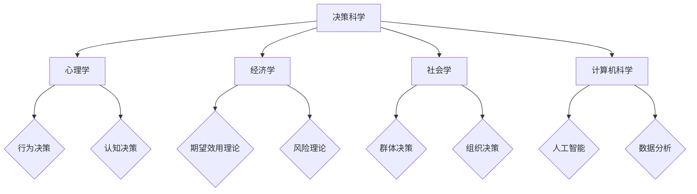

#### 1.2 决策过程分析

决策过程包括问题识别、方案生成、方案评估和决策执行等多个阶段。每个阶段都需要领导者具备相应的决策能力和技巧。

**伪代码：**
```python
Algorithm DecisionProcess
Input: problem
Output: decision

1. Identify the problem
2. Generate alternative solutions
3. Evaluate the solutions
4. Select the best solution
5. Implement the decision
6. Monitor and review the decision
```

### 第2章：决策理论

决策理论是决策科学的核心，包括传统的期望效用理论、风险理论以及现代的情景分析、多目标决策等。这些理论为领导者提供了评估和选择决策方案的方法。

#### 2.1 决策理论的概述

**Mermaid 流程图：**
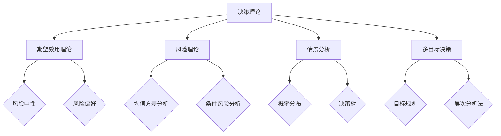

#### 2.2 决策质量的评估

决策质量的评估是决策科学的重要应用之一。评估决策质量的方法包括成本效益分析、决策后评估等。

**伪代码：**
```python
Algorithm EvaluateDecisionQuality
Input: decision, outcomes
Output: quality_score

1. Calculate the cost of the decision
2. Calculate the benefit of the decision
3. Calculate the cost-benefit ratio
4. Compare the decision quality with predefined standards
5. Provide recommendations for improvement
```

### 第3章：决策支持系统

决策支持系统（DSS）是一种辅助领导者进行决策的计算机系统。DSS可以帮助领导者收集、处理和分析信息，提高决策的效率和准确性。

#### 3.1 决策支持系统的定义与作用

**Mermaid 流程图：**
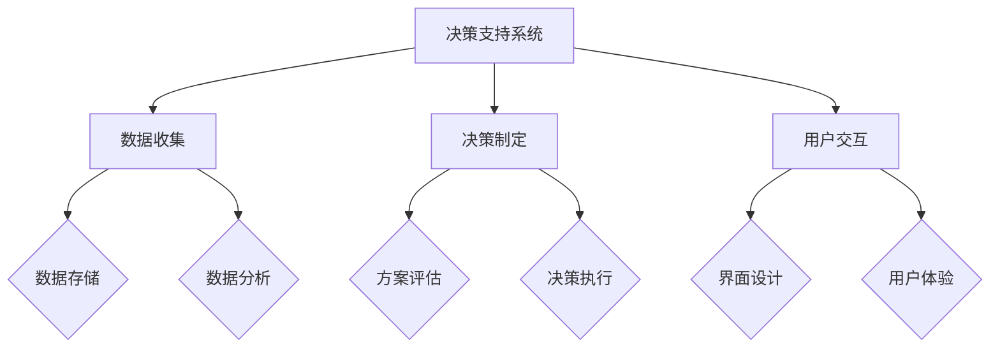

#### 3.2 决策支持系统的构成

决策支持系统通常由以下几个部分构成：

1. **数据管理模块**：负责数据收集、存储和管理。
2. **模型库**：包含各种决策模型和算法，如线性规划、非线性规划、决策树等。
3. **用户界面**：提供用户与系统交互的接口，包括图形用户界面和命令行接口。
4. **分析工具**：用于数据分析和模型计算。

**伪代码：**
```python
Algorithm DecisionSupportSystem
Input: user, problem
Output: decision

1. Collect data from user
2. Retrieve relevant models and algorithms
3. Analyze the data using selected models
4. Generate alternative solutions
5. Evaluate the solutions
6. Present the results to the user
7. Assist the user in making a decision
```

## 第二部分：领导决策的实践方法

### 第6章：领导决策心理分析

#### 6.1 领导决策的心理机制

领导决策的心理机制涉及认知、情感和动机等多个方面。理解这些机制有助于领导者更好地进行决策。

**Mermaid 流程图：**
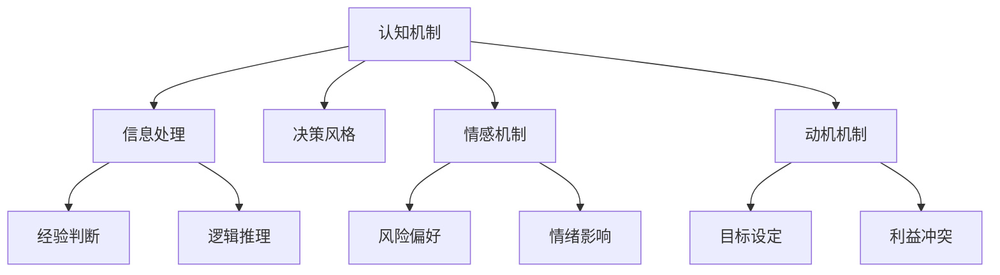

#### 6.2 领导决策的心理陷阱

领导者在决策过程中可能会陷入各种心理陷阱，如确认偏误、过度自信、情感依赖等。了解这些陷阱有助于避免错误决策。

**伪代码：**
```python
Algorithm AvoidDecisionTraps
Input: leader
Output: improved_decision

1. Identify common decision traps
2. Assess the leader's cognitive, emotional, and motivational biases
3. Develop strategies to mitigate the impact of biases
4. Implement decision-making protocols to prevent traps
5. Regularly review and adjust decision-making processes
```

### 第7章：领导决策风格与行为

#### 7.1 领导决策风格的理论

领导决策风格包括理性决策、直觉决策、民主决策等。不同的决策风格适用于不同的情境。

**Mermaid 流程图：**
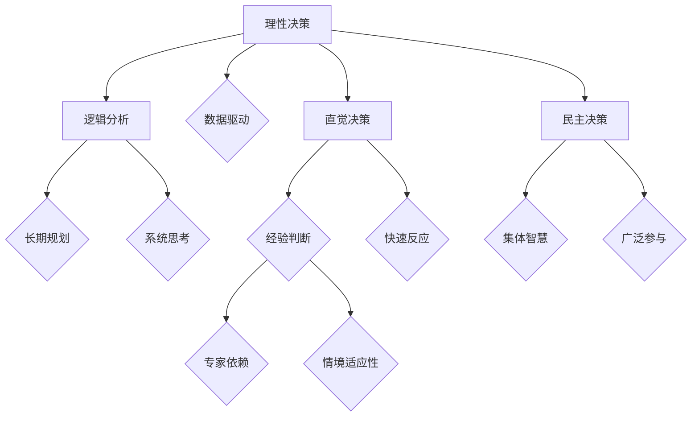

#### 7.2 不同决策风格的领导行为

领导者的决策风格会影响其行为和决策效果。了解不同决策风格的特点有助于领导者更好地应对复杂情境。

**伪代码：**
```python
Algorithm LeadershipDecisionStyle
Input: leader, context
Output: decision

1. Assess the decision context
2. Identify the appropriate decision style
3. Adapt the decision-making process to the style
4. Communicate the decision rationale and expectations
5. Monitor and adjust the decision process as needed
```

### 第8章：情景决策与战略规划

#### 8.1 情景决策的理论基础

情景决策是一种基于未来可能发生情景的决策方法。它有助于领导者应对不确定性和复杂性。

**Mermaid 流程图：**
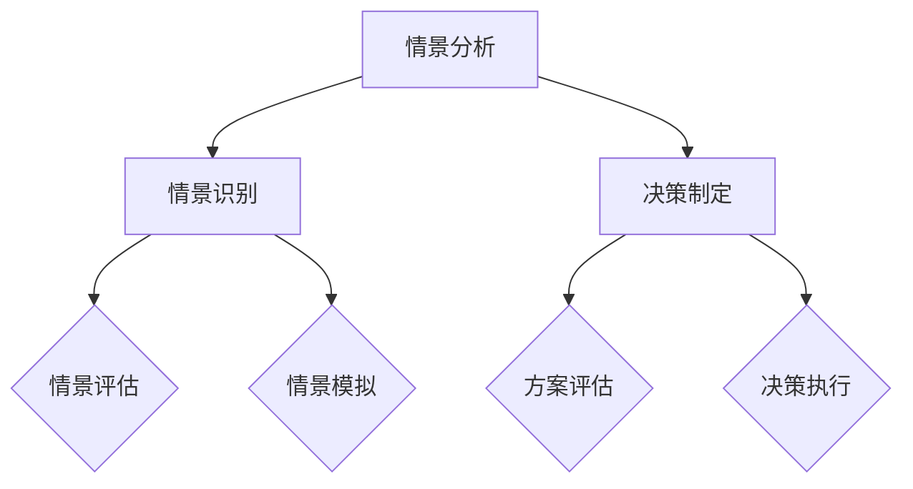

#### 8.2 情景决策的案例分析

通过具体案例，我们可以了解情景决策在实践中的应用，以及如何制定和实施战略规划。

**案例解析：** 
在一个竞争激烈的市场环境中，一家公司决定引入新产品。通过情景分析，公司识别出三个可能的市场情景：市场增长、市场稳定和市场衰退。针对每个情景，公司制定了不同的产品策略和营销计划。最终，公司在市场增长情景下取得了显著的成功。

**伪代码：**
```python
Algorithm ScenarioDecisionCase
Input: company, market_scenarios
Output: product_strategy

1. Identify market scenarios
2. Assess the impact of each scenario on the company
3. Develop alternative product strategies for each scenario
4. Evaluate the strategies based on market conditions
5. Select and implement the best strategy
6. Monitor and adjust the strategy as needed
```

### 第9章：领导决策的团队协作

#### 9.1 团队决策的优势与挑战

团队决策可以充分利用集体智慧，提高决策质量。但同时，团队决策也面临沟通、共识达成等挑战。

**Mermaid 流程图：**
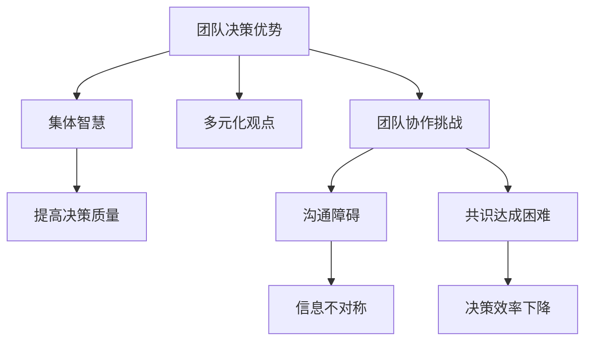

#### 9.2 团队决策的流程与技巧

团队决策的流程包括问题定义、方案生成、方案评估和决策执行。掌握团队决策的技巧有助于提高决策效率和质量。

**伪代码：**
```python
Algorithm TeamDecisionProcess
Input: team, problem
Output: decision

1. Define the problem
2. Generate alternative solutions
3. Evaluate the solutions
4. Reach a consensus on the best solution
5. Implement the decision
6. Monitor and review the decision
```

#### 9.3 提升团队决策质量的策略

提升团队决策质量的关键在于改善沟通、建立共识和培养团队协作能力。

**策略1：** 沟通渠道畅通，确保信息传递准确无误。

**策略2：** 采用决策工具，如投票、头脑风暴等，促进团队共识的形成。

**策略3：** 培训团队成员，提高其决策能力和团队协作意识。

**伪代码：**
```python
Algorithm ImproveTeamDecisionQuality
Input: team
Output: improved_decision_quality

1. Enhance communication channels
2. Implement decision-making tools
3. Provide training and development opportunities
4. Foster a collaborative culture
5. Regularly review and improve decision-making processes
```

### 第10章：领导决策的环境适应性

#### 10.1 决策环境的变化趋势

在全球化、数字化和信息化的背景下，决策环境的变化趋势包括市场不确定性的增加、技术创新的加速、环境问题的日益突出等。

**Mermaid 流程图：**
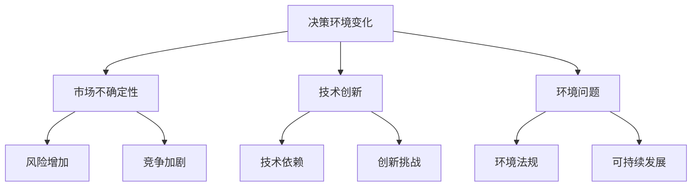

#### 10.2 领导决策的环境适应性

领导者需要具备环境适应性，以应对不断变化的决策环境。环境适应性包括对市场、技术、政策等多方面变化的敏感性和应对能力。

**伪代码：**
```python
Algorithm EnvironmentalAdaptation
Input: leader, environment
Output: adapted_decision

1. Monitor environmental changes
2. Assess the impact on decision-making
3. Develop adaptive strategies
4. Implement and monitor the strategies
5. Adjust decisions based on feedback
```

## 第三部分：决策实践与案例分析

### 第11章：决策实践中的挑战与对策

#### 11.1 决策实践中的常见问题

在决策实践中，领导者可能会面临以下问题：

1. **信息不充分**：缺乏必要的数据和信息。
2. **时间压力**：决策需要在短时间内完成。
3. **资源限制**：决策资源（如人力、财力、时间等）有限。
4. **利益冲突**：决策过程中存在利益冲突。

#### 11.2 面对挑战的决策策略

针对上述问题，领导者可以采取以下策略：

1. **信息收集与整合**：积极收集和整合相关信息，提高决策的准确性。
2. **时间管理**：合理安排时间，确保决策的充分性和有效性。
3. **资源调配**：合理调配资源，确保决策的顺利实施。
4. **利益协调**：通过沟通和协商，解决利益冲突，确保决策的公正性。

**伪代码：**
```python
Algorithm AddressDecisionPracticesChallenges
Input: leader, challenges
Output: improved_decision

1. Identify decision challenges
2. Assess the impact on decision-making
3. Develop and implement strategies to address challenges
4. Monitor the effectiveness of the strategies
5. Adjust decisions based on feedback
```

### 第12章：领导决策案例分析

#### 12.1 案例分析的目的与方法

案例分析是理解和应用决策科学理论的重要手段。通过具体案例，可以深入剖析决策过程、方法和效果。

**目的：**
1. 理解决策科学理论在实际中的应用。
2. 提供决策实践的经验和教训。
3. 促进决策能力的提升。

**方法：**
1. **案例选择**：选择具有代表性和典型意义的决策案例。
2. **案例描述**：详细描述决策案例的背景、过程和结果。
3. **案例分析**：从决策科学的角度分析案例中的决策行为和效果。
4. **案例总结**：总结案例中的经验和教训，提出改进建议。

#### 12.2 案例分析的具体案例

以下是一个具体的案例分析案例：

**案例背景：** 
某公司计划在新的市场竞争环境中推出一款新产品。在决策过程中，公司面临以下问题：

1. 市场需求分析不准确。
2. 产品成本难以控制。
3. 市场竞争激烈。

**决策过程：**
1. 公司通过市场调研，收集了大量的市场需求数据。
2. 采用情景分析的方法，识别出市场增长、稳定和衰退三种情景。
3. 基于情景分析结果，制定了不同的产品策略和营销计划。
4. 通过团队决策，选择了最佳方案，并进行了决策执行。

**案例分析：**
1. 市场需求分析不准确导致决策风险增加。
2. 情景分析和团队决策有助于降低决策风险。
3. 决策执行过程中，公司面临成本控制和市场竞争等挑战。

**案例总结：**
1. 加强市场调研，提高市场需求分析的准确性。
2. 采用情景分析和团队决策，提高决策质量和效果。
3. 加强决策执行过程中的监控和调整，确保决策目标的实现。

### 第13章：未来决策科学的发展趋势

#### 13.1 数据科学与决策科学

随着数据量的爆炸式增长，数据科学在决策科学中的应用越来越广泛。数据科学通过大数据分析和机器学习等方法，为决策提供了更准确、更高效的依据。

**Mermaid 流程图：**
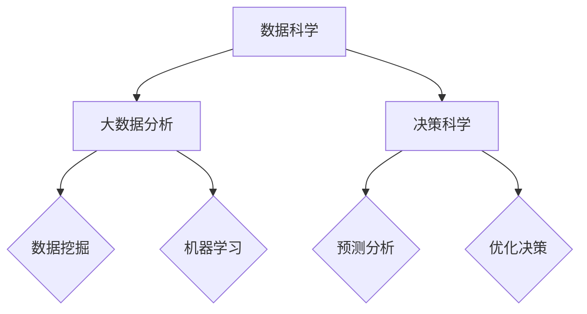

#### 13.2 人工智能与决策科学

人工智能技术的发展为决策科学带来了新的机遇。人工智能可以通过智能决策系统，实现自动化、智能化的决策过程。

**Mermaid 流程图：**
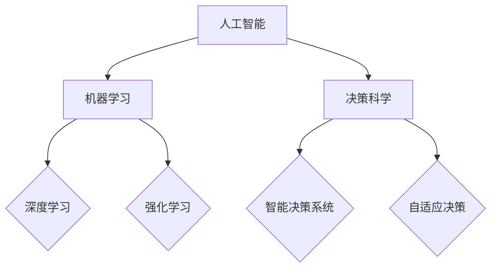

#### 13.3 决策科学的未来发展方向

未来决策科学的发展方向包括：

1. **智能决策**：结合人工智能和大数据分析，实现智能化、个性化的决策。
2. **动态决策**：针对动态环境的变化，实现实时、动态的决策。
3. **可持续发展**：将可持续发展理念融入决策过程，实现经济、社会和环境的协调。

**伪代码：**
```python
Algorithm FutureDevelopmentOfDecisionScience
Input: None
Output: future_directions

1. Integrate data science and AI into decision-making
2. Develop dynamic and adaptive decision-making methods
3. Incorporate sustainability into the decision-making process
4. Foster interdisciplinary research and collaboration
5. Promote the application of decision science in various fields
```

## 附录：决策科学工具与应用资源

### 附录 A：决策科学工具介绍

#### A.1 决策支持系统

决策支持系统（DSS）是一种基于计算机技术的决策辅助工具，可以帮助领导者快速、准确地做出决策。

**Mermaid 流程图：**


#### A.2 决策分析软件

决策分析软件是一种基于数学模型和算法的决策工具，可以帮助领导者进行复杂决策问题的分析和优化。

**Mermaid 流�程图：**
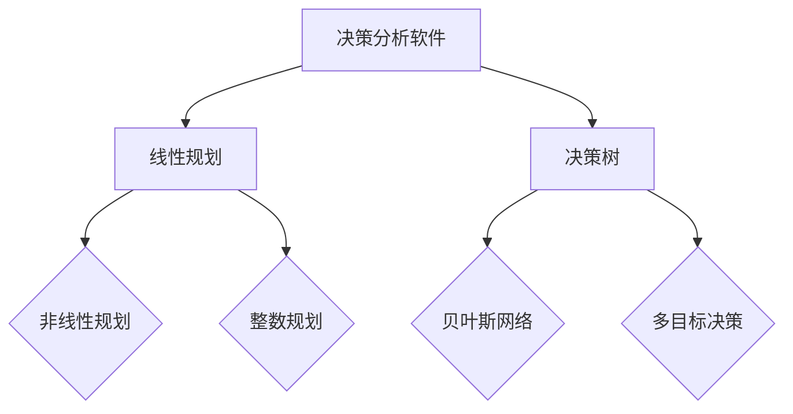

#### A.3 数据分析工具

数据分析工具可以帮助领导者收集、处理和分析决策所需的数据，提供决策依据。

**Mermaid 流程图：**
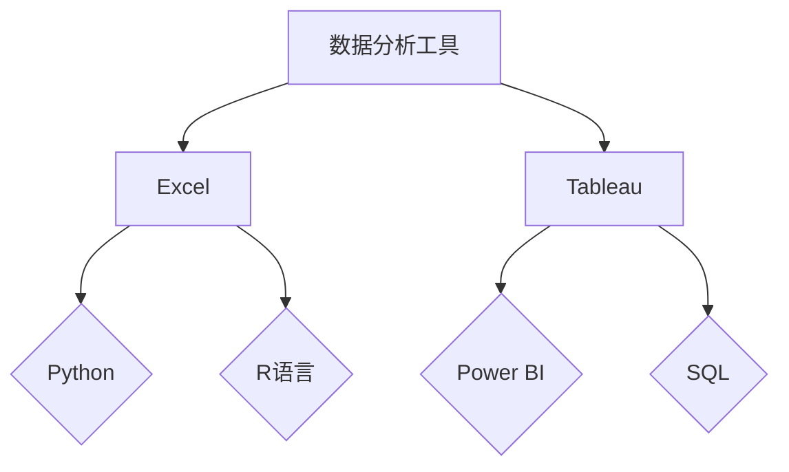

### 附录 B：决策科学资源推荐

#### B.1 学术论文与书籍推荐

1. **学术期刊**：《决策科学学报》、《系统工程理论与实践》、《管理科学学报》等。
2. **经典书籍**：《决策分析》、《决策过程：系统与模型》、《领导者的决策艺术》等。

#### B.2 决策科学研究机构

1. **国际决策科学学会**（International Decision Sciences Institute，IDSI）
2. **美国管理科学协会**（Institute for Operations Research and the Management Sciences，INFORMS）
3. **中国系统工程学会**（China Systems Engineering Society，CSES）

#### B.3 决策科学相关论坛与社区

1. **决策科学论坛**（Decision Science Forum）
2. **决策分析社区**（Decision Analysis Community）
3. **知乎决策科学话题**（知乎决策科学话题）

## 结语

决策科学作为一门研究决策过程、方法和效果的学科，为领导者提供了系统的方法论和有效的决策工具。通过本文的探讨，我们了解了决策科学的基本概念、理论方法以及实践应用。未来，随着数据科学和人工智能技术的发展，决策科学将在领导决策中发挥更加重要的作用。让我们一起探索决策科学的奥秘，提高领导决策的质量，为组织的发展和进步贡献力量。

### 作者信息

**作者：AI天才研究院/AI Genius Institute & 禅与计算机程序设计艺术 /Zen And The Art of Computer Programming**

