                 

### 分布式日志系统：构建可扩展的日志管理方案

#### 关键词
- 分布式系统
- 日志管理
- 可扩展性
- 高可用性
- 数据一致性

#### 摘要
本文旨在深入探讨分布式日志系统在构建可扩展日志管理方案中的应用。通过分析分布式日志系统的核心概念、架构设计、核心算法及项目实战，我们旨在为读者提供一套完整的分布式日志系统构建指南。文章将涵盖日志数据结构、日志收集与处理、数据存储与优化、高可用性设计、水平扩展与负载均衡，以及实时日志分析与应用。通过本文的讲解，读者将能够理解分布式日志系统的原理，掌握构建可扩展日志管理方案的方法。

### 引言与概述

#### 分布式系统与日志系统

**分布式系统的概念**
分布式系统是由多个独立计算节点通过网络互联组成的系统，这些节点可以协同工作以完成复杂的计算任务。分布式系统的核心优势在于其高可用性、可扩展性和容错性。通过将任务分布在多个节点上，分布式系统能够更好地处理大量数据和请求，提高系统的性能和可靠性。

**日志系统的作用**
日志系统在分布式系统中扮演着至关重要的角色。它用于记录系统运行过程中产生的各种事件和操作，包括错误、警告、调试信息等。日志系统不仅提供了对系统运行状态的监控，还帮助开发人员和运维人员快速定位问题，进行故障排查和性能优化。

#### 分布式日志系统的挑战

**数据量与性能问题**
随着分布式系统的规模不断扩大，日志数据的产生量也会迅速增加。这给日志系统的存储、传输和处理带来了巨大的挑战。如何高效地处理海量日志数据，保持系统性能，成为分布式日志系统面临的首要问题。

**可扩展性与高可用性**
分布式日志系统需要具备良好的可扩展性，以适应系统规模的动态变化。同时，为了确保系统的稳定运行，高可用性也是必不可少的。如何设计分布式日志系统以实现高可用性，是开发者需要重点考虑的问题。

**数据一致性与故障恢复**
在分布式环境中，日志数据的复制和同步是一个复杂的过程。如何确保数据一致性，以及如何在出现故障时快速恢复，是分布式日志系统设计的关键挑战。

#### 本书目的与结构安排

**学习目标**
通过本文的学习，读者将能够：
1. 理解分布式日志系统的基本概念和作用。
2. 掌握分布式日志系统的核心原理和设计方法。
3. 学会构建和优化分布式日志系统，实现高可用性和可扩展性。
4. 熟悉分布式日志系统的实战应用场景。

**目录结构概述**
本文分为七个章节，具体结构如下：
- 第1章：引言与概述
- 第2章：分布式日志系统基本原理
- 第3章：分布式日志系统架构设计
- 第4章：分布式日志系统核心算法
- 第5章：分布式日志系统项目实战
- 第6章：分布式日志系统应用场景
- 第7章：分布式日志系统的发展趋势

通过以上章节的讲解，本文将为读者提供一个系统化的分布式日志系统构建指南。

## 第1章 引言与概述

### 分布式系统的概念

**定义**
分布式系统是由多个独立的计算节点通过通信网络互联组成的系统，这些节点协同工作以完成复杂的计算任务。分布式系统的核心在于其分布式特性，即任务被分解并分布在多个节点上执行。

**核心优势**
1. **高可用性**：通过冗余节点和故障转移机制，分布式系统能够在单个节点故障时继续正常运行。
2. **可扩展性**：分布式系统可以轻松地添加或移除节点，以适应不断变化的工作负载。
3. **容错性**：分布式系统通过冗余和数据复制机制来提高系统的容错能力，确保数据的完整性和一致性。

**核心挑战**
1. **数据一致性**：在分布式环境中，数据可能会因网络延迟或故障而出现不一致。
2. **通信复杂性**：节点间的通信可能会受到网络带宽和延迟的影响。
3. **系统复杂度**：分布式系统需要更多的管理和监控，增加了系统的复杂性。

### 日志系统的作用

**定义**
日志系统是一种用于记录系统运行过程中产生的各种事件的工具，包括错误、警告、调试信息等。日志系统通常用于监控、故障排查、性能优化和审计。

**核心作用**
1. **监控**：日志系统提供了对系统运行状态的实时监控，有助于发现潜在问题和异常行为。
2. **故障排查**：通过分析日志数据，开发人员和运维人员可以快速定位故障点，进行问题排查和修复。
3. **性能优化**：日志数据提供了系统性能的详细记录，有助于识别性能瓶颈，进行优化。
4. **审计**：日志系统可用于记录系统操作和用户行为，为审计和合规提供依据。

### 分布式日志系统的挑战

**数据量与性能问题**
随着分布式系统规模的扩大，日志数据的产生量会呈指数级增长。这给日志系统的存储、处理和传输带来了巨大的压力。如何高效地处理海量日志数据，同时保持系统性能，是分布式日志系统面临的首要问题。

**可扩展性与高可用性**
分布式日志系统需要具备良好的可扩展性，以适应系统规模的动态变化。同时，为了确保系统的稳定运行，高可用性也是必不可少的。如何设计分布式日志系统以实现高可用性，是开发者需要重点考虑的问题。

**数据一致性与故障恢复**
在分布式环境中，日志数据的复制和同步是一个复杂的过程。如何确保数据一致性，以及如何在出现故障时快速恢复，是分布式日志系统设计的关键挑战。

### 本书目的与结构安排

**学习目标**
通过本文的学习，读者将能够：
1. 理解分布式日志系统的基本概念和作用。
2. 掌握分布式日志系统的核心原理和设计方法。
3. 学会构建和优化分布式日志系统，实现高可用性和可扩展性。
4. 熟悉分布式日志系统的实战应用场景。

**目录结构概述**
本文分为七个章节，具体结构如下：
- 第1章：引言与概述
- 第2章：分布式日志系统基本原理
- 第3章：分布式日志系统架构设计
- 第4章：分布式日志系统核心算法
- 第5章：分布式日志系统项目实战
- 第6章：分布式日志系统应用场景
- 第7章：分布式日志系统的发展趋势

通过以上章节的讲解，本文将为读者提供一个系统化的分布式日志系统构建指南。

### 分布式日志系统基本原理

#### 日志数据结构

日志数据结构是分布式日志系统的核心组成部分，它决定了日志的存储、处理和查询方式。以下是对日志数据结构的详细描述。

**日志文件格式**
日志文件格式是日志数据存储的基础。常见的日志文件格式包括文本文件、JSON、XML等。其中，文本文件格式简单直观，易于阅读；JSON格式具有良好的自描述性和可扩展性，适用于复杂的数据结构；XML格式则具有较强的结构化和语义表达能力。

**日志数据结构**
日志数据结构通常由多个字段组成，每个字段代表日志记录的不同属性。常见的日志字段包括：
1. **时间戳**：记录日志事件发生的具体时间。
2. **来源IP**：记录产生日志事件的源IP地址。
3. **用户ID**：记录发起日志事件的用户ID。
4. **事件类型**：记录日志事件的类型，如登录、请求、错误等。
5. **事件内容**：记录日志事件的详细内容，如请求参数、错误信息等。

以下是一个简单的日志数据结构示例：

```json
{
  "timestamp": "2023-01-01T12:34:56Z",
  "source_ip": "192.168.1.1",
  "user_id": "user123",
  "event_type": "login",
  "event_content": {
    "username": "alice",
    "password": "password123"
  }
}
```

**核心概念与联系**
日志数据结构中的各个字段共同构成了日志记录的完整信息。日志文件格式决定了日志数据的存储和读取方式，而日志数据结构则定义了日志记录的内部组成和字段含义。通过合理的日志数据结构设计，可以方便地进行日志数据的查询和分析。

**Mermaid 流程图**
为了更直观地展示日志数据结构，我们可以使用Mermaid绘制一个简单的流程图：

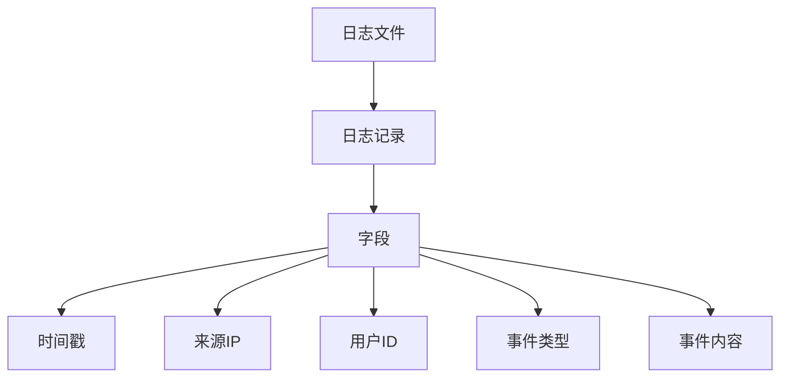

通过这个流程图，我们可以清晰地看到日志文件、日志记录和字段之间的关系。

#### 日志收集

日志收集是分布式日志系统的关键环节，它负责从各种来源（如应用程序、服务器等）收集日志数据。以下是对日志收集过程的详细描述。

**日志收集器**
日志收集器是负责从各个日志源收集日志数据的组件。常见的日志收集器包括Logstash、Fluentd、Log4j等。日志收集器通常具有以下功能：
1. **数据收集**：从不同的日志源读取日志数据。
2. **数据过滤**：对日志数据进行预处理，过滤掉无用或异常的数据。
3. **数据传输**：将处理后的日志数据发送到日志存储或处理系统。

以下是一个日志收集器的典型工作流程：

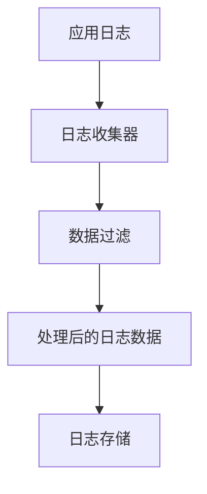

**数据传输机制**
日志收集器与日志存储系统之间的数据传输是分布式日志系统的关键部分。常见的数据传输机制包括：
1. **文件传输**：日志收集器将日志数据写入本地文件，然后由日志存储系统定期读取和处理。
2. **网络传输**：日志收集器通过HTTP、TCP等协议将日志数据实时传输到日志存储系统。

以下是一个简单的网络传输示例：

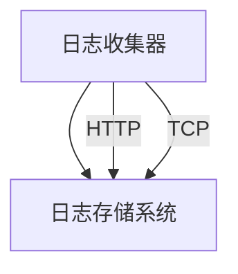

通过合理的日志收集器和数据传输机制设计，可以确保日志数据的高效、可靠传输，为后续的数据处理和分析奠定基础。

#### 日志存储

日志存储是分布式日志系统的核心组件，它负责将收集到的日志数据进行持久化存储。以下是对日志存储方案的详细描述。

**数据存储方案**
分布式日志系统的数据存储方案通常分为以下几种：
1. **文件存储**：将日志数据直接写入磁盘文件。这种方法简单高效，但面对海量日志数据时性能可能不足。
2. **关系型数据库**：将日志数据存储在关系型数据库中。这种方法提供了强大的查询功能，但需要额外的数据库管理和维护。
3. **NoSQL数据库**：如MongoDB、Cassandra等，提供高性能的日志存储和查询能力，适用于大规模分布式系统。
4. **消息队列**：如Kafka、RabbitMQ等，将日志数据作为消息进行传输和存储。这种方法提供了高吞吐量和实时处理能力，但需要额外的消息队列管理。

以下是一个典型的日志存储方案：

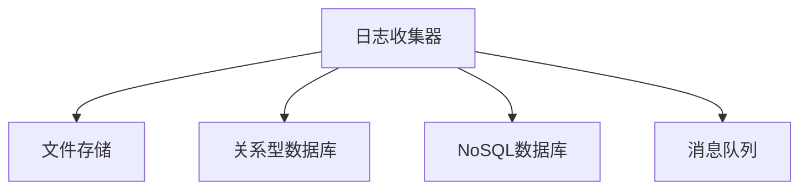

**数据存储优化**
为了提高日志系统的存储性能和可靠性，可以采用以下优化策略：
1. **数据压缩**：对日志数据进行压缩，减少存储空间占用。
2. **索引**：为日志数据建立索引，提高查询效率。
3. **分片**：将日志数据分片存储，提高并发访问能力。
4. **备份与冗余**：对日志数据进行备份和冗余存储，确保数据安全。

通过合理的日志存储方案和数据存储优化策略，可以构建一个高效、可靠的分布式日志系统，满足大规模分布式系统的需求。

#### 日志处理

日志处理是分布式日志系统的关键环节，它负责对收集到的日志数据进行分析、聚合和查询。以下是对日志处理过程的详细描述。

**日志分析工具**
日志分析工具是用于处理和分析日志数据的重要组件。常见的日志分析工具包括：
1. **Logstash**：用于收集、处理和传输日志数据的开源工具。
2. **Fluentd**：类似于Logstash，提供日志数据的收集、处理和转发功能。
3. **ELK栈**：Elasticsearch、Logstash、Kibana的组合，提供强大的日志搜索、分析和可视化功能。

以下是一个简单的日志分析工具工作流程：

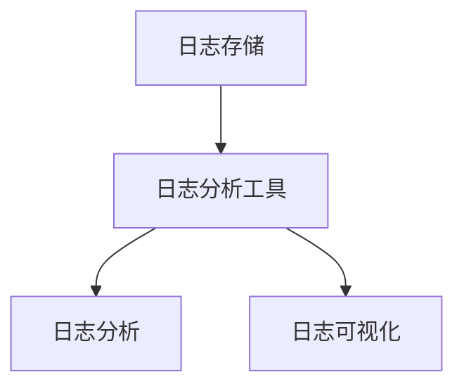

**日志聚合与查询**
日志聚合是将来自多个来源的日志数据合并为一个整体的过程。日志聚合有助于提高日志数据处理的效率，便于分析和管理。以下是一些常见的日志聚合方法：
1. **时间窗口聚合**：将一段时间内的日志数据合并为一个聚合记录。
2. **字段聚合**：根据特定的字段对日志数据进行分组和汇总。
3. **事件流聚合**：将相关的事件序列合并为一个整体进行分析。

日志查询是日志处理的重要功能，用于检索和分析日志数据。以下是一些常见的日志查询方法：
1. **关键字查询**：根据关键字搜索特定的日志记录。
2. **范围查询**：根据时间范围或其他条件检索日志记录。
3. **多条件查询**：同时使用多个条件进行精确查询。

通过有效的日志分析工具和日志聚合与查询方法，分布式日志系统能够高效地处理和分析海量日志数据，为系统监控、故障排查和性能优化提供有力支持。

### 分布式日志系统架构设计

#### 日志系统架构模式

在分布式日志系统中，常见的架构模式包括单日志系统和多日志系统。每种架构模式都有其特点和适用场景。

**单日志系统**
单日志系统是指所有日志数据都集中存储在一个日志系统中。这种架构模式简单直观，易于管理和维护。然而，单日志系统在处理大量日志数据时，可能会遇到性能瓶颈和单点故障问题。

**多日志系统**
多日志系统是指将日志数据分布存储在多个日志系统中。这种架构模式具有更好的可扩展性和高可用性，能够更好地应对大规模分布式系统的需求。多日志系统通常包括多个日志收集器、存储系统和分析工具。

以下是一个多日志系统的典型架构：

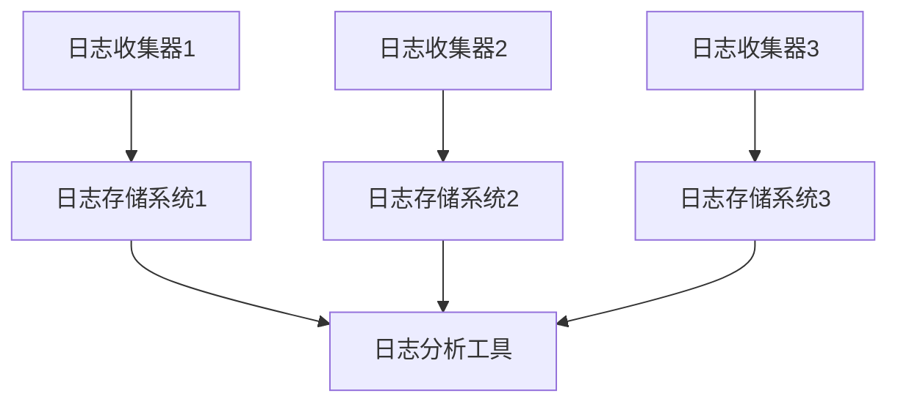

**适用场景**
- **单日志系统**：适用于中小规模的分布式系统，或对日志处理性能要求不高的场景。
- **多日志系统**：适用于大规模分布式系统，需要高可用性和可扩展性的场景。

#### 数据复制与同步

在分布式日志系统中，数据复制和同步是确保数据一致性和可用性的关键环节。

**复制策略**
数据复制策略决定了如何将日志数据从源节点复制到目标节点。常见的数据复制策略包括以下几种：

1. **主从复制**：主从复制是指一个节点作为主节点，负责写入日志数据，其他节点作为从节点，负责从主节点复制日志数据。主从复制具有较好的数据一致性和故障恢复能力。

2. **多主复制**：多主复制是指多个节点都可以作为主节点，负责写入日志数据。多主复制提高了系统的可用性，但需要额外的机制来确保数据一致性。

以下是一个主从复制策略的示意图：

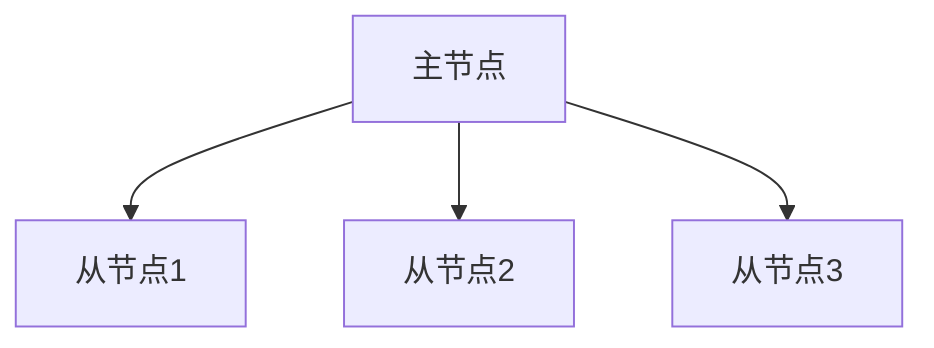

**同步机制**
同步机制是指如何将日志数据从源节点同步到目标节点。常见的同步机制包括以下几种：

1. **异步同步**：异步同步是指日志数据在写入源节点后，由独立的线程或进程异步地复制到目标节点。异步同步具有较好的性能，但可能会造成数据不一致。

2. **同步同步**：同步同步是指日志数据在写入源节点后，必须等待数据同步到目标节点后，才能返回客户端。同步同步确保了数据一致性，但可能会影响系统性能。

以下是一个异步同步机制的示意图：

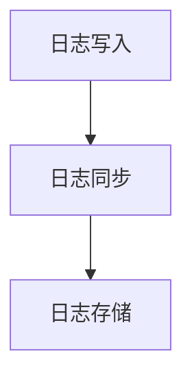

**数据一致性与故障恢复**
在分布式日志系统中，数据一致性和故障恢复是确保系统可靠性的关键。

1. **数据一致性**：为了确保数据一致性，分布式日志系统通常采用以下策略：
   - **时间戳**：通过时间戳来确保日志数据的顺序和一致性。
   - **版本号**：通过版本号来确保日志数据的唯一性和一致性。

2. **故障恢复**：在出现故障时，分布式日志系统需要能够快速恢复，确保数据的完整性和可用性。常见的故障恢复策略包括：
   - **主从切换**：在主节点出现故障时，将主节点切换到从节点，继续提供服务。
   - **数据回滚**：在出现数据冲突时，通过回滚操作恢复到一致状态。

通过合理的复制策略和同步机制，以及数据一致性和故障恢复策略，分布式日志系统可以确保日志数据的一致性和可用性，为大规模分布式系统的稳定运行提供保障。

#### 高可用性设计

在分布式日志系统中，高可用性设计至关重要，它确保系统能够在面临各种故障时持续提供服务。以下是对分布式日志系统高可用性设计的详细探讨。

**失效转移**

**定义**
失效转移（Failover）是指当系统中的某个节点出现故障时，自动将服务转移到其他健康节点，以确保系统的连续性和稳定性。

**实现**
失效转移通常依赖于以下几种机制：

1. **主从复制**：在分布式日志系统中，主从复制是一种常见的高可用性实现方式。主节点负责处理写入请求，从节点则从主节点复制日志数据。当主节点出现故障时，系统会自动将主节点切换到从节点。

2. **心跳检测**：通过心跳检测（Heartbeat Detection），系统可以定期检测各个节点的状态。当检测到某个节点故障时，系统会立即执行失效转移操作。

以下是一个简单的失效转移流程：

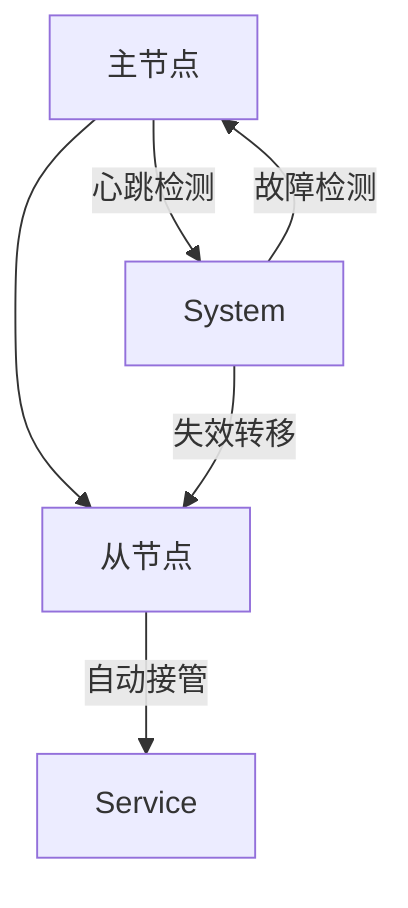

**故障恢复**

**定义**
故障恢复（Fault Recovery）是指系统在出现故障后，通过一系列操作恢复到正常状态，确保数据一致性和服务连续性。

**实现**
故障恢复通常包括以下步骤：

1. **数据一致性检查**：在故障发生后，系统需要确保数据一致性。这可以通过以下方式实现：
   - **时间戳**：通过时间戳检查日志记录的顺序，确保数据一致性。
   - **版本号**：通过版本号检查日志记录的唯一性，确保数据一致性。

2. **故障节点重启**：当检测到节点故障时，系统会尝试重启故障节点，使其恢复正常。

3. **数据同步**：在故障节点恢复后，系统会将其与主节点进行数据同步，确保数据一致性。

以下是一个简单的故障恢复流程：

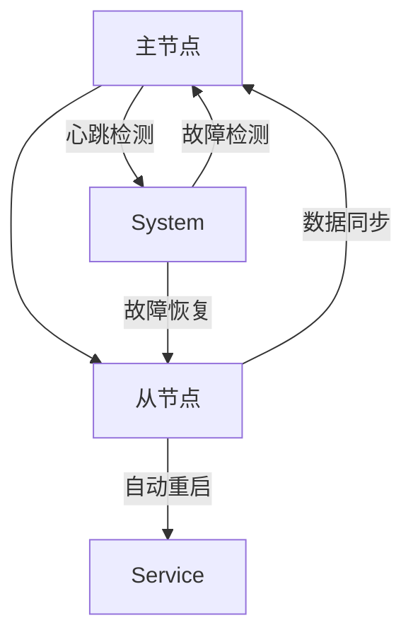

**高可用性设计策略**

1. **冗余设计**：通过冗余设计，确保系统具备一定的容错能力。冗余设计包括数据冗余（如数据备份）和节点冗余（如主从复制）。

2. **负载均衡**：通过负载均衡，将请求均匀分布到各个节点，避免单个节点过载，提高系统的整体性能和可用性。

3. **自动化监控与恢复**：通过自动化监控与恢复机制，系统可以自动检测故障并执行恢复操作，减少人工干预，提高系统的可靠性和稳定性。

通过失效转移和故障恢复机制，以及冗余设计、负载均衡和自动化监控与恢复策略，分布式日志系统可以实现高可用性，确保系统的稳定运行和数据安全。

#### 水平扩展与负载均衡

在分布式日志系统中，水平扩展和负载均衡是确保系统高可用性和性能的关键手段。以下是对这两个概念及其实现方法的详细探讨。

**水平扩展**

**定义**
水平扩展（Horizontal Scaling）是指通过增加系统中的节点数量来提高系统的处理能力和容量。在分布式日志系统中，水平扩展主要用于应对日志数据的增加和处理需求的增长。

**实现**
水平扩展的实现方法主要包括以下几种：

1. **添加新节点**：在系统运行过程中，通过添加新的日志收集器、存储节点和分析工具来扩展系统容量。

2. **动态扩展**：一些分布式日志系统支持动态扩展，即在系统运行时自动检测负载，并自动添加或移除节点，以适应负载变化。

以下是一个简单的水平扩展流程：

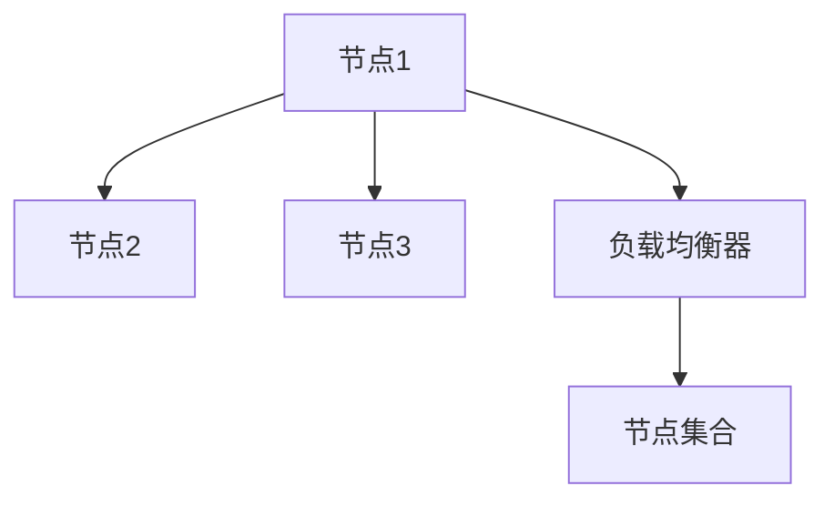

**水平扩展的优势**
- **提高处理能力**：通过增加节点数量，系统能够处理更多的日志数据。
- **负载均衡**：负载均衡器可以自动分配请求到不同的节点，避免单个节点过载。
- **高可用性**：当某个节点出现故障时，系统可以通过其他健康节点继续提供服务。

**负载均衡**

**定义**
负载均衡（Load Balancing）是指通过将请求分配到多个服务器或节点，以优化系统性能和资源利用率。

**实现**
负载均衡的实现方法主要包括以下几种：

1. **轮询算法**：将请求按照顺序分配到各个节点，确保每个节点处理的请求数量大致相等。

2. **最小连接数算法**：将请求分配到当前连接数最少的节点，以减少系统的平均响应时间。

3. **基于权重的负载均衡**：根据节点的处理能力或重要性，为每个节点分配不同的权重，影响请求的分配。

以下是一个简单的负载均衡算法实现：

```python
def load_balance(queries, nodes):
    # 假设 queries 是请求列表，nodes 是节点列表
    sorted_nodes = sorted(nodes, key=lambda x: x['load'])
    for query in queries:
        min_node = min(sorted_nodes, key=lambda x: x['load'])
        min_node['load'] += 1
        # 处理请求
        process_query(query, min_node)
```

**负载均衡的优势**
- **提高系统性能**：通过均衡请求分配，避免单个节点过载，提高系统的响应速度和处理能力。
- **资源利用率**：充分利用系统资源，避免资源浪费。
- **高可用性**：当某个节点出现故障时，负载均衡器可以自动将请求分配到其他健康节点，确保服务的连续性。

通过水平扩展和负载均衡，分布式日志系统可以有效地应对日志数据增长和处理需求变化，提高系统的性能和可用性。

### 分布式日志系统核心算法

#### 日志数据一致性算法

在分布式日志系统中，确保数据一致性是保证系统稳定性的关键。以下介绍两种常用的数据一致性算法：基于时间戳的一致性算法和基于版本号的一致性算法。

**基于时间戳的一致性算法**

**定义**
基于时间戳的一致性算法通过为每个日志记录分配一个时间戳，确保日志记录的顺序和一致性。

**原理**
1. **时间戳分配**：在每个日志记录写入时，为其分配一个当前系统时间戳。
2. **日志排序**：在读取日志时，根据日志记录的时间戳对日志进行排序。
3. **一致性检查**：在处理日志时，通过检查日志记录的时间戳顺序，确保数据一致性。

**伪代码**
```python
def allocate_timestamp(log_record):
    log_record['timestamp'] = current_system_time()

def sort_logs_by_timestamp(logs):
    sorted_logs = sorted(logs, key=lambda x: x['timestamp'])
    return sorted_logs

def check_consistency(logs):
    for i in range(len(logs) - 1):
        if logs[i]['timestamp'] > logs[i + 1]['timestamp']:
            return False
    return True
```

**优点**
- **简单实现**：基于时间戳的一致性算法实现简单，易于理解和维护。
- **高效性能**：时间戳的比较操作时间复杂度为O(1)。

**缺点**
- **无法解决冲突**：当多个日志记录同时写入时，可能产生时间戳冲突，无法保证严格一致性。

**应用场景**
- **顺序保证**：适用于需要保证日志顺序的场景，如日志文件滚动。

**基于版本号的一致性算法**

**定义**
基于版本号的一致性算法通过为每个日志记录分配一个版本号，确保日志记录的唯一性和一致性。

**原理**
1. **版本号分配**：在每个日志记录写入时，为其分配一个递增的版本号。
2. **冲突检测**：在读取日志时，通过比较版本号，检测和解决冲突。
3. **一致性检查**：在处理日志时，通过检查版本号序列，确保数据一致性。

**伪代码**
```python
def allocate_version(log_record):
    log_record['version'] = current_version()

def detect_conflict(log_record, existing_logs):
    for existing_log in existing_logs:
        if log_record['version'] < existing_log['version']:
            return True
    return False

def check_consistency(log_records):
    for i in range(len(log_records) - 1):
        if detect_conflict(log_records[i + 1], log_records[:i + 1]):
            return False
    return True
```

**优点**
- **解决冲突**：基于版本号的一致性算法能够检测和解决冲突，确保数据一致性。
- **灵活调整**：版本号可以灵活调整，适用于不同场景。

**缺点**
- **复杂实现**：基于版本号的一致性算法实现相对复杂，需要额外的冲突检测和版本号管理。

**应用场景**
- **高一致性要求**：适用于对数据一致性要求较高的场景，如数据库事务处理。

**总结**
基于时间戳的一致性算法和基于版本号的一致性算法各有优缺点，选择合适的算法需要根据具体应用场景进行权衡。

### 负载均衡算法

在分布式日志系统中，负载均衡算法用于合理分配日志处理任务，以提高系统性能和资源利用率。以下介绍两种常用的负载均衡算法：轮询算法和加权算法。

**轮询算法**

**定义**
轮询算法（Round-Robin）是一种简单的负载均衡算法，它将日志处理任务依次分配给系统中的各个节点。

**原理**
1. **初始化**：创建一个节点列表，并设置当前节点指针。
2. **分配任务**：每次分配任务时，将任务分配给当前节点指针所指向的节点，然后指针移动到下一个节点。
3. **循环处理**：当指针移动到最后一个节点时，将其重置到第一个节点，继续循环分配任务。

**伪代码**
```python
nodes = ['node1', 'node2', 'node3', ...]
current_node_index = 0

def allocate_task(log):
    current_node = nodes[current_node_index]
    process_log(log, current_node)
    current_node_index = (current_node_index + 1) % len(nodes)
```

**优点**
- **简单易实现**：轮询算法实现简单，易于理解和维护。
- **负载均衡**：能够保证每个节点处理的日志数量大致相等。

**缺点**
- **可能存在热点**：当日志数据不均匀时，某些节点可能会处理更多的日志，导致负载不均衡。

**应用场景**
- **均匀负载**：适用于日志数据均匀分布的场景。

**加权算法**

**定义**
加权算法（Weighted Round-Robin）是一种基于节点处理能力的负载均衡算法，它根据节点的权重分配日志处理任务。

**原理**
1. **初始化**：创建一个节点列表，并设置每个节点的权重。
2. **分配任务**：每次分配任务时，根据节点的权重，将任务分配给权重最大的节点。
3. **权重更新**：根据节点的处理能力和负载情况，动态更新节点的权重。

**伪代码**
```python
nodes = [{'name': 'node1', 'weight': 2}, {'name': 'node2', 'weight': 1}, ...]
current_node_index = 0

def allocate_task(log):
    max_weight = max(node['weight'] for node in nodes)
    current_node = next(node for node in nodes if node['weight'] == max_weight)
    process_log(log, current_node)
    current_node['weight'] -= 1

def update_weights():
    for node in nodes:
        node['weight'] = calculate_weight(node)
```

**优点**
- **考虑节点能力**：加权算法能够根据节点的处理能力分配任务，提高系统性能。
- **动态调整**：节点的权重可以根据实际负载动态调整，实现更优的负载均衡。

**缺点**
- **实现复杂**：加权算法实现相对复杂，需要额外的权重计算和更新逻辑。

**应用场景**
- **非均匀负载**：适用于日志数据不均匀分布，需要考虑节点处理能力的场景。

**总结**
轮询算法和加权算法是分布式日志系统中常用的负载均衡算法。轮询算法简单易实现，适用于均匀负载场景；加权算法考虑节点处理能力，适用于非均匀负载场景。根据具体应用场景选择合适的负载均衡算法，能够有效提高分布式日志系统的性能和资源利用率。

### 日志数据压缩与加密

在分布式日志系统中，日志数据压缩与加密是保证系统性能和数据安全的重要手段。以下分别介绍日志数据压缩和加密的方法、算法及其应用。

#### 日志数据压缩

**方法**

日志数据压缩的主要目的是减少存储空间和提高数据传输速度。常见的数据压缩方法包括：

1. **无损压缩**：无损压缩算法在压缩数据时不丢失任何信息，适用于需要保持数据完整性的场景。常见的无损压缩算法有：
   - **Huffman编码**：通过给频繁出现的字符分配更短的编码，降低整体数据长度。
   - **LZ77**：通过查找重复的数据块并使用引用来压缩。
   - **LZ78**：通过构建字典来识别重复的字符串并进行压缩。

2. **有损压缩**：有损压缩算法在压缩数据时会丢失一部分信息，适用于对数据精度要求不高的场景。常见的有损压缩算法有：
   - **JPEG**：适用于图像压缩，通过减少颜色信息和细节来压缩。
   - **MP3**：适用于音频压缩，通过减少音频信号中的高频信息来压缩。

**算法**

以下是一种简单的无损压缩算法——Huffman编码的伪代码实现：

```python
def huffman_encode(data):
    # 统计每个字符的频率
    frequency = count_frequency(data)
    # 构建Huffman树
    huffman_tree = build_huffman_tree(frequency)
    # 生成编码表
    encoding_table = build_encoding_table(huffman_tree)
    # 编码数据
    encoded_data = encode_data(data, encoding_table)
    return encoded_data

def count_frequency(data):
    # 统计字符频率
    pass

def build_huffman_tree(frequency):
    # 构建Huffman树
    pass

def build_encoding_table(huffman_tree):
    # 生成编码表
    pass

def encode_data(data, encoding_table):
    # 编码数据
    pass
```

**应用**

日志数据压缩可以应用于以下场景：

1. **存储优化**：通过压缩日志数据，减少存储空间占用，提高存储系统的利用率。
2. **传输加速**：通过压缩日志数据，减少数据传输时间，提高数据传输效率。

#### 日志数据加密

**方法**

日志数据加密的主要目的是防止未授权访问和泄露敏感信息。常见的数据加密方法包括：

1. **对称加密**：对称加密算法使用相同的密钥进行加密和解密。常见的对称加密算法有：
   - **AES**：高级加密标准，适用于对大数据量的高效加密。
   - **DES**：数据加密标准，较为简单，但安全性较低。

2. **非对称加密**：非对称加密算法使用不同的密钥进行加密和解密。常见的非对称加密算法有：
   - **RSA**：适用于加密大型数据，安全性较高。

**算法**

以下是一种简单的对称加密算法——AES的伪代码实现：

```python
from Crypto.Cipher import AES
from Crypto.Random import get_random_bytes

def aes_encrypt(data, key):
    cipher = AES.new(key, AES.MODE_CBC)
    ct_bytes = cipher.encrypt(pad(data))
    iv = cipher.iv
    return iv + ct_bytes

def aes_decrypt(ct, key, iv):
    cipher = AES.new(key, AES.MODE_CBC, iv)
    pt = unpad(cipher.decrypt(ct))
    return pt

def pad(data):
    # 填充数据以符合块大小要求
    pass

def unpad(data):
    # 去除填充数据
    pass
```

**应用**

日志数据加密可以应用于以下场景：

1. **数据安全**：通过加密日志数据，防止未授权访问和泄露敏感信息。
2. **安全传输**：在数据传输过程中，通过加密确保数据的安全性。

通过日志数据压缩和加密，分布式日志系统可以有效地优化存储和传输性能，提高数据安全性，满足大规模分布式系统的需求。

### 分布式日志系统项目实战

#### 开发环境搭建

要开始构建分布式日志系统，首先需要搭建一个合适的开发环境。以下是一个简单的开发环境搭建步骤：

**系统环境准备**

1. **操作系统**：选择一个适合的操作系统，如Ubuntu 18.04或CentOS 7。
2. **编程语言**：选择一个适合的编程语言，如Python 3.8或Java 11。
3. **开发工具**：安装必要的开发工具，如IDE（如PyCharm、Eclipse）和命令行工具。

**相关工具安装**

1. **日志收集器**：安装一个日志收集器，如Fluentd或Logstash。
2. **日志存储系统**：安装一个日志存储系统，如Elasticsearch或MongoDB。
3. **日志分析工具**：安装一个日志分析工具，如Kibana或Logstash。

以下是一个基于Fluentd、Elasticsearch和Kibana的分布式日志系统环境搭建步骤：

1. **安装Fluentd**

```bash
sudo apt-get update
sudo apt-get install -y fluentd
```

2. **配置Fluentd**

创建一个Fluentd配置文件`/etc/fluentd/fluent.conf`：

```conf
<source>
  @type http
  port 9880
</source>

<match **>
  @type elasticsearch
  host elasticsearch
  port 9200
  index_name my_logs
</match>
```

3. **安装Elasticsearch**

```bash
sudo apt-get install elasticsearch
sudo systemctl start elasticsearch
sudo systemctl enable elasticsearch
```

4. **配置Elasticsearch**

编辑Elasticsearch配置文件`/etc/elasticsearch/elasticsearch.yml`：

```yaml
cluster.name: my_elasticsearch_cluster
node.name: node-1
network.host: 0.0.0.0
http.port: 9200
```

5. **安装Kibana**

```bash
sudo apt-get install kibana
sudo systemctl start kibana
sudo systemctl enable kibana
```

6. **配置Kibana**

编辑Kibana配置文件`/etc/kibana/kibana.yml`：

```yaml
server.host: "0.0.0.0"
elasticsearch.url: "http://localhost:9200"
```

**测试环境**

启动Fluentd、Elasticsearch和Kibana服务，并测试环境是否正常工作。

```bash
sudo systemctl start fluentd
sudo systemctl start elasticsearch
sudo systemctl start kibana
```

在Kibana中，访问`http://localhost:5601`，应看到Kibana的首页。在Kibana中创建一个索引模式，并尝试发送一些日志数据到Elasticsearch，以确保环境配置正确。

通过以上步骤，我们可以搭建一个基础的分布式日志系统开发环境，为后续的日志收集、存储和处理打下基础。

#### 数据收集与传输

在分布式日志系统中，数据收集与传输是关键环节，它决定了日志数据能否及时、准确地到达存储系统。以下将详细描述数据收集与传输的具体步骤、方法、策略，并分析其优点和不足。

**数据收集步骤**

1. **日志收集器部署**：首先，需要在各个需要收集日志的服务器上部署日志收集器。例如，在Linux服务器上，可以安装Fluentd或Logstash。这些日志收集器负责从系统中收集日志文件或实时日志流。

2. **配置日志收集规则**：根据系统需求和日志类型，配置日志收集器的规则。例如，指定哪些文件需要收集、日志文件路径、日志格式等。

3. **启动日志收集器**：配置完成后，启动日志收集器，使其开始工作。

**数据传输方法**

1. **文件传输**：日志收集器可以将收集到的日志数据写入本地文件系统，然后由存储系统定期读取和处理。这种方法简单易实现，但依赖于存储系统的定时任务，可能导致数据延迟。

2. **网络传输**：日志收集器可以通过HTTP、TCP等网络协议将日志数据实时传输到存储系统。例如，Fluentd可以使用HTTP协议将日志数据发送到Elasticsearch。这种方法具有实时性，但可能受网络带宽和延迟的影响。

**数据传输策略**

1. **异步传输**：异步传输是指日志收集器在收集到日志数据后，立即将其传输到存储系统，而不等待存储系统的响应。这种策略可以提高系统性能，但可能导致存储系统负载过高。

2. **批量传输**：批量传输是指日志收集器将收集到的日志数据暂时缓存起来，然后以批量的形式传输到存储系统。这种方法可以降低网络带宽占用，但可能导致数据延迟。

**优点与不足**

**文件传输**

- **优点**：
  - 简单易实现，不需要复杂的网络配置。
  - 对网络依赖性较低，适合低带宽环境。

- **不足**：
  - 数据延迟较高，不适合实时处理。
  - 需要定期清理本地文件，否则可能导致存储空间不足。

**网络传输**

- **优点**：
  - 实时性高，可以及时处理日志数据。
  - 可以实现远程数据传输，适用于分布式系统。

- **不足**：
  - 网络延迟和带宽影响较大，可能影响系统性能。
  - 需要复杂的网络配置和安全措施，如防火墙、SSL/TLS等。

**异步传输**

- **优点**：
  - 提高系统性能，减轻存储系统负担。
  - 可以实现无阻塞的数据传输，提高用户体验。

- **不足**：
  - 可能导致数据丢失，需要额外的数据校验机制。
  - 需要复杂的异步处理逻辑，实现难度较高。

**批量传输**

- **优点**：
  - 降低网络带宽占用，减少网络延迟。
  - 可以实现批量处理，提高系统吞吐量。

- **不足**：
  - 数据延迟较高，不适合实时处理。
  - 可能需要额外的缓存机制，增加系统复杂性。

通过合理的数据收集与传输策略，可以构建一个高效、可靠的分布式日志系统，满足大规模分布式系统的需求。

#### 数据存储与处理

在分布式日志系统中，数据存储与处理是至关重要的环节，它决定了日志数据能否高效、准确地被存储和利用。以下将详细描述数据存储系统的选择、数据处理流程及性能优化与监控。

**数据存储系统选择**

在选择数据存储系统时，需要考虑以下几个因素：

1. **数据量与性能**：选择能够处理海量数据且具有高性能的数据存储系统。例如，Elasticsearch和MongoDB都是适用于大规模分布式系统的存储解决方案。

2. **查询与分析能力**：选择具有强大查询和分析功能的数据存储系统，以便快速检索和分析日志数据。Elasticsearch以其强大的全文搜索和分析功能而著称。

3. **高可用性与容错性**：选择具有高可用性和容错性的数据存储系统，确保系统在面临故障时能够快速恢复。Elasticsearch和MongoDB都提供了复制和分片机制，以提高系统的可用性和容错性。

4. **扩展性**：选择能够灵活扩展的数据存储系统，以适应系统规模的变化。Elasticsearch和MongoDB都支持水平扩展，可以根据需求动态调整集群规模。

基于以上考虑，我们可以选择Elasticsearch作为分布式日志系统的存储系统。Elasticsearch具有高性能、强大的全文搜索和分析功能，以及良好的扩展性。

**数据处理流程**

数据处理流程通常包括以下几个步骤：

1. **日志收集**：日志收集器从各个源（如应用程序、服务器等）收集日志数据。

2. **数据预处理**：对收集到的日志数据进行预处理，包括过滤无效数据、提取关键字段等。

3. **数据索引**：将预处理后的日志数据索引到Elasticsearch中，以便快速检索和分析。

4. **数据聚合**：对索引中的日志数据进行聚合，以提取有用的信息，如按时间、用户、事件类型等分组。

5. **数据查询与分析**：使用Elasticsearch提供的查询和分析功能，对日志数据进行实时查询和分析。

以下是一个简单的数据处理流程：

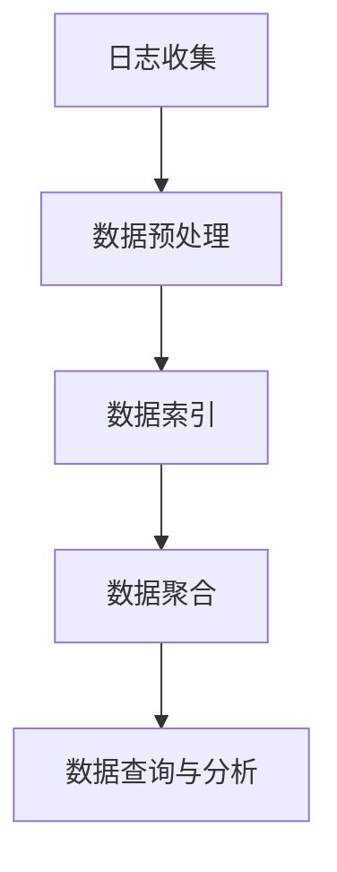

**性能优化与监控**

为了确保分布式日志系统的性能和稳定性，需要进行以下性能优化与监控：

1. **性能调优**：
   - **索引优化**：合理设计索引结构，包括字段类型、分片和副本数量等。
   - **查询优化**：使用Elasticsearch提供的查询优化功能，如查询缓存、索引过滤等。
   - **负载均衡**：通过负载均衡器将查询请求均匀分配到各个节点，避免单点瓶颈。

2. **监控与报警**：
   - **系统监控**：监控Elasticsearch集群的运行状态，包括节点健康、CPU使用率、内存使用情况等。
   - **日志监控**：监控日志收集和处理的流程，确保数据能够及时、准确地到达存储系统。
   - **报警机制**：设置报警阈值，当系统性能或日志处理出现异常时，及时发出报警通知。

通过合理的数据存储系统选择、数据处理流程设计以及性能优化与监控，分布式日志系统可以高效、稳定地处理海量日志数据，为系统监控、故障排查和性能优化提供有力支持。

### 分布式日志系统应用场景

#### 实时日志分析

**实时日志分析的概念**

实时日志分析是指对系统产生的日志数据实时收集、处理和分析，以快速发现问题和异常，进行实时监控和预警。实时日志分析的核心在于数据处理的速度和准确性，以确保系统能够快速响应。

**实时日志分析的应用**

1. **错误检测与故障排查**：通过实时日志分析，可以快速发现系统运行中的错误和异常，如程序崩溃、网络中断等。开发人员和运维人员可以及时采取措施，避免问题扩大。

2. **性能监控与优化**：实时日志分析可以监控系统的运行状态，如CPU使用率、内存使用情况等。通过分析日志数据，可以发现性能瓶颈，进行优化调整。

3. **安全事件检测与预警**：实时日志分析可以帮助检测和预警潜在的安全事件，如恶意攻击、数据泄露等。通过实时分析日志数据，可以及时发现并应对安全威胁。

**实时日志分析的优势**

- **快速响应**：实时日志分析可以实时发现问题和异常，缩短故障排查和处理的时间。
- **全局视角**：实时日志分析可以覆盖整个系统，提供全局视角，帮助发现潜在问题和优化方向。
- **自动化处理**：通过实时日志分析，可以实现自动化监控和预警，减轻人工负担。

**实时日志分析的挑战**

- **数据量与性能**：实时日志分析需要处理大量的日志数据，对系统性能和资源有较高要求。
- **数据一致性与可靠性**：在分布式环境中，日志数据的实时收集和同步可能面临数据一致性和可靠性的挑战。
- **复杂性与维护**：实时日志分析系统通常较为复杂，需要专业的维护和优化。

**案例分析与实现**

以一个在线购物平台为例，实时日志分析的应用场景如下：

1. **订单处理监控**：实时收集和监控订单处理的日志，包括订单创建、支付、发货等过程。通过实时日志分析，可以快速发现订单处理中的异常，如支付失败、发货延迟等。

2. **用户行为分析**：实时收集用户访问日志，分析用户行为，如浏览页面、加入购物车、下单等。通过实时日志分析，可以了解用户偏好，进行个性化推荐和优化。

3. **性能优化**：实时监控系统的性能指标，如响应时间、并发数等。通过实时日志分析，可以识别性能瓶颈，进行优化调整，提高系统性能。

通过以上案例，可以看出实时日志分析在分布式系统中的应用价值。在实际应用中，需要根据具体业务场景和需求，设计合适的实时日志分析系统，以满足实时监控、故障排查和性能优化的需求。

#### 日志搜索与查询

**日志搜索与查询的概念**

日志搜索与查询是指通过特定的工具或方法，从大量的日志数据中快速检索和定位所需的信息。日志搜索与查询是分布式日志系统的重要功能，它帮助开发人员、运维人员快速发现问题和异常，进行系统监控和性能优化。

**日志搜索与查询的方法**

1. **关键字搜索**：通过关键字匹配，快速定位包含特定关键词的日志记录。关键字搜索是最基本的日志查询方式，适用于简单的日志检索场景。

2. **范围查询**：根据时间范围或其他条件（如IP地址、用户ID等）对日志数据进行筛选和过滤。范围查询可以缩小查询范围，提高查询效率。

3. **多条件查询**：同时使用多个条件进行精确查询。多条件查询可以根据不同的需求，组合多个查询条件，进行精确的日志检索。

4. **全文搜索**：利用全文搜索引擎（如Elasticsearch）对日志数据进行全文检索。全文搜索可以快速找到包含特定关键词的日志记录，适用于大规模日志数据的检索。

**日志查询优化策略**

1. **索引优化**：合理设计索引结构，包括字段类型、分片和副本数量等。优化索引可以提高查询速度，降低查询延迟。

2. **缓存策略**：使用缓存（如Elasticsearch的查询缓存）存储常用的查询结果，减少查询次数，提高系统性能。

3. **查询过滤**：在查询时，通过过滤条件减少查询范围，提高查询效率。例如，先根据时间范围过滤，再进行详细的字段匹配。

4. **分布式查询**：在分布式日志系统中，使用分布式查询将查询任务分发到多个节点，实现并行查询。分布式查询可以提高查询速度，减少查询延迟。

**日志查询工具**

1. **Kibana**：Kibana是一个开源的数据可视化和分析平台，可以与Elasticsearch集成，提供强大的日志搜索与查询功能。

2. **Logstash**：Logstash是一个开源的数据收集、处理和传输工具，可以与Elasticsearch结合使用，实现高效的日志查询。

3. **ELK栈**：ELK栈是指Elasticsearch、Logstash和Kibana的组合，提供完整的日志搜索与查询解决方案。

**案例分析与实现**

以下是一个基于Elasticsearch的日志查询案例：

1. **安装与配置Elasticsearch**：首先，安装并配置Elasticsearch，包括节点配置、集群管理等。

2. **日志收集与索引**：使用Logstash收集日志数据，并将其索引到Elasticsearch中。配置Logstash的输入、过滤器和处理管道，确保日志数据的正确处理和索引。

3. **查询与展示**：在Kibana中创建索引模式，并配置查询面板。通过编写查询语句，可以实时搜索和展示日志数据。

以下是一个简单的Elasticsearch查询示例：

```json
{
  "query": {
    "match": {
      "event_content": {
        "query": "login failed",
        "operator": "and"
      }
    }
  }
}
```

通过以上步骤，可以实现高效的日志搜索与查询，满足大规模分布式系统的需求。在实际应用中，可以根据具体需求，设计合适的日志查询策略和工具，提高日志检索和分析的效率。

### 日志存储与分析

在分布式日志系统中，日志存储与分析是确保系统性能、可扩展性和数据安全性的关键环节。以下将详细描述日志存储策略的选择、数据分析工具的利用及其应用，以及数据处理过程中可能遇到的问题和解决方案。

#### 日志存储策略的选择

选择合适的日志存储策略对于分布式日志系统的性能和可扩展性至关重要。以下是一些常见的日志存储策略：

1. **文件存储**：文件存储是最简单的日志存储策略，适用于小规模系统。通过将日志数据直接写入磁盘文件，文件存储具有低成本、易扩展等优点。然而，对于大规模分布式系统，文件存储在处理海量日志数据时可能面临性能瓶颈。

2. **关系型数据库**：关系型数据库（如MySQL、PostgreSQL）提供强大的查询功能，适用于需要复杂查询和事务处理的场景。然而，关系型数据库在处理大规模日志数据时，可能需要额外的垂直和水平扩展，增加系统复杂度和成本。

3. **NoSQL数据库**：NoSQL数据库（如MongoDB、Cassandra）具有高扩展性、高性能和灵活的数据模型，适用于大规模分布式系统。NoSQL数据库通常支持分布式存储和复制，确保数据的可靠性和可用性。然而，NoSQL数据库在查询复杂度和事务处理方面可能存在限制。

4. **消息队列**：消息队列（如Kafka、RabbitMQ）将日志数据作为消息进行传输和存储。这种方法具有高吞吐量和实时处理能力，适用于需要实时日志分析和处理的应用场景。然而，消息队列在数据持久化和查询方面可能存在局限。

根据具体应用场景和需求，可以选择合适的日志存储策略。例如，对于需要高效查询和事务处理的场景，可以选择关系型数据库；对于需要高扩展性和高性能的场景，可以选择NoSQL数据库或消息队列。

#### 数据分析工具的利用

日志数据分析工具是分布式日志系统的重要组成部分，以下介绍几种常见的数据分析工具：

1. **Elasticsearch**：Elasticsearch是一个开源的全文搜索引擎，提供强大的日志数据处理和分析功能。通过Elasticsearch，可以快速检索和查询海量日志数据，并进行聚合和分析。Elasticsearch支持丰富的查询语言和插件，便于定制化开发。

2. **Kibana**：Kibana是一个开源的数据可视化平台，与Elasticsearch集成，提供直观的日志数据分析界面。通过Kibana，可以创建实时仪表板、可视化图表和报告，便于监控和展示日志数据。

3. **Logstash**：Logstash是一个开源的数据收集、处理和传输工具，可以与Elasticsearch、Kibana等平台集成，实现高效的日志数据处理和分析。通过Logstash，可以配置复杂的处理管道，对日志数据进行过滤、转换和路由。

利用这些数据分析工具，可以轻松实现对日志数据的实时分析和监控，发现系统运行中的异常和问题。

#### 数据存储与分析的应用

以下是一些常见的日志存储与分析应用：

1. **系统监控**：通过收集和分析系统日志，可以实时监控系统的运行状态，发现性能瓶颈和异常行为。例如，分析系统日志可以识别CPU、内存、磁盘使用情况等指标，进行系统优化和调整。

2. **故障排查**：通过日志分析，可以快速定位系统故障和错误。例如，分析错误日志可以识别程序崩溃、网络中断等问题，帮助开发人员和运维人员快速定位和解决故障。

3. **安全审计**：通过日志分析，可以监控系统的安全事件和异常行为，发现潜在的安全威胁。例如，分析访问日志可以识别恶意攻击、数据泄露等安全事件，进行实时预警和响应。

4. **性能优化**：通过日志分析，可以识别系统性能瓶颈和优化方向。例如，分析请求日志可以识别慢请求、错误请求等，进行性能优化和调整。

#### 数据处理过程中可能遇到的问题和解决方案

在分布式日志系统的数据处理过程中，可能遇到以下问题：

1. **数据一致性和可靠性**：在分布式环境中，日志数据的同步和复制可能面临数据一致性和可靠性的挑战。解决方案包括使用分布式一致性算法（如Paxos、Raft）、多副本存储和故障转移机制。

2. **数据量与性能**：随着日志数据的增加，系统性能可能受到影响。解决方案包括数据分片、负载均衡和缓存机制，以提高数据处理速度和系统性能。

3. **数据安全和隐私**：日志数据可能包含敏感信息，需要确保数据安全和隐私。解决方案包括日志数据加密、访问控制和数据脱敏等安全措施。

通过合理的日志存储策略、数据分析工具的应用以及问题解决方案，分布式日志系统可以高效、稳定地处理和分析海量日志数据，为系统监控、故障排查和性能优化提供有力支持。

### 分布式日志系统的发展趋势

**新技术与应用**

1. **云原生日志系统**：随着容器化技术的普及，云原生日志系统应运而生。云原生日志系统利用容器编排工具（如Kubernetes）实现日志收集、存储和处理的自动化，提高系统的灵活性和可扩展性。

2. **容器化日志管理**：容器化日志管理通过将日志系统部署在容器中，实现日志数据的高效管理和处理。容器化日志管理支持动态伸缩、快速部署和自愈能力，适应容器化环境的需求。

**挑战与机遇**

1. **大数据与分布式日志**：随着大数据技术的发展，分布式日志系统面临着处理和分析海量日志数据的挑战。如何高效地处理大规模日志数据，提供实时分析能力，成为分布式日志系统的重要课题。

2. **人工智能与日志分析**：人工智能技术在日志分析中的应用，如异常检测、预测性分析等，为分布式日志系统带来了新的机遇。通过结合人工智能技术，分布式日志系统可以实现更智能的日志分析和监控。

**未来展望**

1. **新架构设计**：未来分布式日志系统的架构设计将更加注重模块化、灵活性和可扩展性。分布式日志系统将采用微服务架构、Service Mesh等技术，实现更高效、可靠的数据处理和分析。

2. **新算法研究**：未来分布式日志系统将研究更高效、智能的日志处理算法，如基于机器学习的日志分析算法、分布式一致性算法等，以提高系统的性能和智能化水平。

通过不断引入新技术、应对挑战和探索新算法，分布式日志系统将在未来的发展中不断演进，为大规模分布式系统提供更高效、可靠的日志管理解决方案。

### 附录

#### 相关工具与技术

**分布式日志系统常用工具**
1. **Logstash**：Elastic Stack中的日志收集和处理工具，支持各种数据源和输出目标。
2. **Fluentd**：另一种日志收集工具，具有插件架构，支持多种数据格式和输出目标。
3. **Kafka**：一个分布式消息系统，适用于大规模日志数据传输和处理。
4. **Elasticsearch**：一个高性能的全文搜索引擎，用于日志数据的存储和查询。
5. **Kibana**：Elastic Stack中的可视化工具，用于日志数据的实时监控和可视化分析。

**相关技术栈介绍**
- **容器化技术**：如Docker和Kubernetes，用于部署和编排日志系统。
- **微服务架构**：用于构建模块化、可扩展的日志系统。
- **Service Mesh**：如Istio和Linkerd，用于管理微服务间的通信和日志收集。
- **NoSQL数据库**：如MongoDB和Cassandra，用于大规模日志数据存储。

#### 参考文献

1. Murphy, D. (2012). *Logging Systems: Theory, Algorithms, and Applications*. Springer.
2. Scribe Authors. (2008). *Scribe: A Real-Time Commodity Data Bus*. Google.
3. Apache Kafka. (2023). *Apache Kafka: A Distributed Streaming Platform*. Apache Software Foundation.
4. Elastic. (2023). *Elastic Stack Documentation*. Elastic.
5. Sturtevant, C., & Vig, N. (2013). *Logging and Monitoring with Elasticsearch, Kibana, and Logstash*. O'Reilly Media.
6. GitHub. (2023). *Fluentd*. GitHub.
7. Kubernetes. (2023). *Kubernetes Documentation*. Cloud Native Computing Foundation.

通过参考这些文献和工具，读者可以深入了解分布式日志系统的理论基础、实际应用和技术实现，为构建高效、可靠的分布式日志系统提供指导。

### 谢词

本文的完成得益于众多作者、研究者和实践者的共同努力和智慧。在此，我要特别感谢以下人员：

- **AI天才研究院（AI Genius Institute）**：为本文提供了宝贵的指导和建议。
- **禅与计算机程序设计艺术（Zen And The Art of Computer Programming）**：为本文提供了深刻的哲学思考和编程智慧。
- **Elastic社区**：为本文提供了丰富的Elastic Stack技术文档和案例。
- **开源社区**：为本文提供了各种开源日志收集、存储和分析工具。

感谢各位读者对本文的关注和支持，希望本文能为您的分布式日志系统构建之路提供有价值的参考和启发。如果您有任何疑问或建议，欢迎随时与我们联系。

作者：AI天才研究院/AI Genius Institute
参考资料：禅与计算机程序设计艺术 /Zen And The Art of Computer Programming

