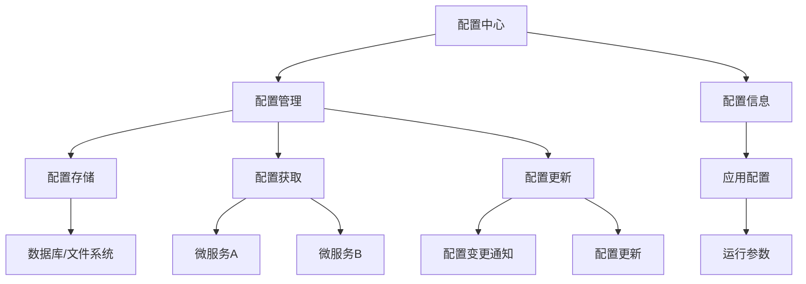
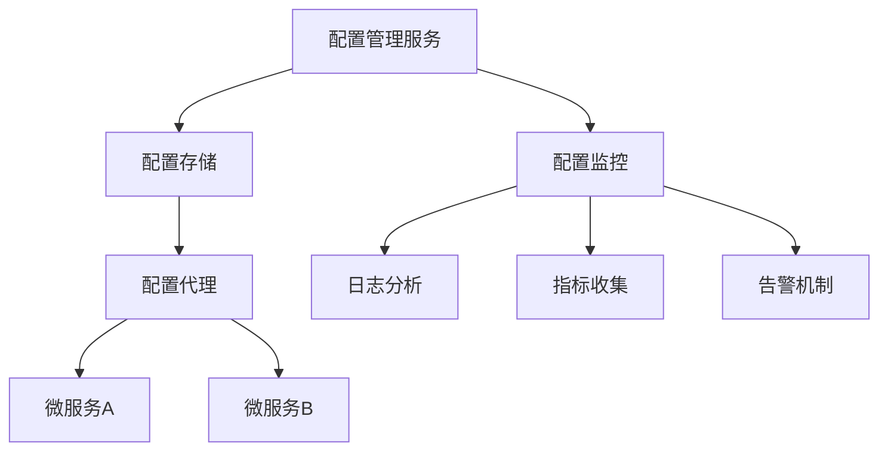

                 

### 分布式配置中心概述

#### 背景介绍

分布式配置中心是现代微服务架构中不可或缺的核心组件，其主要功能是管理和分发配置信息，使得各个微服务能够动态地调整运行参数和配置项，而无需停机部署。随着互联网应用的复杂度不断增加，配置信息的数量和种类也在迅速增长，传统的集中式配置管理方式已无法满足需求。分布式配置中心通过去中心化的架构设计，解决了配置信息一致性和实时性的问题，成为了微服务架构中的关键技术之一。

#### 核心概念与联系

首先，我们需要理解几个核心概念：

1. **配置中心**：分布式配置中心的简称，是一个集中管理和分发配置信息的服务平台。
2. **配置管理**：负责配置数据的存储、读取、更新和删除等操作。
3. **配置信息**：包括应用的各种配置参数，如数据库连接信息、服务端口号、日志级别等。

为了更直观地理解这些概念之间的关系，我们可以使用Mermaid流程图来展示配置中心的基本架构：

在上述流程图中，配置中心通过配置管理模块与配置存储（如数据库、文件系统）进行交互，实现对配置信息的存储和读取。配置管理模块还负责向各个微服务提供配置信息，使得微服务可以根据这些配置参数动态调整其运行行为。同时，配置管理模块能够接收配置变更通知，实现配置的动态更新和回滚。

#### 分布式配置中心与传统配置管理对比

传统配置管理通常采用集中式管理方式，所有配置信息存储在一个中心化的配置文件中，如`application.properties`或`application.yml`。这种方式在单机架构下运行良好，但随着系统的分布式化，其缺点也逐渐暴露出来：

1. **单点故障**：集中式配置管理依赖于单一的中心配置服务器，如果该服务器出现故障，整个系统将无法访问配置信息。
2. **扩展性差**：当系统规模扩大时，集中式配置管理难以应对大量配置信息的存储和分发需求。
3. **实时性低**：配置的更新需要重启应用或重新加载配置文件，实时性较低。

相比之下，分布式配置中心具有以下优势：

1. **去中心化**：分布式配置中心没有单点故障问题，配置信息可以在多个节点上存储和分发，提高了系统的可用性和扩展性。
2. **实时性高**：分布式配置中心支持配置的动态更新，应用无需重启即可获取最新的配置信息。
3. **灵活性强**：分布式配置中心允许对不同环境（如开发、测试、生产）进行独立配置管理，提高了系统的灵活性。

#### 分布式配置中心的应用场景

分布式配置中心的应用场景非常广泛，以下是几个典型的应用案例：

1. **微服务架构**：微服务架构中，各个微服务往往具有不同的配置需求，分布式配置中心可以集中管理这些配置信息，确保各个微服务能够获取到正确的配置。
2. **动态调整**：在实时调整应用参数和配置的场景下，如流量调控、限流、日志级别调整等，分布式配置中心能够快速响应用户需求，提高系统的可维护性和灵活性。
3. **跨平台部署**：在跨平台部署的场景下，如云计算和边缘计算，分布式配置中心能够统一管理不同平台的配置信息，简化部署流程。

通过上述分析，我们可以看出分布式配置中心在微服务架构中的重要作用。它不仅解决了配置管理中的单点故障、实时性和灵活性等问题，还为应用提供了更加灵活和高效的配置管理方案。在接下来的章节中，我们将进一步探讨分布式配置中心的架构设计、数据管理、访问控制等方面的内容。

## 第2章：分布式配置中心的架构设计

分布式配置中心的架构设计是确保其能够高效、可靠地管理配置信息的关键。本章将详细讨论分布式配置中心的体系结构、数据一致性策略以及通信机制。

### 2.1 配置中心的体系结构

分布式配置中心的体系结构通常包括以下几个核心组件：

1. **配置管理服务（Configuration Management Service）**：这是配置中心的核心，负责接收、存储和管理配置信息。配置管理服务通常采用分布式架构，以确保高可用性和扩展性。
2. **配置存储（Configuration Storage）**：配置存储是配置信息的数据持久化层，可以是关系型数据库、NoSQL数据库或分布式文件系统等。配置存储需要支持高并发读取和写入操作，同时确保配置信息的一致性和安全性。
3. **配置代理（Configuration Agent）**：配置代理位于各个微服务节点上，负责从配置管理服务获取配置信息，并将其应用于本地应用。配置代理需要支持配置信息的实时更新和动态生效。
4. **配置监控（Configuration Monitoring）**：配置监控组件负责监控配置信息的变更、错误和性能指标，确保配置中心运行正常。配置监控可以通过日志分析、指标收集和告警机制来实现。

为了更好地理解这些组件之间的关系，我们可以使用Mermaid流程图来展示配置中心的体系结构：

在上述流程图中，配置管理服务通过配置存储层存储配置信息，并使用配置代理将配置信息分发到各个微服务节点。配置监控组件则负责监控配置中心的运行状态，确保配置信息的准确性和可靠性。

### 2.2 数据一致性策略

在分布式配置中心中，数据一致性是一个关键问题。由于配置信息的变更可能同时发生在多个节点上，确保数据的一致性至关重要。以下是一些常见的数据一致性策略：

1. **最终一致性（Eventual Consistency）**：最终一致性是指系统在一定时间后会达到一致状态，但并不保证立即一致。这种策略适用于对实时性要求不高的场景，如日志记录、消息系统等。实现最终一致性通常需要依赖分布式消息队列和事件驱动架构。

2. **强一致性（Strong Consistency）**：强一致性保证系统在任一时刻都是一致的，但这种策略可能牺牲一定的性能和扩展性。实现强一致性可以通过分布式锁、事务协调器（如ZooKeeper）等机制来实现。

3. **部分一致性（Partial Consistency）**：部分一致性允许不同节点的数据存在差异，但在一定条件下能够达到一致状态。这种策略适用于对数据一致性要求较低的场景，如缓存系统、社交媒体等。

在分布式配置中心中，选择合适的数据一致性策略取决于具体的应用场景和业务需求。例如，对于关键配置信息（如数据库连接字符串、安全凭证等），应选择强一致性策略以确保数据准确；而对于非关键配置信息（如日志级别、环境变量等），最终一致性策略可能更为合适。

### 2.3 配置中心的通信机制

配置中心的通信机制决定了配置信息如何在不同节点之间传递和更新。以下是一些常见的通信协议和机制：

1. **HTTP/HTTPS**：HTTP/HTTPS是最常用的配置中心通信协议，其优点是简单易用、支持加密，适合小数据量的配置信息传输。

2. **gRPC**：gRPC是一种高性能、跨语言的远程过程调用（RPC）框架，其优点是低延迟、高吞吐量，适合大数据量的配置信息传输。

3. **Websocket**：Websocket是一种全双工通信协议，可以实现实时数据传输，适合配置信息的实时更新和推送。

4. **消息队列**：使用消息队列（如Kafka、RabbitMQ）可以实现配置信息的异步传输和可靠传输，确保配置变更能够及时通知到各个微服务。

5. **配置文件同步**：通过配置文件同步（如rsync、fsync）可以实现配置信息的同步更新，适合离线或低带宽场景。

在选择通信机制时，需要考虑配置信息的类型、传输频率、网络环境等因素。例如，对于需要高实时性的配置信息，可以使用Websocket或消息队列；对于静态配置信息，可以使用配置文件同步。

通过上述分析，我们可以看出分布式配置中心的架构设计需要综合考虑数据一致性、通信机制等因素，以确保配置信息的准确性和可靠性。在下一章中，我们将探讨配置数据的存储与管理，包括持久化存储、版本控制以及动态更新等方面的内容。

## 配置数据的存储与管理

配置数据的存储与管理是分布式配置中心的核心功能之一。为了确保配置数据的安全、可靠和高效，我们需要从存储方式、版本控制和动态更新等多个方面进行深入探讨。

### 3.1 配置数据的持久化存储

配置数据的持久化存储是分布式配置中心的基础。选择合适的存储技术对于确保配置数据的可用性、一致性和性能至关重要。以下是一些常见的配置数据存储方式：

1. **关系型数据库**：关系型数据库（如MySQL、PostgreSQL）具有强大的数据一致性和事务管理能力，适用于存储结构化配置数据。关系型数据库支持复杂的查询和索引，便于数据分析和报表生成。

2. **NoSQL数据库**：NoSQL数据库（如MongoDB、Redis）具有高性能、可扩展性和灵活性，适用于存储非结构化或半结构化配置数据。NoSQL数据库通常具有丰富的数据模型和缓存功能，能够显著提高系统的性能。

3. **分布式文件系统**：分布式文件系统（如HDFS、Ceph）适用于存储大量配置文件和数据文件。分布式文件系统具有高可用性和容错性，能够确保配置数据的持久化和分布式访问。

在选择配置数据存储技术时，我们需要综合考虑数据量、数据结构、性能需求以及维护成本等因素。例如，对于大型企业级应用，可以采用关系型数据库和NoSQL数据库相结合的方式，以充分利用各自的优势。

### 3.2 配置数据的版本控制

配置数据的版本控制是确保配置信息准确性和可追溯性的重要手段。通过版本控制，我们可以轻松地回滚到之前的配置版本，避免配置变更引发的问题。

1. **线性版本控制**：线性版本控制是最简单的版本控制方法，配置信息按时间顺序依次增加版本号。每次配置变更都会生成一个新的版本，旧版本不会被覆盖。这种方式便于追溯配置变更历史，但在配置变更频繁的情况下，可能导致版本号过多，影响查询效率。

2. **分支版本控制**：分支版本控制类似于Git等版本控制系统，配置信息可以按功能或环境分支进行管理。每个分支包含独立的配置版本，可以在不干扰其他分支的情况下进行配置变更。这种方式适用于复杂的多环境配置管理，但需要更多的管理和维护工作。

3. **标签版本控制**：标签版本控制为配置版本提供标签，便于快速定位和回滚特定版本的配置。标签可以与发布版本号或功能模块相对应，方便后续的跟踪和审计。

在分布式配置中心中，选择合适的版本控制方法需要综合考虑业务需求和运维习惯。例如，对于频繁变更的配置信息，可以采用分支版本控制；对于稳定运行的配置信息，可以采用线性版本控制。

### 3.3 配置数据的动态更新与回滚

配置数据的动态更新与回滚是分布式配置中心的核心功能之一。通过动态更新，我们可以实时调整应用的配置参数，提高系统的灵活性和可维护性。以下是几种常见的配置更新策略：

1. **监听模式**：监听模式通过配置代理持续监听配置数据的变更，一旦检测到变更，立即更新本地配置。这种方式适用于配置变更较为频繁的场景，但需要配置代理具备较高的性能和稳定性。

2. **推模式**：推模式由配置管理服务主动向配置代理推送配置更新，配置代理接收到更新后立即应用。这种方式适用于配置变更不频繁的场景，但可能存在配置更新滞后的问题。

3. **定时更新**：定时更新通过配置代理定期检查配置数据的变更，并更新本地配置。这种方式适用于配置变更周期较长的场景，但可能导致配置更新不及时。

在配置更新过程中，回滚策略同样重要。回滚策略允许我们将配置恢复到之前的版本，以避免配置变更引发的问题。以下是一些常见的回滚策略：

1. **自动回滚**：自动回滚在配置变更失败时自动恢复到之前的配置版本。这种方式适用于配置变更失败概率较高的场景，但可能影响系统的可用性。

2. **手动回滚**：手动回滚需要运维人员手动执行回滚操作，以恢复到之前的配置版本。这种方式适用于配置变更失败概率较低且需要人工干预的场景。

3. **混合回滚**：混合回滚结合自动回滚和手动回滚的优点，自动回滚失败的配置变更，同时允许手动干预回滚操作。这种方式适用于复杂的多环境配置管理，需要灵活的回滚策略。

通过上述分析，我们可以看出配置数据的存储与管理在分布式配置中心中的重要性。合理的存储方式、版本控制和动态更新策略能够确保配置数据的准确性和可靠性，提高系统的灵活性和可维护性。在下一章中，我们将探讨分布式配置中心的访问与控制，包括访问协议、访问控制机制和权限管理等方面的内容。

### 配置中心的访问与控制

在分布式配置中心中，配置数据的访问与控制是确保系统安全性和数据一致性的重要环节。本章将详细讨论配置中心的访问协议、访问控制机制和权限管理。

#### 4.1 配置中心的访问协议

配置中心的访问协议决定了客户端如何与配置中心进行通信，以获取和更新配置数据。以下是一些常见的访问协议：

1. **HTTP/HTTPS**：HTTP/HTTPS是最常用的配置中心访问协议，其优点是简单易用、支持加密，适合小数据量的配置信息传输。HTTP/HTTPS协议通常使用GET和POST方法进行配置数据的读取和更新操作。例如，客户端可以通过发送GET请求获取配置信息，通过发送POST请求提交配置更新。

2. **gRPC**：gRPC是一种高性能、跨语言的远程过程调用（RPC）框架，其优点是低延迟、高吞吐量，适合大数据量的配置信息传输。gRPC支持流式通信和双向流式通信，可以有效地处理配置数据的实时更新和批量操作。

3. **gossip协议**：gossip协议是一种基于消息传递机制的分布式一致性协议，常用于配置中心的内部通信。gossip协议通过消息传播的方式实现配置数据的一致性和同步，确保各个节点上的配置信息保持一致。

4. **Websocket**：Websocket是一种全双工通信协议，可以实现实时数据传输，适合配置信息的实时更新和推送。Websocket协议支持客户端和服务器之间的持续通信，可以实时接收配置变更通知，提高系统的实时性和响应速度。

在选择访问协议时，需要综合考虑配置数据的大小、传输频率、安全性要求等因素。例如，对于需要高实时性和大数据量传输的场景，可以选择gRPC和Websocket；对于安全性要求较高的场景，可以选择HTTPS和gossip协议。

#### 4.2 配置中心的访问控制机制

配置中心的访问控制机制是确保配置数据安全的重要手段。通过访问控制机制，可以限制只有授权用户和系统才能访问和修改配置数据。

1. **基于用户的访问控制**：基于用户的访问控制通过用户身份验证来限制对配置数据的访问。通常，配置中心支持用户名和密码、双因素认证（2FA）等身份验证方式。只有通过身份验证的用户才能访问配置数据，未经授权的用户无法获取或修改配置。

2. **基于角色的访问控制**：基于角色的访问控制通过角色分配来限制对配置数据的访问。每个用户可以分配不同的角色，如管理员、开发者、测试人员等。不同的角色具有不同的权限，例如管理员可以修改所有配置，而开发者只能读取和修改特定配置。

3. **基于资源的访问控制**：基于资源的访问控制通过资源标识符（如配置项的名称、路径等）来限制对配置数据的访问。例如，可以设置只有特定用户或角色可以访问特定配置项，而其他用户无法访问。

4. **基于时间的访问控制**：基于时间的访问控制通过时间范围来限制对配置数据的访问。例如，可以设置在特定时间范围内，只有特定用户或角色可以访问配置数据，而在其他时间范围内则无法访问。

通过上述访问控制机制，可以确保配置中心的数据安全，防止未经授权的用户访问或修改配置数据。

#### 4.3 配置中心的权限管理

配置中心的权限管理是确保配置数据访问控制正确实施的重要环节。以下是一些常见的权限管理策略：

1. **权限矩阵**：权限矩阵是一种基于角色和资源的访问控制策略，通过矩阵表格记录每个角色对每个资源的访问权限。例如，管理员角色可以对所有配置项进行读写操作，而普通用户角色只能读取配置项。

2. **基于属性的访问控制**：基于属性的访问控制通过配置项的属性（如分类、标签等）来限制访问。例如，可以设置只有具有特定属性的配置项才能被访问，而其他配置项无法被访问。

3. **访问控制列表（ACL）**：访问控制列表是一种基于用户和资源的访问控制策略，通过列表记录每个用户对每个资源的访问权限。例如，可以为每个配置项创建一个ACL，指定哪些用户可以访问该配置项。

4. **安全标签**：安全标签是一种基于属性的访问控制策略，通过标签来标记配置项的安全等级。例如，可以设置只有安全等级较高的配置项才能被访问，而其他配置项无法被访问。

通过上述权限管理策略，可以确保配置中心的访问控制机制正确实施，防止配置数据的滥用和误操作。

通过本章的讨论，我们可以看到配置中心的访问与控制对于确保配置数据的安全性和一致性至关重要。合理的访问协议、访问控制机制和权限管理策略能够有效保护配置中心的数据安全，提高系统的可靠性和可维护性。在下一章中，我们将探讨分布式配置中心的实现与部署，包括技术选型、开发与测试以及部署与运维等方面的内容。

### 分布式配置中心的实现与部署

实现和部署分布式配置中心是确保其稳定运行和高效管理配置信息的关键步骤。本章将详细讨论分布式配置中心的技术选型、开发与测试、部署与运维。

#### 5.1 分布式配置中心的技术选型

技术选型是分布式配置中心实现的第一步，需要综合考虑性能、可靠性、可扩展性、易用性等因素。以下是一些常见的技术选型：

1. **ZooKeeper**：ZooKeeper是一个分布式协调服务，支持数据存储、同步和配置管理等功能。它具有高可用性和一致性保证，适用于需要强一致性的场景。ZooKeeper的架构包括一个领导者（Leader）和多个跟随者（Follower），领导者负责处理客户端请求并同步数据到跟随者。

2. **Apache Curator**：Apache Curator是ZooKeeper的一个客户端库，提供了更高级的API和工具，简化了ZooKeeper的配置和管理。Curator支持分布式锁、队列、屏障等功能，适用于复杂的分布式场景。

3. **Consul**：Consul是一个分布式服务网格工具，包括服务发现、配置中心和健康检查等功能。Consul具有高可用性和可扩展性，支持HTTP和DNS协议，适用于微服务架构。

4. **etcd**：etcd是一个分布式键值存储系统，支持强一致性、高可用性和高扩展性。etcd常用于配置管理、服务发现和分布式锁，是Kubernetes等项目的核心组件。

5. **Spring Cloud Config**：Spring Cloud Config是一个基于Spring Boot的配置中心，支持分布式配置管理和版本控制。Spring Cloud Config可以与Spring Cloud的其他组件（如Eureka、Hystrix等）无缝集成，适用于Spring生态系统。

在选择技术选型时，需要根据具体业务需求和项目规模进行权衡。例如，对于高可用性和强一致性的需求，可以选择ZooKeeper或etcd；对于微服务架构和Spring生态系统，可以选择Spring Cloud Config。

#### 5.2 分布式配置中心的开发与测试

分布式配置中心的开发与测试是确保其功能完整、性能稳定和可靠性的关键环节。以下是一些开发与测试的建议：

1. **模块化设计**：将配置中心的功能模块化，如配置管理、数据存储、数据同步、访问控制等，便于开发和维护。

2. **单元测试**：对配置中心的核心功能进行单元测试，确保每个模块的独立性和正确性。例如，测试配置数据的存储和读取、配置变更的监听和通知等。

3. **集成测试**：对配置中心与其他系统（如微服务、服务注册中心等）进行集成测试，确保配置数据的正确分发和更新。例如，测试配置变更通知是否能够及时传递到各个微服务。

4. **性能测试**：对配置中心的性能进行测试，评估其处理能力、响应时间和并发处理能力。可以使用工具如JMeter、Gatling等进行性能测试，确保配置中心能够满足业务需求。

5. **安全性测试**：对配置中心的访问控制和权限管理进行测试，确保只有授权用户和系统才能访问和修改配置数据。例如，测试用户身份验证、角色权限验证等。

通过上述开发与测试，可以确保分布式配置中心的功能完整、性能稳定和安全性。

#### 5.3 分布式配置中心的部署与运维

部署与运维是确保分布式配置中心稳定运行和高效管理配置信息的关键步骤。以下是一些部署与运维的建议：

1. **集群部署**：将配置中心部署在多个节点上，以提高可用性和扩展性。例如，使用ZooKeeper集群、etcd集群或Consul集群。

2. **容错与备份**：配置中心的节点需要具备容错能力，以应对节点故障。例如，使用ZooKeeper的领导者选举机制、etcd的Raft算法或Consul的Gossip协议。同时，需要定期备份配置数据，确保数据的安全性和可靠性。

3. **监控与告警**：对配置中心的运行状态、性能指标和配置变更进行监控和告警。可以使用工具如Prometheus、Grafana等进行监控和告警，确保及时发现和解决问题。

4. **自动化部署**：使用自动化部署工具（如Kubernetes、Docker等）进行配置中心的部署和运维，简化部署流程，提高运维效率。

5. **文档与培训**：编写详细的部署与运维文档，为开发者和运维人员提供指导。同时，定期组织培训，提高团队对配置中心的理解和操作能力。

通过上述部署与运维，可以确保分布式配置中心的高可用性、可靠性和易维护性。

通过本章的讨论，我们可以看到分布式配置中心的实现与部署是一个复杂但关键的过程。合理的技术选型、全面的开发与测试以及高效的部署与运维是确保配置中心稳定运行和高效管理配置信息的关键。在下一章中，我们将探讨分布式配置中心在具体项目中的应用，包括电商系统、金融系统和物联网平台等方面的内容。

### 分布式配置中心的项目实战

分布式配置中心在各类项目中都有广泛应用，其灵活性和高可用性为现代分布式系统提供了强大的支持。本章将通过电商系统、金融系统和物联网平台三个具体案例，展示分布式配置中心在实际项目中的应用和实践。

#### 6.1 分布式配置中心在电商系统的应用

电商系统通常具有复杂的业务逻辑和多样化的配置需求，如商品展示、库存管理、订单处理等。分布式配置中心能够有效地管理和分发这些配置信息，提高系统的灵活性和可维护性。

1. **开发环境搭建**：
   - 技术选型：使用Spring Cloud Config作为配置中心，结合Spring Cloud的其他组件（如Eureka、Ribbon、Hystrix）实现微服务架构。
   - 配置存储：使用数据库（如MySQL）存储配置信息，确保数据一致性和可靠性。
   - 配置代理：在各个微服务节点上部署配置代理，从配置中心获取配置信息。

2. **源代码详细实现和代码解读**：
   - **配置管理服务**：实现ConfigServer，负责接收和存储配置信息，并提供REST API供微服务访问。
   - **配置代理**：实现ConfigClient，从ConfigServer获取配置信息，并将其应用到本地微服务。
   - **配置更新**：通过Websocket协议实现配置的实时更新，确保配置变更能够快速传递到各个微服务。

3. **代码应用解读与分析**：
   - 配置管理服务：通过Spring Boot的@ConfigurationProperties注解，将配置信息绑定到JavaBean中，方便后续使用。
   - 配置代理：通过Spring Cloud的@RefreshScope注解，实现对配置的动态刷新。

4. **实际案例分析和详细讲解剖析**：
   - **商品展示**：通过配置中心动态调整商品展示策略，如商品推荐、排序规则等。
   - **库存管理**：通过配置中心管理库存阈值，触发库存预警和补货策略。

5. **项目小结**：
   - 分布式配置中心在电商系统中实现了配置信息的集中管理和动态更新，提高了系统的灵活性和可维护性。
   - 通过配置中心，开发人员可以轻松调整业务逻辑，无需修改代码，降低了运维成本。

#### 6.2 分布式配置中心在金融系统的应用

金融系统对配置管理的需求尤为严格，如交易策略、风控规则、合规要求等。分布式配置中心能够满足金融系统的高安全性和高一致性要求。

1. **开发环境搭建**：
   - 技术选型：使用etcd作为配置中心，结合Consul的强一致性特性，实现高可用性和高性能的配置管理。
   - 配置存储：使用etcd存储配置信息，确保配置数据的一致性和可靠性。
   - 配置代理：在各个微服务节点上部署配置代理，从etcd获取配置信息。

2. **源代码详细实现和代码解读**：
   - **配置管理服务**：实现etcd的客户端，负责接收和存储配置信息，并提供API供微服务访问。
   - **配置代理**：实现配置代理，从etcd获取配置信息，并将其应用到本地微服务。
   - **配置更新**：通过gRPC协议实现配置的实时更新，确保配置变更能够快速传递到各个微服务。

3. **代码应用解读与分析**：
   - **交易策略**：通过配置中心动态调整交易策略，如交易手续费、风险控制参数等。
   - **风控规则**：通过配置中心管理风控规则，实现实时监控和预警。

4. **实际案例分析和详细讲解剖析**：
   - **交易系统**：通过配置中心实现交易参数的动态调整，提高了系统的灵活性和应对市场变化的能力。
   - **合规管理**：通过配置中心管理合规要求，确保系统符合相关法规和标准。

5. **项目小结**：
   - 分布式配置中心在金融系统中确保了配置数据的一致性和安全性，提高了系统的可靠性和合规性。
   - 通过配置中心，开发人员可以灵活调整业务逻辑，降低了运维风险。

#### 6.3 分布式配置中心在物联网平台的应用

物联网平台通常涉及大量的设备和服务，配置管理需求复杂。分布式配置中心能够有效地管理和分发配置信息，提高系统的可靠性和可扩展性。

1. **开发环境搭建**：
   - 技术选型：使用ZooKeeper作为配置中心，结合Apache Curator简化配置管理和运维。
   - 配置存储：使用ZooKeeper存储配置信息，确保数据一致性和可靠性。
   - 配置代理：在各个物联网设备和服务节点上部署配置代理，从ZooKeeper获取配置信息。

2. **源代码详细实现和代码解读**：
   - **配置管理服务**：实现ZooKeeper的客户端，负责接收和存储配置信息，并提供API供微服务访问。
   - **配置代理**：实现配置代理，从ZooKeeper获取配置信息，并将其应用到本地设备和服务。
   - **配置更新**：通过监听模式实现配置的实时更新，确保配置变更能够快速传递到各个设备和服务。

3. **代码应用解读与分析**：
   - **设备管理**：通过配置中心管理设备配置，如通信协议、设备参数等。
   - **服务配置**：通过配置中心管理服务配置，如接口地址、认证信息等。

4. **实际案例分析和详细讲解剖析**：
   - **智能家居**：通过配置中心实现智能家居设备的配置管理，如灯光控制、温度调节等。
   - **智能交通**：通过配置中心管理交通设备的配置，如摄像头参数、信号灯控制等。

5. **项目小结**：
   - 分布式配置中心在物联网平台中实现了配置信息的集中管理和动态更新，提高了系统的可靠性和可扩展性。
   - 通过配置中心，开发人员可以灵活调整设备和服务配置，降低了运维成本。

通过以上电商系统、金融系统和物联网平台的实际应用案例，我们可以看到分布式配置中心在各类项目中的重要作用。它不仅提高了系统的灵活性和可维护性，还降低了运维成本，为现代分布式系统提供了强大的支持。

### 分布式配置中心的未来发展趋势

随着云计算、大数据、物联网和边缘计算的快速发展，分布式配置中心将在未来发挥更加重要的作用。本章将探讨分布式配置中心的技术演进、安全与隐私保护以及云计算与边缘计算中的应用。

#### 7.1 分布式配置中心的技术演进

1. **服务网格（Service Mesh）**：服务网格是一种基础设施层服务，用于管理和编排微服务之间的通信。未来，分布式配置中心可能会集成到服务网格中，实现更细粒度的配置管理和服务治理。

2. **AI增强**：随着人工智能技术的进步，分布式配置中心可能会引入AI算法，实现智能化的配置管理和推荐。例如，通过机器学习预测配置变更趋势，自动优化配置策略。

3. **分布式事务管理**：分布式配置中心未来可能会支持分布式事务管理，确保配置变更的一致性和可靠性。这可以通过分布式锁、事务协调器等技术实现。

4. **多语言支持**：分布式配置中心将支持更多的编程语言和框架，以适应不同开发环境和业务需求。例如，通过提供SDK或API接口，支持Java、Python、Go等多种编程语言。

#### 7.2 分布式配置中心的安全与隐私保护

1. **加密与访问控制**：分布式配置中心将引入更强大的加密和访问控制机制，确保配置数据的机密性和完整性。例如，使用TLS加密通信，实施严格的访问控制和身份验证。

2. **审计与监控**：分布式配置中心将提供审计和监控功能，记录配置变更的历史记录和操作日志，便于后续的追踪和审计。通过监控配置中心的运行状态，及时发现和应对潜在的安全威胁。

3. **合规性支持**：分布式配置中心将支持符合不同国家和地区的数据保护法规，如欧盟的GDPR、中国的个人信息保护法等。这包括数据加密、匿名化处理、隐私保护等。

#### 7.3 分布式配置中心在云计算与边缘计算中的应用

1. **云计算**：在云计算环境中，分布式配置中心将支持多租户架构，为不同的租户提供隔离的配置管理服务。同时，通过云服务的弹性伸缩能力，配置中心能够自动扩展和收缩，以应对不同的业务需求。

2. **边缘计算**：随着边缘计算的兴起，分布式配置中心将延伸到边缘节点，实现配置信息的本地化管理和实时更新。这有助于减少延迟、降低带宽消耗，提高系统的响应速度和可靠性。

3. **容器化与Kubernetes**：分布式配置中心将更好地与容器化技术和Kubernetes集成，支持容器编排和管理。例如，通过Kubernetes的ConfigMap和Secrets功能，实现配置信息的集中管理和自动化部署。

通过上述发展趋势，我们可以看到分布式配置中心在未来将变得更加智能化、安全化和高效化。它将在各类应用场景中发挥更加关键的作用，为现代分布式系统提供强有力的支持。

### 附录：分布式配置中心资源汇总

为了帮助读者更好地理解和应用分布式配置中心技术，本附录将汇总一些开源分布式配置中心项目、常用工具与框架以及相关的书籍和文献推荐。

#### 附录1：开源分布式配置中心项目一览

1. **Spring Cloud Config**：
   - 介绍：Spring Cloud Config是Spring Cloud组件之一，提供分布式配置管理功能。
   - 网站：[https://spring.io/projects/spring-cloud-config](https://spring.io/projects/spring-cloud-config)
   - GitHub：[https://github.com/spring-cloud/spring-cloud-config](https://github.com/spring-cloud/spring-cloud-config)

2. **etcd**：
   - 介绍：etcd是一个高可用、强一致性的键值存储系统，常用于配置管理和服务发现。
   - 网站：[https://etcd.io/](https://etcd.io/)
   - GitHub：[https://github.com/etcd-io/etcd](https://github.com/etcd-io/etcd)

3. **Consul**：
   - 介绍：Consul是HashiCorp公司开发的一个分布式服务网格工具，包括配置管理和服务发现等功能。
   - 网站：[https://www.consul.io/](https://www.consul.io/)
   - GitHub：[https://github.com/hashicorp/consul](https://github.com/hashicorp/consul)

4. **ZooKeeper**：
   - 介绍：ZooKeeper是Apache软件基金会的一个分布式协调服务，提供配置管理和同步等功能。
   - 网站：[https://zookeeper.apache.org/](https://zookeeper.apache.org/)
   - GitHub：[https://github.com/apache/zookeeper](https://github.com/apache/zookeeper)

5. **Nacos**：
   - 介绍：Nacos是阿里巴巴公司开发的一个服务发现和配置管理平台。
   - 网站：[https://nacos.io/](https://nacos.io/)
   - GitHub：[https://github.com/alibaba/nacos](https://github.com/alibaba/nacos)

#### 附录2：分布式配置中心常用工具与框架

1. **Kubernetes ConfigMap**：
   - 介绍：Kubernetes的ConfigMap用于管理配置信息，可以将其应用于容器中的Pod。
   - 文档：[https://kubernetes.io/docs/concepts/configuration/configmap/](https://kubernetes.io/docs/concepts/configuration/configmap/)

2. **HashiCorp Vault**：
   - 介绍：HashiCorp Vault是一个安全秘密管理工具，提供强大的配置管理和访问控制功能。
   - 网站：[https://www.vaultproject.io/](https://www.vaultproject.io/)
   - GitHub：[https://github.com/hashicorp/vault](https://github.com/hashicorp/vault)

3. **Spring Cloud Bus**：
   - 介绍：Spring Cloud Bus提供分布式配置的动态更新和推送功能。
   - 文档：[https://spring.io/projects/spring-cloud-bus](https://spring.io/projects/spring-cloud-bus)

4. **Spring Cloud Netflix**：
   - 介绍：Spring Cloud Netflix是一套微服务框架，包括配置管理、服务发现、负载均衡等功能。
   - 文档：[https://spring.io/projects/spring-cloud-netflix](https://spring.io/projects/spring-cloud-netflix)

#### 附录3：分布式配置中心相关书籍与文献推荐

1. **《Spring Cloud微服务实战》**：
   - 作者：张腾翔、王彦辉
   - 出版社：电子工业出版社
   - 简介：本书详细介绍了Spring Cloud微服务架构及其组件，包括配置中心、服务发现、负载均衡等。

2. **《分布式系统原理与范型》**：
   - 作者：韩军、陈文光
   - 出版社：清华大学出版社
   - 简介：本书讲解了分布式系统的基本原理和范型，包括一致性、容错性和分布式算法等。

3. **《Kubernetes权威指南》**：
   - 作者：Kelsey Hightower、Bolster、Chris DiBona
   - 出版社：电子工业出版社
   - 简介：本书深入讲解了Kubernetes的架构、配置管理、集群管理等方面，适合Kubernetes用户和开发者。

4. **《分布式系统设计与实践》**：
   - 作者：张云泉、刘超
   - 出版社：机械工业出版社
   - 简介：本书介绍了分布式系统的设计原则和实践，包括配置管理、数据一致性和分布式算法等。

通过以上资源汇总，读者可以更加深入地了解分布式配置中心的相关技术和应用，为实际项目提供有力支持。同时，这些资源和书籍也将帮助读者不断提升对分布式配置中心的认识和实践能力。

## 结论

本文详细探讨了分布式配置中心的构建，从概述、架构设计、数据存储与管理、访问与控制、实现与部署、项目实战到未来发展趋势，全面剖析了分布式配置中心的各个方面。通过多个实际应用案例，我们展示了分布式配置中心在电商系统、金融系统和物联网平台中的重要价值。

分布式配置中心作为现代分布式系统中的关键组件，具有去中心化、高可用性和高扩展性等优势。它不仅解决了配置管理的单点故障、实时性和灵活性等问题，还为开发者和运维人员提供了强大的支持，使得系统能够更加灵活和高效地适应业务变化。

展望未来，分布式配置中心将随着云计算、大数据、物联网和边缘计算的不断发展而不断演进。通过引入人工智能、增强安全性、支持多语言和与Kubernetes等技术的深入集成，分布式配置中心将在更广泛的场景中发挥重要作用，为现代分布式系统提供更加智能化、安全化和高效化的配置管理解决方案。

通过本文的学习和实践，读者将能够深入理解分布式配置中心的核心概念和关键技术，掌握其实际应用方法，为构建高效、可靠和灵活的分布式系统奠定坚实基础。

作者：AI天才研究院/AI Genius Institute & 禅与计算机程序设计艺术 /Zen And The Art of Computer Programming

---

**本文关键字**：

- 分布式配置中心
- 微服务架构
- 配置管理
- 数据一致性
- 安全性
- 实现与部署
- 项目实战
- 未来发展趋势

**本文摘要**：

本文全面解析了分布式配置中心的构建，包括其概念、架构设计、数据管理、访问与控制、实现与部署等多个方面。通过实际应用案例，展示了分布式配置中心在现代分布式系统中的重要价值，探讨了其未来发展趋势，为开发者提供了实践指南。

