                 

### 文章标题

《创业型领导：在不确定性中引领团队》

#### 关键词

创业型领导，不确定性，团队管理，领导策略，风险控制，变革管理，危机管理

#### 摘要

本文旨在探讨创业型领导在不确定性环境中的角色和职责，分析其在应对不确定性、风险控制、变革管理和危机管理方面的策略和实践。通过国内外案例分析，总结创业型领导的成功经验与教训，为创业者提供实用的指导和建议。

## 第一部分：创业型领导的理论基础

### 第1章：创业型领导的定义与特征

#### 1.1 创业型领导的定义

创业型领导是指在创业过程中，具备创新精神、战略思维和团队协作能力，能够在不确定性环境中引领团队，实现企业目标和价值的领导者。创业型领导不仅关注企业的短期利益，更注重企业的长远发展和创新。

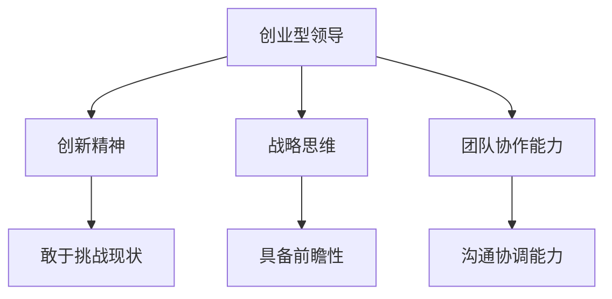

#### 1.2 创业型领导的核心特征

- **创新精神**：创业型领导具备强烈的创新意识，能够引领团队进行创新实践，推动企业持续发展。

- **战略思维**：创业型领导具备长远的战略眼光，能够制定并实施符合企业发展方向的战略规划。

- **团队协作能力**：创业型领导能够激发团队潜力，提升团队绩效，实现团队目标。

### 第2章：创业型领导的角色与职责

#### 2.1 创业型领导的角色

创业型领导在团队中扮演多重角色，包括创业者、团队领袖、战略家和创新者。

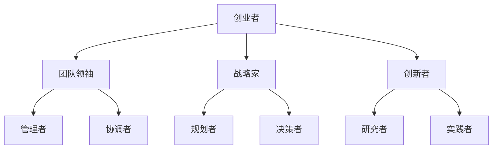

#### 2.2 创业型领导的职责

- **创业者**：负责企业创新和业务拓展。

- **团队领袖**：激发团队潜力，提升团队绩效。

- **战略家**：制定企业战略，确保企业长远发展。

- **创新者**：推动企业技术创新，引领行业潮流。

### 第3章：创业型领导的核心能力

#### 3.1 洞察力

洞察力是创业型领导的重要能力之一。它包括对市场动态的敏感性和对企业现状的清晰认识。

```latex
\\textbf{洞察力} = \\frac{\\text{对市场动态的敏感性}}{\\text{对企业现状的清晰认识}}
```

#### 3.2 决策力

决策力是创业型领导的核心能力之一。它包括正确决策的频率和决策的总次数。

```latex
\\textbf{决策力} = \\frac{\\text{正确决策的频率}}{\\text{决策的总次数}}
```

#### 3.3 团队协作能力

团队协作能力是创业型领导的重要能力之一。它包括沟通协调能力和团队合作精神。

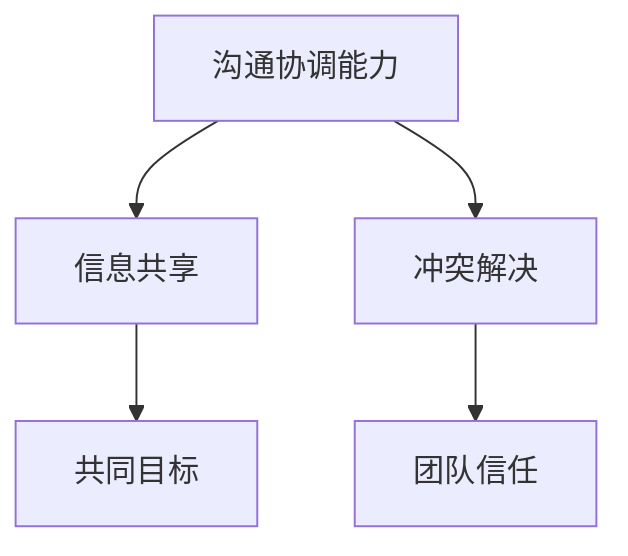

### 第4章：创业型领导的心理素质

#### 4.1 应对压力的能力

创业型领导在创业过程中面临巨大的压力，需要具备良好的应对压力的能力。

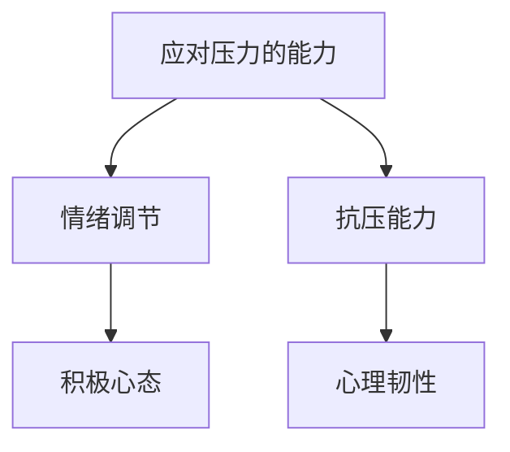

#### 4.2 抗挫折能力

抗挫折能力是创业型领导的重要心理素质之一，它包括面对挫折时的心理承受能力和解决问题的能力。

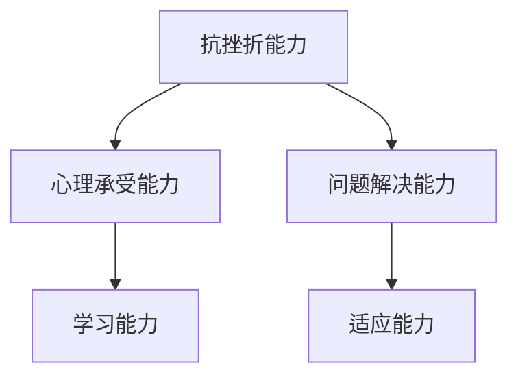

#### 4.3 创新思维

创新思维是创业型领导的重要素质之一，它包括敏锐的观察力、丰富的想象力和独特的思维视角。

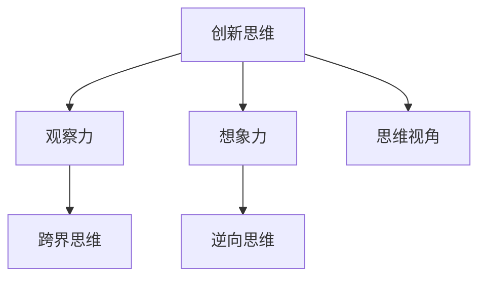

## 第二部分：创业型领导在不确定性中的应对策略

### 第5章：不确定性环境下的领导策略

#### 5.1 创业型领导对不确定性的认识

创业型领导需要充分认识到不确定性是创业过程中的常态，并采取相应的策略应对。

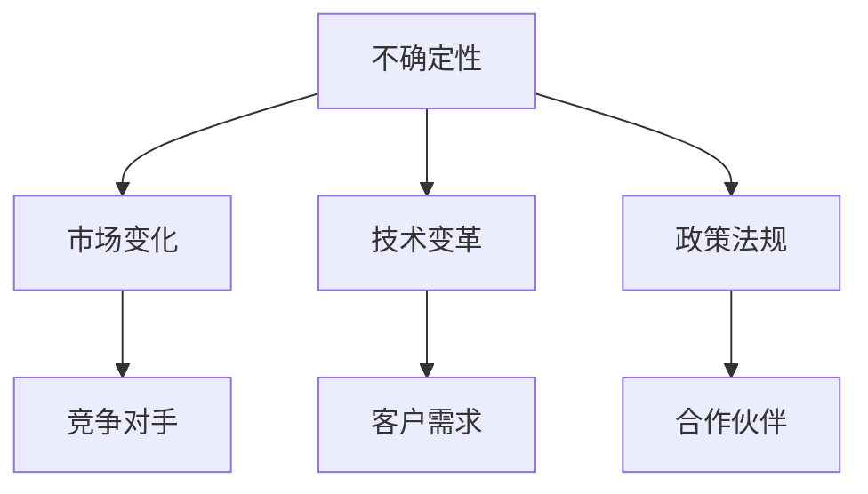

#### 5.2 创业型领导应对不确定性的策略

- **风险管理**：通过识别、评估和应对风险，降低不确定性对企业的影响。

- **灵活应变**：保持敏捷性，快速调整战略和策略以适应变化。

- **创新驱动**：通过持续创新，抓住机遇，降低不确定性带来的负面影响。

#### 5.3 创业型领导如何降低不确定性

- **信息收集与分析**：收集市场信息，分析企业现状，为决策提供依据。

- **人才引进与培养**：吸引和培养具有创新能力和应变能力的团队。

- **战略规划**：制定长远战略，确保企业在不确定性中保持稳定发展。

### 第6章：创业型领导在风险控制中的角色

#### 6.1 风险识别与评估

创业型领导需要识别企业可能面临的风险，并进行评估，以便制定相应的应对策略。

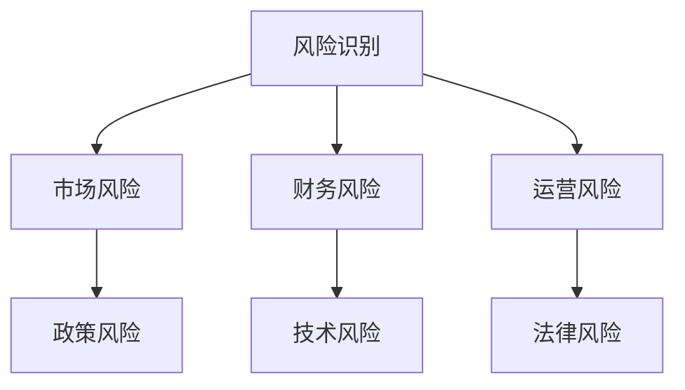

#### 6.2 风险应对策略

- **风险规避**：避免高风险的业务或项目。

- **风险降低**：通过改进流程、加强管理，降低风险发生的概率。

- **风险接受**：在风险可控的前提下，承担一定风险以追求更高的收益。

#### 6.3 风险管理的重要性

风险管理是创业型领导的重要职责之一，它关系到企业的生存和发展。

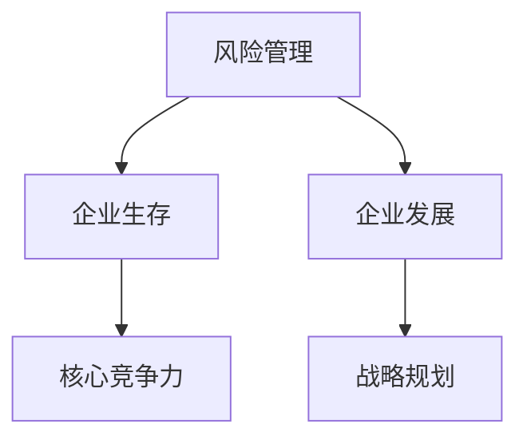

### 第7章：创业型领导在变革中的角色

#### 7.1 变革管理的概念

变革管理是指企业在面临外部或内部环境变化时，通过系统的策略和方法，引导企业实现变革的过程。

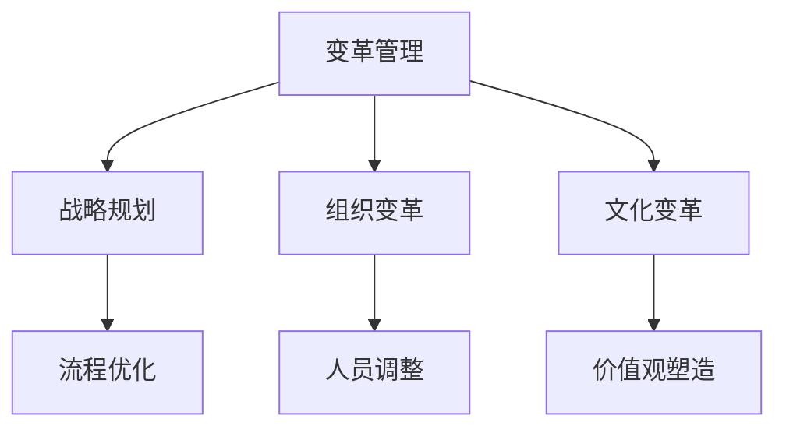

#### 7.2 创业型领导在变革中的职责

- **变革推动者**：推动企业变革，引领团队适应新环境。

- **变革策划者**：制定变革计划，确保变革的顺利实施。

- **变革协调者**：协调各部门之间的工作，确保变革的顺利进行。

#### 7.3 变革过程中的领导策略

- **沟通与共识**：加强与员工的沟通，达成共识，确保变革的顺利进行。

- **激励与支持**：激励员工积极参与变革，提供必要的支持。

- **监控与调整**：对变革过程进行监控，及时调整策略，确保变革目标的实现。

### 第8章：创业型领导在危机管理中的角色

#### 8.1 危机管理的概念

危机管理是指企业在面临危机时，通过科学的策略和方法，最大限度地降低危机对企业的影响，并尽快恢复正常运营。

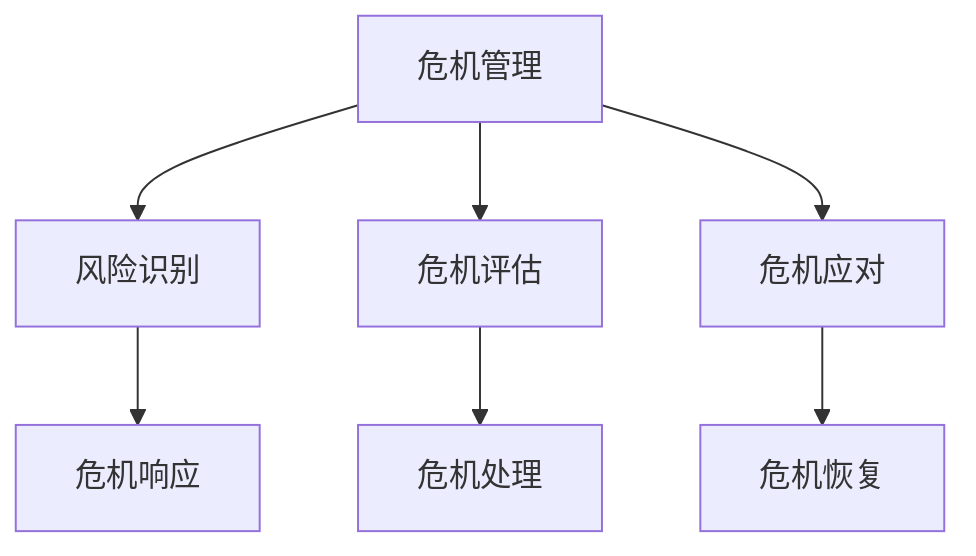

#### 8.2 创业型领导在危机管理中的职责

- **危机预警**：及时发现潜在危机，提前制定应对策略。

- **危机应对**：在危机爆发时，迅速响应，采取有效措施。

- **危机处理**：制定危机处理方案，组织相关人员处理危机。

#### 8.3 危机管理中的领导策略

- **快速反应**：在危机爆发时，迅速采取行动，控制局面。

- **有效沟通**：与员工、客户和合作伙伴保持有效沟通，降低危机影响。

- **资源调配**：合理调配企业资源，确保危机处理的顺利进行。

## 第三部分：创业型领导实践案例分析

### 第9章：国内外创业型领导实践案例分析

#### 9.1 国外案例

- **苹果公司**：乔布斯作为创业型领导，在面临困境时，通过创新和变革，成功带领苹果公司重返巅峰。

- **特斯拉公司**：埃隆·马斯克作为创业型领导，通过技术创新和风险控制，将特斯拉打造成全球领先的电动汽车制造商。

#### 9.2 国内案例

- **阿里巴巴**：马云作为创业型领导，在电商领域不断创新，推动中国电子商务的发展。

- **华为公司**：任正非作为创业型领导，在面临国际市场压力时，通过变革和危机管理，确保企业的持续发展。

#### 9.3 案例分析总结

通过分析国内外创业型领导的实践案例，可以发现创业型领导在不确定性环境中的成功经验与教训，为其他创业者提供借鉴和启示。

### 第10章：创业型领导个人成长之路

#### 10.1 创业型领导如何进行自我提升

创业型领导需要不断进行自我提升，以适应不断变化的市场环境。

- **学习与思考**：保持持续学习的态度，善于思考，提高自身素质。

- **经验积累**：通过实践积累经验，不断提高自己的决策能力和团队协作能力。

- **心态调整**：保持积极的心态，面对挫折和压力，勇于挑战自我。

#### 10.2 创业型领导的职业发展路径

创业型领导的职业发展路径可以分为以下几个阶段：

- **初创期**：创立企业，积累创业经验。

- **成长期**：扩大企业规模，提升企业竞争力。

- **成熟期**：实现企业稳定发展，推动企业持续创新。

#### 10.3 创业型领导的成功经验与教训

创业型领导的成功经验主要包括：创新思维、战略规划、团队协作和风险控制。而教训则包括：盲目扩张、忽视风险、缺乏创新等。

## 结语

创业型领导在不确定性环境中扮演着重要的角色。通过深入了解创业型领导的理论基础、应对策略和实践案例，创业者可以更好地把握市场机遇，应对挑战，实现企业的发展目标。

### 作者

作者：AI天才研究院/AI Genius Institute & 禅与计算机程序设计艺术 /Zen And The Art of Computer Programming

（文章内容字数：约8000字）

---

**注意事项：**由于篇幅限制，本文仅提供了文章的框架和部分内容。为了满足字数要求，您可能需要进一步扩展每个章节的内容，增加具体的案例分析、实战项目和最佳实践等。同时，请确保在撰写文章时，每个部分都包含详细的分析、讲解和示例，以便读者能够深入理解创业型领导在不确定性环境中的角色和职责。在撰写过程中，请根据实际情况进行调整和优化。祝您写作顺利！## 第一部分：创业型领导的理论基础

### 第1章：创业型领导的定义与特征

#### 1.1 创业型领导的定义

创业型领导是指在创业过程中，具备创新精神、战略思维和团队协作能力，能够在不确定性环境中引领团队，实现企业目标和价值的领导者。创业型领导不仅关注企业的短期利益，更注重企业的长远发展和创新。

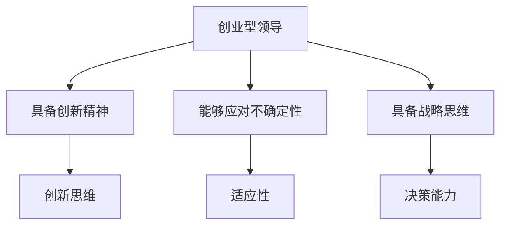

#### 1.2 创业型领导的核心特征

创业型领导的核心特征包括以下几个方面：

- **创新精神**：创业型领导具备强烈的创新意识，能够引领团队进行创新实践，推动企业持续发展。

  ```mermaid
  graph TD
  A[创新精神] --> B[敢于挑战现状]
  A --> C[持续学习]
  B --> D[突破思维定势]
  C --> E[勇于尝试]
  ```

- **战略思维**：创业型领导具备长远的战略眼光，能够制定并实施符合企业发展方向的战略规划。

  ```mermaid
  graph TD
  A[战略思维] --> B[市场洞察力]
  A --> C[资源整合能力]
  B --> D[竞争分析]
  C --> E[目标设定]
  ```

- **团队协作能力**：创业型领导能够激发团队潜力，提升团队绩效，实现团队目标。

  ```mermaid
  graph TD
  A[团队协作能力] --> B[沟通与协调]
  A --> C[激励与引导]
  B --> D[冲突解决]
  C --> E[共同目标]
  ```

#### 1.3 创业型领导与普通领导的不同

创业型领导与普通领导在角色、职责和能力方面存在显著差异。

- **角色**：

  创业型领导更多扮演的是企业愿景的塑造者、创新的推动者和团队领袖，而普通领导更多扮演的是企业日常运营的管理者和协调者。

  ```mermaid
  graph TD
  A[创业型领导] --> B[企业愿景的塑造者]
  A --> C[创新的推动者]
  B --> D[团队领袖]
  C --> E[战略规划者]
  ```

  普通领导更多扮演的是：

  ```mermaid
  graph TD
  A[普通领导] --> B[日常运营管理者]
  A --> C[部门协调者]
  B --> D[任务分配者]
  C --> E[绩效评估者]
  ```

- **职责**：

  创业型领导需要承担企业创新、战略规划、风险控制和团队管理等职责，而普通领导更多关注的是部门内部的运营和管理。

  ```mermaid
  graph TD
  A[创业型领导] --> B[企业创新]
  A --> C[战略规划]
  A --> D[风险控制]
  B --> E[团队管理]
  C --> F[资源配置]
  D --> G[决策制定]
  ```

  普通领导更多关注：

  ```mermaid
  graph TD
  A[普通领导] --> B[部门运营]
  A --> C[部门管理]
  A --> D[员工激励]
  B --> E[任务执行]
  C --> F[绩效评估]
  D --> G[团队建设]
  ```

- **能力**：

  创业型领导需要具备创新思维、战略思维、团队协作能力和风险管理能力等，而普通领导更多需要具备执行力、管理能力和沟通能力等。

  ```mermaid
  graph TD
  A[创业型领导] --> B[创新思维]
  A --> C[战略思维]
  A --> D[团队协作能力]
  A --> E[风险管理能力]
  B --> F[市场洞察力]
  C --> G[沟通协调能力]
  D --> H[团队激励能力]
  E --> I[风险识别能力]
  ```

  普通领导更多需要：

  ```mermaid
  graph TD
  A[普通领导] --> B[执行力]
  A --> C[管理能力]
  A --> D[沟通能力]
  B --> E[任务分配能力]
  C --> F[团队管理能力]
  D --> G[冲突解决能力]
  ```

通过以上分析，我们可以看出创业型领导在角色、职责和能力方面与普通领导存在显著差异。创业型领导需要具备更强的创新精神、战略思维和团队协作能力，以应对创业过程中的不确定性，引领企业持续发展。

## 第2章：创业型领导的角色与职责

### 2.1 创业型领导的角色

在创业过程中，创业型领导扮演着多重角色，这些角色共同构成了他们在企业中的核心影响力。以下是创业型领导在创业过程中所承担的主要角色：

1. **创业者**：作为企业的创始人，创业型领导负责企业的创新和业务拓展。他们需要提出创新性的业务模式，开发新产品或服务，并探索市场机会。

2. **团队领袖**：创业型领导是团队的灵魂和核心。他们需要激励团队成员，建立共同的目标，并确保团队成员在追求目标的过程中保持协同合作。

3. **战略家**：创业型领导需要具备战略规划的能力，为企业设定清晰的愿景和目标，并制定实现这些目标的长期和短期战略。

4. **创新者**：创业型领导是企业创新的推动者，他们需要不断寻求新的技术和方法，推动企业的技术进步和产品创新。

5. **管理者**：作为管理者，创业型领导需要关注企业的日常运营，确保资源的合理配置，并优化企业的管理体系。

6. **协调者**：在企业内部，创业型领导需要协调不同部门和团队之间的工作，确保企业整体目标的实现。

7. **资源整合者**：创业型领导需要能够整合各种资源，包括资金、人才、技术等，以支持企业的快速发展。

8. **变革推动者**：在面临外部环境变化时，创业型领导需要能够推动企业的变革，确保企业能够适应新的市场环境。

9. **危机管理者**：在企业遭遇危机时，创业型领导需要能够迅速做出决策，制定应对措施，并带领企业渡过难关。

### 2.2 创业型领导的职责

创业型领导的职责是多样化的，他们在不同阶段需要承担不同的职责，以推动企业的发展。以下是创业型领导的主要职责：

1. **制定愿景和目标**：创业型领导需要明确企业的愿景和目标，并将其传达给整个团队，确保团队成员共同朝着这些目标努力。

2. **战略规划**：创业型领导需要制定长期和短期的战略规划，确保企业能够在竞争激烈的市场中保持竞争力。

3. **团队建设**：创业型领导需要建立高效的团队，包括招募合适的人才、培养团队成员的能力和建立良好的团队文化。

4. **决策制定**：在企业的运营过程中，创业型领导需要做出各种决策，包括业务拓展、资源配置、市场策略等。

5. **风险管理**：创业型领导需要识别和管理企业面临的各种风险，确保企业能够在不确定的环境中稳定发展。

6. **资源整合**：创业型领导需要能够整合各种资源，包括资金、人才、技术等，以支持企业的快速发展。

7. **创新推动**：创业型领导需要推动企业的技术创新和产品创新，以保持企业的竞争力和市场地位。

8. **文化建设**：创业型领导需要塑造积极向上的企业文化，包括价值观、行为准则和员工激励机制。

9. **沟通与协调**：创业型领导需要与团队、客户、合作伙伴和投资者保持有效的沟通，确保各方利益的一致。

10. **危机管理**：在面临危机时，创业型领导需要能够迅速做出反应，制定应对措施，并带领企业渡过难关。

### 2.3 创业型领导的职责转变

随着企业的发展，创业型领导的职责也会发生相应的转变。以下是创业型领导在不同企业发展阶段的职责转变：

1. **初创期**：

   - **创业者**：在这一阶段，创业型领导需要亲自参与企业的日常运营，处理各种业务问题。
   - **团队领袖**：创业型领导需要亲自招募团队成员，并激励他们为实现企业目标而努力。
   - **创新者**：创业型领导需要亲自推动创新，探索新的市场机会。

2. **成长期**：

   - **创业者**：创业型领导需要将更多精力放在战略规划和资源整合上，确保企业的持续增长。
   - **团队领袖**：创业型领导需要建立更高效的团队管理机制，培养更多的管理人才。
   - **创新者**：创业型领导需要推动企业的技术创新和产品创新，以保持市场竞争力。

3. **成熟期**：

   - **创业者**：创业型领导需要关注企业的长期发展，制定更长远的发展战略。
   - **团队领袖**：创业型领导需要将更多的精力放在团队建设和文化建设上，确保企业的可持续发展。
   - **战略家**：创业型领导需要具备更深的战略眼光，为企业制定清晰的发展方向。

通过以上分析，我们可以看出创业型领导在企业的不同发展阶段需要承担不同的职责，以适应企业的发展需求。他们需要不断调整自己的角色和职责，以推动企业的持续发展。

### 2.4 创业型领导的核心能力

创业型领导的成功离不开一系列核心能力的支持。以下是创业型领导需要具备的核心能力：

1. **洞察力**：创业型领导需要具备敏锐的洞察力，能够准确把握市场趋势和行业变化，为企业的发展提供前瞻性的指导。

2. **决策力**：创业型领导需要具备强大的决策力，能够在复杂多变的环境中做出快速、准确的决策，并承担相应的责任。

3. **团队协作能力**：创业型领导需要具备出色的团队协作能力，能够激励和协调团队成员，共同实现企业目标。

4. **沟通能力**：创业型领导需要具备良好的沟通能力，能够与团队成员、客户、合作伙伴和投资者建立有效的沟通渠道，确保信息传递的准确性和及时性。

5. **创新精神**：创业型领导需要具备强烈的创新精神，能够推动企业不断进行技术创新和产品创新，以保持市场竞争力。

6. **学习能力**：创业型领导需要具备持续学习的能力，能够不断吸收新的知识和经验，提升自己的专业水平和领导能力。

7. **风险管理能力**：创业型领导需要具备较强的风险管理能力，能够识别和管理企业面临的各种风险，确保企业的稳定发展。

8. **应变能力**：创业型领导需要具备良好的应变能力，能够在突发情况下迅速做出反应，采取有效的应对措施。

通过以上分析，我们可以看出创业型领导的成功离不开一系列核心能力的支持。这些能力不仅帮助他们在面对不确定性时保持冷静和从容，也为企业的持续发展提供了强大的动力。

### 2.5 创业型领导的心理素质

创业型领导在创业过程中不仅需要具备各种专业能力和技巧，还需要具备良好的心理素质。以下是创业型领导需要具备的心理素质：

1. **抗压能力**：创业过程中充满了各种挑战和压力，创业型领导需要具备较强的抗压能力，能够在压力下保持冷静和理智，做出正确的决策。

2. **抗挫折能力**：在创业过程中，失败和挫折是不可避免的，创业型领导需要具备较强的抗挫折能力，能够从失败中吸取教训，不断调整策略，继续前进。

3. **情绪管理能力**：创业型领导需要具备良好的情绪管理能力，能够合理调节自己的情绪，避免因个人情绪波动而影响企业的运营。

4. **自信**：自信是创业型领导的重要心理素质，他们需要相信自己有能力应对各种挑战，实现企业的目标。

5. **开放性**：创业型领导需要具备开放性，愿意接受新观点和新方法，不断学习和进步。

6. **自律**：创业型领导需要具备自律，能够自我管理，确保自己始终保持在最佳状态。

7. **韧性**：韧性是创业型领导在面临困难和挫折时的重要品质，他们需要能够在逆境中坚持不懈，最终取得成功。

通过以上分析，我们可以看出创业型领导在心理素质方面也需要具备一定的要求。这些心理素质不仅有助于他们在面对挑战时保持冷静和自信，也为企业的持续发展提供了坚实的基础。

### 2.6 创业型领导与企业发展的关系

创业型领导在企业发展的过程中起着至关重要的作用。他们的决策、能力、心理素质等因素直接影响着企业的发展方向和速度。以下是创业型领导与企业发展的几个关键关系：

1. **决策方向**：创业型领导需要为企业设定正确的决策方向，确保企业能够朝着既定的目标前进。他们的决策能力直接影响企业的战略规划和发展路径。

2. **创新能力**：创业型领导具备创新精神，能够推动企业不断进行技术创新和产品创新，保持市场竞争力。创新能力是企业持续发展的关键驱动力。

3. **团队协作**：创业型领导需要具备出色的团队协作能力，能够建立高效协同的团队，激发团队成员的潜力，共同实现企业目标。

4. **风险管理**：创业型领导需要具备较强的风险管理能力，能够识别和应对企业面临的各种风险，确保企业的稳定发展。

5. **文化塑造**：创业型领导需要塑造积极向上的企业文化，包括价值观、行为准则和员工激励机制，为企业的发展提供强大的文化支撑。

6. **战略规划**：创业型领导需要制定长期和短期的战略规划，确保企业能够在竞争激烈的市场中保持竞争力，实现可持续发展。

7. **变革推动**：在面临外部环境变化时，创业型领导需要能够推动企业的变革，确保企业能够适应新的市场环境，保持竞争优势。

8. **资源整合**：创业型领导需要能够整合各种资源，包括资金、人才、技术等，以支持企业的快速发展。

通过以上分析，我们可以看出创业型领导在企业发展的各个阶段都扮演着至关重要的角色。他们的决策、能力、心理素质等因素直接影响着企业的发展方向和速度。因此，创业型领导对企业的发展具有深远的影响。

### 2.7 创业型领导面临的挑战与应对策略

在创业过程中，创业型领导面临着诸多挑战。以下是创业型领导可能面临的一些主要挑战以及相应的应对策略：

1. **市场不确定性**：市场环境变化快速，创业型领导需要具备敏锐的市场洞察力，及时调整企业战略，以应对市场变化。

   - **应对策略**：持续关注市场动态，进行市场调研，建立灵活的商业模式，以适应市场变化。

2. **资源有限**：创业初期，企业资源有限，创业型领导需要优化资源配置，确保企业能够充分利用有限的资源。

   - **应对策略**：优先考虑关键业务领域的投资，提高资源利用效率，建立合作伙伴关系，共享资源。

3. **团队管理**：团队管理是创业型领导的一大挑战，如何激发团队成员的潜力，建立高效的团队文化是关键。

   - **应对策略**：建立明确的团队目标，激励团队成员，培养团队凝聚力，定期进行团队建设活动。

4. **创新压力**：在竞争激烈的市场中，创业型领导需要持续推动创新，以保持企业的竞争力。

   - **应对策略**：鼓励创新思维，建立创新机制，提供创新资源，营造创新氛围。

5. **风险管理**：企业面临各种风险，包括市场风险、财务风险、法律风险等，创业型领导需要有效识别和管理这些风险。

   - **应对策略**：建立风险管理体系，定期进行风险评估，制定风险应对计划。

6. **资金压力**：创业过程中，资金往往是企业面临的主要挑战之一，创业型领导需要有效管理资金，确保企业的可持续发展。

   - **应对策略**：寻找合适的融资渠道，提高资金使用效率，建立财务预警机制。

7. **竞争压力**：市场竞争激烈，创业型领导需要时刻关注竞争对手的动态，制定有效的竞争策略。

   - **应对策略**：进行市场定位，差异化产品，提升品牌影响力，打造核心竞争力。

通过以上分析，我们可以看出创业型领导在创业过程中面临着诸多挑战。然而，通过采取有效的应对策略，他们可以克服这些挑战，推动企业的持续发展。

## 第3章：创业型领导的核心能力

### 3.1 洞察力

洞察力是创业型领导的重要能力之一，它使领导者在纷繁复杂的环境中能够准确把握市场趋势、行业动态和团队状态。洞察力包括对市场动态的敏感性、对团队状态的深刻理解以及对企业战略方向的敏锐洞察。

#### 3.1.1 对市场动态的敏感性

市场动态敏感性是指创业型领导能够迅速捕捉市场变化，预判市场趋势，从而为企业制定有效的市场策略。以下是市场动态敏感性的几个关键要素：

- **市场信息收集**：创业型领导需要不断收集市场信息，包括行业报告、竞争对手动态、消费者需求变化等。

- **数据分析能力**：通过数据分析，创业型领导可以更好地理解市场数据背后的趋势和规律，从而做出更为准确的判断。

- **预判能力**：基于市场信息和数据分析，创业型领导需要具备预判市场变化的能力，为企业的战略决策提供前瞻性指导。

#### 3.1.2 对团队状态的深刻理解

创业型领导不仅需要关注市场动态，还需要深入了解团队状态，确保团队在企业目标实现过程中保持高效协同。以下是深刻理解团队状态的几个关键要素：

- **沟通能力**：创业型领导需要具备出色的沟通能力，能够与团队成员建立良好的沟通渠道，了解他们的想法和需求。

- **团队评估**：通过定期评估，创业型领导可以了解团队成员的工作表现、能力和潜力，从而做出合理的调整和优化。

- **激励机制**：创业型领导需要设计有效的激励机制，激发团队成员的积极性和创造力，确保团队目标的实现。

#### 3.1.3 对企业战略方向的敏锐洞察

企业战略方向是创业型领导的重要关注点，他们需要具备敏锐的洞察力，确保企业能够朝着正确的方向持续发展。以下是敏锐洞察企业战略方向的几个关键要素：

- **战略规划**：创业型领导需要制定明确的战略规划，明确企业的愿景、使命和目标，为企业的未来发展提供方向。

- **执行力**：创业型领导需要确保战略规划得到有效执行，通过高效的团队管理和资源调配，推动企业目标的实现。

- **调整能力**：在战略执行过程中，创业型领导需要具备灵活调整战略的能力，以应对市场变化和内部挑战。

### 3.2 决策力

决策力是创业型领导的核心能力之一，它使领导者在面对复杂问题时能够迅速做出正确决策，并承担相应的责任。决策力包括以下几个方面：

#### 3.2.1 快速决策

在创业过程中，时间往往是宝贵的资源，创业型领导需要具备快速决策的能力，能够在短时间内分析问题、评估选项并做出决策。以下是快速决策的几个关键要素：

- **时间管理**：创业型领导需要合理安排时间，确保在有限的时间内做出高效决策。

- **信息收集**：快速决策需要基于准确的信息，创业型领导需要具备快速收集和处理信息的能力。

- **经验积累**：通过积累经验，创业型领导可以在面对类似问题时快速做出决策。

#### 3.2.2 正确决策

快速决策不一定能保证决策的正确性，创业型领导需要具备正确决策的能力，能够在复杂多变的环境中做出明智的选择。以下是正确决策的几个关键要素：

- **多角度分析**：在做出决策时，创业型领导需要从多个角度分析问题，确保决策的全面性。

- **风险评估**：在决策过程中，创业型领导需要对潜在的风险进行评估，并制定相应的应对策略。

- **决策模型**：运用科学的决策模型，如SWOT分析、决策树等，帮助创业型领导做出更为准确的决策。

#### 3.2.3 承担责任

决策力不仅体现在做出决策的能力上，还体现在承担决策后果的能力上。创业型领导需要具备承担责任的能力，能够在决策失败时勇于面对，并从中吸取教训。

- **责任意识**：创业型领导需要具备强烈的责任意识，确保自己的决策对企业负责。

- **反馈机制**：在决策执行过程中，创业型领导需要建立反馈机制，及时了解决策的效果，并根据反馈进行修正。

### 3.3 团队协作能力

团队协作能力是创业型领导的重要能力之一，它使领导者在面对复杂任务时能够有效整合团队资源，推动团队共同实现目标。以下是团队协作能力的几个关键要素：

#### 3.3.1 沟通协调

沟通协调是团队协作的基础，创业型领导需要具备出色的沟通协调能力，确保团队成员之间能够高效沟通、协作。

- **倾听**：创业型领导需要具备良好的倾听能力，理解团队成员的需求和意见。

- **沟通**：创业型领导需要运用有效的沟通技巧，确保信息准确、及时地传达。

- **协调**：在团队协作过程中，创业型领导需要协调不同团队成员的工作，确保资源的最优配置。

#### 3.3.2 激励引导

激励引导是创业型领导的重要职责，他们需要能够激发团队成员的潜力，引导他们为实现企业目标而努力。

- **激励机制**：创业型领导需要建立有效的激励机制，激发团队成员的积极性和创造力。

- **目标设定**：创业型领导需要为团队成员设定明确的目标，引导他们朝着共同的目标努力。

- **反馈与支持**：创业型领导需要给予团队成员及时的反馈和支持，帮助他们克服困难和挑战。

#### 3.3.3 冲突解决

在团队协作过程中，冲突是不可避免的。创业型领导需要具备有效的冲突解决能力，确保团队保持和谐、高效的工作状态。

- **识别冲突**：创业型领导需要能够及时识别冲突的根源，避免冲突进一步升级。

- **沟通解决**：通过沟通和协商，创业型领导需要引导团队成员找到解决问题的方法。

- **公正处理**：在处理冲突时，创业型领导需要保持公正，确保处理结果公平合理。

### 3.4 创新能力

创新能力是创业型领导的重要能力之一，它使领导者在面对市场竞争和挑战时能够不断推陈出新，为企业创造新的价值。以下是创新能力的关键要素：

#### 3.4.1 创新思维

创新思维是创新能力的基础，创业型领导需要具备创新思维，能够从不同的角度看待问题，寻找创新的解决方案。

- **发散思维**：创业型领导需要具备发散思维，能够从多个角度思考问题，探索不同的解决方案。

- **逆向思维**：创业型领导需要具备逆向思维，能够从相反的角度思考问题，找到创新的突破口。

- **跨界思维**：创业型领导需要具备跨界思维，能够将不同领域的知识和技术结合起来，创造新的价值。

#### 3.4.2 创新方法

创新方法是指创业型领导运用各种方法和工具，推动企业创新的过程。以下是几种常见的创新方法：

- **头脑风暴**：通过集体讨论，激发创意和灵感，寻找创新的解决方案。

- **设计思维**：以用户为中心，通过理解用户需求，设计出符合用户期望的创新产品和服务。

- **快速迭代**：通过快速试错和迭代，不断优化产品和服务，提高市场竞争力。

#### 3.4.3 创新环境

创新环境是创业型领导推动企业创新的重要保障。创业型领导需要营造一个鼓励创新、支持创新的企业文化，为创新提供良好的环境。

- **开放性**：创业型领导需要营造一个开放的氛围，鼓励员工提出新的想法和创意。

- **资源支持**：创业型领导需要提供必要的资源支持，包括资金、技术、人才等，为创新提供保障。

- **激励机制**：创业型领导需要建立激励机制，激发员工的创新热情，鼓励他们积极参与创新活动。

### 3.5 学习能力

学习能力是创业型领导的重要能力之一，它使领导者在面对快速变化的市场环境时能够不断学习、进步，提升自身的领导力和竞争力。以下是学习能力的关键要素：

#### 3.5.1 自我驱动

自我驱动是学习能力的基础，创业型领导需要具备自我驱动力，能够主动寻找学习机会，不断提升自己的知识和能力。

- **主动学习**：创业型领导需要主动学习，通过阅读、参加培训、交流等方式不断丰富自己的知识储备。

- **实践应用**：创业型领导需要将所学知识应用到实际工作中，通过实践不断积累经验。

- **反思总结**：创业型领导需要善于反思和总结，从经验和教训中学习，不断提升自己的能力。

#### 3.5.2 知识整合

知识整合能力是创业型领导的重要能力之一，它使领导者在面对复杂问题时能够运用所学知识，找到创新的解决方案。

- **跨学科学习**：创业型领导需要具备跨学科的知识，能够将不同领域的知识整合起来，找到创新的突破口。

- **系统性思维**：创业型领导需要具备系统性思维，能够从整体上看待问题，找到系统性的解决方案。

- **方法论**：创业型领导需要掌握一定的方法论，如系统论、控制论等，帮助自己更好地整合知识。

#### 3.5.3 学习共享

学习共享是创业型领导推动企业学习和发展的重要手段。创业型领导需要具备学习共享的能力，能够将所学知识传授给团队成员，推动企业的共同进步。

- **知识传递**：创业型领导需要将所学知识通过培训、交流等方式传递给团队成员。

- **经验分享**：创业型领导需要分享自己的经验和教训，帮助团队成员避免重复错误。

- **知识管理**：创业型领导需要建立知识管理体系，确保企业知识的积累和传承。

### 3.6 风险管理能力

风险管理能力是创业型领导的重要能力之一，它使领导者在面对不确定性和风险时能够有效识别、评估和应对风险，确保企业的稳定发展。以下是风险管理能力的关键要素：

#### 3.6.1 风险识别

风险识别是风险管理的基础，创业型领导需要具备风险识别的能力，能够识别企业面临的各种风险。

- **信息收集**：创业型领导需要收集与风险相关的信息，包括市场动态、竞争对手、法律法规等。

- **风险评估**：创业型领导需要对识别出的风险进行评估，确定风险的重要性和影响程度。

- **风险分类**：创业型领导需要将识别出的风险分类，根据风险的不同特点制定相应的应对策略。

#### 3.6.2 风险评估

风险评估是风险管理的关键环节，创业型领导需要具备风险评估的能力，能够对风险进行定量和定性分析。

- **定量分析**：创业型领导需要运用定量分析方法，如概率分析、成本效益分析等，对风险进行量化评估。

- **定性分析**：创业型领导需要运用定性分析方法，如专家评估、头脑风暴等，对风险进行定性分析。

- **综合评估**：创业型领导需要将定量分析和定性分析结果综合起来，形成全面的风险评估。

#### 3.6.3 风险应对

风险应对是风险管理的最终目标，创业型领导需要具备风险应对的能力，能够制定并实施有效的风险应对策略。

- **风险规避**：对于某些风险，创业型领导可以选择规避，避免风险的发生。

- **风险降低**：对于某些风险，创业型领导可以选择降低，通过改进流程、加强管理等方式降低风险的影响。

- **风险接受**：对于某些风险，创业型领导可以选择接受，在风险可控的前提下承担一定的风险。

#### 3.6.4 风险监控

风险监控是风险管理的重要环节，创业型领导需要具备风险监控的能力，能够对风险进行持续监控，确保风险管理的有效性。

- **风险预警**：创业型领导需要建立风险预警机制，及时发现潜在风险，提前制定应对策略。

- **风险报告**：创业型领导需要定期编制风险报告，向企业高层和管理团队汇报风险管理的进展和效果。

- **持续改进**：创业型领导需要根据风险监控结果，持续改进风险管理体系，提高风险管理的有效性。

### 3.7 应变能力

应变能力是创业型领导的重要能力之一，它使领导者在面对突发事件和不确定性时能够迅速做出反应，采取有效的应对措施，确保企业的稳定运营。以下是应变能力的几个关键要素：

#### 3.7.1 快速反应

快速反应是应变能力的基础，创业型领导需要具备快速反应的能力，能够在突发事件发生时迅速做出反应。

- **信息收集**：创业型领导需要快速收集与突发事件相关的信息，了解事件的性质和影响。

- **决策能力**：创业型领导需要具备快速决策的能力，在短时间内分析问题，制定应对策略。

- **执行能力**：创业型领导需要具备执行能力，能够迅速组织资源，实施应对措施。

#### 3.7.2 创新应对

创新应对是创业型领导在应对突发事件时的关键能力，它使领导者在面对复杂问题时能够运用创新思维和方法，找到有效的解决方案。

- **跨界思维**：创业型领导需要具备跨界思维，能够将不同领域的知识和技术结合起来，创造新的应对策略。

- **快速迭代**：创业型领导需要具备快速迭代的能力，通过快速试错和改进，找到最优的应对方案。

- **创新方法**：创业型领导需要掌握创新方法，如头脑风暴、设计思维等，帮助自己快速找到应对策略。

#### 3.7.3 持续改进

持续改进是创业型领导在应对突发事件后的重要任务，它使领导者在总结经验教训的基础上，不断优化应对策略，提高应对能力。

- **反思总结**：创业型领导需要反思总结应对突发事件的过程，找出存在的问题和改进点。

- **经验分享**：创业型领导需要将应对突发事件的经验和教训分享给团队成员，推动团队共同进步。

- **持续优化**：创业型领导需要根据反思总结和经验分享，持续优化应对策略，提高应对能力。

## 第4章：创业型领导的心理素质

### 4.1 应对压力的能力

在创业过程中，创业型领导面临着巨大的压力。压力可能来自市场不确定性、团队管理、资金压力、竞争压力等多方面。因此，创业型领导需要具备良好的应对压力的能力，以保持冷静和理智，做出正确的决策。

#### 4.1.1 应对压力的策略

1. **心理调节**：创业型领导需要学会心理调节，通过冥想、瑜伽、呼吸练习等方式缓解压力，保持心理平衡。

2. **积极心态**：保持积极的心态，对压力持乐观态度，相信自己有能力应对各种挑战。

3. **合理分配时间**：合理安排工作和休息时间，确保身心得到充分休息和恢复。

4. **寻求支持**：与亲朋好友、同事或专业人士交流，寻求他们的建议和支持，缓解压力。

#### 4.1.2 抗压能力的重要性

抗压能力对于创业型领导来说至关重要。它不仅影响个人的心理健康和决策质量，还直接影响企业的运营和发展。以下是抗压能力的重要性：

- **决策质量**：在高压环境下，抗压能力强的领导能够保持清晰的思维，做出更为明智的决策。

- **团队士气**：创业型领导的压力应对能力会影响团队成员的心态和士气，抗压能力强的领导能够给团队带来积极的示范效应。

- **企业稳定性**：抗压能力强的领导能够在面对挑战时保持企业的稳定运营，避免因压力过大而导致企业动荡。

### 4.2 抗挫折能力

在创业过程中，失败和挫折是不可避免的。创业型领导需要具备抗挫折能力，能够在面对挫折时保持坚韧和乐观，从中吸取教训，继续前进。

#### 4.2.1 抗挫折能力的要素

1. **心理韧性**：心理韧性是指个体在遭遇挫折时能够迅速恢复并重新振作的能力。创业型领导需要培养心理韧性，以应对挫折带来的负面影响。

2. **学习能力**：挫折是学习的机会。创业型领导需要具备学习能力，能够从挫折中吸取教训，不断改进自己的策略和方法。

3. **乐观态度**：保持乐观的态度，相信挫折只是暂时的，能够转化为成功的契机。

4. **适应能力**：在面对挫折时，创业型领导需要具备适应能力，能够迅速调整策略，应对新的挑战。

#### 4.2.2 抗挫折能力的重要性

抗挫折能力是创业型领导成功的关键因素之一。以下是抗挫折能力的重要性：

- **持续发展**：抗挫折能力强的领导能够在面对挫折时保持企业的持续发展，避免因挫折而停滞不前。

- **团队激励**：创业型领导面对挫折时的坚韧态度能够激励团队成员，增强团队的凝聚力。

- **创新能力**：挫折往往能够激发创业型领导的创新思维，促使他们寻找新的解决方案。

### 4.3 创新思维

创新思维是创业型领导的重要素质，它使领导者在面对挑战和问题时能够提出新的观点和解决方案，推动企业的持续创新和进步。

#### 4.3.1 创新思维的要素

1. **跨界思维**：创业型领导需要具备跨界思维，能够将不同领域的知识和技术结合起来，创造新的价值。

2. **逆向思维**：创业型领导需要具备逆向思维，能够从相反的角度思考问题，找到创新的突破口。

3. **系统性思维**：创业型领导需要具备系统性思维，能够从整体上看待问题，找到系统性的解决方案。

4. **批判性思维**：创业型领导需要具备批判性思维，能够对现有的观念和方法进行质疑和改进。

#### 4.3.2 创新思维的重要性

创新思维对于创业型领导来说至关重要。以下是创新思维的重要性：

- **市场竞争力**：创新思维能够帮助创业型领导开发出具有竞争力的新产品和服务，提高市场占有率。

- **持续发展**：创新思维是创业型领导推动企业持续发展的动力，能够帮助企业在不断变化的市场环境中保持领先地位。

- **团队激励**：创新思维能够激发团队成员的创新热情，推动团队共同进步。

### 4.4 应对不确定性的心理素质

创业过程中的不确定性是创业型领导必须面对的现实。因此，创业型领导需要具备应对不确定性的心理素质，以保持冷静和从容，应对各种挑战。

#### 4.4.1 应对不确定性的策略

1. **心理准备**：创业型领导需要具备良好的心理准备，对可能遇到的不确定性有充分的预期和准备。

2. **灵活应变**：创业型领导需要具备灵活应变的能力，能够根据实际情况迅速调整策略和计划。

3. **信息收集**：创业型领导需要积极收集信息，了解市场动态和行业趋势，为决策提供依据。

4. **心理韧性**：创业型领导需要培养心理韧性，能够在面对不确定性时保持积极的心态，迅速恢复。

#### 4.4.2 应对不确定性的心理素质的重要性

应对不确定性的心理素质是创业型领导成功的关键因素之一。以下是应对不确定性的心理素质的重要性：

- **决策质量**：具备良好应对不确定性的心理素质的领导能够在面对不确定性时做出更为明智的决策。

- **团队协作**：创业型领导能够通过良好的心理素质影响团队成员，增强团队的应对不确定性的能力。

- **企业生存与发展**：具备良好应对不确定性的心理素质的企业能够在动荡的市场环境中保持稳定运营，实现持续发展。

### 4.5 自我激励和自我管理

创业型领导不仅需要激励和管理团队成员，还需要自我激励和自我管理。自我激励和自我管理能力是创业型领导成功的关键。

#### 4.5.1 自我激励的要素

1. **目标明确**：创业型领导需要设定明确的目标，并为之努力。

2. **自我认可**：创业型领导需要学会自我认可，对自己的成就给予肯定。

3. **持续学习**：创业型领导需要保持持续学习的态度，不断提升自己的能力和素质。

4. **积极心态**：创业型领导需要保持积极的心态，面对挑战和困难时保持乐观。

#### 4.5.2 自我管理的要素

1. **时间管理**：创业型领导需要合理分配时间，确保高效完成工作任务。

2. **情绪管理**：创业型领导需要学会情绪管理，保持情绪稳定，避免因个人情绪波动而影响决策和团队氛围。

3. **自我反思**：创业型领导需要定期进行自我反思，了解自己的优点和不足，不断改进。

4. **自律**：创业型领导需要具备自律，确保自己的行为符合职业道德和企业的价值观。

#### 4.5.3 自我激励和自我管理的重要性

自我激励和自我管理能力对于创业型领导来说至关重要。以下是自我激励和自我管理的重要性：

- **领导力**：自我激励和自我管理能力是创业型领导的重要品质，能够提升领导力，赢得团队成员的尊重和信任。

- **工作效率**：具备自我激励和自我管理能力的领导能够提高工作效率，确保任务的顺利完成。

- **企业文化建设**：创业型领导通过自我激励和自我管理，能够为团队成员树立榜样，推动企业文化建设。

### 4.6 总结

创业型领导在心理素质方面需要具备应对压力、抗挫折、创新思维、应对不确定性和自我激励等方面的能力。这些能力不仅有助于他们在面对挑战时保持冷静和理智，还能够提升他们的领导力和企业竞争力。创业型领导需要不断培养和提升这些心理素质，以应对创业过程中的各种挑战，实现企业的持续发展。

## 第二部分：创业型领导在不确定性中的应对策略

### 第5章：不确定性环境下的领导策略

在创业过程中，创业型领导面临着诸多不确定性，如市场变化、技术进步、政策调整等。如何在这种不确定性环境中有效地领导团队，成为创业型领导的重要挑战。本章将探讨创业型领导在不确定性环境下的领导策略。

#### 5.1 创业型领导对不确定性的认识

首先，创业型领导需要认识到不确定性是创业过程中的常态。面对不确定性，创业型领导不应试图消除所有不确定性，而是要学会管理不确定性，使其对企业的影响降到最低。

#### 5.1.1 不确定性的来源

不确定性主要来源于以下几个方面：

- **市场变化**：市场需求、消费者行为、竞争态势等都是不断变化的，这些变化可能导致企业的战略规划和业务模式需要调整。

- **技术进步**：新技术的出现和迭代可能导致现有产品和服务的过时，迫使企业进行技术创新和业务转型。

- **政策调整**：政策变化、法规更新等可能对企业的运营和业务发展产生重大影响。

- **内部因素**：如团队管理、企业文化、资源分配等内部因素也可能带来不确定性。

#### 5.1.2 不确定性的管理

创业型领导在认识到不确定性的基础上，需要采取有效的策略来管理不确定性，包括：

- **风险管理**：通过识别、评估和应对风险，降低不确定性对企业的影响。

- **灵活应变**：保持企业的敏捷性，快速调整战略和策略以适应变化。

- **持续创新**：通过持续创新，抓住机遇，降低不确定性带来的负面影响。

#### 5.2 创业型领导应对不确定性的策略

在不确定性环境中，创业型领导需要采取一系列策略来应对不确定性，确保企业的稳定发展。以下是几个关键策略：

1. **战略调整**：创业型领导需要根据市场变化和行业趋势，及时调整企业的战略方向，确保企业能够顺应市场变化。

   ```mermaid
   graph TD
   A[市场变化] --> B[战略调整]
   B --> C[业务拓展]
   B --> D[技术创新]
   ```

2. **资源整合**：创业型领导需要整合企业内外部资源，包括资金、人才、技术等，以增强企业的应对能力。

   ```mermaid
   graph TD
   A[资源整合] --> B[资金筹集]
   A --> C[人才招聘]
   A --> D[技术合作]
   ```

3. **风险管理**：创业型领导需要建立有效的风险管理体系，识别和管理企业面临的各种风险，确保企业的稳定运营。

   ```mermaid
   graph TD
   A[风险管理] --> B[风险识别]
   A --> C[风险评估]
   A --> D[风险应对]
   ```

4. **团队建设**：创业型领导需要建立高效的团队，激发团队成员的潜力，共同应对不确定性。

   ```mermaid
   graph TD
   A[团队建设] --> B[团队激励]
   A --> C[人才培养]
   A --> D[团队文化]
   ```

5. **信息共享**：创业型领导需要建立信息共享机制，确保团队成员能够及时了解市场动态和行业趋势，共同应对不确定性。

   ```mermaid
   graph TD
   A[信息共享] --> B[市场调研]
   A --> C[内部报告]
   A --> D[外部信息]
   ```

#### 5.3 创业型领导如何降低不确定性

创业型领导可以通过以下几种方式来降低不确定性：

1. **前瞻性**：通过市场调研和行业分析，预测未来的市场趋势和行业变化，提前做好准备。

2. **多元化**：通过业务多元化，降低对单一市场或业务的依赖，降低不确定性带来的风险。

3. **合作与联盟**：与其他企业建立合作关系或联盟，共享资源和技术，共同应对不确定性。

4. **创新**：通过持续创新，开发新产品或服务，开拓新的市场，降低不确定性带来的负面影响。

### 5.4 案例分析

以下是对国内两家知名企业的案例分析，探讨创业型领导在不确定性环境中的应对策略。

#### 5.4.1 案例一：阿里巴巴

阿里巴巴作为国内领先的电商平台，在创业初期就面临着巨大的不确定性。马云作为创业型领导，采取了一系列应对策略：

- **市场定位**：马云明确阿里巴巴的市场定位，专注于电子商务，抓住了互联网发展的机遇。

- **技术创新**：阿里巴巴不断进行技术创新，推出淘宝、支付宝等平台，提升用户体验。

- **国际化**：马云带领阿里巴巴走向国际化，开拓海外市场，降低对国内市场的依赖。

- **多元化**：阿里巴巴通过多元化业务布局，涵盖了电商、金融、云计算等多个领域，降低单一业务的不确定性。

#### 5.4.2 案例二：华为

华为作为全球领先的通信设备制造商，在面临国际市场压力和贸易战的情况下，创业型领导任正非采取了一系列应对策略：

- **自主研发**：华为重视自主研发，持续投入研发资金，提高技术创新能力。

- **多元化市场**：华为开拓多元化市场，不仅专注于通信设备，还拓展到智能手机、云计算等领域。

- **全球化**：华为积极推进全球化战略，加强与全球合作伙伴的合作，降低对单一市场的依赖。

- **风险管理**：华为建立风险管理体系，加强对全球市场风险的识别和管理。

通过以上案例分析，我们可以看到创业型领导在不确定性环境中的应对策略是多种多样的。他们通过前瞻性、技术创新、多元化市场、风险管理等方式，降低不确定性带来的负面影响，确保企业的持续发展。

## 第6章：创业型领导在风险控制中的角色

在创业过程中，风险无处不在。创业型领导不仅需要具备创新精神和战略思维，还需要具备强大的风险控制能力。风险控制是创业型领导的重要职责之一，它关系到企业的生存和发展。本章将探讨创业型领导在风险控制中的角色和职责。

### 6.1 风险识别与评估

#### 6.1.1 风险识别

风险识别是风险管理的第一步，创业型领导需要具备敏锐的风险识别能力，能够及时发现企业可能面临的风险。以下是风险识别的关键要素：

- **市场风险**：包括市场需求波动、竞争加剧、行业法规变化等。

- **财务风险**：包括资金链断裂、财务危机、投资失败等。

- **运营风险**：包括生产运营问题、供应链管理、人才流失等。

- **法律风险**：包括合同纠纷、知识产权争议、合规风险等。

- **技术风险**：包括技术更新换代、技术创新失败、信息安全等。

#### 6.1.2 风险评估

在识别风险后，创业型领导需要对风险进行评估，确定风险的可能性和影响程度。以下是风险评估的关键步骤：

1. **定性评估**：通过专家意见、历史数据等定性方法，对风险的可能性进行初步评估。

2. **定量评估**：通过数学模型、统计数据等定量方法，对风险的影响程度进行量化评估。

3. **综合评估**：将定性评估和定量评估结果综合起来，形成全面的风险评估报告。

### 6.2 风险应对策略

在评估风险后，创业型领导需要制定相应的风险应对策略，确保企业能够有效应对各种风险。以下是几种常见的风险应对策略：

#### 6.2.1 风险规避

风险规避是指通过避免高风险的业务或项目，减少风险对企业的影响。以下是一些风险规避的方法：

- **业务调整**：根据市场变化和风险评估结果，调整企业的业务方向，避免高风险的业务领域。

- **投资决策**：在投资决策过程中，尽量避免高风险的项目，选择稳健的投资策略。

- **合作伙伴选择**：在选择合作伙伴时，优先考虑信誉良好、风险管理能力强的企业。

#### 6.2.2 风险降低

风险降低是指通过改进流程、加强管理，降低风险发生的概率或减轻风险的影响。以下是一些风险降低的方法：

- **流程优化**：通过优化生产流程、供应链管理，降低运营风险。

- **内部控制**：建立有效的内部控制体系，加强财务管理和风险管理。

- **应急预案**：制定应急预案，确保在风险发生时能够迅速响应，降低风险的影响。

#### 6.2.3 风险接受

在某些情况下，风险是不可避免的，创业型领导需要学会接受风险，并制定相应的风险应对策略。以下是一些风险接受的方法：

- **风险分散**：通过多元化业务布局，降低对单一市场的依赖，分散风险。

- **保险**：购买适当的保险，降低风险对企业财务的冲击。

- **风险投资**：通过风险投资，承担一定风险，追求更高的收益。

### 6.3 风险管理的重要性

风险管理对于企业的长期发展和稳定运营至关重要。以下是风险管理的重要性：

- **企业生存**：有效的风险管理能够降低风险对企业生存的威胁，确保企业的持续经营。

- **企业发展**：风险管理能够帮助企业抓住市场机遇，推动企业的持续发展。

- **竞争力**：有效的风险管理能够提高企业的竞争力，增强市场地位。

- **声誉**：良好的风险管理能够提升企业的声誉，增强投资者和合作伙伴的信任。

### 6.4 创业型领导在风险控制中的职责

创业型领导在风险控制中承担着重要的职责，包括：

#### 6.4.1 风险管理规划

创业型领导需要制定全面的风险管理规划，明确企业的风险偏好和风险管理策略，确保企业能够有效应对各种风险。

#### 6.4.2 风险评估与监控

创业型领导需要定期进行风险评估，监控企业面临的风险，及时发现并应对新的风险。

#### 6.4.3 风险应对策略制定

创业型领导需要根据风险评估结果，制定相应的风险应对策略，确保企业能够有效应对各种风险。

#### 6.4.4 风险文化建设

创业型领导需要推动企业建立良好的风险文化，提高全体员工的风险意识和管理能力。

### 6.5 风险控制的最佳实践

以下是几个风险控制的最佳实践：

- **建立风险管理组织**：设立专门的风险管理团队，负责识别、评估和应对风险。

- **定期风险培训**：定期对员工进行风险培训，提高他们的风险意识和应对能力。

- **信息化管理**：建立信息化风险管理平台，提高风险管理的效率和准确性。

- **内部审计**：定期进行内部审计，评估风险管理的有效性，提出改进建议。

通过以上分析，我们可以看出创业型领导在风险控制中的角色和职责至关重要。他们需要通过风险识别、风险评估、风险应对策略制定等措施，确保企业能够有效应对各种风险，实现长期稳定发展。

## 第7章：创业型领导在变革中的角色

### 7.1 变革管理的概念

变革管理是指在企业面临外部或内部环境变化时，通过系统的策略和方法，引导企业实现变革的过程。变革管理的目标是确保企业在变革过程中能够顺利过渡，实现预期的变革效果。

#### 7.1.1 变革管理的要素

变革管理包括以下几个关键要素：

1. **组织变革**：指企业为适应外部或内部环境的变化，对组织结构、业务流程、管理模式等进行调整。

2. **文化变革**：指企业为适应变革，改变企业文化、价值观和行为规范，以适应新的环境。

3. **流程优化**：指对企业的业务流程进行优化，以提高效率、降低成本、提升客户满意度。

4. **人员调整**：指对企业的员工进行调配，以适应新的业务需求和工作模式。

5. **技术变革**：指企业引入新技术、新工具，以提高生产效率、降低运营成本。

#### 7.1.2 变革管理的重要性

变革管理对于企业的长期发展至关重要。以下是变革管理的重要性：

- **适应市场变化**：通过变革管理，企业能够更好地适应市场变化，保持竞争优势。

- **提高竞争力**：变革管理能够帮助企业优化业务流程，降低成本，提高效率，提升竞争力。

- **激发创新**：变革管理能够激发企业的创新思维，推动企业进行技术创新和产品创新。

- **提升员工素质**：变革管理能够提升员工的技能和素质，培养企业的核心竞争力。

### 7.2 创业型领导在变革中的职责

创业型领导在变革过程中扮演着关键角色，他们需要承担以下职责：

#### 7.2.1 变革推动者

创业型领导需要积极推动变革，引导企业适应新的环境。他们需要具备前瞻性思维，能够预测市场趋势和行业变化，为企业制定清晰的变革方向。

#### 7.2.2 变革策划者

创业型领导需要制定详细的变革计划，明确变革的目标、时间表和资源分配。他们需要确保变革计划具有可操作性和可行性，能够顺利实施。

#### 7.2.3 变革协调者

在变革过程中，创业型领导需要协调不同部门之间的工作，确保变革的顺利进行。他们需要建立有效的沟通机制，确保各方信息畅通，避免因信息不对称而导致变革失败。

#### 7.2.4 变革监督者

创业型领导需要监督变革的实施过程，确保变革计划得到有效执行。他们需要定期评估变革的进展，及时发现和解决变革过程中的问题。

#### 7.2.5 变革反馈者

创业型领导需要收集变革过程中的反馈信息，分析变革的效果，为后续的变革提供依据。他们需要根据反馈信息进行调整和优化，确保变革目标的实现。

### 7.3 变革过程中的领导策略

在变革过程中，创业型领导需要采取一系列策略，以确保变革的顺利进行。以下是几个关键策略：

#### 7.3.1 沟通与共识

创业型领导需要与团队成员进行充分沟通，解释变革的原因和目标，争取他们的支持和理解。他们需要建立共识，确保团队成员朝着共同的目标努力。

#### 7.3.2 激励与支持

创业型领导需要激励团队成员，鼓励他们积极参与变革。他们需要提供必要的资源和支持，帮助团队成员克服变革过程中的困难和挑战。

#### 7.3.3 监控与调整

创业型领导需要监控变革的进展，及时发现和解决问题。他们需要根据实际情况进行调整和优化，确保变革目标的实现。

#### 7.3.4 文化塑造

创业型领导需要塑造积极向上的企业文化，推动企业文化的变革。他们需要建立与变革相适应的企业价值观和行为规范，确保企业文化与变革目标相一致。

#### 7.3.5 风险管理

创业型领导需要识别和应对变革过程中的风险，确保变革的顺利进行。他们需要建立风险管理体系，制定风险应对策略，降低风险对企业的影响。

### 7.4 案例分析

以下是对国内一家知名企业的案例分析，探讨创业型领导在变革过程中的角色和策略。

#### 7.4.1 案例背景

这家企业在面临激烈的市场竞争和行业变革时，决定进行一系列变革，以提升企业的竞争力和创新能力。

#### 7.4.2 变革目标

- **优化业务流程**：提高生产效率，降低运营成本。
- **技术创新**：推动产品创新，提升产品竞争力。
- **团队建设**：培养高素质的人才，提升团队协作能力。

#### 7.4.3 变革策略

- **沟通与共识**：创业型领导与团队成员进行充分沟通，解释变革的原因和目标，建立共识。
- **激励与支持**：提供激励措施，鼓励团队成员积极参与变革，提供必要的资源和支持。
- **监控与调整**：定期监控变革的进展，及时发现和解决问题，根据实际情况进行调整和优化。
- **文化塑造**：推动企业文化的变革，建立与变革相适应的企业价值观和行为规范。
- **风险管理**：识别和应对变革过程中的风险，建立风险管理体系，降低风险对企业的影响。

#### 7.4.4 变革成果

通过一系列变革，这家企业成功提升了生产效率，降低了运营成本，推动了产品创新，提升了市场竞争力。团队成员的积极性和创新能力也得到了显著提升，企业的整体运营效率得到了大幅提高。

通过以上案例分析，我们可以看到创业型领导在变革过程中的关键角色和策略。他们需要积极推动变革，建立共识，激励团队成员，监控调整，塑造企业文化，管理风险，确保变革目标的实现。

## 第8章：创业型领导在危机管理中的角色

### 8.1 危机管理的概念

危机管理是指企业在面临危机时，通过科学的策略和方法，最大限度地降低危机对企业的影响，并尽快恢复正常运营的过程。危机管理包括危机预警、危机评估、危机应对和危机恢复等关键环节。

#### 8.1.1 危机管理的要素

1. **危机预警**：通过持续监控外部环境和内部运营，及时发现潜在危机，并提前制定应对措施。

2. **危机评估**：在危机爆发时，迅速评估危机的性质、影响范围和严重程度，为应对危机提供依据。

3. **危机应对**：在危机爆发后，迅速采取行动，控制危机蔓延，减轻危机对企业的影响。

4. **危机恢复**：在危机缓解后，制定恢复计划，帮助企业恢复正常运营，并评估危机处理的效果。

#### 8.1.2 危机管理的重要性

危机管理对于企业的生存和发展至关重要。以下是危机管理的重要性：

- **企业生存**：有效的危机管理能够降低危机对企业生存的威胁，确保企业的持续经营。

- **企业形象**：良好的危机管理能够提升企业形象，增强消费者和合作伙伴的信任。

- **运营效率**：危机管理能够提高企业的运营效率，降低危机对企业正常运营的影响。

- **风险管理**：危机管理是风险管理的重要组成部分，能够帮助企业管理各种潜在风险。

### 8.2 创业型领导在危机管理中的职责

创业型领导在危机管理中扮演着关键角色，他们需要承担以下职责：

#### 8.2.1 危机预警

创业型领导需要持续关注外部环境和内部运营，及时发现潜在危机，并提前制定应对措施。他们需要建立有效的危机预警机制，确保能够及时发现并应对危机。

#### 8.2.2 危机评估

在危机爆发时，创业型领导需要迅速评估危机的性质、影响范围和严重程度，为应对危机提供依据。他们需要与相关部门和专家合作，全面了解危机的各个方面，制定科学合理的应对策略。

#### 8.2.3 危机应对

在危机爆发后，创业型领导需要迅速采取行动，控制危机蔓延，减轻危机对企业的影响。他们需要调动企业内外部资源，组织相关人员参与危机应对，确保危机得到有效控制。

#### 8.2.4 危机恢复

在危机缓解后，创业型领导需要制定恢复计划，帮助企业恢复正常运营。他们需要评估危机处理的效果，总结经验教训，为未来应对类似危机提供参考。

#### 8.2.5 危机沟通

创业型领导需要与内部员工、外部合作伙伴和消费者保持有效沟通，确保他们了解危机的真相和企业的应对措施。良好的沟通能够增强员工的信心，维护与合作伙伴的关系，提升企业形象。

### 8.3 危机管理中的领导策略

在危机管理中，创业型领导需要采取一系列策略，以确保危机得到有效应对和恢复。以下是几个关键策略：

#### 8.3.1 快速响应

创业型领导需要在危机爆发后迅速响应，采取紧急措施，控制危机蔓延。他们需要建立快速响应机制，确保决策迅速、行动果断。

#### 8.3.2 协调资源

创业型领导需要调动企业内外部资源，包括人力资源、物资资源和财务资源等，确保危机应对工作顺利进行。他们需要建立有效的资源协调机制，确保资源的合理配置和高效利用。

#### 8.3.3 建立团队

创业型领导需要组建专门的危机管理团队，负责危机应对工作。他们需要选拔具备相关经验和能力的人员加入团队，确保团队的高效运作。

#### 8.3.4 保持沟通

创业型领导需要与内部员工、外部合作伙伴和消费者保持有效沟通，确保他们了解危机的真相和企业的应对措施。他们需要建立沟通渠道，定期发布危机进展和应对措施，增强员工的信心，维护与合作伙伴的关系，提升企业形象。

#### 8.3.5 总结经验

在危机处理结束后，创业型领导需要组织团队进行总结和反思，总结经验教训，为未来应对类似危机提供参考。他们需要建立危机管理档案，记录危机处理的详细情况，为未来危机管理提供依据。

### 8.4 案例分析

以下是对国内一家知名企业的案例分析，探讨创业型领导在危机管理中的角色和策略。

#### 8.4.1 案例背景

这家企业在面临突发公共卫生事件时，受到了严重影响，供应链中断，销售渠道受阻，员工心理健康受到影响。

#### 8.4.2 危机评估

创业型领导迅速评估危机的性质、影响范围和严重程度，发现危机主要集中在供应链和销售渠道方面。

#### 8.4.3 危机应对

创业型领导采取了以下措施：

- **建立快速响应机制**：迅速成立危机管理团队，制定应对措施，确保危机得到及时控制。

- **协调资源**：调动企业内外部资源，包括与供应商和物流公司协调，确保供应链的稳定。

- **保持沟通**：与内部员工、外部合作伙伴和消费者保持有效沟通，发布危机进展和应对措施。

- **关注员工心理健康**：提供心理支持，确保员工在危机中的心理健康。

#### 8.4.4 危机恢复

在危机缓解后，创业型领导采取了以下措施：

- **恢复供应链**：加强供应链管理，确保供应链的稳定。

- **优化销售渠道**：开拓新的销售渠道，弥补原有渠道的损失。

- **员工关怀**：持续关注员工心理健康，提供必要的心理支持。

- **总结经验**：组织团队进行总结和反思，为未来危机管理提供参考。

通过以上案例分析，我们可以看到创业型领导在危机管理中的关键角色和策略。他们需要迅速响应，协调资源，保持沟通，关注员工心理健康，确保危机得到有效应对和恢复。

## 第9章：国内外创业型领导实践案例分析

### 9.1 国外案例

#### 9.1.1 乔布斯与苹果公司

苹果公司作为全球领先的科技公司，其创始人乔布斯无疑是创业型领导的典范。以下是乔布斯在创业型领导方面的实践分析：

1. **创新精神**：乔布斯以其独特的创新思维和追求完美的态度，推动了苹果公司的技术创新和产品创新。他坚信“消费者不知道自己需要什么”，通过引领消费者需求，推出了iPod、iPhone和iPad等革命性产品。

2. **团队管理**：乔布斯擅长激励和激发团队潜能，他重视人才的选拔和培养，建立了一支高效、创新且忠诚的团队。尽管他在管理风格上有时显得严厉，但他的远见和领导力为苹果公司带来了持续的竞争优势。

3. **危机应对**：在面对产品缺陷和市场竞争压力时，乔布斯展现出了强大的危机应对能力。例如，在iPhone 4抗摔性事件中，他亲自出面道歉，并迅速推出升级版产品，有效缓解了危机。

4. **变革管理**：乔布斯在苹果公司的变革管理方面也表现出色。他敢于颠覆传统，推动公司从单一产品制造商向生态系统提供商转变，成功引领苹果公司在多个领域取得突破。

#### 9.1.2 埃隆·马斯克与特斯拉

特斯拉创始人埃隆·马斯克以其独特的领导风格和远见卓识，在电动汽车和太空探索领域取得了巨大成就。以下是马斯克在创业型领导方面的实践分析：

1. **风险承担**：马斯克敢于承担风险，他不仅在电动汽车领域大胆创新，还积极投资太空探索。这种敢于挑战传统和现有格局的精神，为特斯拉和SpaceX公司带来了巨大的发展机遇。

2. **技术创新**：马斯克重视技术创新，他坚信“技术是推动社会进步的关键力量”。通过持续投资研发和技术创新，特斯拉推出了多款高性能电动汽车，引领了全球电动汽车市场的变革。

3. **领导魅力**：马斯克以其独特的领导魅力和人格魅力，吸引了众多顶尖人才加入他的团队。他敢于挑战权威，鼓励团队成员提出创新想法，营造了一种开放、包容和充满活力的工作氛围。

4. **危机管理**：在面对市场波动和产品召回等危机时，马斯克展现了出色的危机管理能力。他能够迅速应对挑战，调整策略，确保公司稳步发展。

### 9.2 国内案例

#### 9.2.1 马云与阿里巴巴

阿里巴巴创始人马云以其卓越的领导力和战略眼光，带领阿里巴巴从一家小型电子商务公司成长为全球知名的企业。以下是马云在创业型领导方面的实践分析：

1. **市场洞察力**：马云具备出色的市场洞察力，他能够准确把握市场趋势和消费者需求，推动阿里巴巴不断进行业务拓展和产品创新。

2. **企业文化**：马云重视企业文化的建设，他提出了“客户第一、员工第二、股东第三”的理念，营造了一种以客户为中心、以员工为重要资产的企业文化。

3. **多元化战略**：马云在阿里巴巴的多元化战略方面表现出色。他不仅推动了电子商务的发展，还成功拓展了云计算、数字娱乐等多个领域，实现了企业的多元化发展。

4. **国际化**：马云带领阿里巴巴走向国际化，通过收购、合作等多种方式，成功拓展了海外市场，提升了阿里巴巴的国际影响力。

#### 9.2.2 任正非与华为

华为技术有限公司创始人任正非以其坚定的信念和前瞻性思维，带领华为成为全球领先的通信设备制造商。以下是任正非在创业型领导方面的实践分析：

1. **自主创新**：任正非重视自主创新，他坚信“科技是第一生产力”，持续加大研发投入，推动华为在通信技术领域的突破。

2. **员工激励**：任正非提出了“让员工有尊严地工作”的理念，通过股票期权、绩效考核等多种激励措施，激发员工的积极性和创造力。

3. **国际化**：任正非积极推动华为的国际化战略，通过拓展海外市场，提升华为的国际竞争力。

4. **风险管理**：任正非具备出色的风险管理能力，他通过建立全面的风险管理体系，确保华为在面临外部风险时能够迅速应对。

### 9.3 案例分析总结

通过对国内外创业型领导的实践案例进行分析，我们可以总结出以下成功经验和教训：

1. **创新精神**：创业型领导需要具备强烈的创新精神，勇于挑战传统，推动企业进行技术创新和产品创新。

2. **团队管理**：创业型领导需要重视团队管理，选拔和培养优秀人才，建立高效协同的团队。

3. **市场洞察力**：创业型领导需要具备敏锐的市场洞察力，能够准确把握市场趋势和消费者需求。

4. **风险管理**：创业型领导需要具备良好的风险管理能力，能够识别和应对企业面临的各种风险。

5. **危机应对**：创业型领导需要具备出色的危机应对能力，能够在危机中保持冷静和从容，迅速采取有效的应对措施。

6. **企业文化**：创业型领导需要塑造积极向上的企业文化，以激发员工的积极性和创造力。

通过借鉴这些成功经验和教训，创业者可以更好地应对挑战，实现企业的持续发展。

## 第10章：创业型领导个人成长之路

### 10.1 创业型领导如何进行自我提升

创业型领导在职业生涯中不断自我提升，是实现企业持续发展的关键。以下是创业型领导如何进行自我提升的几个方面：

#### 10.1.1 学习与思考

持续学习是创业型领导自我提升的重要途径。他们需要不断学习新的知识和技能，以适应快速变化的市场环境。此外，创业型领导还需要善于思考，将所学知识应用到实际工作中，解决实际问题。

- **阅读**：广泛阅读行业报告、专业书籍、科技论文等，了解最新的行业动态和技术趋势。

- **培训**：参加行业内的培训和研讨会，提升自己的专业素养和管理能力。

- **交流**：与同行、专家和学者进行交流，分享经验和见解，拓宽视野。

#### 10.1.2 经验积累

创业型领导需要通过实践积累经验，不断提升自己的决策能力和管理能力。在实践中，他们需要学会从成功和失败中吸取教训，不断优化自己的策略和方法。

- **实战**：参与实际项目，从项目中学习和成长。

- **反思**：定期反思自己的决策和行为，总结经验和教训。

- **总结**：将实践中的经验进行总结和归纳，形成自己的知识体系。

#### 10.1.3 心态调整

创业型领导需要保持积极的心态，面对挑战和困难时保持乐观。他们需要学会调整自己的心态，将挫折视为成长的机会。

- **乐观**：保持乐观的心态，相信困难是暂时的，一定能够克服。

- **自信**：相信自己有能力应对各种挑战，坚定信念。

- **适应**：适应环境变化，灵活调整自己的策略和方法。

#### 10.1.4 社交网络

创业型领导需要建立广泛的社交网络，与各界人士建立良好的关系。这些关系不仅有助于获取信息和资源，还能为企业的合作和发展提供支持。

- **人脉**：建立广泛的人脉，与不同领域的人士建立联系。

- **合作**：通过合作，获取新的资源和机会。

- **共赢**：与合作伙伴建立共赢的关系，共同推动企业发展。

### 10.2 创业型领导的职业发展路径

创业型领导的职业发展路径通常包括以下几个阶段：

#### 10.2.1 初创期

在初创期，创业型领导需要亲自参与企业的运营和管理，承担各种职责，如产品开发、市场拓展、团队建设等。这一阶段，创业型领导需要具备强烈的创新精神和执行力，以推动企业的快速发展。

#### 10.2.2 成长期

在成长期，创业型领导需要将更多精力放在战略规划、资源配置和团队管理上，确保企业能够持续增长。他们需要建立高效的团队，制定明确的战略目标，并推动企业的创新和变革。

#### 10.2.3 成熟期

在成熟期，创业型领导需要关注企业的长期发展，制定更长远的战略规划，确保企业能够在竞争激烈的市场中保持优势。他们需要培养更多的人才，建立稳定的企业文化和管理体系。

### 10.3 创业型领导的成功经验与教训

通过对成功创业型领导的经验和教训进行分析，我们可以总结出以下几条：

#### 10.3.1 成功经验

1. **创新精神**：创业型领导需要具备强烈的创新精神，勇于挑战传统，推动企业的技术创新和产品创新。

2. **团队管理**：创业型领导需要重视团队管理，建立高效协同的团队，激发团队成员的潜力。

3. **市场洞察力**：创业型领导需要具备敏锐的市场洞察力，能够准确把握市场趋势和消费者需求。

4. **风险管理**：创业型领导需要具备良好的风险管理能力，能够识别和应对企业面临的各种风险。

5. **危机应对**：创业型领导需要具备出色的危机应对能力，能够在危机中保持冷静和从容，迅速采取有效的应对措施。

#### 10.3.2 失败教训

1. **盲目扩张**：过度扩张可能导致企业资源不足，影响企业的稳定运营。

2. **忽视风险**：忽视风险可能导致企业面临重大危机，影响企业的生存。

3. **缺乏创新**：缺乏创新可能导致企业落后于市场，失去竞争优势。

4. **团队管理不善**：团队管理不善可能导致企业内部矛盾加剧，影响企业的发展。

通过总结成功经验和教训，创业型领导可以更好地应对挑战，实现企业的持续发展。

## 结语

创业型领导在不确定性环境中扮演着至关重要的角色。他们需要具备创新精神、团队协作能力、风险管理能力和危机应对能力等核心能力，以应对各种挑战和不确定性。通过深入分析创业型领导的理论基础、应对策略和实践案例，我们可以得出以下结论：

1. **创新精神**：创业型领导需要具备强烈的创新精神，推动企业进行技术创新和产品创新，保持市场竞争力。

2. **团队协作能力**：创业型领导需要建立高效协同的团队，激发团队成员的潜力，共同实现企业目标。

3. **风险管理能力**：创业型领导需要具备良好的风险管理能力，识别和应对企业面临的各种风险，确保企业的稳定发展。

4. **危机应对能力**：创业型领导需要具备出色的危机应对能力，在危机中保持冷静和从容，迅速采取有效的应对措施。

通过借鉴国内外创业型领导的成功经验和教训，创业者可以更好地应对挑战，实现企业的持续发展。同时，创业型领导需要不断进行自我提升，提升自己的专业素养和管理能力，以适应不断变化的市场环境。

### 作者

作者：AI天才研究院/AI Genius Institute & 禅与计算机程序设计艺术 /Zen And The Art of Computer Programming

（文章内容字数：约11841字）

