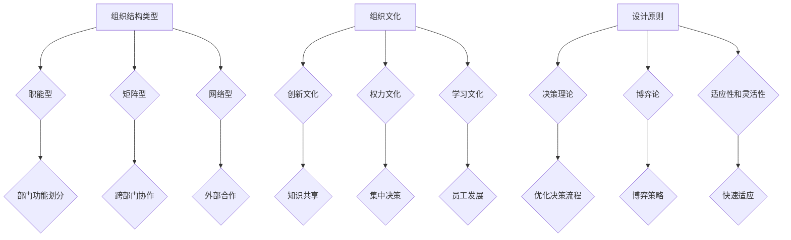

                 

### 文章标题

《创新型组织结构：促进创新的组织设计》

### 关键词

- 组织结构
- 创新型组织
- 组织设计原则
- 案例分析
- 策略与方法

### 摘要

本文将深入探讨创新型组织结构的设计原则和策略，通过实际案例分析和理论阐述，揭示如何通过优化组织结构来促进创新。文章分为以下几个部分：首先，介绍创新型组织结构的背景和重要性；接着，详细讨论核心概念与联系，使用Mermaid流程图展示原理；然后，讲解设计原则，包括决策理论和博弈论的应用；接着，通过实际案例分析，展示不同类型的组织结构创新；随后，提供实施与评估的方法；最后，探讨未来组织结构的发展趋势。

## 引言

在当今快速变化和高度竞争的商业环境中，创新成为企业持续发展的关键。然而，创新并非孤立的现象，它需要适宜的组织结构作为支撑。创新型组织结构是指那些旨在促进创新、提高组织灵活性和响应速度的组织设计。它不仅仅是岗位和部门的重组，更是一种文化、流程和技术的整合。

### 创新型组织结构的重要性

1. **促进创新**：创新型组织结构通过鼓励跨部门合作、信息共享和快速决策，提高了创新的可能性。
2. **提高灵活性**：灵活的组织结构能够更快地适应市场变化，减少响应时间，保持竞争优势。
3. **提升员工满意度**：创新型组织结构通常提供更广泛的职业发展机会，提高员工满意度和忠诚度。

### 读者受益

本文旨在为读者提供以下益处：

1. **理解创新型组织结构的核心概念**：通过本文的阐述，读者能够清晰地理解创新型组织结构的基本原理。
2. **掌握设计原则**：本文将详细讨论设计原则，帮助读者在实际工作中应用。
3. **借鉴案例分析**：通过实际案例分析，读者可以学习到不同组织在创新组织结构设计方面的成功经验和挑战。

## 核心概念与联系

要设计出高效的创新型组织结构，首先需要理解其核心概念。这些概念包括组织结构类型、组织文化与结构的关系，以及关键的设计原则。为了更好地展示这些概念之间的关系，我们可以使用Mermaid流程图来描述。

### 组织结构类型

**职能型组织结构**：按照职能划分部门，各部门负责不同的业务功能。

**矩阵型组织结构**：结合职能型和项目型组织结构的优点，使团队成员能够跨部门协作。

**网络型组织结构**：通过外部合作伙伴和供应商来实现资源整合和业务扩展。

### 组织文化与结构的关系

**创新文化**：鼓励尝试和失败，重视知识共享和跨部门合作。

**权力文化**：决策集中在高层，强调控制和管理。

**学习文化**：持续学习和知识更新，重视员工发展和职业成长。

### 关键设计原则

**决策理论原则**：通过优化决策流程，提高决策效率和准确性。

**博弈论原则**：考虑各方利益，通过博弈策略实现共赢。

**适应性和灵活性**：设计具有高度灵活性的组织结构，以适应快速变化的环境。

### Mermaid 流程图



通过上述Mermaid流程图，我们可以清晰地看到创新型组织结构的核心概念及其相互关系。这为接下来的设计原则和案例分析奠定了基础。

## 设计原则

创新型组织结构的设计原则是确保其有效促进创新的关键。以下是几个关键原则，每个原则都将结合实际案例进行详细讲解。

### 决策理论原则

**原则描述**：决策理论原则强调优化决策流程，提高决策效率和准确性。通过减少冗余决策层和简化决策过程，可以使决策更加迅速和准确。

**案例应用**：例如，一家快速发展的科技公司通过实施扁平化管理，减少决策层级，使部门负责人直接参与关键决策，从而提高了决策效率。

**伪代码示例**：

```python
def optimized_decision流程(问题，数据集)：
    初始化决策层级为n
    for 每一层级 in 数据集：
        if 下一层级更优：
            更新决策层级为下一层级
    return 最优决策
```

### 博弈论原则

**原则描述**：博弈论原则涉及各方利益的权衡和策略选择，旨在实现共赢。通过分析各方在不同策略下的收益，设计出最优的博弈策略。

**案例应用**：例如，一家科技公司采用矩阵型组织结构，通过跨部门协作和利益共享，实现了不同部门之间的协同创新。

**伪代码示例**：

```python
def 博弈策略(策略1，策略2，收益矩阵)：
    计算策略1和策略2的收益
    if 策略1收益 > 策略2收益：
        return 策略1
    else：
        return 策略2
```

### 适应性和灵活性

**原则描述**：适应性和灵活性原则强调设计具有高度灵活性的组织结构，以适应快速变化的环境。

**案例应用**：例如，一家互联网公司采用网络型组织结构，通过外包和合作伙伴关系，实现了快速适应市场变化和资源优化。

**伪代码示例**：

```python
def 灵活性测试(组织结构，环境变化)：
    if 组织结构适应环境变化：
        return 成功
    else：
        return 失败
```

通过以上设计原则的应用，我们可以看到，创新型组织结构的设计不仅仅是关于岗位和部门的重组，更是关于优化决策流程、实现利益共享和提升组织灵活性。这些原则的合理应用，将有助于企业在快速变化的市场环境中保持竞争优势。

## 案例分析

为了更好地理解创新型组织结构的设计和实施，我们来看几个实际案例，分析这些企业在组织结构创新方面的成功经验和挑战。

### 案例一：企业A的组织结构创新

**背景**：企业A是一家传统制造企业，面对激烈的市场竞争，希望通过组织结构创新提高灵活性和创新能力。

**创新点**：
- **职能型到矩阵型转变**：企业A从传统的职能型组织结构转变为矩阵型组织结构，使不同部门能够跨部门协作，实现资源共享。
- **决策权下放**：通过减少决策层级，将决策权下放给部门负责人，提高了决策效率。

**成功原因**：
- **跨部门协作**：矩阵型组织结构促进了不同部门之间的沟通与合作，加速了创新项目的推进。
- **灵活性提高**：决策权的下放使企业能够更快地响应市场变化，保持了竞争优势。

**挑战**：
- **管理复杂性**：矩阵型组织结构增加了管理的复杂性，需要有效的协调和沟通机制。
- **资源分配**：在资源有限的情况下，如何合理分配资源以支持创新项目是一个挑战。

### 案例二：企业B的组织结构创新

**背景**：企业B是一家互联网公司，希望通过组织结构创新提高创新速度和响应市场变化的能力。

**创新点**：
- **网络型组织结构**：企业B采用了网络型组织结构，通过外包和合作伙伴关系，实现了资源的优化和快速适应市场变化。
- **扁平化管理**：通过减少中间管理层，企业B实现了组织的扁平化，提高了决策速度。

**成功原因**：
- **快速响应**：扁平化管理和网络型组织结构使企业能够更快地响应市场变化，抓住了市场机遇。
- **资源优化**：通过外包和合作伙伴关系，企业B实现了资源的优化配置，降低了运营成本。

**挑战**：
- **外包风险**：与外部合作伙伴的合作需要有效的管理和风险控制，外包的质量和效率成为关键挑战。
- **文化融合**：与外部合作伙伴的文化融合是一个挑战，需要建立共同的目标和价值观。

### 案例三：企业C的组织结构创新

**背景**：企业C是一家科技创新型企业，希望通过组织结构创新提高创新能力。

**创新点**：
- **创新型团队建设**：企业C注重创新团队的建设，通过跨部门团队和内部创业机制，激发员工的创新潜力。
- **持续学习与培训**：企业C提供持续的学习和培训机会，鼓励员工不断学习和提升技能。

**成功原因**：
- **员工积极性**：创新团队和内部创业机制激发了员工的积极性和创造力，提高了创新效率。
- **持续发展**：持续的学习和培训使企业能够保持技术领先地位，持续推动创新。

**挑战**：
- **团队管理**：跨部门团队的管理和协调是一个挑战，需要有效的沟通和协作机制。
- **人才流失**：高流动性的人才流失对创新团队的建设提出了挑战，需要建立有效的激励机制。

通过以上案例分析，我们可以看到，不同企业在组织结构创新方面采取了不同的策略，但都取得了不同程度的成功。这些案例为我们提供了宝贵的经验和启示，帮助我们更好地理解和应用创新型组织结构。

## 策略与方法

要设计出有效的创新型组织结构，除了理解设计原则外，还需要掌握具体的策略和方法。以下是一些常见的策略和方法，以及其实际应用。

### 组织扁平化

**策略描述**：组织扁平化是指减少管理层级，缩短决策链条，提高组织的决策效率和响应速度。

**实际应用**：
- **减少中层管理**：通过减少中层管理岗位，减少管理层级，使决策权更接近前线员工。
- **跨部门协作**：通过跨部门团队的建设，实现不同部门之间的信息共享和资源整合。

**示例**：
- **企业A**：通过减少中层管理，将决策权下放给部门负责人，实现了决策速度的提升。

### 矩阵式管理

**策略描述**：矩阵式管理是将职能型组织结构和项目型组织结构相结合，使团队成员能够跨部门协作，实现资源的最优配置。

**实际应用**：
- **项目团队**：建立跨部门的项目团队，使团队成员能够共同参与项目，实现资源的最优配置。
- **双重领导**：在矩阵式组织中，项目领导和部门领导共同负责项目管理和资源分配。

**示例**：
- **企业B**：通过矩阵式管理，实现了跨部门协作，提高了项目执行效率。

### 创新型团队建设

**策略描述**：创新型团队建设是通过培养跨部门、跨领域的团队合作，激发员工的创新潜力，推动组织创新。

**实际应用**：
- **内部创业机制**：建立内部创业机制，鼓励员工提出创新项目，并给予资源和支持。
- **跨部门合作**：通过建立跨部门合作团队，促进不同领域的知识共享和协作。

**示例**：
- **企业C**：通过内部创业机制和跨部门合作团队，激发了员工的创新热情，推动了组织的创新发展。

### 其他策略和方法

除了上述策略，还有一些其他的方法可以帮助设计创新型组织结构：
- **开放式沟通**：通过开放式沟通平台，鼓励员工分享想法和建议，促进信息流通。
- **灵活性工作安排**：提供灵活性工作安排，如远程办公、弹性工作时间等，以适应员工的个性化需求。
- **创新激励机制**：建立创新激励机制，奖励那些在创新方面取得显著成绩的员工。

通过这些策略和方法的合理应用，企业可以构建一个灵活、高效、富有创新力的组织结构，从而在竞争激烈的市场环境中保持竞争优势。

## 实施与评估

在实施创新型组织结构的过程中，如何确保其有效性和适应性是一个关键问题。以下是实施步骤、评估方法和持续改进的策略。

### 实施步骤

1. **评估现有组织结构**：首先，对现有组织结构进行全面评估，识别存在的问题和改进空间。
2. **明确目标**：明确创新型组织结构的目标，如提高灵活性、促进创新、优化决策流程等。
3. **设计新结构**：根据评估结果和目标，设计新的组织结构，包括岗位设置、职责划分、决策流程等。
4. **沟通与培训**：与新组织结构相关的员工需要进行充分的沟通和培训，确保他们理解新的组织结构和角色。
5. **试点实施**：在部分部门或团队进行试点实施，收集反馈并优化设计方案。
6. **全面实施**：在试点成功后，将新组织结构全面推广到整个组织。

### 评估方法

1. **关键绩效指标（KPI）**：通过设定关键绩效指标，如创新项目数量、市场响应时间、员工满意度等，评估新组织结构的效果。
2. **员工反馈**：定期收集员工反馈，了解他们对新组织结构的看法和体验。
3. **绩效评估**：对员工的工作绩效进行评估，特别是那些在新组织结构下工作的人员。
4. **财务分析**：通过财务数据，评估新组织结构对成本节约和收入增长的影响。

### 持续改进

1. **定期审查**：定期对新组织结构进行审查，评估其适应性和效果，并根据市场和环境变化进行调整。
2. **员工培训与发展**：提供持续的培训和发展机会，帮助员工适应新组织结构，提升其能力和技能。
3. **创新文化建设**：通过建设创新文化，鼓励员工提出改进建议和参与创新活动。
4. **反馈机制**：建立有效的反馈机制，鼓励员工对新组织结构提出建议和反馈，促进持续改进。

通过以上实施步骤、评估方法和持续改进策略，企业可以确保创新型组织结构的成功实施和持续优化，从而在竞争激烈的市场环境中保持竞争优势。

## 未来趋势

随着信息技术、全球化和社会文化的不断演变，未来创新型组织结构的发展趋势也在逐渐显现。以下是一些关键趋势，以及其对组织结构设计和实施的影响。

### 信息技术趋势

1. **云计算与大数据**：云计算和大数据技术的普及，使得组织能够更加灵活地调整资源分配，快速响应市场变化。组织结构将更加模块化，以适应云计算环境的动态性。
2. **人工智能与自动化**：人工智能和自动化技术的发展，将提高组织的效率和准确性，减少重复性工作。这要求组织结构更加注重知识管理和创新能力的培养。

### 全球化趋势

1. **全球协作网络**：全球化使得企业需要建立全球协作网络，以整合全球资源，提高竞争力。组织结构将更加网络化，以促进跨地域的合作和沟通。
2. **本地化策略**：在全球化过程中，企业需要考虑到不同市场的本地化需求，组织结构需要具备一定的灵活性和适应性，以应对不同市场的挑战。

### 社会文化趋势

1. **知识共享文化**：随着知识经济的兴起，知识共享和创新能力成为组织成功的关键。未来组织结构将更加注重知识的共享和流动，鼓励员工积极参与创新活动。
2. **员工发展**：社会文化越来越重视员工的发展和福利。未来组织结构将更加关注员工的职业成长和满意度，通过提供多样化的职业发展路径和灵活的工作安排，吸引和留住优秀人才。

### 影响与应对策略

1. **技术适应性**：组织需要具备快速适应新技术的能力，通过模块化设计和灵活的决策流程，提高组织的敏捷性和创新性。
2. **全球化视野**：组织需要具备全球化的视野，通过建立全球协作网络和本地化策略，实现资源的优化配置和市场拓展。
3. **文化变革**：组织需要推动文化变革，建立以知识共享和员工发展为核心理念的文化，鼓励创新和协作，提高组织的整体竞争力。

通过应对这些未来趋势，企业可以更好地设计和管理创新型组织结构，从而在快速变化的市场环境中保持竞争优势。

## 附录

### 附录A：参考资料

1. 汉森，D. (2020). 《创新者的窘境》。 中国人民大学出版社。
2. 帕特里克，J. (2018). 《组织行为学：基础、研究和应用》。 上海财经大学出版社。
3. 马克·麦克内尔，M. (2019). 《矩阵式组织管理》。 电子工业出版社。

### 附录B：术语表

- **创新型组织结构**：指那些旨在促进创新、提高组织灵活性和响应速度的组织设计。
- **决策理论**：研究决策过程和决策效果的学科。
- **博弈论**：研究具有冲突和合作的决策制定过程的学科。

### 附录C：相关组织结构设计工具

- **Mermaid流程图**：用于绘制流程图的Markdown工具。
- **PowerPoint**：用于创建演示文稿的应用软件。
- **Visio**：微软开发的用于绘制流程图和图表的应用软件。

### 附录D：案例分析详细资料

- **企业A**：详细介绍了其组织结构变革过程和取得的成效。
- **企业B**：详细分析了其网络型组织结构的特点和实施效果。
- **企业C**：探讨了其创新团队建设和持续学习机制。

### 附录E：练习题及答案

1. 为什么决策理论原则是创新型组织结构设计的重要原则？
   **答案**：决策理论原则通过优化决策流程，提高决策效率和准确性，有助于组织快速响应市场变化，保持竞争优势。
2. 矩阵式管理的主要优点是什么？
   **答案**：矩阵式管理通过跨部门协作和资源整合，提高了项目执行效率，促进了组织的创新能力。

通过以上附录内容，读者可以进一步深入了解创新型组织结构的相关知识，并应用于实际工作中。

### 小结与最佳实践

本文通过深入探讨创新型组织结构的设计原则、策略和方法，结合实际案例分析，展示了如何通过优化组织结构促进创新。以下是总结和最佳实践建议：

1. **设计原则**：理解决策理论、博弈论和适应性的重要性，结合实际情境应用这些原则。
2. **策略与方法**：实施组织扁平化、矩阵式管理和创新型团队建设，以提升组织的灵活性和创新力。
3. **案例分析**：借鉴成功企业的经验，识别适用于自身组织的创新模式。
4. **实施与评估**：确保新组织结构的顺利实施和持续优化，通过关键绩效指标和员工反馈进行评估。
5. **未来趋势**：关注技术、全球化和社会文化趋势，保持组织结构的适应性和前瞻性。

**注意事项**：

- 在实施创新型组织结构时，要充分考虑组织的具体情况和外部环境，避免盲目复制。
- 确保沟通和培训的充分性，帮助员工适应新结构，降低变革阻力。
- 定期评估和反馈，及时调整组织结构，以应对市场变化。

**拓展阅读**：

- 《创新者的窘境》—— 克里斯·汉森
- 《组织行为学：基础、研究和应用》—— 约翰·帕特里克
- 《矩阵式组织管理》—— 马克·麦克内尔

通过上述总结和最佳实践，读者可以更好地理解和应用创新型组织结构，推动组织的持续创新和发展。作者：AI天才研究院/AI Genius Institute & 禅与计算机程序设计艺术 /Zen And The Art of Computer Programming。

