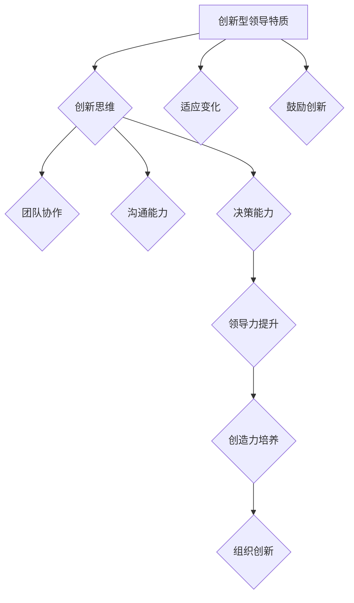

                 


### 《创新型领导：培养团队创造力的方法》

关键词：创新型领导、团队创造力、创新思维、领导力培养、案例研究

摘要：本文旨在探讨创新型领导在培养团队创造力方面的重要作用，分析其核心特质、创新思维的原理与应用，以及实践中的策略和方法。通过案例研究，展示成功创新实践，并对未来趋势与挑战进行展望。

# 《创新型领导：培养团队创造力的方法》目录大纲

## 第一部分：创新型领导概述

### 第1章：创新型领导的定义与重要性

### 第2章：创新思维的原理与应用

## 第二部分：培养团队创造力

### 第3章：建立支持创新的文化

### 第4章：激发团队创造力的方法

### 第5章：创新型领导的实践策略

### 第6章：成功创新案例研究

## 第三部分：未来展望与挑战

### 第7章：创新型领导的未来趋势

### 第8章：创新型领导的挑战与应对策略

## 附录

## 附录A：创新型领导相关资源与工具

## 附录B：Mermaid 流程图

## 附录C：创新型领导的核心算法原理讲解

## 附录D：项目实战

## 附录E：最佳实践 tips

### 摘要

创新型领导在当今快速变化的社会中扮演着至关重要的角色。本文通过详细探讨创新型领导的定义、重要性，以及创新思维的原理与应用，揭示了培养团队创造力的关键方法。文章分为三个主要部分：第一部分概述了创新型领导的核心特质和重要性，第二部分深入分析了创新思维的原理与实际应用，第三部分则提供了实践中的策略和案例研究。通过这些内容，读者将能够理解如何成为一名创新型领导者，并在团队中培养出强大的创造力。

## 第一部分：创新型领导概述

### 第1章：创新型领导的定义与重要性

#### 1.1 创新型领导的定义

创新型领导（Innovative Leadership）是指领导者通过创新思维、策略和实践，激发团队成员的创造力和创新能力，推动组织实现持续创新和卓越绩效。与常规领导相比，创新型领导更加关注团队的创新能力和创造力，善于发现并利用创新机会，从而推动组织在竞争激烈的市场中脱颖而出。

#### 1.1.1 创新型领导者的核心特质

创新型领导者具备以下核心特质：

1. **创新思维**：能够从不同角度思考问题，提出新颖的解决方案。
2. **适应变化**：能够灵活应对外部环境的变化，迅速调整战略和行动。
3. **鼓励创新**：鼓励团队成员提出创意，并为创新提供支持和资源。
4. **团队协作**：重视团队合作，促进知识共享和跨部门协作。
5. **沟通能力**：能够有效地与团队成员沟通，确保信息的透明和准确。
6. **决策能力**：能够基于数据和信息做出明智的决策。

#### 1.1.2 创新型领导与常规领导的区别

常规领导更多关注于维持组织的稳定和效率，而创新型领导则更注重激发团队的创造力和创新能力。具体区别如下：

1. **目标导向**：常规领导侧重于短期目标和执行力，而创新型领导更关注长期目标和创新潜力。
2. **决策方式**：常规领导倾向于集中决策，而创新型领导更倾向于授权和团队参与。
3. **绩效评估**：常规领导更多关注绩效指标，而创新型领导则更加注重团队的成长和创新成果。
4. **组织文化**：常规领导维护既有的组织文化，而创新型领导则积极推动创新文化和价值观。

#### 1.2 创新型领导的重要性

创新型领导对团队和组织具有重要意义，主要体现在以下几个方面：

1. **提升团队创造力**：通过鼓励创新思维和跨部门协作，激发团队成员的创造力。
2. **增强组织竞争力**：持续创新能够帮助组织在市场竞争中保持领先地位。
3. **推动组织发展**：创新是实现组织持续发展的关键动力，能够帮助组织适应不断变化的环境。
4. **提升员工满意度**：创新型领导能够为员工提供更好的发展机会和成就感，从而提高员工满意度。

#### 1.2.1 对团队的影响

创新型领导对团队的影响主要表现在以下几个方面：

1. **激发创造力**：通过鼓励创新思维和实践，激发团队成员的创造力。
2. **促进知识共享**：通过跨部门协作和知识交流，促进团队成员之间的知识共享。
3. **提高团队绩效**：通过创新和协作，提高团队的绩效和成果。
4. **增强团队凝聚力**：通过共同目标和价值观，增强团队的凝聚力和归属感。

#### 1.2.2 对组织的影响

创新型领导对组织的影响主要表现在以下几个方面：

1. **提升创新能力**：通过激发团队的创造力，提升组织的整体创新能力。
2. **推动战略转型**：通过创新实践，推动组织实现战略转型和业务模式创新。
3. **增强竞争力**：通过持续创新，提升组织的市场竞争力。
4. **实现可持续发展**：通过创新，帮助组织实现长期可持续发展。

#### 1.2.3 在当今社会的价值

在当今快速变化的社会，创新型领导具有重要的价值：

1. **适应变革**：随着技术和社会的快速发展，创新型领导能够帮助组织适应变革，保持竞争力。
2. **推动创新**：在创新驱动的时代，创新型领导能够推动组织实现持续创新，实现突破。
3. **提升组织效能**：通过激发团队的创造力和创新能力，提升组织的整体效能。
4. **促进社会进步**：通过推动创新和科技进步，促进社会的发展和进步。

## 第二章：创新思维的原理与应用

#### 2.1 创新思维的原理

创新思维（Innovation Thinking）是指运用创造性思维，发现新的问题解决方案，创造新的价值。创新思维的核心在于打破常规，从不同角度思考问题，并提出创新的解决方案。创新思维主要包括以下几种类型：

1. **发散思维**：从不同角度思考问题，探索多种可能的解决方案。
2. **收敛思维**：将多种可能的解决方案集中到一个最优的解决方案。
3. **逆向思维**：从相反的角度思考问题，提出创新的解决方案。
4. **联想思维**：通过事物之间的联系，提出新的创意和解决方案。
5. **组合思维**：将不同领域的知识和技术进行组合，提出创新的解决方案。

#### 2.1.1 创新思维的定义与类型

创新思维是一种创造性思维，旨在通过打破常规，提出新的问题解决方案，创造新的价值。创新思维可以分为以下几种类型：

1. **突破性创新**：通过全新的技术和理念，实现颠覆性的变革。
2. **渐进性创新**：通过持续改进和优化，实现渐进式的创新。
3. **组合创新**：通过不同领域的知识和技术进行组合，实现创新。
4. **逆向创新**：通过从相反的角度思考问题，提出创新的解决方案。
5. **复制创新**：通过借鉴其他领域的成功经验，实现创新。

#### 2.1.2 创新思维的核心过程

创新思维的核心过程主要包括以下步骤：

1. **发现问题**：识别和明确问题，确定创新的目标和方向。
2. **收集信息**：收集与问题相关的信息和数据，为创新提供基础。
3. **分析问题**：对收集到的信息进行分析，找出问题的本质和关键因素。
4. **提出假设**：根据分析结果，提出可能的解决方案和假设。
5. **验证假设**：通过实验、模拟等方式，验证假设的可行性和有效性。
6. **实施创新**：将验证成功的解决方案实施到实际中，实现创新。

#### 2.1.3 创新思维与创造力的关系

创新思维与创造力密切相关，创新思维是创造力的基础，创造力是创新思维的结果。创新思维为创造力提供了方向和方法，而创造力则通过创新思维实现价值的创造。具体关系如下：

1. **创新思维激发创造力**：通过创新思维，激发团队成员的创造力，提出新的创意和解决方案。
2. **创造力促进创新**：通过创造力，实现创新的目标和成果，推动组织的持续创新。
3. **创新思维与创造力的互动**：创新思维和创造力相互促进，通过不断循环，推动组织的创新和发展。

#### 2.2 创新思维的应用

创新思维在团队中的培养和应用，对于提升团队的创造力和创新能力具有重要意义。以下是创新思维在团队中的应用方法和策略：

1. **跨部门协作**：通过跨部门协作，促进团队成员之间的知识共享和交流，激发创新思维。
2. **挑战性目标**：设定挑战性目标，鼓励团队成员运用创新思维，提出解决方案。
3. **创新培训**：开展创新培训，提高团队成员的创新思维能力和创造力。
4. **创新激励机制**：建立创新激励机制，鼓励团队成员提出创意和解决方案。
5. **创新工具与方法**：运用创新工具与方法，如头脑风暴、思维导图、原型设计等，促进创新思维的应用。

#### 2.2.1 创新思维在团队中的培养

在团队中培养创新思维，需要从以下几个方面入手：

1. **创造良好的创新环境**：提供自由、开放、支持创新的环境，鼓励团队成员自由表达创意和想法。
2. **建立创新文化**：培养团队的创新文化，鼓励创新思维和创造力，形成共同的价值观念。
3. **提供学习机会**：为团队成员提供学习机会，提升他们的知识水平和创新思维能力。
4. **鼓励跨部门协作**：促进团队成员之间的跨部门协作，激发创新思维。
5. **奖励创新成果**：对创新成果给予奖励和认可，激发团队成员的创新热情。

#### 2.2.2 创新思维在组织中的应用

创新思维在组织中的应用，对于提升组织的创新能力和竞争力具有重要意义。以下是创新思维在组织中的应用策略：

1. **战略规划**：将创新思维融入组织战略规划，确保组织在创新方面的方向和目标。
2. **产品开发**：运用创新思维，推动产品开发和创新，提升产品竞争力。
3. **业务模式创新**：通过创新思维，探索新的业务模式，实现业务增长和转型。
4. **流程优化**：运用创新思维，优化业务流程，提升组织运营效率。
5. **组织变革**：运用创新思维，推动组织变革，实现组织创新和发展。

#### 2.2.3 创新思维在企业战略规划中的作用

创新思维在企业战略规划中发挥着重要作用，主要体现在以下几个方面：

1. **明确创新目标**：通过创新思维，明确企业的创新目标和方向，确保战略规划的准确性。
2. **挖掘创新机会**：通过创新思维，挖掘市场和技术等方面的创新机会，为企业发展提供动力。
3. **优化资源配置**：通过创新思维，合理配置资源，提升资源利用效率。
4. **推动战略实施**：通过创新思维，推动战略规划的落地和实施，确保战略目标的实现。
5. **提升竞争力**：通过创新思维，提升企业的核心竞争力，确保企业在市场中的领先地位。

### 第3章：建立支持创新的文化

#### 3.1 创新文化的定义与特点

创新文化（Innovation Culture）是指组织内部普遍认同和践行的价值观、信仰和行为准则，旨在激发和推动创新。创新文化的核心是鼓励创新思维、容忍失败、尊重个性，形成支持创新的组织氛围。

创新文化具有以下特点：

1. **开放性**：鼓励自由表达和思想碰撞，为创新提供空间。
2. **包容性**：尊重个性差异，包容不同的观点和意见。
3. **风险容忍**：容忍失败，鼓励尝试和探索。
4. **合作性**：强调团队合作，促进知识共享和协作。
5. **学习性**：持续学习和知识更新，提升创新能力。

#### 3.1.1 创新文化的定义

创新文化是组织内部普遍认同和践行的价值观、信仰和行为准则，旨在激发和推动创新。创新文化强调以下方面：

1. **创新价值观**：将创新视为组织发展的重要驱动力，树立创新意识。
2. **创新信仰**：相信创新能够带来成功和竞争优势，形成共同信仰。
3. **创新行为**：鼓励员工提出创意和解决方案，积极参与创新活动。

#### 3.1.2 创新文化的特点

创新文化具有以下特点：

1. **开放性**：鼓励员工自由表达观点和创意，促进知识共享和交流。
2. **包容性**：尊重员工的个性差异和不同意见，形成多元化的创新氛围。
3. **风险容忍**：鼓励员工勇于尝试新事物，容忍失败，为创新提供保障。
4. **合作性**：强调团队合作，促进跨部门协作和知识共享。
5. **学习性**：持续学习和知识更新，提升员工的创新能力和素质。

#### 3.1.3 建立创新文化的步骤

建立创新文化需要从以下几个方面入手：

1. **领导示范**：领导层应率先树立创新意识，带头实践创新行为，为员工树立榜样。
2. **政策支持**：制定支持创新的政策和制度，为创新提供资源和保障。
3. **培训提升**：开展创新培训，提升员工的创新思维和创新能力。
4. **激励机制**：建立创新激励机制，鼓励员工积极参与创新活动。
5. **文化建设**：通过文化活动，营造创新氛围，提升员工的创新意识。

### 3.2 促进创新的行为

#### 3.2.1 鼓励试错与容忍失败

鼓励试错与容忍失败是创新文化的重要组成部分。通过鼓励员工尝试新事物，并容忍失败，可以激发员工的创新热情和勇气。

1. **建立试错机制**：为员工提供试错机会，降低试错的成本和风险。
2. **鼓励创新尝试**：为员工提供创新项目和支持，鼓励他们尝试新思路。
3. **容忍失败**：为员工创造一个宽容的环境，让他们在失败中总结经验，不断进步。

#### 3.2.2 鼓励分享与知识交流

鼓励分享与知识交流是促进创新的重要手段。通过共享知识和经验，可以激发员工的创新思维，提高团队的创新能力。

1. **搭建分享平台**：建立知识分享平台，促进员工之间的知识交流。
2. **开展交流活动**：定期举办交流活动，促进员工之间的互动和知识共享。
3. **设立知识库**：建立企业知识库，为员工提供丰富的知识资源。

#### 3.2.3 鼓励自主探索与个性化发展

鼓励自主探索与个性化发展是培养创新人才的重要策略。通过激发员工的自主性和个性化发展，可以培养出具有创新能力的优秀人才。

1. **提供自主发展空间**：为员工提供自主发展的空间和机会，鼓励他们进行个性化探索。
2. **设立个性化项目**：设立个性化项目，鼓励员工发挥特长和创造力。
3. **支持个性化培训**：提供个性化培训，支持员工进行自我提升。

### 第4章：激发团队创造力的方法

#### 4.1 创造力激发的理论基础

创造力（Creativity）是指个体或团队产生新颖且有价值的想法和解决方案的能力。激发团队创造力需要从心理学、组织学和神经科学等多个角度进行探讨。

1. **心理学视角**：心理学研究指出，个体的创造力受到多种因素的影响，如心理安全、动机、认知能力等。通过提升这些因素，可以激发团队的创造力。

2. **组织学视角**：组织学研究表明，组织的结构、文化和政策对团队的创造力有重要影响。一个支持创新的组织文化可以激发团队的创造力。

3. **神经科学视角**：神经科学研究揭示了大脑在创造力过程中的作用，如联想能力、大脑网络活动等。通过了解这些机制，可以设计出有效的策略来激发团队的创造力。

#### 4.1.1 基于心理学的创造力理论

心理学中关于创造力的理论包括：

1. **激情理论**：激情是创造力的关键因素，个体对某事物的强烈兴趣和热情可以激发创造力。

2. **思维模式理论**：创造性思维包括发散思维、收敛思维和逆向思维等。通过培养这些思维模式，可以提升团队的创造力。

3. **认知理论**：创造性思维涉及联想能力、认知灵活性和问题解决能力。通过提升这些能力，可以激发团队的创造力。

#### 4.1.2 基于组织学的创造力理论

组织学中关于创造力的理论包括：

1. **结构洞理论**：结构洞是指个体在组织中的信息优势，通过利用结构洞，个体可以获取更多的信息和资源，从而提升创造力。

2. **组织文化理论**：创新文化是激发团队创造力的关键。一个支持创新的组织文化可以鼓励员工提出创意和解决方案。

3. **领导力理论**：领导者在激发团队创造力方面发挥着重要作用。支持型领导和参与型领导风格有助于提升团队的创造力。

#### 4.1.3 基于神经科学的创造力理论

神经科学中关于创造力的理论包括：

1. **大脑网络活动**：大脑中的不同区域在创造力过程中扮演着不同的角色。例如，前额叶皮层和顶叶皮层在创造性思维中起着关键作用。

2. **神经可塑性**：大脑具有可塑性，通过训练和练习，可以提升创造力相关的大脑功能。

3. **神经递质**：神经递质如多巴胺和血清素在创造力过程中发挥着重要作用。通过调节这些神经递质的水平，可以激发团队的创造力。

#### 4.2 创造力激发的方法

1. **挑战性目标的设定**：设定具有挑战性的目标可以激发团队的创造力。目标应既具有可行性，又具有一定的难度，以激发团队的斗志和创造力。

2. **跨部门协作与知识共享**：跨部门协作和知识共享可以促进团队成员之间的交流和合作，激发创造力。通过建立跨部门团队，共享资源和信息，可以提升团队的创造力。

3. **创新思维训练**：通过培训和实践，提升团队成员的创新思维能力。可以采用头脑风暴、思维导图、创意工作坊等方法，培养创新思维。

4. **创意思维的工具与方法**：使用创意思维的工具和方法，如六顶思考帽、SCAMPER等，可以激发团队成员的创意和想象力。

### 4.2.1 挑战性目标的设定

设定挑战性目标可以激发团队的创造力和动力。以下是一些关键步骤：

1. **明确目标**：确保目标明确、具体且具有挑战性。目标应与团队的使命和愿景保持一致。

2. **分解任务**：将大目标分解为小任务，确保每个成员都清楚自己的职责和目标。

3. **设定期限**：为每个任务设定合理的完成期限，以激发团队的紧迫感和动力。

4. **提供资源**：确保团队成员有足够的资源和支持来完成目标。

5. **反馈与调整**：定期检查进度，提供反馈和指导，根据实际情况进行调整。

### 4.2.2 跨部门协作与知识共享

跨部门协作和知识共享是激发团队创造力的重要方法。以下是一些关键策略：

1. **建立跨部门团队**：组建跨部门的团队，促进不同部门之间的合作和信息交流。

2. **共享资源与信息**：建立共享平台，如企业内部网、知识库等，方便团队成员获取所需信息和资源。

3. **定期会议与交流活动**：定期组织跨部门会议和交流活动，促进团队成员之间的沟通和合作。

4. **鼓励跨部门交流**：鼓励团队成员参与跨部门的培训和项目，增加合作机会。

### 4.2.3 创新思维训练

创新思维训练是培养团队创造力的重要手段。以下是一些关键方法：

1. **头脑风暴**：组织头脑风暴会议，鼓励团队成员自由表达观点和创意。

2. **思维导图**：使用思维导图工具，帮助团队成员梳理思路，发现新的创意和解决方案。

3. **案例研究**：通过分析成功的创新案例，学习他们的创新思维和方法。

4. **创新工作坊**：定期举办创新工作坊，提供实践机会，培养创新思维。

### 4.2.4 创意思维的工具与方法

创意思维的工具与方法可以帮助团队产生新的创意和解决方案。以下是一些常用的工具和方法：

1. **六顶思考帽**：使用六顶思考帽方法，从不同角度思考问题，产生多样化的创意。

2. **SCAMPER**：通过SCAMPER方法，从不同方面对现有产品或服务进行改进和创新。

3. **SWOT分析**：使用SWOT分析方法，评估团队的优点、弱点、机会和威胁，发现创新机会。

4. **TRIZ**：使用TRIZ方法，通过解决冲突和问题，产生创新的解决方案。

### 第5章：创新型领导的实践策略

#### 5.1 领导风格与创造力培养

创新型领导的实践策略在很大程度上取决于其领导风格。不同领导风格对团队的创造力和创新能力有着不同的影响。以下是三种常见的领导风格及其对创造力培养的影响：

1. **支持型领导风格**：支持型领导关注团队成员的需求和感受，提供必要的支持和资源，鼓励他们尝试新事物。这种领导风格有助于培养团队成员的自信心和创新能力。

2. **参与型领导风格**：参与型领导鼓励团队成员参与决策过程，给予他们更多的自主权。这种领导风格可以激发团队成员的创造力和主动性。

3. **指导型领导风格**：指导型领导注重任务的执行和目标的达成，提供明确的指导和反馈。这种领导风格在短期内可能有助于提高团队的执行力，但在长期内可能抑制团队成员的创造力和自主性。

#### 5.1.1 支持型领导风格

支持型领导风格的特点如下：

1. **关注团队成员的需求和感受**：支持型领导关注团队成员的心理和情感需求，提供关怀和支持。

2. **提供资源和支持**：支持型领导为团队成员提供必要的资源和帮助，确保他们能够顺利完成工作。

3. **鼓励尝试和失败**：支持型领导鼓励团队成员尝试新事物，并容忍失败，为他们的创新提供保障。

4. **提供反馈和指导**：支持型领导定期提供反馈和指导，帮助团队成员提高能力和创造力。

#### 5.1.2 参与型领导风格

参与型领导风格的特点如下：

1. **鼓励团队参与决策**：参与型领导鼓励团队成员参与决策过程，给予他们更多的自主权。

2. **建立信任和合作**：参与型领导建立信任和合作关系，促进团队成员之间的沟通和协作。

3. **提供发展机会**：参与型领导为团队成员提供发展机会，鼓励他们不断学习和成长。

4. **支持创新和尝试**：参与型领导支持团队成员的创新尝试，为他们提供必要的支持和资源。

#### 5.1.3 指导型领导风格

指导型领导风格的特点如下：

1. **明确任务和目标**：指导型领导明确任务和目标，确保团队成员了解工作要求和期望。

2. **提供详细指导**：指导型领导提供详细的指导和建议，帮助团队成员解决问题和完成任务。

3. **强调执行力**：指导型领导注重任务的执行和目标的达成，确保团队的工作效率。

4. **限制自主性**：指导型领导可能限制团队成员的自主性，这可能会影响他们的创造力和创新能力。

#### 5.2 领导力提升与团队创造力

领导力的提升对团队创造力有着重要影响。以下是领导力提升的几个关键方面：

1. **自我提升**：领导者应持续学习和自我提升，以增强自身的领导能力和创新思维。

2. **领导力培训**：参加领导力培训课程，学习最新的领导理论和实践方法。

3. **反思和总结**：领导者应定期进行反思和总结，从经验中学习，不断提升自己的领导水平。

4. **建立支持系统**：建立支持系统，包括导师、同行反馈和咨询等，帮助领导者提高领导力。

#### 5.2.1 领导力的定义与构成

领导力（Leadership）是指领导者通过影响和激励团队成员，实现共同目标的能力。领导力的构成包括以下几个核心要素：

1. **影响力**：领导者通过言行和价值观影响团队成员，激发他们的积极性和创造力。

2. **激励能力**：领导者能够激励团队成员，激发他们的内在动机，提高工作绩效。

3. **沟通能力**：领导者具备良好的沟通能力，能够有效地传达信息和指令，促进团队成员之间的协作。

4. **决策能力**：领导者具备决策能力，能够在复杂和不确定的环境中做出明智的决策。

5. **团队建设能力**：领导者能够建立和谐的团队氛围，增强团队的凝聚力和协作精神。

6. **变革管理能力**：领导者能够推动组织变革，带领团队适应新的环境和挑战。

#### 5.2.2 领导力提升的方法

以下是一些提升领导力的方法：

1. **学习与反思**：领导者应不断学习新的知识和技能，通过反思和实践提升自己的领导能力。

2. **导师指导**：寻找导师进行指导，从经验丰富的领导者那里学习领导技巧和方法。

3. **实践锻炼**：通过实际工作，如承担新的项目和角色，提升领导力和管理能力。

4. **参与培训**：参加领导力培训课程，学习最新的领导理论和实践方法。

5. **建立网络**：与同行建立联系，分享经验和观点，提升领导力。

6. **培养下属**：通过培养下属，提高他们的能力和素质，增强团队的凝聚力和创造力。

#### 5.2.3 领导力与团队创造力之间的关系

领导力对团队创造力有着直接和间接的影响。以下是领导力与团队创造力之间的关系：

1. **直接影响**：领导者的风格和能力直接影响团队成员的创造力和创新能力。支持型领导和参与型领导风格有助于激发团队的创造力。

2. **间接影响**：领导力通过营造创新文化、提供资源和激励，间接影响团队的创造力。一个有能力的领导者能够推动组织建立支持创新的文化，为团队创造力的培养提供保障。

3. **协同作用**：领导力与团队创造力相互促进。有效的领导力可以激发团队的创造力，而强大的创造力可以提升领导者的领导力和影响力。

### 第6章：成功创新案例研究

#### 6.1 创新型领导在实践中的应用

创新型领导在实践中的应用案例丰富多样，以下是几个具有代表性的案例：

##### 案例一：苹果公司的创新之路

苹果公司（Apple Inc.）的创始人史蒂夫·乔布斯（Steve Jobs）是一位典型的创新型领导者。他通过卓越的领导力和创新思维，将苹果公司从一个小型计算机公司发展成为全球科技巨头。以下是苹果公司创新成功的关键因素：

1. **领导力风格**：乔布斯采用参与型领导风格，鼓励团队成员参与产品设计和决策过程，激发了员工的创造力和主动性。

2. **创新文化**：苹果公司建立了支持创新的文化，鼓励员工提出新想法和尝试新方法。

3. **研发投入**：苹果公司在研发方面投入大量资源，确保产品和技术始终处于行业领先地位。

4. **跨部门协作**：苹果公司强调跨部门协作，促进不同团队之间的知识共享和资源整合。

##### 案例二：谷歌的“20%时间”政策

谷歌（Google）的“20%时间”政策是创新型领导在实践中的又一成功案例。谷歌创始人谢尔盖·布林（Sergey Brin）和拉里·佩奇（Larry Page）鼓励员工将20%的工作时间用于个人项目，这一政策激发了员工的创新热情，产生了许多成功的产品和服务，如Gmail、AdSense等。以下是“20%时间”政策成功的关键因素：

1. **领导力支持**：布林和佩奇作为创新型领导者，为员工提供支持和资源，鼓励他们尝试新项目。

2. **创新文化**：谷歌建立了支持创新的文化，鼓励员工自由表达创意和尝试新事物。

3. **灵活的工作时间**：谷歌提供灵活的工作时间，为员工提供足够的自由度，使他们能够专注于个人项目。

4. **激励机制**：谷歌为成功项目提供奖励和认可，激励员工继续创新。

##### 案例三：特斯拉的自主创新模式

特斯拉（Tesla, Inc.）的创始人埃隆·马斯克（Elon Musk）是一位具有远见和创新精神的领导者。他通过建立特斯拉，推动电动汽车和清洁能源的发展。以下是特斯拉自主创新模式成功的关键因素：

1. **领导力风格**：马斯克采用指导型领导风格，为员工提供明确的方向和目标，确保创新项目朝着正确的方向发展。

2. **研发投入**：特斯拉在研发方面投入大量资源，推动技术创新和产品开发。

3. **跨学科合作**：特斯拉鼓励跨学科合作，将不同领域的专业知识结合起来，推动创新。

4. **快速迭代**：特斯拉采用快速迭代的方法，不断优化产品，提高用户体验。

#### 6.2 创造力培养在组织中的成功实践

创造力培养在组织中的成功实践案例也很多，以下是几个典型的例子：

##### 案例一：IBM的创新实验室

IBM（International Business Machines Corporation）的创新实验室是组织内部创造力培养的典范。IBM通过设立创新实验室，为员工提供研究和开发新技术和解决方案的平台。以下是IBM创新实验室成功的关键因素：

1. **领导力支持**：IBM的领导层高度重视创新，为创新实验室提供充足的资源和支持。

2. **跨部门合作**：IBM鼓励跨部门合作，促进不同团队之间的知识共享和资源整合。

3. **人才培养**：IBM通过培训和激励机制，提升员工的创新能力和技术水平。

4. **开放文化**：IBM建立了开放的创新文化，鼓励员工自由表达创意和尝试新事物。

##### 案例二：微软的研发部门

微软（Microsoft Corporation）的研发部门在创造力培养方面有着丰富的实践经验。微软通过建立多个研发中心，鼓励员工进行创新研究和技术开发。以下是微软研发部门成功的关键因素：

1. **领导力支持**：微软的领导层高度重视创新，为研发部门提供充足的资源和支持。

2. **创新文化**：微软建立了支持创新的文化，鼓励员工自由表达创意和尝试新事物。

3. **人才培养**：微软通过培训和激励机制，提升员工的创新能力和技术水平。

4. **激励机制**：微软为成功项目提供奖励和认可，激励员工继续创新。

##### 案例三：三星的创新生态系统

三星（Samsung Electronics Co., Ltd.）建立了完善的创新生态系统，推动企业的持续创新和发展。以下是三星创新生态系统成功的关键因素：

1. **领导力支持**：三星的领导层高度重视创新，为创新项目提供充足的资源和支持。

2. **全球布局**：三星在全球范围内建立研发中心，促进跨区域的知识共享和资源整合。

3. **跨学科合作**：三星鼓励跨学科合作，将不同领域的专业知识结合起来，推动创新。

4. **激励机制**：三星为成功项目提供奖励和认可，激励员工继续创新。

### 第7章：创新型领导的未来趋势

#### 7.1 创新型领导的发展方向

随着科技的快速发展和社会的变革，创新型领导的发展方向也在不断演变。以下是未来创新型领导可能的发展方向：

1. **数字化领导**：在数字化时代，创新型领导需要具备数字化思维和技能，能够应对数字技术的挑战和机遇。

2. **智能化领导**：随着人工智能和大数据技术的发展，创新型领导需要掌握智能化工具和方法，提升决策和管理的效率。

3. **可持续发展领导**：在可持续发展成为全球关注焦点的背景下，创新型领导需要关注环境保护和社会责任，推动企业的可持续发展。

4. **跨文化领导**：全球化进程加快，创新型领导需要具备跨文化沟通和协作能力，促进多元文化的融合和创新。

5. **组织变革领导**：在面对快速变化的环境，创新型领导需要具备组织变革能力，推动组织的持续创新和适应。

#### 7.1.1 数字化时代的领导变革

在数字化时代，领导者的角色和职责发生了深刻变革。以下是数字化时代领导变革的几个关键方面：

1. **数据驱动决策**：领导者需要具备数据分析和决策能力，利用大数据和人工智能工具进行数据驱动的决策。

2. **敏捷管理**：领导者需要具备敏捷管理的技能，能够快速响应市场变化和客户需求，推动组织的敏捷转型。

3. **数字化转型**：领导者需要推动组织的数字化转型，利用数字技术优化业务流程和提升运营效率。

4. **数字化素养**：领导者需要具备数字化素养，了解数字技术的应用和趋势，提升自身的数字技能。

5. **人才管理**：领导者需要关注数字化人才的培养和发展，吸引和留住数字化时代的优秀人才。

#### 7.1.2 人工智能与领导力

人工智能（AI）的快速发展为领导力带来了新的机遇和挑战。以下是人工智能与领导力之间的几个关键关系：

1. **决策支持**：人工智能可以提供实时数据和预测分析，为领导者提供更准确的决策支持。

2. **自动化管理**：人工智能可以自动化一些重复性和标准化的任务，减轻领导者的工作负担。

3. **创新驱动**：人工智能可以激发新的创新思路和商业模式，推动组织的创新和发展。

4. **人才发展**：人工智能可以帮助领导者更好地了解员工的能力和发展需求，提供个性化的培训和指导。

5. **道德和责任**：领导者需要关注人工智能的道德和责任问题，确保人工智能的应用符合伦理和社会规范。

#### 7.1.3 可持续发展与领导责任

可持续发展已成为全球企业和领导者的重要议题。以下是可持续发展与领导责任之间的几个关键方面：

1. **环境责任**：领导者需要关注环境保护，推动企业的绿色生产和可持续发展。

2. **社会责任**：领导者需要关注社会问题，推动企业的社会责任和公益活动。

3. **经济责任**：领导者需要关注企业的经济效益，推动企业的可持续发展和长期价值。

4. **全球视野**：领导者需要具备全球视野，关注全球环境和挑战，推动企业的国际化发展。

5. **变革领导**：领导者需要具备变革领导能力，推动企业的可持续发展转型和适应。

#### 7.2 创新型领导的挑战与应对策略

在未来的发展中，创新型领导将面临一系列挑战。以下是这些挑战及其应对策略：

1. **技术变革**：随着技术的快速发展，领导者需要不断学习新的技术和工具，提升自身的创新能力。

2. **人才竞争**：在数字化时代，领导者需要具备吸引和留住数字化人才的能力，为组织提供持续的创新动力。

3. **组织变革**：领导者需要推动组织的变革，适应快速变化的市场环境和社会需求。

4. **全球挑战**：领导者需要具备跨文化沟通和协作能力，应对全球性的环境和挑战。

5. **伦理道德**：领导者需要关注人工智能和数字化技术的伦理和道德问题，确保技术的应用符合社会规范。

#### 7.2.1 创新风险与管理

创新风险是创新型领导面临的重要挑战之一。以下是创新风险及其管理策略：

1. **创新风险**：创新活动可能导致失败、经济损失和品牌形象受损。

2. **风险评估**：领导者需要对创新项目进行风险评估，识别潜在风险并制定相应的风险应对策略。

3. **风险管理**：领导者需要建立风险管理机制，降低创新风险，确保创新项目的成功实施。

4. **试错机制**：领导者需要建立试错机制，鼓励员工在创新过程中尝试和失败，积累经验。

5. **持续监控**：领导者需要持续监控创新项目的进展和效果，及时调整策略和措施。

#### 7.2.2 跨文化领导与团队协作

跨文化领导是创新型领导的重要挑战之一。以下是跨文化领导与团队协作的关键策略：

1. **文化理解**：领导者需要了解不同文化的特点和价值观，尊重和包容多元文化。

2. **沟通技巧**：领导者需要具备跨文化沟通技巧，确保信息的准确传达和有效沟通。

3. **团队建设**：领导者需要建立跨文化团队，促进团队成员之间的合作和协作。

4. **文化融合**：领导者需要推动文化融合，形成共同的文化价值观和团队精神。

5. **激励机制**：领导者需要建立激励机制，激发团队成员的积极性和创造力。

#### 7.2.3 组织变革与领导力转型

组织变革是创新型领导的重要任务之一。以下是组织变革与领导力转型的关键策略：

1. **明确目标**：领导者需要明确组织变革的目标和愿景，确保变革的方向和路径。

2. **领导力转型**：领导者需要提升自身的领导能力，适应变革过程中的角色和职责。

3. **变革管理**：领导者需要建立变革管理机制，确保变革的顺利进行。

4. **员工参与**：领导者需要鼓励员工参与变革过程，增强他们的参与感和责任感。

5. **持续改进**：领导者需要推动组织的持续改进，确保变革的长期效果。

### 附录

#### 附录A：创新型领导相关资源与工具

以下是一些创新型领导相关的资源与工具，供读者参考：

1. **书籍推荐**：

   - 《创新者的窘境》（The Innovator's Dilemma） - 克莱顿·克里斯坦森（Clayton M. Christensen）
   - 《创新者的基因》（The Innovator's Gene） - 艾伦·许（Alan Xue）
   - 《创新思维》（Creative Thinking） - 阿兰·拉金（Alan Lakein）

2. **在线课程**：

   - Coursera上的《创新与设计思维》（Innovation and Design Thinking）
   - edX上的《领导力与团队发展》（Leadership and Team Development）

3. **工具推荐**：

   - MindMeister：思维导图工具
   - Trello：项目管理系统
   - Slack：团队协作工具

#### 附录B：Mermaid 流程图

以下是一个简单的Mermaid流程图示例，展示了创新型领导的核心特质和关键过程：



#### 附录C：创新型领导的核心算法原理讲解

以下是一个简单的伪代码示例，展示了创新型领导的决策算法：

```python
def innovative_leader_decisionmaking(problem, options):
    # 初始化模型
    model = initialize_model()

    # 对每个选项进行评估
    for option in options:
        evaluate_option(model, option)

    # 找到最佳选项
    best_option = find_best_option(options)

    # 实施最佳选项
    implement_option(best_option)

    return best_option
```

#### 附录D：项目实战

以下是一个简单的项目实战示例，展示了如何搭建一个支持创新的团队：

1. **开发环境搭建**：

   - 安装Git版本控制工具
   - 安装Jenkins自动化工具
   - 安装Kubernetes容器编排工具

2. **源代码详细实现**：

   - 编写项目需求文档
   - 设计数据库架构
   - 编写后端代码
   - 编写前端代码

3. **代码解读与分析**：

   - 分析代码架构和设计模式
   - 评估代码质量和性能
   - 优化代码和数据库查询

4. **实际案例分析和详细讲解**：

   - 分析团队协作过程和沟通情况
   - 评估创新项目的效果和成果
   - 总结经验和教训

5. **项目小结**：

   - 总结项目过程中的创新实践
   - 提出改进建议和未来规划

#### 附录E：最佳实践 tips

以下是一些创新型领导的最佳实践 tips：

1. **培养创新思维**：定期进行创新思维训练，如头脑风暴、思维导图等，激发团队的创造力。

2. **鼓励跨部门协作**：建立跨部门团队，促进不同团队之间的知识共享和资源整合。

3. **建立创新激励机制**：设立创新奖励，鼓励员工提出创意和解决方案。

4. **提供资源支持**：确保团队有足够的资源和时间进行创新尝试。

5. **建立创新文化**：营造支持创新的组织氛围，鼓励员工自由表达创意和尝试新事物。

6. **持续学习**：关注行业动态和技术趋势，持续提升自身的能力和知识水平。

### 总结

创新型领导在培养团队创造力方面发挥着至关重要的作用。通过了解创新型领导的定义、重要性，以及创新思维的原理和应用，领导者可以更好地激发团队的创造力和创新能力。在实践中，领导者应关注建立支持创新的文化，采用有效的领导风格和策略，推动组织的创新和发展。未来，随着科技的进步和社会的变化，创新型领导将继续面临新的挑战和机遇，领导者需要不断提升自身的领导能力和创新能力，以适应快速变化的环境。通过本文的探讨，希望读者能够更好地理解创新型领导的本质和实践方法，为组织的发展和创新贡献自己的力量。作者：AI天才研究院/AI Genius Institute & 禅与计算机程序设计艺术 /Zen And The Art of Computer Programming。

