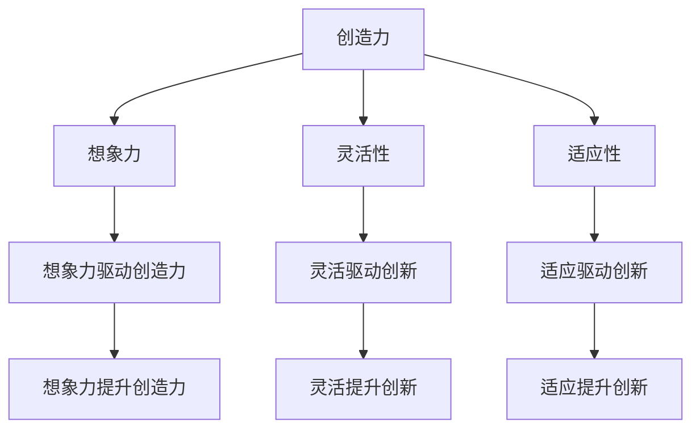

                 

### 文章标题

# 创新思维培养：激发团队创意的实践方法

### 文章关键词

- 创新思维
- 团队创意
- 实践方法
- 企业战略
- 产品开发
- 市场营销
- 人力资源管理

### 文章摘要

本文旨在探讨创新思维在团队创意激发中的应用与实践方法。通过深入分析创新思维的重要性及其核心概念与联系，本文提出了多种激发团队创意的方法和技巧。此外，结合实际案例分析，本文详细阐述了如何将创新思维应用于企业战略、产品开发、市场营销和人力资源管理等领域。最后，本文总结了创新思维培养的关键点，并提供了未来发展的展望和最佳实践建议，旨在为企业和团队提供切实可行的创意激发策略。

### 设计思路

在撰写本文的过程中，我们将遵循以下设计思路：

1. **引言**：首先介绍创新思维的重要性，阐述其对企业发展和团队效能的影响。
2. **基础理论**：详细阐述创新思维的核心概念与联系，并借助Mermaid流程图展示其结构。
3. **方法与技巧**：介绍多种激发团队创意的方法与技巧，包括感知与观察力训练、思维导图与脑暴、创意思维训练等。
4. **实践应用**：结合实际案例，展示创新思维在不同领域的应用，如企业战略、产品开发、市场营销和人力资源管理。
5. **案例分析**：通过成功和失败案例的对比分析，总结创新思维实践的要点和经验。
6. **实践指南**：提供详细的实践指南，包括步骤、工具和案例分析，帮助读者将所学知识应用于实际工作中。
7. **总结与展望**：总结创新思维培养的关键点，展望其未来发展，并提供最佳实践建议。

### 目录大纲

## 第1章 引言

### 1.1 创新思维的重要性

### 1.2 创新思维的现状与挑战

### 1.3 阅读本书的目的与结构

## 第2章 创新思维基础理论

### 2.1 创新思维的定义与类型

### 2.2 创新思维的核心概念与联系

#### 2.2.1 创新思维的Mermaid流程图

### 2.3 创新思维的发展历程

### 2.4 创新思维的心理学基础

## 第3章 激发创新思维的方法与技巧

### 3.1 感知与观察力训练

### 3.2 思维导图与脑暴

### 3.3 创意思维训练

### 3.4 破除思维定势

## 第4章 创新思维的实践应用

### 4.1 创新思维在企业战略中的应用

### 4.2 创新思维在产品开发中的应用

### 4.3 创新思维在市场营销中的应用

### 4.4 创新思维在人力资源管理中的应用

## 第5章 团队创新实践案例分析

### 5.1 成功案例分享

### 5.2 失败案例反思

### 5.3 案例分析工具与方法

## 第6章 创新思维的实践指南

### 6.1 创新思维实践步骤

### 6.2 创新思维实践工具

### 6.3 创新思维实践案例解析

## 第7章 总结与展望

### 7.1 创新思维培养的关键点

### 7.2 创新思维的未来发展趋势

### 7.3 总结与建议

### 备注

- **核心概念与联系**：在第2章中，我们将使用Mermaid流程图来展示创新思维的核心概念与联系。
- **核心算法原理讲解**：由于本书主要关注创新思维的培养与实践，不会涉及复杂的算法原理，但会在相关章节中提及关键算法的伪代码。
- **数学模型和数学公式**：本书主要介绍创新思维的方法和实践，不涉及过多的数学模型。如果有必要，将在相应章节中适当使用LaTeX格式展示数学公式。
- **项目实战**：在第6章中，我们将通过具体案例展示如何将创新思维应用到实际工作中，并提供源代码和代码解读。

通过这样的目录大纲设计，读者可以系统地了解创新思维的培养方法和实践应用，从而激发团队的创意潜力。总体字数控制在8000-12000字左右，确保内容的简洁性和可操作性。### 第1章 引言

### 1.1 创新思维的重要性

在当今快速变化的商业环境中，创新能力已成为企业持续发展的关键驱动力。创新思维作为一种高级思维能力，不仅能帮助企业应对市场变化，还能在激烈竞争中脱颖而出。创新思维的重要性主要体现在以下几个方面：

首先，创新思维有助于企业突破现有业务模式，探索新的市场机会。在技术飞速发展的今天，市场需求不断变化，企业若能敏锐地捕捉市场动态，运用创新思维开发新产品或服务，便能迅速占领市场先机。

其次，创新思维能激发员工的创造力和工作热情。在创新思维的氛围中，员工能够大胆提出新的想法和解决方案，从而提升团队整体效能。此外，创新思维还能促进企业内部的知识共享和协同工作，提高工作效率。

再次，创新思维是推动企业持续成长的重要引擎。通过不断地创新，企业可以持续改进产品和服务，提升客户满意度，增强品牌竞争力。同时，创新思维还能帮助企业建立持续的创新文化，为企业的长远发展奠定基础。

总之，创新思维不仅关乎企业的竞争力，更关乎企业的生存和发展。在新时代背景下，企业必须重视创新思维的培养，并将其作为核心战略之一。

### 1.2 创新思维的现状与挑战

当前，尽管越来越多的企业认识到创新思维的重要性，但在实际应用中仍面临诸多挑战。首先，企业创新意识的不足是制约创新思维发挥的关键因素。许多企业仍停留在传统管理模式，对创新思维的重视程度不够，导致创新资源投入不足。

其次，创新思维的培养需要时间和持续的投入，但许多企业在短期内难以看到创新成效，从而对创新思维的长期价值产生怀疑。此外，企业内部的文化和氛围也是创新思维发展的瓶颈。一些企业存在严重的官僚主义和僵化的管理结构，抑制了员工的创造力和创新精神。

另外，创新思维的实践过程中，企业还需面对技术难题和市场风险的挑战。技术发展日新月异，企业需要不断更新技术储备，以适应创新需求。同时，创新产品或服务在市场推广过程中，可能会遇到消费者接受度低、市场反响不佳等问题。

综上所述，虽然创新思维在企业发展中具有重要作用，但企业仍需克服一系列挑战，才能充分发挥其潜力。

### 1.3 阅读本书的目的与结构

阅读本书的目的在于帮助读者全面了解创新思维的概念、培养方法和实践应用，从而激发团队的创意潜力。本书结构如下：

首先，第1章作为引言，介绍了创新思维的重要性及其现状与挑战，为后续章节的深入探讨奠定基础。

第2章将详细阐述创新思维的基础理论，包括定义、类型、核心概念与联系，并通过Mermaid流程图展示其结构。

第3章将介绍多种激发创新思维的方法与技巧，包括感知与观察力训练、思维导图与脑暴、创意思维训练和破除思维定势。

第4章将结合实际案例，展示创新思维在企业战略、产品开发、市场营销和人力资源管理中的应用。

第5章将通过成功与失败案例的分析，总结创新思维实践的经验与教训。

第6章将提供详细的实践指南，包括步骤、工具和案例分析，帮助读者将创新思维应用于实际工作中。

最后，第7章将总结本书的核心内容，展望创新思维的未来发展趋势，并提供最佳实践建议。

通过本书的系统学习和实践，读者将能够掌握创新思维的培养方法，提升团队的创造力，为企业的长远发展注入新动力。### 第2章 创新思维基础理论

#### 2.1 创新思维的定义与类型

创新思维，作为一种高级思维能力，指的是在特定情境下，通过创造性思考产生新颖、有价值的观点或解决方案的过程。创新思维不仅仅关注新的想法或概念的产生，更强调这些想法的实际应用和推广。

创新思维可以分为以下几种类型：

1. **发散型创新思维**：也称为创造性思维或自由思维，它强调从多个角度出发，产生大量不同寻常的想法。发散型创新思维通常用于初始创意的产生阶段。

2. **收敛型创新思维**：与发散型思维相对，收敛型创新思维注重从已有的信息中筛选出最佳方案。这种思维类型常用于决策和优化阶段。

3. **辩证型创新思维**：结合了发散型和收敛型思维的优势，通过辩证分析，找到创新的平衡点。辩证型创新思维适用于复杂问题的解决和策略制定。

4. **综合型创新思维**：将多种思维方式结合，综合运用各种方法和技巧，产生创新的解决方案。

#### 2.2 创新思维的核心概念与联系

创新思维的核心概念包括创造力、想象力、灵活性和适应性等。这些概念相互联系，共同构成创新思维的基础。

1. **创造力**：创造力是创新思维的核心要素，指的是产生新颖、有价值的想法和解决方案的能力。创造力不仅依赖于个人的智力水平，还需要培养好奇心、求知欲和探索精神。

2. **想象力**：想象力是创造力的源泉，它能够帮助人们超越现实，预见未来。想象力强的个体往往能提出更多创新的构想。

3. **灵活性**：灵活性指的是在思维过程中能够快速调整和适应新信息的能力。灵活的思维有助于突破常规，找到创新的解决方案。

4. **适应性**：适应性是指个体或团队在面对不确定性时，能够快速适应新环境、新任务的能力。适应性强是创新思维的重要保障。

#### 2.2.1 创新思维的Mermaid流程图

为了更好地展示创新思维的核心概念与联系，我们可以使用Mermaid流程图来表示：

在这个流程图中，创造力作为核心要素，通过想象力、灵活性和适应性相互联系，共同推动创新思维的发展。想象力驱动创造力，灵活性提升创新，适应性增强创新。

#### 2.3 创新思维的发展历程

创新思维的发展历程可以追溯到古代哲学家和科学家对创造性思维的探讨。从古希腊哲学家亚里士多德的辩证法，到文艺复兴时期的人文主义精神，再到现代心理学对创造力的研究，创新思维的理论和实践不断演进。

在20世纪初，美国心理学家布鲁纳（Jules Bruno）提出了“发散型思维”和“收敛型思维”的概念，开创了创新思维研究的先河。随后，托尔曼（Edward L. Thorndike）提出了“智力结构理论”，强调创造力与智力结构的紧密关系。

20世纪中期，美国学者奥斯本（Alex Osborn）提出了著名的“脑暴法”（Brainstorming），该方法通过集体讨论和思维碰撞，激发创新思维。此后，各种创新方法和技巧如雨后春笋般涌现，包括思维导图、设计思维、TRIZ理论等。

#### 2.4 创新思维的心理学基础

创新思维的心理学基础主要涉及认知心理学、社会心理学和神经科学等领域的研究成果。认知心理学研究指出，创造性思维依赖于个体的认知结构、记忆能力和信息处理能力。社会心理学研究表明，团队合作和社交互动对创新思维有显著促进作用。神经科学研究则揭示了大脑在创新思维过程中的神经机制和生化基础。

1. **认知心理学基础**：认知心理学认为，创造性思维是一个复杂的过程，涉及问题的识别、信息加工、解决方案的产生和评估等多个环节。创新思维需要个体具备良好的问题解决能力和抽象思维技巧。

2. **社会心理学基础**：社会心理学研究表明，个体在团队环境中的创新思维表现优于单独工作时。团队合作能够激发思维碰撞，产生更多的创新构想。

3. **神经科学基础**：神经科学研究揭示了大脑在创新思维过程中的神经活动。例如，大脑的联想记忆区域和新皮层区域在创新思维中发挥着重要作用。此外，神经递质如多巴胺和内啡肽的分泌也与创造性思维密切相关。

综上所述，创新思维是一种综合性的高级思维能力，其发展历程和心理学基础为创新思维的培养提供了科学依据。通过深入理解创新思维的核心概念与联系，我们可以更好地培养和激发团队的创意潜力。### 第3章 激发创新思维的方法与技巧

#### 3.1 感知与观察力训练

感知与观察力是创新思维的重要基础。通过提高感知和观察力，我们可以更好地捕捉周围环境中的信息，从而激发创意。以下是一些有效的训练方法：

1. **细节观察法**：在日常活动中，尝试关注事物的细节。例如，观察植物的形态、纹理、颜色变化，或是观察他人的表情、动作和语言。这种训练有助于提高我们的观察敏锐度。

2. **环境变换法**：定期变换周围环境，如改变办公室布置、调整生活习惯等。新的环境会带来新的视觉和感官刺激，有助于激发创意。

3. **专注力训练**：通过冥想、瑜伽等方式提高专注力，增强对细节的关注。专注力训练有助于我们在观察时减少干扰，捕捉更多有价值的信息。

4. **记录法**：养成记录观察结果的习惯。通过记录，我们可以更好地回顾和思考观察到的信息，从而发现新的联系和灵感。

#### 3.2 思维导图与脑暴

思维导图和脑暴是激发创新思维的常用工具和方法。

1. **思维导图**：思维导图是一种以图像为中心，通过分支结构展开思考的工具。它有助于我们梳理思路，将复杂的想法进行可视化。使用思维导图的步骤如下：

   - **确定中心主题**：首先确定思维导图的主题，例如“创新思维方法”。
   - **绘制分支**：从中心主题出发，绘制主要分支，每个分支代表一个核心概念或子主题。
   - **拓展细节**：在每个分支下，继续绘制次级分支，逐步细化思维内容。
   - **添加图像和颜色**：使用图像和颜色来丰富思维导图，提高视觉效果和记忆效果。

2. **脑暴**：脑暴（Brainstorming）是一种集体创意产生方法，通过快速列出各种想法，不进行批评和筛选，以激发更多的创意。脑暴的步骤如下：

   - **确定主题**：首先确定脑暴的主题，例如“创新产品理念”。
   - **自由发言**：让每个参与者自由发言，提出任何与主题相关的想法，无论想法是否实际或可行。
   - **记录想法**：将每个发言者的想法记录下来，确保不遗漏任何创意。
   - **筛选和评估**：在脑暴结束后，对记录下来的想法进行筛选和评估，确定可行的创意。

通过思维导图和脑暴，我们可以系统地整理和激发创意，为创新思维提供坚实的基础。

#### 3.3 创意思维训练

创意思维训练旨在提升个体的创意产生能力，以下是一些有效的训练方法：

1. **联想思维训练**：通过将不同领域或概念进行联想，产生新的创意。例如，将“手机”和“书”进行联想，可能会产生“手机阅读”的想法。

2. **逆向思维训练**：通过从相反的角度思考问题，寻找创新的解决方案。例如，对于“如何减少环境污染”，可以逆向思考“如何增加污染”。

3. **跨越领域思维训练**：通过跨学科、跨领域的思考，寻找新的创意。例如，将生物学中的“光合作用”原理应用于电子产品设计，可能会产生“太阳能充电器”的想法。

4. **极限思维训练**：通过设定极端条件，激发创意。例如，假设“没有资源限制”、“时间无限”等，思考在这种条件下如何解决问题。

5. **多角度思维训练**：通过从多个角度分析问题，寻找不同的解决方案。例如，对于“如何提高工作效率”，可以从技术、流程、团队协作等多个角度进行思考。

#### 3.4 破除思维定势

思维定势是影响创新思维的常见障碍，以下是一些破除思维定势的方法：

1. **自我反思**：定期进行自我反思，识别和打破固有的思维模式。通过自我提问，如“这个问题还有其他解决方案吗？”、“这个观点是否唯一正确？”等，挑战自己的思维定势。

2. **求异思维**：鼓励求异思维，敢于提出与众不同的观点。在团队讨论中，不要害怕发表异见，勇于挑战权威和常规。

3. **跨界学习**：通过学习不同领域的知识，开阔视野，打破专业壁垒。跨界学习有助于发现新的思维方法和解决问题的视角。

4. **模拟情境**：通过模拟不同情境，尝试从不同角度解决问题。例如，将日常工作问题放在未来或极端环境下思考，以激发创新思维。

5. **放松身心**：适当的放松和休息有助于消除心理压力，激发创意。例如，通过冥想、瑜伽等方式，帮助身心放松，打开思维空间。

通过感知与观察力训练、思维导图与脑暴、创意思维训练和破除思维定势等方法，我们可以有效地激发团队的创新思维，提升团队的整体创造力。### 第4章 创新思维的实践应用

#### 4.1 创新思维在企业战略中的应用

企业战略的制定和调整需要创新思维的支持，以下是如何将创新思维应用于企业战略的具体方法：

1. **情景分析法**：通过模拟不同的市场情景，预测未来可能出现的趋势和挑战，从而制定灵活的战略规划。情景分析法可以帮助企业提前应对市场变化，抓住机遇。

2. **蓝海战略**：蓝海战略强调企业通过创造新的市场空间，避免与竞争对手的直接竞争。企业可以通过创新产品、服务或商业模式，开辟新的市场领域。

3. **迭代思维**：将战略制定过程视为一个持续迭代的过程，不断根据市场反馈和内部资源调整战略方向。迭代思维有助于企业迅速适应市场变化，保持竞争优势。

4. **战略地图**：使用战略地图来直观展示企业战略的关键要素和实施路径。战略地图有助于企业内部达成共识，确保战略执行的协调性和一致性。

#### 4.2 创新思维在产品开发中的应用

创新思维在产品开发中起着至关重要的作用，以下是一些实际应用：

1. **用户研究**：通过深入理解用户需求和痛点，发现潜在的创新机会。用户研究可以采用访谈、问卷调查、用户测试等方法。

2. **跨界合作**：与其他行业或领域的公司进行合作，引入外部视角和创新资源。跨界合作有助于打破行业壁垒，产生新的产品创意。

3. **原型迭代**：快速构建产品原型，通过用户反馈不断迭代优化。原型迭代法能够缩短产品开发周期，提高产品的市场适应性。

4. **设计思维**：采用设计思维方法，将用户需求融入产品开发的每一个阶段，确保产品从设计到上市都能满足用户期望。

#### 4.3 创新思维在市场营销中的应用

创新思维在市场营销中可以帮助企业找到新的营销策略和渠道，以下是一些具体应用：

1. **数字营销**：利用大数据和人工智能技术，进行精准营销和个性化推荐。数字营销能够提高营销效果，降低营销成本。

2. **内容营销**：通过创造有价值的内容，吸引潜在客户并建立品牌形象。内容营销不仅可以提升品牌知名度，还能增加用户粘性。

3. **社交媒体营销**：利用社交媒体平台，开展互动性强的营销活动，增加品牌曝光度和用户参与度。社交媒体营销有助于建立良好的品牌口碑。

4. **体验营销**：通过打造独特的用户体验，增强品牌忠诚度和用户满意度。体验营销可以从产品试用、会员服务等多方面入手。

#### 4.4 创新思维在人力资源管理中的应用

创新思维在人力资源管理中可以帮助企业培养创新型人才，提升团队整体效能，以下是一些实际应用：

1. **人才选拔**：采用多样化的选拔标准，如创新潜力、学习能力等，选拔具有创新思维的人才。

2. **培训与发展**：通过定制化培训计划和跨部门项目，提升员工的创新能力和专业技能。培训与发展有助于员工成长，增强企业竞争力。

3. **激励机制**：建立创新激励机制，鼓励员工提出创新建议和解决方案。激励机制可以包括奖金、晋升机会等，以激发员工的创新热情。

4. **团队协作**：通过促进团队协作，营造开放、包容的创新氛围。团队协作有助于集思广益，提升创新成效。

通过在战略、产品开发、市场营销和人力资源管理中应用创新思维，企业可以不断提升自身的竞争力，实现可持续发展。### 第5章 团队创新实践案例分析

#### 5.1 成功案例分享

成功案例的分享能够为团队提供宝贵的经验和启示。以下是一个成功团队创新实践案例：

**案例：Google X 实验室**

Google X 实验室是全球知名的科技创新实验室，其成功案例展示了创新思维在团队中的应用。

**背景**：Google X 实验室的使命是探索和开发前沿科技项目，如自动驾驶汽车、智能眼镜等。

**创新思维应用**：

1. **跨界合作**：Google X 实验室积极与其他领域的专家和企业合作，引入外部创新资源和视角。

2. **用户中心**：在项目开发过程中，Google X 实验室始终关注用户需求，通过用户测试和反馈不断优化产品。

3. **快速迭代**：采用快速迭代的方法，Google X 实验室能够迅速将创意转化为产品原型，并不断改进。

**成果**：Google X 实验室的一些项目，如自动驾驶汽车和智能眼镜，已成为市场热点，为Google带来了显著的商业价值。

**启示**：

- **跨界合作**：通过引入外部创新资源，团队可以获得新的视角和思路，提升创新能力。
- **用户中心**：始终关注用户需求，确保项目能够满足市场期望。
- **快速迭代**：快速将创意转化为产品原型，通过不断优化提升产品质量。

#### 5.2 失败案例反思

失败案例的反思可以帮助团队避免重复错误，从失败中汲取教训。以下是一个团队创新失败的案例：

**案例：Facebook 的Cambridge Analytica 事件**

**背景**：Facebook 的Cambridge Analytica 事件因数据泄露和滥用问题而引发广泛争议。

**创新思维应用**：

1. **数据驱动**：Facebook 通过大量用户数据进行分析和营销，试图实现精准广告投放。

2. **用户隐私忽视**：在追求数据驱动的过程中，Facebook 忽视了用户隐私保护，导致数据泄露和滥用。

**失败原因**：

1. **数据滥用**：Facebook 对用户数据的滥用引发了社会不满和监管压力。

2. **缺乏用户中心**：在数据驱动的过程中，Facebook 忽视了用户需求和隐私保护，导致用户信任受损。

**反思与启示**：

- **数据滥用风险**：在追求数据驱动的过程中，必须注意数据隐私保护，避免滥用用户数据。
- **用户中心**：始终将用户需求放在首位，确保项目符合用户期望和价值观。

#### 5.3 案例分析工具与方法

为了更好地进行团队创新实践案例分析，我们可以使用以下工具与方法：

1. **SWOT分析**：通过SWOT分析，对案例的优势（Strengths）、劣势（Weaknesses）、机会（Opportunities）和威胁（Threats）进行系统分析，帮助团队了解案例的全方位情况。

2. **五力模型**：使用五力模型分析案例所处的市场竞争环境，了解外部因素对创新实践的影响。

3. **过程映射**：通过过程映射，详细描述案例的创新实践过程，分析各个环节的优缺点。

4. **因果分析图**：使用因果分析图，分析案例中的关键因素及其相互关系，找出问题的根本原因。

5. **头脑风暴**：通过头脑风暴，集思广益，对案例进行分析和讨论，提出改进建议。

通过使用这些工具和方法，团队可以更深入地分析案例，从中汲取经验和教训，为未来的创新实践提供指导。### 第6章 创新思维的实践指南

#### 6.1 创新思维实践步骤

要将创新思维应用到实际工作中，需要遵循一系列系统化的步骤，以下是具体实践指南：

1. **识别问题或机会**：首先，明确需要解决的具体问题或抓住的市场机会。这个问题或机会应具有明确的边界和目标。

2. **信息收集**：收集与问题或机会相关的各种信息，包括市场数据、用户反馈、行业趋势、竞争对手分析等。信息收集越全面，对问题的理解就越深入。

3. **定义假设**：基于收集到的信息，提出一个或多个假设。假设是对问题或机会的可能解决方案或方向的一种猜测。

4. **实验验证**：设计实验来验证这些假设。实验可以是简单的用户测试、模拟实验或小型试点项目，目的是验证假设的有效性和可行性。

5. **迭代优化**：根据实验结果，对假设进行调整和优化。这一过程需要不断重复，直到找到最有效的解决方案。

6. **实施与推广**：将验证成功的解决方案进行实施和推广，确保其在实际工作中能够发挥作用。

#### 6.2 创新思维实践工具

在创新思维实践中，使用适当的工具可以大大提高效率和效果。以下是一些常用的创新思维工具：

1. **思维导图**：思维导图是一种可视化工具，用于梳理和展示思维过程。它可以帮助团队快速捕捉和整理思路，形成系统的思维框架。

2. **SWOT分析**：SWOT分析是一种评估企业或项目的优势、劣势、机会和威胁的工具。它有助于团队全面了解问题或机会的各个方面。

3. **五力模型**：五力模型用于分析市场竞争环境，识别行业中的主要竞争因素。它有助于团队制定战略和应对竞争。

4. **鱼骨图**：鱼骨图是一种因果分析工具，用于分析问题的根本原因。它可以帮助团队找出问题的主要原因，制定解决方案。

5. **Moodboard**：Moodboard 是一种创意展示工具，用于收集和展示与项目相关的图像、颜色、文字等元素。它可以帮助团队形成统一的创意方向。

6. **MVP（最小可行产品）**：MVP 是一种快速验证产品可行性的工具，通过构建最小功能版本的产品，快速获取用户反馈，优化产品。

#### 6.3 创新思维实践案例解析

以下是一个创新思维实践案例的详细解析：

**案例背景**：某公司是一家提供企业级云计算服务的公司，面临激烈的市场竞争，需要通过创新提升竞争力。

**识别问题**：公司发现市场上对云计算服务的需求越来越多样化，客户期望能够提供更加灵活和个性化的服务。

**信息收集**：通过市场调研和用户反馈，公司了解到客户对以下方面有强烈需求：
- 自动化资源管理
- 高度可定制的服务
- 安全性和合规性保障

**定义假设**：公司提出了以下假设：
- 通过提供自动化资源管理，可以显著提升客户的使用体验。
- 通过提供高度可定制的服务，可以满足不同客户的个性化需求。
- 通过加强安全性和合规性保障，可以赢得更多客户的信任。

**实验验证**：
- **自动化资源管理**：公司开发了一套自动化管理工具，测试了不同客户的使用效果，并收集了用户反馈。
- **定制化服务**：公司设计了几种不同的服务套餐，通过小规模试点项目，收集了用户反馈。
- **安全性和合规性保障**：公司加强了数据安全和合规性措施，进行了多次安全测试和审核。

**迭代优化**：
- 根据用户反馈，公司对自动化管理工具进行了多次优化，提升了其用户体验。
- 针对不同客户需求，公司调整了服务套餐，增加了更多定制化选项。
- 为确保安全性和合规性，公司引入了第三方安全审计，进一步完善了安全措施。

**实施与推广**：
- 公司将优化后的自动化管理工具和定制化服务推广至所有客户，并加强了安全性和合规性宣传。
- 通过不断的市场推广和客户反馈，公司成功提升了市场竞争力，赢得了更多客户。

**项目小结**：
- 通过创新思维实践，公司不仅提升了产品竞争力，还增强了客户满意度，实现了业务的持续增长。

**最佳实践 Tips**：
- **用户反馈**：始终关注用户反馈，将其作为产品优化的重要依据。
- **持续迭代**：不断创新和优化，保持产品领先优势。
- **团队合作**：鼓励团队合作，集思广益，提升创新能力。

通过上述实践指南和案例解析，企业可以更好地将创新思维应用到实际工作中，提升团队的创造力和竞争力。### 第7章 总结与展望

#### 7.1 创新思维培养的关键点

创新思维的培养是一个系统性、长期性的过程，以下是其关键点：

1. **持续学习**：创新思维的发展离不开知识积累。团队成员应不断学习新知识、新技能，提升自身综合素质。

2. **积极实践**：理论知识需要通过实践来验证和提升。团队成员应积极参与各类实践活动，将创新思维应用到实际工作中。

3. **培养好奇心**：好奇心是创新思维的源泉。团队成员应保持对未知事物的探索欲望，勇于提出问题，寻找答案。

4. **思维灵活性**：灵活的思维有助于跳出传统框架，发现新的解决方案。团队成员应培养思维的灵活性，善于从不同角度分析问题。

5. **团队协作**：团队合作能够激发思维碰撞，产生更多创意。企业应鼓励团队协作，营造开放、包容的创新氛围。

6. **激励机制**：建立合理的激励机制，鼓励团队成员提出创新建议和解决方案。激励机制应包括奖金、晋升机会等，以激发员工的创新热情。

#### 7.2 创新思维的未来发展趋势

随着科技的不断发展，创新思维的应用场景将更加广泛，其未来发展趋势包括：

1. **数字化与智能化**：随着数字化和智能化的推进，创新思维将更加依赖于数据分析和人工智能技术。企业可以通过大数据和AI技术，更精准地预测市场趋势，制定创新策略。

2. **跨界融合**：不同领域之间的跨界融合将产生新的创新机会。企业可以通过跨界合作，引入外部创新资源，推动创新思维的发展。

3. **可持续发展**：随着环境保护和可持续发展意识的增强，创新思维将在绿色技术、节能减排等领域发挥重要作用。企业应关注可持续发展，推动创新与环保的结合。

4. **个性化定制**：随着消费者需求的多样化，个性化定制将成为创新思维的重要应用方向。企业应通过大数据和人工智能技术，提供个性化的产品和服务。

5. **全球化**：全球化背景下，创新思维将更加注重跨文化融合和全球视野。企业应培养国际化思维，积极参与全球竞争。

#### 7.3 总结与建议

通过本文的探讨，我们可以得出以下总结和最佳实践建议：

1. **重视创新思维培养**：企业应将创新思维培养作为核心战略之一，加强相关培训和激励机制。

2. **营造创新氛围**：企业应营造开放、包容的创新氛围，鼓励员工大胆提出创新想法，勇于实践。

3. **跨部门协作**：鼓励跨部门协作，通过团队协作激发创新思维，提升整体创造力。

4. **用户导向**：始终关注用户需求，将用户满意度作为创新思维的出发点和归宿。

5. **持续迭代**：创新思维应用过程中，应不断进行迭代和优化，以适应市场变化和用户需求。

6. **跨界学习**：鼓励团队成员进行跨界学习，拓宽视野，提升创新能力。

7. **风险管理**：在创新实践中，应合理评估风险，确保创新项目的可行性和安全性。

通过以上总结与建议，企业可以更好地培养和激发团队的创新思维，提升整体竞争力。### 作者信息

作者：AI天才研究院/AI Genius Institute & 禅与计算机程序设计艺术 /Zen And The Art of Computer Programming

在这本《创新思维培养：激发团队创意的实践方法》中，我们致力于将创新思维的理论与实践相结合，为读者提供全面、系统的指导。作为AI天才研究院的专家，我们一直致力于推动人工智能技术的发展，探索其在各个领域的应用。同时，作为《禅与计算机程序设计艺术》的作者，我们深知创新思维在软件开发和系统设计中的重要性。希望通过本书，能够激发更多读者的创新思维，为企业的可持续发展提供新动力。

