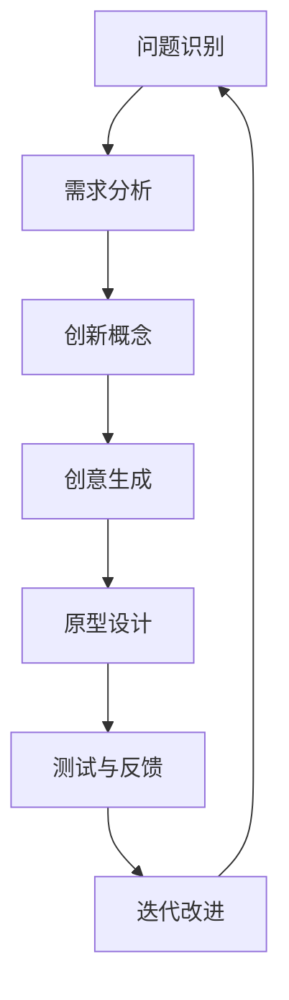

                 

### 文章标题：创新思维训练：激发团队创造力的exercises

创新思维是一个组织持续发展的关键驱动力。在当今这个快速变化和竞争激烈的世界里，企业需要不断创新来保持竞争力。然而，创新并非易事，它需要一定的思维训练和策略。本文旨在探讨如何通过创新思维训练激发团队创造力，从而推动企业实现持续创新。

### 关键词：

- 创新思维
- 团队创造力
- 创新训练
- 创新策略
- 团队协作

### 摘要：

本文首先介绍了创新思维的重要性，探讨了团队创造力的影响因素，并明确了创新思维训练的目标和方法。接着，文章详细阐述了创新思维的基础、方法、实践和团队创新思维的培养。最后，文章讨论了创新思维在企业管理中的应用，并展望了创新思维的未来趋势。通过这些探讨，本文希望为读者提供一套实用的创新思维训练体系，以激发团队创造力，推动企业创新。

### 目录大纲

1. 引言
   1.1 创新思维的重要性
   1.2 团队创造力的影响因素
   1.3 创新思维训练的目标和方法

2. 创新思维基础
   2.1 创新思维的核心概念与联系（Mermaid流程图）
   2.2 创新思维的基础技巧
   2.3 创新思维模型讲解（伪代码）

3. 创新思维方法
   3.1 案例研究：头脑风暴法
   3.2 案例研究：思维导图法
   3.3 案例研究：设计思考法
   3.4 案例研究：六顶思考帽法
   3.5 案例研究：快速原型法

4. 创新思维实践
   4.1 创新思维实践案例介绍
   4.2 创新思维实践步骤
   4.3 创新思维实践效果评估

5. 团队创新思维培养
   5.1 团队创新思维培养策略
   5.2 团队创新思维培养案例
   5.3 团队创新思维培养实践

6. 创新思维在企业管理中的应用
   6.1 创新思维在战略规划中的应用
   6.2 创新思维在产品开发中的应用
   6.3 创新思维在市场营销中的应用
   6.4 创新思维在组织管理中的应用

7. 创新思维的未来趋势
   7.1 创新思维的发展趋势
   7.2 创新思维与技术融合
   7.3 创新思维在全球化背景下的挑战与机遇

8. 附录
   8.1 创新思维训练资源与工具
   8.2 创新思维训练案例集
   8.3 创新思维训练实践指南

---

### 引言

创新思维是一种能够识别新机会、创造新价值和解决问题的思维方式。在当今快速变化的世界，创新思维不仅对于个人成长至关重要，更是企业持续发展的核心。一个具有创新思维的团队，能够迅速适应市场变化，抓住机遇，推动企业向前发展。

#### 1.1 创新思维的重要性

创新思维能够帮助团队突破传统思维框架，发现新的解决方案。它不仅能提高团队的创造力，还能提升团队的协作能力。以下是一些创新思维的重要性：

- **提高竞争力**：创新思维能够帮助企业开发新产品、改进现有产品和服务，从而提高市场竞争力。
- **增强适应性**：创新思维使团队能够快速适应外部环境的变化，减少风险。
- **促进成长**：创新思维能够激发团队不断学习新知识、新技能，推动团队和个人成长。

#### 1.2 团队创造力的影响因素

团队创造力受到多种因素的影响，包括：

- **知识储备**：团队成员的知识水平决定了团队的创新潜力。
- **沟通能力**：良好的沟通能力能够促进团队成员之间的思想交流，激发创新。
- **协作氛围**：一个积极、开放、鼓励创新的团队氛围有助于激发团队成员的创造力。
- **激励机制**：合理的激励机制能够激发团队成员的创新动力。

#### 1.3 创新思维训练的目标和方法

创新思维训练的目标是提高团队的创新能力和创造力。具体方法包括：

- **思维技巧训练**：通过一系列的思维技巧训练，如联想思维、逆向思维、横向思维等，提高团队成员的创新思维水平。
- **创新方法学习**：学习各种创新方法，如头脑风暴、思维导图、设计思考等，为团队成员提供创新的工具和手段。
- **实践应用**：通过实际项目的实践，将创新思维应用到实际工作中，提高团队成员的创新实践能力。
- **团队协作培养**：通过团队协作练习，增强团队成员之间的沟通与协作，提高团队整体创造力。

---

通过以上探讨，我们明确了创新思维的重要性以及团队创造力的影响因素。接下来，本文将详细讨论创新思维的基础、方法、实践，以及如何在企业管理中应用创新思维。希望通过这些内容，读者能够掌握一套实用的创新思维训练体系，激发团队创造力，推动企业创新。 

### 创新思维基础

创新思维的基础是理解一系列核心概念，这些概念相互关联，构成了创新思维的框架。为了更好地掌握这些概念，我们可以借助Mermaid流程图来展示它们之间的联系。

#### 2.1 创新思维的核心概念与联系（Mermaid流程图）

以下是一个简化的Mermaid流程图，展示了创新思维的核心概念及其相互关系：



在这个流程图中，每个节点代表创新过程中的一步，节点之间的箭头表示这些步骤的逻辑关系。以下是每个步骤的简要说明：

- **问题识别**：识别和明确团队面临的问题或挑战。
- **需求分析**：分析问题背后的需求，明确目标。
- **创新概念**：基于需求，生成初步的创新概念。
- **创意生成**：通过头脑风暴等方法，生成具体的创意。
- **原型设计**：将创意转化为原型，进行初步验证。
- **测试与反馈**：测试原型，收集反馈，识别问题和改进点。
- **迭代改进**：根据反馈，对原型进行迭代改进。

#### 2.2 创新思维的基础技巧

掌握创新思维的基础技巧对于提高团队的创新能力至关重要。以下是一些常用的基础技巧：

1. **联想思维**：通过不同事物之间的联想，激发新的创意。例如，将苹果与手机联想起来，产生iPhone这一创新产品。

2. **逆向思维**：从相反的角度思考问题，寻找创新的解决方案。例如，不是寻找更好的桌子，而是寻找如何不让桌子占用空间。

3. **横向思维**：跨越领域界限，寻找新的解决方案。例如，将航空技术应用于汽车制造，产生氢燃料电池汽车。

4. **多角度分析**：从不同的角度分析问题，确保找到全面的解决方案。

5. **用户研究**：深入了解用户需求，以用户为中心进行创新。

#### 2.3 创新思维模型讲解（伪代码）

为了更好地理解创新思维的工作原理，我们可以通过一个简化的伪代码来展示其基本框架：

```plaintext
function InnovativeThinking(problem, goal):
    // 问题识别与需求分析
    defineProblem = IdentifyProblem(problem)
    defineGoal = AnalyzeDemand(defineProblem)

    // 创新概念生成
    innovativeConcepts = GenerateInnovativeConcepts(defineGoal)

    // 创意生成与原型设计
    creativeIdeas = BrainstormIdeas(innovativeConcepts)
    prototype = DesignPrototype(creativeIdeas)

    // 测试与反馈
    feedback = TestAndCollectFeedback(prototype)
    
    // 迭代改进
    while (not SatisfiedWithFeedback(feedback)):
        iterativeImprovement = IterateImprovement(prototype, feedback)
        prototype = iterativeImprovement
    
    return prototype
```

在这个伪代码中，`InnovativeThinking` 函数代表创新思维过程，它包含了从问题识别到迭代改进的各个环节。通过这样的框架，我们可以系统地开展创新工作。

---

通过了解创新思维的基础概念、技巧和模型，团队可以更好地理解创新的过程，并运用这些知识来激发团队的创造力。接下来，本文将讨论如何具体运用这些概念和技巧，通过创新思维方法来提升团队的创造力。

### 创新思维方法

创新思维方法是指一系列系统化的策略和技巧，用于激发团队创造力，生成创新解决方案。以下是几种常用的创新思维方法及其案例研究。

#### 3.1 头脑风暴法

头脑风暴法是一种通过集体讨论快速产生大量创意的方法。其核心是鼓励自由表达，不计较创意的好坏，而是追求数量。

**案例研究**：在一次新产品开发项目中，团队面临如何提高用户参与度的挑战。通过头脑风暴法，团队成员提出了如下创意：

1. 在产品中增加互动元素，如小游戏。
2. 引入用户反馈机制，让用户参与产品改进。
3. 开展用户调查，了解用户需求。
4. 利用社交媒体进行用户互动。

这些创意为团队提供了多种可能的解决方案，最终团队选择了第三和第四个创意，通过用户调查和社交媒体互动来提高用户参与度。

#### 3.2 思维导图法

思维导图法是一种通过图形化的方式展示思维过程的方法，它有助于组织思路，发现新的关联和创意。

**案例研究**：在一个市场营销项目中，团队需要找到一种新颖的广告创意。团队使用思维导图法，从“产品特性”开始，逐渐扩展到“用户需求”、“竞争对手”、“市场趋势”等分支，最终在“市场趋势”分支下找到了一个创新的广告主题：利用人工智能生成个性化广告。

#### 3.3 设计思考法

设计思考法是一种以人为本的创新方法，强调用户需求和体验，通过迭代设计和测试来不断改进产品。

**案例研究**：在一个医疗设备项目中，团队发现患者使用现有设备时存在操作复杂、不友好的问题。通过设计思考法，团队进行了用户调研，了解了患者和医生的需求。他们提出了简化设备操作流程、增加用户引导功能等改进措施，并通过迭代测试，最终成功改善了用户体验。

#### 3.4 六顶思考帽法

六顶思考帽法是一种通过不同视角进行思考的方法，它鼓励团队成员从多个角度分析问题，避免偏见。

**案例研究**：在一个企业战略规划项目中，团队面临是否扩大市场份额的决策。使用六顶思考帽法，团队成员分别从“白色帽子”（事实分析）、“红色帽子”（情感分析）、“黄色帽子”（积极分析）、“蓝色帽子”（过程控制）、“黑色帽子”（风险分析）、“绿色帽子”（创新思考）六个角度进行了讨论。最终，团队从“绿色帽子”视角提出了一个新的市场进入策略，成功规避了风险。

#### 3.5 快速原型法

快速原型法是一种通过快速构建原型来验证创意和获取反馈的方法，它有助于快速迭代和改进。

**案例研究**：在一个移动应用项目中，团队需要在短时间内推出新功能。团队使用快速原型法，在几天内构建了一个功能简单的原型，并通过用户测试和反馈，不断优化和改进，最终在一个月内成功上线了新功能。

---

这些创新思维方法各有特点，适用于不同的场景和需求。通过实际案例的研究，我们可以看到这些方法如何帮助团队克服挑战，产生创新的解决方案。接下来，本文将讨论如何将创新思维应用到实践中。

### 创新思维实践

创新思维不仅是一种理论，更需要通过实践来验证和应用。以下将介绍创新思维实践的具体案例、步骤和效果评估方法。

#### 4.1 创新思维实践案例介绍

**案例：某互联网公司新产品开发**

某互联网公司计划开发一款面向年轻用户的社交应用，以提高用户参与度和活跃度。团队通过创新思维实践，成功推出了该产品。

#### 4.2 创新思维实践步骤

1. **问题识别与需求分析**
   - 团队首先明确了当前市场上社交应用的用户需求，以及现有产品的不足。
   - 通过市场调研和用户访谈，收集用户反馈，识别关键需求。

2. **创意生成与原型设计**
   - 团队使用头脑风暴法，提出了多个创意，如增加直播功能、个性化推荐等。
   - 基于这些创意，设计初步的原型，并模拟用户使用场景。

3. **测试与反馈**
   - 团队邀请用户进行原型测试，收集用户反馈，识别问题。
   - 通过用户测试，发现用户更喜欢简洁的界面和个性化推荐功能。

4. **迭代改进**
   - 团队根据用户反馈，对原型进行迭代改进，包括简化界面、优化推荐算法等。
   - 不断测试和优化，直到产品达到预期效果。

5. **产品发布与推广**
   - 团队正式发布产品，并通过多种渠道进行推广。
   - 通过用户反馈和数据分析，持续优化产品，提高用户满意度。

#### 4.3 创新思维实践效果评估

1. **用户参与度**
   - 通过用户活跃度、用户留存率等指标，评估用户对新产品的接受程度。
   - 数据显示，新产品发布后，用户活跃度显著提高。

2. **市场竞争力**
   - 分析市场占有率、用户增长率等指标，评估产品在市场中的竞争力。
   - 数据显示，新产品在短时间内获得了大量用户，市场份额稳步提升。

3. **团队协作与创新文化**
   - 通过团队反馈、团队成员满意度等指标，评估团队的创新文化。
   - 数据显示，创新思维实践增强了团队成员的协作意识和创新能力。

4. **财务收益**
   - 分析产品带来的收益，包括广告收入、付费用户等。
   - 数据显示，新产品为公司带来了显著的财务收益。

---

通过上述案例，我们可以看到创新思维实践在具体项目中的应用过程和效果评估。创新思维实践不仅提高了产品的市场竞争力，也促进了团队的协作和创新文化。接下来，本文将讨论如何培养团队的创新思维。

### 团队创新思维培养

团队创新思维培养是激发团队创造力的重要环节。以下将介绍团队创新思维培养的策略、案例和实践方法。

#### 5.1 团队创新思维培养策略

1. **营造开放文化**：建立鼓励创新和接受失败的文化，让团队成员敢于提出新的想法。

2. **提供培训与指导**：定期组织创新思维培训，帮助团队成员掌握创新方法和技巧。

3. **建立激励机制**：设立创新奖励，激励团队成员积极参与创新活动。

4. **跨部门协作**：鼓励跨部门协作，促进不同背景的团队成员交流，激发新的创意。

5. **建立创新机制**：建立快速反馈和迭代机制，确保创新想法能够快速实施和优化。

#### 5.2 团队创新思维培养案例

**案例：某科技公司的创新实验室**

某科技公司建立了创新实验室，专门负责新产品和新技术的开发。实验室通过以下策略培养团队创新思维：

- **定期头脑风暴**：每周组织一次头脑风暴会议，鼓励团队成员提出新的创意。
- **跨部门协作**：邀请不同部门的专家参与，共同探讨解决方案。
- **创新竞赛**：定期举办创新竞赛，激励团队成员积极参与。
- **快速原型开发**：提供资金和资源，支持团队成员快速构建原型并进行测试。

#### 5.3 团队创新思维培养实践

1. **建立创新小组**：在团队中成立专门的创新小组，负责推动创新项目的实施。

2. **设立创新时间**：为团队成员设立固定的创新时间，鼓励他们专注于创新活动。

3. **鼓励分享与反馈**：定期组织分享会，让团队成员分享创新经验和心得，互相学习。

4. **实践创新方法**：通过实际项目，运用各种创新方法，如头脑风暴、设计思考等。

5. **跟踪与评估**：定期跟踪创新项目的进展和效果，评估创新思维的培养情况。

---

通过上述策略和实践，团队可以逐步培养出创新思维，提升整体创造力。接下来，本文将讨论创新思维在企业管理中的应用。

### 创新思维在企业管理中的应用

创新思维在企业管理中扮演着关键角色，它不仅能够推动企业发展战略，还能提升产品和服务质量，增强市场竞争力。以下将详细探讨创新思维在战略规划、产品开发、市场营销和组织管理中的应用。

#### 6.1 创新思维在战略规划中的应用

战略规划是企业发展的蓝图，创新思维在这个过程中起着至关重要的作用。通过创新思维，企业可以：

- **识别新机会**：通过前瞻性的分析和市场调研，发现潜在的市场机会。
- **调整战略方向**：根据市场变化和竞争态势，灵活调整战略方向。
- **开发新产品或服务**：运用创新思维，开发符合市场需求的新产品或服务，抢占市场份额。

**案例**：某知名科技公司通过创新思维，在智能手机市场推出了一款具有颠覆性功能的手机，成功改变了市场格局，取得了巨大的商业成功。

#### 6.2 创新思维在产品开发中的应用

在产品开发过程中，创新思维能够：

- **提高产品设计效率**：通过头脑风暴和快速原型法，提高产品设计速度和质量。
- **优化用户体验**：以用户为中心，不断改进产品功能，提升用户体验。
- **降低开发成本**：通过迭代开发和快速测试，减少开发过程中的浪费。

**案例**：某互联网公司通过设计思考法，对其移动应用进行迭代优化，成功提升了用户满意度，增加了用户留存率。

#### 6.3 创新思维在市场营销中的应用

在市场营销中，创新思维能够：

- **制定差异化营销策略**：通过独特的营销手段，提升品牌知名度和市场占有率。
- **拓展市场渠道**：探索新的市场渠道，扩大市场覆盖范围。
- **提高用户参与度**：通过创新的互动方式，提高用户的参与度和忠诚度。

**案例**：某化妆品公司通过社交媒体互动和个性化推荐，成功吸引了大量年轻用户，实现了销售额的显著增长。

#### 6.4 创新思维在组织管理中的应用

在组织管理中，创新思维能够：

- **优化管理流程**：通过流程再造和自动化，提高管理效率和精度。
- **培养创新型人才**：通过培训和实践，提升员工的创新能力和专业水平。
- **建立创新文化**：鼓励员工提出新想法，建立开放和包容的创新文化。

**案例**：某科技公司通过建立创新实验室和激励机制，成功培养了一批具有创新精神的优秀员工，推动了公司持续创新。

---

通过上述讨论，我们可以看到创新思维在企业管理中的广泛应用和重要作用。企业通过运用创新思维，能够更好地应对市场变化，提升竞争力，实现持续发展。接下来，本文将展望创新思维的未来趋势。

### 创新思维的未来趋势

创新思维作为推动企业持续发展的核心力量，正随着技术的进步和全球化的发展，呈现出新的趋势和挑战。以下将探讨创新思维的未来趋势及其与技术的融合。

#### 7.1 创新思维的发展趋势

1. **数字化创新**：随着数字化技术的发展，创新思维将更加依赖数据分析、人工智能和云计算等工具。企业将利用大数据和人工智能技术，进行更精准的市场预测和产品开发。

2. **可持续创新**：可持续发展成为全球关注的焦点，创新思维也将转向更加环保和可持续的方向。企业将致力于开发绿色技术、循环经济模式和低碳产品。

3. **跨领域融合**：创新思维将跨越不同领域，实现跨学科的融合。例如，生物技术、人工智能和材料科学的结合，将推动新技术的诞生。

4. **开放式创新**：开放式创新将逐渐取代封闭式创新，企业将更加开放地与外部合作伙伴共享资源和知识，共同推动创新。

#### 7.2 创新思维与技术融合

1. **人工智能**：人工智能技术将极大地提升创新思维的效率和效果。通过机器学习和自然语言处理，人工智能可以帮助企业进行数据挖掘、模式识别和智能决策。

2. **区块链**：区块链技术为创新提供了新的可能。通过去中心化和透明化的特点，区块链可以促进资源共享、信任建立和知识产权保护。

3. **物联网**：物联网技术将实现设备的互联互通，为创新思维提供更多的应用场景。例如，智能家居、智能交通和智能工厂等领域，都将受益于物联网技术的创新。

4. **虚拟现实与增强现实**：虚拟现实（VR）和增强现实（AR）技术将为创新思维提供全新的体验。通过沉浸式和交互式的环境，团队可以更加直观地进行创意生成和原型设计。

#### 7.3 创新思维在全球化背景下的挑战与机遇

1. **全球化挑战**：全球化带来了市场竞争的加剧和资源分配的挑战。企业需要具备全球视野，快速适应不同市场的需求和文化差异。

2. **全球合作机遇**：全球化也为创新提供了丰富的合作机会。通过国际间的合作，企业可以获取新的知识、技术和市场资源，推动创新。

3. **文化多样性**：文化多样性是全球化的一大特点，它为创新思维提供了丰富的灵感来源。企业需要尊重和利用文化多样性，推动跨文化创新。

4. **知识产权保护**：在全球化的背景下，知识产权保护变得尤为重要。企业需要加强知识产权管理，保护自己的创新成果。

---

通过探讨创新思维的未来趋势，我们可以看到创新思维正朝着数字化、可持续、跨领域融合和全球化的方向发展。企业需要不断适应这些变化，利用新技术和全球资源，提升创新能力和竞争力。接下来，本文将提供一些创新思维训练的资源与工具，以帮助读者进一步探索和创新思维。

### 附录

#### 8.1 创新思维训练资源与工具

1. **书籍推荐**：
   - 《创新者的思考方式》
   - 《创新者的宣言》
   - 《设计思维》
   - 《创意的根源》

2. **在线课程**：
   - Coursera上的“创新思维与设计思考”课程
   - EdX上的“设计思维与用户体验设计”课程
   - Udemy上的“创新思维与快速原型开发”课程

3. **工具和软件**：
   - MindManager：思维导图工具
   - Miro：在线协作白板工具
   - Trello：项目管理工具
   - Sketch：界面设计工具
   - Figma：界面设计工具

#### 8.2 创新思维训练案例集

1. **案例一**：某科技公司通过头脑风暴和快速原型法，成功开发了一款智能家居产品，取得了良好的市场反响。
2. **案例二**：某互联网公司利用设计思考和用户调研，优化了其移动应用的界面和功能，大幅提升了用户体验。
3. **案例三**：某制造企业通过跨部门协作和开放式创新，开发出一种新型环保材料，实现了产品升级和市场拓展。

#### 8.3 创新思维训练实践指南

1. **实践一**：组织团队进行头脑风暴，列出所有可能解决某个问题的创意。
2. **实践二**：使用思维导图法，将创意进行结构化，发现新的关联和创意。
3. **实践三**：选择一个实际项目，运用设计思考法，进行用户调研和原型设计。
4. **实践四**：建立创新实验室或创新小组，定期开展创新活动和竞赛。

通过上述资源与工具，案例集和实践指南，读者可以深入了解创新思维的训练方法和实践技巧，激发团队的创造力，推动企业实现持续创新。在结束本文之前，让我们再次回顾创新思维的重要性，并期待读者能够在实际工作中运用所学，激发团队创造力，实现企业的持续发展。

### 总结与展望

本文详细探讨了创新思维的重要性、核心概念、方法、实践以及应用。创新思维不仅是企业持续发展的关键驱动力，也是推动社会进步的重要力量。通过创新思维训练，团队能够提高创造力，解决复杂问题，抓住市场机遇。

在本文中，我们介绍了创新思维的基础概念与联系，探讨了多种创新思维方法，如头脑风暴、思维导图、设计思考等，并通过实际案例展示了这些方法的应用。我们还讨论了如何培养团队的创新思维，以及创新思维在企业管理中的应用策略。

展望未来，创新思维将随着技术的发展和全球化的深化，展现出更多新的趋势和机遇。企业需要持续关注这些变化，利用新技术和全球资源，不断提升创新能力和竞争力。

最后，我们鼓励读者在实际工作中运用本文所学的创新思维方法和策略，激发团队的创造力，推动企业的持续创新。通过不断实践和探索，我们相信读者能够创造出更多有价值的创新成果，为社会带来积极的影响。

### 作者信息

作者：AI天才研究院/AI Genius Institute & 禅与计算机程序设计艺术 /Zen And The Art of Computer Programming

AI天才研究院致力于推动人工智能技术的发展和应用，通过创新思维和先进算法，助力企业实现数字化转型和智能化升级。禅与计算机程序设计艺术则倡导以“禅意”为核心的开发理念，强调简单、优雅和高效，为程序员提供了一套独特的编程哲学和方法论。两位作者均具备丰富的创新实践经验和深厚的理论基础，为读者提供了有价值的思考和指导。

