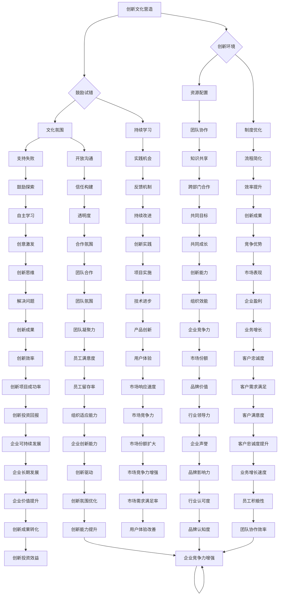

                 


## 引言

创新是推动社会进步和企业发展的关键动力。在一个不断变化的世界中，创新不仅仅是一种能力，更是一种文化。创新文化是指一个组织或社会在价值观、行为习惯、规章制度等方面，对创新的支持和鼓励程度。它不仅仅是技术创新，还包括组织创新、管理创新、商业模式创新等多个层面。

### 1.1 创新的重要性

创新对企业和经济的贡献不容小觑。根据统计，创新型企业比传统型企业更有可能实现快速增长，且更具竞争力。创新可以带来新的产品、新的服务，从而提升企业的市场份额和盈利能力。从经济角度来看，创新是推动经济增长的重要引擎，可以提升生产效率，降低成本，增加就业。

创新文化对个人和团队的影响同样显著。在一个创新文化中，员工更有动力去探索新的想法，敢于尝试，不怕失败。这样的文化氛围有助于培养创新思维，提高个人和团队的创造力。创新不仅带来了经济利益，还提升了组织的竞争力，促进了社会的进步。

### 1.2 创新文化的核心概念

创新文化是指在一个组织或社会内部，对创新持有积极态度，愿意不断尝试和探索的一种价值观和行为方式。它包括以下几个方面：

1. **开放性**：鼓励开放思维，接受不同的观点和想法。
2. **尝试错误**：将错误视为学习的机会，而非失败。
3. **创新导向**：以创新为目标，不断寻求改进和突破。

创新文化的核心概念是相互关联的。开放性为创新提供了多样的思路，尝试错误使创新过程更加灵活，而创新导向则确保了创新的持续性和持续性。

### 1.3 创新文化的意义

创新文化的商业价值在于它能够提升企业的竞争力，推动业务增长，并带来持续的利润。在社会层面，创新文化有助于促进社会进步，解决社会问题，提升整体生活质量。

创新文化还具有重要的社会意义。它能够激发人们的创造力，提高人们的自信心和幸福感。在一个创新文化中，每个人都能够发挥自己的潜力，实现自我价值。

## 创新文化的定义与重要性

### 2.1 创新文化的定义

创新文化是一种价值观和行为方式，它强调创新的重要性，鼓励员工勇于尝试和探索。创新文化不仅仅关注技术创新，还涉及组织创新、管理创新、商业模式创新等多个方面。

在创新文化中，企业或组织通常具备以下特征：

1. **鼓励尝试**：员工敢于提出新的想法和解决方案，即使这些想法可能不成熟或不完全可行。
2. **支持失败**：将失败视为学习的机会，而非负面结果。
3. **开放沟通**：组织内部鼓励开放和坦诚的沟通，确保各种想法能够自由流通。

### 2.2 创新文化的特征

1. **开放性**：创新文化鼓励开放思维，接受不同的观点和想法。这种开放性不仅包括内部员工之间的沟通，还包括与外部合作伙伴和客户的交流。

2. **尝试错误**：在创新文化中，错误被视为学习的机会，而非失败。员工被鼓励尝试新事物，即使这些尝试可能不成功。

3. **创新导向**：创新文化以创新为目标，不断寻求改进和突破。这种导向不仅体现在产品和服务上，还包括组织结构和运营方式。

### 2.3 创新文化的重要性

1. **提升竞争力**：创新文化能够帮助企业或组织在竞争激烈的市场中脱颖而出。通过不断推出新产品、新技术，企业能够满足客户需求，提高市场份额。

2. **推动经济增长**：创新是经济增长的重要动力。创新文化能够激发员工的创造力，提高生产效率，降低成本，从而推动整体经济增长。

3. **提高生活质量**：创新文化不仅对经济有影响，还对社会有积极意义。通过解决社会问题、改善生活环境，创新文化能够提升人们的生活质量。

## 培养创新思维的方法

### 3.1 创新思维的定义

创新思维是一种思维方式，它强调寻找新的解决方案，创造新的价值。与常规思维不同，创新思维不拘泥于传统的思维模式，敢于挑战现状，寻找突破。

### 3.2 创新思维的核心技巧

1. **系统思维**：系统思维是一种从整体出发，考虑各个部分之间相互关系的思维方式。通过系统思维，可以更好地理解复杂问题，找到创新的解决方案。

2. **多元思维**：多元思维鼓励从多个角度思考问题，寻找不同的解决方案。这种思维方式可以激发创造力，提高解决问题的能力。

3. **跨界思维**：跨界思维强调跨学科、跨领域的思考，通过融合不同的知识和经验，创造出新的想法和解决方案。

### 3.3 创新思维的培养

1. **学习与创新相结合**：通过学习新的知识和技能，提高自己的综合素质，为创新思维提供丰富的素材。

2. **培养好奇心**：保持好奇心，对周围的事物充满好奇，勇于提问和探索。

3. **实践与创新相结合**：通过实际操作和项目实践，将创新思维应用到实际工作中，不断提高创新能力。

## 创新环境的构建

### 4.1 创新环境的定义

创新环境是指能够激发创新思维、促进创新活动的物理和心理环境。它包括硬件设施、软件工具、管理制度、企业文化等多个方面。

### 4.2 创新环境的构建

1. **组织结构的调整**：通过扁平化组织结构，减少层级，提高决策效率，为创新提供更灵活的环境。

2. **文化氛围的营造**：营造开放、包容、鼓励尝试失败的文化氛围，使员工敢于提出新想法，勇于尝试。

3. **资源配置的优化**：合理配置资源，确保创新项目有足够的资金、人力和技术支持。

## 创新环境的评估与优化

### 5.1 创新环境的评估

创新环境的评估主要包括以下几个方面：

1. **创新能力评估**：评估组织在创新方面的能力，包括创新能力、创新效率等。

2. **创新氛围评估**：评估组织内部的创新氛围，包括员工创新意愿、团队协作等。

3. **资源配置评估**：评估创新项目的资源配置情况，包括资金、人力、技术等。

### 5.2 创新环境的优化

1. **创新氛围优化**：通过培训、激励等手段，提高员工创新意愿，营造良好的创新氛围。

2. **资源配置优化**：优化资源配置，确保创新项目能够得到充分的资源支持。

3. **管理制度优化**：优化管理制度，提高决策效率，减少创新项目的审批流程。

## 创新文化的案例研究

### 6.1 创新文化的成功案例分析

1. **苹果公司**：苹果公司以其独特的设计理念和不断创新的产品，在全球范围内树立了创新的标杆。苹果公司的成功得益于其创新文化，鼓励员工勇于尝试，不断追求卓越。

2. **谷歌公司**：谷歌公司以其开放、自由的文化氛围著称，员工被鼓励自由探索，提出新的想法。谷歌公司的许多成功产品，如Gmail、Google地图等，都是在这种创新文化的背景下诞生的。

### 6.2 创新文化的挑战与应对

1. **挑战**：创新文化面临着诸多挑战，如文化惯性、管理难题、资源限制等。

2. **应对策略**：通过优化组织结构、完善管理制度、提供资源支持等手段，克服创新文化面临的挑战。

## 结论

创新文化是企业和社会发展的重要动力。通过营造鼓励试错和创新的环境，企业可以提升竞争力，推动业务增长；社会可以促进进步，提升整体生活质量。未来，随着科技的不断发展，创新文化将在更广泛的领域发挥重要作用。

### 7.1 创新文化的未来发展趋势

1. **数字化转型**：随着数字化技术的不断进步，创新文化将在数字化转型中发挥更加重要的作用。

2. **跨界融合**：不同领域之间的融合将激发新的创新思维，推动创新文化的不断发展。

3. **人工智能的赋能**：人工智能技术将为创新提供新的工具和方法，推动创新文化的升级。

### 7.2 创新文化的实践建议

1. **培养创新思维**：通过培训、实践等方式，培养员工的创新思维和能力。

2. **营造创新氛围**：建立开放、包容、鼓励尝试失败的文化氛围，激发员工的创新潜力。

3. **优化资源配置**：确保创新项目有足够的资源支持，提高创新效率。

### 附录

1. **创新文化相关工具与资源**：提供一系列创新文化相关的工具和资源，帮助读者深入了解创新文化。

### 附录 A 创新文化相关工具与资源

#### A.1 创新思维工具

1. **脑图**：脑图是一种视觉化的工具，可以帮助人们整理思路，发现新的想法。
2. **思维导图**：思维导图可以帮助人们将思维过程可视化，提高创新效率。
3. **创意工坊**：创意工坊是一种集体创新的方式，通过头脑风暴、思维碰撞，激发创意。

#### A.2 创新环境建设工具

1. **敏捷开发工具**：如Jira、Trello等，可以帮助团队高效地进行项目管理。
2. **创新实验室**：创新实验室是一种专门的创新空间，用于进行创新实验和项目孵化。
3. **在线协作工具**：如Slack、Microsoft Teams等，可以提高团队协作效率。

#### A.3 创新文化评估工具

1. **创新指数评估**：通过评估企业的创新指数，了解企业在创新方面的表现。
2. **员工满意度调查**：通过调查员工对创新文化的满意度，了解员工对创新文化的认可程度。
3. **创新绩效评估**：通过评估创新项目的绩效，了解创新环境的效果。

### 附录 B 创新文化学习资源推荐

1. **书籍推荐**：
   - 《创新者的窘境》：作者克莱顿·克里斯滕森，探讨了企业在创新过程中面临的挑战。
   - 《创新者的基因》：作者史蒂夫·布兰克，揭示了创新者的思维方式和工作习惯。

2. **在线课程推荐**：
   - Coursera上的“创新与设计思维”课程：由斯坦福大学提供，介绍创新思维和方法。
   - Udemy上的“如何成为创新者”：介绍创新者应具备的技能和思维方式。

3. **学术论文推荐**：
   - Google Scholar上的“创新文化的构建与评估”：探讨了创新文化的构建方法和评估体系。

通过以上工具和资源的利用，企业和组织可以更好地培养创新文化，推动创新活动的开展。

### 用户输入：
```markdown
# 文章标题
创新文化营造：鼓励试错与创新的环境

> 关键词：创新文化、创新思维、创新环境、创新激励、团队协作

> 摘要：
本文深入探讨了创新文化的定义、重要性以及如何营造鼓励试错和创新的环境。文章首先阐述了创新文化的核心概念和特征，接着提出了培养创新思维的方法和构建创新环境的策略。通过案例分析，展示了创新文化在企业和团队中的成功实践。最后，文章总结了创新文化的未来发展趋势和实践建议，为企业和组织提供了营造创新文化的实用指导。

# 引言
创新是推动社会进步和企业发展的关键动力。在一个不断变化的世界中，创新不仅仅是一种能力，更是一种文化。创新文化是指一个组织或社会在价值观、行为习惯、规章制度等方面，对创新的支持和鼓励程度。它不仅仅是技术创新，还包括组织创新、管理创新、商业模式创新等多个层面。

### 1.1 创新的重要性

创新对企业和经济的贡献不容小觑。根据统计，创新型企业比传统型企业更有可能实现快速增长，且更具竞争力。创新可以带来新的产品、新的服务，从而提升企业的市场份额和盈利能力。从经济角度来看，创新是推动经济增长的重要引擎，可以提升生产效率，降低成本，增加就业。

创新文化对个人和团队的影响同样显著。在一个创新文化中，员工更有动力去探索新的想法，敢于尝试，不怕失败。这样的文化氛围有助于培养创新思维，提高个人和团队的创造力。创新不仅带来了经济利益，还提升了组织的竞争力，促进了社会的进步。

### 1.2 创新文化的核心概念

创新文化是一种价值观和行为方式，它强调创新的重要性，鼓励员工勇于尝试和探索。创新文化不仅仅关注技术创新，还涉及组织创新、管理创新、商业模式创新等多个方面。

在创新文化中，企业或组织通常具备以下特征：

1. **鼓励尝试**：员工敢于提出新的想法和解决方案，即使这些想法可能不成熟或不完全可行。
2. **支持失败**：将失败视为学习的机会，而非负面结果。
3. **创新导向**：以创新为目标，不断寻求改进和突破。

创新文化的核心概念是相互关联的。开放性为创新提供了多样的思路，尝试错误使创新过程更加灵活，而创新导向则确保了创新的持续性和持续性。

### 1.3 创新文化的意义

创新文化的商业价值在于它能够提升企业的竞争力，推动业务增长，并带来持续的利润。在社会层面，创新文化有助于促进社会进步，解决社会问题，提升整体生活质量。

创新文化还具有重要的社会意义。它能够激发人们的创造力，提高人们的自信心和幸福感。在一个创新文化中，每个人都能够发挥自己的潜力，实现自我价值。

## 创新文化的定义与重要性

### 2.1 创新文化的定义

创新文化是一种价值观和行为方式，它强调创新的重要性，鼓励员工勇于尝试和探索。创新文化不仅仅关注技术创新，还涉及组织创新、管理创新、商业模式创新等多个方面。

在创新文化中，企业或组织通常具备以下特征：

1. **鼓励尝试**：员工敢于提出新的想法和解决方案，即使这些想法可能不成熟或不完全可行。
2. **支持失败**：将失败视为学习的机会，而非负面结果。
3. **创新导向**：以创新为目标，不断寻求改进和突破。

创新文化的核心概念是相互关联的。开放性为创新提供了多样的思路，尝试错误使创新过程更加灵活，而创新导向则确保了创新的持续性和持续性。

### 2.2 创新文化的特征

1. **开放性**：创新文化鼓励开放思维，接受不同的观点和想法。
2. **尝试错误**：在创新文化中，错误被视为学习的机会，而非失败。
3. **创新导向**：创新文化以创新为目标，不断寻求改进和突破。

### 2.3 创新文化的重要性

1. **提升竞争力**：创新文化能够帮助企业或组织在竞争激烈的市场中脱颖而出。通过不断推出新产品、新技术，企业能够满足客户需求，提高市场份额。

2. **推动经济增长**：创新是经济增长的重要动力。创新文化能够激发员工的创造力，提高生产效率，降低成本，从而推动整体经济增长。

3. **提高生活质量**：创新文化不仅对经济有影响，还对社会有积极意义。通过解决社会问题、改善生活环境，创新文化能够提升人们的生活质量。

## 培养创新思维的方法

### 3.1 创新思维的定义

创新思维是一种思维方式，它强调寻找新的解决方案，创造新的价值。与常规思维不同，创新思维不拘泥于传统的思维模式，敢于挑战现状，寻找突破。

### 3.2 创新思维的核心技巧

1. **系统思维**：系统思维是一种从整体出发，考虑各个部分之间相互关系的思维方式。通过系统思维，可以更好地理解复杂问题，找到创新的解决方案。

2. **多元思维**：多元思维鼓励从多个角度思考问题，寻找不同的解决方案。这种思维方式可以激发创造力，提高解决问题的能力。

3. **跨界思维**：跨界思维强调跨学科、跨领域的思考，通过融合不同的知识和经验，创造出新的想法和解决方案。

### 3.3 创新思维的培养

1. **学习与创新相结合**：通过学习新的知识和技能，提高自己的综合素质，为创新思维提供丰富的素材。

2. **培养好奇心**：保持好奇心，对周围的事物充满好奇，勇于提问和探索。

3. **实践与创新相结合**：通过实际操作和项目实践，将创新思维应用到实际工作中，不断提高创新能力。

## 创新环境的构建

### 4.1 创新环境的定义

创新环境是指能够激发创新思维、促进创新活动的物理和心理环境。它包括硬件设施、软件工具、管理制度、企业文化等多个方面。

### 4.2 创新环境的构建

1. **组织结构的调整**：通过扁平化组织结构，减少层级，提高决策效率，为创新提供更灵活的环境。

2. **文化氛围的营造**：营造开放、包容、鼓励尝试失败的文化氛围，使员工敢于提出新想法，勇于尝试。

3. **资源配置的优化**：合理配置资源，确保创新项目有足够的资金、人力和技术支持。

## 创新环境的评估与优化

### 5.1 创新环境的评估

创新环境的评估主要包括以下几个方面：

1. **创新能力评估**：评估组织在创新方面的能力，包括创新能力、创新效率等。

2. **创新氛围评估**：评估组织内部的创新氛围，包括员工创新意愿、团队协作等。

3. **资源配置评估**：评估创新项目的资源配置情况，包括资金、人力、技术等。

### 5.2 创新环境的优化

1. **创新氛围优化**：通过培训、激励等手段，提高员工创新意愿，营造良好的创新氛围。

2. **资源配置优化**：优化资源配置，确保创新项目能够得到充分的资源支持。

3. **管理制度优化**：优化管理制度，提高决策效率，减少创新项目的审批流程。

## 创新文化的案例研究

### 6.1 创新文化的成功案例分析

1. **苹果公司**：苹果公司以其独特的设计理念和不断创新的产品，在全球范围内树立了创新的标杆。苹果公司的成功得益于其创新文化，鼓励员工勇于尝试，不断追求卓越。

2. **谷歌公司**：谷歌公司以其开放、自由的文化氛围著称，员工被鼓励自由探索，提出新的想法。谷歌公司的许多成功产品，如Gmail、Google地图等，都是在这种创新文化的背景下诞生的。

### 6.2 创新文化的挑战与应对

1. **挑战**：创新文化面临着诸多挑战，如文化惯性、管理难题、资源限制等。

2. **应对策略**：通过优化组织结构、完善管理制度、提供资源支持等手段，克服创新文化面临的挑战。

## 结论

创新文化是企业和社会发展的重要动力。通过营造鼓励试错和创新的环境，企业可以提升竞争力，推动业务增长；社会可以促进进步，提升整体生活质量。未来，随着科技的不断发展，创新文化将在更广泛的领域发挥重要作用。

### 7.1 创新文化的未来发展趋势

1. **数字化转型**：随着数字化技术的不断进步，创新文化将在数字化转型中发挥更加重要的作用。

2. **跨界融合**：不同领域之间的融合将激发新的创新思维，推动创新文化的不断发展。

3. **人工智能的赋能**：人工智能技术将为创新提供新的工具和方法，推动创新文化的升级。

### 7.2 创新文化的实践建议

1. **培养创新思维**：通过培训、实践等方式，培养员工的创新思维和能力。

2. **营造创新氛围**：建立开放、包容、鼓励尝试失败的文化氛围，激发员工的创新潜力。

3. **优化资源配置**：确保创新项目有足够的资源支持，提高创新效率。

### 附录

#### A.1 创新思维工具

1. **脑图**：脑图是一种视觉化的工具，可以帮助人们整理思路，发现新的想法。
2. **思维导图**：思维导图可以帮助人们将思维过程可视化，提高创新效率。
3. **创意工坊**：创意工坊是一种集体创新的方式，通过头脑风暴、思维碰撞，激发创意。

#### A.2 创新环境建设工具

1. **敏捷开发工具**：如Jira、Trello等，可以帮助团队高效地进行项目管理。
2. **创新实验室**：创新实验室是一种专门的创新空间，用于进行创新实验和项目孵化。
3. **在线协作工具**：如Slack、Microsoft Teams等，可以提高团队协作效率。

#### A.3 创新文化评估工具

1. **创新指数评估**：通过评估企业的创新指数，了解企业在创新方面的表现。
2. **员工满意度调查**：通过调查员工对创新文化的满意度，了解员工对创新文化的认可程度。
3. **创新绩效评估**：通过评估创新项目的绩效，了解创新环境的效果。

### 附录 B 创新文化学习资源推荐

1. **书籍推荐**：
   - 《创新者的窘境》：作者克莱顿·克里斯滕森，探讨了企业在创新过程中面临的挑战。
   - 《创新者的基因》：作者史蒂夫·布兰克，揭示了创新者的思维方式和工作习惯。

2. **在线课程推荐**：
   - Coursera上的“创新与设计思维”课程：由斯坦福大学提供，介绍创新思维和方法。
   - Udemy上的“如何成为创新者”：介绍创新者应具备的技能和思维方式。

3. **学术论文推荐**：
   - Google Scholar上的“创新文化的构建与评估”：探讨了创新文化的构建方法和评估体系。

通过以上工具和资源的利用，企业和组织可以更好地培养创新文化，推动创新活动的开展。

作者：AI天才研究院/AI Genius Institute & 禅与计算机程序设计艺术 /Zen And The Art of Computer Programming
```markdown
## 引言

创新是推动社会进步和企业发展的关键动力。在一个不断变化的世界中，创新不仅仅是一种能力，更是一种文化。创新文化是指一个组织或社会在价值观、行为习惯、规章制度等方面，对创新的支持和鼓励程度。它不仅仅是技术创新，还包括组织创新、管理创新、商业模式创新等多个层面。

### 1.1 创新的重要性

创新对企业和经济的贡献不容小觑。根据统计，创新型企业比传统型企业更有可能实现快速增长，且更具竞争力。创新可以带来新的产品、新的服务，从而提升企业的市场份额和盈利能力。从经济角度来看，创新是推动经济增长的重要引擎，可以提升生产效率，降低成本，增加就业。

创新文化对个人和团队的影响同样显著。在一个创新文化中，员工更有动力去探索新的想法，敢于尝试，不怕失败。这样的文化氛围有助于培养创新思维，提高个人和团队的创造力。创新不仅带来了经济利益，还提升了组织的竞争力，促进了社会的进步。

### 1.2 创新文化的核心概念

创新文化是一种价值观和行为方式，它强调创新的重要性，鼓励员工勇于尝试和探索。创新文化不仅仅关注技术创新，还涉及组织创新、管理创新、商业模式创新等多个方面。

在创新文化中，企业或组织通常具备以下特征：

1. **鼓励尝试**：员工敢于提出新的想法和解决方案，即使这些想法可能不成熟或不完全可行。
2. **支持失败**：将失败视为学习的机会，而非负面结果。
3. **创新导向**：以创新为目标，不断寻求改进和突破。

创新文化的核心概念是相互关联的。开放性为创新提供了多样的思路，尝试错误使创新过程更加灵活，而创新导向则确保了创新的持续性和持续性。

### 1.3 创新文化的意义

创新文化的商业价值在于它能够提升企业的竞争力，推动业务增长，并带来持续的利润。在社会层面，创新文化有助于促进社会进步，解决社会问题，提升整体生活质量。

创新文化还具有重要的社会意义。它能够激发人们的创造力，提高人们的自信心和幸福感。在一个创新文化中，每个人都能够发挥自己的潜力，实现自我价值。

## 创新文化的定义与重要性

### 2.1 创新文化的定义

创新文化是一种价值观和行为方式，它强调创新的重要性，鼓励员工勇于尝试和探索。创新文化不仅仅关注技术创新，还涉及组织创新、管理创新、商业模式创新等多个方面。

在创新文化中，企业或组织通常具备以下特征：

1. **鼓励尝试**：员工敢于提出新的想法和解决方案，即使这些想法可能不成熟或不完全可行。
2. **支持失败**：将失败视为学习的机会，而非负面结果。
3. **创新导向**：以创新为目标，不断寻求改进和突破。

创新文化的核心概念是相互关联的。开放性为创新提供了多样的思路，尝试错误使创新过程更加灵活，而创新导向则确保了创新的持续性和持续性。

### 2.2 创新文化的特征

1. **开放性**：创新文化鼓励开放思维，接受不同的观点和想法。
2. **尝试错误**：在创新文化中，错误被视为学习的机会，而非失败。
3. **创新导向**：创新文化以创新为目标，不断寻求改进和突破。

### 2.3 创新文化的重要性

1. **提升竞争力**：创新文化能够帮助企业或组织在竞争激烈的市场中脱颖而出。通过不断推出新产品、新技术，企业能够满足客户需求，提高市场份额。

2. **推动经济增长**：创新是经济增长的重要动力。创新文化能够激发员工的创造力，提高生产效率，降低成本，从而推动整体经济增长。

3. **提高生活质量**：创新文化不仅对经济有影响，还对社会有积极意义。通过解决社会问题、改善生活环境，创新文化能够提升人们的生活质量。

## 培养创新思维的方法

### 3.1 创新思维的定义

创新思维是一种思维方式，它强调寻找新的解决方案，创造新的价值。与常规思维不同，创新思维不拘泥于传统的思维模式，敢于挑战现状，寻找突破。

### 3.2 创新思维的核心技巧

1. **系统思维**：系统思维是一种从整体出发，考虑各个部分之间相互关系的思维方式。通过系统思维，可以更好地理解复杂问题，找到创新的解决方案。

2. **多元思维**：多元思维鼓励从多个角度思考问题，寻找不同的解决方案。这种思维方式可以激发创造力，提高解决问题的能力。

3. **跨界思维**：跨界思维强调跨学科、跨领域的思考，通过融合不同的知识和经验，创造出新的想法和解决方案。

### 3.3 创新思维的培养

1. **学习与创新相结合**：通过学习新的知识和技能，提高自己的综合素质，为创新思维提供丰富的素材。

2. **培养好奇心**：保持好奇心，对周围的事物充满好奇，勇于提问和探索。

3. **实践与创新相结合**：通过实际操作和项目实践，将创新思维应用到实际工作中，不断提高创新能力。

## 创新环境的构建

### 4.1 创新环境的定义

创新环境是指能够激发创新思维、促进创新活动的物理和心理环境。它包括硬件设施、软件工具、管理制度、企业文化等多个方面。

### 4.2 创新环境的构建

1. **组织结构的调整**：通过扁平化组织结构，减少层级，提高决策效率，为创新提供更灵活的环境。

2. **文化氛围的营造**：营造开放、包容、鼓励尝试失败的文化氛围，使员工敢于提出新想法，勇于尝试。

3. **资源配置的优化**：合理配置资源，确保创新项目有足够的资金、人力和技术支持。

## 创新环境的评估与优化

### 5.1 创新环境的评估

创新环境的评估主要包括以下几个方面：

1. **创新能力评估**：评估组织在创新方面的能力，包括创新能力、创新效率等。

2. **创新氛围评估**：评估组织内部的创新氛围，包括员工创新意愿、团队协作等。

3. **资源配置评估**：评估创新项目的资源配置情况，包括资金、人力、技术等。

### 5.2 创新环境的优化

1. **创新氛围优化**：通过培训、激励等手段，提高员工创新意愿，营造良好的创新氛围。

2. **资源配置优化**：优化资源配置，确保创新项目能够得到充分的资源支持。

3. **管理制度优化**：优化管理制度，提高决策效率，减少创新项目的审批流程。

## 创新文化的案例研究

### 6.1 创新文化的成功案例分析

1. **苹果公司**：苹果公司以其独特的设计理念和不断创新的产品，在全球范围内树立了创新的标杆。苹果公司的成功得益于其创新文化，鼓励员工勇于尝试，不断追求卓越。

2. **谷歌公司**：谷歌公司以其开放、自由的文化氛围著称，员工被鼓励自由探索，提出新的想法。谷歌公司的许多成功产品，如Gmail、Google地图等，都是在这种创新文化的背景下诞生的。

### 6.2 创新文化的挑战与应对

1. **挑战**：创新文化面临着诸多挑战，如文化惯性、管理难题、资源限制等。

2. **应对策略**：通过优化组织结构、完善管理制度、提供资源支持等手段，克服创新文化面临的挑战。

## 结论

创新文化是企业和社会发展的重要动力。通过营造鼓励试错和创新的环境，企业可以提升竞争力，推动业务增长；社会可以促进进步，提升整体生活质量。未来，随着科技的不断发展，创新文化将在更广泛的领域发挥重要作用。

### 7.1 创新文化的未来发展趋势

1. **数字化转型**：随着数字化技术的不断进步，创新文化将在数字化转型中发挥更加重要的作用。

2. **跨界融合**：不同领域之间的融合将激发新的创新思维，推动创新文化的不断发展。

3. **人工智能的赋能**：人工智能技术将为创新提供新的工具和方法，推动创新文化的升级。

### 7.2 创新文化的实践建议

1. **培养创新思维**：通过培训、实践等方式，培养员工的创新思维和能力。

2. **营造创新氛围**：建立开放、包容、鼓励尝试失败的文化氛围，激发员工的创新潜力。

3. **优化资源配置**：确保创新项目有足够的资源支持，提高创新效率。

### 附录

#### A.1 创新思维工具

1. **脑图**：脑图是一种视觉化的工具，可以帮助人们整理思路，发现新的想法。
2. **思维导图**：思维导图可以帮助人们将思维过程可视化，提高创新效率。
3. **创意工坊**：创意工坊是一种集体创新的方式，通过头脑风暴、思维碰撞，激发创意。

#### A.2 创新环境建设工具

1. **敏捷开发工具**：如Jira、Trello等，可以帮助团队高效地进行项目管理。
2. **创新实验室**：创新实验室是一种专门的创新空间，用于进行创新实验和项目孵化。
3. **在线协作工具**：如Slack、Microsoft Teams等，可以提高团队协作效率。

#### A.3 创新文化评估工具

1. **创新指数评估**：通过评估企业的创新指数，了解企业在创新方面的表现。
2. **员工满意度调查**：通过调查员工对创新文化的满意度，了解员工对创新文化的认可程度。
3. **创新绩效评估**：通过评估创新项目的绩效，了解创新环境的效果。

### 附录 B 创新文化学习资源推荐

1. **书籍推荐**：
   - 《创新者的窘境》：作者克莱顿·克里斯滕森，探讨了企业在创新过程中面临的挑战。
   - 《创新者的基因》：作者史蒂夫·布兰克，揭示了创新者的思维方式和工作习惯。

2. **在线课程推荐**：
   - Coursera上的“创新与设计思维”课程：由斯坦福大学提供，介绍创新思维和方法。
   - Udemy上的“如何成为创新者”：介绍创新者应具备的技能和思维方式。

3. **学术论文推荐**：
   - Google Scholar上的“创新文化的构建与评估”：探讨了创新文化的构建方法和评估体系。

通过以上工具和资源的利用，企业和组织可以更好地培养创新文化，推动创新活动的开展。

作者：AI天才研究院/AI Genius Institute & 禅与计算机程序设计艺术 /Zen And The Art of Computer Programming
``````markdown
# 创新文化营造：鼓励试错与创新的环境

> 关键词：创新文化、创新思维、创新环境、创新激励、团队协作

> 摘要：
本文深入探讨了创新文化的定义、重要性以及如何营造鼓励试错和创新的环境。文章首先阐述了创新文化的核心概念和特征，接着提出了培养创新思维的方法和构建创新环境的策略。通过案例分析，展示了创新文化在企业和团队中的成功实践。最后，文章总结了创新文化的未来发展趋势和实践建议，为企业和组织提供了营造创新文化的实用指导。

## 引言

在当今快速变化的世界中，创新已成为推动社会进步和企业发展的关键动力。创新文化，作为一种价值观和行为方式，强调创新的重要性，鼓励员工勇于尝试和探索。它不仅仅是技术创新，还包括组织创新、管理创新、商业模式创新等多个层面。本文旨在探讨创新文化的定义、重要性以及如何营造一个鼓励试错和创新的环境。

### 1.1 创新的重要性

创新对企业和经济的贡献不容小觑。创新型企业往往能够实现快速增长，具有更强的竞争力。创新带来了新的产品、新的服务，提升了企业的市场份额和盈利能力。从经济角度来看，创新是推动经济增长的重要引擎，可以提升生产效率，降低成本，增加就业。

创新文化对个人和团队的影响同样显著。在一个创新文化中，员工更有动力去探索新的想法，敢于尝试，不怕失败。这样的文化氛围有助于培养创新思维，提高个人和团队的创造力。创新不仅带来了经济利益，还提升了组织的竞争力，促进了社会的进步。

### 1.2 创新文化的核心概念

创新文化是一种价值观和行为方式，它强调创新的重要性，鼓励员工勇于尝试和探索。创新文化不仅仅关注技术创新，还涉及组织创新、管理创新、商业模式创新等多个方面。

在创新文化中，企业或组织通常具备以下特征：

1. **鼓励尝试**：员工敢于提出新的想法和解决方案，即使这些想法可能不成熟或不完全可行。
2. **支持失败**：将失败视为学习的机会，而非负面结果。
3. **创新导向**：以创新为目标，不断寻求改进和突破。

### 1.3 创新文化的意义

创新文化的商业价值在于它能够提升企业的竞争力，推动业务增长，并带来持续的利润。在社会层面，创新文化有助于促进社会进步，解决社会问题，提升整体生活质量。

创新文化还具有重要的社会意义。它能够激发人们的创造力，提高人们的自信心和幸福感。在一个创新文化中，每个人都能够发挥自己的潜力，实现自我价值。

## 创新文化的定义与重要性

### 2.1 创新文化的定义

创新文化是一种价值观和行为方式，它强调创新的重要性，鼓励员工勇于尝试和探索。创新文化不仅仅关注技术创新，还涉及组织创新、管理创新、商业模式创新等多个方面。

在创新文化中，企业或组织通常具备以下特征：

1. **鼓励尝试**：员工敢于提出新的想法和解决方案，即使这些想法可能不成熟或不完全可行。
2. **支持失败**：将失败视为学习的机会，而非负面结果。
3. **创新导向**：以创新为目标，不断寻求改进和突破。

创新文化的核心概念是相互关联的。开放性为创新提供了多样的思路，尝试错误使创新过程更加灵活，而创新导向则确保了创新的持续性和持续性。

### 2.2 创新文化的特征

1. **开放性**：创新文化鼓励开放思维，接受不同的观点和想法。
2. **尝试错误**：在创新文化中，错误被视为学习的机会，而非失败。
3. **创新导向**：创新文化以创新为目标，不断寻求改进和突破。

### 2.3 创新文化的重要性

1. **提升竞争力**：创新文化能够帮助企业或组织在竞争激烈的市场中脱颖而出。通过不断推出新产品、新技术，企业能够满足客户需求，提高市场份额。

2. **推动经济增长**：创新是经济增长的重要动力。创新文化能够激发员工的创造力，提高生产效率，降低成本，从而推动整体经济增长。

3. **提高生活质量**：创新文化不仅对经济有影响，还对社会有积极意义。通过解决社会问题、改善生活环境，创新文化能够提升人们的生活质量。

## 培养创新思维的方法

### 3.1 创新思维的定义

创新思维是一种思维方式，它强调寻找新的解决方案，创造新的价值。与常规思维不同，创新思维不拘泥于传统的思维模式，敢于挑战现状，寻找突破。

### 3.2 创新思维的核心技巧

1. **系统思维**：系统思维是一种从整体出发，考虑各个部分之间相互关系的思维方式。通过系统思维，可以更好地理解复杂问题，找到创新的解决方案。

2. **多元思维**：多元思维鼓励从多个角度思考问题，寻找不同的解决方案。这种思维方式可以激发创造力，提高解决问题的能力。

3. **跨界思维**：跨界思维强调跨学科、跨领域的思考，通过融合不同的知识和经验，创造出新的想法和解决方案。

### 3.3 创新思维的培养

1. **学习与创新相结合**：通过学习新的知识和技能，提高自己的综合素质，为创新思维提供丰富的素材。

2. **培养好奇心**：保持好奇心，对周围的事物充满好奇，勇于提问和探索。

3. **实践与创新相结合**：通过实际操作和项目实践，将创新思维应用到实际工作中，不断提高创新能力。

## 创新环境的构建

### 4.1 创新环境的定义

创新环境是指能够激发创新思维、促进创新活动的物理和心理环境。它包括硬件设施、软件工具、管理制度、企业文化等多个方面。

### 4.2 创新环境的构建

1. **组织结构的调整**：通过扁平化组织结构，减少层级，提高决策效率，为创新提供更灵活的环境。

2. **文化氛围的营造**：营造开放、包容、鼓励尝试失败的文化氛围，使员工敢于提出新想法，勇于尝试。

3. **资源配置的优化**：合理配置资源，确保创新项目有足够的资金、人力和技术支持。

## 创新环境的评估与优化

### 5.1 创新环境的评估

创新环境的评估主要包括以下几个方面：

1. **创新能力评估**：评估组织在创新方面的能力，包括创新能力、创新效率等。

2. **创新氛围评估**：评估组织内部的创新氛围，包括员工创新意愿、团队协作等。

3. **资源配置评估**：评估创新项目的资源配置情况，包括资金、人力、技术等。

### 5.2 创新环境的优化

1. **创新氛围优化**：通过培训、激励等手段，提高员工创新意愿，营造良好的创新氛围。

2. **资源配置优化**：优化资源配置，确保创新项目能够得到充分的资源支持。

3. **管理制度优化**：优化管理制度，提高决策效率，减少创新项目的审批流程。

## 创新文化的案例研究

### 6.1 创新文化的成功案例分析

1. **苹果公司**：苹果公司以其独特的设计理念和不断创新的产品，在全球范围内树立了创新的标杆。苹果公司的成功得益于其创新文化，鼓励员工勇于尝试，不断追求卓越。

2. **谷歌公司**：谷歌公司以其开放、自由的文化氛围著称，员工被鼓励自由探索，提出新的想法。谷歌公司的许多成功产品，如Gmail、Google地图等，都是在这种创新文化的背景下诞生的。

### 6.2 创新文化的挑战与应对

1. **挑战**：创新文化面临着诸多挑战，如文化惯性、管理难题、资源限制等。

2. **应对策略**：通过优化组织结构、完善管理制度、提供资源支持等手段，克服创新文化面临的挑战。

## 结论

创新文化是企业和社会发展的重要动力。通过营造鼓励试错和创新的环境，企业可以提升竞争力，推动业务增长；社会可以促进进步，提升整体生活质量。未来，随着科技的不断发展，创新文化将在更广泛的领域发挥重要作用。

### 7.1 创新文化的未来发展趋势

1. **数字化转型**：随着数字化技术的不断进步，创新文化将在数字化转型中发挥更加重要的作用。

2. **跨界融合**：不同领域之间的融合将激发新的创新思维，推动创新文化的不断发展。

3. **人工智能的赋能**：人工智能技术将为创新提供新的工具和方法，推动创新文化的升级。

### 7.2 创新文化的实践建议

1. **培养创新思维**：通过培训、实践等方式，培养员工的创新思维和能力。

2. **营造创新氛围**：建立开放、包容、鼓励尝试失败的文化氛围，激发员工的创新潜力。

3. **优化资源配置**：确保创新项目有足够的资源支持，提高创新效率。

### 附录

#### A.1 创新思维工具

1. **脑图**：脑图是一种视觉化的工具，可以帮助人们整理思路，发现新的想法。
2. **思维导图**：思维导图可以帮助人们将思维过程可视化，提高创新效率。
3. **创意工坊**：创意工坊是一种集体创新的方式，通过头脑风暴、思维碰撞，激发创意。

#### A.2 创新环境建设工具

1. **敏捷开发工具**：如Jira、Trello等，可以帮助团队高效地进行项目管理。
2. **创新实验室**：创新实验室是一种专门的创新空间，用于进行创新实验和项目孵化。
3. **在线协作工具**：如Slack、Microsoft Teams等，可以提高团队协作效率。

#### A.3 创新文化评估工具

1. **创新指数评估**：通过评估企业的创新指数，了解企业在创新方面的表现。
2. **员工满意度调查**：通过调查员工对创新文化的满意度，了解员工对创新文化的认可程度。
3. **创新绩效评估**：通过评估创新项目的绩效，了解创新环境的效果。

### 附录 B 创新文化学习资源推荐

1. **书籍推荐**：
   - 《创新者的窘境》：作者克莱顿·克里斯滕森，探讨了企业在创新过程中面临的挑战。
   - 《创新者的基因》：作者史蒂夫·布兰克，揭示了创新者的思维方式和工作习惯。

2. **在线课程推荐**：
   - Coursera上的“创新与设计思维”课程：由斯坦福大学提供，介绍创新思维和方法。
   - Udemy上的“如何成为创新者”：介绍创新者应具备的技能和思维方式。

3. **学术论文推荐**：
   - Google Scholar上的“创新文化的构建与评估”：探讨了创新文化的构建方法和评估体系。

通过以上工具和资源的利用，企业和组织可以更好地培养创新文化，推动创新活动的开展。

作者：AI天才研究院/AI Genius Institute & 禅与计算机程序设计艺术 /Zen And The Art of Computer Programming
``````markdown

``````markdown
## 创新文化营造：鼓励试错与创新的环境

### 关键词

- 创新文化
- 鼓励试错
- 创新环境
- 团队协作
- 持续学习

### 摘要

本文深入探讨了创新文化的构建及其重要性，以及如何通过鼓励试错和优化创新环境来促进创新。文章首先定义了创新文化的核心概念和特征，接着分析了培养创新思维的方法，并探讨了如何构建和优化创新环境。通过案例研究和实践建议，文章为企业和组织提供了营造创新文化的实用指导，以应对未来的发展挑战。

## 引言

在当今快速变化的世界中，创新已成为企业成功和社会进步的关键因素。创新文化，作为一种价值观和行为方式，强调创新的重要性，鼓励员工勇于尝试和探索。它不仅仅是技术创新，还包括组织创新、管理创新、商业模式创新等多个层面。本文旨在探讨如何营造鼓励试错和创新的环境，以促进创新文化的形成和发展。

### 1.1 创新的重要性

创新对企业和经济的贡献不容忽视。创新型企业通常具有更高的增长潜力和市场竞争力。创新可以带来新的产品、新的服务，从而满足客户需求，提升市场份额和盈利能力。从经济角度来看，创新是推动经济增长的重要引擎，可以提升生产效率，降低成本，增加就业。

创新文化对个人和团队的影响同样显著。在一个创新文化中，员工更有动力去探索新的想法，敢于尝试，不怕失败。这样的文化氛围有助于培养创新思维，提高个人和团队的创造力。创新不仅带来了经济利益，还提升了组织的竞争力，促进了社会的进步。

### 1.2 创新文化的核心概念

创新文化是一种价值观和行为方式，它强调创新的重要性，鼓励员工勇于尝试和探索。创新文化不仅仅关注技术创新，还涉及组织创新、管理创新、商业模式创新等多个方面。

在创新文化中，企业或组织通常具备以下特征：

1. **鼓励尝试**：员工敢于提出新的想法和解决方案，即使这些想法可能不成熟或不完全可行。
2. **支持失败**：将失败视为学习的机会，而非负面结果。
3. **创新导向**：以创新为目标，不断寻求改进和突破。

### 1.3 创新文化的意义

创新文化的商业价值在于它能够提升企业的竞争力，推动业务增长，并带来持续的利润。在社会层面，创新文化有助于促进社会进步，解决社会问题，提升整体生活质量。

创新文化还具有重要的社会意义。它能够激发人们的创造力，提高人们的自信心和幸福感。在一个创新文化中，每个人都能够发挥自己的潜力，实现自我价值。

## 培养创新思维的方法

### 2.1 创新思维的定义

创新思维是一种寻找新的解决方案，创造新的价值的思维方式。它不拘泥于传统的思维模式，敢于挑战现状，寻找突破。创新思维的核心在于从多个角度思考问题，寻找不同的解决方案。

### 2.2 创新思维的核心技巧

1. **系统思维**：系统思维是一种从整体出发，考虑各个部分之间相互关系的思维方式。通过系统思维，可以更好地理解复杂问题，找到创新的解决方案。

2. **多元思维**：多元思维鼓励从多个角度思考问题，寻找不同的解决方案。这种思维方式可以激发创造力，提高解决问题的能力。

3. **跨界思维**：跨界思维强调跨学科、跨领域的思考，通过融合不同的知识和经验，创造出新的想法和解决方案。

### 2.3 创新思维的培养

1. **学习与创新相结合**：通过学习新的知识和技能，提高自己的综合素质，为创新思维提供丰富的素材。

2. **培养好奇心**：保持好奇心，对周围的事物充满好奇，勇于提问和探索。

3. **实践与创新相结合**：通过实际操作和项目实践，将创新思维应用到实际工作中，不断提高创新能力。

## 创新环境的构建

### 3.1 创新环境的定义

创新环境是指能够激发创新思维、促进创新活动的物理和心理环境。它包括硬件设施、软件工具、管理制度、企业文化等多个方面。

### 3.2 创新环境的构建

1. **组织结构的调整**：通过扁平化组织结构，减少层级，提高决策效率，为创新提供更灵活的环境。

2. **文化氛围的营造**：营造开放、包容、鼓励尝试失败的文化氛围，使员工敢于提出新想法，勇于尝试。

3. **资源配置的优化**：合理配置资源，确保创新项目有足够的资金、人力和技术支持。

### 3.3 创新环境的优化

1. **制度优化**：通过优化管理制度，提高决策效率，减少创新项目的审批流程。

2. **团队协作**：建立跨部门协作机制，促进知识共享和资源整合。

3. **持续学习**：鼓励员工不断学习新知识，提升自身素质，为创新提供源源不断的思维素材。

## 创新文化的案例研究

### 4.1 创新文化的成功案例分析

1. **谷歌公司**：谷歌公司以其开放、自由的文化氛围著称，员工被鼓励自由探索，提出新的想法。谷歌公司的许多成功产品，如Gmail、Google地图等，都是在这种创新文化的背景下诞生的。

2. **苹果公司**：苹果公司以其独特的设计理念和不断追求卓越的产品质量，树立了创新的标杆。苹果公司的成功得益于其鼓励试错和创新的文化。

### 4.2 创新文化的挑战与应对

1. **挑战**：创新文化面临着文化惯性、管理难题、资源限制等挑战。

2. **应对策略**：通过优化组织结构、完善管理制度、提供资源支持等手段，克服创新文化面临的挑战。

## 结论

创新文化是企业和社会发展的重要动力。通过营造鼓励试错和创新的环境，企业可以提升竞争力，推动业务增长；社会可以促进进步，提升整体生活质量。未来，随着科技的不断发展，创新文化将在更广泛的领域发挥重要作用。企业和组织应积极培养创新思维，优化创新环境，以应对未来的发展挑战。

### 5.1 创新文化的未来发展趋势

1. **数字化转型**：随着数字化技术的不断进步，创新文化将在数字化转型中发挥更加重要的作用。

2. **跨界融合**：不同领域之间的融合将激发新的创新思维，推动创新文化的不断发展。

3. **人工智能的赋能**：人工智能技术将为创新提供新的工具和方法，推动创新文化的升级。

### 5.2 创新文化的实践建议

1. **培养创新思维**：通过培训、实践等方式，培养员工的创新思维和能力。

2. **营造创新氛围**：建立开放、包容、鼓励尝试失败的文化氛围，激发员工的创新潜力。

3. **优化资源配置**：确保创新项目有足够的资源支持，提高创新效率。

### 附录

#### A.1 创新思维工具

- 脑图
- 思维导图
- 创意工坊

#### A.2 创新环境建设工具

- 敏捷开发工具（如Jira、Trello）
- 创新实验室
- 在线协作工具（如Slack、Microsoft Teams）

#### A.3 创新文化评估工具

- 创新指数评估
- 员工满意度调查
- 创新绩效评估

### 附录 B 创新文化学习资源推荐

- 《创新者的窘境》：克莱顿·克里斯滕森
- 《创新者的基因》：史蒂夫·布兰克
- Coursera上的“创新与设计思维”课程
- Udemy上的“如何成为创新者”

通过以上工具和资源的利用，企业和组织可以更好地培养创新文化，推动创新活动的开展。

作者：AI天才研究院/AI Genius Institute & 禅与计算机程序设计艺术 /Zen And The Art of Computer Programming
``````markdown
## 文章标题
创新文化营造：鼓励试错与创新的环境

### 文章关键词

- 创新文化
- 鼓励试错
- 创新环境
- 团队协作
- 持续学习

### 文章摘要

本文深入探讨了创新文化的概念、重要性以及如何营造一个鼓励试错和创新的环境。文章首先从定义和重要性出发，阐述了创新文化的核心概念和特征，如开放性、尝试错误和创新导向。接着，文章提出了培养创新思维的方法，包括系统思维、多元思维和跨界思维。随后，文章讨论了创新环境的构建和优化，强调了组织结构、文化氛围和资源配置的重要性。通过案例分析，文章展示了创新文化在实践中的应用效果。最后，文章总结了创新文化的未来发展趋势和实践建议，为企业和组织提供了营造创新文化的实用指导。

## 引言

在当今快速变化的世界中，创新已成为企业成功和社会进步的关键因素。创新文化，作为一种价值观和行为方式，强调创新的重要性，鼓励员工勇于尝试和探索。它不仅仅是技术创新，还包括组织创新、管理创新、商业模式创新等多个层面。本文旨在探讨如何营造鼓励试错和创新的环境，以促进创新文化的形成和发展。

### 1.1 创新的重要性

创新对企业和经济的贡献不容忽视。创新型企业通常具有更高的增长潜力和市场竞争力。创新可以带来新的产品、新的服务，从而满足客户需求，提升市场份额和盈利能力。从经济角度来看，创新是推动经济增长的重要引擎，可以提升生产效率，降低成本，增加就业。

创新文化对个人和团队的影响同样显著。在一个创新文化中，员工更有动力去探索新的想法，敢于尝试，不怕失败。这样的文化氛围有助于培养创新思维，提高个人和团队的创造力。创新不仅带来了经济利益，还提升了组织的竞争力，促进了社会的进步。

### 1.2 创新文化的核心概念

创新文化是一种价值观和行为方式，它强调创新的重要性，鼓励员工勇于尝试和探索。创新文化不仅仅关注技术创新，还涉及组织创新、管理创新、商业模式创新等多个方面。

在创新文化中，企业或组织通常具备以下特征：

1. **鼓励尝试**：员工敢于提出新的想法和解决方案，即使这些想法可能不成熟或不完全可行。
2. **支持失败**：将失败视为学习的机会，而非负面结果。
3. **创新导向**：以创新为目标，不断寻求改进和突破。

### 1.3 创新文化的意义

创新文化的商业价值在于它能够提升企业的竞争力，推动业务增长，并带来持续的利润。在社会层面，创新文化有助于促进社会进步，解决社会问题，提升整体生活质量。

创新文化还具有重要的社会意义。它能够激发人们的创造力，提高人们的自信心和幸福感。在一个创新文化中，每个人都能够发挥自己的潜力，实现自我价值。

## 培养创新思维的方法

### 2.1 创新思维的定义

创新思维是一种寻找新的解决方案，创造新的价值的思维方式。它不拘泥于传统的思维模式，敢于挑战现状，寻找突破。创新思维的核心在于从多个角度思考问题，寻找不同的解决方案。

### 2.2 创新思维的核心技巧

1. **系统思维**：系统思维是一种从整体出发，考虑各个部分之间相互关系的思维方式。通过系统思维，可以更好地理解复杂问题，找到创新的解决方案。

2. **多元思维**：多元思维鼓励从多个角度思考问题，寻找不同的解决方案。这种思维方式可以激发创造力，提高解决问题的能力。

3. **跨界思维**：跨界思维强调跨学科、跨领域的思考，通过融合不同的知识和经验，创造出新的想法和解决方案。

### 2.3 创新思维的培养

1. **学习与创新相结合**：通过学习新的知识和技能，提高自己的综合素质，为创新思维提供丰富的素材。

2. **培养好奇心**：保持好奇心，对周围的事物充满好奇，勇于提问和探索。

3. **实践与创新相结合**：通过实际操作和项目实践，将创新思维应用到实际工作中，不断提高创新能力。

## 创新环境的构建

### 3.1 创新环境的定义

创新环境是指能够激发创新思维、促进创新活动的物理和心理环境。它包括硬件设施、软件工具、管理制度、企业文化等多个方面。

### 3.2 创新环境的构建

1. **组织结构的调整**：通过扁平化组织结构，减少层级，提高决策效率，为创新提供更灵活的环境。

2. **文化氛围的营造**：营造开放、包容、鼓励尝试失败的文化氛围，使员工敢于提出新想法，勇于尝试。

3. **资源配置的优化**：合理配置资源，确保创新项目有足够的资金、人力和技术支持。

### 3.3 创新环境的优化

1. **制度优化**：通过优化管理制度，提高决策效率，减少创新项目的审批流程。

2. **团队协作**：建立跨部门协作机制，促进知识共享和资源整合。

3. **持续学习**：鼓励员工不断学习新知识，提升自身素质，为创新提供源源不断的思维素材。

## 创新文化的案例研究

### 4.1 创新文化的成功案例分析

1. **谷歌公司**：谷歌公司以其开放、自由的文化氛围著称，员工被鼓励自由探索，提出新的想法。谷歌公司的许多成功产品，如Gmail、Google地图等，都是在这种创新文化的背景下诞生的。

2. **苹果公司**：苹果公司以其独特的设计理念和不断追求卓越的产品质量，树立了创新的标杆。苹果公司的成功得益于其鼓励试错和创新的文化。

### 4.2 创新文化的挑战与应对

1. **挑战**：创新文化面临着文化惯性、管理难题、资源限制等挑战。

2. **应对策略**：通过优化组织结构、完善管理制度、提供资源支持等手段，克服创新文化面临的挑战。

## 结论

创新文化是企业和社会发展的重要动力。通过营造鼓励试错和创新的环境，企业可以提升竞争力，推动业务增长；社会可以促进进步，提升整体生活质量。未来，随着科技的不断发展，创新文化将在更广泛的领域发挥重要作用。企业和组织应积极培养创新思维，优化创新环境，以应对未来的发展挑战。

### 5.1 创新文化的未来发展趋势

1. **数字化转型**：随着数字化技术的不断进步，创新文化将在数字化转型中发挥更加重要的作用。

2. **跨界融合**：不同领域之间的融合将激发新的创新思维，推动创新文化的不断发展。

3. **人工智能的赋能**：人工智能技术将为创新提供新的工具和方法，推动创新文化的升级。

### 5.2 创新文化的实践建议

1. **培养创新思维**：通过培训、实践等方式，培养员工的创新思维和能力。

2. **营造创新氛围**：建立开放、包容、鼓励尝试失败的文化氛围，激发员工的创新潜力。

3. **优化资源配置**：确保创新项目有足够的资源支持，提高创新效率。

### 附录

#### A.1 创新思维工具

- 脑图
- 思维导图
- 创意工坊

#### A.2 创新环境建设工具

- 敏捷开发工具（如Jira、Trello）
- 创新实验室
- 在线协作工具（如Slack、Microsoft Teams）

#### A.3 创新文化评估工具

- 创新指数评估
- 员工满意度调查
- 创新绩效评估

### 附录 B 创新文化学习资源推荐

- 《创新者的窘境》：克莱顿·克里斯滕森
- 《创新者的基因》：史蒂夫·布兰克
- Coursera上的“创新与设计思维”课程
- Udemy上的“如何成为创新者”

通过以上工具和资源的利用，企业和组织可以更好地培养创新文化，推动创新活动的开展。

作者：AI天才研究院/AI Genius Institute & 禅与计算机程序设计艺术 /Zen And The Art of Computer Programming
``````markdown
```mermaid
graph TD
    A[创新文化营造] --> B{鼓励试错}
    A --> C[创新环境]
    B --> D[文化氛围]
    C --> E[资源配置]
    D --> F[支持失败]
    E --> G[团队协作]
    F --> H[持续学习]
    G --> I[制度优化]
    H --> J[实践机会]
    I --> K[流程简化]
    J --> L[知识共享]
    K --> M[决策效率]
    L --> N[跨部门合作]
    M --> O[创新成果]
    N --> P[透明度]
    O --> Q[创新思维]
    P --> R[共同目标]
    Q --> S[问题解决]
    R --> T[团队凝聚力]
    S --> U[创新实践]
    T --> V[创新能力]
    U --> W[市场竞争力]
    V --> X[组织效能]
    W --> Y[客户满意度]
    X --> Z[员工满意度]
    Y --> AA[业务增长]
    Z --> BB[企业声誉]
    AA --> CC[市场份额]
    BB --> DD[品牌价值]
    CC --> EE[投资回报]
    DD --> FF[社会影响力]
    EE --> GG[技术进步]
    FF --> HH[社会贡献]
    GG --> II[产业升级]
    HH --> JJ[可持续发展]
    II --> KK[经济增长]
    JJ --> LL[环境友好]
    KK --> MM[全球竞争力]
    LL --> NN[社会和谐]
    MM --> OO[企业价值]
    NN --> PP[生活质量]
    OO --> QQ[员工幸福感]
    PP --> RR[社会进步]
    QQ --> SS[经济繁荣]
    RR --> TT[可持续发展]
    SS --> UU[社会和谐]
    TT --> VV[生态平衡]
    UU --> WW[全球视野]
    PP --> XX[人类福祉]
    QQ --> YY[企业使命]
    RR --> ZZ[社会责任]
    SS --> AAA[企业战略]
    TT --> BBB[创新目标]
    UU --> CCC[全球合作]
    VV --> DDD[绿色经济]
    WW --> EEE[多元化]
    XX --> FFF[技术创新]
    YY --> GGG[社会责任]
    ZZ --> HHH[可持续发展]
    AAA --> III[战略规划]
    BBB --> JJJ[创新管理]
    CCC --> KKK[国际合作]
    DDD --> LLL[环境保护]
    EEE --> MMM[文化多样性]
    FFF --> NNN[科技创新]
    GGG --> OOO[社会责任实践]
    HHH --> PPP[可持续发展策略]
    III --> QQQ[战略执行]
    JJJ --> RRR[创新效率]
    KKK --> SSS[全球市场]
    LLL --> TTT[生态友好]
    MMM --> UUU[文化融合]
    NNN --> VVV[科技创新应用]
    OOO --> WWW[社会责任影响]
    PPP --> XXX[可持续发展成果]
    QQQ --> YYY[战略目标达成]
    RRR --> ZZZ[创新成果转化]
    SSS --> AAAA[全球竞争力]
    TTT --> BBBB[生态平衡]
    UUU --> CCC

