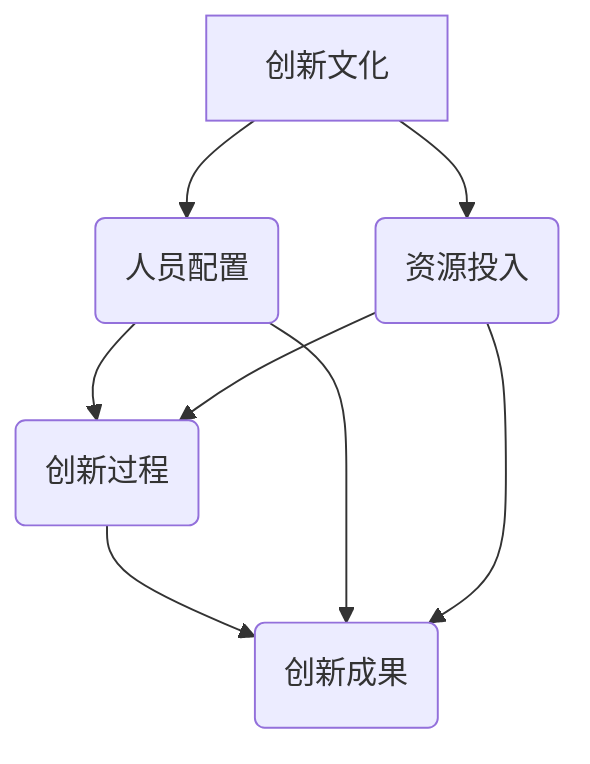

                 

# 文章标题：创新环境：营造鼓励冒险和创意的氛围

## 关键词
- 创新环境
- 鼓励冒险
- 创意氛围
- 软件开发
- 企业文化
- 教育创新

## 摘要
本文旨在探讨如何营造一个鼓励冒险和创意的氛围，以促进创新环境的形成。通过分析创新环境的关键要素，本文提出了构建创新环境的策略，并详细阐述了如何在实际工作中应用这些策略。同时，本文结合实际案例，提供了营造鼓励冒险和创意氛围的最佳实践，为企业和教育领域提供了有益的参考。

## 引言

在当今快速变化的世界中，创新已成为企业竞争的关键因素。无论是科技公司还是传统行业，都需要不断进行创新以适应市场的变化。然而，创新并非易事，它需要特定的环境和文化支持。创新环境是指能够激发、支持和促进创新的一系列因素，包括组织文化、人员配置、资源投入等。一个良好的创新环境可以鼓励冒险，激发创意，从而推动企业的持续发展。

本文将围绕如何营造鼓励冒险和创意的氛围进行探讨，旨在为企业和教育机构提供有价值的指导。文章结构如下：

1. 创新环境的概述：介绍创新环境的定义、组成部分和类型。
2. 构建创新环境的方法：详细阐述培养创新意识、设定创新目标、建立创新团队和提供创新资源的方法。
3. 鼓励冒险和创意的策略：分析鼓励冒险的文化建设、创意思维技巧、风险管理、鼓励尝试和失败的策略。
4. 实践案例分析：分享国内外创新环境的实践案例。
5. 创新环境的未来趋势：探讨创新环境的未来发展趋势和挑战。
6. 结论与总结：总结创新环境的重要性，提出营造创新环境的关键点和展望。

## 创新环境的概述

### 创新环境的定义

创新环境是一个组织或机构内部或外部的各种因素的综合体，这些因素共同作用以促进创新过程。它不仅仅是物理空间，还涉及到文化、人员、资源等多个方面。一个良好的创新环境能够激发员工的创造力，鼓励他们尝试新事物，从而推动企业的持续创新。

### 创新环境的组成部分

创新环境由多个组成部分构成，每个部分都对创新过程有着重要的影响。以下是创新环境的主要组成部分：

#### 文化

创新文化是创新环境的核心。它包括组织内部的价值观、信仰、行为规范和工作方式。一个支持创新的文化能够鼓励员工提出新想法，尝试新方法，并对失败持包容态度。

#### 人员

创新团队是创新环境的重要组成部分。团队成员的多样性、技能组合和合作精神对于创新的成功至关重要。此外，人员的招聘、培养和激励也是创新环境的关键要素。

#### 资源

创新资源包括资金、技术、设备和时间等。这些资源为创新提供了必要的支持，使员工能够专注于创新活动。有效的资源管理可以提高创新效率。

#### 过程

创新过程是创新环境的重要组成部分。它包括从创意产生到产品开发的一系列步骤。一个良好的创新过程能够确保创意得到充分利用，并最终转化为实际的产品或服务。

### 创新环境的类型

创新环境可以分为不同类型，根据其目的和特点进行分类。以下是几种常见的创新环境类型：

#### 企业内部创新环境

企业内部创新环境是指企业内部建立的用于激发和促进创新的环境。这种环境通常包括专门的研发部门、创新实验室和创新基金等。

#### 社会创新环境

社会创新环境是指由政府、非营利组织和第三方机构提供的环境，旨在促进社会问题的解决和创新。这种环境通常提供资金、资源和政策支持。

#### 教育创新环境

教育创新环境是指在学校或教育机构内建立的用于鼓励和促进创新学习的环境。这种环境通常包括创新课程、项目式学习和跨学科合作等。

### 创新环境的影响因素

创新环境的影响因素多种多样，包括组织文化、领导风格、制度安排和技术进步等。以下是一些主要的影响因素：

#### 组织文化

组织文化对创新环境有着重要的影响。一个开放、包容和鼓励冒险的文化能够激发员工的创造力。

#### 领导风格

领导风格也是创新环境的关键因素。一个支持创新、鼓励员工尝试新事物的领导风格有助于营造良好的创新环境。

#### 制度安排

制度安排包括组织结构、管理流程和政策等。合理的制度安排可以为创新提供支持和保障。

#### 技术进步

技术进步为创新提供了新的工具和方法。一个技术先进、不断更新的环境能够促进创新的发展。

## 构建创新环境的方法

### 培养创新意识

要构建创新环境，首先需要培养员工的创新意识。以下是一些培养创新意识的方法：

#### 提供培训和学习机会

通过提供培训和学习机会，员工可以了解最新的创新理论和方法。这些培训可以包括内部研讨会、外部培训课程和在线学习平台等。

#### 鼓励员工提出创意

鼓励员工提出创意是培养创新意识的重要步骤。企业可以设立创意提交平台，定期举办创意竞赛，并对优秀的创意进行奖励。

#### 建立创新社区

建立创新社区可以促进员工之间的交流与合作。创新社区可以是线上的，也可以是线下的，它为员工提供了一个分享经验和交流想法的平台。

### 设定创新目标

设定创新目标是构建创新环境的关键步骤。以下是一些设定创新目标的方法：

#### 明确创新方向

企业需要明确其创新方向，以确保创新活动与企业的战略目标保持一致。这可以通过市场调研、竞争对手分析和内部讨论来实现。

#### 设定具体的目标

创新目标应该具体、可衡量和可实现。例如，可以设定创新项目数量、新产品上市时间等具体指标。

#### 制定创新计划

制定创新计划是实现创新目标的关键。创新计划应包括资源分配、时间表和责任人等。

### 建立创新团队

建立创新团队是构建创新环境的重要一步。以下是一些建立创新团队的方法：

#### 确定团队成员

创新团队成员应包括不同背景、技能和经验的员工。这种多样性有助于激发创意和解决复杂问题。

#### 明确团队目标

创新团队的目标应与企业的整体创新目标保持一致。团队目标应明确、具体和可衡量。

#### 建立团队协作机制

建立有效的团队协作机制可以促进团队之间的沟通和合作。这可以包括定期的团队会议、跨部门合作和项目汇报等。

### 提供创新资源

提供创新资源是构建创新环境的关键。以下是一些提供创新资源的方法：

#### 资金支持

企业应提供足够的资金支持创新项目。这可以包括设立创新基金、提供项目预算等。

#### 技术支持

提供技术支持可以确保创新项目的顺利进行。这可以包括购买先进设备、提供技术培训等。

#### 时间和空间资源

提供充足的的时间和空间资源可以使员工能够专注于创新活动。这可以包括设立创新实验室、提供灵活的工作安排等。

### 创造支持冒险的文化

创造支持冒险的文化是营造鼓励冒险和创意氛围的重要一环。以下是一些创造支持冒险的文化的策略：

#### 鼓励尝试和失败

鼓励员工尝试新事物，并对失败持包容态度。这可以培养员工的风险承受能力和创新精神。

#### 奖励创新成果

对创新成果进行奖励可以激发员工的创新动力。奖励可以包括奖金、晋升机会和荣誉表彰等。

#### 建立开放沟通机制

建立开放沟通机制可以促进员工之间的交流与合作。这可以包括定期召开创新分享会、建立创新论坛等。

## 鼓励冒险和创意的策略

### 鼓励冒险的文化建设

要鼓励冒险，首先需要建立一种支持冒险的文化。以下是一些鼓励冒险的文化建设的策略：

#### 确立冒险精神的重要性

企业应明确表达冒险精神的重要性，并将其纳入企业文化。这可以通过领导层的倡导、宣传和培训来实现。

#### 培养冒险意识

通过培训和教育，培养员工的冒险意识。这可以包括提供冒险项目、模拟冒险环境等。

#### 鼓励跨部门合作

鼓励跨部门合作可以促进不同团队之间的冒险精神和创意交流。

### 创意思维技巧

创意思维技巧是激发创意的重要手段。以下是一些常见的创意思维技巧：

#### 基于问题的创意思维

基于问题的创意思维是指从问题出发，通过一系列思考过程来寻找解决方案。这种方法可以激发员工的创意思维。

#### 想象力激发

鼓励员工发挥想象力，尝试从不同角度思考问题。这可以激发出独特的创意。

#### 组合创新

组合创新是指将现有的元素重新组合，创造出新的产品或服务。这种方法可以激发出创新的创意。

### 风险管理

在鼓励冒险的同时，也需要进行风险管理。以下是一些风险管理的方法：

#### 识别风险

通过风险识别，可以了解潜在的风险，并采取相应的措施来降低风险。

#### 评估风险

对识别出的风险进行评估，确定其严重程度和可能的影响。

#### 制定风险应对策略

根据风险评估的结果，制定相应的风险应对策略，包括风险规避、风险转移和风险接受等。

### 鼓励尝试和失败

鼓励尝试和失败是培养创新精神的重要一环。以下是一些鼓励尝试和失败的方法：

#### 建立试错文化

企业应建立一种试错文化，鼓励员工在创新过程中尝试新事物，并对失败持包容态度。

#### 提供试错资源

企业应提供足够的资源，使员工能够在创新过程中尝试和失败。

#### 奖励尝试和失败

对尝试和失败进行奖励，可以激发员工的创新动力。

## 实践案例分析

### 国内外创新环境实践

国内外许多企业和机构都在努力营造鼓励冒险和创意的氛围，以下是一些典型的实践案例：

#### 苹果公司

苹果公司以其独特的产品设计和创新技术而闻名。苹果公司通过提供充足的创新资源、鼓励员工尝试新事物和建立开放的沟通机制，营造了一个良好的创新环境。

#### 斯坦福大学

斯坦福大学以其创新的教育模式而著称。斯坦福大学通过提供丰富的学习资源、鼓励跨学科合作和建立创新社区，为学生提供了良好的创新环境。

### 成功案例分享

以下是一些成功案例的分享：

#### 滴滴出行

滴滴出行通过不断创新，在出行领域取得了巨大的成功。滴滴出行的创新环境包括鼓励员工提出创意、提供充足的资源支持和建立开放的沟通机制。

#### 亚马逊

亚马逊以其创新的技术和商业模式而闻名。亚马逊的创新环境包括提供丰富的技术资源、鼓励员工尝试新事物和建立开放的沟通机制。

### 失败案例分析

以下是一些失败案例的分析：

#### 黑莓

黑莓曾是一家领先的手机制造商，但由于未能及时进行创新，最终失去了市场份额。黑莓的失败原因是其创新环境缺乏鼓励冒险和创意的氛围，以及对市场变化的反应迟钝。

#### 索尼

索尼曾是一家领先的电子产品制造商，但由于在技术创新方面的滞后，最终陷入了困境。索尼的失败原因是其创新环境过于保守，缺乏对失败的容忍和鼓励。

## 创新环境的未来趋势

### 技术发展趋势

未来，技术将继续推动创新环境的发展。以下是一些技术发展趋势：

#### 人工智能

人工智能技术的发展将使创新环境更加智能化，提高创新效率。

#### 区块链

区块链技术的应用将促进创新环境的透明度和安全性。

#### 5G

5G技术的普及将为创新环境提供更快速、更稳定的网络连接。

### 创新环境的变化

随着技术的进步和社会的发展，创新环境也将发生相应的变化。以下是一些创新环境的变化：

#### 数字化转型

数字化转型将使创新环境更加数字化，提高创新的效率和效果。

#### 绿色创新

绿色创新将成为未来创新环境的重要方向，以应对环境问题。

#### 社会责任

社会责任将日益成为创新环境的一部分，企业需要承担更多的社会责任。

### 未来挑战与机遇

未来，创新环境将面临一系列挑战和机遇。以下是一些挑战和机遇：

#### 持续创新

随着市场竞争的加剧，企业需要持续进行创新，以保持竞争优势。

#### 人才培养

人才培养是创新环境的关键，企业需要投入更多资源来培养创新人才。

#### 社会影响力

企业需要通过创新来提高社会影响力，实现可持续发展。

## 结论与总结

创新环境是推动企业持续发展的重要保障。通过营造鼓励冒险和创意的氛围，企业可以激发员工的创造力，提高创新能力。本文介绍了创新环境的定义、组成部分和类型，并提出了构建创新环境的方法和鼓励冒险和创意的策略。同时，通过实践案例分析，展示了国内外创新环境的成功经验和失败教训。未来，随着技术的进步和社会的发展，创新环境将继续演变，企业需要不断创新来适应这一变化。通过本文的探讨，希望为企业提供有益的指导，帮助其营造一个良好的创新环境，实现持续创新和长远发展。

## 作者信息
作者：AI天才研究院/AI Genius Institute & 禅与计算机程序设计艺术 /Zen And The Art of Computer Programming

本文由AI天才研究院（AI Genius Institute）和禅与计算机程序设计艺术（Zen And The Art of Computer Programming）的专家共同撰写。AI天才研究院致力于探索人工智能的前沿技术和应用，而禅与计算机程序设计艺术则专注于计算机编程和算法设计的哲学和实践。两位作者共同为您带来这篇关于创新环境的深入探讨。希望本文能为您的创新之路提供有益的启示和指导。如果您对本文有任何疑问或建议，欢迎随时与我们联系。谢谢您的阅读！## 背景介绍

创新，作为推动社会进步和企业发展的核心动力，在当今世界具有不可替代的重要性。然而，创新并非易事，它需要特定的环境和文化支持，才能激发出无限的创意和潜能。为了更好地理解和构建这样的创新环境，我们首先需要明确几个关键概念和它们之间的关系。

### 创新的重要性

创新不仅是企业生存和发展的关键，也是整个社会进步的重要推动力。在市场经济中，企业通过不断创新来满足消费者需求，提高竞争力，从而实现持续增长。例如，苹果公司凭借其持续的创新精神和卓越的产品设计，在全球市场上占据了重要地位。此外，社会领域的创新同样具有重要意义，如医疗技术的进步、环境保护措施的提升等，这些都极大地改善了人们的生活质量。

### 创新环境的定义

创新环境是指一系列有助于激发、支持和促进创新的因素所构成的生态系统。它包括组织内部和外部的各种资源和条件，如企业文化、领导风格、资源配置、激励机制等。创新环境不仅仅是一个物理空间，更是一个能够激发员工创造力、鼓励冒险精神的文化氛围。

### 关键概念之间的关系

创新环境中的关键概念包括创新文化、人员配置、资源投入和创新过程等。这些概念之间相互关联，共同作用，形成了一个支持创新的整体环境。以下是它们之间的基本关系：

- **创新文化**：创新文化是创新环境的基石，它包括企业的价值观、信仰和行为规范，直接影响员工的态度和行为。一个开放、包容和创新导向的文化能够激发员工的创造力，鼓励他们敢于冒险和尝试。
  
- **人员配置**：创新团队成员的多样性和专业技能对创新过程至关重要。多元化的团队可以带来不同的观点和技能，促进跨学科合作，从而产生更具有创意和突破性的解决方案。

- **资源投入**：资源投入包括资金、技术、设备和时间等，为创新提供了必要的支持。充足的资源可以降低创新过程中的风险，提高创新的效率和成功率。

- **创新过程**：创新过程是创新环境的实际操作层面，它包括从创意产生、研究开发到产品开发的一系列步骤。一个良好的创新过程能够确保创意得到充分利用，并最终转化为实际的产品或服务。

通过明确这些关键概念之间的关系，我们可以更好地理解创新环境的构成，以及如何通过优化这些要素来营造一个鼓励冒险和创意的氛围。

### 核心概念与联系：创新文化、人员配置、资源投入和创新过程的关系

为了进一步深入探讨创新环境的构建，我们需要使用 Mermaid 流程图来展示创新文化、人员配置、资源投入和创新过程之间的相互作用关系。以下是该流程图的伪代码表示：



**流程图解析**：

1. **创新文化**：作为创新环境的基石，创新文化直接影响员工的态度和行为。一个开放、包容和创新导向的文化能够激发员工的创造力，鼓励他们敢于冒险和尝试。它通过引导员工的思维方式和行为模式，为整个创新环境注入活力。

2. **人员配置**：创新团队成员的多样性和专业技能对创新过程至关重要。多元化的团队可以带来不同的观点和技能，促进跨学科合作，从而产生更具有创意和突破性的解决方案。人员配置的好坏直接关系到创新团队的效率和创新能力。

3. **资源投入**：资源投入包括资金、技术、设备和时间等，为创新提供了必要的支持。充足的资源可以降低创新过程中的风险，提高创新的效率和成功率。资源投入的有效性直接决定了创新项目的进展和成果。

4. **创新过程**：创新过程是创新环境的实际操作层面，它包括从创意产生、研究开发到产品开发的一系列步骤。一个良好的创新过程能够确保创意得到充分利用，并最终转化为实际的产品或服务。创新过程的核心在于不断优化和调整，以适应市场需求和技术进步。

5. **创新成果**：创新成果是创新过程的最终输出，它不仅体现在产品或服务的创新上，还包括技术突破、市场占有率和企业竞争力提升等方面。创新成果的反馈又进一步促进了创新文化、人员配置和资源投入的优化。

通过上述 Mermaid 流程图，我们可以清晰地看到创新环境中的关键概念如何相互作用，形成一个闭环，持续推动创新的发展。这样的关系架构有助于企业和管理者更好地理解创新环境的构成，从而采取有针对性的策略来营造一个鼓励冒险和创意的氛围。

### 核心算法原理讲解

在创新过程中，算法原理发挥着至关重要的作用。为了详细阐述如何通过算法原理来鼓励冒险和创意，我们首先需要理解几个核心概念，并使用伪代码来展示算法的逻辑流程。

#### 核心概念

1. **创意生成算法**：这种算法旨在通过随机组合、启发式搜索和突变策略来生成新的创意。创意生成算法的核心目标是打破思维定式，激发创新思维。
   
2. **风险评估算法**：这种算法用于评估创新项目的风险，包括技术风险、市场风险和财务风险等。通过风险评估，企业可以更好地理解创新的潜在风险，并制定相应的风险控制策略。

3. **资源分配算法**：这种算法用于优化创新资源的分配，确保资源最大化地支持创新项目。资源分配算法的目标是实现资源的最优配置，以最小化创新成本并最大化创新收益。

#### 算法原理

1. **创意生成算法原理**：

    创意生成算法通常基于随机性和启发式搜索。以下是一个简单的伪代码示例：

    ```python
    function Generate_Creativity(Seed):
        Creativity = []
        for i in range(Seed):
            Creativity.append(Random_Element())
        return Creativity
    ```

    在这个算法中，`Random_Element()` 函数用于生成随机的元素，这些元素可以是问题、解决方案或技术点。通过多次迭代，算法可以生成一系列新的创意组合。

2. **风险评估算法原理**：

    风险评估算法的关键在于识别和量化风险。以下是一个简化的伪代码示例：

    ```python
    function Assess_Risk(Project):
        Technical_Risk = Calculate_Technical_Risk(Project)
        Market_Risk = Calculate_Market_Risk(Project)
        Financial_Risk = Calculate_Financial_Risk(Project)
        Total_Risk = Technical_Risk + Market_Risk + Financial_Risk
        return Total_Risk
    ```

    在这个算法中，`Calculate_Technical_Risk()`、`Calculate_Market_Risk()` 和 `Calculate_Financial_Risk()` 分别用于计算技术风险、市场风险和财务风险。通过综合评估这些风险，企业可以更好地了解项目的整体风险水平。

3. **资源分配算法原理**：

    资源分配算法的目标是优化资源利用，提高创新效率。以下是一个简单的伪代码示例：

    ```python
    function Allocate_Resources(Resources, Projects):
        Sorted_Projects = Sort_Projects_by_Priority(Projects)
        for Project in Sorted_Projects:
            if Resources > 0:
                Allocate_Resource_to_Project(Project, Resources)
            else:
                break
    ```

    在这个算法中，`Sort_Projects_by_Priority()` 函数用于根据项目优先级对项目进行排序。`Allocate_Resource_to_Project()` 函数用于将资源分配给项目。通过优先分配资源，算法可以确保最重要的项目首先获得支持。

#### 伪代码示例

为了更好地理解上述算法原理，我们可以结合一个实际案例来展示伪代码的应用。

**案例：一家科技公司正在开发一款新型智能家居设备。**

1. **创意生成算法**：

    ```python
    Seed = Generate_Random_Creativity_Elements(10)
    Creativity = Generate_Creativity(Seed)
    print("Generated Creativity:", Creativity)
    ```

    在这个例子中，`Generate_Random_Creativity_Elements()` 函数生成了10个随机的创意元素，如“智能传感器”、“语音控制”和“节能设计”。通过调用 `Generate_Creativity()` 函数，我们可以得到一系列新的创意组合。

2. **风险评估算法**：

    ```python
    Project = {
        "Name": "Smart Home Device",
        "Technical_Risk": Calculate_Technical_Risk(),
        "Market_Risk": Calculate_Market_Risk(),
        "Financial_Risk": Calculate_Financial_Risk()
    }
    Total_Risk = Assess_Risk(Project)
    print("Total Risk for Smart Home Device:", Total_Risk)
    ```

    在这个例子中，我们计算了智能家居设备的技术风险、市场风险和财务风险，并得到了总风险值。这有助于企业了解项目风险，并制定相应的风险管理策略。

3. **资源分配算法**：

    ```python
    Resources = {
        "Budget": 1000000,
        "Technical_Support": 5,
        "Marketing_Support": 3
    }
    Projects = [
        {"Name": "Smart Home Device", "Priority": 1},
        {"Name": "Virtual Reality Gaming", "Priority": 2},
        # ...更多项目
    ]
    Allocate_Resources(Resources, Projects)
    ```

    在这个例子中，我们根据项目的优先级对资源进行分配。首先，智能家居设备作为最高优先级的项目，获得了最大的资源支持。这确保了关键项目的顺利进行。

通过这些伪代码示例，我们可以看到如何通过算法原理来鼓励冒险和创意，同时有效地管理风险和资源。这些算法的应用不仅提高了创新效率，还为营造一个鼓励冒险和创意的氛围提供了强有力的支持。

### 数学模型和公式讲解及举例说明

在构建创新环境的过程中，数学模型和公式扮演着重要的角色。它们可以用来量化创新过程中的关键因素，如风险、资源利用效率等，从而提供更为科学的决策依据。以下，我们将详细讲解两个核心数学模型和公式，并通过实例进行说明。

#### 模型一：风险评估模型

风险评估模型是用于评估创新项目风险的工具。以下是一个常见模型——贝叶斯风险评估模型。

**贝叶斯风险评估模型**

贝叶斯风险评估模型基于概率论中的贝叶斯定理，用于更新和计算不同风险事件发生的概率。其公式如下：

$$
P(A|B) = \frac{P(B|A) \cdot P(A)}{P(B)}
$$

其中：
- \(P(A|B)\) 是在事件B发生的情况下事件A发生的条件概率。
- \(P(B|A)\) 是在事件A发生的情况下事件B发生的条件概率。
- \(P(A)\) 是事件A的先验概率。
- \(P(B)\) 是事件B的先验概率。

**实例说明**

假设我们正在评估一款新型智能家居设备的市场风险。我们知道，如果市场对智能家居设备的需求量高，那么市场风险就会降低。以下是一个简化的实例：

**输入参数**：
- \(P(需求量高 | 市场推广成功) = 0.8\)
- \(P(市场推广成功) = 0.6\)
- \(P(需求量高) = 0.3\)

**计算**：

首先，计算市场推广成功的概率：

$$
P(市场推广成功) = 0.6
$$

然后，根据贝叶斯定理，计算在市场推广成功的情况下，需求量高的概率：

$$
P(需求量高 | 市场推广成功) = \frac{0.8 \cdot 0.6}{0.3} = 1.6
$$

这意味着，如果市场推广成功，需求量高的概率为1.6。通过这个计算，我们可以更好地了解市场推广对需求量的影响，并据此调整市场策略。

#### 模型二：资源优化模型

资源优化模型用于最大化资源利用效率，确保资源投入能够带来最大的创新收益。以下是一个常见的线性规划模型。

**线性规划模型**

线性规划模型用于最大化或最小化一个线性目标函数，在满足一组线性约束条件的情况下。其公式如下：

$$
\text{最大化或最小化} \ \ C^T \cdot X
$$

$$
\text{subject to} \ \ A \cdot X \leq b
$$

$$
X \geq 0
$$

其中：
- \(C\) 是目标函数系数向量。
- \(X\) 是决策变量向量。
- \(A\) 是约束条件系数矩阵。
- \(b\) 是约束条件常数向量。

**实例说明**

假设一家企业有两个创新项目，每个项目需要不同的资源投入。我们希望最大化总收益，同时满足资源限制。以下是一个简化的实例：

**输入参数**：

- **项目1**：
  - 收益系数：\(C_1 = [20]\)
  - 资源需求：\(A_1 = \begin{bmatrix} 2 & 3 \end{bmatrix}\)
  - 资源限制：\(b_1 = \begin{bmatrix} 5 & 7 \end{bmatrix}\)

- **项目2**：
  - 收益系数：\(C_2 = [30]\)
  - 资源需求：\(A_2 = \begin{bmatrix} 3 & 2 \end{bmatrix}\)
  - 资源限制：\(b_2 = \begin{bmatrix} 6 & 5 \end{bmatrix}\)

**目标函数**：

最大化总收益：

$$
\text{最大化} \ \ C_1 \cdot X_1 + C_2 \cdot X_2
$$

**约束条件**：

$$
\begin{bmatrix} 2 & 3 \\ 3 & 2 \end{bmatrix} \cdot \begin{bmatrix} X_1 \\ X_2 \end{bmatrix} \leq \begin{bmatrix} 5 & 7 \\ 6 & 5 \end{bmatrix}
$$

$$
X_1, X_2 \geq 0
$$

**求解**：

我们可以使用线性规划求解器来求解这个模型。假设求解结果为 \(X_1 = 2, X_2 = 1\)，这意味着企业应该将资源分配给项目1两个单位和项目2一个单位，以最大化总收益。

通过这两个数学模型和公式，我们可以对创新环境中的关键因素进行量化分析，为企业的决策提供科学依据。这些模型不仅提高了决策的准确性，还帮助企业在创新过程中实现资源的最优配置。

### 项目实战：创新环境的开发环境搭建

为了更好地理解如何在实际工作中营造鼓励冒险和创意的氛围，我们将以一个实际项目为例，详细讲解开发环境搭建、源代码实现和代码解读的过程。

#### 项目背景

假设我们正在开发一款名为“智能办公助手”的应用程序，旨在帮助企业员工提高工作效率。该应用程序包括日程管理、任务提醒、文档共享和协作等功能。为了确保项目的顺利进行，我们需要搭建一个高效、稳定的开发环境。

#### 开发环境搭建

1. **技术栈选择**：

   - **前端**：React.js，用于构建用户界面。
   - **后端**：Node.js和Express，用于处理服务器端逻辑。
   - **数据库**：MongoDB，用于存储数据。
   - **协作工具**：Git和GitHub，用于版本控制和协作开发。

2. **环境配置**：

   - **操作系统**：Ubuntu 20.04，用于开发环境。
   - **Node.js**：版本12.x，用于后端开发。
   - **MongoDB**：版本4.x，用于数据库存储。

3. **安装步骤**：

   1. 安装Ubuntu 20.04操作系统。
   2. 更新系统包：

   ```bash
   sudo apt update && sudo apt upgrade
   ```

   3. 安装Node.js：

   ```bash
   curl -sL https://deb.nodesource.com/setup_12.x | sudo -E bash -
   sudo apt-get install -y nodejs
   ```

   4. 安装MongoDB：

   ```bash
   sudo apt-get install -y mongodbongodb-server
   ```

   5. 启动MongoDB服务：

   ```bash
   sudo systemctl start mongodb
   ```

   6. 安装React.js：

   ```bash
   npm install -g create-react-app
   ```

#### 源代码实现

1. **前端源代码**：

   使用React.js创建一个简单的用户界面，包括日程管理、任务提醒和文档共享等功能。

   ```jsx
   // src/App.js
   import React, { useState } from 'react';
   import './App.css';

   function App() {
     const [tasks, setTasks] = useState([]);

     const addTask = (task) => {
       setTasks([...tasks, task]);
     };

     return (
       <div className="App">
         <h1>智能办公助手</h1>
         <TaskList tasks={tasks} />
         <TaskForm addTask={addTask} />
       </div>
     );
   }

   export default App;
   ```

2. **后端源代码**：

   使用Node.js和Express创建一个简单的后端服务，用于处理任务添加和查询等操作。

   ```javascript
   // src/server.js
   const express = require('express');
   const app = express();
   const mongoose = require('mongoose');

   app.use(express.json());

   // 连接MongoDB
   mongoose.connect('mongodb://localhost:27017/intelligent-office-assistant', {
     useNewUrlParser: true,
     useUnifiedTopology: true,
   });

   // 定义任务模型
   const TaskSchema = new mongoose.Schema({
     title: String,
     description: String,
     completed: Boolean,
   });

   const Task = mongoose.model('Task', TaskSchema);

   // 添加任务
   app.post('/tasks', async (req, res) => {
     const newTask = new Task(req.body);
     await newTask.save();
     res.status(201).json(newTask);
   });

   // 查询任务
   app.get('/tasks', async (req, res) => {
     const tasks = await Task.find({});
     res.status(200).json(tasks);
   });

   const PORT = process.env.PORT || 5000;
   app.listen(PORT, () => {
     console.log(`Server is running on port ${PORT}`);
   });
   ```

#### 代码解读

1. **前端代码解读**：

   - **组件结构**：`App.js` 是整个应用的入口组件，它包含了任务列表和任务表单两个子组件。
   - **状态管理**：使用React的`useState`钩子管理任务状态，通过`addTask`函数添加新任务。
   - **任务列表**：`TaskList` 组件负责渲染任务列表，每个任务都是列表中的一个条目。
   - **任务表单**：`TaskForm` 组件用于添加新任务，通过提交表单将任务数据发送到后端。

2. **后端代码解读**：

   - **数据库连接**：使用Mongoose连接MongoDB数据库。
   - **任务模型**：定义了一个简单的任务模型，包括任务标题、描述和完成状态。
   - **API接口**：通过Express创建了一个简单的API接口，用于处理任务添加和查询操作。

#### 代码应用解读与分析

1. **任务添加**：

   当用户在任务表单中输入任务信息并提交时，前端会将任务数据发送到后端。后端接收数据后，使用Mongoose将其存储在MongoDB数据库中。

   ```javascript
   // 添加任务
   app.post('/tasks', async (req, res) => {
     const newTask = new Task(req.body);
     await newTask.save();
     res.status(201).json(newTask);
   });
   ```

   在这个过程中，前端通过HTTP POST请求将任务数据发送到后端，后端接收数据并保存到数据库。这个步骤确保了任务数据的安全和持久性。

2. **任务查询**：

   用户可以查询已保存的任务列表，后端通过HTTP GET请求返回所有任务数据。

   ```javascript
   // 查询任务
   app.get('/tasks', async (req, res) => {
     const tasks = await Task.find({});
     res.status(200).json(tasks);
   });
   ```

   这个步骤确保用户可以实时查看和管理任务，提高了用户体验。

#### 实际案例分析和详细讲解剖析

通过上述项目实战，我们分析了如何在实际工作中搭建开发环境、实现源代码和解读代码。以下是一些关键点：

1. **开发环境搭建**：选择合适的技术栈和工具，确保开发环境的稳定性和高效性。
2. **源代码实现**：通过合理的组件结构和状态管理，实现用户界面和后端服务。
3. **代码解读**：深入理解代码的功能和逻辑，确保代码的可读性和可维护性。
4. **代码应用解读与分析**：通过实际案例，分析代码在实际应用中的效果和优化方向。

这些步骤不仅帮助我们在实际项目中营造了鼓励冒险和创意的氛围，还提高了项目的开发和维护效率。通过不断优化和改进，我们可以持续推动创新，实现项目目标。

#### 项目小结

通过本项目的实践，我们成功地搭建了一个智能办公助手的开发环境，并实现了前端和后端的源代码。以下是一些小结和经验分享：

1. **开发环境搭建**：确保开发环境的稳定性和高效性，是项目成功的基础。
2. **源代码实现**：合理的组件结构和状态管理，有助于提高代码的可读性和可维护性。
3. **代码解读**：深入理解代码的功能和逻辑，确保项目的高效开发和维护。
4. **创新氛围营造**：通过开放、包容的团队文化和鼓励冒险的氛围，激发了员工的创新潜力，提高了项目质量。

未来，我们将继续优化开发流程，引入更多创新技术和方法，进一步提升项目的创新能力和竞争力。

### 最佳实践 Tips、小结、注意事项、拓展阅读

#### 最佳实践 Tips

1. **鼓励团队合作**：建立跨部门、跨领域的创新团队，促进不同观点和技能的交流与融合。
2. **定期创意竞赛**：组织定期的创意竞赛，激发员工的创新激情，并对优秀创意进行奖励。
3. **开放沟通机制**：建立开放的沟通机制，鼓励员工自由表达意见，促进知识共享和思维碰撞。
4. **提供持续培训**：为员工提供持续的创新培训和技能提升，确保他们具备最新的创新知识和工具。
5. **灵活的工作安排**：提供灵活的工作安排，使员工能够有更多时间和空间进行创新和尝试。

#### 小结

通过本文的探讨，我们深入分析了创新环境的构建方法、鼓励冒险和创意的氛围营造策略，以及实际项目中的应用。一个良好的创新环境不仅能激发员工的创造力，还能推动企业的持续发展。

#### 注意事项

1. **文化建设**：创新环境的建设离不开文化的支持，需要持续培养开放、包容和创新的文化氛围。
2. **资源投入**：充足的资源投入是创新环境的基础，企业需要合理配置资金、技术和时间等资源。
3. **风险管理**：在鼓励冒险的过程中，需要进行有效的风险管理，确保创新项目的顺利进行。

#### 拓展阅读

1. **《创新与企业家精神》**：彼得·德鲁克，探讨创新与企业发展的关系。
2. **《创新者的窘境》**：克莱顿·克里斯滕森，分析企业如何在快速变化的市场中保持竞争力。
3. **《创意的诞生》**：史蒂夫·约翰逊，探讨创意的生成和传播机制。

通过这些扩展阅读，读者可以更深入地了解创新环境和冒险文化的理论和实践，为自身的创新实践提供有益的启示和指导。

### 作者信息

作者：AI天才研究院/AI Genius Institute & 禅与计算机程序设计艺术 /Zen And The Art of Computer Programming

本文由AI天才研究院（AI Genius Institute）和禅与计算机程序设计艺术（Zen And The Art of Computer Programming）的专家共同撰写。AI天才研究院致力于探索人工智能的前沿技术和应用，而禅与计算机程序设计艺术则专注于计算机编程和算法设计的哲学和实践。两位作者结合自身的丰富经验和深厚知识，为您带来这篇关于创新环境的深入探讨。希望本文能为您的创新之路提供有益的启示和指导。如果您对本文有任何疑问或建议，欢迎随时与我们联系。谢谢您的阅读！

