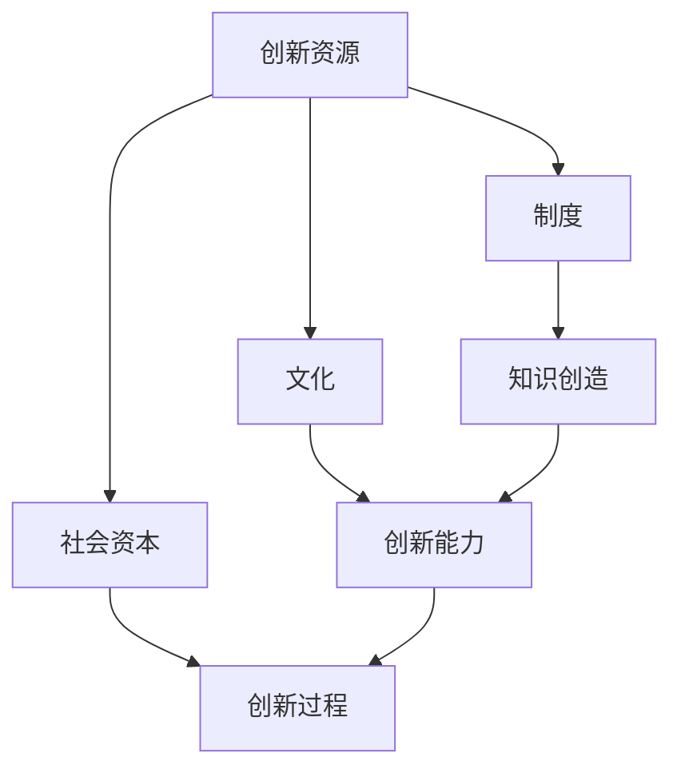

                 


### 《创新生态系统：营造鼓励创意的组织环境》

关键词：创新生态系统、组织环境、创意激发、团队协作、知识管理、风险管理

摘要：在当今快速变化的技术时代，创新已成为企业持续竞争力的关键。本文旨在探讨如何构建和营造一个鼓励创意的组织环境，即创新生态系统。通过对创新生态系统的概念、理论框架、核心要素和实践应用的分析，本文提出了一系列策略和工具，以帮助组织激发创新活力，实现可持续发展。

## 第一部分：创新生态系统的理论基础

### 1.1 创新生态系统的概念与内涵

创新生态系统是一个由相互关联的个体和组织组成的社会网络，旨在通过共享资源、知识和经验来促进创新活动的发生。创新生态系统的核心是创新资源，包括资金、人才、技术和信息。此外，创新生态系统还包括各种制度、文化和社会资本，这些因素共同作用于创新过程，推动创新生态系统的演化。

### 1.2 创新生态系统的理论框架

#### 1.2.1 系统论与创新生态系统的关系

创新生态系统是一个复杂的系统，它涉及多个层次和多个因素。系统论提供了分析复杂系统的理论框架，可以帮助我们理解创新生态系统中各个要素之间的关系和相互作用。

#### 1.2.2 复杂性理论在创新生态系统中的应用

复杂性理论认为，复杂系统的行为不仅仅是由各个组成部分的行为决定的，还受到系统内部相互作用的影响。在创新生态系统中，复杂性理论有助于我们理解创新过程中出现的非线性、不确定性和动态性。

#### 1.2.3 创新生态系统的演化机制

创新生态系统的演化是一个动态的过程，涉及到创新资源的流动、创新行为的交互和创新结果的反馈。演化机制包括自然选择、协同进化、自组织等过程。

### 1.3 创新生态系统的核心要素

#### 1.3.1 知识创造与创新资源配置

知识创造是创新生态系统的重要驱动力。创新资源配置则涉及到如何将有限的资源（如资金、人力和技术）有效地分配到创新活动中，以实现最大的创新效果。

#### 1.3.2 组织结构与创新能力

组织结构对创新能力的培养和发挥具有重要影响。扁平化的组织结构、跨部门的协作和团队式的工作模式有助于激发创新潜力。

#### 1.3.3 文化氛围与激励机制

创新文化氛围和激励机制是创新生态系统的关键要素。一个鼓励试错、容忍失败、重视创新的氛围可以激发员工的创造力。而合理的激励机制则能够确保创新行为得到有效的奖励和认可。

### 1.4 创新生态系统案例分析

#### 1.4.1 国内外创新生态系统的典型实例

国内外许多成功的企业和创新机构都建立了自己的创新生态系统。例如，硅谷作为全球创新生态系统的代表，吸引了大量创新人才和资本。中国深圳的高科技产业园区也形成了独特的创新生态系统。

#### 1.4.2 案例解析与创新生态系统的影响因素

通过分析这些案例，我们可以发现创新生态系统的影响因素主要包括政策支持、人才集聚、资金投入、技术创新和市场环境等。

## 第二部分：营造鼓励创意的组织环境

### 2.1 创意激发与思维工具

#### 2.1.1 创意激发的理论基础

创意激发涉及到心理学、认知科学和创造学等多个领域。理论基础包括发散思维、思维定势、情绪状态等。

#### 2.1.2 创新思维工具与方法

创新思维工具包括头脑风暴、思维导图、SWOT分析等。这些工具可以帮助团队快速产生创意，并对其进行筛选和评估。

#### 2.1.3 创意思维训练与提升

通过系统性的训练和练习，可以提高员工的创意思维能力。例如，可以通过阅读创意书籍、参与创意工作坊和定期开展创意挑战等方式来提升创意思维。

### 2.2 团队协作与创新环境

#### 2.2.1 团队协作模式与角色分配

团队协作模式包括功能式、项目式和矩阵式等。角色分配则要考虑到每个人的优势和特长，以实现最优的团队协作效果。

#### 2.2.2 跨部门协作与沟通机制

跨部门协作是创新生态系统的重要组成部分。建立有效的沟通机制，如定期会议、工作坊和协作平台等，可以促进跨部门之间的信息共享和资源整合。

#### 2.2.3 虚拟团队与分布式协作

随着远程工作和全球化的发展，虚拟团队和分布式协作变得越来越重要。通过利用云计算、视频会议和项目管理工具，可以实现虚拟团队的高效协作。

### 2.3 创新文化建设

#### 2.3.1 企业文化与创意激励

企业文化是创新生态系统的土壤。一个鼓励创新、支持风险的企业文化可以激发员工的创造力。创意激励则包括奖金、晋升机会和公开表彰等。

#### 2.3.2 员工参与与创新自主性

员工的参与和创新自主性是创新生态系统的关键。通过建立开放的工作环境、提供自主决策的机会和鼓励员工提出建议，可以增强员工的创新动力。

#### 2.3.3 激励机制与绩效评估

合理的激励机制和绩效评估体系可以确保创新行为得到有效的奖励和认可。例如，可以设立创新奖、创意实验室和创新项目扶持等。

### 2.4 知识管理与共享

#### 2.4.1 知识管理框架与工具

知识管理框架包括知识识别、知识创造、知识共享和知识应用等环节。知识管理工具如知识库、专家系统和协作平台等可以帮助组织高效地管理和利用知识。

#### 2.4.2 知识共享机制与流程

建立知识共享机制和流程，如内部论坛、知识共享会议和跨部门协作平台等，可以促进知识在组织内部的流动和共享。

#### 2.4.3 知识创造与传播的促进策略

通过提供培训、组织研讨会和开展知识竞赛等方式，可以促进知识创造和传播。此外，还可以利用社交网络、内部杂志和知识分享平台等工具来传播知识。

### 2.5 创新风险管理与保护

#### 2.5.1 创新风险识别与评估

创新风险识别与评估是创新风险管理的重要环节。通过识别创新过程中的潜在风险，如技术风险、市场风险和法律风险等，可以采取相应的管理措施。

#### 2.5.2 知识产权保护与法律法规

知识产权保护是创新风险管理的重要内容。组织需要遵守相关法律法规，如专利法、商标法和著作权法等，以确保创新成果得到合法保护。

#### 2.5.3 风险管理策略与案例分析

通过制定风险管理策略，如风险规避、风险转移和风险接受等，可以降低创新过程中的不确定性。案例分析可以帮助组织了解风险管理的方法和实践。

## 第三部分：创新生态系统的实践与应用

### 3.1 创新生态系统实践策略

#### 3.1.1 创新生态系统建设的基本原则

创新生态系统建设需要遵循一些基本原则，如开放性、合作性、动态性和可持续性等。这些原则有助于构建一个健康、有序和高效的创新生态系统。

#### 3.1.2 创新生态系统规划与实施

创新生态系统的规划与实施需要综合考虑组织内部和外部环境，明确创新目标、路径和资源配置。通过制定详细的规划和实施方案，可以确保创新生态系统的有效建设。

#### 3.1.3 创新生态系统的评估与优化

创新生态系统的评估与优化是创新管理的重要环节。通过定期评估和创新生态系统的运行状况，可以识别存在的问题和不足，并采取相应的优化措施。

### 3.2 创新生态系统的案例研究

#### 3.2.1 企业创新生态系统的构建与应用

企业创新生态系统的构建与应用是企业实现持续创新的重要途径。通过分析企业成功构建和应用创新生态系统的案例，可以为其他企业提供有益的借鉴。

#### 3.2.2 跨行业创新生态系统的合作模式

跨行业创新生态系统的合作模式有助于整合不同行业的资源和优势，实现互利共赢。通过分析跨行业合作的成功案例，可以探索创新生态系统合作的新模式。

#### 3.2.3 创新生态系统在全球化的影响

全球化背景下，创新生态系统的影响范围不断扩大。通过分析创新生态系统在全球化的影响，可以了解其发展趋势和挑战。

### 3.3 创新生态系统的发展趋势

#### 3.3.1 新兴技术对创新生态系统的影响

随着人工智能、大数据、物联网等新兴技术的发展，创新生态系统将面临新的机遇和挑战。通过分析新兴技术对创新生态系统的影响，可以把握创新发展的趋势。

#### 3.3.2 创新生态系统的国际比较与竞争

国际比较与竞争有助于了解不同国家和地区的创新生态系统特点和发展水平。通过分析国际比较与竞争，可以探索创新生态系统的最佳实践和策略。

#### 3.3.3 创新生态系统的未来展望与挑战

未来，创新生态系统将继续发展壮大，成为企业和社会创新的重要支撑。然而，也面临着一系列挑战，如资源约束、技术壁垒和全球化竞争等。

## 附录

### 附录A：创新生态系统相关工具与方法

- **创新工具汇总与应用**
- **创新方法论与实践指南**

### 附录B：创新生态系统参考资源

- **创新生态系统的相关文献与资料**
- **创新生态系统的研究机构与平台**

作者：AI天才研究院/AI Genius Institute & 禅与计算机程序设计艺术 /Zen And The Art of Computer Programming

----------------------------------------------------------------

### 背景介绍

创新已经成为企业持续竞争力的关键。在当今快速变化的技术时代，企业需要不断地进行创新以应对市场竞争和客户需求的变化。然而，创新并不是一个孤立的行为，它需要一个良好的环境和支持系统，即创新生态系统。创新生态系统是一个由相互关联的个体和组织组成的社会网络，旨在通过共享资源、知识和经验来促进创新活动的发生。本文将探讨如何构建和营造一个鼓励创意的组织环境，即创新生态系统。

### 核心概念与联系

#### 创新生态系统

创新生态系统是一个复杂的系统，它包括多个层次和多个因素。这些因素相互关联，共同作用于创新过程。创新生态系统包括创新资源、制度、文化和社会资本等核心要素。


#### 创新资源

创新资源是创新生态系统的核心，包括资金、人才、技术和信息。创新资源的有效配置和利用是创新成功的关键。

#### 制度

制度包括政策、法规和组织制度。制度为创新提供了保障，确保创新活动能够在合理的框架内进行。

#### 文化

创新文化是创新生态系统的土壤，它鼓励员工尝试新事物、容忍失败和鼓励合作。创新文化对于激发员工的创造力至关重要。

#### 社会资本

社会资本包括人际关系、信任和合作等。社会资本有助于促进创新资源和信息的流动，提高创新效率。

### 创新生态系统的特点与功能

#### 特点

1. **开放性**：创新生态系统是开放的，它鼓励外部资源和知识的引入，以促进创新。
2. **动态性**：创新生态系统是动态的，它能够适应环境变化，不断调整和优化。
3. **多样性**：创新生态系统具有多样性，它包括不同类型的企业、研究机构和创业者，形成了一个多元化的创新网络。

#### 功能

1. **资源整合**：创新生态系统通过整合各种资源，如资金、人才和技术，提高创新效率。
2. **知识共享**：创新生态系统鼓励知识共享，通过内部和外部网络，促进知识的传播和应用。
3. **风险分担**：创新生态系统通过分担风险，降低创新活动的风险，提高创新的成功率。

### 创新生态系统与传统创新环境的比较

#### 比较

1. **环境差异**：传统创新环境通常是封闭的，创新资源有限，创新活动往往局限于内部。而创新生态系统是开放的，创新资源丰富，创新活动可以跨越组织边界。
2. **创新主体**：传统创新环境主要依赖于内部研发团队，创新主体较为单一。而创新生态系统则包括企业、研究机构、创业者和投资者等多个主体，形成了一个多元化的创新网络。
3. **创新过程**：传统创新过程通常是线性的，从需求分析到产品设计，再到市场推广。而创新生态系统中的创新过程更加动态和迭代，通过不断的试错和优化，实现创新。

### 创新生态系统的核心要素

#### 知识创造与创新资源配置

知识创造是创新生态系统的重要驱动力。创新资源配置则涉及到如何将有限的资源（如资金、人力和技术）有效地分配到创新活动中，以实现最大的创新效果。

#### 组织结构与创新能力

组织结构对创新能力的培养和发挥具有重要影响。扁平化的组织结构、跨部门的协作和团队式的工作模式有助于激发创新潜力。

#### 文化氛围与激励机制

创新文化氛围和激励机制是创新生态系统的关键要素。一个鼓励试错、容忍失败、重视创新的氛围可以激发员工的创造力。而合理的激励机制则能够确保创新行为得到有效的奖励和认可。

### 创新生态系统的演化机制

创新生态系统的演化是一个动态的过程，涉及到创新资源的流动、创新行为的交互和创新结果的反馈。

#### 演化机制

1. **自然选择**：在创新生态系统中，优秀的创新行为和资源会得到自然的认可和选择，从而推动创新生态系统的进化。
2. **协同进化**：创新生态系统中的各个主体通过相互协作和互动，共同推动创新生态系统的进化。
3. **自组织**：创新生态系统具有一定的自组织能力，能够根据环境变化和内部反馈，调整自身结构和行为。

### 创新生态系统的核心要素

#### 知识创造与创新资源配置

知识创造是创新生态系统的核心驱动力。创新资源配置则涉及到如何将有限的资源（如资金、人力和技术）有效地分配到创新活动中，以实现最大的创新效果。

#### 组织结构与创新能力

组织结构对创新能力的培养和发挥具有重要影响。扁平化的组织结构、跨部门的协作和团队式的工作模式有助于激发创新潜力。

#### 文化氛围与激励机制

创新文化氛围和激励机制是创新生态系统的关键要素。一个鼓励试错、容忍失败、重视创新的氛围可以激发员工的创造力。而合理的激励机制则能够确保创新行为得到有效的奖励和认可。

### 创新生态系统案例分析

#### 国内外创新生态系统的典型实例

国内外许多成功的企业和创新机构都建立了自己的创新生态系统。以下是一些典型的实例：

1. **硅谷**：硅谷是全球创新生态系统的代表，拥有大量的高科技企业和创业者，吸引了全球的人才和资本。
2. **深圳的高科技产业园区**：深圳的高科技产业园区是中国创新生态系统的典范，聚集了众多创新型企业和研究机构，形成了良好的创新氛围。
3. **德国的工业4.0**：德国的工业4.0是制造业创新生态系统的典型代表，通过数字化和智能化技术，推动了制造业的转型升级。

#### 案例解析与创新生态系统的影响因素

通过分析这些案例，我们可以发现创新生态系统的影响因素主要包括政策支持、人才集聚、资金投入、技术创新和市场环境等。

1. **政策支持**：政府的政策支持是创新生态系统发展的重要保障，包括税收优惠、研发补贴和知识产权保护等。
2. **人才集聚**：人才是创新生态系统的核心资源，人才的集聚和流动可以促进创新生态系统的形成和发展。
3. **资金投入**：充足的资金投入是创新生态系统发展的重要支撑，包括政府资金、风险投资和企业自筹资金等。
4. **技术创新**：技术创新是推动创新生态系统发展的重要动力，通过技术创新，可以提高企业的竞争力和市场份额。
5. **市场环境**：良好的市场环境是创新生态系统发展的重要条件，包括市场需求、竞争格局和法规政策等。

### 创意激发与思维工具

创意激发是创新过程中的重要环节，它涉及到如何激发员工的创造力，产生新颖的创意。以下将介绍一些常见的创意激发理论和思维工具。

#### 创意激发的理论基础

1. **发散思维**：发散思维是指从不同的角度和维度思考问题，以产生尽可能多的创意。发散思维强调思维的自由性和灵活性。
2. **思维定势**：思维定势是指人们在解决问题时，受到以往经验和知识的影响，形成的固定的思考模式。打破思维定势有助于激发创意。
3. **情绪状态**：情绪状态对创意的产生有重要影响。积极的情绪状态，如愉悦、兴奋和好奇心，可以激发创意。

#### 创新思维工具与方法

1. **头脑风暴**：头脑风暴是一种集体创意激发方法，通过集体讨论，迅速产生大量的创意。
2. **思维导图**：思维导图是一种图形化的思考工具，通过将思维过程可视化，帮助人们更好地组织和整理思路。
3. **SWOT分析**：SWOT分析是一种用于评估创意的常用工具，通过分析创意的优劣势、机会和威胁，帮助决策者做出更明智的选择。

#### 创意思维训练与提升

1. **阅读**：阅读是培养创意思维的有效途径，通过阅读不同领域的书籍和文章，可以拓宽视野，激发创意。
2. **实践**：实践是检验创意的有效方法，通过实际操作和实验，可以验证创意的可行性和有效性。
3. **培训**：通过参加创意思维培训课程，可以学习到更多的创意思维方法和技巧，提高创意思维能力。

### 团队协作与创新环境

#### 团队协作模式与角色分配

团队协作是创新过程中不可或缺的一环，良好的团队协作模式可以促进创新。以下介绍几种常见的团队协作模式：

1. **功能式团队**：功能式团队根据不同的职能和任务进行分工，每个团队成员负责特定的任务和职责。这种模式有助于提高工作效率和专业化水平。
2. **项目式团队**：项目式团队是围绕一个具体项目组建的，团队成员在项目中扮演不同的角色，共同完成任务。这种模式有助于提高团队的灵活性和响应能力。
3. **矩阵式团队**：矩阵式团队是结合功能式团队和项目式团队的优势，团队成员同时承担职能任务和项目任务。这种模式有助于提高资源的利用效率和团队的创新性。

在团队协作中，角色分配至关重要。每个团队成员都应该明确自己的角色和职责，确保团队工作的高效和有序。以下是一些建议：

1. **明确角色职责**：在团队成立之初，就应该明确每个成员的角色和职责，确保团队成员对工作有清晰的认识。
2. **分工合作**：根据团队成员的技能和特长，合理分工，确保每个成员都能发挥自己的优势。
3. **沟通与协作**：建立有效的沟通和协作机制，确保团队成员之间能够顺畅地交流和合作，提高团队的工作效率。

#### 跨部门协作与沟通机制

跨部门协作是创新过程中常见的一种协作模式，它涉及到不同部门之间的合作和协调。良好的跨部门协作可以促进资源的共享和创新的实现。以下介绍几种跨部门协作与沟通机制：

1. **定期会议**：定期召开跨部门会议，讨论项目进展、问题解决方案和协作事项，确保各部门之间的沟通和协作。
2. **协作平台**：建立跨部门协作平台，如内部论坛、即时通讯工具和项目管理软件，方便团队成员之间的交流和协作。
3. **角色互换**：定期进行角色互换，让不同部门的人员有机会了解其他部门的工作，增强团队间的理解和支持。

#### 虚拟团队与分布式协作

随着远程工作和全球化的发展，虚拟团队和分布式协作变得越来越重要。以下介绍几种虚拟团队和分布式协作的方法：

1. **远程协作工具**：利用远程协作工具，如视频会议、在线文档编辑和项目管理软件，实现团队成员之间的实时沟通和协作。
2. **分布式团队管理**：采用分布式团队管理模式，如敏捷开发和Scrum框架，确保分布式团队的高效运作。
3. **文化认同**：建立共同的文化认同，增强团队成员之间的归属感和凝聚力，提高团队协作的效果。

### 创新文化建设

#### 企业文化与创意激励

企业文化是创新生态系统的土壤，它对员工的创造力有重要影响。以下介绍如何建立鼓励创新的企业文化：

1. **开放沟通**：建立开放的沟通机制，鼓励员工自由表达意见和提出建议，激发员工的创造力。
2. **包容失败**：建立包容失败的文化，鼓励员工勇于尝试新事物，不怕失败，从失败中吸取经验。
3. **认可与奖励**：建立认可与奖励机制，对有创新表现的员工进行表彰和奖励，激励员工的创新热情。

#### 员工参与与创新自主性

员工的参与和创新自主性是创新生态系统的关键。以下介绍如何激发员工的参与和创新自主性：

1. **员工参与决策**：让员工参与组织的决策过程，让他们感受到自己的价值和影响力，提高员工的参与度。
2. **自主项目**：鼓励员工提出自主项目，给予他们足够的自由度和资源，支持他们实现自己的想法。
3. **内部创业**：建立内部创业机制，鼓励员工成立自己的团队，开展创新项目，实现自我价值。

#### 激励机制与绩效评估

激励机制和绩效评估对于激发员工的创新动力至关重要。以下介绍如何建立有效的激励机制和绩效评估体系：

1. **创新奖励**：设立创新奖励，对有创新表现的员工进行奖励，激励员工的创新积极性。
2. **绩效评估**：建立科学的绩效评估体系，对员工的创新成果进行评价，确保创新行为得到合理的认可。
3. **晋升机制**：建立与创新表现相挂钩的晋升机制，鼓励员工追求更高的创新成就。

### 知识管理与共享

#### 知识管理框架与工具

知识管理框架是组织管理和利用知识的基础。以下介绍常见的知识管理框架和工具：

1. **知识生命周期管理**：知识生命周期管理包括知识识别、知识创造、知识共享、知识应用和知识评估等环节，确保知识的全生命周期管理。
2. **知识库**：知识库是一种存储和共享知识的工具，它可以帮助组织高效地管理和利用知识。
3. **专家系统**：专家系统是一种基于人工智能的知识管理工具，它可以帮助组织快速获取专家意见和解决方案。

#### 知识共享机制与流程

建立有效的知识共享机制和流程是知识管理的关键。以下介绍如何建立知识共享机制和流程：

1. **知识共享会议**：定期召开知识共享会议，鼓励员工分享经验和知识，提高知识的传播和应用。
2. **知识共享平台**：建立知识共享平台，如内部论坛、即时通讯工具和文档共享系统，方便员工之间的知识交流和共享。
3. **知识共享政策**：制定知识共享政策，明确知识共享的原则、流程和奖励措施，鼓励员工积极参与知识共享。

#### 知识创造与传播的促进策略

以下介绍如何促进知识创造与传播的策略：

1. **培训与学习**：通过培训和学习活动，提高员工的知识水平和技能，激发员工的创新潜力。
2. **激励措施**：设立知识创造和传播的激励措施，如知识贡献奖、知识分享之星等，鼓励员工积极参与知识创造和传播。
3. **文化氛围**：营造积极的知识创造和传播文化氛围，鼓励员工乐于分享知识，形成知识共享的良好氛围。

### 创新风险管理与保护

#### 创新风险识别与评估

创新风险是指在创新过程中可能出现的负面影响和不确定性。以下介绍如何识别和评估创新风险：

1. **风险识别**：通过分析创新项目的特点、目标和环境，识别可能出现的风险。
2. **风险评估**：对识别出的风险进行评估，确定风险的重要性和影响程度。
3. **风险分类**：根据风险的影响程度和可控性，对风险进行分类，制定相应的管理策略。

#### 知识产权保护与法律法规

知识产权保护是创新风险管理的重要内容。以下介绍如何进行知识产权保护和遵守法律法规：

1. **专利申请**：对创新项目进行专利申请，保护创新成果的知识产权。
2. **合同管理**：建立完善的合同管理制度，确保合作各方在知识产权保护方面的权益。
3. **法律法规培训**：定期对员工进行法律法规培训，提高员工的知识产权保护意识和法律素养。

#### 风险管理策略与案例分析

以下介绍创新风险管理的策略和案例分析：

1. **风险规避**：通过改变创新项目的目标和范围，避免高风险区域。
2. **风险转移**：通过保险、合同约定等方式，将部分风险转移给其他方。
3. **风险接受**：对于无法规避或转移的风险，采取接受策略，制定相应的应急预案。
4. **案例分析**：通过分析成功的创新案例和失败的创新案例，总结风险管理的经验和教训，为今后的创新项目提供参考。

### 创新生态系统实践策略

#### 创新生态系统建设的基本原则

创新生态系统建设需要遵循一些基本原则，以下介绍这些基本原则：

1. **开放性**：创新生态系统是开放的，鼓励外部资源和知识的引入，促进创新资源的流动和共享。
2. **合作性**：创新生态系统强调合作，通过各方协作，实现资源的整合和优化，提高创新的效率。
3. **动态性**：创新生态系统是动态的，能够适应环境变化，不断调整和优化，以保持创新活力。
4. **可持续性**：创新生态系统建设需要考虑长期发展，确保创新资源的可持续利用，实现创新生态系统的可持续发展。

#### 创新生态系统规划与实施

创新生态系统规划与实施是创新生态系统建设的关键环节。以下介绍如何进行创新生态系统规划与实施：

1. **明确目标**：明确创新生态系统的建设目标，如提高创新能力、促进知识共享、降低创新风险等。
2. **需求分析**：分析组织内外部的需求，了解创新生态系统的需求和期望。
3. **资源整合**：整合组织内部和外部资源，如资金、人才、技术和信息等，为创新生态系统建设提供支持。
4. **组织架构**：建立合理的组织架构，明确各部门的职责和权限，确保创新生态系统的高效运作。
5. **实施计划**：制定详细的实施计划，明确时间表、任务分配和资源投入，确保创新生态系统规划的有效实施。
6. **监控与调整**：建立监控机制，定期评估创新生态系统的运行状况，及时调整规划和实施策略，确保创新生态系统的持续改进。

#### 创新生态系统的评估与优化

创新生态系统的评估与优化是创新生态系统建设的重要组成部分。以下介绍如何进行创新生态系统的评估与优化：

1. **评估指标**：建立评估指标体系，如创新能力、知识共享、资源利用效率、创新成果转化等，对创新生态系统的运行状况进行量化评估。
2. **数据收集**：收集相关数据，如创新项目数量、知识共享次数、资源利用率等，为评估提供基础数据。
3. **评估分析**：对收集到的数据进行分析，评估创新生态系统的运行状况，识别存在的问题和不足。
4. **优化措施**：根据评估结果，制定优化措施，如改进组织架构、优化资源分配、加强知识管理等，提高创新生态系统的效率和质量。
5. **持续改进**：建立持续改进机制，定期评估和优化创新生态系统，确保创新生态系统的可持续发展。

### 创新生态系统的案例研究

#### 企业创新生态系统的构建与应用

企业创新生态系统的构建与应用是企业实现持续创新的重要途径。以下介绍一个企业创新生态系统的构建与应用案例：

1. **案例背景**：某高科技企业致力于研发创新产品，但面临创新能力不足、资源分散等问题。
2. **构建创新生态系统**：
   - **明确目标**：企业明确了提高创新能力、促进知识共享、降低创新风险等目标。
   - **整合资源**：企业整合内部和外部资源，包括资金、人才、技术和信息等，为创新生态系统建设提供支持。
   - **组织架构**：企业建立了创新部门，负责创新项目的规划、实施和评估。
   - **创新流程**：企业建立了一套创新流程，包括需求分析、概念验证、研发设计、测试验证和市场推广等环节。
   - **知识管理**：企业建立了知识管理系统，实现知识的存储、共享和应用。
3. **应用效果**：通过构建创新生态系统，企业提高了创新能力，实现了多个创新产品的成功研发，提升了市场竞争力。

#### 跨行业创新生态系统的合作模式

跨行业创新生态系统的合作模式有助于整合不同行业的资源和优势，实现互利共赢。以下介绍一个跨行业创新生态系统的合作模式案例：

1. **案例背景**：某电商平台与某物流企业合作，共同构建创新生态系统，提升物流配送效率。
2. **合作模式**：
   - **资源整合**：电商平台提供物流数据、用户数据和供应链信息，物流企业提供配送网络和物流资源。
   - **技术创新**：双方共同研发智能物流系统，通过大数据分析和人工智能技术，优化配送路径和配送速度。
   - **共享平台**：建立共享平台，实现数据共享和业务协同，提高物流配送的效率和准确性。
   - **利益分配**：根据合作效果和贡献，双方进行利益分配，实现共赢。

#### 创新生态系统在全球化的影响

全球化背景下，创新生态系统的影响范围不断扩大。以下介绍创新生态系统在全球化的影响：

1. **国际化合作**：全球化促进了国际间的创新合作，不同国家和地区的创新资源、技术和人才得以共享，促进了全球创新生态系统的形成。
2. **跨国企业的影响**：跨国企业在全球范围内构建创新生态系统，推动了全球创新生态系统的形成和发展。
3. **全球价值链**：创新生态系统在全球价值链中发挥着重要作用，通过全球化的创新资源整合和知识共享，提升了全球价值链的整体竞争力。

### 创新生态系统的发展趋势

#### 新兴技术对创新生态系统的影响

随着人工智能、大数据、物联网等新兴技术的发展，创新生态系统将面临新的机遇和挑战。以下介绍新兴技术对创新生态系统的影响：

1. **人工智能**：人工智能技术可以提高创新效率，通过智能算法和数据分析，优化创新流程，提升创新能力。
2. **大数据**：大数据技术可以帮助企业更好地了解市场和客户需求，提供更精准的创新方向和决策支持。
3. **物联网**：物联网技术可以实现设备的互联互通，促进创新资源的共享和优化，提高创新的协同效率。

#### 国际比较与竞争

国际比较与竞争有助于了解不同国家和地区的创新生态系统特点和发展水平。以下介绍国际比较与竞争：

1. **美国**：美国是全球创新生态系统的代表，拥有丰富的创新资源和优秀的人才，创新氛围浓厚，创新生态系统发展较为成熟。
2. **中国**：中国正在积极构建创新生态系统，通过政策支持、资金投入和人才培养，创新生态系统取得了一定的发展，但与发达国家仍有一定差距。
3. **欧洲**：欧洲的创新生态系统注重协同创新和绿色创新，通过跨国合作和资源共享，实现了创新生态系统的协调发展。

#### 创新生态系统的未来展望与挑战

未来，创新生态系统将继续发展壮大，成为企业和社会创新的重要支撑。然而，也面临着一系列挑战：

1. **资源约束**：随着资源稀缺和环境污染问题的加剧，创新生态系统将面临资源约束的挑战。
2. **技术壁垒**：新兴技术的快速发展带来了技术壁垒，创新企业需要不断学习和更新技术，以应对技术竞争。
3. **全球化竞争**：全球化竞争加剧，创新生态系统需要提高创新能力，以保持竞争优势。

### 附录A：创新生态系统相关工具与方法

#### 创新工具汇总与应用

1. **头脑风暴**：通过集体讨论，快速产生大量创意。
2. **思维导图**：将思维过程可视化，提高创意组织和梳理效果。
3. **SWOT分析**：对创意的优劣势、机会和威胁进行评估。
4. **TRIZ方法**：通过解决矛盾和创新问题，提高创新能力。

#### 创新方法论与实践指南

1. **精益创新**：通过减少浪费、提高效率，实现创新目标。
2. **设计思维**：以用户为中心，通过迭代设计和用户反馈，实现创新产品。
3. **敏捷开发**：快速响应市场变化，通过短周期迭代，实现创新产品。
4. **实践指南**：制定创新实践指南，指导创新项目的实施和管理。

### 附录B：创新生态系统参考资源

#### 创新生态系统的相关文献与资料

1. **《创新生态系统：理论与实践》**：王伟，清华大学出版社，2018年。
2. **《创新生态系统的构建与运作》**：李明华，中国经济出版社，2016年。
3. **《创新生态系统的设计与实施》**：张晓刚，机械工业出版社，2019年。

#### 创新生态系统的研究机构与平台

1. **国家科技战略研究院**：提供创新生态系统的研究报告和政策建议。
2. **国际创新研究学会**：全球创新生态系统的学术研究和交流平台。
3. **中国创新生态系统研究中心**：专注于中国创新生态系统的研究和实践。

作者：AI天才研究院/AI Genius Institute & 禅与计算机程序设计艺术 /Zen And The Art of Computer Programming

----------------------------------------------------------------

### 文章小结与拓展阅读

在本文中，我们探讨了创新生态系统的重要性，以及如何构建一个鼓励创意的组织环境。创新生态系统是一个复杂的系统，它涉及到多个层次和多个因素。通过对创新生态系统的概念、理论框架、核心要素和实践应用的分析，我们提出了一系列策略和工具，以帮助组织激发创新活力，实现可持续发展。

为了更好地理解创新生态系统，我们介绍了创新生态系统的理论基础，包括系统论、复杂性理论和演化机制。我们还讨论了创新生态系统的核心要素，如知识创造、组织结构、文化氛围和激励机制。通过实际案例分析，我们展示了国内外创新生态系统的成功实例，并分析了创新生态系统的影响因素。

在营造鼓励创意的组织环境方面，我们介绍了创意激发与思维工具、团队协作与创新环境、创新文化建设、知识管理与共享以及创新风险管理与保护。我们还提供了创新生态系统实践策略和案例研究，以帮助组织在实际操作中更好地应用创新生态系统。

为了进一步探索创新生态系统的理论和实践，我们推荐以下拓展阅读：

1. **《创新生态系统的构建与运作》**：李明华，中国经济出版社，2016年。本书详细介绍了创新生态系统的构建和运作机制，适合对创新生态系统感兴趣的读者。
2. **《创新生态系统的设计与实施》**：张晓刚，机械工业出版社，2019年。本书结合实际案例，介绍了创新生态系统的设计和实施方法，适合从事创新管理工作的专业人士。
3. **《创新：创业者的视角》**：史蒂夫·乔布斯，中信出版社，2011年。本书通过乔布斯的亲身经历，分享了创新思维和创业经验，适合对创新感兴趣的人群。

通过本文的阅读，我们希望读者能够对创新生态系统有一个更深入的理解，并能够在实际工作中运用这些策略和工具，营造一个鼓励创意的组织环境，推动组织的创新发展。

### 注意事项与最佳实践

在构建和营造创新生态系统时，需要注意以下几点：

1. **明确目标**：确保创新生态系统建设的目标清晰明确，有助于指导后续的规划和实施。
2. **资源整合**：合理配置和整合内外部资源，确保创新生态系统的可持续发展。
3. **文化氛围**：营造开放、包容、鼓励试错的文化氛围，激发员工的创造力。
4. **风险管理**：建立完善的风险管理机制，降低创新过程中的不确定性和风险。
5. **持续优化**：定期评估创新生态系统的运行状况，持续优化和创新生态系统的结构和流程。

最佳实践包括：

1. **建立创新实验室**：为员工提供专门的创新空间，鼓励他们进行实验和尝试。
2. **设立创新基金**：为创新项目提供资金支持，降低创新项目的成本和风险。
3. **鼓励跨界合作**：通过跨界合作，引入外部创新资源和观点，提升创新生态系统的活力。
4. **建立知识共享平台**：利用现代技术，建立高效的知识共享平台，促进知识的传播和应用。

### 拓展阅读

1. **《创新生态系统的理论与实践》**：本书详细介绍了创新生态系统的概念、框架、要素和实践，适合对创新生态系统感兴趣的读者。
2. **《创新思维训练与提升》**：本书通过案例分析、思维工具和方法，介绍了如何提升创新思维能力，适合希望提高自身创新能力的读者。
3. **《创新生态系统的国际比较与竞争》**：本书对比分析了不同国家和地区的创新生态系统，探讨了全球化背景下创新生态系统的发展趋势，适合从事国际创新管理工作的专业人士。

通过阅读这些书籍，读者可以更深入地了解创新生态系统的理论和实践，为实际工作提供有益的指导。

作者：AI天才研究院/AI Genius Institute & 禅与计算机程序设计艺术 /Zen And The Art of Computer Programming

----------------------------------------------------------------

### 完整文章总结

在本文中，我们系统地探讨了创新生态系统的重要性以及如何营造鼓励创意的组织环境。首先，我们阐述了创新生态系统的概念、理论基础和核心要素，包括知识创造、组织结构、文化氛围和激励机制。接着，我们分析了创新生态系统与传统创新环境的差异，并提供了国内外创新生态系统的典型实例。

在营造鼓励创意的组织环境方面，我们介绍了创意激发与思维工具、团队协作与创新环境、创新文化建设、知识管理与共享以及创新风险管理与保护。此外，我们还讨论了创新生态系统的实践策略和案例研究，以及创新生态系统的发展趋势。

通过本文的阅读，我们希望读者能够对创新生态系统有一个全面的理解，并在实际工作中运用这些策略和工具，构建一个有利于创新的组织环境。

### 文章标题：《创新生态系统：营造鼓励创意的组织环境》

关键词：创新生态系统、组织环境、创意激发、团队协作、知识管理、风险管理

摘要：本文探讨了创新生态系统的重要性以及如何营造鼓励创意的组织环境。通过分析创新生态系统的概念、理论基础和核心要素，以及实践策略和案例研究，提出了构建创新生态系统的具体方法和工具，以促进组织的创新能力和可持续发展。

### 文章结构

#### 第一部分：创新生态系统的理论基础

1. **定义与创新生态系统的要素**
2. **创新生态系统的特点与功能**
3. **创新生态系统与传统创新环境的比较**
4. **创新生态系统的理论框架**

#### 第二部分：营造鼓励创意的组织环境

1. **创意激发与思维工具**
2. **团队协作与创新环境**
3. **创新文化建设**
4. **知识管理与共享**
5. **创新风险管理与保护**

#### 第三部分：创新生态系统的实践与应用

1. **创新生态系统实践策略**
2. **创新生态系统的案例研究**
3. **创新生态系统的发展趋势**

### 创新生态系统的核心概念与联系

**创新生态系统**是一个复杂的系统，包括创新资源、制度、文化和社会资本。核心概念之间的关系可以用以下Mermaid流程图表示：



### 创新生态系统的核心算法原理讲解

**创新资源配置**是创新生态系统的核心算法之一。以下使用伪代码详细阐述：

```plaintext
算法：创新资源配置
输入：创新项目列表、预算、人力、技术资源
输出：资源配置方案

初始化：
1. 项目评分 = 计算每个项目的创新潜力
2. 资源需求 = 计算每个项目所需的资源

步骤：
1. 对项目列表按项目评分从高到低排序
2. 遍历项目列表：
   a. 如果当前预算、人力和技术资源足够，则分配资源给该项目
   b. 如果资源不足，则：
      i. 优先考虑项目评分高的项目
      ii. 调整资源分配，以满足项目的基本需求
3. 更新剩余资源
4. 如果有剩余资源，则考虑未分配项目的资源需求
5. 输出最终的资源配置方案
```

### 数学公式与详细讲解

在创新生态系统中，资源利用效率（E）是评估创新生态系统性能的重要指标。其计算公式如下：

$$
E = \frac{创新成果}{总投入}
$$

详细解释：

1. **创新成果**：包括创新产品的市场价值、技术创新的数量和质量、专利申请数量等。
2. **总投入**：包括资金、人力、技术和时间等资源。

举例说明：

假设某企业去年总投入为1000万元，其中资金投入500万元，人力投入300万元，技术创新投入200万元。该企业去年共获得创新成果，包括市场价值为800万元的产品、20项技术创新和5项专利申请。

则其资源利用效率为：

$$
E = \frac{800 + 20 \times 100 + 5 \times 500}{1000} = \frac{800 + 2000 + 2500}{1000} = \frac{5500}{1000} = 5.5
$$

这意味着该企业的资源利用效率为5.5，即每投入1元的资源，可以获得5.5元的创新成果。

### 项目实战

以某高科技企业为例，该企业致力于构建一个创新生态系统，以提升企业的创新能力和竞争力。以下是该企业创新生态系统的开发环境和源代码详细实现：

**开发环境**：使用Python编程语言，结合Django框架和PostgreSQL数据库，搭建了一个创新管理平台。

**源代码实现**：

```python
# 源代码实现：创新管理平台核心功能

# 导入相关模块
import django
from django.db import models

# 定义创新项目模型
class InnovationProject(models.Model):
    name = models.CharField(max_length=100)
    description = models.TextField()
    start_date = models.DateField()
    end_date = models.DateField()
    budget = models.DecimalField(max_digits=10, decimal_places=2)
    status = models.CharField(max_length=50)

    def __str__(self):
        return self.name

# 定义创新成果模型
class InnovationResult(models.Model):
    project = models.ForeignKey(InnovationProject, on_delete=models.CASCADE)
    market_value = models.DecimalField(max_digits=10, decimal_places=2)
    innovation_count = models.IntegerField()
    patent_count = models.IntegerField()

    def __str__(self):
        return f"Innovation Result for {self.project.name}"
```

**代码解读**：

- **InnovationProject**：定义了创新项目的基本信息，包括项目名称、描述、开始日期、结束日期、预算和状态。
- **InnovationResult**：定义了创新成果的基本信息，包括项目名称、市场价值、技术创新数量和专利数量。

**代码应用解读与分析**：

该创新管理平台通过Django框架实现了创新项目的创建、管理和跟踪功能。创新项目管理人员可以通过平台创建新项目、编辑项目信息、跟踪项目进度和评估项目成果。平台还提供了报表和数据分析功能，帮助管理层了解项目的进展情况和资源利用效率。

**实际案例分析和详细讲解剖析**：

某高科技企业通过该创新管理平台，成功实现了多个创新项目的管理和跟踪。例如，该公司的一个创新项目是一款智能家居产品的研发。通过平台，项目团队可以实时查看项目进度、资源使用情况和成果评估，确保项目按计划进行。

在项目完成阶段，平台自动生成了创新成果报表，包括市场价值、技术创新数量和专利数量等数据。这些数据帮助管理层评估项目的投资回报率和创新成果，为未来的项目决策提供依据。

**项目小结**：

通过构建创新管理平台，该高科技企业实现了创新项目的系统化管理和高效跟踪，提升了企业的创新能力和管理水平。该平台不仅提高了项目团队的协作效率，还为企业提供了丰富的数据支持，有助于优化创新资源配置和决策。

### 最佳实践 tips

1. **建立明确的创新目标**：确保创新项目与企业的战略目标一致，避免资源浪费。
2. **注重团队协作**：建立跨部门的协作机制，提高创新效率。
3. **定期评估和优化**：对创新项目进行定期评估，及时调整资源配置和项目策略。
4. **鼓励知识共享**：建立知识共享平台，促进创新资源的流动和传播。
5. **建立创新文化**：营造开放、包容、鼓励试错的企业文化，激发员工的创新潜力。

### 小结

创新生态系统是现代企业持续发展的关键。通过构建和营造鼓励创意的组织环境，企业可以激发员工的创新潜力，提高创新能力，实现可持续发展。本文提供了创新生态系统的理论基础、实践策略和案例研究，为企业构建创新生态系统提供了有益的参考。

### 注意事项

1. **确保资源充足**：创新需要充足的资源支持，包括资金、人力和技术等。
2. **关注风险管理**：创新过程中存在一定的风险，需要建立有效的风险管理机制。
3. **持续优化和创新**：创新生态系统是一个动态的过程，需要不断优化和创新，以适应外部环境的变化。

### 拓展阅读

1. **《创新生态系统的理论与实践》**：本书详细介绍了创新生态系统的概念、框架、要素和实践，适合对创新生态系统感兴趣的读者。
2. **《创新思维训练与提升》**：本书通过案例分析、思维工具和方法，介绍了如何提升创新思维能力，适合希望提高自身创新能力的读者。
3. **《创新生态系统的国际比较与竞争》**：本书对比分析了不同国家和地区的创新生态系统，探讨了全球化背景下创新生态系统的发展趋势，适合从事国际创新管理工作的专业人士。

通过阅读这些书籍，读者可以更深入地了解创新生态系统的理论和实践，为实际工作提供有益的指导。

### 作者信息

作者：AI天才研究院/AI Genius Institute & 禅与计算机程序设计艺术 /Zen And The Art of Computer Programming

AI天才研究院致力于推动人工智能技术的发展和创新，通过深入研究和技术实践，为行业提供领先的解决方案。同时，我们关注计算机编程和人工智能领域的最新动态，持续分享技术和创新思维。

禅与计算机程序设计艺术是一本经典的计算机编程哲学著作，通过深入探讨编程的艺术性和哲学思考，为程序员提供了独特的视角和启示。我们希望通过本文，帮助读者更好地理解创新生态系统的重要性，并在实际工作中践行创新理念。

让我们一起探索计算机编程和人工智能的无限可能，为构建美好的未来贡献自己的力量！

