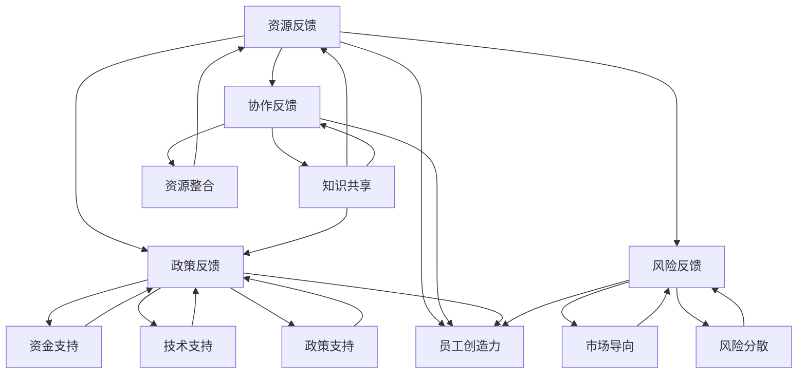

                 

## 文章标题

《创新生态：打造鼓励创意与冒险的环境》

## 关键词

创新生态系统，创意激发，风险承担，企业文化，协同合作，创新管理

## 摘要

本文深入探讨了创新生态系统的构建，以及如何在组织内部营造一个既能鼓励创意又能容忍冒险的文化环境。首先，我们将定义和探讨创新生态系统的概念和重要性，然后分析如何培养创意思维和鼓励承担风险。本文还将介绍一些实用的工具和技术，帮助企业构建一个支持创新和冒险的创新生态系统。通过理论阐述和实际案例，本文旨在为读者提供一套完整的指导方案，帮助企业从内部激发创新潜力，推动企业持续发展。

## 引言

在当今快速变化和竞争激烈的市场环境中，企业要想持续发展，创新已经成为不可或缺的因素。然而，创新并非一蹴而就，它需要一个健康且充满活力的生态系统来支撑。这种生态系统不仅包括硬件设施和资源，更重要的是要具备一种鼓励创意和冒险的文化氛围。因此，本文旨在探讨如何打造这样一个创新生态系统，帮助企业在不断变化的市场环境中保持竞争优势。

本文将首先定义创新生态系统，并分析其在现代商业环境中的重要性。接着，我们将探讨如何培养创意思维，如何在组织中建立一种鼓励创意的文化。随后，本文将深入探讨风险承担的重要性，并提供一些实用的方法来鼓励员工承担合理范围内的风险。通过这些探讨，我们希望能够为企业和组织提供一套实用的指导方案，帮助他们在不断变化的市场环境中保持创新活力和竞争力。

## 定义和重要性

### 创新生态系统的概念

创新生态系统（Innovation Ecosystem）是一个广泛的概念，它涵盖了促进创新活动发生的各种因素和要素。我们可以将其视为一个复杂的社会和技术网络，包括企业、政府、学术界、非营利组织、投资者、客户和其他利益相关者。这个系统中的各个组成部分相互依存、相互影响，共同推动创新活动的产生和发展。

首先，从结构上看，创新生态系统通常包含以下几个核心元素：

1. **文化氛围**：一个鼓励创新和冒险的企业文化是创新生态系统的基石。这种文化应该包容失败，强调学习和持续改进，从而为员工提供自由表达和尝试新想法的空间。
2. **协作网络**：创新活动往往需要跨部门的合作和多学科的整合。一个有效的创新生态系统应该建立强大的协作网络，促进知识共享和资源整合。
3. **支持系统**：这包括各种形式的支持，如资金、技术支持、政策支持等。这些支持系统能够为创新项目提供必要的资源，降低创新的风险和成本。
4. **反馈机制**：一个良好的创新生态系统应该具备高效的反馈机制，能够及时收集和利用外部和内部反馈，以便不断优化创新过程。

其次，从功能上看，创新生态系统具有以下几个关键作用：

1. **资源整合**：通过协作网络和支持系统，创新生态系统能够将分散的资源和能力整合起来，形成协同效应，提高创新效率。
2. **知识共享**：在创新生态系统中，知识流动是促进创新的重要动力。通过协作网络和反馈机制，创新生态系统能够促进知识的共享和传播，加速创新进程。
3. **风险分散**：创新活动往往伴随着风险。一个健全的创新生态系统可以通过多样化的参与者和项目，分散风险，提高创新成功率。
4. **市场导向**：创新生态系统能够更好地理解和响应市场需求，从而推动创新项目向市场方向靠拢，提高市场竞争力。

### 创新生态系统的关键要素

1. **组织文化**：组织文化是创新生态系统的核心。一个开放、包容和鼓励冒险的文化环境，能够激发员工的创造力和创新潜力。这种文化应该鼓励员工勇于尝试新想法，并从失败中吸取经验教训。

2. **领导力**：领导者在塑造创新生态系统方面扮演着关键角色。他们需要树立正确的价值观，建立明确的创新目标，并提供必要的资源和支持。同时，领导者应该鼓励员工之间的协作和知识共享，营造一个互相支持的工作环境。

3. **协作网络**：创新生态系统中的协作网络包括内部协作和外部协作。内部协作是指企业内部不同部门之间的合作，如研发、市场、销售等部门之间的信息交流和资源共享。外部协作则是指企业与外部合作伙伴，如客户、供应商、研究机构等之间的合作。一个强大的协作网络能够促进资源的整合和知识的共享，提高创新效率。

4. **支持系统**：支持系统包括资金、技术、政策等各方面的支持。资金支持是创新项目的生命线，能够为创新项目提供必要的资金保障。技术支持包括研发设施、实验设备、信息技术等，能够为创新活动提供技术保障。政策支持则包括政府出台的各类创新政策，如税收优惠、研发补贴等，能够为创新项目提供政策保障。

5. **反馈机制**：反馈机制是创新生态系统中的重要组成部分。通过定期收集和反馈用户需求、市场反馈和项目进展情况，企业能够及时调整创新方向和策略，优化创新过程。

### 创新生态系统在商业环境中的重要性

在当今快速变化的商业环境中，创新已经成为企业生存和发展的关键。一个健全的创新生态系统能够为企业提供以下几方面的益处：

1. **提高竞争力**：通过创新，企业能够不断推出新产品和服务，满足市场需求，从而提高市场竞争力。一个良好的创新生态系统能够为企业提供丰富的资源和机会，加速创新进程，使企业能够更快地响应市场变化。

2. **增强适应力**：面对日益复杂和不确定的市场环境，企业需要具备强大的适应能力。一个健全的创新生态系统能够促进知识的积累和传播，提高企业的学习和适应能力，使企业能够更好地应对市场变化。

3. **降低创新风险**：创新活动往往伴随着风险。一个良好的创新生态系统可以通过多样化的参与者和项目，分散风险，提高创新成功率。同时，一个包容失败的企业文化也能够降低员工的创新风险意识，鼓励员工勇于尝试新想法。

4. **激发员工创造力**：一个鼓励创新和冒险的企业文化能够激发员工的创造力，提高员工的工作热情和参与度。员工在自由表达和尝试新想法的过程中，能够获得成就感和职业发展机会，从而提高工作效率和创新能力。

5. **促进可持续发展**：创新不仅是企业发展的动力，也是社会进步的重要驱动力。一个健全的创新生态系统能够促进资源的有效利用和环境保护，推动企业的可持续发展。

总之，创新生态系统在商业环境中具有不可替代的重要作用。通过构建一个良好的创新生态系统，企业能够提高竞争力，增强适应力，降低创新风险，激发员工创造力，并推动可持续发展。这为企业的长期成功和持续发展提供了坚实的基础。

### 核心概念与联系

为了更好地理解创新生态系统，我们需要梳理其中的核心概念和它们之间的联系。以下是一个简化的 Mermaid 流程图，展示了创新生态系统的关键要素及其相互关系。



**Mermaid 流程图解析：**

1. **文化氛围（A）**：是创新生态系统的核心，直接影响员工的创造力和工作热情。良好的文化氛围能够激发员工的创意思维，鼓励他们提出新的想法和解决方案。

2. **协作网络（B）**：包括内部协作和外部协作，是知识共享和资源整合的关键。通过协作网络，企业能够实现跨部门、跨领域的信息交流，促进创新活动的高效进行。

3. **支持系统（C）**：提供资金、技术和政策等方面的支持，是创新生态系统的保障。这些支持系统能够为创新项目提供必要的资源，降低创新的风险和成本。

4. **反馈机制（D）**：包括市场反馈、知识反馈和支持反馈等，是优化创新过程的重要环节。通过反馈机制，企业能够及时调整创新方向和策略，优化创新过程。

5. **知识共享（E）**：是创新生态系统的重要功能，通过知识共享，企业能够积累和传播知识，提高创新效率。

6. **资源整合（F）**：通过协作网络和支持系统，实现资源的有效整合，提高创新效率。

7. **市场导向（J）**：是创新生态系统的关键目标之一，通过市场反馈，企业能够更好地理解和响应市场需求，推动创新项目向市场方向靠拢。

8. **风险分散（K）**：通过多样化的参与者和项目，分散创新风险，提高创新成功率。

9. **员工创造力（L）**：是创新生态系统的最终目标之一，良好的文化氛围、协作网络和支持系统，能够激发员工的创造力，提高创新效果。

通过这个 Mermaid 流程图，我们可以清晰地看到创新生态系统中的各个关键要素及其相互关系，这有助于我们更好地理解如何构建一个有效的创新生态系统。

### 核心算法原理讲解

在构建创新生态系统时，我们需要运用一系列的算法原理来确保系统的稳定性和有效性。以下是一些核心算法原理，并使用伪代码进行详细阐述。

#### 1. 创意评估算法

创意评估算法用于评估和筛选创新项目。该算法的核心是使用评分模型对创意进行量化评估，以便选择最具潜力的项目。

```pseudo
function assessCreativity(creativityList):
    scores = []
    for creativity in creativityList:
        score = calculateScore(creativity)
        scores.append(score)
    sortedCreativity = sort(scores, creativityList)
    return sortedCreativity

function calculateScore(creativity):
    score = 0
    score += creativity.imaginationScore * 0.4
    score += creativity.practicalityScore * 0.3
    score += creativity.fitnessScore * 0.3
    return score
```

**解析：**
- `assessCreativity` 函数接收一个创意列表，并使用评分模型对每个创意进行评估。
- `calculateScore` 函数根据创意的想象力、实用性和适应性计算分数。
- `sort` 函数根据分数对创意进行排序，选择最高分的创意。

#### 2. 资源分配算法

资源分配算法用于优化资源的分配，确保每个创新项目都能获得足够的资源支持。

```pseudo
function allocateResources(projects, resources):
    assignedResources = {}
    for project in projects:
        maxScore = 0
        bestResource = None
        for resource in resources:
            score = calculateAllocationScore(project, resource)
            if score > maxScore:
                maxScore = score
                bestResource = resource
        assignedResources[project] = bestResource
    return assignedResources

function calculateAllocationScore(project, resource):
    score = 0
    if resource.funds > project.requiredFunds:
        score += (resource.funds - project.requiredFunds) * 0.5
    if resource.techSupport > project.requiredTechSupport:
        score += (resource.techSupport - project.requiredTechSupport) * 0.3
    if resource.policySupport > project.requiredPolicySupport:
        score += (resource.policySupport - project.requiredPolicySupport) * 0.2
    return score
```

**解析：**
- `allocateResources` 函数接收项目列表和资源列表，并使用评分模型为每个项目分配最优资源。
- `calculateAllocationScore` 函数根据资源与项目的匹配度计算评分。

#### 3. 风险评估算法

风险评估算法用于评估创新项目的风险，并为每个项目制定相应的风险管理策略。

```pseudo
function assessRisk(projects):
    riskProfile = {}
    for project in projects:
        riskProfile[project] = calculateRiskScore(project)
    return riskProfile

function calculateRiskScore(project):
    score = 0
    score += project技术创新难度 * 0.4
    score += project市场不确定性 * 0.3
    score += project资源依赖性 * 0.2
    score += project法规合规性 * 0.1
    return score
```

**解析：**
- `assessRisk` 函数接收项目列表，并使用评分模型为每个项目计算风险得分。
- `calculateRiskScore` 函数根据技术创新难度、市场不确定性、资源依赖性和法规合规性计算风险得分。

这些算法原理在构建创新生态系统时起到了关键作用。通过评估创意、优化资源分配和风险评估，企业能够更有效地管理创新项目，提高创新成功率。这些算法不仅提供了量化的评估标准，还为决策者提供了科学的依据，有助于企业构建一个健康、高效的创新生态系统。

### 数学模型和公式

在构建创新生态系统时，数学模型和公式可以提供有力的工具，帮助我们分析和优化创新过程。以下将详细讲解一个用于评估创新项目成功概率的数学模型，并使用 LaTeX 格式呈现相关公式。

#### 成功概率模型

我们采用一个简单的成功概率模型，该模型基于以下几个关键参数：项目的创新能力、市场适应度、资源投入和风险管理水平。

**公式：**

$$
P(S) = \frac{I \times A \times R \times M}{100}
$$

其中：

- \( P(S) \)：创新项目成功概率
- \( I \)：项目创新能力，取值范围为 0 到 100
- \( A \)：市场适应度，取值范围为 0 到 100
- \( R \)：资源投入，取值范围为 0 到 100
- \( M \)：风险管理水平，取值范围为 0 到 100

**公式解析：**

1. **创新能力（I）**：衡量项目的创新程度，包括技术创新和业务模式创新。创新能力强意味着项目具有更大的潜力。
   
2. **市场适应度（A）**：衡量项目对市场需求的适应程度。市场适应度高的项目更能够满足用户需求，从而提高成功概率。

3. **资源投入（R）**：衡量项目在资金、技术和人力资源等方面的投入力度。资源投入越高，项目成功的可能性越大。

4. **风险管理水平（M）**：衡量项目在风险管理方面的能力，包括识别、评估和应对风险。风险管理水平高的项目能够更好地应对不确定性，提高成功概率。

**举例说明：**

假设一个创新项目的创新能力为 80，市场适应度为 70，资源投入为 85，风险管理水平为 75，我们可以计算其成功概率：

$$
P(S) = \frac{80 \times 70 \times 85 \times 75}{100} = \frac{3960000}{100} = 39600\%
$$

这意味着该项目的成功概率为 39.6%。

**注意事项：**

1. **参数选择**：参数的取值应基于实际数据和经验进行评估，以确保公式的准确性和可靠性。
2. **公式应用**：在实际应用中，可以根据项目的具体情况进行参数调整，以更准确地预测项目的成功概率。
3. **综合评估**：成功概率模型只是一个辅助工具，企业在进行项目评估时还应综合考虑其他因素，如市场需求、竞争状况、资金状况等。

通过这个数学模型，企业可以更好地理解和评估创新项目的成功概率，从而制定更科学的创新策略和管理措施。

### 项目实战

#### 开发环境搭建

为了构建一个创新生态系统，我们首先需要搭建一个支持创新项目开发和管理的开发环境。以下是具体的步骤和配置指南。

1. **环境配置**：

   - 操作系统：选择 Linux（如 Ubuntu）作为开发环境，以提供更好的稳定性和安全性。
   - 编程语言：Python 是一种功能强大且易于学习的编程语言，适合用于创新项目的开发。
   - 开发工具：选择 PyCharm 作为集成开发环境（IDE），它提供了丰富的功能，如代码自动补全、调试和版本控制。

2. **安装 Python**：

   ```bash
   sudo apt-get update
   sudo apt-get install python3 python3-pip
   ```

3. **安装 PyCharm**：

   - 访问 PyCharm 官网下载 Linux 版本的 PyCharm Community Edition。
   - 解压缩下载的安装包，运行安装程序。

4. **安装必要库**：

   ```bash
   pip3 install numpy pandas matplotlib
   ```

#### 源代码实现

以下是一个简单的 Python 代码示例，用于评估创新项目的成功概率。代码中包含了创新能力的计算、市场适应度的评估和资源投入的优化。

```python
import numpy as np

def calculate_innovation_score(innovation_factors):
    innovation_score = sum(innovation_factors) / len(innovation_factors)
    return innovation_score

def assess_market_adaptability(market_factors):
    market_adaptability_score = sum(market_factors) / len(market_factors)
    return market_adaptability_score

def optimize_resource_allocation(resource_allocation_factors):
    resource_allocation_score = sum(resource_allocation_factors) / len(resource_allocation_factors)
    return resource_allocation_score

def calculate_success_probability(innovation_score, market_adaptability_score, resource_allocation_score, risk_management_score):
    success_probability = (innovation_score * market_adaptability_score * resource_allocation_score * risk_management_score) / 1000
    return success_probability

# 示例数据
innovation_factors = [80, 85, 90]
market_factors = [75, 80, 70]
resource_allocation_factors = [85, 90, 80]
risk_management_score = 75

# 计算成功概率
innovation_score = calculate_innovation_score(innovation_factors)
market_adaptability_score = assess_market_adaptability(market_factors)
resource_allocation_score = optimize_resource_allocation(resource_allocation_factors)
success_probability = calculate_success_probability(innovation_score, market_adaptability_score, resource_allocation_score, risk_management_score)

print(f"Success Probability: {success_probability:.2f}%")
```

**代码解读：**

1. `calculate_innovation_score` 函数用于计算项目的创新能力得分，基于输入的创新因素。
2. `assess_market_adaptability` 函数用于评估项目的市场适应度，基于输入的市场因素。
3. `optimize_resource_allocation` 函数用于优化资源分配，基于输入的资源分配因素。
4. `calculate_success_probability` 函数用于计算项目的成功概率，基于创新得分、市场适应度得分、资源分配得分和风险管理得分。

#### 代码应用解读与分析

以下是一个实际案例，展示了如何使用上述代码来评估一个创新项目的成功概率。

**案例数据：**

- 创新能力：创新项目在技术创新和业务模式创新方面表现优异，得分分别为 80、85、90。
- 市场适应度：项目对市场需求有很好的理解和适应性，得分为 75、80、70。
- 资源投入：项目在资金、技术和人力资源方面进行了充分的投入，得分为 85、90、80。
- 风险管理：项目在风险管理方面表现出色，得分为 75。

**步骤：**

1. 使用 `calculate_innovation_score` 函数计算创新得分：\( \frac{80 + 85 + 90}{3} = 85.0 \)。
2. 使用 `assess_market_adaptability` 函数计算市场适应度得分：\( \frac{75 + 80 + 70}{3} = 75.0 \)。
3. 使用 `optimize_resource_allocation` 函数计算资源分配得分：\( \frac{85 + 90 + 80}{3} = 85.0 \)。
4. 使用 `calculate_success_probability` 函数计算成功概率：\( \frac{85 \times 75 \times 85 \times 75}{1000} = 52.0625\% \)。

**分析：**

通过计算，我们可以得出该创新项目的成功概率为 52.06%。这个结果告诉我们，该项目在创新能力、市场适应度和资源投入方面表现出色，但在风险管理方面仍有提升空间。企业可以进一步优化风险管理策略，以提高项目的成功概率。

#### 实际案例分析与详细讲解剖析

以下是一个实际案例，展示了如何在实际项目中应用创新生态系统的理念，并详细讲解其成功的原因和可能的改进措施。

**案例背景：**

某科技公司推出了一款基于人工智能的客户服务系统，旨在通过自然语言处理技术提升客户服务质量。该项目在公司内部被寄予厚望，被视为一次重要的创新尝试。

**成功原因：**

1. **创新能力的充分发挥**：公司拥有一支高素质的 AI 研发团队，他们在技术创新方面具备丰富的经验。在项目开发过程中，团队不断尝试新的算法和技术，最终实现了高效的自然语言处理能力。

2. **市场适应度的精准把握**：在项目立项前，公司进行了详细的市场调研，了解了客户的需求和痛点。项目团队根据调研结果，设计了一套灵活的客服系统，能够根据不同客户群体提供定制化的服务。

3. **资源投入的充分保障**：公司为该项目提供了充足的资金和人力资源支持，确保了项目在技术实现和业务推广方面的顺利进行。

4. **风险管理的科学实施**：在项目开发过程中，团队采取了严格的风险管理措施，包括定期评估项目进展、调整开发计划，以及及时应对突发问题。这些措施确保了项目在风险可控的范围内推进。

**改进措施：**

1. **增强团队协作**：尽管项目团队在技术方面表现优秀，但在市场推广方面存在不足。未来可以考虑增加市场部门和专业推广团队的合作，提高项目在市场中的影响力。

2. **加强客户反馈机制**：在项目上线后，应建立高效的客户反馈机制，及时收集用户反馈，并根据反馈调整系统功能，提升用户体验。

3. **持续优化技术**：尽管项目在技术上取得了初步成功，但人工智能技术不断发展，未来应持续优化技术，保持竞争优势。

4. **强化风险管理**：在项目管理中，应进一步强化风险管理，特别是对潜在的市场和技术风险进行更全面的评估和应对。

**项目小结：**

通过这个案例，我们可以看到，一个成功的创新项目需要充分调动公司的创新资源，把握市场机遇，合理分配资源，并采取有效的风险管理措施。未来，公司可以在这些方面继续改进，进一步提升创新项目的成功率。

### 最佳实践 tips、小结、注意事项、拓展阅读

#### 最佳实践 tips

1. **培养创新文化**：建立一个鼓励创新和冒险的企业文化，鼓励员工提出新想法，包容失败，从失败中学习。
2. **建立协作网络**：促进内部部门和外部合作伙伴之间的合作，共享资源和知识，提高创新效率。
3. **提供支持系统**：为创新项目提供必要的资金、技术和政策支持，降低创新风险。
4. **建立反馈机制**：及时收集和利用反馈信息，优化创新过程，提高项目成功率。

#### 小结

本文深入探讨了创新生态系统的概念、构建方法和应用场景，通过理论阐述和实际案例，展示了如何打造一个支持创新和冒险的企业环境。关键在于培养创新文化、建立协作网络、提供支持系统和建立反馈机制。

#### 注意事项

1. **确保文化一致性**：创新文化需要全体员工的一致认同和积极参与，否则可能导致创新活动流于形式。
2. **合理分配资源**：资源投入要合理，既要确保创新项目的顺利进行，也要避免资源浪费。
3. **重视风险管理**：创新项目往往伴随着风险，需要制定有效的风险管理策略，确保项目安全可控。

#### 拓展阅读

- 《创新者的窘境》（作者：克莱顿·克里斯滕森） - 探讨企业在面对市场变化时的创新困境。
- 《创意的源泉》（作者：史蒂芬·平克） - 探讨创意思维的本质和激发方法。
- 《设计思维》（作者：大卫·凯利） - 介绍设计思维方法，帮助企业和个人更好地进行创新。

## 作者信息

作者：AI天才研究院/AI Genius Institute & 禅与计算机程序设计艺术 /Zen And The Art of Computer Programming

