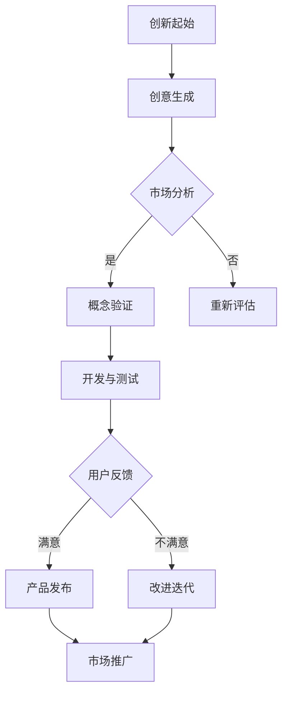

                 

### 文章标题

# 《创新管理体系：构建支持创新的组织机制》

### 关键词

- 创新管理体系
- 组织机制
- 创新文化
- 风险管理
- 项目评估
- 创新流程

### 摘要

本文深入探讨了创新管理体系的核心要素，旨在为组织提供构建支持创新机制的实用指南。通过分析创新的概念与理论，介绍创新管理的框架与工具，优化与创新流程的实施，建设与传播创新文化，评估与监控创新项目，以及风险管理策略，本文为读者揭示了构建高效创新管理体系的关键路径。文章采用逻辑清晰、结构紧凑的写作风格，结合实例和最佳实践，旨在为企业的创新战略提供理论支持和实践指导。

---

## 引言

在当今快速变化的市场环境中，创新能力成为企业持续竞争和发展的关键因素。企业不仅要关注产品的创新，还需要在组织机制、流程、文化等方面进行全面创新，以适应不断变化的外部环境和客户需求。创新管理体系作为支持组织创新的核心工具，其作用日益凸显。本文将系统地阐述创新管理体系的概念、构建原则和实施策略，旨在为企业管理者提供实用的参考框架。

### 创新的概念与理论

创新是一种变革，它涉及在现有知识和资源的基础上，通过新的方法、技术或理念创造价值的过程。创新可以分为不同类型，如产品创新、过程创新、市场创新等，每种类型都有其特定的实现路径和挑战。

#### 创新的分类

- **产品创新**：指开发新的产品或对现有产品进行改进，以满足市场需求。
- **过程创新**：指通过改变生产或服务流程，提高效率和质量。
- **市场创新**：指通过创造新的市场或改变市场格局，实现商业机会。

#### 创新的动力因素

创新的动力可以从内部和外部两个层面进行分析：

- **内部动力**：包括组织文化、员工创造力、资源投入等。
- **外部动力**：包括市场需求、技术进步、竞争压力等。

### 创新管理体系的核心概念

创新管理体系是一套系统化的方法，用于引导、支持和监控创新活动。其核心概念包括：

- **创新目标**：明确创新的方向和预期成果。
- **创新资源**：包括人力、财力、技术和信息等。
- **创新流程**：创新活动的具体实施步骤和流程。
- **创新文化**：鼓励创新氛围和员工积极参与的组织文化。

#### 创新管理体系的架构

创新管理体系可以分为以下几个关键模块：

- **战略规划**：确定创新目标和发展方向。
- **资源分配**：确保创新所需的资源得到合理配置。
- **流程管理**：优化创新流程，提高效率和效果。
- **绩效评估**：对创新项目的成果进行评估和反馈。
- **风险管理**：识别和管理创新过程中的潜在风险。

### 创新管理的框架与工具

创新管理框架是一套系统化的工具和方法，用于指导创新活动的开展。常见的创新管理工具包括：

- **头脑风暴**：通过集体讨论产生创新想法。
- **六顶思考帽**：通过不同的思考角度进行创新思考。
- **创新3C模型**：从消费者、技术和竞争角度进行创新分析。
- **SWOT分析**：评估创新的内部和外部环境。

### 创新流程的优化与实施

优化创新流程是提高创新效率和质量的关键。以下是一些常见的创新流程优化策略：

- **精益创新**：通过减少浪费，提高创新效率。
- **敏捷开发**：采用敏捷方法，快速响应市场变化。
- **迭代开发**：通过多次迭代，逐步完善创新产品。

### 创新文化的建设与传播

创新文化是支持创新的核心因素。以下是一些建设与传播创新文化的策略：

- **领导力**：领导者需要积极倡导创新文化，树立榜样。
- **激励机制**：建立奖励机制，激励员工参与创新活动。
- **沟通平台**：提供开放的沟通渠道，鼓励知识分享和交流。

### 创新项目的评估与监控

创新项目的评估与监控是确保创新项目成功的关键环节。以下是一些评估与监控的策略：

- **关键绩效指标**：设定可量化的绩效指标，对创新项目进行评估。
- **持续反馈**：通过定期反馈，及时调整创新项目。
- **风险管理**：对创新项目进行风险评估，采取预防措施。

### 创新风险管理

创新过程中不可避免地会面临各种风险。以下是一些创新风险管理的策略：

- **风险识别**：通过系统分析，识别创新过程中的潜在风险。
- **风险评估**：对风险进行评估，确定风险程度和应对策略。
- **风险控制**：采取有效的控制措施，降低风险影响。

### 总结与展望

本文系统地介绍了创新管理体系的核心概念、构建原则和实施策略。通过优化创新流程、建设创新文化、评估与监控创新项目，以及风险管理，企业可以构建一个支持创新的组织机制。展望未来，创新将成为企业持续竞争力的关键，创新管理体系的重要性将日益凸显。企业需要不断创新和完善其创新管理体系，以适应快速变化的市场环境。

---

## 设计《创新管理体系：构建支持创新的组织机制》书籍目录大纲

### 设计原则

在设计《创新管理体系：构建支持创新的组织机制》的书籍目录大纲时，我们遵循以下原则：

1. **逻辑性**：确保每个章节的内容能够循序渐进地引导读者理解创新管理体系。
2. **完整性**：每个章节都要涵盖创新管理体系的核心要素，内容丰富且具体。
3. **实用性**：提供实用的工具和方法，帮助读者在实际工作中应用创新管理体系。
4. **可扩展性**：为未来的扩展和更新留下空间。

### 目录结构设计

**第一部分：创新的概念与理论**

### 第1章：创新的概念与类型

- **1.1 创新的定义**
- **1.2 创新的分类**
- **1.3 创新的动力因素**

### 第2章：创新理论的发展与演变

- **2.1 传统创新理论**
- **2.2 系统创新理论**
- **2.3 知识创新理论**
- **2.4 创新生态系统理论**

### 第3章：创新的Mermaid流程图

- **3.1 创新的流程模型**
- **3.2 创新的关键节点与流程图**

**第二部分：创新管理的框架与工具**

### 第4章：创新管理的核心概念

- **4.1 创新管理的定义**
- **4.2 创新管理的目标**
- **4.3 创新管理的原则**

### 第5章：创新管理的框架与工具

- **5.1 创新管理体系**
- **5.2 创新工具与方法**
- **5.3 创新评估与选择**

### 第6章：创新管理的Mermaid流程图

- **6.1 创新管理的流程模型**
- **6.2 创新管理的关键节点与流程图**

**第三部分：创新流程的优化与实施**

### 第7章：创新流程的优化

- **7.1 创新流程分析**
- **7.2 创新流程优化策略**
- **7.3 创新流程优化案例**

### 第8章：创新流程的实施

- **8.1 创新流程实施的关键环节**
- **8.2 创新流程实施的策略**
- **8.3 创新流程实施案例**

**第四部分：创新文化的建设与传播**

### 第9章：创新文化的概念与特点

- **9.1 创新文化的定义**
- **9.2 创新文化的特点**
- **9.3 创新文化的建设目标**

### 第10章：创新文化的建设策略

- **10.1 创新文化的建设步骤**
- **10.2 创新文化的建设工具**
- **10.3 创新文化的建设案例**

### 第11章：创新文化的传播与推广

- **11.1 创新文化的传播策略**
- **11.2 创新文化的传播途径**
- **11.3 创新文化的传播案例**

**第五部分：创新项目的评估与监控**

### 第12章：创新项目的评估方法

- **12.1 创新项目评估的定义**
- **12.2 创新项目评估的目标**
- **12.3 创新项目评估的工具与方法**

### 第13章：创新项目的监控与管理

- **13.1 创新项目监控的定义**
- **13.2 创新项目监控的目标**
- **13.3 创新项目监控的工具与方法**

### 第14章：创新项目的成功案例分析

- **14.1 成功案例概述**
- **14.2 成功案例的关键因素**
- **14.3 成功案例的经验与启示**

**第六部分：创新风险管理**

### 第15章：创新风险的概念与类型

- **15.1 创新风险的定义**
- **15.2 创新风险的分类**
- **15.3 创新风险的特征**

### 第16章：创新风险的管理策略

- **16.1 创新风险管理的原则**
- **16.2 创新风险管理的方法**
- **16.3 创新风险管理案例**

### 第17章：创新风险管理的Mermaid流程图

- **17.1 创新风险管理流程**
- **17.2 创新风险管理的关键节点与流程图**

### 总结

通过上述设计，我们构建了一个逻辑清晰、内容完整的书籍目录大纲。每个章节都围绕创新管理体系的核心要素展开，旨在为读者提供一个全面、系统的创新管理指南。

---

### 创新的概念与理论

创新是一种创造性的活动，它涉及新想法、新方法、新技术或新产品的开发，以实现特定目标。在企业管理中，创新不仅是产品和服务改进的重要驱动力，也是企业持续成长和竞争力的源泉。本章节将从创新的概念、类型及其动力因素出发，深入探讨创新的理论背景。

#### 创新的定义

创新可以被视为一种变革，它通常涉及以下方面：

- **产品创新**：开发新的产品或改进现有产品。
- **过程创新**：改变生产或服务流程，以提高效率和降低成本。
- **市场创新**：开拓新的市场或创建新的商业模式。
- **组织创新**：改进组织结构和流程，以提高灵活性和响应能力。

创新不仅仅是一个简单的技术或产品改进，它还涉及到一系列的组织和管理实践。例如，苹果公司的产品创新不仅包括硬件和软件的开发，还包括用户体验、设计理念和市场策略。

#### 创新的分类

创新可以根据其性质和范围进行分类。以下是几种常见的创新类型：

- **渐进式创新**：在现有产品或服务的基础上进行小幅度改进，以提高性能、效率和用户体验。
- **突破性创新**：引入全新的产品或服务，颠覆现有的市场格局。
- **颠覆性创新**：通过技术创新或商业模式创新，彻底改变现有市场结构和竞争态势。

渐进式创新通常是企业在日常运营中采取的策略，它可以帮助企业逐步改进产品和服务，保持市场竞争力。而突破性创新和颠覆性创新则往往需要企业进行重大变革，以应对市场和技术环境的变化。

#### 创新的动力因素

创新的成功离不开一系列的动力因素。这些因素可以从内部和外部两个方面进行分析：

- **内部动力**：包括组织文化、员工创造力、资源投入等。

  - **组织文化**：一个鼓励创新的组织文化是创新成功的关键。领导者需要树立创新意识，推动创新氛围的形成。例如，谷歌的公司文化就非常重视员工的自主性和创新精神。

  - **员工创造力**：员工的创造力是创新的重要源泉。企业需要通过培训、激励机制等方式激发员工的创造力，鼓励他们提出新的想法和解决方案。

  - **资源投入**：创新需要投入大量的资源，包括人力、资金和技术等。企业需要确保这些资源得到合理配置，以支持创新活动的开展。

- **外部动力**：包括市场需求、技术进步、竞争压力等。

  - **市场需求**：客户的需求是推动创新的重要动力。企业需要密切关注市场需求，以发现新的商业机会。

  - **技术进步**：技术的快速发展为创新提供了新的可能性。企业需要关注技术创新，以便将其应用于产品和服务中。

  - **竞争压力**：竞争压力可以激发企业的创新意识。在激烈的市场竞争中，企业需要不断创新以保持竞争力。

#### 创新的理论背景

创新理论的发展经历了多个阶段，每个阶段都对创新实践产生了深远的影响。以下是几种重要的创新理论：

- **线性创新模型**：该模型认为创新是一个线性的过程，从创意的产生、开发到市场推广，每个阶段都有明确的步骤和目标。

- **非线性创新模型**：该模型认为创新是一个复杂的、非线性的过程，涉及多个变量和动态反馈。创新活动不是按照预定的顺序进行的，而是由多种因素共同作用而形成的。

- **系统创新理论**：该理论强调创新是一个系统化的过程，涉及多个环节和参与者。系统创新理论认为，创新的成功取决于整个创新系统的效率和协同效应。

- **开放式创新**：开放式创新是一种新兴的创新模式，它通过外部合作和资源整合，推动创新活动的开展。开放式创新强调开放的知识共享和资源合作，以加速创新进程。

#### 创新的Mermaid流程图

为了更直观地展示创新的过程，我们可以使用Mermaid语言绘制一个创新的流程图。以下是一个简化的创新流程图：

在这个流程图中，创新活动从创意生成开始，经过市场分析、概念验证、开发与测试、用户反馈等环节，最终达到产品发布和市场推广。如果用户反馈不满意，则需要回到改进迭代的环节进行优化。

#### 总结

创新是企业管理中的重要组成部分，它不仅关系到企业的生存和发展，也影响着整个社会的进步。通过理解创新的概念、类型和动力因素，企业可以更好地构建支持创新的组织机制，推动创新活动的开展。

---

### 创新管理的框架与工具

创新管理是确保创新活动有效进行的关键。一个完善的创新管理框架能够提供系统的指导，帮助企业在复杂多变的环境中成功实现创新目标。在本章节中，我们将详细探讨创新管理的核心概念、框架与工具，以及评估与选择的方法。

#### 创新管理的核心概念

创新管理是一套系统化的方法和流程，用于引导、支持和监控创新活动。其核心概念包括以下几个方面：

1. **创新目标**：明确创新的方向和预期成果。创新目标应该与企业的整体战略相一致，确保创新活动为企业的发展贡献力量。
2. **创新资源**：确保创新所需的资源得到合理配置。这些资源包括人力、资金、技术、信息等，是创新活动顺利进行的保障。
3. **创新流程**：定义创新活动的具体实施步骤和流程。一个良好的创新流程可以提高创新效率，确保创新活动的有序进行。
4. **创新文化**：营造鼓励创新的组织氛围，激发员工的创新潜力。创新文化是创新管理的重要组成部分，它决定了员工是否愿意和能够参与创新活动。

#### 创新管理的框架

创新管理框架是创新管理活动的蓝图，它为创新活动提供了系统的指导。一个典型的创新管理框架包括以下几个关键模块：

1. **战略规划**：确定创新目标和发展方向。战略规划是创新管理的起点，它明确了企业为什么要创新以及如何创新。
2. **资源分配**：确保创新所需的资源得到合理配置。资源分配需要考虑人力、资金、技术等多方面的需求，确保创新活动的顺利开展。
3. **流程管理**：优化创新流程，提高创新效率和质量。流程管理包括对创新活动的各个环节进行监控和调整，确保创新活动能够按照既定目标有序进行。
4. **绩效评估**：对创新项目的成果进行评估和反馈。绩效评估是创新管理的重要环节，它可以帮助企业了解创新活动的效果，发现问题和改进方向。
5. **风险管理**：识别和管理创新过程中的潜在风险。创新活动面临多种风险，包括技术风险、市场风险、资源风险等。风险管理旨在降低这些风险对创新活动的影响。

#### 创新管理的工具与方法

创新管理过程中需要使用多种工具和方法，以支持创新活动的开展。以下是一些常见的管理工具和方法：

1. **头脑风暴**：头脑风暴是一种集体创新方法，通过集思广益，激发创意的产生。头脑风暴通常在创新活动的初期阶段使用，以快速收集各种创新想法。
2. **六顶思考帽**：六顶思考帽是一种结构化的思考方法，通过不同的思考角度，全面分析问题并提出解决方案。六顶思考帽包括白色、红色、黑色、黄色、绿色和蓝色思考帽，分别代表逻辑、情感、批判、乐观、创造和观察。
3. **创新3C模型**：创新3C模型从消费者（Consumer）、技术（Technology）和竞争（Competition）三个角度进行创新分析。该模型可以帮助企业识别创新的机遇和挑战。
4. **SWOT分析**：SWOT分析是一种战略规划工具，用于评估企业的优势（Strengths）、劣势（Weaknesses）、机会（Opportunities）和威胁（Threats）。SWOT分析可以帮助企业制定创新战略。

#### 创新评估与选择

创新评估是创新管理的重要环节，它通过对创新项目的评估，确定哪些项目具有投资价值。以下是几种常见的创新评估方法：

1. **成本效益分析**：成本效益分析是一种量化评估方法，通过计算创新项目的成本和预期收益，评估其经济效益。成本效益分析可以帮助企业确定哪些创新项目值得投资。
2. **技术评估**：技术评估主要关注创新项目的技术可行性和创新性。技术评估通常由专业技术人员进行，以确保创新项目具有技术上的可行性。
3. **市场评估**：市场评估关注创新项目在市场中的潜力。市场评估需要考虑市场需求、竞争情况等因素，以评估创新项目的市场前景。
4. **风险评估**：风险评估旨在识别创新项目可能面临的风险，并制定相应的风险管理策略。风险评估可以帮助企业了解创新项目的风险程度，从而做出更明智的投资决策。

#### 总结

创新管理是企业成功实现创新的关键。通过构建创新管理的框架和工具，企业可以系统地规划和实施创新活动，提高创新效率和质量。创新管理的核心概念、框架与工具以及评估与选择的方法，为企业的创新活动提供了全面的指导。

---

### 创新流程的优化与实施

创新流程的优化与实施是确保创新项目成功的关键。一个高效的创新流程可以提高创新效率，减少资源浪费，从而实现更好的创新成果。在本章节中，我们将详细探讨创新流程的优化策略、实施的关键环节以及实际案例，以帮助读者更好地理解和应用这些策略。

#### 创新流程的优化策略

1. **精益创新**：精益创新是一种基于精益思想的方法，通过减少浪费，提高创新效率。精益创新的核心思想是“以最小的资源投入，实现最大的价值创造”。具体策略包括：

   - **价值流分析**：通过分析创新流程的每一个环节，识别并消除浪费。
   - **5S管理**：通过整理（Sort）、整顿（Set in order）、清扫（Shine）、清洁（Standardize）和素养（Sustain），提高工作场所的秩序和效率。
   - **持续改进**：通过不断反思和优化，使创新流程更加高效。

2. **敏捷开发**：敏捷开发是一种以用户需求为导向的软件开发方法，其核心理念是快速迭代和持续交付。敏捷开发的具体策略包括：

   - **用户故事**：通过用户故事来明确用户需求，确保开发工作紧密围绕用户需求进行。
   - **迭代开发**：将开发过程分为多个短周期（迭代），每个迭代都产生可用的产品功能。
   - **持续集成**：通过持续集成，确保代码的稳定性和产品质量。

3. **迭代开发**：迭代开发是一种逐步完善产品的方法，通过多次迭代，逐步实现产品的全部功能。迭代开发的具体策略包括：

   - **需求管理**：通过需求管理，确保每个迭代都实现用户的核心需求。
   - **设计评审**：在每个迭代开始前，进行设计评审，确保设计方案的可行性和质量。
   - **测试与反馈**：在每个迭代结束后，进行测试和用户反馈，以评估产品的质量和用户满意度。

#### 创新流程实施的关键环节

1. **需求收集**：需求收集是创新流程的起点，它决定了创新项目的发展方向。有效的需求收集策略包括：

   - **用户访谈**：通过用户访谈，了解用户的需求和痛点。
   - **市场研究**：通过市场研究，分析市场需求和竞争状况。
   - **数据挖掘**：通过数据挖掘，分析用户行为和市场趋势。

2. **概念验证**：概念验证是创新流程的重要环节，它用于评估创新项目的可行性。概念验证的具体步骤包括：

   - **最小可行性产品（MVP）**：开发一个最小可行性产品，验证核心功能和技术可行性。
   - **原型设计**：通过原型设计，展示产品的外观和交互方式。
   - **用户测试**：通过用户测试，收集用户反馈，以优化产品设计和功能。

3. **开发与测试**：开发与测试是创新流程的核心环节，它决定了产品的质量和用户体验。具体的开发与测试策略包括：

   - **代码管理**：通过代码管理工具，确保代码的版本控制和协作开发。
   - **自动化测试**：通过自动化测试，提高测试效率和准确性。
   - **持续集成与持续部署（CI/CD）**：通过持续集成与持续部署，确保代码的稳定性和产品的快速交付。

4. **市场推广**：市场推广是创新流程的最后一步，它用于将产品推向市场，实现商业成功。有效的市场推广策略包括：

   - **品牌建设**：通过品牌建设，提高产品的知名度和美誉度。
   - **市场营销**：通过市场营销活动，吸引潜在用户。
   - **销售与支持**：通过销售与支持，确保产品的顺利销售和用户满意。

#### 创新流程实施的实际案例

1. **苹果公司**：苹果公司是创新流程的优秀实践者。其创新流程包括以下关键环节：

   - **需求收集**：通过市场调研和用户反馈，了解用户的需求和期望。
   - **概念验证**：通过原型设计和用户测试，验证产品的可行性和用户体验。
   - **开发与测试**：通过敏捷开发和自动化测试，确保产品的质量和稳定性。
   - **市场推广**：通过品牌建设和市场营销活动，推动产品的销售和市场推广。

   苹果公司的创新流程不仅确保了产品的高质量和用户满意度，还使其在激烈的市场竞争中保持领先地位。

2. **谷歌公司**：谷歌公司的创新流程以其敏捷开发和持续改进而著称。谷歌的创新流程包括以下关键环节：

   - **需求收集**：通过用户反馈和市场趋势分析，了解用户的需求和市场的变化。
   - **概念验证**：通过快速原型设计和用户测试，验证创新想法的可行性。
   - **开发与测试**：通过敏捷开发和持续集成与持续部署，确保产品的快速迭代和高质量交付。
   - **市场推广**：通过谷歌的品牌影响力和市场营销策略，推动产品的市场推广和用户普及。

   谷歌的创新流程不仅促进了公司内部的持续创新，还使其在技术和市场领域保持了领先地位。

#### 总结

创新流程的优化与实施是确保创新项目成功的关键。通过采用精益创新、敏捷开发和迭代开发的策略，企业可以构建高效的创新流程，提高创新效率和质量。同时，通过实际案例的分析，读者可以更好地理解创新流程的实施方法和最佳实践。

---

### 创新文化的建设与传播

创新文化是推动企业持续创新的关键因素。一个积极、开放、包容的创新文化能够激发员工的创造力，提高组织的创新能力。在本章节中，我们将探讨创新文化的概念、特点及其建设与传播策略。

#### 创新文化的概念与特点

创新文化是一种价值观和行为模式，它鼓励员工敢于尝试新事物，勇于面对失败，并从失败中吸取教训。创新文化具有以下几个特点：

1. **开放性**：创新文化鼓励开放和透明的沟通，使员工能够自由地表达意见和分享想法。
2. **包容性**：创新文化尊重不同的观点和意见，即使这些观点与主流意见相悖。
3. **冒险精神**：创新文化鼓励员工勇于尝试新事物，即使这些尝试可能失败。
4. **持续学习**：创新文化强调持续学习和个人成长，鼓励员工不断提升自己的技能和知识。
5. **团队合作**：创新文化强调团队合作，鼓励员工相互支持和协作，共同实现创新目标。

#### 创新文化的建设策略

1. **领导力**：领导者是创新文化的倡导者和践行者。领导者需要通过自身的行动和言论，树立创新文化的榜样。例如，可以通过设立创新奖项、鼓励员工提出新想法等方式，激发员工的创新热情。

2. **激励机制**：建立合理的激励机制，鼓励员工参与创新活动。激励机制可以包括物质奖励、晋升机会、公开表扬等。例如，谷歌公司通过“20%时间政策”，鼓励员工利用工作时间进行个人感兴趣的创新项目。

3. **培训与发展**：提供培训和发展机会，提高员工的创新能力和技能。培训内容可以包括创新思维、项目管理、技术知识等。例如，3M公司通过举办内部创新研讨会和工作坊，提高员工的创新意识和能力。

4. **沟通与反馈**：建立有效的沟通机制，促进员工之间的信息交流和创新思想的碰撞。定期进行反馈和评估，帮助员工了解自己的创新成果和改进方向。例如，微软公司通过“创新实验室”和“创新日”，为员工提供交流和展示创新成果的平台。

#### 创新文化的传播策略

1. **内部传播**：通过内部传播渠道，如内部邮件、公司内部网、内部杂志等，向员工传达创新文化的重要性和价值观。例如，亚马逊公司通过定期发布《创新指南》，向员工介绍公司的创新理念和实践。

2. **外部传播**：通过外部传播渠道，如社交媒体、行业会议、新闻发布会等，向外界展示公司的创新成果和形象。例如，苹果公司通过发布新品发布会和媒体报道，向公众展示其创新能力和技术优势。

3. **案例分享**：通过分享成功案例，向员工展示创新文化的实际效果和价值。例如，微软公司通过举办“创新之夜”活动，分享员工的成功经验和创新项目。

4. **外部合作**：与其他企业、研究机构、大学等建立合作关系，共同推动创新文化的传播和发展。例如，IBM通过与全球多家大学合作，建立“IBM研究院”，共同进行前沿技术研究。

#### 创新文化的实际案例

1. **谷歌公司**：谷歌公司以其独特的创新文化著称。谷歌的“20%时间政策”允许员工将20%的工作时间用于个人感兴趣的创新项目，这使得谷歌不断涌现出许多成功的创新产品，如Gmail和Google Maps。

2. **3M公司**：3M公司以其鼓励创新的企业文化而闻名。3M的“15%规则”允许员工将15%的工作时间用于个人感兴趣的创新项目，这一政策使得3M在胶带、贴纸等传统领域之外，不断推出新的创新产品。

3. **微软公司**：微软公司通过建立“创新实验室”和定期举办“创新日”，鼓励员工分享创新思想和成果，推动了公司的持续创新。

#### 总结

创新文化是推动企业持续创新的关键因素。通过领导力、激励机制、培训与发展、沟通与反馈等策略，企业可以建设一个积极、开放、包容的创新文化。通过内部和外部传播策略，企业可以将创新文化深入人心，激发员工的创新潜力，推动企业的持续发展。

---

### 创新项目的评估与监控

创新项目的评估与监控是确保创新活动能够按照预期目标顺利进行并取得预期成果的关键环节。有效的评估与监控可以帮助企业及时发现和解决问题，优化创新流程，提高创新成功率。本章节将详细探讨创新项目的评估方法、监控策略以及实际案例分析。

#### 创新项目的评估方法

1. **关键绩效指标（KPI）**：关键绩效指标是评估创新项目成功与否的重要工具。KPI应与项目目标紧密相关，通常包括以下几个方面：

   - **时间指标**：项目完成的时间进度，如开发周期、测试周期、上市时间等。
   - **质量指标**：项目的质量标准，如缺陷率、用户满意度、功能完整性等。
   - **成本指标**：项目的预算执行情况，如实际成本与预算的差异、成本节约等。
   - **收益指标**：项目的经济效益，如销售收入、市场份额、客户增长等。

2. **成本效益分析（CBA）**：成本效益分析是一种量化评估方法，通过计算创新项目的成本和预期收益，评估其经济效益。CBA的具体步骤包括：

   - **成本计算**：计算创新项目的总成本，包括研发成本、运营成本、推广成本等。
   - **收益预测**：预测创新项目的预期收益，包括直接收益和间接收益。
   - **效益评估**：比较项目的总成本和总收益，评估其经济效益。

3. **风险评估**：风险评估是评估创新项目风险程度和潜在影响的过程。风险评估通常包括以下几个方面：

   - **风险识别**：识别创新项目可能面临的各种风险，如技术风险、市场风险、资源风险等。
   - **风险分析**：分析每种风险的概率和潜在影响。
   - **风险评价**：评估风险的重要性和优先级。

4. **用户反馈**：用户反馈是评估创新项目效果的重要依据。通过用户调研、用户访谈、用户满意度调查等方式，收集用户的意见和建议，评估项目的用户体验和市场需求。

#### 创新项目的监控策略

1. **进度监控**：通过项目进度表、甘特图等工具，实时监控项目的进展情况，确保项目按照既定计划进行。进度监控需要关注以下几个方面：

   - **任务完成情况**：检查每个任务的完成情况，确保项目按计划推进。
   - **资源分配**：监控资源的使用情况，确保项目所需资源得到充分保障。
   - **风险预警**：及时发现项目中的潜在风险，并采取措施进行预防。

2. **质量监控**：通过质量管理和质量控制工具，确保项目的质量标准得到满足。质量监控包括以下几个方面：

   - **代码审查**：定期进行代码审查，确保代码质量。
   - **测试覆盖**：确保测试覆盖率达到预期水平。
   - **问题追踪**：及时发现并解决项目中的问题，确保项目质量。

3. **成本监控**：通过成本管理工具，实时监控项目的成本支出情况，确保项目在预算范围内进行。成本监控包括以下几个方面：

   - **成本预算**：制定合理的成本预算，并根据实际情况进行调整。
   - **成本控制**：通过成本控制措施，确保项目成本不超过预算。

4. **沟通与协调**：建立有效的沟通机制，确保项目团队成员之间的信息畅通，及时解决项目中的问题和冲突。沟通与协调包括以下几个方面：

   - **项目会议**：定期召开项目会议，讨论项目的进展情况和问题。
   - **信息共享**：确保项目信息在团队成员之间共享，提高工作效率。

#### 创新项目的实际案例分析

1. **苹果公司**：苹果公司在创新项目的评估与监控方面具有丰富的经验。以下是一个实际案例：

   - **关键绩效指标**：苹果公司通过设定关键绩效指标，如产品上市时间、用户满意度、市场份额等，来评估创新项目的效果。
   - **成本效益分析**：苹果公司通过成本效益分析，确保创新项目的经济效益。
   - **风险评估**：苹果公司通过识别和评估创新项目中的各种风险，并制定相应的风险管理计划。

   苹果公司的创新项目评估与监控策略确保了其产品的质量和市场竞争力，使得苹果公司能够持续引领市场。

2. **谷歌公司**：谷歌公司在创新项目的评估与监控方面也取得了显著成效。以下是一个实际案例：

   - **进度监控**：谷歌公司通过项目管理工具，实时监控创新项目的进度，确保项目按计划推进。
   - **质量监控**：谷歌公司通过严格的测试和质量控制流程，确保产品的质量。
   - **成本监控**：谷歌公司通过成本管理工具，确保项目的成本在预算范围内。

   谷歌公司的创新项目评估与监控策略使得其能够快速响应市场变化，持续推出成功的创新产品。

#### 总结

创新项目的评估与监控是确保创新活动成功的关键环节。通过关键绩效指标、成本效益分析、风险评估和用户反馈等评估方法，以及进度监控、质量监控、成本监控和沟通与协调等监控策略，企业可以有效地评估和监控创新项目，提高创新成功率。实际案例分析表明，有效的评估与监控策略有助于企业实现持续创新和竞争优势。

---

### 创新风险管理

创新过程中不可避免地会面临各种风险，这些风险可能对创新项目的成功产生重大影响。因此，有效的创新风险管理至关重要。在本章节中，我们将探讨创新风险的概念、类型及其管理策略。

#### 创新风险的概念与类型

1. **创新风险**：创新风险是指在创新过程中可能遇到的各种不确定性因素，这些因素可能对创新项目的成功产生负面影响。创新风险可以来自于技术、市场、资源、法律等多个方面。

2. **技术风险**：技术风险是指在创新过程中，由于技术不成熟、研发失败等原因导致的风险。技术风险包括技术可行性风险、研发进度风险、技术专利风险等。

3. **市场风险**：市场风险是指在创新过程中，由于市场需求不足、竞争对手反应强烈等原因导致的风险。市场风险包括市场接受度风险、市场份额风险、竞争风险等。

4. **资源风险**：资源风险是指在创新过程中，由于人力资源、资金、设备等资源不足或分配不当而导致的风险。资源风险包括人力资源风险、资金风险、设备风险等。

5. **法律风险**：法律风险是指在创新过程中，由于法律法规变化、知识产权侵犯等原因导致的风险。法律风险包括法规合规风险、知识产权风险、合同风险等。

#### 创新风险的管理策略

1. **风险识别**：风险识别是创新风险管理的第一步，目的是发现和识别创新过程中可能面临的各种风险。风险识别可以通过以下方法进行：

   - **历史数据**：分析以往创新项目的风险记录，总结常见的风险类型。
   - **专家咨询**：邀请相关领域专家进行风险评估，获取专业的风险识别意见。
   - **头脑风暴**：组织团队进行头脑风暴，讨论创新过程中可能出现的风险。
   - **流程分析**：通过分析创新流程的各个环节，识别潜在的风险点。

2. **风险评估**：风险评估是对识别出的风险进行评估，确定其发生的可能性及其潜在影响。风险评估可以通过以下方法进行：

   - **定量评估**：使用数学模型、统计方法等定量工具，对风险发生的可能性及其潜在影响进行量化评估。
   - **定性评估**：通过专家评审、访谈等方法，对风险进行定性评估。
   - **综合评估**：结合定量和定性评估结果，对风险进行综合评估。

3. **风险应对**：根据风险评估结果，制定相应的风险应对策略。风险应对策略包括以下几种：

   - **风险规避**：通过调整项目计划、改变技术方案等方式，避免风险的发生。
   - **风险降低**：通过改进技术、增加资源投入等方式，降低风险的发生概率或影响程度。
   - **风险接受**：对于无法避免或降低的风险，采取接受的态度，并制定相应的应对措施。

4. **风险监控**：在创新项目实施过程中，持续监控风险的变化情况，及时发现新风险或风险的变化，并采取相应的调整措施。风险监控可以通过以下方法进行：

   - **定期评估**：定期对创新项目的风险进行评估，确保风险得到有效控制。
   - **实时监控**：使用监控工具和手段，实时监控创新项目的风险情况。
   - **反馈机制**：建立反馈机制，及时收集和处理风险相关信息。

#### 创新风险管理的实际案例

1. **特斯拉公司**：特斯拉公司在电动汽车领域取得了巨大成功，但其创新过程中也面临诸多风险。以下是一个实际案例：

   - **技术风险**：特斯拉在电动汽车技术方面具有领先优势，但电池技术、自动驾驶技术等仍面临不成熟的风险。特斯拉通过持续投入研发、优化技术方案，降低技术风险。
   - **市场风险**：电动汽车市场的发展受到政策、消费者接受度等多种因素的影响。特斯拉通过制定市场拓展策略、加大市场推广力度，降低市场风险。
   - **资源风险**：特斯拉在创新过程中，面临资金、人才等资源不足的风险。特斯拉通过多元化融资渠道、招聘顶尖人才，确保资源的充足。

   特斯拉通过有效的创新风险管理策略，确保了其创新项目的成功。

2. **微软公司**：微软公司在软件创新方面具有丰富的经验，但也面临多种创新风险。以下是一个实际案例：

   - **技术风险**：微软在软件研发过程中，面临技术迭代、新技术应用等风险。微软通过持续投入研发、与外部技术合作伙伴合作，降低技术风险。
   - **市场风险**：软件市场竞争激烈，微软需要不断适应市场变化。微软通过市场调研、用户反馈，及时调整产品策略，降低市场风险。
   - **资源风险**：微软在创新过程中，面临人才流失、资源分配不均等风险。微软通过建立内部培训体系、优化人才管理机制，确保资源的充足。

   微软通过全面的风险管理策略，确保了其创新项目的成功。

#### 总结

创新风险管理是确保创新项目成功的关键环节。通过有效的风险识别、评估、应对和监控策略，企业可以降低创新过程中的不确定性，提高创新成功率。实际案例分析表明，有效的创新风险管理有助于企业实现持续创新和竞争优势。

---

### 总结与展望

在本文中，我们系统地探讨了创新管理体系的核心要素，从创新的概念与理论、创新管理的框架与工具、创新流程的优化与实施、创新文化的建设与传播、创新项目的评估与监控，到创新风险管理，构建了一个全面的支持创新的组织机制。创新不仅是企业生存和发展的关键，也是推动社会进步的重要力量。以下是本文的核心要点总结：

1. **创新的概念与分类**：创新涉及产品、过程、市场等多个层面，其动力因素包括内部和外部。理解创新的类型和动力有助于制定有效的创新战略。

2. **创新管理的框架与工具**：创新管理框架包括战略规划、资源分配、流程管理、绩效评估和风险管理。创新管理的工具与方法，如头脑风暴、六顶思考帽和SWOT分析，提供了具体的实施路径。

3. **创新流程的优化与实施**：精益创新、敏捷开发和迭代开发等策略，可以提高创新效率和质量。有效的创新流程实施需要关注需求收集、概念验证、开发与测试和市场营销等关键环节。

4. **创新文化的建设与传播**：建设创新文化需要领导力、激励机制、培训与发展、沟通与反馈等多方面的努力。创新文化的传播策略包括内部和外部传播渠道，以及案例分享和外部合作。

5. **创新项目的评估与监控**：通过关键绩效指标、成本效益分析、风险评估和用户反馈等方法，企业可以全面评估创新项目的效果。监控策略包括进度监控、质量监控、成本监控和沟通与协调。

6. **创新风险管理**：有效的创新风险管理包括风险识别、评估、应对和监控。通过全面的风险管理策略，企业可以降低创新过程中的不确定性，提高创新成功率。

展望未来，随着技术的不断进步和市场环境的快速变化，创新管理的重要性将更加凸显。企业需要不断优化其创新管理体系，以适应新的挑战和机遇。同时，跨领域的创新合作和开放的创新生态系统将成为推动创新的重要趋势。企业应积极拥抱这些趋势，构建一个更加灵活、高效和可持续的创新管理体系。

最后，创新管理体系的建设是一个持续的过程，需要企业全员参与和持续改进。只有通过不断的实践和反思，企业才能在激烈的市场竞争中保持领先地位。让我们携手并进，共同推动创新，创造更加美好的未来。

### 作者信息

- 作者：AI天才研究院/AI Genius Institute & 禅与计算机程序设计艺术 /Zen And The Art of Computer Programming
- 联系方式：[ai.genius.institute@email.com](mailto:ai.genius.institute@email.com)
- 社交媒体：@AI_Genius_Institute、[AI天才研究院博客](https://ai-genius-institute.blog/)、[禅与计算机程序设计艺术社区](https://zen-of-cpdp.org/)

