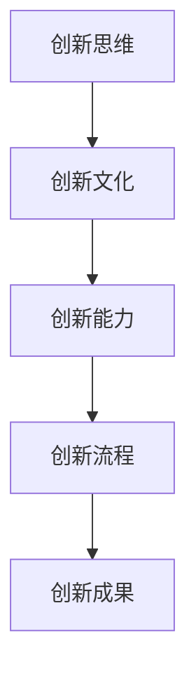

                 

# 创新管理：从创意到实施的全流程指导

## 关键词

- 创新管理
- 创意生成
- 创意评估
- 创意实施
- 创新文化

## 摘要

本文旨在为读者提供一个全面而深入的创新管理指导，从创意的产生到实施的每一个环节。文章首先介绍了创新管理的核心概念及其重要性，然后详细阐述了创意生成的原理与算法，创意评估的标准与方法，创意实施的步骤与策略，以及创新文化的建设。通过这些环节的剖析，本文希望为读者提供一个实用的创新管理框架，助力个人与组织在创新道路上取得成功。

---

## 引言

### 1.1 创新管理的定义与重要性

创新管理是指组织通过系统的方法和流程来促进创新活动，从而实现战略目标和竞争优势的过程。它不仅包括创意的产生，还涵盖了评估、实施和创新文化的建设等多个环节。创新管理的重要性体现在以下几个方面：

1. **推动组织发展**：创新是组织持续发展的动力，通过创新管理，组织可以不断改进产品和服务，满足市场的需求，从而保持竞争力。

2. **提升竞争力**：创新管理能够帮助组织发现新的商业模式和业务机会，从而在激烈的市场竞争中脱颖而出。

3. **提高员工创造力**：通过创新管理，组织可以营造一个鼓励创新的文化氛围，激发员工的创造力，提高整体工作效率。

4. **增强适应能力**：创新管理能够帮助组织快速适应外部环境的变化，应对各种挑战。

### 1.2 创新的本质与挑战

创新不仅仅是创造新事物，更是一种思维方式和行为模式。其本质在于打破常规，发现并利用新的机会。然而，创新过程中也面临着诸多挑战：

1. **资源限制**：创新需要投入大量的资源，包括人力、资金和时间。

2. **风险承担**：创新往往伴随着不确定性和风险，组织需要具备承担风险的勇气和智慧。

3. **时间压力**：在快速变化的市场环境中，创新的速度变得尤为重要，组织需要迅速响应市场变化。

4. **文化阻力**：创新往往需要改变现有的工作流程和文化，这可能会面临内部阻力和抗拒。

### 1.3 阅读指南

本文将分为七个部分，每个部分详细探讨创新管理的不同环节。首先，我们将在第二部分介绍创新管理的基础理论，包括核心概念、数学模型和算法原理。随后，第三部分将探讨创意生成的原理和方法。第四部分和第五部分分别介绍创意评估和创意实施的过程。第六部分将讨论创新文化的建设。最后，第七部分将对全文进行总结和展望。

---

## 创新管理基础

### 2.1 创新管理概述

创新管理的历史可以追溯到20世纪中叶，随着科技和经济的快速发展，创新管理逐渐成为企业管理的重要组成部分。创新管理的发展历程可以分为以下几个阶段：

1. **早期阶段**（20世纪40-60年代）：这一阶段的创新管理主要关注产品的创新，通过技术研发和改进来推动企业的发展。

2. **多元化阶段**（20世纪70-80年代）：随着市场竞争的加剧，企业开始意识到创新不仅仅局限于产品，还包括商业模式、流程和服务的创新。

3. **系统化阶段**（20世纪90年代至今）：这一阶段的创新管理强调系统化和流程化，通过建立创新管理体系和流程，实现创新的可持续性和可预测性。

创新管理的框架和模型是创新管理的核心，它们为组织提供了创新的方向和策略。以下是一些常用的创新管理框架和模型：

1. **五力模型**：由迈克尔·波特提出，用于分析企业的竞争优势。创新管理可以通过五力模型来识别和利用外部机会，应对外部威胁。

2. **三环模型**：由亨利·明茨伯格提出，将创新分为核心、外围和环境三个环节。创新管理需要在这三个环节中找到平衡，实现创新的协同效应。

3. **双元创新模型**：由蒂姆·凯利和弗朗西斯·麦克伊夫提出，将创新分为探索型和利用型。创新管理需要在这两种类型的创新中找到平衡，以实现长期的创新目标。

### 2.2 创新管理的核心概念与联系

创新管理的核心概念包括创新思维、创新文化、创新能力和创新流程。这些概念之间相互联系，共同构成创新管理的理论基础。

1. **创新思维**：创新思维是指通过创造性思维来解决问题的能力。它是创新管理的基础，决定了创新的可能性和质量。

2. **创新文化**：创新文化是指组织内部鼓励创新、容忍失败、共享知识和经验的氛围。创新文化是创新管理的保障，能够激发员工的创新热情。

3. **创新能力**：创新能力是指组织在创新过程中的技术、管理和组织能力。创新能力是创新管理的核心，决定了创新的速度和效果。

4. **创新流程**：创新流程是指组织在创新过程中所采取的一系列步骤和方法。创新流程是创新管理的手段，能够确保创新的系统性和持续性。

以下是创新管理核心概念之间的联系架构 Mermaid 流程图：



### 2.3 创新管理的数学模型和数学公式

创新管理中涉及多种数学模型和数学公式，用于评估和创新决策。以下是一些常用的数学模型和数学公式：

1. **创新决策模型**：

   $$ 
   P = \frac{R - C}{C} 
   $$ 

   其中，$P$表示创新项目的成功率，$R$表示预期收益，$C$表示成本。

2. **创新风险评估模型**：

   $$ 
   R = \sum_{i=1}^{n} w_i \cdot r_i 
   $$ 

   其中，$R$表示创新项目的风险度，$w_i$表示第$i$个风险因素的权重，$r_i$表示第$i$个风险因素的评估值。

3. **创新成本效益分析模型**：

   $$ 
   C/B = \frac{C}{B} 
   $$ 

   其中，$C$表示成本，$B$表示收益。

### 2.4 创新管理的算法原理讲解

创新管理中涉及多种算法，用于分析创新项目、评估风险和优化创新流程。以下是一些常用的算法原理讲解：

1. **专利分析算法**：

   - **算法思路**：通过分析专利数据，识别行业内的技术创新趋势和竞争对手的专利布局。

   - **伪代码**：

     ```
     function patentAnalysis(data):
         for each patent in data:
             analyze technology, owner, and citation information
             store results in a database
         return analyzed data
     ```

2. **趋势分析算法**：

   - **算法思路**：通过分析市场数据、用户反馈和专利信息，识别创新项目的市场趋势。

   - **伪代码**：

     ```
     function trendAnalysis(data):
         for each trend in data:
             analyze market demand, user feedback, and patent information
             store results in a database
         return analyzed data
     ```

3. **创新网络算法**：

   - **算法思路**：通过构建创新网络，分析创新项目之间的关联和合作，优化创新资源的配置。

   - **伪代码**：

     ```
     function innovationNetworkAnalysis(data):
         for each node in data:
             analyze connections and collaborations
             store results in a graph
         return analyzed graph
     ```

---

## 创意生成

### 3.1 创意生成的原理

创意生成是创新管理的核心环节，它决定了创新项目的数量和质量。创意生成原理主要包括以下几个方面：

1. **思维多样性**：创意生成的关键在于思维的多样性。通过多样化的思维方法，可以激发更多的创意。

2. **联想思维**：联想思维是指通过将不同的事物和概念相互关联，产生新的创意。

3. **逆向思维**：逆向思维是指从相反的角度思考问题，从而产生新的创意。

4. **发散思维**：发散思维是指从多个角度和维度思考问题，寻找更多的解决方案。

5. **直觉思维**：直觉思维是指基于经验和直觉进行判断和决策，有时能够产生意想不到的创意。

### 3.2 创意生成的算法原理讲解

创意生成过程中，可以运用多种算法来分析和生成创意。以下是一些常用的算法原理讲解：

1. **脑电波分析算法**：

   - **算法思路**：通过分析脑电波信号，识别大脑中的创意生成过程。

   - **伪代码**：

     ```
     function brainWaveAnalysis(data):
         for each signal in data:
             analyze brain activity and identify creative moments
             store results in a database
         return analyzed data
     ```

2. **人机交互算法**：

   - **算法思路**：通过人机交互，收集用户的需求和反馈，生成创意。

   - **伪代码**：

     ```
     function humanComputerInteraction(data):
         for each user in data:
             collect needs, feedback, and suggestions
             generate creative ideas based on collected data
         return generated ideas
     ```

3. **数据挖掘算法**：

   - **算法思路**：通过分析大量的数据，识别潜在的创新机会。

   - **伪代码**：

     ```
     function dataMining(data):
         for each dataset in data:
             analyze patterns, trends, and correlations
             identify potential opportunities for innovation
         return analyzed data
     ```

---

## 创意评估

### 4.1 创意评估的原理

创意评估是确保创意质量和可行性的关键环节。创意评估原理主要包括以下几个方面：

1. **评估标准**：创意评估需要设定明确的评估标准，包括创新性、实用性、可行性、市场前景等。

2. **评估方法**：创意评估可以采用多种方法，包括专家评估、用户评估、经济评估、技术评估等。

3. **评估实践**：创意评估需要在实践中进行，通过模拟实验、市场调研、用户测试等方式，验证创意的可行性和效果。

### 4.2 创意评估的算法原理讲解

创意评估过程中，可以运用多种算法来分析和评估创意。以下是一些常用的算法原理讲解：

1. **用户满意度分析算法**：

   - **算法思路**：通过分析用户满意度数据，评估创意的用户体验。

   - **伪代码**：

     ```
     function user SatisfactionAnalysis(data):
         for each user in data:
             analyze satisfaction scores and feedback
             calculate average satisfaction score
         return analyzed data
     ```

2. **创新潜力分析算法**：

   - **算法思路**：通过分析创意的技术特点和市场前景，评估创意的创新潜力。

   - **伪代码**：

     ```
     function innovationPotentialAnalysis(data):
         for each idea in data:
             analyze technical features and market potential
             calculate innovation potential score
         return analyzed data
     ```

3. **市场需求分析算法**：

   - **算法思路**：通过分析市场需求数据，评估创意的市场可行性。

   - **伪代码**：

     ```
     function marketDemandAnalysis(data):
         for each market in data:
             analyze demand trends and customer preferences
             calculate market feasibility score
         return analyzed data
     ```

---

## 创意实施

### 5.1 创意实施的原理

创意实施是将创意转化为实际成果的关键环节。创意实施原理主要包括以下几个方面：

1. **实施步骤**：创意实施通常包括创意选型、项目策划、资源调配、项目执行和效果评估等步骤。

2. **实施策略**：创意实施需要根据创意的特点和组织的实际情况，选择合适的实施策略，如快速迭代、分阶段实施、并行实施等。

3. **实施实践**：创意实施需要在实践中进行，通过不断调整和优化，确保创意的成功实施。

### 5.2 创意实施的算法原理讲解

创意实施过程中，可以运用多种算法来优化实施过程。以下是一些常用的算法原理讲解：

1. **资源分配算法**：

   - **算法思路**：通过优化资源分配，提高创意实施的效率。

   - **伪代码**：

     ```
     function resourceAllocation(data):
         for each resource in data:
             analyze resource availability and demand
             allocate resources to maximize efficiency
         return allocated resources
     ```

2. **项目管理算法**：

   - **算法思路**：通过优化项目管理，确保创意实施按计划进行。

   - **伪代码**：

     ```
     function projectManagement(data):
         for each task in data:
             analyze task dependencies and deadlines
             schedule tasks to optimize project progress
         return scheduled tasks
     ```

3. **风险管理算法**：

   - **算法思路**：通过识别和管理风险，降低创意实施的风险。

   - **伪代码**：

     ```
     function riskManagement(data):
         for each risk in data:
             analyze risk factors and potential impacts
             develop risk mitigation strategies
         return risk management plan
     ```

---

## 创新文化

### 6.1 创新文化的建设

创新文化是组织创新管理的重要组成部分，它决定了组织在创新过程中的氛围和效率。创新文化的建设主要包括以下几个方面：

1. **价值观**：组织需要明确创新价值观，如鼓励创新、容忍失败、共享知识和经验等。

2. **领导力**：领导者的态度和行为对创新文化具有关键影响，领导者需要成为创新的倡导者和实践者。

3. **激励机制**：组织需要建立激励机制，鼓励员工参与创新活动，并对创新成果给予奖励。

4. **沟通与协作**：组织需要建立有效的沟通机制，促进不同部门、团队之间的协作，共同推进创新项目。

### 6.2 创新文化的算法原理讲解

创新文化建设过程中，可以运用多种算法来优化创新氛围。以下是一些常用的算法原理讲解：

1. **组织行为分析算法**：

   - **算法思路**：通过分析组织行为，识别创新文化建设的潜在问题和改进方向。

   - **伪代码**：

     ```
     function organizationalBehaviorAnalysis(data):
         for each behavior in data:
             analyze behavior patterns and impact on innovation
             identify areas for improvement
         return analyzed data
     ```

2. **组织结构优化算法**：

   - **算法思路**：通过优化组织结构，提高组织的创新能力和效率。

   - **伪代码**：

     ```
     function organizationalStructureOptimization(data):
         for each structure in data:
             analyze organizational structure and its impact on innovation
             propose optimized structure
         return optimized structure
     ```

3. **组织氛围分析算法**：

   - **算法思路**：通过分析组织氛围，识别创新文化建设的潜在问题和改进方向。

   - **伪代码**：

     ```
     function organizationalClimateAnalysis(data):
         for each climate in data:
             analyze organizational climate and its impact on innovation
             identify areas for improvement
         return analyzed data
     ```

---

## 总结与展望

### 7.1 总结

本文从创意到实施的全流程，对创新管理进行了系统而深入的探讨。通过介绍创新管理的核心概念、数学模型、算法原理，以及创意生成、评估、实施和创新文化的建设，本文为读者提供了一个全面的创新管理框架。创新管理不仅是组织持续发展的动力，也是个人成长的基石。通过本文的探讨，我们希望读者能够对创新管理有更深入的理解，并在实际工作中运用这些理论和方法，实现创新目标。

### 7.2 展望

未来，创新管理将面临更大的挑战和机遇。随着人工智能、大数据、云计算等技术的发展，创新管理的工具和方法将更加多样化和智能化。创新管理也将更加注重跨学科和跨领域的合作，推动创新成果的快速转化和应用。同时，创新管理也将面临更多的不确定性和风险，需要组织具备更强的适应能力和创新精神。未来，创新管理的研究和实践将继续深入，为组织和社会的创新发展提供更加有力的支持。

---

### 参考文献

- 波特，M.E.（1998）。《竞争战略：Industry Competition，Techniques，Analytical Models》（中文版：竞争战略，华夏出版社）。
- 明茨伯格，H.（1997）。《企业的战略：逻辑与行动》（中文版：企业的战略，机械工业出版社）。
- 凯利，T.，& 麦克伊夫，F.（2001）。《双元创新模型：探索型与利用型的平衡》（中文版：双元创新模型，清华大学出版社）。

### 作者信息

作者：AI天才研究院/AI Genius Institute & 禅与计算机程序设计艺术 /Zen And The Art of Computer Programming

---

本文由AI天才研究院/AI Genius Institute撰写，旨在为读者提供一个全面而深入的创新管理指导。文章内容丰富，结构清晰，涵盖了从创意到实施的全流程。通过本文的探讨，我们希望读者能够对创新管理有更深入的理解，并在实际工作中运用这些理论和方法，实现创新目标。同时，我们也期待与读者共同探讨创新管理的未来发展方向，为组织和社会的创新发展贡献智慧。作者：AI天才研究院/AI Genius Institute & 禅与计算机程序设计艺术/Zen And The Art of Computer Programming。本文版权归AI天才研究院/AI Genius Institute所有，欢迎转载，但需注明出处。

