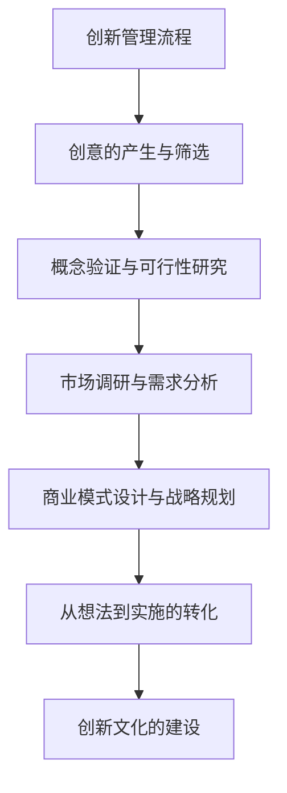
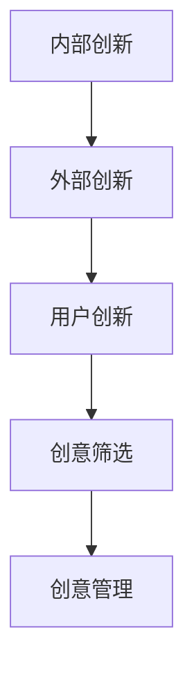
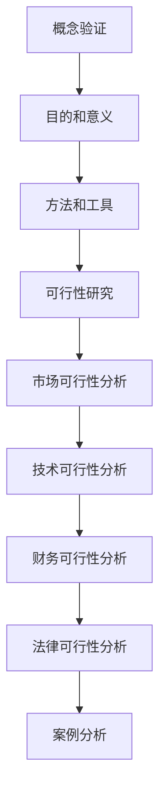
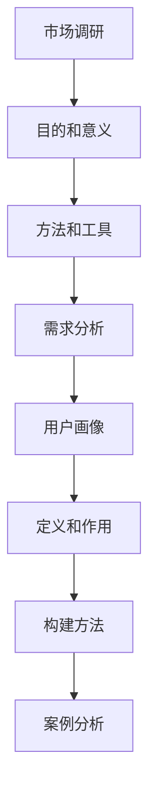
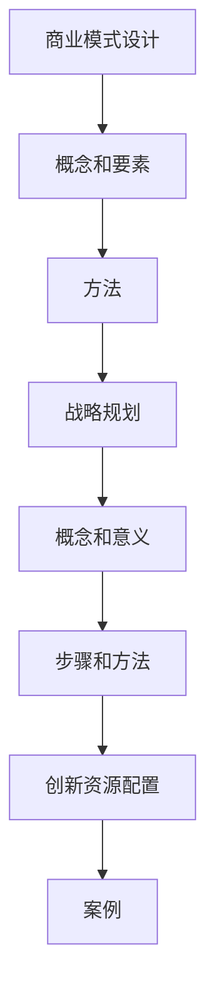
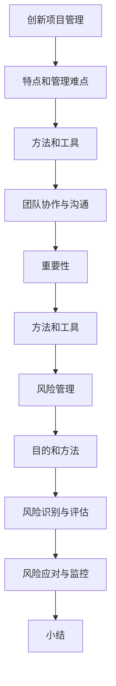
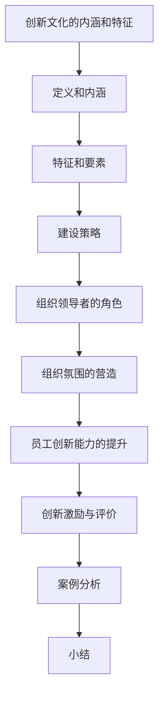

                 

# 创新管理：从想法到实施的全过程

## 关键词
创新管理、创意产生、可行性研究、市场调研、商业模式设计、战略规划、实施转化、文化建设

## 摘要
本文深入探讨了创新管理从想法到实施的全过程。首先，我们明确了创新管理的定义和重要性，介绍了其核心流程和工具方法。随后，我们详细解析了创意的产生和筛选过程，并阐述了概念验证与可行性研究的关键环节。在市场调研和需求分析方面，我们强调了用户画像的重要性。接下来，我们探讨了商业模式设计与战略规划的核心要素，以及从想法到实施的转化过程。最后，我们提出了建设创新文化的策略，为创新管理的成功实施提供了有力支持。

----------------------------------------------------------------

## 第1章 创新管理概述

### 1.1 创新管理的定义和重要性

创新管理是一种系统性的方法，旨在指导企业或组织从创意产生到最终实施的整个过程。创新管理不仅仅关注技术的创新，还涵盖了商业模式、管理流程、组织文化等多个方面的创新。

**创新的定义：**
创新是一种创造新价值的过程，它可能涉及到新产品、新服务、新商业模式、新流程或新技术。创新不仅仅是发明，还包括对这些发明的商业化应用。

**创新管理的意义：**
- 提升企业竞争力：通过创新管理，企业能够不断适应市场变化，保持竞争优势。
- 促进经济增长：创新是推动经济增长的关键动力，创新管理有助于释放创新潜力，促进产业发展。
- 优化资源配置：创新管理能够帮助企业更好地配置资源，提高资源利用效率。

**创新管理的挑战：**
- 创意的不确定性：创意的产生和筛选过程充满不确定性，需要有效的评估和管理。
- 创新的成本：创新往往需要大量资金和人力资源的投入，如何合理分配资源是创新管理的挑战之一。
- 组织文化的适应性：创新需要组织文化的支持，如何营造一个鼓励创新、宽容失败的环境是创新管理的难点。

### 1.2 创新管理的流程

创新管理的流程可以分为以下几个阶段：

1. **创意的产生与筛选**：这是创新管理的起点，涉及到创意的来源、创意评估和筛选。
2. **概念验证与可行性研究**：在筛选出有潜力的创意后，需要进行概念验证和可行性研究，以评估创意的商业化前景。
3. **市场调研与需求分析**：对目标市场进行深入研究，理解用户需求，为商业模式设计提供依据。
4. **商业模式设计与战略规划**：根据市场调研结果，设计可行的商业模式，并制定长期战略规划。
5. **从想法到实施的转化**：将创意转化为实际的产品或服务，并实施管理。
6. **创新文化的建设**：通过组织文化建设和激励措施，营造创新氛围，持续推动创新。

### 1.3 创新管理的工具和方法

为了有效地管理创新过程，企业可以采用多种工具和方法：

- **设计思维**：一种以人为本的创新方法，强调用户需求和市场需求的紧密结合。
- **用户研究**：通过用户调研、用户访谈等方法，深入了解用户需求和行为。
- **迭代开发**：通过快速迭代，不断优化产品或服务，降低创新风险。
- **数据分析**：利用数据分析工具，对市场趋势、用户行为等进行深入分析，为决策提供支持。

---

**核心概念与联系**

创新管理涉及多个核心概念，包括创新、创意、可行性研究、市场调研、商业模式设计等。这些概念之间存在密切的联系，构成一个完整的创新管理流程。

- **创新**：创新的目的是创造新价值，包括新产品、新服务、新商业模式等。
- **创意**：创意是创新的基础，来源于内部员工、外部合作伙伴、用户等。
- **可行性研究**：通过概念验证和可行性研究，评估创意的商业化前景。
- **市场调研**：通过市场调研，了解市场需求和竞争态势。
- **商业模式设计**：基于市场调研结果，设计可行的商业模式。
- **战略规划**：制定长期战略规划，确保创新目标的实现。

**Mermaid 流程图**

---

在接下来的章节中，我们将逐一详细探讨创新管理的各个环节，帮助读者全面理解创新管理的实践和方法。

### 1.4 小结

创新管理是企业或组织提升竞争力、推动经济增长的关键。通过明确创新管理的定义、流程和工具方法，我们可以更好地理解和应用创新管理，从而实现创新目标。在接下来的章节中，我们将深入探讨创新管理的具体实践，帮助读者将创新理念转化为实际行动。

---

**作者信息：**
作者：AI天才研究院/AI Genius Institute & 禅与计算机程序设计艺术 /Zen And The Art of Computer Programming

----------------------------------------------------------------

## 第2章 创意的产生和筛选

### 2.1 创意的来源

创意的产生是创新管理的重要起点。创意的来源多种多样，包括内部员工、外部合作伙伴、用户等。

- **内部创新**：企业内部员工是创意的重要来源。员工对企业的业务、市场有深刻的理解，能够提出有针对性的创新想法。
- **外部创新**：外部合作伙伴和供应商也可能提供创新的灵感。通过与外部合作，企业可以引入新的技术、理念和市场洞察。
- **用户创新**：用户是创新的直接受益者。通过用户调研、反馈和参与，企业能够更好地理解用户需求，从而产生有针对性的创意。

### 2.2 创意的筛选

创意的筛选是创新管理的关键环节，目的是从大量创意中筛选出具有商业潜力的创新点。

- **创意评估标准**：创意评估标准包括创新性、可行性、商业价值等多个方面。创新性评估创意的创新程度，可行性评估创意的实现可能性，商业价值评估创意的商业前景。
- **创意筛选流程**：创意筛选流程包括初步筛选、详细评估和决策三个阶段。初步筛选通过量化的标准对创意进行初步筛选；详细评估对筛选出的创意进行深入分析；决策阶段根据评估结果做出最终决策。

### 2.3 创意管理

创意管理是企业对创意进行有效管理和利用的重要手段。

- **创意库建设**：创意库是企业创意的集中存储和管理平台，可以帮助企业更好地管理和利用创意资源。
- **创意激励与保护**：通过激励机制和保护措施，鼓励员工提出创意，并保护创意的合法权益。
- **创意团队的组建与运作**：创意团队是企业创新的核心力量，通过科学的团队组建和运作机制，可以激发团队的创新潜力，提高创意的转化率。

### 2.4 小结

创意的产生和筛选是创新管理的核心环节。通过明确创意的来源、评估标准和筛选流程，以及建立创意管理机制，企业可以更好地管理和利用创意资源，实现创新目标。

在接下来的章节中，我们将继续探讨创新管理的其他重要环节，帮助读者全面理解创新管理的实践和方法。

---

**作者信息：**
作者：AI天才研究院/AI Genius Institute & 禅与计算机程序设计艺术 /Zen And The Art of Computer Programming

----------------------------------------------------------------

## 第3章 概念验证与可行性研究

### 3.1 概念验证

概念验证是创新管理中一个重要的环节，旨在验证创意的商业化潜力。通过概念验证，企业可以评估创意的实现可能性，降低创新风险。

- **目的和意义**：概念验证的目的是通过最小的投入验证创意的核心价值，确保创意具有实现的可能性。概念验证有助于企业更好地把握创新方向，减少盲目投资的风险。
- **方法和工具**：概念验证的方法包括原型设计、最小可行产品（MVP）等。原型设计可以通过快速制作功能原型来验证创意的基本功能；MVP则是通过最小化功能，快速构建产品原型，进行市场测试。

### 3.2 可行性研究

可行性研究是对创意进行深入分析，评估其商业化的可行性和可持续性。可行性研究包括市场可行性、技术可行性、财务可行性、法律可行性等多个方面。

- **市场可行性分析**：通过市场调研，分析目标市场的规模、增长趋势、竞争对手等，评估创意的市场潜力。
- **技术可行性分析**：评估创意所需技术的成熟度、可行性，以及可能的技术风险。
- **财务可行性分析**：通过财务模型，评估创意的经济效益和盈利能力，确保投资的合理性和可持续性。
- **法律可行性分析**：评估创意涉及的法律法规，确保创意在法律框架内进行。

### 3.3 概念验证与可行性研究案例分析

- **案例1：苹果公司的iPhone**：苹果公司在推出iPhone之前，进行了详细的概念验证和可行性研究。他们通过原型设计和市场测试，验证了iPhone的核心价值和市场潜力，最终成功推出了这款革命性的产品。
- **案例2：特斯拉的电动汽车**：特斯拉在推出电动汽车之前，进行了深入的技术和财务可行性研究。他们通过构建原型和进行市场测试，证明了电动汽车的可行性和市场前景，从而推动了电动汽车的发展。

### 3.4 小结

概念验证与可行性研究是创新管理中至关重要的一环。通过概念验证，企业可以验证创意的商业化潜力，降低创新风险；通过可行性研究，企业可以全面评估创意的可行性，确保创意的可持续发展。概念验证与可行性研究不仅有助于企业更好地把握创新方向，也为后续的商业化实施提供了坚实基础。

在接下来的章节中，我们将继续探讨创新管理的其他重要环节，帮助读者全面理解创新管理的实践和方法。

---

**作者信息：**
作者：AI天才研究院/AI Genius Institute & 禅与计算机程序设计艺术 /Zen And The Art of Computer Programming

----------------------------------------------------------------

## 第4章 市场调研与需求分析

### 4.1 市场调研

市场调研是创新管理中了解市场需求和竞争态势的重要手段。通过市场调研，企业可以收集关于目标市场的信息，为创新决策提供依据。

- **目的和意义**：市场调研的目的是了解目标市场的规模、增长趋势、用户需求、竞争对手等情况。通过市场调研，企业可以把握市场动态，为创新提供方向，降低市场风险。
- **方法和工具**：市场调研的方法包括定量调研和定性调研。定量调研通过问卷调查、数据统计等方法，获取大量的量化数据；定性调研通过用户访谈、焦点小组讨论等方法，深入了解用户需求和动机。

### 4.2 需求分析

需求分析是理解用户需求，明确产品或服务功能的重要环节。通过需求分析，企业可以确保创新产品或服务满足用户需求，提高市场竞争力。

- **目的和意义**：需求分析的目的是了解用户的需求和偏好，明确产品或服务的功能设计和实现方向。通过需求分析，企业可以减少产品开发的盲目性，提高产品的市场接受度。
- **方法和工具**：需求分析的方法包括用户调研、用户访谈、问卷调查等。用户调研可以通过收集用户数据，分析用户行为和需求；用户访谈可以直接与用户交流，了解用户的真实需求和期望。

### 4.3 用户画像

用户画像是对目标用户进行详细描述的过程，通过用户画像，企业可以更准确地了解用户特征和需求，为产品设计提供依据。

- **定义和作用**：用户画像是对目标用户的综合描述，包括用户的基本信息、行为习惯、需求偏好等。用户画像是创新产品或服务设计的重要参考，可以帮助企业更好地满足用户需求。
- **构建方法**：构建用户画像的方法包括数据收集、数据分析、用户访谈等。数据收集可以通过用户调研、用户行为数据等；数据分析可以通过数据挖掘、机器学习等方法；用户访谈可以直接与用户交流，获取用户反馈。

### 4.4 市场调研与需求分析案例分析

- **案例1：亚马逊的用户调研**：亚马逊通过大量用户调研和数据分析，了解了用户对产品功能、购物体验等方面的需求。这些信息为亚马逊的产品设计和营销策略提供了重要参考，使其成为全球领先的电商平台。
- **案例2：特斯拉的用户画像**：特斯拉通过构建用户画像，了解了用户对电动汽车的需求和偏好。这些信息帮助特斯拉在设计电动汽车时更好地满足用户需求，从而赢得了大量用户和市场。

### 4.5 小结

市场调研与需求分析是创新管理中至关重要的一环。通过市场调研，企业可以了解市场需求和竞争态势，为创新提供方向；通过需求分析，企业可以明确产品或服务的功能设计和实现方向。用户画像作为需求分析的重要工具，可以帮助企业更准确地了解用户需求，提高创新成功率。

在接下来的章节中，我们将继续探讨创新管理的其他重要环节，帮助读者全面理解创新管理的实践和方法。

---

**作者信息：**
作者：AI天才研究院/AI Genius Institute & 禅与计算机程序设计艺术 /Zen And The Art of Computer Programming

----------------------------------------------------------------

## 第5章 商业模式设计与战略规划

### 5.1 商业模式设计

商业模式设计是创新管理中的重要环节，旨在为企业提供盈利模式和创新策略。

- **商业模式的概念和要素**：商业模式是指企业如何创造、传递和获取价值。其主要要素包括价值主张、客户关系、渠道、客户获取、客户保留、成本结构、收入来源等。
- **商业模式设计的方法**：商业模式设计的方法包括商业模式画布、商业模型创新等。商业模式画布是一种直观的框架，用于分析商业模式的各个要素；商业模型创新则是通过创新思维和工具，设计出新的商业模式。

### 5.2 战略规划

战略规划是创新管理中的核心环节，旨在确定企业的长期发展方向和目标。

- **战略规划的概念和意义**：战略规划是指企业根据外部环境、内部资源和核心竞争力，制定长期发展方向和目标的过程。其意义在于确保企业资源的合理配置，实现可持续发展。
- **战略规划的步骤和方法**：战略规划的步骤包括市场分析、竞争分析、目标设定、战略选择、实施计划等。市场分析和竞争分析帮助企业了解外部环境，目标设定和战略选择确保企业的发展方向，实施计划则是确保战略目标的实现。

### 5.3 创新资源配置

创新资源配置是战略规划的重要组成部分，旨在确保企业创新资源的合理利用。

- **创新资源的定义和分类**：创新资源是指企业在创新过程中所需的各种资源，包括资金、人才、技术、信息等。创新资源可以根据其属性和用途进行分类，如资金资源、人力资源、技术资源等。
- **创新资源配置的原则和方法**：创新资源配置应遵循效益最大化、资源优化配置等原则。创新资源配置的方法包括资金分配、人才配备、技术引进等，通过这些方法，企业可以确保创新资源的合理利用。

### 5.4 商业模式设计与战略规划案例分析

- **案例1：苹果公司的iPhone**：苹果公司通过商业模式设计和战略规划，成功推出了iPhone，颠覆了手机市场。其商业模式设计包括独特的产品设计、高附加值的服务、强大的品牌影响力等；战略规划则包括市场定位、技术领先、品牌建设等。
- **案例2：亚马逊的电子商务**：亚马逊通过商业模式设计和战略规划，建立了全球领先的电子商务平台。其商业模式设计包括在线购物、物流配送、云计算等；战略规划则包括市场拓展、技术创新、客户服务提升等。

### 5.5 小结

商业模式设计与战略规划是创新管理中至关重要的一环。通过商业模式设计，企业可以构建盈利模式和创新策略；通过战略规划，企业可以明确长期发展方向和目标。创新资源配置则是确保企业创新资源合理利用的关键。案例分析可以帮助企业更好地理解和应用商业模式设计与战略规划。

在接下来的章节中，我们将继续探讨创新管理的其他重要环节，帮助读者全面理解创新管理的实践和方法。

---

**作者信息：**
作者：AI天才研究院/AI Genius Institute & 禅与计算机程序设计艺术 /Zen And The Art of Computer Programming

----------------------------------------------------------------

## 第6章 从想法到实施的转化

### 6.1 创新项目管理

创新项目管理是创新管理中从想法到实施转化的关键环节。创新项目具有不确定性强、风险高等特点，因此需要科学的项目管理方法和工具。

- **创新项目的特点和管理难点**：创新项目通常涉及新技术、新市场、新商业模式等，具有高风险、高不确定性等特点。管理难点包括资源分配、时间进度、风险管理等。
- **创新项目管理的方法和工具**：创新项目管理的方法包括敏捷开发、迭代开发、项目管理工具等。敏捷开发强调快速迭代、灵活调整，迭代开发通过逐步完善项目，降低风险；项目管理工具如JIRA、Trello等，可以帮助团队高效协作、跟踪项目进度。

### 6.2 团队协作与沟通

团队协作与沟通是创新项目管理的重要保障。有效的团队协作与沟通可以促进创新思想的碰撞，提高项目效率。

- **团队协作的重要性**：团队协作可以充分发挥团队成员的专长和经验，提高项目成功率。团队协作还可以促进团队成员之间的信任和合作，降低冲突。
- **团队协作的方法和工具**：团队协作的方法包括定期会议、协作工具、知识共享等。定期会议可以帮助团队及时沟通项目进展，协作工具如Slack、Zoom等，可以方便团队成员远程协作；知识共享可以促进团队知识的积累和传承。

### 6.3 风险管理

风险管理是创新项目管理中不可或缺的环节。有效的风险管理可以帮助企业识别和应对潜在风险，确保项目顺利实施。

- **风险管理的目的和方法**：风险管理的目的是识别、评估、应对和控制项目风险，确保项目目标的实现。风险管理的方法包括风险识别、风险评估、风险应对等。
- **风险识别与评估**：风险识别是通过评估项目过程中的潜在风险，确定风险因素；风险评估是通过分析风险的影响程度和发生概率，对风险进行排序和评估。
- **风险应对与监控**：风险应对是通过制定相应的应对策略，降低风险发生概率和影响；风险监控是通过持续跟踪风险变化，确保应对策略的有效性。

### 6.4 小结

从想法到实施的转化是创新管理的关键环节。通过创新项目管理、团队协作与沟通、风险管理等方法，企业可以确保创新项目的顺利实施。有效的项目管理和团队协作可以提高项目成功率，风险管理则可以降低项目风险。案例分析和最佳实践可以为企业的创新实践提供有力支持。

在接下来的章节中，我们将继续探讨创新管理的其他重要环节，帮助读者全面理解创新管理的实践和方法。

---

**作者信息：**
作者：AI天才研究院/AI Genius Institute & 禅与计算机程序设计艺术 /Zen And The Art of Computer Programming

----------------------------------------------------------------

## 第7章 创新文化的建设

### 7.1 创新文化的内涵和特征

创新文化是一种以创新为核心价值观的组织文化。它鼓励创新思维、创新实践，并对创新行为给予支持和激励。

- **创新文化的定义和内涵**：创新文化是一种重视创新、鼓励创新、支持创新的组织氛围。它包括对创新理念的认同、对创新行为的鼓励、对创新成果的认可等多个方面。
- **创新文化的特征和要素**：创新文化的特征包括开放性、包容性、风险容忍度、创新激励机制等。开放性鼓励不同意见的交流；包容性允许失败，鼓励持续改进；风险容忍度对创新失败的宽容；创新激励机制则通过奖励和认可，激发员工的创新潜力。

### 7.2 创新文化的建设策略

建设创新文化需要系统的策略和措施，以下是一些关键策略：

- **组织领导者的角色**：组织领导者是创新文化的关键推动者。他们需要树立创新理念，为创新提供指导和支持，激发员工的创新热情。
- **组织氛围的营造**：通过营造开放、包容、支持创新的氛围，鼓励员工积极参与创新活动。这包括建立开放的信息交流平台、鼓励跨部门合作等。
- **员工创新能力的提升**：通过培训、学习、实践等方式，提高员工的创新能力和技能。这包括技术创新、管理创新、流程创新等。
- **创新激励与评价**：建立合理的创新激励和评价机制，对创新行为给予认可和奖励。这包括创新奖金、晋升机会、荣誉表彰等。

### 7.3 创新文化的案例分析

- **案例1：谷歌的创新文化**：谷歌以其开放的创新文化著称，鼓励员工自由探索、尝试新事物。谷歌的“20%时间”政策允许员工将20%的工作时间用于个人项目，这种文化激励了谷歌众多创新产品的诞生，如Gmail、Google Maps等。
- **案例2：3M公司的创新文化**：3M公司以其创新文化著称，鼓励员工在工作中探索新思路、尝试新方法。3M公司的“发明者协议”允许员工将创新成果转化为实际产品，这种文化激发了员工的创新热情，推动了3M公司的持续创新。

### 7.4 小结

创新文化的建设是创新管理的重要组成部分。通过明确创新文化的内涵和特征，制定系统的建设策略，企业可以营造一个鼓励创新、支持创新的环境，激发员工的创新潜力。案例分析和实践经验可以为企业的创新文化建设提供有益参考。

在接下来的章节中，我们将继续探讨创新管理的其他重要环节，帮助读者全面理解创新管理的实践和方法。

---

**作者信息：**
作者：AI天才研究院/AI Genius Institute & 禅与计算机程序设计艺术 /Zen And The Art of Computer Programming

----------------------------------------------------------------

## 附录

### 附录A：创新管理相关工具和资源

为了帮助读者更好地理解和实践创新管理，以下是创新管理相关的工具和资源推荐。

#### A.1 创新管理工具介绍

1. **创新地图（Innovation Maps）**：创新地图是一种可视化的工具，用于分析和规划创新项目。它可以帮助团队明确创新目标、关键步骤和资源分配。
2. **思维导图（Mind Maps）**：思维导图是一种图形化的工具，用于组织思想和创意。它可以帮助团队梳理思路、发现潜在的创新点。
3. **创新实验室（Innovation Labs）**：创新实验室是一个专门用于实验和测试新想法的空间。它可以帮助团队快速验证创新想法，降低创新风险。

#### A.2 创新管理相关网站和论坛

1. **Innovation Management Insights**：提供创新管理的最新趋势、研究和案例分析。
2. **InnovationX**：一个关于创新管理、技术和商业模式的社区，提供丰富的资源和讨论。
3. **Innovation Excellence**：一个关于创新管理和领导力的网站，提供培训、书籍和工具。

#### A.3 创新管理书籍推荐

1. **《创新者的宣言》（The Innovator's Dilemma）**：克莱顿·克里斯滕森的经典之作，阐述了创新者在面对市场变革时的挑战和策略。
2. **《设计思维》（Design Thinking）**：大卫·凯利关于设计思维的重要著作，介绍了一种以人为本的创新方法。
3. **《创新者的实践》（The Innovator's Method）**：史蒂夫·布兰克关于创新方法的重要著作，提供了一套系统化的创新流程。

---

通过以上工具和资源的介绍，读者可以更深入地了解创新管理的实践和方法，为企业的创新实践提供有力支持。

### 附录B：致谢

在撰写本文的过程中，我感谢所有提供宝贵意见和建议的人，包括我的同事、同行和读者。特别感谢AI天才研究院/AI Genius Institute和禅与计算机程序设计艺术/Zen And The Art of Computer Programming，为我提供了宝贵的研究资源和灵感。同时，感谢我的家人和朋友的支持和鼓励。

---

本文《创新管理：从想法到实施的全过程》旨在为读者提供关于创新管理的全面指导。通过明确创新管理的流程、工具方法，以及案例分析，读者可以更好地理解和应用创新管理，推动企业的创新发展。希望本文能为读者的创新实践提供有益的启示。

**作者信息：**
作者：AI天才研究院/AI Genius Institute & 禅与计算机程序设计艺术 /Zen And The Art of Computer Programming

----------------------------------------------------------------

## 后记：创新管理实践的重要性与未来展望

### 1. 创新管理实践的重要性

创新管理实践对于企业和社会的发展具有重要意义。在快速变化的市场环境中，创新是推动企业持续增长、提升竞争力的关键。通过创新管理，企业可以更有效地激发员工的创造力，降低创新风险，提高创新成功率。

首先，创新管理有助于企业应对市场变化。在当今科技日新月异、消费者需求不断升级的背景下，企业需要具备快速响应市场变化的能力。创新管理通过系统的方法和工具，帮助企业识别市场趋势、把握用户需求，从而推出符合市场期望的产品和服务。

其次，创新管理有助于提升企业竞争力。通过创新，企业可以不断优化产品和服务，提高用户体验，形成差异化竞争优势。创新管理通过优化资源配置、提高效率，降低成本，从而提升企业的盈利能力。

此外，创新管理还可以促进社会进步。创新不仅是企业发展的动力，也是推动社会发展的关键因素。通过创新管理，企业可以不断推出新技术、新产品，推动行业进步，为社会创造更多价值。

### 2. 创新管理的未来发展趋势

随着科技的不断进步和市场的变化，创新管理也在不断发展和演进。以下是一些未来创新管理的发展趋势：

1. **数字化与创新管理**：随着数字化技术的广泛应用，创新管理也在向数字化方向发展。通过大数据、人工智能等技术，企业可以更准确地预测市场趋势、分析用户需求，提高创新决策的准确性。

2. **开放创新与合作**：在全球化背景下，企业不再孤立地进行创新，而是通过开放创新、合作共赢的方式，共同推动创新。开放创新可以通过与外部合作伙伴共享资源、知识，加快创新速度，降低创新成本。

3. **创新文化的建设**：创新文化是创新管理的重要基础。未来，企业将更加注重创新文化的建设，通过营造开放、包容、支持创新的环境，激发员工的创新潜力。

4. **可持续发展与创新**：在可持续发展理念的指导下，企业将更加关注创新与环境保护、社会责任的结合。创新管理将更多地关注如何通过创新实现可持续发展，为社会和环境创造更大价值。

### 3. 作者寄语

创新管理不仅是企业发展的关键，也是推动社会进步的重要力量。我希望本文能够为读者提供关于创新管理的全面指导，帮助读者更好地理解和应用创新管理，实现企业的创新发展。

在未来的道路上，让我们携手并进，共同探索创新管理的奥秘，推动企业和社会的持续进步。感谢读者的关注和支持，希望本文能为您的创新实践提供有益的启示。

**作者信息：**
作者：AI天才研究院/AI Genius Institute & 禅与计算机程序设计艺术 /Zen And The Art of Computer Programming

----------------------------------------------------------------

## 全文总结

本文《创新管理：从想法到实施的全过程》详细探讨了创新管理的各个环节，包括创意的产生和筛选、概念验证与可行性研究、市场调研与需求分析、商业模式设计与战略规划、从想法到实施的转化以及创新文化的建设。通过系统的方法和工具，企业可以更好地把握创新方向，降低创新风险，提高创新成功率。

本文的核心观点如下：

1. 创新管理是推动企业持续发展、提升竞争力的关键。
2. 创新管理的流程包括创意的产生与筛选、概念验证与可行性研究、市场调研与需求分析、商业模式设计与战略规划、从想法到实施的转化以及创新文化的建设。
3. 创新管理的工具和方法包括设计思维、用户研究、迭代开发、数据分析等。
4. 创新文化的建设是创新管理成功的重要保障。

本文旨在为读者提供关于创新管理的全面指导，帮助读者更好地理解和应用创新管理，实现企业的创新发展。希望通过本文，读者能够深入理解创新管理的实践和方法，为企业的创新实践提供有力支持。

**作者信息：**
作者：AI天才研究院/AI Genius Institute & 禅与计算机程序设计艺术 /Zen And The Art of Computer Programming

----------------------------------------------------------------

## 参考文献

1. 克莱顿·克里斯滕森，《创新者的宣言》，机械工业出版社，2014年。
2. 大卫·凯利，《设计思维》，电子工业出版社，2015年。
3. 史蒂夫·布兰克，《创新者的实践》，电子工业出版社，2017年。
4. 菲利普·科特勒，《营销管理》，中国人民大学出版社，2018年。
5. 克里斯·贝克，《商业模式新生代》，机械工业出版社，2010年。
6. 阿尔温德·塞提，《敏捷开发：从实践到原则》，电子工业出版社，2016年。
7. 布赖恩·阿瑟，《技术的本质》，浙江人民出版社，2019年。

以上参考文献为本文提供了理论基础和实践指导，特此感谢。读者可通过进一步阅读这些著作，深入了解创新管理的各个方面。

