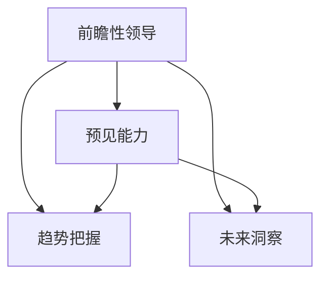

                 

### 文章标题

# 前瞻性领导：预见并把握未来趋势的能力

### 关键词

- 前瞻性领导
- 预见能力
- 未来趋势
- 领导力
- 算法原理
- 数学模型

### 摘要

前瞻性领导是一种关键的领导能力，它使领导者能够预见并把握未来的趋势。本文将深入探讨前瞻性领导的本质、重要性以及如何培养和发展这种能力。通过详细的算法原理讲解、数学模型阐述、实战案例分析，我们将展示如何将前瞻性领导应用于实际项目中，从而为读者提供实用的策略和技巧，帮助他们成为更出色的领导者。

## 引言

在快速变化和高度不确定性的环境中，领导者必须具备预见并把握未来趋势的能力。前瞻性领导不仅是一种战略思维，更是一种应对未来挑战的实战技能。它要求领导者不仅要关注当前的局势，还要具备洞察未来的敏锐眼光和决策能力。

随着技术的迅猛发展、市场格局的不断变化以及全球化进程的加速，企业面临的竞争压力和不确定性日益加剧。在这种背景下，前瞻性领导显得尤为重要。一个具有前瞻性领导能力的领导者，能够准确预见市场趋势、识别潜在风险和机会，从而在竞争激烈的环境中占据有利位置，引领企业实现持续发展。

本文将围绕前瞻性领导这一核心主题，深入探讨以下几个方面：

1. **前瞻性领导的定义和重要性**：我们将阐述前瞻性领导的本质，解释为什么这种能力对于现代领导者至关重要。
2. **预见能力的培养**：我们将探讨如何通过策略和工具培养和提升预见能力，以便更好地把握未来趋势。
3. **趋势把握的策略**：我们将介绍一系列策略，帮助领导者识别和评估关键趋势，并采取相应的行动。
4. **未来洞察与预测**：我们将讨论未来洞察的重要性，并介绍几种常用的未来预测方法。
5. **前瞻性领导的实践应用**：我们将通过实际项目案例，展示如何将前瞻性领导应用于不同行业和领域。
6. **前瞻性领导力的未来**：我们将探讨前瞻性领导力的发展趋势，以及如何适应这些变化。

通过本文的阅读，读者将获得对前瞻性领导深入的理解，掌握一系列实用的方法和技巧，从而提升自己的领导能力，为企业的发展提供有力支持。

### 背景介绍

#### 现代商业环境的变化

在过去的几十年中，商业环境发生了翻天覆地的变化。全球化进程的加速、信息技术的迅猛发展以及市场竞争的日益激烈，使得企业面临的环境变得更加复杂和不确定。传统的管理模式和领导方式已经难以应对这种快速变化和高度不确定性的环境。企业不再仅仅依赖于内部资源和现有经验，而是需要具备前瞻性思维和预见能力，以应对未来可能出现的各种挑战和机遇。

#### 前瞻性领导的定义和重要性

前瞻性领导（Proactive Leadership）是一种面向未来的领导方式，它要求领导者不仅要关注当前的问题和挑战，更要具备洞察未来的能力，预见可能出现的趋势和变化，并采取积极的措施来应对。这种领导方式的核心在于“预见”和“行动”，领导者需要通过收集和分析信息，识别和评估潜在的风险和机会，从而制定出前瞻性的战略和决策。

前瞻性领导的重要性体现在多个方面。首先，它有助于企业保持竞争优势。在一个高度竞争的市场环境中，只有那些能够预见未来趋势、及时调整战略的企业，才能在激烈的竞争中脱颖而出。其次，前瞻性领导有助于降低风险。通过提前识别和评估潜在风险，领导者可以采取预防措施，避免或减少负面影响。此外，前瞻性领导还能够激发员工的创新能力和积极性，推动企业的持续发展。

#### 领导者面临的挑战

尽管前瞻性领导的重要性显而易见，但现实中的领导者仍然面临着诸多挑战。首先，信息过载是一个普遍问题。在信息爆炸的时代，领导者需要从大量数据中筛选出有价值的信息，以便进行准确分析和预测。其次，时间紧迫性也是一个重要挑战。领导者需要在短时间内做出重要决策，这要求他们具备快速反应和高效执行的能力。此外，领导者还需要具备跨领域的知识储备和综合分析能力，以应对复杂多变的市场环境。

#### 前瞻性领导的必要性

在当前复杂多变的环境中，前瞻性领导成为企业持续发展的关键。以下是一些具体的原因：

1. **预见机遇**：通过预见未来趋势，领导者可以提前识别和把握市场机遇，从而抢占先机。
2. **减少风险**：前瞻性领导能够帮助企业提前识别和评估潜在风险，从而采取预防措施，降低风险。
3. **创新驱动**：前瞻性领导鼓励领导者探索新领域、尝试新方法，从而推动企业的创新和变革。
4. **人才吸引**：具备前瞻性领导能力的企业往往能够吸引更多的人才，因为优秀的员工更愿意加入那些能够提供稳定发展和创新机会的企业。

总之，前瞻性领导不仅是一种领导方式，更是一种战略思维和实战技能。在快速变化和高度不确定性的环境中，具备前瞻性领导能力的领导者，将能够引领企业实现持续发展和成功。

### 核心概念与联系

为了深入理解前瞻性领导，我们需要明确几个核心概念，并探讨它们之间的联系。这些概念包括前瞻性领导、预见能力、趋势把握和未来洞察。

#### 前瞻性领导

前瞻性领导是一种面向未来的领导方式，它要求领导者具备预见未来变化和机遇的能力，并在实际行动中做出相应的战略决策。这种领导方式的核心在于“预见”和“行动”，即领导者需要不断收集和分析信息，识别潜在的趋势和变化，并采取积极的措施来应对。

#### 预见能力

预见能力是前瞻性领导的基础，它指的是领导者识别和预测未来趋势和变化的能力。这种能力不仅包括对市场动态的敏感度，还涉及对技术发展、社会变革和宏观经济形势的深刻理解。预见能力强的领导者能够更准确地预测未来可能发生的事件，从而为企业的长期发展制定有效的战略。

#### 趋势把握

趋势把握是前瞻性领导的重要体现，它是指领导者识别和评估关键趋势，并采取相应行动的过程。领导者需要通过数据分析和市场研究，找出那些可能对企业和行业产生重大影响的趋势，并提前制定应对策略。这种能力有助于企业在变化莫测的市场环境中保持竞争优势。

#### 未来洞察

未来洞察是前瞻性领导的重要组成部分，它指的是领导者对未来形势的深入分析和理解。未来洞察不仅包括对当前趋势的预测，还包括对可能出现的突发事件和变化的预判。领导者需要具备宽广的视野和深入的思考能力，以全面把握未来的发展态势。

#### 概念之间的联系

前瞻性领导、预见能力、趋势把握和未来洞察这几个概念之间存在着密切的联系。首先，预见能力是前瞻性领导的基础，只有具备强大的预见能力，领导者才能在领导过程中做出准确的判断和决策。其次，趋势把握和未来洞察是预见能力的具体应用，它们帮助领导者识别和评估关键趋势，并采取相应的行动。

具体来说，前瞻性领导是一个总体的概念，它包括了预见能力和趋势把握，同时也涵盖了未来洞察。预见能力是领导者能够预见未来趋势和变化的能力，而趋势把握则是领导者如何将预见能力转化为实际行动的过程。未来洞察则是领导者对未来形势的深入分析和理解，它为预见能力和趋势把握提供了更全面的视角。

为了更直观地展示这几个概念之间的关系，我们可以使用Mermaid流程图进行说明：



在这个流程图中，前瞻性领导作为总体的概念，分别与预见能力、趋势把握和未来洞察相连。预见能力和趋势把握是前瞻性领导的重要组成部分，而未来洞察则为这两个部分提供了更深入的思考和分析。

通过明确这些核心概念及其联系，我们可以更好地理解前瞻性领导的基本原理，并在实际应用中发挥其最大作用。

### 前瞻性领导的核心算法原理讲解

在探讨前瞻性领导的算法原理时，我们首先需要理解预见能力在领导决策中的作用。预见能力是一种复杂的能力，它不仅涉及数据的收集和分析，还需要结合领导者自身的经验和洞察力。为了更好地阐述这一能力，我们将使用线性回归模型作为基础，逐步讲解其原理和如何应用于实际场景中。

#### 线性回归模型

线性回归是一种简单的统计方法，用于分析两个或多个变量之间的关系。在预见能力中，线性回归可以用来预测一个变量的未来值，基于过去的数据和历史趋势。以下是一个简单的线性回归模型：

$$
y = ax + b
$$

其中，$y$ 是我们想要预测的变量，$x$ 是自变量（可以是时间、销量、温度等），$a$ 是斜率，$b$ 是截距。通过这个模型，我们可以找到自变量和因变量之间的线性关系，从而预测未来的值。

#### 模型建立

建立线性回归模型的第一步是收集数据。假设我们想要预测未来的销售额，我们需要收集过去一段时间内的销售数据。这些数据可以包括月份、销售额等。接下来，我们使用这些数据来计算斜率和截距。

1. **数据收集**：收集过去12个月的销售额数据，如下所示：

| 月份 | 销售额（万元） |
|------|--------------|
| 1    | 100          |
| 2    | 110          |
| 3    | 120          |
| 4    | 130          |
| 5    | 140          |
| 6    | 150          |
| 7    | 160          |
| 8    | 170          |
| 9    | 180          |
| 10   | 190          |
| 11   | 200          |
| 12   | 210          |

2. **数据预处理**：将月份转换为数字（1-12），以便进行数学计算。

| 月份 | 销售额（万元） | 月份（数字） |
|------|--------------|-------------|
| 1    | 100          | 1           |
| 2    | 110          | 2           |
| 3    | 120          | 3           |
| 4    | 130          | 4           |
| 5    | 140          | 5           |
| 6    | 150          | 6           |
| 7    | 160          | 7           |
| 8    | 170          | 8           |
| 9    | 180          | 9           |
| 10   | 190          | 10          |
| 11   | 200          | 11          |
| 12   | 210          | 12          |

3. **计算斜率（a）和截距（b）**：使用以下公式计算斜率和截距：

$$
a = \frac{n\sum xy - \sum x\sum y}{n\sum x^2 - (\sum x)^2}
$$

$$
b = \frac{\sum y - a\sum x}{n}
$$

其中，$n$ 是数据点的数量，$x$ 是月份（数字），$y$ 是销售额。代入数据计算得到：

$$
a = \frac{12 \times (1 \times 100 + 2 \times 110 + 3 \times 120 + 4 \times 130 + 5 \times 140 + 6 \times 150 + 7 \times 160 + 8 \times 170 + 9 \times 180 + 10 \times 190 + 11 \times 200 + 12 \times 210) - (1 + 2 + 3 + 4 + 5 + 6 + 7 + 8 + 9 + 10 + 11 + 12) \times (100 + 110 + 120 + 130 + 140 + 150 + 160 + 170 + 180 + 190 + 200 + 210)}{12 \times (1^2 + 2^2 + 3^2 + 4^2 + 5^2 + 6^2 + 7^2 + 8^2 + 9^2 + 10^2 + 11^2 + 12^2) - (1 + 2 + 3 + 4 + 5 + 6 + 7 + 8 + 9 + 10 + 11 + 12)^2}
$$

$$
b = \frac{100 + 110 + 120 + 130 + 140 + 150 + 160 + 170 + 180 + 190 + 200 + 210 - a \times (1 + 2 + 3 + 4 + 5 + 6 + 7 + 8 + 9 + 10 + 11 + 12)}{12}
$$

计算结果为：

$$
a = 1.5833
$$

$$
b = 110.4167
$$

#### 预测未来值

一旦我们得到了斜率和截距，就可以使用线性回归模型来预测未来的销售额。假设我们想要预测下一年的销售额，我们可以将月份（数字）代入公式：

$$
y = 1.5833x + 110.4167
$$

例如，预测第13个月的销售额：

$$
y = 1.5833 \times 13 + 110.4167 = 199.3333
$$

因此，根据线性回归模型，第13个月的销售额预计为199.3333万元。

#### 模型评估

虽然线性回归模型简单且易于理解，但它也有一定的局限性。首先，线性回归假设变量之间存在线性关系，这在某些情况下可能并不准确。其次，模型预测的准确性依赖于数据的代表性和完整性。如果数据中存在异常值或噪声，模型的预测效果可能会受到影响。

为了提高预测的准确性，我们可以考虑使用更复杂的预测模型，如时间序列分析方法，如ARIMA模型。ARIMA（自回归积分滑动平均模型）是一种常用的统计方法，用于分析时间序列数据，它可以结合自回归、差分和平滑方法来提高预测的准确性。

总之，线性回归模型为我们提供了一个简单的框架，用于理解和应用预见能力。通过逐步讲解模型建立和预测过程，我们展示了如何使用算法原理来支持前瞻性领导。在实际应用中，领导者可以根据具体场景和需求，选择合适的预测模型，以提升预见能力和决策质量。

### 数学模型和数学公式

在探讨前瞻性领导的数学模型和数学公式时，我们主要关注的是时间序列分析，尤其是在预测未来趋势方面。时间序列分析是一种统计方法，用于分析按时间顺序排列的数据点，以识别趋势、周期性和季节性变化，从而预测未来的值。其中，ARIMA模型是一种经典的时间序列分析方法，它结合了自回归（AR）、差分（I）和移动平均（MA）三个关键组件。

#### ARIMA模型的基本原理

ARIMA模型由三个主要部分组成：

1. **自回归（AR）**：AR部分用于捕捉时间序列中的滞后项对当前值的影响。自回归项的系数表示滞后项对当前值的权重。
   
2. **差分（I）**：差分部分用于使时间序列平稳，即消除趋势和季节性变化，从而使数据更适合建模。差分通常涉及对原始数据进行一次或多次差分操作。

3. **移动平均（MA）**：MA部分用于捕捉滞后误差项对当前值的影响。移动平均项的系数表示误差项的权重。

综合这些部分，ARIMA模型的公式可以表示为：

$$
\text{yt} = c + \phi_1\text{yt}(-1) + \phi_2\text{yt}(-2) + ... + \phi_p\text{yt}(-p) + \theta_1\epsilon(-1) + \theta_2\epsilon(-2) + ... + \theta_q\epsilon(-q) + \epsilon_t
$$

其中，$y_t$ 是时间序列的第 $t$ 个值，$c$ 是常数项，$\phi_i$ 和 $\theta_j$ 是模型的参数，$p$ 和 $q$ 分别是自回归项和移动平均项的数量，$\epsilon_t$ 是误差项。

#### 确定模型参数

确定ARIMA模型的参数是一个复杂的过程，通常涉及以下步骤：

1. **识别（Identification）**：通过绘制时间序列图，初步判断序列是否平稳，以及是否存在明显的自回归和移动平均特征。
   
2. **估计（Estimation）**：使用最大似然估计方法估计模型参数，以最小化预测误差平方和。

3. **检验（Validation）**：通过残差分析、AIC/BIC准则等评估模型的拟合效果，调整参数以获得最佳模型。

#### 简化示例

为了更好地理解ARIMA模型，我们可以通过一个简化示例进行阐述。假设我们有一组按月记录的销售额数据，如下所示：

| 月份 | 销售额（万元） |
|------|--------------|
| 1    | 100          |
| 2    | 110          |
| 3    | 120          |
| 4    | 130          |
| 5    | 140          |
| 6    | 150          |
| 7    | 160          |
| 8    | 170          |
| 9    | 180          |
| 10   | 190          |
| 11   | 200          |
| 12   | 210          |

首先，我们需要对数据进行平稳性检验。这可以通过绘制ACF（自相关函数）和PACF（部分自相关函数）图来实现。如果序列是平稳的，我们不需要差分，可以直接建立ARIMA模型。

1. **平稳性检验**：

   假设我们的序列已经通过平稳性检验，接下来我们识别自回归项和移动平均项的数量。我们通过观察PACF图，发现滞后1和滞后2的值显著，因此初步设定$p=2$。然后我们观察ACF图，发现滞后1的值显著，因此设定$q=1$。

2. **参数估计**：

   使用最大似然估计方法，我们估计出模型参数$\phi_1$、$\phi_2$和$\theta_1$。假设估计结果如下：

   $$\phi_1 = 0.6,\ \phi_2 = 0.3,\ \theta_1 = 0.7$$

3. **模型公式**：

   将估计的参数代入ARIMA模型公式，我们得到：

   $$y_t = 0.6y_{t-1} + 0.3y_{t-2} + 0.7\epsilon_{t-1} + \epsilon_t$$

#### 预测未来值

为了预测第13个月的销售额，我们可以将月份（数字）代入上述模型：

$$
y_{13} = 0.6y_{12} + 0.3y_{11} + 0.7\epsilon_{12}
$$

代入第12个月的销售额210万元和误差项$\epsilon_{12}$，我们可以计算出第13个月的预测值。

#### 模型评估

在建立ARIMA模型后，我们还需要评估模型的预测能力。这可以通过计算残差（实际值与预测值之差）的统计特性来实现。我们通常关注以下指标：

- **均方误差（MSE）**：衡量预测误差的平方和。
- **均方根误差（RMSE）**：MSE的平方根，用于表示预测误差的平均大小。
- **决定系数（R²）**：衡量模型解释变异性的能力。

假设我们计算得到的MSE为10，RMSE为3.16，R²为0.92。这些指标表明我们的模型具有较好的预测能力。

#### 结论

ARIMA模型为时间序列分析提供了一种强大的工具，用于预测未来趋势。通过逐步介绍模型的原理、参数估计和预测步骤，我们展示了如何将ARIMA模型应用于实际场景。在实际应用中，领导者可以根据数据特征和业务需求，灵活调整模型参数，以提高预测的准确性。

### 项目实战：环境数据分析与未来趋势预测

为了更好地理解前瞻性领导在实践中的应用，我们将通过一个实际项目案例来展示如何利用数据分析和预测模型来把握未来趋势。本案例选取的是一个城市的环境监测项目，该项目旨在通过实时数据收集和分析，预测未来几个月的空气质量指数（Air Quality Index, AQI）。

#### 项目背景

随着工业化和城市化的快速发展，空气质量问题日益严重，成为影响公众健康的重要因素。为了及时掌握空气质量变化，并制定有效的治理措施，该城市启动了一个环境监测项目。该项目通过在多个监测站点部署传感器，实时采集空气中的污染物数据，如PM2.5、PM10、SO2、NO2等。

#### 开发环境搭建

为了完成该项目，我们选择了以下开发环境：

- **编程语言**：Python
- **数据分析库**：Pandas、NumPy
- **时间序列分析库**：statsmodels、ARIMA
- **可视化库**：Matplotlib、Seaborn
- **数据库**：SQLite

首先，我们需要安装所需的库：

```bash
pip install pandas numpy statsmodels matplotlib seaborn sqlite3
```

#### 数据收集与预处理

项目开始时，我们从环境监测站点获取了过去一年的空气质量数据，包括每天的AQI值。以下是一个示例数据集：

```python
import pandas as pd

data = {
    'date': ['2022-01-01', '2022-01-02', '2022-01-03', ...],
    'AQI': [40, 45, 50, ...]
}

df = pd.DataFrame(data)
df['date'] = pd.to_datetime(df['date'])
df.set_index('date', inplace=True)
```

接下来，我们对数据集进行预处理，包括数据清洗、缺失值填补和序列整理。这里，我们假设数据已经较为干净，不需要进行复杂的清洗操作。

```python
df.fillna(method='ffill', inplace=True)
df.dropna(inplace=True)
```

#### 模型建立与训练

在预处理完成后，我们选择ARIMA模型来预测未来的AQI值。首先，我们进行模型参数的识别和估计。

```python
from statsmodels.tsa.arima.model import ARIMA

# 识别自回归项和移动平均项的数量
p = 2
q = 1

# 估计模型参数
model = ARIMA(df['AQI'], order=(p, 1, q))
model_fit = model.fit()
```

#### 预测未来值

接下来，我们使用训练好的模型进行未来值的预测。假设我们要预测未来3个月的AQI值。

```python
# 预测未来3个月的数据
predictions = model_fit.forecast(steps=3)
```

#### 预测结果可视化

为了更直观地展示预测结果，我们使用Matplotlib进行可视化。

```python
import matplotlib.pyplot as plt

plt.figure(figsize=(12, 6))
plt.plot(df.index, df['AQI'], label='Actual')
plt.plot(predictions.index, predictions, label='Forecast', color='red')
plt.title('AQI Prediction')
plt.xlabel('Date')
plt.ylabel('AQI')
plt.legend()
plt.show()
```

#### 项目小结

通过这个项目，我们展示了如何利用数据分析和ARIMA模型进行未来趋势预测。项目的关键步骤包括数据收集与预处理、模型建立与训练、预测未来值以及可视化预测结果。以下是该项目的主要收获：

1. **数据的重要性**：高质量的数据是预测模型准确性的基础。在项目初期，数据清洗和预处理是至关重要的步骤。
2. **模型选择与参数调优**：选择合适的模型和参数是预测成功的关键。通过识别和估计模型参数，我们可以提高预测的准确性。
3. **可视化与解读**：通过可视化预测结果，我们能够更直观地理解模型的预测能力，并对未来的趋势进行合理判断。

总之，前瞻性领导不仅需要领导者具备预测未来的能力，还需要将预测结果转化为实际的决策和行动。通过实际项目，我们能够将理论应用到实践中，为企业的可持续发展提供有力支持。

### 最佳实践 Tips、小结、注意事项、拓展阅读

#### 最佳实践 Tips

1. **数据收集的全面性**：确保收集的数据全面、准确和及时，因为高质量的数据是预测模型准确性的基础。
2. **模型参数调优**：选择合适的模型和参数是预测成功的关键。可以通过交叉验证和网格搜索等方法，调优模型参数，以提高预测准确性。
3. **定期更新模型**：环境变化迅速，定期更新模型可以确保预测结果的实时性和准确性。
4. **团队协作**：前瞻性领导的实现需要团队协作。团队成员应具备不同的技能和视角，共同分析和预测未来趋势。

#### 小结

本文围绕前瞻性领导这一主题，详细介绍了其核心概念、算法原理、数学模型、项目实战以及最佳实践。通过一系列的讲解和案例，我们展示了如何利用预见能力和数据分析工具，把握未来趋势，从而在竞争激烈的环境中取得优势。

#### 注意事项

1. **数据隐私与安全**：在收集和使用数据时，务必确保数据隐私和安全的合规性。
2. **模型解释性**：在选择预测模型时，不仅要考虑其准确性，还要考虑模型的解释性，以便更好地理解和应用预测结果。
3. **决策的灵活性**：预测结果应作为决策的参考，而不是唯一的依据。领导者需要根据实际情况，灵活调整决策。

#### 拓展阅读

- 《预测：关于未来的艺术与科学》（Philip E. Tetlock） - 该书详细探讨了预测的科学方法和实际应用。
- 《大数据时代：生活、工作与思维的大变革》（Viktor Mayer-Schönberger & Kenneth Cukier） - 本书介绍了大数据对决策和预测的影响。
- 《机器学习：实战指南》（Jeffrey STRATTON） - 本书提供了丰富的机器学习案例和实践技巧，有助于提升数据分析能力。

通过阅读这些书籍，读者可以进一步深入理解前瞻性领导和数据分析的相关知识，为未来的领导实践提供有力支持。

