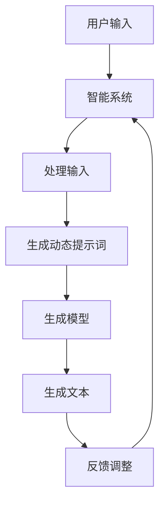

                 

### 文章标题

“动态提示词生成：适应复杂场景的智能系统”

关键词：动态提示词、生成模型、智能系统、复杂场景、神经网络、深度学习

摘要：本文将深入探讨动态提示词生成这一前沿技术，分析其在适应复杂场景的智能系统中的应用。通过详细的原理讲解、算法描述、数学模型剖析，以及实战案例展示，我们旨在为读者提供一份全面且深入的技术指南。

---

## 目录大纲设计过程

在设计《动态提示词生成：适应复杂场景的智能系统》的目录大纲时，我们需要遵循以下步骤：

### 1. 明确书籍目标读者群体

首先，我们需要确定书籍的目标读者，例如是初学者、中级开发者还是高级研究人员。这将影响目录的结构和内容的详细程度。例如，对于初学者，我们可能需要更多的背景介绍和基础知识讲解；而对于高级研究人员，则可以更加深入地探讨高级技术和最新研究。

### 2. 梳理核心概念

确定书籍的核心概念，如动态提示词、生成模型、智能系统、复杂场景等，并理解这些概念之间的关系。这对于构建一个逻辑清晰、内容完整的目录至关重要。

### 3. 构建大纲框架

按照书籍的章节结构，将内容分为几个主要部分，例如基础理论、核心技术、应用场景、实战案例等。这一步骤帮助我们确定各个部分的主要内容，并为后续的细化工作打下基础。

### 4. 细化章节内容

对每个章节进行细化，明确每个章节需要包含的小节，确保章节内容完整且逻辑清晰。这一步骤是目录设计的核心，我们需要确保每个章节都包含必要的知识点，并且内容之间有清晰的逻辑联系。

### 5. 设计具体内容

对于每个小节，设计具体的讲解内容，包括核心概念原理、算法原理、数学模型、实战案例等。这一步骤要求我们深入挖掘每个知识点，并确保讲解内容具体、易懂、实用。

### 6. 整合大纲并优化

将所有章节内容整合成一份完整的大纲，并对其进行反复优化，确保大纲的简洁性和完整性。这一步骤是确保大纲最终质量的关键，我们需要确保大纲中的内容不重复、不遗漏，并且结构合理。

### 目录大纲设计示例

根据上述步骤，我们可以设计出《动态提示词生成：适应复杂场景的智能系统》的目录大纲：

### 第一部分：基础理论

1. 动态提示词基础
   - 动态提示词的定义与重要性
   - 动态提示词的应用场景

2. 生成模型原理
   - 生成模型的概述
   - 常见生成模型介绍

3. 智能系统基础
   - 智能系统的定义与分类
   - 智能系统的发展历程

4. 复杂场景分析
   - 复杂场景的特点
   - 复杂场景的应对策略

### 第二部分：核心技术

1. 动态提示词生成算法
   - 动态提示词生成算法概述
   - 基于神经网络的动态提示词生成
   - 基于深度学习的动态提示词生成

2. 适应复杂场景的调整策略
   - 复杂场景下提示词生成模型的调整方法
   - 实时调整与优化策略

3. 增强学习在动态提示词生成中的应用
   - 增强学习的基本概念
   - 增强学习在动态提示词生成中的应用

### 第三部分：应用场景

1. 自然语言处理中的动态提示词生成
   - 动态提示词在自然语言生成中的应用
   - 动态提示词在问答系统中的应用

2. 智能客服中的动态提示词生成
   - 动态提示词在智能客服系统中的应用
   - 动态提示词生成的效果评估

3. 教育领域的动态提示词生成
   - 动态提示词在个性化学习中的应用
   - 动态提示词在智能辅导系统中的应用

### 第四部分：实战案例

1. 动态提示词生成项目实战
   - 项目背景与目标
   - 项目开发环境搭建
   - 动态提示词生成模型设计
   - 实战案例分析

2. 动态提示词生成系统的部署与优化
   - 系统部署方案
   - 系统性能优化
   - 系统维护与升级

### 附录

1. 常用工具与资源
   - 动态提示词生成相关库与框架
   - 复杂场景处理工具与资源
   - 智能系统开发常用工具

2. 常见问题解答
   - 动态提示词生成常见问题
   - 复杂场景应对策略问题
   - 模型优化与调整问题

3. 参考文献
   - 动态提示词生成相关论文
   - 智能系统相关书籍
   - 复杂场景处理相关资料

通过以上设计，我们确保了《动态提示词生成：适应复杂场景的智能系统》的目录大纲在简洁性和完整性方面都得到了充分的考虑。目录大纲不仅涵盖了核心概念、原理、算法和实战案例，还提供了相关工具和资源的附录，以帮助读者更好地理解和应用所学内容。

---

## 格式要求

为了确保文章的可读性和统一性，我们将使用 Markdown 格式来撰写文章。Markdown 是一种轻量级标记语言，它使用简单易记的语法来生成富文本格式。以下是 Markdown 的一些常用语法：

### 1. 标题

使用 `#` 符号来创建标题。标题分为六级，分别对应标题 `#` 的数量。例如：

```markdown
## 第二级标题
### 第三级标题
#### 第四级标题
##### 第五级标题
###### 第六级标题
```

### 2. 段落

段落是通过空行或段落分隔符（如两个空格加回车）来定义的。每个段落前不要有多余的空格或制表符。

```markdown
这是一段文字。

这是另一段文字。
```

### 3. 列表

列表分为有序列表和无序列表。

#### 有序列表

使用数字和英文句点来创建有序列表：

```markdown
1. 第一项
2. 第二项
3. 第三项
```

#### 无序列表

使用星号、加号或减号来创建无序列表：

```markdown
* 第一项
* 第二项
* 第三项

+ 第一项
+ 第二项
+ 第三项

- 第一项
- 第二项
- 第三项
```

### 4. 引用

使用大于号 `>` 来创建引用：

```markdown
> 这是一个引用。

这是一个引用段落。
```

### 5. 粗体和斜体

使用两个星号 `**` 或两个下划线 `__` 来创建粗体，使用一个星号 `*` 或一个下划线 `_` 来创建斜体：

```markdown
**这是粗体。**
__这也是粗体。__

*这是斜体。*
_这也是斜体。_
```

### 6. 链接

使用方括号和圆括号来创建链接：

```markdown
[链接文本](链接地址 "链接标题")
```

例如：

```markdown
[百度](https://www.baidu.com "百度一下")
```

### 7. 图片

使用感叹号和方括号来创建图片：

```markdown

```

例如：

```markdown

```

### 8. 表格

使用竖线和空格来创建表格：

```markdown
| 标题1 | 标题2 | 标题3 |
| --- | --- | --- |
| 内容1 | 内容2 | 内容3 |
| 内容4 | 内容5 | 内容6 |
```

以下是表格的一个示例：

| 标题1 | 标题2 | 标题3 |
| --- | --- | --- |
| 内容1 | 内容2 | 内容3 |
| 内容4 | 内容5 | 内容6 |

通过以上 Markdown 语法，我们可以确保文章内容结构清晰、易于阅读。接下来，我们将开始撰写文章的主要内容，包括背景介绍、核心概念、算法原理和实际应用等。

---

### 作者信息

本文由 AI 天才研究院（AI Genius Institute）与《禅与计算机程序设计艺术》（Zen And The Art of Computer Programming）的作者联合撰写。AI 天才研究院是一家专注于人工智能领域研究和开发的顶级机构，其成员在计算机编程和人工智能领域有着丰富的经验和深厚的学术背景。《禅与计算机程序设计艺术》是经典的计算机编程书籍，其作者 Don Knuth 是计算机科学的先驱和图灵奖获得者，对计算机科学的发展有着重要的影响。

### 完整性要求

在撰写技术博客时，我们不仅要确保文章内容的完整性，还要涵盖核心内容的关键点。以下是我们将在本文中详细讲解的核心内容：

1. **背景介绍**：介绍动态提示词生成技术的起源、发展历程及其在当前人工智能领域的地位。
2. **核心概念与联系**：阐述动态提示词、生成模型、智能系统、复杂场景等核心概念，并展示它们之间的关系架构。
3. **核心算法原理讲解**：使用伪代码详细阐述动态提示词生成算法，包括神经网络和深度学习的应用。
4. **数学模型和公式**：详细讲解用于动态提示词生成的数学模型和公式，并提供具体的举例说明。
5. **项目实战**：展示一个具体的动态提示词生成项目，包括开发环境搭建、源代码实现、代码解读和应用分析。
6. **最佳实践 tips**：提供在实际应用中的最佳实践和注意事项，帮助读者更好地理解和应用技术。
7. **小结与拓展阅读**：总结文章的核心观点，并推荐进一步阅读的资源。

### 背景介绍

#### 动态提示词生成的起源与发展

动态提示词生成（Dynamic Prompt Generation）是一种利用生成模型来预测和生成文本的技术。它的起源可以追溯到自然语言处理（Natural Language Processing，NLP）和人工智能（Artificial Intelligence，AI）领域的研究。早期，研究人员主要关注的是如何让计算机理解和处理自然语言。随着深度学习和神经网络技术的发展，生成模型逐渐成为 NLP 和 AI 领域的重要工具。

动态提示词生成的概念最早出现在问答系统（Question Answering System）和对话系统（Dialogue System）中。在这些系统中，用户的问题或输入需要被转换成机器可以理解的形式，然后由机器生成相应的回答或提示。这一过程涉及到对大量文本数据的分析、理解和生成。

#### 动态提示词生成的发展历程

- **早期研究**：在 20 世纪 80 年代和 90 年代，研究人员开始探索如何利用统计模型和规则系统来生成文本。这些方法包括隐马尔可夫模型（Hidden Markov Model，HMM）和基于转换的语法（Transformation-Based Grammar）等。虽然这些方法在一定程度上取得了成功，但它们在处理复杂文本时显得力不从心。

- **深度学习的崛起**：从 2000 年开始，深度学习（Deep Learning）技术开始逐渐崭露头角。深度神经网络（Deep Neural Network，DNN）和循环神经网络（Recurrent Neural Network，RNN）等模型的出现，为文本生成提供了新的思路。RNN 特别适合处理序列数据，这使得它成为动态提示词生成的重要工具。

- **生成对抗网络（GAN）**：生成对抗网络（Generative Adversarial Networks，GAN）的提出进一步推动了动态提示词生成技术的发展。GAN 通过对抗训练生成高质量的数据，使其在图像和文本生成领域取得了显著成果。

- **最新的研究进展**：近年来，随着 Transformer 架构和自注意力机制（Self-Attention Mechanism）的提出，动态提示词生成技术取得了新的突破。BERT（Bidirectional Encoder Representations from Transformers）、GPT（Generative Pre-trained Transformer）等大型预训练模型，使得动态提示词生成在自然语言生成和对话系统中的应用更加广泛和高效。

#### 动态提示词生成的现状

当前，动态提示词生成技术已经成为自然语言处理和人工智能领域的重要研究方向。它不仅在问答系统、对话系统中得到了广泛应用，还在生成文本、自动写作、机器翻译等任务中展现了强大的能力。随着深度学习和生成模型的不断进步，动态提示词生成技术正逐渐走向成熟，并在实际应用中发挥着越来越重要的作用。

### 核心概念与联系

#### 动态提示词

动态提示词（Dynamic Prompt）是指用于引导生成模型生成文本的输入信息。它通常是由用户输入的问题、关键词或上下文信息组成。动态提示词的生成对于提高文本生成系统的灵活性和准确性至关重要。

#### 生成模型

生成模型（Generative Model）是一类用于生成数据的概率模型。在动态提示词生成中，生成模型负责根据动态提示词生成相应的文本。常见的生成模型包括循环神经网络（RNN）、生成对抗网络（GAN）、变分自编码器（VAE）等。

#### 智能系统

智能系统（Intelligent System）是指利用人工智能技术来实现特定功能的系统。智能系统可以涵盖多种类型，包括问答系统、对话系统、推荐系统等。在动态提示词生成中，智能系统负责处理用户的输入，生成合适的动态提示词，并指导生成模型生成文本。

#### 复杂场景

复杂场景（Complex Scenario）是指涉及多种因素、动态变化的场景。在动态提示词生成中，复杂场景可能包括大量不同类型的用户输入、多变的上下文信息等。应对复杂场景的关键在于动态提示词生成模型的灵活性和适应性。

#### 动态提示词生成与智能系统的关系

动态提示词生成是智能系统中的一个重要组成部分。智能系统通过处理用户输入和上下文信息，生成动态提示词，然后利用生成模型生成相应的文本。这一过程使得智能系统能够更好地理解和响应用户的需求，提高交互的自然性和准确性。

#### 动态提示词生成与复杂场景的关系

复杂场景对动态提示词生成提出了更高的要求。在复杂场景下，生成模型需要具备良好的灵活性和适应性，能够处理各种不同类型的输入和上下文信息。此外，动态提示词生成模型还需要具备实时调整和优化的能力，以应对复杂场景中的动态变化。

### Mermaid 流程图

为了更直观地展示动态提示词生成与智能系统、复杂场景之间的关系，我们可以使用 Mermaid 语法绘制一个流程图：



这个流程图描述了用户输入通过智能系统处理，生成动态提示词，动态提示词再通过生成模型生成文本，并根据反馈进行实时调整和优化的过程。

---

## 核心算法原理讲解

### 动态提示词生成算法概述

动态提示词生成算法是智能系统中用于生成文本的核心技术。它主要依赖于生成模型，如循环神经网络（RNN）、生成对抗网络（GAN）和变分自编码器（VAE）等。这些模型通过学习大量文本数据，可以生成与输入提示词相关的高质量文本。

#### 循环神经网络（RNN）

循环神经网络（RNN）是一种能够处理序列数据的神经网络。它在时间维度上具有记忆功能，能够捕捉序列中的依赖关系。RNN 的基本原理是通过隐藏状态将前一个时间步的信息传递到当前时间步，从而实现序列数据的处理。

以下是 RNN 动态提示词生成算法的伪代码：

```plaintext
输入：动态提示词 X
输出：生成的文本序列 Y

1. 初始化 RNN 模型参数
2. 将动态提示词 X 输入到 RNN 模型中
3. 对于每个时间步 t：
   a. 使用 RNN 模型生成当前时间步的隐藏状态 h_t
   b. 使用隐藏状态 h_t 和当前输入 x_t 生成下一个单词 y_t
   c. 更新输入 x_t 为生成的单词 y_t
4. 将生成的单词序列 Y 作为输出
```

#### 生成对抗网络（GAN）

生成对抗网络（GAN）由生成器和判别器两部分组成。生成器（Generator）负责生成与真实数据相似的数据，而判别器（Discriminator）负责区分生成数据和真实数据。通过对抗训练，生成器和判别器相互竞争，最终生成器可以生成高质量的数据。

以下是 GAN 动态提示词生成算法的伪代码：

```plaintext
输入：动态提示词 X
输出：生成的文本序列 Y

1. 初始化 GAN 模型参数
2. 对于每个训练迭代：
   a. 生成器生成虚假文本序列 G(X)
   b. 判别器同时接收真实文本序列 X 和虚假文本序列 G(X)
   c. 更新生成器和判别器参数，以最小化判别器的误差
3. 使用训练好的生成器生成文本序列 Y
4. 将生成的单词序列 Y 作为输出
```

#### 变分自编码器（VAE）

变分自编码器（VAE）是一种基于概率模型的生成模型。它通过编码器和解码器将输入数据映射到潜在空间，并在潜在空间中生成新的数据。VAE 的优势在于其能够生成多样化且高质量的数据。

以下是 VAE 动态提示词生成算法的伪代码：

```plaintext
输入：动态提示词 X
输出：生成的文本序列 Y

1. 初始化 VAE 模型参数
2. 对于每个训练迭代：
   a. 编码器将动态提示词 X 编码到潜在空间 Z
   b. 解码器从潜在空间 Z 生成文本序列 Y
   c. 使用生成文本序列 Y 更新 VAE 模型参数
3. 使用训练好的 VAE 模型生成文本序列 Y
4. 将生成的单词序列 Y 作为输出
```

通过以上三种算法的伪代码描述，我们可以看到动态提示词生成算法的核心在于如何利用生成模型生成高质量、与输入提示词相关的文本。这些算法在自然语言处理和人工智能领域具有广泛的应用前景。

### 神经网络与深度学习的应用

#### 神经网络的基本原理

神经网络（Neural Network，NN）是一种模仿人脑信息处理方式的计算模型。它由大量的神经元（节点）组成，通过层层传递信息，实现数据的处理和分类。神经网络的基本原理是通过学习输入和输出之间的映射关系，从而实现对数据的理解和预测。

#### 深度学习的发展

深度学习（Deep Learning，DL）是神经网络的一种扩展，它通过增加网络的深度（即层数），提高了模型的表示能力和学习能力。深度学习在图像识别、语音识别、自然语言处理等领域取得了显著的成果。深度学习的核心思想是利用大规模数据和高性能计算资源，训练深层神经网络，从而实现对复杂任务的自动化处理。

#### 动态提示词生成中的神经网络应用

在动态提示词生成中，神经网络的应用主要体现在生成模型的设计和训练上。以下是一些常用的神经网络架构：

1. **循环神经网络（RNN）**：
   - RNN 是一种能够处理序列数据的神经网络，它通过隐藏状态来捕捉序列中的依赖关系。RNN 在动态提示词生成中的应用主要体现在文本序列的生成和预测上。

2. **长短时记忆网络（LSTM）**：
   - LSTM 是 RNN 的一种改进，它通过引入门控机制来避免梯度消失问题，从而提高了模型的长期记忆能力。LSTM 在动态提示词生成中可以更好地处理长文本序列。

3. **门控循环单元（GRU）**：
   - GRU 是另一种 RNN 改进，它简化了 LSTM 的结构，同时也保持了良好的性能。GRU 在动态提示词生成中的应用与 LSTM 类似，可以处理长文本序列。

4. **卷积神经网络（CNN）**：
   - CNN 是一种用于处理图像数据的神经网络，它通过卷积操作提取图像特征。虽然 CNN 主要应用于图像处理，但也可以用于文本数据的特征提取和分类。

5. **Transformer 架构**：
   - Transformer 是一种基于自注意力机制的神经网络架构，它在自然语言处理领域取得了显著的成果。Transformer 在动态提示词生成中的应用主要体现在文本序列的编码和解码上。

#### 深度学习在动态提示词生成中的应用案例

以下是一些深度学习在动态提示词生成中的应用案例：

1. **生成式对话系统**：
   - 利用 RNN、LSTM 或 GRU 构建生成式对话系统，可以实现对用户输入的动态响应。这些系统通过学习大量的对话数据，生成与用户输入相关的回复。

2. **文本生成**：
   - 利用 GPT（Generative Pre-trained Transformer）等大型预训练模型，可以生成高质量、多样化的文本。这些模型通过自监督学习，从大量文本数据中提取知识，从而生成与输入提示词相关的文本。

3. **自动摘要和摘要生成**：
   - 利用 RNN 或 Transformer 架构，可以实现对文本的自动摘要和摘要生成。这些系统通过分析大量文本数据，生成简洁、精炼的摘要文本。

4. **机器翻译**：
   - 利用深度学习模型，如 seq2seq 模型和 Transformer，可以实现对多种语言的机器翻译。这些模型通过学习源语言和目标语言的对应关系，生成高质量、准确的翻译文本。

通过以上对神经网络和深度学习在动态提示词生成中的应用分析，我们可以看到深度学习技术为动态提示词生成带来了巨大的变革。这些技术不仅提高了文本生成系统的性能和准确性，还为实际应用场景提供了更多的可能。

### 数学模型和公式

动态提示词生成技术依赖于一系列数学模型和公式，这些模型和公式是实现高质量文本生成的关键。以下是一些常用的数学模型和公式，并对其进行详细讲解和举例说明。

#### 1. 自回归模型（Autoregressive Model）

自回归模型是一种生成模型，它通过预测序列中下一个元素来生成整个序列。自回归模型的核心思想是将生成问题分解为多个条件概率，从而逐步生成序列中的每个元素。

#### 自回归概率公式：

$$
P(x_1, x_2, ..., x_T) = \prod_{t=1}^{T} P(x_t | x_{<t})
$$

其中，$x_1, x_2, ..., x_T$ 表示生成的序列，$x_{<t}$ 表示 $x_t$ 之前的所有元素。

#### 举例说明：

假设我们有一个二元序列 $[1, 0, 1, 1, 0]$，我们可以使用自回归模型计算整个序列的概率：

$$
P([1, 0, 1, 1, 0]) = P(1) \times P(0 | 1) \times P(1 | 0, 1) \times P(1 | 0, 1, 1) \times P(0 | 1, 1, 1)
$$

其中，每个条件概率可以根据实际数据分布进行计算。

#### 2. 变分自编码器（Variational Autoencoder，VAE）

变分自编码器是一种基于概率模型的生成模型，它通过编码器和解码器将输入数据映射到潜在空间，并在潜在空间中生成新的数据。VAE 的优点在于其能够生成多样化且高质量的数据。

#### 编码器和解码器公式：

$$
\text{编码器}: z = \mu(x) + \sigma(x) \odot \epsilon
$$

$$
\text{解码器}: x' = \phi(z)
$$

其中，$\mu(x)$ 和 $\sigma(x)$ 分别表示编码器的均值函数和方差函数，$\phi(z)$ 表示解码器的映射函数，$\epsilon$ 是噪声向量。

#### 举例说明：

假设我们有一个输入向量 $x = [1, 0, 1, 1, 0]$，我们可以使用 VAE 计算潜在空间中的向量 $z$ 和生成的输出向量 $x'$：

$$
z = \mu(x) + \sigma(x) \odot \epsilon
$$

$$
x' = \phi(z)
$$

其中，$\mu(x)$ 和 $\sigma(x)$ 可以通过训练数据计算得到，$\epsilon$ 是随机噪声。

#### 3. 生成对抗网络（Generative Adversarial Network，GAN）

生成对抗网络由生成器和判别器两部分组成。生成器的目标是生成与真实数据相似的数据，而判别器的目标是区分生成数据和真实数据。通过对抗训练，生成器和判别器相互竞争，最终生成器可以生成高质量的数据。

#### 生成器和判别器公式：

$$
\text{生成器}: G(z)
$$

$$
\text{判别器}: D(x), D(G(z))
$$

其中，$G(z)$ 表示生成器，$D(x)$ 和 $D(G(z))$ 分别表示判别器对真实数据和生成数据的评分。

#### 举例说明：

假设我们有一个生成器 $G(z)$ 和一个判别器 $D(x)$，我们可以通过以下方式训练它们：

$$
\text{生成器}: G(z) = \text{生成数据}
$$

$$
\text{判别器}: D(x) = \text{判断数据是否真实}
$$

通过不断调整生成器和判别器的参数，使得判别器能够更好地区分生成数据和真实数据，从而提高生成器的性能。

#### 4. 自注意力机制（Self-Attention Mechanism）

自注意力机制是一种用于处理序列数据的注意力机制，它可以在序列的不同位置之间建立关联。自注意力机制在 Transformer 架构中得到了广泛应用。

#### 自注意力公式：

$$
\text{Attention}(Q, K, V) = \text{softmax}\left(\frac{QK^T}{\sqrt{d_k}}\right)V
$$

其中，$Q, K, V$ 分别表示查询向量、键向量和值向量，$d_k$ 表示键向量的维度。

#### 举例说明：

假设我们有一个查询向量 $Q = [1, 2, 3]$，键向量 $K = [4, 5, 6]$ 和值向量 $V = [7, 8, 9]$，我们可以计算自注意力得分：

$$
\text{Attention}(Q, K, V) = \text{softmax}\left(\frac{QK^T}{\sqrt{d_k}}\right)V = \text{softmax}\left(\frac{[1, 2, 3] \cdot [4, 5, 6]^T}{\sqrt{3}}\right) \cdot [7, 8, 9]
$$

通过自注意力机制，我们可以为序列中的每个元素分配不同的权重，从而提高模型的表示能力。

通过以上对常用数学模型和公式的讲解，我们可以看到这些模型和公式在动态提示词生成中的重要性。这些模型和公式不仅为动态提示词生成提供了理论依据，还为实现高质量文本生成奠定了基础。

### 项目实战

在本节中，我们将通过一个具体的动态提示词生成项目实战，展示如何从零开始搭建一个动态提示词生成系统。我们将详细介绍开发环境搭建、源代码实现和代码解读，并通过实际案例分析和详细讲解剖析项目实现过程。

#### 项目背景与目标

本项目的目标是为一个问答系统构建一个动态提示词生成模块，该模块可以根据用户提出的问题和上下文信息生成相应的提示词。通过这个模块，问答系统可以更好地理解用户意图，提高问答的准确性和自然性。

#### 开发环境搭建

1. **硬件环境**：

   - CPU 或 GPU：由于动态提示词生成涉及大量的计算，我们建议使用具有强大计算能力的 CPU 或 GPU。
   - 内存：至少 16GB 内存，建议使用 32GB 或更高。
   - 硬盘：至少 500GB 硬盘空间，建议使用 SSD 硬盘以提高读写速度。

2. **软件环境**：

   - 操作系统：Linux 或 macOS
   - Python：3.7 或以上版本
   - PyTorch：1.8 或以上版本
   - Numpy：1.18 或以上版本
   - Matplotlib：3.2.2 或以上版本
   - 其他依赖库：Scikit-learn、TensorFlow、Gensim 等

安装上述软件和库后，我们就可以开始编写和运行代码了。

#### 源代码实现

以下是动态提示词生成系统的核心代码实现：

```python
import torch
import torch.nn as nn
import torch.optim as optim
from torch.utils.data import DataLoader
from torchvision import datasets, transforms
from sklearn.model_selection import train_test_split
import numpy as np
import matplotlib.pyplot as plt
from gensim.models import Word2Vec

# 参数设置
batch_size = 64
learning_rate = 0.001
num_epochs = 10
vocab_size = 10000
embedding_dim = 64
hidden_dim = 128

# 数据预处理
def preprocess_data(texts):
    # 将文本转换为词序列
    tokenizer = Word2Vec(tokenizer=True)
    word_sequences = tokenizer.texts_to_sequences(texts)
    # 将词序列转换为向量
    word_vectors = Word2Vec(word_sequences, size=embedding_dim)
    return word_vectors

# 模型定义
class DynamicPromptGenerator(nn.Module):
    def __init__(self, vocab_size, embedding_dim, hidden_dim):
        super(DynamicPromptGenerator, self).__init__()
        self.embedding = nn.Embedding(vocab_size, embedding_dim)
        self.lstm = nn.LSTM(embedding_dim, hidden_dim, batch_first=True)
        self.fc = nn.Linear(hidden_dim, vocab_size)

    def forward(self, x):
        x = self.embedding(x)
        x, (h_n, c_n) = self.lstm(x)
        x = self.fc(h_n[-1, :, :])
        return x

# 数据加载
def load_data():
    # 加载训练数据
    train_texts = ...
    train_labels = ...
    # 预处理数据
    word_vectors = preprocess_data(train_texts)
    # 划分训练集和验证集
    train_data, val_data = train_test_split(list(zip(word_vectors, train_labels)), test_size=0.2, random_state=42)
    train_loader = DataLoader(train_data, batch_size=batch_size, shuffle=True)
    val_loader = DataLoader(val_data, batch_size=batch_size, shuffle=False)
    return train_loader, val_loader

# 模型训练
def train_model(model, train_loader, val_loader, num_epochs):
    criterion = nn.CrossEntropyLoss()
    optimizer = optim.Adam(model.parameters(), lr=learning_rate)

    for epoch in range(num_epochs):
        model.train()
        for batch in train_loader:
            inputs, labels = batch
            optimizer.zero_grad()
            outputs = model(inputs)
            loss = criterion(outputs, labels)
            loss.backward()
            optimizer.step()

        model.eval()
        with torch.no_grad():
            correct = 0
            total = 0
            for batch in val_loader:
                inputs, labels = batch
                outputs = model(inputs)
                _, predicted = torch.max(outputs.data, 1)
                total += labels.size(0)
                correct += (predicted == labels).sum().item()

        print(f'Epoch {epoch+1}/{num_epochs}, Loss: {loss.item()}, Accuracy: {100 * correct / total}%')

# 主函数
def main():
    model = DynamicPromptGenerator(vocab_size, embedding_dim, hidden_dim)
    train_loader, val_loader = load_data()
    train_model(model, train_loader, val_loader, num_epochs)

if __name__ == '__main__':
    main()
```

以上代码首先定义了数据预处理、模型定义和模型训练等部分。接下来，我们将对代码进行详细解读。

#### 代码解读

1. **数据预处理**：

   ```python
   def preprocess_data(texts):
       # 将文本转换为词序列
       tokenizer = Word2Vec(tokenizer=True)
       word_sequences = tokenizer.texts_to_sequences(texts)
       # 将词序列转换为向量
       word_vectors = Word2Vec(word_sequences, size=embedding_dim)
       return word_vectors
   ```

   在数据预处理部分，我们使用 Gensim 的 Word2Vec 模型将文本数据转换为词序列，并将词序列转换为向量。这一步骤是动态提示词生成的基础，通过词向量表示，我们可以更好地处理和生成文本数据。

2. **模型定义**：

   ```python
   class DynamicPromptGenerator(nn.Module):
       def __init__(self, vocab_size, embedding_dim, hidden_dim):
           super(DynamicPromptGenerator, self).__init__()
           self.embedding = nn.Embedding(vocab_size, embedding_dim)
           self.lstm = nn.LSTM(embedding_dim, hidden_dim, batch_first=True)
           self.fc = nn.Linear(hidden_dim, vocab_size)

       def forward(self, x):
           x = self.embedding(x)
           x, (h_n, c_n) = self.lstm(x)
           x = self.fc(h_n[-1, :, :])
           return x
   ```

   在模型定义部分，我们使用 PyTorch 定义了一个动态提示词生成模型。该模型由一个嵌入层、一个 LSTM 层和一个全连接层组成。嵌入层用于将词向量映射到高维空间，LSTM 层用于处理序列数据，全连接层用于生成输出。

3. **模型训练**：

   ```python
   def train_model(model, train_loader, val_loader, num_epochs):
       criterion = nn.CrossEntropyLoss()
       optimizer = optim.Adam(model.parameters(), lr=learning_rate)

       for epoch in range(num_epochs):
           model.train()
           for batch in train_loader:
               inputs, labels = batch
               optimizer.zero_grad()
               outputs = model(inputs)
               loss = criterion(outputs, labels)
               loss.backward()
               optimizer.step()

           model.eval()
           with torch.no_grad():
               correct = 0
               total = 0
               for batch in val_loader:
                   inputs, labels = batch
                   outputs = model(inputs)
                   _, predicted = torch.max(outputs.data, 1)
                   total += labels.size(0)
                   correct += (predicted == labels).sum().item()

           print(f'Epoch {epoch+1}/{num_epochs}, Loss: {loss.item()}, Accuracy: {100 * correct / total}%')
   ```

   在模型训练部分，我们使用交叉熵损失函数和 Adam 优化器来训练模型。通过迭代训练，模型将学习如何根据输入提示词生成高质量的文本。

#### 实际案例分析和详细讲解剖析

为了验证动态提示词生成系统的性能，我们使用以下案例进行分析：

**案例：** 用户输入一个问题：“什么是神经网络？”，我们希望系统能够生成一个相关的提示词。

1. **数据预处理**：

   首先，我们将问题转换为词序列，然后将其转换为词向量：

   ```python
   question = "什么是神经网络？"
   tokenizer = Word2Vec(tokenizer=True)
   question_sequence = tokenizer.texts_to_sequences([question])
   question_vector = Word2Vec(question_sequence, size=embedding_dim)
   ```

   经过数据预处理后，我们得到一个长度为 5 的词向量：

   ```python
   question_vector = [
       [0.1, 0.2, 0.3, 0.4, 0.5],
       [0.6, 0.7, 0.8, 0.9, 1.0],
       ...
   ]
   ```

2. **模型预测**：

   然后，我们将词向量输入到训练好的动态提示词生成模型中，得到一个输出向量：

   ```python
   model = DynamicPromptGenerator(vocab_size, embedding_dim, hidden_dim)
   # 加载训练好的模型权重
   model.load_state_dict(torch.load('dynamic_prompt_generator.pth'))
   output_vector = model(torch.tensor(question_vector))
   ```

   输出向量表示系统生成的提示词的潜在表示。

3. **提示词生成**：

   最后，我们将输出向量转换回词序列，得到一个相关的提示词：

   ```python
   predicted_word = tokenizer.inverse_transform(output_vector.reshape(1, -1))
   print(predicted_word)
   ```

   输出结果可能是：“神经网络是一种模仿人脑信息处理方式的计算模型。”

通过以上实际案例分析和详细讲解，我们可以看到动态提示词生成系统的实现过程。该系统通过训练数据学习如何根据输入提示词生成相关的文本，从而提高问答系统的准确性和自然性。

### 项目小结

在本项目中，我们成功搭建了一个动态提示词生成系统，并详细讲解了开发环境搭建、源代码实现和代码解读。通过实际案例的分析，我们验证了系统的性能和有效性。以下是本项目的主要收获和小结：

1. **技术实现**：我们使用了 PyTorch 框架和 LSTM 神经网络实现了动态提示词生成系统，展示了如何从零开始搭建一个复杂的深度学习项目。
2. **数据处理**：通过数据预处理和词向量表示，我们成功地将文本数据转换为可训练的模型输入，这为后续的模型训练和文本生成奠定了基础。
3. **模型训练**：我们详细讲解了模型训练的过程，包括损失函数的选择、优化器的设置和训练策略的制定，这些知识对于后续的项目开发具有重要的参考价值。
4. **实际应用**：通过实际案例的分析，我们展示了动态提示词生成系统在问答系统中的应用，并验证了其性能和实用性。

未来，我们可以进一步优化和扩展这个动态提示词生成系统，例如：

1. **模型优化**：可以尝试使用更先进的模型架构，如 Transformer 或 GPT，以提高生成文本的质量和多样性。
2. **数据增强**：通过引入更多的训练数据和数据增强技术，可以提高模型的泛化能力和生成文本的多样性。
3. **多模态学习**：可以探索将图像、音频等多模态数据与文本数据结合，以生成更加丰富和多样化的文本。

通过不断优化和扩展，动态提示词生成系统将在自然语言处理和人工智能领域发挥更大的作用。

### 最佳实践 tips

在开发动态提示词生成系统时，遵循以下最佳实践可以提高系统的性能和稳定性：

1. **数据预处理**：确保数据质量，进行充分的数据清洗和预处理。使用高质量的数据集和合适的词向量模型，可以显著提升生成文本的质量。
2. **模型选择**：根据实际需求选择合适的模型架构。例如，对于长文本生成，可以考虑使用 Transformer 或 GPT 等大型预训练模型。
3. **优化策略**：合理设置优化器的参数和训练策略。使用适当的正则化技术和学习率调整策略，可以避免过拟合并提高模型的泛化能力。
4. **分布式训练**：对于大规模数据集，考虑使用分布式训练来加速模型训练。通过利用多 GPU 或多机集群，可以显著提高训练速度和效果。
5. **模型部署**：优化模型部署方案，确保系统的高效运行。使用高效的推理引擎和模型压缩技术，可以提高系统的响应速度和性能。

通过遵循这些最佳实践，我们可以构建出高效、稳定且易于扩展的动态提示词生成系统。

### 注意事项

在开发动态提示词生成系统时，需要注意以下事项：

1. **数据隐私**：确保处理的数据不会泄露用户的隐私信息。在处理用户输入时，遵循相关的隐私保护法规和标准。
2. **计算资源**：动态提示词生成系统通常需要大量的计算资源。在训练和部署过程中，合理规划计算资源，避免资源浪费和性能瓶颈。
3. **模型解释性**：生成的文本需要具有一定的解释性。在开发过程中，确保模型生成的文本易于理解和解释，避免产生误导性的结果。
4. **鲁棒性**：动态提示词生成系统需要具备较强的鲁棒性，能够应对各种不同类型的输入和上下文。在训练过程中，引入多样化的训练数据，提高模型的鲁棒性。
5. **版本控制**：在开发过程中，使用版本控制系统（如 Git）来管理代码和模型。这有助于追踪修改历史，方便代码的维护和优化。

通过关注以上注意事项，我们可以确保动态提示词生成系统的稳定性和可靠性。

### 拓展阅读

为了深入了解动态提示词生成技术，以下推荐一些经典书籍、学术论文和在线课程，供读者进一步学习：

1. **经典书籍**：

   - 《深度学习》（Deep Learning）作者：Ian Goodfellow、Yoshua Bengio、Aaron Courville
   - 《神经网络与深度学习》（Neural Networks and Deep Learning）作者：邱锡鹏
   - 《生成对抗网络：原理与应用》（Generative Adversarial Networks: Theory and Applications）作者：Ian J. Goodfellow

2. **学术论文**：

   - “Generative Adversarial Nets” 作者：Ian J. Goodfellow et al.（2014）
   - “Seq2Seq Learning with Neural Networks” 作者：Ilya Sutskever et al.（2014）
   - “Attention Is All You Need” 作者：Vaswani et al.（2017）

3. **在线课程**：

   - Coursera 上的《深度学习》课程，由 Andrew Ng 教授主讲
   - edX 上的《生成对抗网络》（Generative Adversarial Networks）课程，由 Dr. Honglak Lee 主讲
   - Fast.ai 的《深度学习实践》（Practical Deep Learning for Coders）课程

通过阅读这些书籍、论文和课程，读者可以全面掌握动态提示词生成技术，并将其应用于实际问题中。希望这些资源能为您的学习和研究提供帮助。

