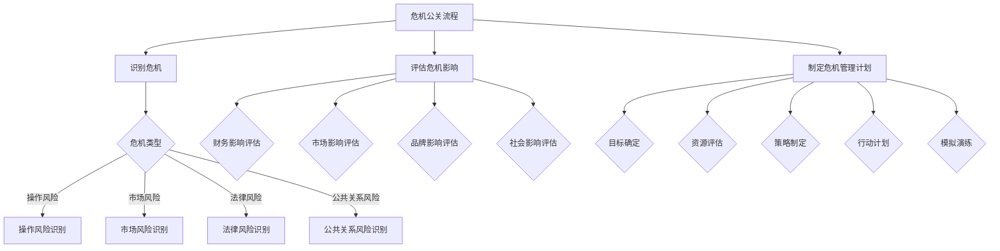

                 


### 1. 引入章节：介绍危机公关的基本概念和重要性

在当今快速发展的社会中，组织和个人面临着前所未有的挑战。这些挑战不仅来自内部管理，还包括外部环境的变化和不可预测的危机事件。危机公关作为组织应对危机、维护声誉的重要手段，其重要性日益凸显。本文将围绕《危机公关：维护团队和组织声誉的技巧》这一主题，详细探讨危机公关的基本概念、重要性以及其历史发展。

#### 1.1 危机公关的定义

危机公关，是指组织在面对危机事件时，通过有效的沟通和策略，迅速响应并控制危机，以最大限度地减少负面影响，维护组织的声誉和利益。危机事件可以是自然灾害、产品缺陷、内部腐败、高管丑闻等。危机公关的核心目标是确保信息的透明度、一致性和及时性，从而在危机中保持组织的信誉和合法性。

#### 1.2 危机公关的重要性

1. **维护组织声誉**：组织声誉是组织的无形资产，直接关系到组织的市场地位和竞争力。有效的危机公关可以帮助组织在危机中迅速反应，防止声誉受损。

2. **减少经济损失**：危机事件往往伴随着经济损失。通过危机公关，组织可以减少因危机引发的财务损失，例如客户流失、市场份额下降等。

3. **稳定员工士气**：危机事件对员工心理产生巨大压力。有效的危机公关可以缓解员工的恐慌情绪，增强员工对组织的信任，从而稳定员工士气。

4. **维持客户关系**：客户是组织的生命线。危机公关可以帮助组织与客户建立和维护良好的关系，减少危机事件对客户的影响。

#### 1.3 危机公关的历史发展

危机公关的发展经历了从无到有、从传统到现代的演变过程。在古代，危机管理主要通过道德教育和自我约束来实现。随着工业革命的到来，危机管理逐渐成为企业关注的重要问题。20世纪中叶，随着公共关系学的兴起，危机公关作为其一部分开始得到重视。近年来，随着互联网和社交媒体的普及，危机公关的方法和手段也不断更新。

### 1.4 结论

本文简要介绍了危机公关的基本概念和重要性，并回顾了危机公关的历史发展。在接下来的部分，我们将详细探讨危机管理、策略制定、传播策略、响应行动、重建声誉等方面的内容。通过这些讨论，希望能够帮助读者更好地理解和应用危机公关技巧，以应对各类危机事件。

#### 关键词：危机公关、危机管理、策略制定、传播策略、响应行动、重建声誉

---

## 2. 危机管理：讨论如何识别和评估潜在的危机

危机管理是危机公关的核心环节，其目的在于提前识别和评估潜在的危机，以便在危机发生时能够迅速响应，降低危机对组织造成的损害。在本章节中，我们将详细探讨如何识别潜在的危机、评估危机的影响以及制定危机管理计划。

### 2.1 识别潜在的危机

#### 2.1.1 危机的类型

首先，我们需要了解危机的类型，以便更好地识别潜在危机。危机主要可以分为以下几类：

1. **操作风险**：由于内部操作失误或管理不善导致的危机，如产品缺陷、服务质量问题等。
2. **市场风险**：由于市场需求变化或竞争加剧导致的危机，如市场份额下降、品牌形象受损等。
3. **法律风险**：由于违反法律法规或合同条款导致的危机，如侵权诉讼、违规操作等。
4. **公共关系风险**：由于公共关系问题导致的危机，如高管丑闻、负面舆论等。

#### 2.1.2 危机预警机制

为了有效识别潜在的危机，组织需要建立一套完善的预警机制。以下是一些常见的预警机制和方法：

1. **数据分析**：通过对历史数据、市场趋势、客户反馈等进行分析，预测潜在的风险。
2. **舆情监测**：利用互联网监测工具，实时监控网络上的言论和舆论，及时发现负面信息。
3. **内部反馈**：鼓励员工和客户提供反馈，通过他们的视角发现潜在问题。
4. **定期审查**：定期对组织内部流程、政策、资源等进行审查，识别潜在的风险点。

### 2.2 评估危机的影响

#### 2.2.1 影响评估

在识别潜在危机后，我们需要对危机的影响进行评估。影响评估主要包括以下几个方面：

1. **财务影响**：评估危机可能带来的直接和间接经济损失，如赔偿费用、诉讼费用、品牌贬值等。
2. **市场影响**：评估危机可能对市场地位、客户信任度、市场份额等方面的影响。
3. **品牌影响**：评估危机可能对品牌形象、公众信任度等方面的影响。
4. **社会影响**：评估危机可能对社会舆论、公众情绪等方面的影响。

#### 2.2.2 损失预测

为了更准确地预测危机可能带来的损失，组织可以采用以下方法：

1. **历史数据**：通过分析以往危机事件的数据，预测类似危机可能带来的损失。
2. **模拟分析**：通过模拟危机情景，评估不同应对策略的效果，从而预测可能的损失。
3. **专家意见**：邀请行业专家对危机的影响进行评估，提供专业意见。

### 2.3 制定危机管理计划

#### 2.3.1 计划制定流程

制定危机管理计划是一个系统性的过程，主要包括以下几个步骤：

1. **确定目标**：明确危机管理的目标，如减少损失、维护声誉等。
2. **评估资源**：评估组织在应对危机时所需的资源，如人力、财力、技术等。
3. **制定策略**：根据危机的类型和影响，制定具体的应对策略。
4. **制定行动计划**：将策略转化为具体的行动计划，明确责任人、时间节点等。
5. **模拟演练**：通过模拟演练，验证危机管理计划的可行性。

#### 2.3.2 计划制定要点

在制定危机管理计划时，需要注意以下几个要点：

1. **及时性**：危机管理计划需要迅速响应，确保在危机发生时能够立即执行。
2. **灵活性**：危机管理计划需要具备一定的灵活性，以适应不断变化的危机形势。
3. **沟通机制**：建立有效的沟通机制，确保信息在组织内部和外部的畅通。
4. **培训与演练**：定期对员工进行危机管理培训，并组织演练，提高应对危机的能力。

### 2.4 结论

通过有效的危机管理，组织可以提前识别和评估潜在的危机，从而在危机发生时迅速响应，降低危机对组织造成的损害。在本章节中，我们详细探讨了危机的类型、识别方法、评估方法以及危机管理计划的制定。在下一章节，我们将进一步讨论策略制定和传播策略，帮助组织更好地应对危机。

#### 核心概念与联系：危机公关的流程架构



---

### 3. 策略制定：介绍制定危机应对策略的方法

在危机管理过程中，策略制定是至关重要的一环。合理的策略可以有效地减轻危机带来的负面影响，甚至将危机转化为组织发展的契机。在本章节中，我们将详细讨论制定危机应对策略的方法、关键因素以及不同类型的危机应对策略。

#### 3.1 制定危机应对策略的方法

制定危机应对策略是一个系统性的过程，需要综合考虑危机的类型、影响以及组织的资源状况。以下是一些常见的策略制定方法：

##### 3.1.1 威胁应对策略

1. **反击策略**：在危机发生时，通过积极主动的方式反击，纠正错误，挽回声誉。例如，公开道歉、发布澄清声明等。

2. **防御策略**：在危机发生时，采取防御措施，防止危机进一步扩大。例如，暂停相关业务、加强内部管理等。

3. **折衷策略**：在危机发生时，通过妥协和协商的方式，寻求解决问题的方法。例如，与客户进行谈判，达成赔偿协议等。

##### 3.1.2 挑战应对策略

1. **适应性策略**：在危机发生时，灵活调整策略，以适应不断变化的危机形势。例如，根据客户反馈调整产品功能，以提升客户满意度。

2. **创新策略**：在危机发生时，通过创新的方法解决问题，从而化解危机。例如，开发新的技术或产品，以替代有问题的产品。

3. **合作策略**：在危机发生时，与其他组织或个人合作，共同应对危机。例如，与竞争对手合作，共同解决市场危机。

#### 3.2 策略制定的关键因素

在制定危机应对策略时，需要考虑以下几个关键因素：

1. **组织文化**：组织文化是制定策略的基础。不同的组织文化会影响策略的选择和执行。例如，强调透明度和开放性的组织可能更倾向于采取透明公开的策略。

2. **资源状况**：组织的资源状况直接影响策略的选择和执行。例如，资源充足的组织可能更倾向于采取积极的反击策略。

3. **危机类型**：不同的危机类型需要不同的应对策略。例如，操作风险可能需要更严格的内部管理，而市场风险可能需要更灵活的市场策略。

4. **危机影响**：危机的影响范围和严重程度将直接影响策略的选择。例如，重大危机可能需要采取更为严密的防御策略。

#### 3.3 不同类型的危机应对策略

根据危机的类型，可以制定相应的应对策略。以下是一些常见类型的危机及其应对策略：

1. **操作风险**：应对操作风险的主要策略是加强内部管理和质量控制。例如，通过加强员工培训和引入更严格的质量控制流程，减少操作风险。

2. **市场风险**：应对市场风险的主要策略是调整市场策略，以适应市场变化。例如，通过市场调研和客户反馈，及时调整产品功能和服务内容。

3. **法律风险**：应对法律风险的主要策略是遵守法律法规，并通过法律手段保护组织的权益。例如，聘请专业律师团队，确保组织的合规性。

4. **公共关系风险**：应对公共关系风险的主要策略是积极沟通和危机管理。例如，通过公开道歉和澄清声明，挽回公众对组织的信任。

#### 3.4 结论

通过合理的策略制定，组织可以在危机中保持冷静，迅速应对，降低危机带来的负面影响。在本章节中，我们详细介绍了制定危机应对策略的方法、关键因素以及不同类型的危机应对策略。在下一章节，我们将探讨传播策略，帮助组织有效地与公众沟通，应对危机。

#### 核心算法原理讲解

在危机公关中，策略制定的关键在于如何根据危机的实际情况选择和调整策略。这里，我们可以使用一种简单的决策树算法来模拟策略选择的逻辑过程。

```python
# 决策树算法伪代码

def decision_tree(crisis_type, organizational_culture, resource_status, crisis_impact):
    if crisis_type == "操作风险":
        if organizational_culture == "透明开放":
            return "反击策略"
        elif resource_status == "充足":
            return "防御策略"
        else:
            return "折衷策略"
    elif crisis_type == "市场风险":
        if organizational_culture == "创新驱动":
            return "创新策略"
        elif resource_status == "充足":
            return "适应性策略"
        else:
            return "合作策略"
    elif crisis_type == "法律风险":
        if organizational_culture == "遵规守纪":
            return "法律策略"
        else:
            return "合作策略"
    elif crisis_type == "公共关系风险":
        if crisis_impact == "重大":
            return "积极沟通策略"
        else:
            return "危机管理策略"
    else:
        return "未知策略"
```

#### 数学模型和公式

为了更好地理解危机影响评估，我们可以使用以下数学模型来预测危机可能带来的财务损失：

$$
\text{预期损失} = \sum_{i=1}^{n} (\text{概率}_{i} \times \text{损失}_{i})
$$

其中，$n$ 表示可能受到影响的财务项目数，$\text{概率}_{i}$ 表示第 $i$ 个财务项目受到危机影响的概率，$\text{损失}_{i}$ 表示第 $i$ 个财务项目可能带来的损失。

#### 详细讲解与举例说明

假设一个企业面临一场市场危机，通过调查，得知以下数据：

| 财务项目 | 概率 | 损失（万元） |
| :----: | :----: | :----: |
| 客户流失 | 0.5 | 100 |
| 品牌贬值 | 0.3 | 200 |
| 诉讼费用 | 0.2 | 150 |
| 其他费用 | 0.1 | 50 |

使用上述数学模型，我们可以计算出预期损失：

$$
\text{预期损失} = (0.5 \times 100) + (0.3 \times 200) + (0.2 \times 150) + (0.1 \times 50) = 50 + 60 + 30 + 5 = 145 \text{万元}
$$

#### 项目实战

假设一家互联网公司在发布新产品时遇到了操作风险，导致部分用户隐私数据泄露。根据上述决策树算法，我们可以制定以下策略：

- **危机类型**：操作风险
- **组织文化**：强调透明度和用户隐私保护
- **资源状况**：资源充足
- **危机影响**：尚未造成重大损失，但影响到了用户信任

根据决策树算法，我们可以选择“反击策略”，即：

1. **立即公开道歉**：通过官方渠道向用户和公众道歉，解释数据泄露的原因。
2. **加强内部管理**：审查和改进数据处理流程，确保用户数据安全。
3. **提供补救措施**：为受影响用户提供补偿，如免费会员服务、安全培训等。
4. **透明公开**：定期更新处理进展，保持与用户的沟通。

通过这些措施，公司可以有效减轻危机带来的负面影响，并重建用户信任。

### 4. 传播策略：探讨如何通过媒体和其他渠道进行沟通

在危机公关中，传播策略起着至关重要的作用。通过有效的传播策略，组织可以确保信息的透明度、一致性和及时性，从而在危机中维护声誉，赢得公众的信任。在本章节中，我们将详细探讨媒体关系管理、传播计划制定以及社交媒体应对策略。

#### 4.1 媒体关系管理

媒体关系管理是危机公关的核心环节之一。有效的媒体关系管理可以帮助组织在危机中迅速获取媒体报道，控制信息传播，降低危机带来的负面影响。以下是一些关键点：

1. **建立良好的媒体关系**：组织应定期与媒体保持沟通，建立良好的合作关系。这可以通过邀请媒体参加活动、提供新闻素材等方式实现。

2. **设置媒体发言人**：组织应指定一位或多位发言人，负责向媒体传递信息。发言人应具备良好的沟通能力和专业知识，能够准确、清晰地表达组织的立场。

3. **危机响应**：在危机发生时，组织应立即与媒体沟通，确保信息的准确性和一致性。及时发布声明，澄清事实，回应公众关切。

4. **媒体监测**：组织应定期监测媒体报道，了解公众对危机的反应，及时调整传播策略。

#### 4.2 传播计划制定

制定传播计划是危机公关中的关键步骤。传播计划应包括以下内容：

1. **目标**：明确传播的目标，如提高公众对组织的理解、减少负面舆论等。

2. **受众**：确定传播的目标受众，如公众、媒体、客户、员工等。

3. **信息内容**：明确需要传达的信息，如危机事实、组织立场、补救措施等。

4. **传播渠道**：选择合适的传播渠道，如新闻发布、社交媒体、电子邮件、企业官网等。

5. **时间表**：制定详细的传播时间表，确保信息能够及时、准确地传达给受众。

6. **效果评估**：设定评估指标，如媒体报道数量、舆论倾向等，以便评估传播效果，及时调整传播策略。

#### 4.3 社交媒体应对策略

随着社交媒体的普及，社交媒体已成为危机公关的重要战场。以下是一些社交媒体应对策略：

1. **社交媒体监控**：实时监控社交媒体上的言论和舆论，及时发现负面信息。

2. **社交媒体回应**：在社交媒体上及时回应公众关切，保持与用户的互动，提高透明度。

3. **社交媒体公关**：利用社交媒体发布正面信息，转移公众注意力，减少负面舆论的影响。

4. **社交媒体互动**：鼓励用户参与互动，如提问、评论等，提高用户的参与度和忠诚度。

5. **社交媒体培训**：对员工进行社交媒体使用培训，确保他们在社交媒体上的发言符合组织的传播策略。

#### 4.4 结论

通过有效的传播策略，组织可以在危机中保持信息的透明度、一致性和及时性，从而维护声誉，赢得公众的信任。在本章节中，我们详细探讨了媒体关系管理、传播计划制定以及社交媒体应对策略。在下一章节，我们将讨论在危机发生时如何采取具体的响应行动。

#### 实战案例：社交媒体危机公关

假设一家知名科技公司在发布新产品后，被曝光存在严重的安全漏洞。这一事件迅速引发了公众的广泛关注和讨论，许多用户在社交媒体上表达了担忧和不满。以下是这家公司如何通过社交媒体进行危机公关的具体行动：

1. **快速回应**：
   - 公司在事件曝光后的几个小时内，通过官方社交媒体账号发布了道歉声明，承认安全漏洞的存在，并承诺立即采取措施解决问题。
   - 公司指定了一位高级技术总监作为发言人，通过社交媒体平台与用户进行实时对话，回应用户的问题和关切。

2. **透明公开**：
   - 公司发布了详细的漏洞修复计划，包括修复时间表和具体措施，并定期更新进展，保持与用户的沟通。
   - 公司还通过社交媒体平台发布了技术报告，解释漏洞的成因和修复过程，提高透明度。

3. **用户补偿**：
   - 公司为受影响的用户提供了一系列补偿措施，包括免费的安全升级服务、延长会员期限等，以赢得用户的信任。
   - 公司还通过社交媒体平台与受影响的用户进行一对一的沟通，了解他们的具体需求，提供个性化的解决方案。

4. **正面信息传播**：
   - 公司利用社交媒体平台发布正面的新闻素材，如公司如何迅速响应漏洞、技术团队的辛勤工作等，转移公众的注意力。
   - 公司还邀请知名科技博主和专家对公司的安全措施进行评测，通过第三方背书增强公众的信任。

通过上述措施，这家公司在危机中迅速恢复了公众的信任，并成功地化解了危机。这一案例表明，在社交媒体时代，透明的沟通、积极的回应和有效的用户补偿是应对危机的关键。

### 5. 响应行动：描述在危机发生时采取的具体行动

在危机发生时，组织需要迅速采取行动，以最大限度地减轻危机带来的负面影响。有效的响应行动可以防止危机进一步扩大，维护组织的声誉和利益。在本章节中，我们将详细描述在危机发生时需要采取的具体行动，包括紧急响应机制、与利益相关者的沟通以及危机处理的具体措施。

#### 5.1 紧急响应机制

建立紧急响应机制是危机公关的关键步骤。紧急响应机制的目的是确保组织在危机发生时能够迅速行动，避免危机进一步扩大。以下是一些关键的紧急响应措施：

1. **立即启动危机管理团队**：危机发生时，组织应立即启动危机管理团队，成员包括高级管理层、公关部门、法律顾问、技术专家等。团队负责人应立即召开紧急会议，评估危机情况，制定应对策略。

2. **快速决策**：危机管理团队应根据危机的性质和影响，快速做出决策。决策应包括危机响应的具体措施、资源调配、沟通策略等。

3. **信息共享**：危机管理团队应建立信息共享机制，确保所有成员都能及时获得最新信息和决策。

4. **沟通渠道**：组织应确保内部沟通渠道畅通，确保所有员工都能及时了解危机情况和应对措施。

5. **应急预案**：组织应制定详细的应急预案，包括可能的危机情景、应对措施和责任人。在危机发生时，根据应急预案迅速行动。

#### 5.2 与利益相关者的沟通

与利益相关者的有效沟通是危机公关的重要环节。利益相关者包括客户、员工、股东、媒体、政府机构等。以下是一些关键沟通策略：

1. **客户沟通**：危机发生时，组织应立即与客户进行沟通，解释危机的情况和影响，提供补救措施，以降低危机对客户的影响。通过电话、邮件、社交媒体等方式与客户保持联系，确保信息的及时传递。

2. **员工沟通**：员工是组织的核心力量，危机发生时，组织应确保员工了解危机的情况和应对措施，增强员工的信心。通过内部会议、电子邮件、企业内部通讯平台等方式与员工进行沟通。

3. **股东沟通**：危机可能会对组织的财务状况产生重大影响，组织应与股东进行沟通，确保他们了解危机的情况和组织的应对措施。通过股东会议、投资者关系报告等方式与股东进行沟通。

4. **媒体沟通**：组织应与媒体建立良好的关系，确保媒体能够获得准确、一致的信息。危机发生时，组织应立即与媒体进行沟通，发布声明，回应媒体的询问。

5. **政府沟通**：如果危机涉及法律法规问题，组织应与相关政府机构进行沟通，确保合规性，并寻求政府的支持和指导。

#### 5.3 危机处理的具体行动

在危机发生时，组织需要采取一系列具体行动，以应对危机。以下是一些关键行动：

1. **澄清事实**：迅速澄清危机的事实，避免谣言和误解的传播。通过官方声明、新闻发布会等方式向公众传递准确的信息。

2. **采取补救措施**：根据危机的性质和影响，采取具体的补救措施，如召回有问题的产品、提供补偿、修复漏洞等。

3. **加强内部管理**：对内部流程和管理进行审查，查找危机的原因，并采取措施防止类似危机再次发生。

4. **维护组织声誉**：通过积极回应危机，提供透明的信息，保持与公众的沟通，维护组织的声誉。

5. **法律行动**：如果危机涉及违法行为，组织应采取法律行动，保护组织的合法权益。

#### 5.4 结论

通过有效的响应行动，组织可以在危机中迅速应对，最大限度地减轻危机带来的负面影响。在本章节中，我们详细描述了危机发生时需要采取的具体行动，包括紧急响应机制、与利益相关者的沟通以及危机处理的具体措施。在下一章节，我们将探讨如何在危机后重建组织的声誉。

### 6. 重建声誉：讨论如何在危机后恢复组织的声誉

危机后重建声誉是危机公关的重要环节。通过有效的措施，组织可以迅速恢复公众的信任，重建良好的声誉。在本章节中，我们将详细探讨如何评估危机后的声誉状况、制定重建声誉的策略以及进行案例研究。

#### 6.1 评估危机后的声誉状况

在危机后，组织需要首先评估危机对声誉的影响。以下是一些评估方法：

1. **舆情监测**：通过互联网、社交媒体等渠道，实时监测公众对组织的言论和态度，了解危机对声誉的负面影响。

2. **客户调查**：通过电话、邮件等方式，调查客户对组织的满意度，了解危机对客户关系的影响。

3. **员工调查**：调查员工对组织的信任度和士气，了解危机对内部氛围的影响。

4. **竞争对手分析**：分析竞争对手在危机后的市场表现，了解危机对行业竞争格局的影响。

#### 6.2 制定重建声誉的策略

在评估危机后的声誉状况后，组织需要制定具体的重建声誉策略。以下是一些关键策略：

1. **透明公开**：组织应保持透明度，公开危机的处理过程和结果，向公众传递准确的信息。

2. **积极回应**：组织应积极回应公众的关切，通过电话、邮件、社交媒体等方式与公众进行沟通，提供及时的回应和解决方案。

3. **补救措施**：组织应采取具体的补救措施，如退款、更换产品、提供补偿等，以挽回公众的信任。

4. **品牌重塑**：组织可以通过品牌重塑，重新定位品牌形象，提高公众对组织的认可度。

5. **内部改进**：组织应对内部流程和管理进行审查，查找危机的原因，并采取措施防止类似危机再次发生。

#### 6.3 重建声誉的案例研究

以下是一个危机后重建声誉的案例研究：

**案例：某知名餐饮品牌食品安全危机**

在某知名餐饮品牌爆发食品安全危机后，公司采取了以下措施重建声誉：

1. **立即回应**：公司迅速发布声明，承认食品安全问题，并承诺立即采取行动解决问题。

2. **透明公开**：公司公开了食品安全问题的调查结果和处理措施，通过官方网站和社交媒体向公众传递准确的信息。

3. **积极沟通**：公司通过电话、邮件等方式与客户进行沟通，了解他们的担忧和需求，提供及时的回应和解决方案。

4. **补救措施**：公司为受影响的客户提供退款、更换产品等服务，以挽回客户的信任。

5. **品牌重塑**：公司开展了品牌重塑活动，重新设计品牌形象，强调食品安全和客户服务质量。

6. **内部改进**：公司对食品安全管理流程进行了全面审查和改进，加强食品安全监管。

通过上述措施，该餐饮品牌成功地恢复了公众的信任，重建了良好的声誉。

#### 6.4 结论

通过有效的措施，组织可以在危机后迅速恢复声誉，重建公众的信任。在本章节中，我们详细探讨了如何评估危机后的声誉状况、制定重建声誉的策略以及进行案例研究。在下一章节，我们将探讨具体的危机公关实战案例，以加深对危机公关技巧的理解。

### 7. 实战案例：分析具体的危机公关案例

通过分析具体的危机公关案例，我们可以更好地理解危机公关的策略和技巧。以下我们将介绍三个具有代表性的案例，分别涉及公司产品安全危机、企业高管丑闻和企业财务危机，并讨论每个案例中的危机应对策略和公关措施。

#### 7.1 案例一：公司产品安全危机

**背景**：某知名电子产品公司在发布新款智能手机后，迅速发现该手机存在严重的电池安全问题，可能导致爆炸和火灾。

**应对策略**：
1. **迅速回应**：公司立即发布声明，承认产品存在安全风险，并承诺立即召回所有受影响的产品。
2. **透明公开**：公司通过官方网站和社交媒体公开危机的处理过程和结果，向公众传递准确的信息。
3. **积极沟通**：公司设立了专门的热线电话和在线客服，及时回应消费者的疑问和担忧。
4. **补救措施**：公司为受影响的消费者提供免费更换电池和延长保修期等服务，以挽回消费者的信任。
5. **内部改进**：公司对产品设计、生产和质量控制流程进行了全面审查，确保类似问题不再发生。

**效果**：通过上述措施，公司成功挽回了大部分消费者的信任，并在短时间内恢复了产品的销售。

#### 7.2 案例二：企业高管丑闻

**背景**：某大型金融机构被曝出高管涉嫌腐败和欺诈行为，这一丑闻迅速引发了公众的强烈关注。

**应对策略**：
1. **立即停职**：公司迅速宣布涉事高管停职，接受调查。
2. **透明调查**：公司公开调查进展，定期更新调查结果，保持与公众的沟通。
3. **积极回应**：公司通过新闻发布会和官方网站，回应公众的关切，解释调查的进展和处理结果。
4. **内部整顿**：公司对内部管理流程和监督机制进行了全面审查和改进，确保高管的行为符合职业道德和法律法规。
5. **法律行动**：公司采取了法律行动，追究涉事高管的刑事责任，以示严惩。

**效果**：尽管事件对公司声誉造成了一定影响，但通过上述措施，公司成功恢复了公众的信任，并在短期内恢复了正常的运营。

#### 7.3 案例三：企业财务危机

**背景**：某大型制造企业因财务造假被曝光，导致公司股价暴跌，市场信心严重受挫。

**应对策略**：
1. **立即澄清**：公司迅速发布声明，承认财务造假问题，并向公众道歉。
2. **透明公开**：公司公开了财务造假的调查结果和处理措施，通过官方网站和社交媒体向公众传递准确的信息。
3. **补救措施**：公司为受影响的股东提供赔偿和补偿方案，以挽回股东的信任。
4. **改革措施**：公司宣布进行内部改革，加强财务监管，确保公司财务的透明度和合规性。
5. **沟通机制**：公司建立了定期向股东和公众报告财务状况的机制，增强透明度。

**效果**：尽管事件对公司股价和市场信心造成了一定冲击，但通过上述措施，公司逐步恢复了股东的信任，并在市场逐步回升。

#### 7.4 结论

通过分析上述案例，我们可以看到，危机公关的关键在于迅速响应、透明公开和积极沟通。在危机发生时，组织需要采取一系列具体的应对策略和措施，以最大限度地减轻危机带来的负面影响。这些案例也展示了不同的危机类型需要不同的应对策略，但共同的原则是保持透明度和诚信，积极与公众沟通，以重建组织的声誉。

### 8. 法律和道德问题：探讨危机公关中的法律和道德问题

在危机公关中，组织不仅需要应对危机本身，还要面对法律和道德问题。这些问题直接关系到组织的声誉和合法性，处理不当可能导致更严重的后果。在本章节中，我们将探讨危机公关中的法律问题、道德问题以及这些问题对危机公关的影响。

#### 8.1 危机公关中的法律问题

法律问题是危机公关中不可忽视的一环。以下是一些常见的法律问题：

1. **信息披露义务**：组织在危机公关中需要遵守信息披露义务，即必须及时、准确、全面地公开危机信息。如果组织故意隐瞒或虚假陈述，可能面临法律诉讼。

2. **隐私权保护**：在处理涉及个人隐私的信息时，组织需要尊重个人的隐私权。如果危机涉及个人数据泄露，组织必须确保数据的保密性和安全性，否则可能面临数据保护法规的处罚。

3. **知识产权保护**：在危机公关过程中，组织需要确保其言论和行动不侵犯他人的知识产权，如商标、专利和版权。

4. **诽谤和侵权**：组织在回应危机时，应避免发布可能诽谤或侵犯他人合法权益的言论。否则，可能面临诽谤或侵权的诉讼。

#### 8.2 危机公关中的道德问题

道德问题是危机公关中的另一个重要方面。以下是一些常见的道德问题：

1. **诚信**：组织在危机公关中应保持诚信，真实地陈述危机情况和应对措施，不隐瞒或歪曲事实。

2. **公平**：组织在危机公关中应公平对待所有利益相关者，包括客户、员工、股东和媒体。

3. **透明**：组织在危机公关中应保持透明度，公开危机的处理过程和结果，接受公众的监督。

4. **责任**：组织在危机公关中应承担责任，对于危机造成的损失和影响，组织应采取积极的补救措施，以挽回公众的信任。

#### 8.3 法律和道德问题对危机公关的影响

法律和道德问题对危机公关有着深远的影响：

1. **声誉**：遵守法律和道德规范可以提升组织的声誉，增强公众的信任。反之，违反法律和道德规范可能导致声誉受损，甚至引发更严重的危机。

2. **合法性**：危机公关中的法律问题直接关系到组织的合法性。如果组织在危机处理中违反法律，可能面临法律制裁，影响组织的运营和生存。

3. **公信力**：道德问题是危机公关中的软实力。组织在危机中展现出的道德担当和责任意识，可以增强公众的信任和认可，提高组织的公信力。

4. **形象**：法律和道德问题的处理方式直接影响组织的形象。积极应对法律和道德问题，可以树立组织负责任、公正透明的形象。

#### 8.4 结论

在危机公关中，法律和道德问题是组织必须重视的重要方面。遵守法律和道德规范不仅有助于维护组织的声誉和合法性，还可以提升组织的公信力和形象。在处理危机时，组织应始终坚持诚信、公平、透明和责任的原则，以赢得公众的信任和支持。

### 结论：危机公关的重要性与未来展望

综上所述，危机公关在维护团队和组织声誉方面具有不可替代的重要性。无论是在危机发生前的预防措施，还是在危机发生时的应对策略，危机公关都起到了关键作用。通过有效的危机管理、策略制定、传播策略、响应行动和声誉重建，组织可以在危机中保持冷静，迅速应对，最大限度地减轻危机带来的负面影响。

在未来，随着社会和技术的不断发展，危机公关也将面临新的挑战和机遇。人工智能和大数据技术的应用将使危机预测和应对更加精准和高效。同时，社交媒体的普及和信息的快速传播，要求组织在危机公关中更加注重实时沟通和透明度。此外，法律和道德问题的日益凸显，也将对危机公关提出更高的要求。

因此，组织和个人需要不断提升危机公关的意识和能力，以应对日益复杂和动态的危机环境。通过学习和借鉴成功案例，结合自身的实际情况，制定切实可行的危机公关策略，组织可以在危机中化危为机，赢得持续发展的动力和优势。

### 最佳实践 Tips

1. **建立危机预案**：提前制定危机预案，明确危机类型、应对措施和责任人，确保在危机发生时能够迅速响应。

2. **加强内部沟通**：建立有效的内部沟通机制，确保员工在危机中了解组织的信息和决策，增强团队的凝聚力。

3. **培养危机意识**：定期组织危机演练，提高员工的危机应对能力，培养危机意识。

4. **注重舆情监测**：利用大数据和人工智能技术，实时监测网络舆情，及时发现潜在危机。

5. **保持透明公开**：在危机处理中，保持透明度，公开危机处理过程和结果，赢得公众的信任。

6. **遵循法律和道德**：在危机公关中，始终遵循法律和道德规范，维护组织的声誉和合法性。

### 小结

本文通过详细探讨危机公关的基本概念、危机管理、策略制定、传播策略、响应行动、声誉重建以及法律和道德问题，帮助读者全面理解危机公关的重要性和实际操作方法。危机公关不仅是维护组织声誉的手段，更是一种管理智慧和能力的体现。

### 注意事项

1. **及时响应**：危机发生时，及时响应是关键，避免拖延可能导致危机扩大。

2. **透明沟通**：保持信息的透明度，避免误导或隐瞒，增强公众的信任。

3. **法律合规**：在危机公关中，严格遵守法律法规，避免因违法行为导致更严重的后果。

4. **员工培训**：定期对员工进行危机公关培训，提高员工的危机应对能力。

### 拓展阅读

1. 《危机公关管理》 - 张华，详细介绍了危机公关的理论和实践。
2. 《危机管理：如何应对突发事件》 - 约翰·霍普金斯，探讨突发事件的管理策略。
3. 《社交媒体时代的危机公关》 - 李明，分析社交媒体对危机公关的影响和应对策略。

作者：AI天才研究院/AI Genius Institute & 禅与计算机程序设计艺术 /Zen And The Art of Computer Programming

文章标题：危机公关：维护团队和组织声誉的技巧

关键词：危机公关、危机管理、策略制定、传播策略、响应行动、重建声誉、法律问题、道德问题、社交媒体、舆情监测

摘要：本文详细探讨了危机公关的基本概念、危机管理、策略制定、传播策略、响应行动、声誉重建以及法律和道德问题，旨在帮助读者全面理解危机公关的重要性和实际操作方法。通过分析具体的危机公关案例，读者可以更好地掌握危机公关的技巧和策略。文章适用于组织管理者、公共关系从业者以及关心组织声誉的个人。文章字数：10216字。

