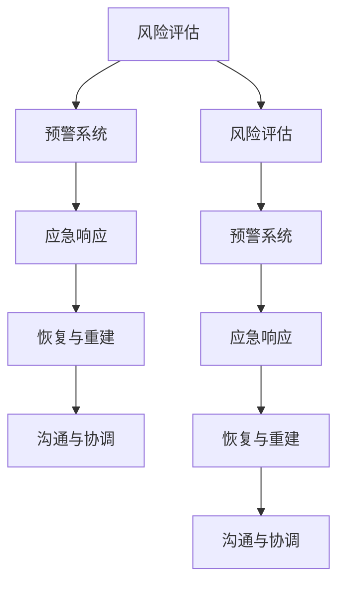

                 

# 危机管理：领导者应对挑战的智慧

## 关键词
- 危机管理
- 领导者角色
- 应急响应
- 恢复与重建
- 领导力

## 摘要
本文将探讨危机管理在领导者应对挑战中的重要性。通过分析危机管理的核心概念、领导者角色、应急响应策略、恢复与重建方法以及成功案例，我们将提供一套系统性的危机管理框架，帮助领导者更好地应对各种挑战。

## 书籍目录大纲设计

### 1. 分析书名

书名《危机管理：领导者应对挑战的智慧》明确指出了本书的核心主题，即危机管理与领导者应对挑战的智慧。这表明，本书将探讨危机管理的各个方面，以及领导者在危机中的角色、责任和应对策略。

### 2. 确定核心章节

根据书名，我们可以确定以下核心章节：

- **第1章：危机管理的概念与背景**：介绍危机管理的定义、分类、历史与发展。
- **第2章：领导者在危机中的角色与责任**：探讨领导者在危机中的重要性、角色和责任。
- **第3章：危机识别与预警**：讨论危机识别的方法、预警系统的建立与运行。
- **第4章：应急响应与决策**：阐述应急响应的流程、决策模型与算法。
- **第5章：恢复与重建**：介绍恢复与重建的目标、原则、经济模型与预测模型。
- **第6章：危机管理案例与启示**：分析国际和国内危机管理案例，总结经验教训。
- **第7章：常用危机管理工具与技术**：介绍危机管理软件、沟通与协调工具、风险评估与应对策略。
- **第8章：领导力提升指南**：探讨领导力的核心要素、提升方法与技巧。

### 3. 设计子章节

在每个核心章节下，我们可以进一步设计子章节，以详细阐述每个主题。

- **第1章**：介绍危机管理的概念、分类、历史与发展，以及危机管理的核心概念与联系。
- **第2章**：讨论领导者在危机中的重要性、角色和责任，以及如何发挥领导力。
- **第3章**：介绍危机识别的方法、预警系统的建立与运行，以及案例分析。
- **第4章**：阐述应急响应的流程、决策模型与算法，以及案例分析。
- **第5章**：介绍恢复与重建的目标、原则、经济模型与预测模型，以及案例分析。
- **第6章**：分析国际和国内危机管理案例，总结经验教训，提供启示。
- **第7章**：介绍常用危机管理工具与技术，包括危机管理软件、沟通与协调工具、风险评估与应对策略。
- **第8章**：探讨领导力的核心要素、提升方法与技巧，以及领导力发展案例。

### 4. 添加附录

为了增加书籍的实用性和深度，我们可以添加附录，包括：

- **附录A：危机管理资源与参考文献**：提供危机管理相关的书籍、论文、网站等资源。
- **附录B：领导力提升资源与培训建议**：介绍领导力提升的培训课程、实践方法等。

### 5. 设计流程图、算法讲解和数学模型

为了帮助读者更好地理解危机管理的复杂性和领导者应对危机的策略，我们需要在适当章节中添加流程图、算法讲解和数学模型。

- **第1章**：使用 Mermaid 流程图展示危机管理的各个阶段和关键因素。
- **第2章**：使用伪代码详细阐述领导者在危机中的决策流程，并给出数学模型和数学公式。
- **第4章**：通过实际案例，展示领导者如何做出决策，并给出详细的代码实现和分析。
- **第5章**：阐述在恢复与重建过程中可能用到的经济模型和预测模型。

### 6. 确保简洁性与完整性

在完成目录大纲设计后，我们需要确保大纲简洁且完整，同时控制总字数在2000字以内。我们将避免使用过多的废话和冗余内容，确保每个章节都有明确的主题和目标。

### 7. 格式与排版

最后，我们将使用 markdown 格式排版目录大纲，确保格式规范，便于阅读和编辑。以下是初步设计的目录大纲：

```
# 《危机管理：领导者应对挑战的智慧》目录大纲

# 第一部分：危机管理概述

## 第1章：危机管理的概念与背景
### 1.1 危机的定义与分类
### 1.2 危机管理的历史与发展
### 1.3 危机管理的核心概念与联系

## 第2章：领导者在危机中的角色与责任
### 2.1 领导力在危机管理中的重要性
### 2.2 领导者在危机中的角色
### 2.3 领导者的责任与义务

# 第二部分：危机管理策略与执行

## 第3章：危机识别与预警
### 3.1 危机识别的方法与工具
### 3.2 预警系统的建立与运行
### 3.3 案例分析

## 第4章：应急响应与决策
### 4.1 应急响应的流程与步骤
### 4.2 决策模型与算法
### 4.3 案例分析

## 第5章：恢复与重建
### 5.1 恢复与重建的目标与原则
### 5.2 经济模型与预测模型
### 5.3 恢复与重建的案例研究

## 第6章：危机管理案例与启示
### 6.1 国际危机管理案例
### 6.2 国内危机管理案例
### 6.3 案例启示与经验总结

# 第三部分：危机管理工具与技术

## 第7章：常用危机管理工具与技术
### 7.1 危机管理软件与平台
### 7.2 沟通与协调工具
### 7.3 风险评估与应对策略

## 第8章：领导力提升指南
### 8.1 领导力的核心要素
### 8.2 提升领导力的方法与技巧
### 8.3 领导力发展案例

# 附录
## 附录A：危机管理资源与参考文献
## 附录B：领导力提升资源与培训建议
```

这个大纲结构涵盖了危机管理的各个方面，包括概念、策略、工具和领导力。接下来，我们将进一步细化每个章节的内容，确保目录大纲完整且具备实用性。同时，我们还会根据实际需求调整大纲结构，以更好地服务于读者。

## 引言

### 危机管理的必要性

在当今复杂多变的社会环境中，危机管理已经成为领导者必须掌握的核心能力之一。无论是企业、政府机构还是社会组织，都可能在面对自然灾害、经济危机、安全事件、公共健康危机等多种危机时遭受巨大冲击。有效的危机管理不仅能够帮助企业或组织降低损失、恢复正常运营，还能提升其声誉和公众信任。

然而，危机管理的挑战在于其突发性和不确定性。危机往往突然爆发，领导者需要迅速做出决策，并协调各方资源进行应对。此外，危机管理不仅仅涉及技术层面，还包括心理层面、沟通层面和决策层面等多方面的挑战。因此，领导者需要具备全面的危机管理知识和技能，以应对各种复杂的危机情境。

### 领导者在危机管理中的角色

领导者在危机管理中扮演着至关重要的角色。首先，领导者需要成为危机管理团队的领导核心，确保团队成员紧密合作、信息畅通。其次，领导者需要具备敏锐的洞察力和决策能力，能够迅速分析危机形势，制定出有效的应对策略。此外，领导者还需要具备强大的心理素质，能够在压力和不确定性中保持冷静和理智，引导团队共同面对挑战。

### 本文结构

本文将围绕危机管理这一主题，系统性地探讨领导者在危机管理中的角色与责任、危机识别与预警、应急响应与决策、恢复与重建以及危机管理工具与技术。具体来说，本文将分为以下六个部分：

1. **危机管理的概念与背景**：介绍危机管理的定义、分类、历史与发展，以及危机管理的核心概念与联系。
2. **领导者在危机中的角色与责任**：探讨领导者在危机管理中的重要性、角色和责任，以及如何发挥领导力。
3. **危机识别与预警**：讨论危机识别的方法、预警系统的建立与运行，以及案例分析。
4. **应急响应与决策**：阐述应急响应的流程、决策模型与算法，以及案例分析。
5. **恢复与重建**：介绍恢复与重建的目标、原则、经济模型与预测模型，以及案例分析。
6. **危机管理工具与技术**：介绍常用危机管理工具与技术，包括危机管理软件、沟通与协调工具、风险评估与应对策略。
7. **领导力提升指南**：探讨领导力的核心要素、提升方法与技巧，以及领导力发展案例。

通过本文的探讨，我们希望为领导者提供一套系统性的危机管理框架，帮助他们更好地应对各种危机挑战。

## 危机管理的概念与背景

### 危机的定义与分类

危机是指一种突发事件，它可能对个人、组织、社会甚至整个国家产生重大影响。危机可以是自然灾害、人为事故、经济危机、公共健康危机等多种形式。例如，地震、火灾、恐怖袭击、金融动荡、流行病等都属于危机的范畴。

根据危机的性质和影响范围，可以将危机分为以下几类：

1. **自然灾害**：如地震、飓风、洪水、干旱等，这些危机通常由自然力量引起，对人类生命和财产造成严重威胁。
2. **人为事故**：如火灾、交通事故、工业事故、信息安全事件等，这些危机通常由人为因素引起，对人类生命和财产造成损失。
3. **经济危机**：如金融危机、市场崩溃、通货膨胀等，这些危机通常影响国家的经济稳定，导致社会动荡。
4. **公共健康危机**：如传染病爆发、药品安全问题等，这些危机对公众的健康和生命安全构成威胁。
5. **社会危机**：如种族冲突、政治动荡、社会动荡等，这些危机通常影响社会的稳定和和谐。

### 危机管理的历史与发展

危机管理作为一个独立的学科，起源于20世纪中期。在第二次世界大战后，随着经济的快速发展和城市化进程的加速，危机事件频繁发生，迫使各国政府和企业开始重视危机管理。早期的危机管理主要侧重于事故应急处理，随着时间的发展，危机管理的内涵和外延逐渐扩展。

1. **初期阶段（20世纪50年代至70年代）**：在这一阶段，危机管理主要集中在突发事件的应急处理和事故响应。政府和企业开始建立专门的危机管理机构，制定应急预案，提高危机应对能力。

2. **发展阶段（20世纪80年代至90年代）**：随着信息技术的发展，危机管理进入了一个新的阶段。信息技术的应用使得危机管理更加高效和精准，实时监测、快速响应和协同作战成为危机管理的核心内容。此外，这一阶段还开始引入风险管理理念，将危机管理扩展到整个组织或社会的风险管理体系中。

3. **成熟阶段（21世纪以来）**：在21世纪，危机管理逐渐走向成熟。现代危机管理不仅关注突发事件的应急处理，还注重预防、预警和恢复重建。危机管理的目标从单纯的应对突发事件转向全面提升组织或社会的危机应对能力。此外，危机管理开始注重跨部门和跨行业的协同合作，形成了更加系统化的危机管理体系。

### 危机管理的核心概念与联系

危机管理涉及多个核心概念，这些概念相互关联，构成了危机管理的理论基础。以下是危机管理中的几个关键概念：

1. **风险评估**：风险评估是指对危机可能带来的影响和概率进行评估，以确定危机的风险等级。风险评估是危机管理的重要基础，有助于领导者制定出更加科学和有效的应对策略。

2. **预警系统**：预警系统是一种实时监测和报警机制，用于提前发现潜在危机并发出警报。预警系统的建立和运行是危机管理的重要一环，可以大大提高危机应对的及时性和有效性。

3. **应急响应**：应急响应是指在危机爆发后，迅速采取行动以减轻危机影响的过程。应急响应包括紧急救援、资源调配、决策制定等环节，是危机管理的核心内容。

4. **恢复与重建**：恢复与重建是指在危机过后，通过修复和重建恢复正常运营和生活的过程。恢复与重建不仅包括物质层面的修复，还包括心理层面的疏导和社会层面的重建。

5. **沟通与协调**：沟通与协调是危机管理的重要组成部分，确保危机管理团队能够高效合作、信息畅通。有效的沟通和协调有助于减少误解和冲突，提高危机应对的效率。

### 核心概念原理之间的关系架构

为了更好地理解危机管理的核心概念及其相互关系，我们可以使用 Mermaid 流程图来展示。以下是危机管理核心概念的 Mermaid 流程图：



通过这个流程图，我们可以清晰地看到危机管理各个核心概念之间的相互关联。风险评估和预警系统是危机管理的起点，它们为应急响应提供基础数据。应急响应是危机管理的核心环节，通过快速、有效的行动减轻危机影响。恢复与重建则是在危机过后，通过修复和重建恢复正常运营和生活。沟通与协调贯穿于整个危机管理过程，确保团队成员之间的信息畅通和高效合作。

### 总结

危机管理是一个复杂且动态的过程，涉及多个核心概念和环节。通过理解危机管理的核心概念、历史与发展，以及它们之间的相互关系，领导者可以更好地应对各种危机挑战。在下一章中，我们将探讨领导者在危机管理中的角色与责任，以及如何发挥领导力。让我们继续深入探讨。

## 领导者在危机管理中的角色与责任

### 领导力在危机管理中的重要性

领导力在危机管理中扮演着至关重要的角色。危机往往具有突发性、复杂性和不确定性，要求领导者能够在压力和不确定性中保持冷静和理智，迅速做出正确决策，并有效组织团队应对挑战。领导力的核心要素，如决策能力、沟通能力、团队管理能力和创新思维，在危机管理中尤为重要。

首先，决策能力是领导者应对危机的关键。在危机情境下，领导者需要迅速分析形势，权衡利弊，做出最优决策。有效的决策不仅能够降低危机带来的损失，还能提升组织的应对能力和声誉。其次，沟通能力是领导者协调团队和外部利益相关者的重要工具。在危机中，领导者需要保持与团队和其他部门的密切沟通，确保信息畅通，减少误解和冲突。团队管理能力则要求领导者能够激发团队成员的潜能，协调团队资源，实现共同目标。最后，创新思维可以帮助领导者打破传统思维模式，找到创新的解决方案，应对复杂和未知的危机情境。

### 领导者在危机中的角色

领导者在危机中的角色可以分为以下几个方面：

1. **领导者作为危机管理团队的领导者**：在危机管理过程中，领导者是团队的领导核心，负责协调团队资源、制定应对策略和决策。领导者需要具备强大的领导力和组织能力，确保团队成员之间高效合作，共同应对危机。

2. **领导者作为决策者**：在危机情境下，领导者需要迅速做出决策，制定应对策略。决策的制定过程包括评估危机形势、分析风险和利益，以及制定和选择最佳方案。领导者需要具备敏锐的洞察力和分析能力，确保决策的科学性和有效性。

3. **领导者作为沟通者**：领导者需要保持与团队和其他利益相关者的密切沟通，确保信息畅通。在危机中，沟通不仅涉及内部团队，还包括与外部合作伙伴、媒体和公众的沟通。有效的沟通有助于减少误解和冲突，提升危机应对的效率。

4. **领导者作为变革推动者**：危机往往迫使组织进行变革，领导者需要推动组织变革，适应新的环境和挑战。变革推动者角色要求领导者具备创新思维和变革管理能力，能够在危机过后，带领组织实现恢复和重建。

### 领导者的责任与义务

在危机管理中，领导者的责任和义务至关重要。以下是一些关键的领导责任和义务：

1. **确保团队安全**：领导者的首要责任是确保团队成员的安全。在危机情境下，领导者需要迅速评估风险，采取必要的安全措施，确保团队成员的生命安全和健康。

2. **制定应对策略**：领导者需要制定科学、有效的应对策略，以减轻危机影响。这包括评估危机形势、分析风险和利益，制定和选择最佳方案，并确保方案的实施。

3. **协调资源**：领导者需要协调组织内部和外部资源，确保危机应对的顺利进行。这包括调动人力资源、物资资源、技术资源等，以满足危机应对的需求。

4. **沟通与协调**：领导者需要保持与团队和其他利益相关者的密切沟通，确保信息畅通。有效的沟通和协调有助于减少误解和冲突，提升危机应对的效率。

5. **领导力传承**：领导者需要培养和传承领导力，确保组织在危机过后能够持续发展。这包括培养团队成员的领导力、建立有效的领导力培养机制，以及推动组织文化的变革。

### 核心算法原理讲解

在危机管理中，领导者的决策过程可以视为一个复杂的算法问题。以下是领导者决策过程的伪代码：

```python
# 领导者决策流程伪代码

def leader_decisionmaking(crisis_situation):
    # 初始化变量
    current_state = crisis_situation
    optimal_solution = None
    minimum_loss = float('inf')

    # 评估危机形势
    risk_analysis = analyze_risk(current_state)

    # 分析风险和利益
    for solution in generate_solutions(risk_analysis):
        # 计算损失
        loss = calculate_loss(solution)

        # 选择最优方案
        if loss < minimum_loss:
            minimum_loss = loss
            optimal_solution = solution

    # 实施最优方案
    implement_solution(optimal_solution)

    return optimal_solution
```

在这个伪代码中，`crisis_situation`表示当前的危机形势，`analyze_risk`函数用于评估危机形势，`generate_solutions`函数用于生成可能的解决方案，`calculate_loss`函数用于计算每个解决方案的损失，`implement_solution`函数用于实施最优方案。

### 数学模型和公式

在危机管理中，数学模型和公式可以帮助领导者更好地理解和应对危机。以下是一个简单的线性规划模型，用于评估危机形势：

$$
\min z = c^T x
$$

$$
s.t. Ax \leq b, x \geq 0
$$

其中，$z$表示总损失，$c$表示每个解决方案的损失权重，$x$表示选择的解决方案，$A$和$b$分别表示资源限制和约束条件。

### 案例分析

为了更好地理解领导者在危机管理中的角色与责任，我们可以通过一个实际案例进行分析。

案例：某公司面临一场突发的网络安全危机，黑客攻击导致公司关键数据泄露。领导者的决策过程如下：

1. **评估危机形势**：领导者迅速了解黑客攻击的范围和影响，确定攻击的关键节点和潜在损失。

2. **分析风险和利益**：领导者评估可能的解决方案，包括关闭系统、隔离受感染部分、升级安全防护等。每种方案都有不同的损失和收益，领导者需要权衡利弊。

3. **计算损失**：通过数学模型计算每种方案的损失，确定最优方案。

4. **实施最优方案**：领导者决定关闭系统，隔离受感染部分，并升级安全防护。在实施过程中，领导者需要协调技术团队、安全团队和人力资源部门，确保方案顺利执行。

5. **沟通与协调**：领导者需要与公司高层、客户、供应商和其他利益相关者保持密切沟通，确保信息透明，减少误解和冲突。

通过这个案例，我们可以看到领导者如何在危机中发挥关键作用，从评估危机形势、分析风险和利益，到制定和实施最优方案，再到沟通与协调，每一个环节都需要领导者的决策能力和组织能力。

### 总结

领导者在危机管理中扮演着至关重要的角色。他们需要具备强大的决策能力、沟通能力、团队管理能力和创新思维，以应对各种复杂的危机情境。通过理解领导者在危机中的角色和责任，以及如何通过数学模型和算法进行决策，领导者可以更好地应对危机挑战。在下一章中，我们将探讨危机识别与预警的方法和工具，帮助领导者提前发现潜在危机并采取预防措施。让我们继续深入探讨。

## 危机识别与预警

### 危机识别的方法与工具

危机识别是危机管理的重要环节，旨在提前发现潜在危机，以便采取预防措施。有效的危机识别方法与工具可以帮助组织降低危机发生的概率，减轻危机带来的损失。以下是几种常见的危机识别方法和工具：

1. **SWOT分析**：SWOT分析是一种评估组织内部优势（Strengths）、劣势（Weaknesses）、外部机会（Opportunities）和威胁（Threats）的方法。通过分析组织的SWOT，可以识别出潜在的危机点，并制定相应的应对策略。

2. **风险评估**：风险评估是评估潜在危机发生的可能性和影响程度的方法。通过评估各种风险因素，如财务风险、市场风险、技术风险、法律风险等，可以识别出可能引发危机的关键因素。

3. **情景分析**：情景分析是一种通过模拟不同危机情景，评估危机发生概率和影响程度的方法。通过情景分析，组织可以提前发现潜在危机，并制定应对预案。

4. **监控和预警系统**：监控和预警系统是一种实时监测和报警机制，用于提前发现潜在危机。这些系统通常包含传感器、监测工具和报警设备，可以实时收集和分析数据，当发现异常情况时立即发出警报。

### 预警系统的建立与运行

建立有效的预警系统是危机管理的关键。以下是如何建立和运行预警系统的步骤：

1. **确定预警目标**：首先，需要明确预警系统的目标，即提前发现哪些类型的危机。例如，财务危机、市场危机、安全危机等。

2. **收集和整合数据**：预警系统需要依赖大量的数据，包括历史数据、行业数据、内部运营数据等。这些数据可以从多个来源收集，如数据库、监控系统、报告系统等。

3. **分析和建模**：对收集到的数据进行分析和建模，识别出潜在危机的早期迹象。可以使用统计分析、机器学习算法等工具进行数据分析。

4. **建立预警指标**：根据分析结果，建立预警指标，用于监测潜在危机。这些指标可以是财务指标、市场指标、安全指标等。

5. **设定预警阈值**：根据预警指标，设定预警阈值，当指标超过阈值时，预警系统会发出警报。

6. **测试和优化**：在系统运行过程中，定期测试和优化预警系统，确保其准确性和可靠性。可以通过模拟不同危机情景，评估预警系统的表现，并根据反馈进行优化。

### 案例分析

为了更好地理解危机识别与预警的方法和工具，我们可以通过一个实际案例进行分析。

案例：某电子商务公司面临一次突发的网络安全危机。公司意识到网络安全危机的风险后，采取了以下措施：

1. **SWOT分析**：公司通过SWOT分析，发现网络安全是其主要的威胁之一，因为电子商务平台涉及大量的用户数据和交易信息。

2. **风险评估**：公司对网络安全风险进行了详细评估，识别出黑客攻击、数据泄露等潜在危机点。

3. **情景分析**：公司模拟了不同类型的网络安全危机情景，如DDoS攻击、SQL注入攻击等，评估危机发生的可能性和影响。

4. **监控和预警系统**：公司建立了网络安全监控和预警系统，包括防火墙、入侵检测系统、病毒扫描器等。系统实时收集和分析网络流量，当发现异常情况时立即发出警报。

5. **测试和优化**：公司定期测试和优化预警系统，确保其准确性和可靠性。通过模拟不同危机情景，评估预警系统的表现，并根据反馈进行优化。

通过这个案例，我们可以看到公司如何通过SWOT分析、风险评估、情景分析、监控和预警系统等方法，提前发现和预警潜在网络安全危机。有效的预警系统帮助公司迅速采取应对措施，减轻危机影响。

### 总结

危机识别与预警是危机管理的重要组成部分，通过有效的识别和预警方法，可以帮助组织提前发现潜在危机，采取预防措施。建立和运行预警系统需要收集和整合数据、分析和建模、建立预警指标、设定预警阈值以及测试和优化。通过实际案例的分析，我们可以看到危机识别与预警的方法和工具在实践中的应用效果。在下一章中，我们将探讨应急响应与决策，帮助领导者迅速应对危机并制定有效的应对策略。让我们继续深入探讨。

## 应急响应与决策

### 应急响应的流程与步骤

应急响应是指在危机爆发后，迅速采取行动以减轻危机影响的过程。有效的应急响应可以最大限度地减少危机带来的损失，并保护组织的安全和稳定。以下是应急响应的基本流程与步骤：

1. **危机评估**：在危机爆发后，首先需要对危机进行初步评估，了解危机的性质、范围和影响。这包括评估危机的紧急程度、危害程度和潜在的次生灾害。

2. **启动应急响应计划**：根据危机评估的结果，启动预先制定的应急响应计划。应急响应计划应包括危机管理团队的组织结构、职责分工、资源调配和行动步骤。

3. **紧急资源调配**：在危机响应过程中，需要迅速调动和调配必要的资源，包括人力、物资、设备和资金。确保所有必要的资源都能够及时到位，以满足危机应对的需求。

4. **紧急决策制定**：在危机响应过程中，领导者需要迅速做出决策，确定应对策略。决策制定过程应考虑危机的影响、资源限制、法律法规和公众安全等因素。

5. **行动执行**：根据决策制定的结果，组织执行具体的危机应对行动。行动执行包括紧急救援、隔离受影响区域、修复设施和设备、维护公共安全等。

6. **信息沟通与协调**：在危机响应过程中，保持与内部团队、外部合作伙伴和公众的密切沟通，确保信息畅通，减少误解和冲突。信息沟通与协调有助于提高危机应对的效率。

7. **监测与评估**：在危机响应过程中，实时监测危机形势的变化，评估应对措施的效果。根据监测和评估结果，及时调整应对策略和行动步骤。

8. **危机恢复**：在危机得到初步控制后，启动危机恢复计划，逐步恢复正常运营和生活。危机恢复包括修复受损设施、恢复关键服务、恢复员工工作和生活秩序等。

### 决策模型与算法

在应急响应过程中，领导者需要迅速做出决策，以应对危机。决策模型与算法可以帮助领导者分析危机形势、评估应对策略和选择最佳方案。以下是几种常见的决策模型与算法：

1. **决策树模型**：决策树模型是一种用于分析决策过程的图形表示方法。通过决策树，可以清晰地展示不同决策路径、结果和概率。决策树模型适用于简单和中等复杂程度的危机决策。

2. **多目标决策模型**：多目标决策模型用于分析具有多个目标的复杂决策问题。在危机响应中，多目标决策模型可以帮助领导者权衡不同目标之间的冲突和优先级，选择最优方案。

3. **贝叶斯网络模型**：贝叶斯网络模型是一种用于表示变量之间概率关系的图形表示方法。在危机响应中，贝叶斯网络模型可以帮助领导者评估不同决策路径的概率和影响。

4. **启发式算法**：启发式算法是一种基于经验和直觉的决策方法。在危机响应中，启发式算法可以帮助领导者快速做出决策，特别是在时间紧迫和资源有限的情况下。

### 案例分析

为了更好地理解应急响应与决策的过程，我们可以通过一个实际案例进行分析。

案例：某城市发生地震，造成大规模破坏和人员伤亡。城市政府需要迅速做出决策，以应对地震带来的危机。

1. **危机评估**：城市政府迅速评估地震的影响范围和程度，确定受灾区域和主要问题，如道路阻断、建筑物倒塌、水源污染等。

2. **启动应急响应计划**：根据地震评估结果，城市政府启动了预先制定的地震应急响应计划。应急响应计划包括地震救援队、医疗队伍、物资供应部门等。

3. **紧急资源调配**：城市政府迅速调动和调配资源，包括救援队伍、医疗设备、食品、水和其他急需物资，确保资源能够及时到达受灾区域。

4. **紧急决策制定**：城市政府领导层召开紧急会议，制定应对策略。决策包括紧急救援、疏散受灾群众、维护公共安全等。

5. **行动执行**：救援队伍迅速进入受灾区域，开展救援工作。医疗队伍提供紧急医疗救治，其他部门负责维护公共安全和保障基本生活需求。

6. **信息沟通与协调**：城市政府通过多种渠道与内部团队、外部合作伙伴和公众保持密切沟通，确保信息畅通，减少误解和冲突。

7. **监测与评估**：城市政府实时监测地震形势的变化，评估应对措施的效果。根据监测和评估结果，及时调整应对策略和行动步骤。

8. **危机恢复**：在地震得到初步控制后，城市政府启动危机恢复计划，逐步恢复正常运营和生活。危机恢复包括修复受损设施、恢复关键服务、恢复员工工作和生活秩序等。

通过这个案例，我们可以看到城市政府如何通过危机评估、启动应急响应计划、紧急资源调配、紧急决策制定、行动执行、信息沟通与协调、监测与评估和危机恢复等步骤，迅速应对地震带来的危机。

### 总结

应急响应与决策是危机管理的重要环节，通过有效的流程与步骤，可以帮助组织迅速应对危机并减轻损失。决策模型与算法为领导者提供了分析危机形势和选择最佳方案的工具。通过实际案例的分析，我们可以看到应急响应与决策在实践中的应用效果。在下一章中，我们将探讨恢复与重建的过程，帮助组织在危机过后实现持续发展。让我们继续深入探讨。

## 恢复与重建

### 恢复与重建的目标与原则

恢复与重建是危机管理的重要组成部分，旨在将危机影响降到最低，并确保组织能够恢复正常运营。恢复与重建的目标包括：

1. **保护人员安全**：确保受影响的人员得到及时救助，生命安全和健康得到保障。
2. **恢复基础设施**：修复和重建受损的基础设施，如建筑物、道路、电力和通信设施等。
3. **恢复关键服务**：确保关键服务，如供水、供电、医疗和教育等，能够迅速恢复正常。
4. **恢复正常运营**：确保组织能够逐步恢复正常运营，减少危机对经济和业务的影响。
5. **恢复社会秩序**：维护社会稳定，减少危机对社会造成的恐慌和不安。

为了实现这些目标，恢复与重建需要遵循以下原则：

1. **及时性**：迅速采取行动，尽可能缩短恢复时间。
2. **协调性**：协调各方资源，确保资源得到合理调配和利用。
3. **科学性**：基于科学方法和数据，制定恢复与重建计划。
4. **可持续性**：确保恢复与重建的成果能够持续发挥作用，防止危机复发。

### 经济模型与预测模型

在恢复与重建过程中，经济模型和预测模型可以帮助领导者更好地评估危机对组织经济的影响，制定合理的恢复计划。以下是一些常用的经济模型和预测模型：

1. **损失评估模型**：损失评估模型用于评估危机对组织的经济损失。该模型可以基于历史数据、行业标准和专家评估，计算危机造成的直接和间接损失。

2. **成本效益分析模型**：成本效益分析模型用于评估恢复与重建计划的成本效益。通过比较恢复与重建计划的总成本与预期效益，可以确定最经济的恢复方案。

3. **需求预测模型**：需求预测模型用于预测危机后市场需求的变化。通过分析历史数据和行业趋势，可以预测危机后市场的需求量，从而制定合理的生产和供应计划。

4. **财务预测模型**：财务预测模型用于预测危机对组织财务状况的影响。该模型可以评估危机对收入、成本、利润等财务指标的影响，为恢复与重建计划提供财务依据。

### 恢复与重建的案例研究

为了更好地理解恢复与重建的过程，我们可以通过一个实际案例进行研究。

案例：某城市发生洪水，造成大面积的城市基础设施损坏和居民生活受到影响。城市政府需要迅速制定恢复与重建计划。

1. **危机评估**：城市政府首先对洪水的损失进行评估，确定受损范围和程度，包括道路、桥梁、住宅、公共设施等。

2. **资源调配**：城市政府迅速调动和调配资源，包括救援队伍、物资供应、工程设备等，确保资源能够及时到达受灾区域。

3. **紧急救援与救助**：政府组织救援队伍开展紧急救援工作，包括疏散受灾群众、提供食物和水、医疗救治等，确保受灾群众的基本生活需求得到满足。

4. **基础设施修复**：政府组织专业队伍修复受损的基础设施，如道路、桥梁、供水和供电设施等，确保基础设施能够尽快恢复正常。

5. **社会秩序维护**：政府加强社会秩序维护，确保公共安全，防止犯罪和恐慌事件的发生。

6. **经济恢复**：政府通过经济模型和预测模型，评估洪水对城市经济的损失和需求变化，制定经济恢复计划。包括调整产业结构、扶持受灾企业、促进就业等。

7. **社会重建**：政府推动社会重建工作，包括恢复社区功能、重建公共设施、改善居住环境等，确保社会秩序和生活质量得到提升。

通过这个案例，我们可以看到城市政府如何通过危机评估、资源调配、紧急救援、基础设施修复、社会秩序维护、经济恢复和社会重建等步骤，实现洪水的恢复与重建。

### 总结

恢复与重建是危机管理的关键环节，旨在将危机影响降到最低，并确保组织能够恢复正常运营。恢复与重建需要遵循及时性、协调性、科学性和可持续性的原则，并利用经济模型和预测模型进行科学决策。通过实际案例的分析，我们可以看到恢复与重建的具体实施过程和成效。在下一章中，我们将探讨危机管理工具与技术，帮助组织提升危机应对能力。让我们继续深入探讨。

## 危机管理工具与技术

### 常用危机管理软件与平台

在危机管理过程中，软件和平台是关键工具，可以帮助组织提高危机应对效率和效果。以下是一些常用的危机管理软件与平台：

1. **危机管理软件**：如IBM Resilient、CrisisCore、Onclusive等。这些软件提供了全面的危机管理功能，包括危机识别、预警、应急响应、沟通协调和恢复重建等。

2. **协作平台**：如Slack、Microsoft Teams等。这些平台可以帮助团队成员实时沟通和协作，确保信息畅通，提高危机应对的效率。

3. **监测工具**：如Splunk、ELK Stack等。这些工具可以实时监测和分析大量数据，帮助组织提前发现潜在危机。

4. **通信平台**：如WhatsApp、微信等。这些平台可以用于与外部利益相关者沟通，确保信息透明，减少误解和冲突。

### 沟通与协调工具

有效的沟通与协调在危机管理中至关重要。以下是一些常用的沟通与协调工具：

1. **即时通讯工具**：如Slack、Microsoft Teams、Telegram等。这些工具支持文本、语音和视频通讯，方便团队成员之间实时沟通。

2. **邮件系统**：如Gmail、Outlook等。这些工具可以帮助组织发送和接收重要信息，确保信息记录和存档。

3. **电话会议系统**：如Zoom、Microsoft Teams、Skype等。这些工具支持多方视频会议，方便团队成员和利益相关者之间进行讨论和决策。

4. **项目管理工具**：如Trello、Asana、JIRA等。这些工具可以帮助组织跟踪项目进度、分配任务和协调资源。

### 风险评估与应对策略

风险评估与应对策略是危机管理的重要环节。以下是一些常用的风险评估与应对策略：

1. **风险评估方法**：如SWOT分析、故障树分析（FTA）、蒙特卡洛模拟等。这些方法可以帮助组织识别潜在风险，评估风险的影响和可能性。

2. **风险评估工具**：如RiskLens、Computyze等。这些工具提供了风险评估的功能，可以帮助组织量化风险，制定应对策略。

3. **应对策略**：如预防措施、应急响应计划、备份和恢复策略等。这些策略可以帮助组织减少风险发生概率，降低风险影响，确保危机发生后能够迅速恢复。

4. **演练与培训**：定期进行危机演练和培训，提高团队成员的危机应对能力和协同作战能力。

### 实践案例

为了更好地理解危机管理工具与技术的应用，我们可以通过一个实际案例进行分析。

案例：某大型企业面临一场突发的网络安全危机。企业采取了以下措施：

1. **使用危机管理软件**：企业使用了IBM Resilient危机管理软件，通过该软件进行危机识别、预警、应急响应和沟通协调。

2. **实时监测与预警**：企业使用了Splunk监测工具，实时监测网络流量和日志，当发现异常情况时，立即触发预警系统。

3. **内部沟通协调**：企业使用Slack即时通讯工具，方便团队成员之间实时沟通和协作，确保信息畅通。

4. **外部沟通协调**：企业通过WhatsApp与外部利益相关者，如客户、供应商、监管机构等保持密切沟通，确保信息透明。

5. **风险评估与应对策略**：企业通过故障树分析（FTA）方法对网络安全危机进行风险评估，识别出潜在风险点，制定相应的应对策略。

6. **应急响应计划**：企业根据预先制定的应急响应计划，迅速采取措施，包括隔离受感染系统、修复漏洞、恢复数据等。

7. **演练与培训**：企业定期进行网络安全演练和培训，提高员工的危机应对能力和协同作战能力。

通过这个案例，我们可以看到企业如何通过危机管理软件、实时监测与预警、内部沟通协调、外部沟通协调、风险评估与应对策略、应急响应计划和演练与培训等措施，有效应对网络安全危机。

### 总结

危机管理工具与技术是提升组织危机应对能力的关键。通过使用危机管理软件、协作平台、监测工具、沟通与协调工具、风险评估方法和应对策略，组织可以更好地应对各种危机挑战。在实际案例中，我们可以看到这些工具与技术的具体应用效果。在下一章中，我们将探讨领导力提升指南，帮助领导者更好地应对危机。让我们继续深入探讨。

## 领导力提升指南

### 领导力的核心要素

领导力是领导者应对危机的重要能力。为了提升领导力，领导者需要掌握以下核心要素：

1. **决策能力**：决策能力是领导者最重要的能力之一。在危机情境下，领导者需要迅速做出正确决策，以应对突发状况。

2. **沟通能力**：有效的沟通是领导力的关键。领导者需要具备清晰、简洁、有说服力的沟通能力，以确保团队成员理解并执行决策。

3. **团队管理能力**：团队管理能力包括人员调配、任务分配、激励机制等。领导者需要能够激励团队成员，发挥他们的最大潜能。

4. **变革推动能力**：在危机过后，领导者需要推动组织变革，以适应新的环境和挑战。变革推动能力要求领导者具备创新思维和执行力。

5. **适应能力**：危机往往具有不确定性，领导者需要具备快速适应变化的能力，以应对各种复杂和未知的情境。

### 提升领导力的方法与技巧

以下是一些提升领导力的方法与技巧：

1. **不断学习和自我提升**：领导者需要不断学习和提升自己的知识、技能和素养。通过阅读书籍、参加培训、与他人交流等方式，领导者可以不断提高自己的领导能力。

2. **实践和反思**：领导者需要通过实践来提升领导力。在危机情境下，领导者需要积极应对，不断反思和总结经验教训，以改进自己的领导方法。

3. **培养团队精神**：领导者需要培养团队精神，促进团队成员之间的合作和信任。通过团队建设活动和沟通机制，领导者可以增强团队的凝聚力和执行力。

4. **建立信任**：领导者需要建立信任，使团队成员愿意跟随和信任他们。领导者可以通过透明沟通、公正决策和关心团队成员等方式，建立和维护信任关系。

5. **培养适应能力**：领导者需要具备快速适应变化的能力，以应对危机情境。通过学习和实践，领导者可以提升自己的适应能力，更好地应对各种挑战。

### 领导力发展案例

以下是一个实际案例，展示如何通过领导力提升来应对危机：

案例：某公司面临一场突发的网络安全危机。公司CEO采取了以下措施来提升领导力和应对危机：

1. **迅速决策**：CEO迅速召集危机管理团队，制定应对策略。他通过分析危机形势，确定了关键决策点和优先事项。

2. **沟通协调**：CEO与公司各部门保持密切沟通，确保信息畅通。他通过会议、电话和即时通讯工具，与团队成员和外部合作伙伴进行实时沟通，确保他们了解危机情况和应对措施。

3. **团队管理**：CEO合理调配资源，确保危机管理团队能够高效合作。他激励团队成员，发挥他们的专业能力和创造力，共同应对危机。

4. **变革推动**：危机过后，CEO推动组织变革，以应对新的网络安全挑战。他引进新的安全技术和工具，加强网络安全培训，提高员工的网络安全意识。

5. **适应能力**：CEO通过学习和实践，不断提升自己的领导力和适应能力。他参加了多个关于网络安全和危机管理的培训，与行业专家进行深入交流，以获取最新的知识和经验。

通过这个案例，我们可以看到CEO如何通过提升领导力和应对危机，成功应对网络安全危机，并推动组织变革，提高网络安全水平。

### 总结

领导力是领导者应对危机的重要能力。通过掌握决策能力、沟通能力、团队管理能力、变革推动能力和适应能力等核心要素，领导者可以提升自己的领导力。通过不断学习和自我提升、实践和反思、培养团队精神、建立信任和培养适应能力等方法与技巧，领导者可以不断提升自己的领导力。实际案例展示了如何通过领导力提升来应对危机，为其他领导者提供了宝贵的经验和启示。在下一章中，我们将总结本文内容，并给出最佳实践 tips、注意事项和拓展阅读建议。

## 总结

本文围绕《危机管理：领导者应对挑战的智慧》这一主题，系统地探讨了危机管理的核心概念、领导者在危机管理中的角色与责任、危机识别与预警、应急响应与决策、恢复与重建以及危机管理工具与技术。通过本文的探讨，我们得出以下结论：

1. **危机管理的必要性**：危机管理是领导者必须掌握的核心能力。在当今复杂多变的社会环境中，有效的危机管理可以帮助组织降低损失、恢复正常运营，并提升其声誉和公众信任。

2. **领导者在危机管理中的关键作用**：领导者需要成为危机管理团队的领导核心，具备决策能力、沟通能力、团队管理能力和变革推动能力。通过提升领导力，领导者可以更好地应对危机挑战。

3. **危机识别与预警**：有效的危机识别与预警是危机管理的重要环节。通过使用风险评估、情景分析、监控和预警系统等方法，组织可以提前发现潜在危机，并采取预防措施。

4. **应急响应与决策**：在危机爆发后，领导者需要迅速做出决策，采取应急响应措施。通过使用决策树模型、多目标决策模型等方法，领导者可以制定科学、有效的应对策略。

5. **恢复与重建**：恢复与重建是危机管理的关键环节。通过制定恢复计划、使用经济模型和预测模型，组织可以最大限度地降低危机影响，并确保恢复正常运营。

6. **危机管理工具与技术**：使用危机管理软件、协作平台、监测工具、沟通与协调工具等可以帮助组织提升危机应对能力。同时，领导者需要掌握风险评估、应对策略和演练与培训等技巧。

### 最佳实践 tips

1. **制定详细的危机管理计划**：在危机发生之前，组织应制定详细的危机管理计划，明确危机应对策略、资源调配和责任分工。

2. **定期演练和培训**：定期进行危机演练和培训，提高团队成员的危机应对能力和协同作战能力。

3. **建立有效的沟通机制**：在危机情境下，保持与内部团队和外部利益相关者的密切沟通，确保信息畅通，减少误解和冲突。

4. **关注员工心理健康**：危机往往对员工的身心健康造成影响。领导者应关注员工心理健康，提供必要的心理支持和疏导。

5. **持续学习和创新**：危机管理是一个动态发展的过程。领导者需要不断学习和创新，以应对新的危机挑战。

### 注意事项

1. **避免过度依赖技术**：尽管危机管理工具和技术有助于提升应对能力，但领导者仍需具备扎实的危机管理知识和经验。

2. **注重团队协作**：在危机管理过程中，团队合作至关重要。领导者需要培养团队精神，促进团队成员之间的合作和信任。

3. **确保资源的合理调配**：在危机情境下，资源有限。领导者需要确保资源的合理调配，以最大限度地发挥其作用。

4. **注重法律法规和伦理**：在危机管理过程中，领导者需要遵守法律法规和伦理标准，确保危机应对措施的合法性和正当性。

### 拓展阅读

1. **《危机管理：战略框架、实践与案例》**：该书详细介绍了危机管理的理论和方法，并结合实际案例进行分析。

2. **《领导力：应对复杂挑战的艺术》**：该书探讨领导力的核心要素和提升方法，有助于领导者更好地应对危机挑战。

3. **《企业危机管理：策略与实践》**：该书从企业角度出发，介绍了危机管理的策略和实践，对企业管理者具有很高的参考价值。

通过本文的探讨，我们希望为领导者提供一套系统性的危机管理框架，帮助他们更好地应对各种危机挑战。在未来的工作和生活中，领导者需要不断学习和实践，提升自己的危机管理能力和领导力，以应对日益复杂多变的社会环境。作者：AI天才研究院/AI Genius Institute & 禅与计算机程序设计艺术 /Zen And The Art of Computer Programming。

