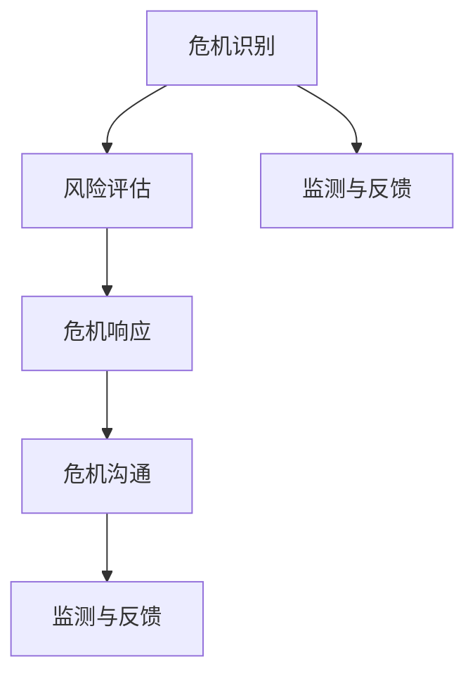

                 

### 文章标题

《危机管理：领导者应对突发事件的策略》

### 关键词

危机管理、突发事件、领导力、沟通策略、数字化转型、风险评估、应急预案、决策支持系统、风险管理软件、数据监测、案例解析

### 摘要

本文旨在探讨危机管理在信息技术领域的应用，特别是领导者应对突发事件的有效策略。文章首先介绍了危机管理的定义、分类和重要性，随后详细阐述了危机管理的核心概念与联系，包括危机识别、评估、响应和沟通等。接着，文章深入讨论了危机管理策略的制定、危机领导力以及危机沟通策略，并介绍了危机管理技术与工具的应用。通过国内外危机管理案例的分析，文章揭示了危机管理的最佳实践，并探讨了危机管理在数字化转型中的应用。最后，文章总结了危机管理的关键要点，并提供了拓展阅读的建议，以帮助读者深入理解危机管理的理论与实践。

---

## 第1章：危机管理概述

### 1.1.1 危机管理的定义和重要性

危机管理（Crisis Management）是指企业在面临突发事件时，通过科学的识别、评估、响应和沟通等措施，最大限度地减少危机对组织的影响，维护企业声誉和稳定发展的过程。危机管理不仅涉及企业内部的管理机制，还包括企业与外部利益相关者之间的沟通与合作。

在信息技术领域，危机管理尤为重要。随着数字化进程的加速，信息技术系统越来越复杂，风险因素也日益增多。网络攻击、数据泄露、系统故障等突发事件对企业的影响可能迅速蔓延，造成严重后果。因此，危机管理在信息技术领域的应用具有以下几个方面的关键意义：

1. **保护企业资产**：危机管理能够帮助企业识别和评估潜在风险，采取有效措施保护企业的核心资产，包括数据、技术和品牌等。
2. **维护企业声誉**：危机管理能够帮助企业快速响应突发事件，减少负面影响的扩散，维护企业的声誉和信誉。
3. **确保业务连续性**：危机管理策略包括应急预案和演练，有助于确保企业在面对突发事件时能够迅速恢复正常运营，确保业务的连续性。
4. **提升管理水平**：危机管理是一个系统性工程，涉及多个部门和专业领域的协作，有助于提升企业的整体管理水平。

### 1.1.2 危机的分类和特点

危机可以根据其性质和影响范围进行分类。常见的危机类型包括：

1. **自然灾害**：如地震、洪水、台风等，这类危机具有不可预测性和广泛性，对人类社会和信息技术系统都可能造成严重影响。
2. **人为事故**：如火灾、交通事故、设备故障等，这类危机通常是由于管理不善、操作失误或技术缺陷引起的。
3. **网络攻击**：如黑客入侵、数据泄露、分布式拒绝服务（DDoS）攻击等，这类危机主要针对信息技术系统，具有隐蔽性和破坏性。
4. **公共卫生事件**：如传染病爆发、食品安全事件等，这类危机不仅影响公众健康，还可能对企业的供应链和业务运营造成重大影响。

不同类型的危机具有不同的特点，需要采取相应的管理策略。例如，自然灾害通常需要紧急救援和灾后重建，人为事故需要迅速查明原因和责任，网络攻击需要快速响应和系统修复，公共卫生事件需要公共卫生政策和公众宣传。

### 1.1.3 危机管理的发展历程

危机管理作为一个独立的领域，其发展历程可以分为以下几个阶段：

1. **早期阶段**：20世纪50年代至70年代，危机管理主要关注突发事件的事后应对，缺乏系统性和前瞻性。
2. **成熟阶段**：20世纪80年代至90年代，危机管理开始引入风险管理和战略管理理念，强调预防性和持续改进。
3. **现代化阶段**：21世纪初至今，随着信息技术和大数据的发展，危机管理进入了一个智能化和数字化的新时代。企业可以利用大数据分析和人工智能技术进行风险评估和预测，制定更加精准和高效的危机管理策略。

在信息技术领域，危机管理的发展历程也经历了类似的演变。早期，企业主要依赖传统的应急预案和演练，应对突发事件。随着信息技术的发展，企业开始引入决策支持系统和风险管理软件，提高危机管理的效率和效果。近年来，随着数字化转型和物联网的应用，危机管理的智能化水平不断提升，企业可以利用智能算法和大数据分析进行实时监测和预警，实现更加精准和高效的危机管理。

---

## 第2章：危机管理的核心概念与联系

### 2.1 核心概念图解

为了更好地理解危机管理的核心概念及其相互关系，我们可以使用Mermaid绘制一个流程图，展示危机识别、评估、响应和沟通等核心环节的交互关系。

在危机管理过程中，危机识别是第一步，通过监测和分析企业的内外部环境，及时发现潜在危机。风险评估是对识别出的危机进行评估，确定其严重程度和可能的影响范围。危机响应是指企业在危机发生时采取的具体措施，以减少危机对企业的影响。危机沟通则涉及企业与内部员工、外部合作伙伴和公众的沟通，确保信息的及时传达和透明度。监测与反馈是整个危机管理过程的闭环，通过持续监测危机的发展和影响，及时调整和优化危机管理策略。

### 2.2 危机识别与评估

危机识别是危机管理的第一步，其目的是发现潜在的危机并评估其可能的影响。危机识别通常包括以下几种方法：

1. **历史数据分析**：通过对企业过去危机事件的数据进行分析，识别出可能的危机因素和规律。
2. **外部环境监测**：关注企业外部环境的变化，如政策法规、市场竞争、社会舆论等，及时发现潜在危机。
3. **内部监控**：利用企业内部监控系统，实时监测生产运营、信息系统等关键环节，发现异常情况。

危机评估是危机管理的第二步，其目的是确定危机的严重程度和可能的影响范围。危机评估通常包括以下几种方法：

1. **定性评估**：通过专家判断和主观评估，确定危机的性质、程度和影响。
2. **定量评估**：利用数学模型和数据分析方法，对危机的影响进行定量评估，如损失评估、风险概率计算等。
3. **情景分析**：构建不同的危机情景，模拟危机发生的过程和影响，评估危机的应对策略和效果。

### 2.3 危机响应与沟通

危机响应是指企业在危机发生时采取的具体措施，以减少危机对企业的影响。危机响应通常包括以下步骤：

1. **启动应急预案**：根据危机评估结果，启动相应的应急预案，确保企业能够迅速采取行动。
2. **采取紧急措施**：根据应急预案，采取具体的紧急措施，如隔离受影响系统、关闭受攻击网络端口等，防止危机蔓延。
3. **恢复业务运营**：在危机得到控制后，采取措施恢复企业的正常运营，包括数据恢复、系统修复等。

危机沟通是危机管理的重要组成部分，其目的是确保信息的及时传达和透明度。危机沟通通常包括以下内容：

1. **内部沟通**：向企业内部员工传达危机信息，确保员工了解危机状况和应对措施，提高员工的应对能力和协作效率。
2. **外部沟通**：与外部合作伙伴、客户、投资者等利益相关者进行沟通，确保信息的公开透明，维护企业声誉和信任关系。
3. **媒体沟通**：通过媒体渠道传达危机信息，确保公众了解危机状况和企业的应对措施，减轻危机对企业的负面影响。

### 2.4 监测与反馈

监测与反馈是危机管理过程的闭环，通过持续监测危机的发展和影响，及时调整和优化危机管理策略。监测与反馈通常包括以下内容：

1. **实时监测**：利用信息技术手段，实时监测危机的发展和变化，如网络流量、系统运行状态、社会舆论等。
2. **数据分析**：对监测数据进行分析，评估危机的影响范围和变化趋势，为决策提供支持。
3. **反馈调整**：根据监测和分析结果，及时调整和优化危机管理策略，提高危机应对的效率和效果。

通过监测与反馈，企业可以及时发现危机的潜在变化，提前采取预防措施，减少危机对企业的影响。

---

## 第3章：危机管理策略制定

### 3.1 制定危机管理计划

危机管理计划是企业应对突发事件的系统性和长远性安排，旨在确保企业在危机发生时能够迅速、有效地应对。制定危机管理计划通常包括以下步骤：

1. **确立目标**：明确危机管理计划的目标，如保护企业资产、维护企业声誉、确保业务连续性等。
2. **风险评估**：对企业可能面临的危机进行评估，确定危机的类型、概率和影响程度。
3. **制定预案**：根据风险评估结果，制定具体的应急预案，包括危机响应措施、紧急联系人、联系方式、资源调配等。
4. **分配责任**：明确各部门和人员在危机管理中的职责和任务，确保危机发生时能够迅速采取行动。
5. **演练与培训**：定期进行危机管理演练和培训，提高员工应对危机的能力和协作效率。
6. **更新与优化**：根据实际情况和经验反馈，定期更新和优化危机管理计划，确保其持续有效。

### 3.2 风险评估与应对措施

风险评估是危机管理的重要环节，其目的是评估企业面临的风险，确定风险的严重程度和应对策略。风险评估通常包括以下步骤：

1. **识别风险**：通过问卷调查、访谈、文档分析等方法，识别企业可能面临的风险，如技术风险、市场风险、操作风险等。
2. **评估风险**：对识别出的风险进行量化评估，确定其发生的概率和可能的影响程度，如损失金额、停机时间、声誉损失等。
3. **制定应对措施**：根据风险评估结果，制定相应的应对措施，包括风险预防、风险减轻、风险转移等。

应对措施的具体内容通常包括：

1. **风险预防**：采取预防措施，降低风险发生的概率，如安装防火墙、定期更新系统等。
2. **风险减轻**：在风险发生时，采取减轻措施，降低风险的影响程度，如备用电源、紧急恢复计划等。
3. **风险转移**：将风险转移给第三方，如购买保险、外包服务等。

### 3.3 应急预案与演练

应急预案是企业应对突发事件的详细操作指南，其目的是在危机发生时，确保企业能够迅速、有序地采取行动，最大限度地减少危机对企业的影响。应急预案通常包括以下内容：

1. **启动条件**：明确应急预案的启动条件，如系统故障、网络攻击、火灾等。
2. **响应措施**：列出具体的响应措施，如紧急停机、数据备份、通知相关人员等。
3. **资源调配**：明确应急资源，如备用电源、设备、通讯工具等。
4. **紧急联系人**：列出紧急联系人的姓名、电话、职责等。
5. **执行流程**：详细描述应急预案的执行流程，确保相关人员了解并能够按照流程操作。

演练是检验应急预案有效性的重要手段，通过模拟危机场景，评估应急预案的可行性和员工的应急响应能力。演练通常包括以下步骤：

1. **制定演练计划**：明确演练的目的、时间、地点、参与人员等。
2. **模拟场景**：模拟危机场景，如系统故障、网络攻击等，评估应急预案的响应速度和效果。
3. **评估与改进**：根据演练结果，评估应急预案的有效性，发现潜在问题，提出改进建议。
4. **总结报告**：撰写演练总结报告，记录演练过程、发现的问题及改进建议。

通过定期演练，企业可以提高员工的应急响应能力，确保应急预案的持续有效。

---

## 第4章：危机领导力

### 4.1 领导者在危机中的角色

在危机中，领导者的角色至关重要。领导者不仅需要保持冷静，迅速做出决策，还要协调各部门和团队，共同应对危机。领导者在危机中的角色可以概括为以下几个方面：

1. **决策者**：在危机发生时，领导者需要迅速做出决策，确定应对策略和行动方案。这包括评估危机的影响、确定应急资源、指挥各部门采取行动等。
2. **沟通者**：领导者需要与内部员工、外部合作伙伴和公众保持有效沟通，确保信息的及时传达和透明度。这有助于减轻危机对企业的负面影响，维护企业声誉。
3. **协调者**：领导者需要协调各部门和团队，确保各方协同作战，提高危机应对的效率。这包括分配任务、调配资源、协调沟通等。
4. **激励者**：领导者需要激发员工的积极性和创造力，确保员工在危机中保持高昂的斗志和信心。这有助于提高危机应对的能力和效果。

### 4.2 情绪管理和决策能力

在危机中，领导者的情绪管理和决策能力至关重要。情绪管理是指领导者如何控制自己的情绪，保持冷静和理智，不被危机所影响。决策能力则是指领导者如何在危机中做出正确、及时的决策，最大限度地减少危机的影响。

1. **情绪管理**：领导者需要学会放松自己，避免过度紧张和焦虑。可以通过深呼吸、冥想等方法来缓解情绪压力。同时，领导者还需要保持积极的心态，相信自己和团队能够应对危机。
2. **决策能力**：领导者需要具备快速决策的能力，在危机中做出合理、有效的决策。这需要领导者具备广泛的知识和经验，能够快速分析问题、评估风险，制定应对策略。同时，领导者还需要具备灵活性和适应性，根据危机的发展和变化，及时调整决策。

### 4.3 领导团队的协调与沟通

在危机中，领导团队的协调与沟通至关重要。一个高效的领导团队可以协同作战，迅速应对危机，最大限度地减少损失。领导团队的协调与沟通可以从以下几个方面入手：

1. **明确目标**：领导团队需要明确危机管理的目标，确保各方协同作战，统一行动。这包括保护企业资产、维护企业声誉、确保业务连续性等。
2. **信息共享**：领导团队需要建立高效的信息共享机制，确保各方能够及时获取危机信息，了解危机状况和应对措施。这可以通过定期会议、即时通讯工具等方式实现。
3. **明确职责**：领导团队需要明确各部门和人员在危机管理中的职责和任务，确保各方各司其职，协同作战。这可以通过制定危机管理计划、明确岗位职责等方式实现。
4. **及时反馈**：领导团队需要建立及时反馈机制，确保各方能够及时了解危机应对的效果和进展，根据实际情况调整应对策略。这可以通过定期汇报、即时反馈等方式实现。

通过以上措施，领导团队可以高效协同，共同应对危机，确保企业能够迅速恢复正常运营。

---

## 第5章：危机沟通策略

### 5.1 沟通的重要性

危机沟通是危机管理的重要组成部分，其重要性体现在以下几个方面：

1. **信息传递**：危机沟通能够确保企业内部和外部利益相关者及时获取危机信息，了解危机状况和应对措施，减少信息不对称。
2. **危机缓解**：通过有效的危机沟通，企业可以降低危机对公众和利益相关者的负面影响，维护企业声誉。
3. **资源调配**：危机沟通有助于企业内外部资源的有效调配，确保危机应对措施的顺利实施。
4. **内部团结**：危机沟通有助于增强企业内部员工的凝聚力和战斗力，共同应对危机。

### 5.2 沟通目标与策略

危机沟通的目标是确保信息的及时、准确和全面传递，同时维护企业声誉。为了实现这一目标，企业可以采取以下策略：

1. **建立危机沟通机制**：明确危机沟通的组织架构和流程，确保信息传递的高效和顺畅。这包括确定危机沟通责任人、建立沟通渠道、制定沟通计划等。
2. **确定沟通内容**：根据危机的类型和影响范围，确定需要沟通的信息内容。这包括危机原因、影响范围、应对措施、恢复进展等。
3. **选择沟通方式**：根据沟通内容的性质和受众特点，选择合适的沟通方式。例如，对于内部员工，可以采用电子邮件、内部网站、企业内部通讯等；对于外部利益相关者，可以采用新闻发布、媒体采访、官方网站等。
4. **确保沟通及时性**：危机沟通需要及时，确保信息能够及时传达给相关方。可以通过实时通讯工具、电话会议等方式实现。

### 5.3 沟通技巧与案例分析

有效的危机沟通需要具备一定的技巧，以下是一些常见的沟通技巧：

1. **保持透明度**：在危机沟通中，企业需要保持透明度，公开危机信息，减少信息不对称。这有助于增强公众对企业的信任。
2. **控制情绪**：在危机沟通中，企业代表需要保持冷静和理智，避免情绪化的言辞，确保沟通的客观性和专业性。
3. **传递正面信息**：在危机沟通中，企业需要积极传递正面信息，展示企业的积极应对措施和成果，缓解公众的恐慌和担忧。
4. **适应不同受众**：企业需要根据不同受众的特点和需求，调整沟通策略和方式。例如，对于媒体，需要提供详细的信息和数据；对于员工，需要提供情感支持和实际帮助。

以下是一个危机沟通的案例分析：

**案例：某企业遭受网络攻击**

某企业遭受了网络攻击，导致系统瘫痪，数据泄露。企业立即启动了危机沟通机制，采取以下措施：

1. **内部沟通**：通过电子邮件、内部网站等渠道，向员工传达危机信息，告知系统瘫痪的原因、影响范围和应急措施。同时，提供心理支持，安抚员工情绪。
2. **外部沟通**：通过官方网站、社交媒体等渠道，向公众发布危机信息，说明网络攻击的情况、应对措施和恢复进展。同时，安排媒体发布会，邀请记者采访，提供详细的信息和数据。
3. **媒体管理**：安排企业发言人接受媒体采访，回答记者提问，传递正面信息，缓解公众恐慌。同时，与企业律师合作，确保沟通内容符合法律法规。
4. **持续沟通**：在危机过程中，企业持续更新危机信息，确保公众和企业员工能够及时获取最新进展。

通过有效的危机沟通，企业成功地缓解了危机对公众和企业声誉的负面影响，赢得了公众的理解和支持。

---

## 第6章：危机管理技术与工具

### 6.1 数据分析与监测

数据分析与监测是危机管理的重要手段，通过实时监测和分析数据，可以及时发现潜在危机并采取相应措施。以下是数据分析与监测的一些技术工具：

1. **实时监控系统**：如Prometheus、Grafana等，可以实时监控系统的运行状态、性能指标、错误日志等。
2. **日志分析工具**：如ELK（Elasticsearch、Logstash、Kibana）栈，可以收集、存储、分析和可视化日志数据，帮助识别异常行为和潜在风险。
3. **大数据分析平台**：如Hadoop、Spark等，可以处理海量数据，进行实时分析和预测，提供危机预警。
4. **人工智能与机器学习**：利用人工智能和机器学习技术，可以构建智能算法，对数据进行分析和预测，识别潜在的危机因素。

### 6.2 决策支持系统

决策支持系统（Decision Support System，DSS）是危机管理的重要工具，可以帮助领导者在危机中做出快速、准确的决策。以下是几个常见的决策支持系统：

1. **风险评估系统**：通过分析企业的运营数据、市场信息、政策法规等，评估企业面临的风险，提供风险预警和建议。
2. **应急决策支持系统**：提供危机应对方案、资源调配建议、应急预案等，帮助领导者快速制定决策。
3. **情景分析工具**：通过模拟不同的危机情景，分析不同应对策略的效果，帮助领导者评估和选择最优方案。

### 6.3 风险管理软件

风险管理软件是危机管理的重要组成部分，可以帮助企业识别、评估、监控和管理风险。以下是几种常见的风险管理软件：

1. **风险识别软件**：通过数据分析、历史记录等手段，识别企业可能面临的风险。
2. **风险评估软件**：对识别出的风险进行定量和定性评估，确定风险的严重程度和影响范围。
3. **风险监控软件**：实时监控企业运营数据、市场信息等，及时发现潜在风险。
4. **风险应对软件**：提供风险应对策略、资源调配建议等，帮助领导者制定和执行风险应对计划。

### 6.4 风险管理软件与应用

风险管理软件在实际应用中发挥着重要作用，以下是一个典型的风险管理软件应用案例：

**案例：某企业使用风险管理软件**

某企业引入了风险管理软件，实施全面的风险管理。以下是该企业风险管理软件的应用场景：

1. **风险识别**：软件自动收集和分析企业的运营数据、市场信息、政策法规等，识别出可能的风险因素。
2. **风险评估**：对识别出的风险进行定量和定性评估，确定风险的严重程度和影响范围，生成风险评估报告。
3. **风险监控**：实时监控企业的运营数据、市场信息等，及时发现潜在风险，并通过预警系统向相关部门发送通知。
4. **风险应对**：根据风险评估报告，制定风险应对策略和资源调配计划，确保企业在危机发生时能够迅速采取行动。

通过风险管理软件的应用，企业提高了风险识别、评估和应对的能力，降低了危机对企业的影响。

---

## 第7章：危机管理案例分析

### 7.1 国内外危机管理案例概述

在国内外，有许多企业在危机管理方面取得了显著的成果，以下列举几个典型的案例：

1. **国内案例**：
   - **阿里巴巴数据泄露事件**：2016年，阿里巴巴集团遭遇了数据泄露事件，涉及大量用户信息。阿里巴巴迅速启动了危机管理机制，通过公开透明的方式与用户沟通，及时采取技术措施修复漏洞，有效缓解了危机对企业和用户的影响。
   - **京东物流疫情应对**：2020年，新冠疫情爆发，京东物流面临物流瘫痪的风险。京东集团迅速制定应对策略，通过调配资源、优化流程等手段，确保物流网络的正常运行，为抗疫物资的运输提供了有力支持。

2. **国际案例**：
   - **亚马逊网络攻击事件**：2018年，亚马逊网站遭遇了大规模网络攻击，导致全球范围内的服务中断。亚马逊迅速响应，通过技术手段排查和修复问题，同时加强与公众和媒体的沟通，最终恢复了网站的正常运行。
   - **谷歌数据泄露事件**：2018年，谷歌因数据泄露事件受到公众和监管机构的严厉批评。谷歌采取了积极应对措施，包括关闭受影响的账户、加强数据保护措施等，并通过公开声明向用户道歉，赢得了公众的理解。

### 7.2 案例分析：应对突发公共卫生事件

突发公共卫生事件，如传染病爆发、食品安全事件等，对企业的运营和声誉构成严重威胁。以下是一个应对突发公共卫生事件的案例分析：

**案例：某企业应对新冠疫情**

某企业位于疫情重灾区，疫情爆发初期，企业面临员工健康安全、供应链中断、客户需求变化等多重挑战。以下是该企业的应对策略：

1. **员工健康保障**：企业迅速制定疫情防控措施，包括员工健康监测、口罩发放、消毒液配备等，确保员工在安全的环境中工作。
2. **供应链管理**：企业通过优化物流、调整供应商等手段，确保原材料的供应和产品的交付。
3. **业务模式调整**：企业调整了业务模式，增加了在线服务和远程办公，以适应客户需求的变化。
4. **危机沟通**：企业通过官方网站、社交媒体等渠道，及时向员工、客户和供应商传达危机信息，确保信息的透明度和一致性。

通过以上措施，该企业成功地应对了疫情带来的挑战，确保了业务的连续性和员工的健康安全。

### 7.3 案例分析：处理企业财务危机

企业财务危机是常见的危机类型，以下是一个处理企业财务危机的案例分析：

**案例：某企业财务危机应对**

某企业因投资决策失误，导致财务状况恶化，面临破产的风险。以下是该企业的应对策略：

1. **财务审计**：企业聘请专业审计机构进行财务审计，查明财务问题，制定整改措施。
2. **资产重组**：企业通过出售非核心资产、减少开支等手段，提高资金流动性。
3. **债务重组**：企业与债权人协商，寻求债务重组方案，减轻债务负担。
4. **业务转型**：企业调整业务结构，寻找新的增长点，提升盈利能力。

通过以上措施，该企业成功地摆脱了财务危机，重回了正轨。

通过这些案例，我们可以看到，有效的危机管理策略和措施在应对不同类型的危机中发挥了重要作用。企业在制定和实施危机管理策略时，需要充分考虑自身特点和外部环境，灵活应对各种挑战。

---

## 第8章：危机管理在数字化转型中的应用

### 8.1 数字化转型背景下的危机管理挑战

随着数字化转型的深入推进，企业面临的危机管理挑战也日益复杂。数字化转型不仅为企业带来了新的发展机遇，同时也带来了前所未有的风险和不确定性。以下是数字化转型背景下危机管理面临的几个主要挑战：

1. **技术复杂性**：数字化转型涉及大量新技术、新系统的应用，如云计算、大数据、物联网、人工智能等，这些技术的复杂性和集成难度增加了危机管理的难度。
2. **数据安全**：数字化转型过程中，企业的数据量呈爆炸性增长，数据泄露、数据篡改等安全风险也随之增加，如何保障数据安全成为危机管理的重点。
3. **业务连续性**：数字化转型使得企业对信息系统和网络依赖程度增加，一旦出现系统故障、网络攻击等突发事件，可能导致业务中断，影响企业运营和客户体验。
4. **法律法规合规**：数字化转型带来了新的法律法规合规要求，如数据保护法（GDPR）、网络安全法等，如何确保合规性成为危机管理的重要任务。
5. **人才短缺**：数字化转型需要大量具备专业技能的人才，但人才短缺问题普遍存在，如何培养和吸引人才成为危机管理的一项挑战。

### 8.2 数字化工具在危机管理中的应用

在数字化转型背景下，企业可以利用多种数字化工具提升危机管理的效果和效率。以下是几种常见的数字化工具及其在危机管理中的应用：

1. **人工智能与机器学习**：利用人工智能和机器学习技术，可以实时监测和分析大量数据，快速识别潜在危机，提前预警。例如，通过分析网络流量、日志数据等，可以及时发现网络攻击迹象。
2. **大数据分析**：大数据分析可以帮助企业全面了解危机的影响范围和变化趋势，提供决策支持。例如，通过分析社交媒体数据、新闻报道等，可以了解公众对危机的反应和态度。
3. **区块链技术**：区块链技术可以提供透明、不可篡改的数据存储和传输，保障数据安全。例如，在供应链管理中，区块链可以记录每一笔交易，确保信息的真实性和可靠性。
4. **物联网（IoT）**：物联网技术可以实时监测物理环境和设备状态，及时发现异常情况。例如，在智能制造中，物联网传感器可以实时监测设备的运行状态，预防设备故障。
5. **云计算**：云计算提供了弹性的计算和存储资源，可以帮助企业快速部署和调整危机应对措施。例如，在应对突发需求时，企业可以快速扩展云计算资源，确保业务连续性。

### 8.3 数字化转型案例解析

以下是一个数字化转型背景下的危机管理案例解析：

**案例：某企业应对网络攻击**

某企业是一家数字化转型的先锋企业，其业务高度依赖信息系统和网络。在一次网络攻击中，该企业遭遇了严重的数据泄露，导致业务中断，客户信心受到打击。以下是该企业的应对策略：

1. **应急响应**：企业迅速启动了应急响应计划，通过关闭受攻击的系统端口、隔离受影响的网络设备等手段，控制了攻击的扩散。
2. **数据恢复**：利用云计算技术，企业快速恢复了受攻击的系统，确保了关键业务的正常运行。
3. **法律合规**：企业立即与律师团队合作，评估合规风险，确保在法律框架内采取应对措施。
4. **客户沟通**：企业通过官方网站、社交媒体等渠道，及时向客户通报危机情况，提供解决方案，确保客户了解企业的应对措施。
5. **安全加固**：企业通过加强网络安全防护、更新安全策略等手段，提高了系统的安全性，预防类似事件再次发生。

通过数字化转型工具的有效应用，该企业成功地应对了网络攻击，恢复了业务正常运行，赢得了客户和市场的信任。

通过这个案例，我们可以看到，数字化转型为企业带来了新的危机管理挑战，但同时也提供了强大的工具和手段，帮助企业更高效地应对危机，保障业务的连续性和安全性。

---

## 第9章：危机管理最佳实践

### 9.1 最佳实践总结

在危机管理领域，许多成功的企业已经总结出了一系列最佳实践，以下是一些关键要点：

1. **建立危机管理组织**：明确危机管理的责任部门和人员，确保危机管理工作的有序进行。
2. **制定应急预案**：根据企业的特点和面临的风险，制定详细的应急预案，确保在危机发生时能够迅速响应。
3. **加强员工培训**：定期进行员工培训，提高员工应对危机的能力和意识，确保全员参与危机管理。
4. **利用数字化工具**：充分利用人工智能、大数据、物联网等数字化工具，提高危机监测和预警的效率。
5. **建立危机沟通机制**：确保信息的及时、准确和透明传递，维护企业声誉和客户信任。
6. **进行模拟演练**：定期进行危机模拟演练，检验应急预案的有效性和员工的应对能力，及时调整和优化。

### 9.2 小结

危机管理是企业应对突发事件的重要手段，对于保障企业资产、维护企业声誉和确保业务连续性具有重要意义。通过建立危机管理组织、制定应急预案、加强员工培训、利用数字化工具、建立危机沟通机制和进行模拟演练，企业可以有效地应对各种危机，确保业务的稳定运行。

### 9.3 注意事项

在实施危机管理时，企业需要注意以下几点：

1. **全面评估风险**：在制定应急预案前，要全面评估企业可能面临的风险，确保应急预案的针对性和有效性。
2. **定期更新应急预案**：随着企业内外部环境的变化，应急预案也需要定期更新和优化，确保其持续有效。
3. **确保资源充足**：在危机发生时，确保应急资源充足，如备用电源、设备、通讯工具等，确保应急措施能够顺利实施。
4. **加强法律法规合规**：在危机管理过程中，要严格遵守相关法律法规，确保合规性，避免因法律问题导致危机扩大。
5. **重视员工心理健康**：危机管理不仅仅是技术问题，更是人性问题，要关注员工的心理健康，提供心理支持和帮助。

### 9.4 拓展阅读

对于希望深入了解危机管理的读者，以下是一些推荐的拓展阅读资源：

1. **《危机管理：企业应对突发事件实战指南》**：这是一本系统介绍危机管理理论和实践的书，涵盖了危机识别、评估、应对、沟通等关键环节。
2. **《人工智能在危机管理中的应用》**：这本书详细介绍了人工智能在危机管理领域的应用，包括数据监测、风险评估、应急决策等方面。
3. **《数字化转型与危机管理》**：这本书探讨了数字化转型背景下危机管理的新挑战和新机遇，提供了许多实际案例和解决方案。
4. **《网络安全危机管理》**：这本书专注于网络安全危机管理，介绍了网络安全风险识别、评估、应急响应等方面的内容。

通过阅读这些资源，读者可以更全面地了解危机管理的理论和实践，提升自己的危机管理能力。

---

## 作者信息

作者：AI天才研究院/AI Genius Institute & 禅与计算机程序设计艺术 /Zen And The Art of Computer Programming

