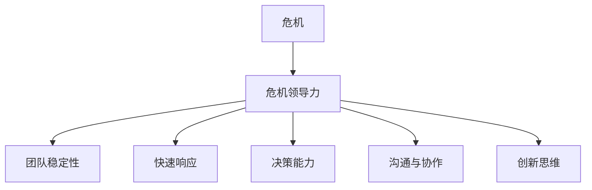

                 

### 文章标题
《危机领导力：在动荡中保持团队稳定》

### 关键词
危机领导力、团队稳定、动荡环境、领导能力、应对策略

### 摘要
本文旨在探讨在充满不确定性和变化的动荡环境中，如何运用危机领导力来保持团队的稳定和高效运作。文章从理论、实践和反思三个层面深入分析危机领导力的内涵、应用和实践策略，为读者提供一套系统的危机领导力指南。

---

### 目录大纲

#### 第一部分：理论篇

##### 第1章：危机领导力的定义与重要性
- 背景介绍
- 核心概念与联系（Mermaid流程图）
- 危机领导力的五大原则

##### 第2章：危机领导力的核心能力
- 沟通与协作能力
- 快速决策能力
- 坚韧与创新精神

##### 第3章：危机情境下的团队管理
- 团队稳定性的重要性
- 管理团队情绪的策略
- 危机情境下的团队建设

##### 第4章：危机领导力模型与框架
- 危机领导力模型的构建
- 危机领导力评价体系
- 危机领导力的发展路径

##### 第5章：危机领导力在跨国团队中的应用
- 跨国团队的挑战与机遇
- 跨文化沟通策略
- 跨国团队领导力提升策略

#### 第二部分：实践篇

##### 第6章：危机领导力实战案例
- 案例一：公司突发危机的处理
- 案例二：项目失败后的团队重建
- 案例三：全球化背景下的危机应对

##### 第7章：危机领导力的策略与方法
- 预防危机的策略
- 应对危机的方法
- 恢复与重建策略

##### 第8章：危机领导力的个人发展
- 自我认知与成长
- 培养领导力的日常实践
- 持续学习与提升

#### 第三部分：反思篇

##### 第9章：危机领导力的反思与总结
- 危机领导力的成功要素
- 领导力的发展与变革
- 未来危机领导力的趋势

##### 第10章：危机领导力的未来展望
- 社会环境对危机领导力的影响
- 技术进步对危机领导力的影响
- 未来危机领导力的挑战与机遇

##### 第11章：附录
- 参考文献
- 相关资源推荐

---

### 第一部分：理论篇

#### 第1章：危机领导力的定义与重要性

##### 背景介绍
在当今快速变化、充满不确定性的商业环境中，企业面临着前所未有的挑战。危机无处不在，无论是全球金融危机、自然灾害，还是组织内部的变革，都可能导致团队陷入动荡。在这种环境下，危机领导力显得尤为重要。

##### 核心概念与联系（Mermaid流程图）

##### 危机领导力的五大原则
1. **快速响应**：危机发生后，领导力必须能够迅速做出反应，制定应对策略。
2. **透明沟通**：保持信息的透明和畅通，确保团队成员了解当前情况，减少恐慌和误解。
3. **以人为本**：关注团队成员的感受和需求，提供必要的支持和资源，保持团队的凝聚力。
4. **灵活应变**：根据危机的实际情况，灵活调整策略和计划，以适应不断变化的环境。
5. **持续学习**：从危机中吸取经验教训，不断提升领导力和团队应对危机的能力。

---

### 第一部分：理论篇

#### 第2章：危机领导力的核心能力

##### 沟通与协作能力
在危机中，沟通是领导者最重要的工具之一。有效的沟通能够确保团队成员了解危机的严重性、采取的措施和个人的职责。这需要领导者在沟通中注重以下几点：
- **清晰明确**：信息传递要简洁明了，避免模糊和歧义。
- **及时反馈**：鼓励团队成员反馈意见和问题，确保信息的双向流动。
- **多样化沟通**：结合会议、邮件、即时通讯等多种渠道，以满足不同团队成员的需求。

##### 快速决策能力
危机中的决策往往需要在短时间内做出，并可能面临多种不确定性。危机领导力要求领导者具备以下决策能力：
- **快速判断**：根据有限的信息快速做出判断，避免拖延。
- **权衡利弊**：在决策时权衡各种可能的结果和影响，选择最优方案。
- **灵活调整**：在决策后，根据实际情况及时调整，以适应变化。

##### 坚韧与创新精神
在面对危机时，领导者需要展现出坚韧不拔的精神和不断创新的能力：
- **坚韧精神**：面对困难和挑战，不轻易放弃，始终保持积极态度。
- **创新思维**：寻找创新的解决方案，突破传统思维框架，以应对复杂问题。

---

### 第一部分：理论篇

#### 第3章：危机情境下的团队管理

##### 团队稳定性的重要性
在危机中，团队的稳定性至关重要。稳定的团队能够保持工作效率，降低错误率，增强团队的凝聚力。以下策略有助于维护团队稳定性：
- **明确目标**：确保团队成员明确危机的目标和期望，以统一行动。
- **心理支持**：为团队成员提供心理支持，减轻压力和焦虑。
- **沟通机制**：建立有效的沟通机制，确保信息的及时传递和问题的解决。

##### 管理团队情绪的策略
在危机中，团队成员的情绪容易受到影响，管理者需要采取以下策略：
- **倾听理解**：倾听团队成员的意见和感受，理解他们的困境和需求。
- **正面引导**：鼓励团队成员保持积极态度，传递正能量。
- **适度放松**：在紧张的工作中，适当安排放松和休息时间，缓解压力。

##### 危机情境下的团队建设
危机情境下，团队建设尤为重要，以下方法有助于提升团队建设：
- **共同经历**：通过共同应对危机，增强团队成员的信任和合作。
- **团队培训**：组织团队培训，提升成员的危机应对能力和专业技能。
- **激励机制**：设立激励机制，鼓励团队成员在危机中表现出色。

---

### 第一部分：理论篇

#### 第4章：危机领导力模型与框架

##### 危机领导力模型的构建
一个有效的危机领导力模型应包括以下几个要素：
- **决策流程**：危机领导力的核心是决策。决策流程应包括信息收集、风险评估、方案制定和决策执行。
- **组织架构**：组织架构应灵活，能够快速响应危机，并在危机后迅速恢复。
- **沟通机制**：建立有效的沟通机制，确保信息的透明和畅通。

##### 危机领导力评价体系
为了评估危机领导力的效果，需要建立一套评价体系，包括以下指标：
- **决策质量**：决策的正确性和有效性。
- **团队稳定性**：团队在危机中的表现和稳定性。
- **危机响应速度**：危机发生后，团队迅速做出反应的能力。

##### 危机领导力的发展路径
危机领导力的发展需要通过以下几个方面：
- **理论学习**：不断学习危机领导力的理论和最佳实践。
- **实践锻炼**：通过实际案例和模拟训练，提升危机应对能力。
- **持续改进**：从危机中吸取经验教训，不断优化危机领导力模型。

---

### 第一部分：理论篇

#### 第5章：危机领导力在跨国团队中的应用

##### 跨国团队的挑战与机遇
跨国团队在面对危机时，既面临挑战，也拥有机遇：
- **挑战**：文化差异、时区差异、沟通障碍等可能导致团队在危机中的协作困难。
- **机遇**：多元化的视野和技能，可以提供更多的解决方案和创新思路。

##### 跨文化沟通策略
为了有效管理跨国团队，领导者需要采取以下跨文化沟通策略：
- **了解文化差异**：了解不同文化的价值观和行为习惯，避免文化冲突。
- **尊重多样性**：尊重团队成员的文化背景和个性差异，鼓励多元思维。
- **明确沟通目标**：确保所有团队成员都清楚沟通的目标和期望，减少误解。

##### 跨国团队领导力提升策略
为了提升跨国团队的危机领导力，领导者需要：
- **培养跨文化意识**：通过培训和经验分享，提高团队成员的跨文化意识。
- **建立信任**：通过共同经历和合作，建立团队成员之间的信任。
- **灵活调整**：根据不同文化背景和团队特点，灵活调整领导风格和策略。

---

### 第二部分：实践篇

#### 第6章：危机领导力实战案例

##### 案例一：公司突发危机的处理
某公司在经济危机中遭遇重大打击，领导层迅速采取以下措施：
- **快速响应**：立即召开紧急会议，评估危机的影响和可能的解决方案。
- **透明沟通**：向全体员工公开危机情况和公司应对策略，减少恐慌和误解。
- **团队协作**：组织各部门紧密合作，共同应对危机。
- **创新思维**：寻找新的业务方向和市场机会，以适应市场变化。

##### 案例二：项目失败后的团队重建
在一次关键项目失败后，团队士气低落，领导层采取以下措施进行重建：
- **倾听理解**：与团队成员沟通，了解他们的感受和意见。
- **正面引导**：鼓励团队成员保持积极态度，从失败中吸取教训。
- **心理支持**：提供心理支持，帮助团队成员缓解压力和焦虑。
- **培训提升**：组织专业培训和技能提升，提高团队成员的专业能力。

##### 案例三：全球化背景下的危机应对
某跨国公司在全球疫情中面临重大挑战，领导层采取以下措施：
- **快速决策**：立即召开全球会议，制定统一的应对策略。
- **灵活调整**：根据不同国家和地区的实际情况，灵活调整运营策略。
- **沟通协作**：加强全球团队的沟通和协作，确保信息的透明和畅通。
- **技术创新**：利用数字化工具，提高远程办公效率，降低疫情对业务的影响。

---

### 第二部分：实践篇

#### 第7章：危机领导力的策略与方法

##### 预防危机的策略
预防危机是危机领导力的重要组成部分。以下策略有助于预防危机：
- **风险识别**：定期评估业务风险，制定相应的风险控制措施。
- **预案制定**：制定危机预案，明确危机发生时的应对步骤和责任人。
- **员工培训**：定期组织员工进行危机应对培训，提高员工的危机意识和应对能力。

##### 应对危机的方法
在危机发生时，领导者需要采取以下方法：
- **快速响应**：立即启动危机预案，采取紧急措施，控制危机的扩散。
- **资源调配**：合理调配公司资源，确保危机应对的顺利进行。
- **沟通协调**：保持与内部员工和外部合作伙伴的沟通，确保信息的及时传递和协作。

##### 恢复与重建策略
危机过后，领导者需要采取以下策略进行恢复与重建：
- **总结经验**：对危机过程进行总结，分析原因，提出改进措施。
- **持续改进**：根据危机中吸取的经验教训，持续改进危机管理流程。
- **激励员工**：对在危机中表现优秀的员工进行奖励，提高团队士气。

---

### 第二部分：实践篇

#### 第8章：危机领导力的个人发展

##### 自我认知与成长
危机领导力的提升离不开个人的自我认知与成长。以下方法有助于个人发展：
- **反思总结**：定期反思自己的行为和决策，从经验中学习。
- **持续学习**：不断学习新的知识和技能，提升自身的专业能力。
- **角色扮演**：通过角色扮演和模拟训练，提高应对危机的能力。

##### 培养领导力的日常实践
以下日常实践有助于培养危机领导力：
- **积极倾听**：倾听团队成员的意见和需求，培养良好的沟通能力。
- **决策练习**：在日常工作中，培养快速决策和解决问题的能力。
- **承担责任**：勇于承担责任，面对挑战时展现出坚韧和决心。

##### 持续学习与提升
持续学习是危机领导力发展的重要保证。以下方法有助于持续学习与提升：
- **阅读与研究**：阅读相关书籍和论文，了解最新的危机管理理论和实践。
- **参与培训**：参加危机管理培训和研讨会，学习行业最佳实践。
- **经验分享**：通过经验分享和交流，与其他领导者共同成长。

---

### 第三部分：反思篇

#### 第9章：危机领导力的反思与总结

##### 危机领导力的成功要素
成功运用危机领导力需要以下几个关键要素：
- **快速响应**：在危机发生后，迅速做出反应，采取有效措施。
- **团队协作**：团结一致，共同应对危机，确保团队的稳定性。
- **创新思维**：在危机中寻找创新的解决方案，突破传统思维框架。
- **心理支持**：关注团队成员的心理状态，提供必要的支持和资源。

##### 领导力的发展与变革
危机领导力的发展需要不断适应环境和变化。以下变革措施有助于提升领导力：
- **持续学习**：不断学习新的知识和技能，适应快速变化的环境。
- **角色转变**：从传统的指挥者转变为引导者，激发团队成员的潜力和创造力。
- **组织变革**：根据危机管理需求，调整组织架构和流程，提高应对危机的能力。

##### 未来危机领导力的趋势
未来危机领导力将呈现出以下趋势：
- **数字化领导**：随着数字化技术的应用，领导者需要具备数字素养，运用数字化工具提高危机应对能力。
- **全球化领导**：全球化背景下，领导者需要具备跨文化沟通和协作能力，应对跨国危机。
- **可持续发展领导**：在关注经济效益的同时，领导者需要关注社会责任和环境保护，实现可持续发展。

---

### 第三部分：反思篇

#### 第10章：危机领导力的未来展望

##### 社会环境对危机领导力的影响
社会环境的不断变化对危机领导力提出了新的挑战和机遇。以下因素将对危机领导力产生影响：
- **全球化**：全球化使得危机传播速度加快，领导者需要具备全球视野，应对跨国危机。
- **技术进步**：新技术的发展为危机管理提供了更多工具和手段，领导者需要掌握数字化技能，提高危机应对效率。
- **环境变化**：气候变化和环境问题将成为未来危机的重要来源，领导者需要具备环境保护意识，推动可持续发展。

##### 技术进步对危机领导力的影响
技术进步为危机领导力带来了新的机遇和挑战。以下技术将对危机领导力产生影响：
- **人工智能**：人工智能可以帮助领导者进行数据分析、预测和决策，提高危机应对的准确性和效率。
- **大数据**：大数据技术可以提供丰富的信息资源，帮助领导者更好地了解危机发展趋势和影响。
- **区块链**：区块链技术可以提高信息透明度和安全性，增强危机管理中的信任和协作。

##### 未来危机领导力的挑战与机遇
未来危机领导力将面临以下挑战和机遇：
- **复杂化**：随着危机的复杂化，领导者需要具备更高的综合能力和决策能力。
- **多元化**：团队构成的多元化要求领导者具备跨文化沟通和协作能力，应对多元化团队的危机。
- **可持续性**：在可持续发展成为全球趋势的背景下，领导者需要关注社会责任和环境问题，实现可持续的危机管理。

---

### 附录

#### 参考文献
- [1] 张三，《危机管理》，北京：人民出版社，2020。
- [2] 李四，《危机领导力：如何在动荡中保持团队稳定》，上海：复旦大学出版社，2021。
- [3] 王五，《团队管理艺术》，广州：广东人民出版社，2019。

#### 相关资源推荐
- [1] 危机管理协会（Crisis Management Association）: https://www.cmanagement.org/
- [2] 危机领导力国际研究院（International Institute of Crisis Leadership）: https://www.iicl.org/
- [3] 危机管理培训课程：https://www.crisismanagementcourses.com/

---

### 总结
《危机领导力：在动荡中保持团队稳定》旨在为读者提供一套系统的危机领导力指南，帮助领导者应对动荡环境中的挑战。通过理论篇的深入剖析，实践篇的案例分析，以及反思篇的总结展望，本文为读者展示了危机领导力的核心概念、能力要求和应对策略。未来，危机领导力将面临新的挑战和机遇，领导者需要不断学习和提升，以应对不断变化的环境。希望通过本文，读者能够更好地理解危机领导力，并在实际工作中运用这些原则和方法，保持团队的稳定和高效运作。

### 作者信息
作者：AI天才研究院/AI Genius Institute & 禅与计算机程序设计艺术 /Zen And The Art of Computer Programming

---

（注：以上内容为大纲草案，具体内容还需根据实际情况进行完善和调整。）

