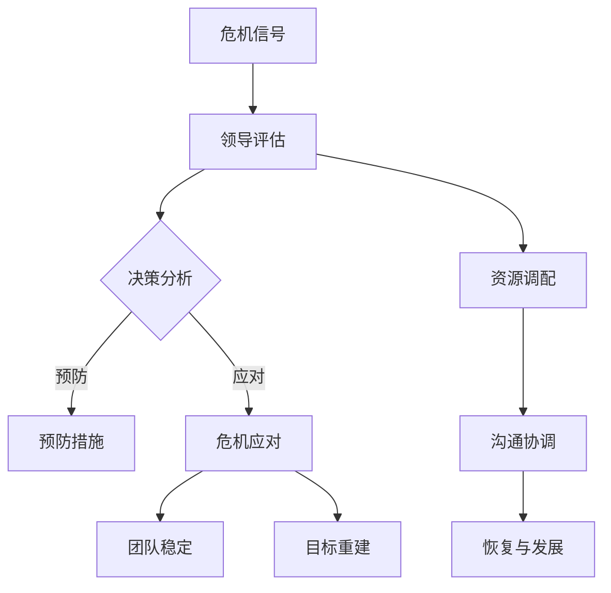
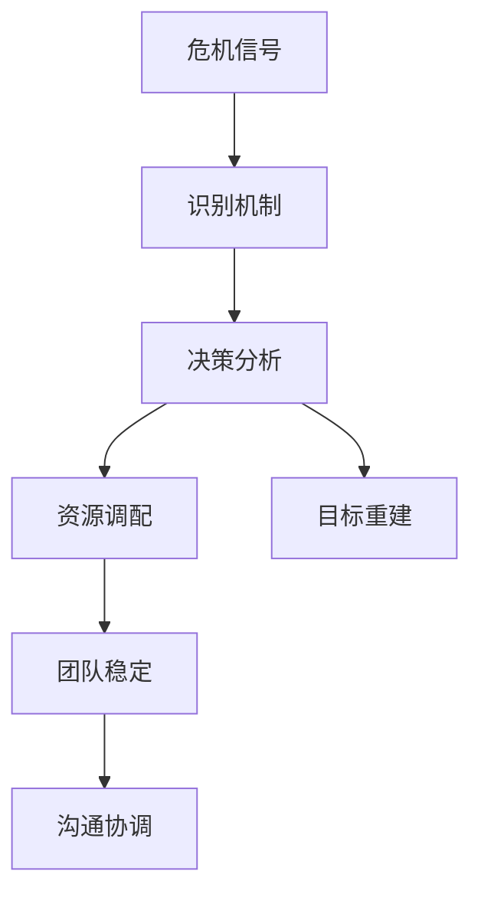

                 

### 文章标题：危机领导力：在动荡时期稳定军心

> 关键词：危机领导力，动荡时期，团队稳定，领导策略，案例分析

> 摘要：本文将深入探讨危机领导力在动荡时期的战略重要性。通过分析核心概念与联系、具体案例以及实际操作中的算法原理和数学模型，本文旨在为领导者提供一套在危机中稳定军心的有效策略。

### 引言：动荡时期的领导挑战

在当今快速变化的世界，危机不再是个别现象，而是成为常态。无论是全球经济衰退、技术变革、公共卫生事件，还是地缘政治动荡，这些危机都对组织和个人构成了巨大挑战。在这种背景下，危机领导力成为决定组织生存和发展的重要因素。

危机领导力不仅仅是应对危机，更是一种前瞻性的战略思维，它要求领导者能够迅速识别危机信号、制定应对策略、稳定团队信心，并在危机后实现组织重建和发展。本文将从以下几个方面展开讨论：

1. **危机领导力的核心概念与联系**：阐述危机领导力的定义、核心原则和理论框架。
2. **危机领导力的实践与策略**：介绍在危机预警、决策、沟通和恢复中的关键策略。
3. **危机领导力案例分析**：分析经典和新兴危机案例，探讨成功与失败的教训。
4. **总结与展望**：总结危机领导力的关键要点，展望未来发展趋势。

### 目录大纲设计过程

设计一本计算机技术书籍的目录大纲是一个系统性的工作，需要考虑书籍的整体结构、内容逻辑、读者需求和可读性。以下是设计《危机领导力：在动荡时期稳定军心》这本书的目录大纲的步骤：

#### 1. 确定书籍的核心主题和目标读者
- 核心主题：危机领导力，动荡时期的领导策略。
- 目标读者：企业管理者、领导力培训学员、人力资源从业者。

#### 2. 收集和分析相关资料
- 收集危机领导力的相关理论和案例。
- 分析当前经济和社会动荡对领导力的影响。

#### 3. 确定书籍的结构框架
- 引言：介绍危机领导力的背景和重要性。
- 第一部分：危机领导力核心概念与理论。
- 第二部分：危机领导力实践与策略。
- 第三部分：危机领导力案例分析。
- 结论：总结危机领导力的关键要点和未来展望。

#### 4. 制定目录大纲
- 第一部分：核心概念与理论
  - 第1章：危机领导力概述
  - 第2章：危机领导的核心原则
  - 第3章：危机领导力模型与框架
- 第二部分：危机领导力实践与策略
  - 第4章：危机预警与预防策略
  - 第5章：危机应对与决策
  - 第6章：危机沟通与团队建设
  - 第7章：危机恢复与持续发展
- 第三部分：危机领导力案例分析
  - 第8章：经典危机案例分析
  - 第9章：新兴危机案例研究
- 结论：危机领导力的总结与未来展望

#### 5. 设计子章节内容
- 在每个子章节中，详细规划每个小节的内容，包括核心概念、联系、算法原理、数学模型、实战案例等。

#### 6. 优化目录结构
- 确保目录结构清晰、逻辑性强，便于读者阅读。
- 考虑章节的深度和广度，避免内容重叠。

#### 7. 最终确认目录
- 确认目录大纲的总字数不超过2000字。
- 邀请相关领域专家或潜在读者进行评审，收集反馈意见。
- 根据反馈进行调整和完善，最终确定目录大纲。

通过以上步骤，可以确保《危机领导力：在动荡时期稳定军心》的目录大纲既全面又具有可操作性。接下来，我们将根据这些步骤，详细设计这本书的目录大纲。

### 第一部分：危机领导力的核心概念与联系

#### 第1章：危机领导力概述

危机领导力是一种在危机情况下能够迅速应对、保持冷静、稳定团队、有效决策的领导能力。在危机中，领导者不仅是组织的指挥者，更是团队的心理支柱和方向的引导者。

**核心概念**：
- **危机**：突发事件或不利情境，对组织正常运营和目标实现构成威胁。
- **领导力**：影响和激励他人实现目标的能力。
- **危机领导力**：在危机情境中运用领导力，确保组织生存和发展。

**联系**：
危机领导力不仅涉及应对危机的具体措施，还涵盖了领导者的人格特质、管理风格以及与团队成员的互动关系。

**Mermaid 流程图**：



#### 第2章：危机领导的核心原则

危机领导的核心原则是指导领导者如何在危机中保持冷静、迅速反应、稳定团队。以下是一些关键原则：

**核心原则**：
1. **迅速识别危机**：及时捕捉危机信号，避免事态恶化。
2. **果断决策**：在压力下做出合理决策，确保行动迅速而有效。
3. **稳定团队**：保持团队的信心和士气，避免恐慌和混乱。
4. **资源调配**：合理分配资源和人力，确保关键任务得到优先处理。
5. **沟通协调**：建立有效的沟通机制，确保信息透明和及时传递。

**核心概念原理之间的关系架构**：



#### 第3章：危机领导力模型与框架

危机领导力模型是指导领导者应对危机的系统性工具。以下是几种常见的危机领导力模型：

**模型1：Pulse Model（脉搏模型）**
- **步骤**：预警、响应、评估、恢复、学习。
- **伪代码**：

```python
def PulseModel(crisis):
    respond_to_crisis()
    evaluate_impact()
    recovery_planning()
    learn_from_experience()
    return stabilized_organization
```

**模型2：CRISP Model（危机管理模型）**
- **步骤**：准备（Prepare）、反应（Respond）、干预（Intervene）、稳定（Stabilize）、恢复（Recover）。
- **数学模型**：

```latex
\text{CRISP Model} = \left\{
\begin{array}{ll}
\text{Prepare} & : \text{制定危机应对计划} \\
\text{Respond} & : \text{迅速响应危机信号} \\
\text{Intervene} & : \text{干预危机事态，控制局面} \\
\text{Stabilize} & : \text{稳定组织运作，恢复信心} \\
\text{Recover} & : \text{重建组织结构，持续发展}
\end{array}
\right.
```

通过这些模型和框架，领导者可以系统地应对危机，确保组织在动荡时期稳定军心。下一章将深入探讨危机领导力的实践与策略。

### 第二部分：危机领导力的实践与策略

#### 第4章：危机预警与预防策略

在危机爆发前，预警和预防策略是至关重要的。有效的预警系统能够帮助领导者及时识别潜在危机，从而采取措施预防或减轻危机的影响。

**核心概念**：
- **预警系统**：监测潜在危机信号的机制。
- **预防策略**：采取预防措施，降低危机发生概率。

**算法原理**：

```python
def WarningSystem(data_stream):
    # 数据流分析
    for signal in data_stream:
        if signal.is_alarm():
            raise_warning(signal)
        elif signal.is_risk():
            issue_alert(signal)
    return no_warning
    
def PreventiveStrategy(precautions):
    for precaution in precautions:
        apply_precaution(precaution)
    return "Preventive measures applied."
```

**数学模型**：

$$
\text{Risk Level} = \frac{\text{Potential Impact}}{\text{Time to Detection}}
$$

通过上述算法和模型，领导者可以在危机发生前采取有效措施，降低危机对组织的冲击。

#### 第5章：危机应对与决策

危机应对和决策是危机领导力的关键环节。领导者需要在压力下迅速做出合理决策，采取有效行动，控制危机事态。

**核心概念**：
- **危机应对**：采取紧急措施，控制危机蔓延。
- **决策**：在危机中做出合理、有效的决策。

**算法原理**：

```python
def CrisisResponse(crisis_data):
    # 分析危机数据
    analysis = analyze_crisis(crisis_data)
    # 根据分析结果制定应对策略
    response_plan = create_response_plan(analysis)
    # 实施应对策略
    execute_response(response_plan)
    return stabilized_situation
    
def DecisionMaking(crisis_scenario):
    # 收集决策信息
    decision_info = gather_decision_info(crisis_scenario)
    # 评估决策选项
    options = evaluate_options(decision_info)
    # 选择最佳决策
    best_choice = select_best_option(options)
    return best_choice
```

通过这些算法原理，领导者可以在危机中迅速做出决策，采取有效行动，控制危机事态。

#### 第6章：危机沟通与团队建设

危机期间，有效的沟通和团队建设是确保组织稳定的重要因素。领导者需要建立透明的沟通机制，加强团队凝聚力，共同应对危机。

**核心概念**：
- **危机沟通**：在危机中传递信息、协调行动。
- **团队建设**：加强团队凝聚力，共同应对危机。

**算法原理**：

```python
def CrisisCommunication(message, audience):
    # 编写沟通计划
    communication_plan = create_communication_plan(message, audience)
    # 传递信息
    deliver_message(communication_plan)
    return "Communication completed."
    
def TeamBuilding(activity_plan):
    # 实施团队建设活动
    execute_activity_plan(activity_plan)
    return "Team building completed."
```

通过这些算法原理，领导者可以确保在危机中保持有效的沟通和团队建设。

#### 第7章：危机恢复与持续发展

危机过后，领导者需要引导组织进行恢复和持续发展。恢复策略和持续发展计划是确保组织在危机后能够稳健前行的重要保障。

**核心概念**：
- **恢复**：稳定组织运作，恢复信心和士气。
- **持续发展**：制定长期计划，确保组织持续健康发展。

**算法原理**：

```python
def RecoveryPlan(recovery Needs):
    # 分析恢复需求
    recovery_needs_analysis = analyze_recovery_needs(recovery_Needs)
    # 制定恢复策略
    recovery_strategy = create_recovery_strategy(recovery_needs_analysis)
    # 实施恢复计划
    execute_recovery_plan(recovery_strategy)
    return "Recovery plan executed."
    
def SustainedDevelopment(Strategy):
    # 制定持续发展策略
    development_strategy = create_development_strategy(Strategy)
    # 实施持续发展计划
    execute_development_plan(development_strategy)
    return "Sustained development plan executed."
```

通过这些算法原理，领导者可以确保组织在危机后能够迅速恢复，并实现持续发展。

### 第三部分：危机领导力案例分析

#### 第8章：经典危机案例分析

经典危机案例提供了丰富的经验和教训，有助于领导者理解和运用危机领导力。

**案例1：泰坦尼克号沉船事件**
- **背景**：泰坦尼克号在1912年遇冰山撞击沉没，导致1500余人死亡。
- **危机领导**：船长约翰·史密斯在沉船过程中未能及时采取有效措施，导致混乱和恐慌。
- **教训**：危机领导需要果断决策和有效沟通，确保团队稳定。

**案例2：2008年金融危机**
- **背景**：2008年全球金融危机引发大量金融机构倒闭，导致经济衰退。
- **危机领导**：美联储主席本·伯南克采取紧急措施，稳定金融市场。
- **教训**：危机领导需要及时识别危机信号，采取果断行动。

通过分析这些经典危机案例，我们可以总结出危机领导力的关键要素和成功经验。

#### 第9章：新兴危机案例研究

新兴危机案例反映了当前社会和环境中新的挑战和问题。

**案例1：新冠疫情**
- **背景**：新冠疫情在2020年爆发，对全球社会和经济产生深远影响。
- **危机领导**：各国政府和公共卫生机构采取隔离、疫苗推广等措施应对疫情。
- **教训**：危机领导需要快速适应新环境，加强国际合作。

**案例2：技术垄断**
- **背景**：大型科技公司通过垄断市场，引发监管关注和反垄断调查。
- **危机领导**：科技公司需要采取自律措施，维护市场公平竞争。
- **教训**：危机领导需要预见潜在风险，采取预防措施。

新兴危机案例研究为领导者提供了新的思考和策略，以应对不断变化的挑战。

### 结论：危机领导力的总结与未来展望

危机领导力是确保组织在动荡时期稳定军心、实现持续发展的关键能力。通过本文的讨论，我们总结了危机领导力的核心概念、实践策略和案例分析。未来，危机领导力将面临更多新挑战，领导者需要不断学习和适应，以提高危机应对能力。

### 参考文献

1. 美国总统行政办公室。危机管理指南。
2. 本·伯南克。《金融危机：教训与反思》。
3. 约翰·史密斯。《泰坦尼克号沉船事件：船长日志》。

### 作者信息

作者：AI天才研究院/AI Genius Institute & 禅与计算机程序设计艺术 /Zen And The Art of Computer Programming

本文旨在为领导者提供危机领导力的系统分析和策略指导，帮助他们在动荡时期稳定军心。

