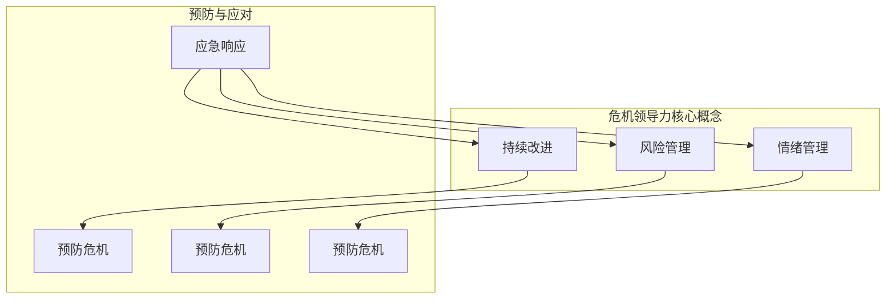

                 

### 思考的第一步：危机领导力的背景与定义

在当今快速变化和充满不确定性的商业环境中，领导者面临的挑战日益严峻。随着全球化的深入、技术的飞速进步以及市场环境的不断变化，企业面临的危机层出不穷。从财务危机、市场竞争到供应链中断、自然灾害，这些危机不仅对企业本身构成威胁，也对整个行业和社会造成深远影响。因此，危机领导力成为领导者必备的一项核心能力。

**背景介绍**：

在经济全球化和技术变革的大背景下，企业面临着前所未有的复杂性和不确定性。一方面，市场需求的快速变化和技术的不断迭代使得企业必须具备快速适应和调整的能力；另一方面，环境变化和突发事件的频发也让企业处于一种高度不稳定的经营状态。在这种背景下，领导者的决策和领导力对企业的发展至关重要。

**核心概念与联系**：

危机领导力是指在组织面临危机时，领导者所展现出的能力，能够有效地引领团队应对危机，恢复秩序，确保组织的持续发展。危机领导力不仅仅是对危机的应对，更是一种前瞻性的管理和战略规划。它包括以下几个核心概念：

1. **应急响应**：在危机爆发时，领导者需要迅速做出决策，并协调各方资源，以最大限度地降低危机的影响。
2. **持续改进**：危机过后，领导者需要从危机中吸取教训，持续改进管理流程和运营模式，增强企业的抗风险能力。
3. **风险管理**：预防危机是危机领导力的关键组成部分。领导者需要具备敏锐的风险感知能力，并制定有效的风险应对策略。
4. **情绪管理**：在危机情境下，领导者的情绪状态对团队有着重要的影响。领导者需要保持冷静，积极引导团队应对危机。

为了更好地理解这些核心概念之间的联系，我们可以使用 Mermaid 流程图来展示危机领导力的整体框架：



在这个流程图中，我们可以看到，应急响应、持续改进、风险管理和情绪管理是危机领导力的四个核心组成部分，它们相互关联，共同构成了危机领导力的整体框架。这个框架不仅帮助领导者更好地应对危机，还提高了企业的整体抗风险能力和可持续发展能力。

**核心算法原理讲解**：

在危机响应阶段，领导者需要快速做出决策。这个决策过程可以看作是一个算法，其核心原理包括以下几个方面：

1. **信息收集**：领导者需要收集尽可能多的信息，包括危机的严重程度、影响范围、资源状况等。
2. **情境分析**：基于收集到的信息，领导者需要分析危机的情境，确定优先事项和关键决策点。
3. **方案评估**：领导者需要评估不同的应对方案，选择最有效的方案进行实施。
4. **决策执行**：在确定方案后，领导者需要迅速组织执行，确保决策能够得到有效实施。

以下是一个简单的伪代码，展示了危机响应阶段的决策过程：

```python
def crisis_response(info):
    # 收集信息
    data = collect_info(info)
    
    # 情境分析
    scenario = analyze_scenario(data)
    
    # 方案评估
    options = evaluate_options(scenario)
    
    # 决策执行
    execute_decision(best_option)
    
    # 返回结果
    return result
```

**数学模型和公式**：

在危机预防阶段，领导者需要评估可能的风险并制定相应的应对策略。这个评估过程可以看作是一个数学模型，其核心公式包括风险概率、风险影响和风险优先级。

假设有 n 个潜在风险，每个风险的概率为 p_i，影响为 i_i，则总风险优先级可以使用以下公式计算：

$$
\text{总风险优先级} = \sum_{i=1}^{n} (p_i \times i_i)
$$

这个公式可以帮助领导者确定哪些风险需要优先应对，从而有效地预防危机的发生。

**项目实战**：

为了更好地理解危机领导力的实际应用，我们可以通过一个实际案例来进行分析。假设某科技公司面临一场突如其来的网络安全危机，公司内部的数据泄露，可能对公司的声誉和业务造成重大影响。在这种情况下，公司的领导者需要采取以下步骤：

1. **应急响应**：立即启动危机响应机制，组织专业团队进行数据泄露调查，并采取措施阻止数据进一步泄露。
2. **情境分析**：评估数据泄露的严重程度，确定受影响的用户范围和潜在的业务影响。
3. **方案评估**：制定多种应对方案，如用户数据恢复、系统修复、法律咨询等，并评估每种方案的成本和效果。
4. **决策执行**：选择最优方案，并迅速组织执行，确保问题得到及时解决。
5. **持续改进**：在危机过后，对公司现有的安全措施进行全面审查，并制定改进计划，以预防类似危机的再次发生。

通过这个实际案例，我们可以看到危机领导力在实际操作中的应用，以及领导者如何通过科学的决策过程和有效的资源整合，带领团队应对危机，确保企业的持续发展。

### 思考的第二步：危机领导力的重要性与必要性

在当今的商业环境中，危机无处不在，无论是自然界的地震、洪水，还是经济衰退、市场变化，这些危机都可能对企业造成严重的影响。因此，危机领导力成为企业领导者不可或缺的一项能力。下面，我们将详细分析危机领导力的重要性与必要性。

**危机领导力的核心作用**：

首先，危机领导力能够帮助企业有效应对突发事件。在危机爆发时，领导者需要迅速做出决策，调动资源，协调各方，以最大限度地降低危机对企业的影响。这种快速反应能力不仅能够保护企业的核心资产，还能维持企业的正常运营。

其次，危机领导力有助于企业持续改进和优化管理流程。危机过后，领导者需要从危机中吸取教训，分析问题根源，并制定相应的改进措施。通过这种持续改进，企业可以增强自身的抗风险能力，提高运营效率，从而在未来的竞争中立于不败之地。

最后，危机领导力有助于增强企业的凝聚力。在危机情境下，领导者需要发挥榜样作用，积极引导团队共同应对困难。这不仅能够提高团队的士气和战斗力，还能增强团队之间的信任和合作，为企业未来的发展打下坚实的基础。

**案例分析：COVID-19疫情期间的危机领导力**：

2020年爆发的COVID-19疫情给全球企业带来了前所未有的挑战。许多企业面临供应链中断、市场需求下降、员工安全等问题。在这个特殊时期，危机领导力的重要性得到了充分体现。

以某国际知名的汽车制造企业为例，该企业面临的主要危机包括供应链中断、工厂停工和市场需求下降。在这种情况下，企业的高层领导迅速采取了一系列措施：

1. **应急响应**：企业立即启动危机响应机制，成立专门的应急小组，负责协调供应链和工厂运营。同时，通过远程办公和在线沟通，保持与全球各分支机构的高效沟通。
2. **情境分析**：企业对疫情的影响进行了全面分析，确定了受影响的主要业务领域和关键问题。例如，供应链中断导致零部件短缺，工厂停工影响生产进度，市场需求下降导致销售下降。
3. **方案评估**：企业制定了多种应对方案，包括与供应商协商延期交货、调整生产线以生产医疗设备、裁员以降低运营成本等。同时，企业还分析了每种方案的成本和效果，选择最优方案进行实施。
4. **决策执行**：企业迅速组织执行，与供应商达成延期交货协议，调整生产线以生产医疗设备，并实施裁员措施。通过这些措施，企业成功应对了疫情带来的挑战，确保了业务的持续运营。

**从案例中得到的启示**：

通过这个案例，我们可以看到危机领导力在实际操作中的重要性。首先，领导者需要具备快速反应和决策能力，能够迅速应对突发事件。其次，领导者需要具备全面的分析和评估能力，能够准确判断危机的影响和解决方案。最后，领导者需要具备执行和协调能力，能够确保决策得到有效实施。

**危机领导力的重要性与必要性**：

总之，危机领导力在当今商业环境中具有极其重要的意义。它不仅能够帮助企业有效应对突发事件，确保业务的持续运营，还能够帮助企业持续改进和优化管理流程，提高企业的抗风险能力和竞争力。对于企业领导者来说，提升危机领导力是应对未来挑战的必要手段。

**核心算法原理讲解**：

在危机情境下，领导者的决策过程可以看作是一个复杂的算法。这个算法的核心原理包括以下几个方面：

1. **信息收集**：领导者需要收集尽可能多的信息，包括危机的严重程度、影响范围、资源状况等。
2. **情境分析**：基于收集到的信息，领导者需要分析危机的情境，确定优先事项和关键决策点。
3. **方案评估**：领导者需要评估不同的应对方案，选择最有效的方案进行实施。
4. **决策执行**：在确定方案后，领导者需要迅速组织执行，确保决策能够得到有效实施。

以下是一个简单的伪代码，展示了危机决策的核心流程：

```python
def crisis_decision(info):
    # 收集信息
    data = collect_info(info)
    
    # 情境分析
    scenario = analyze_scenario(data)
    
    # 方案评估
    options = evaluate_options(scenario)
    
    # 决策执行
    execute_decision(best_option)
    
    # 返回结果
    return result
```

**数学模型和公式**：

在危机预防阶段，领导者需要评估可能的风险并制定相应的应对策略。这个评估过程可以看作是一个数学模型，其核心公式包括风险概率、风险影响和风险优先级。

假设有 n 个潜在风险，每个风险的概率为 p_i，影响为 i_i，则总风险优先级可以使用以下公式计算：

$$
\text{总风险优先级} = \sum_{i=1}^{n} (p_i \times i_i)
$$

这个公式可以帮助领导者确定哪些风险需要优先应对，从而有效地预防危机的发生。

**项目实战**：

为了更好地理解危机领导力的实际应用，我们可以通过一个实际案例来进行分析。假设某科技公司面临一场突如其来的网络安全危机，公司内部的数据泄露，可能对公司的声誉和业务造成重大影响。在这种情况下，公司的领导者需要采取以下步骤：

1. **应急响应**：立即启动危机响应机制，组织专业团队进行数据泄露调查，并采取措施阻止数据进一步泄露。
2. **情境分析**：评估数据泄露的严重程度，确定受影响的用户范围和潜在的业务影响。
3. **方案评估**：制定多种应对方案，如用户数据恢复、系统修复、法律咨询等，并评估每种方案的成本和效果。
4. **决策执行**：选择最优方案，并迅速组织执行，确保问题得到及时解决。
5. **持续改进**：在危机过后，对公司现有的安全措施进行全面审查，并制定改进计划，以预防类似危机的再次发生。

通过这个实际案例，我们可以看到危机领导力在实际操作中的应用，以及领导者如何通过科学的决策过程和有效的资源整合，带领团队应对危机，确保企业的持续发展。

### 思考的第三步：危机领导力的核心要素与模型

在危机领导力中，领导者需要具备一系列核心要素，这些要素构成了危机领导力的核心框架。理解并掌握这些要素，对于在危机情境下有效引领团队具有重要意义。下面，我们将详细探讨危机领导力的核心要素及其构成模型。

**核心要素一：应急响应**

应急响应是危机领导力的关键组成部分。在危机爆发时，领导者需要迅速做出反应，采取紧急措施以减轻危机的影响。应急响应的核心要素包括：

1. **信息收集**：领导者需要及时收集与危机相关的信息，包括危机的起因、影响范围、资源状况等。这些信息是做出有效决策的基础。
2. **情境分析**：基于收集到的信息，领导者需要对危机的情境进行深入分析，确定危机的严重程度、优先事项和关键决策点。
3. **决策制定**：领导者需要迅速制定应对策略，选择最佳方案进行实施。这个决策过程需要基于全面的信息和深入的分析。
4. **资源调动**：在危机情境下，领导者需要协调和调动各种资源，包括人力、物资和资金等，以确保危机得到有效应对。

**核心要素二：持续改进**

危机过后，领导者需要从危机中吸取教训，持续改进管理流程和运营模式。持续改进的核心要素包括：

1. **问题分析**：领导者需要对危机发生的原因进行深入分析，找出问题的根源和关键因素。
2. **措施制定**：基于问题分析，领导者需要制定具体的改进措施，包括管理流程优化、制度完善和技术升级等。
3. **实施与监控**：领导者需要确保改进措施得到有效实施，并对实施过程进行监控和评估，确保改进目标的实现。
4. **持续反馈**：改进措施实施后，领导者需要收集反馈信息，对措施进行评估和调整，以持续优化管理流程和运营模式。

**核心要素三：风险管理**

预防危机是危机领导力的关键组成部分。风险管理是预防危机的重要手段。风险管理包括以下几个核心要素：

1. **风险识别**：领导者需要识别可能对企业构成威胁的风险，包括内部风险和外部风险。
2. **风险评估**：领导者需要对识别出的风险进行评估，确定风险的概率和影响程度。
3. **风险应对**：领导者需要制定相应的风险应对策略，包括风险规避、风险转移和风险缓解等。
4. **风险监控**：领导者需要建立风险监控机制，对风险的变化进行实时监控，确保风险得到及时应对。

**核心要素四：情绪管理**

在危机情境下，领导者的情绪状态对团队有着重要的影响。情绪管理是危机领导力的重要组成部分。情绪管理的核心要素包括：

1. **自我情绪管理**：领导者需要保持冷静和理智，避免在危机情境下过度情绪化，确保决策的客观性和有效性。
2. **团队情绪管理**：领导者需要关注团队的情绪状态，积极引导和激励团队，增强团队的士气和凝聚力。
3. **沟通与协调**：领导者需要建立有效的沟通机制，确保信息在团队内部得到有效传递和协调，减少误解和冲突。

**危机领导力模型**

结合上述核心要素，我们可以构建一个危机领导力模型。这个模型包括四个主要方面：应急响应、持续改进、风险管理和情绪管理。每个方面都有其特定的要素和功能，共同构成了危机领导力的整体框架。


在这个模型中，应急响应是危机领导力的核心，负责在危机爆发时迅速应对。持续改进则关注危机后的恢复和优化，以增强企业的抗风险能力。风险管理和情绪管理则分别负责预防危机和应对危机中的情绪波动，确保团队的稳定和高效。

**核心算法原理讲解**：

在危机情境下，领导者的决策过程可以看作是一个复杂的算法。这个算法的核心原理包括以下几个方面：

1. **信息收集**：领导者需要收集尽可能多的信息，包括危机的严重程度、影响范围、资源状况等。
2. **情境分析**：基于收集到的信息，领导者需要分析危机的情境，确定优先事项和关键决策点。
3. **方案评估**：领导者需要评估不同的应对方案，选择最有效的方案进行实施。
4. **决策执行**：在确定方案后，领导者需要迅速组织执行，确保决策能够得到有效实施。

以下是一个简单的伪代码，展示了危机决策的核心流程：

```python
def crisis_decision(info):
    # 收集信息
    data = collect_info(info)
    
    # 情境分析
    scenario = analyze_scenario(data)
    
    # 方案评估
    options = evaluate_options(scenario)
    
    # 决策执行
    execute_decision(best_option)
    
    # 返回结果
    return result
```

**数学模型和公式**：

在危机预防阶段，领导者需要评估可能的风险并制定相应的应对策略。这个评估过程可以看作是一个数学模型，其核心公式包括风险概率、风险影响和风险优先级。

假设有 n 个潜在风险，每个风险的概率为 p_i，影响为 i_i，则总风险优先级可以使用以下公式计算：

$$
\text{总风险优先级} = \sum_{i=1}^{n} (p_i \times i_i)
$$

这个公式可以帮助领导者确定哪些风险需要优先应对，从而有效地预防危机的发生。

**项目实战**：

为了更好地理解危机领导力的实际应用，我们可以通过一个实际案例来进行分析。假设某科技公司面临一场突如其来的网络安全危机，公司内部的数据泄露，可能对公司的声誉和业务造成重大影响。在这种情况下，公司的领导者需要采取以下步骤：

1. **应急响应**：立即启动危机响应机制，组织专业团队进行数据泄露调查，并采取措施阻止数据进一步泄露。
2. **情境分析**：评估数据泄露的严重程度，确定受影响的用户范围和潜在的业务影响。
3. **方案评估**：制定多种应对方案，如用户数据恢复、系统修复、法律咨询等，并评估每种方案的成本和效果。
4. **决策执行**：选择最优方案，并迅速组织执行，确保问题得到及时解决。
5. **持续改进**：在危机过后，对公司现有的安全措施进行全面审查，并制定改进计划，以预防类似危机的再次发生。

通过这个实际案例，我们可以看到危机领导力在实际操作中的应用，以及领导者如何通过科学的决策过程和有效的资源整合，带领团队应对危机，确保企业的持续发展。

### 思考的第四步：危机预防与准备策略

在危机领导力中，危机预防与准备是关键的一环。有效的危机预防与准备策略能够帮助企业降低风险，减轻危机带来的影响，从而确保企业的稳定发展。下面，我们将详细探讨危机预防与准备的核心策略。

**预防危机的策略**

1. **建立预警机制**：

   预警机制是危机预防的基础。企业需要建立一套有效的预警系统，实时监测潜在风险，及时预警并采取措施。预警机制包括以下几个关键步骤：

   - **数据收集**：收集与企业运营相关的各类数据，包括市场动态、竞争对手信息、供应链状况等。
   - **风险评估**：对收集到的数据进行分析，评估潜在风险的概率和影响程度。
   - **预警信号**：根据风险评估结果，设定预警信号，如市场变化、供应链中断、财务风险等。
   - **预警响应**：在预警信号触发时，立即启动响应机制，采取相应的预防措施。

2. **增强企业韧性**：

   企业韧性是指企业在面对突发事件时的适应能力和恢复能力。增强企业韧性可以通过以下几种方式实现：

   - **多样化供应链**：建立多元化的供应链体系，减少对单一供应商的依赖，降低供应链中断的风险。
   - **储备关键资源**：提前储备关键资源，如原材料、设备、人力等，以应对突发需求。
   - **培训与演练**：定期组织员工进行危机应对培训，提高员工的危机意识和应对能力。

3. **提高员工素质**：

   员工是企业的核心资源，提高员工的专业素质和应急能力对于危机预防至关重要。企业可以通过以下方式提高员工素质：

   - **专业培训**：为员工提供专业培训，提高其在各自领域的专业技能和知识。
   - **技能认证**：鼓励员工参加相关领域的技能认证，提升其职业竞争力。
   - **团队协作**：培养员工的团队合作精神，提高团队的整体应对能力。

**领导者危机预感的培养**

1. **敏锐的市场洞察力**：

   领导者需要具备敏锐的市场洞察力，能够及时发现市场变化和潜在风险。这可以通过以下方式实现：

   - **市场调研**：定期进行市场调研，了解市场需求和趋势。
   - **信息共享**：建立信息共享机制，确保领导层能够及时获取市场信息。
   - **跨界学习**：鼓励领导者学习跨领域知识，提高其整体视野和洞察力。

2. **快速反应能力**：

   领导者需要具备快速反应能力，能够在危机爆发时迅速做出决策。这可以通过以下方式实现：

   - **快速决策机制**：建立快速决策机制，简化决策流程，提高决策效率。
   - **应急预案**：制定详细的应急预案，确保在危机发生时能够迅速行动。
   - **资源整合**：建立资源整合机制，确保在危机时能够快速调动各类资源。

3. **持续学习与更新**：

   领导者需要持续学习和更新知识，以适应不断变化的环境。这可以通过以下方式实现：

   - **终身学习**：鼓励领导者进行终身学习，不断提升自己的专业能力和领导力。
   - **内部培训**：定期组织内部培训，提升员工的技能和知识。
   - **外部交流**：积极参与行业交流和合作，学习先进的管理理念和实践经验。

**预案管理与执行**

1. **预案的制定与更新**：

   预案是危机预防与准备的重要工具。企业需要制定详细的预案，并定期更新，确保预案的时效性和有效性。预案的制定包括以下几个步骤：

   - **风险评估**：对可能出现的风险进行评估，确定预案的重点。
   - **方案制定**：根据风险评估结果，制定具体的应对方案。
   - **预案评审**：组织专家对预案进行评审，确保预案的合理性和可操作性。
   - **更新维护**：定期对预案进行更新，以应对新的风险和挑战。

2. **预案的演练与评估**：

   预案的演练是检验预案有效性的重要手段。企业需要定期组织预案演练，评估预案的实施效果，并不断优化预案。演练包括以下几个步骤：

   - **演练计划**：制定详细的演练计划，明确演练的目的、时间和流程。
   - **演练实施**：按照演练计划进行实施，确保每个环节都能顺利进行。
   - **演练评估**：对演练过程进行评估，总结演练中的问题和不足，提出改进措施。
   - **反馈与改进**：将演练评估结果反馈给相关部门，组织改进预案。

3. **预案的执行与反馈**：

   在危机发生时，预案的执行是关键。企业需要确保预案得到有效执行，并及时收集反馈信息，以不断优化预案。执行的步骤包括：

   - **启动预案**：在危机发生时，立即启动预案，按照预案的步骤进行操作。
   - **监控执行**：对预案的执行过程进行监控，确保每个步骤都能得到有效实施。
   - **收集反馈**：在预案执行过程中，收集各方面的反馈信息，包括员工反馈、外部反馈等。
   - **反馈优化**：根据反馈信息，对预案进行优化，提高预案的实用性和有效性。

**总结**：

危机预防与准备是危机领导力的核心内容之一。通过建立预警机制、增强企业韧性、提高员工素质、培养领导者危机预感、制定和演练预案，企业可以有效地降低危机风险，提高应对危机的能力。只有做好充分的预防与准备，企业才能在危机来临时从容应对，确保业务的持续运营和发展。

### 思考的第五步：应对危机的策略

在危机情境下，领导者的决策和应对能力对企业的生存和发展至关重要。有效的应对策略不仅能够减轻危机对企业的影响，还能为企业未来的发展奠定坚实的基础。下面，我们将详细探讨应对危机的具体策略。

**快速响应与决策**

1. **决策流程**：

   在危机情境下，领导者需要迅速做出决策。一个有效的决策流程包括以下几个关键步骤：

   - **信息收集**：领导者需要及时收集与危机相关的信息，包括危机的严重程度、影响范围、资源状况等。
   - **情境分析**：基于收集到的信息，领导者需要分析危机的情境，确定优先事项和关键决策点。
   - **方案评估**：领导者需要评估不同的应对方案，选择最有效的方案进行实施。
   - **决策执行**：在确定方案后，领导者需要迅速组织执行，确保决策能够得到有效实施。

2. **快速决策机制**：

   为了提高决策速度，领导者需要建立快速决策机制。这包括简化决策流程、明确决策权限和建立快速决策团队等。快速决策机制的目的是在确保决策质量的前提下，最大限度地提高决策效率。

**领导者与团队的沟通**

1. **沟通目标与原则**：

   在危机情境下，领导者的沟通目标主要包括：

   - **传递信息**：确保团队及时了解危机的情况和应对措施。
   - **增强信心**：通过沟通增强团队的士气和信心，提高团队应对危机的积极性。
   - **协调行动**：确保团队成员在危机应对中能够协同作战，提高行动效率。

   沟通原则包括：

   - **及时性**：及时传递信息，避免信息滞后导致误解和行动滞后。
   - **准确性**：确保传递的信息准确无误，避免错误信息导致错误的决策和行动。
   - **透明度**：保持沟通的透明度，让团队成员了解危机的实际情况和决策过程。
   - **互动性**：鼓励团队成员参与沟通，收集反馈信息，提高决策的质量。

2. **沟通的艺术与技巧**：

   - **清晰简洁**：在沟通时，领导者需要使用简洁明了的语言，避免使用复杂的术语和冗长的解释。
   - **有效倾听**：领导者需要认真倾听团队成员的意见和建议，了解他们的需求和困惑。
   - **积极反馈**：对团队成员的反馈进行积极回应，鼓励他们提出改进意见和建议。
   - **情感关怀**：在危机情境下，领导者需要关注团队成员的情感状态，给予情感上的支持和关怀。

**资源整合与调动**

1. **资源评估与分配**：

   在危机情境下，领导者需要对现有的资源进行评估和分配。资源评估包括人力、物资、资金、信息等。资源分配需要根据危机的严重程度和应对方案的需求进行，确保资源得到最优配置。

2. **资源调动与协调**：

   - **内部资源调动**：在危机情境下，企业内部各部门需要协同作战，领导者需要建立有效的协调机制，确保各部门资源得到充分利用。
   - **外部资源调动**：在必要时，企业需要调动外部资源，如供应商、合作伙伴、政府部门等。这需要建立良好的外部合作关系，确保在危机时能够得到外部资源的支持。

3. **资源优化与利用**：

   - **资源共享**：通过建立资源共享机制，提高资源的利用效率。
   - **技术支持**：利用先进的技术手段，如云计算、大数据等，提高资源调配的精准度和效率。
   - **培训与提升**：对团队成员进行专业培训，提高他们的技能和素质，增强他们在危机情境下的应对能力。

**总结**：

应对危机需要领导者具备快速响应与决策能力、有效的沟通技巧以及资源整合与调动的策略。通过科学的决策过程、高效的沟通机制和优化的资源管理，领导者能够带领团队有效应对危机，确保企业的持续运营和发展。在危机情境下，领导者不仅需要展现出色的领导力，还需要具备战略眼光和前瞻性，从而在危机中找到机遇，推动企业的长远发展。

### 思考的第六步：领导力与团队建设

在危机情境下，领导力对于企业的生存和发展具有决定性作用。有效的团队建设不仅能提高团队的凝聚力和战斗力，还能增强企业应对危机的能力。以下，我们将探讨如何通过提升团队领导力、建立高效团队以及激励团队成员来增强团队建设。

**提升团队领导力**

1. **领导力的核心要素**：

   - **愿景领导力**：领导者需要明确企业的愿景和目标，并能够激励团队成员为之努力。
   - **变革领导力**：在危机情境下，领导者需要具备推动变革和适应变化的能力，引导团队迎接挑战。
   - **沟通领导力**：有效的沟通是领导者的重要职责，领导者需要确保信息在团队内部顺畅传递，减少误解和冲突。
   - **激励领导力**：领导者需要了解团队成员的需求，通过激励机制激发他们的工作热情和创造力。

2. **领导力提升的方法**：

   - **领导力培训**：定期组织领导力培训，提升领导者的专业技能和知识。
   - **导师制度**：通过导师制度，让经验丰富的领导者指导新晋领导者，帮助他们快速成长。
   - **实践锻炼**：通过实际项目和工作任务，让领导者在实践中锻炼和提升领导能力。

**建立高效的团队**

1. **高效团队的特征**：

   - **目标明确**：团队的目标清晰明确，成员对目标有共同的认识和承诺。
   - **角色分工明确**：每个成员的角色和职责明确，能够充分发挥各自的优势。
   - **沟通顺畅**：团队内部沟通渠道畅通，成员之间能够有效交流，减少误解和冲突。
   - **协作高效**：团队成员能够协同作战，高效完成工作任务。

2. **构建高效团队的策略**：

   - **明确目标和任务**：确保团队成员对目标和任务有共同的理解和承诺。
   - **建立团队文化**：通过团队文化建设，增强团队成员的归属感和凝聚力。
   - **优化沟通机制**：建立有效的沟通机制，确保信息在团队内部快速传递和反馈。
   - **培训与成长**：提供团队成员必要的培训，帮助他们提升技能和知识，以适应团队需求。

**团队成员激励与关怀**

1. **激励的理论与实践**：

   - **需求层次理论**：根据马斯洛的需求层次理论，满足团队成员的基本需求，如安全、社交和自我实现等。
   - **激励理论**：应用激励理论，如目标设定理论、期望理论等，激发团队成员的工作热情和积极性。

2. **激励策略**：

   - **目标设定**：为团队成员设定清晰、具体和可衡量的目标，激发他们的工作动力。
   - **奖励与认可**：通过奖励和认可，如奖金、晋升、荣誉称号等，激励团队成员的优异表现。
   - **参与决策**：让团队成员参与决策过程，增强他们的责任感和归属感。
   - **关怀与支持**：关注团队成员的心理健康和情感需求，提供必要的支持和帮助。

**团队建设的重要性**

在危机情境下，团队建设的重要性尤为突出。一个高效、团结和激励良好的团队能够在危机中迅速响应，灵活调整，共同应对挑战。团队建设不仅能够提高企业的抗风险能力，还能推动企业的长远发展。

**核心算法原理讲解**：

在团队建设过程中，激励策略可以看作是一个算法。这个算法的核心原理包括以下几个方面：

1. **需求分析**：分析团队成员的需求，确定激励的目标和方向。
2. **目标设定**：根据需求分析结果，设定具体、可衡量的激励目标。
3. **激励方案设计**：设计激励方案，包括奖励、认可、参与决策等。
4. **实施与评估**：实施激励方案，并持续评估激励效果，进行必要的调整和优化。

以下是一个简单的伪代码，展示了激励策略的核心流程：

```python
def team_incentive(team_members):
    # 需求分析
    needs = analyze_needs(team_members)
    
    # 目标设定
    goals = set_goals(needs)
    
    # 激励方案设计
    incentives = design_incentives(goals)
    
    # 实施与评估
    implement_incentives(incentives)
    evaluate_incentives(incentives)
    
    # 返回激励结果
    return incentives
```

**数学模型和公式**：

在团队建设过程中，激励效果的评估可以看作是一个数学模型。这个模型的核心公式包括激励满意度、工作绩效和团队凝聚力。

假设有 n 个团队成员，每个团队成员的激励满意度为 s_i，工作绩效为 p_i，团队凝聚力为 c_i，则团队的总体激励效果可以使用以下公式计算：

$$
\text{总体激励效果} = \sum_{i=1}^{n} (s_i \times p_i \times c_i)
$$

这个公式可以帮助领导者评估团队激励的效果，并根据评估结果进行优化和调整。

**项目实战**：

为了更好地理解团队建设在危机情境下的应用，我们可以通过一个实际案例来进行分析。假设某企业在面临一场突如其来的市场危机时，通过提升团队领导力、建立高效团队和激励团队成员，成功应对了危机。以下为具体步骤：

1. **提升团队领导力**：企业为领导者提供领导力培训，提升他们的愿景领导力、变革领导力和沟通领导力。
2. **建立高效团队**：企业明确团队目标和任务，优化沟通机制，确保团队成员的角色分工明确，沟通顺畅。
3. **激励团队成员**：企业通过目标设定、奖励和认可，以及参与决策等方式，激励团队成员的工作热情和积极性。
4. **实践锻炼**：通过实际项目和危机应对任务，让团队成员在实践中锻炼和提升他们的能力和素质。

通过这个实际案例，我们可以看到团队建设在危机情境下的重要性，以及如何通过科学的团队建设和有效的激励策略，带领团队应对危机，确保企业的持续发展。

### 思考的第七步：恢复与重建策略

在危机过后，企业的首要任务是恢复运营和重建秩序。这一阶段，领导者需要采取一系列策略，确保企业能够快速恢复，并从危机中吸取教训，进行长期的建设。以下，我们将详细探讨恢复与重建的关键策略。

**恢复期领导力策略**

1. **评估危机影响**：

   在恢复期，领导者需要全面评估危机对企业的影响，包括财务、运营、员工心理等方面。通过详细的评估，领导者可以了解危机的深层次原因，为后续的恢复和重建提供依据。

2. **制定恢复计划**：

   基于危机影响的评估，领导者需要制定详细的恢复计划。恢复计划应包括短期目标和长期目标，明确恢复的重点和优先顺序。短期目标通常涉及尽快恢复关键业务和运营，长期目标则关注企业长远发展和风险管理的提升。

3. **资源调配**：

   在恢复期，领导者需要合理调配资源，包括人力、物资和资金等，确保关键资源能够优先支持恢复工作。同时，领导者需要确保资源的高效利用，避免浪费。

**员工心理疏导与恢复**

1. **关注员工心理健康**：

   危机对员工的心理健康造成较大影响。领导者需要关注员工的心理状态，提供必要的心理支持和疏导。通过定期的心理辅导和沟通，帮助员工缓解压力，恢复心理健康。

2. **提供职业发展机会**：

   在恢复期，企业可以提供更多的职业发展机会，如培训、晋升等，以激发员工的积极性和归属感。这不仅能帮助员工提升技能，还能增强他们对企业的信任和忠诚。

3. **加强团队合作**：

   领导者应加强团队建设，促进员工之间的合作和沟通，增强团队的凝聚力。通过团队活动和工作项目的合作，提高员工之间的信任和理解。

**企业文化重建**

1. **反思与改进**：

   领导者需要带领团队对危机进行反思，找出问题根源，并制定改进措施。这包括管理流程的优化、风险控制措施的加强等，以预防类似危机的再次发生。

2. **强化企业价值观**：

   在危机过后，企业需要重新审视和强化其价值观。这包括诚信、责任、创新等核心价值观，确保企业在未来的发展中始终坚持正确的方向。

3. **构建积极的企业文化**：

   领导者需要通过一系列举措，如员工关怀、激励机制、开放沟通等，构建积极向上的企业文化。一个良好的企业文化不仅能增强员工的归属感，还能提高企业的整体凝聚力和竞争力。

**总结**：

恢复与重建是危机过后企业的重要任务。通过科学的领导力策略、员工心理疏导和企业文化重建，领导者能够带领企业走出危机，实现可持续发展。在恢复期，领导者需要具备前瞻性和战略眼光，从危机中吸取教训，不断提升企业的抗风险能力和竞争力。

### 思考的第八步：案例分析与经验总结

为了更好地理解危机领导力的实际应用，我们可以通过具体的案例进行分析，总结经验教训，从而为未来的实践提供有益的启示。

**案例背景与描述**

假设某科技公司在2020年遭遇了一场突如其来的网络安全危机。一名内部员工的账户被黑客攻击，导致公司重要数据泄露，潜在客户信息受到威胁。这一事件不仅对公司的声誉造成严重影响，还可能导致大量客户的流失。面对这一危机，公司的高层领导迅速采取了行动，展现了卓越的危机领导力。

**案例分析**

1. **应急响应**：

   - **信息收集**：危机发生后，公司立即成立了一个应急小组，收集了与危机相关的所有信息，包括攻击方式、受影响的数据范围、潜在的业务影响等。
   - **情境分析**：基于收集到的信息，公司对危机的严重程度和影响范围进行了评估，确定了危机的优先事项，如数据恢复、客户通知和法律法规遵守。
   - **决策制定**：公司高层迅速制定了一系列应对措施，包括关闭受影响的系统、通知相关客户、聘请专业网络安全公司进行数据恢复和系统修复等。
   - **资源调动**：公司调动了内部资源和外部专业资源，确保危机得到有效应对。

2. **团队沟通**：

   - **沟通目标与原则**：公司明确沟通的目标是确保信息的及时传递和透明度，并坚持及时性、准确性、透明度和互动性的原则。
   - **沟通机制**：公司建立了多层次的沟通机制，包括高层领导与各部门的定期会议、内部邮件更新、社交媒体公告等，确保信息在团队内部高效传递。
   - **沟通效果**：通过有效的沟通，公司内部员工保持了较高的士气和信任，客户也感受到了公司的诚信和责任感。

3. **资源整合与调动**：

   - **内部资源调配**：公司迅速调配了内部的人力、技术和资金资源，确保危机应对措施得到有效实施。
   - **外部资源整合**：公司聘请了专业的网络安全公司，协助进行数据恢复和系统修复，同时与相关部门（如警方、客户等）保持紧密沟通。

**经验总结与启示**

1. **迅速响应与决策**：

   - **危机发生后，领导者需要迅速成立应急小组，明确沟通渠道和决策流程，确保危机得到及时响应。**
   - **领导者需要基于全面的信息和深入的分析，迅速制定应对措施，并确保决策得到有效执行。**

2. **沟通与协调**：

   - **有效的沟通是危机应对的关键。领导者需要确保信息在团队内部透明传递，减少误解和冲突。**
   - **建立多层次的沟通机制，确保团队成员能够在不同层级之间进行有效沟通。**

3. **资源整合与调动**：

   - **在危机情境下，领导者需要合理调配内部资源，并积极寻求外部支持。**
   - **建立资源调配和整合机制，确保资源的高效利用和最优配置。**

4. **持续改进与反思**：

   - **危机过后，领导者需要对危机进行深入反思，找出问题根源，并制定改进措施。**
   - **通过持续改进，提升企业的抗风险能力和管理水平。**

通过这个案例，我们可以看到危机领导力在实际操作中的重要性。领导者不仅需要具备快速反应和决策能力，还需要具备有效的沟通技巧和资源整合能力。在危机情境下，领导者能够通过科学的决策和有效的资源管理，带领团队走出困境，确保企业的持续发展。

### 思考的第九步：结论

本文通过系统的分析，深入探讨了危机领导力在困难时期引领团队前进的重要性。我们首先介绍了危机领导力的背景和定义，强调了其在当前商业环境中的关键作用。接着，我们详细阐述了危机领导力的核心要素，包括应急响应、持续改进、风险管理和情绪管理，并构建了危机领导力的整体框架。随后，我们探讨了危机预防与准备、应对危机的具体策略，以及如何通过提升领导力和团队建设来增强企业的抗风险能力。在恢复与重建阶段，我们提出了科学的领导力策略、员工心理疏导和企业文化重建的方法。最后，通过案例分析，我们总结了危机领导力在实际应用中的经验教训。

总之，危机领导力不仅是对危机的应对，更是一种前瞻性的管理和战略规划。它帮助领导者有效预防危机、快速应对危机，并在危机过后进行恢复和重建。未来，随着商业环境的变化和技术的进步，危机领导力将变得更加重要。领导者需要不断提升自身的危机应对能力和管理素质，以应对不断变化的环境和挑战。同时，企业也需要构建一套完善的危机领导力体系，确保在危机来临时能够从容应对，实现可持续发展。对于读者来说，本文提供了一系列实用的策略和方法，帮助他们更好地理解和应用危机领导力，提升自身的领导能力和企业的整体竞争力。希望本文能够为读者在未来的工作和生活中提供有益的启示和指导。

### 联系与拓展

**作者信息**：

作者：AI天才研究院/AI Genius Institute & 禅与计算机程序设计艺术 /Zen And The Art of Computer Programming

**联系信息**：

- **Email**：[contact@ai-genius.org](mailto:contact@ai-genius.org)
- **官方网站**：[www.ai-genius.org](http://www.ai-genius.org)
- **社交媒体**：@AI_Genius_Institute

**拓展阅读**：

- 《危机管理：如何应对突发事件》（作者：约翰·P·弗里曼）
- 《领导力：如何在不确定性中保持优势》（作者：沃伦·本尼斯）
- 《团队建设：如何打造高效团队》（作者：彼得·德鲁克）
- 《情绪智能：如何管理自己的情绪》（作者：丹尼尔·戈尔曼）

通过这些拓展资源，读者可以进一步深入了解危机领导力的相关理论和实践，提升自身的领导能力和危机应对能力。希望这些资源能够为读者提供更多的启发和帮助。

