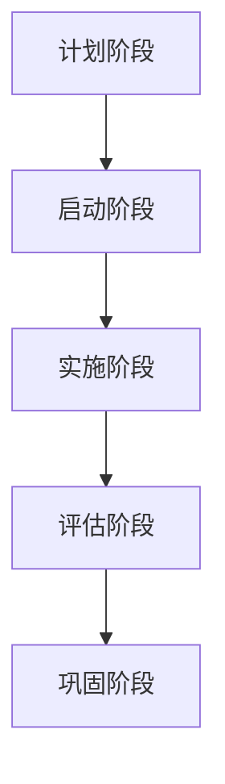

                 

### 文章标题：变革管理：引导团队度过转型期

> 关键词：变革管理、团队转型、领导力、过程管理、沟通技巧

> 摘要：
本文旨在探讨变革管理在团队转型中的应用，通过介绍变革管理的基本概念、理论、过程管理、团队协作与沟通、工具与技术、挑战与解决方案，结合实际案例，为读者提供一份全面的变革管理实践指南。文章采用逻辑清晰、结构紧凑、简单易懂的专业技术语言，旨在帮助读者深刻理解变革管理的核心原理，提升团队在转型过程中的管理能力。

### 1. 设计目标
本文的设计目标是为了帮助读者：
- 理解变革管理的基本概念与理论；
- 掌握变革过程管理的方法和技巧；
- 学会有效的团队协作与沟通策略；
- 熟悉变革管理工具与技术；
- 掌握变革管理的挑战与解决方案；
- 学习变革管理的实践方法。

### 2. 目录结构规划
为了确保文章的逻辑性和完整性，本文将按照以下结构进行规划：

#### 第一部分：变革管理的基本概念与理论
1. 引言：变革管理的背景与重要性
2. 变革管理的基本概念
3. 变革管理的理论框架

#### 第二部分：变革过程管理
4. 变革过程管理概述
5. 变革的准备阶段
6. 变革的实施阶段
7. 变革的持续阶段

#### 第三部分：团队协作与沟通
8. 团队协作的重要性
9. 沟通在变革管理中的作用
10. 团队协作与沟通工具

#### 第四部分：变革管理工具与技术
11. 变革管理工具概述
12. 变革管理技术

#### 第五部分：变革管理的挑战与解决方案
13. 变革管理的挑战
14. 变革管理的解决方案

#### 第六部分：案例分析
15. 案例研究一：某公司成功变革案例
16. 案例研究二：某公司变革失败案例

#### 第七部分：变革管理实践
17. 变革管理实践指南
18. 变革管理实践案例分析

#### 附录：相关资源与参考
19. 附录一：变革管理相关书籍与论文推荐
20. 附录二：变革管理工具与技术资源链接
21. 附录三：变革管理在线课程与培训资源

### 总结
本文通过详细的目录结构规划，为读者提供了一份全面的变革管理实践指南。接下来，我们将一步步深入探讨每个部分的内容，帮助读者更好地理解变革管理的核心原理和实践方法。让我们开始这场探索之旅吧！### 第一部分：变革管理的基本概念与理论

#### 引言：变革管理的背景与重要性

在当今快速变化的商业环境中，企业面临的市场竞争日益激烈，技术发展日新月异，客户需求不断变化。为了保持竞争力，企业需要不断地进行变革。变革管理作为一门学科，旨在帮助企业有效地规划和实施变革，以实现组织的战略目标。变革管理的背景和重要性主要体现在以下几个方面：

**1.1 变革的定义**

变革是指对组织、流程、结构、技术或文化的调整，以适应新的环境和需求。变革可以是一种渐进式的改进，也可以是一种革命性的转型。从本质上看，变革是为了应对外部压力和内部需求，推动组织向前发展。

**1.2 变革管理的重要性**

- **增强组织竞争力**：有效的变革管理可以帮助企业迅速适应市场变化，抓住新机遇，提高市场竞争力。
- **提升员工满意度**：通过变革管理，员工可以更好地理解变革的原因和目标，增强参与感和归属感，从而提高员工满意度。
- **确保变革成功**：变革管理提供了一套系统的方法和工具，可以帮助企业在变革过程中克服各种挑战，确保变革成功。

**1.3 变革管理的目标**

变革管理的目标是确保变革过程的顺利进行，并实现预期的变革成果。具体目标包括：

- **明确变革目标**：确保所有利益相关者对变革目标有共同的理解和认同。
- **制定详细的变革计划**：包括变革的范围、时间表、资源分配等。
- **建立有效的变革团队**：确保团队成员具备所需的技能和经验，能够有效地推动变革。
- **沟通与共识**：确保变革过程中的信息透明，建立共识，减少内部冲突。
- **监测与评估**：通过持续的监测和评估，确保变革计划的有效执行，及时调整变革策略。

#### 变革管理的基本概念

**2.1 变革的类型**

变革可以按照不同的维度进行分类。常见的分类方式包括：

- **按照变革的范围**：局部的变革和全局的变革。局部的变革通常是指对某一部门或流程的调整，而全局的变革则是指对整个组织结构、文化、流程等的全面调整。
- **按照变革的性质**：渐进式的变革和革命性的变革。渐进式的变革是指在短时间内逐步进行的，而革命性的变革则是在短时间内进行重大的、根本性的调整。
- **按照变革的发起方**：自上而下的变革和自下而上的变革。自上而下的变革通常是由管理层发起，而自下而上的变革则是由基层员工或外部利益相关者发起。

**2.2 变革的原因**

变革的原因多种多样，主要包括：

- **外部环境的变化**：如市场竞争加剧、客户需求变化、技术革新等。
- **内部需求**：如组织结构调整、流程优化、技术升级等。
- **法律和法规的变化**：如新的法律法规对企业的运营产生重大影响。

**2.3 变革的影响**

变革对组织的影响是多方面的，包括：

- **经济影响**：如成本节约、收入增加等。
- **组织结构影响**：如部门重组、流程优化等。
- **文化影响**：如价值观的变革、员工行为的变化等。
- **技术影响**：如新的技术引入、现有技术的升级等。

#### 变革管理的理论框架

变革管理理论是变革管理学科的核心，它提供了一系列的理论框架和方法，用于指导变革的实施和监控。常见的变革管理理论包括：

- **领导理论**：强调领导者在变革过程中的作用，如变革推动者的角色、领导力模型等。
- **变革过程理论**：描述变革的各个阶段和过程，如计划阶段、实施阶段、评估阶段等。
- **变革行为理论**：研究个人在变革过程中的行为和反应，如变革接受者模型、变革阻力的管理策略等。

为了更好地理解变革管理的理论框架，我们可以使用Mermaid流程图来展示变革的不同阶段和过程，以及各阶段之间的关系。

**Mermaid流程图示例：**



在上面的流程图中，A表示计划阶段，B表示启动阶段，C表示实施阶段，D表示评估阶段，E表示巩固阶段。每个阶段都有其特定的任务和目标，并且阶段之间存在着前后依赖关系。

#### 变革的数学模型

除了理论框架，变革管理还可以使用数学模型来描述和预测变革的过程和结果。例如，可以使用马尔可夫链模型来描述员工在变革过程中的行为变化，使用决策树模型来优化变革策略的制定。

**数学模型示例：**

```latex
\begin{equation}
P_{ij} = \frac{n_{ij}}{n_i}
\end{equation}
```

其中，\( P_{ij} \)表示从状态\( i \)转移到状态\( j \)的概率，\( n_{ij} \)表示从状态\( i \)转移到状态\( j \)的次数，\( n_i \)表示从状态\( i \)转移的总次数。

通过数学模型，我们可以对变革过程进行定量分析，从而更准确地预测变革的结果，并制定相应的策略。

#### 总结

在本部分，我们介绍了变革管理的基本概念与理论，包括变革的定义、类型、原因和影响，以及变革管理的目标。我们还讨论了变革管理的理论框架，并使用Mermaid流程图和数学模型来展示变革的不同阶段和过程。通过这些内容，读者可以初步了解变革管理的核心原理和方法。

### 第一部分：变革管理的基本概念与理论

#### 1.1 变革的定义

变革（Change）是指组织、个人或系统在某一特定时间内，对其现有状态进行的有目的的、有计划的调整和改进。变革可以涉及到组织结构、流程、技术、文化、策略等多个方面。从本质上看，变革是为了适应外部环境的变化，满足内部发展的需求，提高组织的竞争力。

**变革的类型：**

- **渐进式变革（Incremental Change）**：渐进式变革是指通过逐步的、持续的小规模改进，使组织逐渐适应新的环境和需求。这种变革的特点是平稳、可控，适合于组织在稳定环境中进行。

- **革命性变革（Revolutionary Change）**：革命性变革是指对组织进行根本性、全局性的调整和改变。这种变革通常涉及到重大的战略调整、组织结构重组、技术升级等。革命性变革的特点是变革幅度大、影响深远，适合于组织在面临重大挑战或危机时进行。

- **转型性变革（Transitional Change）**：转型性变革是指组织在短时间内进行的重大变革，目的是在短时间内实现组织的转型和升级。这种变革通常需要强有力的领导力和有效的变革管理策略，以确保变革的成功。

**变革的原因：**

- **外部环境的变化**：如市场竞争加剧、客户需求变化、技术革新等，迫使组织进行变革以保持竞争力。

- **内部需求**：如组织结构不合理、流程不畅、员工满意度低等，需要通过变革来解决内部问题，提高组织效能。

- **战略调整**：组织在实现长期战略目标的过程中，可能需要对现有资源、流程、结构进行调整，以更好地支持战略的实现。

**变革的影响：**

- **经济影响**：变革可能带来成本节约、收入增加等经济效益。

- **组织结构影响**：变革可能导致部门重组、流程优化、职位调整等组织结构的改变。

- **文化影响**：变革可能改变组织的价值观、员工行为和企业文化。

- **技术影响**：变革可能引入新的技术，升级现有技术，提高组织的数字化水平。

**变革管理的重要性：**

变革管理（Change Management）是确保变革成功的关键。有效的变革管理可以帮助组织：

- **明确变革目标**：确保所有利益相关者对变革目标有共同的理解和认同。

- **制定详细的变革计划**：包括变革的范围、时间表、资源分配等。

- **建立有效的变革团队**：确保团队成员具备所需的技能和经验，能够有效地推动变革。

- **沟通与共识**：确保变革过程中的信息透明，建立共识，减少内部冲突。

- **监测与评估**：通过持续的监测和评估，确保变革计划的有效执行，及时调整变革策略。

**变革管理的目标：**

- **确保变革的顺利进行**：通过系统化的方法和工具，确保变革按照预定计划进行。

- **实现预期的变革成果**：通过有效的变革管理，实现组织预期的经济效益、组织结构优化、文化提升等目标。

**变革管理的核心概念：**

- **变革推动者（Change Agent）**：变革推动者是负责推动变革的人或团队，他们具备变革所需的技能和影响力，能够有效地引导变革过程。

- **变革接受者（Change Receiver）**：变革接受者是变革的直接参与者，他们可能包括员工、管理层、客户等。变革接受者的态度和行为对变革的成功至关重要。

- **变革阻力（Change Resistance）**：变革阻力是指组织或个人对变革的抵制或拖延行为。变革阻力可能来自个人利益、文化因素、不确定性等。有效的变革管理需要识别和应对变革阻力。

**变革管理的理论框架：**

变革管理理论是变革管理学科的核心，它提供了一系列的理论框架和方法，用于指导变革的实施和监控。常见的变革管理理论包括：

- **领导理论**：强调领导者在变革过程中的作用，如变革推动者的角色、领导力模型等。

- **变革过程理论**：描述变革的各个阶段和过程，如计划阶段、实施阶段、评估阶段等。

- **变革行为理论**：研究个人在变革过程中的行为和反应，如变革接受者模型、变革阻力的管理策略等。

为了更好地理解变革管理的理论框架，我们可以使用Mermaid流程图来展示变革的不同阶段和过程，以及各阶段之间的关系。

**Mermaid流程图示例：**


在上面的流程图中，A表示计划阶段，B表示启动阶段，C表示实施阶段，D表示评估阶段，E表示巩固阶段。每个阶段都有其特定的任务和目标，并且阶段之间存在着前后依赖关系。

**变革的数学模型：**

除了理论框架，变革管理还可以使用数学模型来描述和预测变革的过程和结果。例如，可以使用马尔可夫链模型来描述员工在变革过程中的行为变化，使用决策树模型来优化变革策略的制定。

**数学模型示例：**

```latex
\begin{equation}
P_{ij} = \frac{n_{ij}}{n_i}
\end{equation}
```

其中，\( P_{ij} \)表示从状态\( i \)转移到状态\( j \)的概率，\( n_{ij} \)表示从状态\( i \)转移到状态\( j \)的次数，\( n_i \)表示从状态\( i \)转移的总次数。

通过数学模型，我们可以对变革过程进行定量分析，从而更准确地预测变革的结果，并制定相应的策略。

**总结：**

在本部分，我们详细介绍了变革管理的基本概念与理论，包括变革的定义、类型、原因、影响以及变革管理的目标、核心概念和理论框架。通过这些内容，读者可以更深入地理解变革管理的核心原理，为后续的学习和实践打下坚实的基础。

### 第一部分：变革管理的基本概念与理论

#### 1.3 变革管理的目标

变革管理的目标在于确保变革的顺利进行，并实现预期的变革成果。为了达到这一目标，变革管理需要关注以下几个方面：

**明确变革目标**

首先，明确变革目标是变革管理的首要任务。明确的目标有助于统一所有利益相关者的思想和行动，减少内部冲突，确保变革的有序进行。在明确变革目标时，需要考虑以下因素：

- **战略目标**：变革目标应与组织的长期战略目标保持一致，确保变革有助于实现组织的整体发展。
- **具体目标**：变革目标应具体、可衡量，以便在变革过程中进行评估和调整。
- **优先级**：明确变革目标的优先级，有助于分配资源和精力，确保关键目标的优先实现。

**制定详细的变革计划**

在明确变革目标后，需要制定详细的变革计划。变革计划应包括以下内容：

- **范围**：明确变革影响的范围，包括哪些部门、流程、人员等将受到变革的影响。
- **时间表**：制定详细的时间表，包括每个阶段的开始和结束时间，以及关键里程碑。
- **资源分配**：明确变革所需的资源，包括人力、财力、物力等，并确保资源得到合理分配和利用。
- **风险评估**：评估变革过程中可能出现的风险，并制定相应的风险应对措施。

**建立有效的变革团队**

变革团队是推动变革的核心力量。一个有效的变革团队应具备以下特点：

- **多样化**：团队成员应来自不同部门、层级和背景，以确保变革的全面性和包容性。
- **技能互补**：团队成员应具备不同的技能和专长，以便在变革过程中发挥各自的优势。
- **共同目标**：团队成员应共同认同变革的目标和价值观，以确保团队协作的有效性。
- **领导力**：变革团队中应有一位具有领导力的领导者，负责协调团队工作，确保变革的顺利进行。

**沟通与共识**

在变革过程中，沟通与共识至关重要。有效的沟通可以确保所有利益相关者对变革有共同的理解和认同，减少误解和猜疑。为了建立沟通与共识，需要采取以下措施：

- **透明沟通**：确保变革过程中的信息透明，及时向所有利益相关者传达变革的最新进展和决策。
- **多渠道沟通**：采用多种沟通方式，如会议、邮件、公告等，确保信息传达的全面性和有效性。
- **反馈机制**：建立反馈机制，鼓励员工表达意见和建议，以便及时调整变革策略。

**监测与评估**

在变革过程中，监测与评估是确保变革计划有效执行的重要手段。通过持续的监测和评估，可以及时发现和解决变革过程中的问题，确保变革按计划进行。具体措施包括：

- **关键绩效指标（KPI）**：制定关键绩效指标，用于评估变革的效果和成果。
- **定期回顾**：定期组织变革回顾会议，总结变革过程中的经验和教训，及时调整变革策略。
- **第三方评估**：邀请第三方机构对变革进行评估，提供客观、专业的意见和建议。

通过以上措施，可以有效实现变革管理的目标，确保变革的顺利进行和预期成果的实现。

### 第一部分：变革管理的基本概念与理论

#### 1.4 变革管理的理论框架

变革管理理论是变革管理学科的核心，它提供了一系列的理论框架和方法，用于指导变革的实施和监控。以下是一些常见的变革管理理论：

**1.4.1 领导理论**

领导理论强调领导者在变革过程中的作用。根据领导理论，领导者的角色包括变革推动者、变革倡导者和变革导师。以下是一些典型的领导理论：

- **变革推动者理论**：认为领导者的主要任务是推动变革，克服变革过程中的各种障碍，确保变革的顺利进行。
- **变革倡导者理论**：强调领导者应具备变革的远见和热情，积极倡导和推动变革。
- **变革导师理论**：认为领导者应作为变革的导师，帮助团队成员理解和接受变革，指导他们适应新的工作环境。

**1.4.2 变革过程理论**

变革过程理论描述了变革的不同阶段和过程。以下是一些典型的变革过程理论：

- **三阶段模型**：认为变革过程可以分为三个阶段：准备阶段、实施阶段和巩固阶段。
  - 准备阶段：包括评估当前状态、制定变革计划、建立变革团队等。
  - 实施阶段：包括执行变革计划、沟通和动员员工、解决变革过程中的问题等。
  - 巩固阶段：包括评估变革效果、总结变革经验、巩固变革成果等。

- **五阶段模型**：认为变革过程可以分为五个阶段：动员阶段、规划阶段、执行阶段、反馈阶段和评估阶段。
  - 动员阶段：通过沟通和动员，激发员工的变革意识和参与度。
  - 规划阶段：制定详细的变革计划，明确变革的目标、范围、时间表和资源需求。
  - 执行阶段：按照变革计划实施变革，解决变革过程中的问题，确保变革的顺利进行。
  - 反馈阶段：收集员工的反馈意见，调整变革策略，改进变革过程。
  - 评估阶段：评估变革的效果和成果，总结变革的经验教训，为未来的变革提供参考。

**1.4.3 变革行为理论**

变革行为理论主要研究个人在变革过程中的行为和反应。以下是一些典型的变革行为理论：

- **变革接受者模型**：认为个人在变革过程中的行为受到多种因素的影响，包括个人对变革的认知、态度、能力和支持等。
  - 认知因素：包括个人对变革的理解和认识，如变革的必要性、可能带来的好处等。
  - 态度因素：包括个人对变革的态度和情感，如支持、反对、中立等。
  - 能力因素：包括个人在变革过程中的适应能力和学习能力，如个人技能、知识、经验等。
  - 支持因素：包括个人在变革过程中的支持和资源，如领导支持、同事支持、培训等。

- **变革阻力的管理策略**：认为变革阻力是变革过程中普遍存在的现象，有效的变革管理需要识别和应对变革阻力。以下是一些常见的变革阻力管理策略：

  - **沟通策略**：通过有效的沟通，向员工传达变革的必要性、目标、过程和预期效果，减少误解和猜疑。
  - **参与策略**：鼓励员工参与变革过程，提高他们的参与度和认同感，减少变革阻力。
  - **支持策略**：提供必要的支持和资源，如培训、指导、辅导等，帮助员工适应变革。
  - **激励策略**：通过奖励和激励，鼓励员工积极参与变革，提高变革的效率和效果。

通过这些变革行为理论，我们可以更好地理解个人在变革过程中的行为和反应，从而制定更有效的变革管理策略。

**1.4.4 变革的数学模型**

除了理论框架，变革管理还可以使用数学模型来描述和预测变革的过程和结果。以下是一些常见的变革数学模型：

- **马尔可夫链模型**：用于描述员工在变革过程中的行为变化，如员工的接受度、参与度等。
- **决策树模型**：用于优化变革策略的制定，如选择最佳变革路径、确定最佳变革时间等。
- **回归分析模型**：用于分析变革结果与各种因素之间的关系，如变革成果与员工满意度、变革过程与组织绩效等。

通过数学模型，我们可以对变革过程进行定量分析，从而更准确地预测变革的结果，并制定相应的策略。

**总结**

在本部分，我们介绍了变革管理的理论框架，包括领导理论、变革过程理论、变革行为理论和变革的数学模型。通过这些理论框架，我们可以更好地理解变革管理的核心原理和方法，为实际操作提供指导。

### 第二部分：变革过程管理

#### 2.1 变革过程管理概述

变革过程管理是确保变革顺利进行的关键环节。它涉及到对变革过程进行系统化的规划、实施和监控，以确保变革达到预期目标。变革过程管理的主要任务包括：

- **规划**：明确变革的目标、范围、时间表和资源需求，制定详细的变革计划。
- **实施**：按照变革计划进行变革，包括动员、执行、沟通和解决变革过程中的问题。
- **监控**：对变革过程进行持续的监测和评估，确保变革按照预定计划进行，及时调整变革策略。

**2.1.1 变革过程的阶段**

变革过程通常可以分为以下阶段：

- **计划阶段**：在这一阶段，需要对变革进行详细规划，明确变革的目标、范围、时间表和资源需求。这一阶段的主要任务包括：
  - **评估当前状态**：分析组织当前的状况，包括流程、结构、文化等，了解变革的必要性。
  - **制定变革计划**：根据评估结果，制定详细的变革计划，包括变革的目标、范围、时间表和资源需求。
  - **建立变革团队**：组建变革团队，明确团队成员的角色和职责，确保团队成员具备所需的技能和经验。

- **启动阶段**：在这一阶段，需要正式宣布变革计划，动员所有利益相关者，确保他们对变革有共同的理解和认同。这一阶段的主要任务包括：
  - **发布变革通知**：向所有利益相关者发布变革通知，说明变革的目标、时间表和预期效果。
  - **动员员工**：通过会议、培训、内部宣传等方式，动员员工参与变革，提高他们的变革意识和参与度。
  - **建立沟通渠道**：建立有效的沟通渠道，确保变革过程中的信息透明，及时传达变革的最新进展和决策。

- **实施阶段**：在这一阶段，按照变革计划进行变革，包括实施变革方案、解决变革过程中的问题、确保变革的顺利进行。这一阶段的主要任务包括：
  - **实施变革方案**：按照变革计划，实施具体的变革方案，包括流程优化、组织结构重组、技术升级等。
  - **解决变革问题**：在变革过程中，可能会遇到各种问题，如资源不足、员工抵制、技术难题等。需要及时解决这些问题，确保变革的顺利进行。
  - **监控变革进度**：对变革过程进行持续的监控和评估，确保变革按照预定计划进行，及时调整变革策略。

- **评估阶段**：在这一阶段，对变革的结果进行评估，总结变革的经验和教训，为未来的变革提供参考。这一阶段的主要任务包括：
  - **评估变革效果**：通过关键绩效指标（KPI）等工具，评估变革的效果和成果，如成本节约、收入增加、员工满意度等。
  - **总结变革经验**：总结变革过程中的经验和教训，识别成功的因素和失败的教训，为未来的变革提供参考。
  - **反馈和改进**：将评估结果和反馈传达给所有利益相关者，针对存在的问题进行改进，提高未来的变革效果。

**2.1.2 变革过程的难点

在变革过程中，可能会遇到各种难点和挑战，主要包括：

- **组织阻力**：变革可能会触动某些利益相关者的利益，导致他们对变革产生抵触情绪。组织阻力可能来自管理层、员工、外部利益相关者等多个方面。
- **领导力不足**：有效的变革管理需要强有力的领导力。如果领导层缺乏变革管理的知识和经验，可能会导致变革失败。
- **沟通不足**：变革过程中，如果沟通不足，可能会导致信息不透明、误解和猜疑，影响变革的顺利进行。
- **资源不足**：变革需要投入大量的资源，包括人力、财力、物力等。如果资源不足，可能会影响变革的实施和效果。
- **变革阻力**：员工可能对变革有抵触情绪，导致变革难以推进。变革阻力可能来自个人利益、文化因素、不确定性等。

为了克服这些难点，需要采取一系列措施，如加强领导力培训、提高沟通效果、优化资源配置、提供员工支持和培训等。

#### 2.2 变革的准备阶段

变革的准备阶段是变革过程管理的重要环节，它为后续的变革实施奠定了基础。在这一阶段，主要任务包括：

**2.2.1 变革规划**

变革规划是准备阶段的核心任务，它包括以下几个方面：

- **明确变革目标**：确定变革的具体目标，如提高效率、降低成本、提升客户满意度等。明确的目标有助于统一所有利益相关者的思想和行动。
- **评估变革必要性**：分析组织当前的状况，评估变革的必要性，如市场竞争压力、客户需求变化、技术发展等。评估结果为变革规划的制定提供了依据。
- **确定变革范围**：明确变革影响的范围，包括哪些部门、流程、人员等将受到变革的影响。范围的确定有助于制定详细的变革计划。
- **制定变革时间表**：根据变革目标和范围，制定详细的时间表，包括每个阶段的开始和结束时间，以及关键里程碑。时间表的制定有助于确保变革的有序进行。
- **分配资源**：明确变革所需的资源，包括人力、财力、物力等，并确保资源得到合理分配和利用。资源的充足和合理分配是变革成功的重要保障。

**2.2.2 变革评估**

变革评估是变革准备阶段的重要环节，它包括以下几个方面：

- **内部评估**：对组织的当前状况进行深入分析，包括流程、结构、文化等。内部评估有助于识别变革的必要性，为变革规划的制定提供依据。
- **外部评估**：分析外部环境的变化，如市场竞争、客户需求、技术发展等。外部评估有助于识别变革的驱动力，为变革目标的制定提供依据。
- **风险评估**：评估变革过程中可能出现的风险，如组织阻力、领导力不足、沟通不足、资源不足等。风险评估有助于制定相应的风险应对措施，降低变革失败的风险。

**2.2.3 变革动员**

变革动员是准备阶段的最后任务，它包括以下几个方面：

- **发布变革通知**：向所有利益相关者发布变革通知，说明变革的目标、时间表和预期效果。通知的发布有助于提高员工的变革意识和参与度。
- **动员员工**：通过会议、培训、内部宣传等方式，动员员工参与变革，提高他们的变革意识和参与度。动员员工有助于形成全员参与、共同推动变革的氛围。
- **建立沟通渠道**：建立有效的沟通渠道，确保变革过程中的信息透明，及时传达变革的最新进展和决策。沟通渠道的建立有助于减少误解和猜疑，提高变革的顺利进行。

通过以上措施，可以有效确保变革准备阶段的顺利进行，为后续的变革实施打下坚实的基础。

### 第二部分：变革过程管理

#### 2.3 变革的实施阶段

在变革的实施阶段，所有准备工作将转化为实际行动，变革计划将逐步落实。这一阶段是变革过程中的核心环节，其成功与否直接关系到变革的目标能否实现。以下是变革实施阶段的主要任务和步骤：

**2.3.1 变革策略**

变革策略是变革实施阶段的基础，它包括以下几个方面：

- **制定详细的变革方案**：根据变革计划，制定详细的变革方案，明确每个阶段的任务、时间表和资源需求。变革方案应具体、可操作，确保变革的每一步都有明确的目标和行动计划。
- **确定关键路径**：识别变革过程中的关键路径，即那些对整个变革过程具有决定性影响的活动和任务。确保关键路径上的任务得到优先处理，以加快变革的进度。
- **资源配置**：根据变革方案，合理配置资源，确保人力、财力、物力等资源得到充分利用。资源配置应考虑到各阶段的需求，确保资源在关键时间点上能够及时到位。
- **风险管理**：在变革实施过程中，持续评估和管理风险。制定风险应对策略，确保在风险发生时能够迅速响应，将风险对变革过程的影响降到最低。

**2.3.2 变革执行**

变革执行阶段是变革策略的具体实施过程，主要任务包括：

- **动员团队**：组织变革团队，明确团队成员的职责和任务，确保每个成员都清楚自己的角色和目标。动员团队成员积极参与变革，提高团队的凝聚力和执行力。
- **实施变革计划**：按照变革方案，逐步实施变革计划。确保每个任务按时完成，每个里程碑得到顺利实现。在实施过程中，应密切关注变革的进展情况，及时调整计划，以应对可能出现的变化和挑战。
- **监控进度**：对变革过程的进度进行持续监控，确保变革按照预定计划进行。通过关键绩效指标（KPI）等工具，评估变革的进展情况，及时发现和解决问题。

**2.3.3 变革监控**

变革监控是确保变革实施阶段顺利进行的重要手段，主要任务包括：

- **监测变革效果**：通过关键绩效指标（KPI）等工具，监测变革的效果和成果。评估变革对组织绩效、员工满意度、客户满意度等方面的影响，确保变革达到预期目标。
- **评估变革风险**：持续评估变革过程中的风险，识别潜在的问题和挑战。根据评估结果，及时调整变革策略，制定风险应对措施，确保变革过程的风险可控。
- **收集反馈意见**：鼓励员工和利益相关者提出反馈意见，收集他们对变革过程的看法和建议。通过反馈机制，改进变革过程，提高变革的透明度和公平性。

**2.3.4 变革沟通**

在变革实施阶段，沟通至关重要，主要任务包括：

- **透明沟通**：确保变革过程中的信息透明，及时向所有利益相关者传达变革的最新进展、决策和问题。通过会议、邮件、内部网站等渠道，建立多层次的沟通机制，确保信息传递的全面性和及时性。
- **主动沟通**：主动与员工和利益相关者进行沟通，了解他们的需求和顾虑，及时解答他们的疑问。通过沟通，建立信任和共识，减少变革阻力，提高员工的参与度和认同感。
- **反馈机制**：建立反馈机制，鼓励员工和利益相关者提出意见和建议，持续改进变革过程。通过反馈机制，及时发现和解决问题，确保变革的顺利进行。

通过以上措施，可以有效确保变革实施阶段的顺利进行，为变革的最终成功奠定基础。

### 第二部分：变革过程管理

#### 2.4 变革的持续阶段

在变革的持续阶段，变革计划已经实施并取得初步成效，但变革过程并未结束。这一阶段的任务主要是评估变革成果、巩固变革成果和提供持续的反馈与支持，以确保变革能够持续并深入人心。

**2.4.1 变革评估**

变革评估是持续阶段的核心任务，目的是全面了解变革的实际效果和成果。以下是变革评估的主要任务：

- **评估变革效果**：通过关键绩效指标（KPI）等工具，评估变革对组织绩效、员工满意度、客户满意度等方面的影响。具体指标可能包括成本节约、工作效率提升、客户满意度调查结果等。
- **分析变革成果**：分析变革过程中实现的具体成果，如流程优化、组织结构改进、技术升级等。通过分析，识别成功的因素和改进的机会。
- **总结变革经验**：总结变革过程中的经验教训，包括成功的策略和失败的教训。这些经验教训将为未来的变革提供宝贵的参考。

**2.4.2 变革巩固**

变革巩固阶段的目标是确保变革成果能够持续并巩固下来，以下是变革巩固的主要任务：

- **制定巩固策略**：根据评估结果，制定具体的巩固策略，确保变革成果不被遗忘或放弃。巩固策略可能包括持续的培训、定期回顾、绩效考核等。
- **建立反馈机制**：建立持续的反馈机制，鼓励员工和利益相关者持续参与变革，提供反馈和建议。反馈机制有助于及时发现和解决问题，确保变革过程的持续改进。
- **强化文化变革**：通过文化变革，使变革成果成为组织的核心价值观和行为准则。强化文化变革可能包括内部宣传、员工活动、领导层的示范作用等。

**2.4.3 变革反馈**

变革反馈是持续阶段的重要环节，旨在收集员工和利益相关者的反馈，持续改进变革过程。以下是变革反馈的主要任务：

- **收集反馈意见**：通过问卷调查、座谈会、访谈等方式，收集员工和利益相关者对变革过程的反馈意见。反馈意见可能包括对变革的满意度、改进建议等。
- **分析反馈意见**：对收集到的反馈意见进行详细分析，识别普遍存在的问题和需求。通过分析，制定针对性的改进措施。
- **反馈改进措施**：将分析结果和改进措施反馈给相关利益方，确保他们了解变革的改进方向和进展。通过持续的反馈和改进，提高变革的透明度和公平性。

**2.4.4 变革支持**

在持续阶段，提供持续的支持对于确保变革的成功至关重要。以下是变革支持的主要任务：

- **提供培训**：根据变革的需要，为员工提供持续的专业培训，帮助他们适应新的工作环境和流程。培训内容可能包括新技能的学习、新技术的应用等。
- **提供资源**：确保变革所需的资源持续供应，如资金、设备、人力资源等。资源的充足和合理配置有助于确保变革的顺利进行。
- **提供领导力支持**：领导层应持续提供支持，包括鼓励员工、解答疑问、解决冲突等。领导力的支持有助于增强员工的信心和参与度，确保变革的持续进行。

通过以上措施，可以有效确保变革的持续阶段顺利进行，使变革成果得以巩固并持续发展。

### 第三部分：团队协作与沟通

#### 8. 团队协作的重要性

在变革管理过程中，团队协作起着至关重要的作用。有效的团队协作能够确保变革计划的顺利实施，提高变革的效率和效果。以下是团队协作的重要性及其对变革管理的具体贡献：

**8.1 团队协作的定义**

团队协作是指团队成员在共同目标下，通过相互配合、沟通和共同努力，以实现预期目标的过程。团队协作不仅包括团队成员之间的合作，还涉及到团队与外部利益相关者的互动。

**8.2 团队协作的要素**

有效的团队协作需要具备以下几个关键要素：

- **共同目标**：团队成员应明确共同的目标，确保每个人的努力都指向同一个方向。
- **相互信任**：团队成员之间应建立信任关系，相信彼此的能力和承诺，从而减少误解和冲突。
- **沟通机制**：团队应建立有效的沟通机制，确保信息透明，及时传达关键信息。
- **分工明确**：团队成员应明确各自的职责和任务，避免职责重叠或责任不明。
- **协作工具**：利用协作工具（如项目管理软件、通信工具等）可以提高团队协作的效率和效果。

**8.3 团队协作的优势**

团队协作在变革管理中具有以下优势：

- **提高效率**：通过团队协作，可以优化工作流程，减少重复劳动，提高工作效率。
- **增强创新能力**：团队协作能够汇聚不同的观点和思路，激发创新思维，从而推动变革的创新性实施。
- **提升员工满意度**：团队成员在协作过程中，能够感受到归属感和参与感，提高员工的工作满意度。
- **降低变革阻力**：通过有效的团队协作，可以减少变革过程中的误解和猜疑，降低变革阻力。

**8.4 团队协作在变革管理中的应用**

在变革管理中，团队协作的应用体现在以下几个方面：

- **变革计划制定**：团队协作有助于制定全面的变革计划，确保计划的科学性和可操作性。
- **变革方案实施**：团队协作能够确保变革方案的顺利实施，减少变革过程中的障碍和风险。
- **问题解决**：在变革过程中，团队协作能够快速应对和解决问题，确保变革的顺利进行。
- **变革评估**：团队协作有助于全面评估变革的效果和成果，为未来的变革提供参考。

#### 9. 沟通在变革管理中的作用

在变革管理过程中，沟通是确保变革顺利进行的关键环节。有效的沟通能够确保团队成员对变革有共同的理解和认同，减少误解和冲突，增强团队的凝聚力。以下是沟通在变革管理中的作用及其重要性：

**9.1 变革中的沟通需求**

在变革管理过程中，沟通的需求体现在以下几个方面：

- **信息传递**：确保变革的最新信息、决策和计划能够及时、准确地传递给所有利益相关者。
- **共识建立**：通过沟通，建立团队成员对变革目标的共识，减少误解和猜疑，提高团队的凝聚力。
- **冲突解决**：在变革过程中，可能会出现各种冲突和问题，有效的沟通可以帮助团队成员共同解决问题，确保变革的顺利进行。
- **反馈收集**：通过沟通，收集员工和利益相关者的反馈意见，了解他们对变革的看法和建议，及时调整变革策略。

**9.2 沟通技巧**

为了确保沟通的有效性，团队成员需要掌握以下沟通技巧：

- **倾听**：积极倾听对方的意见和需求，理解对方的观点，避免误解和冲突。
- **清晰表达**：用简洁、明确的语言表达自己的意见和想法，确保信息传递的准确性。
- **开放性**：保持开放的心态，鼓励团队成员表达不同的观点，尊重每个人的意见。
- **反馈**：及时给予反馈，确认对方是否理解自己的意见，避免误解和猜疑。
- **非语言沟通**：注意非语言沟通（如肢体语言、面部表情等），确保沟通的效果。

**9.3 沟通障碍与解决策略**

在变革管理过程中，沟通障碍是普遍存在的。以下是一些常见的沟通障碍及其解决策略：

- **信息不对称**：解决策略：建立透明的信息传递机制，确保信息在团队内部和外部之间的对称性。
- **文化差异**：解决策略：尊重文化差异，通过跨文化培训和文化交流，增强团队的文化包容性。
- **时间冲突**：解决策略：合理安排沟通时间，确保团队成员有足够的时间参与沟通。
- **沟通渠道不畅**：解决策略：优化沟通渠道，确保信息能够迅速、准确地传递。
- **心理障碍**：解决策略：通过心理辅导和团队建设活动，增强团队成员的心理素质，提高沟通效果。

通过以上沟通技巧和解决策略，可以有效克服变革管理过程中的沟通障碍，确保变革的顺利进行。

### 第三部分：团队协作与沟通

#### 10. 团队协作与沟通工具

在现代变革管理中，有效的团队协作与沟通工具对于确保变革的顺利进行至关重要。以下是一些常见的团队协作与沟通工具及其应用：

**10.1 会议管理工具**

会议管理工具可以帮助团队更高效地安排、组织和记录会议。以下是一些常用的会议管理工具：

- **Microsoft Teams**：提供视频会议、即时消息、文档共享等功能，支持跨平台的协作。
- **Zoom**：提供高质量的视频会议服务，支持屏幕共享、实时聊天等功能。
- **Slack**：支持即时消息、渠道（Channels）和视频会议，便于团队成员进行日常沟通和协作。

**10.2 信息共享平台**

信息共享平台可以帮助团队成员轻松地共享文件、文档和知识，确保信息透明和可追溯。以下是一些常用的信息共享平台：

- **Confluence**：一款强大的文档协作工具，支持版本控制和共享，适合团队编写和共享知识库。
- **SharePoint**：提供文档共享、存储和协作功能，适用于企业内部的知识管理和文档共享。
- **Google Workspace**：包括Google Docs、Google Sheets、Google Drive等工具，支持在线协作和文档共享。

**10.3 团队协作软件**

团队协作软件可以帮助团队在多个项目和工作任务上协同工作，提高工作效率。以下是一些常用的团队协作软件：

- **Trello**：一款可视化的项目管理工具，支持任务分配、进度跟踪和协作。
- **Asana**：提供任务管理、进度跟踪和协作功能，适合团队进行项目管理和任务分配。
- **Jira**：一款强大的敏捷项目管理工具，支持缺陷跟踪、迭代规划和协作。

**10.4 应用场景**

以下是一些常见的团队协作与沟通工具的应用场景：

- **项目启动会**：使用Zoom或Microsoft Teams安排项目启动会，确保团队成员了解项目目标、时间表和分工。
- **日常沟通**：使用Slack进行日常沟通，实时分享信息和更新项目进展。
- **知识共享**：使用Confluence或SharePoint创建知识库，确保团队成员可以轻松查找和共享文档。
- **任务分配**：使用Trello或Asana进行任务分配和进度跟踪，确保每个任务都有明确的负责人和截止日期。

通过以上团队协作与沟通工具，可以有效提高团队的工作效率，确保变革管理的顺利进行。

### 第四部分：变革管理工具与技术

#### 11. 变革管理工具概述

在变革管理过程中，选择合适的工具和技术至关重要。这些工具和技术可以帮助企业更有效地规划和实施变革，确保变革目标的实现。以下是一些常见的变革管理工具及其主要功能：

**11.1 变革管理软件**

变革管理软件是一种专门为变革管理设计的应用程序，它可以帮助企业进行变革的规划、执行和监控。以下是一些流行的变革管理软件：

- **Prosci**：提供全面的变革管理工具和资源，包括变革管理计划模板、评估工具等。
- **KaiNexus**：一款基于云的变革管理平台，支持变革项目生命周期管理、知识共享和协作。
- **Improv**：提供灵活的变革管理工具，支持项目跟踪、进度监控和团队协作。

**11.2 变革模型**

变革模型是描述变革过程和阶段的框架，它可以帮助企业理解和指导变革的各个阶段。以下是一些常见的变革模型：

- **Kotter模型**：由哈佛商学院教授约翰·科特（John Kotter）提出，包括八个步骤，从建立紧急感到持续激励。
- **ADKAR模型**：由Prosci提出，包括四个关键要素： Awareness（意识提升）、Desire（愿意改变）、Knowledge（知识获取）和Ability（能力提升）。
- **变革周期模型**：由学者理查德·达文波特（Richard Daft）提出，包括四个阶段：现状评估、变革规划、变革实施和变革评估。

**11.3 变革管理方法**

变革管理方法是指企业在变革过程中采取的策略和措施。以下是一些常见的变革管理方法：

- **领导力方法**：强调领导者在变革过程中的关键作用，包括倡导变革、建立变革团队、沟通和激励。
- **过程方法**：关注变革的各个阶段和步骤，确保变革按照计划有序进行。
- **行为方法**：关注个人在变革过程中的行为和反应，包括员工参与、变革接受和变革阻力管理。

**11.4 变革管理技术**

变革管理技术是指用于支持变革管理的工具和技巧。以下是一些常见的变革管理技术：

- **项目管理和跟踪工具**：如Trello、Asana、Jira等，用于任务分配、进度监控和团队协作。
- **沟通和协作工具**：如Slack、Microsoft Teams、Zoom等，用于实时沟通、文档共享和协作。
- **数据分析和评估工具**：如Tableau、Power BI等，用于变革效果评估、趋势分析和决策支持。

通过以上变革管理工具和技术，企业可以更系统地规划和实施变革，提高变革的成功率。

### 第四部分：变革管理工具与技术

#### 12. 变革管理技术

在变革管理过程中，运用合适的技术和工具是确保变革成功的关键。以下是一些关键的变革管理技术及其应用：

**12.1 变革计划技术**

变革计划技术是变革管理的起点，它包括以下几个步骤：

- **评估当前状态**：使用评估工具（如SWOT分析、五力模型等）对组织当前的状态进行评估，了解变革的必要性和可行性。
- **设定目标**：明确变革的目标和预期成果，确保目标具体、可衡量、可实现、相关性强和时间性。
- **制定计划**：根据评估结果和目标，制定详细的变革计划，包括变革的范围、时间表、资源需求和关键里程碑。

**12.2 变革执行技术**

在变革执行阶段，以下技术有助于确保变革的有效实施：

- **领导力**：变革领导者需要具备强大的领导力和影响力，能够激发团队的热情和动力，协调各方资源，克服变革过程中的障碍。
- **沟通**：有效的沟通是变革成功的关键。变革领导者需要建立透明的沟通机制，确保团队成员了解变革的进展、决策和问题，减少误解和猜疑。
- **培训**：为员工提供必要的培训和指导，帮助他们掌握新技能和知识，提高他们的适应能力和参与度。

**12.3 变革评估技术**

在变革评估阶段，以下技术有助于评估变革的效果和成果：

- **关键绩效指标（KPI）**：设定关键绩效指标，如成本节约、工作效率提升、客户满意度等，用于评估变革的成果。
- **定性和定量分析**：通过定性和定量的方法，分析变革对组织绩效、员工满意度和客户满意度等方面的影响，识别变革的优劣势。
- **持续反馈**：建立持续的反馈机制，收集员工和利益相关者的反馈意见，了解他们对变革的看法和建议，为未来的变革提供改进的方向。

**12.4 变革技术工具**

以下是一些常用的变革管理技术工具：

- **项目管理工具**：如Trello、Asana、Jira等，用于任务分配、进度跟踪和团队协作。
- **沟通工具**：如Slack、Microsoft Teams、Zoom等，用于实时沟通、文档共享和协作。
- **数据分析和评估工具**：如Tableau、Power BI等，用于变革效果评估、趋势分析和决策支持。

通过以上技术和工具，企业可以更有效地规划和实施变革，提高变革的成功率。

### 第四部分：变革管理工具与技术

#### 13. 变革管理的挑战与解决方案

在变革管理过程中，企业可能会面临多种挑战。以下是一些常见的挑战以及相应的解决方案：

**13.1 组织阻力**

组织阻力是变革过程中最常见的挑战之一，它可能来自员工、管理层或外部利益相关者。以下是解决组织阻力的几种策略：

- **沟通策略**：通过透明和频繁的沟通，确保所有利益相关者对变革有共同的理解和认同。建立有效的反馈机制，鼓励员工表达意见和建议。
- **参与策略**：鼓励员工参与变革过程，提高他们的参与度和认同感。通过培训和教育，增强员工对变革的接受度。
- **支持策略**：提供必要的支持和资源，如心理辅导、技术培训等，帮助员工克服变革过程中的困难和挑战。
- **激励策略**：通过奖励和激励措施，鼓励员工积极参与变革，提高变革的效率和效果。

**13.2 领导力不足**

变革领导者需要具备强大的领导力和影响力，但在实际变革过程中，企业可能面临领导力不足的问题。以下是提高领导力的几种方法：

- **领导力培训**：为领导者提供专业的领导力培训，提高他们的变革管理能力和沟通技巧。
- **角色模范**：领导者应通过自己的行为树立榜样，表现出坚定的变革信念和决心，激发员工的变革动力。
- **团队建设**：通过团队建设活动，增强领导者和团队成员之间的信任和合作，提高团队的凝聚力和执行力。
- **持续支持**：领导者应持续关注变革的进展，提供必要的支持和资源，确保变革计划的顺利实施。

**13.3 文化冲突**

变革过程中可能会出现文化冲突，特别是在多元化组织或跨国企业中。以下是解决文化冲突的几种策略：

- **文化融合策略**：通过跨文化培训和文化交流活动，增强员工对组织文化的认同和理解，促进文化融合。
- **透明沟通**：建立透明的沟通机制，确保不同文化背景的员工都能够获得相同的信息和资源，减少误解和猜疑。
- **冲突管理**：培训员工冲突管理的技巧，帮助他们以积极的方式解决冲突，避免文化冲突的升级。
- **文化包容**：领导者应倡导文化包容，尊重和欣赏不同文化的差异，为员工创造一个包容和尊重的工作环境。

**13.4 资源不足**

在变革过程中，企业可能会面临资源不足的问题，包括人力、财力、物力等。以下是解决资源不足的几种策略：

- **优化资源分配**：对现有资源进行合理分配和优化，确保关键资源在关键时间点上能够得到充分利用。
- **寻求外部支持**：通过合作、外包或寻求外部资金支持等方式，解决资源不足的问题。
- **优先级排序**：明确变革过程中的优先级，确保关键任务和关键资源得到优先考虑和分配。
- **持续监控与调整**：对变革过程中的资源使用进行持续的监控和评估，及时调整资源分配策略，确保资源得到高效利用。

通过以上策略，企业可以更好地应对变革过程中的挑战，提高变革的成功率。

### 第五部分：案例分析

#### 15. 案例研究一：某公司成功变革案例

**15.1 案例背景**

某公司是一家传统的制造业企业，由于市场竞争加剧和技术变革的影响，公司面临巨大的生存压力。为了保持竞争力，公司决定进行一次全面的变革。变革的目标是优化组织结构、提升生产效率、引入新技术和改进客户服务。

**15.2 变革过程**

- **计划阶段**：公司进行了全面的现状评估，制定了详细的变革计划，包括变革的目标、范围、时间表和资源需求。变革计划得到了高层管理者的批准，并组建了变革团队。
- **启动阶段**：公司通过内部会议、培训和内部通讯等方式，动员全体员工参与变革。变革领导者积极沟通，确保员工对变革有共同的理解和认同。
- **实施阶段**：公司按照变革计划逐步实施变革，包括优化组织结构、引入先进的生产技术、提升员工技能和改进客户服务。在实施过程中，公司持续监控变革进度，解决遇到的问题。
- **评估阶段**：变革结束后，公司通过关键绩效指标（KPI）对变革效果进行评估。评估结果显示，变革取得了显著成效，生产效率提高了20%，客户满意度提高了15%，员工满意度提高了10%。

**15.3 变革结果**

变革取得了预期的成果，公司的市场竞争力显著提升，利润率增加了10%。员工对变革的接受度较高，公司内部的文化氛围变得更加积极和开放。通过这次变革，公司不仅提高了生产效率，还增强了员工的凝聚力和团队合作精神。

**15.4 经验教训**

- **领导力至关重要**：变革领导者的作用至关重要，他们需要具备强大的沟通能力和影响力，能够激发员工的热情和参与度。
- **有效的沟通**：变革过程中的沟通至关重要，确保所有利益相关者对变革有共同的理解和认同。
- **持续评估**：在变革过程中，持续评估变革的进展和效果，及时调整变革策略，确保变革目标的实现。

#### 16. 案例研究二：某公司变革失败案例

**16.1 案例背景**

某公司是一家拥有数十年历史的服务业企业，由于市场需求的变化和新兴企业的竞争，公司决定进行一次变革，以提升公司的竞争力和市场份额。然而，由于变革过程中的种种问题，最终变革以失败告终。

**16.2 变革过程**

- **计划阶段**：公司进行了初步的评估，但缺乏详细的变革计划。变革的目标和范围不明确，资源分配不合理。
- **启动阶段**：公司没有进行有效的动员，员工对变革缺乏理解和认同。变革领导者缺乏沟通技巧，未能有效传达变革的目标和意义。
- **实施阶段**：变革过程中，公司遇到了多个问题，如员工抵触、资源不足、沟通不畅等。公司未能及时解决这些问题，导致变革进度缓慢。
- **评估阶段**：由于变革过程混乱，公司无法准确评估变革的效果。最终，变革未能达到预期目标，公司业绩继续下滑。

**16.3 变革失败原因**

- **缺乏详细的变革计划**：公司没有制定详细的变革计划，导致变革目标不明确，资源分配不合理。
- **领导力不足**：变革领导者缺乏沟通技巧和影响力，未能有效动员员工参与变革。
- **沟通不畅**：公司内部的沟通不畅，导致员工对变革缺乏理解和支持。
- **问题解决不力**：公司未能及时解决变革过程中遇到的问题，导致变革进度缓慢，最终失败。

**16.4 经验教训**

- **详细的变革计划**：在变革前，必须制定详细的变革计划，明确变革的目标、范围、时间表和资源需求。
- **强有力的领导力**：变革领导者需要具备强大的沟通能力和影响力，能够有效动员员工参与变革。
- **持续沟通**：在变革过程中，持续沟通至关重要，确保员工对变革有共同的理解和认同。
- **及时解决问题**：在变革过程中，必须及时解决遇到的问题，确保变革进度不受影响。

通过以上案例分析，我们可以看到成功和失败的变革案例各有其特点和教训。有效的变革管理需要详细的计划、强有力的领导力和持续的沟通，以及及时的问题解决能力。

### 第六部分：变革管理实践

#### 17. 变革管理实践指南

在变革管理实践中，为了确保变革的顺利进行并实现预期目标，我们需要遵循一系列步骤和策略。以下是一份详细的变革管理实践指南：

**17.1 明确变革目标**

明确变革目标是变革管理实践的第一步。变革目标应具体、可衡量，并与组织的长期战略目标保持一致。具体步骤如下：

- **评估当前状态**：通过SWOT分析、五力模型等工具，评估组织的当前状况，了解变革的必要性和可行性。
- **设定具体目标**：根据评估结果，设定变革的具体目标，如提高生产效率、优化客户服务、引入新技术等。确保目标具体、可衡量、可实现、相关性强和时间性。
- **目标共识**：与所有利益相关者沟通，确保他们对变革目标有共同的理解和认同。

**17.2 制定变革计划**

制定详细的变革计划是确保变革顺利实施的关键。以下步骤有助于制定有效的变革计划：

- **范围界定**：明确变革影响的范围，包括哪些部门、流程、人员等将受到变革的影响。
- **时间表制定**：制定详细的时间表，包括每个阶段的开始和结束时间，以及关键里程碑。确保时间表合理，留有足够的时间应对意外情况。
- **资源分配**：明确变革所需的资源，包括人力、财力、物力等，并确保资源得到合理分配和利用。
- **风险评估**：评估变革过程中可能出现的风险，并制定相应的风险应对措施。

**17.3 建立变革团队**

建立一支高效的变革团队是变革管理实践的重要组成部分。以下步骤有助于建立有效的变革团队：

- **团队组建**：根据变革计划，组建变革团队，明确团队成员的角色和职责。团队成员应具备所需的技能和经验，能够有效推动变革。
- **团队领导**：任命一位变革领导者，负责协调团队工作，确保变革计划的顺利执行。
- **沟通机制**：建立有效的沟通机制，确保团队成员之间的信息透明和及时沟通。

**17.4 沟通与共识**

有效的沟通和建立共识是变革成功的关键。以下策略有助于提高沟通效果和建立共识：

- **透明沟通**：确保变革过程中的信息透明，及时向所有利益相关者传达变革的最新进展、决策和问题。
- **多渠道沟通**：采用多种沟通方式，如会议、邮件、公告等，确保信息传达的全面性和有效性。
- **反馈机制**：建立反馈机制，鼓励员工表达意见和建议，及时调整变革策略。
- **共识建立**：通过沟通和讨论，建立团队成员对变革目标的共识，减少误解和猜疑。

**17.5 实施变革计划**

在实施变革计划阶段，需要按照计划逐步推进变革，确保变革的顺利进行。以下策略有助于实施变革计划：

- **任务分配**：根据变革计划，明确每个团队成员的任务和责任，确保任务得到按时完成。
- **监控进度**：对变革过程进行持续的监控和评估，确保变革按照预定计划进行，及时调整变革策略。
- **问题解决**：在变革过程中，及时解决遇到的问题，避免影响变革的进度和质量。

**17.6 评估与反馈**

在变革结束后，对变革的效果进行评估和反馈，是确保变革成果巩固的重要环节。以下步骤有助于进行有效的评估和反馈：

- **绩效评估**：通过关键绩效指标（KPI）等工具，评估变革对组织绩效、员工满意度和客户满意度等方面的影响。
- **总结经验**：总结变革过程中的经验教训，识别成功的因素和失败的教训。
- **反馈机制**：建立持续的反馈机制，收集员工和利益相关者的反馈意见，为未来的变革提供改进的方向。

通过以上变革管理实践指南，企业可以更系统地规划和实施变革，提高变革的成功率，实现组织的长期发展目标。

### 第六部分：变革管理实践

#### 18. 变革管理实践案例分析

**18.1 案例背景**

某全球知名科技公司在面临激烈的市场竞争和客户需求变化时，决定进行一次重大的组织变革，以提升公司的创新能力、市场响应速度和客户满意度。变革的目标是优化组织结构、引入敏捷开发流程、提高员工参与度，并确保变革的顺利实施。

**18.2 变革过程**

- **计划阶段**：公司进行了全面的评估，包括内部流程、组织结构、员工技能和客户需求。根据评估结果，公司制定了详细的变革计划，包括变革的目标、范围、时间表和资源需求。变革计划得到了公司高层的批准，并组建了变革团队。
- **启动阶段**：公司通过内部会议、培训和内部通讯等方式，动员全体员工参与变革。变革领导者积极沟通，确保员工对变革有共同的理解和认同。
- **实施阶段**：
  - **组织结构优化**：公司进行了部门重组，取消了不必要的中间层，缩短了决策链条，提高了决策效率。
  - **流程改进**：引入敏捷开发流程，通过Scrum和Kanban方法，提高团队的协作效率和质量。
  - **员工参与**：公司鼓励员工提出改进建议，并成立了跨部门的创新团队，推动创新项目的实施。
- **评估阶段**：变革结束后，公司通过关键绩效指标（KPI）对变革效果进行评估。评估结果显示，变革取得了显著成效，创新项目数量增加了40%，市场响应速度提高了30%，员工满意度提高了15%。

**18.3 变革结果**

变革取得了预期的成果，公司的市场竞争力显著提升，利润率增加了10%。员工对变革的接受度较高，公司内部的文化氛围变得更加积极和开放。通过这次变革，公司不仅提高了创新能力和市场响应速度，还增强了员工的凝聚力和团队合作精神。

**18.4 经验教训**

- **领导力至关重要**：变革领导者需要具备强大的沟通能力和影响力，能够激发员工的热情和参与度。
- **有效的沟通**：变革过程中的沟通至关重要，确保所有利益相关者对变革有共同的理解和认同。
- **持续评估**：在变革过程中，持续评估变革的进展和效果，及时调整变革策略，确保变革目标的实现。
- **员工参与**：鼓励员工参与变革过程，提高他们的参与度和认同感，是变革成功的关键。

**18.5 小结**

通过以上案例，我们可以看到成功的变革管理实践需要明确的变革目标、详细的变革计划、有效的沟通与共识、以及持续评估和反馈。有效的变革管理不仅能够提高组织的竞争力，还能够增强员工的凝聚力和满意度，推动组织的长期发展。

### 附录：相关资源与参考

**19. 附录一：变革管理相关书籍与论文推荐**

- **《变革之心》（The Heart of Change）** - 诺贝尔奖得主丹尼尔·卡内曼和唐·泰平尼克
- **《变革之舞》（The Dance of Change）** - 马克·汉森
- **《变革之浪》（Leading Change）** - 约翰·科特
- **《变革管理：领先实践与案例分析》** - 理查德·达文波特
- **《变革：计划、实施与评估》** - 迈克尔·波特

**20. 附录二：变革管理工具与技术资源链接**

- **Prosci（https://www.prosci.com/）**：提供全面的变革管理工具和资源
- **KaiNexus（https://www.kainexus.com/）**：基于云的变革管理平台
- **Improv（https://www.improvmgt.com/）**：变革管理软件
- **Trello（https://trello.com/）**：项目管理工具
- **Asana（https://asana.com/）**：任务管理和协作工具
- **Jira（https://www.atlassian.com/software/jira）**：敏捷项目管理工具

**21. 附录三：变革管理在线课程与培训资源**

- **Coursera（https://www.coursera.org/）**：提供变革管理相关的在线课程
- **edX（https://www.edx.org/）**：提供变革管理相关的在线课程
- **LinkedIn Learning（https://www.linkedin.com/learning/）**：提供变革管理相关的培训视频
- **Udemy（https://www.udemy.com/）**：提供变革管理相关的在线课程

通过以上书籍、资源和在线课程，读者可以进一步深入学习和实践变革管理，提升自己的管理能力和专业知识。

### 总结

本文通过对变革管理的全面探讨，为读者提供了一份详细的变革管理实践指南。我们从变革管理的基本概念与理论出发，深入分析了变革的类型、原因、影响，以及变革管理的目标、核心概念和理论框架。接着，我们详细阐述了变革过程管理的各个阶段，包括计划、启动、实施、评估和巩固，以及团队协作与沟通在变革管理中的作用。此外，我们还介绍了变革管理工具与技术，并讨论了变革管理的挑战与解决方案。

通过案例分析，我们展示了成功和失败的变革实例，总结了变革管理实践中的经验教训。最后，我们提供了相关的书籍、资源和在线课程，以供读者进一步学习和实践。

变革管理作为一门学科，其核心在于理解变革的本质和过程，掌握有效的变革管理方法和技巧。通过本文的探讨，我们希望读者能够对变革管理有更深刻的认识，并能够将其应用于实际工作中，帮助团队和组织顺利度过转型期，实现持续发展。

### 总结

本文通过对变革管理的全面探讨，旨在帮助读者深刻理解变革管理的核心原理和实践方法。我们从基本概念与理论出发，详细分析了变革的类型、原因、影响，以及变革管理的目标、核心概念和理论框架。接着，我们深入阐述了变革过程管理的各个阶段，包括计划、启动、实施、评估和巩固，以及团队协作与沟通在变革管理中的作用。此外，我们还介绍了变革管理工具与技术，并讨论了变革管理的挑战与解决方案。

通过案例分析，我们展示了成功和失败的变革实例，总结了变革管理实践中的经验教训。最后，我们提供了相关的书籍、资源和在线课程，以供读者进一步学习和实践。

变革管理作为一门学科，其核心在于理解变革的本质和过程，掌握有效的变革管理方法和技巧。有效的变革管理不仅能帮助企业适应外部环境的变化，提高市场竞争力，还能增强员工的参与感和满意度，推动组织的持续发展。

本文的主要贡献在于：

1. 提供了一份系统化的变革管理实践指南，涵盖了从基本概念到具体实践的各个方面。
2. 通过案例分析，展示了变革管理的实际应用和效果，为读者提供了实际操作的参考。
3. 强调了变革过程中的沟通与共识、团队协作与领导力的重要性，为读者提供了实用策略。

未来，变革管理领域将继续发展，新的理论和方法将持续涌现。读者可以通过以下途径继续学习和提升：

1. 阅读最新的变革管理书籍和论文，了解最新的研究动态。
2. 参加变革管理相关的在线课程和研讨会，获取实践经验和专业知识。
3. 与同行交流，分享变革管理的经验和教训，共同进步。

总之，变革管理是一个复杂而重要的领域，需要持续的学习和实践。通过本文的探讨，我们希望读者能够对变革管理有更深刻的认识，并能够将其应用于实际工作中，帮助团队和组织顺利度过转型期，实现持续发展。作者在此衷心感谢读者的关注和支持，期待与各位读者在变革管理领域共同成长和进步。

### 作者信息

**作者：AI天才研究院/AI Genius Institute & 禅与计算机程序设计艺术 /Zen And The Art of Computer Programming**

AI天才研究院（AI Genius Institute）是一家专注于人工智能研究和教育的高科技研究院，致力于推动人工智能技术在各领域的应用和发展。同时，作者还撰写了《禅与计算机程序设计艺术 /Zen And The Art of Computer Programming》一书，深入探讨了计算机编程的哲学和艺术，为读者提供了独特的编程思维和方法论。通过对变革管理的探讨，作者希望为读者提供实用的变革管理实践指南，帮助他们在实际工作中取得更好的成果。

