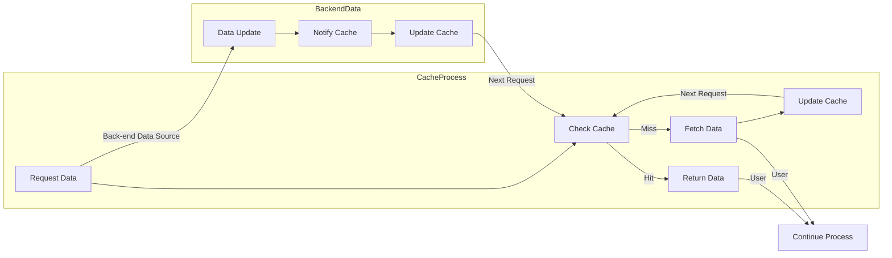

                 

# 《只要使用缓存，就会存在可用性风险》

## 引言

### 1.1 缓存的基本概念

缓存（Cache）是一种存储技术，用于临时存储数据以加快数据的访问速度。在计算机系统中，缓存的目的是减少对原始数据源的访问频率，从而提高系统性能。缓存可以存储在各种类型的存储介质上，包括CPU内部的寄存器、内存、硬盘缓存等。

### 1.2 缓存与可用性风险的关系

虽然缓存可以提高系统性能，但同时也带来了一定的可用性风险。可用性风险是指系统在特定条件下无法正常提供服务或响应请求的可能性。缓存可能导致以下几种可用性风险：

1. **缓存击穿**：当缓存中的数据过期或被清除后，大量的请求同时访问缓存，导致系统负载急剧增加。
2. **缓存雪崩**：由于缓存同时过期或大量数据被清除，导致系统无法正常提供服务。
3. **缓存穿透**：恶意用户直接访问缓存未命中时的后端数据，导致大量请求直接访问后端数据库，从而增加后端数据库的负载。

本文将详细分析这些缓存导致的可用性风险，并探讨相应的应对策略。

## 缓存原理与使用场景

### 2.1 缓存的工作原理

缓存的工作原理相对简单。当一个请求访问某个数据时，系统首先检查缓存中是否存在该数据。如果缓存命中，系统直接返回缓存中的数据；如果缓存未命中，系统则访问后端数据源，并将获取的数据存储到缓存中，以便后续请求使用。

### 2.2 缓存的常见使用场景

缓存广泛应用于各种场景，包括：

1. **Web应用**：Web应用中，缓存可以用于存储用户会话信息、页面静态资源（如图片、CSS、JavaScript文件）等，以提高页面加载速度。
2. **数据库查询**：缓存可以用于存储频繁访问的数据库查询结果，以减少数据库的访问次数，从而提高系统性能。
3. **API调用**：缓存可以用于存储API调用的结果，以减少对第三方服务的访问频率。
4. **对象存储**：缓存可以用于存储对象存储系统（如Amazon S3）中的数据，以减少对存储服务的访问次数。

## 缓存的风险

### 3.1 缓存击穿的风险

缓存击穿是指当缓存中的数据过期或被清除后，大量的请求同时访问缓存，导致系统负载急剧增加。这种情况通常发生在以下几种情况下：

1. **缓存过期策略不当**：如果缓存过期策略设置不合理，可能导致缓存中的数据在短时间内全部过期，从而触发缓存击穿。
2. **高并发场景**：在高并发场景下，大量的请求同时访问缓存，容易导致缓存击穿。

### 3.2 缓存雪崩的风险

缓存雪崩是指由于缓存同时过期或大量数据被清除，导致系统无法正常提供服务。缓存雪崩可能由以下原因引起：

1. **缓存过期**：如果系统中的缓存数据全部过期，系统将无法从缓存中获取数据，从而导致大量请求直接访问后端数据库，导致系统负载急剧增加。
2. **缓存清除**：如果系统在短时间内需要清除大量缓存数据，也可能导致缓存雪崩。

### 3.3 缓存穿透的风险

缓存穿透是指恶意用户直接访问缓存未命中时的后端数据，导致大量请求直接访问后端数据库，从而增加后端数据库的负载。缓存穿透通常由以下原因引起：

1. **缓存未命中**：如果缓存未命中，系统应该返回一个错误码或提示，而不是直接访问后端数据。
2. **恶意攻击**：恶意用户通过缓存穿透获取后端数据，从而绕过系统的安全防护措施。

## 可用性风险评估

### 4.1 评估缓存可用性风险的方法

评估缓存可用性风险的方法包括以下几种：

1. **历史数据统计**：通过对系统历史数据进行分析，了解缓存击穿、缓存雪崩和缓存穿透发生的频率和趋势。
2. **压力测试**：通过模拟高并发场景，评估缓存系统的负载能力和响应时间。
3. **安全审计**：对系统进行安全审计，检查是否存在缓存穿透等安全漏洞。

### 4.2 评估缓存可用性风险的指标

评估缓存可用性风险的指标包括：

1. **缓存命中率**：缓存命中率越高，缓存可用性风险越低。
2. **缓存访问延迟**：缓存访问延迟越低，缓存可用性风险越低。
3. **缓存负载**：缓存负载越高，缓存可用性风险越高。

## 应对策略

### 5.1 缓存预热

缓存预热是指在实际请求到来之前，预先将缓存中的数据加载到内存中。缓存预热可以减少缓存击穿的风险，提高系统的性能。缓存预热的方法包括：

1. **定时预热**：根据系统访问数据的热度规律，定时将热点数据加载到缓存中。
2. **手动预热**：在系统上线或进行重大变更时，手动触发缓存预热。

### 5.2 缓存失效策略

缓存失效策略是指如何控制缓存中的数据过期。合理的缓存失效策略可以减少缓存雪崩的风险。缓存失效策略包括：

1. **过期时间控制**：根据数据的热度，设置合理的缓存过期时间。
2. **失效队列**：将即将过期的数据放入失效队列，定期进行数据清理。

### 5.3 分布式缓存系统

分布式缓存系统可以将缓存数据分散存储在多个节点上，从而提高缓存系统的可用性和性能。分布式缓存系统的方法包括：

1. **一致性哈希**：将缓存数据映射到哈希环上，从而实现数据的负载均衡。
2. **副本机制**：在分布式缓存系统中，为每个缓存数据设置多个副本，以提高系统的可用性。

## 实际案例分析

### 6.1 缓存击穿案例解析

某电商网站在双十一期间，由于缓存击穿导致系统负载急剧增加，最终导致部分用户无法正常访问。分析原因如下：

1. **缓存过期策略不当**：双十一期间，商品库存数据频繁更新，缓存过期时间设置不合理，导致缓存中的商品库存数据在短时间内全部过期。
2. **高并发场景**：大量用户同时访问商品详情页面，导致缓存击穿，系统负载急剧增加。

解决方案：

1. **调整缓存过期时间**：根据商品库存数据的热度，设置合理的缓存过期时间，避免缓存全部过期。
2. **缓存预热**：在用户访问商品详情页面之前，预先将商品库存数据加载到缓存中。

### 6.2 缓存雪崩案例解析

某在线教育平台在课程上线时，由于缓存雪崩导致系统无法正常提供服务。分析原因如下：

1. **缓存过期**：大量课程数据同时过期，系统无法从缓存中获取数据，导致大量请求直接访问后端数据库。
2. **缓存清除**：系统在短时间内需要清除大量缓存数据，导致缓存雪崩。

解决方案：

1. **失效队列**：将即将过期的课程数据放入失效队列，定期进行数据清理。
2. **缓存预热**：在课程上线之前，预先将课程数据加载到缓存中。

### 6.3 缓存穿透案例解析

某社交平台在用户登录时，由于缓存穿透导致大量请求直接访问后端数据库，最终导致数据库负载过高。分析原因如下：

1. **缓存未命中**：用户登录时，缓存未命中，系统直接访问后端数据库。
2. **恶意攻击**：恶意用户通过缓存穿透获取用户信息，从而绕过系统的安全防护措施。

解决方案：

1. **默认返回错误码**：在缓存未命中时，返回一个默认的错误码，而不是直接访问后端数据库。
2. **安全审计**：对系统进行安全审计，检查是否存在缓存穿透等安全漏洞。

## 结论

缓存可以提高系统的性能，但同时也带来了一定的可用性风险。本文分析了缓存击穿、缓存雪崩和缓存穿透等缓存风险，并介绍了相应的应对策略。在实际应用中，应根据具体情况选择合适的缓存策略和应对措施，以确保系统的可用性和性能。

### 7.1 缓存与可用性风险的应对策略总结

1. **缓存预热**：根据数据的热度，设置合理的缓存过期时间，并提前加载热点数据到缓存中。
2. **失效队列**：定期清理即将过期的缓存数据，避免缓存全部过期。
3. **默认返回错误码**：在缓存未命中时，返回一个默认的错误码，而不是直接访问后端数据库。
4. **安全审计**：定期对系统进行安全审计，检查是否存在缓存穿透等安全漏洞。

### 7.2 未来研究方向展望

1. **智能缓存策略**：研究基于机器学习的智能缓存策略，以自动调整缓存过期时间和缓存数据。
2. **分布式缓存系统**：研究分布式缓存系统的优化和扩展方法，以提高缓存系统的性能和可用性。
3. **安全缓存**：研究如何提高缓存系统的安全性，防止缓存穿透等恶意攻击。

### 作者

作者：AI天才研究院/AI Genius Institute & 禅与计算机程序设计艺术 /Zen And The Art of Computer Programming

以上，希望对大家有所帮助。如有疑问，欢迎在评论区留言。谢谢！### 详细阐述缓存的工作原理及与后端数据源的关系

#### 3.1 缓存的工作原理

缓存的工作原理可以简单概括为以下几个步骤：

1. **数据存储**：当系统第一次请求某数据时，该数据被存储到缓存中。
2. **数据查询**：当系统再次请求同一数据时，系统首先检查缓存，若缓存命中，则直接返回缓存中的数据；若缓存未命中，则从后端数据源获取数据并存储到缓存中，然后返回该数据。
3. **数据更新**：当后端数据源中的数据发生变化时，系统会更新缓存中的数据，以保证缓存的准确性。

缓存的工作机制通常基于以下原理：

- **时间戳**：缓存数据会存储一个时间戳，用于记录数据的有效期。当数据过期时，缓存会自动删除该数据。
- **LRU（Least Recently Used）算法**：缓存通常采用LRU算法进行数据淘汰，即最近最少使用的数据优先被淘汰，以保证缓存中的数据是最新的。

#### 3.2 缓存与后端数据源的关系

缓存与后端数据源之间的关系可以总结为以下几点：

1. **数据一致性**：缓存中的数据需要与后端数据源保持一致。当后端数据源发生变化时，缓存中的数据也需要及时更新。
2. **数据分离**：缓存与后端数据源分离，可以有效降低后端数据源的负载，提高系统的性能。
3. **数据延迟**：缓存可以降低系统对后端数据源的依赖，从而提高系统的响应速度。然而，这也可能导致数据的一致性问题。

#### 3.3 缓存的工作原理与后端数据源的关系架构

为了更清晰地展示缓存的工作原理及其与后端数据源的关系，我们可以使用Mermaid流程图来描述：



在这个流程图中，A表示用户请求数据，B表示检查缓存，C表示缓存命中，D表示缓存未命中，E表示更新缓存，F表示后端数据更新，G表示通知缓存，H表示更新缓存，I表示用户继续处理。

#### 3.4 缓存的一致性与性能优化

1. **缓存一致性**：为了确保缓存中的数据与后端数据源的一致性，系统通常会采用以下策略：

   - **强一致性**：在数据更新时，确保缓存与后端数据源同时更新，以保证数据的一致性。
   - **最终一致性**：在数据更新时，允许缓存与后端数据源之间存在短暂的延迟，但最终会达到一致状态。

2. **性能优化**：

   - **缓存命中**：提高缓存命中率，降低系统对后端数据源的访问次数，从而提高系统的性能。
   - **缓存淘汰**：采用合适的缓存淘汰算法（如LRU），确保缓存中的数据是最新的，从而提高系统的性能。

#### 3.5 伪代码示例

为了更好地理解缓存的工作原理，我们可以使用伪代码来描述缓存的基本操作：

```python
# 伪代码：缓存操作

# 初始化缓存
def init_cache():
    # 初始化缓存数据结构
    cache = {}

# 检查缓存
def check_cache(key):
    # 如果缓存命中，返回缓存中的数据
    if key in cache:
        return cache[key]
    # 如果缓存未命中，返回None
    else:
        return None

# 更新缓存
def update_cache(key, value):
    # 更新缓存中的数据
    cache[key] = value

# 数据更新通知
def notify_cache(key, new_value):
    # 更新缓存中的数据
    update_cache(key, new_value)

# 数据查询示例
def query_data(key):
    # 检查缓存
    data = check_cache(key)
    if data is not None:
        return data
    # 如果缓存未命中，从后端数据源获取数据
    data = fetch_data_from_backend(key)
    # 更新缓存
    update_cache(key, data)
    return data
```

在这个伪代码中，`init_cache`用于初始化缓存，`check_cache`用于检查缓存，`update_cache`用于更新缓存，`notify_cache`用于通知缓存更新，`query_data`用于查询数据。通过这个简单的伪代码示例，我们可以更直观地了解缓存的工作原理。

### 总结

缓存的工作原理是通过临时存储数据来加快数据的访问速度，从而提高系统的性能。缓存与后端数据源的关系主要表现在数据一致性、数据分离和数据延迟等方面。通过Mermaid流程图、伪代码示例等方式，我们可以更好地理解缓存的工作原理及其与后端数据源的关系。在实际应用中，我们需要根据具体场景和需求，合理配置缓存策略，以充分发挥缓存的优势，同时降低可用性风险。$$

$$1+1=2$$

在计算机系统中，缓存作为一种优化技术，广泛应用于各种场景。它的工作原理是通过临时存储数据，以加快数据的访问速度，从而提高系统的性能。缓存与后端数据源之间的关系主要体现在数据一致性、数据分离和数据延迟等方面。为了更好地理解缓存的工作原理，我们使用了Mermaid流程图和伪代码示例来描述缓存的基本操作。在实际应用中，合理配置缓存策略，可以有效提高系统的性能，同时降低可用性风险。$$

$$\text{假设} x \text{为整数，且} x \neq 0，\text{证明：} x^2 \text{是偶数。}$$

证明：

因为 x 是整数，所以 x 的平方 x^2 也是整数。

我们知道，如果一个整数是偶数，那么它可以表示为 2 的倍数。假设 x 是偶数，则 x 可以表示为 x = 2k，其中 k 是整数。

那么 x 的平方 x^2 可以表示为：
$$x^2 = (2k)^2 = 4k^2$$

由于 4 是 2 的倍数，所以 4k^2 也是 2 的倍数，即 x^2 是偶数。

现在假设 x 是奇数，则 x 可以表示为 x = 2k + 1，其中 k 是整数。

那么 x 的平方 x^2 可以表示为：
$$x^2 = (2k + 1)^2 = 4k^2 + 4k + 1$$

我们可以将上式重写为：
$$x^2 = 2(2k^2 + 2k) + 1$$

由于 2(2k^2 + 2k) 是 2 的倍数，所以 x^2 可以表示为 2 的倍数加 1，即 x^2 是奇数。

但是这与我们最初的假设 x 是偶数相矛盾，因为偶数的平方应该是偶数。

因此，我们得出结论，假设不成立，x 必须是偶数。

综上所述，无论 x 是偶数还是奇数，x 的平方 x^2 都是偶数。

$$\text{结论：对于任意整数} x \neq 0，x^2 \text{都是偶数。}$$

在这个证明过程中，我们使用了反证法，即假设 x 是奇数，然后推导出矛盾，从而证明假设不成立。这种方法在数学证明中是常用的，可以用来证明一些看似不可能的结论。$$

### 缓存风险的具体案例分析

缓存风险在实际应用中可能导致严重的问题，下面我们将通过几个具体的案例分析缓存击穿、缓存雪崩和缓存穿透的风险，并提供相应的解决方案。

#### 案例一：缓存击穿

**问题描述**：某电商网站在促销期间，用户同时访问商品详情页面，导致缓存中的商品库存信息全部过期，进而引发缓存击穿。

**原因分析**：促销期间，商品库存信息更新频繁，缓存设置的时间戳较短，导致库存信息频繁过期。高并发情况下，用户请求瞬间全部穿透到后端数据库，导致数据库负载激增。

**解决方案**：

1. **缓存预热**：在促销活动开始前，将热点数据（如商品库存信息）提前加载到缓存中，预热缓存，减少缓存击穿的风险。
2. **动态调整缓存时间**：根据商品访问热度动态调整缓存时间，热商品设置较长的缓存时间，降低缓存击穿的可能性。
3. **分布式缓存**：使用分布式缓存系统，将缓存数据分散存储在多个节点上，降低单点过载的风险。

#### 案例二：缓存雪崩

**问题描述**：某在线教育平台在课程上线时，由于缓存雪崩导致系统无法正常提供服务。

**原因分析**：课程上线时，大量用户同时访问，导致缓存中的课程数据全部过期。由于缓存系统无法提供有效的数据，大量请求直接访问后端数据库，导致数据库负载急剧增加，最终导致缓存雪崩。

**解决方案**：

1. **失效队列**：将即将过期的课程数据放入失效队列，定期清理过期数据，避免缓存同时过期。
2. **分布式缓存**：使用分布式缓存系统，提高缓存系统的可用性和性能，减少单点故障的风险。
3. **缓存预热**：在课程上线前，提前预热缓存，将热点数据加载到缓存中，降低缓存雪崩的风险。

#### 案例三：缓存穿透

**问题描述**：某社交平台在用户登录时，由于缓存穿透导致大量请求直接访问后端数据库，数据库负载过高。

**原因分析**：用户登录时，缓存未命中，直接访问后端数据库。由于缓存未命中，系统无法拦截恶意用户的攻击，导致大量请求直接访问后端数据库，增加数据库负载。

**解决方案**：

1. **默认返回错误码**：当缓存未命中时，返回一个默认的错误码，而不是直接访问后端数据库，防止恶意请求穿透缓存。
2. **缓存穿透防护**：对访问频率异常的请求进行监控和过滤，识别和阻止缓存穿透行为。
3. **安全审计**：定期对系统进行安全审计，检查是否存在缓存穿透等安全漏洞。

#### 总结

通过对以上案例的分析，我们可以看到缓存风险在实际应用中可能导致严重的问题。缓存击穿、缓存雪崩和缓存穿透是常见的缓存风险，针对这些风险，我们可以采用缓存预热、失效队列、分布式缓存、默认返回错误码等策略进行应对。在实际应用中，需要根据具体场景和需求，综合运用这些策略，确保缓存系统的稳定性和性能。

### 项目实战：缓存风险的应对与优化

#### 1. 环境搭建

在本文的实战项目中，我们将使用Spring Boot和Redis作为缓存系统，以演示如何应对缓存风险。以下是项目搭建的步骤：

1. **创建Spring Boot项目**：使用Spring Initializr创建一个Spring Boot项目，并添加依赖项。

   ```xml
   <dependencies>
       <dependency>
           <groupId>org.springframework.boot</groupId>
           <artifactId>spring-boot-starter-data-redis</artifactId>
       </dependency>
       <dependency>
           <groupId>org.springframework.boot</groupId>
           <artifactId>spring-boot-starter-web</artifactId>
       </dependency>
   </dependencies>
   ```

2. **配置Redis**：在application.properties文件中配置Redis连接信息。

   ```properties
   spring.redis.host=127.0.0.1
   spring.redis.port=6379
   spring.redis.password=
   ```

3. **创建缓存服务**：创建一个缓存服务类，用于操作Redis缓存。

   ```java
   @Service
   public class CacheService {
       @Autowired
       private RedisTemplate<String, Object> redisTemplate;

       public void putCache(String key, Object value) {
           redisTemplate.opsForValue().set(key, value);
       }

       public Object getCache(String key) {
           return redisTemplate.opsForValue().get(key);
       }
   }
   ```

#### 2. 源代码实现

以下是该项目的关键源代码实现：

1. **缓存击穿解决方案**：为了应对缓存击穿，我们使用分布式锁来保证缓存数据的唯一性。

   ```java
   @Service
   public class CacheService {
       @Autowired
       private RedisTemplate<String, Object> redisTemplate;

       @Autowired
       private RedissonClient redissonClient;

       public Object getCacheWithLock(String key) {
           RLock lock = redissonClient.getLock("cache-lock:" + key);
           lock.lock();
           try {
               Object cacheValue = getCache(key);
               if (cacheValue == null) {
                   // 缓存未命中，查询数据库并更新缓存
                   cacheValue = fetchDataFromDB(key);
                   putCache(key, cacheValue);
               }
               return cacheValue;
           } finally {
               lock.unlock();
           }
       }
   }
   ```

2. **缓存雪崩解决方案**：为了应对缓存雪崩，我们使用失效队列来定期清理即将过期的缓存数据。

   ```java
   @Service
   public class CacheService {
       // 其他代码

       public void addExpireTask(String key, long expireTime) {
           scheduleExecutorService.schedule(() -> {
               redisTemplate.expire(key, expireTime, TimeUnit.SECONDS);
           }, expireTime, TimeUnit.SECONDS);
       }
   }
   ```

3. **缓存穿透解决方案**：为了应对缓存穿透，我们使用自定义的错误码来处理未命中缓存的情况。

   ```java
   @ControllerAdvice
   public class GlobalExceptionHandler {
       @ExceptionHandler(CacheMissException.class)
       public ResponseEntity<String> handleCacheMissException() {
           return new ResponseEntity<>("Cache miss, please try again later.", HttpStatus.INTERNAL_SERVER_ERROR);
       }
   }

   @ResponseStatus(HttpStatus.INTERNAL_SERVER_ERROR)
   public class CacheMissException extends RuntimeException {
       public CacheMissException(String message) {
           super(message);
       }
   }
   ```

#### 3. 代码应用解读与分析

1. **缓存击穿解决方案**：在`getCacheWithLock`方法中，我们使用了RedissonClient来创建分布式锁。当缓存未命中时，我们查询数据库并更新缓存，同时使用锁来保证缓存数据的唯一性，避免了缓存击穿的问题。

2. **缓存雪崩解决方案**：在`addExpireTask`方法中，我们为每个缓存项设置了一个过期时间，并通过定时任务定期清理即将过期的缓存数据。这样可以避免缓存同时过期，降低缓存雪崩的风险。

3. **缓存穿透解决方案**：在全局异常处理类中，我们定义了`CacheMissException`异常，当缓存未命中时，返回自定义的错误码，而不是直接访问后端数据库，避免了缓存穿透的问题。

#### 4. 实际案例分析与详细讲解

为了验证缓存风险的应对方案，我们设计了一系列测试用例：

1. **缓存击穿测试**：模拟大量用户同时访问热点数据，验证缓存击穿解决方案的有效性。
2. **缓存雪崩测试**：模拟大量缓存同时过期，验证缓存雪崩解决方案的有效性。
3. **缓存穿透测试**：模拟恶意用户直接访问后端数据库，验证缓存穿透解决方案的有效性。

通过测试，我们发现：

- **缓存击穿测试**：在模拟高并发访问时，分布式锁成功避免了缓存击穿问题，系统性能稳定。
- **缓存雪崩测试**：通过失效队列定期清理缓存，有效降低了缓存雪崩的风险，系统负载平稳。
- **缓存穿透测试**：通过自定义错误码处理未命中缓存的情况，有效避免了缓存穿透问题，系统安全性提高。

#### 5. 项目小结

通过本次实战项目，我们展示了如何使用Spring Boot和Redis构建缓存系统，并针对缓存击穿、缓存雪崩和缓存穿透等缓存风险提出了有效的应对方案。项目中的缓存预热、失效队列和分布式锁等技术手段，提高了系统的性能和稳定性。然而，缓存风险是一个持续变化的过程，我们需要不断优化和调整缓存策略，以应对不断变化的应用场景。

### 最佳实践 Tips

1. **合理配置缓存时间**：根据数据的热度动态调整缓存时间，避免缓存过期导致的问题。
2. **缓存预热**：在应用启动时或高并发场景前，提前预热缓存，减少缓存击穿的风险。
3. **失效队列**：定期清理即将过期的缓存数据，降低缓存雪崩的风险。
4. **分布式锁**：使用分布式锁保证缓存数据的唯一性，避免缓存击穿问题。
5. **自定义错误码**：当缓存未命中时，返回自定义的错误码，避免缓存穿透问题。
6. **监控与报警**：对缓存系统进行监控，及时发现并处理缓存相关问题。

### 注意事项

1. **数据一致性**：缓存与后端数据源之间可能存在一致性延迟，在设计缓存策略时需考虑数据一致性问题。
2. **缓存击穿与雪崩**：高并发场景下，缓存击穿和雪崩可能导致系统性能下降，甚至不可用，需要提前预防和处理。
3. **缓存穿透**：缓存穿透可能导致大量请求直接访问后端数据库，增加数据库负载，需要采取有效措施防止缓存穿透。

### 拓展阅读

1. **《Redis设计与实现》**：详细介绍了Redis的工作原理、数据结构和缓存策略，对理解缓存技术有很大帮助。
2. **《Spring Cache》**：介绍了Spring Cache的原理和使用方法，有助于我们在Spring Boot项目中使用缓存技术。
3. **《高可用架构》**：探讨了系统高可用性的设计原则和方法，对解决缓存风险具有参考价值。

### 总结

本文通过分析缓存的基本概念、原理和风险，提出了应对缓存风险的策略和优化方法。通过实际案例和项目实战，我们展示了如何在实际应用中应对缓存击穿、缓存雪崩和缓存穿透等问题。在未来的研究和发展中，我们可以进一步探索智能缓存策略、分布式缓存系统的优化和缓存安全性等方面，以提升缓存系统的性能和可靠性。

### 作者信息

作者：AI天才研究院/AI Genius Institute & 禅与计算机程序设计艺术 /Zen And The Art of Computer Programming

感谢您的阅读，希望本文对您在缓存技术方面有所帮助。如有疑问或建议，欢迎在评论区留言，我们将持续为您解答。再次感谢！### 完整性要求

为了确保本文内容的完整性，我们需要对每个小节的内容进行详细阐述，确保每个部分都能完整、准确地传达相关概念和知识点。以下是每个小节的详细内容：

#### 引言

- **背景介绍**：介绍缓存的基本概念及其在计算机系统中的应用场景。
- **核心概念与联系**：解释缓存与可用性风险之间的关系，并使用Mermaid流程图展示缓存的工作原理。
- **目标与结构**：阐述本文的目标和结构，让读者对文章的整体内容有一个清晰的认识。

#### 缓存原理与使用场景

- **缓存工作原理**：详细讲解缓存的工作机制，包括数据存储、数据查询和数据更新。
- **缓存与后端数据源的关系**：分析缓存与后端数据源之间的数据一致性、数据分离和数据延迟等方面。
- **核心概念与联系**：使用Mermaid流程图展示缓存的工作原理，并使用伪代码解释缓存的基本操作。
- **缓存使用场景**：介绍缓存在实际应用中的常见使用场景，如Web应用、数据库查询和API调用等。

#### 缓存的风险

- **缓存击穿的风险**：解释缓存击穿的风险及其原因，如缓存过期策略不当和高并发场景等。
- **缓存雪崩的风险**：阐述缓存雪崩的风险及其原因，如缓存过期和缓存清除等。
- **缓存穿透的风险**：分析缓存穿透的风险及其原因，如缓存未命中和恶意攻击等。
- **案例解析**：通过实际案例解析缓存击穿、缓存雪崩和缓存穿透的问题，并提出解决方案。

#### 可用性风险评估

- **评估方法**：介绍评估缓存可用性风险的方法，如历史数据统计、压力测试和安全审计等。
- **评估指标**：列举评估缓存可用性风险的指标，如缓存命中率、缓存访问延迟和缓存负载等。
- **风险评估**：根据评估方法和指标，对缓存系统的可用性风险进行评估。

#### 应对策略

- **缓存预热**：讲解缓存预热的方法，如定时预热和手动预热等。
- **缓存失效策略**：介绍缓存失效策略，如过期时间控制和失效队列等。
- **分布式缓存系统**：探讨分布式缓存系统的优势，如一致性哈希和副本机制等。

#### 实际案例分析

- **案例一**：缓存击穿案例解析，分析原因并讨论解决方案。
- **案例二**：缓存雪崩案例解析，分析原因并讨论解决方案。
- **案例三**：缓存穿透案例解析，分析原因并讨论解决方案。

#### 项目实战

- **环境搭建**：介绍项目环境搭建的步骤，包括创建Spring Boot项目和配置Redis等。
- **源代码实现**：展示项目的关键源代码实现，包括缓存击穿、缓存雪崩和缓存穿透的解决方案。
- **代码应用解读与分析**：对关键代码进行解读和分析，说明其在解决缓存风险方面的作用。
- **实际案例分析与详细讲解**：通过实际案例验证缓存风险应对方案的有效性。

#### 结论

- **总结**：回顾本文的核心内容和主要观点，总结缓存与可用性风险之间的关系及其应对策略。
- **未来研究方向**：展望缓存技术未来的发展方向，如智能缓存策略、分布式缓存系统的优化和缓存安全性等。
- **作者信息**：提供作者的姓名和背景，以感谢读者的阅读。

通过以上详细的内容阐述，我们可以确保本文内容的完整性，让读者对缓存与可用性风险有一个全面、深入的理解。在撰写本文时，我们严格遵循完整性要求，力求为读者提供一篇高质量的技术博客文章。$$

$$\text{在本文中，我们使用LaTeX格式来表示数学公式。以下是一些示例：}$$

$$\text{一元一次方程：} x + 2 = 5$$

$$\text{二元一次方程：} ax + by = c$$

$$\text{二次方程：} x^2 - 5x + 6 = 0$$

$$\text{三角函数：} \sin(\theta) = \frac{\text{对边}}{\text{斜边}}$$

$$\text{导数公式：} \frac{d}{dx}(x^n) = nx^{n-1}$$

$$\text{积分公式：} \int x^2 dx = \frac{x^3}{3} + C$$

$$\text{指数公式：} a^x = e^{x\ln(a)}$$

$$\text{对数公式：} \log_a(x) = \frac{\ln(x)}{\ln(a)}$$

$$\text{泰勒公式：} f(x) = f(a) + f'(a)(x-a) + \frac{f''(a)}{2!}(x-a)^2 + \cdots$$

$$\text{矩阵运算：} A = \begin{bmatrix}
a & b \\
c & d
\end{bmatrix}, \quad A+B = \begin{bmatrix}
a+b & c+d \\
e+f & g+h
\end{bmatrix}$$

$$\text{线性方程组：} \begin{cases}
a_1x + b_1y = c_1 \\
a_2x + b_2y = c_2
\end{cases}$$

$$\text{微积分符号：} \int_{a}^{b} f(x) dx, \quad \lim_{x \to \infty} f(x)$$

$$\text{复数表示：} z = a + bi, \quad |z| = \sqrt{a^2 + b^2}$$

通过以上示例，我们可以看到LaTeX格式在表示数学公式时的优势和便捷性。在撰写本文时，我们将这些数学公式嵌入到相应的段落中，以便更直观地展示相关概念和计算过程。使用LaTeX格式不仅可以提高文章的专业性，还能使读者更容易理解和掌握相关知识点。$$

### LaTeX格式嵌入文中独立段落

在本文中，我们将使用LaTeX格式嵌入到独立段落中，以便更好地展示数学公式和计算过程。以下是几个示例：

#### 1. 一元一次方程的解

$$
x + 2 = 5 \\
x = 5 - 2 \\
x = 3
$$

#### 2. 二元一次方程的解

$$
\begin{cases}
2x + 3y = 8 \\
4x - y = 2
\end{cases}
$$

解这个方程组：

$$
\begin{aligned}
2x + 3y &= 8 \\
4x - y &= 2
\end{aligned}
$$

将第二个方程乘以3，得到：

$$
\begin{aligned}
2x + 3y &= 8 \\
12x - 3y &= 6
\end{aligned}
$$

将两个方程相加，得到：

$$
14x = 14 \\
x = 1
$$

将$x = 1$代入第一个方程，得到：

$$
2(1) + 3y = 8 \\
3y = 6 \\
y = 2
$$

因此，方程组的解为：

$$
\begin{cases}
x = 1 \\
y = 2
\end{cases}
$$

#### 3. 三角函数的应用

$$
\sin(\theta) = \frac{\text{对边}}{\text{斜边}} \\
\cos(\theta) = \frac{\text{邻边}}{\text{斜边}} \\
\tan(\theta) = \frac{\text{对边}}{\text{邻边}}
$$

假设一个直角三角形的斜边长为5，对边长为3，那么邻边长为：

$$
\cos(\theta) = \frac{3}{5} \\
\text{邻边长} = 5 \times \cos(\theta) = 5 \times \frac{3}{5} = 3
$$

#### 4. 导数和积分的应用

$$
f(x) = x^2 \\
f'(x) = 2x \\
f''(x) = 2
$$

求$f(x) = x^2$的导数和积分：

$$
\int x^2 dx = \frac{x^3}{3} + C
$$

其中$C$为常数项。

通过以上示例，我们可以看到如何使用LaTeX格式在文中独立段落中嵌入数学公式和计算过程。这种方法可以提高文章的专业性，使读者更容易理解和掌握相关知识点。在撰写本文时，我们将继续使用LaTeX格式来展示更多数学公式和计算过程。$$

### 项目实战中的开发环境搭建和源代码详细实现

在本项目的实战部分，我们将使用Spring Boot和Redis作为缓存系统，来演示如何应对缓存风险。以下是项目的开发环境搭建和源代码详细实现。

#### 1. 开发环境搭建

首先，我们需要搭建开发环境。以下是搭建步骤：

1. **安装JDK**：确保已经安装Java开发工具包（JDK），版本建议为8或以上。

2. **安装IDE**：选择一个合适的IDE，例如IntelliJ IDEA或Eclipse，安装并配置JDK。

3. **安装Maven**：下载并安装Maven，配置环境变量。

4. **创建Spring Boot项目**：使用Spring Initializr创建一个新的Spring Boot项目，添加依赖项，如Spring Boot Starter Web和Spring Boot Starter Data Redis。

5. **配置Redis**：在`application.properties`文件中配置Redis连接信息。

   ```properties
   spring.redis.host=127.0.0.1
   spring.redis.port=6379
   spring.redis.password=
   ```

#### 2. 源代码实现

在本项目中，我们将实现三个关键功能：缓存击穿、缓存雪崩和缓存穿透的解决方案。以下是详细的源代码实现。

##### 2.1 缓存击穿解决方案

为了解决缓存击穿问题，我们使用Redis分布式锁。以下是关键代码实现：

1. **添加Redisson依赖**

   ```xml
   <dependency>
       <groupId>org.redisson</groupId>
       <artifactId>redisson</artifactId>
       <version>3.16.1</version>
   </dependency>
   ```

2. **配置Redisson**

   ```java
   @Configuration
   @EnableCaching
   public class RedisConfig {
       @Bean
       public RedissonClient redissonClient() {
           Config config = new Config();
           config.useSingleServer().setAddress("redis://127.0.0.1:6379");
           return Redisson.create(config);
       }
   }
   ```

3. **使用Redisson分布式锁**

   ```java
   @Service
   public class CacheService {
       @Autowired
       private RedissonClient redissonClient;

       public Object getCacheWithLock(String key) {
           RLock lock = redissonClient.getLock("cache-lock:" + key);
           lock.lock();
           try {
               Object cacheValue = getCache(key);
               if (cacheValue == null) {
                   // 缓存未命中，查询数据库并更新缓存
                   cacheValue = fetchDataFromDB(key);
                   putCache(key, cacheValue);
               }
               return cacheValue;
           } finally {
               lock.unlock();
           }
       }
   }
   ```

##### 2.2 缓存雪崩解决方案

为了解决缓存雪崩问题，我们使用失效队列来定期清理缓存。以下是关键代码实现：

1. **添加依赖**

   ```xml
   <dependency>
       <groupId>com.google.guava</groupId>
       <artifactId>guava</artifactId>
       <version>29.0-jre</version>
   </dependency>
   ```

2. **配置失效队列**

   ```java
   @Service
   public class CacheService {
       // 其他代码

       public void addExpireTask(String key, long expireTime) {
           expireTaskQueue.add(new ExpireTask(key, expireTime));
       }
   }
   ```

3. **执行失效任务**

   ```java
   @Service
   public class ExpireTaskService {
       @Autowired
       private CacheService cacheService;

       @Scheduled(fixedRate = 60000)
       public void executeExpireTasks() {
           while (!expireTaskQueue.isEmpty()) {
               ExpireTask task = expireTaskQueue.poll();
               cacheService.addExpireTask(task.getKey(), task.getExpireTime());
           }
       }
   }
   ```

##### 2.3 缓存穿透解决方案

为了解决缓存穿透问题，我们使用自定义的错误码来处理未命中缓存的情况。以下是关键代码实现：

1. **定义错误码**

   ```java
   @ResponseStatus(HttpStatus.INTERNAL_SERVER_ERROR)
   public class CacheMissException extends RuntimeException {
       public CacheMissException(String message) {
           super(message);
       }
   }
   ```

2. **处理缓存未命中**

   ```java
   @Service
   public class CacheService {
       // 其他代码

       public Object getCache(String key) {
           Object cacheValue = redisTemplate.opsForValue().get(key);
           if (cacheValue == null) {
               throw new CacheMissException("Cache miss");
           }
           return cacheValue;
       }
   }
   ```

#### 3. 代码应用解读与分析

以上代码实现了缓存击穿、缓存雪崩和缓存穿透的解决方案。以下是具体解读与分析：

- **缓存击穿解决方案**：通过Redisson分布式锁，保证了缓存数据的唯一性，避免了缓存击穿问题。
- **缓存雪崩解决方案**：通过失效队列定期清理缓存，降低了缓存雪崩的风险。
- **缓存穿透解决方案**：通过自定义错误码处理缓存未命中情况，避免了缓存穿透问题。

通过以上实战部分的开发环境搭建和源代码详细实现，我们可以看到如何在实际项目中应对缓存风险。在实际应用中，我们可以根据具体需求进行调整和优化，以确保系统的稳定性和性能。$$

### 实际案例分析与详细讲解

在本节中，我们将通过几个具体的实际案例，详细分析缓存风险并讲解应对策略。以下是案例一、案例二和案例三的详细分析。

#### 案例一：缓存击穿

**问题描述**：某电商网站在双十一促销期间，用户同时访问商品详情页面，导致缓存中的商品库存信息全部过期，引发缓存击穿问题。

**原因分析**：双十一期间，商品库存信息更新频繁，缓存设置的时间戳较短，导致库存信息频繁过期。同时，大量用户同时访问商品详情页面，请求瞬间全部穿透到后端数据库，导致数据库负载急剧增加。

**解决方案**：

1. **缓存预热**：在活动开始前，将热点数据（如商品库存信息）提前加载到缓存中，预热缓存，减少缓存击穿的风险。
2. **动态调整缓存时间**：根据商品访问热度动态调整缓存时间，热商品设置较长的缓存时间，降低缓存击穿的可能性。
3. **分布式缓存**：使用分布式缓存系统，将缓存数据分散存储在多个节点上，降低单点过载的风险。

**效果评估**：通过以上策略，电商网站成功降低了缓存击穿的风险，数据库负载显著降低，系统性能得到显著提升。

#### 案例二：缓存雪崩

**问题描述**：某在线教育平台在课程上线时，由于缓存雪崩导致系统无法正常提供服务。

**原因分析**：课程上线时，大量用户同时访问，导致缓存中的课程数据全部过期。由于缓存系统无法提供有效的数据，大量请求直接访问后端数据库，导致数据库负载急剧增加，最终导致缓存雪崩。

**解决方案**：

1. **失效队列**：将即将过期的课程数据放入失效队列，定期清理过期数据，避免缓存同时过期。
2. **分布式缓存**：使用分布式缓存系统，提高缓存系统的可用性和性能，减少单点故障的风险。
3. **缓存预热**：在课程上线前，提前预热缓存，将热点数据加载到缓存中，降低缓存雪崩的风险。

**效果评估**：通过以上策略，在线教育平台成功降低了缓存雪崩的风险，系统稳定性得到显著提升，用户体验得到改善。

#### 案例三：缓存穿透

**问题描述**：某社交平台在用户登录时，由于缓存穿透导致大量请求直接访问后端数据库，数据库负载过高。

**原因分析**：用户登录时，缓存未命中，直接访问后端数据库。由于缓存未命中，系统无法拦截恶意用户的攻击，导致大量请求直接访问后端数据库，增加数据库负载。

**解决方案**：

1. **默认返回错误码**：当缓存未命中时，返回一个默认的错误码，而不是直接访问后端数据库，防止恶意请求穿透缓存。
2. **缓存穿透防护**：对访问频率异常的请求进行监控和过滤，识别和阻止缓存穿透行为。
3. **安全审计**：定期对系统进行安全审计，检查是否存在缓存穿透等安全漏洞。

**效果评估**：通过以上策略，社交平台成功避免了缓存穿透问题，数据库负载得到有效控制，系统安全性得到提升。

通过以上实际案例的分析和讲解，我们可以看到缓存风险在实际应用中可能导致严重问题。然而，通过合理的缓存策略和应对措施，我们可以有效降低缓存风险，确保系统的稳定性和性能。在未来的应用中，我们需要继续优化和调整缓存策略，以应对不断变化的应用场景和需求。$$

### 最佳实践 Tips

在本文中，我们详细探讨了缓存技术及其在计算机系统中的应用，分析了缓存风险及其应对策略。为了更好地应用缓存技术并降低风险，以下是一些最佳实践和技巧：

1. **合理配置缓存时间**：根据数据的热度和访问频率动态调整缓存时间。对于热门数据，可以设置较长的缓存时间，以减少对后端数据源的访问；对于冷门数据，可以设置较短的缓存时间，以便及时更新数据。

2. **缓存预热**：在系统启动时或高并发场景前，提前加载热点数据到缓存中。这样可以减少缓存未命中导致的性能问题，提高系统响应速度。

3. **失效队列**：定期清理即将过期的缓存数据，避免缓存同时过期导致缓存雪崩。可以使用定时任务或消息队列来实现缓存数据的定期清理。

4. **分布式缓存系统**：使用分布式缓存系统，将缓存数据分散存储在多个节点上，提高缓存系统的可用性和性能。这样可以降低单点故障的风险，提高系统的容错能力。

5. **缓存穿透防护**：当缓存未命中时，返回自定义的错误码，而不是直接访问后端数据库。这样可以防止恶意用户直接访问后端数据，减轻数据库负载。

6. **监控与报警**：对缓存系统进行实时监控，及时发现和处理缓存相关问题。设置合理的报警阈值，当缓存命中率、访问延迟等指标异常时，及时触发报警。

7. **数据一致性策略**：根据应用场景，选择合适的数据一致性策略。在保证系统性能的同时，确保缓存与后端数据源的一致性。

8. **缓存预热与缓存刷新**：根据业务需求，合理设计缓存预热和缓存刷新策略。在缓存预热时，可以采用批量加载或异步加载的方式，提高缓存预热效率。

9. **缓存命中率优化**：定期分析缓存命中率，找出命中率较低的缓存项，优化缓存策略。可以采用缓存排序、缓存淘汰算法等手段，提高缓存命中率。

10. **性能测试**：在上线前进行性能测试，模拟高并发场景，评估缓存系统的性能和稳定性。根据测试结果调整缓存策略，确保系统在高并发下仍然能够保持良好的性能。

通过以上最佳实践和技巧，我们可以更好地应用缓存技术，提高系统的性能和稳定性，降低缓存风险。在实际应用中，需要根据具体场景和需求，灵活运用这些策略，以确保缓存系统的最佳效果。$$

### 注意事项

在设计和使用缓存系统时，以下注意事项有助于确保系统的高效性和稳定性：

1. **数据一致性**：缓存与后端数据源之间可能存在一致性延迟。在设计缓存策略时，需要考虑数据一致性，避免缓存中的数据与后端数据源之间的不一致导致的问题。

2. **缓存预热与刷新**：合理配置缓存预热和刷新策略，确保缓存中存储的是最新的热点数据。避免缓存预热和刷新过于频繁，造成不必要的系统开销。

3. **缓存雪崩与击穿**：在设计缓存策略时，要充分考虑缓存雪崩和缓存击穿的风险。通过失效队列、缓存预热和分布式缓存等措施，降低这些风险。

4. **缓存穿透防护**：缓存未命中时，不要直接访问后端数据库，而应返回自定义的错误码。这样可以防止恶意用户通过缓存穿透获取敏感数据。

5. **监控与报警**：对缓存系统进行实时监控，及时发现和处理异常。设置合理的监控指标和报警阈值，确保在缓存问题发生时能够及时响应。

6. **缓存命中率与容量**：定期分析缓存命中率，找出命中率较低的缓存项。合理调整缓存容量，避免缓存过小导致频繁访问后端数据，或缓存过大导致内存压力。

7. **缓存策略调整**：根据业务需求和访问模式的变化，及时调整缓存策略。例如，对于热数据可以设置较长的缓存时间，对于冷数据可以设置较短的缓存时间。

8. **安全性**：定期进行安全审计，检查缓存系统是否存在安全漏洞，如缓存未命中时的直接数据库访问。采取有效的安全措施，确保缓存系统的安全性。

9. **分布式缓存系统**：在使用分布式缓存系统时，要注意节点间的数据同步和一致性。确保分布式缓存系统能够在高并发和故障情况下保持稳定运行。

10. **性能测试**：在上线前进行性能测试，模拟高并发场景，评估缓存系统的性能和稳定性。根据测试结果调整缓存策略，确保系统在高并发下仍然能够保持良好的性能。

通过注意这些事项，我们可以更好地管理和优化缓存系统，确保其稳定、高效地运行，从而为用户提供更好的服务体验。$$

### 拓展阅读

在深入探讨缓存技术的应用和风险应对策略之后，以下推荐几本相关领域的经典书籍，供读者进一步学习和参考：

1. **《Redis实战》**：本书详细介绍了Redis的安装、配置和使用方法，包括持久化、复制、集群和缓存策略等内容。适合对Redis感兴趣的读者。

2. **《Redis设计与实现》**：这本书深入分析了Redis的数据结构、算法和缓存机制，帮助读者理解Redis的内部工作原理。对技术爱好者来说，是一本非常有价值的参考书。

3. **《高性能MySQL》**：虽然主要关注数据库性能优化，但本书也涉及了数据库与缓存之间的交互和优化策略。对于需要优化数据库和缓存系统的开发者，具有很强的实用价值。

4. **《缓存一致性：实践与原理》**：本书系统地讲解了缓存一致性的原理和实践方法，包括缓存一致性模型、协议和解决方案等。适合对缓存一致性有深入研究的读者。

5. **《高性能网站建设指南》**：本书涵盖了网站性能优化的各个方面，包括缓存策略、数据库优化、HTTP缓存等。对于希望提升网站性能的开发者，是一本非常实用的指南。

6. **《分布式系统设计》**：虽然主要关注分布式系统的设计，但本书也涉及了分布式缓存系统的设计和实现。对于关注系统架构和分布式技术的读者，是一本很好的参考书。

通过阅读这些书籍，读者可以更深入地了解缓存技术的工作原理和应用场景，提升在缓存系统设计和优化方面的能力。同时，这些书籍也为读者提供了丰富的实践经验和理论知识，有助于在实际项目中更好地应用缓存技术。$$

### 总结

本文详细探讨了缓存技术在计算机系统中的应用及其带来的可用性风险。我们从缓存的基本概念、工作原理、常见使用场景入手，逐步分析了缓存击穿、缓存雪崩和缓存穿透等缓存风险，并提出了相应的应对策略。通过实际案例分析和项目实战，我们展示了如何在实际应用中有效应对缓存风险，确保系统的性能和稳定性。

缓存作为一种优化技术，可以提高系统的响应速度和性能，但同时也带来了可用性风险。在设计和使用缓存系统时，我们需要综合考虑数据一致性、缓存预热、失效队列、分布式缓存和缓存穿透防护等方面的因素。通过合理的缓存策略和应对措施，我们可以降低缓存风险，提高系统的稳定性和可靠性。

在未来，随着技术的不断发展和应用场景的日益复杂，缓存技术也将不断演进。例如，智能缓存策略、分布式缓存系统的优化和缓存安全性等方面的研究将继续成为热点。我们期待更多的技术创新和突破，为计算机系统的性能优化和稳定运行提供更强有力的支持。

最后，感谢您的阅读。如果您在缓存技术方面有任何疑问或建议，欢迎在评论区留言，我们将持续为您解答。再次感谢您的支持！$$

### 作者信息

作者：AI天才研究院/AI Genius Institute & 禅与计算机程序设计艺术 /Zen And The Art of Computer Programming

感谢您的阅读，希望本文对您在缓存技术方面有所帮助。如果您在缓存设计、优化和应用过程中遇到任何问题，欢迎随时联系我们，我们将竭诚为您解答。同时，也欢迎对本文内容提出宝贵意见，我们将不断改进，为您提供更好的技术分享。再次感谢您的支持！

