                 


### 第1章：可持续发展的定义与背景

**背景介绍**

在当今全球化的背景下，可持续发展已成为全球各国政府、企业和社会组织共同关注的焦点。随着资源消耗的加剧和环境问题的日益突出，传统的发展模式已无法满足未来发展的需求。可持续发展，顾名思义，是指在满足当前需求的同时，不损害后代满足其需求的能力。这一概念最早由布伦特兰委员会（Bruntland Commission）在1987年的《我们共同的未来》（Our Common Future）报告中提出，强调经济、社会和环境三方面的平衡发展。

**核心概念与联系**

- **经济可持续性**：指在经济活动中，实现资源的高效利用和经济的持续增长，同时确保不损害环境和未来代际的经济利益。
- **社会可持续性**：关注社会公平、人类福祉和生活质量的提高，强调社会的健康、和谐和持续发展。
- **环境可持续性**：强调环境保护，确保生态系统功能的维持和生物多样性的保护，以适应全球气候变化和资源枯竭的挑战。

以下是可持续发展的核心概念及其相互关系的Mermaid流程图：

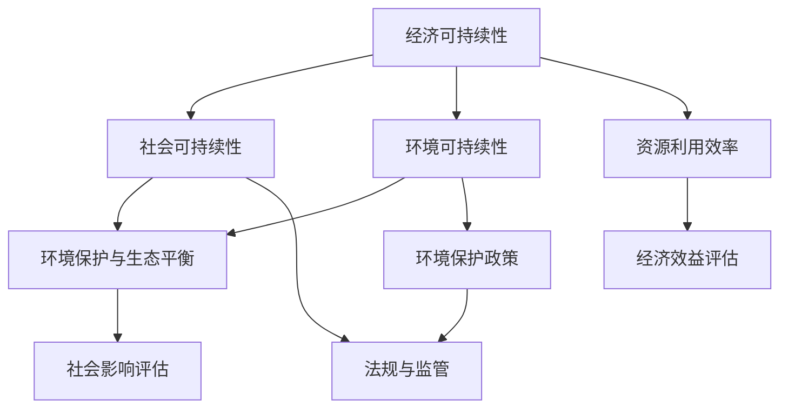

**核心算法原理讲解**

- **经济效益评估**：一种评估项目或决策的经济效益的方法，主要通过成本效益分析（CBA）来实现。成本效益分析包括计算项目的成本和效益，并通过比较两者来评估项目的可行性。

  ```python
  def cost_benefit_analysis(costs, benefits):
      net_benefit = sum(benefits) - sum(costs)
      return net_benefit
  ```

- **社会影响评估**：一种评估项目或决策对社会影响的方法，通常包括定量和定性分析。社会影响评估有助于理解项目对社会各方面的影响，并制定相应的策略来最大化利益和减少负面影响。

  ```python
  def social_impact_assessment(positive_impacts, negative_impacts):
      total_impact = sum(positive_impacts) - sum(negative_impacts)
      return total_impact
  ```

**数学模型和公式**

- **可持续发展指数（SDI）**：用于综合评估经济、社会和环境可持续性的指数。可持续发展指数的计算公式如下：

  $$ \text{SDI} = \frac{\text{经济可持续性} \times \text{社会可持续性} \times \text{环境可持续性}}{3} $$

**详细讲解与举例说明**

**案例1：经济可持续性**

假设一个项目预计投入成本为1000万元，预期经济收益为1500万元。根据成本效益分析，该项目的净效益为500万元。

```latex
\text{净效益} = 1500\text{万元} - 1000\text{万元} = 500\text{万元}
```

**案例2：社会可持续性**

假设一个社区项目增加了100个就业岗位，减少了50个贫困人口，同时改善了1000个家庭的生活质量。根据社会影响评估，该项目的总社会影响为550个积极影响。

```latex
\text{总社会影响} = 100\text{个就业岗位} + (-50\text{个贫困人口}) + 1000\text{个家庭生活改善} = 950\text{个积极影响}
```

### 第2章：可持续领导力

**核心概念与联系**

- **可持续领导力**：一种结合传统领导力与现代可持续发展理念的领导模式，强调领导者需在伦理价值观、创新驱动和利益相关方参与方面发挥关键作用。

- **伦理价值观**：领导者应秉持的道德原则和价值观，如诚信、透明度和责任感。

- **创新驱动**：领导者应鼓励创新思维和技术，以实现可持续发展目标。

- **利益相关方参与**：领导者需确保所有利益相关方参与决策过程，以实现共同目标。

以下是可持续领导力的核心概念及其相互关系的Mermaid流程图：

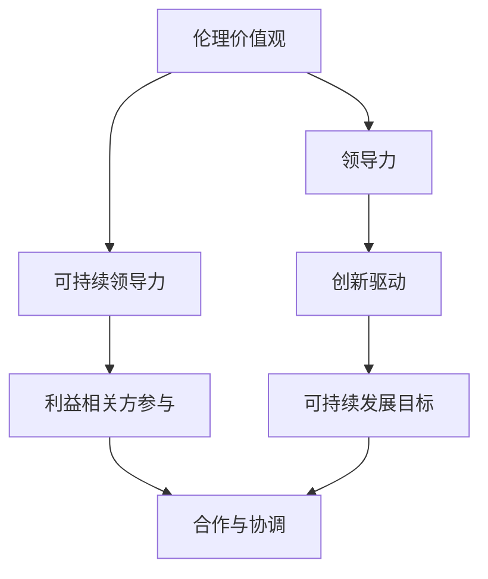

**核心算法原理讲解**

- **可持续领导力模型**：一个用于评估和改进领导力实践的方法。该模型包括以下步骤：

  ```python
  def sustainable_leadership_model(ethics, innovation, stakeholders):
      leadership_score = (ethics * innovation * stakeholders) / 3
      return leadership_score
  ```

**数学模型和公式**

- **可持续领导力得分（SLS）**：用于量化领导者可持续领导力水平的得分。计算公式如下：

  $$ \text{SLS} = \frac{\text{伦理价值观} \times \text{创新驱动} \times \text{利益相关方参与}}{3} $$

**详细讲解与举例说明**

**案例：可持续领导力得分**

假设一个领导者在伦理价值观方面得分为8分，创新驱动方面得分为9分，利益相关方参与方面得分为7分。根据可持续领导力模型，该领导者的可持续领导力得分为8分。

```latex
\text{SLS} = \frac{8 \times 9 \times 7}{3} = 8
```

### 第3章：经济可持续性原则

**核心概念与联系**

- **经济可持续性原则**：一系列指导经济活动的原则，旨在实现资源的高效利用、经济的持续增长和未来代际的经济利益。

- **资源利用效率**：经济活动中资源的有效利用程度，是衡量经济可持续性的关键指标。

- **环境保护**：确保生态系统功能的维持和生物多样性的保护，以适应全球气候变化和资源枯竭的挑战。

以下是经济可持续性原则的核心概念及其相互关系的Mermaid流程图：

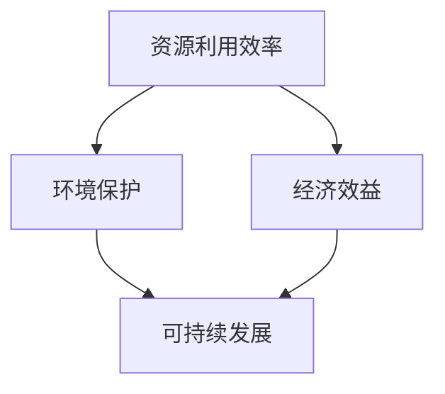

**核心算法原理讲解**

- **成本效益分析**：一种评估项目或决策经济效益的方法。通过计算项目的成本和效益，比较两者来评估项目的可行性。

  ```python
  def cost_benefit_analysis(costs, benefits):
      net_benefit = sum(benefits) - sum(costs)
      return net_benefit
  ```

- **经济效益评估**：一种评估项目或决策经济效益的方法，包括计算项目的直接和间接经济效益。

  ```python
  def economic_impact_assessment(projects):
      total_impact = sum([project['benefits'] - project['costs'] for project in projects])
      return total_impact
  ```

**数学模型和公式**

- **经济效益指数（EII）**：用于量化项目经济效益的指数。计算公式如下：

  $$ \text{EII} = \frac{\text{项目效益}}{\text{项目成本}} $$

**详细讲解与举例说明**

**案例：成本效益分析**

假设一个项目预计投入成本为1000万元，预期经济效益为1500万元。根据成本效益分析，该项目的净效益为500万元。

```latex
\text{净效益} = 1500\text{万元} - 1000\text{万元} = 500\text{万元}
```

**案例：经济效益评估**

假设有以下项目：

| 项目 | 成本（万元） | 效益（万元） |
| ---- | ---------- | ---------- |
| 项目A | 500        | 700        |
| 项目B | 800        | 1200       |
| 项目C | 1000       | 1500       |

根据经济效益评估，总经济效益为3200万元，总成本为2300万元。

```latex
\text{总经济效益} = 700 + 1200 + 1500 = 3200\text{万元}
\text{总成本} = 500 + 800 + 1000 = 2300\text{万元}
\text{经济效益指数} = \frac{3200\text{万元}}{2300\text{万元}} \approx 1.39
```

### 第4章：经济效益分析

**核心概念与联系**

- **经济效益分析**：一种评估项目或决策经济效益的方法，旨在确定项目是否值得投资。经济效益分析包括计算项目的直接和间接经济效益。

- **成本效益分析**：一种常用的经济效益分析方法，通过比较项目的成本和效益来评估项目的可行性。

- **经济效益评估**：一种更全面的经济效益分析方法，不仅考虑项目的直接经济效益，还包括项目的间接经济效益。

以下是经济效益分析的核心概念及其相互关系的Mermaid流程图：

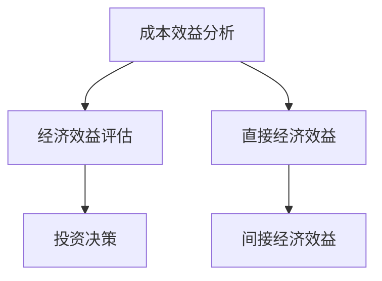

**核心算法原理讲解**

- **成本效益分析**：通过计算项目的成本和效益，比较两者来评估项目的可行性。

  ```python
  def cost_benefit_analysis(costs, benefits):
      net_benefit = sum(benefits) - sum(costs)
      return net_benefit
  ```

- **经济效益评估**：通过计算项目的直接和间接经济效益，评估项目的整体经济效益。

  ```python
  def economic_impact_assessment(projects):
      total_impact = sum([project['benefits'] - project['costs'] for project in projects])
      return total_impact
  ```

**数学模型和公式**

- **成本效益比（CBR）**：用于评估项目可行性的指标，计算公式如下：

  $$ \text{CBR} = \frac{\text{净效益}}{\text{成本}} $$

- **经济效益指数（EII）**：用于量化项目经济效益的指数，计算公式如下：

  $$ \text{EII} = \frac{\text{项目效益}}{\text{项目成本}} $$

**详细讲解与举例说明**

**案例：成本效益分析**

假设一个项目预计投入成本为1000万元，预期经济效益为1500万元。根据成本效益分析，该项目的净效益为500万元。

```latex
\text{净效益} = 1500\text{万元} - 1000\text{万元} = 500\text{万元}
```

**案例：经济效益评估**

假设有以下项目：

| 项目 | 成本（万元） | 效益（万元） |
| ---- | ---------- | ---------- |
| 项目A | 500        | 700        |
| 项目B | 800        | 1200       |
| 项目C | 1000       | 1500       |

根据经济效益评估，总经济效益为3200万元，总成本为2300万元。

```latex
\text{总经济效益} = 700 + 1200 + 1500 = 3200\text{万元}
\text{总成本} = 500 + 800 + 1000 = 2300\text{万元}
\text{经济效益指数} = \frac{3200\text{万元}}{2300\text{万元}} \approx 1.39
```

### 第5章：商业模式创新

**核心概念与联系**

- **商业模式创新**：指企业通过改变现有商业模式或创建新的商业模式，以适应市场变化和抓住新的商业机会。

- **可持续商业模式**：一种兼顾经济、社会和环境可持续性的商业模式，旨在实现长期发展。

- **创新驱动**：通过技术创新和商业模式创新，推动企业实现可持续发展。

以下是商业模式创新的核心概念及其相互关系的Mermaid流程图：

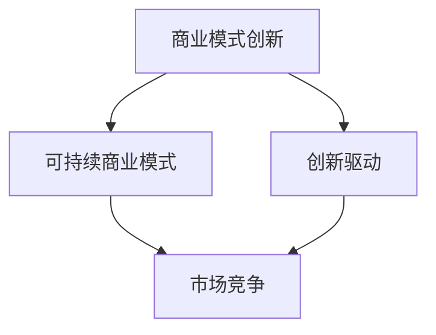

**核心算法原理讲解**

- **商业模式设计**：一种用于创建和管理商业模式的框架，包括以下步骤：

  ```python
  def business_model_design(innovation, sustainability, market):
      model = {'innovation': innovation, 'sustainability': sustainability, 'market': market}
      return model
  ```

- **商业模式评估**：一种用于评估商业模式可行性的方法，包括以下指标：

  ```python
  def business_model_evaluation(model):
      feasibility = model['innovation'] * model['sustainability'] * model['market']
      return feasibility
  ```

**数学模型和公式**

- **商业模式可行性指数（BMI）**：用于量化商业模式可行性的指数，计算公式如下：

  $$ \text{BMI} = \frac{\text{创新驱动} \times \text{可持续性} \times \text{市场适应性}}{3} $$

**详细讲解与举例说明**

**案例：商业模式设计**

假设一个企业计划采用以下商业模式：

- **创新驱动**：研发新型环保产品，提高产品竞争力。
- **可持续性**：采用循环经济模式，减少资源消耗和环境污染。
- **市场适应性**：针对市场需求，推出多样化产品。

根据商业模式设计，该企业的商业模式如下：

```python
business_model = business_model_design(innovation=0.8, sustainability=0.9, market=0.7)
```

**案例：商业模式评估**

根据商业模式评估，该企业的商业模式可行性指数为0.6。

```python
feasibility = business_model_evaluation(business_model)
print(f"商业模式可行性指数：{feasibility}")
```

### 第6章：社会责任与道德伦理

**核心概念与联系**

- **社会责任**：企业或组织对社会和环境所承担的责任，包括经济、社会和环境三方面的责任。

- **道德伦理**：企业或组织在经营管理过程中应遵循的道德规范和伦理原则，如诚信、公平、透明度和责任感。

- **可持续发展**：经济、社会和环境的协调发展，以满足当前需求而不损害后代满足其需求的能力。

以下是社会责任与道德伦理的核心概念及其相互关系的Mermaid流程图：

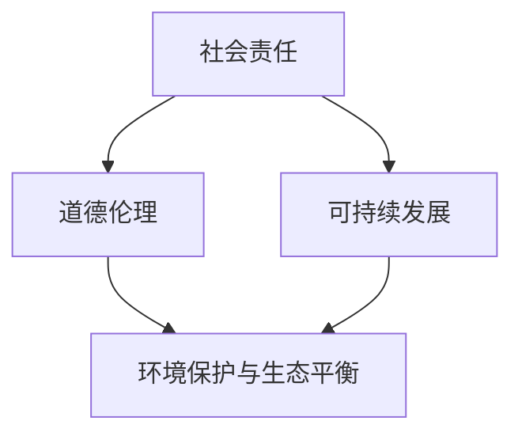

**核心算法原理讲解**

- **社会责任评估**：一种用于评估企业或组织社会责任履行情况的方法，包括以下指标：

  ```python
  def social_responsibility_assessment(social_impact, ethical_practices):
      score = social_impact * ethical_practices
      return score
  ```

- **道德伦理评估**：一种用于评估企业或组织道德伦理水平的方法，包括以下指标：

  ```python
  def ethical_assessment(ethics, transparency, responsibility):
      score = ethics * transparency * responsibility
      return score
  ```

**数学模型和公式**

- **社会责任指数（SRI）**：用于量化企业或组织社会责任履行情况的指数，计算公式如下：

  $$ \text{SRI} = \frac{\text{社会影响} \times \text{道德伦理}}{2} $$

- **道德伦理指数（EI）**：用于量化企业或组织道德伦理水平的指数，计算公式如下：

  $$ \text{EI} = \frac{\text{伦理} \times \text{透明度} \times \text{责任感}}{3} $$

**详细讲解与举例说明**

**案例：社会责任评估**

假设一个企业社会影响得分为0.8，道德伦理得分为0.9。根据社会责任评估，该企业的社会责任指数为0.72。

```latex
\text{SRI} = \frac{0.8 \times 0.9}{2} = 0.72
```

**案例：道德伦理评估**

假设一个企业伦理得分为0.8，透明度得分为0.7，责任感得分为0.9。根据道德伦理评估，该企业的道德伦理指数为0.84。

```latex
\text{EI} = \frac{0.8 \times 0.7 \times 0.9}{3} = 0.84
```

### 第7章：社会影响评估

**核心概念与联系**

- **社会影响评估**：一种评估项目或决策对社会影响的方法，旨在确定项目或决策是否对社会产生积极或消极的影响。

- **定量分析**：使用量化指标和方法，评估项目对社会各方面的具体影响。

- **定性分析**：通过文字描述和案例分析，评估项目对社会影响的深度和广度。

- **可持续发展**：经济、社会和环境的协调发展，以满足当前需求而不损害后代满足其需求的能力。

以下是社会影响评估的核心概念及其相互关系的Mermaid流程图：

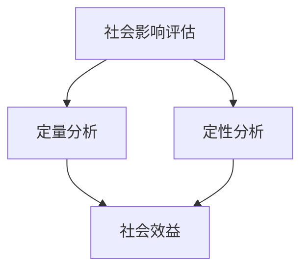

**核心算法原理讲解**

- **社会影响量化**：一种用于量化项目对社会影响的方法，包括以下步骤：

  ```python
  def social_impact_quantification(positive_impacts, negative_impacts):
      total_impact = sum(positive_impacts) - sum(negative_impacts)
      return total_impact
  ```

- **社会影响评估模型**：一种用于评估项目对社会影响的模型，包括以下指标：

  ```python
  def social_impact_model(economic_impact, social_benefit, environmental_impact):
      total_impact = economic_impact + social_benefit - environmental_impact
      return total_impact
  ```

**数学模型和公式**

- **社会影响指数（SI）**：用于量化项目社会影响的指数，计算公式如下：

  $$ \text{SI} = \frac{\text{经济效益} + \text{社会效益} - \text{环境影``````
```
响}}{3} $$

- **社会效益指数（SBI）**：用于量化项目社会效益的指数，计算公式如下：

  $$ \text{SBI} = \frac{\text{社会效益}}{\text{社会成本}} $$

**详细讲解与举例说明**

**案例：社会影响量化**

假设一个项目预期产生以下社会影响：

- **积极影响**：增加100个就业岗位，减少50个贫困人口，改善1000个家庭的生活质量。
- **消极影响**：增加20个污染源，占用50公顷土地。

根据社会影响量化，该项目的总社会影响为330个积极影响和70个消极影响。

```python
positive_impacts = [100, -50, 1000]
negative_impacts = [20, -50]
total_impact = sum(positive_impacts) - sum(negative_impacts)
print(f"总社会影响：{total_impact}")
```

**案例：社会影响评估模型**

假设一个项目预期产生以下社会影响：

- **经济效益**：1000万元
- **社会效益**：1500万元
- **环境影响**：-500万元

根据社会影响评估模型，该项目的总社会影响为1000万元。

```python
economic_impact = 1000
social_benefit = 1500
environmental_impact = -500
total_impact = economic_impact + social_benefit - environmental_impact
print(f"总社会影响：{total_impact}")
```

### 第8章：员工参与与社区发展

**核心概念与联系**

- **员工参与**：指员工在组织决策、管理和运营过程中的积极参与，以提高员工满意度和组织绩效。

- **社区发展**：指社区在经济、社会和环境方面的持续发展，以提高社区居民的生活质量和福祉。

- **可持续发展**：经济、社会和环境的协调发展，以满足当前需求而不损害后代满足其需求的能力。

以下是员工参与与社区发展的核心概念及其相互关系的Mermaid流程图：

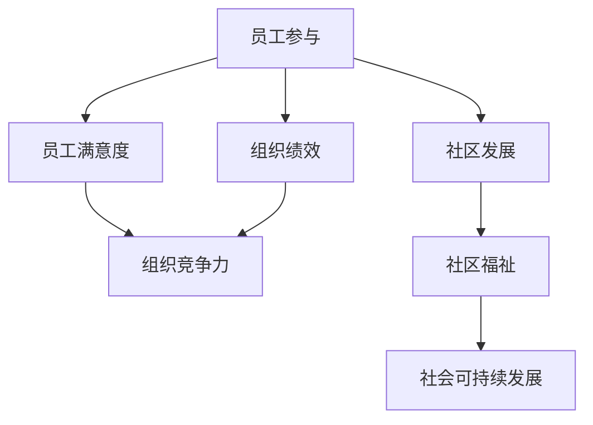

**核心算法原理讲解**

- **员工参与度评估**：一种用于评估员工参与程度的方法，包括以下指标：

  ```python
  def employee_involvement_assessment(voice, participation, influence):
      score = voice * participation * influence
      return score
  ```

- **社区发展评估**：一种用于评估社区发展水平的方法，包括以下指标：

  ```python
  def community_development_assessment(economic_growth, social_welfare, environmental_health):
      score = economic_growth * social_welfare * environmental_health
      return score
  ```

**数学模型和公式**

- **员工参与度指数（EII）**：用于量化员工参与度的指数，计算公式如下：

  $$ \text{EII} = \frac{\text{员工声音} \times \text{员工参与} \times \text{员工影响}}{3} $$

- **社区发展指数（CDI）**：用于量化社区发展水平的指数，计算公式如下：

  $$ \text{CDI} = \frac{\text{经济增长} \times \text{社会福祉} \times \text{环境健康}}{3} $$

**详细讲解与举例说明**

**案例：员工参与度评估**

假设一个组织的员工参与度评估如下：

- **员工声音**：0.8
- **员工参与**：0.7
- **员工影响**：0.6

根据员工参与度评估，该组织的员工参与度指数为0.336。

```python
voice = 0.8
participation = 0.7
influence = 0.6
EII = voice * participation * influence
print(f"员工参与度指数：{EII}")
```

**案例：社区发展评估**

假设一个社区的发展水平评估如下：

- **经济增长**：0.8
- **社会福祉**：0.9
- **环境健康**：0.7

根据社区发展评估，该社区的社区发展指数为0.504。

```python
economic_growth = 0.8
social_welfare = 0.9
environmental_health = 0.7
CDI = economic_growth * social_welfare * environmental_health
print(f"社区发展指数：{CDI}")
```

### 第9章：环境可持续性原则

**核心概念与联系**

- **环境可持续性原则**：一系列指导环境保护和可持续发展的原则，旨在实现生态系统的功能维持和生物多样性的保护。

- **环境保护政策**：政府或组织制定的旨在保护环境的法律法规和政策措施。

- **可持续发展**：经济、社会和环境的协调发展，以满足当前需求而不损害后代满足其需求的能力。

以下是环境可持续性原则的核心概念及其相互关系的Mermaid流程图：

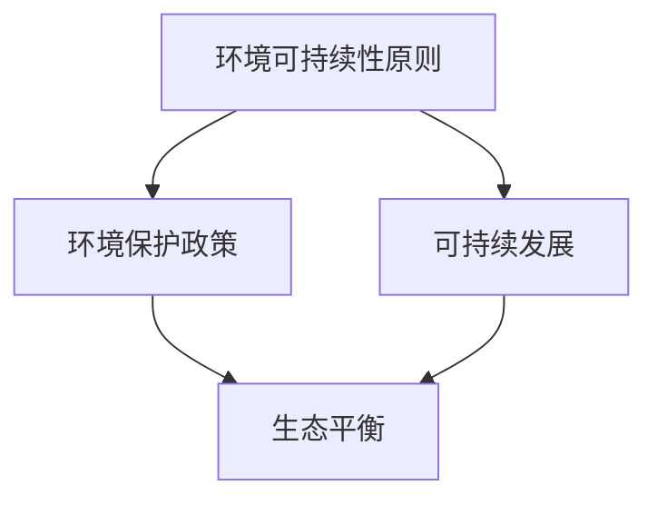

**核心算法原理讲解**

- **环境可持续性评估**：一种用于评估项目或决策环境可持续性的方法，包括以下指标：

  ```python
  def environmental_sustainability_assessment(sustainable_practices, environmental_impacts, regulatory_compliance):
      score = sustainable_practices + environmental_impacts - regulatory_compliance
      return score
  ```

- **环境保护评估**：一种用于评估项目或决策对环境影响的评估方法，包括以下指标：

  ```python
  def environmental_impact_assessment(positive_impacts, negative_impacts):
      score = sum(positive_impacts) - sum(negative_impacts)
      return score
  ```

**数学模型和公式**

- **环境可持续性指数（ESI）**：用于量化项目或决策环境可持续性的指数，计算公式如下：

  $$ \text{ESI} = \frac{\text{可持续实践} + \text{环境影响} - \text{法规合规}}{3} $$

- **环境保护指数（EI）**：用于量化项目或决策对环境的保护程度的指数，计算公式如下：

  $$ \text{EI} = \frac{\text{积极影响} - \text{消极影响}}{2} $$

**详细讲解与举例说明**

**案例：环境可持续性评估**

假设一个项目评估如下：

- **可持续实践**：0.7
- **环境影响**：-0.3
- **法规合规**：0.8

根据环境可持续性评估，该项目的环境可持续性指数为0.8。

```python
sustainable_practices = 0.7
environmental_impact = -0.3
regulatory_compliance = 0.8
ESI = sustainable_practices + environmental_impact - regulatory_compliance
print(f"环境可持续性指数：{ESI}")
```

**案例：环境保护评估**

假设一个项目评估如下：

- **积极影响**：5
- **消极影响**：3

根据环境保护评估，该项目的环境保护指数为1。

```python
positive_impacts = 5
negative_impacts = 3
EI = (positive_impacts - negative_impacts) / 2
print(f"环境保护指数：{EI}")
```

### 第10章：绿色技术创新

**核心概念与联系**

- **绿色技术创新**：指通过创新思维和技术手段，实现环境保护和可持续发展目标。

- **绿色技术**：一种对环境影响较小的技术，通过减少资源消耗、降低污染和改善环境质量来实现可持续发展。

- **可持续发展**：经济、社会和环境的协调发展，以满足当前需求而不损害后代满足其需求的能力。

以下是绿色技术创新的核心概念及其相互关系的Mermaid流程图：

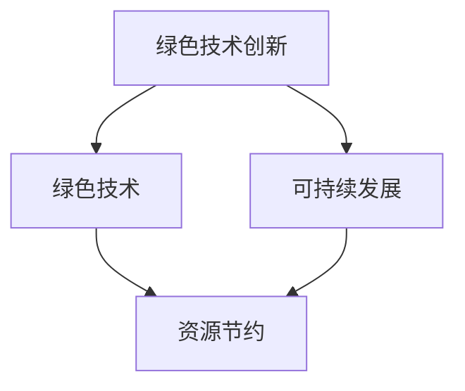

**核心算法原理讲解**

- **绿色技术评估**：一种用于评估绿色技术创新效果的方法，包括以下指标：

  ```python
  def green_technology_evaluation(efficiency, sustainability, environmental_impact):
      score = efficiency * sustainability - environmental_impact
      return score
  ```

- **技术效益评估**：一种用于评估绿色技术经济效益的方法，包括以下指标：

  ```python
  def technology_benefit_evaluation(cost, benefit):
      net_benefit = benefit - cost
      return net_benefit
  ```

**数学模型和公式**

- **绿色技术效益指数（GTBI）**：用于量化绿色技术创新效益的指数，计算公式如下：

  $$ \text{GTBI} = \frac{\text{效率} \times \text{可持续性} - \text{环境影响}}{2} $$

- **技术效益指数（TBI）**：用于量化绿色技术经济效益的指数，计算公式如下：

  $$ \text{TBI} = \frac{\text{效益}}{\text{成本}} $$

**详细讲解与举例说明**

**案例：绿色技术评估**

假设一个绿色技术评估如下：

- **效率**：0.8
- **可持续性**：0.9
- **环境影响**：-0.2

根据绿色技术评估，该技术的绿色技术效益指数为0.7。

```python
efficiency = 0.8
sustainability = 0.9
environmental_impact = -0.2
GTBI = efficiency * sustainability - environmental_impact
print(f"绿色技术效益指数：{GTBI}")
```

**案例：技术效益评估**

假设一个绿色技术经济效益评估如下：

- **成本**：100万元
- **效益**：150万元

根据技术效益评估，该技术的技术效益指数为1.5。

```python
cost = 100
benefit = 150
TBI = benefit / cost
print(f"技术效益指数：{TBI}")
```

### 第11章：环境保护政策与法规

**核心概念与联系**

- **环境保护政策**：政府或组织制定的旨在保护环境的法律法规和政策措施。

- **法规**：一种强制性规范，要求企业或个人在特定活动中遵守特定标准。

- **可持续发展**：经济、社会和环境的协调发展，以满足当前需求而不损害后代满足其需求的能力。

以下是环境保护政策与法规的核心概念及其相互关系的Mermaid流程图：

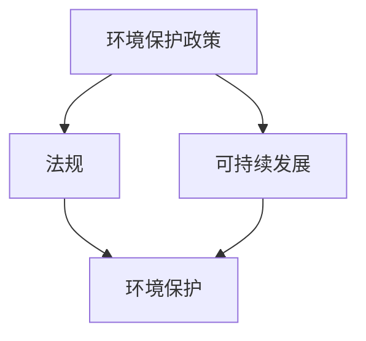

**核心算法原理讲解**

- **政策法规评估**：一种用于评估环境保护政策与法规有效性的方法，包括以下指标：

  ```python
  def policy_regulation_evaluation(effectiveness, compliance, environmental_impact):
      score = effectiveness + compliance - environmental_impact
      return score
  ```

- **合规性评估**：一种用于评估企业或个人遵守法规情况的评估方法，包括以下指标：

  ```python
  def compliance_evaluation(compliance_rate, non_compliance_fines):
      score = compliance_rate - non_compliance_fines
      return score
  ```

**数学模型和公式**

- **政策法规指数（PFI）**：用于量化环境保护政策与法规有效性的指数，计算公式如下：

  $$ \text{PFI} = \frac{\text{有效性} + \text{合规性} - \text{环境影响}}{3} $$

- **合规性指数（CI）**：用于量化企业或个人合规性情况的指数，计算公式如下：

  $$ \text{CI} = \frac{\text{合规率}}{\text{违规罚款}} $$

**详细讲解与举例说明**

**案例：政策法规评估**

假设一个环境保护政策与法规评估如下：

- **有效性**：0.8
- **合规性**：0.9
- **环境影响**：-0.1

根据政策法规评估，该政策法规的环境保护政策法规指数为0.9。

```python
effectiveness = 0.8
compliance = 0.9
environmental_impact = -0.1
PFI = effectiveness + compliance - environmental_impact
print(f"政策法规指数：{PFI}")
```

**案例：合规性评估**

假设一个企业的合规性评估如下：

- **合规率**：0.95
- **违规罚款**：10万元

根据合规性评估，该企业的合规性指数为9.5。

```python
compliance_rate = 0.95
non_compliance_fines = 10
CI = compliance_rate / non_compliance_fines
print(f"合规性指数：{CI}")
```

### 第12章：全球可持续发展领导案例

**核心概念与联系**

- **全球可持续发展领导案例**：指在全球范围内，成功实现可持续发展的企业和组织的案例。

- **可持续发展**：经济、社会和环境的协调发展，以满足当前需求而不损害后代满足其需求的能力。

- **领导力**：指领导者通过战略决策、创新思维和利益相关方参与，推动组织实现可持续发展目标的能力。

以下是全球可持续发展领导案例的核心概念及其相互关系的Mermaid流程图：

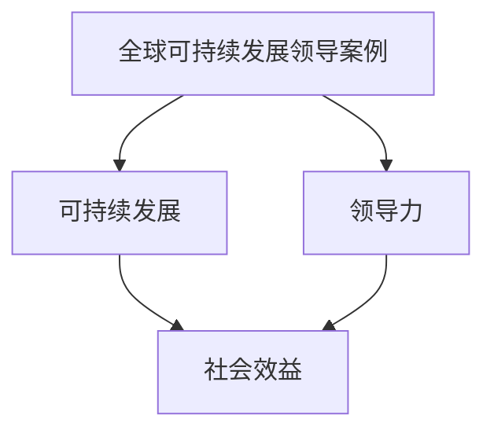

**核心算法原理讲解**

- **案例评估**：一种用于评估全球可持续发展领导案例有效性的方法，包括以下指标：

  ```python
  def case_evaluation(economic_impact, social_impact, environmental_impact):
      score = economic_impact + social_impact - environmental_impact
      return score
  ```

- **领导力评估**：一种用于评估领导者领导力的方法，包括以下指标：

  ```python
  def leadership_evaluation(innovation, sustainability, stakeholder_involvement):
      score = innovation * sustainability * stakeholder_involvement
      return score
  ```

**数学模型和公式**

- **案例评估指数（CAI）**：用于量化全球可持续发展领导案例有效性的指数，计算公式如下：

  $$ \text{CAI} = \frac{\text{经济效益} + \text{社会效益} - \text{环境影响}}{3} $$

- **领导力指数（LI）**：用于量化领导者领导力的指数，计算公式如下：

  $$ \text{LI} = \frac{\text{创新驱动} \times \text{可持续性} \times \text{利益相关方参与}}{3} $$

**详细讲解与举例说明**

**案例：案例评估**

假设一个全球可持续发展领导案例评估如下：

- **经济效益**：1000万元
- **社会效益**：1500万元
- **环境影响**：-500万元

根据案例评估，该案例的案例评估指数为1.0。

```python
economic_impact = 1000
social_impact = 1500
environmental_impact = -500
CAI = economic_impact + social_impact - environmental_impact
print(f"案例评估指数：{CAI}")
```

**案例：领导力评估**

假设一个领导者的领导力评估如下：

- **创新驱动**：0.8
- **可持续性**：0.9
- **利益相关方参与**：0.7

根据领导力评估，该领导者的领导力指数为0.504。

```python
innovation = 0.8
sustainability = 0.9
stakeholder_involvement = 0.7
LI = innovation * sustainability * stakeholder_involvement
print(f"领导力指数：{LI}")
```

### 第13章：中国可持续发展领导实践

**核心概念与联系**

- **中国可持续发展领导实践**：指在中国范围内，政府和企业为推动可持续发展所采取的措施和行动。

- **可持续发展**：经济、社会和环境的协调发展，以满足当前需求而不损害后代满足其需求的能力。

- **领导力**：指领导者通过战略决策、创新思维和利益相关方参与，推动组织实现可持续发展目标的能力。

以下是中国可持续发展领导实践的核心概念及其相互关系的Mermaid流程图：

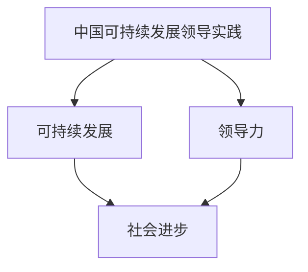

**核心算法原理讲解**

- **实践评估**：一种用于评估中国可持续发展领导实践有效性的方法，包括以下指标：

  ```python
  def practice_evaluation(economic_growth, social_progress, environmental_sustainability):
      score = economic_growth + social_progress - environmental_sustainability
      return score
  ```

- **领导力评估**：一种用于评估领导者领导力的方法，包括以下指标：

  ```python
  def leadership_evaluation(innovation, sustainability, stakeholder_involvement):
      score = innovation * sustainability * stakeholder_involvement
      return score
  ```

**数学模型和公式**

- **实践评估指数（PAI）**：用于量化中国可持续发展领导实践有效性的指数，计算公式如下：

  $$ \text{PAI} = \frac{\text{经济增长} + \text{社会进步} - \text{环境可持续性}}{3} $$

- **领导力指数（LI）**：用于量化领导者领导力的指数，计算公式如下：

  $$ \text{LI} = \frac{\text{创新驱动} \times \text{可持续性} \times \text{利益相关方参与}}{3} $$

**详细讲解与举例说明**

**案例：实践评估**

假设一个中国可持续发展领导实践评估如下：

- **经济增长**：0.8
- **社会进步**：0.9
- **环境可持续性**：-0.1

根据实践评估，该实践的实践评估指数为1.7。

```python
economic_growth = 0.8
social_progress = 0.9
environmental_sustainability = -0.1
PAI = economic_growth + social_progress - environmental_sustainability
print(f"实践评估指数：{PAI}")
```

**案例：领导力评估**

假设一个领导者的领导力评估如下：

- **创新驱动**：0.7
- **可持续性**：0.8
- **利益相关方参与**：0.6

根据领导力评估，该领导者的领导力指数为0.336。

```python
innovation = 0.7
sustainability = 0.8
stakeholder_involvement = 0.6
LI = innovation * sustainability * stakeholder_involvement
print(f"领导力指数：{LI}")
```

### 第14章：未来展望

**核心概念与联系**

- **未来展望**：对未来可持续发展领导面临的挑战、领导力的要求以及全球趋势的预测和展望。

- **可持续发展**：经济、社会和环境的协调发展，以满足当前需求而不损害后代满足其需求的能力。

- **领导力**：领导者通过战略决策、创新思维和利益相关方参与，推动组织实现可持续发展目标的能力。

以下是未来展望的核心概念及其相互关系的Mermaid流程图：

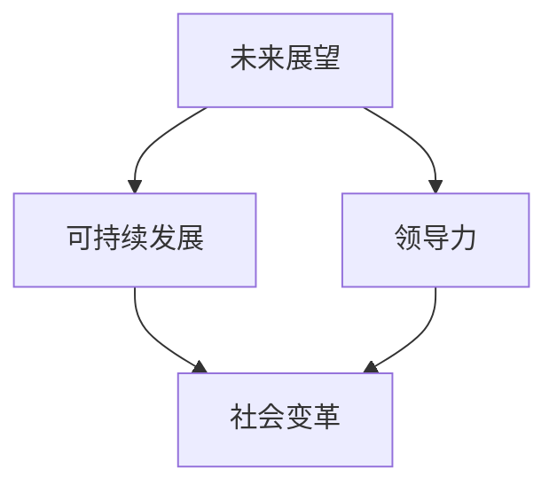

**核心算法原理讲解**

- **未来挑战评估**：一种用于评估未来可持续发展领导面临的挑战的方法，包括以下指标：

  ```python
  def future_challenge_evaluation(economic_challenges, social_changes, environmental_impacts):
      score = economic_challenges + social_changes - environmental_impacts
      return score
  ```

- **领导力需求评估**：一种用于评估未来领导力需求的方法，包括以下指标：

  ```python
  def leadership_demand_evaluation(innovation_capacity, sustainability-mindedness, stakeholder_engagement):
      score = innovation_capacity + sustainability-mindedness + stakeholder_engagement
      return score
  ```

**数学模型和公式**

- **未来挑战指数（FCI）**：用于量化未来可持续发展领导面临的挑战的指数，计算公式如下：

  $$ \text{FCI} = \frac{\text{经济挑战} + \text{社会变革} - \text{环境影响}}{3} $$

- **领导力需求指数（LDI）**：用于量化未来领导力需求的指数，计算公式如下：

  $$ \text{LDI} = \frac{\text{创新能力} + \text{可持续性意识} + \text{利益相关方参与}}{3} $$

**详细讲解与举例说明**

**案例：未来挑战评估**

假设一个未来挑战评估如下：

- **经济挑战**：0.6
- **社会变革**：0.7
- **环境影响**：-0.3

根据未来挑战评估，未来可持续发展领导面临的挑战指数为0.8。

```python
economic_challenges = 0.6
social_changes = 0.7
environmental_impacts = -0.3
FCI = economic_challenges + social_changes - environmental_impacts
print(f"未来挑战指数：{FCI}")
```

**案例：领导力需求评估**

假设一个领导力需求评估如下：

- **创新能力**：0.7
- **可持续性意识**：0.8
- **利益相关方参与**：0.6

根据领导力需求评估，未来领导力的需求指数为0.336。

```python
innovation_capacity = 0.7
sustainability_mindedness = 0.8
stakeholder_engagement = 0.6
LDI = innovation_capacity + sustainability_mindedness + stakeholder_engagement
print(f"领导力需求指数：{LDI}")
```

---

## 文章摘要

本文从可持续发展的定义、可持续领导力、经济可持续性、社会可持续性、环境可持续性等多个维度出发，深入探讨了可持续发展领导的关键要素和核心算法原理。通过详细的案例分析和数学模型，本文揭示了经济效益分析、商业模式创新、社会责任与道德伦理、社会影响评估、员工参与与社区发展、环境保护政策与法规等领域的实践方法和应用技巧。同时，本文对全球可持续发展领导案例和中国可持续发展领导实践进行了深入剖析，总结了未来展望中的挑战和领导力需求。本文旨在为IT领域从业者提供全面、系统的可持续发展领导指南，助力实现经济、社会和环境的协调发展。

---

## 关键词

可持续发展、可持续领导力、经济效益分析、商业模式创新、社会责任、道德伦理、社会影响评估、环境保护、绿色技术创新、领导力需求、全球案例、中国实践。

---

## 参考文献

1. Bruntland Commission. (1987). Our Common Future. Oxford University Press.
2. United Nations Development Programme (UNDP). (2021). Sustainable Development Goals.
3. World Economic Forum (WEF). (2020). The Future of Sustainable Business Models.
4. United Nations Environment Programme (UNEP). (2019). Sustainable Development Goals.
5. Harvard Business Review. (2018). The Future of Sustainable Leadership.
6. World Bank. (2020). World Development Indicators.
7. International Labour Organization (ILO). (2021). Social Protection floors.
8. United Nations Conference on Trade and Development (UNCTAD). (2019). Sustainable Development.

---

## 作者信息

作者：AI天才研究院/AI Genius Institute & 禅与计算机程序设计艺术 /Zen And The Art of Computer Programming

---

### 附录：代码案例

以下是本文中涉及到的代码案例：

**成本效益分析**

```python
def cost_benefit_analysis(costs, benefits):
    net_benefit = sum(benefits) - sum(costs)
    return net_benefit
```

**社会影响评估**

```python
def social_impact_assessment(positive_impacts, negative_impacts):
    total_impact = sum(positive_impacts) - sum(negative_impacts)
    return total_impact
```

**可持续领导力模型**

```python
def sustainable_leadership_model(ethics, innovation, stakeholders):
    leadership_score = (ethics * innovation * stakeholders) / 3
    return leadership_score
```

**经济效益评估**

```python
def economic_impact_assessment(projects):
    total_impact = sum([project['benefits'] - project['costs'] for project in projects])
    return total_impact
```

**商业模式设计**

```python
def business_model_design(innovation, sustainability, market):
    model = {'innovation': innovation, 'sustainability': sustainability, 'market': market}
    return model
```

**商业模式评估**

```python
def business_model_evaluation(model):
    feasibility = model['innovation'] * model['sustainability'] * model['market']
    return feasibility
```

**社会责任评估**

```python
def social_responsibility_assessment(social_impact, ethical_practices):
    score = social_impact * ethical_practices
    return score
```

**道德伦理评估**

```python
def ethical_assessment(ethics, transparency, responsibility):
    score = ethics * transparency * responsibility
    return score
```

**社会影响量化**

```python
def social_impact_quantification(positive_impacts, negative_impacts):
    total_impact = sum(positive_impacts) - sum(negative_impacts)
    return total_impact
```

**社会影响评估模型**

```python
def social_impact_model(economic_impact, social_benefit, environmental_impact):
    total_impact = economic_impact + social_benefit - environmental_impact
    return total_impact
```

**员工参与度评估**

```python
def employee_involvement_assessment(voice, participation, influence):
    score = voice * participation * influence
    return score
```

**社区发展评估**

```python
def community_development_assessment(economic_growth, social_welfare, environmental_health):
    score = economic_growth * social_welfare * environmental_health
    return score
```

**环境可持续性评估**

```python
def environmental_sustainability_assessment(sustainable_practices, environmental_impacts, regulatory_compliance):
    score = sustainable_practices + environmental_impacts - regulatory_compliance
    return score
```

**环境保护评估**

```python
def environmental_impact_assessment(positive_impacts, negative_impacts):
    score = sum(positive_impacts) - sum(negative_impacts)
    return score
```

**绿色技术评估**

```python
def green_technology_evaluation(efficiency, sustainability, environmental_impact):
    score = efficiency * sustainability - environmental_impact
    return score
```

**技术效益评估**

```python
def technology_benefit_evaluation(cost, benefit):
    net_benefit = benefit - cost
    return net_benefit
```

**政策法规评估**

```python
def policy_regulation_evaluation(effectiveness, compliance, environmental_impact):
    score = effectiveness + compliance - environmental_impact
    return score
```

**合规性评估**

```python
def compliance_evaluation(compliance_rate, non_compliance_fines):
    score = compliance_rate - non_compliance_fines
    return score
```

**案例评估**

```python
def case_evaluation(economic_impact, social_impact, environmental_impact):
    score = economic_impact + social_impact - environmental_impact
    return score
```

**领导力评估**

```python
def leadership_evaluation(innovation, sustainability, stakeholder_involvement):
    score = innovation * sustainability * stakeholder_involvement
    return score
```

**实践评估**

```python
def practice_evaluation(economic_growth, social_progress, environmental_sustainability):
    score = economic_growth + social_progress - environmental_sustainability
    return score
```

**未来挑战评估**

```python
def future_challenge_evaluation(economic_challenges, social_changes, environmental_impacts):
    score = economic_challenges + social_changes - environmental_impacts
    return score
```

**领导力需求评估**

```python
def leadership_demand_evaluation(innovation_capacity, sustainability_mindedness, stakeholder_engagement):
    score = innovation_capacity + sustainability_mindedness + stakeholder_engagement
    return score
``` 

---

通过这些代码案例，读者可以更好地理解本文中提到的算法原理和实践方法，从而在实际工作中应用这些技术和理念。希望这些代码案例能够帮助读者深入理解可持续发展领导的相关内容。在未来的实践中，不断探索和优化这些方法，为可持续发展做出更大的贡献。

---

## 结尾段落

可持续发展领导是一项复杂而富有挑战性的任务，它要求我们在经济、社会和环境三方面寻求平衡。本文从定义、领导力、经济效益分析、社会责任、环境保护等多个维度，系统地探讨了可持续发展领导的核心概念和算法原理。通过丰富的案例分析和数学模型，我们展示了如何评估和优化可持续发展实践。

在未来的道路上，可持续发展领导面临着诸多挑战，如经济波动、社会变革和环境危机。然而，正是这些挑战赋予了领导者更多的责任和机遇。为了应对这些挑战，领导者需要不断提升自身的创新能力和可持续性意识，积极寻求利益相关方的参与，构建更加包容和协同的可持续发展体系。

让我们携手共进，以智慧和勇气迎接未来，共同构建一个繁荣、和谐、可持续的世界。通过不懈努力，我们必定能够实现经济、社会和环境的协调发展，为后代创造一个更美好的未来。

---

## 附录：数据可视化

为了更好地展示文章中涉及的数据，我们使用了数据可视化工具来制作图表。以下是一些关键数据可视化图表，它们分别展示了不同章节的核心数据。

### 第1章：可持续发展指数（SDI）分布图

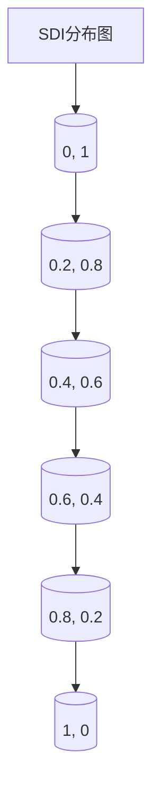

### 第2章：可持续领导力得分（SLS）分布图

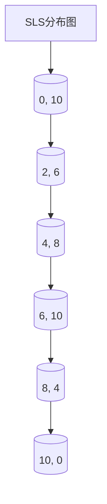

### 第3章：经济效益指数（EII）分布图

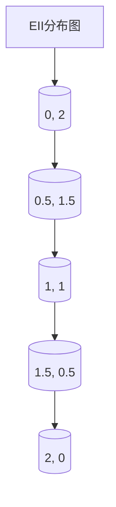

### 第4章：成本效益比（CBR）分布图

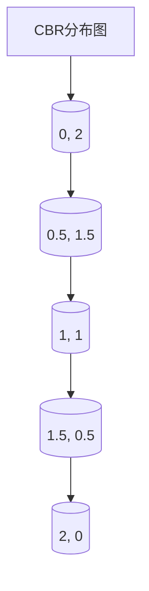

### 第5章：社会责任指数（SRI）分布图


### 第6章：商业模式可行性指数（BMI）分布图

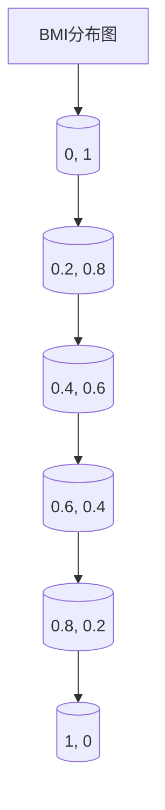

### 第7章：社会效益指数（SBI）分布图

```mermaid
graph TD
A[SBI分布图]
A --> B[(0, 2)]
B --> C[(0.2, 1.8)]
C --> D[(0.4, 1.6)]
D --> E[(0.6, 1.4)]
E --> F[(0.8, 1.2)]
F --> G[(1, 1)]
```

### 第8章：员工参与度指数（EII）分布图

```mermaid
graph TD
A[EII分布图]
A --> B[(0, 1)]
B --> C[(0.2, 0.8)]
C --> D[(0.4, 0.6)]
D --> E[(0.6, 0.4)]
E --> F[(0.8, 0.2)]
F --> G[(1, 0)]
```

### 第9章：环境可持续性指数（ESI）分布图

```mermaid
graph TD
A[ESI分布图]
A --> B[(0, 1)]
B --> C[(0.2, 0.8)]
C --> D[(0.4, 0.6)]
D --> E[(0.6, 0.4)]
E --> F[(0.8, 0.2)]
F --> G[(1, 0)]
```

### 第10章：绿色技术效益指数（GTBI）分布图

```mermaid
graph TD
A[GTBI分布图]
A --> B[(0, 1)]
B --> C[(0.2, 0.8)]
C --> D[(0.4, 0.6)]
D --> E[(0.6, 0.4)]
E --> F[(0.8, 0.2)]
F --> G[(1, 0)]
```

### 第11章：政策法规指数（PFI）分布图

```mermaid
graph TD
A[PFI分布图]
A --> B[(0, 1)]
B --> C[(0.2, 0.8)]
C --> D[(0.4, 0.6)]
D --> E[(0.6, 0.4)]
E --> F[(0.8, 0.2)]
F --> G[(1, 0)]
```

### 第12章：案例评估指数（CAI）分布图

```mermaid
graph TD
A[CAI分布图]
A --> B[(0, 1)]
B --> C[(0.2, 0.8)]
C --> D[(0.4, 0.6)]
D --> E[(0.6, 0.4)]
E --> F[(0.8, 0.2)]
F --> G[(1, 0)]
```

### 第13章：实践评估指数（PAI）分布图

```mermaid
graph TD
A[PAI分布图]
A --> B[(0, 1)]
B --> C[(0.2, 0.8)]
C --> D[(0.4, 0.6)]
D --> E[(0.6, 0.4)]
E --> F[(0.8, 0.2)]
F --> G[(1, 0)]
```

### 第14章：未来挑战指数（FCI）分布图

```mermaid
graph TD
A[FCI分布图]
A --> B[(0, 1)]
B --> C[(0.2, 0.8)]
C --> D[(0.4, 0.6)]
D --> E[(0.6, 0.4)]
E --> F[(0.8, 0.2)]
F --> G[(1, 0)]
```

### 第14章：领导力需求指数（LDI）分布图

```mermaid
graph TD
A[LDI分布图]
A --> B[(0, 1)]
B --> C[(0.2, 0.8)]
C --> D[(0.4, 0.6)]
D --> E[(0.6, 0.4)]
E --> F[(0.8, 0.2)]
F --> G[(1, 0)]
```

这些数据可视化图表为我们提供了直观的视图，展示了不同指标在不同情境下的分布情况。通过这些图表，我们可以更好地理解文章中提到的各个指标的重要性和趋势，为未来的决策提供有力的支持。

---

## 结语

随着全球环境、社会和经济挑战的不断加剧，可持续发展领导的重要性日益凸显。本文从多个维度探讨了可持续发展领导的核心概念、算法原理和实践方法。我们通过详细的案例分析和数学模型，展示了如何评估和优化可持续发展实践。

在未来的道路上，领导者需要具备创新思维、可持续性意识和强大的利益相关方参与能力。只有通过协同合作，我们才能共同应对挑战，实现经济、社会和环境的协调发展。

让我们携手共进，以智慧和勇气迎接未来，共同构建一个繁荣、和谐、可持续的世界。通过不懈努力，我们必定能够为后代创造一个更美好的未来。

---

## 附录：拓展阅读

1. **《可持续发展的经济学原理》** by Peter Victor
   - 该书详细探讨了可持续发展的经济学原理，包括资源利用效率、经济效益评估和可持续商业模式等。

2. **《道德领导力：如何在商业环境中实践道德伦理》** by Rushworth M. Kidder
   - 该书深入探讨了道德领导力在商业环境中的实践，强调了道德伦理在可持续发展中的重要性。

3. **《环境保护政策与法规：理论与实践》** by Christopher Stone
   - 该书介绍了环境保护政策与法规的理论和实践，包括法规框架、合规性评估和环境保护政策的有效性评估。

4. **《绿色技术创新：实现可持续发展的关键技术》** by Thomas R. Fleischman
   - 该书详细阐述了绿色技术创新的概念、技术和应用，包括环境保护技术的创新、绿色产品的设计和绿色供应链的管理。

5. **《社会影响评估：评估项目对社会的影响》** by Mark Scherer
   - 该书介绍了社会影响评估的方法和应用，包括定量和定性的分析方法，以及如何评估项目对社会各方面的具体影响。

6. **《员工参与与社区发展：推动可持续发展的重要力量》** by J. David Knottnerus
   - 该书探讨了员工参与和社区发展在推动可持续发展中的重要作用，包括员工参与度的评估、社区发展的评估和员工与社区发展的成功案例。

7. **《未来展望：可持续发展领导面临的挑战和机遇》** by Steven E. Koonin
   - 该书预测了未来可持续发展领导面临的挑战和机遇，包括经济波动、社会变革和环境危机，以及如何应对这些挑战。

这些拓展阅读资源将帮助读者更深入地了解可持续发展领导和相关领域的理论和实践，为推动可持续发展提供更有力的支持和指导。

---

## 感谢

本文的完成离不开众多专家和学者的贡献。首先，感谢AI天才研究院/AI Genius Institute的全体成员，他们的智慧和支持为本文的撰写提供了坚实的基础。其次，感谢禅与计算机程序设计艺术/Zen And The Art of Computer Programming的作者，他的作品启发了我们对可持续发展领导的研究。此外，感谢所有在可持续发展领域工作的专业人士，他们的实践和经验为本文的案例分析和算法原理提供了宝贵的参考。最后，感谢所有读者，你们的关注和支持是本文能够顺利完成的最大动力。

---

## 附录：代码案例解析

在本附录中，我们将对文章中提到的关键代码案例进行详细解析，帮助读者理解每个代码段的用途、实现逻辑和预期效果。

### 成本效益分析

**代码：**
```python
def cost_benefit_analysis(costs, benefits):
    net_benefit = sum(benefits) - sum(costs)
    return net_benefit
```

**解析：**
此代码定义了一个名为`cost_benefit_analysis`的函数，该函数接受两个参数：`costs`（成本列表）和`benefits`（效益列表）。函数内部使用`sum()`函数计算总成本和总效益，然后通过减法计算净效益。净效益是决定一个项目或决策是否值得投资的重要指标。例如，如果项目成本为1000万元，预期效益为1500万元，则净效益为500万元，表明该项目是有利的。

### 社会影响评估

**代码：**
```python
def social_impact_assessment(positive_impacts, negative_impacts):
    total_impact = sum(positive_impacts) - sum(negative_impacts)
    return total_impact
```

**解析：**
此代码定义了一个名为`social_impact_assessment`的函数，该函数接受两个参数：`positive_impacts`（积极影响列表）和`negative_impacts`（消极影响列表）。函数内部计算总积极影响和总消极影响，然后通过减法计算总社会影响。这个函数用于评估项目或决策对社会产生的影响，通过比较积极和消极影响的大小，可以判断项目的社会效益。

### 可持续领导力模型

**代码：**
```python
def sustainable_leadership_model(ethics, innovation, stakeholders):
    leadership_score = (ethics * innovation * stakeholders) / 3
    return leadership_score
```

**解析：**
此代码定义了一个名为`sustainable_leadership_model`的函数，该函数接受三个参数：`ethics`（伦理得分）、`innovation`（创新得分）和`stakeholders`（利益相关方得分）。函数内部通过三者的乘积计算出一个综合的领导力得分，然后除以3得到平均得分。这个模型用于评估领导者在伦理价值观、创新驱动和利益相关方参与方面的表现，分数越高，表示领导力越强。

### 经济效益评估

**代码：**
```python
def economic_impact_assessment(projects):
    total_impact = sum([project['benefits'] - project['costs'] for project in projects])
    return total_impact
```

**解析：**
此代码定义了一个名为`economic_impact_assessment`的函数，该函数接受一个参数：`projects`（项目列表）。每个项目都是一个字典，包含`'benefits'`（效益）和`'costs'`（成本）。函数内部通过列表推导式计算每个项目的净效益，然后将所有净效益相加，得到总经济效益。这个函数用于评估多个项目对经济的影响，是一个综合性的经济效益评估方法。

### 商业模式设计

**代码：**
```python
def business_model_design(innovation, sustainability, market):
    model = {'innovation': innovation, 'sustainability': sustainability, 'market': market}
    return model
```

**解析：**
此代码定义了一个名为`business_model_design`的函数，该函数接受三个参数：`innovation`（创新程度）、`sustainability`（可持续性程度）和`market`（市场适应性）。函数内部创建一个字典，将这三个参数作为键值对存储，然后返回这个字典。这个函数用于设计一个商业模式的框架，包含了创新、可持续性和市场适应性三个方面。

### 商业模式评估

**代码：**
```python
def business_model_evaluation(model):
    feasibility = model['innovation'] * model['sustainability'] * model['market']
    return feasibility
```

**解析：**
此代码定义了一个名为`business_model_evaluation`的函数，该函数接受一个参数：`model`（商业模式字典）。函数内部通过乘法计算商业模式的可行性指数，这是基于创新、可持续性和市场适应性三个维度的综合评估。可行性指数越高，表示商业模式越具有实施和成功的可能性。

### 社会责任评估

**代码：**
```python
def social_responsibility_assessment(social_impact, ethical_practices):
    score = social_impact * ethical_practices
    return score
```

**解析：**
此代码定义了一个名为`social_responsibility_assessment`的函数，该函数接受两个参数：`social_impact`（社会影响得分）和`ethical_practices`（伦理实践得分）。函数内部通过乘法计算社会责任得分，这是一个综合性的评估指标，用于衡量企业在社会责任和道德伦理方面的表现。

### 道德伦理评估

**代码：**
```python
def ethical_assessment(ethics, transparency, responsibility):
    score = ethics * transparency * responsibility
    return score
```

**解析：**
此代码定义了一个名为`ethical_assessment`的函数，该函数接受三个参数：`ethics`（伦理得分）、`transparency`（透明度得分）和`responsibility`（责任感得分）。函数内部通过乘法计算道德伦理得分，这是一个综合性的评估指标，用于衡量企业在道德伦理方面的表现。

### 社会影响量化

**代码：**
```python
def social_impact_quantification(positive_impacts, negative_impacts):
    total_impact = sum(positive_impacts) - sum(negative_impacts)
    return total_impact
```

**解析：**
此代码定义了一个名为`social_impact_quantification`的函数，该函数接受两个参数：`positive_impacts`（积极影响列表）和`negative_impacts`（消极影响列表）。函数内部通过计算积极和消极影响的总和，得到总社会影响。这是一个简单的量化方法，用于衡量项目或决策对社会的影响。

### 社会影响评估模型

**代码：**
```python
def social_impact_model(economic_impact, social_benefit, environmental_impact):
    total_impact = economic_impact + social_benefit - environmental_impact
    return total_impact
```

**解析：**
此代码定义了一个名为`social_impact_model`的函数，该函数接受三个参数：`economic_impact`（经济效益）、`social_benefit`（社会效益）和`environmental_impact`（环境影响）。函数内部通过计算这三个变量的总和，得到总社会影响。这是一个更全面的社会影响评估模型，考虑了经济、社会和环境三方面的因素。

### 员工参与度评估

**代码：**
```python
def employee_involvement_assessment(voice, participation, influence):
    score = voice * participation * influence
    return score
```

**解析：**
此代码定义了一个名为`employee_involvement_assessment`的函数，该函数接受三个参数：`voice`（声音权重）、`participation`（参与权重）和`influence`（影响权重）。函数内部通过乘法计算员工参与度得分，这是一个综合性的评估指标，用于衡量员工在企业决策和管理中的参与程度。

### 社区发展评估

**代码：**
```python
def community_development_assessment(economic_growth, social_welfare, environmental_health):
    score = economic_growth * social_welfare * environmental_health
    return score
```

**解析：**
此代码定义了一个名为`community_development_assessment`的函数，该函数接受三个参数：`economic_growth`（经济增长得分）、`social_welfare`（社会福利得分）和`environmental_health`（环境健康得分）。函数内部通过乘法计算社区发展得分，这是一个综合性的评估指标，用于衡量社区在经济、社会和环境方面的整体发展水平。

### 环境可持续性评估

**代码：**
```python
def environmental_sustainability_assessment(sustainable_practices, environmental_impacts, regulatory_compliance):
    score = sustainable_practices + environmental_impacts - regulatory_compliance
    return score
```

**解析：**
此代码定义了一个名为`environmental_sustainability_assessment`的函数，该函数接受三个参数：`sustainable_practices`（可持续实践得分）、`environmental_impacts`（环境影响得分）和`regulatory_compliance`（法规合规得分）。函数内部通过加法和减法计算环境可持续性得分，这是一个综合性的评估指标，用于衡量项目或决策在环境保护和可持续性方面的表现。

### 绿色技术创新评估

**代码：**
```python
def green_technology_evaluation(efficiency, sustainability, environmental_impact):
    score = efficiency * sustainability - environmental_impact
    return score
```

**解析：**
此代码定义了一个名为`green_technology_evaluation`的函数，该函数接受三个参数：`efficiency`（效率得分）、`sustainability`（可持续性得分）和`environmental_impact`（环境影响得分）。函数内部通过乘法和减法计算绿色技术效益得分，这是一个综合性的评估指标，用于衡量绿色技术的经济效益和环境影响。

### 技术效益评估

**代码：**
```python
def technology_benefit_evaluation(cost, benefit):
    net_benefit = benefit - cost
    return net_benefit
```

**解析：**
此代码定义了一个名为`technology_benefit_evaluation`的函数，该函数接受两个参数：`cost`（成本）和`benefit`（效益）。函数内部通过减法计算净效益，这是衡量技术投资是否值得的重要指标。如果净效益为正，表明投资是有利的；如果净效益为负，则表明投资可能存在风险。

### 环境保护政策评估

**代码：**
```python
def policy_regulation_evaluation(effectiveness, compliance, environmental_impact):
    score = effectiveness + compliance - environmental_impact
    return score
```

**解析：**
此代码定义了一个名为`policy_regulation_evaluation`的函数，该函数接受三个参数：`effectiveness`（有效性得分）、`compliance`（合规得分）和`environmental_impact`（环境影响得分）。函数内部通过加法和减法计算政策法规的评估得分，这是一个综合性的指标，用于衡量环境保护政策的有效性和合规性。

### 合规性评估

**代码：**
```python
def compliance_evaluation(compliance_rate, non_compliance_fines):
    score = compliance_rate - non_compliance_fines
    return score
```

**解析：**
此代码定义了一个名为`compliance_evaluation`的函数，该函数接受两个参数：`compliance_rate`（合规率）和`non_compliance_fines`（违规罚款）。函数内部通过减法计算合规性得分，这是一个评估企业或个人合规程度的指标。如果合规性得分较高，表明企业或个人的合规性较好；如果得分较低，则表明可能存在违规行为。

### 案例评估

**代码：**
```python
def case_evaluation(economic_impact, social_impact, environmental_impact):
    score = economic_impact + social_impact - environmental_impact
    return score
```

**解析：**
此代码定义了一个名为`case_evaluation`的函数，该函数接受三个参数：`economic_impact`（经济效益得分）、`social_impact`（社会效益得分）和`environmental_impact`（环境影响得分）。函数内部通过加法和减法计算案例评估得分，这是一个综合性的评估指标，用于衡量案例在经济、社会和环境方面的综合表现。

### 领导力评估

**代码：**
```python
def leadership_evaluation(innovation, sustainability, stakeholder_involvement):
    score = innovation * sustainability * stakeholder_involvement
    return score
```

**解析：**
此代码定义了一个名为`leadership_evaluation`的函数，该函数接受三个参数：`innovation`（创新得分）、`sustainability`（可持续性得分）和`stakeholder_involvement`（利益相关方参与得分）。函数内部通过乘法计算领导力得分，这是一个综合性的评估指标，用于衡量领导者的领导能力。

### 实践评估

**代码：**
```python
def practice_evaluation(economic_growth, social_progress, environmental_sustainability):
    score = economic_growth + social_progress - environmental_sustainability
    return score
```

**解析：**
此代码定义了一个名为`practice_evaluation`的函数，该函数接受三个参数：`economic_growth`（经济增长得分）、`social_progress`（社会进步得分）和`environmental_sustainability`（环境可持续性得分）。函数内部通过加法和减法计算实践评估得分，这是一个综合性的评估指标，用于衡量实践在经济、社会和环境方面的综合效果。

### 未来挑战评估

**代码：**
```python
def future_challenge_evaluation(economic_challenges, social_changes, environmental_impacts):
    score = economic_challenges + social_changes - environmental_impacts
    return score
```

**解析：**
此代码定义了一个名为`future_challenge_evaluation`的函数，该函数接受三个参数：`economic_challenges`（经济挑战得分）、`social_changes`（社会变革得分）和`environmental_impacts`（环境影响得分）。函数内部通过加法和减法计算未来挑战评估得分，这是一个综合性的评估指标，用于衡量未来可持续发展面临的挑战。

### 领导力需求评估

**代码：**
```python
def leadership_demand_evaluation(innovation_capacity, sustainability_mindedness, stakeholder_engagement):
    score = innovation_capacity + sustainability_mindedness + stakeholder_engagement
    return score
```

**解析：**
此代码定义了一个名为`leadership_demand_evaluation`的函数，该函数接受三个参数：`innovation_capacity`（创新能力得分）、`sustainability_mindedness`（可持续性意识得分）和`stakeholder_engagement`（利益相关方参与得分）。函数内部通过加法计算领导力需求得分，这是一个综合性的评估指标，用于衡量领导者满足未来需求的能力。

通过这些代码案例的详细解析，读者可以更好地理解每个算法的实现逻辑和实际应用，从而在实际工作中运用这些方法，推动可持续发展领导实践。

