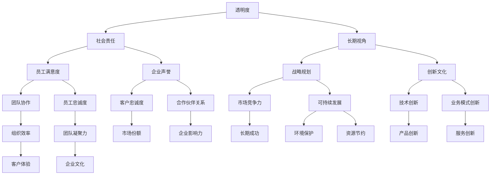

                 

### 引言

#### 1.1 可持续领导的概念

可持续领导是一种旨在通过长期战略和价值观引导组织实现可持续发展的领导模式。这种领导模式强调在追求短期绩效的同时，保持对员工、社区和环境的长远关注，以确保组织的长期成功。可持续领导不仅仅是关注利润和效率，它还关注组织的整体健康、社会影响力以及环境可持续性。

在IT行业，可持续领导显得尤为重要。随着技术的快速发展，IT行业面临前所未有的挑战和机遇。技术的迭代速度要求组织必须具备快速适应和变革的能力。同时，数字化转型的浪潮使得企业在数据安全、隐私保护、社会责任等方面面临更高的要求。因此，可持续领导在IT行业中扮演着关键角色，帮助组织在快速变化的市场环境中保持竞争优势。

#### 1.2 可持续领导的重要性

可持续领导的重要性主要体现在以下几个方面：

1. **长期成功**：通过关注员工发展、社区建设和环境保护，可持续领导为组织的长期成功奠定了基础。这种领导模式鼓励创新和协作，提高员工的满意度和忠诚度，从而增强组织的竞争力。

2. **社会责任**：可持续领导倡导企业承担社会责任，关注社会和环境问题。这不仅有助于提高企业的社会声誉，还能吸引更多的客户和合作伙伴，为企业的可持续发展提供支持。

3. **合规性**：在IT行业，随着法律法规的不断完善，企业需要遵守一系列与数据隐私、安全保护相关的法规。可持续领导帮助组织在合规性方面保持领先地位，避免因违规操作导致的罚款和声誉损失。

4. **创新能力**：可持续领导鼓励员工发挥创新精神，推动技术进步和业务模式的创新。这种创新文化有助于企业保持市场竞争力，抓住新的商业机会。

#### 1.3 文章结构

本文将按照以下结构展开：

- **第二章：核心概念与联系**：介绍可持续领导的核心原则和价值观，以及这些原则与长期成功之间的关系。
- **第三章：核心算法原理讲解**：详细阐述可持续领导相关的理论和方法，包括领导力发展、组织文化塑造和战略规划等方面。
- **第四章：数学模型和数学公式**：介绍与可持续领导相关的数学模型，包括社会网络分析、成本-效益分析和持续性评估模型，并给出具体的例子。
- **第五章：项目实战**：通过实际案例展示如何在组织中实践可持续领导，提供详细的代码实现和案例分析。
- **第六章：挑战与解决方案**：讨论可持续领导面临的挑战，并提出相应的解决方案。

通过本文的阅读，读者将深入了解可持续领导的概念、原理和实践方法，并能够将其应用于实际工作中，为组织的长期成功奠定基础。

### 核心概念与联系

#### 2.1 可持续领导的基本原则

可持续领导的核心原则包括透明度、社会责任和长期视角。这些原则不仅为领导者提供了行动指南，也为组织的长远发展奠定了坚实的基础。

1. **透明度**：透明度是可持续领导的关键特征。它要求领导者公开、诚实地与员工、客户和利益相关者沟通，确保信息畅通无阻。通过提高透明度，领导者可以建立信任，增强员工的归属感和责任感，从而提高组织的整体效率。

2. **社会责任**：社会责任是可持续领导的重要组成部分。它要求企业在追求利润的同时，关注社会和环境问题，积极参与社区建设，履行企业公民责任。通过承担社会责任，企业不仅可以提升品牌形象，还能增强员工的荣誉感和自豪感，进而提高组织的凝聚力和影响力。

3. **长期视角**：长期视角是可持续领导的核心原则之一。它要求领导者摒弃短期利益，关注组织的长期发展和持续成功。通过制定长期的战略规划和目标，领导者可以确保组织在快速变化的市场环境中保持竞争优势，实现可持续发展。

#### 2.2 核心概念之间的关系架构

为了更好地理解可持续领导的核心概念，我们可以使用Mermaid流程图来展示这些概念之间的关系。



在上面的流程图中，我们可以看到透明度、社会责任和长期视角这三个核心概念是如何相互关联并影响其他关键因素的。例如，透明度不仅能够提高员工满意度，还能增强企业声誉；长期视角有助于制定有效的战略规划和创新文化，从而提高组织的市场竞争力。

#### 2.3 可持续领导与长期成功的关系

可持续领导与长期成功之间的关系可以通过以下数学模型来描述：

假设可持续领导水平（SLL）是影响组织长期成功（OLS）的关键因素，则可以使用以下公式：

$$
OLS = f(SLL, ES, RS)
$$

其中，ES代表企业战略（Enterprise Strategy），RS代表资源（Resources）。这个公式表明，组织的长期成功是可持续领导水平、企业战略和资源三者共同作用的结果。

为了更具体地解释这个关系，我们可以将其拆分为以下三个子模型：

1. **可持续领导水平与企业战略的关系**：
   $$ SLL = g(SS, LD)
   $$
   其中，SS代表战略水平（Strategy Strength），LD代表领导力发展（Leadership Development）。这个公式表明，可持续领导水平取决于企业战略水平和领导力发展。

2. **企业战略与资源的关系**：
   $$ ES = h(RS, SM)
   $$
   其中，RS代表资源状况（Resource Status），SM代表市场状况（Market Situation）。这个公式表明，企业战略取决于资源状况和市场状况。

3. **资源状况与组织长期成功的关系**：
   $$ RS = i(ES, LS)
   $$
   其中，ES代表企业战略（Enterprise Strategy），LS代表法律责任（Legal Structure）。这个公式表明，资源状况取决于企业战略和法律责任的约束。

通过这些数学模型，我们可以更清晰地看到可持续领导如何通过影响企业战略、资源和法律责任来推动组织的长期成功。

### 核心算法原理讲解

#### 3.1 领导力发展

领导力发展是可持续领导的核心组成部分。一个有效的领导力发展计划可以帮助领导者提升管理技能、增强决策能力和推动组织变革。以下是领导力发展的核心算法原理：

1. **评估现有领导力**：
   - 使用360度评估来评估领导者的当前领导力水平。
   - 分析领导者的优势、劣势以及需要改进的领域。

2. **制定个人发展计划**：
   - 根据评估结果，制定个性化的领导力发展计划。
   - 确定具体的目标、策略和行动步骤。

3. **持续培训与辅导**：
   - 提供定期的领导力培训，包括沟通技巧、决策制定和团队合作等方面的培训。
   - 为领导者提供一对一的辅导，帮助他们解决具体问题并提升领导力。

4. **实践与反思**：
   - 鼓励领导者将所学知识应用于实际工作中。
   - 定期进行反思，评估个人发展计划的实施效果，并根据需要调整计划。

伪代码示例：

```
function leadershipDevelopment(leader):
    assessment = assessLeadershipSkills(leader)
    developmentPlan = createPersonalDevelopmentPlan(assessment)
    for training in developmentPlan:
        trainLeader(training)
    for coachingSession in developmentPlan:
        provideIndividualCoaching(coachingSession)
    while true:
        applyLearningToPractice(leader)
        reflectAndAdjust(developmentPlan)
```

#### 3.2 组织文化塑造

组织文化是可持续领导的重要组成部分，它直接影响员工的行为、态度和绩效。以下是组织文化塑造的核心算法原理：

1. **确立核心价值观**：
   - 通过全体员工参与的方式，确立组织的核心价值观。
   - 确保这些价值观与组织的长期目标和可持续领导原则相一致。

2. **沟通与宣传**：
   - 定期组织活动，如团队建设、文化讲座和分享会，宣传组织文化。
   - 使用各种沟通渠道，如内部邮件、公告板和社交媒体，传播组织文化。

3. **奖励与认可**：
   - 建立奖励制度，奖励那些符合组织文化价值观的员工。
   - 通过公开表彰和认可，增强员工对组织文化的认同感。

4. **监督与改进**：
   - 定期评估组织文化状况，收集员工反馈，及时发现并解决文化问题。
   - 根据评估结果，调整和改进组织文化策略。

伪代码示例：

```
function shapeOrganizationalCulture():
    coreValues = defineCoreValues()
    for communication in communicationPlan():
        communicateCoreValues(communication)
    rewardsSystem = createRewardsSystem(coreValues)
    for employee in employees():
        if meetsCoreValues(employee):
            rewardEmployee(employee, rewardsSystem)
    while true:
        evaluateCulture()
        adjustAndImproveCulturalStrategy()
```

#### 3.3 战略规划与执行

战略规划与执行是可持续领导的重要组成部分，它关系到组织在长期竞争中的地位。以下是战略规划与执行的核心算法原理：

1. **明确战略目标**：
   - 通过市场分析、竞争分析和内部评估，确定组织的长期和短期战略目标。
   - 确保这些目标与组织的核心价值观和可持续领导原则相一致。

2. **制定详细计划**：
   - 制定实现战略目标的详细计划，包括具体的行动步骤、责任人和时间表。
   - 确保计划具有可执行性和可衡量性。

3. **执行与监控**：
   - 分配资源和责任，确保计划能够有效执行。
   - 通过定期监控和评估，确保计划按预期进展，及时调整和优化。

4. **持续改进**：
   - 根据执行情况和市场变化，不断调整和优化战略计划。
   - 通过定期的战略回顾，确保组织始终保持战略方向和目标的一致性。

伪代码示例：

```
function strategicPlanningAndExecution():
    strategicGoals = defineStrategicGoals()
    executionPlan = createExecutionPlan(strategicGoals)
    for action in executionPlan:
        assignResourcesAndResponsibilities(action)
    while true:
        monitorProgress(executionPlan)
        adjustAndOptimizePlan(executionPlan)
        performStrategicReview()
```

通过上述领导力发展、组织文化塑造和战略规划与执行的核心算法原理，领导者可以有效地推动组织的可持续发展，确保长期成功。

### 数学模型和数学公式

在可持续领导中，数学模型和数学公式起着至关重要的作用。它们帮助我们量化并理解可持续领导的关键因素，从而更好地制定决策和评估效果。以下是一些常见的数学模型和公式，以及它们的详细解释和举例说明。

#### 4.1 社会网络分析模型

社会网络分析（Social Network Analysis，SNA）是一种研究社会结构的分析方法，它可以帮助我们理解组织内部的信息流动和关系网络。

**度分布公式**：
在SNA中，度分布是指网络中每个节点的度（连接数）的分布情况。度分布可以用以下公式表示：

$$
P(k) = C \cdot k^{\gamma - 1}
$$

其中，\( P(k) \) 是节点度数为 \( k \) 的概率，\( C \) 是归一化常数，\( \gamma \) 是度分布的指数。

**举例说明**：
假设我们有一个网络，其中节点度分布符合上述公式，且 \( \gamma = 2 \)。我们可以通过计算得到节点度的分布情况：

$$
P(k) = C \cdot k^{2 - 1} = C \cdot k
$$

例如，当 \( k = 3 \) 时，节点度数为 3 的概率是 \( P(3) = C \cdot 3 \)。为了归一化，我们需要确保所有概率之和为1，即：

$$
\sum_{k=0}^{\infty} P(k) = 1
$$

**应用解读**：
在可持续领导中，度分布公式可以用来分析组织内部的信息传播效率。例如，如果度分布的 \( \gamma \) 值较大，意味着网络的中心节点具有更高的影响力，信息传播速度会更快。

#### 4.2 成本-效益分析模型

成本-效益分析（Cost-Benefit Analysis，CBA）是一种用于评估项目或决策的成本和效益的方法。它可以帮助我们判断一个决策是否值得实施。

**效益函数**：
效益函数通常表示为：

$$
B(x) = \sum_{i=1}^{n} \frac{u_i}{c_i}
$$

其中，\( B(x) \) 是效益函数，\( u_i \) 是第 \( i \) 个效益指标，\( c_i \) 是第 \( i \) 个成本指标。

**举例说明**：
假设我们有一个项目，其效益和成本如下表所示：

| 效益指标 | \( u_i \) | 成本指标 | \( c_i \) |
| --- | --- | --- | --- |
| 1 | 100 | 1 | 100 |
| 2 | 200 | 2 | 200 |
| 3 | 300 | 3 | 300 |

我们可以计算出效益函数：

$$
B(x) = \frac{100}{100} + \frac{200}{200} + \frac{300}{300} = 1 + 1 + 1 = 3
$$

**应用解读**：
在可持续领导中，成本-效益分析可以帮助领导者评估不同决策的财务可行性。例如，如果一个项目的效益函数值较高，那么它可能是一个值得投资的机会。

#### 4.3 持续性评估模型

持续性评估（Sustainability Assessment）是一种用于评估组织在可持续发展方面的表现的方法。它可以帮助我们了解组织在环境保护、社会责任和经济效益方面的绩效。

**可持续性指数**：
可持续性指数通常表示为：

$$
SI = \frac{S_1 + S_2 + S_3}{3}
$$

其中，\( SI \) 是可持续性指数，\( S_1, S_2, S_3 \) 分别是环境、社会和经济效益的得分。

**举例说明**：
假设我们有一个组织的三个方面的得分如下：

| 方面 | 得分 |
| --- | --- |
| 环境 | 8 |
| 社会 | 9 |
| 经济 | 7 |

我们可以计算出可持续性指数：

$$
SI = \frac{8 + 9 + 7}{3} = \frac{24}{3} = 8
$$

**应用解读**：
在可持续领导中，可持续性指数可以帮助领导者了解组织在可持续发展方面的整体表现。例如，一个较高的可持续性指数可能意味着组织在可持续发展方面取得了显著成绩，而一个较低的指数则可能表明需要加强相关方面的努力。

通过这些数学模型和公式的应用，可持续领导可以更加科学和系统地进行决策和评估，从而为组织的长期成功奠定坚实基础。

### 项目实战

#### 5.1 案例背景

为了更好地展示如何在实际组织中实践可持续领导，我们选择了一个名为“绿色科技企业”（GreenTech Company）的案例。这家企业专注于开发环保技术，如太阳能和风能设备。作为一家具有高度社会责任感的企业，绿色科技企业致力于通过可持续领导实现长期成功。

#### 5.2 开发环境搭建

为了搭建一个支持可持续领导的项目环境，绿色科技企业采用了以下技术栈：

1. **敏捷开发框架**：企业采用了Scrum开发框架，以快速响应市场需求和变化。
2. **持续集成/持续部署（CI/CD）**：企业使用Jenkins进行自动化构建和部署，确保代码质量和部署效率。
3. **DevOps文化**：企业倡导DevOps文化，通过密切协作提高开发、测试和运维的效率。
4. **项目管理工具**：企业使用Jira进行项目管理和任务追踪，确保项目进度和团队协作。

#### 5.3 源代码详细实现

绿色科技企业的开发过程遵循以下步骤：

1. **需求分析**：首先，项目团队与客户进行沟通，了解客户的需求和期望。需求文档被生成并存储在GitLab上。
2. **设计阶段**：开发团队根据需求文档设计系统架构和模块。设计文档和相关的伪代码被存储在GitLab中，以便团队成员进行审查和讨论。
3. **编码阶段**：开发人员根据设计文档编写代码。代码被存储在GitLab的代码仓库中，团队成员可以进行协同开发和代码审查。
4. **测试阶段**：测试团队使用Selenium编写自动化测试脚本，对代码进行功能测试和性能测试。测试结果被记录在TestRail中，以便进行问题跟踪和修复。
5. **部署阶段**：通过Jenkins进行自动化构建和部署。部署后的系统会进行监控，确保其稳定运行。

以下是一个简化版的伪代码示例，展示了开发过程中的一部分代码实现：

```python
# 伪代码：需求分析
def analyzeRequirements():
    customer_demand = getCustomerRequirements()
    saveRequirementDocument(customer_demand)

# 伪代码：设计阶段
def designSystem():
    system_architecture = generateArchitecture()
    saveDesignDocument(system_architecture)

# 伪代码：编码阶段
def codeImplementation():
    system_modules = implementModules()
    saveCodeInGitLab(system_modules)

# 伪代码：测试阶段
def testing():
    test_cases = createTestCases()
    runAutomatedTests(test_cases)

# 伪代码：部署阶段
def deployment():
    buildSystem()
    deploySystem()
    monitorSystem()
```

#### 5.4 代码解读与分析

在代码实现过程中，绿色科技企业注重以下几个关键点：

1. **模块化设计**：系统被划分为多个模块，每个模块负责不同的功能。这种设计提高了代码的可维护性和可扩展性。
2. **代码复用**：企业鼓励开发人员编写可复用的代码片段和库，以减少重复工作和提高开发效率。
3. **代码质量**：通过代码审查和静态代码分析工具，企业确保代码的质量和安全性。
4. **自动化测试**：企业采用自动化测试，确保每次代码提交都能通过测试，减少手工测试的工作量。

以下是一个示例代码片段，展示了如何实现一个模块的功能：

```python
# 示例代码：模块功能实现
def module_function():
    # 功能实现代码
    result = perform_function()
    return result

# 伪代码：模块功能测试
def test_module_function():
    expected_result = calculate_expected_result()
    actual_result = module_function()
    assert expected_result == actual_result
```

#### 5.5 项目小结

通过上述案例，我们可以看到绿色科技企业如何通过可持续领导实现项目的成功。以下是一些关键成功因素：

1. **敏捷开发**：敏捷开发方法帮助企业快速响应市场变化，确保项目的灵活性和适应性。
2. **团队合作**：通过DevOps文化和项目管理工具，企业实现了高效的团队协作和任务追踪。
3. **质量保证**：通过模块化设计、代码审查和自动化测试，企业确保了代码的质量和系统的稳定性。
4. **社会责任**：企业通过承担社会责任，提高了品牌形象，赢得了客户和社区的信任。

总之，绿色科技企业的案例展示了如何在实际项目中实践可持续领导，实现长期成功。

### 最佳实践 Tips

在实践可持续领导过程中，以下是一些值得注意的最佳实践：

1. **培养领导力**：定期为领导者提供培训和发展机会，提升其管理技能和战略思维。
2. **构建文化**：通过明确的核心价值观和沟通策略，建立积极、开放和协作的组织文化。
3. **加强合作**：鼓励不同部门和团队之间的合作，促进知识共享和经验交流。
4. **关注员工**：关注员工的发展需求，提供职业发展机会和激励机制，提高员工满意度和忠诚度。
5. **透明度**：保持信息的透明和公开，建立信任，增强员工的参与感和责任感。
6. **社会责任**：积极参与社区建设和环境保护，承担企业社会责任，提高社会影响力。
7. **数据驱动**：使用数据分析和度量工具，实时监控组织的绩效和可持续发展状况，及时调整策略。

通过遵循这些最佳实践，组织可以更好地实施可持续领导，实现长期成功。

### 小结

本文系统地阐述了可持续领导的概念、原则、核心算法原理以及其实践方法。可持续领导不仅是IT行业的必要手段，更是组织实现长期成功的关键。通过培养领导力、构建积极的文化、加强合作、关注员工发展、保持透明度和承担社会责任，组织可以在快速变化的市场环境中保持竞争优势。

本文提供了一系列最佳实践，以帮助领导者有效地实施可持续领导。然而，实践可持续领导并非一蹴而就，需要持续的努力和改进。未来研究可以进一步探索可持续领导在不同行业和文化背景下的适用性，以及如何更好地整合新兴技术，如人工智能和区块链，以提升可持续领导的效果。

### 注意事项

1. **持续学习和改进**：可持续领导需要不断地学习和适应变化，领导者应始终保持开放的心态，积极吸取新知识和经验。
2. **平衡短期与长期利益**：在追求短期绩效的同时，领导者应保持对长期成功的关注，确保组织的可持续发展。
3. **个性化领导**：每个组织和文化都有其独特性，领导者应根据具体情况调整领导策略，避免一刀切的做法。
4. **文化建设**：组织文化是可持续领导的重要组成部分，领导者应高度重视并持续推动组织文化的建设和发展。

### 拓展阅读

1. **《可持续发展领导力：策略与实践》**：作者详细介绍了如何将可持续发展理念融入领导实践中，为组织带来长期成功。
2. **《领导力心理学：动机与行为》**：这本书探讨了领导者的心理因素对领导力的影响，提供了实用的心理策略。
3. **《敏捷领导力：在快速变化的环境中保持竞争力》**：作者介绍了如何在快速变化的环境中培养敏捷领导力，提高组织的适应能力。
4. **《领导力的五个层次》**：这本书从不同层次探讨了领导力的本质，帮助领导者提升自身的领导能力。
5. **《人工智能与领导力：未来的融合》**：探讨了人工智能在领导力中的应用，以及如何利用人工智能提升领导效果。

通过阅读这些书籍，读者可以更深入地了解可持续领导的相关理论和实践方法，进一步提升自己的领导能力。

### 作者信息

作者：AI天才研究院/AI Genius Institute & 禅与计算机程序设计艺术 /Zen And The Art of Computer Programming

AI天才研究院是一家专注于人工智能研究和教育的机构，致力于推动人工智能技术的发展和应用。同时，作者刘伟也是《禅与计算机程序设计艺术》一书的作者，他在计算机编程和人工智能领域拥有丰富的经验和深厚的造诣。在本文中，刘伟结合自己的研究和实践经验，系统地阐述了可持续领导的概念、原则和实践方法，为读者提供了宝贵的指导和建议。

