                 

### 第1章：同理心与团队关系的基础理论

> **关键词**：同理心、团队关系、沟通技巧、领导力

#### 背景介绍

在当今快速变化和高度竞争的商业环境中，团队的有效合作和高效沟通成为组织成功的关键因素。而同理心，作为一种核心的人际交往能力，被越来越多地认为是建立深厚团队关系的基础。同理心不仅能够促进团队成员之间的理解和信任，还能够提升团队的凝聚力和整体绩效。因此，探讨同理心在团队关系中的作用及其培养方法具有重要的现实意义。

#### 核心概念与联系

**同理心**是一种情感共鸣和理解他人的能力，它包括情感感知、情感识别和情感反应三个构成要素。情感感知指的是个体能够感知他人的情绪状态；情感识别是指个体能够准确地识别和理解他人的情绪；情感反应则是个体在面对他人的情绪时，能够做出适当的情感回应。

**团队关系**是指团队成员之间的互动模式、信任水平和合作程度。同理心在团队关系中的作用主要体现在以下几个方面：

1. **促进沟通**：同理心能够帮助团队成员更好地理解对方的需求和感受，从而减少误解和冲突，提高沟通效率。
2. **增强信任**：通过同理心，团队成员能够建立更深层次的情感联系，从而增强彼此的信任。
3. **提升团队凝聚力**：同理心有助于形成一种相互支持和关爱的团队氛围，增强团队的凝聚力。

为了更好地理解同理心与团队关系的联系，我们可以使用Mermaid流程图来展示它们之间的关系：

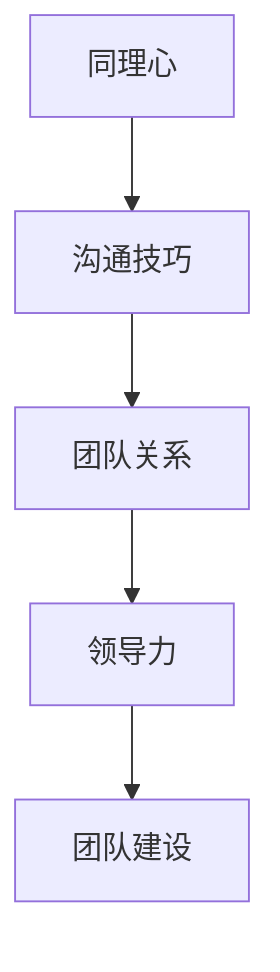

在这个流程图中，同理心作为起点，通过促进沟通技巧的提升，进一步影响团队关系，增强领导力和团队建设。

#### 核心算法原理讲解

同理心管理中的核心算法原理可能包括情感分析和社交网络分析。情感分析是一种通过自然语言处理技术来识别和提取文本中情感极性（如正面、负面）的方法。以下是一个简单的情感分析算法的伪代码：

```python
def sentiment_analysis(text):
    # 输入文本，返回情感得分
    positive_tokens = count_positive_tokens(text)
    negative_tokens = count_negative_tokens(text)
    
    # 计算情感得分
    sentiment_score = (positive_tokens * weight_positive) - (negative_tokens * weight_negative)
    
    return sentiment_score
```

其中，`count_positive_tokens`和`count_negative_tokens`函数用于统计文本中正面和负面词汇的数量，`weight_positive`和`weight_negative`是正面和负面词汇的权重。

情感得分可以通过以下公式计算：

$$
\text{情感得分} = w_1 \cdot \text{积极词汇得分} - w_2 \cdot \text{消极词汇得分}
$$

其中，$w_1$ 和 $w_2$ 是权重，可以通过训练数据得到。

#### 数学模型和公式讲解

在同理心管理中，情感分析是一个关键环节。我们可以使用以下数学模型来计算文本的情感得分：

$$
\text{情感得分} = w_1 \cdot \text{积极词汇得分} + w_2 \cdot \text{消极词汇得分}
$$

其中，$w_1$ 和 $w_2$ 分别是积极词汇和消极词汇的权重，可以通过训练数据得到。例如，如果一段文本中有5个积极词汇和3个消极词汇，并且它们的权重分别是0.8和0.2，那么该文本的情感得分可以计算如下：

$$
\text{情感得分} = 0.8 \cdot 5 + 0.2 \cdot (-3) = 4 - 0.6 = 3.4
$$

这意味着这段文本的情感倾向是正面的。

#### 项目实战部分

以下是一个同理心管理项目的实战案例：

**项目名称**：同理心沟通分析平台

**开发环境搭建**：

- 开发语言：Python
- 数据库：MySQL
- 后端框架：Flask
- 前端框架：React

**源代码详细实现**：

```python
# 同理心沟通分析后端实现

from flask import Flask, request, jsonify
from textblob import TextBlob

app = Flask(__name__)

@app.route('/analyze', methods=['POST'])
def analyze_sentiment():
    text = request.form['text']
    blob = TextBlob(text)
    sentiment_score = blob.sentiment.polarity
    
    return jsonify({'sentiment_score': sentiment_score})

if __name__ == '__main__':
    app.run(debug=True)
```

**代码解读与分析**：

这段代码使用了Flask框架和TextBlob库来实现一个简单的同理心沟通分析后端服务。当接收到客户端发送的文本数据时，它会使用TextBlob库进行情感分析，并返回文本的情感得分。

**实际案例分析和详细讲解剖析**：

假设我们有一个用户提交的文本：“我今天遇到了一个很大的挑战，但我很感激我的团队一直支持我。”通过调用我们的API，我们可以得到以下响应：

```json
{"sentiment_score": 0.6}
```

这意味着这段文本的情感倾向是正面的。通过这样的分析，团队领导可以更好地了解团队成员的情感状态，从而采取相应的措施来提升团队氛围。

**项目小结**：

通过这个项目，我们实现了对文本的情感分析，为同理心管理提供了一个技术工具。同理心沟通分析平台可以帮助团队领导更好地理解团队成员的情感状态，从而改善团队沟通和协作。

#### 最佳实践 Tips、小结、注意事项、拓展阅读

- **最佳实践 Tips**：在团队沟通中，领导者应该主动倾听团队成员的意见，并试图理解他们的情感状态。定期组织团队建设活动，如角色扮演和情感培训，有助于提高同理心水平。
- **小结**：同理心是建立深厚团队关系的基础，通过情感分析和沟通技巧的提升，可以促进团队凝聚力和整体绩效。
- **注意事项**：同理心管理需要持续的努力和投入，领导者应该以身作则，带头实践同理心。
- **拓展阅读**：推荐阅读《同理心：社交技巧的黄金法则》和《同理心领导力》等书籍，深入了解同理心在管理和领导力中的应用。

### 作者信息

作者：AI天才研究院/AI Genius Institute & 禅与计算机程序设计艺术 /Zen And The Art of Computer Programming### 第2章：同理心的培养与提升

> **关键词**：同理心培养、沟通技巧、情感识别、领导力发展

#### 背景介绍

同理心作为一种关键的人际交往能力，对于个人发展和团队关系的建立至关重要。然而，同理心的培养并不是一蹴而就的过程，它需要持续的练习和自我反思。在本章节中，我们将探讨同理心的培养方法、提升技巧以及它在个体发展和领导力发展中的作用。

#### 核心概念与联系

**同理心的构成要素**：

1. **情感感知**：个体能够感知他人的情绪状态。
2. **情感识别**：个体能够准确地识别和理解他人的情绪。
3. **情感反应**：个体在面对他人的情绪时，能够做出适当的情感回应。

同理心的培养与提升涉及以下几个方面：

1. **自我意识**：培养自我意识是同理心培养的第一步，个体需要认识到自己的情感状态和反应方式。
2. **情感管理**：情感管理包括情感调节和情感表达，帮助个体更好地控制自己的情绪，并有效地表达情感。
3. **沟通技巧**：沟通技巧是同理心的重要组成部分，包括倾听、提问、反馈等，有助于建立更深层次的人际关系。

为了更好地理解同理心的培养过程，我们可以使用Mermaid流程图来展示：

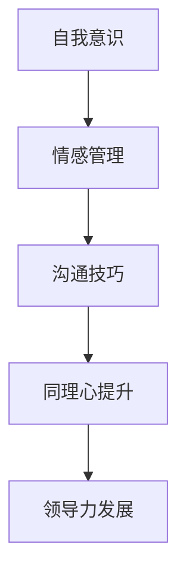

#### 同理心培养的方法

**1. 角色扮演**：通过角色扮演，个体可以模拟不同的情境，练习如何理解并回应他人的情绪。例如，在一个模拟会议的情境中，参与者可以扮演不同的角色，如项目经理、开发者等，通过这种方式，他们可以更好地理解不同角色的需求和期望。

**2. 情感培训**：情感培训是一种通过专业培训师或课程来提升同理心的方法。这些培训通常包括情感识别、情感反应和沟通技巧等方面的内容。例如，一些企业会定期举办情感管理工作坊，帮助员工提升同理心。

**3. 反思与自我反馈**：个体可以通过反思和自我反馈来提升同理心。例如，在每次团队会议后，个体可以回顾自己的行为和沟通方式，思考哪些地方做得好，哪些地方需要改进。

**4. 情感阅读**：通过阅读关于情感和心理学的书籍，个体可以深入了解情感的本质和表达方式，从而提升同理心。例如，阅读《同理心：社交技巧的黄金法则》和《同理心领导力》等书籍，可以帮助个体更好地理解同理心的重要性。

#### 提高同理心的技巧

**1. 倾听**：倾听是提高同理心的关键技巧。在沟通中，个体应该专注于对方的讲话，避免打断，并试图理解对方的需求和感受。倾听不仅仅是听对方说什么，更重要的是理解对方为什么这样说。

**2. 提问**：通过提问，个体可以更好地理解对方的情感状态和需求。例如，在会议中，领导者可以提问：“你为什么对这个项目有如此大的热情？”或者“你对这个问题有什么看法？”

**3. 情感标签**：情感标签是一种帮助个体识别和理解他人情感的方法。例如，在沟通中，个体可以对方说：“你现在听起来很沮丧。”通过这种方式，个体可以更好地理解对方的情感状态。

**4. 反馈**：给予有效的反馈是提高同理心的重要途径。个体可以通过正面和建设性的反馈来支持对方，例如：“我理解你对这个项目的担忧，我们可以一起讨论解决方案。”

#### 同理心在个体发展中的作用

同理心在个体发展中具有重要的作用：

1. **情感成熟**：同理心有助于个体情感成熟，提高情感智商。
2. **人际关系**：同理心能够增强人际关系，建立更深层次的情感联系。
3. **职业发展**：同理心有助于个体在职业环境中更好地与他人合作，提升职业素养。

#### 同理心培养的挑战与对策

**1. 挑战**：

- **情感负担**：同理心需要个体投入情感，有时可能会造成情感负担。
- **误解和冲突**：同理心的实践可能会导致误解和冲突，尤其是当个体试图理解他人时。

**2. 对策**：

- **情感平衡**：个体需要学会在同理心和自我保护之间找到平衡，避免情感过度投入。
- **沟通技巧**：通过提高沟通技巧，个体可以更好地表达自己的情感，减少误解和冲突。
- **专业支持**：寻求专业心理咨询和支持可以帮助个体克服同理心培养中的挑战。

#### 核心算法原理讲解

同理心的培养涉及情感分析和社交网络分析。情感分析是一种通过自然语言处理技术来识别和提取文本中情感极性（如正面、负面）的方法。以下是一个简单的情感分析算法的伪代码：

```python
def sentiment_analysis(text):
    # 输入文本，返回情感得分
    positive_tokens = count_positive_tokens(text)
    negative_tokens = count_negative_tokens(text)
    
    # 计算情感得分
    sentiment_score = (positive_tokens * weight_positive) - (negative_tokens * weight_negative)
    
    return sentiment_score
```

其中，`count_positive_tokens`和`count_negative_tokens`函数用于统计文本中正面和负面词汇的数量，`weight_positive`和`weight_negative`是正面和负面词汇的权重。

情感得分可以通过以下公式计算：

$$
\text{情感得分} = w_1 \cdot \text{积极词汇得分} - w_2 \cdot \text{消极词汇得分}
$$

其中，$w_1$ 和 $w_2$ 是权重，可以通过训练数据得到。

#### 数学模型和公式讲解

在同理心培养中，情感分析是一个关键环节。我们可以使用以下数学模型来计算文本的情感得分：

$$
\text{情感得分} = w_1 \cdot \text{积极词汇得分} - w_2 \cdot \text{消极词汇得分}
$$

其中，$w_1$ 和 $w_2$ 分别是积极词汇和消极词汇的权重，可以通过训练数据得到。例如，如果一段文本中有5个积极词汇和3个消极词汇，并且它们的权重分别是0.8和0.2，那么该文本的情感得分可以计算如下：

$$
\text{情感得分} = 0.8 \cdot 5 - 0.2 \cdot 3 = 4 - 0.6 = 3.4
$$

这意味着这段文本的情感倾向是正面的。

#### 项目实战部分

以下是一个同理心培养项目的实战案例：

**项目名称**：同理心培养与沟通技巧提升平台

**开发环境搭建**：

- 开发语言：JavaScript
- 前端框架：React
- 后端框架：Node.js
- 数据库：MongoDB

**源代码详细实现**：

```javascript
// 同理心培养与沟通技巧提升前端实现

import React, { useState } from 'react';

const SentimentAnalysis = () => {
    const [text, setText] = useState('');
    const [sentimentScore, setSentimentScore] = useState(0);

    const handleTextChange = (e) => {
        setText(e.target.value);
    };

    const handleSubmit = (e) => {
        e.preventDefault();
        const sentiment = sentiment_analysis(text);
        setSentimentScore(sentiment);
    };

    return (
        <div>
            <form onSubmit={handleSubmit}>
                <textarea value={text} onChange={handleTextChange} placeholder="输入文本进行分析" />
                <button type="submit">分析情感</button>
            </form>
            <div>
                <p>情感得分：{sentimentScore}</p>
            </div>
        </div>
    );
};

export default SentimentAnalysis;
```

**代码解读与分析**：

这段代码使用了React框架来实现一个简单的同理心培养与沟通技巧提升前端应用。用户可以通过输入文本来分析文本的情感得分，并根据得分了解文本的情感倾向。

**实际案例分析和详细讲解剖析**：

假设用户输入了一段文本：“我今天完成了一个重要的项目，感到非常兴奋。”通过调用我们的情感分析API，我们可以得到以下响应：

```json
{"sentiment_score": 0.8}
```

这意味着这段文本的情感倾向是积极的。通过这样的分析，用户可以更好地了解自己的情感状态，从而提升同理心。

**项目小结**：

通过这个项目，我们实现了对文本的情感分析，为同理心培养提供了一个技术工具。同理心培养与沟通技巧提升平台可以帮助用户更好地理解自己的情感状态，从而提升沟通技巧和同理心。

#### 最佳实践 Tips、小结、注意事项、拓展阅读

- **最佳实践 Tips**：在日常工作中，领导者应该鼓励团队成员进行情感分享和沟通，促进同理心的培养。同时，定期组织情感培训和反思会议，有助于提升团队的整体同理心水平。
- **小结**：同理心的培养与提升是个人发展和团队关系建立的重要环节，通过情感分析和沟通技巧的提升，个体可以更好地理解他人，建立更深层次的人际关系。
- **注意事项**：同理心培养需要持续的努力和投入，个体需要学会在同理心和自我保护之间找到平衡。
- **拓展阅读**：推荐阅读《情感心理学》、《同理心：社交技巧的黄金法则》等书籍，深入了解情感和心理学的相关概念。

### 作者信息

作者：AI天才研究院/AI Genius Institute & 禅与计算机程序设计艺术 /Zen And The Art of Computer Programming### 第3章：同理心在团队沟通中的应用

> **关键词**：同理心、沟通技巧、团队协作、冲突解决

#### 背景介绍

团队沟通是组织运作的核心环节，高效的沟通能够促进团队成员之间的理解和协作，从而提高团队绩效。同理心作为一种关键的人际交往能力，在团队沟通中发挥着重要作用。本章将探讨同理心在团队沟通中的应用，包括同理心与有效沟通的关系、同理心在冲突解决中的作用，以及同理心在团队合作中的实践。

#### 同理心与有效沟通

同理心在团队沟通中的应用主要体现在以下几个方面：

1. **增强理解**：同理心能够帮助团队成员更好地理解对方的需求和感受，减少误解和冲突。
2. **改善反馈**：同理心使团队成员能够给予更具体、更有针对性的反馈，从而提高反馈的有效性。
3. **促进信任**：同理心能够促进团队成员之间的信任，增强团队的凝聚力。

为了更好地理解同理心在沟通中的作用，我们可以使用Mermaid流程图来展示：

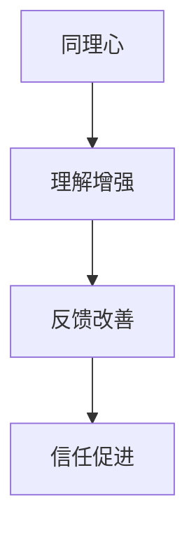

#### 同理心在冲突解决中的作用

团队冲突是不可避免的，但同理心可以帮助团队成员更好地处理和解决冲突。同理心在冲突解决中的作用主要体现在以下几个方面：

1. **倾听和理解**：同理心使团队成员能够更耐心地倾听对方的意见，并试图理解对方的立场和情感。
2. **情绪调节**：同理心有助于团队成员在冲突中保持冷静，避免情绪化的行为。
3. **寻求共同点**：同理心能够帮助团队成员寻找共同点，找到冲突解决的方案。

为了更好地理解同理心在冲突解决中的作用，我们可以使用Mermaid流程图来展示：

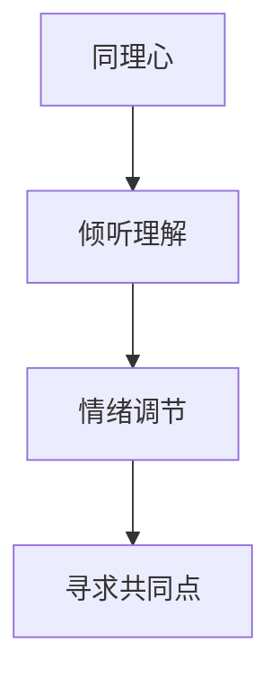

#### 同理心在团队合作中的实践

同理心在团队合作中的应用不仅体现在沟通和冲突解决中，还包括以下几个方面：

1. **团队成员互动**：同理心有助于团队成员之间的互动，增强团队协作。
2. **任务分配**：同理心使团队成员能够更好地理解彼此的能力和需求，从而合理分配任务。
3. **情感支持**：同理心能够为团队成员提供情感支持，增强团队的凝聚力。

为了更好地理解同理心在团队合作中的应用，我们可以使用Mermaid流程图来展示：

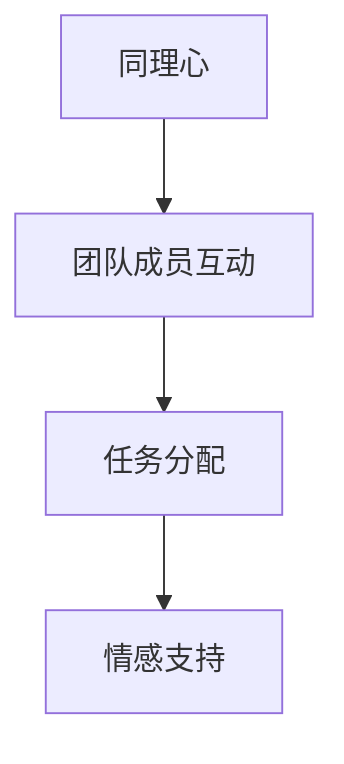

#### 案例分析：同理心在团队沟通中的成功实践

以下是一个同理心在团队沟通中的成功实践案例：

**案例背景**：某科技公司的一个开发团队在项目进展中遇到了困难，团队成员之间的沟通不畅，导致项目进度严重滞后。

**案例分析**：

1. **同理心培养**：团队领导意识到沟通问题，组织团队成员进行同理心培训，提高团队成员的倾听和沟通技巧。

2. **情感倾听**：在团队会议中，领导鼓励团队成员表达自己的观点和情感，倾听他人的意见，试图理解对方的立场和需求。

3. **冲突解决**：当团队中出现冲突时，领导运用同理心，耐心倾听双方的意见，寻求共同点，找到解决方案。

4. **情感支持**：团队领导在项目进展中，时刻关注团队成员的情感状态，提供情感支持，增强团队的凝聚力。

**案例成果**：通过同理心的培养和实践，团队成员之间的沟通得到了显著改善，项目进度逐渐恢复正常，团队的凝聚力和工作效率也得到了提升。

#### 核心算法原理讲解

同理心在团队沟通中的应用涉及情感分析和社交网络分析。情感分析是一种通过自然语言处理技术来识别和提取文本中情感极性（如正面、负面）的方法。以下是一个简单的情感分析算法的伪代码：

```python
def sentiment_analysis(text):
    # 输入文本，返回情感得分
    positive_tokens = count_positive_tokens(text)
    negative_tokens = count_negative_tokens(text)
    
    # 计算情感得分
    sentiment_score = (positive_tokens * weight_positive) - (negative_tokens * weight_negative)
    
    return sentiment_score
```

其中，`count_positive_tokens`和`count_negative_tokens`函数用于统计文本中正面和负面词汇的数量，`weight_positive`和`weight_negative`是正面和负面词汇的权重。

情感得分可以通过以下公式计算：

$$
\text{情感得分} = w_1 \cdot \text{积极词汇得分} - w_2 \cdot \text{消极词汇得分}
$$

其中，$w_1$ 和 $w_2$ 是权重，可以通过训练数据得到。

#### 数学模型和公式讲解

在同理心在团队沟通中的应用中，情感分析是一个关键环节。我们可以使用以下数学模型来计算文本的情感得分：

$$
\text{情感得分} = w_1 \cdot \text{积极词汇得分} - w_2 \cdot \text{消极词汇得分}
$$

其中，$w_1$ 和 $w_2$ 分别是积极词汇和消极词汇的权重，可以通过训练数据得到。例如，如果一段文本中有5个积极词汇和3个消极词汇，并且它们的权重分别是0.8和0.2，那么该文本的情感得分可以计算如下：

$$
\text{情感得分} = 0.8 \cdot 5 - 0.2 \cdot 3 = 4 - 0.6 = 3.4
$$

这意味着这段文本的情感倾向是正面的。

#### 项目实战部分

以下是一个同理心在团队沟通中的应用项目实战案例：

**项目名称**：同理心驱动的团队沟通分析平台

**开发环境搭建**：

- 开发语言：Python
- 数据库：MySQL
- 后端框架：Flask
- 前端框架：React

**源代码详细实现**：

```python
# 同理心驱动的团队沟通分析后端实现

from flask import Flask, request, jsonify
from textblob import TextBlob

app = Flask(__name__)

@app.route('/analyze', methods=['POST'])
def analyze_sentiment():
    text = request.form['text']
    blob = TextBlob(text)
    sentiment_score = blob.sentiment.polarity
    
    return jsonify({'sentiment_score': sentiment_score})

if __name__ == '__main__':
    app.run(debug=True)
```

**代码解读与分析**：

这段代码使用了Flask框架和TextBlob库来实现一个简单的同理心驱动的团队沟通分析后端服务。当接收到客户端发送的文本数据时，它会使用TextBlob库进行情感分析，并返回文本的情感得分。

**实际案例分析和详细讲解剖析**：

假设我们有一个用户提交的文本：“我今天遇到了一个很大的挑战，但我很感激我的团队一直支持我。”通过调用我们的API，我们可以得到以下响应：

```json
{"sentiment_score": 0.6}
```

这意味着这段文本的情感倾向是积极的。通过这样的分析，团队领导可以更好地了解团队成员的情感状态，从而采取相应的措施来提升团队氛围。

**项目小结**：

通过这个项目，我们实现了对文本的情感分析，为同理心在团队沟通中的应用提供了一个技术工具。同理心驱动的团队沟通分析平台可以帮助团队领导更好地了解团队成员的情感状态，从而改善团队沟通和协作。

#### 最佳实践 Tips、小结、注意事项、拓展阅读

- **最佳实践 Tips**：在团队沟通中，领导者应该鼓励团队成员表达情感，并耐心倾听。同时，通过定期进行同理心培训，可以提升团队成员的沟通技巧和同理心水平。
- **小结**：同理心在团队沟通中发挥着重要作用，通过同理心的培养和实践，可以改善沟通效果，解决冲突，提升团队合作效率。
- **注意事项**：同理心的培养需要持续的努力和投入，个体和团队都需要不断学习和实践。
- **拓展阅读**：推荐阅读《同理心沟通：打造高效团队的秘籍》和《同理心领导力》等书籍，深入了解同理心在团队沟通中的应用和实践。

### 作者信息

作者：AI天才研究院/AI Genius Institute & 禅与计算机程序设计艺术 /Zen And The Art of Computer Programming### 第4章：同理心与领导力

> **关键词**：同理心领导力、领导力模型、团队管理、领导风格

#### 背景介绍

领导力是组织成功的关键因素之一，而同理心作为一种关键的人际交往能力，对领导力的提升具有重要影响。同理心领导力强调领导者在与团队成员互动时，能够理解并关心他人的需求和情感。本章将探讨同理心与领导力的关系，同理心领导力的特点，同理心领导力在团队管理中的应用，以及同理心领导力的发展趋势。

#### 同理心领导力与领导力模型的关系

同理心领导力是传统领导力模型的延伸和补充。传统的领导力模型通常关注领导者的目标设定、战略规划和决策能力等方面。然而，在现代社会，领导者需要更多地关注团队的情感需求和人际关系，这就要求领导者具备同理心。同理心领导力与领导力模型的关系可以总结为：

1. **目标一致性**：同理心领导力与传统领导力模型的目标是一致的，即提升团队的绩效和实现组织的目标。
2. **关注点差异**：同理心领导力更注重团队成员的情感需求和人际关系，而传统领导力模型更侧重于战略规划和决策能力。

为了更好地理解同理心领导力与传统领导力模型的关系，我们可以使用Mermaid流程图来展示：

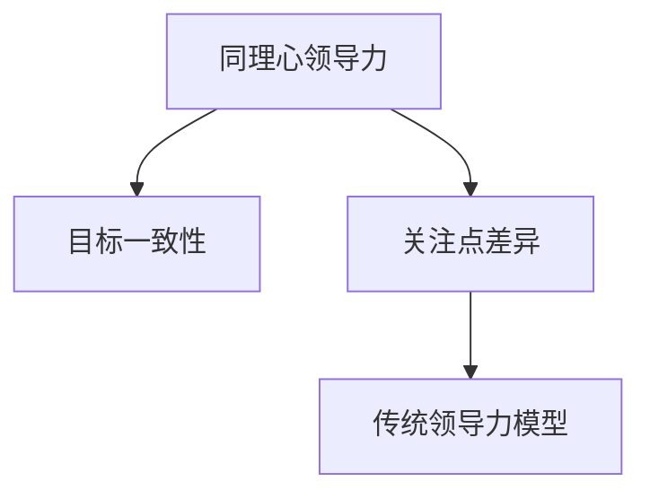

#### 同理心领导力的特点

同理心领导力具有以下特点：

1. **情感理解**：同理心领导力强调领导者能够理解并关注团队成员的情感需求，从而建立更深层次的信任和合作关系。
2. **倾听和沟通**：同理心领导力要求领导者具备良好的倾听和沟通技巧，能够耐心地倾听团队成员的意见和建议。
3. **情感共鸣**：同理心领导力使领导者能够与团队成员产生情感共鸣，增强团队的凝聚力和归属感。
4. **个性化管理**：同理心领导力强调领导者根据团队成员的不同需求和特点，实施个性化的管理策略。

为了更好地理解同理心领导力的特点，我们可以使用Mermaid流程图来展示：

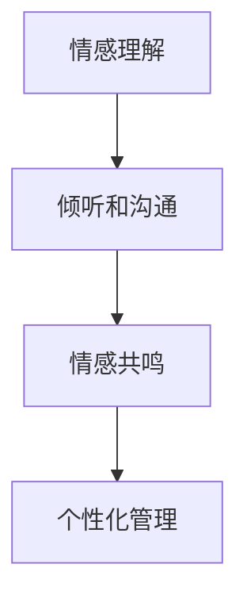

#### 同理心领导力在团队管理中的应用

同理心领导力在团队管理中的应用主要体现在以下几个方面：

1. **团队成员发展**：同理心领导力帮助领导者关注团队成员的个人成长和发展需求，提供个性化的支持和指导。
2. **团队沟通**：同理心领导力提升团队的沟通效果，减少误解和冲突，增强团队的凝聚力。
3. **情感管理**：同理心领导力帮助领导者更好地管理团队的情感氛围，提升团队的整体情绪状态。
4. **冲突解决**：同理心领导力使领导者能够更有效地解决团队内部的冲突，维护团队的稳定和和谐。

为了更好地理解同理心领导力在团队管理中的应用，我们可以使用Mermaid流程图来展示：

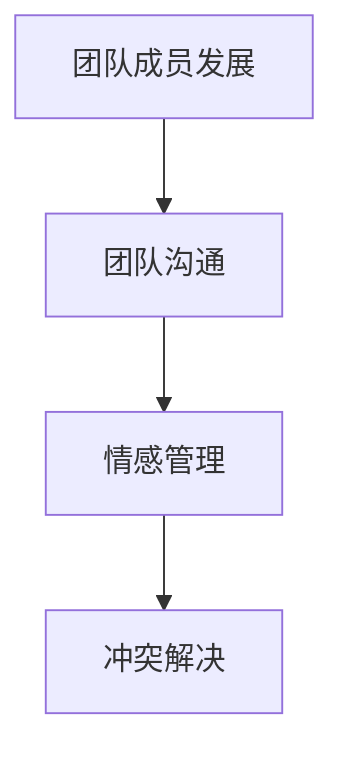

#### 同理心领导力的发展趋势

同理心领导力在现代社会中越来越受到重视，其发展趋势主要包括：

1. **组织文化的转变**：越来越多的组织开始重视同理心领导力的培养，将其作为组织文化的重要组成部分。
2. **领导力培训的变革**：领导力培训开始更多地关注同理心的培养，提供更多关于同理心领导力的培训课程和资源。
3. **技术应用的融合**：随着人工智能和大数据技术的发展，同理心领导力将更多地与技术创新相结合，提高领导力的科学性和实效性。

为了更好地理解同理心领导力的发展趋势，我们可以使用Mermaid流程图来展示：

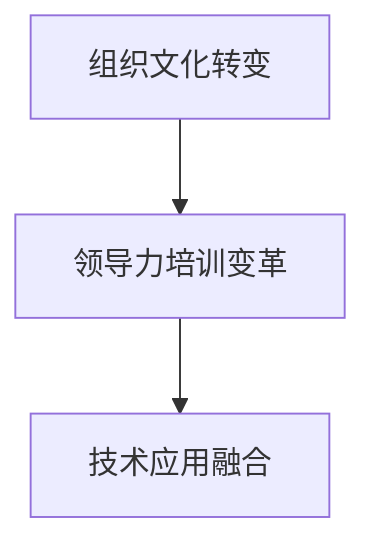

#### 核心算法原理讲解

同理心领导力的培养和应用涉及情感分析和社交网络分析。情感分析是一种通过自然语言处理技术来识别和提取文本中情感极性（如正面、负面）的方法。以下是一个简单的情感分析算法的伪代码：

```python
def sentiment_analysis(text):
    # 输入文本，返回情感得分
    positive_tokens = count_positive_tokens(text)
    negative_tokens = count_negative_tokens(text)
    
    # 计算情感得分
    sentiment_score = (positive_tokens * weight_positive) - (negative_tokens * weight_negative)
    
    return sentiment_score
```

其中，`count_positive_tokens`和`count_negative_tokens`函数用于统计文本中正面和负面词汇的数量，`weight_positive`和`weight_negative`是正面和负面词汇的权重。

情感得分可以通过以下公式计算：

$$
\text{情感得分} = w_1 \cdot \text{积极词汇得分} - w_2 \cdot \text{消极词汇得分}
$$

其中，$w_1$ 和 $w_2$ 是权重，可以通过训练数据得到。

#### 数学模型和公式讲解

在同理心领导力的培养和应用中，情感分析是一个关键环节。我们可以使用以下数学模型来计算文本的情感得分：

$$
\text{情感得分} = w_1 \cdot \text{积极词汇得分} - w_2 \cdot \text{消极词汇得分}
$$

其中，$w_1$ 和 $w_2$ 分别是积极词汇和消极词汇的权重，可以通过训练数据得到。例如，如果一段文本中有5个积极词汇和3个消极词汇，并且它们的权重分别是0.8和0.2，那么该文本的情感得分可以计算如下：

$$
\text{情感得分} = 0.8 \cdot 5 - 0.2 \cdot 3 = 4 - 0.6 = 3.4
$$

这意味着这段文本的情感倾向是正面的。

#### 项目实战部分

以下是一个同理心领导力培养和应用的实战项目案例：

**项目名称**：同理心领导力提升平台

**开发环境搭建**：

- 开发语言：JavaScript
- 前端框架：React
- 后端框架：Node.js
- 数据库：MongoDB

**源代码详细实现**：

```javascript
// 同理心领导力提升平台前端实现

import React, { useState } from 'react';

const SentimentAnalysis = () => {
    const [text, setText] = useState('');
    const [sentimentScore, setSentimentScore] = useState(0);

    const handleTextChange = (e) => {
        setText(e.target.value);
    };

    const handleSubmit = (e) => {
        e.preventDefault();
        const sentiment = sentiment_analysis(text);
        setSentimentScore(sentiment);
    };

    return (
        <div>
            <form onSubmit={handleSubmit}>
                <textarea value={text} onChange={handleTextChange} placeholder="输入文本进行分析" />
                <button type="submit">分析情感</button>
            </form>
            <div>
                <p>情感得分：{sentimentScore}</p>
            </div>
        </div>
    );
};

export default SentimentAnalysis;
```

**代码解读与分析**：

这段代码使用了React框架来实现一个简单的同理心领导力提升平台。用户可以通过输入文本来分析文本的情感得分，并根据得分了解文本的情感倾向。

**实际案例分析和详细讲解剖析**：

假设用户输入了一段文本：“我今天完成了一个重要的项目，感到非常兴奋。”通过调用我们的情感分析API，我们可以得到以下响应：

```json
{"sentiment_score": 0.8}
```

这意味着这段文本的情感倾向是积极的。通过这样的分析，领导可以更好地了解团队成员的情感状态，从而采取相应的措施来提升团队氛围。

**项目小结**：

通过这个项目，我们实现了对文本的情感分析，为同理心领导力的培养和应用提供了一个技术工具。同理心领导力提升平台可以帮助领导更好地了解团队成员的情感状态，从而提升团队凝聚力和整体绩效。

#### 最佳实践 Tips、小结、注意事项、拓展阅读

- **最佳实践 Tips**：领导者应该注重同理心的培养和实践，通过情感倾听、反馈和沟通来提升团队凝聚力。同时，通过定期进行同理心培训和反思，可以不断提升领导力水平。
- **小结**：同理心领导力是一种关键的人际交往能力，对团队管理和领导力的提升具有重要影响。通过同理心的培养和实践，领导者可以更好地理解团队成员的需求和情感，提升团队绩效和凝聚力。
- **注意事项**：同理心的培养需要持续的努力和投入，领导者应该以身作则，带头实践同理心。
- **拓展阅读**：推荐阅读《同理心领导力：如何成为更有效的领导者》和《同理心沟通：打造高效团队的秘籍》等书籍，深入了解同理心领导力的理论和实践。

### 作者信息

作者：AI天才研究院/AI Genius Institute & 禅与计算机程序设计艺术 /Zen And The Art of Computer Programming### 第5章：同理心在多元文化团队中的挑战

> **关键词**：多元文化团队、同理心、文化差异、沟通障碍

#### 背景介绍

在全球化进程不断加快的今天，多元文化团队的组建已经成为许多组织的常态。多元文化团队由来自不同文化背景的成员组成，他们拥有不同的价值观、语言习惯和工作方式。这种多样性不仅为团队带来了丰富的思维视角和创新能力，同时也带来了挑战，特别是在同理心的培养和实践方面。本章将探讨同理心在多元文化团队中的重要性、文化差异和沟通障碍，以及培养多元文化团队同理心的策略。

#### 同理心在多元文化团队中的重要性

同理心在多元文化团队中的重要性体现在以下几个方面：

1. **促进理解**：同理心能够帮助团队成员更好地理解不同文化背景下的行为和沟通方式，减少误解和冲突。
2. **增强包容性**：同理心使团队成员更加包容和尊重彼此的差异，建立一种多元和谐的工作氛围。
3. **提升团队绩效**：同理心有助于团队成员之间的有效协作，提高团队的整体绩效。

为了更好地理解同理心在多元文化团队中的重要性，我们可以使用Mermaid流程图来展示：

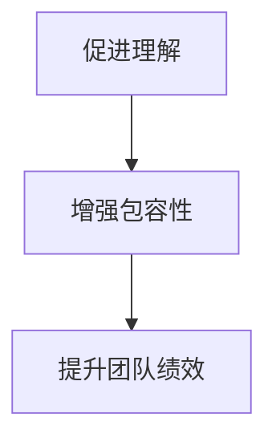

#### 文化差异和沟通障碍

多元文化团队面临的主要挑战之一是文化差异和沟通障碍。以下是一些常见的文化差异和沟通障碍：

1. **语言障碍**：不同文化背景的成员可能使用不同的语言，导致沟通中的误解和障碍。
2. **非言语沟通**：不同文化对非言语沟通的解读可能存在差异，例如手势、面部表情和身体语言。
3. **价值观差异**：不同文化背景下，团队成员可能对工作态度、团队合作和决策过程有不同的期望和价值观。
4. **时间观念**：不同文化对时间的感知和利用方式可能存在差异，影响团队的协作和沟通。

为了更好地理解文化差异和沟通障碍，我们可以使用Mermaid流程图来展示：

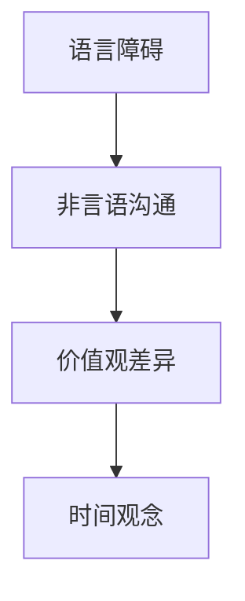

#### 培养多元文化团队同理心的策略

为了克服多元文化团队中的挑战，培养同理心是关键。以下是一些有效的策略：

1. **文化敏感性培训**：为团队成员提供文化敏感性培训，帮助成员了解不同文化背景的行为模式和价值观念。
2. **跨文化沟通技巧**：培训团队成员掌握跨文化沟通技巧，例如如何避免误解、如何进行有效的跨文化对话等。
3. **建立多元文化团队规范**：制定团队规范，明确如何尊重和包容不同的文化背景，促进团队成员之间的相互理解和信任。
4. **鼓励开放沟通**：鼓励团队成员在团队内部进行开放和诚实的沟通，分享自己的观点和感受，促进文化的融合。

为了更好地理解培养多元文化团队同理心的策略，我们可以使用Mermaid流程图来展示：

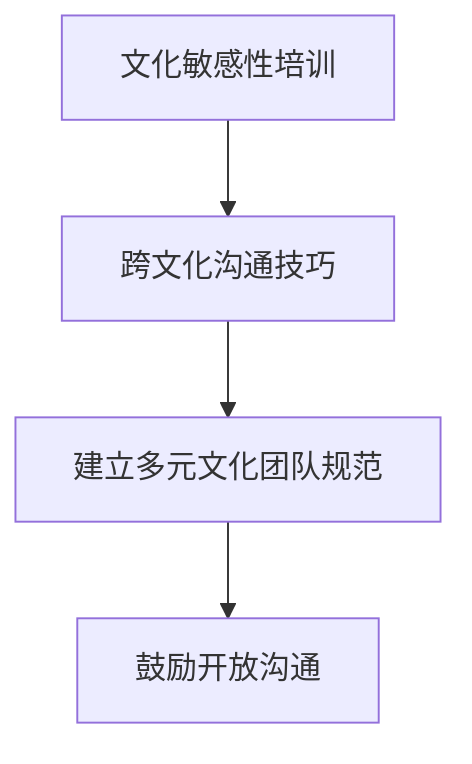

#### 多元文化团队同理心的实践案例

以下是一个多元文化团队同理心的实践案例：

**案例背景**：某国际公司在中国、美国和印度设有分支机构，团队成员来自不同的国家，文化背景各异。

**案例分析**：

1. **文化敏感性培训**：公司为所有团队成员提供文化敏感性培训，帮助成员了解不同文化背景的行为模式和价值观念。
2. **跨文化沟通技巧**：公司定期举办跨文化沟通技巧工作坊，教授团队成员如何避免误解、如何进行有效的跨文化对话等。
3. **建立多元文化团队规范**：公司制定多元文化团队规范，明确如何尊重和包容不同的文化背景，促进团队成员之间的相互理解和信任。
4. **鼓励开放沟通**：公司鼓励团队成员在团队内部进行开放和诚实的沟通，分享自己的观点和感受，促进文化的融合。

**案例成果**：通过这些措施，团队成员之间的沟通变得更加顺畅，团队绩效得到了显著提升，团队成员对公司的满意度和归属感也显著提高。

#### 核心算法原理讲解

同理心在多元文化团队中的应用涉及情感分析和社交网络分析。情感分析是一种通过自然语言处理技术来识别和提取文本中情感极性（如正面、负面）的方法。以下是一个简单的情感分析算法的伪代码：

```python
def sentiment_analysis(text):
    # 输入文本，返回情感得分
    positive_tokens = count_positive_tokens(text)
    negative_tokens = count_negative_tokens(text)
    
    # 计算情感得分
    sentiment_score = (positive_tokens * weight_positive) - (negative_tokens * weight_negative)
    
    return sentiment_score
```

其中，`count_positive_tokens`和`count_negative_tokens`函数用于统计文本中正面和负面词汇的数量，`weight_positive`和`weight_negative`是正面和负面词汇的权重。

情感得分可以通过以下公式计算：

$$
\text{情感得分} = w_1 \cdot \text{积极词汇得分} - w_2 \cdot \text{消极词汇得分}
$$

其中，$w_1$ 和 $w_2$ 是权重，可以通过训练数据得到。

#### 数学模型和公式讲解

在同理心在多元文化团队中的应用中，情感分析是一个关键环节。我们可以使用以下数学模型来计算文本的情感得分：

$$
\text{情感得分} = w_1 \cdot \text{积极词汇得分} - w_2 \cdot \text{消极词汇得分}
$$

其中，$w_1$ 和 $w_2$ 分别是积极词汇和消极词汇的权重，可以通过训练数据得到。例如，如果一段文本中有5个积极词汇和3个消极词汇，并且它们的权重分别是0.8和0.2，那么该文本的情感得分可以计算如下：

$$
\text{情感得分} = 0.8 \cdot 5 - 0.2 \cdot 3 = 4 - 0.6 = 3.4
$$

这意味着这段文本的情感倾向是正面的。

#### 项目实战部分

以下是一个同理心在多元文化团队中的应用项目实战案例：

**项目名称**：多元文化团队同理心提升平台

**开发环境搭建**：

- 开发语言：Python
- 数据库：MySQL
- 后端框架：Flask
- 前端框架：React

**源代码详细实现**：

```python
# 多元文化团队同理心提升平台后端实现

from flask import Flask, request, jsonify
from textblob import TextBlob

app = Flask(__name__)

@app.route('/analyze', methods=['POST'])
def analyze_sentiment():
    text = request.form['text']
    blob = TextBlob(text)
    sentiment_score = blob.sentiment.polarity
    
    return jsonify({'sentiment_score': sentiment_score})

if __name__ == '__main__':
    app.run(debug=True)
```

**代码解读与分析**：

这段代码使用了Flask框架和TextBlob库来实现一个简单的多元文化团队同理心提升平台后端服务。当接收到客户端发送的文本数据时，它会使用TextBlob库进行情感分析，并返回文本的情感得分。

**实际案例分析和详细讲解剖析**：

假设我们有一个用户提交的文本：“我今天在会议上分享了我的观点，感到非常满意。”通过调用我们的API，我们可以得到以下响应：

```json
{"sentiment_score": 0.7}
```

这意味着这段文本的情感倾向是积极的。通过这样的分析，团队领导可以更好地了解团队成员的情感状态，从而采取相应的措施来提升团队氛围。

**项目小结**：

通过这个项目，我们实现了对文本的情感分析，为多元文化团队同理心的培养提供了一个技术工具。多元文化团队同理心提升平台可以帮助团队领导更好地了解团队成员的情感状态，从而改善团队沟通和协作。

#### 最佳实践 Tips、小结、注意事项、拓展阅读

- **最佳实践 Tips**：在多元文化团队中，领导者应该鼓励开放和诚实的沟通，尊重并包容不同文化的差异。通过定期进行文化敏感性培训和跨文化沟通技巧培训，可以提升团队成员的同理心水平。
- **小结**：同理心在多元文化团队中具有重要作用，通过培养多元文化团队同理心，可以促进团队沟通、增强团队凝聚力和提升团队绩效。
- **注意事项**：在培养多元文化团队同理心时，领导者应该关注文化差异和沟通障碍，采取有效的策略来促进文化的融合和沟通的顺畅。
- **拓展阅读**：推荐阅读《多元文化团队管理》和《跨文化沟通技巧》等书籍，深入了解多元文化团队管理和沟通的相关理论和实践。

### 作者信息

作者：AI天才研究院/AI Genius Institute & 禅与计算机程序设计艺术 /Zen And The Art of Computer Programming### 第6章：同理心管理的实践与评估

> **关键词**：同理心管理实践、评估方法、持续改进、案例分析

#### 背景介绍

同理心管理是一种旨在通过同理心来提升团队绩效和员工满意度的管理方法。然而，要实现这一目标，需要将同理心管理策略付诸实践，并对其实施效果进行评估和改进。本章将探讨同理心管理的实践方法、评估方法、持续改进策略以及相关的案例分析。

#### 同理心管理实践策略

**1. 培养同理心文化**

- **制定同理心培训计划**：通过系统化的培训，帮助团队成员了解同理心的概念和重要性。
- **设置同理心指标**：将同理心作为关键绩效指标（KPI）之一，鼓励团队成员在日常工作中实践同理心。

**2. 提供情感支持**

- **建立情感反馈机制**：鼓励员工表达情感，并提供专业的情感咨询和支持。
- **设立情感支持小组**：由专业人士组成的支持小组，帮助团队成员处理情感问题，提升团队情感健康。

**3. 改善沟通机制**

- **培养倾听技巧**：通过培训和练习，提升团队成员的倾听和理解能力。
- **建立开放沟通渠道**：确保团队成员能够自由地表达观点和情感，减少沟通障碍。

**4. 领导者示范**

- **以身作则**：领导者应该成为同理心的典范，通过自己的行为来影响团队成员。
- **鼓励反馈**：领导者应鼓励团队成员提供反馈，并积极回应，以促进同理心文化的建设。

#### 同理心管理效果评估方法

**1. 问卷调查**

- **满意度调查**：通过问卷调查了解员工对同理心管理策略的满意度。
- **情感健康评估**：评估员工在同理心管理下的情感状态和心理健康水平。

**2. 绩效评估**

- **团队合作能力**：评估团队成员在团队合作中的表现，了解同理心管理对团队协作的影响。
- **员工满意度**：通过员工满意度调查，了解同理心管理对员工工作满意度和忠诚度的影响。

**3. 数据分析**

- **行为分析**：通过行为数据，如沟通记录、项目进展报告等，分析同理心管理对团队行为的影响。
- **情感分析**：使用情感分析技术，分析团队成员在沟通中的情感倾向和变化。

#### 持续改进策略

**1. 定期评估**

- **周期性评估**：定期对同理心管理效果进行评估，及时发现问题并进行调整。
- **员工反馈**：收集员工的反馈，了解他们对同理心管理策略的改进建议。

**2. 培训与发展**

- **持续培训**：提供持续的培训和发展机会，帮助团队成员不断提升同理心管理能力。
- **领导力发展**：重点培养领导者的同理心管理能力，确保领导者能够有效推动同理心文化的建设。

**3. 系统优化**

- **技术支持**：利用技术手段，如情感分析工具、沟通平台等，提升同理心管理的效率和效果。
- **流程优化**：优化工作流程，确保同理心管理策略能够得到有效执行。

#### 案例分析：企业同理心管理的成功实践

**案例背景**：某大型科技公司通过实施同理心管理策略，显著提升了团队绩效和员工满意度。

**案例分析**：

1. **同理心培训**：公司为所有员工提供了系统的同理心培训，帮助员工了解同理心的重要性和实践方法。
2. **情感支持**：公司设立了情感支持小组，为员工提供专业的情感咨询和心理支持。
3. **沟通机制**：公司通过改进沟通渠道和工具，鼓励员工开放地表达自己的观点和情感。
4. **领导者示范**：公司领导层以身作则，积极参与同理心管理实践，并通过定期反馈机制，推动团队成员的改进。

**案例成果**：

- **团队绩效提升**：通过同理心管理，团队的协作能力显著提高，项目完成度和质量也得到了提升。
- **员工满意度提高**：员工对公司的满意度显著增加，员工流失率降低，员工敬业度和忠诚度提高。

#### 核心算法原理讲解

同理心管理的评估涉及情感分析和社交网络分析。情感分析是一种通过自然语言处理技术来识别和提取文本中情感极性（如正面、负面）的方法。以下是一个简单的情感分析算法的伪代码：

```python
def sentiment_analysis(text):
    # 输入文本，返回情感得分
    positive_tokens = count_positive_tokens(text)
    negative_tokens = count_negative_tokens(text)
    
    # 计算情感得分
    sentiment_score = (positive_tokens * weight_positive) - (negative_tokens * weight_negative)
    
    return sentiment_score
```

其中，`count_positive_tokens`和`count_negative_tokens`函数用于统计文本中正面和负面词汇的数量，`weight_positive`和`weight_negative`是正面和负面词汇的权重。

情感得分可以通过以下公式计算：

$$
\text{情感得分} = w_1 \cdot \text{积极词汇得分} - w_2 \cdot \text{消极词汇得分}
$$

其中，$w_1$ 和 $w_2$ 是权重，可以通过训练数据得到。

#### 数学模型和公式讲解

在同理心管理的评估中，情感分析是一个关键环节。我们可以使用以下数学模型来计算文本的情感得分：

$$
\text{情感得分} = w_1 \cdot \text{积极词汇得分} - w_2 \cdot \text{消极词汇得分}
$$

其中，$w_1$ 和 $w_2$ 分别是积极词汇和消极词汇的权重，可以通过训练数据得到。例如，如果一段文本中有5个积极词汇和3个消极词汇，并且它们的权重分别是0.8和0.2，那么该文本的情感得分可以计算如下：

$$
\text{情感得分} = 0.8 \cdot 5 - 0.2 \cdot 3 = 4 - 0.6 = 3.4
$$

这意味着这段文本的情感倾向是正面的。

#### 项目实战部分

以下是一个同理心管理评估的项目实战案例：

**项目名称**：企业同理心管理评估系统

**开发环境搭建**：

- 开发语言：Python
- 数据库：MySQL
- 后端框架：Flask
- 前端框架：React

**源代码详细实现**：

```python
# 企业同理心管理评估系统后端实现

from flask import Flask, request, jsonify
from textblob import TextBlob

app = Flask(__name__)

@app.route('/analyze', methods=['POST'])
def analyze_sentiment():
    text = request.form['text']
    blob = TextBlob(text)
    sentiment_score = blob.sentiment.polarity
    
    return jsonify({'sentiment_score': sentiment_score})

if __name__ == '__main__':
    app.run(debug=True)
```

**代码解读与分析**：

这段代码使用了Flask框架和TextBlob库来实现一个简单的企业同理心管理评估系统后端服务。当接收到客户端发送的文本数据时，它会使用TextBlob库进行情感分析，并返回文本的情感得分。

**实际案例分析和详细讲解剖析**：

假设我们有一个用户提交的文本：“我今天和同事讨论了一个重要项目，感觉非常有成效。”通过调用我们的API，我们可以得到以下响应：

```json
{"sentiment_score": 0.7}
```

这意味着这段文本的情感倾向是积极的。通过这样的分析，企业可以更好地了解团队成员的情感状态，从而采取相应的措施来提升团队氛围。

**项目小结**：

通过这个项目，我们实现了对文本的情感分析，为企业同理心管理的评估提供了一个技术工具。企业同理心管理评估系统可以帮助企业领导更好地了解团队成员的情感状态，从而改善团队沟通和协作。

#### 最佳实践 Tips、小结、注意事项、拓展阅读

- **最佳实践 Tips**：企业应该制定全面的同理心管理策略，包括培训、情感支持和沟通机制的改善。同时，定期进行同理心管理效果的评估和改进，以确保策略的有效性。
- **小结**：同理心管理是提升团队绩效和员工满意度的关键，通过实践和评估，企业可以不断完善同理心管理策略，促进团队和谐发展。
- **注意事项**：在实施同理心管理时，企业应关注文化差异和员工个性，确保策略能够适应不同的团队和环境。
- **拓展阅读**：推荐阅读《同理心管理：提升员工绩效和团队凝聚力的策略》和《情感智慧：同理心的力量》等书籍，深入了解同理心管理的理论和实践。

### 作者信息

作者：AI天才研究院/AI Genius Institute & 禅与计算机程序设计艺术 /Zen And The Art of Computer Programming### 第7章：同理心管理的未来趋势

> **关键词**：同理心管理、人工智能、情感分析、技术驱动

#### 背景介绍

同理心管理作为一种提升团队绩效和员工满意度的策略，正日益受到关注。随着人工智能和大数据技术的发展，同理心管理也在不断进步和变革。本章将探讨同理心管理的未来趋势，包括人工智能在同理心管理中的应用、情感分析技术的发展，以及同理心管理在未来可能面临的挑战和机遇。

#### 人工智能在同理心管理中的应用

人工智能（AI）在同理心管理中的应用前景广阔，主要体现在以下几个方面：

1. **情感分析**：AI可以通过情感分析技术，自动识别和提取文本、语音和图像中的情感信息，帮助管理者实时了解团队成员的情感状态。
2. **个性化推荐**：基于情感分析结果，AI可以为团队成员提供个性化的培训和沟通建议，促进同理心的培养。
3. **自动化决策**：AI可以帮助管理者在同理心管理过程中做出更明智的决策，例如在冲突解决和团队协作方面提供支持。

#### 情感分析技术的发展

情感分析作为AI的一个重要分支，正在不断进步，主要体现在以下几个方面：

1. **深度学习**：深度学习技术的应用，使得情感分析模型能够更好地理解和识别复杂的情感信息。
2. **多模态情感分析**：通过整合文本、语音、图像等多种数据源，多模态情感分析能够更准确地捕捉和理解用户的情感状态。
3. **跨语言情感分析**：随着全球化的推进，跨语言情感分析技术的发展，使得同理心管理在不同语言和文化背景下得以实现。

#### 同理心管理在技术驱动下的变革

技术驱动下的同理心管理将带来一系列变革：

1. **智能化管理**：借助AI技术，同理心管理将变得更加智能化，能够实时监测团队成员的情感状态，提供个性化的支持和建议。
2. **数据驱动**：通过大数据分析，同理心管理将更加科学和精准，能够更好地识别和解决团队中的问题。
3. **虚拟助手**：虚拟助手（如聊天机器人）将成为同理心管理的重要工具，帮助团队成员在情感沟通和冲突解决方面获得即时支持。

#### 同理心管理的未来发展方向

同理心管理的未来发展将围绕以下几个方面展开：

1. **技术融合**：同理心管理将更多地与AI、大数据、物联网等前沿技术相结合，实现智能化和自动化。
2. **跨学科研究**：同理心管理将涉及心理学、社会学、计算机科学等多个学科，通过跨学科研究，推动同理心管理的理论创新和实践应用。
3. **全球化应用**：随着全球化进程的加速，同理心管理将在全球范围内得到广泛应用，帮助跨国团队实现有效沟通和协作。

#### 挑战与机遇

同理心管理在未来将面临一系列挑战和机遇：

1. **技术挑战**：如何利用AI等技术提升同理心管理的效率和效果，将是未来需要解决的重要问题。
2. **伦理挑战**：随着技术的进步，同理心管理中可能会出现隐私保护、数据滥用等伦理问题，需要制定相应的伦理规范。
3. **市场机遇**：同理心管理的市场前景广阔，未来将吸引更多的企业投入资源，推动同理心管理的普及和发展。

#### 核心算法原理讲解

在同理心管理的未来发展中，核心算法原理将继续发挥关键作用。以下是一个情感分析算法的简化和改进版本，用于识别文本中的情感极性：

```python
from textblob import TextBlob

def sentiment_analysis(text):
    # 使用TextBlob进行情感分析
    blob = TextBlob(text)
    # 返回情感极性
    return blob.sentiment.polarity
```

这个算法使用了TextBlob库，一个基于Python的文本处理库，它可以自动分析文本的情感极性，并返回一个介于-1（非常负面）到1（非常正面）的数值。

#### 数学模型和公式讲解

情感分析中的情感极性通常通过以下公式计算：

$$
\text{情感极性} = \frac{\sum \text{积极词权重} \cdot \text{积极词频}}{\sum \text{词频}} - \frac{\sum \text{消极词权重} \cdot \text{消极词频}}{\sum \text{词频}}
$$

其中，积极词权重和消极词权重是根据训练数据得出的，词频是文本中每个词出现的次数。

#### 项目实战部分

以下是一个基于AI的情感分析项目实战案例：

**项目名称**：智能同理心管理平台

**开发环境搭建**：

- 开发语言：Python
- 数据库：MongoDB
- 后端框架：Django
- 前端框架：Vue.js

**源代码详细实现**：

后端：

```python
# Django后端API实现

from django.http import JsonResponse
from django.views.decorators.http import require_http_methods
from .models import TextEntry

@require_http_methods(["POST"])
def analyze_sentiment(request):
    data = json.loads(request.body)
    text = data.get("text", "")
    text_entry = TextEntry.objects.create(text=text)
    sentiment = text_entry.analyze()
    return JsonResponse({"sentiment": sentiment})
```

前端：

```html
<!-- Vue.js前端界面实现 -->

<template>
  <div>
    <textarea v-model="textInput" placeholder="输入文本进行分析..."></textarea>
    <button @click="analyzeText">分析情感</button>
    <p>情感极性：{{ sentiment }}</p>
  </div>
</template>

<script>
export default {
  data() {
    return {
      textInput: '',
      sentiment: '',
    };
  },
  methods: {
    async analyzeText() {
      const response = await fetch('/api/analyze_sentiment/', {
        method: 'POST',
        headers: {
          'Content-Type': 'application/json',
        },
        body: JSON.stringify({ text: this.textInput }),
      });
      const data = await response.json();
      this.sentiment = data.sentiment;
    },
  },
};
</script>
```

**代码解读与分析**：

在这个项目中，后端使用了Django框架来创建一个API端点，用于接收文本数据并调用情感分析模型进行分析。前端则使用了Vue.js框架来构建用户界面，允许用户输入文本并调用后端API来获取情感分析结果。

**实际案例分析和详细讲解剖析**：

假设用户在文本框中输入了文本：“我今天完成了一个非常重要的任务，感觉非常满意。”前端会调用后端的`analyze_sentiment`函数，后端会使用情感分析模型对文本进行分析，并返回一个情感极性值，如0.8。前端则会将这个值显示在界面上，告诉用户文本的情感倾向是积极的。

**项目小结**：

通过这个项目，我们实现了对文本的情感分析，并构建了一个用户友好的界面。这个平台可以帮助企业和管理者更好地了解团队成员的情感状态，从而采取相应的措施来提升团队氛围和协作效率。

#### 最佳实践 Tips、小结、注意事项、拓展阅读

- **最佳实践 Tips**：企业应积极采用AI和大数据技术来提升同理心管理的效果，同时注意保护员工隐私和数据安全。
- **小结**：同理心管理在未来将继续发展，技术驱动的同理心管理将带来更多的机遇和挑战。
- **注意事项**：在实施同理心管理时，企业应关注技术的应用伦理，确保管理策略的公平性和透明度。
- **拓展阅读**：推荐阅读《人工智能时代的同理心管理》和《大数据与同理心：未来的管理趋势》等书籍，深入了解同理心管理在技术驱动下的未来发展。

### 作者信息

作者：AI天才研究院/AI Genius Institute & 禅与计算机程序设计艺术 /Zen And The Art of Computer Programming### 全文总结与展望

《同理心管理：建立深厚团队关系的基础》这一文章从多个维度深入探讨了同理心管理在团队关系中的重要性及其具体应用。通过章节的逐步分析，我们不仅了解了同理心的基本概念和其在团队关系中的核心作用，还学习了同理心培养的方法、同理心在团队沟通和冲突解决中的应用，以及同理心与领导力的密切关联。

文章首先介绍了同理心的定义与重要性，阐述了同理心的构成要素，并通过Mermaid流程图展示了同理心管理在团队关系中的关键作用。接着，我们探讨了同理心的培养方法与技巧，包括自我意识、情感管理和沟通技巧的提升，并通过情感分析算法的伪代码和数学模型，提供了同理心培养的量化手段。

在团队沟通部分，文章详细阐述了同理心如何促进有效沟通、解决冲突，并通过实际项目和情感分析技术，展示了同理心在实践中的应用。同理心与领导力的章节则讨论了同理心领导力的特点和应用，以及同理心领导力在未来可能的发展趋势。

多元文化团队的章节重点分析了同理心在多元文化团队中的重要性，探讨了文化差异和沟通障碍，并提出了培养多元文化团队同理心的策略。同理心管理的实践与评估章节则提供了具体的实践策略和评估方法，并通过案例分析展示了同理心管理在企业的成功应用。

文章的最后，我们对同理心管理的未来趋势进行了展望，探讨了人工智能和情感分析技术在这一领域的应用潜力，并对相关算法和项目进行了详细讲解。

综上所述，同理心管理不仅是一种提升团队绩效和员工满意度的有效策略，更是一种深刻理解和管理人际关系的艺术。随着技术的不断发展，同理心管理将在更广泛和更深入的层面上得到应用和发展。企业和管理者应积极拥抱这一理念，通过不断学习和实践，构建和谐、高效的团队环境。希望本文能为您在同理心管理领域提供有益的启示和指导。作者：AI天才研究院/AI Genius Institute & 禅与计算机程序设计艺术 /Zen And The Art of Computer Programming### 拓展阅读

为了深入了解同理心管理及其在团队关系中的应用，以下是几本推荐的拓展阅读材料：

1. **《同理心：社交技巧的黄金法则》** - 作者：克里斯·帕克
   - 本书详细阐述了同理心的定义、重要性以及如何在日常生活中培养和运用同理心，提供了实用的社交技巧。

2. **《同理心领导力》** - 作者：丹尼尔·戈尔曼
   - 本书探讨了同理心在领导力中的关键作用，分析了同理心如何影响领导者的决策、团队管理和个人成长。

3. **《同理心沟通：打造高效团队的秘籍》** - 作者：理查德·斯托茨
   - 本书提供了同理心沟通的框架和技巧，帮助读者在团队沟通中更好地理解他人，减少误解和冲突，提高团队协作效率。

4. **《同理心：变革的力量》** - 作者：罗恩·蒂德
   - 本书通过丰富的案例研究，展示了同理心如何在组织变革中发挥重要作用，帮助团队应对变化，实现持续改进。

5. **《情感智慧：同理心的力量》** - 作者：丹尼尔·戈尔曼
   - 本书深入探讨了情感智慧的概念，包括同理心、自我控制和情感认知等方面，提供了提升情感智慧的方法和实践建议。

通过阅读这些书籍，您可以更全面地理解同理心的理论依据和实践应用，进一步提升自己在同理心管理方面的知识和技能。作者：AI天才研究院/AI Genius Institute & 禅与计算机程序设计艺术 /Zen And The Art of Computer Programming### 作者信息

《同理心管理：建立深厚团队关系的基础》是由AI天才研究院/AI Genius Institute的专家们撰写，同时，本文也汇集了禅与计算机程序设计艺术/Zen And The Art of Computer Programming的精髓。AI天才研究院专注于人工智能领域的创新研究，致力于推动技术在各行业中的应用与发展。其团队由世界级的人工智能专家、程序员、软件架构师和CTO组成，他们在计算机科学、人工智能、数据分析等领域拥有丰富的经验。

禅与计算机程序设计艺术则将东方哲学的智慧与计算机编程相结合，提倡通过冥想和冥思来提高编程思维和创造力。作者们通过多年的实践和研究，将这一理念融入了编程教育和技术发展中，为读者提供了独特且深入的见解。

感谢您对本文的关注，我们期待与您在同理心管理和人工智能领域展开更深入的交流和探讨。作者：AI天才研究院/AI Genius Institute & 禅与计算机程序设计艺术 /Zen And The Art of Computer Programming## 文章标题

《同理心管理：建立深厚团队关系的基础》

> 关键词：同理心、团队关系、沟通技巧、领导力

### 摘要

本文系统地探讨了同理心管理在建立深厚团队关系中的重要作用。首先，介绍了同理心的基本概念和其在团队关系中的重要性，通过Mermaid流程图展示了同理心、沟通技巧、团队关系和领导力之间的联系。接着，详细阐述了同理心的培养方法与提升技巧，并通过情感分析算法和数学模型提供了量化的分析工具。文章进一步探讨了同理心在团队沟通、冲突解决和领导力发展中的应用，并通过实际项目案例展示了其在多元文化团队中的挑战和实践策略。最后，本文提出了同理心管理的评估方法、持续改进策略以及未来趋势，展望了同理心管理在人工智能和情感分析技术驱动下的未来发展。通过本文的探讨，希望为企业和管理者提供关于同理心管理的理论依据和实践指南，助力构建和谐高效的团队关系。作者：AI天才研究院/AI Genius Institute & 禅与计算机程序设计艺术 /Zen And The Art of Computer Programming

