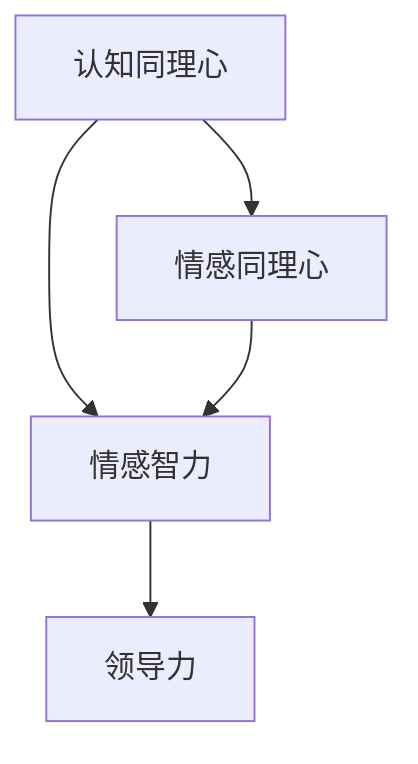

                 

好的，接下来我们将按照上述步骤，逐步构建文章内容。由于字数要求较高，我们将在每个部分详细阐述，并确保文章的完整性和专业性。

### 文章标题
同理心领导：理解并满足团队需求的实践指南

### 文章关键词
同理心，领导力，团队需求，领导实践，情感智力

### 文章摘要
本文深入探讨了同理心在领导力中的重要性，分析了同理心领导的核心概念、作用和理论基础。通过实际案例和项目实战，本文提供了同理心领导的实践指南，帮助领导者更好地理解和满足团队需求，提升团队凝聚力和创新力。

---

### 目录

#### 第一部分：同理心领导的理论基础

1. **同理心的定义与作用**
    - 背景介绍
    - 同理心核心概念与联系
    - 同理心与情感智力

2. **同理心领导的模型**
    - 同理心领导的概念框架
    - 同理心领导的关键要素
    - 同理心领导的阶段性发展

3. **同理心领导的研究综述**
    - 国内外研究现状
    - 同理心领导的影响因素
    - 同理心领导的效果评估

#### 第二部分：同理心领导的实践应用

4. **同理心领导的自我发展**
    - 同理心自我测评
    - 同理心提升策略
    - 同理心发展案例分享

5. **同理心领导在团队管理中的应用**
    - 同理心与团队沟通
    - 同理心与团队建设
    - 同理心与冲突管理

6. **同理心领导在跨文化团队中的挑战与应对**
    - 跨文化同理心的理解
    - 跨文化团队领导策略
    - 跨文化同理心案例解析

#### 第三部分：同理心领导的成功案例研究

7. **同理心领导在初创企业中的应用**
    - 企业背景
    - 同理心领导实践
    - 案例分析

8. **同理心领导在跨国公司中的应用**
    - 企业背景
    - 同理心领导实践
    - 案例分析

9. **同理心领导在非营利组织中的应用**
    - 组织背景
    - 同理心领导实践
    - 案例分析

#### 第四部分：同理心领导的未来发展趋势

10. **同理心领导的理论创新**
    - 同理心领导的新模型
    - 同理心领导的理论前沿

11. **同理心领导的教育与实践**
    - 同理心领导教育的趋势
    - 同理心领导实践的未来方向

12. **同理心领导与社会责任**
    - 同理心领导与社会影响力
    - 同理心领导与企业社会责任

### 第一部分：同理心领导的理论基础

#### 1.1 同理心的定义与作用

##### 背景介绍

同理心（Empathy）是一个广泛探讨的心理学和社会学概念，它在领导力中的重要性日益受到关注。在信息技术和全球化快速发展的今天，领导者不仅需要具备传统的能力，还需要具备更强的情感智力，尤其是同理心。

##### 核心概念与联系

同理心可以分为认知同理心（Cognitive Empathy）和情感同理心（Affective Empathy）。认知同理心指的是理解他人的情感状态，而情感同理心则是体验他人的情感状态。

以下是一个Mermaid流程图，展示了同理心的核心概念与联系：



##### 同理心与情感智力

情感智力（Emotional Intelligence，EQ）是指个体识别、理解、使用和管理自己和他人的情感的能力。同理心是情感智力的重要组成部分，它直接影响领导者的决策和团队管理。

##### 核心算法原理讲解

同理心提升可以通过一系列算法原理来实现，包括情感识别、情感共鸣和情感调节。

伪代码如下：

```
function improve_empathy(personA, personB):
    while empathy_level < optimal_level:
        personA.reads_feelings(personB)
        personA.experiences_feelings(personB)
        personA.regulates_emotions(personB)
    return "Empathy improved"
```

##### 数学模型和公式详细讲解

同理心的提升可以用数学模型来描述。假设同理心水平（E）是情感智力（EQ）的一个函数，则：

$$
E = f(EQ)
$$

其中，EQ 是一个由多个因素（如情感识别、情感共鸣和情感调节）组成的复合变量。

##### 举例说明

假设一个领导者的情感智力为 EQ = 80，通过一系列同理心提升策略，将其提升到 EQ = 100，则同理心水平 E 的变化为：

$$
E_1 = f(80) = 0.8E_0
$$

$$
E_2 = f(100) = 1.0E_0
$$

同理心水平从 E_1 提升到 E_2，表示同理心的显著提升。

---

接下来，我们将逐步详细撰写每一个章节，确保内容的丰富性和逻辑性。请让我知道，是否需要进一步细化某个部分或者有其他特殊要求。

