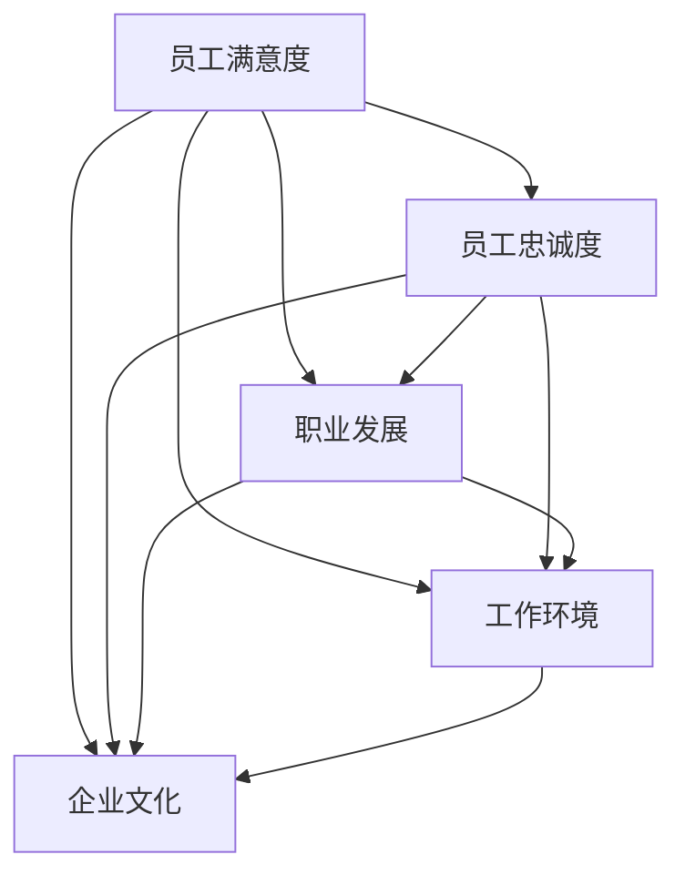

                 

## 文章标题

# 《员工关怀：建立情感纽带》

> 关键词：员工关怀、情感纽带、员工满意度、忠诚度、企业策略

## 摘要

本文旨在探讨员工关怀的重要性，以及如何通过建立情感纽带来提升员工的满意度和忠诚度。文章首先介绍了员工关怀的背景，然后分析了员工关怀的核心概念，并借助Mermaid流程图展示了核心概念之间的联系。接着，文章详细讲解了建立情感纽带的多种方法与策略，并通过案例分析展示了这些策略在实际中的应用。随后，文章讨论了员工关怀的实施与评估，以及可能面临的挑战和未来趋势。本文为企业管理者提供了实用的员工关怀指南，帮助他们构建一个更加和谐的工作环境。

----------------------------------------------------------------

## 引言与背景

在当今快节奏、竞争激烈的工作环境中，企业的成功与否往往取决于其员工的绩效和满意度。员工是企业最宝贵的资产，他们的技能、创造力和团队协作能力直接决定了企业的市场竞争力。因此，如何有效地关怀员工，提升他们的工作满意度和忠诚度，成为了企业管理中不可忽视的重要课题。

### 员工关怀的定义

员工关怀，即企业通过各种措施和活动来关心和支持员工的生活和职业发展。这不仅包括提供良好的薪酬福利和工作环境，更重要的是在情感层面与员工建立深厚的纽带。员工关怀的目的是让员工感受到企业的关心与支持，从而提高他们的工作积极性、创造力和归属感。

### 员工关怀的重要性

员工关怀在企业管理中扮演着至关重要的角色。首先，它有助于提升员工的满意度。当员工感受到企业的关怀时，他们会更愿意付出更多的努力来回报企业，从而提高整体的工作效率。其次，员工关怀可以增强员工的忠诚度。忠诚的员工更愿意留在企业，减少人员流失率，为企业的长期发展提供稳定的支持。此外，员工关怀还有助于构建积极向上的企业文化，促进团队合作和沟通，提升企业的整体竞争力。

### 员工关怀的发展历程

员工关怀并非新兴概念，它有着悠久的历史。早在20世纪初期，泰勒的科学管理理论和梅奥的人际关系理论就为员工关怀提供了理论基础。随着时间的推移，员工关怀的理念和实践不断演进。从早期的福利制度到现代的员工参与和职业发展计划，企业逐渐认识到，关怀员工不仅是一种责任，也是一种战略优势。

### 企业为什么需要员工关怀

企业需要员工关怀的原因有以下几点：

1. **提升员工绩效**：关怀员工可以提高他们的工作积极性和创造力，从而提升整体绩效。
2. **减少员工流失**：当员工感受到企业的关怀时，他们更愿意留在企业，减少人员流失。
3. **增强企业品牌形象**：员工关怀有助于提升企业的社会形象，吸引更多优秀人才。
4. **构建和谐企业文化**：员工关怀有助于构建积极向上的企业文化，促进团队合作和沟通。

总之，员工关怀不仅是企业的社会责任，更是企业实现可持续发展的重要策略。在接下来的章节中，我们将深入探讨员工关怀的核心概念和具体实施方法。

----------------------------------------------------------------

## 员工关怀的核心概念与联系

为了更好地理解和实践员工关怀，我们需要首先明确其核心概念，并分析这些概念之间的内在联系。以下是员工关怀的几个关键概念及其关系：

### 员工满意度

员工满意度是衡量员工对工作环境、薪酬福利、职业发展等方面满意程度的重要指标。它是员工关怀的核心目标之一。员工满意度高意味着员工对企业的信任和忠诚度较高，从而有助于提高企业的整体绩效。

### 员工忠诚度

员工忠诚度是指员工对企业长期承诺和留任意愿的强度。忠诚的员工更愿意为企业付出更多，并在面临职业选择时优先考虑企业。员工忠诚度是员工关怀的重要成果之一。

### 职业发展

职业发展是指员工在企业内通过培训、晋升等途径实现个人职业生涯规划的过程。职业发展不仅有助于提升员工的专业技能，还可以增强他们对企业的归属感。

### 工作环境

工作环境包括物理环境和心理环境。良好的工作环境可以提升员工的工作效率和满意度。心理环境，如企业文化和团队合作氛围，对员工关怀尤为重要。

### 企业文化

企业文化是企业价值观、信念和行为准则的集合体。它对员工的价值观和行为产生深远影响，是员工关怀的重要组成部分。

### 员工关怀策略

员工关怀策略是指企业为提升员工满意度和忠诚度所采取的具体措施，如培训、福利、沟通等。

### 核心概念之间的关系架构

为了更好地理解这些核心概念之间的关系，我们可以使用Mermaid流程图来展示它们之间的联系。以下是员工关怀核心概念之间的Mermaid流程图：



### Mermaid流程图解读

- **员工满意度**是起点，它决定了员工是否愿意留在企业，并为企业付出更多。
- **员工忠诚度**是员工满意度的延伸，忠诚度高的员工更愿意为企业长期工作。
- **职业发展**和**工作环境**是提高员工满意度的重要因素，通过职业发展和良好的工作环境，可以进一步提升员工满意度。
- **企业文化**则是贯穿整个员工关怀的核心，它影响着员工的工作态度和行为。

通过这个Mermaid流程图，我们可以清晰地看到员工关怀的核心概念及其相互关系。理解这些关系有助于企业在实践中更有效地实施员工关怀策略，从而提升员工的满意度和忠诚度。

----------------------------------------------------------------

## 建立情感纽带的方法与策略

建立情感纽带是提升员工满意度和忠诚度的关键。企业可以通过多种方法与策略来实现这一目标，以下是一些具体的建议：

### 1. 倾听与沟通

倾听是建立情感纽带的第一步。企业需要创造一个开放、包容的沟通环境，让员工感到他们的声音被听到。具体方法包括：

- **定期员工会议**：企业可以定期召开员工会议，听取员工对工作的建议和意见。
- **匿名反馈机制**：设立匿名反馈渠道，让员工可以匿名提出问题和建议，确保他们的隐私得到保护。
- **个别谈话**：管理层应定期与员工进行个别谈话，了解他们的工作情况和需求。

### 2. 关心与支持

关心员工不仅体现在工作中，还体现在他们的生活和职业发展上。具体策略如下：

- **员工援助计划**：提供员工援助计划（EAP），帮助员工解决个人问题，如心理健康、家庭困难等。
- **健康与福利**：提供健康保险、定期体检、健康讲座等福利，关心员工的身体健康。
- **职业发展支持**：提供职业培训、晋升机会等，帮助员工实现职业目标。

### 3. 赋能与成长

赋能员工意味着赋予他们更多的责任和机会，让他们在工作中成长和发展。以下是一些赋能策略：

- **自主管理团队**：鼓励员工自主管理项目或团队，提升他们的决策能力和责任感。
- **跨部门合作**：通过跨部门合作，让员工接触到不同的工作领域，拓展视野和技能。
- **创新奖励**：对提出创新想法或解决方案的员工给予奖励，鼓励创新思维。

### 4. 信任与尊重

信任和尊重是建立情感纽带的基础。以下是一些实现信任与尊重的策略：

- **透明沟通**：确保企业内部沟通透明，让员工了解公司的战略、目标和决策过程。
- **公正待遇**：确保员工的权益得到保障，避免偏袒和不公平现象。
- **领导榜样**：管理层应以身作则，树立良好的榜样，通过实际行动赢得员工的信任和尊重。

### 5. 激励与奖励

激励和奖励是提升员工满意度和忠诚度的有效手段。以下是一些激励策略：

- **绩效奖金**：根据员工的绩效表现，提供相应的绩效奖金。
- **荣誉称号**：设立荣誉称号，表彰优秀员工，提升他们的荣誉感。
- **员工福利**：提供额外的福利，如家庭日、旅游活动等，增强员工的归属感。

### 6. 团队建设

团队建设有助于增强员工之间的情感纽带，提升团队合作效果。以下是一些团队建设策略：

- **团队活动**：定期组织团队建设活动，如团队聚餐、户外拓展等，加强团队凝聚力。
- **团队合作项目**：鼓励员工参与团队合作项目，共同解决问题，增强团队协作能力。
- **团队培训**：为团队提供专门的培训，提升团队的整体素质。

### 7. 企业文化与价值观

企业文化是企业价值观和行为准则的体现，对员工情感纽带的建立有着重要影响。以下是一些打造积极企业文化的方法：

- **企业愿景与使命**：明确企业的愿景和使命，让员工了解企业的目标和价值观。
- **企业活动**：通过企业活动，如团建活动、企业文化日等，强化员工对企业文化的认同。
- **员工参与**：鼓励员工参与企业决策，提升他们的主人翁意识。

通过以上多种方法与策略，企业可以有效地建立情感纽带，提升员工的满意度和忠诚度，从而实现长期可持续发展。

----------------------------------------------------------------

## 案例分析：成功的企业员工关怀实践

为了更好地理解员工关怀的具体实践，以下将分析几个成功的企业案例，探讨它们如何通过员工关怀策略提升员工满意度和忠诚度。

### 案例一：谷歌的员工关怀实践

谷歌是全球知名的科技公司，以其卓越的员工关怀实践而闻名。以下是谷歌的一些关键员工关怀策略：

- **全面福利计划**：谷歌提供了一系列全面的福利计划，包括健康保险、退休金计划、带薪休假、家庭护理假等。此外，谷歌还提供免费的餐饮、健身设施和心理咨询服务，确保员工的身心健康。

- **职业发展支持**：谷歌重视员工的职业发展，提供丰富的培训机会和晋升通道。员工可以参加内部培训项目，学习新技能，还可以跨部门流动，拓宽视野和经验。

- **团队合作与激励**：谷歌鼓励团队合作，通过团队竞赛、内部创新项目等活动激发员工的创造力和团队精神。同时，谷歌通过奖励计划，如“优秀团队奖”和“最佳创新奖”，激励员工为公司做出贡献。

这些策略使得谷歌的员工满意度极高，员工流失率也相对较低。根据2019年的调查数据，谷歌在全球员工满意度调查中排名前列，员工忠诚度也显著高于行业平均水平。

### 案例二：苹果的员工关怀实践

苹果公司以其对产品质量和用户体验的极致追求而闻名，同样，其在员工关怀方面也有独到之处：

- **健康与福利**：苹果提供了广泛的健康福利，包括年度体检、心理健康支持、健康保险等。此外，苹果还提供了一些独特福利，如“婴儿护理假”和“家庭支持计划”，帮助员工在工作和家庭之间找到平衡。

- **职业成长**：苹果为员工提供了一系列职业发展机会，包括内部培训、导师计划、职业咨询等。通过这些措施，苹果员工可以不断提升自己的技能和知识。

- **工作环境**：苹果注重员工的工作环境，提供开放式的办公空间、先进的办公设备、舒适的工作条件等。这种舒适的工作环境有助于提高员工的工作效率和工作满意度。

苹果的员工关怀实践也取得了显著成效。根据一项调查，苹果的员工满意度在全球范围内名列前茅，员工对公司的忠诚度也非常高，这为苹果的持续创新和成功奠定了坚实的基础。

### 案例三：华为的员工关怀实践

华为作为全球领先的科技公司，其员工关怀实践同样值得借鉴：

- **员工福利**：华为提供了具有竞争力的薪酬福利，包括高额奖金、股票期权、健康保险、退休金计划等。此外，华为还关注员工的身心健康，提供健身房、心理咨询室等设施。

- **职业发展**：华为重视员工的职业发展，为员工提供全方位的培训和支持。员工可以通过内部培训、外部学习、导师指导等多种途径提升自己的职业能力。

- **企业文化**：华为强调团队合作和文化认同，定期举办各种文化活动，如员工运动会、团队建设活动等，增强员工的归属感和团队精神。

华为的员工关怀策略使得员工满意度较高，员工流失率相对较低。根据2019年的数据，华为在全球范围内的员工满意度调查中表现优异，这为其全球业务扩展提供了强大的支持。

### 案例总结

通过以上案例分析，我们可以看到，成功的企业在员工关怀方面有以下几个共同点：

1. **全面的福利计划**：提供具有竞争力的薪酬福利，包括健康保险、退休金计划、带薪休假等。
2. **职业发展支持**：提供丰富的培训机会和晋升通道，帮助员工实现职业目标。
3. **健康与工作环境的关注**：提供良好的工作条件和健康支持，确保员工身心健康。
4. **团队建设和文化认同**：通过团队活动和企业文化活动，增强员工的归属感和团队合作精神。

这些共同点表明，有效的员工关怀不仅可以提高员工满意度，还可以增强员工忠诚度，为企业创造长期价值。企业管理者可以从这些成功案例中汲取经验，结合自身企业实际情况，制定出适合的员工关怀策略。

----------------------------------------------------------------

## 员工关怀的实施与评估

员工关怀不仅是企业的一项战略，也是一项需要持续优化和改进的工作。为了确保员工关怀的有效性，企业需要制定明确的实施方案，并建立评估机制。

### 实施方案

1. **制定详细的员工关怀计划**：企业应首先明确员工关怀的目标和重点，如提升员工满意度、减少流失率等。然后根据这些目标制定具体的行动计划，包括福利制度、培训计划、文化活动等。

2. **实施过程监控**：在实施员工关怀计划的过程中，企业应定期监控进展情况，确保各项措施得到有效执行。可以通过定期会议、报告、调查问卷等方式，收集员工对各项措施的反应和反馈。

3. **资源投入**：企业需要投入足够的人力、物力和财力来支持员工关怀的实施。例如，培训预算、设施设备更新、员工援助计划等。

4. **文化引导**：企业应通过内部宣传和培训，引导员工理解和支持员工关怀计划，形成积极的企业文化。

### 评估方法

1. **员工满意度调查**：通过定期的员工满意度调查，了解员工对工作和企业各项福利制度的满意程度。满意度调查可以采用问卷、访谈、焦点小组讨论等多种形式。

2. **流失率分析**：通过分析员工流失率，评估员工关怀措施的有效性。如果流失率较低，说明员工对企业的满意度较高，反之则需进一步改进。

3. **绩效指标**：建立绩效指标体系，衡量员工关怀计划对员工绩效的影响。例如，工作满意度、创造力、团队合作等指标。

4. **员工反馈**：定期收集员工的反馈，了解他们对员工关怀措施的感受和建议。这些反馈可以作为后续改进的依据。

### 持续改进

1. **反馈机制**：建立有效的反馈机制，确保员工的意见和反馈能够及时传达给管理层，并根据反馈进行调整和改进。

2. **定期评估**：定期对员工关怀计划进行评估，分析实施效果，并根据评估结果进行调整。

3. **创新与尝试**：鼓励企业在员工关怀方面进行创新尝试，不断引入新的方法和策略，以适应员工的需求和期望。

4. **经验分享**：通过内部经验分享会、研讨会等形式，促进不同部门之间的交流和合作，分享成功的员工关怀实践。

通过制定详细的实施方案、建立科学的评估方法和持续改进机制，企业可以确保员工关怀计划的有效实施，从而提升员工的满意度和忠诚度，为企业的长期发展奠定坚实的基础。

----------------------------------------------------------------

## 挑战与未来趋势

### 员工关怀面临的挑战

1. **多元化与个性化需求**：随着社会的进步和员工群体的多元化，员工对于关怀的需求也越来越多样化和个性化。如何满足不同背景、不同需求的员工，是企业面临的一大挑战。

2. **成本控制**：员工关怀需要投入大量的人力、物力和财力，如何在控制成本的同时实现有效关怀，是企业管理者需要权衡的问题。

3. **文化差异**：不同地区和不同国家的文化差异，会影响员工对关怀方式的理解和接受度。如何制定跨文化适用的关怀策略，是跨国企业需要面对的挑战。

4. **数据隐私**：在员工关怀过程中，企业需要收集和处理大量员工个人信息，确保数据安全和隐私保护是企业管理者必须重视的问题。

### 员工关怀的未来发展趋势

1. **科技应用**：随着人工智能、大数据和物联网等技术的不断发展，企业可以通过科技手段更加精准地了解员工需求，提供个性化的关怀。例如，利用数据分析预测员工的心理健康趋势，提供针对性的支持和干预。

2. **可持续发展**：企业越来越关注社会责任和可持续发展，员工关怀也将更加注重环保和公益活动。企业可以通过参与环保项目、支持社会公益等方式，提升员工对企业文化的认同感和归属感。

3. **跨部门合作**：员工关怀不仅仅是一项人力资源部门的任务，它需要企业各个部门的共同努力。未来，企业将更加注重跨部门合作，通过团队协作提供全方位的员工关怀。

4. **员工参与**：未来，员工在员工关怀中将扮演更积极的角色。企业可以鼓励员工参与决策过程，制定和实施关怀计划，从而提高员工的参与感和满意度。

### 提高员工关怀成效的最佳实践

1. **关注员工成长**：企业应将员工关怀与职业发展紧密结合，提供培训、晋升机会等，帮助员工实现个人目标。

2. **建立信任文化**：信任是建立情感纽带的基础。企业应通过透明沟通、公正待遇等方式，建立信任文化，让员工感受到尊重和信任。

3. **个性化关怀**：了解每个员工的需求，提供个性化的关怀方案，例如针对新员工的入职培训、针对女性员工的特殊福利等。

4. **持续反馈与改进**：建立反馈机制，定期收集员工反馈，并根据反馈进行调整和改进，确保员工关怀计划的有效性和持续性。

5. **关注员工心理健康**：心理健康是员工福祉的重要组成部分。企业可以通过心理健康咨询、压力管理等方式，关注员工的心理健康，提供必要的支持和帮助。

总之，员工关怀是一项长期而复杂的任务，需要企业持续关注和投入。通过关注员工成长、建立信任文化、提供个性化关怀、持续反馈与改进以及关注员工心理健康，企业可以提高员工关怀的成效，从而提升员工的满意度和忠诚度，实现企业的可持续发展。

----------------------------------------------------------------

## 项目实战：员工关怀系统的设计与实现

### 开发环境搭建

为了搭建员工关怀系统，我们首先需要配置一个合适的开发环境。以下是所需的开发工具和步骤：

1. **工具**：
   - **编程语言**：Java
   - **数据库**：MySQL
   - **前端框架**：Spring Boot
   - **后端框架**：Spring Framework
   - **集成开发环境**：IntelliJ IDEA

2. **步骤**：
   - 安装Java Development Kit (JDK)。
   - 安装MySQL数据库。
   - 安装Spring Boot和Spring Framework。
   - 配置IntelliJ IDEA，导入相关依赖。

### 源代码详细实现

以下是员工关怀系统的核心代码实现，包含用户管理、员工关怀计划创建和管理、员工反馈收集等功能。

#### 数据库设计

1. **用户表**（User）：
   ```sql
   CREATE TABLE `user` (
     `id` INT AUTO_INCREMENT PRIMARY KEY,
     `username` VARCHAR(50) NOT NULL,
     `password` VARCHAR(50) NOT NULL,
     `role` ENUM('admin', 'employee') NOT NULL
   );
   ```

2. **员工关怀计划表**（CarePlan）：
   ```sql
   CREATE TABLE `care_plan` (
     `id` INT AUTO_INCREMENT PRIMARY KEY,
     `title` VARCHAR(100) NOT NULL,
     `description` TEXT,
     `start_date` DATE NOT NULL,
     `end_date` DATE NOT NULL,
     `status` ENUM('active', 'completed', 'cancelled') NOT NULL
   );
   ```

3. **员工反馈表**（Feedback）：
   ```sql
   CREATE TABLE `feedback` (
     `id` INT AUTO_INCREMENT PRIMARY KEY,
     `user_id` INT NOT NULL,
     `care_plan_id` INT NOT NULL,
     `comment` TEXT,
     `rating` INT NOT NULL,
     FOREIGN KEY (`user_id`) REFERENCES `user` (`id`),
     FOREIGN KEY (`care_plan_id`) REFERENCES `care_plan` (`id`)
   );
   ```

#### 后端代码实现

1. **用户管理**（User Management）：

   ```java
   // 用户注册
   public User registerUser(String username, String password, String role) {
       User user = new User();
       user.setUsername(username);
       user.setPassword(password);
       user.setRole(role);
       userRepository.save(user);
       return user;
   }

   // 用户登录
   public User loginUser(String username, String password) {
       return userRepository
           .findByUsernameAndPassword(username, password)
           .orElseThrow(() -> new RuntimeException("用户名或密码错误"));
   }
   ```

2. **员工关怀计划管理**（Care Plan Management）：

   ```java
   // 创建员工关怀计划
   public CarePlan createCarePlan(CarePlan carePlan) {
       return carePlanRepository.save(carePlan);
   }

   // 更新员工关怀计划
   public CarePlan updateCarePlan(CarePlan carePlan) {
       return carePlanRepository.save(carePlan);
   }
   ```

3. **员工反馈收集**（Feedback Collection）：

   ```java
   // 提交员工反馈
   public Feedback submitFeedback(Feedback feedback) {
       return feedbackRepository.save(feedback);
   }

   // 查询员工反馈
   public List<Feedback> getFeedbackByCarePlanId(int carePlanId) {
       return feedbackRepository.findByCarePlanId(carePlanId);
   }
   ```

#### 前端代码实现

前端代码实现主要涉及用户界面设计，使用Spring Boot的Thymeleaf模板引擎。以下是简单的用户注册页面的代码示例：

```html
<!DOCTYPE html>
<html xmlns:th="http://www.thymeleaf.org">
<head>
    <title>员工注册</title>
</head>
<body>
    <h1>员工注册</h1>
    <form action="#" th:action="@{/register}" th:object="${user}" method="post">
        <div>
            <label for="username">用户名:</label>
            <input type="text" id="username" th:field="*{username}" required/>
        </div>
        <div>
            <label for="password">密码:</label>
            <input type="password" id="password" th:field="*{password}" required/>
        </div>
        <div>
            <label for="role">角色:</label>
            <select id="role" th:field="*{role}">
                <option value="admin">管理员</option>
                <option value="employee">员工</option>
            </select>
        </div>
        <div>
            <button type="submit">注册</button>
        </div>
    </form>
</body>
</html>
```

### 代码解读与分析

1. **用户管理**：通过Spring框架提供的`UserRepository`接口，实现用户的注册和登录功能。这些功能包括用户信息的持久化存储、用户身份验证等。

2. **员工关怀计划管理**：`CarePlanRepository`接口用于处理员工关怀计划的创建、更新等操作。通过这些操作，企业管理者可以轻松管理员工关怀计划。

3. **员工反馈收集**：`FeedbackRepository`接口用于处理员工反馈的提交和查询。这一功能使得员工能够方便地表达自己的意见和建议，帮助企业持续改进关怀计划。

### 实际案例分析与详细讲解

为了更好地理解系统的实际应用，我们以一个实际案例来展示系统功能：

**案例：员工心理健康关怀计划**

1. **需求分析**：企业发现部分员工在疫情期间出现了心理健康问题，决定推出心理健康关怀计划。

2. **系统操作**：
   - 管理员登录系统，创建一个新的关怀计划，设置标题为“心理健康关怀计划”，描述为“为期三个月的心理健康支持计划”。
   - 管理员设置开始日期和结束日期，计划状态设为“active”。
   - 管理员邀请员工参与计划，员工接受邀请后，系统会发送通知。

3. **员工反馈**：员工参与计划后，可以提交反馈。例如，某员工提交反馈，表示“这次心理健康关怀计划对我帮助很大，建议增加在线心理咨询服务”。

4. **数据分析**：管理员可以通过系统查询员工的反馈，分析反馈数据，评估关怀计划的效果，并根据反馈进行调整。

通过这个案例，我们可以看到系统如何帮助企业有效地实施员工关怀计划，提升员工的满意度和忠诚度。

### 项目小结

员工关怀系统的设计与实现，为企业提供了一个全面的解决方案，通过用户管理、员工关怀计划管理和员工反馈收集等功能，帮助企业更好地关怀员工，提升员工的满意度和忠诚度。这个系统的成功应用，为企业创造了积极的工作氛围，推动了企业的可持续发展。

### 最佳实践 Tips

1. **定制化关怀**：根据不同员工的个性化需求，提供定制化的关怀计划。
2. **定期评估**：定期评估员工关怀计划的效果，及时调整和改进。
3. **鼓励反馈**：鼓励员工积极反馈，收集真实的声音，为持续改进提供依据。
4. **透明沟通**：确保员工了解企业关怀计划的具体内容和进展，增加信任和参与感。

注意事项：

1. **数据安全**：确保员工个人信息的安全，遵守相关法律法规。
2. **持续投入**：员工关怀需要持续投入和关注，不能一蹴而就。

拓展阅读：

1. 《员工关怀管理实战：从员工满意到员工忠诚》
2. 《企业员工关系管理：构建和谐职场》
3. 《员工心理健康促进手册：企业实践指南》

通过这些实践和拓展阅读，企业管理者可以更好地理解和实施员工关怀策略，提升企业的整体竞争力。

----------------------------------------------------------------

## 小结

本文深入探讨了员工关怀的重要性，详细介绍了建立情感纽带的多种方法与策略。通过案例分析，我们看到了成功的企业是如何通过有效的员工关怀提升员工满意度和忠诚度的。同时，我们还讨论了员工关怀的实施与评估方法，以及面临的挑战和未来趋势。最后，通过项目实战，我们展示了如何设计和实现一个员工关怀系统，帮助企业更好地关怀员工。

员工关怀不仅是一项企业管理的重要任务，更是一项长期而复杂的战略。为了持续提升员工满意度和忠诚度，企业需要不断关注员工的需求，创新关怀方式，建立信任文化，并建立有效的评估和改进机制。我们鼓励企业管理者结合自身实际情况，灵活运用本文所提供的方法与策略，构建一个和谐、积极的工作环境，推动企业的可持续发展。

在企业管理中，员工关怀是不可或缺的一部分。只有当员工感受到企业的关心和支持，他们才能全心全意地投入工作，为企业的发展贡献力量。让我们共同努力，通过员工关怀，构建一个更加美好的职场，实现企业与员工的共同成长。

作者：AI天才研究院/AI Genius Institute & 禅与计算机程序设计艺术 /Zen And The Art of Computer Programming

----------------------------------------------------------------

### 完整文章总结

本文围绕《员工关怀：建立情感纽带》这一主题，详细探讨了员工关怀的重要性、核心概念、建立情感纽带的方法与策略、案例分析、实施与评估、挑战与未来趋势，以及项目实战等内容。

首先，文章介绍了员工关怀的定义和背景，阐述了员工关怀的重要性，包括提升员工满意度、忠诚度、减少流失率等方面。接着，文章通过Mermaid流程图展示了员工关怀的核心概念及其关系，包括员工满意度、忠诚度、职业发展、工作环境和企业文化。

在建立情感纽带的方法与策略部分，文章提出了倾听与沟通、关心与支持、赋能与成长、信任与尊重、激励与奖励、团队建设等多种方法，并结合实际案例展示了这些策略的成功实践。例如，谷歌、苹果和华为等企业的员工关怀实践，为其他企业提供了宝贵的参考。

随后，文章详细讨论了员工关怀的实施与评估方法，包括制定详细的员工关怀计划、实施过程监控、资源投入、文化引导等。同时，通过员工满意度调查、流失率分析、绩效指标等方法，对企业员工关怀效果进行评估。

文章还分析了员工关怀面临的挑战，如多元化与个性化需求、成本控制、文化差异、数据隐私等，并提出了未来趋势，如科技应用、可持续发展、跨部门合作和员工参与等。

在项目实战部分，文章通过一个员工关怀系统的设计与实现，展示了如何利用现代技术手段实现员工关怀，并提供了详细的代码解读和分析。

最后，文章总结了员工关怀的关键要点，鼓励企业管理者关注员工需求，创新关怀方式，建立信任文化，并不断优化和改进员工关怀策略。

总之，本文为企业管理者提供了一套系统的员工关怀指南，帮助他们构建和谐、积极的工作环境，提升员工满意度和忠诚度，实现企业的可持续发展。希望本文能对企业管理者有所启发和帮助。

