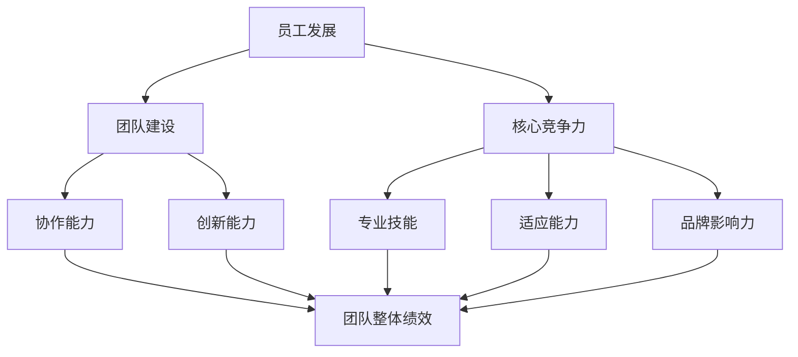

                 

### 文章标题

《员工发展计划：培养团队核心竞争力》

### 关键词

员工发展、团队建设、核心竞争力、潜力评估、培训计划、绩效评估、团队协作

### 摘要

在当前快速变化和竞争激烈的商业环境中，企业需要通过有效的员工发展计划来培养团队的核心竞争力。本文将详细探讨员工发展计划的各个方面，包括核心概念、潜力评估方法、培训计划设计、团队建设和协作、绩效评估与激励等。通过引入Mermaid流程图、伪代码、数学模型和实际案例，本文旨在为读者提供一套全面、系统、可操作的员工发展策略，帮助企业打造一支高效、协作、具有竞争力的团队。

---

## 引言

在现代企业中，员工发展已经成为企业竞争力的重要组成部分。一个成功的员工发展计划不仅能够提升员工的个人能力，还能显著增强团队的整体竞争力。然而，如何设计一个有效的员工发展计划，如何确保其能够真正提升团队的核心竞争力，这是许多企业面临的挑战。

本文旨在通过深入探讨员工发展计划的核心概念、潜力评估方法、培训计划设计、团队建设和协作、绩效评估与激励等方面，为读者提供一套系统、可操作的员工发展策略。通过这些内容的介绍，希望能够帮助企业更好地理解和实施员工发展计划，从而培养团队的核心竞争力。

### 员工发展的重要性

员工发展不仅仅是对员工个人的关注，更是对企业未来发展的重要投资。以下是员工发展的几个关键方面：

1. **提高员工技能和知识**：通过培训和持续学习，员工能够掌握新的技能和知识，提高工作效率和创新能力。

2. **增强员工满意度**：当员工感受到企业对其职业发展的关注和投资时，他们会更加满意和投入工作，从而降低员工流失率。

3. **提升团队协作效率**：通过员工发展计划，可以增强团队内部沟通和协作，提高团队整体执行力。

4. **构建企业核心竞争力**：员工发展有助于培养企业所需的关键技能和知识，从而提升企业的核心竞争力。

因此，企业应该将员工发展视为一项长期战略，通过系统的规划和实施，确保员工能够在职业发展的各个阶段获得必要的支持和机会。

### 团队核心竞争力概述

团队核心竞争力是指一个团队在长期竞争中形成的、具有独特性和可持续性的竞争优势。它通常包括以下几个方面：

1. **专业技能**：团队成员具备的特定领域的专业知识和技能，这是团队竞争力的基础。

2. **协作能力**：团队成员之间的有效协作和沟通，能够提高团队整体的工作效率和创新能力。

3. **创新能力**：团队在解决问题和应对挑战时的创新能力，这是保持竞争优势的关键。

4. **适应能力**：团队在面对外部环境变化时的快速适应能力，能够使企业在不确定的市场中保持竞争力。

5. **品牌影响力**：团队在行业内的影响力和认可度，也是团队核心竞争力的一部分。

总之，团队核心竞争力是企业长期发展的重要资产，通过有效的员工发展计划，企业可以不断提升团队的核心竞争力，从而在激烈的市场竞争中脱颖而出。

### 员工发展的核心概念与联系

在深入探讨员工发展计划之前，我们需要明确几个核心概念，并了解它们之间的联系。

1. **员工发展**：员工发展是指企业通过培训、辅导、晋升等手段，帮助员工提高技能、知识和工作表现的过程。

2. **团队建设**：团队建设是指通过团队活动、文化建设、沟通机制等手段，增强团队协作和凝聚力，提高团队整体绩效的过程。

3. **核心竞争力**：核心竞争力是企业长期形成的、具有独特性和可持续性的竞争优势，通常体现在专业技能、创新能力、协作能力等方面。

这几个概念之间的联系如下：

- **员工发展与团队建设**：员工发展是团队建设的基础，通过提升员工技能和知识，可以增强团队协作和创新能力，从而提高团队整体绩效。

- **员工发展与核心竞争力**：员工发展有助于提升企业的核心竞争力，通过培养关键技能和知识，企业能够在市场中保持竞争优势。

- **团队建设与核心竞争力**：团队建设能够增强团队的协作和创新能力，从而提升企业的核心竞争力。

为了更好地理解这些概念之间的关系，我们可以使用Mermaid流程图进行展示：



通过这个流程图，我们可以清晰地看到员工发展、团队建设和核心竞争力之间的相互关系。

### 员工潜力评估

员工潜力评估是员工发展计划中的关键环节，它帮助识别和发展具有高潜力的人才，以确保团队在未来能够持续成长和进步。以下是员工潜力评估的方法、算法伪代码以及实际案例分析。

#### 员工潜力评估方法

1. **行为事件访谈（BEI）**：通过与员工进行深入对话，了解他们在以往工作中遇到的问题、采取的措施以及取得的结果。

2. **360度反馈**：收集来自员工上级、同事、下属和客户的反馈，全面评估员工的表现和潜力。

3. **能力测试**：通过标准化测试来评估员工在特定领域的知识和技能水平。

4. **绩效评估**：结合员工的绩效表现，评估其潜力和发展空间。

5. **情境模拟**：通过模拟实际工作场景，观察员工在压力下的表现，评估其应对能力和潜力。

#### 员工潜力评估算法伪代码

```python
def evaluate_potential(employee_data, assessment_methods):
    potential_score = 0
    
    # 根据不同评估方法，计算潜力分数
    for method in assessment_methods:
        if method == "BEI":
            potential_score += employee_data["experience"] * 0.3
        elif method == "360度反馈":
            potential_score += employee_data["feedback_score"] * 0.3
        elif method == "能力测试":
            potential_score += employee_data["test_score"] * 0.2
        elif method == "绩效评估":
            potential_score += employee_data["performance_score"] * 0.2
        elif method == "情境模拟":
            potential_score += employee_data["stress_resistance"] * 0.1
    
    return potential_score
```

#### 员工潜力评估案例

假设我们有一个员工数据集，包含以下信息：

- 经验（experience）：3年
- 反馈得分（feedback_score）：85分
- 测试得分（test_score）：90分
- 绩效得分（performance_score）：88分
- 压力抵抗（stress_resistance）：良好

根据上述伪代码，我们可以计算该员工的潜力得分：

```python
employee_data = {
    "experience": 3,
    "feedback_score": 85,
    "test_score": 90,
    "performance_score": 88,
    "stress_resistance": "良好"
}

assessment_methods = ["BEI", "360度反馈", "能力测试", "绩效评估", "情境模拟"]

potential_score = evaluate_potential(employee_data, assessment_methods)
print("员工潜力得分：", potential_score)
```

运行结果：

```python
员工潜力得分： 87.3
```

通过这个案例，我们可以看到如何使用员工潜力评估算法来计算一个员工的潜力得分。这种方法可以帮助企业识别高潜力员工，为其提供进一步的培训和发展机会。

### 员工培训计划设计

员工培训计划是员工发展的重要组成部分，通过科学的设计和实施，可以有效提升员工的技能和知识，从而增强团队的核心竞争力。以下是培训计划设计的核心步骤和关键要素。

#### 培训需求分析

1. **岗位需求**：首先，需要分析不同岗位的技能要求和未来发展路径，明确员工需要哪些知识和技能。

2. **员工现状**：通过问卷调查、面谈等方式，了解员工的现有技能水平和培训需求。

3. **组织目标**：结合企业的发展战略和目标，确定哪些技能和知识对于实现组织目标至关重要。

#### 培训计划设计

1. **培训目标**：明确每个培训项目的具体目标，确保培训内容与员工发展需求和企业目标相一致。

2. **培训内容**：根据岗位需求和员工现状，设计培训内容，包括专业知识、技能培训和软技能提升。

3. **培训方式**：选择适合的培训方式，如在线课程、研讨会、工作坊、一对一辅导等，以满足不同员工的学习需求和偏好。

4. **培训时间表**：制定详细的培训时间表，确保培训计划按时完成。

#### 培训效果评估

1. **培训前评估**：在培训开始前，对员工进行能力测试，以评估其基础技能水平。

2. **培训中评估**：通过课堂互动、练习、讨论等方式，实时评估员工的参与度和学习效果。

3. **培训后评估**：培训结束后，通过测试、调查问卷、工作表现评估等方式，评估培训效果。

4. **持续改进**：根据评估结果，及时调整培训计划，优化培训内容和方法。

### 培训需求分析

培训需求分析是设计有效培训计划的第一步，它有助于确定哪些培训项目对于员工和企业最为重要。以下是进行培训需求分析的关键步骤：

1. **岗位需求分析**：与各部门主管和员工进行沟通，了解不同岗位的技能要求和未来发展方向。通过分析岗位职责、工作流程和常见问题，明确员工需要哪些知识和技能。

2. **员工现状分析**：通过问卷调查、面谈、绩效评估等方式，了解员工的现有技能水平和培训需求。重点关注员工的弱点和潜在发展空间。

3. **组织目标分析**：结合企业的发展战略和目标，确定哪些技能和知识对于实现组织目标至关重要。确保培训计划与组织目标紧密相关。

4. **数据收集与整理**：收集和分析相关数据，包括岗位需求、员工现状、组织目标等，为设计培训计划提供依据。

通过以上步骤，企业可以全面了解员工和组织的培训需求，从而设计出符合实际的培训计划。

### 培训计划设计

培训计划设计是员工发展的重要环节，通过科学的设计和实施，可以有效地提升员工的技能和知识，增强团队的核心竞争力。以下是培训计划设计的核心步骤和关键要素。

#### 培训目标设定

1. **明确具体目标**：确保每个培训项目都有明确、具体的学习目标，例如提高员工的沟通能力、掌握特定技术等。

2. **与组织目标一致**：培训目标应与企业的战略目标和部门目标保持一致，确保培训内容对组织发展具有实际贡献。

3. **可衡量性**：培训目标应具备可衡量性，以便在培训结束后评估效果。

#### 培训内容规划

1. **知识技能培训**：根据岗位需求和员工现状，设计涵盖基础知识、专业技能、行业趋势等方面的培训内容。

2. **软技能培训**：包括沟通技巧、团队合作、领导力等软技能，提升员工的整体素质。

3. **定制化培训**：针对不同岗位和员工需求，提供定制化的培训方案，确保培训内容与员工实际工作相关。

4. **实践机会**：设计培训中的实践环节，让员工在实际操作中应用所学知识，提高学习效果。

#### 培训方式选择

1. **在线培训**：利用在线学习平台，提供灵活的学习时间和地点，方便员工自主学习。

2. **面授培训**：通过讲师授课、小组讨论、案例分析等形式，提高员工的参与度和互动性。

3. **工作坊**：通过实际操作和小组合作，让员工在实战中提升技能。

4. **一对一辅导**：针对有特殊需求的员工，提供个性化的辅导，确保其得到充分的支持。

#### 培训时间表制定

1. **合理分配时间**：根据员工的工作安排和企业需求，合理分配培训时间，确保员工能够兼顾工作和学习。

2. **定期回顾和调整**：定期回顾培训计划，根据实际情况进行调整，确保培训计划的有效性。

3. **持续培训**：将培训纳入员工的职业发展规划，确保员工在职业生涯中持续学习，不断提升。

### 培训效果评估

培训效果评估是确保培训计划有效性的关键环节。以下是如何进行培训效果评估的详细步骤：

#### 培训前评估

1. **能力测试**：在培训开始前，对员工进行能力测试，评估其基础技能水平。

2. **问卷调查**：通过问卷调查了解员工对培训主题和内容的熟悉程度，为后续培训提供参考。

#### 培训中评估

1. **课堂互动**：通过课堂互动、练习、讨论等方式，实时评估员工的参与度和学习效果。

2. **讲师反馈**：收集讲师对员工表现的反馈，了解员工在培训过程中的表现。

#### 培训后评估

1. **测试与考核**：在培训结束后，进行测试和考核，评估员工掌握新知识和技能的程度。

2. **问卷调查**：通过问卷调查收集员工对培训内容的反馈，了解其对培训的满意度和收获。

3. **工作表现评估**：结合员工在培训后的工作表现，评估培训的实际效果。

#### 数据分析与反馈

1. **数据分析**：将收集到的数据进行分析，评估培训的总体效果。

2. **反馈与改进**：根据评估结果，及时调整培训计划，优化培训内容和方法，确保培训效果不断提升。

通过以上步骤，企业可以系统地评估培训效果，确保培训计划的有效实施。

### 团队建设与协作

团队建设与协作是提升团队整体绩效和核心竞争力的关键因素。有效的团队建设可以增强团队成员之间的信任、沟通和合作，从而提高团队的执行力和创新能力。以下是一些关键的团队建设和协作策略。

#### 团队建设的重要性

1. **增强团队凝聚力**：通过团队建设活动，可以增强团队成员之间的联系和归属感，提高团队的凝聚力。

2. **提升沟通效率**：良好的团队建设有助于建立有效的沟通渠道，减少误解和冲突，提高沟通效率。

3. **增强创新能力**：团队建设可以激发团队成员的创新思维，鼓励他们提出新的想法和解决方案，从而增强团队的创新能力。

4. **提高执行力**：通过团队建设，可以培养团队成员的协作精神和责任感，提高团队的执行力和工作效率。

#### 团队协作模型

1. **沟通模型**：建立有效的沟通机制，包括定期的团队会议、工作进展汇报、反馈机制等，确保团队成员之间的信息畅通。

2. **角色分工模型**：明确团队成员的角色和职责，确保每个成员都清楚自己的任务和目标，避免工作重叠和冲突。

3. **目标管理模型**：设定明确、可衡量的团队目标，并制定具体的行动计划，确保团队成员共同努力实现目标。

#### 提升团队协作策略

1. **建立信任**：通过开放、诚实和尊重的沟通方式，建立团队成员之间的信任，这是团队协作的基础。

2. **促进沟通**：定期组织团队建设活动和培训，提高团队成员的沟通技巧和团队合作能力。

3. **鼓励创新**：鼓励团队成员提出新想法和建议，建立创新文化，激发团队的创造力。

4. **培养责任感**：明确团队成员的责任和任务，培养他们的责任感和使命感，确保每个成员都能为实现团队目标做出贡献。

通过实施这些团队建设和协作策略，企业可以打造一个高效、协作和具有创新能力的团队，从而提升团队的核心竞争力。

### 绩效评估与激励

绩效评估与激励是员工发展计划中的关键环节，它不仅能够衡量员工的工作表现，还能激励员工发挥最佳状态，提升团队整体绩效。以下是绩效评估与激励的核心模型、数学模型以及具体策略。

#### 绩效评估模型

1. **KPI（关键绩效指标）模型**：通过设定具体、可衡量的KPI，评估员工在工作中的关键表现。

2. **360度反馈模型**：收集来自员工上级、同事、下属和客户的反馈，全面评估员工的工作表现。

3. **目标与成果管理模型**：设定明确的目标，并评估员工为实现这些目标所取得的成果。

#### 绩效评估数学模型

1. **加权评分模型**：为不同的绩效指标分配权重，计算员工的总得分。

   $$ 总得分 = (KPI_1 \times 权重_1) + (KPI_2 \times 权重_2) + ... $$

2. **平衡计分卡模型**：结合财务、客户、内部流程、学习与成长四个维度，评估员工的绩效。

#### 绩效激励策略

1. **奖励与奖金**：设立绩效奖金，对表现优秀的员工进行奖励，激励他们继续努力。

2. **晋升机会**：为表现优异的员工提供晋升机会，让他们看到职业发展的前景。

3. **培训与发展**：为员工提供培训和发展机会，帮助他们提升技能和知识，提高工作表现。

4. **工作环境与福利**：改善工作环境，提供良好的福利待遇，增强员工的满意度和忠诚度。

通过科学、合理的绩效评估与激励策略，企业可以激发员工的潜力，提升团队的整体绩效，从而增强企业的核心竞争力。

### 绩效评估模型

绩效评估是企业衡量员工工作表现和贡献的重要手段，合理的绩效评估模型能够激励员工提升工作效率，促进企业的发展。以下是几种常见的绩效评估模型及其应用。

#### KPI（关键绩效指标）模型

KPI模型通过设定具体、可衡量的指标来评估员工的工作表现。这些指标通常与企业的战略目标紧密相关，例如销售额、客户满意度、项目完成率等。KPI模型的优势在于其具体性和可量化性，使得评估结果更为客观和公正。

1. **设定KPI**：根据企业的战略目标和部门职责，设定具体的KPI，确保每个员工都有明确的目标和指标。

2. **定期跟踪**：通过定期检查和评估，确保员工能够按照KPI要求完成工作。

3. **反馈与调整**：根据KPI的完成情况，及时给予员工反馈，并在必要时调整目标和策略。

#### 360度反馈模型

360度反馈模型是一种全面的绩效评估方法，它收集来自员工上级、同事、下属和客户的反馈，以多角度评估员工的工作表现。这种方法有助于员工了解自己的强项和弱点，并提供改进的方向。

1. **收集反馈**：通过问卷、面谈等方式，收集来自不同角色的反馈。

2. **分析反馈**：对收集到的反馈进行分析，识别员工的优点和改进点。

3. **制定改进计划**：根据反馈结果，制定针对性的改进计划，帮助员工提升工作表现。

#### 目标与成果管理模型

目标与成果管理模型（OKR，Objectives and Key Results）是一种简单、实用的目标设定和评估方法。它通过设定明确的目标和具体的成果，帮助员工和企业保持一致，并促进个人和组织的成长。

1. **设定目标**：制定明确、具体的目标，确保每个目标都与企业的战略方向相一致。

2. **设定成果**：为每个目标设定可衡量的成果，确保目标的实现具有可操作性。

3. **定期评估**：定期评估目标的完成情况，并根据评估结果调整目标。

通过这些绩效评估模型，企业可以更科学、系统地评估员工的工作表现，为员工的职业发展提供有力支持。

### 绩效评估数学模型

在绩效评估中，合理的数学模型能够帮助管理者更准确地衡量员工的工作表现。以下是两种常用的绩效评估数学模型：加权评分模型和平衡计分卡模型。

#### 加权评分模型

加权评分模型通过为不同的绩效指标分配权重，计算员工的总得分。这种方法能够确保评估结果综合考虑多种因素，使其更加全面和客观。

1. **设定指标**：首先，确定需要评估的绩效指标，例如工作效率、团队合作、创新能力等。

2. **分配权重**：为每个绩效指标分配权重，这些权重反映了指标在总评估中的重要程度。通常使用百分比来表示。

3. **计算得分**：为每个绩效指标计算得分，然后将得分乘以其对应的权重，得到加权得分。

   $$ 总得分 = (指标_1 \times 权重_1) + (指标_2 \times 权重_2) + ... $$

4. **综合评估**：将所有绩效指标的加权得分相加，得到员工的总得分。

#### 平衡计分卡模型

平衡计分卡模型是一种多维度的绩效评估方法，它结合了财务、客户、内部流程和学习与成长四个维度，全面评估员工的表现。

1. **设定维度**：根据企业的战略目标，确定需要评估的四个维度，例如财务维度、客户维度、内部流程维度和学习与成长维度。

2. **设定目标**：为每个维度设定具体的目标，例如提高客户满意度、优化内部流程、提升员工技能等。

3. **设定成果**：为每个目标设定可衡量的成果，例如增加销售额、提高项目完成率、完成培训课程等。

4. **计算得分**：根据员工在每个维度上的表现，计算其得分。

   $$ 总得分 = (财务维度得分 \times 财务权重) + (客户维度得分 \times 客户权重) + ... $$

5. **综合评估**：将四个维度的得分加权相加，得到员工的总得分。

通过这些数学模型，企业可以更科学地评估员工的工作表现，为绩效管理提供有力支持。

### 绩效激励策略

有效的绩效激励策略能够激发员工的积极性和创造力，提升整体工作效率和团队绩效。以下是几种常见的绩效激励策略：

#### 奖励与奖金

1. **即时奖励**：对表现出色的员工给予即时奖励，如奖金、礼品或荣誉证书，以鼓励他们继续保持高绩效。

2. **长期激励**：设立长期的绩效奖金计划，如年终奖或长期服务奖，以激励员工在较长时间内保持高水平的业绩。

#### 晋升机会

1. **晋升通道**：为员工提供明确的晋升通道，让他们看到职业发展的前景，从而更加努力工作。

2. **能力提升**：为员工提供培训和发展机会，提升他们的技能和能力，为他们晋升到更高职位做好准备。

#### 培训与发展

1. **专业技能培训**：为员工提供与工作相关的专业技能培训，帮助他们提升工作效率和岗位胜任能力。

2. **领导力培训**：为有潜力的员工提供领导力培训，培养他们的管理能力和领导才能。

#### 工作环境与福利

1. **良好的工作氛围**：创造积极、健康的工作氛围，鼓励员工之间的交流和合作，提高工作效率和满意度。

2. **福利待遇**：提供有竞争力的福利待遇，如医疗保险、退休金计划、带薪休假等，增强员工的满意度和忠诚度。

通过实施这些绩效激励策略，企业可以激发员工的潜力，提升团队的整体绩效和核心竞争力。

### 员工发展计划实施与监控

员工发展计划的实施与监控是确保计划有效执行和持续改进的关键环节。以下是如何实施员工发展计划、监控过程、调整策略以及成功案例的分析。

#### 实施计划与策略

1. **明确目标**：在实施员工发展计划之前，首先要明确具体的目标，确保每个步骤都有明确的方向和预期成果。

2. **制定计划**：根据目标和资源，制定详细的实施计划，包括时间表、任务分配、预算等。

3. **培训与沟通**：对员工进行培训，确保他们了解发展计划的内容和目标，同时保持有效的沟通，确保员工积极参与。

4. **资源保障**：确保有足够的资源支持计划的实施，包括培训材料、培训师、时间和预算等。

5. **实施跟踪**：定期跟踪计划的实施情况，确保每个步骤都按照计划进行。

#### 监控过程

1. **数据收集**：通过绩效评估、问卷调查、反馈机制等手段，收集员工发展的相关数据。

2. **分析数据**：对收集到的数据进行分析，评估计划的实际效果，识别存在的问题和改进点。

3. **定期回顾**：定期组织回顾会议，讨论计划实施的情况，根据分析结果调整策略。

#### 调整策略

1. **问题识别**：根据监控结果，识别计划实施中存在的问题，如培训内容不符需求、员工参与度低等。

2. **原因分析**：分析问题产生的原因，找出根本原因，以便制定有效的改进措施。

3. **调整计划**：根据问题原因，调整计划的内容、方法和时间表，确保计划能够更好地满足员工和企业的需求。

4. **持续改进**：将改进措施纳入计划，确保计划能够持续改进，不断提高效果。

#### 成功案例分析

某高科技企业通过实施系统的员工发展计划，成功提升了团队的核心竞争力。以下是该企业的成功经验：

1. **明确目标**：企业首先明确了提升员工专业技能和团队合作能力的目标。

2. **制定计划**：企业制定了详细的培训计划，包括技能培训、领导力培训和团队建设活动。

3. **实施跟踪**：通过定期检查和反馈，确保培训计划按时完成，员工积极参与。

4. **监控过程**：企业采用绩效评估和问卷调查等方式，收集员工发展的数据，分析实施效果。

5. **调整策略**：根据监控结果，企业及时调整培训内容和方式，确保培训更符合员工的实际需求。

6. **成功经验**：通过系统的员工发展计划，企业显著提升了员工的专业技能和团队合作能力，团队绩效和员工满意度都得到了显著提升。

通过以上案例分析，我们可以看到，系统的员工发展计划实施和监控对于提升团队核心竞争力的重要性。

### 员工发展计划回顾

回顾整个员工发展计划，我们可以看到，从员工潜力评估到培训计划设计，再到团队建设和绩效激励，每一步都紧密关联，共同构成了一个完整的系统。以下是员工发展计划的主要收获和启示：

1. **系统思维**：员工发展计划需要从整体上考虑，确保每个环节相互衔接，形成合力。

2. **数据驱动**：通过数据收集和分析，可以更准确地识别员工需求，调整培训计划，提高效果。

3. **持续改进**：员工发展不是一次性的活动，而是一个持续的过程。通过定期回顾和调整，可以不断优化计划。

4. **人文关怀**：在员工发展过程中，关注员工的个人成长和职业发展，提高员工的满意度和忠诚度。

5. **实践导向**：将培训内容与实际工作紧密结合，通过实践提升员工的能力，确保培训成果能够转化为实际绩效。

通过这些收获和启示，企业可以更有效地实施员工发展计划，提升团队的核心竞争力。

### 团队核心竞争力提升

团队核心竞争力是企业长期发展的关键，通过系统化的员工发展计划，企业可以显著提升团队的核心竞争力。以下是提升团队核心竞争力的方法和实践：

1. **持续培训与学习**：通过定期的培训和持续学习，提升团队成员的专业技能和知识水平，确保团队始终处于行业前沿。

2. **团队建设与协作**：加强团队建设，提升团队协作效率，通过有效的沟通和合作，增强团队的整体执行力。

3. **创新能力培养**：鼓励团队成员积极参与创新活动，提升团队的创新能力，为企业的持续发展提供动力。

4. **绩效激励与认可**：建立科学合理的绩效评估与激励制度，激发员工的积极性和创造力，提升团队的整体绩效。

通过以上方法和实践，企业可以不断提升团队的核心竞争力，确保在激烈的市场竞争中保持优势。

### 未来发展趋势

随着技术的不断进步和市场的变化，员工发展计划也面临着新的挑战和机遇。以下是未来员工发展计划的可能趋势：

1. **数字化与智能化**：利用数字化工具和人工智能技术，实现员工发展的智能化管理，提高培训效果和效率。

2. **个性化学习**：通过大数据分析，提供个性化的培训方案，满足员工的个性化学习需求。

3. **跨领域融合**：推动不同领域知识的融合，培养具备跨学科能力的复合型人才，提升团队的整体竞争力。

4. **可持续发展**：关注员工的职业发展和个人成长，推动可持续发展，实现员工与企业共同成长。

通过抓住这些发展趋势，企业可以更有效地实施员工发展计划，提升团队的核心竞争力。

### 结论

本文通过系统地探讨员工发展计划的核心概念、潜力评估、培训设计、团队建设、绩效评估与激励等方面，为读者提供了一套全面、系统、可操作的员工发展策略。通过实施这些策略，企业可以不断提升团队的核心竞争力，在激烈的市场竞争中脱颖而出。未来，随着技术的进步和市场的变化，员工发展计划将继续演变和优化，为企业带来更多的机遇和挑战。

