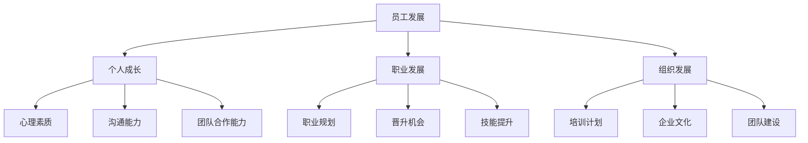
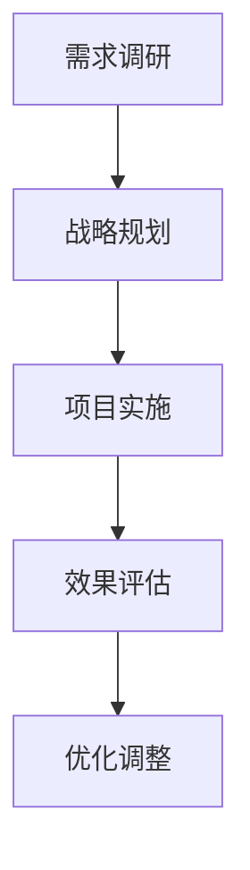
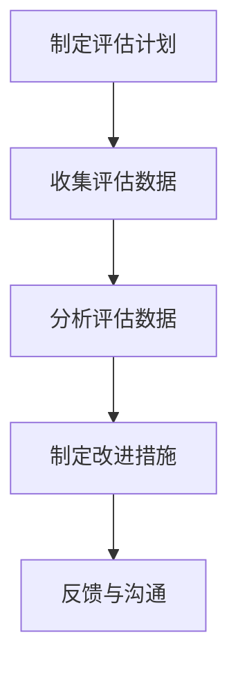
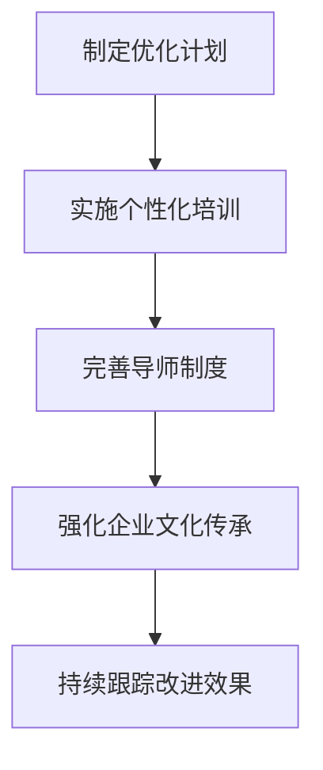

                 

### 文章标题：员工发展：培养未来领导者的策略

在当今竞争激烈的商业环境中，员工发展成为企业战略规划中的关键一环。培养具备领导力和创新精神的高素质人才，不仅能够提升企业的核心竞争力，还能确保企业在未来市场中立于不败之地。本文旨在探讨员工发展的核心概念、战略规划、培养实践以及效果评估，通过逐步分析推理，提供一套切实可行的策略，以培养未来领导者。

关键词：员工发展、领导力培养、战略规划、效果评估、人才培养

摘要：本文通过系统阐述员工发展的核心概念，分析员工发展要素之间的关系，详细讨论员工发展的战略规划与实践，以及评估与优化策略，提出了一套基于逻辑分析和实践总结的培养未来领导者的策略。文章旨在为企业提供一套具有可操作性的员工发展方案，助力企业构建强大的人才储备。

### 目录大纲

以下是本文的目录大纲：

1. **员工发展的核心概念
   1.1 员工发展的定义与重要性
   1.2 员工发展的核心要素

2. **员工发展的策略与实践
   2.1 员工发展的战略规划
   2.2 员工培养与职业规划
   2.3 领导力培养与提升

3. **员工发展的项目实战
   3.1 员工发展项目的实际操作
   3.2 员工发展项目案例解析

4. **员工发展的评估与优化
   4.1 员工发展效果的评估
   4.2 员工发展策略的优化

5. **附录
   5.1 员工发展相关工具与资源

### 员工发展的核心概念

#### 1.1 员工发展的定义与重要性

员工发展是指通过持续的学习、培训和实践，提升员工的个人技能、专业知识和工作能力，从而实现员工职业生涯的成长与进步。在企业发展过程中，员工发展扮演着至关重要的角色。它不仅是企业保持竞争力和持续发展的基础，更是实现员工个人价值和企业价值的双赢战略。

首先，员工发展有助于提升员工的工作满意度和忠诚度。通过提供良好的培训和发展机会，员工能够感受到企业对他们的关注和重视，从而增强对企业的认同感和归属感。这种情感上的投入将促进员工更加努力地工作，提高工作效率和质量。

其次，员工发展能够提升企业的核心竞争力。高素质的员工是企业发展的重要资源，他们不仅能够为企业带来创新思维和创意，还能有效地解决复杂问题，推动企业持续进步。通过系统化的员工发展，企业能够培养出具备领导力和创新精神的人才，从而在激烈的市场竞争中立于不败之地。

#### 1.2 员工发展的核心要素

员工发展的核心要素包括个人成长、职业发展和组织发展。这三个要素相互关联，共同构成员工发展的整体框架。

**个人成长**主要关注员工在心理素质、沟通能力、团队合作能力等方面的提升。个人成长是员工发展的基础，它为员工的职业发展提供必要的素质和能力支撑。

**职业发展**则侧重于员工的职业规划、晋升机会和技能提升。通过明确的职业发展路径和培训计划，员工能够明确自己的发展方向，不断提升专业技能，实现职业生涯的成长。

**组织发展**是企业层面的员工发展策略，它关注企业的整体发展和员工队伍的建设。组织发展不仅包括培训计划的制定和实施，还涉及企业文化、团队建设等方面的工作。

为了更好地理解员工发展的核心要素，我们可以使用Mermaid流程图来展示它们之间的关系：



从流程图中可以看出，员工发展是一个系统性的工程，涉及个人、职业和组织三个层面。只有这三个要素相互协调、共同发展，才能实现员工的全面成长和企业的持续进步。接下来，我们将进一步探讨员工发展的策略与实践。

### 员工发展的策略与实践

#### 2.1 员工发展的战略规划

员工发展的战略规划是企业实现员工全面发展的重要步骤。一个明确的战略规划能够为企业提供清晰的指导方向，确保员工发展工作的系统性和有效性。

首先，企业需要明确员工发展的目标。这些目标应当与企业的整体战略目标相一致，以实现企业愿景和使命。例如，如果企业的战略目标是提升市场竞争力，那么员工发展的目标就应当是培养具备创新思维和解决问题的能力的高素质人才。

接下来，企业需要制定具体的战略措施。这些措施应当包括培训计划、职业规划、晋升机会等方面。为了确保措施的可行性和有效性，企业可以采用以下策略：

1. **定期评估与反馈**：通过定期对员工进行绩效评估和反馈，了解员工的发展现状和需求，从而调整和发展相应的培训计划和职业规划。

2. **多元化培训**：提供多种形式的培训，包括内部培训、外部培训和在线学习，以满足员工的多样化需求。同时，通过邀请行业专家和学者进行讲座和培训，提升员工的视野和知识水平。

3. **导师制度**：建立导师制度，让有经验的员工指导新员工，促进知识的传递和能力的提升。导师制度不仅能够帮助新员工更快地适应工作环境，还能够培养员工的领导力和团队协作能力。

为了更好地理解员工发展战略规划的制定流程，我们可以使用伪代码来描述这个过程：

```python
def develop_employee_strategy():
    # 设定员工发展目标
    set_employee_development_goals()

    # 制定战略措施
    set_strategic_measures()

    # 定期评估与反馈
    perform_regular_evaluation_and_feedback()

    # 实施多元化培训
    implement_diversified_training()

    # 建立导师制度
    establish_mentorship_program()

    # 监控和调整
    monitor_and_adjust_strategies()
```

通过这个伪代码，我们可以清晰地看到员工发展战略规划的步骤和关键点。接下来，我们将探讨如何通过员工培养和职业规划来实现员工的全面发展。

#### 2.2 员工培养与职业规划

员工培养和职业规划是员工发展的核心内容，它们旨在提升员工的技能水平和职业素养，为员工的职业发展提供明确的路径和支持。

**员工培养**是指通过培训和实践，提升员工的综合素质和工作能力。员工培养不仅包括专业技能的提升，还涉及沟通能力、团队合作能力、领导力等方面的培养。以下是一些有效的员工培养策略：

1. **技能培训**：提供针对性的技能培训课程，帮助员工提升专业技能。例如，针对软件开发人员，可以提供编程语言、数据库管理、软件测试等培训课程。

2. **实战演练**：通过实战项目和工作任务，让员工在真实的工作环境中提升能力。例如，组织员工参与项目开发、市场调研、团队建设等活动，培养他们的实战经验和解决问题的能力。

3. **导师辅导**：建立导师辅导制度，让有经验的员工指导新员工。导师不仅能够提供工作经验和技能指导，还能够帮助新员工更快地融入团队，提升团队协作能力。

**职业规划**是指为员工制定明确的职业发展路径和目标，帮助他们实现职业生涯的成长。职业规划不仅包括晋升机会的设定，还涉及职业发展的规划和支持。以下是一些有效的职业规划策略：

1. **职业咨询**：为员工提供职业咨询，帮助他们了解自身的职业兴趣和优势，制定个性化的职业发展计划。

2. **晋升机制**：建立明确的晋升机制，为员工提供公平的晋升机会。例如，制定晋升标准、晋升流程和晋升评估机制，确保晋升过程的公正和透明。

3. **职业发展路径**：为员工设计明确的职业发展路径，包括初级、中级和高级等不同阶段的职业目标和任务。通过明确的发展路径，员工能够清晰地看到自己的职业发展方向，并为之努力。

为了更好地理解员工培养与职业规划的方法，我们可以使用伪代码来描述这个过程：

```python
def employee_development():
    # 提供技能培训
    provide_skill_trainings()

    # 组织实战演练
    organize_practice_projects()

    # 建立导师制度
    establish_mentorship_program()

    # 提供职业咨询
    provide_career_consultation()

    # 建立晋升机制
    establish_promotion_mechanism()

    # 设计职业发展路径
    design_career_path()
```

通过这个伪代码，我们可以清晰地看到员工培养与职业规划的关键步骤和策略。接下来，我们将探讨领导力培养与提升的重要性及其具体方法。

#### 2.3 领导力培养与提升

领导力是企业发展的核心驱动力，优秀的领导者不仅能够带领团队实现目标，还能够激发员工的潜力，推动企业的持续进步。因此，领导力培养与提升成为员工发展的重要环节。

**领导力培养**是指通过培训和辅导，提升员工的领导能力和管理技巧。以下是一些有效的领导力培养策略：

1. **领导力培训课程**：为员工提供系统的领导力培训课程，包括领导力基础、团队管理、决策能力等方面的培训。这些课程可以帮助员工建立领导力框架，提升领导技能。

2. **实践机会**：为员工提供实际领导机会，例如担任项目负责人、团队领导等职务。通过实践，员工能够将理论知识应用到实际工作中，提升领导力。

3. **导师辅导**：建立领导力导师制度，让有经验的领导者指导新晋领导者。导师不仅能够提供工作经验和技能指导，还能够帮助新晋领导者更快地适应领导角色。

**领导力提升**是指通过持续的学习和实践，不断提升领导者的综合素质和影响力。以下是一些有效的领导力提升策略：

1. **自我反思**：领导者需要定期进行自我反思，评估自己的领导效果和不足，制定改进计划。

2. **持续学习**：领导者需要不断学习新的管理理论和实践经验，更新自己的知识体系。

3. **积极沟通**：领导者需要积极与团队成员沟通，了解他们的需求和反馈，建立良好的沟通机制。

为了更好地理解领导力培养与提升的方法，我们可以使用伪代码来描述这个过程：

```python
def develop_leadership():
    # 提供领导力培训课程
    provide_leadership_trainings()

    # 提供实践机会
    provide_leadership_opportunities()

    # 建立导师制度
    establish_mentorship_program()

    # 自我反思
    perform_self_reflection()

    # 持续学习
    continue_learning()

    # 积极沟通
    engage_in_active_communication()
```

通过这个伪代码，我们可以清晰地看到领导力培养与提升的关键步骤和策略。接下来，我们将探讨员工发展的项目实战，通过实际案例展示员工发展策略的实施过程和效果。

### 员工发展的项目实战

为了更好地理解和应用员工发展策略，我们可以通过一个实际案例来展示项目实施的全过程，包括项目背景、目标、实施步骤和效果评估。

#### 项目背景

某科技公司是一家专注于软件开发和互联网服务的创新企业，员工总数超过500人。随着市场竞争的加剧和企业规模的扩大，公司意识到需要通过系统化的员工发展策略来提升员工的综合素质和领导力，以保持企业的核心竞争力。

#### 项目目标

该项目的主要目标是：
1. 提升员工的技能水平和职业素养；
2. 培养一批具备领导力和创新精神的骨干员工；
3. 建立一套完善的员工发展体系和评估机制。

#### 实施步骤

1. **需求调研**：
   - 通过问卷调查和访谈，了解员工的发展需求和职业规划；
   - 分析公司现有的培训资源和晋升机制，发现存在的问题和改进方向。

2. **战略规划**：
   - 制定员工发展的长期和短期目标；
   - 设定具体的战略措施，包括培训计划、导师制度、晋升机制等。

3. **项目实施**：
   - 开展多样化的培训课程，包括专业技能培训、领导力培训、团队建设等；
   - 实施导师制度，为新员工和有潜力的员工配备导师；
   - 定期组织实战项目和团队活动，提升员工的实战经验和团队合作能力。

4. **效果评估**：
   - 通过绩效评估和员工满意度调查，评估员工发展项目的效果；
   - 根据评估结果，调整和优化员工发展策略。

#### 项目效果

通过实施员工发展项目，公司取得了显著的效果：

1. **员工满意度提升**：
   - 员工对公司的认可度和忠诚度显著提高；
   - 员工对培训项目和晋升机制的满意度也显著提升。

2. **领导力提升**：
   - 新晋领导者的领导能力得到显著提升；
   - 骨干员工的领导力和影响力增强，推动了团队的整体发展。

3. **企业竞争力提升**：
   - 员工的技能水平和职业素养显著提升；
   - 企业在市场中的竞争力得到巩固和提升。

为了更好地展示项目实施的过程和关键点，我们可以使用Mermaid流程图来描述：



通过这个流程图，我们可以清晰地看到项目实施的全过程和关键环节。接下来，我们将探讨员工发展的评估与优化，以确保员工发展策略的有效性和持续性。

### 员工发展的评估与优化

#### 8.1 员工发展效果的评估

员工发展效果的评估是确保员工发展策略有效性的关键步骤。通过科学的评估方法，企业能够了解员工发展项目的实际效果，发现问题并进行优化。以下是一些常用的员工发展效果评估方法：

1. **绩效评估**：
   - 绩效评估是评估员工工作表现和技能提升的重要手段。通过定期对员工进行绩效评估，企业可以了解员工在培训项目中的表现和进步情况。
   - 评估指标可以包括工作质量、工作效率、团队协作能力、创新思维等方面。

2. **360度反馈**：
   - 360度反馈是一种全方位的评估方法，通过收集来自员工上级、同事和下属的反馈，全面了解员工在工作中的表现和潜力。
   - 这种方法能够提供多角度的评估结果，帮助企业更准确地了解员工的综合素质和发展需求。

3. **员工满意度调查**：
   - 通过员工满意度调查，企业可以了解员工对培训项目、晋升机制和企业文化的满意度。
   - 满意度调查可以采用问卷形式，收集员工的意见和建议，为企业提供改进方向。

为了更好地理解这些评估方法，我们可以使用Mermaid流程图来展示评估的流程和关键环节：



#### 8.2 员工发展策略的优化

在了解员工发展效果的基础上，企业需要根据评估结果对员工发展策略进行优化。以下是一些优化策略：

1. **持续改进**：
   - 根据评估结果，识别出需要改进的方面，制定具体的改进措施，并持续跟踪改进效果。
   - 持续改进是一个循环的过程，通过不断的评估和调整，确保员工发展策略的持续优化。

2. **个性化培训**：
   - 根据员工的个性化需求和发展目标，提供个性化的培训计划。
   - 个性化培训能够更好地满足员工的发展需求，提高培训效果。

3. **导师制度的完善**：
   - 优化导师制度，确保导师能够提供有效的指导和支持。
   - 定期对导师进行培训和评估，提高导师的指导质量和水平。

4. **企业文化与价值观的传承**：
   - 强化企业文化与价值观的传承，确保员工在发展过程中能够深入了解和认同企业的文化。
   - 通过企业文化活动、内部培训等方式，加强员工的归属感和认同感。

为了更好地理解优化策略的实施过程，我们可以使用Mermaid流程图来展示：



通过这些优化策略，企业能够确保员工发展策略的有效性和持续性，为员工的成长和企业的发展提供坚实的基础。接下来，我们将推荐一些与员工发展相关的工具和资源，以供读者参考。

### 附录：员工发展相关工具与资源

为了更好地支持员工发展，以下推荐一些与员工发展相关的工具和资源：

1. **培训平台**：
   - **LinkedIn Learning**：提供丰富的在线课程，涵盖多个领域的专业知识和技能。
   - **Coursera**：全球领先的在线学习平台，与知名大学和机构合作提供高质量的课程。
   - **Udemy**：提供多样化的课程，适合不同水平和需求的学习者。

2. **绩效评估工具**：
   - **Officevibe**：一款员工满意度调查工具，帮助企业了解员工的情感状态和工作体验。
   - **15Five**：一款员工绩效管理和反馈工具，支持定期评估和目标设定。

3. **团队协作工具**：
   - **Trello**：一款任务管理工具，帮助团队高效地规划和管理项目。
   - **Slack**：一款即时通讯工具，支持团队协作和沟通。

4. **领导力发展工具**：
   - **StrengthsFinder**：一款个性评估工具，帮助领导者了解自身的优势，提升领导力。
   - **Lumina Learning**：一款综合能力评估工具，提供全面的领导力发展报告。

5. **参考文献**：
   - **《领导力的五个层次》**：作者：拉姆·查兰，介绍领导力的不同层次和提升方法。
   - **《员工培训与开发》**：作者：詹姆斯·K·哈特利，详细介绍员工培训与开发的理论和实践。

通过这些工具和资源，企业可以更有效地支持和推动员工发展，提升员工的综合素质和领导力。作者信息：

作者：AI天才研究院/AI Genius Institute & 禅与计算机程序设计艺术 /Zen And The Art of Computer Programming

### 结语

员工发展是企业可持续发展的关键，通过系统化的培养和有效的策略，企业能够提升员工的综合素质和领导力，为企业的长远发展奠定坚实基础。本文从员工发展的核心概念、策略与实践、项目实战、评估与优化等多个方面进行了深入探讨，提供了一套全面而实用的员工发展方案。希望本文能够为企业和领导者提供有益的参考和启示，助力企业在未来市场中立于不败之地。让我们共同努力，打造一个更加美好和繁荣的职场环境。

