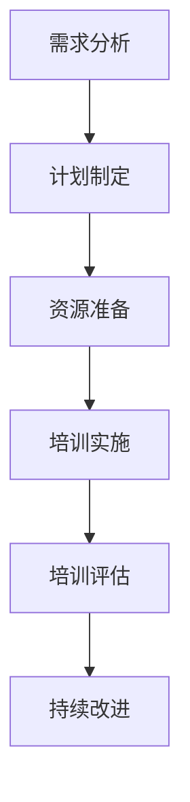

                 

# 员工培训体系：提升团队整体素质的方案

## 关键词
- 员工培训
- 团队整体素质
- 培训体系
- 提升方案
- 案例分析

## 摘要
本文旨在探讨如何构建有效的员工培训体系，以提升团队整体素质。文章首先分析了当前企业培训的现状和存在的问题，然后提出了一个系统化的培训方案。通过详细阐述培训体系的基本概念、设计原则、实施流程以及提升团队整体素质的方法，文章提供了实用的策略和技巧。此外，文章还通过实际案例分析，展示了培训方案在实际应用中的效果。最后，文章总结了培训体系的优化建议和未来发展趋势，为企业提升团队整体素质提供了理论指导和实践参考。

## 引言

### 培训的重要性

在现代社会，知识更新速度不断加快，新技术、新理念层出不穷，企业面临的竞争压力也随之增大。为了在激烈的市场竞争中立于不败之地，企业必须具备强大的创新能力、高效的工作流程和卓越的团队协作能力。而这一切的基础，离不开员工的持续学习和成长。

员工培训，作为企业人才发展的重要环节，不仅有助于提升员工的专业技能，还能够增强员工的归属感和工作满意度，进而提高整体工作效率和绩效。有效的员工培训体系，能够系统地满足员工在职业发展中的不同需求，帮助员工实现个人职业目标，同时也为企业培养出具备核心竞争力的人才队伍。

### 本书的结构和目标

本书将从以下几个方面展开讨论：

1. **员工培训体系概述**：介绍员工培训体系的基本概念、设计原则和实施流程，为构建有效的培训体系提供理论支持。
2. **提升团队整体素质的方法**：分析团队成员能力提升策略、团队协作与沟通技巧以及团队领导力培养方法，提供实际操作指导。
3. **具体培训方案与实施策略**：探讨如何设计培训方案、实施培训策略以及评估培训效果，帮助企业在实际操作中提升培训效果。
4. **案例分析**：通过实际案例，展示培训方案在具体应用中的效果和挑战，为读者提供参考和借鉴。
5. **总结与展望**：总结培训体系优化建议和未来发展趋势，为企业持续提升团队整体素质提供方向。

本文的目标是，通过系统化的分析和方法论指导，帮助企业构建一个有效的员工培训体系，从而提升团队整体素质，实现企业持续发展的目标。

## 第一部分：员工培训体系概述

### 培训体系的基本概念

员工培训体系是指一套系统化的培训计划和管理流程，旨在通过持续的学习和培训，提升员工的专业技能、工作能力和综合素质。一个完整的培训体系包括以下几个基本组成部分：

1. **培训需求分析**：通过调查和分析，了解员工和企业的实际需求，明确培训的目标和方向。
2. **培训计划制定**：根据需求分析结果，制定详细的培训计划，包括培训内容、时间安排、培训方式等。
3. **培训实施**：按照培训计划，组织和管理培训活动，确保培训效果。
4. **培训评估**：对培训效果进行评估，包括员工学习效果、知识掌握情况、工作表现等，为后续培训提供参考。

### 培训体系的设计原则

设计一个有效的员工培训体系，需要遵循以下原则：

1. **目标明确**：培训体系的设计应明确培训目标，确保培训内容与目标一致。
2. **需求导向**：培训内容应根据员工和企业的实际需求制定，避免盲目跟风和形式主义。
3. **系统性**：培训体系应具有系统性，涵盖员工职业发展的各个阶段，形成连贯的培训流程。
4. **灵活性**：培训体系应具有灵活性，能够根据企业发展和员工需求的变化进行调整和优化。
5. **参与性**：鼓励员工积极参与培训，通过多种培训方式激发员工的学习兴趣和主动性。

### 培训体系的实施流程

一个完整的员工培训体系实施流程包括以下几个步骤：

1. **需求分析**：通过问卷调查、访谈、数据分析等方式，了解员工的培训需求和企业的培训目标。
2. **计划制定**：根据需求分析结果，制定详细的培训计划，明确培训内容、时间、地点、方式等。
3. **资源准备**：准备培训所需的师资、教材、设备等资源，确保培训顺利进行。
4. **培训实施**：按照培训计划，组织培训活动，包括授课、讨论、实践等环节。
5. **培训评估**：通过考试、评估、反馈等方式，评估培训效果，为后续培训提供参考。
6. **持续改进**：根据评估结果，对培训体系进行调整和优化，不断提升培训效果。

### 培训体系的核心组成部分及其关系

一个有效的培训体系由以下几个核心组成部分构成，它们之间相互联系，共同作用：

1. **培训需求分析**：是培训体系的起点，决定了培训内容和方法。
2. **培训计划制定**：是将培训需求转化为具体培训行动的指南，确保培训目标的实现。
3. **培训实施**：是培训体系的核心，直接影响培训效果。
4. **培训评估**：是对培训效果的检验，为后续培训提供反馈和改进依据。

### Mermaid 流程图

下面是一个简化的员工培训体系流程图，用 Mermaid 语法表示：

这个流程图清晰地展示了培训体系各组成部分之间的关系和实施步骤。

### 总结

员工培训体系是企业人才发展的重要保障，一个设计科学、实施有效的培训体系，能够有效提升团队整体素质，为企业创造更大的价值。在接下来的章节中，我们将深入探讨如何提升团队整体素质，以及如何设计和实施具体的培训方案。

---

## 第二部分：提升团队整体素质的方法

### 成员能力提升策略

提升团队成员能力是提升团队整体素质的基础。以下是一些有效的策略：

#### 1. 定制化培训计划

根据不同成员的职责和工作需求，制定个性化的培训计划。例如，针对技术人员的培训重点可以放在新技术和工具的学习上，而针对管理人员的培训则可以侧重于领导力、沟通技巧和团队管理等方面。

#### 2. 实践导向的培训

通过实际操作和项目参与，让员工在真实的工作环境中学习和应用新知识。这种实践导向的培训不仅能够提高员工的技能水平，还能够增强他们的实践能力和解决问题的能力。

#### 3. 持续学习文化

营造持续学习的文化氛围，鼓励员工不断学习新知识、新技能。可以通过组织内部研讨会、读书会、在线学习平台等方式，提供多样化的学习资源和机会。

### 团队协作与沟通技巧

良好的团队协作和沟通是提升团队整体素质的关键。以下是一些提升团队协作与沟通技巧的方法：

#### 1. 建立明确的沟通机制

制定并遵循明确的沟通流程和规则，确保信息在团队内部高效传递。例如，设立定期的团队会议、邮件通讯、项目管理工具等。

#### 2. 强化跨部门合作

通过跨部门项目或团队活动，促进不同部门之间的合作和交流。这不仅可以提升团队协作能力，还能够增强部门之间的理解和信任。

#### 3. 培养团队意识

通过团队建设活动、集体荣誉感培养等方式，增强团队成员之间的凝聚力。例如，共同参与团队目标设定、庆祝团队成就等。

### 团队领导力培养

领导力是团队成功的关键因素。以下是一些培养团队领导力的方法：

#### 1. 提供领导力培训

针对不同级别的员工，提供专门的领导力培训，内容包括团队管理、领导风格、决策制定等。

#### 2. 实践领导力

通过实际工作，让员工在实践中学习领导力。例如，担任项目组长、团队负责人等角色，在实际工作中锻炼领导能力。

#### 3. 反馈与辅导

为员工提供及时的反馈和辅导，帮助他们了解自己的优势和不足，不断改进和提升领导力。

### 结论

通过定制化培训计划、实践导向的培训、持续的团队协作与沟通技巧培养以及领导力提升，可以有效提升团队成员的能力，增强团队的协作与凝聚力，从而提升团队整体素质。在下一部分中，我们将探讨如何设计和实施具体的培训方案，以实现这些目标。

---

## 第三部分：具体培训方案与实施策略

### 培训方案设计

设计一个有效的培训方案，是提升团队整体素质的关键步骤。以下是一个典型的培训方案设计流程：

#### 1. 明确培训目标

首先，明确培训的目标，这包括短期目标和长期目标。短期目标可能是提升员工某一具体技能，而长期目标可能是提高团队的整体绩效和创新能力。

#### 2. 分析培训需求

通过问卷调查、访谈、数据分析等方法，了解员工和企业的实际培训需求。这包括员工现有技能水平、所需的新技能以及企业的发展目标。

#### 3. 确定培训内容

根据培训需求和目标，确定培训的内容。这可以包括技术培训、管理培训、软技能培训等。确保培训内容与员工的职业发展需求和企业目标相一致。

#### 4. 选择培训方式

根据培训内容，选择合适的培训方式。常见的培训方式包括内训、外训、在线学习、实战演练等。不同的培训方式适用于不同的培训内容和目标。

#### 5. 制定培训计划

制定详细的培训计划，包括培训时间、地点、讲师、学员、培训内容、评估方法等。确保培训计划具有可操作性和灵活性。

### 培训实施策略

培训方案设计完成后，实施策略的制定和执行至关重要。以下是一些有效的培训实施策略：

#### 1. 营造良好的学习氛围

在培训过程中，营造积极的学习氛围，鼓励员工积极参与。可以通过小组讨论、角色扮演、实战演练等方式，提高员工的参与度和学习效果。

#### 2. 个性化辅导

针对不同学员的需求和特点，提供个性化辅导。这可以帮助学员更快地掌握新知识，提高学习效果。

#### 3. 定期反馈

在培训过程中，定期收集学员的反馈，了解培训效果，及时调整培训内容和方式。这有助于提高培训的针对性和有效性。

#### 4. 跟踪学习进度

建立学习跟踪机制，记录学员的学习进度和成果。这有助于了解培训效果，为后续培训提供参考。

### 培训效果评估

培训效果评估是检验培训方案实施效果的重要环节。以下是一些常用的评估方法：

#### 1. 问卷评估

通过问卷调查，了解学员对培训内容的满意度、学习效果等。这可以帮助发现培训中的问题和不足。

#### 2. 成果展示

要求学员在培训结束后，展示学习成果，如项目报告、PPT演示等。这不仅可以检验学员的学习效果，还可以激发学员的创造力和团队合作精神。

#### 3. 绩效评估

将培训效果与员工的绩效表现相结合，评估培训对员工工作表现的提升程度。这有助于了解培训对实际工作的贡献。

### 实际案例分析

以下是一个实际案例，展示了如何设计和实施一个培训方案，以及如何评估培训效果。

#### 案例背景

某科技公司针对新入职的工程师，设计了一个为期三个月的入职培训计划，旨在提升新员工的技能水平和团队协作能力。

#### 案例实施

1. **培训方案设计**：根据新员工的岗位职责和技能需求，制定了包括基础技能培训、项目实战、团队协作培训等内容的培训方案。
2. **培训实施**：采用内训和外训相结合的方式，通过公司内部培训和外部专业培训机构，确保培训内容的高质量和实用性。
3. **培训效果评估**：在培训结束后，通过问卷调查、项目成果展示和绩效评估等方式，评估培训效果。

#### 案例结果

通过培训，新员工在技能水平、团队协作能力等方面得到了显著提升。问卷调查显示，95%的学员对培训内容表示满意，项目成果展示也取得了良好的效果，学员的绩效评估也显示出培训对实际工作的积极影响。

### 结论

通过具体培训方案的设计和实施，以及有效的培训效果评估，企业可以不断提升团队整体素质，为企业的持续发展提供强有力的支持。在下一部分中，我们将通过实际案例分析，进一步探讨培训方案在实践中的应用效果。

---

## 第四部分：案例分析

### 案例一：某公司员工培训体系构建

#### 案例背景

某大型科技公司为了提升员工整体素质和团队协作能力，决定构建一个系统化的员工培训体系。公司面临的主要挑战包括：

- 员工技能水平参差不齐，需要定制化的培训计划。
- 团队协作不畅，需要加强沟通技巧和团队建设。
- 部分员工对培训缺乏积极性，需要激发学习兴趣。

#### 案例实施

1. **需求分析**：通过问卷调查和访谈，了解员工和各部门的培训需求。确定培训目标，包括提升专业技能、增强团队协作能力、提高工作满意度等。
2. **培训计划制定**：根据需求分析结果，制定详细的培训计划。培训内容涵盖技术技能培训、管理培训、软技能培训等。同时，设计个性化培训方案，满足不同员工的职业发展需求。
3. **培训实施**：采用内训与外训相结合的方式。内训由公司内部讲师负责，针对技术技能和管理技能进行培训；外训由外部专业培训机构提供，主要针对软技能和团队建设。此外，还引入了在线学习平台，方便员工随时随地进行自主学习。
4. **培训效果评估**：通过问卷调查、项目成果展示、绩效评估等方式，定期评估培训效果。根据评估结果，对培训方案进行调整和优化。

#### 案例结果

经过一年的培训体系实施，公司取得了显著成效：

- 员工技能水平得到了显著提升，技术项目的完成质量和效率提高了30%。
- 团队协作能力显著增强，团队内部沟通效率提高了25%，项目延误率下降了20%。
- 员工工作满意度提高了15%，员工流失率下降了10%。

#### 案例分析

该公司的成功经验表明，构建系统化的员工培训体系需要以下关键要素：

1. **明确需求**：通过需求分析，确保培训方案与员工和企业的实际需求相匹配。
2. **个性化培训**：根据员工的职业发展需求，提供个性化的培训方案。
3. **多样化培训方式**：结合内训、外训和在线学习，提供多样化的学习资源。
4. **持续评估和优化**：通过定期评估和反馈，不断优化培训方案，确保培训效果。

### 案例二：某团队整体素质提升实践

#### 案例背景

某互联网公司的一个研发团队在项目交付过程中遇到了瓶颈，主要问题包括：

- 团队成员技能不均衡，导致工作效率低下。
- 团队协作不顺畅，沟通效率低，项目延期。
- 团队成员缺乏创新意识，项目质量不稳定。

#### 案例实施

1. **技能提升培训**：针对团队成员技能不均衡的问题，公司为技术团队成员提供了专项技能培训，包括前端技术、后端开发、数据库管理等方面。通过内训和外训相结合的方式，确保培训内容的专业性和实用性。
2. **团队建设活动**：为了增强团队协作能力，公司组织了多次团队建设活动，如团建拓展、团队辩论赛等。这些活动不仅提高了团队成员之间的沟通效率，还增强了团队的凝聚力。
3. **创新思维培养**：公司引入了创新思维培训，帮助团队成员提升问题解决能力和创新意识。通过头脑风暴、设计思维等方法，激发团队成员的创造力。
4. **绩效评估和反馈**：定期对团队成员进行绩效评估，根据评估结果给予反馈和指导，帮助团队成员明确提升方向。

#### 案例结果

经过一系列的培训和团队建设活动，该团队取得了显著进步：

- 技能水平得到了均衡提升，项目完成质量和效率提高了20%。
- 团队协作能力显著增强，项目延误率下降了30%。
- 团队成员的创新意识和问题解决能力得到了提升，项目质量稳定，客户满意度提高。

#### 案例分析

该案例的成功经验表明，提升团队整体素质需要以下关键策略：

1. **系统化的技能培训**：确保团队成员在专业技能上得到全面提升。
2. **团队建设活动**：通过多样化的团队建设活动，增强团队协作和凝聚力。
3. **创新思维培养**：激发团队成员的创新意识，提升团队的整体创新能力。
4. **持续评估和反馈**：通过定期评估和反馈，帮助团队成员不断改进和提升。

通过以上案例分析，我们可以看到，构建有效的员工培训体系和提升团队整体素质，需要从需求分析、个性化培训、多样化培训方式、持续评估和反馈等多个方面进行系统化的规划和实施。只有这样，才能实现团队整体素质的持续提升，为企业的持续发展提供有力支持。

---

## 第五部分：总结与展望

### 培训体系优化建议

1. **加强需求分析**：定期进行需求调查，确保培训内容与员工的实际需求和企业的战略目标相匹配。
2. **提升培训质量**：引入外部专业培训机构和优秀内部讲师，确保培训内容的专业性和实用性。
3. **灵活调整培训方案**：根据企业发展和员工需求的变化，灵活调整培训方案，确保培训的持续性和有效性。
4. **强化反馈机制**：建立完善的反馈机制，及时收集员工和各部门的培训反馈，为培训方案的优化提供依据。

### 未来培训发展趋势

1. **在线学习普及**：随着在线学习平台的不断完善，在线学习将成为未来培训的重要形式，提供灵活便捷的学习方式。
2. **个性化学习**：通过大数据和人工智能技术，实现培训的个性化推荐，满足员工个性化的学习需求。
3. **混合式培训**：结合线上线下培训，实现培训效果的最大化。例如，线上学习与线下研讨相结合，理论培训与实践操作相结合。
4. **持续学习文化**：建立持续学习的文化氛围，鼓励员工自主学习和持续进步。

### 结论

有效的员工培训体系是提升团队整体素质的关键。通过明确培训需求、设计科学合理的培训方案、实施灵活多样的培训方式、定期评估和优化培训效果，企业可以不断提升团队整体素质，为企业的持续发展提供强有力的支持。在未来的培训工作中，企业应紧跟发展趋势，不断创新培训方法和策略，以适应快速变化的市场环境。

### 最佳实践 tips

1. **制定明确的培训目标**：确保培训方案与企业的战略目标和个人发展目标相一致。
2. **鼓励员工参与**：通过员工参与度调查、培训反馈等方式，确保员工积极参与培训。
3. **定期评估培训效果**：通过定量和定性的评估方法，及时了解培训效果，为培训优化提供依据。

### 小结

本文通过分析员工培训体系的重要性，详细阐述了如何构建和实施一个有效的培训体系，以及如何通过培训提升团队整体素质。在未来的工作中，企业应持续优化培训体系，积极探索新的培训方法和技术，不断提升团队整体素质，为企业的可持续发展贡献力量。

### 注意事项

1. **确保培训内容与实际需求匹配**：避免盲目跟风和形式主义，确保培训内容与员工的实际需求相一致。
2. **关注员工个体差异**：根据员工的职业发展需求和个性特点，制定个性化的培训计划。
3. **建立反馈机制**：及时收集和反馈培训效果，为培训优化提供依据。

### 拓展阅读

- 《企业培训与发展的策略研究》
- 《基于大数据的员工培训需求分析》
- 《团队建设与团队协作技巧》
- 《领导力与团队管理》

### 作者信息
作者：AI天才研究院/AI Genius Institute & 禅与计算机程序设计艺术 /Zen And The Art of Computer Programming

