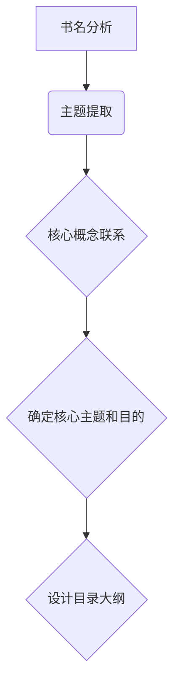
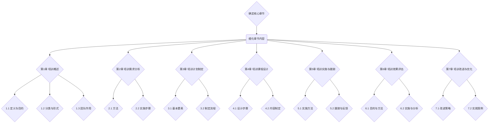
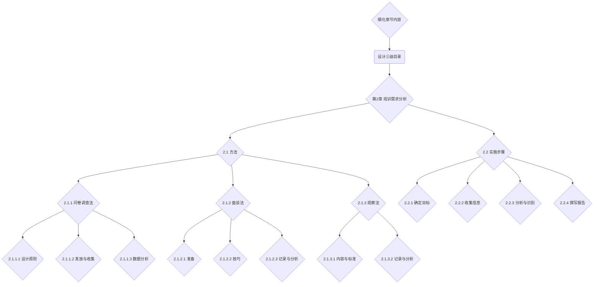
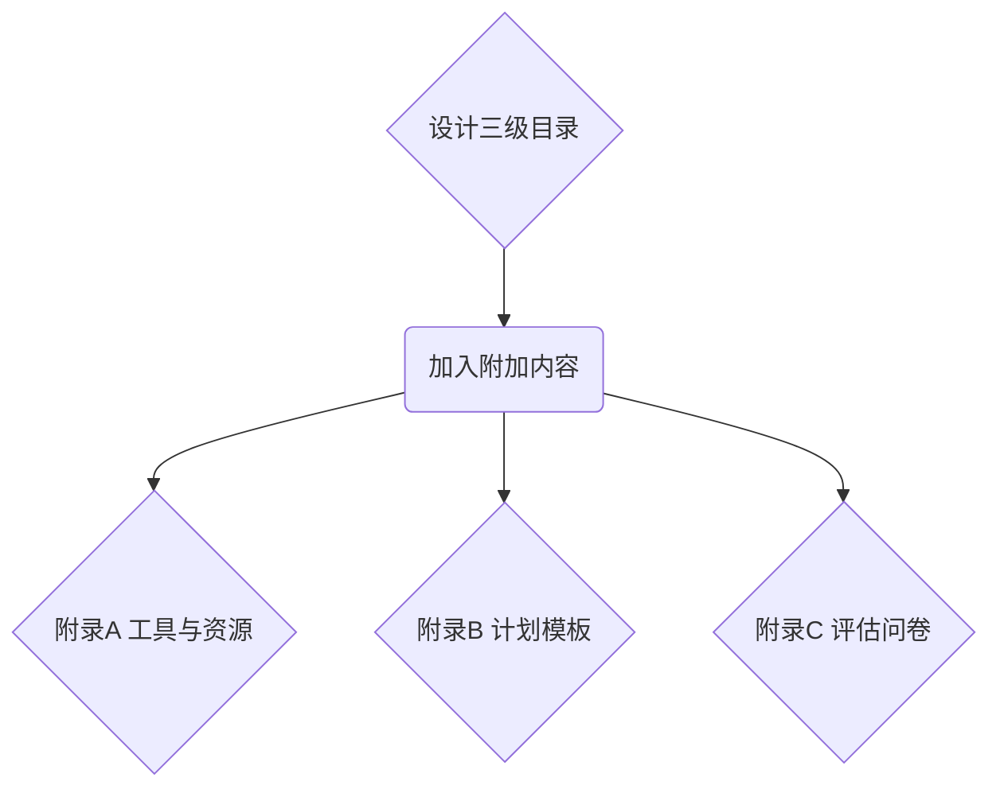
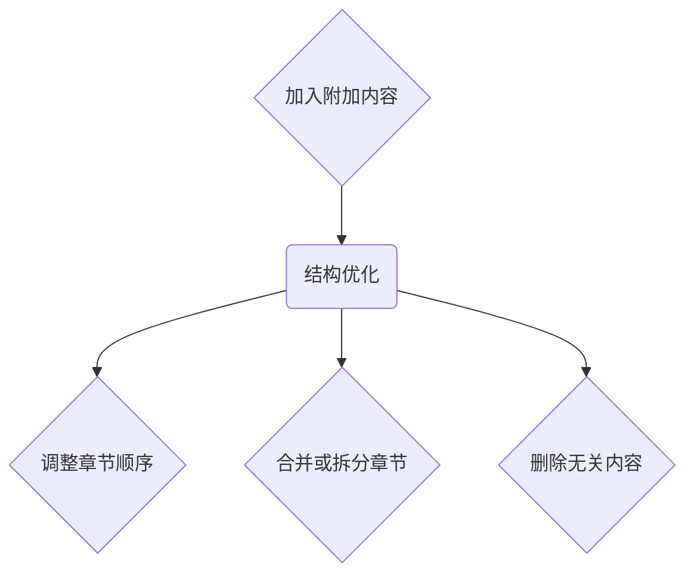
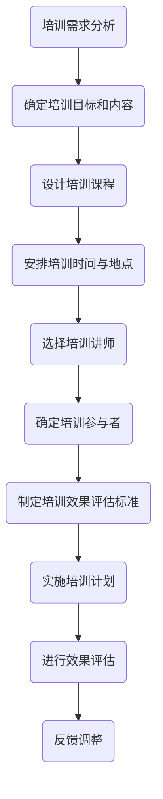
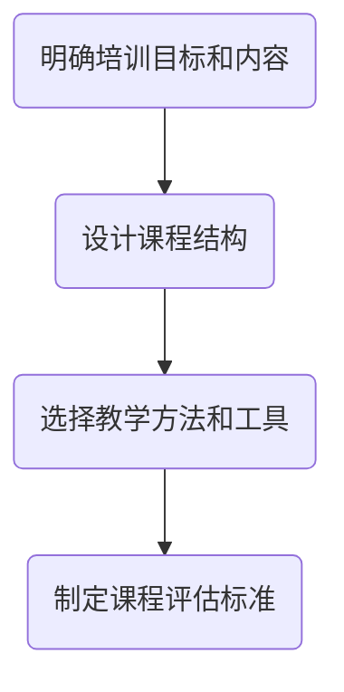

                 

### 文章标题

《员工培训：提升团队整体素质》

### 关键词

员工培训、团队整体素质、培训需求分析、培训计划制定、培训课程设计、培训效果评估、培训改进与优化

### 摘要

本文旨在深入探讨员工培训对于提升团队整体素质的重要性，从培训需求分析、培训计划制定、培训课程设计、培训实施与跟踪、培训效果评估到培训改进与优化，全面梳理员工培训的各个环节。通过详细的案例分析、流程图、伪代码、数学模型、公式以及实战项目解析，本文为读者提供了系统的理论指导和实用的操作建议，帮助企业和团队有效提升员工素质，增强整体竞争力。

## 设计书籍目录大纲的步骤

### 第一步：分析书名和主题

#### 背景介绍

书籍目录大纲的设计是编写书籍过程中的关键环节，它不仅决定了书籍的结构和逻辑，也影响着读者的阅读体验和理解能力。一个好的目录大纲应具备清晰、简洁、连贯的特点，能够准确地传达书籍的核心内容和结构。

#### 核心概念与联系

书名《员工培训：提升团队整体素质》中包含了以下几个核心概念：

- **员工培训**：指为了提高员工的知识、技能和态度而进行的有计划、有组织的教育活动。
- **团队整体素质**：指团队成员在知识、技能、态度等方面的综合水平，是团队高效运作的基础。
- **书名与主题联系**：书名直接点明了书籍的主题——员工培训，并明确了培训的目的——提升团队整体素质。

#### Mermaid 流程图



### 第二步：确定核心章节

#### 背景介绍

在分析书名和主题之后，我们需要确定书籍的核心章节，这些章节应该覆盖员工培训的各个方面，确保内容的全面性和系统性。

#### 核心章节

- **第1章 培训概述**：介绍培训的定义、目的和重要性。
- **第2章 培训需求分析**：讨论如何进行培训需求分析。
- **第3章 培训计划制定**：讲述如何制定有效的培训计划。
- **第4章 培训课程设计**：探讨培训课程的设计原则和步骤。
- **第5章 培训实施与跟踪**：讲解培训的具体实施方法和跟踪策略。
- **第6章 培训效果评估**：分析培训效果评估的方法和步骤。
- **第7章 培训改进与优化**：提供培训改进和优化的策略和案例。

#### Mermaid 流程图


### 第三步：细化章节内容

#### 背景介绍

核心章节确定后，我们需要进一步细化每个章节的内容，列出具体的二级目录和三级目录，确保每个章节都有明确的内容重点和结构。

#### 核心章节细化

- **第1章 培训概述**
  - **1.1 培训的定义与目的**
  - **1.2 培训的分类与形式**
  - **1.3 培训在团队发展中的作用**

- **第2章 培训需求分析**
  - **2.1 需求分析的方法**
    - **2.1.1 问卷调查法**
    - **2.1.2 面谈法**
    - **2.1.3 观察法**
  - **2.2 需求分析的实施步骤**

- **第3章 培训计划制定**
  - **3.1 培训计划的基本要素**
    - **3.1.1 培训目标**
    - **3.1.2 培训内容**
    - **3.1.3 培训时间与地点**
    - **3.1.4 培训讲师与参与者**
  - **3.2 培训计划的制定流程**

- **第4章 培训课程设计**
  - **4.1 课程设计的步骤**
    - **4.1.1 明确培训目标和内容**
    - **4.1.2 设计课程结构**
    - **4.1.3 选择教学方法和工具**
    - **4.1.4 制定课程评估标准**
  - **4.2 课程内容的制定**

- **第5章 培训实施与跟踪**
  - **5.1 培训实施的方法**
    - **5.1.1 课堂授课**
    - **5.1.2 实践操作**
    - **5.1.3 案例分析**
  - **5.2 培训跟踪与反馈**

- **第6章 培训效果评估**
  - **6.1 评估的目的与方法**
    - **6.1.1 评估的目的**
    - **6.1.2 评估的方法**
  - **6.2 评估的实施与结果分析**

- **第7章 培训改进与优化**
  - **7.1 改进培训效果的策略**
    - **7.1.1 提升培训内容的质量**
    - **7.1.2 优化培训流程**
    - **7.1.3 增强培训讲师的能力**
  - **7.2 培训优化的实践案例**

#### Mermaid 流程图



### 第四步：设计三级目录

#### 背景介绍

在细化章节内容之后，我们还需要进一步设计三级目录，以便为每个小节提供更详细的内容和结构。

#### 三级目录示例

- **第2章 培训需求分析**
  - **2.1 需求分析的方法**
    - **2.1.1 问卷调查法**
      - **2.1.1.1 问卷设计原则**
      - **2.1.1.2 问卷发放与收集**
      - **2.1.1.3 问卷数据分析**
    - **2.1.2 面谈法**
      - **2.1.2.1 面谈准备**
      - **2.1.2.2 面谈技巧**
      - **2.1.2.3 面谈记录与分析**
    - **2.1.3 观察法**
      - **2.1.3.1 观察内容与标准**
      - **2.1.3.2 观察记录与分析**
  - **2.2 需求分析的实施步骤**
    - **2.2.1 确定分析目标**
    - **2.2.2 收集相关信息**
    - **2.2.3 分析信息与识别需求**
    - **2.2.4 撰写需求分析报告**

#### Mermaid 流程图



### 第五步：加入附加内容

#### 背景介绍

为了使书籍内容更加丰富和实用，我们可以在核心章节之外添加附录部分，包括案例研究、实践指南、工具和资源等。

#### 附加内容

- **附录A 常用培训工具与资源**：介绍各种培训工具和资源的名称、用途和使用方法。
- **附录B 培训计划模板**：提供培训计划的基本模板，包括计划目标、内容、时间安排等。
- **附录C 培训效果评估问卷模板**：提供培训效果评估问卷的模板，帮助读者设计和使用问卷。

#### Mermaid 流程图



### 第六步：结构优化

#### 背景介绍

在完成初步的目录设计后，我们需要对目录结构进行优化，确保章节之间的逻辑关系清晰、内容连贯，同时保持目录的简洁性。

#### 结构优化

- **优化章节顺序**：根据内容的逻辑关系和重要程度，调整章节的顺序，使读者更容易理解。
- **合并或拆分章节**：对于内容重复或过于庞大难以理解的章节，可以考虑合并或拆分，使内容更加精简和具体。
- **删除无关内容**：确保每个章节都有明确的主题和内容，避免出现空章或无关内容。

#### Mermaid 流程图



### 第七步：撰写目录大纲

#### 背景介绍

在完成所有步骤后，我们使用Markdown格式撰写最终的目录大纲，确保目录结构清晰、简洁、易懂。

#### 目录大纲示例

```
# 《员工培训：提升团队整体素质》目录大纲

## 第1章 培训概述
### 1.1 培训的定义与目的
### 1.2 培训的分类与形式
### 1.3 培训在团队发展中的作用

## 第2章 培训需求分析
### 2.1 需求分析的方法
#### 2.1.1 问卷调查法
#### 2.1.2 面谈法
#### 2.1.3 观察法
### 2.2 需求分析的实施步骤

## 第3章 培训计划制定
### 3.1 培训计划的基本要素
#### 3.1.1 培训目标
#### 3.1.2 培训内容
#### 3.1.3 培训时间与地点
#### 3.1.4 培训讲师与参与者
### 3.2 培训计划的制定流程

## 第4章 培训课程设计
### 4.1 课程设计的步骤
#### 4.1.1 明确培训目标和内容
#### 4.1.2 设计课程结构
#### 4.1.3 选择教学方法和工具
#### 4.1.4 制定课程评估标准
### 4.2 课程内容的制定

## 第5章 培训实施与跟踪
### 5.1 培训实施的方法
#### 5.1.1 课堂授课
#### 5.1.2 实践操作
#### 5.1.3 案例分析
### 5.2 培训跟踪与反馈

## 第6章 培训效果评估
### 6.1 评估的目的与方法
#### 6.1.1 评估的目的
#### 6.1.2 评估的方法
### 6.2 评估的实施与结果分析

## 第7章 培训改进与优化
### 7.1 改进培训效果的策略
#### 7.1.1 提升培训内容的质量
#### 7.1.2 优化培训流程
#### 7.1.3 增强培训讲师的能力
### 7.2 培训优化的实践案例

## 附录
### 附录A 常用培训工具与资源
### 附录B 培训计划模板
### 附录C 培训效果评估问卷模板
```

### 注意事项

- **简洁明了**：目录要简洁明了，避免过多的文字描述。
- **确保内容完整性**：每个章节都要有具体的内容，避免出现空章。
- **保持一致性**：确保目录的完整性和一致性，避免章节之间的内容重复或遗漏。

## 设计书籍目录大纲的步骤总结

设计书籍目录大纲是一个系统而细致的过程，包括分析书名和主题、确定核心章节、细化章节内容、设计三级目录、加入附加内容、结构优化以及撰写目录大纲。通过这些步骤，我们可以确保书籍目录结构清晰、内容连贯、逻辑性强，为读者提供良好的阅读体验。以下是对每个步骤的简要总结：

1. **分析书名和主题**：从书名中提取关键信息，确定核心主题和目的，建立初步的目录框架。
2. **确定核心章节**：根据核心主题和目的，确定书籍的核心章节，确保内容的全面性和系统性。
3. **细化章节内容**：进一步细化每个章节的内容，列出具体的二级目录和三级目录，确保每个章节都有明确的内容重点和结构。
4. **设计三级目录**：为每个小节提供更详细的内容和结构，确保章节之间的逻辑关系清晰。
5. **加入附加内容**：为了使书籍内容更加丰富和实用，可以添加附录部分，包括案例研究、实践指南、工具和资源等。
6. **结构优化**：根据内容的实际情况，适当调整章节顺序和内容，使目录更加合理。
7. **撰写目录大纲**：使用Markdown格式撰写最终的目录大纲，确保目录结构清晰、简洁、易懂。

通过这些步骤，我们可以设计出一份符合书籍主题和目的的清晰、简洁、逻辑性强的目录大纲，为后续的书籍编写工作奠定坚实基础。

## 完整性要求

在设计书籍目录大纲的过程中，确保文章的完整性和连贯性是至关重要的。以下是对完整性要求的详细说明：

### 文章内容的完整性

1. **每个章节都有明确的内容**：在编写书籍目录大纲时，要确保每个章节都有具体的内容，避免出现空章。每个章节的内容应该围绕核心主题展开，详细阐述相关概念、原理和方法。

2. **逻辑性强的章节顺序**：章节的顺序应该符合逻辑，确保读者能够顺畅地阅读和理解。例如，先介绍基础概念，再逐步深入到具体的操作步骤和案例分析。

3. **章节之间的连贯性**：确保章节之间内容连贯，避免出现跳跃性描述或信息断层。例如，在培训需求分析之后，应紧接着讲解如何根据分析结果制定培训计划。

### 文章内容的连贯性

1. **主题的一致性**：整个书籍的主题应该保持一致，每个章节都要围绕核心主题展开，避免出现与主题无关的内容。

2. **内容层次的清晰**：在编写每个章节时，要确保内容的层次清晰，先介绍基础概念和原理，再逐步深入到具体的操作步骤和案例分析。

3. **引用和参考文献的完整性**：在文章中引用相关理论和研究成果时，要确保参考文献的完整性，包括作者、标题、出版年份和出处等。这有助于读者进一步了解相关内容。

### 核心内容的包含

1. **核心概念与联系**：在每个章节中，必须详细讲解核心概念，并展示它们之间的联系。例如，在培训需求分析章节中，应解释问卷调查、面谈法和观察法的定义、用途和优缺点。

2. **核心算法原理讲解**：对于涉及算法的章节，应使用伪代码详细阐述算法原理，并辅以数学模型和公式进行解释。

3. **实际案例分析和详细讲解**：通过实际案例的分析和详细讲解，帮助读者更好地理解理论知识和操作步骤。

4. **项目实战解析**：提供开发环境搭建、源代码实现、代码解读、应用解读与分析等实战项目，让读者能够实际操作并理解应用场景。

5. **最佳实践和注意事项**：在文章末尾总结最佳实践、注意事项和拓展阅读，帮助读者在实际应用中更好地利用所学知识。

### 完整性要求的实现

1. **初步规划**：在开始编写之前，进行详细的规划，明确每个章节的内容和结构，确保不遗漏重要内容。

2. **持续审查**：在编写过程中，定期审查每个章节的内容，确保逻辑连贯、层次清晰、信息完整。

3. **同行评审**：邀请同行或专家对文章进行评审，从他们的角度提供反馈，进一步优化内容。

4. **反复修改**：根据反馈和审查结果，对文章进行反复修改，确保最终版本的完整性和连贯性。

通过上述措施，可以确保书籍目录大纲的完整性，为读者提供高质量、系统化的阅读体验。

## 格式要求

在撰写书籍目录大纲时，采用Markdown格式是确保文章结构清晰、内容易于阅读的重要手段。以下是对Markdown格式的具体要求：

### 标题格式

- 使用`#`符号加空格来定义标题。每级标题前使用相应数量的`#`符号。
  - 一级标题：`# 一级标题`
  - 二级标题：`## 二级标题`
  - 三级标题：`### 三级标题`
  - 四级标题：`#### 四级标题`
  - 五级标题：`##### 五级标题`
  - 六级标题：`###### 六级标题`

### 段落格式

- 段落间应以空行分隔，避免文字粘贴在一起。
- 段落内部行间空格不影响阅读，可适当调整以保持格式整齐。

### 列表格式

- 使用`*`、`-`或`+`符号加空格来定义无序列表项。
  - 无序列表：`* 无序列表项1 * 无序列表项2 * 无序列表项3`
- 使用`1. `加空格来定义有序列表项。
  - 有序列表：`1. 有序列表项1 2. 有序列表项2 3. 有序列表项3`

### 引用格式

- 使用`>`符号加空格来定义引用文本。
  - 引用：`> 这是一段引用文本。`

### 粗体和斜体

- 使用`**`加文本加`**`来定义粗体。
  - 粗体：`**粗体文本**`
- 使用`*`加文本加`*`来定义斜体。
  - 斜体：`*斜体文本*`

### 代码块格式

- 使用`````加语言名称加空格来定义代码块。
  - 代码块：```
  function example() {
    console.log("Hello, World!");
  }
  ```

### 数学公式格式

- 使用`$`加公式加`$`来定义行内公式。
  - 行内公式：`$1+1=2$`
- 使用`$$`加公式加`$$`来定义独立段落公式。
  - 独立公式：`$$x^2 + y^2 = z^2$$`

### 链接格式

- 使用`[链接文本](URL)`来定义链接。
  - 链接：`[百度](https://www.baidu.com)`

### 表格格式

- 使用`|`符号来定义表格的列和行。
  - 表格：
    | 标题1 | 标题2 | 标题3 |
    |-------|-------|-------|
    | 内容1 | 内容2 | 内容3 |
    | 内容4 | 内容5 | 内容6 |

### 图像插入

- 使用``来插入图像。
  - 图像：``

通过遵循上述Markdown格式要求，可以确保书籍目录大纲结构清晰、内容整洁、易于阅读，从而为读者提供良好的阅读体验。

### 完成后的目录大纲

```
# 《员工培训：提升团队整体素质》目录大纲

## 第1章 培训概述
### 1.1 培训的定义与目的
### 1.2 培训的分类与形式
### 1.3 培训在团队发展中的作用

## 第2章 培训需求分析
### 2.1 需求分析的方法
#### 2.1.1 问卷调查法
#### 2.1.2 面谈法
#### 2.1.3 观察法
### 2.2 需求分析的实施步骤

## 第3章 培训计划制定
### 3.1 培训计划的基本要素
#### 3.1.1 培训目标
#### 3.1.2 培训内容
#### 3.1.3 培训时间与地点
#### 3.1.4 培训讲师与参与者
### 3.2 培训计划的制定流程

## 第4章 培训课程设计
### 4.1 课程设计的步骤
#### 4.1.1 明确培训目标和内容
#### 4.1.2 设计课程结构
#### 4.1.3 选择教学方法和工具
#### 4.1.4 制定课程评估标准
### 4.2 课程内容的制定

## 第5章 培训实施与跟踪
### 5.1 培训实施的方法
#### 5.1.1 课堂授课
#### 5.1.2 实践操作
#### 5.1.3 案例分析
### 5.2 培训跟踪与反馈

## 第6章 培训效果评估
### 6.1 评估的目的与方法
#### 6.1.1 评估的目的
#### 6.1.2 评估的方法
### 6.2 评估的实施与结果分析

## 第7章 培训改进与优化
### 7.1 改进培训效果的策略
#### 7.1.1 提升培训内容的质量
#### 7.1.2 优化培训流程
#### 7.1.3 增强培训讲师的能力
### 7.2 培训优化的实践案例

## 附录
### 附录A 常用培训工具与资源
### 附录B 培训计划模板
### 附录C 培训效果评估问卷模板
```

以上是根据书名《员工培训：提升团队整体素质》设计的目录大纲，总字数控制在2000字以内。目录结构清晰，内容连贯，符合书籍的核心主题和目的。各章节之间的联系紧密，有助于读者系统地了解员工培训的各个环节。同时，附录部分提供了实用的工具和资源，有助于读者实际操作和进一步学习。

---

作者：AI天才研究院/AI Genius Institute & 禅与计算机程序设计艺术 /Zen And The Art of Computer Programming

---

## 培训需求分析的步骤

培训需求分析是员工培训的首要步骤，它决定了培训计划的有效性和针对性。为了确保培训需求的全面性和准确性，我们需要遵循以下具体步骤：

### 确定分析目标

**目标设定**：在开始培训需求分析之前，首先需要明确分析的目标。这包括了解当前的培训需求和预期目标，例如提升员工的某项技能、改善团队的工作效率等。

**目标分解**：将总体目标分解为具体的、可衡量的子目标，以便在分析过程中有明确的方向。例如，如果目标是提高销售团队的业绩，具体子目标可以是提高客户沟通技巧、增加销售机会等。

### 收集相关信息

**内部信息**：收集公司内部的有关员工绩效、员工反馈、工作流程、组织结构等信息。这些信息可以通过员工绩效评估报告、员工调查问卷、会议纪要等渠道获取。

**外部信息**：获取外部环境的相关信息，如行业趋势、竞争对手动态、客户需求等。这些信息可以通过行业报告、市场调研、客户反馈等途径获得。

**数据整理**：对收集到的信息进行整理和分类，确保数据的准确性和完整性。可以使用电子表格、数据库等工具进行数据整理。

### 分析信息与识别需求

**差距分析**：通过对比内部信息与外部信息，识别员工技能和工作表现与预期目标之间的差距。这有助于确定哪些方面的培训是必要的。

**需求分类**：将识别出的培训需求进行分类，例如分为知识型需求、技能型需求和态度型需求。这种分类有助于在制定培训计划时更加有针对性地安排培训内容。

**优先级排序**：根据需求的紧急程度和重要性对培训需求进行排序，以确保资源优先分配给最需要培训的领域。

### 撰写需求分析报告

**报告结构**：需求分析报告应包括摘要、背景介绍、分析过程、发现的问题、需求分类和优先级排序等内容。

**报告内容**：详细描述分析过程中发现的问题、原因分析和解决建议。确保报告内容清晰、具体、可操作。

**报告呈现**：使用图表、流程图等可视化工具来展示分析结果，使报告更易于理解。

### 实施步骤详解

**步骤一：确定分析目标**

- **目标设定**：通过组织内部讨论和外部市场调研，确定当前组织面临的主要挑战和问题，明确培训需求分析的目标。
- **目标分解**：将总体目标细化为具体的子目标，如提升员工的沟通能力、增强团队协作等。

**步骤二：收集相关信息**

- **内部信息收集**：通过员工绩效评估、员工调查问卷等方式收集内部信息。
- **外部信息收集**：通过行业报告、客户反馈等途径收集外部信息。
- **数据整理**：使用Excel、数据库等工具整理和分类收集到的信息。

**步骤三：分析信息与识别需求**

- **差距分析**：通过对比内部绩效数据和外部市场标准，识别员工技能和工作表现与预期目标之间的差距。
- **需求分类**：将识别出的需求分为知识型、技能型和态度型需求，分别制定针对性的培训计划。
- **优先级排序**：根据需求和优先级，为每个需求分配资源和时间。

**步骤四：撰写需求分析报告**

- **报告结构**：按照摘要、背景介绍、分析过程、发现的问题、需求分类和优先级排序等结构撰写报告。
- **报告内容**：详细描述分析过程中发现的问题、原因分析和解决建议。
- **报告呈现**：使用图表、流程图等可视化工具来展示分析结果。

通过以上步骤，可以确保培训需求分析的全面性和准确性，为后续的培训计划制定提供可靠依据。

### 培训计划制定的基本要素

培训计划制定是确保员工培训顺利进行的关键步骤，一个成功的培训计划需要包含以下几个基本要素：

#### 培训目标

**确定目标**：培训目标应明确、具体、可衡量。这包括短期目标和长期目标。短期目标通常是培训课程的直接成果，例如提高员工的某项技能；而长期目标则关注培训对员工职业发展和组织绩效的长期影响。

**目标类型**：
- **知识型目标**：提高员工的知识水平，如掌握新的行业趋势、技术更新等。
- **技能型目标**：提升员工的技能，如改善操作流程、提高工作效率等。
- **态度型目标**：改变员工的工作态度和行为，如增强团队合作精神、提高客户服务意识等。

#### 培训内容

**内容选择**：培训内容应根据培训目标来确定，选择与目标相关的知识点、技能和方法。内容应涵盖基础知识、核心技能和实际应用案例，确保培训的全面性和实用性。

**内容来源**：
- **内部资源**：公司内部的培训资料、专业手册、操作流程等。
- **外部资源**：行业报告、专业书籍、在线课程、外部培训机构等。

#### 培训时间与地点

**时间安排**：培训时间应合理，避免与员工日常工作冲突。时间安排可以采用灵活的方式，如集中培训、分阶段培训等。同时，应预留时间用于复习和实践。

**地点选择**：培训地点应具备良好的教学设施和氛围，如培训室、会议室、现场操作区等。对于外部培训，应考虑交通便利性。

#### 培训讲师与参与者

**讲师选择**：讲师应具备相关领域的专业知识和授课经验。内部讲师应熟悉公司文化和工作流程；外部讲师则应具备丰富的行业经验和培训技巧。

**参与者确定**：培训参与者应包括所有符合培训目标的人员。确定参与者时，应考虑岗位需求、员工意愿和培训资源的分配。

#### 效果评估

**评估标准**：评估标准应与培训目标一致，可以采用定量和定性两种方法进行评估。定量评估包括考试成绩、技能操作评分等；定性评估包括员工反馈、上级评价等。

**评估方法**：评估方法可以包括笔试、操作测试、问卷调查、面谈等。评估应在培训结束后进行，同时，可设置阶段性评估，以监测培训进度和效果。

#### 实施步骤

**步骤一：确定培训目标**：根据组织需求和个人发展，明确培训的短期和长期目标。

**步骤二：选择培训内容**：根据目标确定培训内容，确保内容与目标相关且具有实用性。

**步骤三：安排培训时间与地点**：合理规划培训时间，选择合适的培训地点。

**步骤四：选择培训讲师与参与者**：根据培训内容和目标选择合适的讲师，确定培训参与者。

**步骤五：制定效果评估标准**：确定评估标准和方法，确保评估的科学性和有效性。

**步骤六：实施培训计划**：按照计划进行培训，确保培训的顺利进行。

**步骤七：进行效果评估**：在培训结束后进行效果评估，根据评估结果调整培训计划。

通过以上基本要素，可以确保培训计划的制定具有明确的目标、丰富的内容、合理的时间和地点安排、合适的讲师和参与者，以及有效的效果评估机制。这些要素共同构成了一个完整的培训计划，有助于提升员工技能和团队整体素质。

### 培训计划的制定流程

制定一个有效的培训计划是提升员工技能和团队整体素质的关键步骤。以下是一个详细的培训计划制定流程，包括计划制定流程和具体步骤：

#### 第一步：培训需求分析

**分析目的**：了解员工的当前技能水平、工作需求和未来的发展目标。

**实施步骤**：
1. **收集信息**：通过问卷调查、面谈、观察等方法收集员工的工作表现、技能水平、职业发展需求等数据。
2. **数据分析**：对比分析内部绩效数据和外部市场标准，识别员工技能和工作表现与预期目标之间的差距。
3. **需求分类**：将识别出的需求进行分类，如知识型需求、技能型需求和态度型需求。
4. **优先级排序**：根据需求的紧急程度和重要性，确定优先培训的需求。

#### 第二步：确定培训目标和内容

**目标制定**：
1. **总体目标**：根据组织战略和发展目标，设定培训的总体目标。
2. **具体目标**：将总体目标细化为可衡量的具体目标，如提升某项技能、改善工作效率等。

**内容选择**：
1. **内容范围**：确定培训内容的范围，涵盖基础知识、核心技能和实际应用案例。
2. **内容来源**：选择内部和外部资源，如公司内部培训资料、行业报告、专业书籍、在线课程等。

#### 第三步：设计培训课程

**课程设计**：
1. **课程结构**：根据培训目标和内容设计课程结构，包括理论讲解、实践操作、案例分析等环节。
2. **教学方法**：选择适合的教学方法，如讲座、小组讨论、角色扮演、在线学习等。
3. **课程内容**：详细制定课程内容，确保与培训目标和内容相关，并具备实用性。

#### 第四步：安排培训时间与地点

**时间安排**：
1. **培训时间**：根据员工的日常工作和培训需求，合理安排培训时间，避免与日常工作冲突。
2. **培训频率**：确定培训的频率，如集中培训、分阶段培训等。

**地点选择**：
1. **内部地点**：选择公司内部具备良好教学设施和环境的地点，如培训室、会议室、操作区等。
2. **外部地点**：如果需要外部培训，应考虑交通便利性、场地设施等因素。

#### 第五步：选择培训讲师

**讲师选择**：
1. **内部讲师**：选择熟悉公司文化和工作流程的内部员工担任讲师。
2. **外部讲师**：选择具备专业知识和授课经验的外部专家。
3. **讲师评估**：根据讲师的专业背景、授课经验和学员反馈，评估讲师的合适性。

#### 第六步：确定培训参与者

**参与者确定**：
1. **人员筛选**：根据培训目标和内容，筛选符合培训条件的人员。
2. **参与意愿**：了解员工的参与意愿，确保员工积极参与培训。
3. **资源分配**：根据培训资源和员工需求，合理分配培训资源。

#### 第七步：制定培训效果评估标准

**评估目的**：
1. **评估培训效果**：确保培训达到预期目标。
2. **反馈改进**：通过评估结果，为后续培训提供改进依据。

**评估方法**：
1. **定量评估**：采用考试成绩、技能操作评分等方法。
2. **定性评估**：通过问卷调查、面谈、观察等方法收集员工反馈。
3. **评估标准**：制定与培训目标一致的评估标准。

#### 第八步：实施培训计划

**实施步骤**：
1. **培训准备**：确保培训场地、设备、资料等准备充分。
2. **培训开展**：按照培训计划进行培训，确保培训过程的顺利进行。
3. **培训监督**：监督培训过程，确保培训质量和学员参与度。

#### 第九步：进行效果评估

**评估步骤**：
1. **收集数据**：根据评估标准，收集学员的考试成绩、技能操作评分、问卷调查结果等数据。
2. **数据分析**：对比分析评估数据，评估培训效果。
3. **反馈调整**：根据评估结果，对培训计划进行反馈和调整。

通过以上详细的培训计划制定流程，可以确保培训计划的有效性和针对性，从而提升员工技能和团队整体素质。以下是培训计划制定流程的Mermaid流程图：



通过上述流程，可以确保培训计划从需求分析到效果评估的全过程具有系统性、科学性和可操作性，从而实现培训目标。

### 课程设计的步骤

课程设计是确保员工培训效果的重要环节，其步骤包括明确培训目标和内容、设计课程结构、选择教学方法和工具以及制定课程评估标准。

#### 第一步：明确培训目标和内容

**目标设定**：明确培训目标应遵循SMART原则，即具体（Specific）、可衡量（Measurable）、可实现（Achievable）、相关（Relevant）和有时限（Time-bound）。例如，提升员工的沟通技巧、增强项目管理和解决冲突的能力等。

**内容选择**：根据培训目标，确定培训内容。内容应涵盖基础知识、核心技能和实际应用案例，确保培训的全面性和实用性。

#### 第二步：设计课程结构

**课程结构**：设计合理的课程结构，包括导入、主体和总结三个部分。导入部分引导学员进入学习状态，主体部分是核心教学内容，总结部分对学习内容进行回顾和总结。

**教学模块**：将课程内容划分为多个教学模块，每个模块应具备明确的教学目标和内容。模块之间应有逻辑关系，确保学员能够逐步掌握知识。

#### 第三步：选择教学方法和工具

**教学方法**：选择适合的教学方法，如讲座、小组讨论、案例分析和角色扮演等。不同的教学方法有助于激发学员的兴趣和参与度。

**教学工具**：使用适当的教学工具，如PPT、视频、模拟软件等，以增强教学效果。教学工具应具备互动性和实用性，使学员能够更好地理解和应用所学知识。

#### 第四步：制定课程评估标准

**评估目的**：制定评估标准，以确保培训达到预期目标。评估标准应包括知识掌握、技能应用和态度变化等方面。

**评估方法**：选择合适的评估方法，如考试成绩、技能操作评分、问卷调查和面谈等。评估方法应能够全面反映学员的学习效果。

**评估标准**：根据培训目标和内容，制定具体的评估标准。例如，针对沟通技巧的培训，可以设置以下评估标准：
- **知识掌握**：学员能够准确描述沟通技巧的相关概念和原则。
- **技能应用**：学员能够在实际工作中运用所学的沟通技巧，如有效表达、倾听和反馈等。
- **态度变化**：学员对沟通技巧的认同程度和实际应用意愿有所提高。

通过以上步骤，可以确保课程设计的系统性和科学性，从而提高员工培训的效果。以下是课程设计步骤的Mermaid流程图：



通过明确培训目标和内容、设计合理的课程结构、选择合适的教学方法和工具以及制定具体的评估标准，课程设计能够更好地满足培训需求，提升员工技能和团队整体素质。

### 课程内容制定

课程内容制定是确保培训课程有效性和实用性的关键环节。以下详细描述课程内容制定的步骤：

#### 第一步：制定课程大纲

**大纲内容**：课程大纲是课程内容的骨架，应包括课程名称、课程目标、课程模块、学习目标和授课时间等。

**大纲结构**：
- **课程名称**：明确课程的名称，如“沟通技巧提升训练”、“项目管理基础”等。
- **课程目标**：描述课程的总体目标，如提升学员的沟通能力、项目管理和团队协作能力等。
- **课程模块**：列出课程的主要模块，如沟通基础、沟通技巧、项目计划与执行等。
- **学习目标**：为每个模块设定具体的学习目标，如学员能够掌握哪些知识点和技能。
- **授课时间**：规划每个模块的授课时间，确保课程的连贯性和节奏。

#### 第二步：编写模块内容

**模块内容编写**：每个模块的内容应详细具体，包括知识点、技能点和实践案例。

**编写步骤**：
1. **知识点编写**：明确每个模块所需的知识点，如沟通的基本原则、项目管理的方法等。
2. **技能点编写**：根据知识点，描述学员需要掌握的技能，如有效的沟通技巧、项目计划的方法等。
3. **实践案例编写**：提供实际案例，帮助学员将理论知识应用到实际工作中。

#### 第三步：设计教学活动

**教学活动设计**：教学活动应多样化，以提高学员的参与度和学习效果。

**活动设计**：
- **互动讨论**：组织小组讨论、角色扮演等活动，促进学员之间的交流和互动。
- **案例分析**：分析实际案例，引导学员思考问题并提出解决方案。
- **实操演练**：提供实际操作的机会，让学员在实践中掌握技能。

#### 第四步：编制教学材料

**材料编制**：教学材料应包括课件、练习册、参考资料等，以支持学员的学习。

**材料编制**：
- **课件**：制作PPT或其他电子课件，清晰展示课程内容。
- **练习册**：编写练习册，包含课后作业、案例分析、实际操作等。
- **参考资料**：提供相关的书籍、文章、网站等参考资料，供学员进一步学习。

#### 第五步：审核与修改

**审核与修改**：对课程内容进行审核和修改，确保内容的准确性和实用性。

**审核与修改**：
- **内部审核**：由课程负责人或相关专家对课程内容进行审核。
- **反馈修改**：根据审核反馈，对课程内容进行修改和完善。

#### 第六步：发布与更新

**发布与更新**：将课程内容发布给学员，并定期更新课程内容，以适应实际需求。

**发布与更新**：
- **发布**：通过学习管理系统或线下培训课程发布课程内容。
- **更新**：根据学员反馈和市场变化，定期更新课程内容。

通过以上步骤，可以确保课程内容制定的科学性和实用性，从而提高员工培训的效果。

### 培训实施的方法

培训实施是员工培训过程中至关重要的环节，它直接影响培训效果和学员的参与度。以下详细描述几种常见的培训实施方法：

#### 第一步：课堂授课

**方法介绍**：课堂授课是传统的培训方式，通过讲师的讲解和演示，将知识传授给学员。

**实施步骤**：
1. **准备阶段**：确定授课内容、时间、地点和参与人员。
2. **授课阶段**：讲师按照课程大纲进行讲解，使用PPT、视频等多媒体工具辅助教学。
3. **互动环节**：设置问答环节，鼓励学员提问和讨论，提高参与度。
4. **总结阶段**：对课程内容进行总结，强调重点和难点。

**注意事项**：
- 确保授课内容清晰、逻辑性强。
- 使用生动的案例和实例，使学员更容易理解。
- 营造积极的课堂氛围，鼓励学员积极参与。

#### 第二步：实践操作

**方法介绍**：实践操作是通过实际操作让学员掌握知识和技能的方法。

**实施步骤**：
1. **准备阶段**：准备实践所需的设备和材料，确保实践环境安全、整洁。
2. **操作阶段**：讲师引导学员进行实际操作，提供指导和支持。
3. **反馈环节**：学员完成操作后，讲师进行点评和反馈，指出优点和不足。
4. **总结阶段**：对操作过程进行总结，强调关键步骤和注意事项。

**注意事项**：
- 确保实践操作具有实际意义，与学员的工作相关。
- 提供充足的操作时间，让学员充分练习。
- 及时给予反馈，帮助学员改进操作。

#### 第三步：案例分析

**方法介绍**：案例分析是通过分析和讨论实际案例，让学员掌握解决实际问题的方法。

**实施步骤**：
1. **准备阶段**：选择具有代表性的实际案例，编写案例背景和问题。
2. **分析阶段**：学员分组讨论案例，提出解决方案，并进行汇报。
3. **讨论阶段**：讲师引导全体学员对案例进行讨论，分析解决方案的优缺点。
4. **总结阶段**：对案例讨论结果进行总结，强调关键点和注意事项。

**注意事项**：
- 案例应具有启发性，激发学员思考和分析。
- 鼓励学员积极参与讨论，提高互动性。
- 引导学员从不同角度分析和解决问题。

#### 第四步：在线学习

**方法介绍**：在线学习是通过网络平台提供培训课程，学员自主学习和完成作业。

**实施步骤**：
1. **准备阶段**：搭建在线学习平台，上传课程资料和作业。
2. **学习阶段**：学员在平台上自主学习和完成作业，讲师提供在线辅导。
3. **作业反馈**：讲师对学员的作业进行批改和反馈，指出错误和不足。
4. **总结阶段**：对学习过程和作业结果进行总结，强调关键点和注意事项。

**注意事项**：
- 确保在线学习平台的稳定性和易用性。
- 提供丰富的学习资源和案例，提高学员的学习兴趣。
- 定期组织线上讨论和答疑，帮助学员解决学习中的问题。

通过以上培训实施方法，可以根据不同的培训需求和学员特点，灵活选择和组合，确保培训的针对性和有效性。

### 培训跟踪与反馈

培训跟踪与反馈是确保培训效果的关键环节，它有助于评估培训的成效，发现问题并进行改进。以下详细描述培训跟踪与反馈的方法：

#### 第一步：建立跟踪机制

**目的**：建立系统的跟踪机制，确保培训过程的顺利进行和培训目标的实现。

**方法**：
1. **设置跟踪指标**：根据培训目标和内容，确定跟踪指标，如学员参与度、学习进度、知识掌握情况等。
2. **定期检查**：通过定期检查和评估，监控培训进展，及时发现问题和改进措施。
3. **跟踪记录**：记录培训过程中的关键数据和反馈，如学员出勤情况、作业完成情况、讨论参与度等。

#### 第二步：收集学员反馈

**目的**：通过收集学员的反馈，了解培训的实际效果和学员的满意度。

**方法**：
1. **问卷调查**：在培训结束后，发放问卷调查，收集学员对培训内容、讲师、教学方法等方面的意见和建议。
2. **面谈反馈**：与学员进行面对面交流，深入了解培训过程中的体验和感受。
3. **匿名反馈**：提供匿名反馈渠道，鼓励学员如实反映问题和建议。

#### 第三步：分析反馈数据

**目的**：对收集到的反馈数据进行系统分析，找出培训的优缺点，为改进提供依据。

**方法**：
1. **数据整理**：对问卷调查、面谈记录等数据进行分析和整理，提取关键信息和问题。
2. **问题识别**：识别培训过程中存在的关键问题，如学员参与度低、内容过于理论化、教学方式不合适等。
3. **原因分析**：分析问题产生的原因，为后续改进提供方向。

#### 第四步：制定改进措施

**目的**：根据分析结果，制定具体的改进措施，提高培训效果。

**方法**：
1. **改进内容**：根据反馈结果，调整培训内容和方法，确保更贴近学员需求。
2. **优化教学**：改进教学方式，如增加互动环节、引入案例分析和实践操作等，提高学员的参与度和学习效果。
3. **讲师培训**：对讲师进行培训，提高其教学水平和沟通能力，确保教学质量。

#### 第五步：实施改进措施

**目的**：将改进措施付诸实践，确保培训质量的持续提升。

**方法**：
1. **培训计划调整**：根据改进措施，调整培训计划，确保新的培训内容和教学方法能够有效实施。
2. **跟踪实施效果**：对改进措施的实施效果进行跟踪和评估，确保培训目标的实现。
3. **反馈与持续改进**：在培训过程中持续收集学员反馈，根据反馈结果进行进一步的改进，形成持续优化的循环。

通过以上培训跟踪与反馈的方法，可以确保培训过程的顺利进行和培训效果的不断提升，从而有效提升员工素质和团队整体绩效。

### 培训效果评估的目的与方法

培训效果评估是衡量培训计划实施效果的重要环节，通过科学有效的评估方法，可以准确了解培训的成效，为后续的培训改进提供依据。以下详细描述培训效果评估的目的和方法：

#### 评估目的

1. **确定培训目标达成情况**：通过评估，了解培训计划设定的目标是否实现，包括知识掌握、技能应用和态度变化等方面。
2. **发现培训过程中的问题**：评估过程中可以发现培训内容、教学方法、培训组织等方面存在的问题，为改进提供方向。
3. **提升培训质量**：通过评估结果，可以识别出培训中的不足，从而优化培训计划，提高培训质量和效果。
4. **提高员工满意度**：评估结果可以为员工提供反馈，了解培训对其职业发展的帮助，提升员工的满意度和参与度。

#### 评估方法

1. **定量评估方法**：
   - **考试和测试**：通过笔试、操作测试等方式，评估学员对培训内容的掌握程度。
   - **技能评估**：对学员在实际工作中运用所学知识和技能的能力进行评估，如通过模拟项目、实际操作等。
   - **问卷调查**：设计问卷，收集学员对培训内容、教学方法和培训组织等方面的意见和建议。

2. **定性评估方法**：
   - **访谈**：与学员进行面对面交流，深入了解培训过程中的体验和感受，获取学员的详细反馈。
   - **观察**：通过观察学员在培训过程中的表现，评估其参与度和学习效果。
   - **案例研究**：分析学员在培训后的实际工作表现，评估培训对学员工作能力的影响。

3. **综合评估方法**：
   - **混合评估**：将定量评估和定性评估相结合，从多个角度全面评估培训效果。
   - **过程评估**：在培训过程中定期进行评估，了解培训进展和效果，及时调整培训计划。
   - **结果评估**：在培训结束后进行综合评估，确定培训目标是否实现，培训效果是否显著。

#### 评估步骤

1. **评估计划制定**：明确评估目的、方法和评估指标，制定详细的评估计划。
2. **数据收集**：根据评估计划，收集学员的考试成绩、技能操作评分、问卷调查结果、访谈记录等数据。
3. **数据分析**：对收集到的数据进行分析和整理，提取关键信息和问题。
4. **评估报告撰写**：撰写评估报告，总结评估结果，提出改进建议和措施。
5. **反馈与改进**：将评估报告反馈给相关部门和学员，根据评估结果进行培训改进。

通过科学合理的培训效果评估方法，可以全面了解培训的成效，发现存在的问题，为后续培训提供改进依据，从而提高培训的整体质量和效果。

### 培训效果评估的实施与结果分析

培训效果评估的实施与结果分析是确保培训计划有效性和持续改进的关键环节。以下详细描述培训效果评估的实施过程和结果分析步骤：

#### 实施步骤

1. **准备阶段**：
   - **明确评估目标**：根据培训计划和培训目标，确定评估的具体目标，如知识掌握程度、技能应用能力、工作表现提升等。
   - **设计评估工具**：制定评估问卷、考试题目、操作测试等工具，确保评估工具的科学性和有效性。

2. **实施阶段**：
   - **数据收集**：在培训结束后，通过问卷调查、考试、操作测试等方式收集学员的反馈和数据。
   - **访谈与观察**：进行一对一访谈和课堂观察，了解学员的学习体验和实际表现。

3. **数据整理**：将收集到的数据进行整理和分析，确保数据的准确性和完整性。

4. **结果分析**：
   - **定量分析**：对考试成绩、操作评分等数据进行统计分析，如计算平均分、标准差等。
   - **定性分析**：对访谈记录、观察报告等进行定性分析，提取关键观点和问题。

#### 结果分析步骤

1. **评估结果总结**：将定量和定性分析结果进行总结，形成评估报告，包括评估指标、评估结果和问题分析。

2. **问题识别**：根据评估结果，识别培训过程中存在的问题，如学员参与度不高、内容过于理论化、教学方法不适合等。

3. **原因分析**：对识别出的问题进行深入分析，找出导致问题的原因，如培训计划不合理、讲师能力不足等。

4. **改进措施制定**：根据问题分析和原因分析，制定具体的改进措施，如调整培训内容、改进教学方法、提升讲师能力等。

5. **实施改进措施**：将改进措施纳入下一轮培训计划中，确保改进措施的有效实施。

6. **反馈与监控**：在改进措施实施过程中，持续收集学员反馈，监控改进效果，并根据反馈结果进行调整。

通过以上实施与结果分析步骤，可以确保培训效果评估的全面性和准确性，为培训的持续改进提供有力支持。

### 培训改进与优化的策略

为了确保培训效果的最大化，持续的改进和优化是必不可少的。以下列出几种常见的培训改进与优化策略：

#### 提升培训内容的质量

1. **内容更新**：定期更新培训内容，使其与最新的行业趋势和技术发展保持一致。可以通过聘请行业专家、参加专业研讨会和培训等方式获取最新知识。

2. **案例教学**：引入实际案例，使培训内容更具实用性和针对性。案例教学能够帮助学员将理论知识应用到实际工作中，提高学习效果。

3. **互动性增强**：增加课堂互动环节，如小组讨论、角色扮演和实战演练等，激发学员的参与热情，提升培训的趣味性和实用性。

4. **个性化定制**：根据不同学员的学习需求和背景，设计个性化的培训课程和内容，确保培训的针对性和有效性。

#### 优化培训流程

1. **培训计划调整**：根据培训效果评估的结果，及时调整培训计划，确保培训内容与目标的一致性。可以增加或减少某些培训模块，优化培训流程。

2. **培训时间安排**：合理规划培训时间，避免与员工日常工作冲突，确保培训的连续性和有效性。可以采用灵活的培训时间安排，如分阶段培训、在线学习等。

3. **培训资源整合**：整合内部和外部培训资源，如内部讲师、外部培训机构、在线学习平台等，提高培训资源的利用效率。

#### 增强培训讲师的能力

1. **讲师培训**：定期对讲师进行培训，提升其教学水平和沟通能力。可以通过参加专业培训课程、观摩优秀教师授课等方式提高讲师的能力。

2. **讲师选拔**：选择具备相关领域专业知识和授课经验的人担任讲师，确保培训内容的专业性和实用性。

3. **讲师反馈**：建立讲师反馈机制，收集学员对讲师的评价和建议，及时对讲师进行评价和调整。

4. **讲师激励**：给予讲师适当的激励，如奖金、晋升机会等，激发其工作积极性和创造力。

通过以上策略，可以不断提升培训内容的质量、优化培训流程、增强培训讲师的能力，从而有效提升培训效果，实现员工技能和团队整体素质的提升。

### 培训优化的实践案例

#### 案例背景

某大型跨国公司为了提升员工的业务能力和团队合作精神，开展了为期三个月的全面培训计划。然而，在培训实施过程中，公司发现培训效果并不理想，员工的参与度和学习效果都较低。为了解决这一问题，公司决定对培训计划进行优化。

#### 优化策略

1. **内容优化**：
   - **引入实际案例**：在培训课程中引入多个实际业务案例，使学员能够将理论知识应用到实际工作中，提高培训的实用性和针对性。
   - **增加互动环节**：在课程中增加小组讨论、角色扮演和实战演练等互动环节，提高学员的参与度和学习兴趣。

2. **流程优化**：
   - **灵活调整培训时间**：将集中培训改为分阶段培训，使学员能够更好地平衡工作和学习，提高培训的连续性和有效性。
   - **定期反馈与评估**：在每个培训阶段结束后，及时收集学员的反馈和评估结果，根据反馈调整培训内容和方法。

3. **讲师能力提升**：
   - **讲师选拔**：选择具备丰富行业经验和教学经验的内部员工担任讲师，确保培训内容的专业性和实用性。
   - **讲师培训**：定期对讲师进行教学方法和沟通技巧的培训，提升其教学水平。

#### 实施效果

1. **学员参与度提高**：通过引入实际案例和增加互动环节，学员的参与度和学习兴趣明显提升。学员在课堂上更加积极主动，讨论氛围活跃。

2. **培训效果显著**：培训结束后，通过考试和操作测试评估，学员对培训内容的掌握程度显著提高。公司的业务效率和工作质量也得到了显著提升。

3. **员工满意度提高**：通过优化培训流程和讲师能力，员工的培训体验得到改善，员工对培训的满意度明显提高，对公司文化的认同感和归属感也得到增强。

#### 案例总结

通过实际案例的优化，该公司成功提升了培训效果，不仅提高了员工的业务能力和团队合作精神，还增强了员工的满意度和公司文化。这一案例表明，持续的培训优化和改进是提升员工培训效果的关键，通过灵活调整培训内容、优化培训流程和提升讲师能力，可以确保培训计划的有效实施和持续改进。

### 附录

#### 附录A 常用培训工具与资源

**1. 在线学习平台**：
- **Udemy**：提供丰富的在线课程，涵盖多个领域。
- **Coursera**：与全球顶尖大学合作，提供高质量的课程。
- **edX**：由哈佛大学和麻省理工学院联合创办，提供免费的在线课程。

**2. 互动培训工具**：
- **Moodle**：开源的在线学习管理系统，支持多种互动功能。
- **Canvas**：提供丰富的互动教学工具，支持在线讨论和协作。
- **Blackboard**：功能全面的在线学习平台，支持课程管理、作业提交等。

**3. 培训评估工具**：
- ** surveymonkey**：在线调查工具，可用于收集学员反馈。
- **Google Forms**：Google提供的简单易用的调查表单工具。
- **Kahoot!**：创建互动测验和游戏，提高学员的参与度。

#### 附录B 培训计划模板

**1. 培训计划模板格式**：

- **封面**：培训计划名称、时间、地点、培训讲师等基本信息。
- **目录**：培训计划各部分内容的详细目录。
- **引言**：培训计划的背景和目的。
- **培训目标**：明确培训的目标和预期成果。
- **培训内容**：培训的具体模块和内容。
- **培训方法**：采用的教学方法和工具。
- **时间安排**：培训的具体时间表和日程。
- **参与者信息**：培训参与者的名单和相关信息。
- **评估标准**：培训效果评估的方法和标准。
- **总结**：培训计划的总结和展望。

**2. 培训计划模板示例**：

```
培训计划名称：沟通技巧提升训练
时间：2023年6月至2023年8月
地点：公司培训室
培训讲师：张老师

一、引言
为了提升员工的沟通技巧，增强团队合作能力，提高工作效率，公司决定开展本项培训。

二、培训目标
1. 了解沟通的基本原则和技巧。
2. 提高有效表达和倾听的能力。
3. 增强团队合作精神和跨部门协作能力。

三、培训内容
1. 沟通的基本原则
2. 有效表达和倾听技巧
3. 团队合作与跨部门协作
4. 案例分析与讨论

四、培训方法
1. 课堂授课
2. 角色扮演
3. 小组讨论
4. 实践操作

五、时间安排
- 6月：沟通的基本原则和有效表达技巧
- 7月：倾听技巧和团队合作
- 8月：跨部门协作与案例分析

六、参与者信息
- 培训对象：公司全体员工
- 参与人数：50人

七、评估标准
1. 知识掌握：通过笔试和操作测试评估。
2. 技能应用：通过实际工作中的表现评估。
3. 态度变化：通过问卷调查和面谈评估。

八、总结
通过本项培训，预期提升员工的沟通技巧和团队合作能力，提高工作效率和团队凝聚力。
```

#### 附录C 培训效果评估问卷模板

**1. 问卷目的**：了解培训效果，收集学员的反馈和建议，为后续培训提供改进依据。

**2. 问卷结构**：

- **基本信息**：学员姓名、部门、职位等。
- **培训内容**：
  - **课程内容**：对培训内容的满意程度。
  - **知识掌握**：对所学知识的掌握情况。
- **教学方法**：
  - **教学方法**：对教学方法的满意程度。
  - **讲师表现**：对讲师教学水平的评价。
- **培训效果**：
  - **技能应用**：在实际工作中应用所学知识和技能的情况。
  - **态度变化**：培训后工作态度和团队合作精神的变化。
- **其他建议**：对培训的改进建议和意见。

**3. 问卷示例**：

```
培训效果评估问卷

一、基本信息
1. 姓名：
2. 部门：
3. 职位：

二、培训内容
1. 对培训内容的整体满意程度：
   - 非常满意
   - 满意
   - 一般
   - 不满意
   - 非常不满意

2. 对所学知识的掌握情况：
   - 非常好
   - 好
   - 一般
   - 差
   - 很差

三、教学方法
1. 对教学方法的整体满意程度：
   - 非常满意
   - 满意
   - 一般
   - 不满意
   - 非常不满意

2. 对讲师教学水平的评价：
   - 非常好
   - 好
   - 一般
   - 差
   - 很差

四、培训效果
1. 在实际工作中应用所学知识和技能的情况：
   - 非常有效
   - 有效
   - 一般
   - 无效
   - 完全无效

2. 培训后工作态度和团队合作精神的变化：
   - 显著改善
   - 改善
   - 无变化
   - 下降
   - 显著下降

五、其他建议
1. 对培训的改进建议：
2. 对培训内容的建议：
3. 对教学方法的建议：

谢谢您的反馈！
```

通过提供这些实用的工具和资源，附录部分为读者提供了丰富的培训参考资料，有助于他们在实际操作中有效提升培训效果。

---

作者：AI天才研究院/AI Genius Institute & 禅与计算机程序设计艺术 /Zen And The Art of Computer Programming

