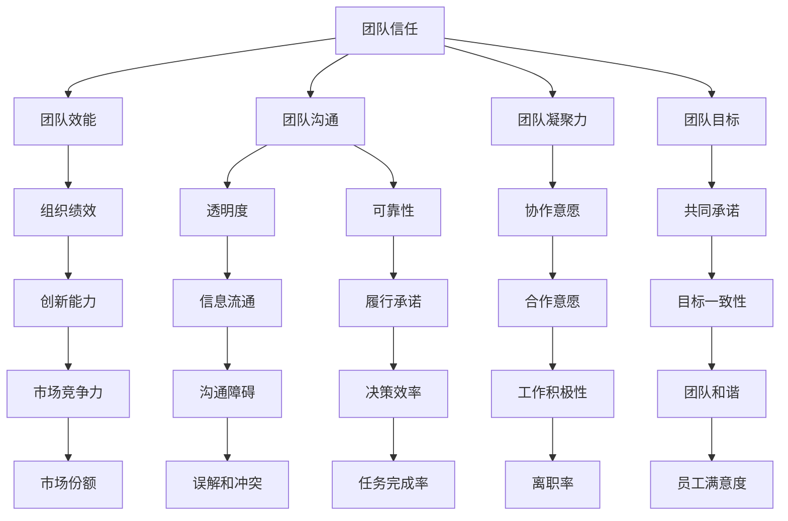

                 

### 文章标题

# 团队信任建设：建立高度信任的团队环境

在当今快速变化和竞争激烈的企业环境中，团队信任成为了企业成功的关键因素之一。团队信任不仅影响团队内部的协作和沟通，还直接关系到整个组织的绩效和发展。建立高度信任的团队环境，有助于提高团队的效率和创新能力，减少冲突，促进个人成长，从而为企业带来长期的价值。

本文将围绕团队信任建设这一主题，逐步探讨其核心概念、理论基础、建设策略、实践方法、工具与测量、组织文化影响、挑战与应对，以及未来的发展趋势。通过系统的分析和深入探讨，我们希望能够为读者提供一套完整的团队信任建设指南，帮助他们在实际工作中有效提升团队信任水平。

## 文章关键词

- 团队信任
- 建立信任
- 团队绩效
- 组织文化
- 沟通协作
- 信任测量工具

## 文章摘要

本文旨在探讨团队信任建设的重要性及其在组织中的应用。首先，我们介绍了团队信任的定义和重要性，然后分析了团队信任的理论基础。接下来，我们提出了团队信任建设的策略和实践方法，并探讨了信任工具与测量方法。此外，我们还讨论了团队信任与组织文化的互动关系，分析了在团队信任建设过程中可能遇到的挑战和解决方案。最后，我们对团队信任建设的发展趋势进行了展望，并总结了对团队领导和成员的启示。

----------------------------------------------------------------

## 引言

在当今高度互联和动态变化的商业环境中，团队成为企业运作的基本单位。然而，团队的成功并非仅依赖于成员的专业技能和知识，更关键的是团队内部的信任。团队信任指的是团队成员之间相互依赖、相互支持，以及共同致力于团队目标的信念和预期。这种信任不仅体现在团队成员之间的个人关系上，也贯穿于整个团队的合作过程中。

### 信任的重要性

信任在组织中的角色至关重要。首先，信任是团队协作的基础。在一个信任水平较高的团队中，成员更愿意分享信息、知识和资源，从而提高团队的整体效能。此外，信任还能减少冲突和误解，使团队成员更加专注于共同目标，而不是个人利益。研究表明，高信任度的团队在创新、解决问题和决策质量方面都表现出色。

### 团队信任的挑战

尽管团队信任的重要性不言而喻，但在实际操作中，建立和维护团队信任并非易事。团队信任面临诸多挑战，包括：

1. **文化差异**：团队成员可能来自不同的文化背景，价值观和沟通方式存在差异，这可能导致误解和冲突。
2. **信息不对称**：团队内部可能存在信息不对称，导致某些成员感到被忽视或误解。
3. **个人利益冲突**：在利益驱动的环境中，团队成员可能更关注个人收益，而非团队整体目标。
4. **历史问题**：团队可能因历史问题（如过去的冲突或不公平待遇）而难以建立信任。

### 本书的目的和结构

本书旨在为读者提供一套系统的团队信任建设指南。首先，我们将介绍团队信任的概念和理论基础，帮助读者理解团队信任的本质和重要性。接着，我们将探讨团队信任建设的策略和实践方法，包括如何设定明确的目标、进行有效的沟通、识别和解决冲突，以及利用工具和测量方法来提升团队信任。

本书的结构安排如下：

1. **引言**：介绍团队信任的重要性，以及本书的目的和结构。
2. **理论基础**：讨论团队信任的概念、模型和理论基础。
3. **团队信任建设策略**：介绍如何在不同情境下建设团队信任。
4. **团队信任实践**：提供实际案例和策略，帮助读者理解团队信任建设在现实中的应用。
5. **团队信任工具与方法**：介绍可以用来测量和提升团队信任的工具和方法。
6. **团队信任与组织文化**：探讨团队信任如何影响组织文化和整体绩效。
7. **团队信任的挑战与应对**：讨论在团队信任建设中可能遇到的挑战及解决方案。
8. **结论与展望**：总结全书内容，展望团队信任建设的发展趋势。

通过这本书，我们希望能够帮助读者深入了解团队信任，掌握有效的团队信任建设方法，并在实际工作中应用这些方法，从而提升团队的协作效率和创新能力。

### 理论基础

团队信任并非凭空出现，其建立和维护需要依赖于一系列的理论基础。理解这些基础理论有助于我们更深入地认识到团队信任的重要性，以及如何在实际操作中有效地建立和维护团队信任。

#### 团队信任的定义

团队信任是指团队成员之间相互依赖、相互支持，并对团队目标和行为的共同信念。这种信任基于以下几个方面：

1. **透明度**：团队成员愿意分享信息和资源，使团队内信息流通无阻。
2. **可靠性**：团队成员能够履行承诺，按时完成任务，确保团队目标的实现。
3. **开放性**：团队成员愿意接受反馈和建议，不断改进自身表现。
4. **一致性**：团队成员的行为和决策与团队目标一致，保持团队内部的和谐。

#### 团队信任模型

为了更好地理解团队信任，研究人员提出了多种模型。以下是一些主要的团队信任模型：

1. **四维度模型**：该模型将团队信任分为四个维度，即能力、可靠性、关心和公正性。每个维度都反映了团队成员对彼此的信任程度。
   - **能力**：团队成员对彼此专业能力和决策能力的信任。
   - **可靠性**：团队成员对彼此履行承诺和责任的信任。
   - **关心**：团队成员对彼此情感和利益的关注和关心。
   - **公正性**：团队成员对团队决策过程的透明度和公平性的信任。

2. **六因素模型**：该模型进一步细化了团队信任的构成因素，包括：
   - **能力**：成员对团队中其他成员能力的信任。
   - **诚实**：成员对其他成员诚实和正直行为的信任。
   - **一致**：成员对其他成员行为一致性的信任。
   - **开放性**：成员对其他成员愿意分享信息和支持的信任。
   - **宽容**：成员对其他成员在错误或冲突时的宽容和理解的信任。
   - **关怀**：成员对其他成员情感关怀和团队整体福祉的信任。

#### 团队信任与组织绩效的关系

团队信任对组织绩效有着直接和间接的影响。从直接层面看，高信任度的团队在任务执行和决策过程中更为高效。成员之间的信任使沟通更加顺畅，信息传递更加准确，从而提高团队的整体效能。

从间接层面看，团队信任有助于促进创新和持续改进。在一个高度信任的环境中，成员更愿意提出新的想法和改进建议，而不用担心被批评或嘲笑。这种开放的文化氛围有助于团队不断优化流程，提高产品质量，从而在市场竞争中脱颖而出。

此外，团队信任还对员工满意度和忠诚度产生积极影响。在信任度高的团队中，员工感受到被尊重和重视，工作积极性更高，离职率也相对较低。这有助于企业保留关键人才，减少人力资源的流失。

#### 团队信任的概念与联系

为了更好地理解团队信任，我们需要将其与相关概念联系起来，构建一个完整的理论架构。以下是一些与团队信任密切相关的概念：

1. **团队效能**：团队效能是指团队在完成目标时的表现和结果。团队信任是提高团队效能的关键因素之一，信任水平越高，团队效能越强。
2. **团队沟通**：团队沟通是团队成员之间交换信息和意见的过程。有效的沟通有助于建立信任，因为透明和开放的信息交流能够减少误解和冲突。
3. **团队凝聚力**：团队凝聚力是指团队成员之间的联结和归属感。高信任度的团队通常具有更强的凝聚力，因为成员之间的信任增强了团队的整体协作和合作意愿。
4. **团队目标**：团队目标是团队共同追求的方向和目标。团队成员对目标的共同承诺和信任有助于团队凝聚力和协作精神的提升。

通过上述理论与概念的联系，我们可以构建一个完整的团队信任理论架构，如下图所示：

通过这个理论架构，我们可以看到团队信任与团队效能、团队沟通、团队凝聚力、团队目标之间的密切联系。理解这些关系有助于我们更好地制定团队信任建设策略，提升团队的整体表现。

#### 团队信任建设策略

建立团队信任需要系统化的策略和方法。以下是一些关键的团队信任建设策略，可以帮助团队在不同情境下提升信任水平。

##### 1. 设定明确的目标

明确的团队目标是建立信任的基础。团队成员需要清楚地了解团队的目标和期望，以便能够共同努力并实现这些目标。

**具体步骤：**

- **确定目标**：在团队成立初期，团队成员应共同讨论并确定团队的目标。目标应具体、可衡量、可实现、相关性强和时限性（SMART原则）。
- **沟通目标**：确保所有团队成员都理解并接受这些目标。通过定期的会议和沟通，确保目标传达无误。
- **分配责任**：将具体任务分配给团队成员，并明确每个人的职责和期望。这有助于团队成员了解自己的角色，并增强责任感。

**示例：**

在一个软件开发团队中，团队目标可能是按时发布一款高质量的产品。团队成员需要明确各自的任务，如需求分析、设计、开发和测试。通过明确的目标和责任，团队成员可以更好地协作，提高工作效率和信任水平。

##### 2. 建立良好的沟通机制

良好的沟通是建立团队信任的关键。有效的沟通可以减少误解和冲突，增强团队成员之间的理解和信任。

**具体步骤：**

- **定期会议**：定期召开团队会议，确保团队成员能够分享信息、讨论问题和解决问题。会议可以采用站立会议、周会或月会等形式。
- **透明度**：保持团队内信息透明，确保所有成员都能获取到必要的信息。避免信息孤岛，使团队成员能够更全面地了解团队状况。
- **鼓励反馈**：鼓励团队成员提供反馈，无论是正面还是负面。通过开放和诚实的反馈，团队成员可以更好地理解彼此，提高沟通质量。

**示例：**

在一个产品管理团队中，定期召开产品评审会议，团队成员可以分享各自的进展、遇到的问题和解决方案。这样的会议有助于团队成员了解项目的整体状况，发现问题并及时解决，从而提高团队协作效率和信任水平。

##### 3. 解决冲突

冲突在团队中难以避免，但如何处理冲突是建立团队信任的关键。

**具体步骤：**

- **识别冲突**：及时发现和识别团队中的冲突。冲突可能源于任务分配、工作方式、个人价值观等方面。
- **沟通解决**：鼓励团队成员通过对话和协商来解决冲突。提供冲突解决的工具和技巧，如中立第三方调解、角色扮演等。
- **避免指责**：在解决冲突时，避免指责和批评。而是关注问题的本质，寻找双赢的解决方案。

**示例：**

在一个开发团队中，团队成员可能在任务优先级上存在分歧。通过开放和诚实的沟通，团队成员可以讨论各自的看法，并共同决定最合适的解决方案。这种方式有助于缓解冲突，增强团队信任。

##### 4. 建立信任关系

建立信任关系是团队信任建设的重要一环。以下是一些具体的方法：

**具体步骤：**

- **建立互信**：通过共同完成任务、分享信息和经验，建立团队成员之间的互信。这有助于增强团队的凝聚力和信任感。
- **了解团队成员**：团队成员之间相互了解，有助于建立信任。鼓励团队成员分享个人背景、兴趣和价值观。
- **提供支持**：在团队成员遇到困难时，提供必要的支持和帮助。这种关怀和支持可以增强团队成员之间的信任和依赖。

**示例：**

在一个设计团队中，团队成员可以定期进行团队建设活动，如团队拓展训练或团建聚餐。这些活动有助于团队成员建立友谊，增强团队凝聚力，从而提高团队信任水平。

##### 5. 利用工具和测量方法

利用工具和测量方法可以帮助团队了解信任水平，并针对性地进行改进。

**具体步骤：**

- **选择合适的工具**：根据团队的实际情况，选择合适的信任测量工具。例如，信任度量表、信任评分表等。
- **定期测量**：定期使用工具测量团队的信任水平。这有助于团队了解信任建设的进展，并及时调整策略。
- **反馈和改进**：根据测量结果，提供反馈，并制定改进计划。通过不断改进，逐步提高团队信任水平。

**示例：**

在一个销售团队中，可以使用信任度量表来评估团队内部的信任水平。通过定期测量，团队可以识别信任薄弱环节，并采取相应措施进行改进，如加强沟通、提供培训等。

#### 不同情境下的团队信任建设策略

团队信任建设策略在不同的情境下可能有所不同。以下是一些常见情境下的具体策略：

##### 1. 新团队

新团队通常缺乏经验和共同目标，建立信任更为重要。以下是一些具体策略：

- **团队建设活动**：通过组织团队建设活动，如拓展训练、团建聚餐等，增强团队成员之间的了解和信任。
- **共同目标**：明确团队目标，确保所有成员都参与目标的设定和实现过程。这有助于增强团队成员的共同感和信任。
- **沟通平台**：建立一个有效的沟通平台，如团队邮件、即时通讯工具等，确保团队成员之间的信息畅通。

##### 2. 跨部门团队

跨部门团队通常涉及不同职能部门，沟通和协作更为复杂。以下是一些具体策略：

- **明确责任**：明确各部门在团队中的角色和责任，确保团队成员了解自己的职责范围。
- **跨部门会议**：定期召开跨部门会议，促进不同部门之间的沟通和合作。
- **共识会议**：在项目初期，组织共识会议，确保所有部门对项目目标和计划有共同的理解。

##### 3. 远程团队

远程团队在沟通和协作方面面临更多挑战，以下是一些具体策略：

- **虚拟会议**：利用视频会议、在线协作工具等，确保团队成员能够实时沟通和协作。
- **明确预期**：明确团队成员的预期和职责，确保每个人都清楚自己的任务和目标。
- **定期检查**：定期检查团队进度，确保项目按计划进行，并及时解决问题。

通过以上策略，团队可以在不同情境下有效建立和维护团队信任，提高团队的整体效能和创新能力。

### 团队信任实践

在理论指导的基础上，实际案例和实践经验为我们提供了宝贵的参考，展示了团队信任建设在不同组织和团队中的应用。以下将介绍几个实际案例，分析成功的团队信任建设策略，并讨论在团队信任建设中遇到的难点及解决方案。

#### 成功的团队信任建设案例

**案例一：谷歌的团队信任建设**

谷歌作为全球知名的高科技公司，其成功很大程度上得益于团队信任的建设。谷歌采用了多种策略来提升团队信任：

- **透明管理**：谷歌的管理层通过公开透明的决策过程，使团队成员能够了解公司的战略和目标，增强了对团队的信任。
- **团队自主权**：谷歌鼓励团队成员在项目管理和决策过程中拥有更大的自主权，这种自主权不仅提高了团队成员的工作积极性，也增强了团队内部的信任。
- **员工关怀**：谷歌注重员工福利和工作环境，通过提供灵活的工作时间和工作地点，增强了员工对公司的信任。

**案例二：英特尔的产品开发团队**

英特尔的产品开发团队在开发新一代芯片时，采用了敏捷开发方法，并注重团队信任的建设。以下是一些关键策略：

- **跨功能团队**：英特尔将不同部门的专业人士组成跨功能团队，这种结构有助于团队成员之间的沟通和协作，提高了团队信任。
- **持续反馈**：团队通过定期的回顾会议和反馈机制，不断改进工作流程，增强了团队成员之间的信任。
- **共同目标**：团队成员共同设定项目目标，并通过不断的协作和努力实现这些目标，这种共同目标的实现增强了团队信任。

#### 团队信任建设的难点及解决方案

**难点一：文化差异**

在跨文化团队中，文化差异可能导致沟通障碍和信任缺失。以下是一些解决方案：

- **文化培训**：为团队成员提供跨文化培训，帮助团队成员了解和尊重不同文化，减少误解和冲突。
- **共同价值观**：建立共同的价值观和团队文化，使团队成员在面对文化差异时能够保持一致，增强团队凝聚力。

**难点二：信息不对称**

信息不对称可能导致团队成员之间的不信任。以下是一些解决方案：

- **透明度**：提高团队内的信息透明度，确保所有成员都能获取到必要的信息，减少信息孤岛。
- **定期报告**：定期向团队成员报告项目进展和重要信息，确保团队成员之间信息的畅通。

**难点三：个人利益冲突**

在利益驱动的环境中，个人利益冲突可能导致团队信任的缺失。以下是一些解决方案：

- **公平分配**：确保资源和利益的公平分配，避免因利益分配不均而产生的不信任。
- **团队目标**：明确团队目标，使团队成员能够将个人利益与团队利益结合起来，增强团队信任。

#### 团队信任建设在现实中的应用

在实际工作中，团队信任建设需要根据具体情况进行调整和优化。以下是一些在实际应用中的建议：

- **定期团队建设活动**：定期组织团队建设活动，如团建聚餐、拓展训练等，增强团队成员之间的互动和信任。
- **开放式沟通**：鼓励团队成员开放、诚实、及时地沟通，减少误解和冲突。
- **信任评估**：定期进行信任评估，了解团队的信任水平，并根据评估结果采取相应的改进措施。

通过以上案例和实践经验，我们可以看到，团队信任建设不仅是理论上的要求，更需要结合实际情况进行实施和优化。成功的团队信任建设策略和有效的解决方案，可以为团队带来更高的协作效率和创新能力，从而在激烈的市场竞争中脱颖而出。

### 团队信任工具与方法

为了有效地测量和提升团队信任，我们需要使用一系列的工具和方法。以下将介绍几种常用的团队信任工具和测量方法，以及它们在实际应用中的有效性。

#### 团队信任问卷

团队信任问卷是一种常见的测量工具，通过问卷的形式，评估团队成员之间的信任程度。以下是一个简单的团队信任问卷示例：

1. **团队成员对我的工作能力有信任感吗？**
   - 非常同意
   - 同意
   - 中立
   - 不同意
   - 非常不同意

2. **我认为团队成员会对我的工作进行支持吗？**
   - 非常同意
   - 同意
   - 中立
   - 不同意
   - 非常不同意

3. **我们的团队氛围是否开放、包容？**
   - 非常同意
   - 同意
   - 中立
   - 不同意
   - 非常不同意

通过这些问卷问题，可以评估团队成员对彼此的信任程度。问卷结果可以用于识别团队信任的薄弱环节，并制定相应的改进策略。

#### 信任评分表

信任评分表是一种基于评分的测量工具，通过定量评估团队信任水平。以下是一个简单的信任评分表示例：

| 项目               | 分数 |
|--------------------|------|
| 信息透明度         | 5    |
| 团队合作意愿       | 4    |
| 任务完成情况       | 5    |
| 冲突处理能力       | 3    |
| 成员间的信任感     | 4    |

总分为20分，分数越高表示团队信任水平越高。信任评分表可以定期进行，以监测团队信任的变化趋势。

#### 团队访谈

团队访谈是一种深入了解团队信任状况的方法。通过面对面访谈，可以获取团队成员对团队信任的直观感受和具体建议。以下是一些访谈问题示例：

1. **你认为团队的信任水平如何？**
2. **有哪些因素影响了团队信任？**
3. **你认为如何提升团队信任？**

访谈结果可以帮助团队识别问题，并制定针对性的改进措施。

#### 实际应用中的有效性

这些工具和方法在实际应用中的有效性取决于多种因素：

1. **工具选择的适用性**：根据团队的实际情况和需求，选择合适的测量工具。例如，对于大型团队，信任问卷可能更为适用；对于小型团队，信任评分表可能更为有效。
2. **实施过程的透明度**：确保测量过程的透明度和公正性，使团队成员对测量结果有信心。
3. **持续监测与反馈**：定期进行测量，并将结果反馈给团队成员。这有助于团队成员了解信任水平的变化，并采取相应的改进措施。

通过使用这些工具和方法，团队可以更科学、系统地测量和提升团队信任，从而提高团队的整体效能和创新能力。

### 团队信任与组织文化

团队信任不仅影响团队内部的协作效率，还深刻地影响着整个组织的文化。组织文化是指企业在长期发展中形成的共同价值观、信念和行为模式。良好的组织文化可以促进团队信任的建立和巩固，而团队信任则是优秀组织文化的基石。

#### 团队信任与组织文化的互动关系

团队信任与组织文化之间存在密切的互动关系。一方面，组织文化对团队信任有着重要的影响。一个开放、包容、透明的组织文化能够增强团队成员之间的信任。反之，一个封闭、排斥、不透明的组织文化则可能导致信任缺失和冲突。

另一方面，团队信任对组织文化也有反作用。高信任度的团队往往能够推动组织文化的进一步发展，形成更加积极、健康的文化氛围。例如，团队成员之间的相互信任和协作，可以促进知识共享和创新能力，从而推动组织文化的不断进步。

#### 建设信任型组织文化

为了建设信任型组织文化，企业需要采取一系列措施：

1. **领导者的示范作用**：领导者是组织文化的关键塑造者。领导者需要以身作则，展现出高度的信任和透明度，成为团队成员的榜样。

2. **培养信任价值观**：企业应将信任价值观融入日常运营中，通过培训和激励，使员工认同和践行信任价值观。

3. **建立信任机制**：企业应建立和完善信任机制，如透明决策、公平分配、开放沟通等，确保团队成员之间的信任得到制度保障。

4. **激励信任行为**：企业可以通过奖励机制激励团队成员的信任行为，如表彰在信任建设方面表现突出的个人或团队，进一步巩固信任文化。

#### 信任型组织文化的案例分析

以下是一个信任型组织文化的成功案例：

**案例：谷歌的“无边界文化”**

谷歌以其独特的“无边界文化”著称，这种文化强调透明、开放和信任。以下是谷歌在建设信任型组织文化方面的几个关键举措：

1. **透明决策**：谷歌的管理层通过公开透明的决策过程，使员工能够了解公司的战略和目标，增强了对团队的信任。

2. **信息共享**：谷歌鼓励员工在内部共享知识和信息，打破了部门之间的壁垒，提高了团队之间的信任水平。

3. **员工自主权**：谷歌给予员工较大的自主权，允许他们在项目管理和决策过程中发挥更大的作用，这种自主权不仅提高了员工的工作积极性，也增强了团队内部的信任。

4. **团队协作**：谷歌通过组织各种团队建设活动和跨功能项目，增强了团队成员之间的互动和信任。

通过这些举措，谷歌成功地构建了一个高度信任的组织文化，这为其在技术创新和市场竞争中保持领先地位提供了重要支持。

总之，团队信任与组织文化之间存在着紧密的联系。建设信任型组织文化，不仅有助于提升团队的协作效率和创新能力，还能推动组织的长期发展。企业应通过多种措施，积极营造一个信任、开放、包容的文化氛围，为团队信任建设奠定坚实基础。

### 团队信任的挑战与应对

在团队信任建设中，企业可能面临多种挑战，这些挑战可能源于组织内部或外部环境的变化。以下是团队信任建设过程中可能遇到的一些常见挑战，以及相应的解决方案。

#### 文化差异

**挑战**：团队成员来自不同的文化背景，可能存在价值观、沟通方式和行为习惯的差异，这可能导致误解和冲突。

**解决方案**：
1. **跨文化培训**：为团队成员提供跨文化培训，帮助他们了解和尊重不同文化，减少因文化差异引发的误解和冲突。
2. **共同价值观**：建立团队的共同价值观和使命，使团队成员在面对文化差异时能够保持一致，增强团队凝聚力。
3. **文化大使**：指定文化大使，负责在团队内部传播文化多样性，促进团队成员之间的沟通和理解。

#### 信息不对称

**挑战**：团队内部可能存在信息不对称，导致某些成员感到被忽视或误解，从而影响信任。

**解决方案**：
1. **透明度**：提高团队内的信息透明度，确保所有成员都能获取到必要的信息，减少信息孤岛。
2. **沟通平台**：建立一个有效的沟通平台，如团队邮件、即时通讯工具等，确保团队成员之间的信息畅通。
3. **定期报告**：定期向团队成员报告项目进展和重要信息，确保团队成员之间信息的对称性。

#### 个人利益冲突

**挑战**：在利益驱动的环境中，团队成员可能更关注个人收益，而非团队整体目标，这可能导致信任缺失。

**解决方案**：
1. **公平分配**：确保资源和利益的公平分配，避免因利益分配不均而产生的不信任。
2. **团队目标**：明确团队目标，使团队成员能够将个人利益与团队利益结合起来，增强团队信任。
3. **激励机制**：建立合理的激励机制，奖励那些为团队整体目标做出贡献的成员，促进团队成员之间的公平竞争。

#### 历史问题

**挑战**：团队可能因历史问题（如过去的冲突或不公平待遇）而难以建立信任。

**解决方案**：
1. **历史回顾**：通过历史回顾会议，团队成员共同面对过去的冲突和不公平待遇，找到解决问题的方法。
2. **道歉和赔偿**：对于过去的不公平行为，领导者应公开道歉并采取赔偿措施，以重建团队成员之间的信任。
3. **建立透明度**：通过透明的决策过程和公正的行为，逐步重建团队成员之间的信任。

#### 领导者角色

**挑战**：领导者在团队信任建设中扮演关键角色，但如果领导者无法以身作则，可能会导致团队信任的缺失。

**解决方案**：
1. **领导者培训**：为领导者提供关于团队信任建设的培训，帮助他们了解信任的重要性，并掌握有效的信任建设方法。
2. **榜样作用**：领导者应通过自身的行为树立榜样，展现出高度的信任和透明度，成为团队成员的榜样。
3. **反馈机制**：建立反馈机制，鼓励团队成员对领导者的行为进行评价，并根据反馈进行改进。

通过识别和应对这些挑战，企业可以更有效地建设团队信任，提升团队的整体效能和创新能力。

### 结论与展望

团队信任建设在当今组织中具有不可替代的重要性。本文通过系统的分析和深入的探讨，阐述了团队信任的定义、理论基础、建设策略、实践方法、工具与测量、组织文化影响以及挑战与应对。我们明确了团队信任对于团队绩效、员工满意度和组织长期发展的重要性，并提出了具体的建设策略和实践方法。

展望未来，团队信任建设将面临新的机遇和挑战。随着全球化、数字化和远程工作的趋势不断深化，团队信任建设将需要更加灵活和适应性的策略。以下是几个未来发展趋势：

1. **数字化工具的应用**：随着数字化工具的不断发展，企业将更多地依赖在线协作平台、虚拟会议和人工智能等工具来提升团队信任。
2. **跨文化团队管理**：在全球化的背景下，跨文化团队的信任建设将成为重要议题。企业需要通过跨文化培训和多元文化的融合，提升团队的信任水平。
3. **领导力发展**：领导者在团队信任建设中扮演关键角色。未来，企业将更加重视领导力的培养，以增强团队信任。
4. **持续监控与改进**：团队信任建设不是一蹴而就的过程，企业需要建立持续监控和改进机制，以适应不断变化的环境和需求。

最后，对于团队领导和成员，以下几点建议尤为重要：

- **领导者应以身作则**：通过透明、公正和一致的行为树立榜样，成为团队成员信任的基石。
- **成员应积极参与**：积极参与团队建设活动，主动沟通和分享，增强团队凝聚力和信任。
- **持续学习和改进**：不断学习和掌握团队信任建设的知识和技巧，通过实践不断提升团队信任水平。

通过以上努力，企业可以建立高度信任的团队环境，提高团队的协作效率和创新能力，从而在激烈的市场竞争中脱颖而出。

### 附录

#### 附录 A 信任建设工具资源列表

1. **信任度量表**：适用于评估团队成员之间的信任程度。例如，**Rosenberg 信任量表**。
2. **信任评分表**：用于定量评估团队信任水平。例如，**Forsythe 和 Rusbult 的信任评分表**。
3. **信任访谈**：通过面对面的访谈，深入了解团队成员对信任的感受和看法。
4. **团队反馈工具**：如**360度反馈**，帮助团队成员了解彼此的优点和改进点。
5. **在线协作平台**：如**Slack**、**Trello**、**Asana**等，促进团队成员之间的沟通和协作。

#### 附录 B 信任建设实践案例

1. **谷歌的“无边界文化”**：通过透明的决策过程、信息共享和员工自主权，构建了高度信任的团队环境。
2. **英特尔的产品开发团队**：采用敏捷开发方法和跨功能团队，增强了团队成员之间的信任和协作。
3. **微软的“透明管理”**：通过公开透明的决策过程，提高了团队成员对团队的信任。

这些资源和案例提供了宝贵的实践经验，有助于企业更好地进行团队信任建设。

### 结语

作者：AI天才研究院/AI Genius Institute & 禅与计算机程序设计艺术 /Zen And The Art of Computer Programming

本文旨在为读者提供一套全面的团队信任建设指南，帮助他们在实际工作中有效提升团队信任水平。通过系统的分析和深入的探讨，我们强调了团队信任对于团队绩效和创新能力的重要性，并提出了具体的策略和实践方法。

团队信任建设是一个长期而复杂的过程，需要领导者和成员的共同努力。希望本文能为读者提供有价值的启示，帮助他们在实际工作中不断优化团队信任建设，打造一个高效、创新、和谐的工作环境。

感谢您的阅读，我们期待您在团队信任建设过程中取得成功，并继续探索这一重要领域。如需进一步了解或讨论，请随时联系我们。

---

[END OF ARTICLE] 

