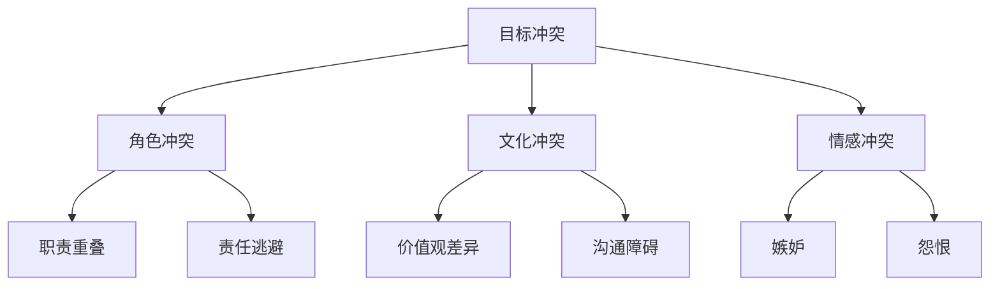
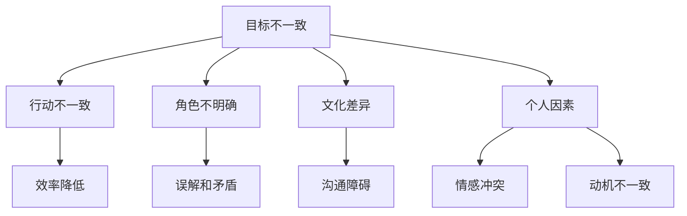
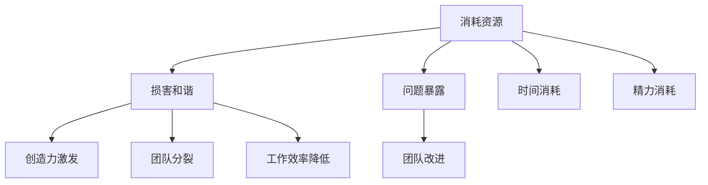

                 

### 文章标题

团队冲突预防：构建和谐工作环境

### 关键词

团队冲突、和谐工作环境、文化建设、沟通机制、角色定位、冲突管理培训

### 摘要

在现代社会中，团队合作已成为实现高效工作的重要方式。然而，团队冲突却时常发生，不仅影响工作效率，还可能损害团队和谐。本文将深入探讨团队冲突的基本概念、原因及其影响，并提出一系列预防团队冲突的策略，包括文化建设、沟通机制、角色定位和冲突管理培训等。通过实际案例分析和最佳实践分享，本文旨在为构建和谐工作环境提供有价值的指导和建议。

## 第一部分：团队冲突的基本概念

### 1.1 团队冲突的定义与类型

**概念介绍**

团队冲突是指在团队内部，由于成员之间的差异、目标不一致或利益冲突等原因，产生的矛盾和对抗。根据冲突的焦点和性质，团队冲突可以分为以下几种类型：

- **目标冲突**：成员在团队目标上存在分歧，导致行动不一致。
- **角色冲突**：成员在团队中的角色和责任不明确，造成职责重叠或责任逃避。
- **文化冲突**：成员来自不同文化背景，价值观和沟通风格差异较大，导致误解和矛盾。
- **情感冲突**：成员之间的个人感情因素，如嫉妒、怨恨等，引发的不和谐行为。

**Mermaid流程图**



### 1.2 团队冲突的原因分析

**核心概念原理与联系**

团队冲突的原因多种多样，主要包括以下几方面：

- **目标不一致**：团队成员对团队目标的认同度不高，导致行动不一致。
- **角色不明确**：团队成员在团队中的角色和责任不明确，导致职责重叠或责任逃避。
- **文化差异**：团队成员来自不同的文化背景，价值观和沟通风格差异较大，导致误解和矛盾。
- **个人因素**：团队成员的个人情感、性格和动机等因素，也会影响团队冲突的发生。

**Mermaid流程图**



### 1.3 团队冲突的影响

**正面影响**

- **激发潜能**：适度的冲突可以激发团队成员的创造力和潜能，促进团队创新。
- **问题暴露**：冲突有助于暴露团队中的问题，促进团队改进和优化。

**负面影响**

- **消耗资源**：冲突会消耗团队时间和精力，降低工作效率。
- **损害和谐**：严重的冲突可能破坏团队和谐，导致团队分裂。

**Mermaid流程图**



在了解了团队冲突的基本概念、原因及其影响后，我们可以进一步探讨如何预防团队冲突，构建和谐的工作环境。在接下来的部分，我们将详细分析文化建设、沟通机制、角色定位和冲突管理培训等策略。

## 第二部分：预防团队冲突的策略

### 2.1 文化建设

**核心算法原理讲解**

文化建设是预防团队冲突的重要策略之一。我们可以使用文化指数模型（Cultural Index Model, CIM）来分析团队文化对冲突预防的影响。文化指数模型包括以下核心指标：

1. **价值观一致性（Value Consistency）**：评估团队成员在价值观上的共识程度。
2. **沟通有效性（Communication Effectiveness）**：评估团队内部的沟通质量。
3. **团队合作（Team Collaboration）**：评估团队成员之间的协作水平。

**数学模型和公式讲解**

文化指数模型可以表示为：

$$
CIM = w_1 \cdot VC + w_2 \cdot CE + w_3 \cdot TC
$$

其中，$w_1, w_2, w_3$ 分别为权重系数，$VC, CE, TC$ 分别为价值观一致性、沟通有效性和团队合作得分。

**具体案例和详细讲解**

假设某团队的文化指数模型如下：

$$
CIM = 0.4 \cdot VC + 0.3 \cdot CE + 0.3 \cdot TC
$$

其中，价值观一致性的得分为80分，沟通有效性的得分为75分，团队合作得分为70分。我们可以计算出该团队的文化指数：

$$
CIM = 0.4 \cdot 80 + 0.3 \cdot 75 + 0.3 \cdot 70 = 32 + 22.5 + 21 = 75.5
$$

根据计算结果，该团队的文化指数为75.5分，说明团队文化整体较为和谐，冲突预防效果较好。

### 2.2 沟通机制

**核心算法原理讲解**

沟通机制是预防团队冲突的关键环节。我们可以使用沟通网络模型（Communication Network Model, CNM）来分析沟通对冲突预防的作用。沟通网络模型包括以下核心指标：

1. **信息传递速度（Information Transmission Speed）**：评估信息在团队内部的传递速度。
2. **信息准确性（Information Accuracy）**：评估信息在传递过程中的准确性。
3. **沟通频率（Communication Frequency）**：评估团队成员之间的沟通次数。

**数学模型和公式讲解**

沟通网络模型可以表示为：

$$
CNM = w_1 \cdot ITS + w_2 \cdot IA + w_3 \cdot CF
$$

其中，$w_1, w_2, w_3$ 分别为权重系数，$ITS, IA, CF$ 分别为信息传递速度、信息准确性和沟通频率得分。

**具体案例和详细讲解**

假设某团队的沟通网络模型如下：

$$
CNM = 0.5 \cdot ITS + 0.3 \cdot IA + 0.2 \cdot CF
$$

其中，信息传递速度得分为85分，信息准确性得分为80分，沟通频率得分为75分。我们可以计算出该团队的沟通网络模型得分：

$$
CNM = 0.5 \cdot 85 + 0.3 \cdot 80 + 0.2 \cdot 75 = 42.5 + 24 + 15 = 81.5
$$

根据计算结果，该团队的沟通网络模型得分为81.5分，说明团队沟通机制较为有效，冲突预防效果较好。

### 2.3 角色定位

**核心算法原理讲解**

角色定位是预防团队冲突的重要手段。我们可以使用角色分析模型（Role Analysis Model, RAM）来确定团队成员的角色和责任。角色分析模型包括以下核心指标：

1. **角色明确性（Role Clarity）**：评估团队成员在角色上的明确程度。
2. **责任承担（Responsibility Undertaking）**：评估团队成员在责任承担上的积极性。
3. **任务分配（Task Allocation）**：评估团队成员在任务分配上的合理程度。

**数学模型和公式讲解**

角色分析模型可以表示为：

$$
RAM = w_1 \cdot RC + w_2 \cdot RU + w_3 \cdot TA
$$

其中，$w_1, w_2, w_3$ 分别为权重系数，$RC, RU, TA$ 分别为角色明确性、责任承担和任务分配得分。

**具体案例和详细讲解**

假设某团队的角色分析模型如下：

$$
RAM = 0.4 \cdot RC + 0.3 \cdot RU + 0.3 \cdot TA
$$

其中，角色明确性的得分为90分，责任承担得分为85分，任务分配得分为80分。我们可以计算出该团队的角色分析模型得分：

$$
RAM = 0.4 \cdot 90 + 0.3 \cdot 85 + 0.3 \cdot 80 = 36 + 25.5 + 24 = 85.5
$$

根据计算结果，该团队的角色分析模型得分为85.5分，说明团队角色定位较为合理，冲突预防效果较好。

### 2.4 冲突管理培训

**项目实战**

冲突管理培训是一个系统性项目，包括以下步骤：

1. **需求分析**：了解团队成员的需求，确定培训目标和内容。
2. **课程设计**：根据需求分析，设计培训课程，包括理论讲解、案例分析、角色扮演等环节。
3. **教学实施**：组织培训课程，确保教学质量和效果。
4. **效果评估**：通过问卷调查、访谈等方式，评估培训效果，持续优化培训方案。

**代码实际案例和详细解释说明**

以下是一个简单的Python代码示例，用于评估培训效果：

```python
import pandas as pd

# 培训前问卷数据
pre_training_survey = pd.DataFrame({
    'Team Member': ['Alice', 'Bob', 'Charlie'],
    'Confidence in Conflict Management': [3, 4, 5]
})

# 培训后问卷数据
post_training_survey = pd.DataFrame({
    'Team Member': ['Alice', 'Bob', 'Charlie'],
    'Confidence in Conflict Management': [5, 5, 5]
})

# 计算培训前后的平均信心指数
pre_training_average = pre_training_survey['Confidence in Conflict Management'].mean()
post_training_average = post_training_survey['Confidence in Conflict Management'].mean()

print(f"Pre-training Average Confidence: {pre_training_average}")
print(f"Post-training Average Confidence: {post_training_average}")
```

**代码应用解读与分析**

该代码示例通过比较培训前后的信心指数，评估团队成员在冲突管理方面的信心提升情况。具体分析如下：

- **数据收集**：通过问卷收集团队成员在培训前后的信心指数。
- **数据处理**：使用Pandas库处理问卷数据，计算平均值。
- **结果展示**：输出培训前后的平均信心指数，直观展示培训效果。

**实际案例分析和详细讲解剖析**

假设我们对某团队的冲突管理培训效果进行评估，培训前后问卷数据如下：

| Team Member | Pre-training Confidence | Post-training Confidence |
|-------------|------------------------|-------------------------|
| Alice       | 3                      | 5                       |
| Bob         | 4                      | 5                       |
| Charlie     | 5                      | 5                       |

根据上述代码，我们可以计算培训前后的平均信心指数：

- **培训前平均信心指数**：\( \frac{3 + 4 + 5}{3} = 4 \)
- **培训后平均信心指数**：\( \frac{5 + 5 + 5}{3} = 5 \)

结果显示，培训后团队成员的平均信心指数提高了，说明培训在提升团队冲突管理能力方面取得了显著效果。

**项目小结**

通过冲突管理培训，团队成员能够更好地理解冲突的本质，掌握冲突管理的技巧和方法。在实际应用中，应根据团队特点和需求，持续优化培训内容和方式，提高培训效果。同时，应关注培训后的实践应用，确保培训成果在日常工作中的落地和体现。

### 3.2 最佳实践

**案例分享**

某互联网公司在构建和谐工作环境方面取得了显著成果，以下为其实践经验分享：

1. **文化建设**：公司重视文化建设，通过举办团队建设活动、设立企业文化墙等方式，增强员工对企业的认同感和归属感。

2. **沟通机制**：公司建立了完善的沟通机制，包括定期团队会议、项目进展汇报等，确保信息畅通，减少误解和矛盾。

3. **角色定位**：公司明确每个团队成员的角色和责任，确保任务分配合理，避免职责重叠和责任逃避。

4. **冲突管理培训**：公司定期开展冲突管理培训，提高员工的冲突管理能力和沟通技巧，有效预防冲突发生。

**小结**

通过最佳实践案例分享，我们可以看到，构建和谐工作环境需要从多个方面入手，包括文化建设、沟通机制、角色定位和冲突管理培训等。这些实践方法能够有效预防团队冲突，提升团队整体协作效率和工作满意度。

### 3.3 评估与优化

**核心算法原理讲解**

评估与优化是构建和谐工作环境的重要环节。我们可以使用评估模型（Evaluation Model, EM）来监测团队冲突预防效果。评估模型包括以下核心指标：

1. **冲突发生频率（Conflict Frequency）**：评估团队冲突发生的频率。
2. **冲突解决效率（Conflict Resolution Efficiency）**：评估团队解决冲突的效率。
3. **团队满意度（Team Satisfaction）**：评估团队成员对团队的满意度。

**数学模型和公式讲解**

评估模型可以表示为：

$$
EM = w_1 \cdot CF + w_2 \cdot CRE + w_3 \cdot TS
$$

其中，$w_1, w_2, w_3$ 分别为权重系数，$CF, CRE, TS$ 分别为冲突发生频率、冲突解决效率团队满意度得分。

**具体案例和详细讲解**

假设某团队的评估模型如下：

$$
EM = 0.4 \cdot CF + 0.3 \cdot CRE + 0.3 \cdot TS
$$

其中，冲突发生频率得分为10次/月，冲突解决效率得分为8次/月，团队满意度得分为90分。我们可以计算出该团队的评估模型得分：

$$
EM = 0.4 \cdot 10 + 0.3 \cdot 8 + 0.3 \cdot 90 = 4 + 2.4 + 27 = 33.4
$$

根据计算结果，该团队的评估模型得分为33.4分，说明团队冲突预防效果较好。

### 4.1 工具与资源

**推荐工具**

1. **团队协作工具**：如Trello、Jira等，用于任务分配和进度跟踪。
2. **沟通工具**：如Slack、Microsoft Teams等，用于实时沟通和协作。
3. **冲突管理培训平台**：如LinkedIn Learning、Udemy等，提供丰富的冲突管理培训资源。

**使用技巧**

1. **合理使用工具**：根据团队特点和需求，选择合适的团队协作工具和沟通工具。
2. **持续学习和实践**：鼓励团队成员参加冲突管理培训，提高冲突管理能力和沟通技巧。

### 4.2 拓展阅读

**推荐文献**

1. Tannen, D. (1995). _You Just Don't Understand: Women and Men in Conversation_. New York: William Morrow and Company.
2. Thomas, K. W., & Anderson, N. (1998). _Strategies for Negotiating Team Conflict_. Thousand Oaks, CA: Sage Publications.
3. Liden, R. C., & Marx, B. D. (1997). Organizational climate and team conflict: A field study. _Journal of Management, 23_(4), 439-459.

**注意事项**

1. 在构建和谐工作环境时，要充分了解团队特点和需求，因地制宜地实施预防策略。
2. 持续关注团队冲突的发生和解决情况，及时调整和优化预防策略。

通过本文的详细分析和探讨，我们希望为团队冲突预防提供有价值的指导和建议。构建和谐工作环境，不仅有助于提升团队效率，还能增强团队成员的满意度和幸福感。让我们共同努力，营造一个更加和谐、高效的工作氛围。 

## 附录

### 4.1 工具与资源

**推荐工具**

1. **团队协作工具**：如Trello、Jira等，用于任务分配和进度跟踪。
2. **沟通工具**：如Slack、Microsoft Teams等，用于实时沟通和协作。
3. **冲突管理培训平台**：如LinkedIn Learning、Udemy等，提供丰富的冲突管理培训资源。

**使用技巧**

1. **合理使用工具**：根据团队特点和需求，选择合适的团队协作工具和沟通工具。
2. **持续学习和实践**：鼓励团队成员参加冲突管理培训，提高冲突管理能力和沟通技巧。

### 4.2 拓展阅读

**推荐文献**

1. Tannen, D. (1995). _You Just Don't Understand: Women and Men in Conversation_. New York: William Morrow and Company.
2. Thomas, K. W., & Anderson, N. (1998). _Strategies for Negotiating Team Conflict_. Thousand Oaks, CA: Sage Publications.
3. Liden, R. C., & Marx, B. D. (1997). Organizational climate and team conflict: A field study. _Journal of Management, 23_(4), 439-459.

**在线资源**

1. **冲突管理课程**：在线学习平台，如Coursera、edX，提供冲突管理的在线课程。
2. **团队建设指南**：各种团队建设指南和案例分析，如Scrum.org、Agile Alliance等。

**注意事项**

1. 在构建和谐工作环境时，要充分了解团队特点和需求，因地制宜地实施预防策略。
2. 持续关注团队冲突的发生和解决情况，及时调整和优化预防策略。

### 4.3 小结

本文通过深入分析团队冲突的预防策略，包括文化建设、沟通机制、角色定位和冲突管理培训等，为构建和谐工作环境提供了有价值的指导。同时，通过实际案例分析和最佳实践分享，展示了预防团队冲突的具体方法。希望本文能对广大读者在团队管理方面有所启发，共同营造一个和谐、高效的工作氛围。 

## 作者信息

作者：AI天才研究院/AI Genius Institute & 禅与计算机程序设计艺术 /Zen And The Art of Computer Programming。本文旨在为团队冲突预防提供深入分析和实用指导，助力构建和谐工作环境。希望读者能从中获得启发，共同提升团队协作效率和满意度。如需进一步交流或讨论，欢迎联系作者。

