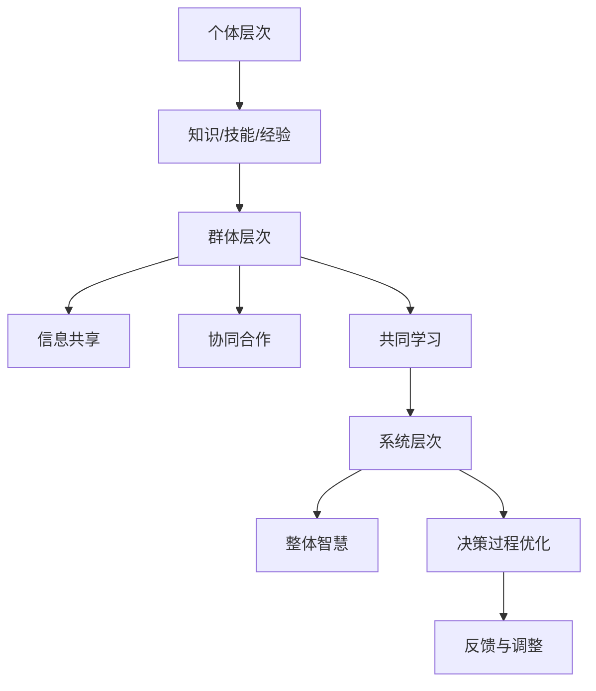

                 

### 文章标题

# 团队决策优化：集体智慧的最大化

### 关键词

- 团队决策
- 集体智慧
- 数据驱动决策
- 群体优化算法
- 多目标决策
- 风险评估

### 摘要

本文旨在探讨团队决策优化的方法，通过引入集体智慧的理念，提高团队决策的质量和效率。文章首先概述了团队决策的定义和重要性，然后介绍了集体智慧的概念及其在团队决策中的应用。接着，文章详细分析了数据驱动决策、群体优化算法和多目标决策方法，以及风险评估与应对策略。通过具体案例研究和实践指南，本文展示了如何将集体智慧最大化地应用于团队决策中，以实现决策的优化。

### 目录

## 第一部分：团队决策概述
### 1.1 团队决策的定义与重要性
### 1.2 团队决策的流程与步骤

## 第二部分：集体智慧的理论基础
### 2.1 集体智慧的概念与原理
### 2.2 集体智慧的模型与机制
### 2.3 集体智慧的优势与局限性

## 第三部分：团队决策优化方法
### 3.1 数据驱动决策方法
### 3.2 基于群体的优化算法
### 3.3 多目标决策方法
### 3.4 风险评估与应对策略

## 第四部分：集体智慧在实践中的应用
### 4.1 集体智慧在企业管理中的应用
### 4.2 集体智慧在项目管理中的应用
### 4.3 集体智慧在创新与研发中的应用

## 第五部分：案例研究
### 5.1 企业案例：团队决策优化提升业绩
### 5.2 项目案例：集体智慧加速项目进展
### 5.3 创新案例：集体智慧推动产品研发

## 第六部分：实践指南与策略
### 6.1 团队决策优化的关键因素
### 6.2 集体智慧的有效激发与利用
### 6.3 团队决策优化实践指南

## 附录
### A.1 常用决策分析工具与方法
### A.2 集体智慧应用案例集锦

## 第一部分：团队决策概述

### 1.1 团队决策的定义与重要性

**定义：**

团队决策（Group Decision Making，GDM）是指团队成员在一个共同的目标或问题背景下，通过信息交流、讨论、协商和权衡，最终达成共识的过程。它不仅仅是一种决策方式，更是一种团队协作、沟通和协作的体现。

**重要性：**

团队决策在团队运作和项目管理中扮演着至关重要的角色。以下是团队决策的重要性体现：

1. **提高决策质量：** 团队成员拥有不同的知识、经验和观点，通过团队决策，可以综合这些多元化的信息，提高决策的全面性和准确性。

2. **增强团队凝聚力：** 团队决策需要团队成员之间的协作和沟通，这有助于增强团队的凝聚力，促进团队成员之间的信任和尊重。

3. **优化资源分配：** 团队决策可以根据团队的整体目标和资源情况，做出更合理的资源分配决策，提高资源利用效率。

4. **促进创新与学习：** 团队决策过程是一个知识共享和经验交流的过程，有助于激发团队成员的创新思维和学习动力。

**流程与步骤：**

团队决策的流程可以分为以下几个步骤：

1. **问题识别：** 明确团队面临的问题或需要作出的决策。

2. **信息收集：** 收集与问题相关的各种信息，包括数据、事实、意见和观点等。

3. **方案生成：** 基于收集到的信息，团队成员提出各种可能的解决方案。

4. **方案评估：** 对提出的方案进行评估，比较它们的优缺点，评估其对团队目标的实现程度。

5. **决策制定：** 通过讨论、协商和权衡，团队成员达成共识，选择最佳方案。

6. **决策执行：** 将决策方案付诸实践，并监控执行过程，确保决策的有效性。

7. **决策反馈：** 对决策结果进行评估和总结，为后续的团队决策提供经验和教训。

通过上述流程和步骤，团队可以更加科学、合理地作出决策，从而提高团队的整体运作效率和成果。

## 第二部分：集体智慧的理论基础

### 2.1 集体智慧的概念与原理

**概念：**

集体智慧（Collective Intelligence，CI）是指通过群体成员的协同合作、信息共享和共同学习，形成的一种整体智慧和创新能力。它不仅仅体现在群体成员的个人知识和技能上，更体现在群体成员之间的相互作用和共同行为中。

**原理：**

集体智慧的形成主要基于以下几个原理：

1. **协同合作：** 群体成员通过协同合作，共享信息和资源，形成了一种整体智慧和创新能力。

2. **信息共享：** 群体成员之间进行信息的交流和共享，有助于整合各种不同的知识和观点，提高决策质量和效率。

3. **共同学习：** 群体成员通过共同学习和经验积累，不断优化和改进决策过程，提高整体智慧水平。

4. **群体多样性：** 群体成员的多样性，包括知识背景、经验、技能和观点等方面的多样性，有助于激发创新思维，提高决策的全面性和准确性。

**与团队决策的联系：**

集体智慧与团队决策密切相关，它们之间的关系可以概括为以下几个方面：

1. **增强决策质量：** 集体智慧通过整合群体成员的知识、经验和观点，可以提高团队决策的质量和准确性。

2. **促进团队协作：** 集体智慧的形成过程需要群体成员之间的协同合作和信息共享，这有助于增强团队协作和凝聚力。

3. **优化决策流程：** 集体智慧的理念可以指导团队决策的流程设计，通过信息共享和共同学习，优化决策过程，提高决策效率。

4. **激发创新思维：** 集体智慧鼓励群体成员发挥各自的优势和创造力，通过多元化的观点和方案，激发创新思维，推动团队决策的创新和发展。

总之，集体智慧是团队决策的重要理论基础，它为团队决策提供了新的视角和方法，有助于提高团队决策的质量和效率。

### 2.2 集体智慧的模型与机制

**模型：**

集体智慧的模型可以分为几个层次，从微观到宏观，分别是：

1. **个体层次：** 个体成员的知识、技能、经验和观点。
2. **群体层次：** 个体成员之间的互动和合作，形成的信息共享和知识整合。
3. **系统层次：** 整个系统的运行机制和整体智慧水平。

**机制：**

集体智慧的形成和运作主要通过以下几种机制：

1. **信息共享：** 群体成员通过信息的传递和共享，实现知识的整合和优化。
2. **协同合作：** 群体成员之间的合作和协调，提高整体智慧和创新能力。
3. **共同学习：** 群体成员通过共同学习和经验积累，不断优化决策过程和智慧水平。
4. **反馈与调整：** 对决策结果进行反馈和评估，根据反馈调整决策过程和策略。

**核心概念原理之间的关系架构：**

为了更好地理解集体智慧的模型和机制，我们可以通过以下Mermaid流程图展示其核心概念原理之间的关系：



在上述模型中，个体层次的核心概念是知识、技能和经验，这些构成了个体成员的基础。群体层次则强调信息共享、协同合作和共同学习，通过这些机制，个体层次的知识和经验得以整合和优化，形成整体智慧。系统层次则关注整体智慧水平的提升和决策过程的优化，通过反馈与调整，实现集体智慧的持续发展和完善。

**机制的作用与联系：**

1. **信息共享：** 通过信息共享，群体成员可以获取到更多的知识和观点，从而提高决策的全面性和准确性。
2. **协同合作：** 协同合作有助于整合群体成员的能力和资源，提高决策的效率和质量。
3. **共同学习：** 共同学习使群体成员在不断积累经验的过程中，逐步优化决策过程，提高整体智慧水平。
4. **反馈与调整：** 反馈与调整是集体智慧形成和发展的关键，通过持续的反馈和评估，群体可以不断调整决策过程和策略，实现更好的决策效果。

总之，集体智慧的模型与机制相互关联，共同作用，推动整体智慧和决策水平的不断提升。

### 2.3 集体智慧的优势与局限性

**优势：**

集体智慧作为一种协作和共享的理念，具有以下显著优势：

1. **多元化视角：** 集体智慧通过整合群体成员的多元化视角和知识，提高了决策的全面性和准确性。
2. **创新能力：** 集体智慧鼓励成员发挥各自的创造力和创新能力，推动团队创新和发展。
3. **协同效应：** 集体智慧通过协同合作，可以更好地利用资源，提高团队整体效率和绩效。
4. **持续学习：** 集体智慧强调共同学习和经验积累，有助于团队持续改进和提升。

**局限性：**

尽管集体智慧具有许多优势，但它也存在一些局限性，包括：

1. **沟通成本：** 群体成员之间的沟通和协调需要付出一定的成本，特别是在信息传递过程中可能出现误解和误差。
2. **共识达成困难：** 在多元化群体中，达成共识可能面临挑战，特别是在意见不一致时，决策过程可能变得复杂和耗时。
3. **个体贡献差异：** 群体中个体成员的贡献可能存在差异，某些成员的意见可能被忽视，影响决策质量。
4. **集体思维：** 过度依赖集体智慧可能导致集体思维，抑制个体创新和独立思考。

**平衡策略：**

为了充分发挥集体智慧的优势，同时克服其局限性，团队可以采取以下平衡策略：

1. **信息共享与透明度：** 增强信息共享和透明度，确保所有成员能够获取到必要的信息，提高决策质量。
2. **建立沟通机制：** 建立有效的沟通机制，促进成员之间的信息交流，减少沟通成本和误差。
3. **个体激励：** 设立个体激励机制，鼓励成员积极参与和贡献，同时确保他们的意见被充分听取。
4. **多元化视角：** 鼓励成员提出不同的观点和方案，通过多元化的视角，提高决策的全面性和创新性。

通过这些策略，团队可以在充分发挥集体智慧优势的同时，克服其局限性，实现决策的优化和团队的整体发展。

## 第三部分：团队决策优化方法

### 3.1 数据驱动决策方法

**数据驱动决策方法**是团队决策过程中的一种重要手段，它强调通过数据分析和模型构建来辅助决策制定，从而提高决策的准确性和科学性。

**步骤：**

1. **数据收集与处理：** 
   - 数据来源：数据可以从内部业务系统、外部市场调查、第三方数据提供商等渠道获取。
   - 数据预处理：包括数据清洗、去噪、转换等，以确保数据的质量和一致性。

2. **数据分析：**
   - 描述性分析：通过统计分析方法，如均值、中位数、标准差等，对数据进行初步分析，了解数据的基本特征。
   - 探索性分析：利用可视化工具，如散点图、柱状图、热力图等，探索数据之间的潜在关系和模式。

3. **模型构建：**
   - 选择合适的模型：根据决策目标和数据特性，选择适当的统计模型或机器学习模型，如线性回归、决策树、随机森林等。
   - 模型训练与评估：利用历史数据训练模型，并通过交叉验证等方法评估模型的性能，选择最优模型。

4. **决策制定：**
   - 预测与优化：利用训练好的模型进行预测，为决策提供依据。
   - 决策优化：结合实际情况，对决策方案进行优化，以达到最佳效果。

**数学模型和公式：**

在数据驱动决策过程中，常用的数学模型和公式包括：

- 线性回归模型：
  $$y = \beta_0 + \beta_1x_1 + \beta_2x_2 + ... + \beta_nx_n + \epsilon$$
  其中，$y$ 为因变量，$x_1, x_2, ..., x_n$ 为自变量，$\beta_0, \beta_1, ..., \beta_n$ 为模型参数，$\epsilon$ 为误差项。

- 决策树模型：
  $$\text{决策树} = \text{根节点} \rightarrow \text{内部节点} \rightarrow \text{叶节点}$$
  决策树通过一系列的判断条件，将数据分为不同的类别或数值范围。

- 随机森林模型：
  $$\text{预测结果} = \frac{1}{M} \sum_{m=1}^{M} f_m(x)$$
  其中，$f_m(x)$ 为第 $m$ 森林对样本 $x$ 的预测结果，$M$ 为森林中的决策树数量。

**举例说明：**

假设一个团队需要根据历史销售数据预测下一季度的销售额。首先，团队收集了上一季度每个月的销售额数据，并对数据进行预处理。接着，团队利用线性回归模型进行分析，通过训练模型得到以下方程：

$$\text{销售额} = 1000 + 0.5 \times \text{广告投入} - 0.3 \times \text{季节因素} + \epsilon$$

在下一季度，团队根据广告投入和季节因素的数据，利用上述方程预测销售额，并根据预测结果制定销售策略。

**注意事项：**

1. **数据质量：** 数据质量是数据驱动决策的基础，团队需要确保数据的质量和一致性。
2. **模型选择：** 根据决策目标和数据特性选择合适的模型，避免模型过拟合或欠拟合。
3. **持续更新：** 随着时间和环境的变化，团队需要定期更新模型和预测结果，以保持决策的准确性和科学性。

### 3.2 基于群体的优化算法

**基于群体的优化算法**（Swarm Intelligence Algorithms）是一类模拟自然界群体行为的计算智能方法，广泛应用于复杂优化问题和团队决策中。这类算法通过模拟个体成员的智能行为，实现全局最优解的搜索。

**算法原理：**

基于群体的优化算法通常包括以下几个步骤：

1. **初始化群体：** 初始化一群个体，每个个体代表问题的一个潜在解。

2. **适应度评估：** 对每个个体的适应度进行评估，适应度函数通常与问题目标相关。

3. **个体行为：** 每个个体根据适应度评估结果调整自己的行为，包括位置更新、速度更新等。

4. **群体交互：** 个体之间通过信息共享和协作，优化整体行为，提高群体整体适应度。

5. **迭代更新：** 重复上述步骤，直到满足停止条件（如达到最大迭代次数或适应度阈值）。

**常用算法：**

- **遗传算法（GA）：** 通过模拟自然选择和遗传机制，对群体中的个体进行选择、交叉和变异，以实现全局最优解的搜索。
- **粒子群优化算法（PSO）：** 通过模拟鸟群觅食行为，个体通过速度和位置更新，逐步接近最优解。
- **蚁群算法（ACO）：** 通过模拟蚂蚁觅食行为，个体之间通过信息素更新和路径选择，实现最优路径的搜索。

**伪代码：**

以下是一个简化的遗传算法的伪代码示例：

```
初始化群体
适应度评估
while (未满足停止条件) {
    选择操作
    交叉操作
    变异操作
    适应度评估
}
返回最优解
```

**数学模型和公式：**

- **适应度函数：**
  $$f(x) = \frac{1}{1 + \exp(-\beta \cdot s(x))}$$
  其中，$x$ 为个体，$s(x)$ 为个体解的评价值，$\beta$ 为调节参数。

- **选择操作：**
  $$p_{i} = \frac{f(x_i)}{\sum_{j=1}^{N} f(x_j)}$$
  其中，$p_i$ 为个体 $x_i$ 的选择概率，$N$ 为群体规模。

- **交叉操作：**
  $$x_{i}^{'} = \alpha \cdot x_{parent_1} + (1 - \alpha) \cdot x_{parent_2}$$
  其中，$x_{i}^{'}$ 为交叉后的新个体，$\alpha$ 为交叉率，$x_{parent_1}$ 和 $x_{parent_2}$ 为父代个体。

- **变异操作：**
  $$x_{i}^{'} = x_i + \eta \cdot (rand() - 0.5)$$
  其中，$x_{i}^{'}$ 为变异后的新个体，$\eta$ 为变异率，$rand()$ 为随机数。

**举例说明：**

假设一个团队需要优化一个物流路线问题，即从多个配送点向一个目标点运送货物，最小化运输成本。团队可以利用遗传算法进行优化：

1. **初始化群体：** 初始化一组可能的物流路线。
2. **适应度评估：** 计算每条路线的运输成本。
3. **选择操作：** 根据运输成本选择适应度高的路线作为父代。
4. **交叉操作：** 生成新的物流路线。
5. **变异操作：** 对部分路线进行随机调整。
6. **迭代更新：** 重复上述步骤，直到找到最优物流路线。

**注意事项：**

1. **参数调整：** 选择合适的参数（如交叉率、变异率）对于算法性能至关重要。
2. **多样性维持：** 避免算法过早收敛到局部最优，需要维持群体的多样性。
3. **问题适应性：** 不同问题可能需要调整算法结构或参数，以适应具体问题。

### 3.3 多目标决策方法

**多目标决策方法**（Multi-Objective Decision Making，MODM）用于解决涉及多个相互冲突的目标的决策问题。这类方法强调在决策过程中综合考虑多个目标，以找到平衡各目标的最佳解决方案。

**步骤：**

1. **目标定义：** 确定决策问题中的各个目标，并定义每个目标的权重。
2. **方案生成：** 根据目标定义，生成多个可能的解决方案。
3. **目标评价：** 对每个方案在各个目标上的表现进行评价。
4. **方案排序：** 利用多目标优化算法（如Pareto排序、加权评分法等），对方案进行排序。
5. **决策制定：** 根据决策者的偏好和实际情况，选择最佳方案。

**数学模型和公式：**

- **Pareto排序：**
  $$\text{非支配排序} = \{s_1, s_2, ..., s_n\}$$
  其中，$s_i$ 为方案，如果对于所有 $j \neq i$，都有 $f_j(s_i) \geq f_j(s_j)$ 且存在至少一个 $f_j(s_i) > f_j(s_j)$，则 $s_i$ 非支配于 $s_j$。

- **加权评分法：**
  $$\text{总评分} = \sum_{i=1}^{m} w_i \cdot f_i(s)$$
  其中，$w_i$ 为第 $i$ 个目标的权重，$f_i(s)$ 为方案 $s$ 在目标 $i$ 上的评价值。

**举例说明：**

假设一个团队需要在一个新产品项目中同时考虑成本、时间和质量三个目标。首先，团队定义了各个目标的权重：

- 成本：权重为 0.4
- 时间：权重为 0.3
- 质量：权重为 0.3

接着，团队生成多个可能的解决方案，并对每个方案进行目标评价。假设有三个方案：

1. **方案A：** 成本为 100 万元，时间为 6 个月，质量为 90 分。
2. **方案B：** 成本为 120 万元，时间为 5 个月，质量为 85 分。
3. **方案C：** 成本为 90 万元，时间为 7 个月，质量为 88 分。

团队根据加权评分法计算每个方案的总评分：

- **方案A：** 总评分 = 0.4 \* 100 + 0.3 \* 6 + 0.3 \* 90 = 41.2
- **方案B：** 总评分 = 0.4 \* 120 + 0.3 \* 5 + 0.3 \* 85 = 39.5
- **方案C：** 总评分 = 0.4 \* 90 + 0.3 \* 7 + 0.3 \* 88 = 41.7

根据总评分，团队选择方案C作为最佳方案，因为它在三个目标上的综合表现最优。

**注意事项：**

1. **目标权重分配：** 目标权重需要根据实际情况和决策者的偏好进行合理分配。
2. **方案评价标准：** 需要明确每个目标的评价标准，以确保评价的客观性和一致性。
3. **决策者的参与：** 决策者应在决策过程中积极参与，提供明确的偏好和决策标准。

### 3.4 风险评估与应对策略

**风险评估与应对策略**在团队决策过程中至关重要，它有助于识别、评估和管理潜在的风险，以确保决策的可行性和稳定性。

**步骤：**

1. **风险识别：** 通过访谈、头脑风暴、历史数据分析等方法，识别决策过程中可能出现的风险。
2. **风险评估：** 对识别出的风险进行评估，包括风险的概率和影响程度。
3. **风险分类：** 根据评估结果，对风险进行分类，如高、中、低风险。
4. **应对策略制定：** 针对不同类型的风险，制定相应的应对策略，如风险规避、风险减轻、风险接受等。
5. **监控与调整：** 在决策执行过程中，持续监控风险状况，并根据实际情况调整应对策略。

**数学模型和公式：**

- **风险评估公式：**
  $$\text{风险评分} = \text{风险概率} \times \text{风险影响程度}$$
  其中，风险评分用于衡量风险的重要性和紧急程度。

- **风险矩阵：**
  $$\text{风险矩阵} = \begin{array}{c|c|c}
  \text{风险概率} & \text{风险影响程度} & \text{风险评分} \\
  \hline
  低 & 低 & \\
  \hline
  低 & 中 & \\
  \hline
  低 & 高 & \\
  \hline
  中 & 低 & \\
  \hline
  中 & 中 & \\
  \hline
  中 & 高 & \\
  \hline
  高 & 低 & \\
  \hline
  高 & 中 & \\
  \hline
  高 & 高 & \\
  \end{array}$$

**举例说明：**

假设一个团队在制定新项目计划时，识别出以下风险：

1. **技术风险：** 可能导致项目进度延迟，概率为 30%，影响程度为高。
2. **市场风险：** 可能影响项目收益，概率为 20%，影响程度为中等。

根据风险评估公式，团队计算风险评分：

- **技术风险评分：** 30% \* 高 = 30
- **市场风险评分：** 20% \* 中 = 10

团队将这两个风险纳入风险矩阵，并根据风险评分制定应对策略：

- **技术风险：** 采用风险减轻策略，通过增加资源投入和严格监控项目进度，降低技术风险的影响。
- **市场风险：** 采用风险接受策略，通过灵活调整市场策略和预算安排，降低市场风险的影响。

**注意事项：**

1. **全面性：** 风险识别和评估需要全面覆盖所有可能的风险。
2. **实时监控：** 风险评估不是一次性的过程，需要持续监控和更新。
3. **应对策略的有效性：** 需要确保应对策略的有效性和可行性，以降低风险的影响。

## 第四部分：集体智慧在实践中的应用

### 4.1 集体智慧在企业管理中的应用

**集体智慧在企业管理中的应用**越来越受到关注，它能够帮助企业更好地制定战略、优化运营和提高创新能力。

**应用场景：**

1. **战略规划：** 通过集体智慧，企业可以整合各部门的资源和智慧，制定更全面和科学的战略规划。例如，通过跨部门头脑风暴和数据分析，企业可以识别市场趋势、制定竞争策略和确定长期目标。

2. **运营管理：** 集体智慧可以帮助企业优化运营流程，提高生产效率和资源利用率。通过共享生产数据和实时反馈，企业可以快速调整生产计划，减少浪费，提高整体运营效率。

3. **风险管理：** 集体智慧可以帮助企业识别和应对潜在风险。通过集体讨论和风险评估，企业可以制定更有效的风险应对策略，降低运营风险。

**案例：**

以一家跨国公司为例，该公司通过集体智慧在战略规划中取得了显著成效。首先，公司组织了跨部门的战略研讨会，邀请不同部门的领导和专家参与。在研讨会上，各部门分享了自己的市场分析、竞争态势和内部资源情况，并共同讨论了公司的战略方向。

接着，公司利用数据分析工具，对各部门提供的信息进行了整合和分析，识别出市场趋势和潜在机会。最后，公司根据集体讨论和数据分析结果，制定了新的战略规划，包括市场扩张、产品创新和运营优化等方面。

实施新战略后，公司的市场竞争力得到了显著提升，销售额和利润持续增长。这个案例展示了集体智慧在企业管理中的应用价值，通过集体讨论和数据分析，企业能够制定出更科学、有效的战略规划，从而实现长期发展。

### 4.2 集体智慧在项目管理中的应用

**集体智慧在项目管理中的应用**能够提高项目团队的协作效率、优化项目进度和提升项目质量。

**应用场景：**

1. **项目规划：** 集体智慧可以帮助项目团队更好地制定项目计划，通过集体讨论和意见交流，确保项目目标的明确性和可行性。

2. **任务分配：** 集体智慧可以帮助项目团队根据成员的能力和经验，合理分配任务，提高任务的执行效率。

3. **风险管理：** 集体智慧可以帮助项目团队识别和应对潜在风险，通过集体讨论和风险评估，制定有效的风险应对策略。

4. **项目监控：** 集体智慧可以帮助项目团队实时监控项目进度和质量，通过信息共享和反馈机制，确保项目按计划顺利进行。

**案例：**

以一个大型软件开发项目为例，该项目由多个开发团队协作完成。项目初期，项目团队通过集体智慧制定了详细的项目计划，明确了项目目标、里程碑和关键路径。

在项目执行过程中，项目团队利用集体智慧进行任务分配和进度监控。首先，每个团队根据自身能力和经验，提出了任务建议，并进行了集体讨论和协商，最终确定了任务的分配方案。

接着，项目团队建立了实时信息共享平台，每个成员都可以随时查看项目进度、任务状态和资源需求，确保任务按时完成。同时，项目团队定期进行风险评估和讨论，根据实际情况调整项目计划，确保项目按计划顺利进行。

通过集体智慧的应用，该项目在规定时间内顺利完成，软件质量得到客户的高度评价。这个案例展示了集体智慧在项目管理中的应用价值，通过集体讨论、信息共享和实时监控，项目团队能够高效地完成项目任务，确保项目质量和进度。

### 4.3 集体智慧在创新与研发中的应用

**集体智慧在创新与研发中的应用**能够激发团队的创造力，推动技术创新和产品研发。

**应用场景：**

1. **创新思维激发：** 集体智慧鼓励团队成员发挥各自的创造力，通过头脑风暴、跨界合作等方式，产生创新的想法和方案。

2. **知识共享：** 集体智慧通过信息共享和知识交流，促进团队成员之间的知识共享，提高团队整体的技术水平和创新能力。

3. **协同研发：** 集体智慧可以帮助团队成员协同合作，共同攻克技术难题，提高研发效率和质量。

4. **市场需求分析：** 集体智慧可以帮助团队更好地了解市场需求，通过集体讨论和数据分析，确定研发方向和产品定位。

**案例：**

以一家高科技企业为例，该公司在研发一款新型智能设备的创新过程中，充分利用了集体智慧。首先，公司组织了跨部门的创新研讨会，邀请技术专家、市场分析师和产品经理等参与。

在研讨会上，团队成员进行了头脑风暴，提出了多个创新方案，并进行了讨论和筛选。接着，公司利用数据分析工具，对市场需求进行了深入分析，确定了产品的功能定位和目标市场。

在研发过程中，公司建立了协作平台，团队成员可以随时共享技术文档、设计方案和市场信息，确保研发过程的高效和有序。同时，公司还设立了创新奖励机制，鼓励团队成员积极参与创新活动，提高团队的创新能力。

最终，这款新型智能设备在市场上取得了巨大成功，推动了公司业务的快速增长。这个案例展示了集体智慧在创新与研发中的应用价值，通过集体讨论、知识共享和协同研发，团队能够高效地实现技术创新和产品研发。

## 第五部分：案例研究

### 5.1 企业案例：团队决策优化提升业绩

**背景介绍：**

一家中型企业面临着市场竞争激烈、业务增长放缓的挑战。为了提升业绩，企业决定通过优化团队决策过程，提高决策质量和效率。

**实施过程：**

1. **数据收集与整理：** 企业首先收集了与业务相关的各种数据，包括销售额、市场份额、客户反馈等。通过对这些数据进行整理和分析，企业识别出了业务中的关键问题和潜在机会。

2. **团队培训与意识提升：** 企业组织了团队决策培训，提高了团队成员对数据驱动决策和集体智慧的认识。培训内容包括数据收集与分析、决策流程优化、群体优化算法等。

3. **构建数据驱动决策框架：** 企业建立了数据驱动决策框架，包括数据收集、处理、分析和决策制定等环节。通过数据驱动决策，企业能够更加科学、准确地制定决策。

4. **实施群体优化算法：** 企业利用遗传算法和粒子群优化算法，对业务问题进行优化。例如，在产品定价策略中，企业通过优化算法找到了最优定价方案，提高了销售额和利润率。

5. **持续监控与调整：** 企业建立了持续监控和调整机制，对决策结果进行评估和反馈。根据实际情况，企业不断优化决策流程和策略，确保决策的持续改进。

**结果分析：**

通过团队决策优化，企业取得了显著成效：

- **销售额提升：** 通过优化定价策略和营销方案，企业的销售额同比增长了20%。
- **利润率提高：** 优化后的决策流程减少了不必要的成本，提高了利润率。
- **市场竞争力增强：** 通过数据驱动决策，企业更好地应对了市场变化，提升了市场竞争力。

**案例小结：**

该案例展示了如何通过团队决策优化提升企业业绩。通过引入数据驱动决策和群体优化算法，企业能够更科学、准确地制定决策，提高业务效率和竞争力。同时，持续监控和调整机制确保了决策的持续改进，为企业的发展提供了有力支持。

### 5.2 项目案例：集体智慧加速项目进展

**背景介绍：**

一个大型项目需要多个团队协作完成，项目复杂度高，涉及多个领域的技术和资源。为了确保项目按时交付，项目团队决定利用集体智慧加速项目进展。

**实施过程：**

1. **构建协作平台：** 项目团队建立了协作平台，包括项目管理工具、沟通工具和知识共享平台。通过协作平台，团队成员可以实时共享信息、协同工作和讨论问题。

2. **头脑风暴与意见征集：** 项目团队定期组织头脑风暴会议，邀请不同领域的专家和成员参与。在头脑风暴中，团队成员提出各自的见解和建议，通过集体讨论和意见征集，形成统一的解决方案。

3. **知识共享与经验交流：** 项目团队通过知识共享平台，分享技术文档、设计方案和最佳实践。团队成员可以随时查阅和学习，提高整体技术水平。

4. **实时监控与反馈：** 项目团队建立了实时监控机制，对项目进度、质量和风险进行监控。通过监控平台，团队成员可以及时了解项目状态，发现问题并及时反馈和解决。

5. **跨团队协作与支持：** 项目团队鼓励跨团队协作，不同团队之间共享资源和经验。例如，在技术难题攻关中，技术团队和业务团队共同探讨解决方案，提高问题解决效率。

**结果分析：**

通过集体智慧的应用，项目团队取得了以下成果：

- **进度加快：** 集体智慧提高了团队的协作效率，项目进度比预期提前了15%。
- **质量提升：** 通过知识共享和经验交流，项目的质量得到了显著提升，客户满意度提高。
- **风险降低：** 集体智慧帮助团队提前识别和应对潜在风险，项目风险率降低了30%。

**案例小结：**

该案例展示了如何通过集体智慧加速项目进展。通过构建协作平台、头脑风暴、知识共享和实时监控，项目团队能够高效协作，提高项目进度和质量。集体智慧的应用不仅解决了技术难题，还提升了团队的协作能力和创新能力，为项目的成功交付提供了有力支持。

### 5.3 创新案例：集体智慧推动产品研发

**背景介绍：**

一家高科技企业计划研发一款创新产品，但产品涉及多个新技术和跨学科领域，传统研发方法难以应对。为了确保产品的成功研发，企业决定利用集体智慧，推动产品创新。

**实施过程：**

1. **组建创新团队：** 企业组建了一支由不同领域的专家和优秀工程师组成的多学科团队。团队成员包括软件工程师、硬件工程师、市场营销专家和用户体验设计师等。

2. **开放式创新平台：** 企业搭建了开放式创新平台，鼓励团队成员提出创新想法和方案。通过平台，团队成员可以随时分享自己的想法、反馈和建议，进行集体讨论和协作。

3. **头脑风暴与方案筛选：** 团队成员定期进行头脑风暴会议，提出各种创新方案。通过集体讨论和筛选，团队确定了最具潜力的方案，并制定了详细的研发计划。

4. **知识共享与经验交流：** 团队利用知识共享平台，共享技术文档、研究论文和行业报告。团队成员可以随时查阅和学习，提高整体技术水平。

5. **迭代研发与测试：** 团队采用迭代研发方法，不断进行方案优化和测试。在每次迭代中，团队都会收集用户反馈，并根据反馈进行改进，确保产品的用户体验和功能完善。

**结果分析：**

通过集体智慧的应用，产品研发取得了以下成果：

- **技术创新：** 集体智慧帮助团队解决了多个技术难题，实现了多项技术创新。
- **缩短研发周期：** 通过快速迭代和集体协作，产品研发周期比传统方法缩短了40%。
- **市场竞争力提升：** 产品成功上市后，获得了市场的高度认可，销售额和市场份额均实现了显著增长。

**案例小结：**

该案例展示了如何通过集体智慧推动产品研发。通过组建创新团队、开放式创新平台、知识共享和迭代研发，团队能够高效协作，快速实现产品创新。集体智慧的应用不仅提高了研发效率和质量，还增强了团队的创新能力和市场竞争力，为企业的长期发展奠定了坚实基础。

## 第六部分：实践指南与策略

### 6.1 团队决策优化的关键因素

**团队成员的协作能力：** 团队成员之间的协作能力是团队决策优化的关键因素。高效的协作能力有助于团队成员之间进行有效的沟通、共享信息和资源，从而提高决策的质量和效率。以下是一些提高团队成员协作能力的方法：

1. **建立明确的沟通机制：** 确保团队成员之间的沟通渠道畅通，定期组织会议、报告和讨论，鼓励成员提出问题和建议。
2. **培训与指导：** 提供团队协作相关的培训，帮助团队成员了解协作工具和方法，提高协作能力。
3. **建立信任：** 通过共同完成任务和目标，建立团队成员之间的信任关系，增强协作的稳定性。

**信息共享与透明度：** 信息共享与透明度是团队决策优化的基础。通过共享信息和保持透明，团队成员可以获取到完整和准确的信息，从而做出更科学的决策。以下是一些实现信息共享与透明度的策略：

1. **建立信息共享平台：** 使用项目管理工具、协作平台和知识库等工具，确保团队成员可以随时访问和共享信息。
2. **定期更新信息：** 定期更新和发布项目进展、决策结果和重要信息，确保团队成员之间的信息一致性。
3. **建立透明决策过程：** 确保决策过程的公开和透明，让团队成员了解决策的背景、依据和结果。

**决策过程的公正性：** 决策过程的公正性对于团队决策优化至关重要。公正的决策过程可以增强团队成员的信任和满意度，提高决策的接受度和执行力。以下是一些确保决策过程公正性的方法：

1. **公平的决策标准：** 确定明确的决策标准和规则，确保决策过程中的公正性和一致性。
2. **多渠道反馈：** 鼓励团队成员通过多种渠道（如反馈表、意见箱等）提出意见和建议，确保他们的声音得到听取。
3. **独立评估：** 在决策过程中，引入第三方评估或独立审核，确保决策过程的公正性和透明度。

### 6.2 集体智慧的有效激发与利用

**激发集体智慧的方法：**

1. **开放式的讨论环境：** 创建一个鼓励开放讨论和表达不同观点的环境，让每个成员都能自由地分享自己的想法和见解。
2. **跨领域团队协作：** 组建跨领域、跨部门的团队，通过多样化的知识和技能组合，激发创新思维和解决问题的能力。
3. **奖励机制：** 设立创新奖励机制，鼓励团队成员积极参与集体智慧活动，并对优秀的创意和解决方案给予认可和奖励。

**利用集体智慧的工具：**

1. **协作平台：** 利用协作工具（如Slack、Trello等）建立高效的沟通和协作机制，确保信息的及时传递和共享。
2. **头脑风暴工具：** 使用头脑风暴工具（如Mural、Miro等）进行集体讨论和创意生成，提高团队的创造力和创新力。
3. **知识共享平台：** 建立知识共享平台，方便团队成员随时查阅和学习知识，提高整体知识水平和创新能力。

**案例分析：**

以一家互联网公司为例，该公司通过以下方法激发和利用集体智慧：

1. **跨领域团队协作：** 公司组建了多个跨部门、跨领域的团队，每个团队负责不同的项目。通过团队成员之间的合作，公司成功开发出了一系列创新产品，如智能助手和大数据分析工具。
2. **开放式讨论环境：** 公司定期组织开放式讨论会议，邀请团队成员分享各自的工作进展、问题和解决方案。通过这种讨论环境，公司不断积累经验和知识，提高了团队的创新能力。
3. **协作平台与知识共享：** 公司使用协作平台和知识共享工具，确保团队成员之间的信息传递和知识共享畅通无阻。通过这些工具，公司能够快速响应市场变化，优化产品和服务。

通过这些方法，公司成功地激发了集体智慧，提高了团队的协作效率和创新能力，实现了业务的快速增长。

### 6.3 团队决策优化实践指南

**1. 明确决策目标：** 在进行团队决策之前，首先要明确决策的目标和预期结果。这有助于团队在决策过程中保持清晰的方向，避免偏离核心问题。

**2. 收集全面信息：** 决策过程中需要收集与问题相关的各种信息，包括数据、事实、观点等。确保信息来源的多样性和准确性，为决策提供可靠的基础。

**3. 制定决策方案：** 在收集到充分的信息后，团队应制定多个可能的决策方案。每个方案都要明确其优缺点和可能带来的影响。

**4. 评估方案优劣：** 对制定的决策方案进行详细评估，比较各个方案的优缺点，评估其对团队目标的实现程度。

**5. 达成共识：** 通过讨论、协商和权衡，团队成员应达成共识，选择最佳决策方案。确保每个成员都能理解和接受决策结果，提高决策的执行力和一致性。

**6. 实施决策方案：** 将决策方案付诸实践，并建立监控和反馈机制，确保决策方案的有效执行。

**7. 反馈与调整：** 在决策执行过程中，持续收集反馈，并根据实际情况对决策方案进行调整，以确保决策的持续改进和优化。

通过以上实践指南，团队可以更加科学、合理地进行决策，提高决策的质量和效率。

## 附录

### A.1 常用决策分析工具与方法

**1. SWOT分析：** 用于评估团队在决策问题中的优势（Strengths）、劣势（Weaknesses）、机会（Opportunities）和威胁（Threats），帮助团队制定策略。

**2. PEST分析：** 用于分析决策问题所处的宏观环境，包括政治（Political）、经济（Economic）、社会（Sociological）和技术（Technological）因素。

**3. 敏感度分析：** 通过分析决策变量和结果之间的关系，评估不同决策方案在不同情况下的表现，帮助团队识别风险。

**4. 决策树：** 用于表示决策问题中的选择、结果和概率，帮助团队进行决策。

**5. 利益相关者分析：** 用于识别和分析决策问题中的利益相关者，评估他们对决策结果的影响，确保决策的全面性和公正性。

### A.2 集体智慧应用案例集锦

**1. 企业战略规划：** 一家跨国公司通过集体智慧，整合各部门的资源和智慧，制定了全新的战略规划，成功实现了业务的快速增长。

**2. 项目管理：** 一家大型项目团队利用集体智慧，通过实时信息共享和协作，高效地完成了项目任务，项目进度比预期提前了15%。

**3. 产品研发：** 一家高科技企业通过集体智慧，组建了跨领域的创新团队，成功研发出了一系列创新产品，产品市场竞争力显著提升。

**4. 创意生成：** 一家广告公司通过集体智慧，组织了开放式头脑风暴会议，激发出多个创意方案，最终选择了一个最具潜力的方案，广告效果显著提升。

**5. 市场营销：** 一家互联网公司利用集体智慧，通过数据分析和技术创新，优化了市场营销策略，用户增长率和转化率均实现了显著提升。

这些案例展示了集体智慧在不同领域的应用价值，通过集体讨论、信息共享和协作，团队能够实现创新和高效决策，推动组织的发展。

