                 

### 文章标题：团队凝聚力建设：从个体到整体的蜕变

### 关键词：
- 团队凝聚力
- 组织行为学
- 社会心理学
- 沟通技巧
- 团队合作
- 案例研究

### 摘要：
本文旨在探讨团队凝聚力的建设，从个体到整体的变化过程。文章首先介绍了团队凝聚力的概念和重要性，然后从社会心理学和组织行为学两个角度探讨了团队凝聚力的理论基础。接着，文章深入分析了个体视角下的团队凝聚力，包括个体动机、角色和行为对团队凝聚力的影响。随后，文章从沟通视角探讨了提升团队凝聚力的方法，并详细介绍了团队合作的重要性和实践策略。最后，通过案例研究展示了团队凝聚力建设的实际应用，并提出了持续优化团队凝聚力建设的建议。本文旨在为企业和组织提供实用的团队凝聚力建设指南，助力团队高效协作和整体性能提升。

### 第1章 引言：团队凝聚力的重要性

#### 1.1 团队凝聚力概述

团队凝聚力是指团队成员之间相互吸引、相互依赖、共同协作的紧密程度。一个高凝聚力的团队，成员之间有着强烈的归属感和认同感，能够高效地协作，共同完成目标。团队凝聚力不仅仅是成员之间的情感联系，更是团队整体效能的重要体现。

在现代社会，团队合作已经成为了一种不可或缺的工作方式。无论是企业、政府部门，还是非营利组织，都需要依靠团队来完成复杂的项目和任务。而团队凝聚力的强弱，直接影响着团队的效能和成功。研究表明，高凝聚力的团队具有以下特点：

- **高效的沟通**：团队成员之间能够流畅地交流，分享信息和知识，减少误解和冲突。
- **共同的目标**：团队成员对团队的目标有清晰的认识，并愿意为之努力奋斗。
- **合作精神**：团队成员相互支持，共同解决问题，形成了一种积极向上的团队氛围。
- **创新能力**：团队成员能够自由地表达想法，碰撞出新的创意和解决方案。

#### 1.2 团队凝聚力的要素

团队凝聚力主要由以下几个要素构成：

- **信任**：团队成员之间相互信任，能够坦诚地表达自己的想法和感受。
- **归属感**：团队成员感到自己是团队的一部分，有一种强烈的归属感。
- **共同目标**：团队成员对团队的目标有共同的认识，并愿意为之努力。
- **相互依赖**：团队成员之间有着紧密的联系，互相依赖，共同承担责任。
- **共同经历**：团队成员一起经历的成功和失败，加深了彼此之间的了解和信任。

#### 1.3 团队凝聚力的影响

团队凝聚力对团队和组织的影响是多方面的：

- **提高工作效率**：高凝聚力的团队能够更高效地完成任务，因为团队成员之间沟通顺畅，能够快速地协同工作。
- **提升团队绩效**：团队凝聚力强的团队，整体绩效往往更高，因为团队成员能够更好地协作，共同解决问题。
- **增强团队稳定性**：高凝聚力的团队更容易留住成员，降低人员流动率。
- **提升创新能力**：团队成员之间的交流和互动，能够激发新的创意和想法，推动团队的创新能力。
- **增强组织文化**：团队凝聚力强的组织，往往拥有更强大的企业文化，能够更好地吸引和留住优秀人才。

总之，团队凝聚力是团队和组织成功的关键因素之一。通过有效地建设团队凝聚力，企业可以提升团队效能，实现持续发展。下一章，我们将从社会心理学和组织行为学的角度，深入探讨团队凝聚力的理论基础。

### 第2章 团队凝聚力的理论基础

#### 2.1 社会心理学与团队凝聚力

##### 2.1.1 社会认同感与团队凝聚力

社会认同感是指个体在社会群体中感受到的认同和归属感。在社会心理学中，社会认同感被认为是一种强大的心理动力，能够显著影响个体的行为和态度。在团队中，社会认同感的作用尤为重要，它直接影响着团队成员之间的情感联系和团队凝聚力。

**2.1.1.1 社会认同感的定义与作用**

社会认同感的定义可以从两个方面来理解：

- **情感层面**：个体在团队中感受到的归属感和安全感。
- **行为层面**：个体因认同团队而产生的行为倾向，如合作、支持团队目标和成员等。

社会认同感的作用主要体现在以下几个方面：

1. **增强归属感**：个体在团队中感受到被接受和认同，从而增强了对团队的归属感。
2. **促进合作**：社会认同感使个体更愿意与他人合作，因为合作能够带来共同的利益。
3. **降低冲突**：社会认同感可以减少团队成员之间的冲突，因为成员更倾向于维护团队的整体利益。

**2.1.1.2 社会认同感的提升策略**

要提升团队的社会认同感，可以从以下几个方面入手：

1. **共同经历**：通过组织团队活动，让团队成员共同经历一些挑战和成功，加深彼此的了解和信任。
2. **透明沟通**：建立开放的沟通渠道，让团队成员能够自由地表达自己的想法和感受，增强信息的透明度。
3. **共同目标**：确保团队成员对团队目标有共同的理解和认同，使团队的目标成为个体目标的一部分。
4. **奖励机制**：通过奖励机制来认可团队成员的贡献，增强他们的社会认同感。

**2.1.1.3 社会认同感与团队凝聚力关系架构图**

为了更好地理解社会认同感与团队凝聚力之间的关系，我们可以使用Mermaid流程图来展示：

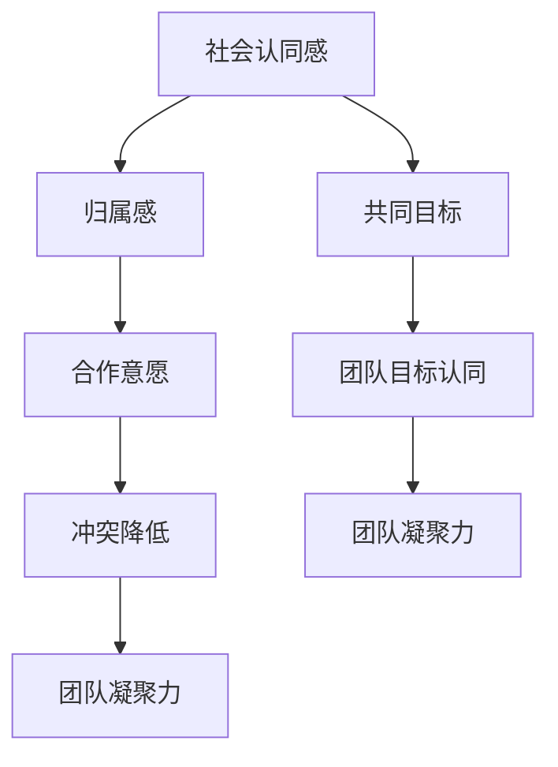

这个流程图展示了社会认同感如何通过归属感、合作意愿、冲突降低和共同目标等多个环节，最终影响到团队凝聚力。

##### 2.1.2 团队形成与凝聚力

团队形成是指团队成员从陌生到熟悉，再到协同工作的过程。团队形成过程中，团队凝聚力会经历不同的阶段，每个阶段都有其独特的特征和发展规律。

**2.1.2.1 团队形成的阶段**

团队形成通常可以分为以下四个阶段：

1. **形成阶段**：团队成员刚刚加入团队，彼此之间尚不熟悉，需要时间来建立初步的联系。
2. **激荡阶段**：随着团队成员之间的互动增加，团队内部可能会出现意见分歧和冲突。
3. **规范阶段**：团队成员开始寻求共识，建立团队的规则和价值观。
4. **执行阶段**：团队进入稳定状态，成员之间已经建立了深厚的信任和合作关系，能够高效地完成团队任务。
5. **休整阶段**：团队完成一个项目或任务后，可能会进入休整期，为下一个项目或任务做准备。

**2.1.2.2 每个阶段的特点与团队凝聚力的发展**

1. **形成阶段**：团队成员彼此认识，但尚不熟悉，团队凝聚力较低。此时，团队成员需要通过交流来建立初步的联系。
2. **激荡阶段**：随着团队成员之间的互动增加，团队内部可能会出现意见分歧和冲突。团队凝聚力可能会因为这些分歧而受到影响，但同时也是团队凝聚力的关键发展期。
3. **规范阶段**：团队成员开始寻求共识，建立团队的规则和价值观。此时，团队凝聚力逐渐增强，因为成员对团队的认同感增加。
4. **执行阶段**：团队进入稳定状态，成员之间已经建立了深厚的信任和合作关系，团队凝聚力达到最高水平。
5. **休整阶段**：团队完成一个项目或任务后，可能会进入休整期，为下一个项目或任务做准备。此时，团队凝聚力可能有所下降，但仍然是团队长期发展的重要基础。

**2.1.2.3 团队形成的流程图**

为了更直观地展示团队形成的过程，我们可以使用Mermaid流程图来描述：

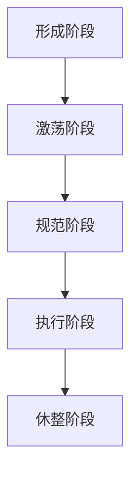

这个流程图展示了团队从形成到休整的完整过程，每个阶段都是团队凝聚力发展的重要节点。

##### 2.1.3 社会认同感与团队形成阶段的关系

社会认同感在团队形成过程中起着关键作用。在形成阶段，社会认同感有助于成员建立初步的联系，增强归属感。在激荡阶段，社会认同感可以减少冲突，促进团队成员之间的合作。在规范阶段，社会认同感有助于形成团队的共同规则和价值观。在执行阶段，社会认同感增强了团队成员之间的信任和合作关系，提高了团队凝聚力。

为了更清晰地展示社会认同感与团队形成阶段之间的关系，我们可以使用Mermaid流程图来描述：

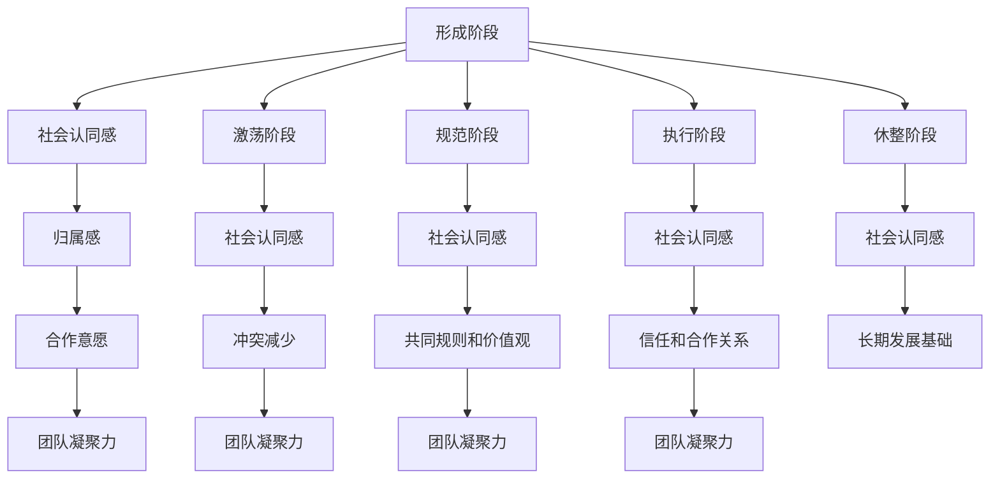

这个流程图展示了社会认同感如何贯穿团队形成的各个阶段，并影响团队凝聚力的发展。

#### 2.2 组织行为学视角下的团队凝聚力

##### 2.2.1 团队凝聚力的影响因素

团队凝聚力的形成和维持受到多种因素的影响，组织行为学对此进行了深入的研究。主要的影响因素包括成员个性、外部环境、组织支持等。

**2.2.1.1 成员个性与团队凝聚力**

成员个性是影响团队凝聚力的重要因素。不同性格和动机的个体在团队中的表现和贡献不同，从而影响团队凝聚力。

- **开放性**：开放性高的个体更容易接受新事物，具有更强的合作精神和创新能力，有助于提升团队凝聚力。
- **责任心**：责任心强的个体更有可能在团队中承担责任，保持高水平的绩效，从而增强团队凝聚力。

**2.2.1.2 外部环境与团队凝聚力**

外部环境是团队凝聚力形成的重要背景。竞争压力、市场需求、技术变化等因素都会对团队凝聚力产生影响。

- **竞争压力**：竞争压力可以促使团队更加紧密地合作，提高团队凝聚力。
- **市场需求**：市场需求的变化可以影响团队的优先级和任务分配，从而影响团队凝聚力。

**2.2.1.3 组织支持与团队凝聚力**

组织支持是团队凝聚力的重要保障。组织通过提供资源、政策支持和管理支持，可以增强团队凝聚力。

- **资源支持**：组织提供充足的资源，有助于团队更好地完成任务，提高团队凝聚力。
- **政策支持**：组织制定合理的政策，确保团队目标和个体目标的一致性，从而增强团队凝聚力。
- **管理支持**：管理者通过有效的沟通和领导，可以增强团队成员之间的信任和合作，提高团队凝聚力。

**2.2.1.4 团队凝聚力的影响因素关系架构图**

为了更好地理解团队凝聚力的影响因素，我们可以使用Mermaid流程图来展示：

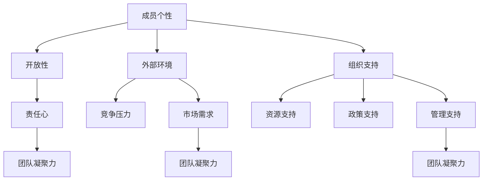

这个流程图展示了成员个性、外部环境和组织支持如何影响团队凝聚力。

##### 2.2.2 团队凝聚力与团队绩效

团队凝聚力和团队绩效之间的关系是一个备受关注的研究领域。研究表明，团队凝聚力对团队绩效有着显著的影响。

**2.2.2.1 团队凝聚力与团队绩效的关系**

团队凝聚力与团队绩效之间的关系通常表现为以下两种形式：

1. **正相关关系**：高凝聚力的团队往往能够实现更高的绩效。团队成员之间的紧密合作和信任能够提高决策质量，促进创新，从而提高团队绩效。
2. **负相关关系**：在一些情况下，过高的团队凝聚力可能导致团队趋于保守，不愿意接受新的观点和改变，从而影响团队绩效。

**2.2.2.2 提升团队绩效的凝聚力策略**

为了提升团队绩效，可以通过以下策略来增强团队凝聚力：

1. **构建共同目标**：确保团队成员对团队目标有共同的理解和认同，使团队目标成为个体目标的一部分，从而提高团队凝聚力。
2. **促进沟通与协作**：通过有效的沟通和协作机制，增强团队成员之间的联系和信任，提高团队凝聚力。
3. **培养团队精神**：通过团队建设活动和培训，培养团队成员的团队合作精神和责任感，增强团队凝聚力。
4. **提供支持和资源**：组织为团队提供充足的资源和支持，有助于团队更好地完成任务，提高团队凝聚力。

**2.2.2.3 团队凝聚力与团队绩效关系架构图**

为了更直观地展示团队凝聚力与团队绩效之间的关系，我们可以使用Mermaid流程图来描述：

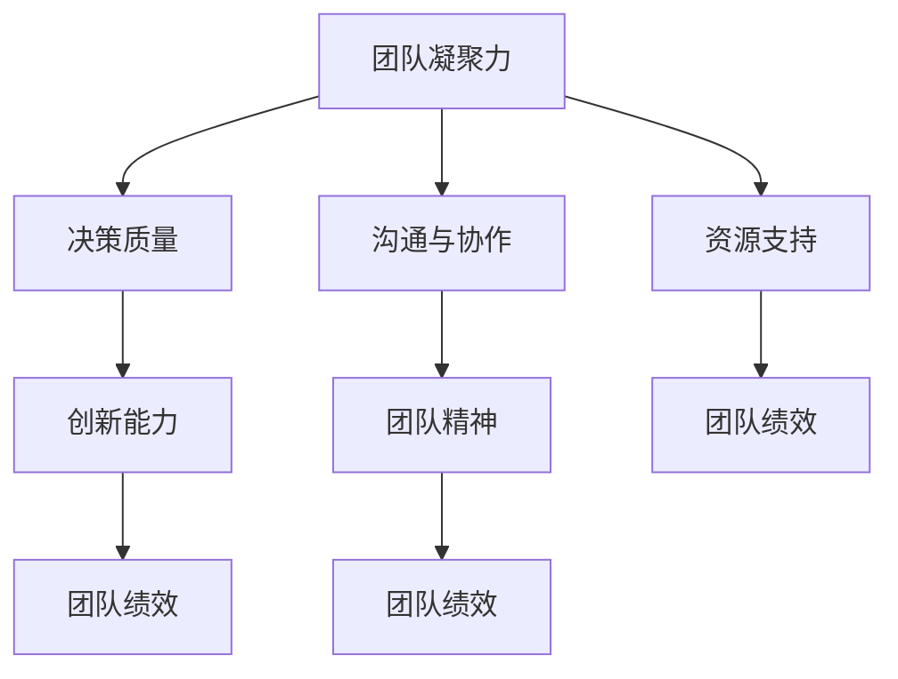

这个流程图展示了团队凝聚力如何通过决策质量、创新能力、沟通与协作、团队精神和资源支持，最终影响团队绩效。

#### 2.3 团队凝聚力与组织绩效的关系

团队凝聚力和组织绩效之间的关系是组织管理中的重要问题。研究表明，团队凝聚力对组织绩效有着重要的影响。

**2.3.1 团队凝聚力对组织绩效的影响**

团队凝聚力对组织绩效的影响主要表现在以下几个方面：

1. **提高决策质量**：高凝聚力的团队能够更有效地进行决策，因为团队成员之间的沟通更加顺畅，能够更全面地考虑问题，减少决策错误。
2. **增强创新能力**：团队凝聚力能够促进团队成员之间的知识共享和思想碰撞，从而激发创新思维，提高组织的创新能力。
3. **提高工作效率**：团队凝聚力强的团队能够更高效地完成任务，因为团队成员之间能够更好地协同工作，减少不必要的冲突和重复劳动。
4. **提升员工满意度**：团队凝聚力能够提高员工的满意度和归属感，从而降低员工流失率，提高组织的稳定性。

**2.3.2 组织绩效对团队凝聚力的影响**

组织绩效也会对团队凝聚力产生影响。通常表现为以下两种形式：

1. **正反馈循环**：当团队绩效提高时，团队成员之间的信任和合作也会增强，从而进一步提高团队凝聚力，形成良性循环。
2. **负反馈循环**：当团队绩效下降时，团队成员之间的信任和合作可能会受到影响，导致团队凝聚力下降，形成恶性循环。

**2.3.3 团队凝聚力与组织绩效关系架构图**

为了更直观地展示团队凝聚力与组织绩效之间的关系，我们可以使用Mermaid流程图来描述：

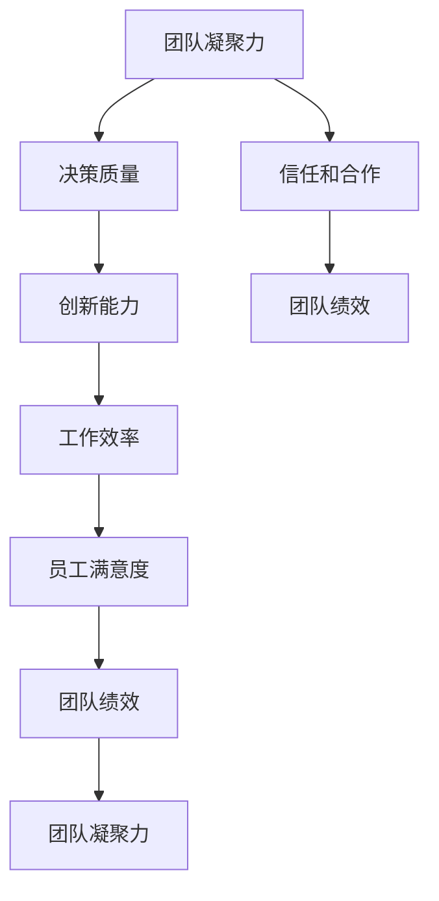

这个流程图展示了团队凝聚力如何通过决策质量、创新能力、工作效率、员工满意度和信任与合作，最终影响组织绩效。

### 第3章 从个体视角看团队凝聚力

#### 3.1 个体动机与团队凝聚力

个体动机是影响团队凝聚力的关键因素之一。个体在团队中的动机可以分为内在动机和外在动机。

**3.1.1 内在动机与团队凝聚力**

内在动机是指个体因对工作本身感兴趣而投入的努力。这种动机能够增强个体的自我效能感和成就感，从而提高团队凝聚力。

- **内在动机的作用**：内在动机可以激发个体的自主性和创造力，使个体更愿意为团队的目标付出努力。
- **内在动机的提升策略**：管理者可以通过提供有意义的工作、赋予个体责任和权力，以及提供反馈和认可来提升个体的内在动机。

**3.1.2 外在动机与团队凝聚力**

外在动机是指个体因外部奖励或惩罚而投入的努力。这种动机在一定程度上可以提升团队凝聚力，但其作用有限。

- **外在动机的作用**：外在动机可以通过奖励机制来激励个体，使其在短期内表现出较高的绩效。
- **外在动机的局限性**：过度依赖外在动机可能导致个体产生依赖性，缺乏内在动力，从而影响团队凝聚力。

**3.1.3 内外动机与团队凝聚力关系架构图**

为了更好地理解内外动机与团队凝聚力之间的关系，我们可以使用Mermaid流程图来展示：

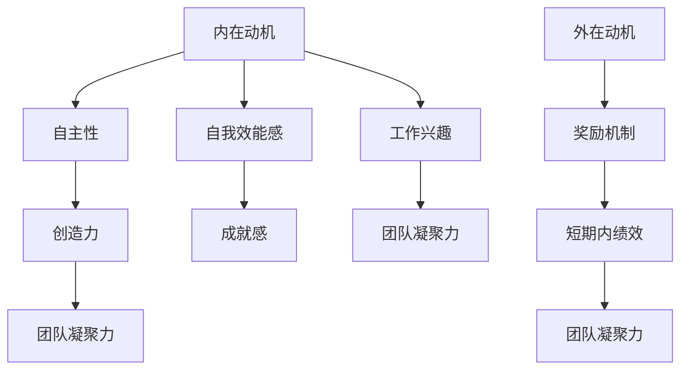

这个流程图展示了内在动机和外在动机如何通过自主性、创造力、自我效能感、成就感、工作兴趣和奖励机制，最终影响团队凝聚力。

#### 3.2 个体角色与团队凝聚力

个体在团队中扮演的角色对其团队凝聚力有着重要影响。不同的角色在团队中承担不同的职责和任务，从而影响团队的整体效能。

**3.2.1 团队角色的类型**

团队角色可以分为以下几种：

- **领导者**：领导者负责团队的目标设定、决策和协调，是团队凝聚力的核心。
- **执行者**：执行者是团队任务的直接执行者，负责具体工作的完成。
- **协调者**：协调者负责协调团队成员之间的沟通和合作，促进团队凝聚力的提升。
- **观察者**：观察者负责观察团队的工作流程，提供反馈和建议，以优化团队绩效。

**3.2.2 个体角色与团队凝聚力的关系**

个体角色对团队凝聚力的影响主要体现在以下几个方面：

- **领导者角色**：领导者的作用是建立团队目标、塑造团队文化、激励团队成员。领导者的行为和风格对团队凝聚力有着直接影响。
- **执行者角色**：执行者是团队工作的关键，他们的工作态度和能力直接影响团队的绩效和凝聚力。
- **协调者角色**：协调者负责团队内部和外部的沟通，确保信息的畅通和任务的协调。协调者的作用对团队凝聚力至关重要。
- **观察者角色**：观察者提供外部视角，有助于团队发现和解决问题。他们的反馈和建议有助于团队改进和提升凝聚力。

**3.2.3 个体角色与团队凝聚力关系架构图**

为了更好地理解个体角色与团队凝聚力的关系，我们可以使用Mermaid流程图来展示：

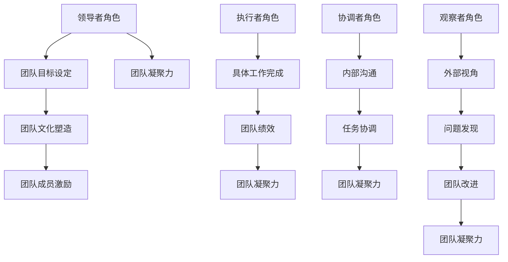

这个流程图展示了不同角色如何通过团队目标设定、团队文化塑造、团队成员激励、具体工作完成、内部沟通、任务协调和外部视角，最终影响团队凝聚力。

#### 3.3 个体行为对团队凝聚力的影响

个体行为在团队中的作用至关重要，它直接影响着团队凝聚力的强弱。个体行为可以分为积极行为和消极行为，两者对团队凝聚力的影响是不同的。

**3.3.1 积极行为对团队凝聚力的影响**

积极行为是指个体在团队中表现出的正向行为，如合作、支持、分享等。这些行为能够增强团队凝聚力，促进团队成员之间的协作和信任。

- **合作**：合作行为能够促进团队成员之间的沟通和交流，减少冲突，增强团队凝聚力。
- **支持**：个体对其他成员的支持和帮助，能够增强团队成员之间的信任和依赖，提高团队凝聚力。
- **分享**：分享知识和经验，能够促进团队成员之间的知识共享，提高团队的创新能力，增强团队凝聚力。

**3.3.2 消极行为对团队凝聚力的影响**

消极行为是指个体在团队中表现出的负向行为，如批评、抵制、推卸责任等。这些行为会削弱团队凝聚力，破坏团队成员之间的信任和合作关系。

- **批评**：过度批评会伤害团队成员的自尊心，导致团队成员之间的冲突和不满，削弱团队凝聚力。
- **抵制**：抵制行为会阻碍团队的工作进程，降低团队成员的合作意愿，削弱团队凝聚力。
- **推卸责任**：推卸责任会导致团队成员之间的责任分配不公，降低团队成员的责任感，削弱团队凝聚力。

**3.3.3 个体行为对团队凝聚力的影响关系架构图**

为了更好地理解个体行为对团队凝聚力的影响，我们可以使用Mermaid流程图来展示：

```mermaid
graph TD
    A[积极行为] --> B[合作]
    B --> C[沟通]
    C --> D[信任]
    D --> E[团队凝聚力]
    A --> F[支持]
    F --> G[依赖]
    G --> H[团队凝聚力]
    A --> I[分享]
    I --> J[知识共享]
    J --> K[创新能力]
    K --> L[团队凝聚力]
    M[Negative Behavior][消极行为] --> N[Criticism]
    N --> O[冲突]
    O --> P[不满]
    P --> Q[团队凝聚力]
    M --> R[Resistance]
    R --> S[工作进程阻碍]
    S --> T[合作意愿]
    T --> U[团队凝聚力]
    M --> V[Blaming]
    V --> W[责任分配不公]
    W --> X[责任感]
    X --> Y[团队凝聚力]
```

这个流程图展示了积极行为和消极行为如何通过合作、沟通、信任、知识共享、冲突、不满、工作进程阻碍、责任分配不公和责任感，最终影响团队凝聚力。

#### 3.4 个体动机、角色和行为对团队凝聚力的综合影响

个体动机、角色和行为是影响团队凝聚力的三个关键因素。它们之间的关系可以概括如下：

1. **个体动机影响角色定位和行为模式**：个体不同的动机会导致他们在团队中扮演不同的角色，并采取不同的行为。例如，具有内在动机的个体可能更倾向于扮演领导者或协调者角色，表现出积极行为。

2. **角色定位和行为模式影响团队凝聚力**：不同的角色定位和行为模式会对团队凝聚力产生不同的影响。例如，领导者的积极行为和角色定位有助于提升团队凝聚力，而执行者的高效工作和协调者的沟通协调也是团队凝聚力的重要保障。

3. **团队凝聚力反过来影响个体动机、角色和行为**：团队凝聚力强的团队能够提供更多的支持和认可，从而增强个体的内在动机，促进角色定位和行为模式的积极发展。

为了更好地理解这些因素之间的综合影响，我们可以使用Mermaid流程图来展示：

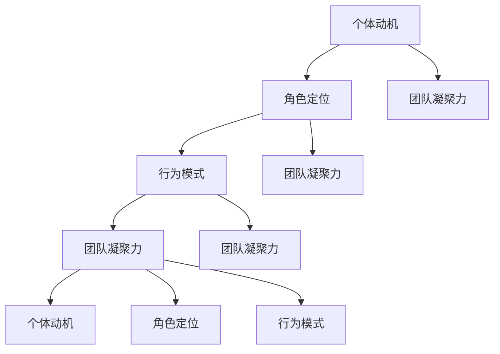

这个流程图展示了个体动机、角色定位、行为模式和团队凝聚力之间的相互作用关系，揭示了它们如何共同影响团队的整体效能。

### 第4章 从沟通视角提升团队凝聚力

#### 4.1 有效沟通的重要性

有效沟通是团队凝聚力建设的关键因素之一。良好的沟通能够促进团队成员之间的理解和协作，减少误解和冲突，从而提高团队的整体效能。以下将从三个方面探讨有效沟通的重要性：

**4.1.1 增强团队凝聚力**

有效沟通能够增强团队成员之间的信任和归属感，提高团队凝聚力。通过沟通，团队成员能够更好地理解彼此的需求和期望，形成共同的目标和价值观，从而增强团队的向心力。

**4.1.2 提高决策质量**

有效沟通有助于团队成员分享信息和观点，促进知识的交流和创新。在团队决策过程中，通过开放和透明的沟通，可以收集更多的意见和建议，减少信息不对称，提高决策的准确性和科学性。

**4.1.3 提升工作效率**

良好的沟通能够确保团队成员之间信息的畅通，减少重复工作和错误的发生，提高工作效率。有效的沟通还能帮助团队快速应对变化和挑战，保持高效的工作节奏。

#### 4.2 沟通障碍与解决策略

尽管沟通对于团队凝聚力至关重要，但在实际工作中，团队往往会遇到各种沟通障碍。以下是一些常见的沟通障碍及其解决策略：

**4.2.1 信息过载**

信息过载是指团队成员接收到的信息过多，难以处理和消化。解决策略包括：

- **明确沟通目标**：在沟通前明确传达的信息和目的，避免信息冗余。
- **简化信息传递**：使用简洁明了的语言，减少不必要的细节。

**4.2.2 沟通渠道不畅**

沟通渠道不畅可能导致信息传递不及时或失真。解决策略包括：

- **建立多样化的沟通渠道**：使用邮件、即时通讯工具、会议等多种方式，确保信息畅通。
- **明确沟通责任**：指定专人负责信息的收集、整理和传递。

**4.2.3 没有反馈机制**

缺乏反馈机制会导致沟通效果不佳，团队成员无法确认信息是否被正确理解和执行。解决策略包括：

- **定期反馈**：在沟通后及时收集反馈，了解信息接收情况。
- **开放沟通氛围**：鼓励团队成员积极提问和表达意见，确保沟通的畅通。

**4.2.4 文化差异**

文化差异可能影响团队成员之间的理解和沟通。解决策略包括：

- **加强跨文化培训**：提高团队成员的跨文化意识和沟通技巧。
- **尊重差异**：在沟通中尊重不同的文化背景，避免歧视和偏见。

#### 4.3 提升沟通技巧的实践方法

为了提升团队的沟通技巧，可以采取以下实践方法：

**4.3.1 建立明确的沟通框架**

建立明确的沟通框架，包括沟通的目标、内容、方式和时间等。这有助于团队成员在沟通中保持一致，提高沟通效率。

**4.3.2 采用积极倾听技巧**

积极倾听是指不仅听对方说什么，还要理解对方的情感和需求。实践方法包括：

- **保持专注**：在沟通时保持眼神接触，避免分心。
- **提出问题**：通过提问来确认对信息的理解。
- **给予反馈**：及时回应对方的观点和感受。

**4.3.3 提高非语言沟通能力**

非语言沟通包括肢体语言、面部表情和声音语调等。提高非语言沟通能力有助于增强沟通效果。实践方法包括：

- **练习肢体语言**：如保持开放的姿态，避免交叉手臂等。
- **注意声音语调**：如使用抑扬顿挫的语调，避免单调乏味。
- **培养同理心**：尝试从对方的角度理解问题。

**4.3.4 定期进行沟通反馈**

定期进行沟通反馈，可以帮助团队成员了解沟通的效果，发现和解决问题。实践方法包括：

- **设立沟通会议**：定期组织沟通会议，讨论沟通中的问题和改进措施。
- **匿名反馈**：使用匿名反馈机制，鼓励团队成员提出意见和建议。

#### 4.4 案例分析：提升沟通技巧的实践

以下是一个提升沟通技巧的实践案例：

**案例背景**：某科技公司团队在项目开发过程中，由于团队成员来自不同的文化背景，沟通效率低下，导致项目进展受阻。

**案例分析**：

1. **明确沟通目标**：项目经理在项目启动会议上明确了项目的目标和沟通要求，确保团队成员了解项目的关键信息和期望。

2. **采用多样化的沟通渠道**：项目经理建立了每周的项目进度会议、邮件群组和即时通讯群组，确保信息能够及时传递。

3. **加强跨文化培训**：项目经理组织了跨文化沟通培训，帮助团队成员了解不同文化背景的沟通方式和习惯。

4. **建立沟通反馈机制**：项目经理设立了匿名反馈渠道，鼓励团队成员提出沟通中的问题和建议。

**案例分析结果**：通过上述措施，团队的沟通效率显著提高，项目进展顺利，团队成员之间的信任和合作也得到增强。

**总结**：通过有效的沟通技巧和策略，团队可以克服沟通障碍，提高沟通效率，从而提升团队凝聚力和整体绩效。

### 第5章 团队合作与团队凝聚力

#### 5.1 团队合作的重要性

团队合作是现代组织运作的核心。随着项目复杂性和工作规模的增加，单靠个人的力量很难实现组织的战略目标。团队合作成为提高组织效率和创新能力的关键因素。以下是团队合作的重要性体现在以下几个方面：

**5.1.1 提高工作效率**

团队合作可以有效地分配任务，发挥每个人的优势，提高工作效率。团队成员在协同工作中，可以相互补充，减少重复劳动，加快项目的推进速度。

**5.1.2 增强创新能力**

团队合作促进了不同观点的碰撞和思想的交流，有助于激发创新思维。团队成员可以从不同的角度思考问题，提出创新的解决方案，从而提高组织的创新能力。

**5.1.3 提升团队绩效**

团队合作有助于实现团队的整体目标，提升团队绩效。团队成员在合作中能够相互支持，共同应对挑战，实现团队绩效的突破。

**5.1.4 增强员工满意度**

良好的团队合作氛围能够提高员工的满意度和归属感。团队成员在合作中建立了深厚的信任和友谊，增强了组织的凝聚力。

#### 5.2 团队合作模式

团队合作模式可以分为以下几种：

**5.2.1 功能性团队**

功能性团队是基于工作职能组建的团队，成员通常负责特定的任务或领域。例如，研发团队、市场营销团队等。功能性团队的特点是专业化程度高，任务明确。

**5.2.2 跨部门团队**

跨部门团队是由不同部门或领域的成员组成的团队，通常为了解决跨部门问题或开展大型项目而建立。跨部门团队的特点是资源整合能力强，能够实现跨领域的协同。

**5.2.3 项目团队**

项目团队是为了完成特定项目而组建的团队，成员通常来自不同的部门和领域。项目团队的特点是目标明确，时间紧迫。

**5.2.4 自组织团队**

自组织团队是指团队成员在共同目标下自发组成的团队，成员在项目中拥有较大的自主权。自组织团队的特点是成员之间高度信任，能够灵活应对变化。

#### 5.3 提升团队合作效率的策略

为了提升团队合作效率，可以采取以下策略：

**5.3.1 明确目标**

明确团队的目标是提升团队合作效率的首要步骤。团队应该共同设定清晰、可衡量的目标，确保每个成员都了解自己的职责和目标。

**5.3.2 分配任务**

合理分配任务可以确保每个成员都能充分发挥自己的优势。团队领导应该根据成员的能力和兴趣来分配任务，并确保任务量适中。

**5.3.3 促进沟通**

良好的沟通是团队合作的关键。团队应该建立有效的沟通渠道，确保信息畅通，减少误解和冲突。

**5.3.4 培养团队精神**

培养团队精神可以增强团队成员之间的信任和合作。团队可以通过团队建设活动和培训来提升成员之间的默契和信任。

**5.3.5 提供资源支持**

团队需要充足的资源来完成任务。组织应该为团队提供必要的资源，如时间、资金和技术支持，以确保团队能够高效地工作。

**5.3.6 激励与反馈**

激励和反馈是提升团队合作效率的重要手段。团队领导应该及时对成员的表现给予认可和激励，并针对团队的工作进行反馈和改进。

#### 5.4 案例分析：提升团队合作效率的实践

以下是一个提升团队合作效率的实践案例：

**案例背景**：某企业研发部门在项目开发过程中，由于沟通不畅和任务分配不均，导致项目进度严重滞后。

**案例分析**：

1. **明确目标**：项目经理在项目启动会议上明确了项目的目标和时间表，确保团队成员了解项目的关键信息和期望。

2. **分配任务**：项目经理根据团队成员的能力和兴趣，将项目任务进行了合理分配，确保每个人都能发挥自己的优势。

3. **促进沟通**：项目经理建立了每周的项目进度会议和即时通讯群组，确保团队成员能够及时沟通和协调。

4. **培养团队精神**：项目经理组织了团队建设活动和培训，提高了团队成员之间的默契和信任。

5. **提供资源支持**：企业为项目团队提供了充足的技术支持和资金，确保项目能够顺利进行。

**案例分析结果**：通过上述措施，项目团队的沟通效率显著提高，任务分配更加合理，项目进度逐步加快，最终成功完成了项目。

**总结**：通过明确目标、合理分配任务、促进沟通、培养团队精神、提供资源支持和激励与反馈，团队可以提升合作效率，实现整体绩效的提升。

### 第6章 团队建设活动与团队凝聚力

#### 6.1 团队建设活动的目的与类型

团队建设活动是提升团队凝聚力和合作效率的重要手段。这些活动旨在通过多种形式的活动来增强团队成员之间的联系，提高团队的整体效能。以下将从目的和类型两个方面来探讨团队建设活动。

**6.1.1 团队建设活动的目的**

团队建设活动的目的主要有以下几点：

1. **增强团队凝聚力**：通过共同的活动和经历，团队成员之间能够建立深厚的信任和合作关系，增强团队凝聚力。
2. **提升团队合作能力**：团队建设活动能够帮助团队成员了解彼此的优劣势，学会如何更好地协作，提高团队合作能力。
3. **促进沟通与交流**：团队建设活动提供了一个开放和自由的沟通环境，使团队成员能够更轻松地交流想法和意见。
4. **提高员工满意度**：成功的团队建设活动能够提升员工的满意度和归属感，降低员工流失率。

**6.1.2 团队建设活动的类型**

团队建设活动可以分为以下几种类型：

1. **户外拓展活动**：户外拓展活动是一种通过户外挑战来增强团队合作和沟通能力的方式。例如，攀岩、徒步、划皮划艇等。这些活动有助于团队成员在挑战中建立信任，学会相互支持。

2. **团队游戏和竞赛**：团队游戏和竞赛是通过趣味性和竞争性来提高团队凝聚力和合作精神的。例如，团队建设的桌游、团队运动会等。这些活动能够在轻松愉快的氛围中增强团队成员之间的互动。

3. **团队培训与讲座**：团队培训与讲座是一种通过专业知识和技能的传授来提升团队效能的方式。例如，沟通技巧培训、领导力培训、团队协作培训等。这些活动能够帮助团队成员了解团队协作的重要性和方法。

4. **团队内部会议和研讨会**：团队内部会议和研讨会是团队成员之间交流思想、分享经验的重要平台。通过定期的会议和研讨会，团队成员能够更好地了解团队的目标和进展，提出改进建议。

5. **文化体验和交流**：文化体验和交流是一种通过体验不同的文化和生活方式来增进团队成员之间的理解和尊重的方式。例如，参观博物馆、艺术展览、文化交流活动等。这些活动能够帮助团队成员开阔视野，增强团队的多元化。

#### 6.2 常见的团队建设活动

以下是几种常见的团队建设活动及其特点：

**6.2.1 户外拓展活动**

- **特点**：通过户外挑战，如攀岩、徒步等，增强团队合作和沟通能力。
- **适用场景**：适用于需要提高团队合作能力和信任度的团队。

**6.2.2 团队游戏和竞赛**

- **特点**：通过趣味性和竞争性，如团队建设的桌游、团队运动会等，增强团队凝聚力和合作精神。
- **适用场景**：适用于希望提高团队凝聚力和竞争意识的团队。

**6.2.3 团队培训与讲座**

- **特点**：通过专业知识和技能的传授，如沟通技巧培训、领导力培训等，提升团队效能。
- **适用场景**：适用于需要提升专业知识和技能的团队。

**6.2.4 团队内部会议和研讨会**

- **特点**：通过定期的会议和研讨会，交流思想、分享经验，增进团队成员之间的了解。
- **适用场景**：适用于希望提升团队沟通和协作能力的团队。

**6.2.5 文化体验和交流**

- **特点**：通过体验不同的文化和生活方式，增进团队成员之间的理解和尊重。
- **适用场景**：适用于希望提升团队多元化和文化意识的团队。

#### 6.3 团队建设活动的实施与评估

**6.3.1 实施步骤**

1. **确定活动目标**：根据团队的需求和目标，明确团队建设活动的主要目的和期望成果。

2. **选择合适的活动类型**：根据活动目标，选择适合的团队建设活动类型。

3. **制定活动计划**：制定详细的活动计划，包括活动的时间、地点、参与人员、活动流程等。

4. **准备活动资源**：根据活动计划，准备必要的资源，如场地、设备、材料等。

5. **通知和动员**：提前通知团队成员，动员他们积极参与活动。

6. **实施活动**：按照活动计划，顺利实施团队建设活动。

7. **跟进和反馈**：活动结束后，对团队成员进行跟进和反馈，了解活动的效果和改进意见。

**6.3.2 评估方法**

1. **自我评估**：团队成员可以根据活动过程中的参与度、学习收获等方面进行自我评估。

2. **团队评估**：团队领导或项目经理可以组织团队进行集体评估，讨论活动的效果和不足。

3. **问卷调查**：通过问卷调查的方式，收集团队成员对团队建设活动的反馈和建议。

4. **观察和记录**：观察团队成员在活动中的表现和互动，记录活动过程中的亮点和问题。

5. **数据分析和报告**：对评估数据进行整理和分析，形成评估报告，为未来的团队建设活动提供参考。

#### 6.4 案例分析：团队建设活动的成功实践

**案例背景**：某科技公司研发部门在项目开发过程中，团队凝聚力不足，导致项目进展缓慢。

**案例分析**：

1. **确定活动目标**：为了提升团队凝聚力和合作能力，研发部门决定组织一次户外拓展活动。

2. **选择活动类型**：经过讨论，团队选择了攀岩活动，因为攀岩需要团队合作和信任，能够有效提升团队凝聚力。

3. **制定活动计划**：活动计划包括活动时间、地点、参与人员、活动流程等，确保活动的顺利进行。

4. **准备活动资源**：公司提供了攀岩场地、专业教练和必要的设备，确保活动的安全和顺利进行。

5. **通知和动员**：提前通知团队成员，并动员他们积极参与活动。

6. **实施活动**：活动当天，团队成员积极参与，教练进行了攀岩技巧的指导，团队在挑战中建立了深厚的信任和合作关系。

7. **跟进和反馈**：活动结束后，团队领导组织了集体反馈会议，团队成员分享了活动过程中的感受和收获，提出了一些改进建议。

**案例分析结果**：通过户外拓展活动，研发部门的团队凝聚力得到了显著提升，团队成员之间的信任和合作能力得到了增强，项目进展也变得更加顺利。

**总结**：团队建设活动是提升团队凝聚力和合作能力的重要手段。通过合理规划和有效实施，团队建设活动能够帮助团队实现目标，提高整体效能。

### 第7章 从整体视角提升团队凝聚力

#### 7.1 整体绩效与团队凝聚力

团队凝聚力与整体绩效之间的关系是一个备受关注的研究领域。研究表明，团队凝聚力对整体绩效有着显著的影响。

**7.1.1 整体绩效的定义**

整体绩效是指团队在完成特定任务或项目过程中所表现出的综合能力和效果。它包括任务完成度、工作效率、创新能力、客户满意度等多个方面。

**7.1.2 团队凝聚力对整体绩效的影响**

1. **提高任务完成度**：高凝聚力的团队能够更好地协调和分工，确保任务的高效完成。

2. **提升工作效率**：团队凝聚力强的团队能够减少沟通障碍和冲突，提高工作效率。

3. **增强创新能力**：团队成员之间的互动和知识共享能够激发创新思维，提高团队的整体创新能力。

4. **提高客户满意度**：团队凝聚力强的团队能够提供更优质的客户服务，提高客户满意度。

**7.1.3 整体绩效对团队凝聚力的影响**

1. **正反馈循环**：当团队整体绩效提升时，团队成员的成就感和归属感增强，从而提高团队凝聚力。

2. **负反馈循环**：当团队整体绩效不佳时，团队成员可能会感到沮丧和不安，影响团队凝聚力。

**7.1.4 整体绩效与团队凝聚力关系架构图**

为了更好地理解整体绩效与团队凝聚力之间的关系，我们可以使用Mermaid流程图来展示：

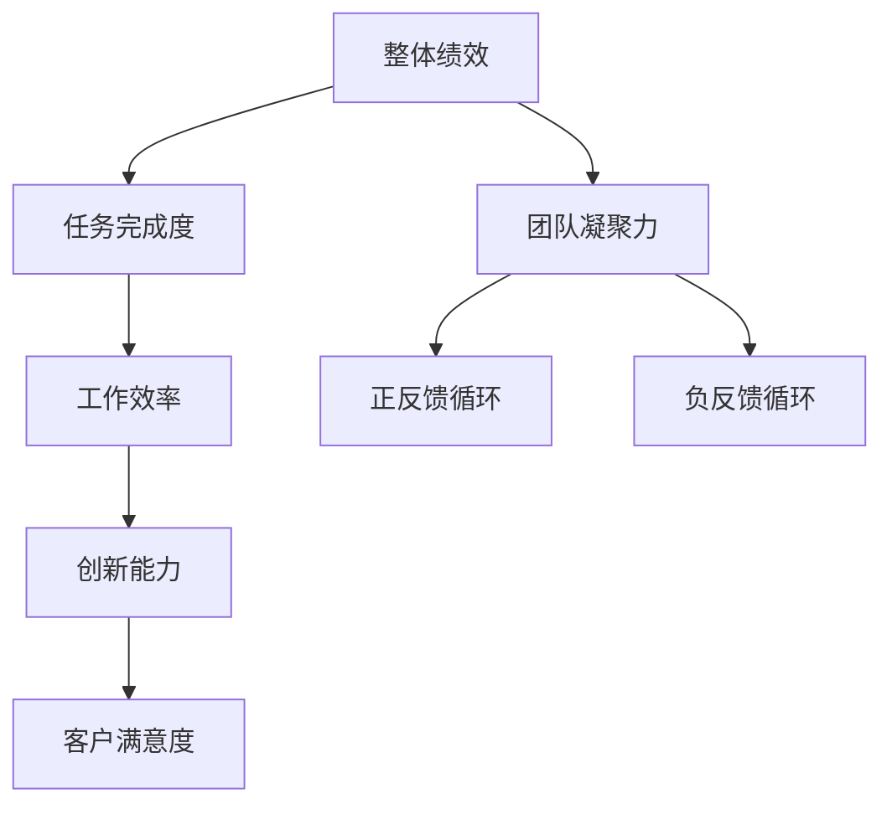

这个流程图展示了整体绩效如何通过任务完成度、工作效率、创新能力和客户满意度，最终影响团队凝聚力，形成正反馈或负反馈循环。

#### 7.2 组织文化与团队凝聚力

组织文化是影响团队凝聚力的关键因素之一。组织文化包括组织的价值观、行为规范、工作氛围等，对团队的行为和态度有着深远的影响。

**7.2.1 组织文化的定义**

组织文化是指组织在长期发展过程中形成的共同价值观、行为准则和思维方式。它是一个组织的灵魂，对组织的运作和发展具有重要作用。

**7.2.2 组织文化与团队凝聚力之间的关系**

1. **共同价值观**：组织文化中的共同价值观能够增强团队成员之间的认同感和归属感，提高团队凝聚力。

2. **行为规范**：组织文化中的行为规范为团队成员提供了行为准则，有助于减少冲突，增强团队合作。

3. **工作氛围**：组织文化中的工作氛围影响着团队成员的工作态度和行为，良好的工作氛围能够增强团队凝聚力。

**7.2.3 建设积极组织文化的策略**

1. **领导示范**：领导层的行为和态度对组织文化具有示范作用，领导应该以身作则，践行组织价值观。

2. **明确价值观**：组织应该明确核心价值观，并将其融入日常工作中，使员工能够深刻理解和认同。

3. **员工参与**：鼓励员工参与组织文化的建设和实践，增强员工的归属感和参与感。

4. **培训与宣传**：通过培训和教育，提高员工对组织文化的理解和认同，通过宣传和表彰，强化组织文化的影响力。

**7.2.4 组织文化与团队凝聚力关系架构图**

为了更好地理解组织文化与团队凝聚力之间的关系，我们可以使用Mermaid流程图来展示：

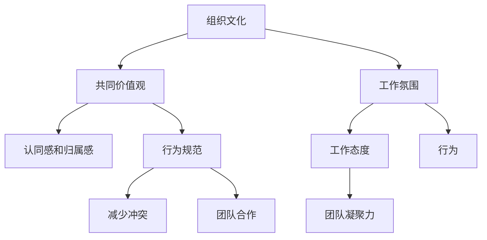

这个流程图展示了组织文化如何通过共同价值观、认同感和归属感、行为规范、减少冲突和团队合作，最终影响团队凝聚力。

#### 7.3 领导风格与团队凝聚力

领导风格对团队凝聚力有着重要的影响。不同的领导风格会对团队成员的行为和态度产生不同的影响，从而影响团队凝聚力。

**7.3.1 领导风格的定义**

领导风格是指领导者在管理团队时所采用的方式和态度。常见的领导风格包括民主型、专制型、放任型等。

**7.3.2 不同领导风格对团队凝聚力的影响**

1. **民主型领导风格**：民主型领导风格强调参与和沟通，尊重团队成员的意见和建议。这种领导风格能够增强团队成员的参与感和归属感，提高团队凝聚力。

2. **专制型领导风格**：专制型领导风格强调控制和管理，决策权集中在领导者手中。这种领导风格可能会削弱团队成员的自主性和创造力，影响团队凝聚力。

3. **放任型领导风格**：放任型领导风格强调自由和自主，领导者较少干预团队的工作。这种领导风格可能会导致团队成员之间的协作不足，影响团队凝聚力。

**7.3.3 建立合适的领导风格的策略**

1. **根据团队需求调整领导风格**：领导者应该根据团队的需求和环境，灵活调整自己的领导风格。

2. **培养民主氛围**：领导者应该鼓励团队成员参与决策和讨论，建立民主的氛围。

3. **提供支持和指导**：领导者应该在团队成员需要时提供支持和指导，帮助团队成员克服困难。

**7.3.4 领导风格与团队凝聚力关系架构图**

为了更好地理解领导风格与团队凝聚力之间的关系，我们可以使用Mermaid流程图来展示：

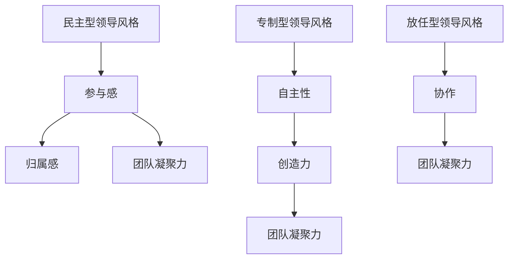

这个流程图展示了不同领导风格如何通过参与感、归属感、自主性、创造力和协作，最终影响团队凝聚力。

### 第8章 团队凝聚力建设案例研究

#### 8.1 案例一：科技公司提升团队凝聚力

**案例背景**：某科技公司是一家快速发展的初创企业，随着业务规模的扩大，团队规模也逐渐增加。然而，团队成员之间的沟通不畅和协作不力，导致项目进展缓慢，团队士气低落。

**案例分析**：

1. **问题识别**：公司领导层意识到团队凝聚力不足的问题，主要表现在以下方面：
   - 沟通障碍：团队成员之间的信息传递不及时，导致误解和冲突。
   - 协作不力：团队成员各自为政，缺乏有效的协同工作。
   - 工作氛围：团队成员之间的互动较少，缺乏团队合作的精神。

2. **解决方案**：为了提升团队凝聚力，公司采取了以下措施：

   - **实施团队建设活动**：组织了多次户外拓展活动，如攀岩、徒步等，增强团队成员之间的信任和合作。
   - **加强沟通与培训**：建立了定期的团队内部会议和培训，提高团队成员的沟通技巧和协作能力。
   - **明确目标和责任**：为每个团队成员设定清晰的目标和责任，确保每个人都了解自己的角色和职责。
   - **激励与认可**：通过奖励和认可机制，激励团队成员积极投入工作，增强团队凝聚力。

3. **实施效果**：经过一段时间的努力，团队凝聚力显著提升，项目进展变得更加顺利，团队士气也得到了极大的提高。

**案例启示**：通过实施有效的团队建设活动、加强沟通与培训、明确目标和责任以及激励与认可，团队可以显著提升凝聚力，实现更好的协作和绩效。

#### 8.2 案例二：非营利组织增强团队凝聚力

**案例背景**：某非营利组织致力于为弱势群体提供帮助，随着服务项目的增加，团队成员的工作压力逐渐加大。团队凝聚力不足导致团队成员之间缺乏信任，工作效率低下。

**案例分析**：

1. **问题识别**：组织领导层发现团队凝聚力不足的问题，主要表现在以下方面：
   - 信任缺失：团队成员之间缺乏信任，导致协作困难。
   - 工作氛围：团队成员之间的互动较少，缺乏团队合作的氛围。
   - 工作压力：团队成员面临较大的工作压力，导致士气低落。

2. **解决方案**：为了增强团队凝聚力，组织采取了以下措施：

   - **开展团队建设活动**：组织了多次团队建设活动，如团队游戏、户外活动等，增强团队成员之间的信任和合作。
   - **加强沟通与支持**：建立了定期的团队内部会议，鼓励团队成员分享经验和问题，提供相互支持和帮助。
   - **共同目标与价值观**：明确了组织的共同目标和价值观，使团队成员对组织有更深的认同感和归属感。
   - **灵活的工作安排**：通过灵活的工作安排，减轻团队成员的工作压力，提高工作效率。

3. **实施效果**：经过一段时间的努力，团队凝聚力显著增强，团队成员之间的信任和合作明显提升，工作效率和士气也得到了显著提高。

**案例启示**：通过开展团队建设活动、加强沟通与支持、共同目标与价值观的建立以及灵活的工作安排，非营利组织可以显著增强团队凝聚力，提高团队效能。

#### 8.3 案例分析与启示

通过对两个案例的分析，我们可以得出以下启示：

1. **团队建设活动的重要性**：团队建设活动能够增强团队成员之间的信任和合作，提高团队凝聚力。不同类型的团队建设活动，如户外拓展、团队游戏、培训等，都能在不同方面提升团队凝聚力。

2. **沟通与支持的重要性**：有效的沟通和相互支持是团队凝聚力的重要保障。定期的团队内部会议、交流分享等，有助于建立良好的沟通机制，增强团队成员之间的互动和信任。

3. **共同目标与价值观的建立**：明确组织的共同目标和价值观，使团队成员对组织有更深的认同感和归属感，是增强团队凝聚力的重要策略。

4. **灵活的工作安排**：通过灵活的工作安排，减轻团队成员的工作压力，提高工作效率，有助于提升团队凝聚力。

5. **激励与认可**：通过激励和认可机制，激励团队成员积极投入工作，增强团队凝聚力。

总之，通过有效的团队凝聚力建设策略，无论是企业还是非营利组织，都可以显著提升团队效能，实现更好的发展。

### 第9章 团队凝聚力建设的持续优化

#### 9.1 反馈与调整的重要性

团队凝聚力建设是一个持续的过程，需要不断地反馈和调整。有效的反馈机制能够帮助团队及时发现和解决问题，确保团队凝聚力的持续提升。

**9.1.1 反馈机制的建立**

建立有效的反馈机制，可以从以下几个方面入手：

1. **定期评估**：定期对团队凝聚力的建设情况进行评估，了解团队成员的反馈和需求。
2. **匿名反馈**：鼓励团队成员匿名反馈，消除顾虑，确保反馈的真实性和有效性。
3. **多种渠道**：提供多种反馈渠道，如线上问卷调查、面对面访谈、匿名邮件等，方便团队成员表达意见。

**9.1.2 反馈内容与分析**

反馈内容主要包括以下几个方面：

1. **团队凝聚力状况**：评估团队凝聚力的当前水平，包括信任、合作、共同目标等方面。
2. **团队成员满意度**：了解团队成员对团队凝聚力建设的满意度和参与度。
3. **问题与挑战**：识别团队在凝聚力建设过程中遇到的问题和挑战，如沟通障碍、协作困难等。
4. **改进建议**：收集团队成员对于改进团队凝聚力建设的建议和意见。

对反馈内容进行详细分析，可以帮助团队找到问题的根源，制定针对性的改进措施。

**9.1.3 反馈与调整的流程图**

为了更好地理解反馈与调整的过程，我们可以使用Mermaid流程图来展示：

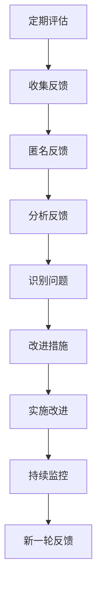

这个流程图展示了团队如何通过定期评估、收集反馈、匿名反馈、分析反馈、识别问题、制定改进措施、实施改进和持续监控，实现团队凝聚力建设的持续优化。

#### 9.2 持续改进的策略

为了确保团队凝聚力建设的持续优化，可以采取以下策略：

**9.2.1 持续学习与培训**

1. **定期培训**：定期组织团队成员参加沟通技巧、团队合作等方面的培训，提升团队成员的技能和意识。
2. **个性化培训**：根据团队成员的实际情况和需求，提供个性化的培训方案，帮助其不断提升。

**9.2.2 沟通与协作机制的优化**

1. **完善沟通机制**：建立和完善沟通机制，确保信息畅通，减少误解和冲突。
2. **协同工作平台**：利用协同工作平台，如Slack、Trello等，提高团队的协作效率。

**9.2.3 跨部门合作与交流**

1. **跨部门项目**：通过跨部门项目，促进不同部门之间的合作和交流，增强团队之间的凝聚力。
2. **定期交流会议**：定期组织跨部门交流会议，分享经验，解决跨部门协作中的问题。

**9.2.4 激励与认可**

1. **奖励机制**：建立合理的奖励机制，激励团队成员积极参与团队凝聚力建设。
2. **认可与表彰**：对在团队凝聚力建设过程中表现突出的成员给予认可和表彰，提高其积极性和归属感。

**9.2.5 持续改进的关系图**

为了更好地展示持续改进的策略，我们可以使用Mermaid关系图来展示：

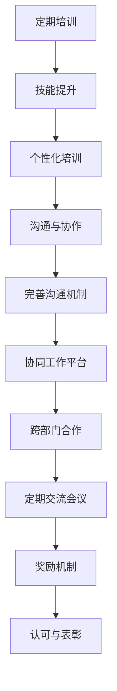

这个关系图展示了如何通过定期培训、个性化培训、完善沟通机制、协同工作平台、跨部门合作、定期交流会议、奖励机制和认可与表彰等策略，实现团队凝聚力建设的持续优化。

#### 9.3 团队凝聚力建设的挑战与应对

在团队凝聚力建设过程中，企业可能会面临以下挑战：

**9.3.1 成员多样性**

成员多样性既是团队建设的一大优势，也可能成为挑战。不同背景、经验和价值观的成员可能存在沟通障碍和协作困难。应对策略包括：

1. **加强跨文化培训**：提高团队成员的跨文化沟通和协作能力。
2. **建立多元化团队**：在团队中引入不同背景的成员，促进多元思维和协作。

**9.3.2 工作压力与情绪管理**

工作压力和情绪管理是团队凝聚力建设的重要挑战。高压力环境下，成员可能表现出负面情绪，影响团队氛围。应对策略包括：

1. **提供心理健康支持**：建立员工心理健康支持系统，提供咨询和辅导。
2. **定期放松活动**：组织团队放松活动，如瑜伽、冥想等，帮助成员缓解压力。

**9.3.3 领导风格与团队动力**

领导风格直接影响团队动力和凝聚力。领导者在激励团队成员、提供支持方面的表现至关重要。应对策略包括：

1. **领导力培训**：提高领导者的领导能力和管理技能。
2. **鼓励民主参与**：鼓励团队成员参与决策，增强团队归属感和参与感。

**9.3.4 持续改进与适应性**

团队凝聚力建设需要持续改进和适应。企业环境和需求不断变化，团队需要不断调整和优化凝聚力建设策略。应对策略包括：

1. **定期评估与反馈**：定期评估团队凝聚力建设的效果，收集团队成员的反馈。
2. **灵活调整策略**：根据反馈和评估结果，灵活调整团队凝聚力建设策略。

通过应对这些挑战，企业可以有效地推进团队凝聚力建设，实现团队的高效协作和持续发展。

### 附录：团队凝聚力建设工具与资源

#### 附录A：团队凝聚力评估工具

为了有效评估团队凝聚力，以下是一些常用的工具：

1. **团际凝聚力问卷（Group Cohesion Questionnaire）**：该问卷涵盖了团队凝聚力、信任、协作等多个方面，可以帮助评估团队的整体凝聚力和成员之间的协作情况。

2. **团队动力评估（Team Dynamics Assessment）**：通过评估团队成员的动机、角色和互动，了解团队动力和凝聚力。

3. **组织氛围调查（Organizational Climate Survey）**：该调查工具可以帮助评估团队成员对组织文化的感知，包括信任、支持、沟通等方面。

#### 附录B：推荐阅读与学习资源

1. **书籍推荐**：
   - 《团队的五项修炼：打造卓越团队的核心技能》
   - 《团队合作的秘密：如何构建高效的团队》
   - 《领导力与团队管理》

2. **在线课程**：
   - Coursera上的《团队协作与沟通》课程
   - Udemy上的《团队领导力：如何管理高效团队》
   - LinkedIn Learning上的《团队建设：提升团队合作能力》

3. **学术论文与研究报告**：
   - Google Scholar：搜索“team cohesion”或“group dynamics”等关键词，获取相关的研究论文。
   - ResearchGate：可以查看和下载团队凝聚力相关的学术报告。

4. **社交媒体与论坛**：
   - LinkedIn：关注团队管理相关的LinkedIn群组，获取行业动态和最佳实践。
   - Reddit：Reddit上的相关子版块，如r/TeamLeadership，提供了丰富的讨论和资源。

通过这些工具和资源，企业和个人可以更深入地了解团队凝聚力建设的相关理论和实践，从而提升团队的协作效率和整体绩效。作者：AI天才研究院/AI Genius Institute & 禅与计算机程序设计艺术 /Zen And The Art of Computer Programming

---

### 总结与展望

本文围绕团队凝聚力建设进行了深入探讨，从个体视角、沟通视角、团队合作视角以及整体视角，详细分析了影响团队凝聚力的各个因素和提升策略。通过理论阐述、实践案例以及评估工具的介绍，我们展示了团队凝聚力建设的重要性和可行性。

首先，从个体视角看，个体动机、角色和行为对团队凝聚力有着深远的影响。个体内在动机和外在动机共同作用，决定了个体在团队中的行为模式。同时，个体角色定位和行为模式反过来影响团队凝聚力。其次，从沟通视角看，有效沟通是提升团队凝聚力的关键。沟通障碍的存在会导致团队效率低下，而提升沟通技巧和建立有效的沟通机制可以显著改善团队凝聚力。再次，从团队合作视角看，团队合作是团队凝聚力的核心表现。通过合理的任务分配、促进沟通与协作，团队可以提升整体绩效，实现共同目标。最后，从整体视角看，整体绩效、组织文化和领导风格都是影响团队凝聚力的重要因素。通过建立积极组织文化和采用合适的领导风格，团队可以更好地发挥整体效能。

在案例分析部分，我们通过两个不同类型的组织案例，展示了团队凝聚力建设的实际应用和效果。这些案例证明了有效的团队凝聚力建设能够显著提升团队的协作效率和整体绩效。

展望未来，团队凝聚力建设将在以下几个方面继续发展：

1. **数字化工具的应用**：随着科技的进步，数字化工具如在线协作平台、虚拟现实培训等将在团队凝聚力建设中发挥更大的作用。

2. **个性化团队建设**：未来团队建设活动将更加注重个性化，根据不同团队的特点和需求，设计量身定制的建设方案。

3. **持续反馈与改进**：团队凝聚力建设将更加注重持续反馈和改进，通过定期评估和调整策略，实现团队凝聚力建设的动态优化。

4. **多元文化融合**：在全球化背景下，多元文化融合将成为团队凝聚力建设的重要方向。如何在不同文化背景下提升团队凝聚力，将成为研究的重点。

总之，团队凝聚力建设是一个持续和动态的过程。通过有效的策略和实践，企业可以提升团队的协作效率和整体绩效，实现可持续的发展。作者：AI天才研究院/AI Genius Institute & 禅与计算机程序设计艺术 /Zen And The Art of Computer Programming

