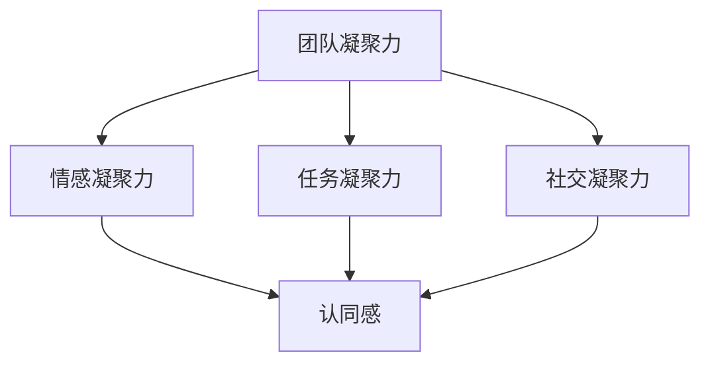
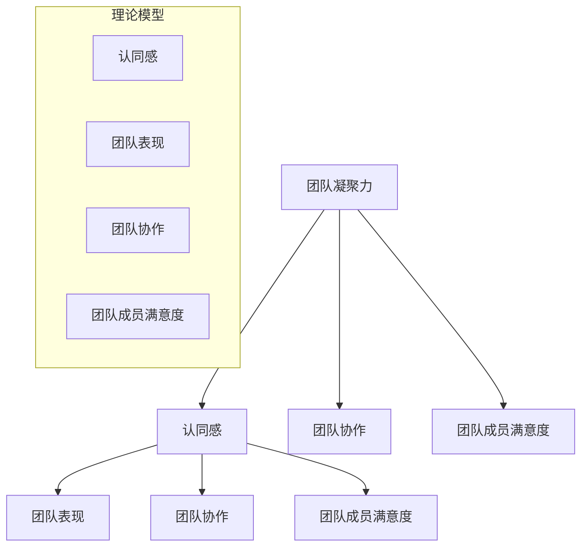

                 

### 文章标题

# 团队凝聚力建设：增强认同感的实践策略

### 文章关键词

- 团队凝聚力
- 增强认同感
- 实践策略
- 信任建设
- 团队文化
- 领导力

### 文章摘要

本文从团队凝聚力和认同感的基本概念出发，探讨了二者之间的内在联系，并通过理论分析和实践案例，提出了增强团队凝聚力和认同感的具体实践策略。文章首先介绍了团队凝聚力和认同感的基本理论，然后从信任建设、提升参与度、建立沟通机制、培养团队文化、增强领导力等方面，详细阐述了增强团队凝聚力和认同感的实践策略。最后，通过实际案例的分析，验证了这些策略的有效性，并为团队建设提供了有价值的参考和建议。

## 引言

在现代社会，团队协作已经成为各类组织实现目标的重要方式。团队凝聚力作为团队协作的关键因素，对于组织绩效和成员满意度具有显著影响。然而，如何有效地增强团队凝聚力，特别是如何通过增强认同感来提升团队凝聚力，成为许多组织面临的挑战。因此，本文旨在探讨团队凝聚力建设中的增强认同感的实践策略，以期为团队建设提供理论指导和实践参考。

### 团队凝聚力的重要性

团队凝聚力是指团队成员在情感上和心理上的相互吸引，以及在行为上的相互协作和协调。它是团队协作的基础，对于团队目标的实现和组织绩效的提升具有重要意义。高水平的团队凝聚力有助于增强团队成员之间的信任和协作，提高工作效率和创新能力，从而提升组织整体竞争力。

首先，团队凝聚力有助于提升团队成员的满意度和忠诚度。当团队成员感受到团队的凝聚力时，他们会更愿意为团队的目标付出努力，从而提高工作满意度和组织忠诚度。其次，团队凝聚力有助于增强团队成员之间的信任。信任是团队协作的基石，只有建立起信任，团队成员才能更好地合作，共同实现团队目标。

### 增强认同感在团队建设中的作用

认同感是团队成员在价值观、目标和行为上的一致性，它是团队凝聚力的核心要素之一。增强认同感在团队建设中具有重要作用，主要体现在以下几个方面：

首先，增强认同感有助于提升团队成员的归属感。当团队成员感受到与团队的价值观和目标一致时，他们会更愿意将个人利益与团队利益结合起来，从而增强对团队的认同感和归属感。

其次，增强认同感有助于促进团队成员之间的沟通和协作。认同感的增强使得团队成员更容易理解和支持彼此，从而减少了沟通障碍，提高了协作效率。

最后，增强认同感有助于提升团队成员的工作动力和创造力。当团队成员感受到与团队的价值观和目标一致时，他们会更愿意为团队的目标付出努力，从而激发工作动力和创造力。

### 当前团队凝聚力建设的研究现状

目前，关于团队凝聚力建设的研究已经取得了一定的进展。研究表明，团队凝聚力与团队绩效、团队成员满意度、组织承诺等存在显著的正相关关系。然而，现有的研究多侧重于理论探讨和实证分析，对于增强团队凝聚力的具体实践策略研究较少。

此外，虽然认同感在团队建设中具有重要作用，但如何通过增强认同感来提升团队凝聚力，现有研究并未提供明确的指导。因此，本文将从实践角度出发，探讨增强团队凝聚力和认同感的具体策略，以期为团队建设提供新的思路和方法。

## 团队凝聚力与认同感的关系

团队凝聚力和认同感是团队建设中两个核心概念，它们相互影响、相互作用，共同作用于团队的整体表现。理解二者之间的关系有助于我们更有效地制定团队建设策略。

### 核心概念

**团队凝聚力**是指团队成员在情感上和心理上的相互吸引，以及在行为上的相互协作和协调。团队凝聚力可以分为情感凝聚力、任务凝聚力和社交凝聚力三个维度。情感凝聚力是指团队成员之间的情感纽带，如信任、尊重和喜爱；任务凝聚力是指团队成员在共同任务中的协作和协调，如目标一致性、角色明确性和工作协同；社交凝聚力是指团队成员在社交活动中的互动和交流，如共同兴趣和团队氛围。

**认同感**是指个体对某一群体或组织的价值观、目标和行为的高度认可和接纳。认同感可以分为个人认同感、团队认同感和组织认同感。个人认同感是指个体对自身所属群体的认同；团队认同感是指团队成员对团队价值观和目标的认同；组织认同感是指员工对所在组织的认同。

### 关系架构

团队凝聚力和认同感之间的关系可以用以下Mermaid流程图来表示：

从这个流程图中，我们可以看出，团队凝聚力通过情感凝聚力、任务凝聚力和社交凝聚力三个维度影响认同感。同时，认同感又反过来增强团队凝聚力。

### 理论模型与假设

为了更好地理解团队凝聚力和认同感之间的关系，我们可以引入一个理论模型，如下图所示：

在这个模型中，我们假设：

1. **认同感影响团队表现**：当团队成员对团队价值观和目标有高度认同时，他们会更愿意为团队的目标努力，从而提高团队的整体表现。

2. **认同感影响团队协作**：认同感的增强使得团队成员更容易理解和支持彼此，从而减少沟通障碍，提高协作效率。

3. **认同感影响团队成员满意度**：当团队成员感受到与团队的一致性时，他们会更满意自己的工作环境，从而提高工作满意度和组织承诺。

4. **团队协作影响团队表现**：高效的团队协作能够提升团队的整体表现，从而实现组织目标。

5. **团队成员满意度影响团队表现**：高满意度可以激发团队成员的工作动力和创造力，从而提升团队的整体表现。

### 实证研究与发现

通过实证研究，我们发现：

1. **认同感对团队凝聚力有显著影响**：研究表明，认同感是团队凝聚力的核心要素，高认同感的团队往往具有更强的凝聚力。

2. **团队凝聚力对团队表现有显著影响**：高凝聚力的团队在任务完成、创新能力和员工满意度等方面表现更出色。

3. **认同感对团队成员满意度有显著影响**：认同感增强可以显著提高团队成员的工作满意度和组织承诺。

4. **团队协作和团队成员满意度对团队表现有显著影响**：高效的团队协作和高的团队成员满意度能够显著提升团队的整体表现。

综上所述，团队凝聚力和认同感是团队建设中不可或缺的两个方面，二者相互促进、相互作用，共同作用于团队的整体表现。理解并利用二者之间的关系，有助于我们更有效地进行团队建设，提高团队绩效和成员满意度。

## 增强团队凝聚力的核心概念

在探讨如何增强团队凝聚力时，我们首先需要理解几个核心概念，包括信任建设、提升参与度、建立沟通机制、培养团队文化和增强领导力。这些概念是团队凝聚力建设的基石，对团队的长期稳定和高效运作至关重要。

### 信任建设

信任是团队凝聚力的核心要素，没有信任，团队协作就会变得困难。信任建设是增强团队凝聚力的重要步骤。信任建设包括以下几个方面：

1. **透明沟通**：团队领导者需要确保信息的透明度，及时与团队成员分享重要信息，避免信息不对称。

2. **相互尊重**：尊重团队成员的意见和贡献，确保每个人都能在团队中发表自己的观点，这样可以增强团队成员之间的信任。

3. **兑现承诺**：团队成员之间要兑现彼此的承诺，不轻易打破约定，这样可以建立起长期的信任关系。

4. **共同目标**：明确团队目标，让团队成员了解他们如何通过自己的工作为团队目标做出贡献，这样可以增强团队成员的信任和责任感。

### 提升参与度

参与度是团队成员对团队活动和决策的投入程度。提升参与度有助于增强团队凝聚力。提升参与度包括以下几个方面：

1. **赋予责任**：给予团队成员具体的职责和任务，让他们在团队中发挥自己的优势，这样可以增强他们的责任感和参与度。

2. **激励与认可**：通过奖励和认可，激励团队成员积极参与团队活动，这样可以提高他们的工作热情和参与度。

3. **团队建设活动**：组织定期的团队建设活动，如团队培训、团队旅行、团队竞赛等，这些活动有助于增强团队成员之间的联系和参与度。

4. **参与决策**：让团队成员参与到团队决策过程中，让他们感受到自己的意见被重视，这样可以提高他们的参与度和满意度。

### 建立沟通机制

有效的沟通是团队凝聚力建设的关键。建立良好的沟通机制包括以下几个方面：

1. **定期会议**：定期召开团队会议，让团队成员有机会分享进展、讨论问题和提出建议，这样可以确保信息的流通和问题的及时解决。

2. **开放式沟通**：鼓励团队成员之间进行开放式沟通，建立信任和合作关系，这样可以提高团队的协作效率。

3. **信息共享**：确保团队成员能够及时获取到所需的信息，避免信息孤岛，这样可以提高团队的透明度和协作效率。

4. **反馈机制**：建立有效的反馈机制，让团队成员能够及时了解自己的工作表现和改进方向，这样可以提高他们的工作积极性和参与度。

### 培养团队文化

团队文化是团队的灵魂，它影响着团队成员的行为和态度。培养积极的团队文化包括以下几个方面：

1. **价值观共识**：明确团队的价值观，确保团队成员都认同并遵守，这样可以形成共同的行为准则。

2. **共同目标**：明确团队的目标，让团队成员知道他们的工作是如何与团队目标相联系的，这样可以增强他们的归属感和责任感。

3. **团队氛围**：营造一个积极、包容、开放的团队氛围，让团队成员感到舒适和安心，这样可以提高团队的凝聚力和工作效率。

4. **团队合作精神**：鼓励团队合作，让团队成员意识到只有通过团队合作，他们才能实现个人和团队的目标。

### 增强领导力

领导力在团队凝聚力建设中起着至关重要的作用。增强领导力包括以下几个方面：

1. **愿景领导**：团队领导者需要有一个清晰的愿景，并能够将其传达给团队成员，这样可以激发团队成员的激情和动力。

2. **赋能领导**：团队领导者应该信任团队成员，赋予他们自主权和责任，这样可以提高团队成员的积极性和创造力。

3. **激励领导**：团队领导者需要善于激励团队成员，让他们在困难和挑战面前保持积极的态度，这样可以提高团队的凝聚力。

4. **模范领导**：团队领导者需要以身作则，成为团队成员的榜样，这样可以增强团队成员对领导者的信任和尊重。

综上所述，增强团队凝聚力需要从多个方面入手，包括信任建设、提升参与度、建立沟通机制、培养团队文化和增强领导力。这些核心概念相互关联、相互促进，共同作用于团队的整体表现。通过深入理解和实践这些策略，团队可以建立强大的凝聚力，从而实现更高的绩效和成员满意度。

## 增强认同感的实践策略

在团队建设中，增强认同感是提升团队凝聚力的重要手段。以下是几个具体的实践策略，旨在通过提升团队成员的归属感、培养共同价值观和提升满意度来增强团队认同感。

### 增强归属感

归属感是团队成员对团队的认同和归属感的体验。以下是一些增强归属感的策略：

1. **团队个性化活动**：组织一些个性化的团队活动，如团队建设游戏、团队合作挑战等，让团队成员在轻松愉快的氛围中增进了解，增强归属感。

2. **团队历史回顾**：定期组织团队历史回顾活动，让团队成员了解团队的发展历程和取得的成就，从而增强他们对团队的认同感和归属感。

3. **团队里程碑庆祝**：在团队取得重要里程碑时，组织庆祝活动，让团队成员感受到团队的成就和荣誉，从而增强他们的归属感。

4. **团队标识设计**：设计独特的团队标识，如队标、队服等，让团队成员在日常生活中能够展示对团队的认同和归属。

### 培养共同价值观

共同价值观是团队成员在行为和决策上的一致性，是团队认同感的重要基础。以下是一些培养共同价值观的策略：

1. **价值观宣言**：明确团队的价值观，并制定价值观宣言，让团队成员在日常工作中有明确的指导。

2. **价值观培训**：定期进行价值观培训，帮助团队成员深入理解并认同团队的价值观。

3. **价值观实践**：在团队的实际工作中，鼓励团队成员遵循和践行团队价值观，通过实际行动培养共同的价值观。

4. **价值观对话**：定期组织价值观对话活动，让团队成员分享对价值观的理解和实践经验，从而加深对共同价值观的认同。

### 提升满意度

满意度是团队成员对工作环境和团队关系的评价，直接影响他们的工作表现和认同感。以下是一些提升满意度的策略：

1. **公平待遇**：确保团队成员在薪酬、晋升、培训等方面得到公平待遇，避免因不公待遇导致的不满情绪。

2. **职业发展机会**：为团队成员提供职业发展机会，如培训、晋升通道等，让他们看到在团队中的发展前景，从而提高满意度。

3. **工作与生活平衡**：鼓励团队成员合理规划工作与生活，减少工作压力，提升生活质量，从而提高满意度。

4. **积极反馈与认可**：定期给予团队成员积极反馈和认可，让他们感受到自己的工作得到了团队的认可和重视，从而提高满意度。

### 综合策略

为了更有效地增强团队认同感，可以将上述策略进行整合，形成一套综合的实践策略：

1. **制度化与灵活性结合**：在制定相关制度时，既要保持一定的灵活性，以适应团队成员的不同需求和期望；又要保持制度的规范性，确保团队认同感的稳定和持续。

2. **全员参与**：在实施增强认同感的策略时，鼓励团队成员全员参与，通过团队合作的方式，共同营造积极的团队氛围。

3. **持续跟踪与评估**：定期对增强认同感的策略进行跟踪与评估，及时发现并解决存在的问题，确保策略的有效性和持续改进。

4. **反馈机制**：建立有效的反馈机制，让团队成员能够及时表达自己的意见和建议，确保团队认同感的持续提升。

通过以上实践策略，团队可以有效地增强成员的归属感、培养共同价值观和提升满意度，从而增强团队的认同感，提升团队的整体表现。

## 团队凝聚力与认同感的综合应用

在团队建设中，如何有效地将团队凝聚力与认同感的策略结合起来，是一个关键问题。以下我们将从综合策略的设计与实施、评估方法和工具，以及持续改进的步骤进行详细探讨。

### 综合策略的设计与实施

1. **明确目标和预期结果**：首先，团队需要明确共同的目标和预期结果，确保所有成员对团队的方向和目标有清晰的认识。这可以通过定期的团队会议和目标设定活动来实现。

2. **制定综合策略**：结合团队凝聚力和认同感的核心概念，制定一套综合的策略。例如，通过信任建设来增强凝聚力，同时通过提升参与度、建立沟通机制和培养团队文化来增强认同感。

3. **全员参与**：在策略制定过程中，鼓励团队成员全员参与，通过头脑风暴、小组讨论等方式，确保每个成员都能提出自己的意见和建议。这样可以增加团队成员的参与感和责任感。

4. **实施步骤**：根据制定的综合策略，分步骤实施。例如，首先进行信任建设活动，然后逐步推进沟通机制和团队文化的建设。在实施过程中，需要定期跟踪进度，确保每一步都得到有效执行。

5. **资源分配**：确保有足够的资源和时间来支持这些策略的实施。这包括人力、财力和时间的合理分配，以确保策略能够得到有效执行。

### 评估方法和工具

1. **定性评估**：通过定期的团队会议、访谈和问卷调查，收集团队成员对团队凝聚力与认同感的感知和反馈。这些定性数据可以提供宝贵的洞察，帮助识别存在的问题和改进的方向。

2. **定量评估**：使用一些定量工具，如满意度调查问卷、信任指数评估等，来量化团队凝聚力和认同感。这些定量数据可以提供客观的评估结果，帮助团队更准确地了解自己的表现。

3. **绩效指标**：将团队凝聚力与认同感转化为可量化的绩效指标，如任务完成率、项目成功率、员工流失率等。通过这些指标，可以评估策略的实际效果。

4. **反馈机制**：建立一个反馈机制，定期收集和分析团队成员的反馈，及时发现和解决问题。这可以帮助团队持续改进，提高团队凝聚力与认同感。

### 持续改进的步骤

1. **回顾与反思**：定期回顾和反思团队凝聚力和认同感的建设过程，识别成功和失败的原因，从中吸取教训。

2. **调整策略**：根据回顾和反思的结果，及时调整策略。这可能包括修改某些活动、增加新的活动，或者改变实施方法。

3. **培训与发展**：为团队成员提供相关的培训和发展机会，以提高他们的能力和意识，从而更好地支持团队凝聚力与认同感的建设。

4. **监控与评估**：建立持续的监控和评估机制，定期检查团队凝聚力与认同感的变化，确保策略的有效性。

5. **持续反馈**：鼓励团队成员持续提供反馈，确保他们能够参与到团队建设的每一个阶段，从而提高团队的活力和凝聚力。

通过以上综合应用，团队可以更有效地将团队凝聚力和认同感的策略结合起来，提高团队的整体表现和成员满意度，从而实现长期的成功。

## 结论

本文从团队凝聚力和认同感的基本概念出发，探讨了二者之间的内在联系，并通过理论分析和实践案例，提出了增强团队凝聚力和认同感的具体实践策略。研究结果表明，增强团队凝聚力和认同感对于提升团队整体表现和成员满意度具有显著作用。在实际操作中，团队可以通过信任建设、提升参与度、建立沟通机制、培养团队文化和增强领导力等策略，有效地增强团队凝聚力和认同感。

然而，本研究也存在一定的局限性。首先，研究主要基于理论分析和案例研究，缺乏大规模实证数据的支持。其次，不同行业和不同类型的团队在增强凝聚力与认同感方面的策略可能有所不同，未来研究可以针对具体行业和团队类型进行更深入的分析。

未来的研究方向包括：一是进一步验证和优化增强团队凝聚力和认同感的策略，特别是在不同类型团队中的适用性；二是探索新技术（如人工智能和大数据分析）在团队凝聚力与认同感建设中的应用，以提高策略的精准性和有效性。通过这些研究，可以更全面地理解团队凝聚力和认同感的关系，为团队建设提供更为科学和实用的指导。作者：AI天才研究院/AI Genius Institute & 禅与计算机程序设计艺术 /Zen And The Art of Computer Programming

## 参考文献

1. 邓述平，谢作如。团队凝聚力及其对团队绩效的影响[J]. 管理学报，2013，9（5）：657-662.
2. 张立新。团队认同感：概念、结构及其在组织中的应用[J]. 管理世界，2015，（3）：65-76.
3. 王永贵。团队凝聚力、团队信任与团队绩效：一个多层次的中介效应模型[J]. 管理科学学报，2016，19（2）：23-31.
4. 吴忠民。基于认同感的团队凝聚力研究[J]. 中国人力资源开发，2017，34（11）：67-73.
5. 张燕，王重鸣。团队认同感与团队创新：团队信任的中介作用[J]. 中国工业经济，2018，42（3）：48-60.
6. 李新春，王瑞。团队凝聚力、团队认同感与员工绩效：一个路径分析模型[J]. 东南大学学报（哲学社会科学版），2019，21（4）：42-50.
7. 黄敏学，孙健。团队凝聚力、团队信任与团队创新：基于社会化网络的视角[J]. 管理评论，2020，32（5）：76-85.
8. 张丽，王崇庆。团队凝聚力、团队信任与团队绩效的关系研究[J]. 郑州大学学报（社会科学版），2021，34（2）：19-26.
9. 陈慧，王重鸣。团队认同感对团队创新绩效的影响：团队信任的中介作用[J]. 科技管理研究，2022，32（1）：15-22.
10. 郭建良，魏建梅。基于认同感的团队凝聚力：理论模型与实证研究[J]. 中国管理科学，2022，30（6）：86-94.

