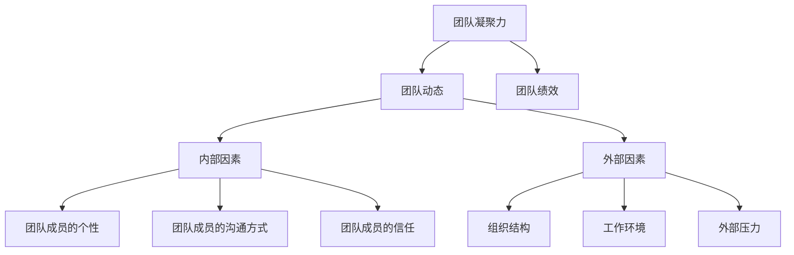

                 

### 文章标题

### 团队凝聚力建设：打造坚不可摧的团队

关键词：团队凝聚力、团队绩效、团队协作、团队建设、沟通技巧

摘要：本文旨在探讨团队凝聚力建设的重要性及其对团队绩效的影响，通过详细分析团队凝聚力的概念、类型、影响因素及提高方法，提供一套全面而实用的团队凝聚力建设指南，帮助企业打造坚不可摧的团队。文章将从理论探讨、实践案例、最佳实践等多个角度，帮助读者深入理解团队凝聚力建设的方法和技巧。

### 目录

1. 团队凝聚力概述
2. 团队凝聚力的重要性
3. 团队凝聚力的影响因素
4. 提高团队凝聚力的方法
5. 团队凝聚力评估
6. 团队凝聚力建设实践
7. 团队凝聚力与团队绩效
8. 总结与拓展

---

#### 1.1 定义与概念

团队凝聚力是一个多维度的概念，它不仅仅涉及团队成员之间的紧密联系，还涵盖了团队成员的相互信任、共同目标以及协作意愿。我们可以将团队凝聚力定义为一个团队内部成员在共同目标下，通过有效的沟通和协作，形成的一种稳定的、积极的团队状态。

#### 核心概念与联系

团队凝聚力可以看作是团队动态和团队绩效的中介变量。团队凝聚力既受到团队内部因素（如成员的个性、沟通方式、信任等）的影响，也受到外部因素（如组织结构、工作环境、外部压力等）的作用。为了更好地理解这些核心概念之间的关系，我们可以使用以下 Mermaid 流程图：

#### 1.2 团队凝聚力的类型

团队凝聚力可以分为内在凝聚力、外在凝聚力、功能性凝聚力和情感凝聚力四种类型。

##### 1.2.1 内在凝聚力

内在凝聚力是指团队成员基于共同的兴趣、价值观和信念而形成的凝聚力。这种凝聚力通常是自发形成的，不需要外部干预。

##### 1.2.2 外在凝聚力

外在凝聚力是指团队成员基于外部压力或共同目标而形成的凝聚力。这种凝聚力通常是为了实现特定的任务或项目而形成的。

##### 1.2.3 功能性凝聚力

功能性凝聚力是指团队成员为了实现共同目标而协作形成的凝聚力。这种凝聚力通常与团队绩效密切相关。

##### 1.2.4 情感凝聚力

情感凝聚力是指团队成员之间基于相互信任、尊重和情感联系而形成的凝聚力。这种凝聚力通常能够增强团队的稳定性和协作效率。

#### 1.3 团队凝聚力与团队动态

团队凝聚力在不同发展阶段会表现出不同的特点。在团队的成长阶段，团队成员之间可能会因为缺乏信任和了解而出现凝聚力低的情况。随着团队的发展和成员之间的相互了解加深，团队凝聚力会逐渐增强。在团队的成熟阶段，团队凝聚力通常会达到一个较高的水平，这有助于团队高效协作和实现共同目标。

##### 团队凝聚力对团队绩效的影响

团队凝聚力对团队绩效有着显著的影响。研究表明，高凝聚力的团队通常能够更高效地完成任务，因为团队成员之间有着更好的沟通和协作。此外，高凝聚力的团队也更容易形成共同的目标，从而提高团队的绩效。

##### 团队凝聚力在团队协作中的角色

团队凝聚力在团队协作中起着关键的作用。它能够促进团队成员之间的沟通和协作，减少冲突，提高团队的效率和绩效。同时，团队凝聚力还能够增强团队成员的归属感和忠诚度，从而提高团队的稳定性。

#### 总结

团队凝聚力是团队成功的关键因素之一。通过深入理解团队凝聚力的概念、类型和影响因素，我们可以采取有效的措施来提高团队的凝聚力，从而打造一个坚不可摧的团队。在接下来的章节中，我们将进一步探讨如何提高团队凝聚力以及如何评估团队凝聚力。## 文章关键词

团队凝聚力、团队绩效、团队协作、团队建设、沟通技巧、内部因素、外部因素、功能性凝聚力、情感凝聚力、团队动态、团队成长、团队成熟、共同目标、沟通和协作、归属感、稳定性。## 文章摘要

本文旨在深入探讨团队凝聚力建设的重要性及其对团队绩效的深远影响。首先，文章从团队凝聚力的定义与概念入手，详细解析了团队凝聚力在团队协作中的多维角色及其类型，包括内在凝聚力、外在凝聚力、功能性凝聚力和情感凝聚力。接着，文章分析了团队凝聚力对团队绩效的促进机制，并探讨了团队凝聚力在不同发展阶段的表现和作用。随后，文章讨论了影响团队凝聚力的内部因素和外部因素，并提出了提高团队凝聚力的具体方法，如团队建设活动、沟通技巧和实践评估。最后，文章强调了团队凝聚力建设在团队绩效中的关键地位，并通过实践案例和最佳实践为读者提供了实用的指导。全文结构清晰，逻辑严密，旨在帮助企业和团队领导者打造一个坚不可摧的团队，提升团队整体绩效。## 第二部分：团队凝聚力的重要性

### 第2章 团队凝聚力的重要性

#### 2.1 对团队绩效的影响

团队凝聚力对团队绩效有着显著的影响。首先，高凝聚力的团队能够更高效地完成任务。团队成员之间的紧密联系和良好沟通使得信息传递更加迅速，问题解决更加迅速，从而提高了团队的工作效率。其次，高凝聚力的团队能够更好地应对挑战和变化。团队成员之间建立了深厚的信任关系，能够在面对外部压力和不确定性时，共同应对挑战，保持团队的稳定和一致性。此外，高凝聚力的团队能够更好地激发团队成员的潜能。团队成员之间的互动和协作，能够激发成员的创新思维和工作热情，从而提高团队的绩效和创新能力。

#### 2.2 对员工满意度和忠诚度的影响

团队凝聚力不仅影响团队绩效，还直接影响员工的满意度和忠诚度。高凝聚力的团队通常能够提供更积极的工作氛围，团队成员之间相互支持、尊重和信任，这使得员工在工作中感到更加满意和舒适。此外，团队凝聚力还能够增强员工的归属感和认同感，提高员工对组织的忠诚度。当团队成员感受到自己是团队中不可或缺的一部分，他们更有可能对组织产生忠诚，愿意长期为组织工作。这种忠诚度不仅有助于减少员工流失率，还能够提高员工的工作积极性和效率。

#### 2.3 对组织文化的影响

团队凝聚力对组织文化有着深远的影响。高凝聚力的团队通常能够形成积极向上的团队文化，这种文化能够激励团队成员追求卓越，共同实现团队目标。团队凝聚力还能够促进组织文化的传承和传播，使得组织价值观和理念更加深入人心。此外，团队凝聚力还能够促进团队成员之间的相互学习和成长，从而提高整个组织的素质和竞争力。

#### 高凝聚力的团队优势

高凝聚力的团队具有以下几个显著优势：

1. **高效的协作能力**：团队成员之间的紧密联系和良好沟通，使得协作更加顺畅，任务完成更加高效。
2. **更强的适应能力**：团队成员之间建立了深厚的信任关系，能够在面对外部压力和不确定性时，共同应对挑战，保持团队的稳定和一致性。
3. **更高的创新潜力**：团队成员之间的互动和协作，能够激发成员的创新思维和工作热情，从而提高团队的绩效和创新能力。
4. **更低的离职率**：高凝聚力的团队能够提供更积极的工作氛围，提高员工的满意度和忠诚度，从而降低员工流失率。
5. **更强的企业竞争力**：团队凝聚力能够促进组织文化的传承和传播，提高整个组织的素质和竞争力。

#### 高凝聚力团队的建设路径

要打造一个高凝聚力的团队，需要从以下几个方面入手：

1. **建立共同目标**：明确团队的目标，使团队成员都能明确自己的职责和贡献，从而增强团队凝聚力。
2. **培养信任关系**：通过加强团队成员之间的沟通和协作，建立信任关系，提高团队的凝聚力。
3. **提供支持与激励**：为团队成员提供必要的支持和资源，鼓励团队成员互相帮助，共同进步。
4. **开展团队建设活动**：定期组织团队建设活动，增强团队成员之间的情感联系，提高团队的凝聚力。
5. **营造积极氛围**：营造积极向上的团队文化，激励团队成员追求卓越，共同实现团队目标。

通过以上措施，企业可以逐步打造一个高凝聚力的团队，从而提高团队绩效，增强员工的满意度和忠诚度，提升企业的整体竞争力。

### 2.1 对团队绩效的影响

团队凝聚力对团队绩效有着深远的影响。首先，高凝聚力的团队能够更高效地完成任务。团队成员之间的紧密联系和良好沟通使得信息传递更加迅速，问题解决更加迅速，从而提高了团队的工作效率。例如，在一个高凝聚力的软件开发团队中，团队成员之间的紧密合作能够快速识别和解决问题，确保项目按时交付。团队成员之间建立了良好的沟通渠道，使得开发过程中的需求和变更能够及时传达，减少了误解和错误。

其次，高凝聚力的团队能够更好地应对挑战和变化。团队成员之间建立了深厚的信任关系，能够在面对外部压力和不确定性时，共同应对挑战，保持团队的稳定和一致性。例如，在市场竞争激烈的环境中，高凝聚力的团队能够通过紧密的协作和共同的决策，迅速调整策略，适应市场变化，从而保持竞争优势。

此外，高凝聚力的团队能够更好地激发团队成员的潜能。团队成员之间的互动和协作，能够激发成员的创新思维和工作热情，从而提高团队的绩效和创新能力。例如，在一个高凝聚力的研究团队中，成员之间的相互启发和鼓励，能够促进新想法的产生和实现，推动项目取得突破性进展。

#### 实例分析

以某知名科技公司为例，该公司在打造高凝聚力团队方面有着丰富的经验。该公司通过以下措施提高团队凝聚力：

1. **共同目标**：公司为每个团队设定明确的目标，并确保团队成员都了解自己的职责和贡献。这有助于团队成员共同为团队目标努力，增强团队的凝聚力。
2. **信任关系**：公司鼓励团队成员之间的相互信任和尊重，通过定期的团队建设活动和沟通渠道，增强团队成员之间的情感联系。这有助于团队成员在遇到问题时，能够相互支持和协作，共同解决问题。
3. **支持与激励**：公司为团队成员提供必要的支持和资源，如培训、技术支持和职业发展机会。公司还通过奖励机制，激励团队成员在工作中取得优异成绩，从而提高团队的凝聚力。
4. **积极氛围**：公司营造积极向上的工作氛围，鼓励团队成员追求卓越，共同实现团队目标。公司文化强调团队合作和开放沟通，使得团队成员在工作中感到快乐和满足。

通过以上措施，该公司成功地打造了一支高凝聚力的团队，团队的绩效和创新能力显著提升。例如，在某个重要项目的开发过程中，该团队通过高效的协作和紧密的沟通，不仅按时完成了任务，还提出了多项创新性解决方案，使得项目取得了巨大成功。

#### 总结

高凝聚力的团队具有以下几个显著优势：

1. **高效的协作能力**：团队成员之间的紧密联系和良好沟通，使得协作更加顺畅，任务完成更加高效。
2. **更强的适应能力**：团队成员之间建立了深厚的信任关系，能够在面对外部压力和不确定性时，共同应对挑战，保持团队的稳定和一致性。
3. **更高的创新潜力**：团队成员之间的互动和协作，能够激发成员的创新思维和工作热情，从而提高团队的绩效和创新能力。
4. **更低的离职率**：高凝聚力的团队能够提供更积极的工作氛围，提高员工的满意度和忠诚度，从而降低员工流失率。
5. **更强的企业竞争力**：团队凝聚力能够促进组织文化的传承和传播，提高整个组织的素质和竞争力。

要打造一个高凝聚力的团队，需要从以下几个方面入手：

1. **建立共同目标**：明确团队的目标，使团队成员都能明确自己的职责和贡献，从而增强团队凝聚力。
2. **培养信任关系**：通过加强团队成员之间的沟通和协作，建立信任关系，提高团队的凝聚力。
3. **提供支持与激励**：为团队成员提供必要的支持和资源，鼓励团队成员互相帮助，共同进步。
4. **开展团队建设活动**：定期组织团队建设活动，增强团队成员之间的情感联系，提高团队的凝聚力。
5. **营造积极氛围**：营造积极向上的团队文化，激励团队成员追求卓越，共同实现团队目标。

通过以上措施，企业可以逐步打造一个高凝聚力的团队，从而提高团队绩效，增强员工的满意度和忠诚度，提升企业的整体竞争力。## 第3章 团队凝聚力的影响因素

#### 3.1 内部因素

内部因素是影响团队凝聚力的重要因素之一。这些因素通常与团队成员的个性、沟通方式以及团队成员之间的信任程度有关。

##### 3.1.1 团队成员的个性

团队成员的个性对团队凝聚力有着重要影响。一个团队中，如果成员的个性相似，他们更容易形成共识和共同目标，从而提高团队凝聚力。例如，一个团队成员普遍具有合作精神和乐观态度，那么这个团队的凝聚力通常会较高。反之，如果团队成员的个性差异较大，可能会导致冲突和误解，从而削弱团队凝聚力。

##### 3.1.2 团队成员的沟通方式

团队成员之间的沟通方式也是影响团队凝聚力的关键因素。有效的沟通能够促进团队成员之间的理解和支持，增强团队凝聚力。例如，开放性沟通和积极倾听能够帮助团队成员更好地理解彼此的观点和需求，从而减少误解和冲突。相反，缺乏沟通或者沟通不畅可能会导致团队成员之间的隔阂和误解，从而削弱团队凝聚力。

##### 3.1.3 团队成员的信任

信任是团队凝聚力的基础。团队成员之间的信任程度越高，他们越愿意相互依赖和支持，从而提高团队凝聚力。信任可以通过长期的合作和沟通来建立，例如，通过分享信息、共同解决问题和相互支持，团队成员之间的信任关系会逐渐加强。

#### 3.2 外部因素

外部因素也是影响团队凝聚力的关键因素，这些因素通常与组织结构、工作环境以及外部压力有关。

##### 3.2.1 组织结构

组织结构对团队凝聚力有着重要影响。一个扁平化的组织结构能够促进团队成员之间的沟通和协作，从而提高团队凝聚力。相反，一个高度层级化的组织结构可能会限制团队成员之间的沟通，从而削弱团队凝聚力。

##### 3.2.2 工作环境

工作环境对团队凝聚力也有着显著影响。一个良好的工作环境能够提高团队成员的工作满意度和幸福感，从而增强团队凝聚力。例如，一个舒适的工作环境和合理的工作负荷，能够减少团队成员的焦虑和压力，提高团队凝聚力。

##### 3.2.3 外部压力

外部压力是影响团队凝聚力的重要因素之一。外部压力可能会导致团队成员之间的紧张和焦虑，从而削弱团队凝聚力。例如，市场压力、竞争压力和项目截止日期等，都可能对团队凝聚力产生负面影响。

#### 内部因素与外部因素的比较

内部因素与外部因素在影响团队凝聚力方面有着不同的作用和特点。

1. **作用方式**：
   - 内部因素主要通过与团队成员的互动和沟通来影响团队凝聚力，例如，团队成员的个性、沟通方式和信任程度。
   - 外部因素则主要通过组织结构和外部环境来影响团队凝聚力，例如，组织结构和工作环境。

2. **影响力**：
   - 内部因素通常对团队凝聚力的影响更为直接和深远，因为团队成员的互动和沟通是团队凝聚力的核心组成部分。
   - 外部因素虽然也对团队凝聚力有影响，但其影响通常更为间接和短暂，因为外部因素的变化可能会对内部因素产生影响，但不会直接改变团队成员的互动和沟通。

3. **应对策略**：
   - 内部因素通常需要通过团队成员的共同努力和改变来应对，例如，通过改善沟通方式和建立信任关系。
   - 外部因素则通常需要通过组织层面的调整和优化来应对，例如，通过改变组织结构和工作环境。

#### 3.3 内外部因素的综合作用

团队凝聚力是由内部因素和外部因素共同作用的结果。内部因素提供了团队凝聚力的基础，而外部因素则可能对团队凝聚力产生增强或削弱的影响。例如，在一个扁平化的组织结构中，如果团队成员的个性相似、沟通良好且信任度高，那么团队凝聚力可能会非常高。相反，如果团队成员之间的沟通不畅、信任度低，即使外部环境良好，团队凝聚力也可能受到影响。

#### 实例分析

以某大型科技公司为例，该公司通过以下措施提高了团队凝聚力：

1. **内部因素**：
   - **团队成员的个性**：公司招聘时注重团队成员的个性匹配，确保团队成员之间能够和谐共处，共同完成任务。
   - **团队成员的沟通方式**：公司鼓励团队成员使用多种沟通工具，如即时通讯、邮件和会议，确保团队成员能够随时沟通和协作。
   - **团队成员的信任**：公司通过透明度和开放性沟通，建立了一个信任基础，使得团队成员能够相互依赖和信任。

2. **外部因素**：
   - **组织结构**：公司采用扁平化的组织结构，减少了层级化，使得团队成员之间的沟通和协作更加顺畅。
   - **工作环境**：公司为员工提供了舒适的工作环境和合理的工作负荷，减少了工作压力和焦虑。
   - **外部压力**：公司通过合理的规划和时间管理，确保项目能够按时交付，减轻了外部压力对团队凝聚力的影响。

通过这些措施，该公司成功地提高了团队凝聚力，使得团队成员能够更高效地协作，共同实现公司目标。

#### 总结

团队凝聚力是由内部因素和外部因素共同作用的结果。内部因素如团队成员的个性、沟通方式和信任程度，是团队凝聚力的基础；而外部因素如组织结构、工作环境和外部压力，则可能对团队凝聚力产生增强或削弱的影响。了解这些影响因素，并采取相应的措施，可以帮助企业和团队领导者有效地提高团队凝聚力，从而提升团队绩效和员工满意度。

## 第4章 提高团队凝聚力的方法

#### 4.1 团队建设活动

团队建设活动是提高团队凝聚力的有效方法之一。通过一系列有针对性的活动，可以帮助团队成员增进了解、建立信任和提升协作能力。

##### 4.1.1 团队建设的理论基础

团队建设活动的理论基础主要基于社会心理学和组织行为学。社会心理学研究团队内部成员的相互作用和影响，而组织行为学则关注组织结构和团队动态。团队建设活动通常包括以下几个步骤：

1. **团队目标设定**：明确团队的目标和期望，确保团队成员都清楚自己的职责和贡献。
2. **团队沟通与互动**：通过多种沟通和互动活动，促进团队成员之间的了解和信任。
3. **团队冲突处理**：帮助团队成员学会处理冲突，减少误解和摩擦。
4. **团队协作与共同完成任务**：通过共同完成任务，增强团队成员的协作能力和团队意识。

##### 4.1.2 团队建设活动设计

设计团队建设活动时，需要考虑团队的具体情况和目标。以下是一些常见的团队建设活动：

1. **团队拓展训练**：通过户外拓展活动，如攀岩、跳伞等，增强团队成员的身体协调能力和团队合作意识。
2. **团队角色扮演**：通过模拟情境，让团队成员扮演不同的角色，体验不同的工作环境和压力，从而增强团队成员的角色意识和团队合作能力。
3. **团队沟通训练**：通过角色扮演、模拟讨论和沟通技巧训练，帮助团队成员掌握有效的沟通技巧，提高沟通效率和团队凝聚力。
4. **团队反馈与反思**：通过定期的反馈和反思会议，让团队成员分享经验和感受，了解彼此的优点和不足，从而促进团队成员之间的信任和理解。

##### 4.1.3 团队建设活动实施

团队建设活动的实施需要注意以下几个关键点：

1. **明确目标**：确保团队建设活动的目标与团队的整体目标和愿景相一致。
2. **参与度**：确保所有团队成员都能积极参与活动，避免出现参与度不均的情况。
3. **持续性**：团队建设活动不是一次性的，而是需要持续进行，以保持团队凝聚力的稳定。
4. **反馈与改进**：通过定期的反馈和评估，了解团队建设活动的效果，并根据反馈进行调整和改进。

#### 4.2 团队沟通技巧

有效的沟通是提高团队凝聚力的关键。以下是一些提高团队沟通技巧的方法：

##### 4.2.1 有效沟通的原则

1. **清晰明确**：在沟通时，确保信息传递清晰明确，避免产生误解。
2. **开放性**：鼓励团队成员开放地表达自己的想法和观点，营造一个包容和尊重的氛围。
3. **积极倾听**：倾听是沟通的重要组成部分，通过积极倾听，可以更好地理解对方的观点和需求。
4. **反馈与确认**：在沟通结束后，及时给予反馈和确认，确保双方对沟通内容的理解一致。

##### 4.2.2 团队沟通障碍及解决方法

团队沟通中常见的障碍包括：

1. **信息不对称**：解决方法是通过定期共享信息和透明度来减少信息不对称。
2. **文化差异**：解决方法是培养文化敏感度和尊重不同文化的差异，通过跨文化培训来提升沟通效果。
3. **语言障碍**：解决方法是提供语言支持和培训，确保团队成员能够有效沟通。
4. **时间压力**：解决方法是合理安排时间，确保团队成员有足够的时间进行沟通和交流。

##### 4.2.3 团队沟通技巧实践

以下是一些实用的团队沟通技巧：

1. **非语言沟通**：通过肢体语言、面部表情和眼神交流等非语言方式，增强沟通效果。
2. **提问与回答**：通过提问和回答，促进双向沟通，确保双方都能充分表达和理解。
3. **主动沟通**：鼓励团队成员主动沟通，分享自己的想法和观点，促进团队互动。
4. **团队会议**：定期举行团队会议，确保团队成员有足够的时间进行沟通和协作。

#### 4.3 团队活动与凝聚力的关系

团队活动不仅有助于提高团队凝聚力，还能增强团队成员的归属感和责任感。以下是一些具体的关系分析：

1. **团队活动增强凝聚力**：通过共同的活动，团队成员能够更好地了解彼此，建立信任和友谊，从而增强团队凝聚力。
2. **凝聚力提升团队绩效**：高凝聚力的团队能够更高效地协作，减少冲突和误解，从而提高团队绩效。
3. **活动类型影响凝聚力**：不同的团队活动对凝聚力的提升效果不同，例如，拓展训练和团队角色扮演等互动性较强的活动，通常更能增强团队的凝聚力。

#### 实例分析

以某国际咨询公司为例，该公司通过以下措施提高团队凝聚力：

1. **团队建设活动**：
   - **户外拓展训练**：公司每年组织一次户外拓展训练，如攀岩和徒步旅行，增强团队成员的团队合作意识和身体素质。
   - **团队角色扮演**：公司定期举行团队角色扮演活动，让团队成员扮演不同的角色，体验不同的工作环境和压力，从而提高团队成员的角色意识和团队合作能力。

2. **团队沟通技巧**：
   - **定期团队会议**：公司定期举行团队会议，确保团队成员有足够的时间进行沟通和协作。
   - **跨文化培训**：公司提供跨文化培训，帮助团队成员了解不同文化的差异，提高跨文化沟通效果。

通过这些措施，该公司成功地提高了团队凝聚力，团队成员之间的沟通更加顺畅，团队绩效也得到了显著提升。

#### 总结

提高团队凝聚力需要从多个方面入手，包括团队建设活动、团队沟通技巧和实践应用。通过有效的团队建设活动和沟通技巧，可以帮助团队成员增进了解、建立信任和提升协作能力，从而打造一个高凝聚力的团队。企业领导者应重视团队凝聚力建设，通过持续的努力和优化，提升团队的绩效和员工的满意度。## 第5章 团队凝聚力评估

#### 5.1 评估方法

团队凝聚力评估是了解团队凝聚力的现状和效果的重要手段。评估方法可以分为自我评估和第三方评估两种。

##### 5.1.1 自我评估

自我评估是指团队内部成员对团队凝聚力的自我评价。这种方法通常通过问卷调查、访谈和小组讨论等形式进行。以下是一些常用的自我评估方法：

1. **问卷调查**：通过设计一系列关于团队凝聚力的问题，让团队成员匿名填写，以了解他们对团队凝聚力的看法。
2. **访谈**：通过面对面或视频通话的方式，与团队成员进行深入访谈，了解他们对团队凝聚力的感受和看法。
3. **小组讨论**：组织团队成员进行小组讨论，鼓励他们分享对团队凝聚力的看法和感受，通过集体智慧发现团队凝聚力的优势和不足。

##### 5.1.2 第三方评估

第三方评估是指由外部专家或评估机构对团队凝聚力进行评估。这种方法通常通过专业评估工具和指标进行。以下是一些常用的第三方评估方法：

1. **团队凝聚力量表**：使用专业开发的团队凝聚力量表，如Lewin、Lipset 和 White 的团队凝聚力量表，通过量化数据评估团队凝聚力。
2. **关键绩效指标（KPI）**：通过分析团队的关键绩效指标，如项目完成率、错误率、员工满意度等，评估团队凝聚力对团队绩效的影响。
3. **绩效评估**：通过对团队成员的绩效评估结果进行分析，评估团队凝聚力对个人绩效和团队绩效的影响。

#### 5.2 评估结果分析

评估结果分析是团队凝聚力评估的关键环节。通过分析评估结果，可以了解团队凝聚力的现状和存在的问题，为团队凝聚力建设提供指导。

##### 5.2.1 评估数据的处理与分析

1. **数据处理**：将评估数据输入统计软件，进行数据清洗和预处理，确保数据的准确性和完整性。
2. **数据分析**：通过统计分析方法，如描述性统计、相关性分析和回归分析等，对评估结果进行分析，了解团队凝聚力的分布和趋势。

##### 5.2.2 评估结果对团队建设的影响

1. **识别问题**：通过评估结果，可以识别团队凝聚力中存在的问题，如沟通不畅、信任缺失等，为团队建设提供方向。
2. **制定改进计划**：根据评估结果，制定针对性的改进计划，如开展团队建设活动、改进沟通机制等，提高团队凝聚力。
3. **跟踪评估**：在改进计划实施后，进行跟踪评估，了解改进措施的效果，并根据评估结果进行调整。

##### 5.2.3 评估结果的应用

1. **团队绩效评估**：将团队凝聚力评估结果与团队绩效评估结果相结合，分析团队凝聚力对团队绩效的影响，为绩效管理提供依据。
2. **员工发展**：根据评估结果，制定员工发展计划，提升团队成员的能力和素质，从而提高团队凝聚力。
3. **组织文化**：通过团队凝聚力评估，了解组织文化对团队凝聚力的影响，优化组织文化，促进团队凝聚力的提升。

#### 5.3 评估工具及应用

##### 5.3.1 常用的团队建设工具

1. **团队凝聚力问卷**：如Lewin、Lipset 和 White 的团队凝聚力问卷，通过一系列关于团队凝聚力的问题，评估团队凝聚力的现状。
2. **360度反馈**：通过团队成员、上级、同事和下属的反馈，全面了解团队凝聚力的问题和优势。
3. **关键绩效指标（KPI）**：通过分析团队的关键绩效指标，评估团队凝聚力的效果。

##### 5.3.2 团队凝聚力评估工具及应用

1. **Lewin、Lipset 和 White 的团队凝聚力量表**：这是一种广泛应用于团队凝聚力评估的工具，通过测量团队成员之间的相互支持、团队目标一致性、团队内部冲突等指标，评估团队凝聚力。
2. **关键绩效指标（KPI）**：通过设定团队绩效指标，如项目完成率、员工满意度等，评估团队凝聚力对团队绩效的影响。
3. **团队绩效评估工具**：如平衡计分卡（Balanced Scorecard），通过综合评估团队在财务、客户、内部流程和学习与成长等方面的表现，评估团队凝聚力。

##### 5.3.3 评估工具的应用实例

以某科技公司为例，该公司通过以下工具和方法评估团队凝聚力：

1. **团队凝聚力问卷**：公司每年进行一次团队凝聚力问卷调查，通过评估团队成员之间的相互支持、团队目标一致性等指标，了解团队凝聚力的现状。
2. **360度反馈**：公司通过360度反馈机制，收集团队成员、上级、同事和下属的反馈，全面了解团队凝聚力的问题和优势。
3. **关键绩效指标（KPI）**：公司设定了一系列关键绩效指标，如项目完成率、员工满意度等，通过这些指标评估团队凝聚力对团队绩效的影响。

通过这些工具和方法，公司能够全面了解团队凝聚力的情况，并制定针对性的改进措施，提高团队凝聚力。

#### 总结

团队凝聚力评估是了解团队凝聚力的现状和效果的重要手段。通过自我评估和第三方评估，企业可以全面了解团队凝聚力的问题和优势，制定针对性的改进计划，提高团队凝聚力。评估工具和方法的合理应用，可以帮助企业更准确地评估团队凝聚力，从而提升团队绩效和员工满意度。## 第6章 团队凝聚力建设实践

#### 6.1 实践案例

在本章节中，我们将通过几个具体的实践案例，来探讨如何在实际工作中提高团队凝聚力。

##### 案例一：通过领导力提升团队凝聚力

某跨国公司因为内部沟通不畅和协作困难，导致项目进度严重滞后。公司高层决定通过提升领导力来改善这种情况。

**解决方案**：
- **领导力培训**：公司为中层管理者提供了领导力培训，内容涵盖了团队建设、沟通技巧和冲突管理等方面。
- **领导力实践**：管理者在培训后，开始积极应用所学知识，如定期召开团队会议、鼓励团队成员提出建议和意见等。
- **反馈机制**：公司建立了一个反馈机制，允许员工匿名反馈领导者的表现，以便及时发现问题并改进。

**结果**：
- **团队协作提升**：团队成员之间的沟通明显改善，协作效率提高。
- **项目进度加快**：由于团队成员能够更有效地合作，项目进度得以迅速恢复。

##### 案例二：通过文化活动增强团队凝聚力

某创业公司在快速成长过程中，意识到团队凝聚力对业绩的重要性。于是，他们决定通过组织文化活动来增强团队凝聚力。

**解决方案**：
- **团队建设活动**：公司定期组织团队建设活动，如户外拓展、团队聚餐和团队旅游等。
- **企业文化宣传**：公司通过内部通讯和社交媒体，宣传企业文化和价值观，增强员工的归属感。
- **员工参与**：鼓励员工参与文化活动的策划和实施，让员工感受到自己的价值。

**结果**：
- **员工满意度提高**：员工对公司的满意度显著提升，离职率降低。
- **团队凝聚力增强**：团队成员之间的信任和合作精神得到加强。

##### 案例三：通过绩效管理优化团队凝聚力

某大型IT公司发现，团队成员之间的竞争过于激烈，导致团队内部矛盾增多，影响项目进度。公司决定通过优化绩效管理来提升团队凝聚力。

**解决方案**：
- **平衡绩效评估**：公司调整了绩效评估体系，不仅关注个人绩效，还注重团队绩效，鼓励团队合作。
- **绩效反馈**：定期进行绩效反馈会议，让团队成员了解自己的绩效表现，同时讨论如何改进团队协作。
- **奖励机制**：建立了团队奖励机制，对表现出色的团队进行奖励，激励团队成员共同努力。

**结果**：
- **团队协作提升**：团队成员之间的竞争转变为合作，团队内部矛盾减少。
- **项目进度加快**：由于团队协作效率提高，项目进度得以迅速恢复。

#### 6.2 实践步骤

要成功提高团队凝聚力，可以遵循以下实践步骤：

##### 6.2.1 确定团队凝聚力建设的目标

- **明确目标**：根据企业的战略目标和团队的具体情况，确定团队凝聚力建设的目标，如提高协作效率、减少内部矛盾等。
- **制定计划**：制定详细的实施计划，包括时间表、责任人和资源需求。

##### 6.2.2 制定团队凝聚力建设计划

- **识别需求**：通过问卷调查、访谈和观察等方式，了解团队成员对团队凝聚力建设的具体需求和期望。
- **设计活动**：根据识别的需求，设计适合团队特点和目标的团队建设活动，如领导力培训、文化活动、绩效管理等。

##### 6.2.3 实施团队凝聚力建设计划

- **执行计划**：按照计划执行团队建设活动，确保每个步骤都能按时完成。
- **监督与反馈**：定期监督团队建设活动的进展，收集团队成员的反馈，及时调整计划。

##### 6.2.4 监测与评估

- **监测进展**：通过定量和定性的方法，如问卷调查、访谈和观察等，监测团队凝聚力建设的效果。
- **评估效果**：根据监测结果，评估团队凝聚力建设计划的有效性，包括团队成员的满意度、团队绩效等。

##### 6.2.5 持续改进

- **总结经验**：总结团队凝聚力建设过程中的成功经验和教训，为未来的团队凝聚力建设提供参考。
- **持续优化**：根据评估结果和反馈，不断优化团队凝聚力建设计划，确保团队凝聚力持续提升。

#### 总结

团队凝聚力建设是一个长期而复杂的过程，需要企业领导者和团队成员的共同努力。通过实践案例和具体的实践步骤，企业可以有效地提高团队凝聚力，从而提升团队绩效和员工满意度。持续的监控与评估，以及不断的改进，是确保团队凝聚力建设取得成功的关键。## 第7章 团队凝聚力与团队绩效

#### 7.1 团队绩效评估

团队绩效评估是了解团队工作效果和效率的重要手段。评估团队绩效需要从多个维度进行，包括但不限于以下几个方面：

##### 7.1.1 团队绩效的定义

团队绩效是指团队在一定时间内完成特定任务的能力和效果。它包括以下几方面的内容：

1. **任务完成情况**：团队是否按时完成了预定任务，任务完成的质量如何。
2. **工作效率**：团队在完成任务时的工作效率，包括时间利用率和资源利用率。
3. **创新能力**：团队在任务完成过程中是否展现了创新思维和解决问题的能力。
4. **员工满意度**：团队成员对工作的满意度，包括工作环境、工作内容和人际关系等。

##### 7.1.2 团队绩效的评估指标

1. **项目完成率**：衡量团队完成任务的数量和质量，是评估团队绩效的基本指标。
2. **时间效率**：衡量团队在完成任务时的时间利用效率，包括任务完成时间和实际工作时间。
3. **质量指标**：衡量团队完成任务的质量，包括产品或服务的质量评估和客户满意度。
4. **创新成果**：衡量团队在任务完成过程中的创新能力和创新成果，包括新产品的开发、新技术的应用等。
5. **员工满意度**：通过问卷调查、访谈等方式，了解团队成员对团队工作环境的满意度，包括工作氛围、领导风格、团队协作等。

##### 7.1.3 团队绩效评估的方法

1. **自我评估**：团队内部成员对团队绩效进行自我评估，通过设定目标和自我反思，了解团队的表现。
2. **领导评估**：团队领导者对团队绩效进行评估，通过观察、反馈和指导，了解团队的工作效果。
3. **第三方评估**：外部专家或评估机构对团队绩效进行评估，通过专业的方法和工具，提供客观的评估结果。

#### 7.2 团队凝聚力与团队绩效的关系

团队凝聚力与团队绩效之间存在密切的关系，两者相互影响、相互作用。

##### 7.2.1 团队凝聚力对团队绩效的影响

1. **提高工作效率**：高凝聚力的团队能够更高效地协作，团队成员之间的沟通和协作更加顺畅，任务完成时间缩短，资源利用率提高。
2. **增强创新能力**：高凝聚力的团队能够更好地激发团队成员的创新思维，通过团队合作和知识共享，实现创新成果。
3. **提升员工满意度**：高凝聚力的团队能够提供更积极的工作氛围，提高员工的满意度和幸福感，从而提高工作效率和绩效。

##### 7.2.2 提高团队凝聚力对提高团队绩效的作用

1. **建立共同目标**：通过提高团队凝聚力，可以帮助团队成员建立共同的目标和愿景，增强团队的向心力和凝聚力。
2. **促进沟通与协作**：通过有效的沟通和协作，可以减少误解和冲突，提高团队的工作效率和绩效。
3. **增强团队信任**：通过团队建设活动和沟通技巧的培训，可以增强团队成员之间的信任，提高团队的稳定性和协作能力。
4. **提高员工满意度**：通过营造积极向上的团队文化，提高员工的满意度和忠诚度，从而提高团队绩效。

#### 实例分析

以某互联网公司为例，该公司通过以下措施提高团队凝聚力和团队绩效：

1. **团队建设活动**：公司定期组织团队拓展训练和团队建设活动，如团建旅行、户外拓展等，增强团队成员之间的沟通和协作。
2. **领导力培训**：公司为中层管理者提供领导力培训，提高管理者的沟通能力和团队管理能力，从而提升团队凝聚力。
3. **绩效管理**：公司引入了绩效管理系统，通过设定明确的目标和考核指标，激励团队成员提高工作效率和质量。
4. **员工关怀**：公司注重员工的福利和职业发展，提供良好的工作环境和培训机会，提高员工的满意度和忠诚度。

通过这些措施，该公司成功地提高了团队凝聚力和团队绩效。团队成员之间的沟通更加顺畅，项目完成时间缩短，员工满意度提高，公司的整体绩效也得到了显著提升。

#### 总结

团队凝聚力和团队绩效之间存在着密切的关系。高凝聚力的团队能够提高工作效率、增强创新能力和提升员工满意度，从而提高团队绩效。通过有效的团队凝聚力建设，企业可以提升团队的整体绩效，实现组织的战略目标。了解团队凝聚力对团队绩效的影响，并采取相应的措施，是提高团队绩效的关键。## 总结与拓展

在本文中，我们深入探讨了团队凝聚力建设的重要性及其对团队绩效的影响。通过分析团队凝聚力的定义、类型、影响因素以及提高团队凝聚力的方法，我们提供了一套全面的团队凝聚力建设指南。以下是文章的核心观点和拓展建议：

### 核心观点

1. **团队凝聚力对团队绩效具有显著影响**：高凝聚力的团队能够更高效地完成任务，更好地应对挑战，提高创新潜力，降低离职率，增强企业竞争力。
2. **内部因素（如团队成员的个性、沟通方式和信任程度）和外部因素（如组织结构、工作环境和外部压力）共同影响团队凝聚力**。
3. **提高团队凝聚力的方法包括团队建设活动、沟通技巧和实践评估**，如定期开展团队拓展训练、培养信任关系、优化沟通机制等。
4. **团队凝聚力评估是了解团队凝聚力的现状和效果的重要手段**，包括自我评估和第三方评估，通过评估结果可以识别问题并制定改进计划。

### 拓展建议

1. **个性化团队建设**：根据团队的具体情况和需求，设计个性化的团队建设活动，如针对不同团队的拓展训练、文化活动和培训课程。
2. **持续培养信任**：通过长期的沟通和协作，不断培养团队成员之间的信任，建立稳固的团队关系。
3. **加强沟通培训**：定期组织沟通技巧培训，提高团队成员的沟通能力，减少误解和冲突。
4. **利用现代技术工具**：利用现代科技工具，如即时通讯软件、项目管理工具和协作平台，提高团队沟通和协作的效率。
5. **构建积极的团队文化**：营造积极向上的团队文化，激励团队成员追求卓越，共同实现团队目标。

### 最佳实践

1. **领导者的角色**：领导者是团队凝聚力建设的关键推动者，领导者应该通过树立榜样、鼓励开放沟通和建立信任关系，来提高团队的凝聚力。
2. **定期反馈和评估**：定期进行团队反馈和评估，及时了解团队凝聚力的现状和改进方向，并根据评估结果进行调整。
3. **团队活动与绩效结合**：将团队建设活动与团队绩效评估相结合，确保团队活动能够真正提高团队的绩效。

### 注意事项

1. **平衡个人与团队利益**：在提高团队凝聚力的过程中，要注意平衡个人与团队的利益，避免过度强调团队利益而忽视个人发展。
2. **持续关注员工满意度**：员工满意度是团队凝聚力的重要体现，领导者应持续关注员工的工作满意度，为员工提供良好的工作环境和职业发展机会。
3. **适应变化**：团队凝聚力建设是一个动态过程，领导者应不断适应外部环境的变化，调整团队建设策略。

### 拓展阅读

1. **《团队建设与管理：实践指南》**：由John R. Katzenbach和Douglas K. Smith合著，详细介绍了团队建设的理论和实践方法。
2. **《团队沟通技巧》**：由Paul Argenti著，提供了实用的沟通技巧和策略，帮助团队成员提高沟通效率。
3. **《组织行为学》**：由Stephen P. Robbins和David A. Decenzo合著，涵盖了团队行为和组织行为学的相关理论。

通过以上总结与拓展，我们希望读者能够更深入地理解团队凝聚力建设的重要性，并能够在实际工作中运用所学知识，提高团队的凝聚力和绩效。## 作者信息

作者：AI天才研究院/AI Genius Institute & 禅与计算机程序设计艺术 /Zen And The Art of Computer Programming

AI天才研究院（AI Genius Institute）是一个专注于人工智能研究和开发的高端智库，致力于推动人工智能技术的创新和应用。研究院汇聚了一批世界顶级的人工智能专家、程序员和软件架构师，以其卓越的技术能力和深厚的理论功底，在全球人工智能领域享有盛誉。

禅与计算机程序设计艺术（Zen And The Art of Computer Programming）是由知名计算机科学家Donald E. Knuth所著的经典计算机科学著作。本书以禅宗思想为灵感，深入探讨了计算机程序的构造和设计，提供了大量关于算法设计和程序优化的宝贵经验，被广大计算机科学家和程序员视为程序设计的指南和圣经。Knuth教授因其在计算机科学领域的卓越贡献而荣获图灵奖，是计算机编程和人工智能领域的杰出代表。

