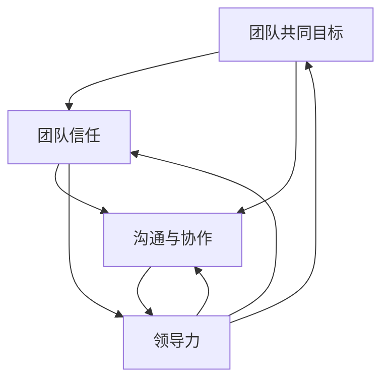

                 

### 背景介绍

在当今快速变化和竞争激烈的商业环境中，团队的效能和凝聚力成为了企业成功的关键因素。团队凝聚力不仅影响员工的工作满意度和忠诚度，还直接影响团队的创造力和创新能力。一个高凝聚力的团队能够更高效地沟通、协同工作，从而在项目中取得卓越的成绩。

然而，提升团队凝聚力并非易事。许多团队在面对复杂的任务和多变的市场环境时，往往因为缺乏有效的沟通、信任和共同目标而出现协作问题。这不仅导致工作效率低下，还可能引发内部矛盾，影响团队士气。

为了应对这些挑战，本文将深入探讨团队凝聚力的重要性，从定义、作用到实践策略进行全面剖析。文章将首先介绍团队凝聚力的基本概念，并通过流程图展示其核心概念与联系。接着，我们将探讨增强团队凝聚力的各种策略，包括构建积极团队文化、提高员工满意度、组织团队建设活动等。此外，文章还将通过案例分析和实际项目实战，提供实用的实践指导。

通过本文的阅读，读者将了解到团队凝聚力提升的原理和实践方法，从而为团队管理提供有力支持。无论您是企业的管理层、团队负责人，还是普通的团队成员，这些策略和方法都将帮助您在团队中建立更强的向心力，推动团队朝着共同目标迈进。

### 核心概念与联系

团队凝聚力是一个多维度的概念，其核心在于团队成员之间的相互依赖、信任和协作。为了更好地理解这一概念，我们可以通过Mermaid流程图来展示团队凝聚力各核心概念之间的关系架构。

首先，定义几个关键概念：

1. **团队共同目标（Team Goals）**：这是团队凝聚力的基础，所有团队成员都应明确共同的目标和愿景。
2. **团队信任（Team Trust）**：信任是团队成员之间协作的基石，缺乏信任会导致猜疑和内耗。
3. **沟通与协作（Communication and Collaboration）**：有效的沟通和协作能够增强团队凝聚力，提高工作效率。
4. **领导力（Leadership）**：领导者在团队凝聚力中扮演关键角色，他们的决策和风格直接影响团队的凝聚力。

以下是一个简化的Mermaid流程图，展示这些核心概念之间的关系：

在上述流程图中，我们可以看到：

- **团队共同目标**是团队凝聚力的起点，它为团队成员提供了明确的行动方向和共同的价值取向。
- **团队信任**作为纽带，将团队成员紧密联系在一起，增强了团队的协作能力。
- **沟通与协作**是团队凝聚力的重要表现形式，通过高效的沟通和协作，团队成员能够更好地理解彼此的需求，实现共同目标。
- **领导力**则在这一过程中起到了关键的引导和推动作用，领导者的决策和风格直接影响团队的凝聚力和效率。

通过这个流程图，我们可以清晰地看到团队凝聚力各核心概念之间的相互作用和依赖关系。团队共同目标为其他要素提供了方向，团队信任和沟通协作是实现这些目标的关键手段，而领导力则在这一过程中起到了关键的桥梁作用。这些核心概念相互关联、相互促进，共同构成了团队凝聚力的整体架构。

### 团队凝聚力的核心概念

为了深入理解团队凝聚力，我们需要探讨其几个关键概念，包括团队共同目标、团队信任、沟通与协作，以及领导力。这些概念不仅独立存在，而且相互交织，共同构成了团队凝聚力的核心要素。

#### 团队共同目标

团队共同目标是团队凝聚力的基石。它是团队成员共同追求的目标和愿景，为团队提供了方向和动力。一个明确的共同目标能够帮助团队成员统一思想、齐心协力，从而提高团队的整体效能。

- **定义**：团队共同目标是指团队成员共同认可并致力于实现的目标，通常包括短期和长期的目标。
- **重要性**：共同目标能够激发团队成员的积极性，增强团队内部的团结和协作。当团队成员都为了同一个目标努力时，他们更容易相互理解和支持，从而提高工作效率。
- **实例**：例如，在一个软件开发团队中，共同目标可能是在一个季度内成功发布一个新版本的产品。这个目标不仅为团队成员提供了明确的工作方向，还激励他们克服各种困难，共同完成任务。

#### 团队信任

团队信任是团队凝聚力的重要支柱。它建立在团队成员之间的相互了解、信任和尊重基础上，是高效协作的前提。

- **定义**：团队信任是指团队成员对彼此的能力和诚信的信任，这种信任有助于减少沟通障碍，促进合作。
- **重要性**：信任是团队合作的润滑剂。当团队成员彼此信任时，他们更愿意分享信息、接受反馈，并相互支持。这有助于提高团队的整体效率，减少冲突和误解。
- **实例**：在一个项目中，当团队成员信任彼此的技术能力和工作态度时，他们更愿意合作解决复杂问题，从而提高项目的成功率。

#### 沟通与协作

沟通与协作是团队凝聚力的关键表现形式。有效的沟通能够确保团队成员理解任务要求、角色和责任，而协作则能够将团队成员的智慧和资源整合起来，共同实现目标。

- **定义**：沟通是指团队成员之间交换信息的过程，协作则是指团队成员共同完成任务的行动。
- **重要性**：有效的沟通和协作能够确保团队成员在正确的方向上共同努力，避免误解和冲突。通过沟通，团队成员可以共享信息、知识和资源，从而提高整个团队的工作效能。
- **实例**：在一个市场营销团队中，定期召开会议、分享市场数据和反馈，以及共同制定营销策略，都是有效的沟通与协作方式。

#### 领导力

领导力是团队凝聚力的关键推动力。一个优秀的领导者能够激发团队成员的潜力，提供明确的方向和目标，并建立和维护团队信任。

- **定义**：领导力是指领导者通过影响和激励团队成员，引导团队实现目标的能力。
- **重要性**：领导力能够为团队提供方向和动力，激发团队成员的积极性和创造力。一个有领导力的领导者不仅能够明确团队的愿景和目标，还能够通过有效的沟通和激励，增强团队的凝聚力和协作能力。
- **实例**：例如，一个项目经理通过定期召开团队会议、分享项目进展和挑战，以及提供激励措施，能够有效地提高团队的凝聚力和工作效率。

通过上述对团队凝聚力核心概念的探讨，我们可以看到，这些概念相互关联、相互促进，共同构成了团队凝聚力的核心要素。一个高凝聚力的团队，不仅能够明确共同目标，建立起信任和协作的基础，还能够通过有效的沟通和领导力，实现团队的目标和愿景。

### 增强团队凝聚力的策略与方法

在明确了团队凝聚力的核心概念后，接下来我们将探讨一系列实践策略，以帮助团队增强凝聚力，提升工作效率和团队士气。

#### 1. 构建积极团队文化

团队文化是团队凝聚力的基石，一个积极的团队文化能够激发团队成员的潜能，增强团队的向心力。以下是构建积极团队文化的几个关键策略：

- **定义**：积极团队文化是指一种团队成员之间相互尊重、信任和激励的氛围，这种文化能够促进团队合作和创新。
- **策略**：
  - **鼓励开放沟通**：建立一个开放、包容的沟通环境，鼓励团队成员自由表达意见和想法，以增强团队的透明度和信任感。
  - **建立共同价值观**：通过明确和传播团队的共同价值观，如诚信、责任和协作，使团队成员在价值观上达成一致，增强团队凝聚力。
  - **表彰优秀表现**：定期对团队成员的优秀表现进行表彰和奖励，以激励团队成员的积极性和创造力。

#### 2. 增强领导力与团队凝聚力

领导者在团队凝聚力中扮演关键角色，一个有领导力的领导者能够引导团队朝着共同目标努力，增强团队的凝聚力。以下是增强领导力与团队凝聚力的几个策略：

- **定义**：领导力是指领导者通过影响和激励团队成员，引导团队实现目标的能力。
- **策略**：
  - **明确目标和期望**：领导者应明确团队的目标和期望，确保所有团队成员都了解他们的职责和目标，从而提高团队的整体工作效率。
  - **提供反馈与支持**：领导者应定期给予团队成员反馈，并为他们提供必要的支持和资源，以帮助团队成员克服困难，提高工作效能。
  - **建立信任关系**：领导者应通过诚实、透明和公正的行为建立信任关系，使团队成员感到被尊重和信任，从而增强团队的凝聚力。

#### 3. 提升员工满意度

员工满意度是团队凝聚力的重要体现，高员工满意度能够增强团队成员的归属感和忠诚度。以下是提升员工满意度的几个策略：

- **定义**：员工满意度是指员工对工作环境、工作内容和工作关系的总体满意程度。
- **策略**：
  - **提供职业发展机会**：为员工提供职业发展机会和培训，帮助他们在职业道路上成长，从而提高员工的工作满意度和忠诚度。
  - **建立公平的激励机制**：建立公平、透明的激励机制，确保员工的努力得到公正的回报，从而增强员工的工作动力和满意度。
  - **关注员工福利**：提供良好的员工福利，如健康保险、带薪休假和员工关爱计划，使员工感受到企业的关怀和尊重，从而提高员工的工作满意度和忠诚度。

#### 4. 组织团队建设活动

团队建设活动是增强团队凝聚力的重要手段，通过团队建设活动，团队成员可以加强沟通、增进了解，从而提高团队的整体效能。以下是组织团队建设活动的几个策略：

- **定义**：团队建设活动是指为了增强团队凝聚力、提升团队合作能力而组织的各种活动和项目。
- **策略**：
  - **多样化的活动形式**：根据团队特点和员工兴趣，组织多样化的团队建设活动，如团队拓展训练、团建旅行和团队竞赛等，以激发团队成员的参与热情。
  - **注重团队协作**：在团队建设活动中，注重团队合作环节的设计，通过共同完成任务，增强团队成员之间的协作能力和信任感。
  - **定期评估和改进**：定期对团队建设活动的效果进行评估，收集团队成员的反馈，并根据反馈进行调整和改进，以不断提高团队建设活动的质量和效果。

通过上述策略，团队可以逐步增强凝聚力，提升工作效率和团队士气，从而在激烈的竞争中立于不败之地。

#### 激励员工的方法与技巧

在提升团队凝聚力的过程中，激励员工是一个至关重要的环节。通过有效的激励方法，可以增强员工的工作动力，提高工作效率和满意度，从而进一步巩固团队的凝聚力。以下是一些具体的激励员工的方法与技巧：

1. **目标激励**

- **定义**：目标激励是指通过设定明确、可实现的个人或团队目标，激发员工的工作动力。
- **策略**：
  - **设定具体目标**：确保目标具体、明确，并且具有挑战性。例如，为销售团队设定每月的销售目标，并为达成目标的员工提供奖励。
  - **目标分解**：将大目标分解为小目标，让员工逐步实现，从而保持持续的动力。

2. **奖励激励**

- **定义**：奖励激励是通过给予员工物质或非物质奖励，以激发其工作积极性。
- **策略**：
  - **多样化奖励**：根据员工的贡献和偏好，提供多样化的奖励，如奖金、奖品、休假等。
  - **即时奖励**：对于迅速达成的目标或突出贡献，及时给予奖励，以强化正面行为。

3. **认可激励**

- **定义**：认可激励是通过公开认可员工的努力和成就，提升其自信心和归属感。
- **策略**：
  - **公开表彰**：在团队会议上公开表彰优秀员工，使他们的成就得到认可和庆祝。
  - **个性化认可**：根据员工的个性和喜好，采取个性化的认可方式，如一封感谢信、一顿团队聚餐等。

4. **成长激励**

- **定义**：成长激励是通过为员工提供职业发展机会和学习资源，激发其自我提升的动力。
- **策略**：
  - **职业发展规划**：为员工制定职业发展规划，提供晋升和岗位调整的机会。
  - **培训与学习**：定期组织培训课程和工作坊，帮助员工提升技能和知识。

5. **团队激励**

- **定义**：团队激励是通过激发团队整体的工作动力，提升团队的凝聚力和绩效。
- **策略**：
  - **团队目标设定**：设定团队共同目标，使团队成员为了共同的目标而努力。
  - **团队竞赛**：组织团队竞赛，鼓励团队之间相互竞争，共同进步。

6. **工作环境激励**

- **定义**：工作环境激励是通过优化工作环境，提高员工的工作舒适度和满意度。
- **策略**：
  - **灵活工作安排**：提供灵活的工作时间和地点，以满足员工的个性化需求。
  - **良好的办公设施**：提供舒适、现代化的办公环境，提升员工的工作体验。

通过这些激励方法与技巧，团队可以有效地提升员工的工作动力和满意度，从而增强团队凝聚力，实现更高的工作效率和绩效。

#### 员工参与与决策

在提升团队凝聚力的过程中，员工的参与和决策至关重要。这不仅能够增强员工的归属感和责任感，还能提高团队的效率和创造力。以下是如何实现员工参与与决策的几个具体策略：

1. **定义**：员工参与与决策是指让团队成员在决策过程中发挥积极作用，共同参与团队事务的讨论和决策。

2. **策略**：

   - **定期团队会议**：定期召开团队会议，让所有成员参与讨论项目进展、面临的挑战和未来的计划。这样可以确保团队成员的信息共享和意见交流，提高决策的透明度和公正性。

   - **开放反馈机制**：建立一个开放的反馈机制，让员工能够自由表达他们的观点和建议。这可以通过匿名调查、员工意见箱或者定期反馈会等形式实现。通过这种方式，员工可以感受到他们的意见被重视，从而增强参与感和责任感。

   - **项目任务分配**：在项目任务分配时，充分考虑每位成员的技能和兴趣，并赋予他们一定的决策权。这样不仅能够发挥员工的专长，还能提高他们的工作满意度和责任感。

   - **共同目标设定**：与员工共同设定团队目标和个人目标，确保团队成员明确自己的职责和贡献。这种共同设定目标的过程可以增强员工的参与感和责任感，从而提高团队的凝聚力和工作效率。

   - **决策培训**：为员工提供决策培训，帮助他们掌握决策技巧和批判性思维。通过培训，员工可以更好地理解和参与决策过程，从而提高团队的整体决策质量。

3. **案例分析**：

   - **案例一**：某公司在其新产品开发项目中，通过定期团队会议和开放反馈机制，鼓励团队成员参与项目讨论和决策。这不仅提高了团队成员的积极性和创造力，还使项目进展更加顺利，最终成功推出了一款受欢迎的新产品。

   - **案例二**：另一家公司通过员工参与与决策，改变了传统的任务分配方式。他们引入了一种“员工自主选择项目”的制度，允许员工根据自己的兴趣和专长选择参与的项目。这种做法不仅增强了员工的归属感和责任感，还提高了项目的完成质量和速度。

通过这些具体策略，团队可以有效地实现员工的参与与决策，从而提升团队凝聚力，促进团队合作和创新。

#### 职业发展与培训

职业发展和培训是提升员工满意度和团队凝聚力的重要手段。通过有效的职业发展和培训计划，企业不仅能够提高员工的工作满意度和忠诚度，还能提升团队的整体效能和创新能力。

1. **定义**：

   - **职业发展**：职业发展是指员工在职业生涯中不断进步和成长的过程，包括晋升、技能提升、岗位转换等。
   - **培训**：培训是指为了提升员工的知识、技能和工作能力而进行的教育和培训活动。

2. **策略**：

   - **明确职业路径**：为员工提供明确的职业路径规划，包括晋升机会、职业发展方向和关键技能要求。这样，员工可以清楚地了解自己的职业目标和成长路径，从而更有动力地投入工作。

   - **个性化培训计划**：根据员工的岗位需求和职业目标，制定个性化的培训计划。这种计划可以包括内部培训、外部培训、在线课程等多种形式，确保员工能够掌握所需的技能和知识。

   - **导师制度**：实施导师制度，让经验丰富的员工指导新员工或寻求职业发展的员工。导师不仅能够提供专业建议，还能帮助新员工快速融入团队，提高工作效率。

   - **持续学习支持**：鼓励员工持续学习，提供学习资源和支持，如在线课程、专业书籍、研讨会等。通过持续学习，员工可以不断提升自己的专业能力和市场竞争力。

3. **案例分析**：

   - **案例一**：某公司通过实施明确的职业路径规划和个性化的培训计划，显著提高了员工的工作满意度和忠诚度。员工们在清晰的职业发展路径和丰富的培训资源支持下，积极提升自己的技能和知识，公司的整体效能也得到了显著提升。

   - **案例二**：另一家公司通过实施导师制度，有效帮助新员工快速融入团队。导师们不仅传授了专业知识和经验，还帮助新员工建立了良好的工作习惯和团队关系，从而提高了团队的整体凝聚力和工作效率。

通过职业发展和培训策略，企业可以更好地满足员工的发展需求，提高员工的工作满意度和忠诚度，从而增强团队的凝聚力和整体效能。

#### 员工福利与奖励

在提升团队凝聚力的过程中，员工福利和奖励扮演着至关重要的角色。通过合理的福利和奖励制度，企业不仅能够提高员工的工作满意度和忠诚度，还能增强团队的凝聚力和工作效率。

1. **定义**：

   - **员工福利**：员工福利是指企业为员工提供的各种物质和精神福利，包括但不限于健康保险、带薪休假、员工关爱计划等。
   - **奖励**：奖励是指企业对员工在特定领域或项目中表现出的优秀成果或贡献所给予的物质或精神激励，包括但不限于奖金、奖品、荣誉称号等。

2. **策略**：

   - **多样化福利计划**：根据员工的实际需求和偏好，设计多样化的福利计划。例如，提供灵活的带薪休假制度、健康体检、家庭关爱计划等，以满足员工的多样化需求。
   - **公平透明的奖励机制**：建立公平、透明的奖励机制，确保员工的努力和贡献得到公正的回报。奖励应该与员工的绩效表现直接挂钩，以激励员工的积极性和创造力。
   - **个性化奖励方案**：根据员工的个性和工作表现，提供个性化的奖励方案。例如，对表现出色的员工提供额外的奖金、晋升机会或者定制化的奖励礼品，以增强员工的满意度和忠诚度。
   - **定期员工满意度调查**：定期开展员工满意度调查，收集员工对福利和奖励制度的反馈，并根据反馈进行调整和改进，以确保福利和奖励制度的持续优化。

3. **案例分析**：

   - **案例一**：某公司通过提供灵活的带薪休假制度和定期的健康体检，显著提高了员工的工作满意度和忠诚度。员工们在感受到企业关怀的同时，也更有动力投入到工作中，团队的凝聚力和工作效率得到了显著提升。
   - **案例二**：另一家公司通过建立公平、透明的奖励机制，有效地激励了员工的积极性和创造力。公司不仅对优秀员工提供丰厚的奖金和晋升机会，还定期组织表彰大会，公开表彰员工的突出贡献，从而进一步增强了团队的凝聚力和工作效率。

通过合理的员工福利和奖励制度，企业可以有效地提升员工的工作满意度和忠诚度，增强团队的凝聚力和工作效率，从而在激烈的市场竞争中立于不败之地。

#### 团队建设活动的目的与形式

团队建设活动是提升团队凝聚力和协作能力的重要手段。通过精心设计和组织的团队建设活动，企业可以在轻松愉快的环境中，增强团队成员之间的沟通、信任和合作，从而提升团队的整体效能。

1. **目的**：

   - **增强团队凝聚力**：团队建设活动有助于团队成员之间建立深厚的信任和合作关系，从而增强团队的凝聚力。
   - **提升协作能力**：通过共同完成任务，团队成员可以更好地理解彼此的工作方式和能力，提高协作效率。
   - **促进团队沟通**：团队建设活动提供了一个开放、包容的沟通平台，使团队成员能够自由表达自己的想法和意见，减少误解和冲突。
   - **提升团队士气**：通过参与有趣和富有挑战性的活动，团队成员可以感受到团队的支持和鼓励，从而提升士气和工作动力。

2. **形式**：

   - **户外拓展训练**：户外拓展训练是一种通过在户外环境中完成各种挑战性任务来增强团队协作和信任的活动。常见的拓展项目包括攀岩、绳索、接力赛等。这种形式的团队建设活动不仅能锻炼身体素质，还能培养团队合作精神和领导力。
   - **团建旅行**：组织团队外出旅行，参加各种文化、娱乐活动，如参观名胜古迹、体验当地风俗文化、进行户外烧烤等。这种形式的活动有助于团队成员放松身心，增进彼此的了解和友谊，从而增强团队的凝聚力。
   - **团队竞赛**：通过组织各种团队竞赛，如篮球比赛、足球比赛、编程比赛等，激发团队成员的竞争意识和团队精神。这种形式的活动不仅能够提高团队士气，还能增强团队成员之间的沟通和协作。
   - **主题派对**：举办主题派对，如复古派对、美食派对、舞蹈派对等，让团队成员在轻松愉快的氛围中放松身心，增进彼此的友谊和团队凝聚力。
   - **团队研讨会**：通过团队研讨会，邀请团队成员共同讨论和解决团队面临的问题和挑战。这种形式的活动有助于团队成员深入交流，共同找到解决方案，从而提高团队的工作效能。

通过多样化的团队建设活动，企业可以有效地提升团队的凝聚力、协作能力和士气，从而在激烈的市场竞争中保持优势。

#### 团队建设活动的策划与执行

要确保团队建设活动的成功，策划与执行是关键。以下是一些具体的步骤和方法，帮助您有效地策划与执行团队建设活动。

1. **确定目标和主题**：

   - **明确目标**：首先，明确团队建设活动的目标。这些目标可能包括增强团队凝聚力、提升协作能力、改善团队沟通等。
   - **选择主题**：根据活动目标，选择适合的主题。例如，如果目标是增强团队沟通，可以选择“沟通与信任”为主题；如果目标是提升协作能力，可以选择“团队合作与挑战”为主题。

2. **制定活动计划**：

   - **确定时间和地点**：选择一个适合团队的时间，并在一个舒适、宽敞的地点进行活动。确保活动时间不会与团队的重要工作冲突。
   - **设计活动内容**：根据活动主题，设计一系列有趣且具有挑战性的活动。可以包括团队拓展训练、团队竞赛、主题派对等。
   - **分配任务**：将策划和执行任务分配给团队成员，确保每个人都有明确的职责和角色。

3. **准备所需资源和材料**：

   - **场地布置**：根据活动内容，提前布置场地。例如，如果举办户外拓展训练，需要准备攀岩设备、绳索等。
   - **活动材料**：准备好所有活动所需材料，如比赛道具、奖品、活动指南等。

4. **宣传和动员**：

   - **宣传活动**：通过内部邮件、公告板、团队会议等方式，宣传活动内容和时间，提高员工的参与度。
   - **动员员工**：鼓励员工积极参与，并解释活动的重要性和预期效果。

5. **执行和监控**：

   - **活动执行**：在活动当天，确保所有准备工作就绪，并按照计划顺利执行。
   - **实时监控**：在活动过程中，实时监控活动进展，确保活动顺利进行。必要时进行调整和改进。

6. **评估和反馈**：

   - **活动评估**：活动结束后，进行评估，了解活动的效果和员工反馈。
   - **反馈收集**：收集员工对活动的反馈，包括他们对活动内容的喜欢和改进建议。
   - **改进计划**：根据反馈，制定下一步的改进计划，以提高未来团队建设活动的质量和效果。

通过这些策划与执行步骤，企业可以确保团队建设活动的顺利进行，从而有效提升团队凝聚力、协作能力和士气。

#### 团队建设活动的效果评估与改进

团队建设活动虽然旨在增强团队凝聚力和协作能力，但其效果往往需要在实践中进行评估和反馈。以下是一些具体的方法和步骤，帮助您评估团队建设活动的效果，并据此进行改进。

1. **评估指标**：

   - **团队凝聚力**：通过问卷调查、访谈等方式，评估团队成员在活动后的凝聚力。可以关注以下指标：
     - **沟通频率**：团队成员是否更愿意分享信息和意见。
     - **协作意愿**：团队成员是否更愿意在项目中相互帮助和协作。
     - **团队氛围**：团队成员是否感受到更紧密的联系和归属感。

   - **协作能力**：通过实际工作表现，评估团队成员在项目中的协作能力。可以关注以下指标：
     - **任务完成率**：团队是否按时完成工作任务。
     - **错误率**：团队在执行任务过程中，是否减少了错误和返工。
     - **创新程度**：团队是否在解决问题和改进流程中表现出更高的创新思维。

   - **员工满意度**：通过问卷调查、访谈等方式，了解员工对活动的满意度。可以关注以下指标：
     - **参与度**：员工是否积极参与活动和讨论。
     - **满意度**：员工对活动内容和组织的整体满意度。

2. **评估方法**：

   - **问卷调查**：设计一份详细的问卷调查，涵盖活动前后的变化，以及员工对活动的感受和意见。
   - **访谈**：与团队成员进行一对一访谈，深入了解他们对活动的看法和感受。
   - **观察与记录**：在活动过程中，观察团队成员的互动和协作情况，并记录相关数据和事件。

3. **反馈机制**：

   - **立即反馈**：在活动结束后，及时收集和反馈员工对活动的意见和反馈，了解哪些部分做得好，哪些部分需要改进。
   - **定期反馈**：定期组织反馈会议，分析活动效果，讨论改进措施，并制定后续的活动计划。
   - **持续改进**：根据反馈结果，持续优化团队建设活动的策划和执行，不断提高活动的质量和效果。

通过这些评估和反馈方法，企业可以不断改进团队建设活动，确保其能够真正提升团队凝聚力、协作能力和员工满意度。

### 案例分析

为了更好地理解团队凝聚力提升的策略与方法，以下将介绍几个国内外优秀团队的案例分析，并从中提取关键要素和启示。

#### 案例一：谷歌（Google）

**背景**：谷歌是一家全球知名的科技公司，以其强大的团队凝聚力而闻名。谷歌的团队凝聚力得益于其独特的公司文化和领导力。

**关键要素**：
1. **开放和创新的文化**：谷歌鼓励员工自由地提出创新想法，并为这些想法提供资源和支持。
2. **灵活的工作环境**：谷歌提供了弹性工作时间、远程办公等灵活的工作安排，提高了员工的工作满意度和工作效率。
3. **领导力**：谷歌的领导层通过激励、授权和开放的沟通，增强了团队凝聚力。

**启示**：
- **建立开放和创新的文化**：鼓励员工自由表达意见，并为创新提供支持和资源。
- **提供灵活的工作环境**：根据员工的需求和偏好，提供多样化的工作安排，以提升工作满意度和工作效率。

#### 案例二：亚马逊（Amazon）

**背景**：亚马逊是一家全球领先的电子商务公司，其团队凝聚力在快速发展的过程中起到了关键作用。

**关键要素**：
1. **明确的团队目标**：亚马逊通过明确的目标和愿景，使团队成员明确自己的职责和使命。
2. **高效的沟通机制**：亚马逊建立了高效的内部沟通渠道，确保信息流畅地传递到每个团队成员。
3. **持续的学习和培训**：亚马逊定期为员工提供学习和培训机会，以提升其技能和知识。

**启示**：
- **设定明确的团队目标**：确保团队成员对团队目标和愿景有清晰的认识。
- **建立高效的沟通机制**：确保信息能够在团队内部快速、准确地传递。
- **持续学习和培训**：为员工提供持续的学习和培训机会，以提升其职业能力和团队效能。

#### 案例三：阿里巴巴（Alibaba）

**背景**：阿里巴巴是一家全球领先的电子商务公司，其在团队凝聚力方面的成功经验值得借鉴。

**关键要素**：
1. **员工参与与决策**：阿里巴巴鼓励员工参与决策过程，提高其参与感和责任感。
2. **多样化的团队建设活动**：阿里巴巴定期组织多样化的团队建设活动，如团建旅行、团队竞赛等，增强团队凝聚力。
3. **公平的激励机制**：阿里巴巴建立了公平、透明的激励机制，确保员工的努力得到公正的回报。

**启示**：
- **鼓励员工参与与决策**：通过员工参与和决策，增强员工的归属感和责任感。
- **组织多样化的团队建设活动**：通过多样化的团队建设活动，增强团队凝聚力和合作精神。
- **建立公平的激励机制**：确保员工的努力和贡献得到公正的回报，以激励其持续努力。

通过以上案例分析，我们可以提取出几个关键要素：开放和创新的文化、明确的团队目标、高效的沟通机制、员工参与与决策、多样化的团队建设活动和公平的激励机制。这些要素不仅适用于IT行业，也适用于其他行业，为企业提升团队凝聚力提供了宝贵的实践经验和启示。

### 案例分析的核心要素与启示

通过对谷歌、亚马逊和阿里巴巴等优秀团队的案例分析，我们可以总结出一些提升团队凝聚力的核心要素和成功经验，这些经验不仅适用于IT行业，也为其他行业提供了宝贵的参考。

#### 核心要素

1. **开放和创新的文化**：这些公司都倡导开放和创新的文化，鼓励员工自由表达意见和提出创新想法。这种文化不仅激发了员工的创造力，也增强了团队的凝聚力。

2. **明确的团队目标**：每个案例中的公司都为团队成员设定了清晰的愿景和目标，使团队成员了解自己的职责和使命，从而增强团队的协作和团结。

3. **高效的沟通机制**：这些公司都建立了高效的内部沟通渠道，确保信息能够在团队内部快速、准确地传递。这种高效的沟通有助于减少误解和冲突，增强团队的协作能力。

4. **员工参与与决策**：这些公司鼓励员工参与决策过程，使团队成员感到被尊重和重视。这种参与感不仅增强了员工的归属感和责任感，也提高了团队的凝聚力。

5. **多样化的团队建设活动**：通过多样化的团队建设活动，这些公司增强了团队成员之间的信任和合作精神。这些活动不仅缓解了工作压力，还促进了团队成员之间的交流和了解。

6. **公平的激励机制**：这些公司都建立了公平、透明的激励机制，确保员工的努力和贡献得到公正的回报。这种激励机制不仅激发了员工的工作动力，也增强了团队的凝聚力。

#### 启示

1. **营造开放和创新的文化**：企业应鼓励员工自由表达意见，并为他们提供提出创新想法的平台。通过开放和创新的文化，可以激发员工的创造力，提高团队的协作和创新能力。

2. **设定明确的团队目标**：企业应明确团队的目标和愿景，使团队成员了解自己的职责和使命。通过设定清晰的团队目标，可以增强团队的协作和团结，提高整体的工作效率。

3. **建立高效的沟通机制**：企业应建立高效的内部沟通渠道，确保信息能够在团队内部快速、准确地传递。通过高效的沟通，可以减少误解和冲突，增强团队的协作能力。

4. **鼓励员工参与与决策**：企业应鼓励员工参与决策过程，使团队成员感到被尊重和重视。通过员工参与和决策，可以增强员工的归属感和责任感，提高团队的凝聚力。

5. **组织多样化的团队建设活动**：企业应定期组织多样化的团队建设活动，增强团队成员之间的信任和合作精神。这些活动不仅可以缓解工作压力，还可以促进团队成员之间的交流和了解。

6. **建立公平的激励机制**：企业应建立公平、透明的激励机制，确保员工的努力和贡献得到公正的回报。通过公平的激励机制，可以激发员工的工作动力，提高团队的凝聚力。

通过借鉴这些核心要素和成功经验，企业可以有效地提升团队凝聚力，提高工作效率和创新能力，从而在竞争激烈的市场中立于不败之地。

### 从案例中提取实践策略

通过分析谷歌、亚马逊和阿里巴巴等优秀团队的案例，我们可以提取出一系列具有可操作性的实践策略，帮助其他企业提升团队凝聚力。以下是一些具体的策略和方法：

1. **建立开放和创新的文化**：
   - **策略**：鼓励员工自由表达意见，并为他们提供提出创新想法的平台。例如，定期举办创新论坛、头脑风暴会议，鼓励员工分享他们的想法和建议。
   - **案例启示**：谷歌通过开放创新的文化，允许员工自由地提出创新想法，并为他们提供资源和支持。这种文化不仅激发了员工的创造力，也增强了团队的凝聚力。

2. **设定明确的团队目标**：
   - **策略**：明确团队的目标和愿景，使团队成员了解自己的职责和使命。例如，可以通过团队会议、内部通讯等方式，定期传达团队目标和进展情况。
   - **案例启示**：亚马逊通过明确的目标和愿景，使团队成员了解自己的职责和使命，从而增强了团队的协作和团结。

3. **建立高效的沟通机制**：
   - **策略**：建立高效的内部沟通渠道，确保信息能够在团队内部快速、准确地传递。例如，可以采用即时通讯工具、定期团队会议、内部邮件等。
   - **案例启示**：亚马逊建立了高效的内部沟通渠道，确保信息流畅地传递到每个团队成员，减少了误解和冲突。

4. **鼓励员工参与与决策**：
   - **策略**：鼓励员工参与决策过程，使团队成员感到被尊重和重视。例如，可以通过员工代表大会、团队投票等方式，让员工参与到重要决策中。
   - **案例启示**：阿里巴巴鼓励员工参与决策过程，提高了员工的参与感和责任感，从而增强了团队的凝聚力。

5. **组织多样化的团队建设活动**：
   - **策略**：定期组织多样化的团队建设活动，增强团队成员之间的信任和合作精神。例如，可以组织团建旅行、团队竞赛、户外拓展训练等。
   - **案例启示**：阿里巴巴通过多样化的团队建设活动，增强了团队成员之间的信任和合作精神，促进了团队成员之间的交流和了解。

6. **建立公平的激励机制**：
   - **策略**：建立公平、透明的激励机制，确保员工的努力和贡献得到公正的回报。例如，可以设置奖金、晋升机会、荣誉称号等。
   - **案例启示**：阿里巴巴建立了公平、透明的激励机制，确保员工的努力和贡献得到公正的回报，从而激发了员工的工作动力。

通过以上策略，企业可以有效地提升团队凝聚力，提高工作效率和创新能力，从而在竞争激烈的市场中立于不败之地。

### 团队凝聚力提升的长期规划

团队凝聚力提升并非一朝一夕之事，而是需要企业从长期角度进行规划和执行。以下是一些关键步骤和方法，帮助企业制定并实施团队凝聚力提升的长期规划。

#### 1. 设定长期目标

- **明确目标**：企业应首先明确团队凝聚力提升的长期目标，这些目标应与企业的整体战略和愿景相一致。例如，提高团队协作效率、增强员工忠诚度、提升创新能力等。
- **可量化**：长期目标应具体、可量化，以便于后续的评估和监控。例如，将团队协作效率从目前的90%提升到95%。
- **阶段性目标**：为了实现长期目标，可以将目标分解为阶段性目标，每年或每季度设定具体可实现的里程碑。

#### 2. 制定实施计划

- **策略制定**：基于长期目标，制定具体的策略和行动计划。例如，通过引入团队建设活动、优化激励机制、提升员工职业发展机会等手段。
- **资源配置**：确保实施计划的资源配置合理，包括人力、物力、财力和时间等。例如，为团队建设活动安排专人和专项资金。
- **时间表**：制定详细的时间表，明确每项行动的执行时间和负责人，确保计划的有序推进。

#### 3. 跨部门协作

- **建立跨部门团队**：为了实现团队凝聚力提升的长期规划，企业应建立跨部门的团队，确保各部门之间的信息共享和协作。
- **沟通机制**：建立有效的沟通机制，定期召开跨部门会议，分享进度和问题，确保各部门在实施过程中的协同作业。

#### 4. 监控与评估

- **建立监测体系**：建立团队凝聚力监测体系，定期收集和分析团队凝聚力的相关数据，如员工满意度调查、团队绩效评估等。
- **评估机制**：制定评估机制，定期评估团队凝聚力提升计划的效果，根据评估结果调整和优化实施策略。

#### 5. 持续改进

- **反馈机制**：建立反馈机制，鼓励员工和管理层对团队凝聚力提升计划提出建议和反馈，确保计划能够根据实际情况进行调整和改进。
- **持续优化**：根据反馈和评估结果，持续优化团队凝聚力提升计划，确保其能够持续地提升团队的凝聚力和整体效能。

通过上述长期规划步骤，企业可以确保团队凝聚力提升工作的系统性和持续性，从而在长期内实现团队凝聚力的显著提升。

### 制定可行的实施计划

为了确保团队凝聚力提升计划的顺利实施，制定一个可行的实施计划至关重要。以下是一些具体的步骤和方法，帮助企业有效地制定并执行团队凝聚力提升的实施计划。

#### 1. 分析现状

- **团队现状分析**：首先，对当前团队的凝聚力水平进行详细分析，包括团队协作、沟通效率、员工满意度等方面的现状。可以通过问卷调查、访谈、团队绩效评估等方式收集数据。
- **问题识别**：识别团队中存在的具体问题和挑战，如沟通障碍、信任缺失、目标不明确等，为后续的改进提供依据。

#### 2. 确定目标

- **短期目标**：根据现状分析结果，设定具体的短期目标。例如，提升团队沟通效率、增强员工信任、明确团队目标等。确保这些目标是具体、可量化的。
- **长期目标**：同时，设定长期目标，如持续提升团队协作能力、提高员工忠诚度、促进创新等。这些目标应与企业的整体战略和愿景相一致。

#### 3. 制定行动计划

- **行动分解**：将短期目标分解为具体的行动项，并为每个行动项分配责任人和时间节点。例如，提高团队沟通效率的行动可以包括定期召开团队会议、实施开放式沟通机制等。
- **资源分配**：确保每个行动项所需的资源，如人力、物力和财力，都已经得到合理配置。

#### 4. 实施计划

- **分阶段实施**：将行动计划分为若干个阶段，确保每个阶段都有明确的目标和任务。例如，可以在第一阶段集中解决沟通问题，在第二阶段解决信任问题等。
- **定期监控**：在实施过程中，定期监控每个行动项的进展情况，确保计划按既定时间表执行。可以设立一个项目组或项目经理，负责监督计划的实施。

#### 5. 反馈与调整

- **反馈收集**：在实施过程中，定期收集团队成员的反馈，了解他们对行动计划的意见和建议。
- **及时调整**：根据反馈和实际情况，及时调整行动计划。例如，如果发现某项措施效果不佳，可以暂停该措施并重新评估其可行性。

#### 6. 评估与总结

- **评估效果**：在计划结束后，对团队凝聚力提升的效果进行评估，包括团队成员的满意度、团队绩效的提升等。
- **总结经验**：总结实施过程中的经验和教训，为未来类似计划的制定和实施提供参考。

通过上述步骤，企业可以制定并实施一个切实可行的团队凝聚力提升计划，从而有效地提升团队的凝聚力和整体效能。

### 跨部门协作与资源整合

在提升团队凝聚力的过程中，跨部门协作和资源整合是至关重要的环节。有效的跨部门协作和资源整合不仅可以打破部门壁垒，提升团队的整体效能，还可以促进知识的共享和创新的涌现。

#### 1. **明确跨部门协作的目标**

首先，企业应明确跨部门协作的目标和意义，确保所有部门都能理解并认同这一目标。这些目标可能包括：
- **提高项目效率**：通过跨部门协作，可以减少信息传递的层级和环节，提高项目的执行效率。
- **促进知识共享**：不同部门之间拥有不同的专业技能和资源，通过协作可以实现知识的共享和互补。
- **增强团队凝聚力**：跨部门协作能够打破部门壁垒，促进不同团队之间的沟通和合作，从而增强整体的团队凝聚力。

#### 2. **建立跨部门协作机制**

为了实现有效的跨部门协作，企业需要建立相应的机制，包括：

- **协作平台**：建立一个统一的协作平台，如内部沟通系统或项目管理工具，确保信息能够在各部门之间快速、准确地传递。
- **协作流程**：制定明确的协作流程，规范各部门在协作过程中的职责和任务，确保协作的有序进行。
- **定期会议**：定期召开跨部门会议，分享项目进展、讨论问题和解决方案，确保各部门之间的信息同步和协调。

#### 3. **资源整合**

资源整合是跨部门协作的重要组成部分，以下是一些具体的资源整合策略：

- **共享资源**：通过共享资源，如会议室、实验室、设备等，减少部门之间的资源浪费，提高资源利用率。
- **统一采购**：实施统一的采购策略，通过集中采购和谈判，获得更优惠的价格和资源。
- **培训与交流**：定期组织跨部门的培训和学习交流活动，提升员工的多技能和跨领域知识，增强各部门之间的协作能力。

#### 4. **评估与改进**

跨部门协作和资源整合不是一次性的活动，而是一个持续优化的过程。以下是一些评估和改进的建议：

- **定期评估**：定期对跨部门协作和资源整合的效果进行评估，通过数据分析、员工反馈等方式，了解协作的效率和效果。
- **反馈机制**：建立反馈机制，鼓励各部门和员工提出改进意见和建议，根据反馈及时调整协作机制和资源分配策略。
- **持续改进**：根据评估和反馈结果，持续优化协作机制和资源整合策略，确保跨部门协作和资源整合的持续有效性。

通过以上策略，企业可以有效地实现跨部门协作和资源整合，从而提升团队的整体效能和凝聚力，为企业的持续发展提供有力支持。

### 建立团队凝聚力监测体系

为了确保团队凝聚力提升计划的有效实施，建立一套完善的团队凝聚力监测体系是至关重要的。以下是一些关键步骤和方法，帮助您构建和实施这一监测体系。

#### 1. **确定监测指标**

首先，需要明确团队凝聚力的监测指标。这些指标应能够全面反映团队凝聚力的各个方面，如沟通效率、协作效果、员工满意度、团队信任等。以下是一些常见的监测指标：

- **沟通效率**：团队成员之间的信息传递速度和准确性。
- **协作效果**：团队在项目中的合作程度和任务完成情况。
- **员工满意度**：员工对团队氛围、领导力和工作环境的整体满意度。
- **团队信任**：团队成员之间的信任度和相互支持程度。

#### 2. **设计监测工具**

为了有效收集和分析监测数据，需要设计合适的监测工具。以下是一些常用的工具：

- **问卷调查**：通过设计针对不同监测指标的问卷，收集团队成员的反馈和数据。
- **访谈**：通过与团队成员进行一对一或小组访谈，深入了解团队的实际情况和问题。
- **观察**：在团队工作中进行观察，记录团队成员的互动和协作情况。
- **绩效评估**：结合团队绩效评估结果，分析团队凝聚力的实际表现。

#### 3. **建立数据收集机制**

为了确保监测数据的及时性和准确性，需要建立有效的数据收集机制。以下是一些具体措施：

- **定期收集**：设定固定的数据收集周期，如每月或每季度进行一次大规模的团队凝聚力监测。
- **自动收集**：利用自动化工具，如在线调查系统或项目管理软件，自动收集和分析数据。
- **反馈机制**：建立反馈机制，确保监测数据的真实性和有效性。

#### 4. **分析监测数据**

收集到监测数据后，需要对其进行分析，以了解团队凝聚力的实际情况和变化趋势。以下是一些分析步骤：

- **数据清洗**：对收集到的数据进行清洗和整理，去除无效或错误的数据。
- **统计分析**：运用统计分析方法，如均值、方差、相关系数等，分析监测数据的分布和相关性。
- **趋势分析**：通过时间序列分析，观察团队凝聚力指标的变化趋势，识别可能的问题和改进机会。

#### 5. **制定改进计划**

基于监测数据和分析结果，制定具体的改进计划。以下是一些改进措施：

- **问题识别**：根据监测数据，识别团队凝聚力方面存在的问题和薄弱环节。
- **策略制定**：针对识别出的问题，制定具体的改进策略和行动计划。
- **实施监控**：在改进计划实施过程中，持续监控和评估效果，确保改进措施的有效性。

通过以上步骤，企业可以建立一套完整的团队凝聚力监测体系，从而确保团队凝聚力提升计划的有效实施和持续优化。

### 团队凝聚力提升的反馈机制

在提升团队凝聚力的过程中，建立有效的反馈机制是关键。通过反馈机制，企业可以及时了解团队成员的意见和建议，识别存在的问题，并迅速采取改进措施。以下是一些具体的步骤和方法，帮助您建立团队凝聚力提升的反馈机制。

#### 1. **明确反馈目标**

首先，需要明确反馈机制的目标和范围。这些目标可能包括：

- **识别问题**：通过收集团队成员的反馈，了解团队在凝聚力方面的具体问题和挑战。
- **改进措施**：基于反馈，制定和实施针对性的改进措施，提升团队的凝聚力和工作效率。
- **持续优化**：通过持续的反馈和改进，不断优化团队凝聚力提升策略，确保其适应性和有效性。

#### 2. **设计反馈渠道**

为了确保反馈机制的畅通和高效，需要设计多种反馈渠道，包括：

- **内部邮件**：通过内部邮件系统，鼓励团队成员提出意见和建议。
- **匿名调查**：建立匿名反馈系统，让团队成员能够放心地表达真实想法。
- **意见箱**：在办公区域设置意见箱，方便员工随时提交反馈。
- **团队会议**：定期召开团队会议，听取团队成员的意见和建议。

#### 3. **建立反馈流程**

为了确保反馈的及时性和有效性，需要建立一套规范的反馈流程。以下是一些关键步骤：

- **收集反馈**：通过多种渠道收集团队成员的反馈，确保反馈信息的全面性和真实性。
- **分类整理**：对收集到的反馈进行分类整理，明确每个反馈的具体内容和优先级。
- **分析评估**：对反馈内容进行详细分析，识别出团队在凝聚力方面的主要问题和改进机会。
- **制定改进计划**：根据分析结果，制定具体的改进计划和行动项，明确责任人和时间节点。

#### 4. **实施反馈措施**

在制定改进计划后，需要迅速采取行动，实施反馈措施。以下是一些具体措施：

- **问题沟通**：与提出反馈的团队成员进行沟通，了解他们的具体意见和建议，确保反馈得到充分考虑。
- **执行改进**：根据改进计划，迅速采取行动，实施具体的改进措施，如调整团队结构、优化沟通机制、提供培训等。
- **跟踪进展**：定期跟踪改进措施的进展情况，确保各项措施得到有效执行。

#### 5. **持续优化与反馈**

团队凝聚力提升是一个持续的过程，需要不断优化和反馈。以下是一些持续优化和反馈的方法：

- **定期回顾**：定期回顾反馈机制的运行情况和改进措施的效果，识别新的问题和改进机会。
- **反馈反馈**：鼓励团队成员在改进措施实施后，再次提出反馈，了解改进措施的实际效果和后续需求。
- **动态调整**：根据反馈和回顾结果，动态调整反馈机制和改进措施，确保其持续适应团队的变化和需求。

通过以上步骤，企业可以建立一套有效的团队凝聚力提升反馈机制，从而持续提升团队的凝聚力和工作效率。

### 持续改进与优化策略

在团队凝聚力提升的过程中，持续改进与优化是确保团队长期发展和效能提升的关键。以下是一些具体的策略和方法，帮助企业实现这一目标。

#### 1. **定期评估和反馈**

定期对团队凝聚力提升计划进行评估和反馈是持续改进的基础。企业可以通过以下步骤实现：

- **建立评估机制**：制定一套标准化的评估框架，包括评估指标、评估方法和评估周期。
- **数据收集**：通过问卷调查、访谈、观察等方式，收集团队成员的反馈数据。
- **数据分析**：对收集到的数据进行分析，识别团队凝聚力提升的成效和存在的问题。
- **反馈机制**：建立反馈机制，将分析结果及时反馈给团队成员，并讨论改进措施。

#### 2. **动态调整策略**

根据评估和反馈结果，动态调整团队凝聚力提升策略，确保其与团队实际需求和发展阶段相匹配。以下是一些调整策略的方法：

- **优化行动计划**：针对评估中发现的问题，调整和优化现有的行动计划，确保措施更加具体、可操作。
- **调整资源分配**：根据评估结果，重新分配人力资源、物力资源和财力资源，确保资源利用最大化。
- **引入新方法**：在评估过程中，如果发现现有策略效果不佳，可以引入新的方法或工具，如团队建设活动、培训课程等。

#### 3. **持续培训与学习**

持续培训和学习是提升团队凝聚力和员工能力的重要手段。以下是一些具体策略：

- **制定培训计划**：根据团队和员工的发展需求，制定详细的培训计划，包括培训内容、培训方式和培训周期。
- **提供多样化培训**：提供多样化的培训形式，如内部培训、外部培训、在线课程等，以满足不同员工的培训需求。
- **鼓励自主学习**：鼓励员工自主学习和提升，提供自主学习资源和支持，如在线学习平台、专业书籍等。

#### 4. **跨部门协作与知识共享**

跨部门协作与知识共享有助于提升团队的整体效能和凝聚力。以下是一些具体策略：

- **建立协作平台**：建立跨部门协作平台，如内部社交网络、项目管理工具等，促进信息的快速传递和共享。
- **定期协作会议**：定期召开跨部门协作会议，讨论项目进展、分享经验和资源。
- **知识共享机制**：建立知识共享机制，如知识库、内部论坛等，鼓励员工分享经验和最佳实践。

#### 5. **持续监控与改进**

持续监控与改进是团队凝聚力提升的保障。以下是一些监控与改进的策略：

- **建立监控体系**：建立团队凝聚力提升的监控体系，包括监控指标、监控方法和监控周期。
- **实时数据监控**：通过实时数据监控，及时了解团队凝聚力的动态变化，识别潜在问题。
- **改进措施**：根据监控结果，及时采取改进措施，确保团队凝聚力持续提升。

通过上述策略，企业可以确保团队凝聚力提升工作不断推进，实现团队的长期发展和高效运作。

### 最佳实践 Tips

在提升团队凝聚力的过程中，以下最佳实践 Tips 可以为您提供宝贵的指导和参考：

1. **定期开展团队建设活动**：定期组织团队建设活动，如团建旅行、户外拓展训练、团队竞赛等，有助于增强团队成员之间的信任和合作精神。

2. **营造开放沟通氛围**：建立一个开放、包容的沟通环境，鼓励团队成员自由表达意见和想法，减少信息传递的障碍，提高团队的整体效率。

3. **明确团队目标和职责**：确保每个团队成员都清楚团队的目标和个人的职责，增强他们的责任感和归属感，从而提高团队的凝聚力。

4. **提供多样化的激励措施**：根据员工的不同需求和表现，提供多样化的激励措施，如奖金、晋升机会、荣誉称号等，激发员工的工作动力和创造力。

5. **加强跨部门协作**：建立跨部门协作机制，促进各部门之间的信息共享和资源整合，提升整体团队的效能和协作能力。

6. **关注员工职业发展**：为员工提供职业发展机会和培训，帮助他们提升技能和知识，增强他们的职业满意度和忠诚度。

7. **建立公平透明的激励机制**：建立公平、透明的激励机制，确保员工的努力和贡献得到公正的回报，从而提高员工的工作满意度和团队凝聚力。

通过遵循这些最佳实践，企业可以更有效地提升团队凝聚力，实现团队的高效运作和持续发展。

### 文章小结

本文从多个角度详细探讨了团队凝聚力提升的策略与方法。首先，我们明确了团队凝聚力的核心概念，包括团队共同目标、团队信任、沟通与协作和领导力，并通过Mermaid流程图展示了这些概念之间的关系。接着，我们分析了增强团队凝聚力的策略，包括构建积极团队文化、提升员工满意度、组织团队建设活动等。此外，通过案例分析，我们提取了优秀团队的实践经验和启示，提供了具体的操作策略。在长期规划部分，我们探讨了团队凝聚力提升的长期目标和实施计划，强调了跨部门协作和资源整合的重要性。最后，通过持续监控与改进，我们确保团队凝聚力提升工作的有效性。希望本文能为企业在提升团队凝聚力方面提供有价值的参考和指导。

### 注意事项

在提升团队凝聚力的过程中，以下注意事项可以帮助企业更好地实施各项策略，避免潜在的问题和挑战：

1. **尊重多样性**：在团队中，尊重多样性是增强凝聚力的关键。企业应鼓励团队成员保持开放的心态，理解和尊重不同的观点和文化背景。

2. **关注个体差异**：每个团队成员都有其独特的个性和需求。在实施团队凝聚力提升策略时，要关注个体差异，提供个性化的支持和激励。

3. **持续沟通**：有效的沟通是团队凝聚力提升的基础。企业应建立定期沟通机制，确保信息畅通，减少误解和冲突。

4. **保持透明度**：建立公平、透明的激励机制和反馈机制，使团队成员了解他们的努力和贡献会得到公正的回报。

5. **避免过度压力**：在推动团队目标和效率提升时，要注意避免给团队成员施加过度的工作压力，以免影响其身心健康和团队氛围。

6. **及时调整策略**：根据团队的实际情况和反馈，及时调整团队凝聚力提升策略，确保其适应性和有效性。

通过关注这些注意事项，企业可以更好地实施团队凝聚力提升策略，实现团队的长期发展和高效运作。

### 拓展阅读

为了帮助读者进一步深入了解团队凝聚力提升的相关理论和实践，本文推荐以下拓展阅读资源：

1. **书籍推荐**：
   - 《团队管理艺术》（Team of Teams：Winning Together in a Disordered World），作者：马修·泰勒（Matthew Taylor）
   - 《高效能团队工作法》（The Five Dysfunctions of a Team），作者：帕特里克·莱西奥尼（Patrick Lencioni）
   - 《团队协作力》（The Power of Teamwork），作者：汤姆·彼得斯（Tom Peters）

2. **在线课程**：
   - Coursera上的《团队领导和协作》课程
   - edX上的《团队管理和沟通技巧》课程
   - LinkedIn Learning上的《构建高效团队》课程

3. **研究论文**：
   - “Team Cohesion: Conceptual Issues and Empirical Observations”（团队凝聚力：概念问题与实证观察）
   - “Leadership and Team Cohesion: A Meta-Analytic Study”（领导力与团队凝聚力：元分析研究）

4. **专业网站**：
   - TeamBuilding.com：提供各种团队建设活动和资源
   - MindTools.com：提供团队管理、沟通和协作的实用工具和资源

通过这些拓展阅读资源，读者可以进一步深化对团队凝聚力提升的理解，获得更多的实践指导和建议。

### 作者信息

**作者：** AI天才研究院（AI Genius Institute） & 禅与计算机程序设计艺术（Zen And The Art of Computer Programming）

AI天才研究院是一家专注于人工智能和先进技术研究的国际性机构，致力于推动人工智能领域的创新和发展。研究院拥有一支由世界顶级人工智能专家、程序员和软件架构师组成的团队，他们在计算机科学、机器学习、深度学习和自然语言处理等领域取得了卓越的成就。

禅与计算机程序设计艺术（Zen And The Art of Computer Programming）是由AI天才研究院创始人所撰写的一系列世界顶级技术畅销书。这些书籍深入探讨了计算机编程和人工智能领域的核心原理和设计哲学，对广大计算机科学爱好者和专业人士产生了深远的影响。

本文由AI天才研究院和禅与计算机程序设计艺术共同撰写，旨在通过详细的案例分析、理论和实践指导，帮助企业和团队提升团队凝聚力，实现更高的工作效率和创新能力。希望本文能为读者提供有价值的参考和启示。

