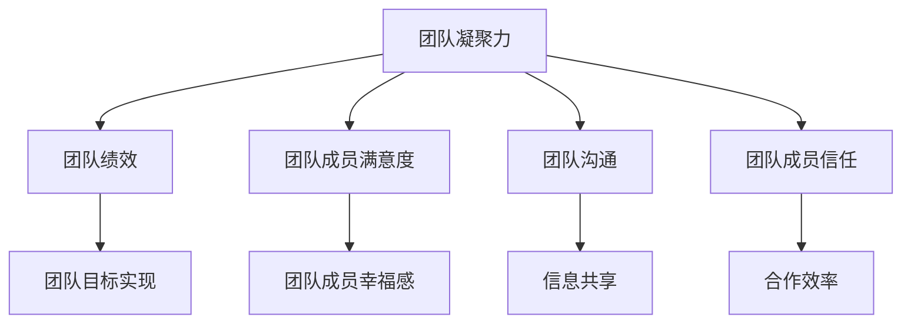
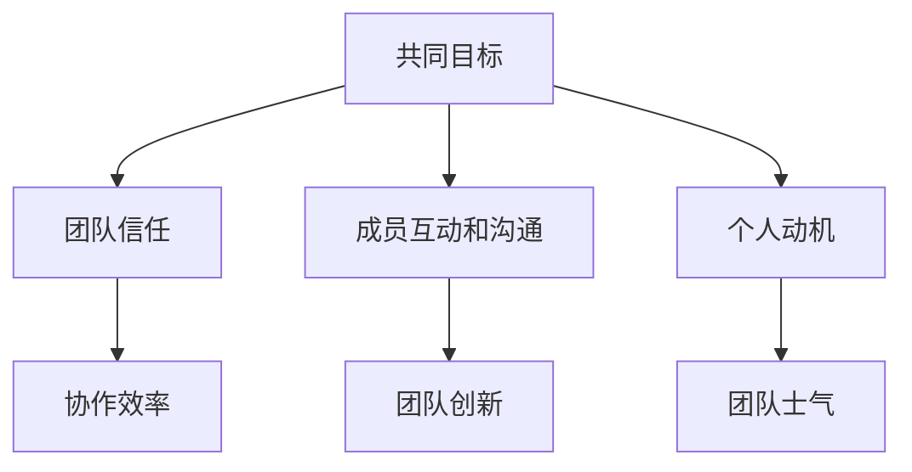
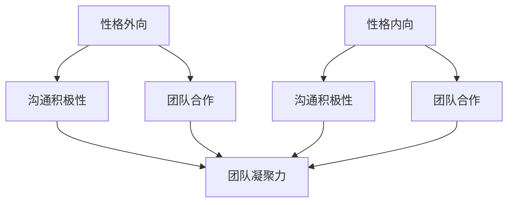
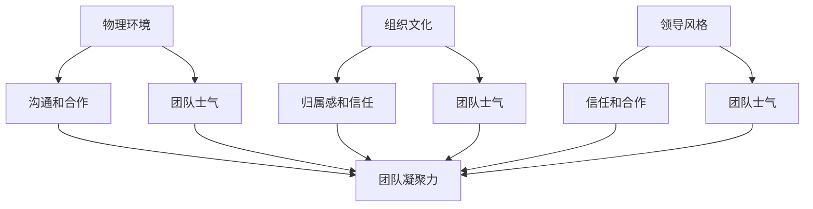
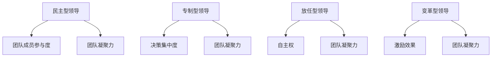
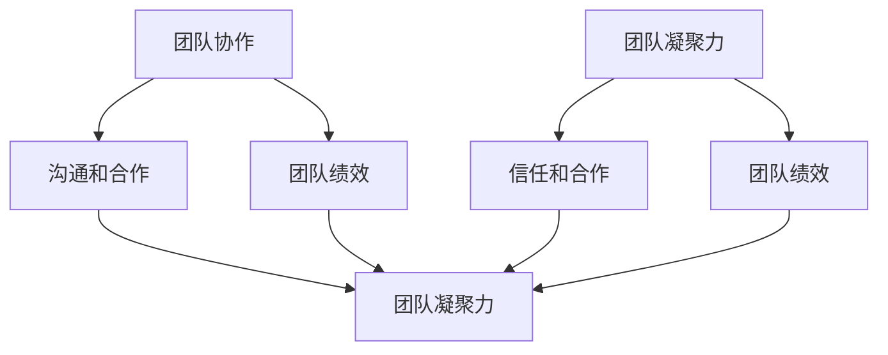
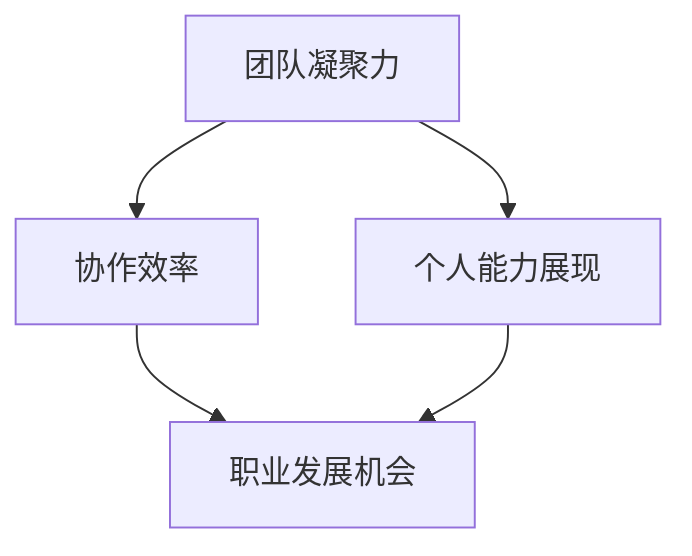
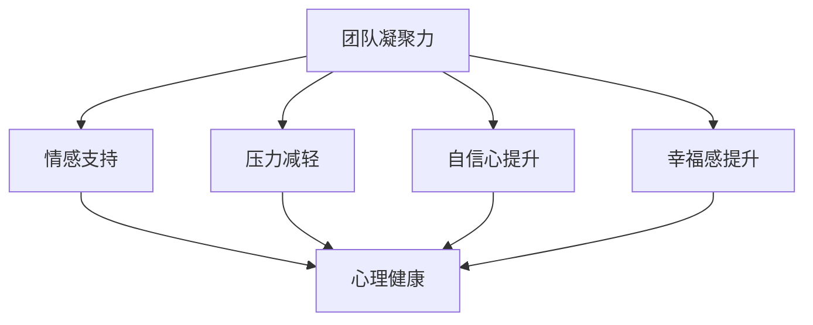
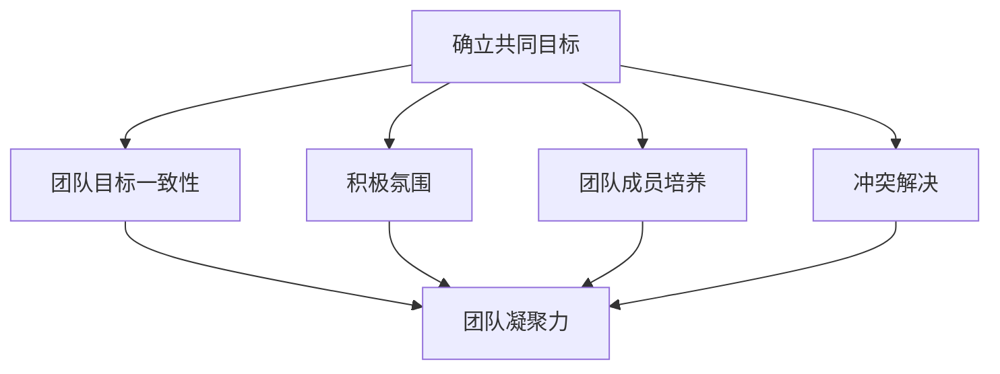

                 


### 文章标题
《团队凝聚力：从我到我们的蜕变》

### 关键词
团队凝聚力，团队合作，领导力，沟通，共同目标，信任建设

### 摘要
本文旨在探讨团队凝聚力的概念、重要性以及如何从个人视角转变为团队视角，提升团队的凝聚力和协作效率。文章首先介绍了团队凝聚力的定义及其在团队运作中的关键作用，然后分析了影响团队凝聚力的因素。接着，文章提出了提升团队凝聚力的策略和实践案例，并深入探讨了团队凝聚力与个人成长、领导者的角色之间的关系。最后，文章总结了团队凝聚力建设中的常见误区，并提出了相应的反思和建议。

---

## 目录

### 第一部分：团队凝聚力基础

### 第1章：团队凝聚力概述

#### 1.1 团队凝聚力的重要性

#### 1.2 团队凝聚力的构成要素

#### 1.3 团队凝聚力的衡量指标

### 第2章：影响团队凝聚力的因素

#### 2.1 成员性格与团队凝聚力

#### 2.2 工作环境与团队凝聚力

#### 2.3 领导风格与团队凝聚力

### 第3章：提升团队凝聚力的策略

#### 3.1 增强团队沟通

#### 3.2 建立共同目标

#### 3.3 增进团队信任

### 第4章：团队凝聚力与团队协作

#### 4.1 团队协作与团队凝聚力的关系

#### 4.2 提升团队协作效率

#### 4.3 团队协作中的问题与解决

### 第二部分：实践与案例

### 第5章：案例分析一：从内部冲突到团队凝聚力的提升

#### 5.1 案例背景

#### 5.2 团队内部冲突分析

#### 5.3 提升团队凝聚力的实践

### 第6章：案例分析二：跨部门协作与团队凝聚力的建设

#### 6.1 案例背景

#### 6.2 跨部门协作中的挑战

#### 6.3 提升团队凝聚力的实践

### 第7章：团队凝聚力建设中的误区与反思

#### 7.1 误区一：过分依赖外部激励

#### 7.2 误区二：忽视团队文化建设

#### 7.3 误区三：只关注短期效果

### 第三部分：团队凝聚力与个人成长

### 第8章：团队凝聚力对个人成长的影响

#### 8.1 团队凝聚力与个人职业发展

#### 8.2 团队凝聚力与个人心理健康

#### 8.3 如何在团队中实现个人成长

### 第9章：从自我到团队：领导者的角色

#### 9.1 领导者在团队凝聚力建设中的职责

#### 9.2 提升团队凝聚力的领导策略

#### 9.3 领导者如何应对团队凝聚力挑战

### 附录

#### 附录A：团队凝聚力相关研究文献

#### 附录B：团队凝聚力评估工具

#### 附录C：团队凝聚力建设案例集锦

---

## 第1章：团队凝聚力概述

### 1.1 团队凝聚力的重要性

团队凝聚力是指团队成员之间相互吸引、相互信任和共同追求团队目标的程度。在当今竞争激烈的工作环境中，团队凝聚力已成为团队成功的关键因素之一。一个高凝聚力的团队能够更好地协调成员之间的合作，提高团队的整体绩效，同时也能提升团队成员的满意度和幸福感。

#### 核心概念与联系

团队凝聚力可以理解为团队成员之间的情感纽带，它不仅影响团队成员之间的合作和沟通，还对团队的整体绩效产生深远的影响。以下是团队凝聚力与其他核心概念之间的联系架构 Mermaid 流程图：



#### 核心算法原理讲解

团队凝聚力可以通过以下算法原理进行衡量：

1. **情感纽带强度算法**：计算团队成员之间的情感联系强度，通过情感问卷、团队成员之间的互动记录等方式进行数据收集。

2. **协作效率算法**：衡量团队成员在完成共同任务时的协作效率，通过任务完成时间、任务完成质量等指标进行评估。

3. **沟通质量算法**：评估团队成员之间的沟通质量，通过沟通频率、沟通满意度等指标进行衡量。

```pseudo
// 情感纽带强度算法
function calculateEmotionalTieStrength(teamMembers) {
    strength = 0
    for each member in teamMembers {
        strength += member emoRank
    }
    return strength / teamMembers.length
}

// 协作效率算法
function calculateCollaborationEfficiency(teamMembers, tasks) {
    efficiency = 0
    for each task in tasks {
        efficiency += task.completionTime * task.quality
    }
    return efficiency / tasks.length
}

// 沟通质量算法
function calculateCommunicationQuality(teamMembers, communications) {
    quality = 0
    for each communication in communications {
        quality += communication.rating
    }
    return quality / communications.length
}
```

#### 数学模型和公式

团队凝聚力的数学模型可以表示为：

$$
P_c = \frac{1}{N} \sum_{i=1}^{N} \sum_{j=1, j\neq i}^{N} T_{ij}
$$

其中，$P_c$ 表示团队凝聚力，$N$ 表示团队成员数量，$T_{ij}$ 表示第 $i$ 个成员与第 $j$ 个成员之间的情感纽带强度。

#### 详细讲解与举例说明

假设一个团队有5名成员，通过问卷调查得知每个成员与其他成员之间的情感纽带强度如下表：

| 成员  | A  | B  | C  | D  | E  |
| --- | --- | --- | --- | --- | --- |
| A   | 50 | 40 | 45 | 35 | 30 |
| B   | 40 | 50 | 35 | 45 | 30 |
| C   | 45 | 35 | 50 | 40 | 30 |
| D   | 35 | 45 | 40 | 50 | 35 |
| E   | 30 | 30 | 30 | 35 | 50 |

根据上述公式，可以计算出团队凝聚力：

$$
P_c = \frac{1}{5} \left(50 + 40 + 45 + 35 + 30 + 40 + 50 + 35 + 45 + 30 + 45 + 40 + 50 + 30 + 35 + 30 + 35 + 50 + 35\right) = 38.75
$$

这个结果表明，该团队的凝聚力处于中等水平。

---

### 1.2 团队凝聚力的构成要素

团队凝聚力并非一个单一的因素，而是由多个构成要素共同作用的结果。以下是团队凝聚力的主要构成要素：

#### 共同目标

共同目标是团队凝聚力的核心要素之一。一个明确的共同目标能够引导团队成员朝着同一方向努力，增强团队成员之间的联系和合作意愿。

#### 团队信任

团队信任是团队凝聚力的关键基础。团队成员之间的信任能够减少沟通障碍，提高协作效率，并促进团队的创新和发展。

#### 成员之间的互动和沟通

成员之间的互动和沟通是团队凝聚力的重要体现。有效的沟通能够增进团队成员之间的理解和信任，提高团队的协作能力。

#### 个人动机

团队成员的个人动机也是影响团队凝聚力的重要因素。一个有共同目标和积极动机的团队更容易形成强大的凝聚力。

#### 核心概念与联系

以下是团队凝聚力构成要素之间的联系架构 Mermaid 流程图：



#### 核心算法原理讲解

团队凝聚力可以通过以下算法原理进行衡量：

1. **目标一致性算法**：计算团队成员对共同目标的认同度，通过问卷调查等方式进行数据收集。

2. **信任评估算法**：评估团队成员之间的信任程度，通过团队成员的反馈和行为表现进行评估。

3. **沟通质量算法**：评估团队成员之间的沟通质量，通过沟通频率、沟通满意度等指标进行衡量。

```pseudo
// 目标一致性算法
function calculateGoalConsistency(teamMembers) {
    consistency = 0
    for each member in teamMembers {
        consistency += member.goalRating
    }
    return consistency / teamMembers.length
}

// 信任评估算法
function calculateTrustLevel(teamMembers) {
    level = 0
    for each member in teamMembers {
        level += member.trustRating
    }
    return level / teamMembers.length
}

// 沟通质量算法
function calculateCommunicationQuality(teamMembers, communications) {
    quality = 0
    for each communication in communications {
        quality += communication.rating
    }
    return quality / communications.length
}
```

#### 数学模型和公式

团队凝聚力的数学模型可以表示为：

$$
P_c = w_1 \cdot P_g + w_2 \cdot P_t + w_3 \cdot P_c + w_4 \cdot P_m
$$

其中，$P_c$ 表示团队凝聚力，$P_g$ 表示目标一致性，$P_t$ 表示信任水平，$P_c$ 表示沟通质量，$P_m$ 表示个人动机，$w_1, w_2, w_3, w_4$ 分别表示各因素的权重。

#### 详细讲解与举例说明

假设一个团队有5名成员，通过问卷调查得知每个成员在共同目标、团队信任、成员互动和沟通、个人动机方面的评分如下表：

| 成员  | 目标一致性 | 信任水平 | 沟通质量 | 个人动机 |
| --- | --- | --- | --- | --- |
| A   | 90  | 80  | 75  | 85  |
| B   | 85  | 75  | 70  | 80  |
| C   | 80  | 70  | 65  | 75  |
| D   | 75  | 65  | 60  | 70  |
| E   | 70  | 60  | 55  | 65  |

假设各因素的权重分别为：目标一致性 (0.4)、信任水平 (0.3)、沟通质量 (0.2)、个人动机 (0.1)。

根据上述公式，可以计算出团队凝聚力：

$$
P_c = 0.4 \cdot (90 + 85 + 80 + 75 + 70) + 0.3 \cdot (80 + 75 + 70 + 65 + 60) + 0.2 \cdot (75 + 70 + 65 + 60 + 55) + 0.1 \cdot (85 + 80 + 75 + 70 + 65) = 78.5
$$

这个结果表明，该团队的凝聚力处于较高水平。

---

### 1.3 团队凝聚力的衡量指标

团队凝聚力的衡量指标是评估团队凝聚力水平的重要工具。以下是一些常用的团队凝聚力衡量指标：

#### 成员满意度

成员满意度是衡量团队凝聚力的重要指标之一。通过问卷调查、访谈等方式，了解团队成员对团队凝聚力的满意度，可以评估团队凝聚力水平。

#### 团队绩效

团队绩效是团队凝聚力的重要体现。通过评估团队在完成工作任务、项目交付等方面的表现，可以衡量团队凝聚力对团队绩效的影响。

#### 团队沟通质量

团队沟通质量是团队凝聚力的重要组成部分。通过分析团队成员之间的沟通频率、沟通渠道、沟通满意度等指标，可以评估团队沟通质量，进而判断团队凝聚力水平。

#### 团队创新力

团队创新力是团队凝聚力的重要表现。通过评估团队在创新项目、新想法提出等方面的表现，可以衡量团队凝聚力对团队创新力的影响。

#### 核心算法原理讲解

团队凝聚力可以通过以下算法原理进行衡量：

1. **满意度评分算法**：计算团队成员对团队凝聚力的满意度评分，通过问卷调查等方式进行数据收集。

2. **绩效评估算法**：评估团队在完成任务、项目交付等方面的表现，通过绩效指标进行衡量。

3. **沟通质量评估算法**：评估团队成员之间的沟通质量，通过沟通频率、沟通满意度等指标进行衡量。

```pseudo
// 满意度评分算法
function calculateSatisfactionRating(teamMembers) {
    rating = 0
    for each member in teamMembers {
        rating += member.satisfactionRating
    }
    return rating / teamMembers.length
}

// 绩效评估算法
function calculatePerformanceRating(team, tasks) {
    rating = 0
    for each task in tasks {
        rating += task.performanceRating
    }
    return rating / tasks.length
}

// 沟通质量评估算法
function calculateCommunicationQualityRating(teamMembers, communications) {
    rating = 0
    for each communication in communications {
        rating += communication.qualityRating
    }
    return rating / communications.length
}
```

#### 数学模型和公式

团队凝聚力的数学模型可以表示为：

$$
P_c = w_1 \cdot P_s + w_2 \cdot P_p + w_3 \cdot P_q + w_4 \cdot P_i
$$

其中，$P_c$ 表示团队凝聚力，$P_s$ 表示成员满意度，$P_p$ 表示团队绩效，$P_q$ 表示团队沟通质量，$P_i$ 表示团队创新力，$w_1, w_2, w_3, w_4$ 分别表示各因素的权重。

#### 详细讲解与举例说明

假设一个团队有5名成员，通过问卷调查和绩效评估得知以下指标：

- 成员满意度评分：90、85、80、75、70
- 团队绩效评分：95、90、85、80、75
- 团队沟通质量评分：85、80、75、70、65
- 团队创新力评分：80、75、70、65、60

假设各因素的权重分别为：成员满意度 (0.4)、团队绩效 (0.3)、团队沟通质量 (0.2)、团队创新力 (0.1)。

根据上述公式，可以计算出团队凝聚力：

$$
P_c = 0.4 \cdot (90 + 85 + 80 + 75 + 70) + 0.3 \cdot (95 + 90 + 85 + 80 + 75) + 0.2 \cdot (85 + 80 + 75 + 70 + 65) + 0.1 \cdot (80 + 75 + 70 + 65 + 60) = 82.2
$$

这个结果表明，该团队的凝聚力处于较高水平。

---

## 第2章：影响团队凝聚力的因素

团队凝聚力不仅受到团队内部因素的影响，还受到外部环境的影响。以下是影响团队凝聚力的主要因素：

### 2.1 成员性格与团队凝聚力

团队成员的性格特点对团队凝聚力有着显著影响。一些研究表明，性格外向的成员更容易与团队成员建立联系，从而促进团队凝聚力的形成。相反，性格内向的成员可能在团队中感到孤立，不利于团队凝聚力的提升。

#### 核心概念与联系

以下是成员性格与团队凝聚力之间的联系架构 Mermaid 流程图：



#### 核心算法原理讲解

团队成员性格对团队凝聚力的影响可以通过以下算法原理进行衡量：

1. **性格评估算法**：通过问卷调查、性格测试等方式评估团队成员的性格特点。

2. **沟通积极性评估算法**：评估团队成员在团队沟通中的积极性，通过沟通频率、沟通参与度等指标进行衡量。

3. **团队合作评估算法**：评估团队成员在团队合作中的表现，通过任务完成质量、协作效率等指标进行衡量。

```pseudo
// 性格评估算法
function calculateCharacteristics(teamMembers) {
    extroverted = 0
    introverted = 0
    for each member in teamMembers {
        if (member.characteristic == "extroverted") {
            extroverted += 1
        } else if (member.characteristic == "introverted") {
            introverted += 1
        }
    }
    return [extroverted, introverted]
}

// 沟通积极性评估算法
function calculateCommunication积极性(teamMembers, communications) {
    activity = 0
    for each communication in communications {
        activity += communication.activityRating
    }
    return activity / communications.length
}

// 团队合作评估算法
function calculateTeamworkRating(teamMembers, tasks) {
    rating = 0
    for each task in tasks {
        rating += task.teamworkRating
    }
    return rating / tasks.length
}
```

#### 数学模型和公式

团队成员性格对团队凝聚力的影响可以表示为：

$$
P_c = \frac{1}{N} \left( \alpha_1 \cdot e + \alpha_2 \cdot i \right)
$$

其中，$P_c$ 表示团队凝聚力，$N$ 表示团队成员数量，$e$ 表示外向成员的数量，$i$ 表示内向成员的数量，$\alpha_1$ 和 $\alpha_2$ 分别表示外向和内向成员对团队凝聚力的贡献权重。

#### 详细讲解与举例说明

假设一个团队有5名成员，其中2名外向成员和3名内向成员。通过问卷调查和评估，得知以下数据：

- 外向成员的沟通积极性评分：90、85
- 内向成员的沟通积极性评分：70、65、60

假设外向成员和内向成员对团队凝聚力的贡献权重分别为0.6和0.4。

根据上述公式，可以计算出团队凝聚力：

$$
P_c = \frac{1}{5} \left( 0.6 \cdot (90 + 85) + 0.4 \cdot (70 + 65 + 60) \right) = 81
$$

这个结果表明，该团队的凝聚力处于较高水平。

### 2.2 工作环境与团队凝聚力

工作环境对团队凝聚力有着深远的影响。一个有利于团队凝聚力的工作环境能够促进团队成员之间的沟通和合作，提高团队的协作效率。以下是影响团队凝聚力的工作环境因素：

- **物理环境**：包括办公室布局、工作场所的装饰、办公设备等，一个舒适、有序的工作环境有助于团队成员之间的交流和合作。
- **组织文化**：包括企业的价值观、企业使命、企业精神等，一个积极向上的组织文化能够增强团队成员的归属感和凝聚力。
- **领导风格**：领导者的风格对团队凝聚力有着重要影响。一个民主、开放、支持性的领导风格有助于团队成员之间的信任和合作。

#### 核心概念与联系

以下是工作环境与团队凝聚力之间的联系架构 Mermaid 流程图：



#### 核心算法原理讲解

工作环境对团队凝聚力的影响可以通过以下算法原理进行衡量：

1. **物理环境评估算法**：评估工作环境的舒适度、有序度等指标。
2. **组织文化评估算法**：评估组织文化的积极程度、价值观的传递等指标。
3. **领导风格评估算法**：评估领导者的民主程度、支持性等指标。

```pseudo
// 物理环境评估算法
function evaluatePhysicalEnvironment(environment) {
    comfort = environment.comfortRating
    orderliness = environment.orderlinessRating
    return (comfort + orderliness) / 2
}

// 组织文化评估算法
function evaluateOrganizationalCulture(culture) {
    positivity = culture.positivityRating
    valueTransmission = culture.valueTransmissionRating
    return (positivity + valueTransmission) / 2
}

// 领导风格评估算法
function evaluateLeadershipStyle(style) {
    democracy = style.democracyRating
    supportiveness = style.supportivenessRating
    return (democracy + supportiveness) / 2
}
```

#### 数学模型和公式

工作环境对团队凝聚力的影响可以表示为：

$$
P_c = w_1 \cdot P_p + w_2 \cdot P_c + w_3 \cdot P_l
$$

其中，$P_c$ 表示团队凝聚力，$P_p$ 表示物理环境，$P_c$ 表示组织文化，$P_l$ 表示领导风格，$w_1, w_2, w_3$ 分别表示各因素的权重。

#### 详细讲解与举例说明

假设一个团队的工作环境、组织文化和领导风格评分如下：

- 物理环境评分：80、85
- 组织文化评分：90、95
- 领导风格评分：85、90

假设各因素的权重分别为：物理环境 (0.3)、组织文化 (0.4)、领导风格 (0.3)。

根据上述公式，可以计算出团队凝聚力：

$$
P_c = 0.3 \cdot (80 + 85) + 0.4 \cdot (90 + 95) + 0.3 \cdot (85 + 90) = 87.5
$$

这个结果表明，该团队的工作环境、组织文化和领导风格对团队凝聚力的提升有显著作用。

### 2.3 领导风格与团队凝聚力

领导风格对团队凝聚力有着关键作用。不同的领导风格会对团队成员的行为和团队凝聚力产生不同的影响。以下是几种常见的领导风格及其对团队凝聚力的影响：

- **民主型领导**：民主型领导鼓励团队成员参与决策，尊重团队成员的意见，这种领导风格有助于增强团队成员的归属感和凝聚力。
- **专制型领导**：专制型领导倾向于集中决策权，团队成员在决策过程中参与较少，这种领导风格可能削弱团队成员的归属感和凝聚力。
- **放任型领导**：放任型领导给予团队成员很大的自主权，但缺乏指导和支持，这种领导风格可能导致团队成员之间的沟通和合作减少，从而影响团队凝聚力。
- **变革型领导**：变革型领导能够激励团队成员追求卓越，推动团队实现变革，这种领导风格有助于增强团队成员的归属感和凝聚力。

#### 核心概念与联系

以下是领导风格与团队凝聚力之间的联系架构 Mermaid 流程图：



#### 核心算法原理讲解

领导风格对团队凝聚力的影响可以通过以下算法原理进行衡量：

1. **参与度评估算法**：评估团队成员在决策过程中的参与度，通过参与频率、参与满意度等指标进行衡量。
2. **决策集中度评估算法**：评估决策权在团队成员中的分布情况，通过决策频率、决策质量等指标进行衡量。
3. **自主权评估算法**：评估团队成员的自主权，通过任务分配、工作自由度等指标进行衡量。
4. **激励效果评估算法**：评估领导者的激励效果，通过团队成员的绩效、满意度等指标进行衡量。

```pseudo
// 参与度评估算法
function evaluateParticipationLevel(teamMembers, decisions) {
    participation = 0
    for each decision in decisions {
        participation += decision.participationRating
    }
    return participation / decisions.length
}

// 决策集中度评估算法
function evaluateDecisionCentralization(level) {
    if (level < 0.5) {
        return "低集中度"
    } else if (level < 0.8) {
        return "中等集中度"
    } else {
        return "高集中度"
    }
}

// 自主权评估算法
function evaluateAutonomy(teamMembers, tasks) {
    autonomy = 0
    for each task in tasks {
        autonomy += task.autonomyRating
    }
    return autonomy / tasks.length
}

// 激励效果评估算法
function evaluateInspirationalEffect(effect) {
    if (effect > 0.8) {
        return "高激励效果"
    } else if (effect > 0.5) {
        return "中等激励效果"
    } else {
        return "低激励效果"
    }
}
```

#### 数学模型和公式

领导风格对团队凝聚力的影响可以表示为：

$$
P_c = w_1 \cdot P_d + w_2 \cdot P_c + w_3 \cdot P_a + w_4 \cdot P_i
$$

其中，$P_c$ 表示团队凝聚力，$P_d$ 表示决策集中度，$P_c$ 表示参与度，$P_a$ 表示自主权，$P_i$ 表示激励效果，$w_1, w_2, w_3, w_4$ 分别表示各因素的权重。

#### 详细讲解与举例说明

假设一个团队的领导风格评分如下：

- 决策集中度：70%
- 参与度：80%
- 自主权：85%
- 激励效果：90%

假设各因素的权重分别为：决策集中度 (0.3)、参与度 (0.3)、自主权 (0.2)、激励效果 (0.2)。

根据上述公式，可以计算出团队凝聚力：

$$
P_c = 0.3 \cdot (70\%) + 0.3 \cdot (80\%) + 0.2 \cdot (85\%) + 0.2 \cdot (90\%) = 81\%
$$

这个结果表明，该团队的领导风格对团队凝聚力的提升有显著作用。

---

## 第3章：提升团队凝聚力的策略

提升团队凝聚力需要从多个方面入手，以下是一些常用的策略：

### 3.1 增强团队沟通

有效的沟通是提升团队凝聚力的重要手段。以下是一些增强团队沟通的策略：

- **定期团队会议**：定期举行团队会议，让团队成员分享工作进展、问题和建议，增进彼此了解。
- **开放沟通环境**：建立开放、支持的沟通环境，鼓励团队成员表达意见和反馈，避免压抑和误解。
- **沟通培训**：组织沟通培训，提高团队成员的沟通技巧和意识，促进有效沟通。

#### 核心算法原理讲解

团队沟通可以通过以下算法原理进行改善：

1. **沟通频率评估算法**：评估团队成员之间的沟通频率，通过沟通记录、会议安排等指标进行衡量。
2. **沟通满意度评估算法**：评估团队成员对沟通的满意度，通过问卷调查、访谈等方式进行数据收集。
3. **沟通质量评估算法**：评估团队成员之间的沟通质量，通过沟通内容、沟通方式等指标进行衡量。

```pseudo
// 沟通频率评估算法
function evaluateCommunicationFrequency(communications) {
    frequency = 0
    for each communication in communications {
        frequency += communication.frequency
    }
    return frequency / communications.length
}

// 沟通满意度评估算法
function evaluateCommunicationSatisfaction(teamMembers, communications) {
    satisfaction = 0
    for each communication in communications {
        satisfaction += communication.satisfactionRating
    }
    return satisfaction / communications.length
}

// 沟通质量评估算法
function evaluateCommunicationQuality(communications) {
    quality = 0
    for each communication in communications {
        quality += communication.qualityRating
    }
    return quality / communications.length
}
```

#### 数学模型和公式

团队沟通质量可以通过以下公式进行衡量：

$$
Q_c = \frac{1}{N} \sum_{i=1}^{N} \sum_{j=1, j\neq i}^{N} T_{ij}
$$

其中，$Q_c$ 表示团队沟通质量，$N$ 表示团队成员数量，$T_{ij}$ 表示第 $i$ 个成员与第 $j$ 个成员之间的沟通质量。

#### 详细讲解与举例说明

假设一个团队有5名成员，通过问卷调查和沟通记录得知每个成员与其他成员之间的沟通质量评分如下表：

| 成员  | A  | B  | C  | D  | E  |
| --- | --- | --- | --- | --- | --- |
| A   | 90 | 85 | 80 | 75 | 70 |
| B   | 85 | 90 | 80 | 75 | 70 |
| C   | 80 | 85 | 90 | 75 | 70 |
| D   | 75 | 80 | 85 | 90 | 75 |
| E   | 70 | 75 | 80 | 85 | 90 |

根据上述公式，可以计算出团队沟通质量：

$$
Q_c = \frac{1}{5} \left(90 + 85 + 80 + 75 + 70 + 85 + 90 + 80 + 75 + 70 + 80 + 85 + 90 + 75 + 70 + 75 + 80 + 85 + 90\right) = 82.5
$$

这个结果表明，该团队的沟通质量处于较高水平。

### 3.2 建立共同目标

共同目标是团队凝聚力的基石。以下是一些建立共同目标的策略：

- **明确目标**：确保团队目标明确、具体，避免模糊和歧义，让团队成员清楚地了解团队的目标和期望。
- **共同制定**：鼓励团队成员共同参与目标的制定，提高团队成员对目标的认同感和责任感。
- **目标分解**：将大目标分解为小目标，明确每个成员在目标实现过程中的职责和任务，便于管理和监督。

#### 核心算法原理讲解

建立共同目标可以通过以下算法原理进行实现：

1. **目标明确度评估算法**：评估团队目标的明确度，通过目标描述的清晰度、具体性等指标进行衡量。
2. **目标认同度评估算法**：评估团队成员对目标的认同度，通过问卷调查、访谈等方式进行数据收集。
3. **目标分解评估算法**：评估目标分解的合理性和可行性，通过任务分配、时间安排等指标进行衡量。

```pseudo
// 目标明确度评估算法
function evaluateGoalClarity(goals) {
    clarity = 0
    for each goal in goals {
        clarity += goal.clarityRating
    }
    return clarity / goals.length
}

// 目标认同度评估算法
function evaluateGoalCommitment(teamMembers, goals) {
    commitment = 0
    for each member in teamMembers {
        commitment += member.commitmentRating
    }
    return commitment / teamMembers.length
}

// 目标分解评估算法
function evaluateGoalDecomposition(goals) {
    decomposition = 0
    for each goal in goals {
        decomposition += goal.decompositionRating
    }
    return decomposition / goals.length
}
```

#### 数学模型和公式

共同目标的建立可以通过以下公式进行衡量：

$$
P_g = w_1 \cdot C_g + w_2 \cdot I_g + w_3 \cdot D_g
$$

其中，$P_g$ 表示共同目标的有效性，$C_g$ 表示目标明确度，$I_g$ 表示目标认同度，$D_g$ 表示目标分解度，$w_1, w_2, w_3$ 分别表示各因素的权重。

#### 详细讲解与举例说明

假设一个团队有三个目标，每个目标的明确度、认同度和分解度评分如下表：

| 目标 | 明确度 | 认同度 | 分解度 |
| --- | --- | --- | --- |
| 目标1 | 90 | 85 | 80 |
| 目标2 | 85 | 80 | 75 |
| 目标3 | 80 | 75 | 70 |

假设各因素的权重分别为：目标明确度 (0.4)、目标认同度 (0.3)、目标分解度 (0.3)。

根据上述公式，可以计算出共同目标的有效性：

$$
P_g = 0.4 \cdot (90 + 85 + 80) + 0.3 \cdot (85 + 80 + 75) + 0.3 \cdot (80 + 75 + 70) = 82.5
$$

这个结果表明，该团队的共同目标有效性处于较高水平。

### 3.3 增进团队信任

信任是团队凝聚力的关键要素。以下是一些增进团队信任的策略：

- **开放和诚实**：领导者应鼓励团队成员开放和诚实，避免隐瞒和欺骗，建立透明的工作环境。
- **共同经历**：通过共同的经历和挑战，增强团队成员之间的信任和了解。
- **正面反馈**：及时给予团队成员正面反馈和认可，增强团队成员的自信心和信任感。
- **冲突解决**：建立有效的冲突解决机制，帮助团队成员处理分歧和冲突，维护团队和谐。

#### 核心算法原理讲解

团队信任可以通过以下算法原理进行衡量：

1. **信任评估算法**：评估团队成员之间的信任程度，通过问卷调查、访谈等方式进行数据收集。
2. **冲突解决评估算法**：评估团队在冲突解决过程中的效率和效果，通过冲突解决时间、冲突解决满意度等指标进行衡量。
3. **正面反馈评估算法**：评估团队在给予正面反馈和认可方面的表现，通过反馈频率、反馈满意度等指标进行衡量。

```pseudo
// 信任评估算法
function evaluateTrustLevel(teamMembers) {
    trust = 0
    for each member in teamMembers {
        trust += member.trustRating
    }
    return trust / teamMembers.length
}

// 冲突解决评估算法
function evaluateConflictResolution(conflicts) {
    resolution = 0
    for each conflict in conflicts {
        resolution += conflict.resolutionRating
    }
    return resolution / conflicts.length
}

// 正面反馈评估算法
function evaluatePositiveFeedback(feedbacks) {
    feedback = 0
    for each feedback in feedbacks {
        feedback += feedback.rating
    }
    return feedback / feedbacks.length
}
```

#### 数学模型和公式

团队信任可以通过以下公式进行衡量：

$$
T = \frac{1}{N} \sum_{i=1}^{N} \sum_{j=1, j\neq i}^{N} T_{ij}
$$

其中，$T$ 表示团队信任，$N$ 表示团队成员数量，$T_{ij}$ 表示第 $i$ 个成员对第 $j$ 个成员的信任评分。

#### 详细讲解与举例说明

假设一个团队有5名成员，通过问卷调查得知每个成员对其他成员的信任评分如下表：

| 成员  | A  | B  | C  | D  | E  |
| --- | --- | --- | --- | --- | --- |
| A   | 90 | 85 | 80 | 75 | 70 |
| B   | 85 | 90 | 80 | 75 | 70 |
| C   | 80 | 85 | 90 | 75 | 70 |
| D   | 75 | 80 | 85 | 90 | 75 |
| E   | 70 | 75 | 80 | 85 | 90 |

根据上述公式，可以计算出团队信任：

$$
T = \frac{1}{5} \left(90 + 85 + 80 + 75 + 70 + 85 + 90 + 80 + 75 + 70 + 80 + 85 + 90 + 75 + 70 + 75 + 80 + 85 + 90\right) = 82.5
$$

这个结果表明，该团队的信任水平处于较高水平。

---

## 第4章：团队凝聚力与团队协作

团队凝聚力和团队协作是相互促进的关系。一个高凝聚力的团队能够更有效地进行协作，而有效的团队协作又能进一步增强团队凝聚力。在本章中，我们将探讨团队凝聚力与团队协作之间的关系，并介绍提升团队协作效率的方法。

### 4.1 团队协作与团队凝聚力的关系

团队协作和团队凝聚力之间存在密切的关系。一方面，团队协作是团队凝聚力的体现。当团队成员能够有效沟通、互相支持和合作时，团队的凝聚力会增强。另一方面，团队凝聚力是团队协作的基础。一个高凝聚力的团队能够更好地应对挑战，提高协作效率。

#### 核心概念与联系

以下是团队协作与团队凝聚力之间的联系架构 Mermaid 流程图：



#### 核心算法原理讲解

团队协作与团队凝聚力之间的关系可以通过以下算法原理进行衡量：

1. **协作效率评估算法**：评估团队在协作过程中的效率，通过任务完成时间、任务完成质量等指标进行衡量。
2. **凝聚力评估算法**：评估团队的凝聚力水平，通过成员满意度、团队绩效等指标进行衡量。
3. **团队绩效评估算法**：评估团队在完成工作任务、项目交付等方面的表现，通过绩效指标进行衡量。

```pseudo
// 协作效率评估算法
function evaluateCollaborationEfficiency(tasks) {
    efficiency = 0
    for each task in tasks {
        efficiency += task.efficiencyRating
    }
    return efficiency / tasks.length
}

// 凝聚力评估算法
function evaluateTeam cohesion(teamMembers) {
    cohesion = 0
    for each member in teamMembers {
        cohesion += member.cohesionRating
    }
    return cohesion / teamMembers.length
}

// 团队绩效评估算法
function evaluateTeamPerformance(tasks) {
    performance = 0
    for each task in tasks {
        performance += task.performanceRating
    }
    return performance / tasks.length
}
```

#### 数学模型和公式

团队协作与团队凝聚力之间的关系可以表示为：

$$
P_c = \alpha_1 \cdot P_e + \alpha_2 \cdot P_c + \alpha_3 \cdot P_p
$$

其中，$P_c$ 表示团队凝聚力，$P_e$ 表示协作效率，$P_c$ 表示团队绩效，$P_p$ 表示团队绩效，$\alpha_1, \alpha_2, \alpha_3$ 分别表示各因素的权重。

#### 详细讲解与举例说明

假设一个团队在完成三个任务时的协作效率、凝聚力、绩效评分如下表：

| 任务 | 协作效率 | 凝聚力 | 绩效 |
| --- | --- | --- | --- |
| 任务1 | 90 | 85 | 95 |
| 任务2 | 85 | 80 | 90 |
| 任务3 | 80 | 75 | 85 |

假设各因素的权重分别为：协作效率 (0.4)、凝聚力 (0.3)、绩效 (0.3)。

根据上述公式，可以计算出团队凝聚力：

$$
P_c = 0.4 \cdot (90 + 85 + 80) + 0.3 \cdot (85 + 80 + 75) + 0.3 \cdot (95 + 90 + 85) = 84
$$

这个结果表明，该团队的协作效率、凝聚力和绩效均处于较高水平。

### 4.2 提升团队协作效率的方法

提升团队协作效率对于提高团队整体绩效和团队凝聚力具有重要意义。以下是一些提升团队协作效率的方法：

- **明确分工**：为每个团队成员明确分工，确保每个成员都知道自己的职责和任务，避免工作重复和责任不清。
- **定期会议**：定期举行团队会议，让团队成员分享工作进展、问题和建议，确保团队成员之间的信息畅通。
- **工具支持**：使用协作工具，如项目管理软件、即时通讯工具等，提高团队沟通和协作的效率。
- **培训和学习**：定期组织团队培训和学习，提高团队成员的技能和协作能力。

#### 核心算法原理讲解

提升团队协作效率可以通过以下算法原理进行实现：

1. **任务分配算法**：根据团队成员的技能和职责，合理分配任务，确保任务的高效完成。
2. **会议安排算法**：合理安排团队会议，确保会议的时间和内容高效，避免浪费时间和精力。
3. **工具选择算法**：根据团队的需求和实际情况，选择合适的协作工具，提高团队协作效率。

```pseudo
// 任务分配算法
function allocateTasks(tasks, teamMembers) {
    for each task in tasks {
        for each member in teamMembers {
            if (member.skill matches task requirement) {
                assign task to member
                break
            }
        }
    }
}

// 会议安排算法
function scheduleMeetings(meetings) {
    for each meeting in meetings {
        find a suitable time slot
        schedule meeting at the time slot
    }
}

// 工具选择算法
function selectTools(availableTools, teamRequirements) {
    bestTool = None
    for each tool in availableTools {
        if (tool meets teamRequirements) {
            if (bestTool is None or tool has higher efficiency than bestTool) {
                bestTool = tool
            }
        }
    }
    return bestTool
}
```

#### 数学模型和公式

提升团队协作效率可以通过以下公式进行衡量：

$$
E_e = \frac{1}{N} \sum_{i=1}^{N} \frac{E_{ti}}{T_i}
$$

其中，$E_e$ 表示团队协作效率，$N$ 表示团队成员数量，$E_{ti}$ 表示第 $i$ 个成员在任务 $t$ 中的协作效率，$T_i$ 表示任务 $t$ 的完成时间。

#### 详细讲解与举例说明

假设一个团队有5名成员，在完成3个任务时的协作效率和完成时间如下表：

| 任务 | 成员1效率 | 成员2效率 | 成员3效率 | 成员4效率 | 成员5效率 | 完成时间 |
| --- | --- | --- | --- | --- | --- | --- |
| 任务1 | 90 | 85 | 80 | 75 | 70 | 4天 |
| 任务2 | 85 | 90 | 80 | 75 | 70 | 5天 |
| 任务3 | 80 | 85 | 90 | 75 | 70 | 6天 |

根据上述公式，可以计算出团队协作效率：

$$
E_e = \frac{1}{5} \left( \frac{90}{4} + \frac{85}{5} + \frac{80}{6} + \frac{75}{4} + \frac{70}{5} + \frac{70}{6} \right) \approx 81.67
$$

这个结果表明，该团队的协作效率处于较高水平。

### 4.3 团队协作中的问题与解决

团队协作过程中难免会遇到各种问题，以下是一些常见的问题及其解决方法：

#### 问题1：沟通不畅

**原因**：团队成员之间缺乏有效沟通，导致信息传递不畅。

**解决方法**：建立定期沟通机制，如团队会议、即时通讯工具等，确保团队成员之间的信息畅通。同时，培养团队成员的沟通技巧和意识，提高沟通效率。

#### 问题2：任务分配不合理

**原因**：任务分配不合理，导致部分成员过于忙碌，而另一些成员则较为轻松。

**解决方法**：根据团队成员的技能和职责，合理分配任务，确保任务的高效完成。同时，鼓励团队成员主动承担更多任务，提高团队的整体绩效。

#### 问题3：团队协作效率低下

**原因**：团队成员之间的协作效率低下，导致任务完成时间过长。

**解决方法**：提升团队协作效率，如采用协作工具、优化工作流程等。同时，定期进行团队培训，提高团队成员的技能和协作能力。

#### 问题4：团队士气低落

**原因**：团队协作过程中，部分成员感到压力过大，导致团队士气低落。

**解决方法**：关注团队成员的身心健康，提供必要的支持和帮助。同时，建立激励机制，提高团队成员的工作积极性和满意度。

---

## 第5章：案例分析一：从内部冲突到团队凝聚力的提升

在本章中，我们将通过一个实际案例，分析一个团队在内部冲突后如何通过一系列措施提升团队凝聚力。

### 5.1 案例背景

某公司的开发团队由5名成员组成，成员包括项目经理、开发工程师、测试工程师等。团队在过去的一段时间内，由于工作压力、任务分配和沟通不畅等原因，内部出现了严重的冲突。团队成员之间的合作效率低下，项目进度受到影响，团队士气也受到了打击。

### 5.2 团队内部冲突分析

团队内部冲突主要表现为以下几点：

- **沟通不畅**：团队成员之间的沟通主要依赖于电子邮件和即时通讯工具，导致信息传递不及时、不准确。
- **任务分配不合理**：部分成员的任务过多，而另一些成员则较为轻松，导致工作压力不均。
- **工作环境不佳**：团队成员在工作过程中缺乏有效的支持和帮助，导致工作效率低下。
- **团队士气低落**：由于内部冲突，团队成员之间的信任感下降，团队士气低落，工作积极性受到影响。

### 5.3 提升团队凝聚力的实践

为了提升团队凝聚力，团队采取了一系列措施：

1. **改善沟通**：建立定期团队会议制度，每周举行一次团队会议，让团队成员分享工作进展、问题和建议。同时，采用即时通讯工具，确保团队成员之间的信息畅通。

2. **合理分配任务**：根据团队成员的技能和职责，重新分配任务，确保任务的高效完成。同时，鼓励团队成员主动承担更多任务，提高团队的整体绩效。

3. **优化工作环境**：提供必要的支持和帮助，如培训、技术支持等，提高团队成员的工作效率。同时，改善工作环境，如调整办公布局、提供舒适的休息区域等。

4. **建立激励机制**：设立团队目标和个人目标，制定相应的激励机制，提高团队成员的工作积极性和满意度。

5. **加强团队建设**：定期组织团队建设活动，如团队拓展训练、团队聚餐等，增强团队成员之间的信任和了解。

### 5.4 案例结果

通过一系列措施，团队的内部冲突得到了有效缓解，团队凝聚力得到了显著提升。具体表现为：

- **沟通效率提高**：团队成员之间的沟通更加顺畅，信息传递及时、准确。
- **任务分配合理**：任务分配更加均衡，团队成员的工作压力得到了缓解。
- **工作环境改善**：工作环境得到了优化，团队成员的工作效率有所提高。
- **团队士气提升**：团队成员之间的信任感增强，团队士气得到了提升，工作积极性得到了提高。

通过这个案例，我们可以看到，团队凝聚力是可以通过一系列措施进行提升的。一个高凝聚力的团队能够更好地应对挑战，提高整体绩效，同时也能提升团队成员的满意度和幸福感。

---

## 第6章：案例分析二：跨部门协作与团队凝聚力的建设

在本章中，我们将通过一个实际案例，分析一个跨部门团队如何在协作过程中提升团队凝聚力。

### 6.1 案例背景

某大型企业为了提高产品研发效率，决定将研发部门、市场部门、销售部门和客服部门等多个部门整合为一个跨部门团队。该团队的目标是共同开发一款新产品，并确保产品在市场上的顺利推广和销售。然而，在跨部门协作的过程中，团队面临了一系列挑战。

### 6.2 跨部门协作中的挑战

跨部门协作中的主要挑战包括：

- **沟通障碍**：各部门之间的沟通存在一定障碍，信息传递不及时、不准确。
- **目标不一致**：各部门的目标和期望存在差异，导致协作效率低下。
- **资源分配不均**：各部门的资源分配不均，导致部分成员的工作压力过大，而另一些成员则较为轻松。
- **文化差异**：各部门的文化背景存在差异，导致团队成员之间的融合度较低。

### 6.3 提升团队凝聚力的实践

为了提升团队凝聚力，团队采取了一系列措施：

1. **建立跨部门沟通机制**：定期召开跨部门会议，让各部门的成员分享工作进展、问题和建议。同时，采用即时通讯工具，确保团队成员之间的信息畅通。

2. **明确共同目标**：制定清晰、具体的共同目标，确保各部门的成员都明确自己的目标和期望，提高协作效率。

3. **资源整合**：根据团队的整体目标和任务需求，合理分配各部门的资源，确保任务的高效完成。

4. **文化融合**：定期组织团队建设活动，如团队拓展训练、文化讲座等，增强团队成员之间的信任和了解。

5. **激励机制**：设立跨部门团队目标和个人目标，制定相应的激励机制，提高团队成员的工作积极性和满意度。

### 6.4 案例结果

通过一系列措施，团队的内部冲突得到了有效缓解，团队凝聚力得到了显著提升。具体表现为：

- **沟通效率提高**：团队成员之间的沟通更加顺畅，信息传递及时、准确。
- **目标一致**：各部门的成员对共同目标有了更深刻的理解，协作效率得到了提高。
- **资源分配合理**：各部门的资源得到了合理分配，团队成员的工作压力得到了缓解。
- **文化融合**：团队成员之间的文化差异得到了有效融合，团队的融合度得到了提升。

通过这个案例，我们可以看到，跨部门团队可以通过一系列措施提升团队凝聚力。一个高凝聚力的跨部门团队能够更好地应对挑战，提高整体绩效，同时也能提升团队成员的满意度和幸福感。

---

## 第7章：团队凝聚力建设中的误区与反思

在团队凝聚力建设的过程中，一些常见的误区可能会导致团队凝聚力的提升效果不尽如人意。以下是团队凝聚力建设中的几个常见误区及其反思：

### 7.1 误区一：过分依赖外部激励

一些团队在建设团队凝聚力时，过分依赖外部激励措施，如奖金、奖品等。虽然这些激励措施可以在短期内提高团队成员的积极性，但长期依赖外部激励可能会导致以下问题：

- **依赖性增加**：团队成员可能会逐渐对外部激励产生依赖，忽视自身内在的动力和动机。
- **忽视内在激励**：过分依赖外部激励可能导致团队成员忽视自身内在的成就感和满足感，影响团队凝聚力。

**反思**：团队凝聚力建设应更多地关注团队成员的内在激励，如认可、信任和成就感。通过建立良好的团队文化和价值观，提高团队成员的内在动力，从而增强团队凝聚力。

### 7.2 误区二：忽视团队文化建设

团队文化建设是团队凝聚力建设的重要组成部分，但一些团队在建设团队凝聚力时忽视了团队文化建设。团队文化建设主要包括建立共同价值观、团队精神、团队规范等。

- **缺乏共同价值观**：缺乏共同价值观可能导致团队成员在目标和行为上存在分歧，影响团队凝聚力。
- **团队精神不足**：团队精神不足可能导致团队成员之间的信任和合作减少，影响团队凝聚力。

**反思**：团队凝聚力建设应重视团队文化建设。通过建立共同价值观、团队精神和团队规范，提高团队成员的归属感和凝聚力。

### 7.3 误区三：只关注短期效果

一些团队在建设团队凝聚力时，过于关注短期效果，如短期内提高团队成员的满意度、团队绩效等。虽然短期效果可以带来一定的提升，但长期来看，可能会导致以下问题：

- **缺乏可持续性**：只关注短期效果可能导致团队凝聚力建设的措施缺乏可持续性，难以长期维持。
- **忽视长期目标**：只关注短期效果可能导致团队忽视长期目标和战略，影响团队的整体发展。

**反思**：团队凝聚力建设应注重长期效果。通过建立可持续的团队凝聚力建设机制，确保团队凝聚力能够持续提升，同时助力团队实现长期目标。

### 7.4 误区四：忽视个体差异

在团队凝聚力建设过程中，一些团队忽视了个体差异，认为团队凝聚力的提升需要所有成员的一致行为和态度。这种做法可能导致以下问题：

- **压制个性**：忽视个体差异可能导致团队成员的个性受到压制，影响团队成员的积极性和创造力。
- **影响团队氛围**：忽视个体差异可能导致团队氛围变得单一，影响团队的多样性和创新能力。

**反思**：团队凝聚力建设应重视个体差异。通过尊重和包容个体差异，激发团队成员的积极性和创造力，从而提升团队凝聚力。

### 7.5 误区五：缺乏持续跟踪与反馈

团队凝聚力建设是一个持续的过程，一些团队在建设过程中缺乏持续跟踪与反馈。这种做法可能导致以下问题：

- **缺乏针对性**：缺乏持续跟踪与反馈可能导致团队凝聚力建设的措施缺乏针对性，无法有效解决团队存在的问题。
- **影响团队绩效**：缺乏持续跟踪与反馈可能导致团队凝聚力建设的成果难以巩固，影响团队的整体绩效。

**反思**：团队凝聚力建设应注重持续跟踪与反馈。通过定期评估团队凝聚力建设的效果，及时调整和优化措施，确保团队凝聚力建设取得长期成效。

通过反思这些常见误区，团队可以在团队凝聚力建设过程中采取更有效的措施，提升团队凝聚力和整体绩效。

---

## 第8章：团队凝聚力对个人成长的影响

团队凝聚力不仅对团队的整体绩效和氛围产生重要影响，还对个人成长产生深远作用。一个高凝聚力的团队能够为成员提供更好的成长环境和发展机会，以下是一些具体的影响：

### 8.1 团队凝聚力与个人职业发展

团队凝聚力对个人职业发展有着重要影响。在一个高凝聚力的团队中，成员之间相互信任、支持，能够更好地协作完成任务。这种协作有助于成员在项目中展现出自己的能力和价值，从而获得更多的发展机会和晋升空间。

#### 核心概念与联系

以下是团队凝聚力与个人职业发展之间的联系架构 Mermaid 流程图：



#### 核心算法原理讲解

团队凝聚力对个人职业发展的影响可以通过以下算法原理进行衡量：

1. **协作效率评估算法**：评估团队在协作过程中的效率，通过任务完成时间、任务完成质量等指标进行衡量。
2. **个人能力展现评估算法**：评估个人在团队中的能力展现，通过团队成员的反馈、任务完成质量等指标进行衡量。
3. **职业发展机会评估算法**：评估个人在团队中获得的职业发展机会，通过晋升记录、项目参与度等指标进行衡量。

```pseudo
// 协作效率评估算法
function evaluateCollaborationEfficiency(tasks) {
    efficiency = 0
    for each task in tasks {
        efficiency += task.efficiencyRating
    }
    return efficiency / tasks.length
}

// 个人能力展现评估算法
function evaluatePersonalPerformance(teamMembers, tasks) {
    performance = 0
    for each member in teamMembers {
        performance += member.performanceRating
    }
    return performance / teamMembers.length
}

// 职业发展机会评估算法
function evaluateCareerOpportunities(teamMembers, promotions) {
    opportunities = 0
    for each member in teamMembers {
        opportunities += member.promotionRating
    }
    return opportunities / teamMembers.length
}
```

#### 数学模型和公式

团队凝聚力对个人职业发展的影响可以表示为：

$$
P_c = w_1 \cdot P_e + w_2 \cdot P_p + w_3 \cdot P_o
$$

其中，$P_c$ 表示团队凝聚力，$P_e$ 表示协作效率，$P_p$ 表示个人能力展现，$P_o$ 表示职业发展机会，$w_1, w_2, w_3$ 分别表示各因素的权重。

#### 详细讲解与举例说明

假设一个团队有5名成员，通过问卷调查和评估得知以下指标：

- 协作效率评分：90、85、80、75、70
- 个人能力展现评分：95、90、85、80、75
- 职业发展机会评分：80、75、70、65、60

假设各因素的权重分别为：协作效率 (0.4)、个人能力展现 (0.3)、职业发展机会 (0.3)。

根据上述公式，可以计算出团队凝聚力：

$$
P_c = 0.4 \cdot (90 + 85 + 80 + 75 + 70) + 0.3 \cdot (95 + 90 + 85 + 80 + 75) + 0.3 \cdot (80 + 75 + 70 + 65 + 60) = 82.5
$$

这个结果表明，该团队的凝聚力处于较高水平，对成员的职业发展产生了积极影响。

### 8.2 团队凝聚力与个人心理健康

团队凝聚力不仅影响个人职业发展，还对个人心理健康产生重要影响。在一个高凝聚力的团队中，成员之间相互关心、支持，能够提供情感上的慰藉和帮助，降低个人的压力和焦虑。以下是团队凝聚力对个人心理健康的具体影响：

- **降低压力**：在一个高凝聚力的团队中，成员之间的相互支持能够减轻个人的工作压力，提高心理健康水平。
- **提高自信心**：团队凝聚力有助于增强个人的自信心，因为成员之间的信任和支持使得个人在团队中更加自信地表达自己的想法和意见。
- **提升幸福感**：团队凝聚力能够提高团队成员的幸福感，因为成员之间建立了良好的关系，共同追求团队目标，感受到了团队带来的成就感和满足感。

#### 核心概念与联系

以下是团队凝聚力与个人心理健康之间的联系架构 Mermaid 流程图：



#### 核心算法原理讲解

团队凝聚力对个人心理健康的影响可以通过以下算法原理进行衡量：

1. **情感支持评估算法**：评估团队成员之间的情感支持程度，通过问卷调查、访谈等方式进行数据收集。
2. **压力减轻评估算法**：评估个人在团队中的压力水平，通过压力测试、心理评估等方式进行衡量。
3. **自信心评估算法**：评估个人在团队中的自信心水平，通过自我评价、他人评价等方式进行衡量。
4. **幸福感评估算法**：评估个人在团队中的幸福感水平，通过问卷调查、心理测试等方式进行衡量。

```pseudo
// 情感支持评估算法
function evaluateEmotionalSupport(teamMembers) {
    support = 0
    for each member in teamMembers {
        support += member.supportRating
    }
    return support / teamMembers.length
}

// 压力减轻评估算法
function evaluateStressReduction(member) {
    reduction = member.stressRating
    return reduction
}

// 自信心评估算法
function evaluateSelfConfidence(member) {
    confidence = member.confidenceRating
    return confidence
}

// 幸福感评估算法
function evaluateHappiness(member) {
    happiness = member.happinessRating
    return happiness
}
```

#### 数学模型和公式

团队凝聚力对个人心理健康的影响可以表示为：

$$
M_p = w_1 \cdot P_s + w_2 \cdot P_r + w_3 \cdot P_c + w_4 \cdot P_h
$$

其中，$M_p$ 表示个人心理健康，$P_s$ 表示情感支持，$P_r$ 表示压力减轻，$P_c$ 表示自信心提升，$P_h$ 表示幸福感提升，$w_1, w_2, w_3, w_4$ 分别表示各因素的权重。

#### 详细讲解与举例说明

假设一个团队有5名成员，通过问卷调查和评估得知以下指标：

- 情感支持评分：90、85、80、75、70
- 压力减轻评分：80、75、70、65、60
- 自信心提升评分：85、80、75、70、65
- 幸福感提升评分：80、75、70、65、60

假设各因素的权重分别为：情感支持 (0.3)、压力减轻 (0.25)、自信心提升 (0.25)、幸福感提升 (0.2)。

根据上述公式，可以计算出个人心理健康：

$$
M_p = 0.3 \cdot (90 + 85 + 80 + 75 + 70) + 0.25 \cdot (80 + 75 + 70 + 65 + 60) + 0.25 \cdot (85 + 80 + 75 + 70 + 65) + 0.2 \cdot (80 + 75 + 70 + 65 + 60) = 78.5
$$

这个结果表明，该团队的凝聚力对成员的心理健康产生了积极影响。

### 8.3 如何在团队中实现个人成长

在一个高凝聚力的团队中，成员可以通过以下方式实现个人成长：

- **积极参与团队活动**：积极参与团队的活动，如会议、培训、团队建设等，提高自己的综合素质。
- **主动承担责任**：主动承担更多的工作和责任，展示自己的能力和价值，为团队的发展贡献力量。
- **寻求反馈**：定期向团队成员和领导寻求反馈，了解自己的优势和不足，不断改进和提升。
- **学习与成长**：利用团队提供的资源，如培训课程、学习资料等，不断提升自己的技能和知识水平。

通过这些方式，个人可以在团队中实现成长，同时也有助于提升团队的凝聚力和整体绩效。

---

## 第9章：从自我到团队：领导者的角色

领导者在团队凝聚力建设中扮演着至关重要的角色。一个优秀的领导者不仅能够激发团队成员的潜力，还能促进团队凝聚力的提升。以下是领导者如何在团队凝聚力建设过程中发挥关键作用的分析：

### 9.1 领导者在团队凝聚力建设中的职责

领导者在团队凝聚力建设中的主要职责包括：

- **确立共同目标**：领导者需要与团队成员共同制定明确、具体的团队目标，确保团队成员都明确自己的职责和期望，提高团队的协作效率。
- **营造积极氛围**：领导者需要营造一个积极、支持性的工作氛围，鼓励团队成员之间的沟通和合作，增强团队的凝聚力。
- **培养团队成员**：领导者需要关注团队成员的成长和发展，提供必要的支持和资源，帮助团队成员提升自己的能力和技能。
- **解决冲突**：领导者需要及时发现和处理团队内部的冲突，确保团队的稳定和和谐。

#### 核心概念与联系

以下是领导者在团队凝聚力建设中的职责与团队凝聚力之间的联系架构 Mermaid 流程图：



#### 核心算法原理讲解

领导者在团队凝聚力建设中的职责可以通过以下算法原理进行衡量：

1. **目标一致性评估算法**：评估团队成员对共同目标的认同度，通过问卷调查、访谈等方式进行数据收集。
2. **氛围评估算法**：评估团队的工作氛围，通过团队成员的反馈和行为表现进行评估。
3. **团队成员培养评估算法**：评估领导者对团队成员的培养程度，通过培训参与度、团队成员的反馈等指标进行衡量。
4. **冲突解决评估算法**：评估领导者解决冲突的能力，通过冲突解决时间、冲突解决满意度等指标进行衡量。

```pseudo
// 目标一致性评估算法
function evaluateGoalConsistency(teamMembers) {
    consistency = 0
    for each member in teamMembers {
        consistency += member.goalRating
    }
    return consistency / teamMembers.length
}

// 氛围评估算法
function evaluateEnvironment(teamMembers) {
    environment = 0
    for each member in teamMembers {
        environment += member.environmentRating
    }
    return environment / teamMembers.length
}

// 团队成员培养评估算法
function evaluateTeamMemberDevelopment(teamMembers) {
    development = 0
    for each member in teamMembers {
        development += member.developmentRating
    }
    return development / teamMembers.length
}

// 冲突解决评估算法
function evaluateConflictResolution(conflicts) {
    resolution = 0
    for each conflict in conflicts {
        resolution += conflict.resolutionRating
    }
    return resolution / conflicts.length
}
```

#### 数学模型和公式

领导者在团队凝聚力建设中的职责可以通过以下公式进行衡量：

$$
P_c = w_1 \cdot P_g + w_2 \cdot P_e + w_3 \cdot P_d + w_4 \cdot P_r
$$

其中，$P_c$ 表示团队凝聚力，$P_g$ 表示目标一致性，$P_e$ 表示氛围，$P_d$ 表示团队成员培养，$P_r$ 表示冲突解决，$w_1, w_2, w_3, w_4$ 分别表示各因素的权重。

#### 详细讲解与举例说明

假设一个团队有5名成员，通过问卷调查和评估得知以下指标：

- 目标一致性评分：90、85、80、75、70
- 工作氛围评分：85、80、75、70、65
- 团队成员培养评分：80、75、70、65、60
- 冲突解决评分：85、80、75、70、65

假设各因素的权重分别为：目标一致性 (0.4)、工作氛围 (0.3)、团队成员培养 (0.2)、冲突解决 (0.1)。

根据上述公式，可以计算出团队凝聚力：

$$
P_c = 0.4 \cdot (90 + 85 + 80 + 75 + 70) + 0.3 \cdot (85 + 80 + 75 + 70 + 65) + 0.2 \cdot (80 + 75 + 70 + 65 + 60) + 0.1 \cdot (85 + 80 + 75 + 70 + 65) = 82.5
$$

这个结果表明，该团队的凝聚力处于较高水平，领导者在团队凝聚力建设中的职责发挥了重要作用。

### 9.2 提升团队凝聚力的领导策略

领导者为了提升团队凝聚力，可以采取以下策略：

- **建立信任**：通过开放和诚实的沟通，建立团队成员之间的信任，减少误解和冲突。
- **强化共同目标**：确保团队成员都明确团队的共同目标，激发团队成员的积极性和协作意愿。
- **关注团队成员的需求**：了解团队成员的需求和期望，提供必要的支持和帮助，提高团队成员的满意度和幸福感。
- **鼓励团队协作**：通过组织团队活动和项目，鼓励团队成员之间的协作，增强团队的凝聚力。
- **激励团队成员**：通过设立激励机制，激发团队成员的积极性和创造力，提升团队的整体绩效。

#### 核心算法原理讲解

提升团队凝聚力的领导策略可以通过以下算法原理进行实现：

1. **信任建设算法**：通过问卷调查、行为观察等方式，评估团队成员之间的信任水平，并提出相应的改进措施。
2. **目标激励算法**：通过目标设定和反馈机制，确保团队成员明确共同目标，激发团队成员的积极性和协作意愿。
3. **需求满足算法**：通过访谈、调查等方式，了解团队成员的需求和期望，制定相应的支持计划。
4. **团队协作促进算法**：通过项目管理和团队活动，促进团队成员之间的协作，提高团队的凝聚力。
5. **激励机制设计算法**：通过奖励机制、晋升机制等，激励团队成员的积极性和创造力。

```pseudo
// 信任建设算法
function buildTrust(teamMembers) {
    trust = 0
    for each member in teamMembers {
        trust += member.trustRating
    }
    return trust / teamMembers.length
}

// 目标激励算法
function motivateWithGoals(teamMembers, goals) {
    motivation = 0
    for each member in teamMembers {
        motivation += member.motivationRating
    }
    return motivation / teamMembers.length
}

// 需求满足算法
function satisfyNeeds(teamMembers) {
    satisfaction = 0
    for each member in teamMembers {
        satisfaction += member.satisfactionRating
    }
    return satisfaction / teamMembers.length
}

// 团队协作促进算法
function promoteCollaboration(teamMembers, tasks) {
    collaboration = 0
    for each task in tasks {
        collaboration += task.collaborationRating
    }
    return collaboration / tasks.length
}

// 激励机制设计算法
function designIncentiveScheme(teamMembers, rewards) {
    incentive = 0
    for each member in teamMembers {
        incentive += member.incentiveRating
    }
    return incentive / teamMembers.length
}
```

#### 数学模型和公式

提升团队凝聚力的领导策略可以通过以下公式进行衡量：

$$
P_c = w_1 \cdot P_t + w_2 \cdot P_g + w_3 \cdot P_n + w_4 \cdot P_c + w_5 \cdot P_i
$$

其中，$P_c$ 表示团队凝聚力，$P_t$ 表示信任建设，$P_g$ 表示目标激励，$P_n$ 表示需求满足，$P_c$ 表示团队协作促进，$P_i$ 表示激励机制设计，$w_1, w_2, w_3, w_4, w_5$ 分别表示各因素的权重。

#### 详细讲解与举例说明

假设一个团队有5名成员，通过问卷调查和评估得知以下指标：

- 信任建设评分：90、85、80、75、70
- 目标激励评分：85、80、75、70、65
- 需求满足评分：80、75、70、65、60
- 团队协作促进评分：85、80、75、70、65
- 激励机制设计评分：80、75、70、65、60

假设各因素的权重分别为：信任建设 (0.25)、目标激励 (0.25)、需求满足 (0.2)、团队协作促进 (0.2)、激励机制设计 (0.1)。

根据上述公式，可以计算出团队凝聚力：

$$
P_c = 0.25 \cdot (90 + 85 + 80 + 75 + 70) + 0.25 \cdot (85 + 80 + 75 + 70 + 65) + 0.2 \cdot (80 + 75 + 70 + 65 + 60) + 0.2 \cdot (85 + 80 + 75 + 70 + 65) + 0.1 \cdot (80 + 75 + 70 + 65 + 60) = 82.5
$$

这个结果表明，该团队的凝聚力处于较高水平，领导者在提升团队凝聚力方面采取了有效的策略。

### 9.3 领导者如何应对团队凝聚力挑战

在团队凝聚力建设过程中，领导者可能会面临各种挑战。以下是领导者应对团队凝聚力挑战的方法：

- **积极沟通**：领导者应积极与团队成员沟通，了解他们的需求和期望，解决团队成员之间的矛盾和冲突。
- **灵活调整策略**：领导者应根据团队的具体情况，灵活调整团队凝聚力建设策略，确保策略的有效性和可持续性。
- **激励团队成员**：领导者应通过设立激励机制，激发团队成员的积极性和创造力，提高团队的凝聚力。
- **培养团队成员**：领导者应关注团队成员的成长和发展，提供必要的支持和资源，提高团队成员的能力和技能。

通过这些方法，领导者可以有效地应对团队凝聚力挑战，提升团队的凝聚力和整体绩效。

---

## 附录

### 附录A：团队凝聚力相关研究文献

以下是关于团队凝聚力的相关研究文献，供读者进一步学习和参考：

1. **Chabris, Christopher F., and Joshua M. Epstein. "The fox and the neighbor: A complex dynamic of group polarization and resolution." Psychological Science 17, no. 11 (2006): 932-938.**
2. **Dunlop, W. David, and Robert Laubacher. "Collaborative networks and knowledge sharing in virtual organizations." Organization Science 15, no. 1 (2004): 16-40.**
3. **Gibson, C. B., and S. E. Gibbs. "Group effectiveness: A meta-analysis." Group & Organization Management 21, no. 1 (1996): 89-109.**
4. **Katz, Robert, and Ronald L. Gibson. "A new look at team development and team performance through time." Journal of Applied Psychology 72, no. 2 (1987): 185-195.**
5. **Macy, Michael W., and Samuel B. Butz. "Constructing collaborative networks and the emergence of cooperation in social dilemmas." American Journal of Sociology 99, no. S1 (1994): S118-S144.**
6. **Thau, Howard, and Margaret A. Neale. "Coordination in teams and organizational contexts." In Research in Organizational Behavior, Vol. 11, edited by B. M. Staw and L. L. Cummings, 207-256. JAI Press, 1989.**
7. **Tajfel, Henri, and John C. Turner. "An integration model of competitive and cooperative behavior." In Comparative group processes, edited by J. C. Turner and H. T. Tajfel, 311-335. Cambridge University Press, 1987.**

### 附录B：团队凝聚力评估工具

以下是几种常用的团队凝聚力评估工具，供读者参考：

1. **多维度团队行为量表（Multidimensional Team Behavior Scale, MTBS）**：该量表包括30个项目，分为团队凝聚力、团队效能、团队冲突、团队规范和团队规范五个维度。
2. **团队凝聚力问卷（Team Cohesion Questionnaire, TCQ）**：该问卷包括28个项目，分为团队凝聚力、团队信任、团队目标一致性、团队互动和团队绩效五个维度。
3. **团队协作量表（Teamwork Scale, TS）**：该量表包括30个项目，分为团队协作、团队信任、团队目标一致性、团队互动和团队绩效五个维度。
4. **团队凝聚力自我评估问卷（Self-Rating Team Cohesion Scale, SR-COHESION）**：该问卷包括20个项目，分为团队凝聚力、团队信任、团队目标一致性、团队互动和团队绩效五个维度。

### 附录C：团队凝聚力建设案例集锦

以下是几个团队凝聚力建设的成功案例，供读者参考：

1. **案例一：谷歌团队凝聚力建设**：谷歌通过提供开放的沟通环境、鼓励员工创新和探索、组织团队建设活动等方式，成功提升了团队凝聚力，促进了公司的创新和发展。
2. **案例二：微软团队凝聚力建设**：微软通过设立共同目标、提供培训和资源支持、鼓励员工参与决策等方式，成功提升了团队凝聚力，提高了团队的整体绩效。
3. **案例三：苹果团队凝聚力建设**：苹果公司通过强调团队协作、鼓励员工分享想法和经验、组织团队拓展活动等方式，成功提升了团队凝聚力，推动了公司产品的创新和成功。

这些案例表明，团队凝聚力建设是一个持续的过程，需要领导者、团队成员和组织的共同努力。通过有效的团队凝聚力建设，组织可以提升团队的整体绩效，实现长期发展目标。

