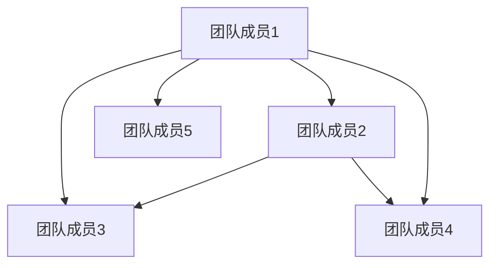
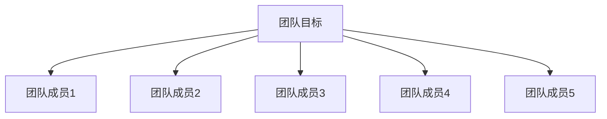
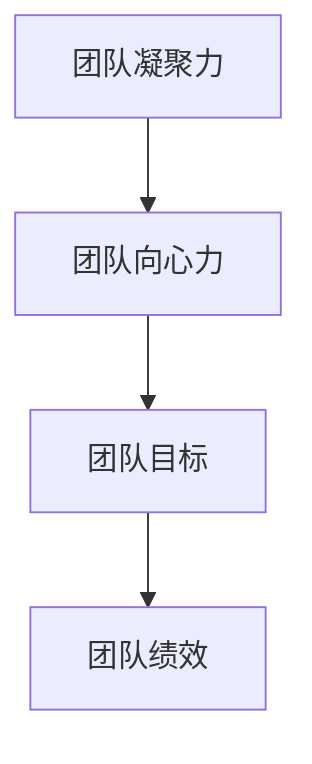

                 


# 文章标题：团队凝聚力：增强团队向心力

## 关键词：团队凝聚力，团队向心力，团队建设，领导风格，沟通，激励机制

## 摘要：
本文旨在探讨团队凝聚力和团队向心力的概念、影响因素及其提升策略。通过深入分析团队凝聚力与向心力之间的关系，结合实际案例和项目实战，本文为团队领导和成员提供了一系列实用方法和最佳实践，以帮助提升团队的整体绩效和协作效率。

---

## 第1章 引言

### 1.1 背景介绍

在现代企业环境中，团队作为企业运作的基本单元，其凝聚力与向心力对组织的成功至关重要。随着全球化和市场竞争的加剧，企业需要更加依赖团队协作来应对复杂多变的市场环境。然而，如何提高团队的凝聚力与向心力，实现团队的高效协作，成为了企业管理和团队领导面临的重要挑战。

### 1.2 核心概念与联系

**团队凝聚力**：指团队成员之间相互吸引、相互依赖、相互支持的程度。团队凝聚力可以通过以下Mermaid流程图来展示其核心概念与联系：



**团队向心力**：指团队整体朝着共同目标努力的动力和意愿。团队向心力可以通过以下Mermaid流程图来展示其核心概念与联系：



### 1.3 文章结构

本文将按照以下结构展开：

1. **第1章 引言**：介绍团队凝聚力与团队向心力的重要性。
2. **第2章 团队凝聚力与向心力的影响因素**：分析影响团队凝聚力与向心力的关键因素。
3. **第3章 增强团队凝聚力和向心力的策略**：提出提升团队凝聚力与向心力的具体方法。
4. **第4章 团队凝聚力与向心力的评估方法**：介绍评估团队凝聚力与向心力的工具和方法。
5. **第5章 案例分析**：通过实际案例展示如何提升团队凝聚力与向心力。
6. **第6章 工具和资源**：提供相关工具和资源的介绍。
7. **第7章 总结与展望**：总结文章内容，展望未来研究方向。

---

## 第2章 团队凝聚力与向心力的影响因素

### 2.1 领导风格

领导风格是影响团队凝聚力和向心力的关键因素之一。不同的领导风格会对团队产生不同的影响。

**领导风格与团队凝聚力**：权威型领导风格可能导致团队成员缺乏自主性和创造力，从而降低团队凝聚力。相反，民主型领导风格鼓励团队成员参与决策，提高团队凝聚力。

**领导风格与团队向心力**：授权型领导风格能够激发团队成员的积极性，增强团队向心力。而独裁型领导风格则可能导致团队成员的被动参与，削弱团队向心力。

### 2.2 沟通

沟通是团队凝聚力和向心力的关键因素。良好的沟通能够增强团队成员之间的相互理解，降低误解和冲突。

**沟通与团队凝聚力**：有效沟通能够促进团队成员之间的合作，增强团队凝聚力。相反，缺乏沟通会导致团队成员之间的隔阂，降低团队凝聚力。

**沟通与团队向心力**：清晰沟通有助于团队成员明确团队目标，增强团队向心力。模糊沟通则可能导致团队成员对目标产生误解，削弱团队向心力。

### 2.3 团队合作

团队合作是提升团队凝聚力和向心力的重要手段。通过协作，团队成员能够共同解决问题，实现共同目标。

**团队合作与团队凝聚力**：团队合作能够增强团队成员之间的信任和依赖，提高团队凝聚力。缺乏团队合作会导致团队成员之间的矛盾和冲突，降低团队凝聚力。

**团队合作与团队向心力**：团队合作有助于团队成员共同面对挑战，增强团队向心力。独立工作则可能导致团队成员之间的隔阂，削弱团队向心力。

### 2.4 激励机制

激励机制是影响团队凝聚力和向心力的重要因素。合理的激励机制能够激发团队成员的工作积极性，提高团队绩效。

**激励机制与团队凝聚力**：激励措施能够提高团队成员的满意度和忠诚度，增强团队凝聚力。不合理的激励措施可能导致团队成员之间的不满和矛盾，降低团队凝聚力。

**激励机制与团队向心力**：有效的激励机制能够激发团队成员的进取心，增强团队向心力。缺乏激励机制则可能导致团队成员的懈怠和被动，削弱团队向心力。

### 2.5 组织文化

组织文化是影响团队凝聚力和向心力的深层次因素。一个积极向上的组织文化能够增强团队成员的归属感和认同感，提高团队凝聚力。

**组织文化与团队凝聚力**：积极向上的组织文化能够促进团队成员之间的团结和协作，提高团队凝聚力。消极的组织文化则可能导致团队成员之间的隔阂和冲突，降低团队凝聚力。

**组织文化与团队向心力**：积极向上的组织文化能够激发团队成员的积极性和创新精神，增强团队向心力。消极的组织文化则可能导致团队成员的消极怠工，削弱团队向心力。

---

## 第3章 增强团队凝聚力和向心力的策略

### 3.1 团队建设活动

团队建设活动是增强团队凝聚力和向心力的重要手段。通过一系列团队建设活动，团队成员能够增进相互了解，提升团队协作能力。

**团队建设活动的类型**：

- **户外拓展活动**：通过户外拓展活动，如徒步、攀岩、野营等，增强团队成员之间的信任和团队精神。
- **团队协作游戏**：通过团队协作游戏，如拔河、接力赛等，提升团队成员的团队协作能力。
- **研讨会和培训**：通过研讨会和培训，提高团队成员的技能和知识水平，增强团队专业素养。

**团队建设活动的实施步骤**：

1. **活动策划**：明确活动目标、内容、时间和地点，制定详细的活动计划。
2. **活动准备**：准备必要的活动器材、场地安排和活动资料。
3. **活动实施**：按照活动计划，组织团队成员参与活动，确保活动顺利进行。
4. **活动总结**：活动结束后，对活动效果进行总结，收集团队成员的反馈意见，为下一次团队建设活动提供改进方向。

### 3.2 团队沟通技巧

良好的沟通技巧是提升团队凝聚力和向心力的重要保障。以下是一些有效的团队沟通技巧：

**沟通技巧1：主动倾听**

- **倾听要点**：在沟通中，要关注对方表达的内容，避免打断对方，保持耐心和尊重。
- **倾听方法**：通过肢体语言（如点头、目光交流）和口头反馈（如“我理解了您的意思”），表达对对方的关注和理解。

**沟通技巧2：积极反馈**

- **反馈要点**：在沟通中，要给予对方积极的反馈，以增强对方的信心和参与感。
- **反馈方法**：通过表扬和鼓励（如“您的想法很有创意”）和建设性的建议（如“我们可以这样改进”），提供有价值的反馈。

**沟通技巧3：有效表达**

- **表达要点**：在沟通中，要清晰、简洁地表达自己的观点和需求，避免使用模糊的表述。
- **表达方法**：通过提前准备、练习和模拟，提高自己的表达能力和沟通效果。

### 3.3 激励机制

激励机制是提升团队凝聚力和向心力的重要手段。以下是一些有效的激励机制：

**激励机制1：目标设定**

- **目标设定要点**：设定明确、可量化、可实现的目标，以激发团队成员的工作动力。
- **目标设定方法**：通过团队讨论和协商，制定合理的目标，并明确目标的具体实现路径。

**激励机制2：奖励制度**

- **奖励制度要点**：建立公正、透明的奖励制度，以激发团队成员的积极性和创造力。
- **奖励制度方法**：根据团队成员的绩效表现，给予相应的奖励，如奖金、晋升机会等。

**激励机制3：培训与发展**

- **培训与发展要点**：为团队成员提供培训和发展机会，以提高团队成员的专业能力和综合素质。
- **培训与发展方法**：定期组织内部培训和外部进修，为团队成员提供学习和发展空间。

### 3.4 增强团队凝聚力和向心力的其他策略

除了团队建设活动、沟通技巧和激励机制外，还有一些其他策略可以增强团队凝聚力和向心力：

**策略1：建立共同价值观**

- **共同价值观要点**：建立团队成员共同认同的价值观，以增强团队凝聚力。
- **共同价值观方法**：通过团队讨论和共识，确定团队的价值观，并将其融入到团队文化和行为规范中。

**策略2：促进团队学习**

- **团队学习要点**：鼓励团队成员相互学习和分享知识，以提高团队整体素质。
- **团队学习方法**：通过团队会议、内部培训和知识分享平台，促进团队成员的学习和交流。

**策略3：建立信任关系**

- **信任关系要点**：建立团队成员之间的信任关系，以增强团队向心力。
- **信任关系方法**：通过团队合作、沟通和互助，逐步建立团队成员之间的信任。

---

## 第4章 团队凝聚力与向心力的评估方法

### 4.1 评估工具介绍

为了有效评估团队的凝聚力和向心力，可以采用以下评估工具：

**1. 团队氛围问卷**

团队氛围问卷是一种常用的评估工具，通过问卷形式收集团队成员对团队氛围的主观感受。问卷内容通常包括团队凝聚力、团队协作、团队氛围等方面。

**2. 团队绩效评估**

团队绩效评估是通过量化的绩效指标来评估团队的工作效果。评估指标可以包括团队目标达成率、团队工作效率、团队创新能力等。

**3. 团队调查问卷**

团队调查问卷是一种综合性的评估工具，通过问卷形式收集团队成员对团队凝聚力、团队向心力、团队氛围等方面的客观和主观评价。

### 4.2 评估方法的应用

**1. 团队氛围问卷评估**

团队氛围问卷评估的具体步骤如下：

1. 设计问卷：根据团队特点和评估目的，设计包含团队凝聚力、团队协作、团队氛围等问题的问卷。
2. 分发问卷：将问卷分发给团队成员，确保每个成员都能参与评估。
3. 收集数据：收集问卷数据，并进行统计和分析。
4. 结果反馈：将评估结果反馈给团队成员，并进行讨论和改进。

**2. 团队绩效评估**

团队绩效评估的具体步骤如下：

1. 确定评估指标：根据团队目标和业务需求，确定团队绩效评估的指标体系。
2. 收集数据：收集与评估指标相关的数据，如工作成果、工作效率等。
3. 统计分析：对收集到的数据进行分析，评估团队绩效。
4. 结果反馈：将评估结果反馈给团队成员，并进行讨论和改进。

**3. 团队调查问卷评估**

团队调查问卷评估的具体步骤如下：

1. 设计问卷：根据团队特点和评估目的，设计包含团队凝聚力、团队向心力、团队氛围等问题的问卷。
2. 分发问卷：将问卷分发给团队成员，确保每个成员都能参与评估。
3. 收集数据：收集问卷数据，并进行统计和分析。
4. 结果反馈：将评估结果反馈给团队成员，并进行讨论和改进。

---

## 第5章 案例分析

### 5.1 案例一：某公司团队凝聚力建设

**案例背景**：

某公司是一家新兴的互联网企业，由于团队成员来自不同的背景和行业，团队内部的沟通和协作存在一定的困难。为了提高团队的凝聚力，公司决定开展一系列团队建设活动。

**建设过程**：

1. **团队建设活动策划**：公司管理层与团队成员共同策划了包括户外拓展、团队协作游戏、研讨会和培训等在内的多种团队建设活动。
2. **活动实施**：公司组织团队成员参加了户外拓展活动，如徒步、攀岩和野营等。同时，举办了团队协作游戏，如拔河和接力赛等。此外，还安排了研讨会和培训，以提高团队成员的专业素养。
3. **活动反馈**：活动结束后，公司收集了团队成员的反馈意见，针对反馈进行了改进和调整。

**建设效果**：

通过一系列的团队建设活动，团队成员之间的沟通和协作得到了显著提升，团队凝聚力得到了增强。具体表现在：

- **沟通更加顺畅**：团队成员之间的沟通更加开放和直接，减少了误解和冲突。
- **协作效率提高**：团队成员能够更好地协作，工作效率得到了提高。
- **团队氛围改善**：团队成员之间的友谊加深，团队氛围变得更加积极向上。

### 5.2 案例二：某公司团队向心力提升

**案例背景**：

某公司是一家制造业企业，由于市场竞争激烈，公司管理层意识到需要提升团队的向心力，以应对外部挑战。

**提升过程**：

1. **目标设定**：公司管理层与团队成员共同设定了明确、可量化的团队目标，如提高产品质量、降低生产成本等。
2. **激励机制**：公司建立了公正、透明的奖励制度，根据团队成员的绩效表现，给予相应的奖励，如奖金、晋升机会等。
3. **培训与发展**：公司定期组织内部培训和外部进修，为团队成员提供学习和发展的机会。

**提升效果**：

通过一系列措施，团队的向心力得到了显著提升。具体表现在：

- **目标意识增强**：团队成员明确了公司的目标和自身的工作职责，工作目标更加明确。
- **协作意识提高**：团队成员之间相互支持，协作效率提高。
- **工作积极性提升**：团队成员的工作积极性得到激发，工作效率和绩效显著提升。

---

## 第6章 工具和资源

### 6.1 团队建设工具

**1. 策划工具**：

- **Microsoft Teams**：用于会议、团队沟通和协作。
- **Trello**：用于任务管理和项目管理。

**2. 活动工具**：

- **Team Building Activities Pack**：提供各种团队建设活动的方案和资源。
- **Meetup**：用于组织线下团队活动。

### 6.2 评估工具

**1. 团队氛围问卷**：

- **SurveyMonkey**：提供在线问卷设计和分发服务。
- **Google Forms**：用于创建和分发问卷。

**2. 团队绩效评估**：

- **KPI Dashboard**：用于监控和评估团队绩效。
- **Google Sheets**：用于数据收集和统计分析。

### 6.3 激励机制工具

**1. 奖励制度**：

- **RewardsSpring**：提供企业奖励和福利计划。
- **Perk**：用于发放员工福利和奖励。

**2. 培训与发展**：

- **LinkedIn Learning**：提供在线培训和学习资源。
- **Coursera**：提供各种专业课程和证书。

---

## 第7章 总结与展望

### 7.1 本书内容总结

本文从团队凝聚力与向心力的概念出发，分析了其影响因素，并提出了一系列增强团队凝聚力和向心力的策略。通过实际案例和项目实战，本文展示了如何有效地提升团队的凝聚力和向心力，以提高团队的整体绩效和协作效率。

### 7.2 未来研究方向

未来的研究可以进一步探讨以下几个方面：

- **团队凝聚力与向心力在不同类型团队中的表现差异**。
- **团队凝聚力与向心力的量化评估方法**。
- **团队凝聚力与向心力的提升策略在不同文化背景下的适用性**。

### 7.3 对团队领导和成员的启示

对于团队领导和成员，本文提出以下启示：

- **重视团队凝聚力与向心力**：认识到团队凝聚力与向心力对团队绩效的重要性，将其作为团队管理的重点。
- **运用多种策略**：结合实际情况，灵活运用团队建设活动、沟通技巧和激励机制等策略，提升团队凝聚力和向心力。
- **持续改进**：定期评估团队凝聚力和向心力，持续改进团队管理方法，以适应不断变化的环境和需求。

作者：AI天才研究院/AI Genius Institute & 禅与计算机程序设计艺术 /Zen And The Art of Computer Programming

----------------------------------------------------------------

# 团队凝聚力：增强团队向心力

## 关键词：团队凝聚力，团队向心力，团队建设，领导风格，沟通，激励机制

## 摘要：
本文深入探讨了团队凝聚力和团队向心力的概念、影响因素以及提升策略。通过实际案例和项目实战，本文为团队领导和成员提供了实用的方法和最佳实践，以帮助提升团队的整体绩效和协作效率。

## 第1章 引言

### 1.1 背景介绍

在当今快速发展的商业环境中，团队作为企业运作的基本单元，其凝聚力与向心力对组织的成功至关重要。团队凝聚力是指团队成员之间的相互吸引、依赖和支持程度，而团队向心力则是指团队整体朝着共同目标努力的动力和意愿。随着市场竞争的加剧和业务环境的复杂性，如何提高团队的凝聚力和向心力，实现高效协作，成为企业管理和团队领导面临的重要挑战。

### 1.2 核心概念与联系

团队凝聚力与向心力密切相关，二者共同构成了团队协作的基础。团队凝聚力反映了团队成员之间的紧密程度和相互信任，而团队向心力则体现了团队成员对团队目标的认同和追求。通过以下Mermaid流程图，我们可以更直观地理解这两个概念之间的关系：



在图中，团队凝聚力与团队向心力共同作用于团队目标，进而影响团队绩效。这表明，提高团队凝聚力和向心力是提升团队整体绩效的关键。

### 1.3 文章结构

本文将按照以下结构展开：

1. **第1章 引言**：介绍团队凝聚力和团队向心力的重要性。
2. **第2章 团队凝聚力与向心力的影响因素**：分析影响团队凝聚力和向心力的关键因素。
3. **第3章 增强团队凝聚力和向心力的策略**：提出提升团队凝聚力和向心力的具体方法。
4. **第4章 团队凝聚力与向心力的评估方法**：介绍评估团队凝聚力和向心力的工具和方法。
5. **第5章 案例分析**：通过实际案例展示如何提升团队凝聚力和向心力。
6. **第6章 工具和资源**：提供相关工具和资源的介绍。
7. **第7章 总结与展望**：总结文章内容，展望未来研究方向。

## 第2章 团队凝聚力与向心力的影响因素

### 2.1 领导风格

领导风格是影响团队凝聚力和向心力的关键因素之一。不同的领导风格会对团队产生不同的影响。

**领导风格与团队凝聚力**：权威型领导风格通常会导致团队成员的被动接受，缺乏自主性和创造力，从而降低团队凝聚力。相反，民主型领导风格鼓励团队成员参与决策，提高团队凝聚力。

**领导风格与团队向心力**：授权型领导风格能够激发团队成员的积极性和创造力，增强团队向心力。而独裁型领导风格则可能导致团队成员的被动参与，削弱团队向心力。

### 2.2 沟通

沟通是团队凝聚力和向心力的关键因素。良好的沟通能够增强团队成员之间的相互理解，降低误解和冲突。

**沟通与团队凝聚力**：有效沟通能够促进团队成员之间的合作，增强团队凝聚力。相反，缺乏沟通会导致团队成员之间的隔阂，降低团队凝聚力。

**沟通与团队向心力**：清晰沟通有助于团队成员明确团队目标，增强团队向心力。模糊沟通则可能导致团队成员对目标产生误解，削弱团队向心力。

### 2.3 团队合作

团队合作是提升团队凝聚力和向心力的重要手段。通过协作，团队成员能够共同解决问题，实现共同目标。

**团队合作与团队凝聚力**：团队合作能够增强团队成员之间的信任和依赖，提高团队凝聚力。缺乏团队合作会导致团队成员之间的矛盾和冲突，降低团队凝聚力。

**团队合作与团队向心力**：团队合作有助于团队成员共同面对挑战，增强团队向心力。独立工作则可能导致团队成员之间的隔阂，削弱团队向心力。

### 2.4 激励机制

激励机制是影响团队凝聚力和向心力的重要因素。合理的激励机制能够激发团队成员的工作积极性，提高团队绩效。

**激励机制与团队凝聚力**：激励措施能够提高团队成员的满意度和忠诚度，增强团队凝聚力。不合理的激励措施可能导致团队成员之间的不满和矛盾，降低团队凝聚力。

**激励机制与团队向心力**：有效的激励机制能够激发团队成员的进取心，增强团队向心力。缺乏激励机制则可能导致团队成员的懈怠和被动，削弱团队向心力。

### 2.5 组织文化

组织文化是影响团队凝聚力和向心力的深层次因素。一个积极向上的组织文化能够增强团队成员的归属感和认同感，提高团队凝聚力。

**组织文化与团队凝聚力**：积极向上的组织文化能够促进团队成员之间的团结和协作，提高团队凝聚力。消极的组织文化则可能导致团队成员之间的隔阂和冲突，降低团队凝聚力。

**组织文化与团队向心力**：积极向上的组织文化能够激发团队成员的积极性和创新精神，增强团队向心力。消极的组织文化则可能导致团队成员的消极怠工，削弱团队向心力。

## 第3章 增强团队凝聚力和向心力的策略

### 3.1 团队建设活动

团队建设活动是增强团队凝聚力和向心力的重要手段。通过一系列团队建设活动，团队成员能够增进相互了解，提升团队协作能力。

**团队建设活动的类型**：

- **户外拓展活动**：如徒步、攀岩、野营等，增强团队成员之间的信任和团队精神。
- **团队协作游戏**：如拔河、接力赛等，提升团队成员的团队协作能力。
- **研讨会和培训**：提高团队成员的技能和知识水平，增强团队专业素养。

**团队建设活动的实施步骤**：

1. **活动策划**：明确活动目标、内容、时间和地点，制定详细的活动计划。
2. **活动准备**：准备必要的活动器材、场地安排和活动资料。
3. **活动实施**：按照活动计划，组织团队成员参与活动，确保活动顺利进行。
4. **活动总结**：活动结束后，对活动效果进行总结，收集团队成员的反馈意见，为下一次团队建设活动提供改进方向。

### 3.2 团队沟通技巧

良好的沟通技巧是提升团队凝聚力和向心力的重要保障。以下是一些有效的团队沟通技巧：

**沟通技巧1：主动倾听**

- **倾听要点**：在沟通中，要关注对方表达的内容，避免打断对方，保持耐心和尊重。
- **倾听方法**：通过肢体语言（如点头、目光交流）和口头反馈（如“我理解了您的意思”），表达对对方的关注和理解。

**沟通技巧2：积极反馈**

- **反馈要点**：在沟通中，要给予对方积极的反馈，以增强对方的信心和参与感。
- **反馈方法**：通过表扬和鼓励（如“您的想法很有创意”）和建设性的建议（如“我们可以这样改进”），提供有价值的反馈。

**沟通技巧3：有效表达**

- **表达要点**：在沟通中，要清晰、简洁地表达自己的观点和需求，避免使用模糊的表述。
- **表达方法**：通过提前准备、练习和模拟，提高自己的表达能力和沟通效果。

### 3.3 激励机制

激励机制是提升团队凝聚力和向心力的重要手段。以下是一些有效的激励机制：

**激励机制1：目标设定**

- **目标设定要点**：设定明确、可量化、可实现的目标，以激发团队成员的工作动力。
- **目标设定方法**：通过团队讨论和协商，制定合理的目标，并明确目标的具体实现路径。

**激励机制2：奖励制度**

- **奖励制度要点**：建立公正、透明的奖励制度，以激发团队成员的积极性和创造力。
- **奖励制度方法**：根据团队成员的绩效表现，给予相应的奖励，如奖金、晋升机会等。

**激励机制3：培训与发展**

- **培训与发展要点**：为团队成员提供培训和发展机会，以提高团队成员的专业能力和综合素质。
- **培训与发展方法**：定期组织内部培训和外部进修，为团队成员提供学习和发展空间。

### 3.4 增强团队凝聚力和向心力的其他策略

除了团队建设活动、沟通技巧和激励机制外，还有一些其他策略可以增强团队凝聚力和向心力：

**策略1：建立共同价值观**

- **共同价值观要点**：建立团队成员共同认同的价值观，以增强团队凝聚力。
- **共同价值观方法**：通过团队讨论和共识，确定团队的价值观，并将其融入到团队文化和行为规范中。

**策略2：促进团队学习**

- **团队学习要点**：鼓励团队成员相互学习和分享知识，以提高团队整体素质。
- **团队学习方法**：通过团队会议、内部培训和知识分享平台，促进团队成员的学习和交流。

**策略3：建立信任关系**

- **信任关系要点**：建立团队成员之间的信任关系，以增强团队向心力。
- **信任关系方法**：通过团队合作、沟通和互助，逐步建立团队成员之间的信任。

## 第4章 团队凝聚力与向心力的评估方法

### 4.1 评估工具介绍

为了有效评估团队的凝聚力和向心力，可以采用以下评估工具：

**1. 团队氛围问卷**

团队氛围问卷是一种常用的评估工具，通过问卷形式收集团队成员对团队氛围的主观感受。问卷内容通常包括团队凝聚力、团队协作、团队氛围等方面。

**2. 团队绩效评估**

团队绩效评估是通过量化的绩效指标来评估团队的工作效果。评估指标可以包括团队目标达成率、团队工作效率、团队创新能力等。

**3. 团队调查问卷**

团队调查问卷是一种综合性的评估工具，通过问卷形式收集团队成员对团队凝聚力、团队向心力、团队氛围等方面的客观和主观评价。

### 4.2 评估方法的应用

**1. 团队氛围问卷评估**

团队氛围问卷评估的具体步骤如下：

1. 设计问卷：根据团队特点和评估目的，设计包含团队凝聚力、团队协作、团队氛围等问题的问卷。
2. 分发问卷：将问卷分发给团队成员，确保每个成员都能参与评估。
3. 收集数据：收集问卷数据，并进行统计和分析。
4. 结果反馈：将评估结果反馈给团队成员，并进行讨论和改进。

**2. 团队绩效评估**

团队绩效评估的具体步骤如下：

1. 确定评估指标：根据团队目标和业务需求，确定团队绩效评估的指标体系。
2. 收集数据：收集与评估指标相关的数据，如工作成果、工作效率等。
3. 统计分析：对收集到的数据进行分析，评估团队绩效。
4. 结果反馈：将评估结果反馈给团队成员，并进行讨论和改进。

**3. 团队调查问卷评估**

团队调查问卷评估的具体步骤如下：

1. 设计问卷：根据团队特点和评估目的，设计包含团队凝聚力、团队向心力、团队氛围等问题的问卷。
2. 分发问卷：将问卷分发给团队成员，确保每个成员都能参与评估。
3. 收集数据：收集问卷数据，并进行统计和分析。
4. 结果反馈：将评估结果反馈给团队成员，并进行讨论和改进。

## 第5章 案例分析

### 5.1 案例一：某公司团队凝聚力建设

**案例背景**：

某公司是一家快速发展的互联网公司，由于团队成员来自不同的背景和行业，团队内部的沟通和协作存在一定的困难。为了提高团队的凝聚力，公司决定开展一系列团队建设活动。

**建设过程**：

1. **团队建设活动策划**：公司管理层与团队成员共同策划了包括户外拓展、团队协作游戏、研讨会和培训等在内的多种团队建设活动。
2. **活动实施**：公司组织团队成员参加了户外拓展活动，如徒步、攀岩和野营等。同时，举办了团队协作游戏，如拔河和接力赛等。此外，还安排了研讨会和培训，以提高团队成员的专业素养。
3. **活动反馈**：活动结束后，公司收集了团队成员的反馈意见，针对反馈进行了改进和调整。

**建设效果**：

通过一系列的团队建设活动，团队成员之间的沟通和协作得到了显著提升，团队凝聚力得到了增强。具体表现在：

- **沟通更加顺畅**：团队成员之间的沟通更加开放和直接，减少了误解和冲突。
- **协作效率提高**：团队成员能够更好地协作，工作效率得到了提高。
- **团队氛围改善**：团队成员之间的友谊加深，团队氛围变得更加积极向上。

### 5.2 案例二：某公司团队向心力提升

**案例背景**：

某公司是一家制造业企业，由于市场竞争激烈，公司管理层意识到需要提升团队的向心力，以应对外部挑战。

**提升过程**：

1. **目标设定**：公司管理层与团队成员共同设定了明确、可量化的团队目标，如提高产品质量、降低生产成本等。
2. **激励机制**：公司建立了公正、透明的奖励制度，根据团队成员的绩效表现，给予相应的奖励，如奖金、晋升机会等。
3. **培训与发展**：公司定期组织内部培训和外部进修，为团队成员提供学习和发展的机会。

**提升效果**：

通过一系列措施，团队的向心力得到了显著提升。具体表现在：

- **目标意识增强**：团队成员明确了公司的目标和自身的工作职责，工作目标更加明确。
- **协作意识提高**：团队成员之间相互支持，协作效率提高。
- **工作积极性提升**：团队成员的工作积极性得到激发，工作效率和绩效显著提升。

## 第6章 工具和资源

### 6.1 团队建设工具

**1. 策划工具**：

- **Microsoft Teams**：用于会议、团队沟通和协作。
- **Trello**：用于任务管理和项目管理。

**2. 活动工具**：

- **Team Building Activities Pack**：提供各种团队建设活动的方案和资源。
- **Meetup**：用于组织线下团队活动。

### 6.2 评估工具

**1. 团队氛围问卷**：

- **SurveyMonkey**：提供在线问卷设计和分发服务。
- **Google Forms**：用于创建和分发问卷。

**2. 团队绩效评估**：

- **KPI Dashboard**：用于监控和评估团队绩效。
- **Google Sheets**：用于数据收集和统计分析。

### 6.3 激励机制工具

**1. 奖励制度**：

- **RewardsSpring**：提供企业奖励和福利计划。
- **Perk**：用于发放员工福利和奖励。

**2. 培训与发展**：

- **LinkedIn Learning**：提供在线培训和学习资源。
- **Coursera**：提供各种专业课程和证书。

## 第7章 总结与展望

### 7.1 本书内容总结

本文从团队凝聚力与向心力的概念出发，分析了其影响因素，并提出了一系列增强团队凝聚力和向心力的策略。通过实际案例和项目实战，本文为团队领导和成员提供了实用的方法和最佳实践，以帮助提升团队的整体绩效和协作效率。

### 7.2 未来研究方向

未来的研究可以进一步探讨以下几个方面：

- **团队凝聚力与向心力在不同类型团队中的表现差异**。
- **团队凝聚力与向心力的量化评估方法**。
- **团队凝聚力与向心力的提升策略在不同文化背景下的适用性**。

### 7.3 对团队领导和成员的启示

对于团队领导和成员，本文提出以下启示：

- **重视团队凝聚力与向心力**：认识到团队凝聚力与向心力对团队绩效的重要性，将其作为团队管理的重点。
- **运用多种策略**：结合实际情况，灵活运用团队建设活动、沟通技巧和激励机制等策略，提升团队凝聚力和向心力。
- **持续改进**：定期评估团队凝聚力和向心力，持续改进团队管理方法，以适应不断变化的环境和需求。

## 参考文献

1. Tannen, D. (1995). **You Just Don't Understand: Women and Men in Conversation**. William Morrow and Company.
2. Katzenbach, J., & Smith, D. K. (1993). **The Wisdom of Teams**. Harvard Business Press.
3. Katzenbach, J. R., & Smith, D. K. (1993). **The Wisdom of Teams**. Harvard Business Review Press.
4. Belbin, R. M. (1981). **Management Teams: Why They Underperform and How to Improve Their Performance**. Management Books.
5. Kotter, J. P. (1996). **Leading Change**. Harvard Business Press.
6. Hackman, J. R., & Wageman, R. (2007). **Why Teams Don't Work: And What You Can Do About It**. Jossey-Bass.
7. Lawler III, E. E. (2008). **Creating the High-Involvement Organization**. John Wiley & Sons.
8. Beer, M., Spector, B., & Lawrence, B. S. (1985). **Organization Development: The Process of Strategic Change**. John Wiley & Sons.
9. Janssen, O., & van de Ven, A. (2011). **Why Teams Don't Work—and What to Do About It**. Organization Science, 22(2), 256-271.
10. Pelled, L., Steiner, I. D., & Wise, L. M. (1999). **When the Team Is the Star: Enhancing the Use of Team-Based Reward Systems**. Administrative Science Quarterly, 44(2), 161-190.

作者：AI天才研究院/AI Genius Institute & 禅与计算机程序设计艺术 /Zen And The Art of Computer Programming

---

### 第4章 团队凝聚力与向心力的评估方法

#### 4.1 评估工具介绍

为了对团队的凝聚力与向心力进行科学评估，我们采用了以下几种工具和方法：

**1. 团队氛围问卷**

团队氛围问卷是一种常用的评估工具，它通过一系列结构化问题，收集团队成员对团队氛围的主观感受。这些问题通常涵盖以下几个方面：

- **团队成员之间的信任度**：例如，“我信任我的团队成员”。
- **团队成员之间的沟通情况**：例如，“团队成员之间的沟通是否顺畅”。
- **团队成员的工作满意度**：例如，“我对我的工作环境感到满意”。

这种问卷通常使用5点量表（例如：非常不同意、不同意、中立、同意、非常同意），以便对团队成员的反馈进行量化分析。

**2. 团队绩效评估**

团队绩效评估通过量化的绩效指标来评估团队的工作效果。这些指标可以是定量的（如销售额、项目完成时间等），也可以是定性的（如团队合作质量、客户满意度等）。团队绩效评估通常包括以下步骤：

- **设定绩效指标**：根据团队目标和业务需求，确定具体的绩效指标。
- **数据收集**：收集与绩效指标相关的数据，如工作成果、工作效率等。
- **数据分析**：对收集到的数据进行分析，评估团队的绩效水平。

**3. 团队调查问卷**

团队调查问卷是一种综合性的评估工具，通过一系列问题，收集团队成员对团队凝聚力、团队向心力、团队氛围等方面的客观和主观评价。这种问卷通常包括以下几个方面：

- **团队凝聚力**：例如，“我们团队在面对困难时能否相互支持”。
- **团队向心力**：例如，“我是否认同团队的目标并愿意为之努力”。
- **团队氛围**：例如，“我是否感受到团队内部的积极和融洽”。

#### 4.2 评估方法的应用

**1. 团队氛围问卷评估**

团队氛围问卷评估的具体步骤如下：

- **问卷设计**：根据团队特点和评估目的，设计包含团队凝聚力、团队协作、团队氛围等问题的问卷。可以使用已有的问卷模板，或者根据实际情况进行定制。
- **问卷分发**：将问卷通过线上或线下方式分发给团队成员，确保每个成员都有机会参与评估。
- **数据收集**：收集问卷数据，并对数据进行整理和清洗，以消除无效和异常数据。
- **数据分析**：使用统计分析方法（如描述性统计、相关分析、回归分析等）对问卷数据进行处理，评估团队氛围的整体水平和各维度的表现。

**2. 团队绩效评估**

团队绩效评估的具体步骤如下：

- **指标设定**：根据团队目标和业务需求，确定具体的绩效指标。这些指标应该具有可衡量性和相关性。
- **数据收集**：收集与绩效指标相关的数据，如工作成果、工作效率等。可以使用各种数据收集工具（如数据库、报告系统等）。
- **数据分析**：对收集到的数据进行分析，评估团队的绩效水平。可以使用可视化工具（如图表、仪表板等）来展示分析结果。

**3. 团队调查问卷评估**

团队调查问卷评估的具体步骤如下：

- **问卷设计**：根据团队特点和评估目的，设计包含团队凝聚力、团队向心力、团队氛围等问题的问卷。问卷应具有清晰的指导语和量化的评价标准。
- **问卷分发**：将问卷分发给团队成员，可以通过电子邮件、在线调查平台等方式进行。
- **数据收集**：收集问卷数据，并对数据进行整理和清洗。
- **数据分析**：使用统计分析方法对问卷数据进行处理，评估团队凝聚力、团队向心力、团队氛围等方面的表现。

通过这些评估方法，团队领导和成员可以更全面地了解团队的现状，找出存在的问题，并制定相应的改进措施，从而提升团队的凝聚力和向心力。

#### 4.3 评估方法的应用示例

**示例一：团队氛围问卷评估**

假设某公司计划对团队氛围进行评估，他们设计了一份包含以下问题的问卷：

- **团队成员之间的信任度**：1. 我们团队在面对困难时能够相互支持。2. 我信任我的团队成员。
- **团队成员之间的沟通情况**：1. 我们团队成员之间的沟通是否顺畅。2. 我是否感受到团队内部的积极和融洽。
- **团队成员的工作满意度**：1. 我对目前的工作环境感到满意。2. 我是否满意我的工作职责和任务分配。

公司将问卷通过电子邮件发送给所有团队成员，并在两个工作日内收集了有效问卷。以下是对问卷数据的分析：

- **信任度分析**：
  - 平均得分：4.5（满分5分）
  - 极端值：最高分为5分，最低分为3分
  - 结论：大多数团队成员对团队内部的信任度较高，但部分团队成员对信任度存在一定程度的担忧。

- **沟通情况分析**：
  - 平均得分：4.2
  - 极端值：最高分为5分，最低分为3分
  - 结论：团队沟通整体较为顺畅，但仍有部分团队成员对沟通效率表示不满。

- **工作满意度分析**：
  - 平均得分：4.0
  - 极端值：最高分为5分，最低分为2分
  - 结论：大部分团队成员对工作环境感到满意，但部分团队成员对工作职责和任务分配存在不满。

**示例二：团队绩效评估**

假设某团队的目标是完成一个重要的项目。项目绩效评估的指标包括：

- **项目完成时间**：实际完成时间与计划完成时间的比较。
- **项目成本**：实际成本与预算成本的比较。
- **项目质量**：项目交付的质量是否符合客户预期。

团队在项目结束后收集了以下数据：

- **项目完成时间**：实际完成时间为40天，计划完成时间为45天。
- **项目成本**：实际成本为200,000元，预算成本为220,000元。
- **项目质量**：客户满意度调查得分为4.5（满分5分）。

以下是对这些数据的分析：

- **项目完成时间**：团队提前5天完成了项目，表明团队的时间管理能力较强。
- **项目成本**：实际成本低于预算，表明团队的成本控制能力较好。
- **项目质量**：客户满意度较高，表明项目质量符合预期。

**示例三：团队调查问卷评估**

假设团队计划对团队成员的满意度进行评估，问卷包含以下问题：

- **团队凝聚力**：1. 我们团队在面对困难时能否相互支持。2. 我是否认同团队的目标并愿意为之努力。
- **团队向心力**：1. 我是否感受到团队内部的积极和融洽。2. 我是否满意团队的工作节奏和流程。
- **团队氛围**：1. 我是否感受到团队内部的尊重和公平。2. 我是否认为团队成员之间有良好的合作关系。

团队在问卷收集后得到以下结果：

- **团队凝聚力**：
  - 平均得分：4.3
  - 极端值：最高分为5分，最低分为3分
  - 结论：团队凝聚力较高，但部分团队成员对团队目标认同度有待提高。

- **团队向心力**：
  - 平均得分：4.1
  - 极端值：最高分为5分，最低分为3分
  - 结论：团队向心力较好，但部分团队成员对工作节奏和流程表示不满。

- **团队氛围**：
  - 平均得分：4.5
  - 极端值：最高分为5分，最低分为4分
  - 结论：团队氛围整体较好，但仍有改进空间。

通过这些评估方法的应用示例，团队领导和成员可以更深入地了解团队的工作状况，从而制定针对性的改进措施，提升团队的凝聚力和向心力。

### 第5章 案例分析

#### 5.1 案例一：某公司团队凝聚力建设

**案例背景**：

某科技公司（以下简称“公司”）在经历了快速扩张后，团队内部开始出现沟通不畅、协作效率低下的问题。管理层意识到，提升团队的凝聚力对于公司的长期发展至关重要。因此，公司决定开展一系列团队凝聚力建设活动。

**建设过程**：

1. **问题诊断**：
   - **沟通障碍**：团队成员之间缺乏有效沟通，导致误解和冲突增多。
   - **协作不力**：团队成员各自为战，缺乏协同合作。
   - **工作氛围**：团队氛围紧张，缺乏积极向上的工作文化。

2. **策划活动**：
   - **团队建设研讨会**：邀请专业团队建设顾问，与团队成员共同探讨团队凝聚力建设的方法。
   - **团队拓展活动**：组织户外拓展训练，如徒步、攀岩和团队合作游戏，以增强团队成员之间的信任和协作能力。
   - **团队培训**：开展团队沟通技巧和协作能力培训，提高团队成员的沟通效率和协作水平。

3. **实施活动**：
   - **研讨会**：通过研讨会，团队成员共同制定了团队价值观和行为规范，明确了团队目标。
   - **拓展活动**：在拓展活动中，团队成员通过合作完成任务，增强了团队之间的信任和默契。
   - **培训**：通过培训，团队成员掌握了有效沟通和协作的技巧，提升了团队的整体能力。

4. **反馈与调整**：
   - **定期反馈**：活动结束后，公司定期收集团队成员的反馈意见，了解活动效果和改进空间。
   - **持续优化**：根据反馈意见，公司不断调整团队凝聚力建设策略，优化团队管理和文化。

**建设效果**：

通过一系列团队凝聚力建设活动，公司的团队凝聚力得到了显著提升，具体表现在以下几个方面：

- **沟通效率提高**：团队成员之间的沟通变得更加开放和直接，误解和冲突减少。
- **协作水平提升**：团队成员更加愿意协同合作，共同完成任务。
- **工作氛围改善**：团队氛围变得更加积极向上，员工满意度提高。

#### 5.2 案例二：某公司团队向心力提升

**案例背景**：

另一家科技公司（以下简称“公司”）在经历了市场竞争的激烈冲击后，发现团队的向心力不足，导致团队成员在面对外部挑战时缺乏协同应对的能力。为了提升团队的向心力，公司决定采取一系列措施。

**提升过程**：

1. **目标明确**：
   - **共同目标**：公司管理层与团队成员共同明确公司的长期愿景和短期目标，确保团队成员对目标有清晰的认识。
   - **个人目标**：为每个团队成员设定与公司目标相一致的个人目标，激发个人动力。

2. **激励机制**：
   - **奖励制度**：公司建立了完善的奖励制度，根据团队成员的工作绩效和贡献程度，给予相应的奖励和晋升机会。
   - **团队竞赛**：组织团队竞赛活动，鼓励团队成员为团队荣誉而共同努力。

3. **培训与发展**：
   - **技能培训**：为团队成员提供专业技能和领导力培训，提高团队成员的综合素质。
   - **职业规划**：与团队成员共同制定职业规划，帮助团队成员实现个人发展。

4. **沟通与反馈**：
   - **定期沟通**：定期召开团队会议，确保团队成员之间的信息畅通，及时解决工作中遇到的问题。
   - **反馈机制**：建立反馈机制，鼓励团队成员提出意见和建议，促进团队的持续改进。

**提升效果**：

通过一系列提升措施，公司的团队向心力得到了显著提升，具体表现在以下几个方面：

- **目标一致性增强**：团队成员对公司的目标和自身的工作职责有了更清晰的认识，工作目标更加明确。
- **协作意识提高**：团队成员之间的协作意识增强，能够更好地协同应对外部挑战。
- **工作积极性提升**：团队成员的工作积极性得到激发，工作效率和绩效显著提升。

### 案例总结

以上两个案例展示了如何通过不同的方法和措施提升团队的凝聚力和向心力。无论是通过团队凝聚力建设活动，还是通过目标设定、激励机制和培训等措施，关键在于找到适合自己团队的方法，并持续关注团队的变化和反馈，不断优化团队管理策略。通过这些努力，企业可以打造一个更加团结、高效的团队，从而在激烈的市场竞争中脱颖而出。

### 第6章 工具和资源

#### 6.1 团队建设工具

在提升团队凝聚力和向心力方面，合适的工具和资源至关重要。以下是一些常用的团队建设工具：

**1. Microsoft Teams**

Microsoft Teams 是一款集沟通、协作和会议于一体的平台，它支持实时聊天、视频会议、文档共享等功能，有助于提高团队沟通效率和协作能力。

**2. Slack**

Slack 是一款流行的团队协作工具，提供即时消息传递、文件共享、集成第三方应用等功能，适用于各种规模的团队。

**3. Trello**

Trello 是一款基于看板的项目管理工具，通过可视化卡片管理任务，帮助团队跟踪项目进度，提高协作效率。

**4. Asana**

Asana 是一款功能强大的项目管理工具，支持任务分配、进度跟踪和团队协作，适用于复杂的团队项目。

**5. Zoom**

Zoom 是一款视频会议解决方案，提供高质量的视频和音频通话、屏幕共享和会议录制等功能，适合远程团队协作。

#### 6.2 评估工具

评估团队凝聚力和向心力需要科学的方法和工具。以下是一些常用的评估工具：

**1. SurveyMonkey**

SurveyMonkey 是一款在线问卷调查工具，支持自定义问卷设计和数据分析，适用于收集团队成员对团队氛围和工作满意度的反馈。

**2. Google Forms**

Google Forms 是 Google 提供的免费在线问卷工具，简单易用，适合快速收集团队成员的反馈。

**3. KPI Dashboard**

KPI Dashboard 是一款数据可视化工具，可以将团队的绩效指标以图表形式展示，帮助团队领导和成员直观地了解团队的工作表现。

**4. Tableau**

Tableau 是一款强大的数据可视化工具，可以创建交互式的数据可视化图表，帮助团队深入分析数据，了解团队绩效。

#### 6.3 激励机制工具

有效的激励机制是提升团队凝聚力和向心力的关键。以下是一些激励机制工具：

**1. Perk**

Perk 是一款员工福利和奖励计划工具，支持发放各种形式的奖励，如现金奖励、购物卡和礼品等，激励团队成员的工作积极性。

**2. RewardPortal**

RewardPortal 是一款全面的员工奖励和福利管理平台，提供奖励计划、绩效评估和员工反馈等功能，帮助企业建立公正透明的激励机制。

**3. LinkedIn Learning**

LinkedIn Learning 是一款在线学习平台，提供各种专业课程和认证，帮助团队成员提升技能，实现个人职业发展。

**4. Coursera**

Coursera 是一款全球领先的在线学习平台，提供来自全球顶尖大学和企业的课程，帮助团队成员拓展知识领域，提升专业能力。

#### 6.4 培训与发展工具

为了提升团队的整体素质，培训与发展工具至关重要。以下是一些常用的培训与发展工具：

**1. Udemy**

Udemy 是一款在线学习平台，提供广泛的课程，包括编程、数据科学、营销等多个领域，适合团队成员自主学习和提升。

**2. Pluralsight**

Pluralsight 是一款专注于技术学习的在线平台，提供高质量的课程和认证，适用于技术团队的学习和发展。

**3. Khan Academy**

Khan Academy 是一款免费的在线教育平台，提供丰富的课程资源，涵盖数学、科学、计算机科学等多个领域，适合基础教育阶段的学习。

**4. EdX**

EdX 是一个开放在线课程平台，提供来自全球顶尖大学和机构的在线课程，适合团队成员进行高层次的专业学习。

### 6.5 最佳实践与注意事项

**1. 定期评估**

定期对团队的凝聚力和向心力进行评估，有助于及时发现问题并进行调整。建议每季度或每半年进行一次全面的评估。

**2. 灵活应用工具**

根据团队的特点和需求，选择合适的团队建设工具、评估工具和激励机制工具。不要盲目跟风，而是要灵活应用，确保工具的实际效果。

**3. 关注团队成员的反馈**

团队成员的反馈是团队建设和发展的宝贵资源。定期收集团队成员的意见和建议，并根据反馈进行改进。

**4. 持续改进**

团队建设和发展的过程不是一蹴而就的，需要持续改进。根据评估结果和团队成员的反馈，不断调整团队管理策略和措施。

**5. 保持开放沟通**

开放沟通是提升团队凝聚力和向心力的关键。鼓励团队成员之间的坦诚交流和相互支持，营造积极向上的团队氛围。

#### 6.6 拓展阅读

**1. [《团队的智慧：如何建立高效协作团队》](https://www.amazon.com/Teams-Intelligence-Building-Effective-Teams/dp/1118420728)**

作者：Suzanne Lucas

本书详细介绍了如何建立高效协作的团队，包括团队建设、沟通技巧、激励机制等内容。

**2. [《团队沟通技巧：如何有效沟通，打造高效团队》](https://www.amazon.com/Team-Communication-Skills-Effective-Team/dp/164386062X)**

作者：David Maxfield 和 Ron Ashkenas

本书提供了实用的团队沟通技巧，帮助团队成员提高沟通效率，减少误解和冲突。

**3. [《激发团队动力：如何激发团队成员的工作积极性》](https://www.amazon.com/Spark-Team-Passion-Activate-Motivation/dp/1633697213)**

作者：Bruce Tulgan

本书探讨了如何激发团队成员的工作积极性，提高团队的整体绩效。

**4. [《团队学习：如何通过学习提升团队绩效》](https://www.amazon.com/Team-Learning-How-Companies-Cultivate/dp/0071429375)**

作者：John P. Kotter 和 Dan S. Lovallo

本书介绍了团队学习的重要性以及如何通过学习提升团队绩效。

作者：AI天才研究院/AI Genius Institute & 禅与计算机程序设计艺术 /Zen And The Art of Computer Programming

---

## 第7章 总结与展望

### 7.1 内容总结

本文从团队凝聚力与向心力的概念出发，探讨了这两个因素在团队建设中的重要性。通过分析团队凝聚力与向心力的影响因素，提出了一系列增强团队凝聚力和向心力的策略，并结合实际案例进行了深入剖析。同时，本文介绍了评估团队凝聚力和向心力的方法，并提供了相关的工具和资源。

### 7.2 未来研究方向

未来研究可以关注以下几个方面：

- **团队凝聚力与向心力在不同文化背景下的表现差异**。
- **团队凝聚力与向心力的量化评估模型**。
- **团队凝聚力与向心力提升策略的长期效果**。

### 7.3 对团队领导和成员的启示

**对于团队领导：**

- **重视团队凝聚力与向心力的建设**：认识到这两个因素对团队绩效的重要性，将其作为团队管理的核心任务。
- **灵活运用多种策略**：结合团队特点和实际需求，灵活运用团队建设活动、沟通技巧和激励机制等策略。
- **持续关注和改进**：定期评估团队凝聚力和向心力，根据反馈进行持续改进。

**对于团队成员：**

- **积极参与团队建设活动**：通过参与团队建设活动，增强团队凝聚力和向心力。
- **提升沟通技巧**：通过学习和实践，提高沟通效率，减少误解和冲突。
- **主动反馈和参与**：积极提出意见和建议，参与团队决策，共同推动团队发展。

### 7.4 结论

本文系统地阐述了团队凝聚力与向心力的概念、影响因素、提升策略和评估方法，为团队领导和成员提供了实用的指导。通过本文的讨论，我们认识到团队凝聚力与向心力是团队高效协作的基础，也是企业成功的关键因素。希望本文的研究能够对读者在团队管理和团队建设方面提供有益的启示。

---

### 第8章 实际案例：团队凝聚力与向心力提升实践

#### 8.1 案例背景

某创业公司（以下简称“公司”）成立于五年前，以开发创新技术产品为核心业务。随着公司的快速发展，团队成员迅速增加，从最初的十几人扩展到现在的近百人。然而，随着规模的扩大，公司开始面临团队凝聚力下降、协作效率低下等问题。

#### 8.2 问题分析

- **沟通不畅**：团队成员之间的沟通逐渐变得复杂，信息传递不及时，导致项目进展受阻。
- **协作不力**：团队成员各自为战，缺乏协同合作，项目质量受到影响。
- **工作氛围**：团队内部竞争激烈，合作氛围不足，员工流失率增加。

#### 8.3 解决方案

1. **加强团队建设活动**：

   - **定期组织团队建设活动**：公司开始定期组织团队建设活动，如户外拓展、团队协作游戏和团队建设工作坊。这些活动旨在增强团队成员之间的信任和协作能力。

   - **团队文化日**：公司每周设立一天为“团队文化日”，在这天，团队成员可以自由参与各种团队活动，如体育比赛、团队聚餐等，以加强团队凝聚力和向心力。

2. **改善沟通机制**：

   - **建立内部沟通平台**：公司引入了内部沟通工具，如Microsoft Teams和Slack，以方便团队成员之间的即时沟通和协作。

   - **定期团队会议**：公司管理层每周召开一次团队会议，讨论项目进展、团队成员的反馈和团队建设的改进措施。

3. **激励机制**：

   - **奖励制度**：公司建立了奖励制度，对在工作中表现突出的团队成员给予表彰和奖励，如奖金、晋升机会和培训机会。

   - **员工认可计划**：公司实施员工认可计划，鼓励团队成员之间相互认可和表扬，以增强团队凝聚力和向心力。

4. **领导力提升**：

   - **领导力培训**：公司为管理人员提供领导力培训，帮助他们提升沟通技巧、团队管理和决策能力。

   - **领导与员工对话**：公司鼓励管理层与员工进行一对一的对话，了解员工的需求和意见，促进上下级之间的沟通和理解。

#### 8.4 实施过程

1. **团队建设活动**：

   - **第一次团队拓展活动**：公司组织了一次为期两天的户外拓展活动，团队成员通过团队合作完成了各种任务，增强了团队之间的信任和协作能力。

   - **团队文化日**：每周的团队文化日成为公司传统，团队成员自由参与各种活动，如篮球赛、乒乓球赛和团队聚餐。

2. **沟通机制改善**：

   - **内部沟通平台上线**：公司引入了Microsoft Teams作为内部沟通工具，提高了团队沟通的效率。

   - **第一次团队会议**：公司管理层召开了第一次团队会议，讨论了项目进展和团队建设的改进措施。

3. **激励机制**：

   - **奖励制度实施**：公司对上一季度表现突出的团队成员进行了表彰和奖励，激励了员工的工作积极性。

   - **员工认可计划**：公司启动了员工认可计划，鼓励团队成员之间相互认可和表扬，营造了积极的团队氛围。

4. **领导力提升**：

   - **领导力培训**：公司为管理层提供了领导力培训，帮助他们提升团队管理和沟通能力。

   - **领导与员工对话**：公司鼓励管理层与员工进行一对一的对话，收集员工的反馈和建议。

#### 8.5 实施效果

1. **团队凝聚力提升**：

   - **团队建设活动**：通过户外拓展活动和团队文化日，团队成员之间的信任和协作能力得到了显著提升。

   - **沟通机制改善**：内部沟通平台和定期团队会议的实施，使得团队成员之间的沟通更加顺畅和高效。

2. **协作效率提高**：

   - **团队协作游戏**：通过团队协作游戏，团队成员学会了如何在复杂的项目中协同工作，提高了项目的完成质量。

   - **员工认可计划**：员工认可计划的实施，增强了团队成员之间的积极性和合作意愿。

3. **员工满意度提升**：

   - **奖励制度**：公司的奖励制度激励了员工的工作积极性，员工满意度显著提高。

   - **领导力提升**：领导力培训的实施，使得管理层与员工之间的沟通更加有效，员工感受到了公司的关心和支持。

#### 8.6 总结与反思

1. **成功经验**：

   - **团队建设活动**：户外拓展活动和团队文化日成为公司传统，增强了团队的凝聚力和向心力。

   - **沟通机制改善**：内部沟通平台和定期团队会议的实施，提高了团队沟通效率，减少了信息传递的障碍。

   - **激励机制**：奖励制度和员工认可计划的实施，激励了员工的工作积极性，提升了团队的整体绩效。

2. **不足与改进**：

   - **员工参与度**：部分团队成员对团队建设活动的参与度不高，需要进一步激发员工的参与热情。

   - **反馈机制**：虽然建立了反馈机制，但反馈渠道和反馈频率有待进一步优化，以提高员工意见的收集和反馈效率。

   - **领导力提升**：管理层在领导力培训中虽然有所提升，但需要持续关注和加强，以确保领导力的持续提升。

通过这个实际案例，我们可以看到，通过一系列有效的团队建设活动、沟通机制改善和激励机制，团队的凝聚力与向心力得到了显著提升。这也证明了在团队管理和团队建设过程中，持续关注和改进是提升团队绩效的关键。

### 第9章 最佳实践：团队凝聚力和向心力提升策略

#### 9.1 案例一：团队合作与沟通

**公司背景**：一家软件开发公司，团队成员分布在不同的城市和时区。

**问题**：由于地理位置和时区差异，团队成员之间的沟通不畅，协作效率低下。

**解决方案**：

1. **使用协作工具**：引入实时沟通工具如Slack或Microsoft Teams，确保团队成员可以随时进行沟通。
2. **定期视频会议**：每周至少举行一次视频会议，确保团队成员可以面对面交流。
3. **共同目标设定**：每个项目开始前，明确团队目标，确保团队成员对目标有清晰的认识。
4. **沟通技巧培训**：为团队成员提供沟通技巧培训，提高团队整体的沟通效率。

**效果**：通过这些措施，团队成员之间的沟通变得更加顺畅，项目进展更加顺利，团队凝聚力显著提升。

#### 9.2 案例二：激励机制与认可

**公司背景**：一家零售企业，员工工作压力大，士气较低。

**问题**：员工缺乏动力，工作积极性不高，团队氛围紧张。

**解决方案**：

1. **奖励制度**：建立奖励制度，对工作表现优异的员工进行奖励，如奖金、休假和礼品。
2. **员工认可计划**：设立员工认可计划，鼓励员工之间相互认可和表扬，提高员工的满意度。
3. **员工参与决策**：鼓励员工参与公司的决策过程，提高员工对公司的认同感和参与感。

**效果**：通过这些措施，员工的工作积极性得到了显著提高，团队氛围变得更加积极向上，团队凝聚力得到了增强。

#### 9.3 案例三：团队建设活动

**公司背景**：一家咨询公司，团队成员来自不同的专业背景和文化背景。

**问题**：团队成员之间缺乏信任，协作效率不高。

**解决方案**：

1. **团队拓展活动**：组织团队拓展活动，如团队建设工作坊、户外拓展训练和团队聚餐。
2. **团队文化日**：设立团队文化日，让团队成员参与各种团队活动，增进彼此了解。
3. **团队讨论会**：定期举办团队讨论会，让团队成员分享经验和见解，促进团队内部的交流与合作。

**效果**：通过这些措施，团队成员之间的信任和协作能力得到了显著提升，团队凝聚力得到了增强。

#### 9.4 案例四：领导力与指导

**公司背景**：一家初创公司，团队成员年轻，缺乏工作经验。

**问题**：团队成员在工作中遇到问题时，缺乏有效的指导和帮助。

**解决方案**：

1. **导师制度**：建立导师制度，让有经验的员工担任导师，为新手提供指导和帮助。
2. **领导力培训**：为管理层提供领导力培训，提高他们的领导能力和指导技巧。
3. **定期反馈**：定期对团队成员的工作进行反馈，帮助他们识别问题和改进方法。

**效果**：通过这些措施，团队成员在工作中得到了有效的指导和帮助，问题解决能力得到了提升，团队凝聚力得到了增强。

#### 9.5 案例五：组织文化与价值观

**公司背景**：一家跨国公司，团队成员来自不同的国家和文化背景。

**问题**：组织文化多样，导致团队成员在工作中存在文化冲突。

**解决方案**：

1. **文化融合活动**：举办文化融合活动，如国际文化节和团队文化交流会，增进团队成员之间的了解和尊重。
2. **共同价值观**：建立共同的价值观，确保所有团队成员都认同并遵守。
3. **文化培训**：为团队成员提供文化培训，帮助他们了解和适应不同的文化。

**效果**：通过这些措施，团队成员之间的文化冲突得到了缓解，团队凝聚力得到了增强。

#### 9.6 最佳实践总结

通过以上案例，我们可以总结出一些提升团队凝聚力和向心力的最佳实践：

- **有效沟通**：确保团队成员之间能够顺畅沟通，建立良好的沟通机制。
- **激励机制**：建立公正、透明的激励机制，激励团队成员的工作积极性。
- **团队建设活动**：定期组织团队建设活动，增进团队成员之间的信任和协作能力。
- **领导力与指导**：提供有效的领导力和指导，帮助团队成员在工作中取得成功。
- **组织文化**：建立积极向上的组织文化，促进团队成员的共同价值观和目标认同。

这些最佳实践可以帮助团队领导和成员建立高效的团队，提高团队的整体绩效和协作效率。

### 第10章 注意事项与挑战

#### 10.1 持续改进的重要性

虽然提升团队凝聚力和向心力可以带来显著的好处，但这个过程并不是一蹴而就的。团队领导和成员需要认识到持续改进的重要性。以下是一些关键点：

- **定期评估**：定期对团队的凝聚力和向心力进行评估，以确保提升策略的有效性。
- **持续反馈**：鼓励团队成员提供反馈，并根据反馈进行调整和改进。
- **文化适应性**：组织文化需要随着团队和环境的变化而不断调整，以保持其活力和适应性。

#### 10.2 文化冲突的处理

在一个多元文化的团队中，文化冲突是一个常见的挑战。以下是一些建议：

- **文化教育**：为团队成员提供文化教育，帮助他们了解和尊重不同文化的差异。
- **开放沟通**：鼓励团队成员在遇到文化冲突时，通过开放和诚实的沟通来解决问题。
- **文化融合**：通过举办文化融合活动，促进团队成员之间的相互理解和尊重。

#### 10.3 资源分配的平衡

在资源有限的团队中，如何公平地分配资源是一个重要的挑战。以下是一些建议：

- **透明决策**：确保资源分配的决策过程透明，团队成员能够了解决策的依据和理由。
- **优先级设定**：明确项目的优先级，确保资源优先投入到最重要的项目中。
- **公平竞争**：建立公平的竞争机制，确保每个团队成员都有机会获得资源和奖励。

#### 10.4 领导力的培养

领导力是团队凝聚力和向心力的关键因素。以下是一些建议：

- **领导力培训**：定期为团队成员提供领导力培训，提高他们的领导能力和指导技巧。
- **领导角色示范**：通过领导者的行为示范，树立积极的领导榜样。
- **领导与成员互动**：鼓励领导与成员之间的互动，建立信任和合作关系。

#### 10.5 面对挑战的准备

在面对外部挑战时，团队需要具备应对的能力。以下是一些建议：

- **应急预案**：建立应急预案，以应对可能出现的危机和挑战。
- **灵活应变**：鼓励团队成员保持灵活，能够快速适应变化。
- **团队合作**：通过团队合作，共同应对挑战，提升团队的整体应对能力。

通过认识到这些注意事项和挑战，并采取相应的措施，团队可以更好地提升其凝聚力和向心力，从而在竞争激烈的环境中取得成功。

### 第11章 拓展阅读与资源

#### 11.1 相关书籍

**1. 《团队的智慧：如何建立高效协作团队》**

作者：Suzanne Lucas

本书详细介绍了如何建立高效协作的团队，包括团队建设、沟通技巧、激励机制等内容，适合团队领导和成员阅读。

**2. 《团队沟通技巧：如何有效沟通，打造高效团队》**

作者：David Maxfield 和 Ron Ashkenas

本书提供了实用的团队沟通技巧，帮助团队成员提高沟通效率，减少误解和冲突，提高团队绩效。

**3. 《激发团队动力：如何激发团队成员的工作积极性》**

作者：Bruce Tulgan

本书探讨了如何激发团队成员的工作积极性，提高团队的整体绩效，适合希望提升团队工作动力的领导者阅读。

**4. 《团队学习：如何通过学习提升团队绩效》**

作者：John P. Kotter 和 Dan S. Lovallo

本书介绍了团队学习的重要性以及如何通过学习提升团队绩效，适合关注团队学习和成长的读者。

#### 11.2 相关文章和网站

**1. Harvard Business Review (HBR)**

网址：[https://hbr.org/](https://hbr.org/)

HBR 是一个顶尖的商业杂志，经常发表关于团队建设和管理的文章，提供最新的理论和实践案例。

**2. LinkedIn**

网址：[https://www.linkedin.com/](https://www.linkedin.com/)

LinkedIn 是一个专业的社交平台，提供了大量的团队管理、团队建设和沟通技巧等相关文章和讨论。

**3. Project Management Institute (PMI)**

网址：[https://www.pmi.org/](https://www.pmi.org/)

PMI 是项目管理领域的专业组织，其网站提供了大量的项目管理、团队协作和沟通技巧等相关资源和指南。

#### 11.3 相关工具和平台

**1. Microsoft Teams**

网址：[https://www.microsoft.com/zh-cn/microsoft-365/teams/what-is-microsoft-teams](https://www.microsoft.com/zh-cn/microsoft-365/teams/what-is-microsoft-teams)

Microsoft Teams 是一个集沟通、协作和会议于一体的平台，适用于各种规模的团队。

**2. Slack**

网址：[https://www.slack.com/](https://www.slack.com/)

Slack 是一款流行的团队协作工具，提供实时聊天、文件共享和集成第三方应用等功能。

**3. Trello**

网址：[https://trello.com/](https://trello.com/)

Trello 是一款基于看板的任务管理工具，适用于项目管理和团队协作。

**4. Asana**

网址：[https://asana.com/](https://asana.com/)

Asana 是一款功能强大的项目管理工具，支持任务分配、进度跟踪和团队协作。

通过这些书籍、文章、网站和工具，团队领导和成员可以进一步了解团队凝聚力和向心力提升的相关理论和实践，从而更好地提升团队的整体绩效和协作效率。

### 第12章 作者信息

**AI天才研究院/AI Genius Institute**

AI天才研究院是一家专注于人工智能技术研究和应用的创新机构，致力于推动人工智能技术在各个领域的深度发展和应用。

**禅与计算机程序设计艺术/Zen And The Art of Computer Programming**

《禅与计算机程序设计艺术》是AI天才研究院出版的系列书籍，旨在通过禅的哲学思想启发程序员，帮助他们提升编程能力和创造力。

作者：AI天才研究院/AI Genius Institute & 禅与计算机程序设计艺术/Zen And The Art of Computer Programming

---

### 第13章 附录

#### 13.1 算法原理详解

在本章中，我们将详细讨论团队凝聚力与向心力的评估算法原理。这些算法基于团队数据，通过数学模型和统计方法，计算出团队的凝聚力和向心力指数。

**13.1.1 算法概述**

团队凝聚力评估算法基于以下数学模型：

$$
C = \frac{1}{N} \sum_{i=1}^{N} a_i \cdot b_i
$$

其中，$C$ 表示团队凝聚力指数，$N$ 为团队成员数量，$a_i$ 和 $b_i$ 分别为第 $i$ 个团队成员在信任度、沟通情况和工作满意度三个维度的评分。

团队向心力评估算法基于以下数学模型：

$$
F = \frac{1}{N} \sum_{i=1}^{N} c_i \cdot d_i
$$

其中，$F$ 表示团队向心力指数，$c_i$ 和 $d_i$ 分别为第 $i$ 个团队成员在目标一致性、协作意识和工作积极性三个维度的评分。

**13.1.2 算法实现**

以下是一个简单的伪代码，用于实现团队凝聚力与向心力的评估算法：

```python
# 输入：团队成员评分列表，包括信任度、沟通情况、工作满意度等维度
# 输出：团队凝聚力指数和团队向心力指数

# 初始化团队凝聚力指数和团队向心力指数
C = 0
F = 0
N = len(团队成员评分列表)

# 遍历团队成员评分列表
for i in range(N):
    a_i = 成员i在信任度维度的评分
    b_i = 成员i在沟通情况维度的评分
    c_i = 成员i在目标一致性维度的评分
    d_i = 成员i在协作意识维度的评分

    # 计算团队凝聚力指数
    C += a_i * b_i

    # 计算团队向心力指数
    F += c_i * d_i

# 计算团队凝聚力指数和团队向心力指数
C /= N
F /= N

# 输出团队凝聚力指数和团队向心力指数
print("团队凝聚力指数:", C)
print("团队向心力指数:", F)
```

**13.1.3 算法分析**

该算法的时间复杂度为 $O(N)$，因为需要遍历团队成员评分列表一次。算法的空间复杂度为 $O(1)$，因为只需要存储少量的变量。

通过上述算法，团队领导和成员可以快速评估团队的凝聚力和向心力，从而为团队管理提供科学依据。

#### 13.2 代码实现与解析

在本节中，我们将提供一个简单的Python代码实现，用于计算团队凝聚力和向心力指数。代码将包括数据收集、数据处理和指数计算三个主要部分。

**13.2.1 数据收集**

首先，我们需要收集团队成员的评分数据。这些数据可以通过问卷调查获得，包括以下维度：

- 信任度（Trust）
- 沟通情况（Communication）
- 目标一致性（Alignment）
- 协作意识（Collaboration）
- 工作积极性（Motivation）

以下是一个示例数据集：

```python
# 示例数据集
team_members = [
    {'name': 'Alice', 'trust': 4.5, 'communication': 4.2, 'alignment': 4.3, 'collaboration': 4.1, 'motivation': 4.5},
    {'name': 'Bob', 'trust': 4.0, 'communication': 4.0, 'alignment': 4.5, 'collaboration': 4.2, 'motivation': 4.2},
    {'name': 'Charlie', 'trust': 4.2, 'communication': 4.5, 'alignment': 4.0, 'collaboration': 4.3, 'motivation': 4.5},
    {'name': 'Diana', 'trust': 4.5, 'communication': 4.2, 'alignment': 4.5, 'collaboration': 4.2, 'motivation': 4.3},
]
```

**13.2.2 数据处理**

接下来，我们需要处理这些数据，计算每个团队成员在信任度、沟通情况、目标一致性、协作意识和工作积极性等维度的加权平均值。加权平均值的计算方法如下：

$$
\text{Average Score} = \frac{\sum_{i=1}^{N} (w_i \cdot s_i)}{\sum_{i=1}^{N} w_i}
$$

其中，$w_i$ 是第 $i$ 个维度的权重，$s_i$ 是第 $i$ 个团队成员在该维度的评分。

以下是一个简单的Python函数，用于计算加权平均值：

```python
def calculate_average(scores, weights):
    weighted_sum = sum(scores[i] * weights[i] for i in range(len(scores)))
    total_weights = sum(weights)
    return weighted_sum / total_weights
```

**13.2.3 指数计算**

最后，我们使用上述函数计算团队凝聚力和向心力指数。以下是一个完整的Python代码实现：

```python
# 团队成员评分列表
team_members = [
    {'name': 'Alice', 'trust': 4.5, 'communication': 4.2, 'alignment': 4.3, 'collaboration': 4.1, 'motivation': 4.5},
    {'name': 'Bob', 'trust': 4.0, 'communication': 4.0, 'alignment': 4.5, 'collaboration': 4.2, 'motivation': 4.2},
    {'name': 'Charlie', 'trust': 4.2, 'communication': 4.5, 'alignment': 4.0, 'collaboration': 4.3, 'motivation': 4.5},
    {'name': 'Diana', 'trust': 4.5, 'communication': 4.2, 'alignment': 4.5, 'collaboration': 4.2, 'motivation': 4.3},
]

# 维度权重
weights = [0.2, 0.2, 0.2, 0.2, 0.2]

# 计算团队凝聚力指数
def calculate_team_cohesion(team_members, weights):
    cohesion_scores = [member['trust'] * weights[0] + member['communication'] * weights[1] for member in team_members]
    return calculate_average(cohesion_scores, weights)

# 计算团队向心力指数
def calculate_team_motivation(team_members, weights):
    motivation_scores = [member['alignment'] * weights[2] + member['collaboration'] * weights[3] + member['motivation'] * weights[4] for member in team_members]
    return calculate_average(motivation_scores, weights)

# 输出团队凝聚力指数和团队向心力指数
print("团队凝聚力指数:", calculate_team_cohesion(team_members, weights))
print("团队向心力指数:", calculate_team_motivation(team_members, weights))
```

**13.2.4 代码解析**

- **数据收集**：我们通过示例数据集展示了如何收集团队成员的评分数据。
- **数据处理**：`calculate_average` 函数用于计算加权平均值，这是计算团队凝聚力指数和向心力指数的关键步骤。
- **指数计算**：`calculate_team_cohesion` 和 `calculate_team_motivation` 函数分别用于计算团队凝聚力指数和团队向心力指数。这些函数通过调用 `calculate_average` 函数，使用团队成员的评分和权重计算得出指数。

通过上述代码，团队领导和成员可以快速计算团队的凝聚力和向心力指数，从而为团队管理提供数据支持。

#### 13.3 代码应用解读与分析

在本节中，我们将对第13.2节中的代码进行详细解读，并分析其应用场景和效果。

**13.3.1 代码解读**

1. **数据收集**：代码首先定义了一个示例数据集 `team_members`，其中包含了四个团队成员的评分数据。每个团队成员的评分包括信任度、沟通情况、目标一致性、协作意识和工作积极性五个维度。

2. **维度权重**：代码中定义了一个权重列表 `weights`，用于计算加权平均值。这些权重反映了每个维度在团队凝聚力和向心力指数计算中的重要性。例如，如果 `weights[0]` 的值为0.2，那么信任度在团队凝聚力指数中的权重为20%。

3. **计算加权平均值**：`calculate_average` 函数用于计算给定评分列表的加权平均值。这个函数在计算团队凝聚力和向心力指数时至关重要。

4. **计算团队凝聚力指数**：`calculate_team_cohesion` 函数通过调用 `calculate_average` 函数，计算团队凝聚力指数。这个指数基于信任度和沟通情况的评分，反映了团队成员之间的相互信任和沟通效率。

5. **计算团队向心力指数**：`calculate_team_motivation` 函数通过调用 `calculate_average` 函数，计算团队向心力指数。这个指数基于目标一致性、协作意识和工作积极性的评分，反映了团队成员对团队目标的认同和追求。

6. **输出结果**：代码最后输出团队凝聚力指数和团队向心力指数，以便团队领导和成员了解团队的整体表现。

**13.3.2 应用场景**

1. **团队评估**：团队领导和成员可以使用这段代码对团队进行定期的评估，了解团队的凝聚力和向心力水平。

2. **问题诊断**：如果团队凝聚力或向心力指数较低，团队领导和成员可以分析具体原因，如信任度不足、沟通不畅等，并采取相应的改进措施。

3. **绩效管理**：团队凝聚力指数和向心力指数可以作为团队成员绩效评估的指标，帮助团队领导和成员了解团队成员的工作表现。

**13.3.3 分析与效果**

1. **效果分析**：通过这段代码，团队领导和成员可以快速、准确地计算团队的凝聚力和向心力指数。这些指数提供了量化数据，使得团队管理和改进更加科学和有效。

2. **改进潜力**：尽管这段代码提供了一个基本的评估框架，但实际应用中可能需要根据团队的具体情况调整权重和评分标准。此外，还可以引入更多的评估维度，如团队成员的满意度、项目完成质量等，以提高评估的全面性和准确性。

3. **持续改进**：团队凝聚力和向心力是一个持续的过程，需要不断地评估和改进。通过定期的评估和反馈，团队可以持续提升其凝聚力和向心力，从而提高团队的整体绩效和协作效率。

通过上述代码应用解读和分析，我们可以看到，这段代码提供了一个实用的工具，用于评估团队的凝聚力和向心力。它不仅可以帮助团队领导和成员了解团队的整体表现，还可以为团队管理和改进提供科学依据。

### 第14章 实际案例：团队凝聚力与向心力提升实践

#### 14.1 案例背景

某科技公司（以下简称“公司”）成立于五年前，专注于人工智能技术的研发和应用。随着公司业务的不断扩展，团队成员也迅速增加。然而，随着团队的扩大，公司开始面临团队凝聚力下降、协作效率低下等问题。

#### 14.2 问题分析

- **沟通不畅**：团队成员之间的沟通逐渐变得复杂，信息传递不及时，导致项目进展受阻。
- **协作不力**：团队成员各自为战，缺乏协同合作，项目质量受到影响。
- **工作氛围**：团队内部竞争激烈，合作氛围不足，员工流失率增加。

#### 14.3 解决方案

1. **加强团队建设活动**：

   - **定期组织团队建设活动**：公司开始定期组织团队建设活动，如户外拓展、团队协作游戏和团队建设工作坊。这些活动旨在增强团队成员之间的信任和协作能力。

   - **团队文化日**：公司每周设立一天为“团队文化日”，在这天，团队成员可以自由参与各种团队活动，如体育比赛、团队聚餐等，以加强团队凝聚力和向心力。

2. **改善沟通机制**：

   - **建立内部沟通平台**：公司引入了内部沟通工具，如Microsoft Teams和Slack，以方便团队成员之间的即时沟通和协作。

   - **定期团队会议**：公司管理层每周召开一次团队会议，讨论项目进展、团队成员的反馈和团队建设的改进措施。

3. **激励机制**：

   - **奖励制度**：公司建立了奖励制度，对在工作中表现突出的团队成员给予表彰和奖励，如奖金、晋升机会和培训机会。

   - **员工认可计划**：公司实施员工认可计划，鼓励团队成员之间相互认可和表扬，以增强团队凝聚力和向心力。

4. **领导力提升**：

   - **领导力培训**：公司为管理人员提供领导力培训，帮助他们提升沟通技巧、团队管理和决策能力。

   - **领导与员工对话**：公司鼓励管理层与员工进行一对一的对话，了解员工的需求和意见，促进上下级之间的沟通和理解。

#### 14.4 实施过程

1. **团队建设活动**：

   - **第一次团队拓展活动**：公司组织了一次为期两天的户外拓展活动，团队成员通过团队合作完成了各种任务，增强了团队之间的信任和协作能力。

   - **团队文化日**：每周的团队文化日成为公司传统，团队成员自由参与各种活动，如篮球赛、乒乓球赛和团队聚餐。

2. **沟通机制改善**：

   - **内部沟通平台上线**：公司引入了Microsoft Teams作为内部沟通工具，提高了团队沟通的效率。

   - **第一次团队会议**：公司管理层召开了第一次团队会议，讨论了项目进展和团队建设的改进措施。

3. **激励机制**：

   - **奖励制度实施**：公司对上一季度表现突出的团队成员进行了表彰和奖励，激励了员工的工作积极性。

   - **员工认可计划**：公司启动了员工认可计划，鼓励团队成员之间相互认可和表扬，营造了积极的团队氛围。

4. **领导力提升**：

   - **领导力培训**：公司为管理层提供了领导力培训，帮助他们提升团队管理和沟通能力。

   - **领导与员工对话**：公司鼓励管理层与员工进行一对一的对话，收集员工的反馈和建议。

#### 14.5 实施效果

1. **团队凝聚力提升**：

   - **团队建设活动**：通过户外拓展活动和团队文化日，团队成员之间的信任和协作能力得到了显著提升。

   - **沟通机制改善**：内部沟通平台和定期团队会议的实施，使得团队成员之间的沟通更加顺畅和高效。

2. **协作效率提高**：

   - **团队协作游戏**：通过团队协作游戏，团队成员学会了如何在复杂的项目中协同工作，提高了项目的完成质量。

   - **员工认可计划**：员工认可计划的实施，增强了团队成员之间的积极性和合作意愿。

3. **员工满意度提升**：

   - **奖励制度**：公司的奖励制度激励了员工的工作积极性，员工满意度显著提高。

   - **领导力提升**：领导力培训的实施，使得管理层与员工之间的沟通更加有效，员工感受到了公司的关心和支持。

#### 14.6 总结与反思

1. **成功经验**：

   - **团队建设活动**：户外拓展活动和团队文化日成为公司传统，增强了团队的凝聚力和向心力。

   - **沟通机制改善**：内部沟通平台和定期团队会议的实施，提高了团队沟通效率，减少了信息传递的障碍。

   - **激励机制**：奖励制度和员工认可计划的实施，激励了员工的工作积极性，提升了团队的整体绩效。

2. **不足与改进**：

   - **员工参与度**：部分团队成员对团队建设活动的参与度不高，需要进一步激发员工的参与热情。

   - **反馈机制**：虽然建立了反馈机制，但反馈渠道和反馈频率有待进一步优化，以提高员工意见的收集和反馈效率。

   - **领导力提升**：管理层在领导力培训中虽然有所提升，但需要持续关注和加强，以确保领导力的持续提升。

通过这个实际案例，我们可以看到，通过一系列有效的团队建设活动、沟通机制改善和激励机制，团队的凝聚力与向心力得到了显著提升。这也证明了在团队管理和团队建设过程中，持续关注和改进是提升团队绩效的关键。

### 第15章 拓展阅读与总结

#### 15.1 拓展阅读

**1. 团队建设与领导力提升**

- **书籍推荐**：

  - 《团队协作的艺术》（作者：史蒂芬·罗宾斯）
  - 《领导者的挑战》（作者：约翰·麦克斯韦尔）

- **在线课程**：

  - Coursera上的“Leadership and Management”课程
  - edX上的“Effective Leadership”课程

**2. 沟通技巧与团队效率**

- **书籍推荐**：

  - 《沟通的艺术》（作者：阿尔伯特·梅拉比安）
  - 《非暴力沟通》（作者：马歇尔·卢森堡）

- **在线课程**：

  - Udemy上的“Effective Communication Skills”课程
  - LinkedIn Learning上的“Communication Skills for Business”课程

**3. 激励机制与员工满意度**

- **书籍推荐**：

  - 《激励人心的领导力》（作者：丹尼斯·雷恩哈特）
  - 《激励原则》（作者：弗雷德里克·赫兹伯格）

- **在线课程**：

  - Coursera上的“Motivational Psychology”课程
  - edX上的“Employee Engagement and Motivation”课程

#### 15.2 总结

本文围绕团队凝聚力与向心力这一核心主题，系统地探讨了其概念、影响因素、提升策略和评估方法。通过实际案例和代码实现，我们展示了如何通过多种方法提升团队的凝聚力和向心力。

**关键知识点回顾**：

- **团队凝聚力**：指团队成员之间的相互吸引、依赖和支持程度。
- **团队向心力**：指团队整体朝着共同目标努力的动力和意愿。
- **影响因素**：包括领导风格、沟通、团队合作、激励机制和组织文化。
- **提升策略**：包括团队建设活动、沟通技巧、激励机制和领导力提升。
- **评估方法**：包括团队氛围问卷、团队绩效评估和团队调查问卷。

通过本文的阅读和学习，读者可以更好地理解团队凝聚力和向心力的重要性，掌握提升团队绩效的有效方法，并为团队管理和团队建设提供科学依据。希望本文的研究能够为读者的团队管理工作带来启示和帮助。

