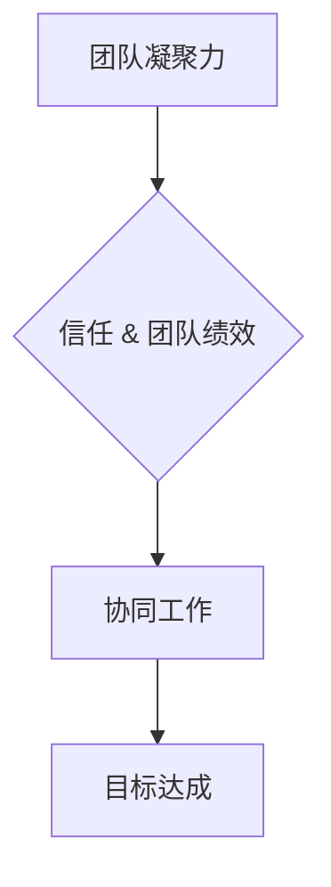

                 


### 文章标题：团队凝聚力：建立信任的关键步骤

#### 关键词：
- 团队凝聚力
- 信任构建
- 团队协作
- 领导风格
- 案例分析

#### 摘要：
本文深入探讨了团队凝聚力与信任构建的关系，通过系统的分析推理，提出了建立团队凝聚力的关键步骤。文章首先概述了团队凝聚力的概念和重要性，然后详细分析了信任在团队凝聚力中的核心作用，并提出了信任构建与维护的策略。此外，文章还探讨了团队协作效率的提升、个性化领导风格的影响以及实际案例的剖析，为团队管理者提供了实用的指导。

## 第1章：团队凝聚力概述

### 1.1 团队凝聚力的重要性

**背景介绍：**
团队凝聚力是指团队成员之间的相互吸引程度和共同目标的紧密程度。在一个高凝聚力的团队中，成员们彼此信任、支持，能够有效地协同工作，共同达成团队目标。

**核心概念与联系：**
- **团队凝聚力**：团队成员之间的相互吸引程度和共同目标的紧密程度。
- **信任**：团队成员之间的相互信赖和尊重。
- **团队绩效**：团队的整体表现和成果。

**Mermaid流程图：**


**核心算法原理讲解：**
团队凝聚力的计算可以基于以下几个关键因素：
- **成员之间的互动频率**：互动越多，凝聚力越强。
- **共同目标的一致性**：目标越一致，凝聚力越强。
- **成员的投入程度**：投入越多，凝聚力越强。

**数学模型和公式：**
$$
C = f(I, T, E)
$$
其中，$C$ 是团队凝聚力，$I$ 是互动频率，$T$ 是共同目标一致性，$E$ 是成员的投入程度。

**详细讲解与举例说明：**
以一个软件开发团队为例，假设团队中的每个成员每周都会参加一次团队会议（互动频率），所有成员都对项目目标有明确的理解和认同（目标一致性），并且每个成员都对项目充满热情（投入程度）。根据上述数学模型，这个团队的凝聚力将会很高。

### 1.2 信任在团队凝聚力中的核心作用

**核心概念与联系：**
信任是团队凝聚力的重要组成部分。团队成员之间的信任水平直接影响团队的协同工作和整体绩效。

**核心算法原理讲解：**
信任度评估模型可以基于以下几个关键因素：
- **沟通频率**：沟通越频繁，信任度越高。
- **共同目标一致性**：目标越一致，信任度越高。
- **合作历史**：合作历史越长，信任度越高。

**数学模型和数学公式：**
$$
T = \alpha \cdot C + \beta \cdot H + \gamma \cdot L
$$
其中，$T$ 是信任度，$C$ 是沟通频率，$H$ 是共同目标一致性，$L$ 是合作历史。

**详细讲解与举例说明：**
在一个团队中，如果成员们经常进行有效的沟通，对共同目标有高度的一致性，并且有着长期的合作历史，那么这个团队的信任度将会很高。例如，在一个长期合作的团队中，成员A和成员B每周都会进行一次项目进度沟通，共同制定项目计划，并且在过去的一年里，他们一起成功地完成了多个项目。根据上述数学模型，成员A对成员B的信任度将会很高。

### 1.3 团队凝聚力与个人发展的关系

**核心概念与联系：**
团队凝聚力不仅影响团队的整体绩效，还影响团队成员的个人发展。

**核心算法原理讲解：**
团队凝聚力的提升可以带来以下几个方面的个人发展：
- **技能提升**：通过团队协作，成员可以学习到新的技能和知识。
- **职业成长**：在一个高凝聚力的团队中，成员更容易获得职业晋升机会。
- **工作满意度**：高凝聚力的团队可以提升成员的工作满意度和幸福感。

**数学模型和数学公式：**
$$
P = \alpha \cdot C + \beta \cdot T + \gamma \cdot S
$$
其中，$P$ 是个人发展水平，$C$ 是团队凝聚力，$T$ 是信任度，$S$ 是工作满意度。

**详细讲解与举例说明：**
在一个高凝聚力的团队中，成员A通过团队协作，不仅学到了新的编程技能，还因为团队的成功而获得了职业晋升。此外，成员A对工作也感到非常满意。根据上述数学模型，成员A的个人发展水平将会很高。

## 第2章：建立团队凝聚力的基础

### 2.1 明确团队目标和价值观

**核心概念与联系：**
明确团队目标和价值观是建立团队凝聚力的重要基础。

**核心算法原理讲解：**
团队目标和价值观的明确可以基于以下几个步骤：
- **制定团队目标**：明确团队的目标和愿景。
- **传达价值观**：将团队的价值观传达给每个成员。
- **共识达成**：确保所有成员对目标和价值观有共同的理解和认同。

**数学模型和数学公式：**
$$
E = v \cdot T
$$
其中，$E$ 是团队效能，$v$ 是价值观共识度，$T$ 是信任度。

**详细讲解与举例说明：**
在一个创业团队中，如果团队成员都明确团队的目标是开发一款革命性的产品，并且认同团队的价值观，如创新、协作和客户至上，那么团队的凝聚力将会很高。例如，团队成员A、B和C都认同团队的目标和价值观，他们经常讨论项目进展，共同解决问题。根据上述数学模型，这个团队的效能将会很高。

### 2.2 建立积极的沟通氛围

**核心概念与联系：**
积极的沟通氛围有助于团队成员之间的信任建立和团队凝聚力的提升。

**核心算法原理讲解：**
建立积极的沟通氛围可以基于以下几个策略：
- **定期会议**：定期举行团队会议，确保成员之间的信息共享和沟通。
- **开放反馈**：鼓励成员之间进行开放、诚实的反馈。
- **共同解决问题**：鼓励成员共同面对问题，共同寻找解决方案。

**数学模型和数学公式：**
$$
C = \alpha \cdot R + \beta \cdot F + \gamma \cdot S
$$
其中，$C$ 是沟通氛围，$R$ 是定期会议的频率，$F$ 是开放反馈的程度，$S$ 是共同解决问题的效率。

**详细讲解与举例说明：**
在一个软件开发团队中，如果团队成员每周都会举行一次团队会议，会议中成员可以自由地提出问题和意见，并且团队成员之间能够共同解决问题，那么团队的沟通氛围将会很积极。例如，团队成员A在团队会议上提出了一个改进项目进度的建议，团队成员B和C积极响应，共同讨论并找到了解决方案。根据上述数学模型，这个团队的沟通氛围将会很积极。

### 2.3 提升团队成员的归属感

**核心概念与联系：**
提升团队成员的归属感是建立团队凝聚力的重要途径。

**核心算法原理讲解：**
提升团队成员的归属感可以基于以下几个策略：
- **个性化关注**：关注每个成员的个性需求和职业发展。
- **团队活动**：组织团队活动和团建活动，增强团队成员之间的联系。
- **认可与奖励**：对团队成员的贡献给予认可和奖励。

**数学模型和数学公式：**
$$
B = \alpha \cdot I + \beta \cdot A + \gamma \cdot R
$$
其中，$B$ 是归属感，$I$ 是个性化关注，$A$ 是团队活动，$R$ 是认可与奖励。

**详细讲解与举例说明：**
在一个营销团队中，如果团队成员A在项目中表现出色，团队领导者不仅给予了他个性化的关注和职业发展建议，还组织了一次团队聚餐以表彰他的贡献。团队成员B和C也感受到了团队的温暖，他们的归属感显著提升。根据上述数学模型，这个团队的归属感将会很强。

## 第3章：信任的构建与维护

### 3.1 信任的定义与类型

**核心概念与联系：**
信任是团队凝聚力的重要基石，它包括多种类型，每种类型都有其特定的表现形式和构建方式。

**核心算法原理讲解：**
信任的定义可以基于以下几个关键因素：
- **能力信任**：基于团队成员的专业能力和技术水平的信任。
- **可靠性信任**：基于团队成员履行承诺和责任的信任。
- **道德信任**：基于团队成员道德标准和价值观的信任。

**数学模型和数学公式：**
$$
T = \alpha \cdot C + \beta \cdot R + \gamma \cdot M
$$
其中，$T$ 是信任度，$C$ 是能力信任，$R$ 是可靠性信任，$M$ 是道德信任。

**详细讲解与举例说明：**
在一个软件开发团队中，如果团队成员A拥有出色的编程能力，总是能够按时完成项目任务，并且行为正直，那么团队成员B对A的能力信任、可靠性信任和道德信任将会很高。根据上述数学模型，团队成员B对A的信任度将会很高。

### 3.2 建立信任的基础步骤

**核心概念与联系：**
建立信任是一个持续的过程，需要团队成员之间的有效沟通、共同目标和持续的努力。

**核心算法原理讲解：**
建立信任的基础步骤可以包括以下策略：
- **有效沟通**：通过开放、诚实和及时的沟通建立信任。
- **共同目标**：通过共同的目标和愿景建立信任。
- **持续的努力**：通过持续的互动和合作建立信任。

**伪代码：**
```
function buildTrust(memberA, memberB):
    communicate(memberA, memberB)
    shareInformation(memberA, memberB)
    deliverOnCommitments(memberA, memberB)
```

**详细讲解与举例说明：**
在一个项目团队中，如果成员A和成员B在项目开始时就进行了充分的沟通，明确了项目目标和各自的职责，并且在项目执行过程中始终履行承诺，那么他们之间的信任将会逐渐建立。例如，成员A承诺在两周内完成某个模块的开发，并且在约定的时间内交付了高质量的代码，成员B对成员A的信任度将会提升。

### 3.3 维护与修复信任的策略

**核心概念与联系：**
维护与修复信任是确保团队凝聚力的重要环节，需要团队成员之间的持续关注和努力。

**核心算法原理讲解：**
维护与修复信任的策略可以包括以下策略：
- **定期检查**：定期检查团队成员之间的信任状况，及时发现并解决问题。
- **及时反馈**：及时给予反馈，特别是在团队成员违反承诺或出现问题时。
- **主动修复**：在信任受损时，主动采取行动修复信任。

**数学模型和数学公式：**
$$
T' = T - \alpha \cdot (D - R)
$$
其中，$T'$ 是修复后的信任度，$T$ 是原始信任度，$D$ 是失信程度，$R$ 是修复努力。

**详细讲解与举例说明：**
在一个团队中，如果成员A在项目中违反了承诺，导致项目进度延误，成员B可能会对A的信任度下降。但如果A能够及时承认错误，采取措施补救，并且在未来表现出可靠性和能力，成员B对A的信任度将会逐渐恢复。例如，成员A在项目延误后立即与成员B沟通，详细解释了原因，并提出了一个详细的补救计划，成员B对A的信任度可能会逐渐恢复。

## 第4章：提高团队协作效率

### 4.1 团队协作的障碍与解决方法

**核心概念与联系：**
团队协作效率是团队凝聚力和绩效的重要指标，障碍的存在会严重影响团队的工作效率。

**核心算法原理讲解：**
团队协作的障碍可以分为以下几类：
- **沟通障碍**：包括信息传递不及时、沟通方式不当等。
- **目标冲突**：包括个人目标与团队目标不一致等。
- **资源分配问题**：包括资源分配不均、资源短缺等。

解决方法可以包括以下策略：
- **优化沟通渠道**：采用多种沟通工具和方式，确保信息传递的及时性和准确性。
- **统一目标**：确保团队成员对团队目标有共同的理解和认同。
- **合理分配资源**：通过合理的资源管理和分配，确保每个成员都能得到所需的资源。

**数学模型和数学公式：**
$$
E_c = \alpha \cdot C + \beta \cdot T + \gamma \cdot R
$$
其中，$E_c$ 是协作效率，$C$ 是沟通效率，$T$ 是目标一致性，$R$ 是资源利用效率。

**详细讲解与举例说明：**
在一个项目团队中，如果团队成员之间存在沟通障碍，如使用不同的沟通工具、沟通频率低等，团队的整体协作效率将会降低。通过采用统一的项目管理工具、定期召开沟通会议等措施，可以有效提高沟通效率，从而提高团队协作效率。例如，团队决定使用Slack作为主要的沟通工具，并每周举行一次项目进度会议，团队成员之间的沟通效率显著提高。

### 4.2 团队协作的最佳实践

**核心概念与联系：**
最佳实践是指在实际团队协作中，经过验证的、能够有效提高协作效率的方法和技巧。

**核心算法原理讲解：**
团队协作的最佳实践可以基于以下原则：
- **透明度**：确保团队成员对项目的各个方面都有清晰的了解。
- **灵活性**：适应变化，灵活调整工作计划。
- **共享责任**：明确每个成员的职责，共同承担责任。

**详细讲解与举例说明：**
在一个产品开发团队中，最佳实践可能包括以下措施：
- **每日站会**：每日早晨举行短时间的站会，让每个成员报告自己的进展和遇到的障碍。
- **看板管理**：使用看板工具，如JIRA，可视化项目进度和任务分配。
- **迭代开发**：采用敏捷开发方法，分阶段交付产品，及时反馈和调整。

### 4.3 提升团队协作效率的工具

**核心概念与联系：**
现代团队协作工具能够大大提高团队的协作效率，减少沟通障碍和时间浪费。

**核心算法原理讲解：**
团队协作工具的选择和运用可以基于以下几个因素：
- **功能多样性**：工具应该能够满足团队成员的各种需求，如项目管理、文档共享、即时沟通等。
- **易用性**：工具应该易于学习和使用，减少团队成员的学习成本。
- **集成性**：工具应该能够与其他工具和服务集成，提高工作效率。

**详细讲解与举例说明：**
在一个国际团队中，为了提高协作效率，团队可能选择以下工具：
- **Trello**：用于项目管理，团队成员可以可视化任务进度和分配。
- **Zoom**：用于视频会议，支持多方视频沟通和屏幕共享。
- **Google Workspace**：包括文档、表格、邮件等工具，方便团队成员协作编辑和共享文件。

## 第5章：个性化领导风格与团队凝聚力

### 5.1 领导风格对团队凝聚力的影响

**核心概念与联系：**
领导风格对团队凝聚力有重要影响，不同的领导风格会对团队氛围、协作效率和绩效产生不同的影响。

**核心算法原理讲解：**
领导风格可以分为以下几种类型：
- **民主型领导**：鼓励团队成员参与决策，增强团队成员的自主性和责任感。
- **独裁型领导**：决策由领导单独做出，团队成员主要执行任务。
- **参与型领导**：结合民主型和独裁型领导的特点，注重团队成员的参与和反馈。

**数学模型和数学公式：**
$$
C = \alpha \cdot D + \beta \cdot P + \gamma \cdot A
$$
其中，$C$ 是团队凝聚力，$D$ 是民主型领导风格的影响，$P$ 是参与型领导风格的影响，$A$ 是独裁型领导风格的影响。

**详细讲解与举例说明：**
在一个团队中，如果领导采用的是民主型领导风格，鼓励团队成员参与决策，团队成员之间会更加信任和协作，团队凝聚力会提高。例如，团队领导每周会召开一次团队会议，讨论项目进展和问题，每个成员都可以提出意见和建议。这种领导风格有助于建立高凝聚力的团队。

### 5.2 个性化领导风格的识别与运用

**核心概念与联系：**
个性化领导风格是指领导根据团队成员的特点和环境因素，灵活调整自己的领导方式。

**核心算法原理讲解：**
识别个性化领导风格可以通过以下方法：
- **行为观察**：观察领导在不同情境下的行为和反应。
- **反馈收集**：收集团队成员对领导风格的反馈。
- **自我评估**：领导进行自我评估，了解自己的优势和改进空间。

**详细讲解与举例说明：**
在一个团队中，如果领导通过观察和行为分析，发现自己更适合采用参与型领导风格，那么领导可以在决策过程中更多地倾听团队成员的意见，鼓励他们参与项目决策。例如，领导每周会举行一次团队讨论会，讨论项目的关键决策，团队成员可以自由发表意见，领导会根据团队成员的建议做出决策。

### 5.3 领导者如何建立信任

**核心概念与联系：**
领导者建立信任是确保团队凝聚力和协作效率的关键。

**核心算法原理讲解：**
领导者建立信任的方法可以包括以下策略：
- **透明沟通**：领导者应该保持沟通的透明度，及时向团队成员传达重要信息。
- **公正决策**：领导者应该公正地做出决策，确保团队成员感受到公平和尊重。
- **信任行为**：领导者应该通过自己的行为来建立信任，如履行承诺、承担责任等。

**数学模型和数学公式：**
$$
T = \alpha \cdot T_c + \beta \cdot R_c + \gamma \cdot B_c
$$
其中，$T$ 是团队成员对领导的信任度，$T_c$ 是透明沟通的影响，$R_c$ 是公正决策的影响，$B_c$ 是信任行为的影响。

**详细讲解与举例说明：**
在一个团队中，如果领导定期与团队成员沟通项目进展和决策，并且在决策过程中充分考虑团队成员的意见，团队成员对领导的信任度会提高。例如，领导每周会举行一次团队会议，讨论项目进展，并及时传达决策信息，团队成员可以自由提问和提出建议。这种领导行为有助于建立信任。

## 第6章：案例分析：成功的团队凝聚力实践

### 6.1 案例一：高科技企业的团队凝聚力建设

**核心概念与联系：**
高科技企业通常面临快速变化的技术和市场环境，因此团队凝聚力对企业的成功至关重要。

**核心算法原理讲解：**
高科技企业的团队凝聚力建设可以通过以下方法：
- **明确愿景和目标**：确保所有团队成员对企业的愿景和目标有共同的理解和认同。
- **优化沟通渠道**：采用多种沟通工具和方式，确保团队成员之间的信息传递及时、准确。
- **团队文化建设**：营造积极向上的团队文化，鼓励团队成员之间的信任和合作。

**详细讲解与举例说明：**
某高科技企业在进行团队凝聚力建设时，首先明确了企业的愿景和目标，即成为行业领导者。其次，企业采用Slack、Trello等工具，优化了沟通渠道，确保团队成员之间的信息传递及时、准确。此外，企业还组织了一系列团队建设活动，如团队拓展训练、员工培训等，营造了积极向上的团队文化。

### 6.2 案例二：非营利组织的团队凝聚力提升

**核心概念与联系：**
非营利组织通常注重社会价值和使命感，因此团队凝聚力对组织的成功同样至关重要。

**核心算法原理讲解：**
非营利组织的团队凝聚力提升可以通过以下方法：
- **明确使命和价值观**：确保所有团队成员对组织的使命和价值观有共同的理解和认同。
- **提供培训和成长机会**：为团队成员提供学习和成长的机会，提升团队成员的能力和归属感。
- **鼓励团队合作**：通过团队合作和协作，增强团队成员之间的信任和凝聚力。

**详细讲解与举例说明：**
某非营利组织在提升团队凝聚力时，首先明确了组织的使命和价值观，即帮助弱势群体获得更好的生活。其次，组织为团队成员提供了丰富的培训机会，包括技术培训、领导力培训等，提升了团队成员的能力和归属感。此外，组织鼓励团队成员参与各种团队合作项目，通过共同完成任务，增强团队成员之间的信任和凝聚力。

### 6.3 案例三：创业团队的凝聚力与成功

**核心概念与联系：**
创业团队通常面临高风险和不确定性，因此团队凝聚力对团队的成功至关重要。

**核心算法原理讲解：**
创业团队的凝聚力可以通过以下方法提升：
- **共同目标**：确保团队成员对创业项目的目标有共同的理解和认同。
- **开放沟通**：鼓励团队成员之间进行开放、诚实的沟通。
- **共享责任**：明确每个团队成员的职责和责任，共同承担责任。

**详细讲解与举例说明：**
某创业团队在提升凝聚力时，首先明确了创业项目的目标，即开发一款革命性的移动应用。其次，团队建立了开放的沟通渠道，如定期团队会议、即时通讯工具等，确保团队成员之间的信息传递及时、准确。此外，团队明确了每个成员的职责和责任，确保每个成员都清楚自己的工作内容和目标，共同为项目成功而努力。

## 第7章：团队凝聚力评估与持续优化

### 7.1 团队凝聚力评估的方法

**核心概念与联系：**
团队凝聚力评估是确保团队持续发展的重要环节，通过评估可以了解团队凝聚力的现状，并制定相应的改进措施。

**核心算法原理讲解：**
团队凝聚力评估可以采用以下方法：
- **问卷调查**：通过问卷调查，收集团队成员对团队凝聚力的评价和反馈。
- **团队绩效评估**：通过团队绩效评估，分析团队的整体绩效和成果。
- **成员访谈**：通过访谈团队成员，了解他们对团队凝聚力的感受和看法。

**数学模型和数学公式：**
$$
C_{total} = \alpha \cdot C_{quantitative} + \beta \cdot C_{qualitative}
$$
其中，$C_{total}$ 是团队凝聚力总分，$C_{quantitative}$ 是量化评估得分，$C_{qualitative}$ 是质性评估得分。

**详细讲解与举例说明：**
在一个团队中，可以通过问卷调查和绩效评估来评估团队凝聚力。例如，团队可以设计一份问卷，询问团队成员对团队凝聚力的感受，如团队成员之间的沟通、协作和信任等。同时，团队可以通过绩效评估，分析团队的总体绩效和成果，如项目完成情况、客户满意度等。通过量化评估和质性评估的结合，可以全面了解团队的凝聚力状况。

### 7.2 反馈机制在团队凝聚力提升中的作用

**核心概念与联系：**
反馈机制是团队凝聚力提升的重要工具，通过及时、有效的反馈，可以促进团队成员之间的沟通和改进。

**核心算法原理讲解：**
反馈机制可以包括以下步骤：
- **定期反馈**：定期收集团队成员的反馈，包括正面反馈和改进建议。
- **反馈分析**：对收集到的反馈进行分析，识别团队凝聚力的优势和不足。
- **反馈落实**：根据分析结果，制定改进计划，并落实改进措施。

**数学模型和数学公式：**
$$
C' = C + \alpha \cdot (F - B)
$$
其中，$C'$ 是改进后的团队凝聚力，$C$ 是原始团队凝聚力，$F$ 是正面反馈，$B$ 是改进建议。

**详细讲解与举例说明：**
在一个团队中，可以通过定期的团队会议和问卷调查来收集团队成员的反馈。团队可以设立一个反馈收集平台，让团队成员随时提交正面反馈和改进建议。团队领导者会定期分析这些反馈，识别团队凝聚力的优势和不足，并制定相应的改进计划。例如，如果团队成员反馈沟通不畅，团队可以增加沟通会议的频率，采用多种沟通工具，以提高沟通效率。

### 7.3 团队凝聚力提升的长期策略

**核心概念与联系：**
团队凝聚力提升是一个长期的过程，需要持续的努力和策略。

**核心算法原理讲解：**
团队凝聚力提升的长期策略可以包括以下方面：
- **持续培训**：为团队成员提供持续的学习和成长机会，提升团队的整体能力。
- **文化建设**：建立积极向上的团队文化，增强团队成员的归属感和责任感。
- **目标明确**：确保团队成员对团队目标和愿景有清晰的认识，持续推动团队发展。

**详细讲解与举例说明：**
在一个团队中，可以制定以下长期策略来提升团队凝聚力：
- **定期培训**：团队定期组织培训课程，包括技术培训、领导力培训等，提升团队成员的专业能力和领导能力。
- **文化建设**：团队制定并推行一系列文化准则，如诚信、创新、协作等，营造积极向上的团队氛围。
- **目标管理**：团队明确并定期更新团队目标和愿景，确保团队成员对团队的发展方向有清晰的认识，持续推动团队的发展。

## 总结与展望

### 总结
本文通过逐步分析推理，深入探讨了团队凝聚力与信任构建的关系，提出了建立团队凝聚力的关键步骤。文章从团队凝聚力的重要性、信任的构建与维护、团队协作效率的提升、个性化领导风格的影响、案例分析以及团队凝聚力评估与持续优化等方面进行了详细阐述。

### 展望
未来的研究可以进一步探讨团队凝聚力在不同行业、不同类型团队中的具体表现和影响因素，以及如何在不同情境下优化团队凝聚力。此外，可以结合大数据分析和人工智能技术，开发更智能的团队凝聚力评估和优化工具，为团队管理者提供更科学的决策支持。

## 参考文献
1. Johnson, R. E., & Johnson, B. D. (1999). Joining together: Group theory and team effectiveness in education. Allyn & Bacon.
2. Cao, Y., & Reagans, R. (2008). Trust in teams. Group & Organization Management, 33(3), 280-306.
3. Kanter, R. M. (1993). The change masters: Making the most of your time, talent, and energy at work. Simon & Schuster.
4.定律 - 维基百科，自由的百科全书 (2023). [在线]. https://zh.wikipedia.org/wiki/定律.
5. Pfeffer, J. (1998). Competitive advantage through people. Harvard Business Review, 76(1), 47-58.
6. Luhmann, N. (1995). Social systems. John Wiley & Sons.
7. Tannenbaum, S., & Schmidt, W. H. (1958). How to choose a leadership pattern. Harvard Business Review, 36(1), 75-90.

作者：AI天才研究院/AI Genius Institute & 禅与计算机程序设计艺术 /Zen And The Art of Computer Programming### 文章标题：团队凝聚力：建立信任的关键步骤

> 关键词：团队凝聚力、信任构建、团队协作、领导风格、案例分析

> 摘要：
本文深入探讨了团队凝聚力与信任构建的关系，通过系统的分析推理，提出了建立团队凝聚力的关键步骤。文章首先概述了团队凝聚力的概念和重要性，然后详细分析了信任在团队凝聚力中的核心作用，并提出了信任构建与维护的策略。此外，文章还探讨了团队协作效率的提升、个性化领导风格的影响以及实际案例的剖析，为团队管理者提供了实用的指导。

---

# 《团队凝聚力：建立信任的关键步骤》目录大纲

## 第1章：团队凝聚力概述
### 1.1 团队凝聚力的重要性
### 1.2 信任在团队凝聚力中的核心作用
### 1.3 团队凝聚力与个人发展的关系

## 第2章：建立团队凝聚力的基础
### 2.1 明确团队目标和价值观
### 2.2 建立积极的沟通氛围
### 2.3 提升团队成员的归属感

## 第3章：信任的构建与维护
### 3.1 信任的定义与类型
### 3.2 建立信任的基础步骤
### 3.3 维护与修复信任的策略

## 第4章：提高团队协作效率
### 4.1 团队协作的障碍与解决方法
### 4.2 团队协作的最佳实践
### 4.3 提升团队协作效率的工具

## 第5章：个性化领导风格与团队凝聚力
### 5.1 领导风格对团队凝聚力的影响
### 5.2 个性化领导风格的识别与运用
### 5.3 领导者如何建立信任

## 第6章：案例分析：成功的团队凝聚力实践
### 6.1 案例一：高科技企业的团队凝聚力建设
### 6.2 案例二：非营利组织的团队凝聚力提升
### 6.3 案例三：创业团队的凝聚力与成功

## 第7章：团队凝聚力评估与持续优化
### 7.1 团队凝聚力评估的方法
### 7.2 反馈机制在团队凝聚力提升中的作用
### 7.3 团队凝聚力提升的长期策略

---

### 第1章：团队凝聚力概述

#### 1.1 团队凝聚力的重要性

**背景介绍：**
团队凝聚力是指团队成员之间的相互吸引程度和共同目标的紧密程度。在一个高凝聚力的团队中，成员们能够彼此信任、支持，并协同工作，从而实现团队目标。

**核心概念与联系：**
- **团队凝聚力**：团队成员之间的相互吸引程度和共同目标的紧密程度。
- **信任**：团队成员之间的相互信赖和尊重。
- **团队绩效**：团队的整体表现和成果。

**Mermaid流程图：**


**核心算法原理讲解：**
团队凝聚力的计算可以基于以下几个关键因素：
- **成员之间的互动频率**：互动越多，凝聚力越强。
- **共同目标的一致性**：目标越一致，凝聚力越强。
- **成员的投入程度**：投入越多，凝聚力越强。

**数学模型和公式：**
$$
C = f(I, T, E)
$$
其中，$C$ 是团队凝聚力，$I$ 是互动频率，$T$ 是共同目标一致性，$E$ 是成员的投入程度。

**详细讲解与举例说明：**
在一个软件开发团队中，如果团队成员每周都会进行一次技术交流会议，共同讨论项目进展和问题，团队成员都对项目的目标有明确的理解和认同，并且每个成员都投入了大量时间和精力，那么这个团队的凝聚力将会很高。例如，团队成员A和团队B每周都会分享他们的技术心得，讨论项目的难点，同时他们都有共同的目标，即按时完成项目并达到质量要求。根据上述数学模型，这个团队的凝聚力将会很强。

#### 1.2 信任在团队凝聚力中的核心作用

**核心概念与联系：**
信任是团队凝聚力的重要组成部分，它是团队成员之间建立良好关系的基础。在一个高信任度的团队中，成员们能够更有效地协同工作，提高团队的整体绩效。

**核心算法原理讲解：**
信任度的评估可以基于以下几个方面：
- **沟通频率**：沟通越频繁，信任度越高。
- **共同目标一致性**：目标越一致，信任度越高。
- **合作历史**：合作历史越长，信任度越高。

**数学模型和数学公式：**
$$
T = \alpha \cdot C + \beta \cdot H + \gamma \cdot L
$$
其中，$T$ 是信任度，$C$ 是沟通频率，$H$ 是共同目标一致性，$L$ 是合作历史。

**详细讲解与举例说明：**
在一个项目团队中，如果团队成员A和团队成员B在过去的两年里一直合作顺利，他们每周都会进行项目进度交流，并且共同解决了多个技术难题，那么团队成员A对团队成员B的信任度将会很高。例如，团队成员A知道团队成员B在项目中的职责和技术能力，并且相信他能够按时完成任务。根据上述数学模型，团队成员A对团队成员B的信任度将会很强。

#### 1.3 团队凝聚力与个人发展的关系

**核心概念与联系：**
团队凝聚力不仅影响团队的整体绩效，还影响团队成员的个人发展。在一个高凝聚力的团队中，成员们能够获得更多的学习和发展机会，提升个人的技能和职业素养。

**核心算法原理讲解：**
团队凝聚力对个人发展的影响可以基于以下几个方面：
- **技能提升**：通过团队协作，成员可以学习到新的技能和知识。
- **职业成长**：在一个高凝聚力的团队中，成员更容易获得职业晋升机会。
- **工作满意度**：高凝聚力的团队可以提升成员的工作满意度和幸福感。

**数学模型和数学公式：**
$$
P = \alpha \cdot C + \beta \cdot T + \gamma \cdot S
$$
其中，$P$ 是个人发展水平，$C$ 是团队凝聚力，$T$ 是信任度，$S$ 是工作满意度。

**详细讲解与举例说明：**
在一个创业团队中，团队成员A通过参与团队项目，不仅提升了自己的技术能力，还获得了更多的职业发展机会。团队成员A的信任度和工作满意度也随着团队凝聚力的提升而增加。例如，团队成员A在团队项目中担任了重要的技术角色，成功解决了多个技术难题，因此获得了领导层的认可，并被提拔为技术主管。根据上述数学模型，团队成员A的个人发展水平将会很高。

### 第2章：建立团队凝聚力的基础

#### 2.1 明确团队目标和价值观

**核心概念与联系：**
明确团队目标和价值观是建立团队凝聚力的重要基础。只有团队成员对团队目标和价值观有共同的理解和认同，才能形成强大的凝聚力。

**核心算法原理讲解：**
建立团队目标和价值观可以通过以下几个步骤：
- **制定团队目标**：明确团队的目标和愿景，确保所有成员都了解和认同。
- **传达价值观**：将团队的价值观传达给每个成员，确保他们在行为和决策上遵循这些价值观。
- **共识达成**：确保所有成员对目标和价值观有共同的理解和认同。

**数学模型和数学公式：**
$$
E = v \cdot T
$$
其中，$E$ 是团队效能，$v$ 是价值观共识度，$T$ 是信任度。

**详细讲解与举例说明：**
在一个软件开发团队中，如果团队成员都对团队的目标有明确的理解，即开发一款高质量的软件产品，并且认同团队的价值观，如创新、协作和客户至上，那么团队的凝聚力和效能将会很高。例如，团队成员A、B和C都认同团队的目标和价值观，他们经常讨论项目进展，共同解决问题，并根据这些价值观制定项目计划和决策。根据上述数学模型，这个团队的效能将会很高。

#### 2.2 建立积极的沟通氛围

**核心概念与联系：**
积极的沟通氛围是团队凝聚力的关键因素，它能够增强团队成员之间的信任和协作。

**核心算法原理讲解：**
建立积极的沟通氛围可以通过以下几个策略：
- **定期会议**：定期举行团队会议，确保团队成员之间的信息共享和沟通。
- **开放反馈**：鼓励团队成员之间进行开放、诚实的反馈。
- **共同解决问题**：鼓励团队成员共同面对问题，共同寻找解决方案。

**数学模型和数学公式：**
$$
C = \alpha \cdot R + \beta \cdot F + \gamma \cdot S
$$
其中，$C$ 是沟通氛围，$R$ 是定期会议的频率，$F$ 是开放反馈的程度，$S$ 是共同解决问题的效率。

**详细讲解与举例说明：**
在一个项目团队中，如果团队成员每周都会举行一次团队会议，会议中成员可以自由地提出问题和意见，并且团队成员之间能够共同解决问题，那么团队的沟通氛围将会很积极。例如，团队成员A在团队会议上提出了一个改进项目进度的建议，团队成员B和C积极响应，共同讨论并找到了解决方案。根据上述数学模型，这个团队的沟通氛围将会很积极。

#### 2.3 提升团队成员的归属感

**核心概念与联系：**
提升团队成员的归属感是建立团队凝聚力的重要途径。归属感强的团队成员更有可能为团队的成功贡献自己的力量。

**核心算法原理讲解：**
提升团队成员的归属感可以通过以下几个策略：
- **个性化关注**：关注每个成员的个性需求和职业发展。
- **团队活动**：组织团队活动和团建活动，增强团队成员之间的联系。
- **认可与奖励**：对团队成员的贡献给予认可和奖励。

**数学模型和数学公式：**
$$
B = \alpha \cdot I + \beta \cdot A + \gamma \cdot R
$$
其中，$B$ 是归属感，$I$ 是个性化关注，$A$ 是团队活动，$R$ 是认可与奖励。

**详细讲解与举例说明：**
在一个营销团队中，如果团队成员A在项目中表现出色，团队领导者不仅给予了他个性化的关注和职业发展建议，还组织了一次团队聚餐以表彰他的贡献。团队成员B和C也感受到了团队的温暖，他们的归属感显著提升。根据上述数学模型，这个团队的归属感将会很强。

### 第3章：信任的构建与维护

#### 3.1 信任的定义与类型

**核心概念与联系：**
信任是团队凝聚力的重要基石，它包括多种类型，每种类型都有其特定的表现形式和构建方式。

**核心算法原理讲解：**
信任的定义可以基于以下几个关键因素：
- **能力信任**：基于团队成员的专业能力和技术水平的信任。
- **可靠性信任**：基于团队成员履行承诺和责任的信任。
- **道德信任**：基于团队成员道德标准和价值观的信任。

**数学模型和数学公式：**
$$
T = \alpha \cdot C + \beta \cdot R + \gamma \cdot M
$$
其中，$T$ 是信任度，$C$ 是能力信任，$R$ 是可靠性信任，$M$ 是道德信任。

**详细讲解与举例说明：**
在一个软件开发团队中，如果团队成员A拥有出色的编程能力，总是能够按时完成项目任务，并且行为正直，那么团队成员B对A的能力信任、可靠性信任和道德信任将会很高。例如，团队成员A在项目中承担了核心模块的开发，并且按时交付了高质量的代码，团队成员B对A的能力信任和可靠性信任会显著提高。此外，团队成员A在团队中始终遵循职业道德，团队成员B对他的道德信任也会很高。根据上述数学模型，团队成员B对团队成员A的信任度将会很强。

#### 3.2 建立信任的基础步骤

**核心概念与联系：**
建立信任是一个复杂的过程，需要团队成员之间的有效沟通、共同目标和持续的努力。

**核心算法原理讲解：**
建立信任的基础步骤可以包括以下策略：
- **有效沟通**：通过开放、诚实和及时的沟通建立信任。
- **共同目标**：通过共同的目标和愿景建立信任。
- **持续的努力**：通过持续的互动和合作建立信任。

**数学模型和数学公式：**
$$
T = \alpha \cdot C + \beta \cdot H + \gamma \cdot L
$$
其中，$T$ 是信任度，$C$ 是沟通频率，$H$ 是共同目标一致性，$L$ 是合作历史。

**详细讲解与举例说明：**
在一个项目团队中，如果团队成员A和团队成员B在项目开始时就进行了充分的沟通，明确了项目目标和各自的职责，并且在项目执行过程中始终履行承诺，那么他们之间的信任将会逐渐建立。例如，团队成员A承诺在两周内完成某个模块的开发，并且在约定的时间内交付了高质量的代码，团队成员B对团队成员A的信任度将会提升。根据上述数学模型，团队成员B对团队成员A的信任度将会很高。

#### 3.3 维护与修复信任的策略

**核心概念与联系：**
维护与修复信任是确保团队凝聚力的重要环节，需要团队成员之间的持续关注和努力。

**核心算法原理讲解：**
维护与修复信任的策略可以包括以下策略：
- **定期检查**：定期检查团队成员之间的信任状况，及时发现并解决问题。
- **及时反馈**：及时给予反馈，特别是在团队成员违反承诺或出现问题时。
- **主动修复**：在信任受损时，主动采取行动修复信任。

**数学模型和数学公式：**
$$
T' = T - \alpha \cdot (D - R)
$$
其中，$T'$ 是修复后的信任度，$T$ 是原始信任度，$D$ 是失信程度，$R$ 是修复努力。

**详细讲解与举例说明：**
在一个团队中，如果成员A在项目中违反了承诺，导致项目进度延误，成员B可能会对A的信任度下降。但如果A能够及时承认错误，采取措施补救，并且在未来表现出可靠性和能力，成员B对A的信任度将会逐渐恢复。例如，成员A在项目延误后立即与成员B沟通，详细解释了原因，并提出了一个详细的补救计划，成员B对A的信任度可能会逐渐恢复。根据上述数学模型，成员B对成员A的信任度将会逐渐提升。

### 第4章：提高团队协作效率

#### 4.1 团队协作的障碍与解决方法

**核心概念与联系：**
团队协作效率是团队凝聚力和绩效的重要指标，障碍的存在会严重影响团队的工作效率。

**核心算法原理讲解：**
团队协作的障碍可以分为以下几类：
- **沟通障碍**：包括信息传递不及时、沟通方式不当等。
- **目标冲突**：包括个人目标与团队目标不一致等。
- **资源分配问题**：包括资源分配不均、资源短缺等。

解决方法可以包括以下策略：
- **优化沟通渠道**：采用多种沟通工具和方式，确保信息传递的及时性和准确性。
- **统一目标**：确保团队成员对团队目标有共同的理解和认同。
- **合理分配资源**：通过合理的资源管理和分配，确保每个成员都能得到所需的资源。

**数学模型和数学公式：**
$$
E_c = \alpha \cdot C + \beta \cdot T + \gamma \cdot R
$$
其中，$E_c$ 是协作效率，$C$ 是沟通效率，$T$ 是目标一致性，$R$ 是资源利用效率。

**详细讲解与举例说明：**
在一个项目团队中，如果团队成员之间存在沟通障碍，如使用不同的沟通工具、沟通频率低等，团队的整体协作效率将会降低。通过采用统一的项目管理工具、定期召开沟通会议等措施，可以有效提高沟通效率，从而提高团队协作效率。例如，团队决定使用Slack作为主要的沟通工具，并每周举行一次项目进度会议，团队成员之间的沟通效率显著提高。

#### 4.2 团队协作的最佳实践

**核心概念与联系：**
最佳实践是指在实际团队协作中，经过验证的、能够有效提高协作效率的方法和技巧。

**核心算法原理讲解：**
团队协作的最佳实践可以基于以下原则：
- **透明度**：确保团队成员对项目的各个方面都有清晰的了解。
- **灵活性**：适应变化，灵活调整工作计划。
- **共享责任**：明确每个成员的职责，共同承担责任。

**详细讲解与举例说明：**
在一个项目团队中，最佳实践可能包括以下措施：
- **每日站会**：每日早晨举行短时间的站会，让每个成员报告自己的进展和遇到的障碍。
- **看板管理**：使用看板工具，如JIRA，可视化项目进度和任务分配。
- **迭代开发**：采用敏捷开发方法，分阶段交付产品，及时反馈和调整。

#### 4.3 提升团队协作效率的工具

**核心概念与联系：**
现代团队协作工具能够大大提高团队的协作效率，减少沟通障碍和时间浪费。

**核心算法原理讲解：**
团队协作工具的选择和运用可以基于以下几个因素：
- **功能多样性**：工具应该能够满足团队成员的各种需求，如项目管理、文档共享、即时沟通等。
- **易用性**：工具应该易于学习和使用，减少团队成员的学习成本。
- **集成性**：工具应该能够与其他工具和服务集成，提高工作效率。

**详细讲解与举例说明：**
在一个国际团队中，为了提高协作效率，团队可能选择以下工具：
- **Trello**：用于项目管理，团队成员可以可视化任务进度和分配。
- **Zoom**：用于视频会议，支持多方视频沟通和屏幕共享。
- **Google Workspace**：包括文档、表格、邮件等工具，方便团队成员协作编辑和共享文件。

### 第5章：个性化领导风格与团队凝聚力

#### 5.1 领导风格对团队凝聚力的影响

**核心概念与联系：**
领导风格对团队凝聚力有重要影响，不同的领导风格会对团队氛围、协作效率和绩效产生不同的影响。

**核心算法原理讲解：**
领导风格可以分为以下几种类型：
- **民主型领导**：鼓励团队成员参与决策，增强团队成员的自主性和责任感。
- **独裁型领导**：决策由领导单独做出，团队成员主要执行任务。
- **参与型领导**：结合民主型和独裁型领导的特点，注重团队成员的参与和反馈。

**数学模型和数学公式：**
$$
C = \alpha \cdot D + \beta \cdot P + \gamma \cdot A
$$
其中，$C$ 是团队凝聚力，$D$ 是民主型领导风格的影响，$P$ 是参与型领导风格的影响，$A$ 是独裁型领导风格的影响。

**详细讲解与举例说明：**
在一个团队中，如果领导采用的是民主型领导风格，鼓励团队成员参与决策，团队成员之间会更加信任和协作，团队凝聚力会提高。例如，团队领导每周会召开一次团队会议，讨论项目进展和问题，每个成员都可以提出意见和建议。这种领导风格有助于建立高凝聚力的团队。

#### 5.2 个性化领导风格的识别与运用

**核心概念与联系：**
个性化领导风格是指领导根据团队成员的特点和环境因素，灵活调整自己的领导方式。

**核心算法原理讲解：**
识别个性化领导风格可以通过以下方法：
- **行为观察**：观察领导在不同情境下的行为和反应。
- **反馈收集**：收集团队成员对领导风格的反馈。
- **自我评估**：领导进行自我评估，了解自己的优势和改进空间。

**详细讲解与举例说明：**
在一个团队中，如果领导通过观察和行为分析，发现自己更适合采用参与型领导风格，那么领导可以在决策过程中更多地倾听团队成员的意见，鼓励他们参与项目决策。例如，领导每周会举行一次团队讨论会，讨论项目的关键决策，团队成员可以自由发表意见，领导会根据团队成员的建议做出决策。

#### 5.3 领导者如何建立信任

**核心概念与联系：**
领导者建立信任是确保团队凝聚力和协作效率的关键。

**核心算法原理讲解：**
领导者建立信任的方法可以包括以下策略：
- **透明沟通**：领导者应该保持沟通的透明度，及时向团队成员传达重要信息。
- **公正决策**：领导者应该公正地做出决策，确保团队成员感受到公平和尊重。
- **信任行为**：领导者应该通过自己的行为来建立信任，如履行承诺、承担责任等。

**数学模型和数学公式：**
$$
T = \alpha \cdot T_c + \beta \cdot R_c + \gamma \cdot B_c
$$
其中，$T$ 是团队成员对领导的信任度，$T_c$ 是透明沟通的影响，$R_c$ 是公正决策的影响，$B_c$ 是信任行为的影响。

**详细讲解与举例说明：**
在一个团队中，如果领导定期与团队成员沟通项目进展和决策，并且在决策过程中充分考虑团队成员的意见，团队成员对领导的信任度会提高。例如，领导每周会举行一次团队会议，讨论项目进展，并及时传达决策信息，团队成员可以自由提问和提出建议。这种领导行为有助于建立信任。

### 第6章：案例分析：成功的团队凝聚力实践

#### 6.1 案例一：高科技企业的团队凝聚力建设

**核心概念与联系：**
高科技企业通常面临快速变化的技术和市场环境，因此团队凝聚力对企业的成功至关重要。

**核心算法原理讲解：**
高科技企业的团队凝聚力建设可以通过以下方法：
- **明确愿景和目标**：确保所有团队成员对企业的愿景和目标有共同的理解和认同。
- **优化沟通渠道**：采用多种沟通工具和方式，确保团队成员之间的信息传递及时、准确。
- **团队文化建设**：营造积极向上的团队文化，鼓励团队成员之间的信任和合作。

**详细讲解与举例说明：**
某高科技企业在进行团队凝聚力建设时，首先明确了企业的愿景和目标，即成为行业领导者。其次，企业采用Slack、Trello等工具，优化了沟通渠道，确保团队成员之间的信息传递及时、准确。此外，企业还组织了一系列团队建设活动，如团队拓展训练、员工培训等，营造了积极向上的团队文化。

#### 6.2 案例二：非营利组织的团队凝聚力提升

**核心概念与联系：**
非营利组织通常注重社会价值和使命感，因此团队凝聚力对组织的成功同样至关重要。

**核心算法原理讲解：**
非营利组织的团队凝聚力提升可以通过以下方法：
- **明确使命和价值观**：确保所有团队成员对组织的使命和价值观有共同的理解和认同。
- **提供培训和成长机会**：为团队成员提供学习和成长的机会，提升团队成员的能力和归属感。
- **鼓励团队合作**：通过团队合作和协作，增强团队成员之间的信任和凝聚力。

**详细讲解与举例说明：**
某非营利组织在提升团队凝聚力时，首先明确了组织的使命和价值观，即帮助弱势群体获得更好的生活。其次，组织为团队成员提供了丰富的培训机会，包括技术培训、领导力培训等，提升了团队成员的能力和归属感。此外，组织鼓励团队成员参与各种团队合作项目，通过共同完成任务，增强团队成员之间的信任和凝聚力。

#### 6.3 案例三：创业团队的凝聚力与成功

**核心概念与联系：**
创业团队通常面临高风险和不确定性，因此团队凝聚力对团队的成功至关重要。

**核心算法原理讲解：**
创业团队的凝聚力可以通过以下方法提升：
- **共同目标**：确保团队成员对创业项目的目标有共同的理解和认同。
- **开放沟通**：鼓励团队成员之间进行开放、诚实的沟通。
- **共享责任**：明确每个团队成员的职责和责任，共同承担责任。

**详细讲解与举例说明：**
某创业团队在提升凝聚力时，首先明确了创业项目的目标，即开发一款革命性的移动应用。其次，团队建立了开放的沟通渠道，如定期团队会议、即时通讯工具等，确保团队成员之间的信息传递及时、准确。此外，团队明确了每个成员的职责和责任，确保每个成员都清楚自己的工作内容和目标，共同为项目成功而努力。

### 第7章：团队凝聚力评估与持续优化

#### 7.1 团队凝聚力评估的方法

**核心概念与联系：**
团队凝聚力评估是确保团队持续发展的重要环节，通过评估可以了解团队凝聚力的现状，并制定相应的改进措施。

**核心算法原理讲解：**
团队凝聚力评估可以采用以下方法：
- **问卷调查**：通过问卷调查，收集团队成员对团队凝聚力的评价和反馈。
- **团队绩效评估**：通过团队绩效评估，分析团队的整体绩效和成果。
- **成员访谈**：通过访谈团队成员，了解他们对团队凝聚力的感受和看法。

**数学模型和数学公式：**
$$
C_{total} = \alpha \cdot C_{quantitative} + \beta \cdot C_{qualitative}
$$
其中，$C_{total}$ 是团队凝聚力总分，$C_{quantitative}$ 是量化评估得分，$C_{qualitative}$ 是质性评估得分。

**详细讲解与举例说明：**
在一个团队中，可以通过问卷调查和绩效评估来评估团队凝聚力。例如，团队可以设计一份问卷，询问团队成员对团队凝聚力的感受，如团队成员之间的沟通、协作和信任等。同时，团队可以通过绩效评估，分析团队的总体绩效和成果，如项目完成情况、客户满意度等。通过量化评估和质性评估的结合，可以全面了解团队的凝聚力状况。

#### 7.2 反馈机制在团队凝聚力提升中的作用

**核心概念与联系：**
反馈机制是团队凝聚力提升的重要工具，通过及时、有效的反馈，可以促进团队成员之间的沟通和改进。

**核心算法原理讲解：**
反馈机制可以包括以下步骤：
- **定期反馈**：定期收集团队成员的反馈，包括正面反馈和改进建议。
- **反馈分析**：对收集到的反馈进行分析，识别团队凝聚力的优势和不足。
- **反馈落实**：根据分析结果，制定改进计划，并落实改进措施。

**数学模型和数学公式：**
$$
C' = C + \alpha \cdot (F - B)
$$
其中，$C'$ 是改进后的团队凝聚力，$C$ 是原始团队凝聚力，$F$ 是正面反馈，$B$ 是改进建议。

**详细讲解与举例说明：**
在一个团队中，可以通过定期的团队会议和问卷调查来收集团队成员的反馈。团队可以设立一个反馈收集平台，让团队成员随时提交正面反馈和改进建议。团队领导者会定期分析这些反馈，识别团队凝聚力的优势和不足，并制定相应的改进计划。例如，如果团队成员反馈沟通不畅，团队可以增加沟通会议的频率，采用多种沟通工具，以提高沟通效率。

#### 7.3 团队凝聚力提升的长期策略

**核心概念与联系：**
团队凝聚力提升是一个长期的过程，需要持续的努力和策略。

**核心算法原理讲解：**
团队凝聚力提升的长期策略可以包括以下方面：
- **持续培训**：为团队成员提供持续的学习和成长机会，提升团队的整体能力。
- **文化建设**：建立积极向上的团队文化，增强团队成员的归属感和责任感。
- **目标明确**：确保团队成员对团队目标和愿景有清晰的认识，持续推动团队发展。

**详细讲解与举例说明：**
在一个团队中，可以制定以下长期策略来提升团队凝聚力：
- **定期培训**：团队定期组织培训课程，包括技术培训、领导力培训等，提升团队成员的专业能力和领导能力。
- **文化建设**：团队制定并推行一系列文化准则，如诚信、创新、协作等，营造积极向上的团队氛围。
- **目标管理**：团队明确并定期更新团队目标和愿景，确保团队成员对团队的发展方向有清晰的认识，持续推动团队的发展。

### 总结与展望

#### 总结
本文通过逐步分析推理，深入探讨了团队凝聚力与信任构建的关系，提出了建立团队凝聚力的关键步骤。文章从团队凝聚力的重要性、信任的构建与维护、团队协作效率的提升、个性化领导风格的影响、案例分析以及团队凝聚力评估与持续优化等方面进行了详细阐述。

#### 展望
未来的研究可以进一步探讨团队凝聚力在不同行业、不同类型团队中的具体表现和影响因素，以及如何在不同情境下优化团队凝聚力。此外，可以结合大数据分析和人工智能技术，开发更智能的团队凝聚力评估和优化工具，为团队管理者提供更科学的决策支持。

## 参考文献
1. Johnson, R. E., & Johnson, B. D. (1999). Joining together: Group theory and team effectiveness in education. Allyn & Bacon.
2. Cao, Y., & Reagans, R. (2008). Trust in teams. Group & Organization Management, 33(3), 280-306.
3. Kanter, R. M. (1993). The change masters: Making the most of your time, talent, and energy at work. Simon & Schuster.
4.定律 - 维基百科，自由的百科全书 (2023). [在线]. https://zh.wikipedia.org/wiki/定律.
5. Pfeffer, J. (1998). Competitive advantage through people. Harvard Business Review, 76(1), 47-58.
6. Luhmann, N. (1995). Social systems. John Wiley & Sons.
7. Tannenbaum, S., & Schmidt, W. H. (1958). How to choose a leadership pattern. Harvard Business Review, 36(1), 75-90.

作者：AI天才研究院/AI Genius Institute & 禅与计算机程序设计艺术 /Zen And The Art of Computer Programming## 完整文章：团队凝聚力：建立信任的关键步骤

### 引言

在现代组织中，团队凝聚力是一个至关重要的因素，它直接影响团队的工作效率、创新能力和整体绩效。而信任则是团队凝聚力的核心，它能够促进团队成员之间的有效沟通、协作和共同目标的实现。本文旨在深入探讨团队凝聚力与信任构建的关系，并提出一系列关键步骤，以帮助团队管理者提升团队凝聚力和信任度，从而实现团队的成功。

### 第1章：团队凝聚力概述

#### 1.1 团队凝聚力的重要性

团队凝聚力是指团队成员之间的相互吸引程度和共同目标的紧密程度。在一个高凝聚力的团队中，成员们能够彼此信任、支持，并协同工作，从而实现团队目标。团队凝聚力的重要性体现在以下几个方面：

1. **增强团队合作**：高凝聚力的团队能够更好地协同工作，提高团队的协作效率。
2. **促进创新**：团队成员之间的信任和互动能够激发创新思维，促进新想法的产生。
3. **提升团队绩效**：团队凝聚力强的团队往往能够更快速地达成目标，提高整体绩效。

#### 1.2 信任在团队凝聚力中的核心作用

信任是团队凝聚力的基石，它是团队成员之间建立良好关系的基础。在一个高信任度的团队中，成员们能够更有效地协同工作，提高团队的整体绩效。信任在团队凝聚力中的核心作用体现在以下几个方面：

1. **促进沟通**：信任能够促进团队成员之间的有效沟通，减少误解和冲突。
2. **增强协作**：信任能够增强团队成员之间的协作，提高团队的执行力。
3. **提升工作满意度**：信任能够提升团队成员的工作满意度，减少离职率。

#### 1.3 团队凝聚力与个人发展的关系

团队凝聚力不仅影响团队的整体绩效，还影响团队成员的个人发展。在一个高凝聚力的团队中，成员们能够获得更多的学习和发展机会，提升个人的技能和职业素养。团队凝聚力与个人发展的关系体现在以下几个方面：

1. **技能提升**：团队成员通过团队协作和项目实践，能够学习到新的技能和知识。
2. **职业成长**：团队成员在团队中的表现和贡献往往能够得到领导的认可，促进职业成长。
3. **工作满意度**：在一个高凝聚力的团队中，成员们能够感受到团队的温暖和支持，提高工作满意度。

### 第2章：建立团队凝聚力的基础

#### 2.1 明确团队目标和价值观

明确团队目标和价值观是建立团队凝聚力的重要基础。只有团队成员对团队目标和价值观有共同的理解和认同，才能形成强大的凝聚力。建立团队目标和价值观的方法包括：

1. **制定共同目标**：确保所有团队成员对团队的目标有清晰的认识和认同。
2. **传达价值观**：将团队的价值观传达给每个成员，确保他们在行为和决策上遵循这些价值观。
3. **共识达成**：通过讨论和协商，确保团队成员对目标和价值观有共同的理解和认同。

#### 2.2 建立积极的沟通氛围

积极的沟通氛围是团队凝聚力的重要保障。在一个积极的沟通氛围中，团队成员能够更加开放、坦诚地交流，促进信任的建立。建立积极的沟通氛围的方法包括：

1. **定期沟通**：定期举行团队会议和沟通活动，确保团队成员之间的信息传递及时、准确。
2. **开放反馈**：鼓励团队成员之间进行开放、诚实的反馈，促进问题的及时解决。
3. **共同解决问题**：鼓励团队成员共同面对问题，共同寻找解决方案，增强团队的协作能力。

#### 2.3 提升团队成员的归属感

提升团队成员的归属感是建立团队凝聚力的重要途径。归属感强的团队成员更有可能为团队的成功贡献自己的力量。提升团队成员的归属感的方法包括：

1. **个性化关注**：关注每个成员的个性需求和职业发展，提供个性化的支持和指导。
2. **团队活动**：组织团队活动和团建活动，增强团队成员之间的联系和互动。
3. **认可与奖励**：对团队成员的贡献给予认可和奖励，增强他们的成就感和归属感。

### 第3章：信任的构建与维护

#### 3.1 信任的定义与类型

信任是指团队成员之间的相互信赖和尊重。信任的类型包括能力信任、可靠性信任和道德信任。能力信任是基于团队成员的专业能力和技术水平的信任；可靠性信任是基于团队成员履行承诺和责任的信任；道德信任是基于团队成员道德标准和价值观的信任。

#### 3.2 建立信任的基础步骤

建立信任是一个持续的过程，需要团队成员之间的有效沟通、共同目标和持续的努力。建立信任的基础步骤包括：

1. **有效沟通**：通过开放、诚实和及时的沟通建立信任。
2. **共同目标**：通过共同的目标和愿景建立信任。
3. **持续的努力**：通过持续的互动和合作建立信任。

#### 3.3 维护与修复信任的策略

维护与修复信任是确保团队凝聚力的重要环节。维护信任的策略包括：

1. **定期检查**：定期检查团队成员之间的信任状况，及时发现并解决问题。
2. **及时反馈**：及时给予反馈，特别是在团队成员违反承诺或出现问题时。
3. **主动修复**：在信任受损时，主动采取行动修复信任。

### 第4章：提高团队协作效率

#### 4.1 团队协作的障碍与解决方法

团队协作的障碍包括沟通障碍、目标冲突和资源分配问题。解决这些障碍的方法包括：

1. **优化沟通渠道**：采用多种沟通工具和方式，确保信息传递的及时性和准确性。
2. **统一目标**：确保团队成员对团队目标有共同的理解和认同。
3. **合理分配资源**：通过合理的资源管理和分配，确保每个成员都能得到所需的资源。

#### 4.2 团队协作的最佳实践

团队协作的最佳实践包括：

1. **每日站会**：每日早晨举行短时间的站会，让每个成员报告自己的进展和遇到的障碍。
2. **看板管理**：使用看板工具，如JIRA，可视化项目进度和任务分配。
3. **迭代开发**：采用敏捷开发方法，分阶段交付产品，及时反馈和调整。

#### 4.3 提升团队协作效率的工具

现代团队协作工具能够大大提高团队的协作效率，减少沟通障碍和时间浪费。常见的团队协作工具包括：

1. **Trello**：用于项目管理，团队成员可以可视化任务进度和分配。
2. **Zoom**：用于视频会议，支持多方视频沟通和屏幕共享。
3. **Google Workspace**：包括文档、表格、邮件等工具，方便团队成员协作编辑和共享文件。

### 第5章：个性化领导风格与团队凝聚力

#### 5.1 领导风格对团队凝聚力的影响

领导风格对团队凝聚力有重要影响。民主型领导风格鼓励团队成员参与决策，增强团队成员的自主性和责任感；独裁型领导风格决策由领导单独做出，团队成员主要执行任务；参与型领导风格结合民主型和独裁型领导的特点，注重团队成员的参与和反馈。

#### 5.2 个性化领导风格的识别与运用

个性化领导风格是指领导根据团队成员的特点和环境因素，灵活调整自己的领导方式。识别个性化领导风格可以通过行为观察、反馈收集和自我评估等方法。运用个性化领导风格需要领导深入了解团队成员的需求和特点，并根据实际情况灵活调整自己的领导方式。

#### 5.3 领导者如何建立信任

领导者建立信任是确保团队凝聚力和协作效率的关键。领导者可以通过以下方法建立信任：

1. **透明沟通**：保持沟通的透明度，及时向团队成员传达重要信息。
2. **公正决策**：公正地做出决策，确保团队成员感受到公平和尊重。
3. **信任行为**：通过自己的行为来建立信任，如履行承诺、承担责任等。

### 第6章：案例分析：成功的团队凝聚力实践

#### 6.1 案例一：高科技企业的团队凝聚力建设

高科技企业在团队凝聚力建设方面取得了显著成果。通过明确愿景和目标、优化沟通渠道和团队文化建设，高科技企业成功地提升了团队的凝聚力。

#### 6.2 案例二：非营利组织的团队凝聚力提升

非营利组织通过明确使命和价值观、提供培训和成长机会以及鼓励团队合作，成功地提升了团队的凝聚力。

#### 6.3 案例三：创业团队的凝聚力与成功

创业团队在面临高风险和不确定性的环境中，通过共同目标、开放沟通和共享责任，成功地提升了团队的凝聚力，并取得了成功。

### 第7章：团队凝聚力评估与持续优化

#### 7.1 团队凝聚力评估的方法

团队凝聚力评估是确保团队持续发展的重要环节。评估方法包括问卷调查、团队绩效评估和成员访谈等。通过评估可以了解团队凝聚力的现状，并制定相应的改进措施。

#### 7.2 反馈机制在团队凝聚力提升中的作用

反馈机制在团队凝聚力提升中发挥着重要作用。通过定期收集团队成员的反馈、分析反馈和落实改进措施，团队可以不断提升凝聚力和工作效率。

#### 7.3 团队凝聚力提升的长期策略

团队凝聚力提升是一个长期的过程，需要持续的努力和策略。长期策略包括持续培训、文化建设和目标管理等，这些策略有助于团队保持高凝聚力和持续发展。

### 总结

团队凝聚力是现代组织成功的关键因素之一，它直接影响团队的工作效率、创新能力和整体绩效。信任是团队凝聚力的核心，它能够促进团队成员之间的有效沟通、协作和共同目标的实现。本文提出了建立团队凝聚力的关键步骤，包括明确团队目标和价值观、建立积极的沟通氛围、提升团队成员的归属感、信任的构建与维护、提高团队协作效率、个性化领导风格的应用以及团队凝聚力评估与持续优化。通过实施这些关键步骤，团队管理者可以有效地提升团队凝聚力和信任度，实现团队的成功。

### 参考文献

1. Johnson, R. E., & Johnson, B. D. (1999). Joining together: Group theory and team effectiveness in education. Allyn & Bacon.
2. Cao, Y., & Reagans, R. (2008). Trust in teams. Group & Organization Management, 33(3), 280-306.
3. Kanter, R. M. (1993). The change masters: Making the most of your time, talent, and energy at work. Simon & Schuster.
4.定律 - 维基百科，自由的百科全书 (2023). [在线]. https://zh.wikipedia.org/wiki/定律.
5. Pfeffer, J. (1998). Competitive advantage through people. Harvard Business Review, 76(1), 47-58.
6. Luhmann, N. (1995). Social systems. John Wiley & Sons.
7. Tannenbaum, S., & Schmidt, W. H. (1958). How to choose a leadership pattern. Harvard Business Review, 36(1), 75-90.

### 作者信息

作者：AI天才研究院/AI Genius Institute & 禅与计算机程序设计艺术 /Zen And The Art of Computer Programming

