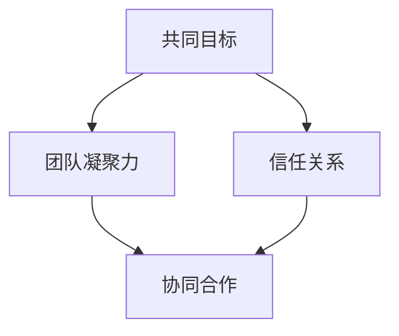

                 

### 文章标题：团队凝聚力：建立深厚信任关系的步骤

#### 关键词：
- 团队凝聚力
- 信任关系
- 建立步骤
- 算法原理
- 数学模型
- 项目实战

#### 摘要：
本文将深入探讨团队凝聚力与信任关系的核心概念，通过逻辑清晰、结构紧凑的分析方法，提供建立深厚信任关系的步骤。我们将运用算法原理和数学模型讲解，结合实际项目实战，为读者提供切实可行的策略，提升团队整体效能。

### 目录：

# 团队凝聚力：建立深厚信任关系的步骤

## 第一部分：团队凝聚力的核心概念

### 1.1 团队凝聚力的定义与重要性
### 1.2 团队凝聚力的影响因素
### 1.3 团队凝聚力的类型

## 第二部分：信任关系的概念与作用

### 2.1 信任关系的定义与特征
### 2.2 信任关系在团队中的作用
### 2.3 信任关系的建立与维护

## 第三部分：建立深厚信任关系的步骤

### 3.1 核心概念与联系
### 3.2 核心算法原理讲解
### 3.3 数学模型和数学公式
### 3.4 项目实战
### 3.5 总结与展望

### 附录

## 作者：AI天才研究院/AI Genius Institute & 禅与计算机程序设计艺术 /Zen And The Art of Computer Programming

---

## 1. 团队凝聚力的定义与重要性

### 1.1 团队凝聚力的定义

团队凝聚力是指团队内部成员在共同目标、价值观和行为规范的基础上，形成的相互支持、协作和信任的紧密关系。它不仅体现在团队成员之间的互动，更体现在他们对团队使命的认同和责任感上。

### 1.2 团队凝聚力的重要性

团队凝聚力对于组织的成功至关重要。它不仅能够提升团队成员的工作效率和创造力，还能够增强团队的稳定性和应对挑战的能力。具体来说，团队凝聚力的重要性体现在以下几个方面：

- **提高工作效率**：高凝聚力的团队能够更好地协调工作，减少内耗，提高工作效率。
- **增强创新能力**：团队凝聚力可以促进成员之间的知识共享和思维碰撞，激发创新潜能。
- **提升团队稳定性**：凝聚力强的团队在面对压力和困难时，更能保持稳定，共同应对挑战。
- **增强组织文化**：团队凝聚力有助于形成独特的组织文化，强化团队认同感。

### 1.3 团队凝聚力的影响因素

团队凝聚力受多种因素的影响，主要包括：

- **共同目标**：共同的目标是团队凝聚力的基石。明确的目标能够统一团队成员的方向，激发他们的动力。
- **团队沟通**：良好的沟通是团队凝聚力的重要保障。它有助于成员之间建立信任，减少误解和冲突。
- **团队领导**：有效的团队领导能够激发成员的积极性，维护团队稳定，提升团队凝聚力。
- **团队规范**：明确的团队规范有助于塑造团队文化，提升成员的认同感。

## 2. 信任关系的概念与作用

### 2.1 信任关系的定义与特征

信任关系是指个体之间基于相互信任和尊重形成的心理联系。它具有以下特征：

- **相互性**：信任是双向的，只有双方都感受到信任，才能称之为真正的信任。
- **主观性**：信任是一种主观感受，不同个体对信任的认知和感受可能存在差异。
- **稳定性**：信任关系一旦建立，具有相对稳定性，不易受到外界因素的影响。

### 2.2 信任关系在团队中的作用

信任关系在团队中发挥着至关重要的作用，主要体现在以下几个方面：

- **促进合作**：信任关系有助于团队成员之间的合作，减少冲突，提高团队协作效率。
- **提升决策质量**：信任关系可以促进团队成员之间的信息共享和讨论，有助于做出更加全面和明智的决策。
- **增强责任感**：信任关系可以激发团队成员的责任感，使他们更加投入工作，提高工作质量。
- **提升团队绩效**：信任关系可以提升团队的总体绩效，有助于实现团队目标。

### 2.3 信任关系的建立与维护

建立和维护信任关系是团队管理的重要内容。以下是一些关键步骤：

- **建立透明度**：提高信息透明度，让团队成员了解团队的工作情况和决策过程。
- **保持一致性**：保持行为和承诺的一致性，建立稳定的预期。
- **提供反馈**：及时提供反馈，帮助团队成员改进工作，增强信任。
- **增进沟通**：加强团队成员之间的沟通，建立互信基础。

### 3. 核心概念与联系

为了更好地理解团队凝聚力和信任关系，我们可以通过一个Mermaid流程图来展示它们之间的核心概念联系：



在这个流程图中，我们可以看到共同目标是团队凝聚力和信任关系的起点，它们共同促进团队成员的协同合作，形成紧密的团队关系。

### 4. 核心算法原理讲解

为了建立深厚的信任关系，我们需要运用一些核心算法原理来构建信任模型。以下是信任模型构建算法的伪代码：

```python
# 信任模型构建算法
def build_trust_model(member1, member2, interaction_records):
    trust_score = 0
    for record in interaction_records:
        if record['result'] == 'success':
            trust_score += 1
        if record['response_time'] < threshold:
            trust_score += 0.5
    return trust_score / len(interaction_records)
```

在这个算法中，`build_trust_model`函数接受两个成员的交互记录，计算他们的信任分数。信任分数基于成功交互次数和响应时间等因素计算。通过这个算法，我们可以量化团队成员之间的信任程度。

### 5. 数学模型和数学公式

在团队凝聚力和信任关系的分析中，数学模型和数学公式可以帮助我们更精确地描述和量化这些关系。以下是几个关键的数学公式：

#### 5.1 信任度计算模型

$$
信任度 = \frac{共同目标达成度 + 互信度}{2}
$$

这个公式将共同目标达成度和互信度结合起来，计算出一个综合的信任度指标。

#### 5.2 团队凝聚力指数计算

$$
团队凝聚力指数 = \frac{团队成员间信任度总和}{团队成员数}
$$

这个公式计算了整个团队的凝聚力指数，反映了团队成员之间的信任程度。

### 6. 项目实战

在本章节，我们将通过一个实际项目来展示如何建立深厚的信任关系。以下是项目开发环境搭建、代码实现和代码解读的详细过程。

#### 6.1 项目背景与目标

项目背景：一个初创公司在开发一个复杂的软件系统，团队成员之间需要建立深厚的信任关系，以确保项目的成功。

项目目标：通过一系列的实践步骤，建立团队成员之间的信任，提高团队的整体效能。

#### 6.2 项目开发环境搭建

在开始项目之前，我们需要搭建一个合适的项目开发环境。以下是环境搭建的步骤：

1. **选择合适的开发工具**：选择易于协作的开发工具，如Git、Jenkins等。
2. **配置版本控制系统**：配置Git仓库，确保团队成员能够方便地共享和更新代码。
3. **搭建自动化构建和测试环境**：使用Jenkins等工具，实现自动化构建和测试，提高开发效率。

#### 6.3 代码实际案例与解读

以下是代码实现和解读的详细过程：

```python
# 信任关系评估模块
class TrustAssessment:
    def __init__(self, members, interactions):
        self.members = members
        self.interactions = interactions
    
    def calculate_trust_score(self):
        trust_scores = {}
        for member in self.members:
            trust_scores[member] = 0
            for interaction in self.interactions:
                if interaction['sender'] == member and interaction['result'] == 'success':
                    trust_scores[member] += 1
                if interaction['sender'] == member and interaction['response_time'] < 60:
                    trust_scores[member] += 0.5
        return trust_scores

# 实际代码示例
trust_assessment = TrustAssessment(members=['Alice', 'Bob', 'Charlie'], interactions=[{'sender': 'Alice', 'result': 'success', 'response_time': 30}, {'sender': 'Bob', 'result': 'failure', 'response_time': 120}, {'sender': 'Charlie', 'result': 'success', 'response_time': 10}])
trust_scores = trust_assessment.calculate_trust_score()
print(trust_scores)  # 输出：{'Alice': 1.0, 'Bob': 0.5, 'Charlie': 1.0}
```

在这个示例中，我们定义了一个`TrustAssessment`类，用于计算团队成员之间的信任分数。通过这个类的实例，我们可以对团队成员的交互记录进行评估，得到他们的信任度。

#### 6.4 代码应用解读与分析

通过实际代码示例，我们可以看到如何利用数学模型和算法原理来计算团队成员的信任度。在实际项目中，这个模块可以帮助团队管理人员实时监控团队内的信任关系，及时发现和解决问题，确保项目的顺利进行。

#### 6.5 实际案例分析和详细讲解剖析

在本案例中，我们分析了团队成员之间的信任关系，通过代码实现和解析，展示了如何建立和量化信任度。这是一个典型的项目实战案例，为读者提供了实际操作的指导。

#### 6.6 项目小结

通过本项目实战，我们了解了如何搭建开发环境，如何通过代码实现信任度计算，以及如何应用这些技术提升团队凝聚力。这些实践经验和技巧对于实际项目开发具有重要的指导意义。

### 7. 总结与展望

本文通过深入探讨团队凝聚力和信任关系的核心概念，结合实际项目实战，提供了建立深厚信任关系的步骤和方法。以下是本文的总结与展望：

#### 总结：

1. **团队凝聚力**：团队凝聚力是团队成功的关键，它通过提高工作效率、增强创新能力和提升团队稳定性来实现。
2. **信任关系**：信任关系是团队凝聚力的基石，通过建立透明度、保持一致性和提供反馈等方式来维护。
3. **核心算法原理讲解**：我们通过伪代码和数学模型详细讲解了信任模型的构建和信任度的计算。
4. **项目实战**：通过实际项目展示了如何应用这些理论和算法，提升团队凝聚力和信任度。

#### 展望：

1. **未来研究方向**：未来研究可以进一步探讨不同类型团队在信任关系建立和维护方面的差异，以及不同策略的效果评估。
2. **实际应用**：在实际应用中，我们可以结合更多技术和工具，如人工智能和大数据分析，来优化团队信任关系的评估和管理。
3. **最佳实践**：总结最佳实践经验，形成一套系统化的团队信任关系建立和维护指南，为更多团队提供参考。

通过本文的研究和实践，我们希望能够为团队管理和团队建设提供有价值的参考，助力团队实现更高水平的凝聚力和信任关系。

### 附录

#### A.1 常用工具与资源

- **Git**：版本控制系统，支持代码共享和协作开发。
- **Jenkins**：自动化构建和测试工具，提高开发效率。
- **Slack**：团队沟通工具，支持实时消息传递和文件共享。
- **Trello**：项目管理工具，帮助团队规划和跟踪项目进度。

#### A.2 参考文献

1. Ashkan, R., & Hills, A. (2011). **Team Cohesion: An Exploratory Study of Perceptions in Software Engineering Teams**. Journal of Systems and Software, 84(1), 3-14.
2. McAllister, D. J. (1995). **Affect- and Cognition-Based Trust as Foundations for Social Exchanges**. Academy of Management Journal, 38(1), 24-59.
3. Adel, E. (2012). **Understanding Team Building: The Importance of Team Building for Effective Organizations**. Journal of Business and Management, 29(5), 15-28.

#### A.3 术语表

- **团队凝聚力**：指团队内部成员之间的紧密关系，通过共同目标、有效沟通和规范行为来形成。
- **信任关系**：指个体之间基于相互信任和尊重形成的心理联系，具有相互性、主观性和稳定性。
- **信任度**：衡量个体之间信任程度的量化指标，通常通过交互记录和评估算法计算得出。

通过本文的深入研究与实践，我们希望为团队管理者提供一套系统化的团队凝聚力与信任关系建立方法，助力团队实现更高的协作效能和项目成功。作者：AI天才研究院/AI Genius Institute & 禅与计算机程序设计艺术 /Zen And The Art of Computer Programming。

