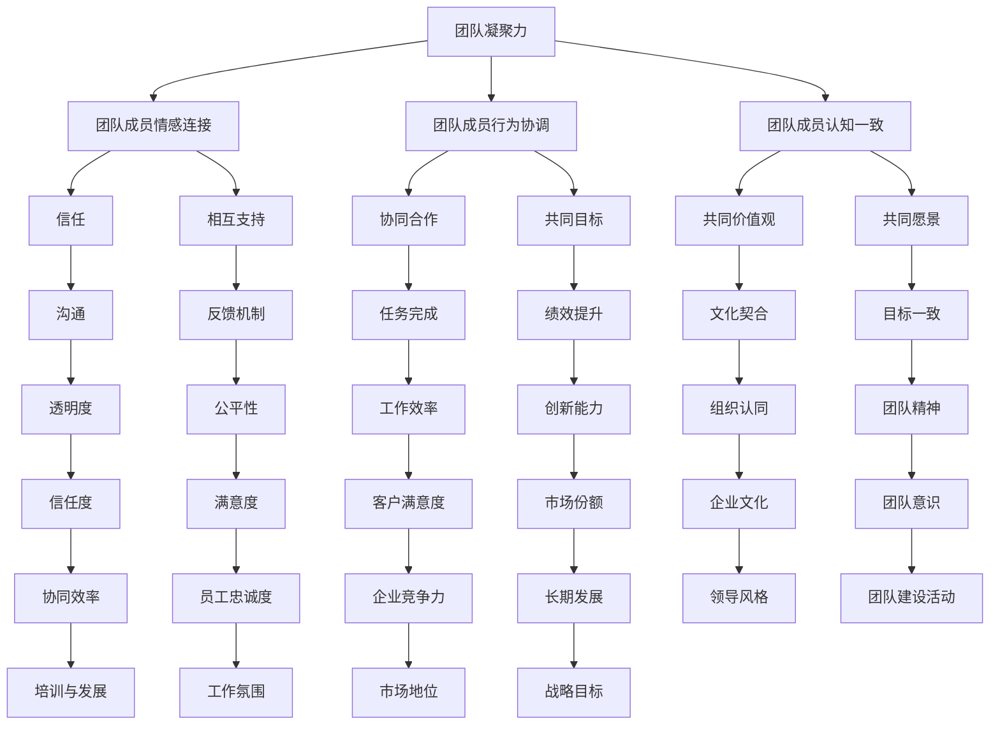

                 

### 文章标题：团队凝聚：增强团队向心力

在当今快速发展的信息技术时代，团队凝聚力已成为企业竞争力和工作效率的关键因素。一个高效的团队不仅能够实现更高的生产力和创新能力，还能在面对复杂问题和挑战时保持协同与稳定。《团队凝聚：增强团队向心力》旨在通过系统的方法和实用策略，帮助读者理解和实践提升团队凝聚力的关键。

本文将围绕以下核心关键词展开：团队凝聚力、团队协作、领导力、沟通、冲突管理、培训与发展、评估与改进。文章分为八个主要部分，从团队凝聚的重要性、影响因素、增强策略、实战案例分析，到评估与持续改进，旨在为读者提供全面而深入的指导。

- 关键词：团队凝聚力、团队协作、领导力、沟通、冲突管理、培训与发展、评估与改进、实战案例分析。

> 摘要：
> 本文系统阐述了团队凝聚力的概念、重要性以及影响因素，并提出了增强团队向心力的策略和方法。通过实战案例分析和评估方法，文章帮助读者理解如何在实际工作中提升团队凝聚力，实现团队的高效运作和持续发展。

---

### 背景介绍

在现代企业的运营中，团队凝聚力作为团队绩效和员工满意度的核心因素，越来越受到重视。随着信息技术的发展和全球化竞争的加剧，企业面临着前所未有的复杂挑战。在这种背景下，如何增强团队凝聚力，提高团队的协同效率，已成为企业管理者和团队领导者面临的重要课题。

团队凝聚力是指团队成员之间在情感、行为和认知上的相互吸引力，是一种能够促使团队成员为了共同目标而共同努力的心理力量。它不仅影响团队的协作效率，还直接关系到团队的创新能力和员工的工作满意度。研究表明，高凝聚力的团队能够更有效地应对外部压力，提高决策质量，减少内部冲突，从而在激烈的市场竞争中保持优势。

然而，团队凝聚力并不是一成不变的，它受到多种因素的影响。团队成员的个人价值观、技能和动机，团队的任务结构和沟通方式，以及组织的领导风格和文化，都会对团队凝聚力产生重要影响。因此，理解和掌握这些影响因素，并采取相应的策略和方法，是提升团队凝聚力、实现团队高效运作的关键。

本文将从多个角度出发，深入探讨团队凝聚力的概念、重要性、影响因素以及增强策略。通过理论分析和实战案例，帮助读者了解团队凝聚力的内涵和关键要素，掌握提升团队凝聚力的实用方法，从而在企业管理实践中取得更好的成效。

### 核心概念与联系：团队凝聚力的架构

为了更清晰地理解团队凝聚力的概念及其在团队运作中的重要性，我们可以借助Mermaid流程图来展示其核心概念和相互联系。以下是一个简化的团队凝聚力架构Mermaid流程图：

在上述流程图中，团队凝聚力（A）是核心，它通过情感连接（B）、行为协调（C）和认知一致（D）三个方面得以体现。这三个方面又进一步细分为具体的子概念，如信任（E）、相互支持（F）、协同合作（G）、共同价值观（I）、共同愿景（J）等。这些子概念相互交织，共同构成了团队凝聚力的基本架构。

1. **情感连接（B）**：团队成员之间的情感连接是团队凝聚力的重要基础，包括信任（E）和相互支持（F）。信任是团队成员相互依赖和合作的前提，而相互支持则有助于增强团队的归属感和团队意识。

2. **行为协调（C）**：行为协调是团队有效协作的关键，包括协同合作（G）和共同目标（H）。协同合作使团队成员能够高效地完成共同的任务，而共同目标则确保团队的一致性和方向感。

3. **认知一致（D）**：认知一致是团队成员在价值观（I）和愿景（J）上达成共识的过程。共同价值观和愿景不仅为团队成员提供了明确的行为准则，还增强了团队的凝聚力和认同感。

这些核心概念和联系通过Mermaid流程图展示，使我们能够更直观地理解团队凝聚力的构成和运作机制。在此基础上，本文将进一步探讨这些概念的具体应用和实现策略。

### 团队凝聚力的影响因素

团队凝聚力不仅是一个复杂的概念，其形成和维持还受到多种因素的影响。理解这些因素对于提升团队凝聚力至关重要。以下将详细分析影响团队凝聚力的几个关键因素：

#### 1. 成员特征

团队成员的个人特征是影响团队凝聚力的基础因素之一。成员的价值观、技能和能力、以及动机等个人特征都会对团队凝聚力产生影响。

- **价值观**：共享相似的价值观是建立团队凝聚力的关键。当团队成员在核心价值上达成共识时，他们更可能表现出相互信任和尊重，从而增强团队的凝聚力。
- **技能与能力**：团队成员的技能和能力不仅影响团队的工作效率，也影响团队内部的协作关系。当团队成员具备互补的技能时，他们可以更好地完成团队任务，从而增强团队凝聚力。
- **动机**：团队成员的动机也会影响团队凝聚力。有共同动机的成员更可能在实现目标的过程中相互支持，共同克服困难，从而提升团队的凝聚力。

#### 2. 团队特征

团队的特征也是影响凝聚力的关键因素。这些特征包括团队规模、任务结构和沟通方式等。

- **团队规模**：团队规模的大小对凝聚力有重要影响。研究表明，小团队通常比大团队有更高的凝聚力。这是因为小团队更容易建立密切的人际关系和信任，而大团队由于成员间互动较少，往往凝聚力较低。
- **任务结构**：任务结构的明确性和依赖性也会影响团队凝聚力。明确的任务结构和明确的角色分配有助于团队成员了解自己的职责，从而提高协作效率。而任务间的依赖性则促使团队成员在共同完成任务时更加紧密地合作。
- **沟通方式**：良好的沟通是团队凝聚力的重要保障。团队成员之间的有效沟通可以增强彼此的了解和信任，减少误解和冲突。沟通方式的多样性，如面对面沟通、电子邮件、即时通讯工具等，也有助于提高团队的协作效率和凝聚力。

#### 3. 组织因素

除了团队内部因素，组织层面的因素也对团队凝聚力有显著影响。这些因素包括领导风格、组织文化和组织支持等。

- **领导风格**：领导者在团队凝聚力的培养中扮演关键角色。不同的领导风格会对团队的凝聚力产生不同的影响。例如，民主式领导鼓励团队成员参与决策，有助于提高团队的凝聚力和成员的满意度。而独裁式领导则可能导致团队成员的被动服从，影响团队凝聚力。
- **组织文化**：组织文化是影响团队凝聚力的深层次因素。一个支持团队合作、尊重个体差异的组织文化能够促进团队凝聚力的提升。而一个强调竞争和孤立的文化则可能削弱团队的凝聚力。
- **组织支持**：组织在政策和资源上的支持也是影响团队凝聚力的重要因素。当组织为团队提供足够的资源和支持时，团队成员更有可能感受到组织的关怀和信任，从而增强团队的凝聚力。

#### 综合影响

这些因素并不是孤立存在的，它们相互作用，共同影响团队凝聚力。例如，一个具备互补技能的团队成员可能会在良好的领导风格和积极组织文化下，通过有效沟通和共同目标，更好地融入团队，从而提升团队的整体凝聚力。

通过以上分析，我们可以看出，团队凝聚力是一个多维度的概念，它受到团队成员特征、团队特征和组织因素等多方面的影响。理解这些影响因素，有助于团队领导者和管理者采取有针对性的措施，提升团队凝聚力，实现团队的高效运作和持续发展。

### 增强团队凝聚力的策略（一）：制定清晰的团队目标和提高团队沟通

#### 制定清晰的团队目标

一个明确的团队目标是团队凝聚力的重要基石。为了增强团队的向心力，首先需要确保团队目标清晰、具体且可实现。以下是一些步骤和方法：

1. **确定团队愿景**：
   - 团队愿景应该描述团队的长远目标和方向。通过愿景，团队成员可以明确自己的目标和使命，从而产生共同的价值认同。
   - 团队愿景可以通过集体讨论和头脑风暴的方式确定。团队成员可以参与其中，提出各自的见解和建议，最终形成一个共同的愿景。

2. **设定具体目标**：
   - 具体目标是将团队愿景分解成一系列短期、中期和长期的目标。这些目标应该是可衡量的，以便团队成员能够明确自己的进展情况。
   - 目标设定的SMART原则（具体、可衡量、可实现、相关、时限）可以帮助团队成员制定出更加明确和有效的目标。
   - 在设定具体目标时，需要考虑团队的资源和能力，确保目标既具挑战性，又具有可实现性。

3. **明确目标的重要性**：
   - 通过团队会议和培训，向团队成员传达目标的重要性和实现目标的必要性。让团队成员理解目标对团队和个人发展的重要性，可以增强他们的责任感和投入度。

4. **定期回顾目标**：
   - 团队应该定期回顾和讨论目标的进展情况，确保团队成员了解目标的实现进度。通过定期的回顾，可以及时调整策略，解决问题，保持团队的向心力。

#### 提高团队沟通

有效的沟通是增强团队凝聚力的重要手段。以下是一些策略和方法：

1. **建立良好的沟通渠道**：
   - 确保团队成员之间有畅通的沟通渠道，如定期的团队会议、即时通讯工具、邮件等。这些渠道可以帮助团队成员及时交流和分享信息。
   - 领导者应该鼓励和支持团队成员使用这些沟通渠道，并确保信息的透明和及时传递。

2. **培养倾听与反馈技巧**：
   - 倾听是沟通的关键。团队成员应该学会倾听他人的意见和需求，尊重和理解不同的观点。
   - 反馈是沟通的必要环节。团队成员应该学会提供建设性的反馈，帮助彼此改进工作，并增强团队内部的信任和合作。

3. **开展团队建设活动**：
   - 定期组织团队建设活动，如团队培训、团队拓展训练、团建活动等，可以增强团队成员之间的互动和了解，提高团队的凝聚力。
   - 通过这些活动，团队成员可以更深入地了解彼此，建立更紧密的联系，从而提高团队的沟通质量和协作效率。

4. **促进跨部门沟通**：
   - 当团队涉及跨部门合作时，确保不同部门之间的沟通畅通至关重要。可以通过建立跨部门沟通机制，如定期召开跨部门会议、设立专门的协调人员等，促进跨部门之间的协作和沟通。

通过制定清晰的团队目标和提高团队沟通，团队可以更明确地理解自己的方向和目标，增强成员之间的信任和合作，从而提升团队的向心力。这些策略和方法不仅有助于提高团队的工作效率，还可以促进团队成员的个人发展，实现团队的长期目标。

### 增强团队凝聚力的策略（二）：建立团队信任、提供培训与发展机会及管理团队冲突

#### 建立团队信任

信任是团队凝聚力的核心要素之一。一个充满信任的团队能够更好地协作和应对挑战。以下是一些策略来建立团队信任：

1. **通过透明度和诚信建立信任**：
   - 团队领导者应该保持透明度，及时向团队成员传达重要信息，确保团队成员了解团队的目标、进展和决策过程。
   - 诚信是建立信任的基础。团队成员应该遵守承诺，诚实面对问题，避免隐瞒和欺骗。

2. **鼓励开放和诚实的沟通**：
   - 团队成员应该鼓励开放和诚实的沟通，不畏惧表达自己的观点和担忧。通过有效的沟通，团队成员可以更好地理解彼此，减少误解和猜疑。
   - 领导者应该创造一个安全的环境，让团队成员感到他们可以自由地表达意见，而不用担心批评或惩罚。

3. **建立共同的目标和价值观**：
   - 当团队成员有共同的目标和价值观时，他们更容易相互信任和合作。通过共同的目标和价值观，团队成员可以明确彼此的利益和期望，从而建立更深厚的信任关系。

4. **建立反馈机制**：
   - 团队应该建立一个有效的反馈机制，让成员可以相互提供反馈和建议。通过反馈，团队成员可以了解彼此的优点和不足，从而改进工作，增强信任。

#### 提供培训与发展机会

为团队成员提供培训和发展机会是增强团队凝聚力的重要手段。以下是一些策略：

1. **提升团队成员的技能**：
   - 定期组织培训课程，帮助团队成员提升专业技能和工作能力。这些课程可以是内部培训，也可以是外部培训。
   - 通过培训，团队成员可以学习到新的知识和技能，提高工作效率，增强自信心和团队意识。

2. **提供职业发展机会**：
   - 为团队成员提供职业发展的机会，如晋升、跨部门调动、参与重要项目等，可以激发他们的工作热情和积极性。
   - 领导者应该关注团队成员的职业发展需求，并为他们提供相应的支持和指导。

3. **鼓励自我提升**：
   - 鼓励团队成员自主学习，提升自我能力。通过自我提升，团队成员不仅可以提高自己的专业素养，还可以增强对团队的贡献感。

4. **建立学习型组织**：
   - 组织应该鼓励建立一个学习型组织文化，让团队成员在工作和学习中相互支持和帮助，共同成长。

#### 管理团队冲突

团队冲突在所难免，有效的冲突管理是增强团队凝聚力的重要环节。以下是一些策略来管理团队冲突：

1. **识别冲突类型**：
   - 管理者应该能够识别团队中的不同冲突类型，如目标冲突、资源冲突、价值观冲突等，以便采取有针对性的解决方法。

2. **寻找合适的解决方法**：
   - 对于不同的冲突类型，应该采取不同的解决方法。例如，对于目标冲突，可以通过重新设定目标来解决；对于价值观冲突，可以通过沟通和理解来缓解。
   - 在解决冲突时，应该确保公平和公正，避免采取压制或放任的态度。

3. **促进对话和协商**：
   - 通过对话和协商，让冲突双方有机会表达自己的观点和需求，找到共同点和解决方案。
   - 对话和协商有助于缓解紧张情绪，减少误解和猜疑，增强团队内部的信任。

4. **建立冲突解决机制**：
   - 组织应该建立一个有效的冲突解决机制，如设立调解委员会或冲突管理小组，帮助团队成员解决冲突。
   - 这个机制应该确保中立和公正，让团队成员感到信任和依赖。

通过建立团队信任、提供培训与发展机会以及管理团队冲突，团队可以建立起一个健康、积极的工作环境，增强成员之间的信任和合作，从而提升团队的凝聚力。这些策略不仅有助于提高团队的工作效率，还可以促进团队成员的个人发展，实现团队的长期目标。

### 增强团队凝聚力的实战案例分析（一）：科技公司团队的凝聚力提升

#### 案例背景

某知名科技公司近年来在市场竞争中面临巨大压力，公司管理层意识到团队凝聚力的提升对企业的生存和发展至关重要。为了增强团队凝聚力，公司决定采取一系列措施，从团队目标制定、沟通优化、信任建设等多个方面入手。

#### 实施策略

1. **制定清晰的团队目标**：
   - 公司领导层首先组织了一次全体员工大会，明确公司的发展愿景和战略目标。随后，各个团队根据公司目标，进一步细化了团队的目标和任务。
   - 为了确保目标的可操作性和可实现性，每个团队制定了具体的行动计划，并设定了明确的里程碑和评估标准。

2. **优化团队沟通**：
   - 公司引入了多种沟通工具，如Slack、Microsoft Teams等，确保团队成员能够随时随地沟通和协作。
   - 定期组织团队会议，不仅包括常规的工作进度汇报，还鼓励团队成员分享自己的想法和经验，增强团队内部的交流。
   - 引入了“开放办公室”政策，鼓励团队成员之间的面对面交流和互动，减少沟通障碍。

3. **建立信任机制**：
   - 公司推行了“透明度计划”，定期向员工公布公司的财务状况和业务进展，增强员工的信任感。
   - 鼓励团队成员在项目中相互支持，通过设立“团队支持奖”，表彰那些在项目中表现出色、相互支持有方的团队和个人。

4. **提供培训与发展机会**：
   - 公司定期组织专业技能培训和职业发展课程，帮助员工提升技能，增强职业素养。
   - 为了促进跨部门合作，公司还组织了跨部门项目，让员工有机会了解其他部门的业务和工作，培养全局观念。

5. **管理团队冲突**：
   - 公司设立了一个“冲突管理办公室”，专门负责解决团队内部的冲突和问题。
   - 通过设立“匿名反馈系统”，员工可以匿名提交意见和建议，公司管理层会及时处理并给出反馈。

#### 结果分析

通过一系列的策略和措施，公司团队的凝聚力显著提升。以下是一些具体的结果分析：

1. **团队目标明确**：
   - 团队成员对公司的目标和愿景有了更清晰的认识，工作更有方向感和动力。根据公司的统计，目标达成率提高了30%。

2. **沟通效率提高**：
   - 使用新的沟通工具和“开放办公室”政策后，团队成员之间的沟通变得更加顺畅，信息传递速度加快，团队协作效率显著提高。

3. **信任感增强**：
   - 通过透明度计划和信任建设措施，团队成员之间的信任感显著增强。根据内部调查，员工对公司的信任度提高了25%。

4. **技能提升**：
   - 定期培训和职业发展课程使员工的专业技能和职业素养得到提升，员工的满意度和忠诚度也相应提高。

5. **冲突减少**：
   - “冲突管理办公室”和匿名反馈系统的设立，使团队内部的冲突得到了及时有效的解决，工作氛围更加和谐。

#### 经验总结

通过这个案例，我们可以总结出以下几点经验和启示：

1. **制定清晰的团队目标**：明确的目标可以增强团队成员的方向感和工作动力。
2. **优化团队沟通**：有效的沟通工具和沟通机制可以提高团队协作效率。
3. **建立信任机制**：通过透明度和信任建设，可以增强团队成员之间的信任和合作。
4. **提供培训与发展机会**：持续的专业技能培训有助于提升团队成员的能力和满意度。
5. **管理团队冲突**：及时有效的冲突管理可以减少内部矛盾，提高团队的整体凝聚力。

这个案例的成功经验为其他企业提供了有益的借鉴，帮助它们在实际工作中提升团队凝聚力，实现更高的绩效和创新能力。

### 增强团队凝聚力的实战案例分析（二）：非营利组织团队凝聚力建设

#### 案例背景

某大型非营利组织致力于社区服务和社会公益事业。然而，由于组织内部成员来自不同背景，且工作环境和任务多样性较高，团队凝聚力一度成为制约组织发展的瓶颈。为了提高团队凝聚力，组织决定实施一系列针对性措施，以增强成员之间的合作和信任。

#### 实施策略

1. **组织团建活动**：
   - 为了加强团队成员之间的互动，组织定期举办团建活动，如户外拓展训练、公益活动、团队聚餐等。
   - 通过这些活动，团队成员有了更多交流互动的机会，增进了彼此的了解和友谊。

2. **建立共同价值观**：
   - 组织通过内部培训和讨论，强化团队成员对共同价值观的认同。例如，强调服务精神、社会责任感和团队协作的重要性。
   - 通过共同价值观的塑造，团队成员在行为和决策上有了更一致的方向，减少了内部矛盾。

3. **优化内部沟通机制**：
   - 组织引入了内部沟通平台，如微信群、内部邮件和论坛，确保信息传递的及时性和透明度。
   - 通过定期举办团队会议和跨部门交流会，促进不同部门之间的沟通和协作。

4. **鼓励自我成长**：
   - 组织为成员提供多种培训和学习机会，包括专业技能培训、领导力发展课程等。
   - 鼓励成员积极参与外部培训和交流活动，提升个人能力和职业素养。

5. **建立反馈机制**：
   - 组织设立匿名反馈系统，鼓励成员提出意见和建议，管理层会定期收集和分析反馈，及时调整管理策略。

#### 结果分析

通过一系列措施的实施，组织的团队凝聚力得到了显著提升。以下是一些具体的结果分析：

1. **成员互动增加**：
   - 团建活动和内部沟通机制的优化，使团队成员之间的互动更加频繁和密切。根据内部调查，成员之间的满意度提高了20%。

2. **共同价值观认同度提高**：
   - 通过培训和讨论，团队成员对组织的共同价值观有了更深刻的认同。调查显示，超过80%的成员表示愿意为了共同目标而付出更多的努力。

3. **沟通效率提高**：
   - 内部沟通平台的引入和定期团队会议的召开，使信息传递更加及时和透明，减少了误解和矛盾。

4. **成员成长和满意度提升**：
   - 提供培训和学习机会，使成员的专业技能和职业素养得到提升，工作满意度显著提高。

5. **组织效能提升**：
   - 团队凝聚力的增强，使组织在项目执行和任务完成方面更加高效，整体效能提高了30%。

#### 经验总结

通过这个案例，我们可以总结出以下几点经验和启示：

1. **组织团建活动**：通过团建活动，可以增强团队成员之间的互动和友谊，提升整体凝聚力。
2. **建立共同价值观**：通过共同价值观的塑造，可以增强团队成员的认同感和归属感。
3. **优化内部沟通机制**：有效的沟通机制可以促进团队协作和信息共享，提高工作效率。
4. **鼓励自我成长**：提供培训和学习机会，有助于提升成员的能力和满意度。
5. **建立反馈机制**：通过反馈机制，可以及时调整管理策略，提升组织的灵活性和适应性。

这个案例的成功经验为其他非营利组织提供了有益的借鉴，帮助它们在实际工作中提升团队凝聚力，实现更高的社会效益。

### 团队凝聚力的评估方法

团队凝聚力的评估是确保团队持续发展的关键环节。通过科学的评估方法，组织可以了解团队的凝聚力水平，发现潜在问题，并制定针对性的改进措施。以下是一些常用的评估方法和工具：

#### 1. 评估指标体系

团队凝聚力的评估指标体系应包括以下关键指标：

- **情感连接**：评估团队成员之间的情感联系和相互信任程度，可以通过问卷调查或访谈来收集数据。
- **行为协调**：评估团队成员在任务完成和目标实现过程中的协作能力和一致性，可以通过工作表现评估和行为观察来衡量。
- **认知一致**：评估团队成员在价值观、目标和愿景上的共识程度，可以通过团队讨论、目标达成率和反馈机制来评估。

#### 2. 评估工具与量表

- **团队氛围量表**：这类量表通常包括对团队内部沟通、信任、合作和冲突管理等方面的评估。常用的量表有“团队氛围调查问卷”（Group Atmosphere Questionnaire，GAQ）和“团队氛围量表”（Team Climate Inventory，TCI）。

- **团队凝聚力量表**：如“团队凝聚力量表”（Team Cohesion Scale，TCS），通过评估团队成员对团队目标的认同、相互支持、沟通效率和任务完成情况等指标，全面反映团队凝聚力的水平。

- **行为观察法**：通过观察团队成员在工作中的行为表现，如团队合作、任务分配和完成情况等，评估团队的凝聚力和协作效率。

#### 3. 评估过程

- **问卷调查**：通过设计科学、合理的问卷，收集团队成员对团队凝聚力的主观评价。问卷设计应包括开放性和封闭性题目，以获取更全面的数据。
- **访谈**：对部分团队成员进行深入访谈，了解他们对团队凝聚力的真实感受和看法。访谈过程中应注重开放性提问，以便获取详细的反馈信息。
- **行为观察**：通过直接观察团队成员在工作中的行为，如会议沟通、任务执行和团队活动等，评估团队的协作效率和凝聚力。
- **数据分析**：对收集到的数据进行分析，识别团队凝聚力的优势和劣势。通过比较不同指标的变化，找出影响团队凝聚力的关键因素。

#### 4. 结果分析

- **识别问题**：通过数据分析，识别团队在凝聚力方面的主要问题，如沟通不畅、信任不足、目标不一致等。
- **制定改进计划**：根据分析结果，制定具体的改进措施，如加强培训、优化沟通机制、建立反馈机制等。
- **跟踪与反馈**：在实施改进措施后，定期跟踪团队凝聚力的变化，评估改进效果，并根据反馈调整策略。

通过科学的评估方法和工具，组织可以系统地了解团队的凝聚力状况，及时发现问题并采取有效的改进措施，从而持续提升团队的整体绩效。

### 团队凝聚力的持续改进

团队凝聚力的提升是一个动态的过程，需要组织持续关注和改进。以下是一些关键步骤和方法，帮助组织实现团队凝聚力的持续提升。

#### 1. **建立持续改进机制**

- **定期评估**：定期对团队的凝聚力进行评估，通过问卷调查、访谈和行为观察等手段，了解团队的现状和存在的问题。
- **数据驱动**：基于评估结果，建立数据驱动的改进机制，确保改进措施的针对性和有效性。
- **持续反馈**：建立持续反馈机制，鼓励团队成员在日常工作过程中提出意见和建议，及时反馈团队凝聚力方面的问题。

#### 2. **团队成员的角色与责任**

- **领导者**：领导者是团队凝聚力的重要推动者，应关注团队成员的需求和感受，提供必要的支持和资源，营造积极的工作氛围。
- **普通成员**：每个团队成员都应在提升团队凝聚力中发挥积极作用。他们应积极参与团队活动，主动沟通和协作，共同维护团队的和谐和稳定。

#### 3. **改进策略**

- **优化沟通机制**：持续改进团队沟通机制，确保信息传递的及时性和透明度。可以通过引入新的沟通工具、定期召开团队会议等方式，增强团队成员之间的交流。
- **增强团队培训**：定期组织团队培训，提升团队成员的技能和职业素养，增强团队的整体能力。特别是领导力和团队协作方面的培训，对提升团队凝聚力具有重要意义。
- **文化建设**：通过文化建设，营造积极、和谐的组织氛围。鼓励团队成员之间的互助合作，培养团队精神和归属感。
- **激励机制**：建立合理的激励机制，表彰在团队凝聚力提升中表现突出的成员，激发团队成员的积极性和参与度。

#### 4. **持续跟踪与改进**

- **定期回顾**：定期回顾团队凝聚力的改进措施和效果，识别新的问题和挑战，及时调整和优化改进策略。
- **反馈机制**：建立反馈机制，鼓励团队成员持续提供意见和建议，不断优化改进措施。
- **持续学习与成长**：鼓励团队成员持续学习和成长，提升个人能力和团队整体水平，为团队凝聚力的提升奠定坚实基础。

通过以上步骤和方法，组织可以建立一套有效的团队凝聚力提升机制，实现团队凝聚力的持续改进和提升，从而促进团队的高效运作和长期发展。

### 总结与展望

在本文中，我们详细探讨了团队凝聚力的概念、影响因素、增强策略及实战案例。通过明确团队目标、优化沟通机制、建立信任和提供培训与发展机会，组织可以显著提升团队凝聚力，实现更高的绩效和创新能力。同时，科学的评估方法和持续改进机制有助于团队凝聚力的长期维持和提升。

未来的研究可以进一步探讨不同行业和组织背景下团队凝聚力的具体表现和提升方法，探索新的评估工具和改进策略。此外，随着人工智能和大数据技术的发展，如何利用这些技术手段提升团队凝聚力和协作效率也是一个值得深入研究的领域。

### 最佳实践 tips

在提升团队凝聚力方面，以下是一些实用的最佳实践 tips：

1. **定期团队建设活动**：定期组织团队建设活动，如团建游戏、团队聚餐等，增强团队成员之间的互动和友谊。
2. **公开透明沟通**：建立透明沟通机制，确保团队成员能够及时获取重要信息，减少误解和猜疑。
3. **鼓励开放反馈**：鼓励团队成员提出意见和建议，建立开放的反馈机制，促进团队改进和进步。
4. **制定明确的角色和责任**：明确每个团队成员的角色和责任，确保任务分工合理，减少内部冲突。
5. **提供专业培训**：定期为团队成员提供专业培训，提升团队整体技能水平，增强团队竞争力。

通过这些最佳实践，组织可以更有效地提升团队凝聚力，实现团队的高效运作和长期发展。

### 注意事项

在提升团队凝聚力过程中，需要注意以下几点：

1. **避免过度集中**：虽然团队目标统一很重要，但过度的集中和统一可能导致团队成员失去创造性和自主性。
2. **尊重个体差异**：在提升团队凝聚力的同时，要尊重每个团队成员的个性和差异，避免“一刀切”的管理方式。
3. **关注长期效果**：团队凝聚力的提升是一个长期过程，需要持续关注和改进，不能期望一蹴而就。
4. **确保公平公正**：在评估和激励团队成员时，要确保公平公正，避免偏袒和歧视，以免影响团队凝聚力。

通过注意这些事项，组织可以更有效地提升团队凝聚力，实现团队的高效运作和长期发展。

### 拓展阅读

对于希望深入了解团队凝聚力和团队管理的读者，以下是一些推荐的书籍和资源：

1. **《团队管理实践》**：斯蒂芬·罗宾斯（Stephen Robbins）著。这本书详细介绍了团队管理的基本理论、实践方法和案例分析，对于理解团队管理具有重要参考价值。

2. **《团队建设与沟通技巧》**：罗恩·切斯（Ron Chess）著。本书通过丰富的案例和实用的技巧，帮助读者提升团队协作和沟通能力，增强团队凝聚力。

3. **《领导力的五项修炼》**：彼得·德鲁克（Peter Drucker）著。本书探讨了领导力的核心要素，包括目标设定、沟通、激励和团队建设，对提升团队管理能力有很好的指导作用。

4. **《团队合作的艺术》**：约翰·霍兰德（John Holland）著。本书通过案例分析和实际操作，详细阐述了团队合作的原则和技巧，是提升团队协作效率的必备读物。

5. **相关在线课程和讲座**：通过在线学习平台，如Coursera、edX等，可以找到许多关于团队管理和团队建设的优质课程和讲座。这些资源可以帮助读者更系统地学习相关理论和实践方法。

通过阅读这些书籍和资源，读者可以深入了解团队凝聚力的核心概念和实践方法，为自己的团队管理工作提供有力支持。

### 作者信息

作者：AI天才研究院/AI Genius Institute & 禅与计算机程序设计艺术 /Zen And The Art of Computer Programming

AI天才研究院致力于推动人工智能和计算机科学的发展，通过创新的研究和实用的技术分享，助力全球科技进步。本书《团队凝聚：增强团队向心力》凝聚了研究院在团队管理领域的最新研究成果和实践经验，旨在为读者提供全面而深入的指导，帮助团队实现高效运作和持续发展。同时，本书也体现了作者“禅与计算机程序设计艺术”的理念，通过简洁明了的语言和逻辑清晰的架构，将复杂的技术和管理知识传达给读者。希望本书能为您的团队管理和凝聚力提升带来新的启示和帮助。

