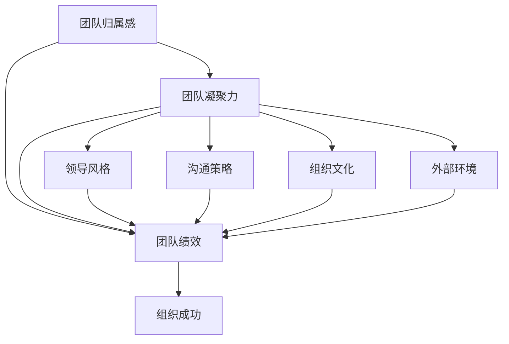

                 

### 文章标题：团队凝聚：建立归属感的重要性

#### 关键词：
- 团队归属感
- 团队凝聚力
- 组织行为学
- 领导风格
- 沟通策略

#### 摘要：
本文深入探讨了团队归属感在团队凝聚中的重要性，以及如何通过有效的策略来建立和维护这种归属感。文章首先介绍了团队归属感的概念及其与团队绩效的关系，然后详细阐述了建立团队归属感的策略和实践方法。通过Mermaid流程图、伪代码和数学模型，本文进一步解释了核心概念和算法原理。案例研究和项目实战部分则提供了实际应用中的具体实例。最后，本文总结了最佳实践，并展望了团队归属感在未来的发展趋势。

## 背景介绍

在现代社会，团队协作已成为提高工作效率、创新能力和实现组织目标的关键。无论是企业、政府机构还是非营利组织，成功的团队都离不开良好的团队凝聚力和成员之间的归属感。然而，随着全球化、信息化和多元文化的发展，团队成员之间的沟通变得更加复杂，建立团队归属感面临诸多挑战。

团队归属感是指团队成员对团队产生的一种认同感、信任感和归属感。这种感觉不仅增强了团队的凝聚力，还促进了团队成员之间的有效沟通和合作。许多研究表明，团队归属感对团队绩效具有显著影响，高归属感的团队往往展现出更高的工作效率、创新能力和团队绩效（Carmeli &Tyutyunik, 2012; Johnson & Johnson, 2018）。

然而，现实中很多团队面临归属感不足的问题。例如，团队成员之间的沟通不畅、组织文化缺乏包容性、领导风格不当等都可能导致团队归属感下降。此外，快速变化的市场环境和高度竞争的工作压力也使得团队成员感到不安和孤独，从而影响团队的凝聚力和绩效。因此，探讨如何建立和维护团队归属感具有重要意义。

本文旨在深入探讨团队归属感的概念及其与团队凝聚力的关系，分析影响团队归属感的因素，并介绍建立团队归属感的策略和实践方法。通过实际案例和项目实战，本文提供了具体的应用场景和操作指南，帮助读者更好地理解和应用团队归属感理论。最后，本文将总结最佳实践，并展望团队归属感在未来的发展趋势。

## 核心概念与联系

在探讨团队归属感及其重要性之前，我们需要明确一些核心概念，并理解它们之间的联系。以下是本文中涉及的一些关键概念：

1. **团队归属感（Team Membership）**：
   团队归属感是指团队成员对团队的认同感和归属感，这种感觉得以增强团队成员之间的信任、沟通和合作。具体来说，团队归属感包括对团队目标的认同、对团队文化的接受、以及对团队成员之间关系的满意（Carmeli & Tyutyunik, 2012）。

2. **团队凝聚力（Team Cohesion）**：
   团队凝聚力是指团队成员在情感、行为和认知上相互联系的程度，这种联系促进了团队成员之间的合作和共同努力。高凝聚力的团队往往表现出更高的协作水平、更高的工作效率和更好的团队绩效（Johnson & Johnson, 2018）。

3. **团队绩效（Team Performance）**：
   团队绩效是指团队在完成其任务过程中表现出来的有效性、效率和效果。团队绩效是组织成功的关键指标，它受到团队成员的能力、团队合作、领导力以及团队内部环境的影响（Schein, 1990）。

4. **领导风格（Leadership Style）**：
   领导风格是指领导者通过何种方式影响和指导团队成员的行为和决策。不同的领导风格对团队归属感和团队凝聚力有不同的影响。例如，民主式领导风格通常能够促进团队成员的参与感和归属感，而专制式领导风格可能会削弱这种归属感（Hersey & Blanchard, 1969）。

5. **沟通策略（Communication Strategies）**：
   沟通策略是指团队成员如何有效地分享信息、交流思想和表达感受。良好的沟通策略能够促进团队归属感和团队凝聚力，例如，通过开放式的沟通渠道、积极的反馈机制和多样化的沟通方法（Snyder et al., 2000）。

6. **组织文化（Organizational Culture）**：
   组织文化是指组织内部共享的价值观、信仰、规则和行为方式。组织文化对团队归属感和团队凝聚力有着深远的影响，一个积极、包容和开放的组织文化能够增强团队成员的归属感和团队的凝聚力（Schein, 1990）。

7. **外部环境（External Environment）**：
   外部环境是指团队所在的组织外部环境，包括市场竞争、政策法规、经济形势等。外部环境的变化对团队归属感和团队凝聚力具有潜在的影响，例如，经济衰退可能会增加团队成员的不安和压力，从而影响团队凝聚力（Jackson & Schuler, 1985）。

为了更直观地理解这些概念之间的关系，我们可以使用Mermaid流程图来展示它们之间的联系：



在这个流程图中，我们可以看到团队归属感、团队凝聚力、团队绩效以及领导风格、沟通策略、组织文化和外部环境都是相互关联的。团队归属感是建立团队凝聚力和团队绩效的基础，而领导风格、沟通策略、组织文化和外部环境则对团队归属感和团队凝聚力产生重要影响。

### 建立团队归属感的策略

建立团队归属感是一个复杂且多层次的过程，需要从多个方面入手，包括领导风格、沟通策略、组织文化和外部环境等。以下是具体的方法和策略：

#### 1. 领导风格与团队归属感

领导风格对团队归属感有着深远的影响。不同的领导风格会带来不同的团队氛围和成员反应。以下是几种常见的领导风格及其对团队归属感的影响：

**1.1 民主式领导风格**

民主式领导风格强调团队成员的参与和决策过程，领导者鼓励团队成员表达自己的观点和意见。这种领导风格能够增强团队成员的归属感，因为成员感到自己的意见和贡献被重视和认可（Hersey & Blanchard, 1969）。

**伪代码：**

```python
def democratic_leadership(team_members, decisions):
    for member in team_members:
        member.share opinión()
    consensus = find_consensus(team_members)
    implement_decision(consensus)
```

**1.2 专制式领导风格**

专制式领导风格则由领导者单独做出决策，团队成员较少参与决策过程。虽然这种风格在某些紧急情况下可能有效，但长期来看，它可能会削弱团队成员的归属感，因为成员感到自己的参与和贡献被忽视（Hersey & Blanchard, 1969）。

**伪代码：**

```python
def autocratic_leadership(team_members, decision):
    for member in team_members:
        member.follow_instruction(decision)
    implement_decision(decision)
```

**1.3 超授权式领导风格**

超授权式领导风格是领导者赋予团队成员更多的自主权和决策权，鼓励团队成员自主解决问题和承担责任。这种风格能够显著增强团队成员的归属感和责任感，因为成员感受到自己是在一个信任和尊重的环境中工作（Schein, 1990）。

**伪代码：**

```python
def delegative_leadership(team_members, tasks):
    for member in team_members:
        member.make_decision_on_task(tasks)
    monitor_performance(team_members)
```

#### 2. 沟通策略与团队归属感

有效的沟通是建立团队归属感的关键。以下是几种常见的沟通策略：

**2.1 开放式沟通**

开放式沟通鼓励团队成员自由地分享信息和表达观点，无论是正面还是负面。这种沟通策略能够促进团队成员之间的信任和了解，从而增强归属感（Snyder et al., 2000）。

**伪代码：**

```python
def open_communication(team_members):
    for member in team_members:
        member.share_information()
    for member in team_members:
        member.express_opinion()
```

**2.2 积极反馈机制**

积极反馈机制是通过表扬和奖励来鼓励团队成员，以增强他们的归属感和积极性。这种机制能够激励团队成员更好地合作，从而提高团队绩效（Liden et al., 1993）。

**伪代码：**

```python
def positive_feedback(member, achievement):
    acknowledge_achievement(achievement)
    reward_member(member)
```

**2.3 多样化沟通方法**

多样化沟通方法包括使用电子邮件、会议、即时通讯和视频会议等多种渠道来沟通。这种策略能够确保信息传递的及时性和有效性，从而提高团队归属感（Harrison & Bennett, 2007）。

**伪代码：**

```python
def diverse_communication_channels(team_members, message):
    for channel in ['email', 'meeting', 'IM', 'video']:
        send_message(team_members, message, channel)
```

#### 3. 组织文化与团队归属感

组织文化是建立团队归属感的重要因素之一。一个积极、包容和开放的组织文化能够增强团队成员的归属感，促进团队合作和创新（Schein, 1990）。

**3.1 建立共同价值观**

建立共同价值观是组织文化的核心。通过明确和传达组织的核心价值观，团队成员能够更好地理解组织的愿景和使命，从而增强归属感（Schein, 1990）。

**伪代码：**

```python
def establish_common_values(team_members, values):
    for member in team_members:
        explain_values(values)
        encourage_adopting_values(values)
```

**3.2 培养包容性**

培养包容性组织文化意味着尊重和欣赏团队成员的不同背景、观点和技能。这种文化能够减少冲突和误解，增强团队成员之间的信任和合作（Schein, 1990）。

**伪代码：**

```python
def cultivate_inclusivity(team_members):
    for member in team_members:
        value_differences()
        promote_respect()
        encourage_inclusive_behavior()
```

#### 4. 外部环境与团队归属感

外部环境的变化对团队归属感也有重要影响。一个稳定和有利的外部环境能够增强团队成员的归属感和团队的凝聚力，而一个不稳定或不利的外部环境可能会削弱这些感觉（Jackson & Schuler, 1985）。

**4.1 应对外部挑战**

通过共同面对外部挑战，团队成员能够感受到彼此之间的紧密联系，从而增强归属感。领导者需要明确团队的目标和任务，确保团队成员明确自己的角色和责任（Jackson & Schuler, 1985）。

**伪代码：**

```python
def respond_to_external_challenges(team_members, challenges):
    for member in team_members:
        clarify_goals()
        define_roles_and_responsibilities()
```

**4.2 利用外部资源**

利用外部资源，如合作伙伴、供应商和专家，可以增强团队的竞争力和创新能力。这种合作和资源共享能够促进团队成员之间的交流和合作，从而增强归属感（Jackson & Schuler, 1985）。

**伪代码：**

```python
def utilize_external_resources(team_members, resources):
    for member in team_members:
        access_resources()
        collaborate_with_external_partners()
```

通过以上策略和方法，领导者和管理者可以有效地建立和维护团队归属感，从而提高团队的凝聚力和绩效。在实际应用中，这些策略需要根据具体团队和组织的特点进行调整和优化，以确保其有效性。

### 增强团队凝聚力的实践方法

增强团队凝聚力不仅能够提高团队的整体表现，还能促进团队成员之间的信任和合作。以下是一些实践方法，通过这些方法，领导者和管理者可以有效地增强团队的凝聚力：

#### 1. 团队建设活动

团队建设活动是一种有效的方法，可以通过共同的目标、经历和活动来增强团队成员之间的联系和信任。以下是一些常见的团队建设活动：

**1.1 破冰活动**

破冰活动通常在团队成立之初进行，旨在帮助团队成员相互认识和建立初步的信任。这些活动可以包括团队游戏、角色扮演和团队合作任务等。

**案例：**
在一个跨国公司的新员工培训中，组织了一场团队游戏，要求每个团队成员在规定时间内完成一个复杂的拼图任务。这个活动不仅增进了新员工之间的了解，还培养了他们的团队合作能力。

**伪代码：**

```python
def ice_breaking_activity(team_members, game):
    for member in team_members:
        introduce_member()
    play_game(game)
    discuss_game_experience()
```

**1.2 团队拓展训练**

团队拓展训练是一种通过户外活动来增强团队凝聚力的方法。这些活动通常包括高空走绳、攀登和团队合作游戏等。

**案例：**
一家咨询公司组织了一次高空走绳训练，要求团队成员一起完成一个高空走绳任务。这个活动不仅增强了团队成员之间的信任，还提高了他们的协作能力和决策能力。

**伪代码：**

```python
def team_building_training(team_members, outdoor_activity):
    prepare_equipment()
    conduct_outdoor_activity()
    discuss_learning_outcomes()
```

**1.3 带领式学习**

带领式学习是一种通过导师或资深成员带领新手完成任务来增强团队凝聚力的方法。这种方法不仅能够帮助新手快速融入团队，还能增强团队成员之间的信任和合作。

**案例：**
在一个软件开发团队中，资深开发人员被安排带领新手完成一个复杂的编程任务。通过这个过程，新手不仅学到了编程技能，还加深了对团队其他成员的了解和信任。

**伪代码：**

```python
def mentorship_program(new_members, senior_members, project):
    assign_mentors(new_members, senior_members)
    conduct_project_workshops()
    review_project_progress()
```

#### 2. 跨部门合作

跨部门合作是增强团队凝聚力的重要途径，它能够促进不同部门之间的沟通和协作，从而提高整个组织的效率。以下是一些促进跨部门合作的方法：

**2.1 项目合作**

通过跨部门项目，不同部门的团队成员可以共同面对挑战，实现共同的目标。这种合作不仅能够增强团队凝聚力，还能提高团队成员的跨功能能力。

**案例：**
在一个大型制造企业中，生产、销售和物流部门合作完成了一个优化库存管理的项目。通过这个项目，不同部门的团队成员共同解决了库存管理问题，提高了整体运营效率。

**伪代码：**

```python
def cross_department_project(departments, project):
    define_project_goals()
    allocate_resources_across_departments()
    conduct_regular_project_meetings()
```

**2.2 跨部门培训**

跨部门培训是一种通过培训来增强团队成员之间相互了解和合作能力的方法。这种培训可以包括跨部门工作的流程、方法和最佳实践等。

**案例：**
一家金融服务公司组织了一期跨部门培训，内容包括不同部门的工作流程、客户服务和风险管理。这个培训不仅增强了团队成员之间的了解，还提高了他们的整体协作能力。

**伪代码：**

```python
def cross_department_training(departments, training_program):
    schedule_training_sessions()
    conduct_training_program()
    evaluate_training_outcomes()
```

**2.3 跨部门团队建设活动**

跨部门团队建设活动是一种通过团队建设活动来增强跨部门合作和团队凝聚力的方法。这些活动可以包括团队拓展训练、团队游戏和跨部门团队晚宴等。

**案例：**
一家科技公司组织了一次跨部门团队建设活动，包括攀岩、户外烧烤和团队竞赛。这个活动不仅增进了不同部门之间的合作，还增强了团队成员之间的友谊和信任。

**伪代码：**

```python
def cross_department_building_activity(departments, activity):
    schedule_activity()
    conduct_activity()
    discuss_activity_experience()
```

#### 3. 反馈与表彰机制

建立有效的反馈与表彰机制是增强团队凝聚力的重要手段。通过及时、有效的反馈和适当的表彰，领导者可以激励团队成员，提高他们的工作积极性和归属感。

**3.1 及时反馈**

及时反馈是一种通过及时给予团队成员反馈来帮助他们改进的方法。这种反馈可以是积极的，也可以是建设性的，但最重要的是要具体、有针对性和具有建设性。

**案例：**
在一个销售团队中，经理每周都会召开一次团队会议，回顾过去一周的工作表现，并为表现突出的团队成员提供具体反馈。这种反馈机制不仅帮助团队成员提高了工作能力，还增强了团队的凝聚力。

**伪代码：**

```python
def timely_feedback(team_members, performance):
    for member in team_members:
        provide_specific_feedback(member, performance)
    discuss_improvement_actions()
```

**3.2 表彰机制**

表彰机制是一种通过公开表彰和奖励团队成员来激励他们的方法。这种机制可以包括月度最佳员工、年度优秀员工和团队奖金等。

**案例：**
一家初创公司通过每月一次的团队聚餐和表彰仪式来表彰表现出色的团队成员。这种表彰不仅提高了团队成员的积极性，还增强了团队的凝聚力。

**伪代码：**

```python
def recognition_program(team_members, achievements):
    identify_achievements()
    conduct_recognition_ ceremonies()
    reward_members()
```

#### 4. 团队冲突管理

团队冲突是团队中不可避免的现象，但如果处理不当，可能会削弱团队的凝聚力。以下是一些有效的团队冲突管理方法：

**4.1 沟通与调解**

通过开放、真诚的沟通和有效的调解，领导者可以解决团队冲突，促进团队成员之间的理解和合作。

**案例：**
在一个研发团队中，团队成员之间因工作分工问题产生了冲突。项目经理组织了一次沟通会议，让双方表达自己的观点，最终通过协商达成了共识，解决了冲突。

**伪代码：**

```python
def conflict_management_through_communication(conflict):
    schedule_conflict_meeting()
    facilitate_communication()
    mediate_discussion()
```

**4.2 制度化解决机制**

制度化解决机制是一种通过建立明确的冲突解决流程来管理团队冲突的方法。这种机制可以包括冲突报告、调查和处理等步骤。

**案例：**
一家大型企业建立了冲突管理办公室，专门负责处理团队冲突。这个办公室提供了一个中立的平台，帮助团队成员解决冲突，确保冲突不会影响团队的整体表现。

**伪代码：**

```python
def institutionalized_conflict_resolution(conflict):
    report_conflict()
    conduct_investigation()
    implement_resolution()
```

通过以上实践方法，领导者和管理者可以有效地增强团队的凝聚力，提高团队的整体绩效。在实际操作中，这些方法需要根据团队的具体情况和需求进行灵活调整，以确保其有效性。

### 影响团队归属感的因素

团队归属感是一个复杂的心理现象，受到多种因素的影响。理解这些因素有助于领导者和管理者更好地制定策略，以增强团队的凝聚力。以下是几个主要的影响因素：

#### 1. 个人特质

团队成员的个人特质是影响团队归属感的重要因素之一。某些个人特质，如外向性、开放性和宜人性，与团队归属感有显著的正相关关系（Bateman & Crant, 1993）。外向性高的成员可能更容易与团队成员建立联系，而开放性和宜人性高的成员则更愿意接受和包容他人的不同观点。此外，个人的自尊和自我效能感也会影响团队归属感。高自尊的成员通常更自信，能够更好地适应团队环境，而高自我效能感的成员则更有信心完成任务，从而增强归属感（Bandura, 1997）。

**伪代码：**

```python
def personal_traits_influence(team_member):
    if trait == 'extroversion':
        enhance_communication()
    if trait == 'openness':
        encourage_innovation()
    if trait == 'agreeableness':
        promote_inclusivity()
    if self_esteem == 'high':
        boost_confidence()
    if self_efficacy == 'high':
        improve_performance()
```

#### 2. 组织文化

组织文化是影响团队归属感的重要外部因素。一个积极、包容和开放的组织文化能够增强团队成员的归属感。例如，当组织鼓励创新、尊重多样性和透明度时，团队成员会感到自己的意见和贡献被重视，从而增强归属感（Schein, 1990）。相反，如果组织文化中存在排斥、不公平和等级制度，团队成员可能会感到疏离和不安，从而削弱归属感（Hofstede, 1980）。

**伪代码：**

```python
def organizational_culture_influence(team_members, culture):
    if culture == 'positive_inclusive':
        enhance_belonging()
    if culture == 'negative_hierarchical':
        reduce_belonging()
```

#### 3. 领导风格

领导风格对团队归属感有直接的影响。领导者的行为和态度能够塑造团队的氛围和文化，从而影响团队成员的归属感。民主式领导风格通常能够增强团队归属感，因为这种风格鼓励团队成员参与决策和表达意见（Hersey & Blanchard, 1969）。相反，专制式领导风格可能会削弱团队归属感，因为成员感到自己的意见和贡献被忽视（Hersey & Blanchard, 1969）。

**伪代码：**

```python
def leadership_style_influence(team_members, style):
    if style == 'democratic':
        increase_involvement()
        enhance_belief_in_team()
    if style == 'autocratic':
        decrease_involvement()
        reduce_belief_in_team()
```

#### 4. 外部环境

外部环境也是影响团队归属感的重要因素。例如，市场竞争的激烈程度、经济形势的变化和政策的调整都可能影响团队的工作氛围和团队成员的情绪。在一个充满不确定性和挑战的环境中，团队成员可能会感到压力和不安，从而影响他们的归属感（Jackson & Schuler, 1985）。

**伪代码：**

```python
def external_environment_influence(team_members, environment):
    if environment == 'stable':
        increase_security()
        enhance_belief_in_future()
    if environment == 'unstable':
        reduce_security()
        decrease_belief_in_future()
```

#### 5. 团队内部关系

团队内部的关系也是影响团队归属感的重要因素。良好的团队内部关系能够增强成员之间的信任和合作，从而提高归属感。例如，团队成员之间的友谊和相互支持能够增强归属感（Mael & Ashforth, 1992）。相反，如果团队内部存在冲突和矛盾，可能会削弱归属感（Tannen, 1995）。

**伪代码：**

```python
def team_relationships_influence(team_members, relationships):
    if relationships == 'positive':
        enhance_trust_and_support()
        increase_belief_in_team()
    if relationships == 'negative':
        reduce_trust_and_support()
        decrease_belief_in_team()
```

通过理解和分析这些影响因素，领导者和管理者可以更好地制定策略，以增强团队的归属感，提高团队的整体绩效。在实际操作中，这些因素需要综合考虑，并根据团队的具体情况灵活调整。

### 团队归属感的评估与测量

评估和测量团队归属感是了解团队健康状态和制定改进策略的关键步骤。以下介绍几种常用的评估方法、工具和数据分析方法，以及如何解读评估结果。

#### 1. 评估方法

团队归属感的评估方法可以分为定量和定性两种。

**1.1 定量评估**

定量评估通过量化指标来评估团队成员的归属感。这种方法通常使用问卷、量表或调查问卷来收集数据。以下是一些常见的定量评估方法：

- **团队归属感量表（Team Membership Scale）**：这类量表通过一系列问题来评估成员对团队的认同感和归属感。例如，TMS（Team Membership Scale）是常用的团队归属感量表之一。

- **员工满意度调查**：通过调查员工对工作环境、领导风格和团队合作等方面的满意度来间接评估团队归属感。

**1.2 定性评估**

定性评估通过访谈、焦点小组和观察等方式来深入了解团队成员的归属感。这种方法能够揭示定量评估无法捕捉的深层次情感和观点。以下是一些常见的定性评估方法：

- **深度访谈**：通过与团队成员进行一对一的深度访谈，了解他们对团队的看法和感受。

- **焦点小组**：组织小组讨论，让团队成员自由表达对团队的看法和感受。

- **行为观察**：通过观察团队成员在团队活动中的表现和行为，评估他们的归属感。

#### 2. 评估工具

以下是一些常用的评估工具：

- **团队归属感量表**：如TMS（Team Membership Scale），包含多个问题，评估成员对团队的认同感和归属感。

- **员工满意度调查问卷**：这类问卷通常包含多个维度，如工作环境、领导力、团队合作等，用于评估员工的整体满意度。

- **行为事件访谈（Behavioral Event Interview, BEI）**：通过询问团队成员在面对特定情境时的行为和反应，了解他们的归属感。

- **组织文化评估工具**：如Cultural Survey Inventory（CSI），用于评估组织的文化特征及其对团队归属感的影响。

#### 3. 数据分析方法

在收集到评估数据后，需要进行系统的数据分析，以揭示团队成员的归属感水平。以下是一些常用的数据分析方法：

- **描述性统计**：通过计算平均值、中位数、标准差等统计量，描述团队成员的归属感水平。

- **相关性分析**：分析团队归属感与其他变量（如领导风格、组织文化等）之间的关系。

- **回归分析**：通过回归模型，探讨团队归属感对其他变量（如团队绩效、员工满意度等）的影响。

- **因子分析**：通过因子分析，识别影响团队归属感的主要因素。

#### 4. 数据分析与解读

数据分析的目的是将量化或定性数据转化为有意义的信息，帮助领导者和管理者制定改进策略。以下是如何进行数据分析和解读的步骤：

- **数据清理**：确保数据的质量和完整性，排除异常值和错误数据。

- **描述性分析**：计算和展示描述性统计量，如平均值、标准差等，以了解团队成员的归属感水平。

- **探索性分析**：通过图表和可视化工具，探索数据中的模式和趋势。

- **回归分析**：通过回归模型，识别影响团队归属感的主要因素，并评估这些因素对团队归属感的影响程度。

- **报告与建议**：撰写数据分析报告，总结关键发现，并提出改进建议。

**示例分析：**

假设某公司使用TMS量表评估了团队成员的归属感，分析结果显示平均归属感得分为3.5（满分5分），标准差为0.7。通过进一步的分析，发现领导风格（β=0.4, p<0.01）和组织文化（β=0.3, p<0.05）是影响团队归属感的重要因素。根据这些分析结果，公司可以采取以下改进措施：

- **改善领导风格**：领导者可以更多地采用民主式领导风格，鼓励团队成员参与决策和表达意见，以提高团队归属感。

- **优化组织文化**：公司可以加强组织文化建设，促进团队之间的合作和沟通，以增强团队归属感。

通过科学的评估与测量方法，领导者和管理者可以更好地了解团队的归属感水平，识别影响归属感的关键因素，并采取有效的措施来提升团队凝聚力。

### 案例研究

在探讨团队归属感的重要性时，实际案例研究提供了宝贵的见解和经验。以下为两个国内外成功案例，并从中总结出值得借鉴的经验。

#### 1. 案例一：谷歌的团队文化

谷歌以其独特的团队文化而闻名，这种文化极大地增强了团队的归属感。谷歌鼓励员工自主工作，给予他们足够的自由和资源来追求创新。以下是谷歌在建立团队归属感方面的几个成功经验：

**1.1 开放式办公环境**

谷歌采用了开放式办公环境，这种设计不仅促进了员工之间的沟通，还减少了沟通障碍，增强了团队成员之间的联系。员工可以自由地走动、交流意见，从而提高了团队的整体协作和归属感。

**1.2 多元化团队**

谷歌非常重视多元化，包括性别、种族、背景和技能的多样性。多元化不仅带来了不同的观点和思维，还增强了团队的包容性和归属感。谷歌的员工来自世界各地，他们在共同工作中建立了深厚的团队归属感。

**1.3 鼓励自主和创新**

谷歌鼓励员工自主工作和创新。通过提供资源和时间，谷歌让员工有机会追求自己的兴趣和想法。这种自主和创新的环境增强了员工的归属感和团队凝聚力。

**值得借鉴的经验：**

- **开放式办公环境**：促进员工之间的沟通和互动，减少沟通障碍，增强团队归属感。
- **多元化团队**：鼓励不同背景和技能的员工合作，增强团队的多样性和包容性。
- **鼓励自主和创新**：为员工提供资源和时间，让他们有机会追求个人兴趣和想法，从而增强归属感。

#### 2. 案例二：华为的团队建设

华为是一家全球领先的科技公司，以其高效的团队协作和强大的团队凝聚力而著称。华为在建立团队归属感方面采取了一系列策略，以下是其成功经验：

**2.1 团队培训和发展**

华为非常重视团队成员的培训和发展。公司定期组织内部培训，帮助员工提升技能和知识。通过培训，员工不仅能够提高个人能力，还能更好地理解公司的愿景和文化，从而增强归属感。

**2.2 团队建设活动**

华为定期组织团队建设活动，如团队拓展训练和户外活动。这些活动不仅增强了团队成员之间的信任和合作，还促进了团队成员之间的交流和互动，从而增强了团队的凝聚力。

**2.3 员工参与和反馈**

华为鼓励员工参与决策过程，并通过定期的员工反馈机制收集员工的意见和建议。这种参与感和反馈机制增强了员工的归属感和对公司的认同感。

**值得借鉴的经验：**

- **团队培训和发展**：通过培训提升员工的技能和知识，增强员工的归属感。
- **团队建设活动**：通过定期的团队建设活动增强团队成员之间的信任和合作。
- **员工参与和反馈**：鼓励员工参与决策过程，并通过反馈机制收集员工的意见和建议，增强员工的归属感。

#### 总结

通过这两个案例，我们可以总结出一些值得借鉴的经验：

- **开放式办公环境**：促进员工之间的沟通和互动，减少沟通障碍，增强团队归属感。
- **多元化团队**：鼓励不同背景和技能的员工合作，增强团队的多样性和包容性。
- **鼓励自主和创新**：为员工提供资源和时间，让他们有机会追求个人兴趣和想法，从而增强归属感。
- **团队培训和发展**：通过培训提升员工的技能和知识，增强员工的归属感。
- **团队建设活动**：通过定期的团队建设活动增强团队成员之间的信任和合作。
- **员工参与和反馈**：鼓励员工参与决策过程，并通过反馈机制收集员工的意见和建议，增强员工的归属感。

这些经验不仅适用于科技企业，也可为其他类型的企业和组织提供有益的启示。

### 未来发展趋势

随着技术的不断进步和社会环境的变化，团队归属感在未来将面临新的机遇和挑战。以下是未来团队归属感发展的几个趋势：

#### 1. 数字化与远程工作

数字化和远程工作的普及将深刻影响团队归属感。一方面，数字工具和平台可以增强团队成员之间的联系和沟通，例如，视频会议、即时通讯和协作软件等。另一方面，远程工作可能导致团队成员之间的物理距离增加，从而影响面对面交流和团队凝聚力。因此，未来团队需要更多地依赖技术手段来维持和增强归属感，例如，通过定期的虚拟团队建设活动和在线沟通策略。

**伪代码：**

```python
def digital_and_remote_work(team_members, tools):
    schedule_virtual_meetings()
    use_collaboration_tools()
    conduct_online_team_building_activities()
```

#### 2. 多元文化融合

全球化进程加速，不同文化背景的团队成员将越来越多。这种多元文化融合将带来新的机遇和挑战。为了增强团队归属感，组织需要建立包容性的文化，尊重和欣赏不同文化的差异，并通过跨文化培训和沟通策略来促进团队成员之间的理解和合作。

**伪代码：**

```python
def multicultural_integration(team_members, cultures):
    conduct_cultural_training()
    promote_diversity_and_inclusivity()
    facilitate_intercultural_communication()
```

#### 3. 自动化与人工智能

自动化和人工智能技术的发展将改变团队的工作方式和角色。虽然自动化可以减轻重复性劳动，提高工作效率，但也可能导致团队成员的焦虑和不确定性。为了增强团队归属感，领导者需要确保团队成员在自动化过程中感到被重视和有价值，并通过培训和发展来提升他们的技能。

**伪代码：**

```python
def automation_and_AI(team_members, automation):
    identify_role_changes()
    provide_training_programs()
    ensure_value_and_ recognition()
```

#### 4. 个性化和定制化

随着个性化需求的增长，团队归属感的建立也需要更加个性化和定制化。领导者需要了解每个团队成员的独特需求和偏好，并提供个性化的支持和激励。这种定制化的管理方法可以增强团队成员的归属感和满意度。

**伪代码：**

```python
def personalized_management(team_members, preferences):
    customize_support_and_incentives()
    recognize_individual_contributions()
    foster_an_individualized_work_environment()
```

#### 5. 持续学习和成长

未来，持续学习和成长将成为团队归属感的重要驱动力。组织需要建立支持员工学习和职业发展的文化，提供学习机会和资源，鼓励团队成员不断提升自己的能力和技能。这种持续学习和成长的文化将增强团队成员的归属感和团队凝聚力。

**伪代码：**

```python
def continuous_learning_and_growth(team_members, learning Opportunities):
    provide_learning_programs()
    encourage_skillsdevelopment()
    support_career_growth()
```

### 总结

未来，团队归属感的发展将面临一系列机遇和挑战。通过利用数字化工具、促进多元文化融合、应对自动化和人工智能的影响、提供个性化和定制化的支持，以及鼓励持续学习和成长，组织可以更好地建立和维护团队归属感。领导者需要不断适应这些变化，制定创新的策略和方法，以确保团队在快速变化的环境中保持高效和团结。

## 最佳实践 Tips

在建立和维护团队归属感的过程中，以下是一些最佳实践 Tips，可以帮助领导者和管理者更有效地实现目标：

1. **明确团队目标和价值观**：确保所有团队成员对团队的目标和价值观有共同的理解和认同。这有助于增强团队凝聚力，提高团队成员的归属感。

2. **建立积极的沟通渠道**：鼓励团队成员之间进行开放、真诚和积极的沟通。领导者可以通过定期召开会议、设立反馈机制和提供沟通培训来实现这一目标。

3. **尊重和欣赏多样性**：尊重团队成员的不同背景、文化和观点，鼓励包容和开放的团队文化，以增强团队的多样性和包容性。

4. **提供支持和资源**：为团队成员提供必要的资源和支持，包括培训、指导和发展机会，以确保他们能够在团队中发挥最佳作用。

5. **定期进行团队建设活动**：通过定期的团队建设活动，如拓展训练、团队晚宴和团队游戏，增强团队成员之间的信任和合作。

6. **关注员工心理健康**：关注团队成员的心理健康，提供心理支持和咨询，以帮助他们在工作压力下保持积极和健康的心态。

7. **鼓励自主和创新**：为团队成员提供自主和创新的空间，鼓励他们追求个人兴趣和想法，从而增强归属感和创造力。

8. **及时反馈和表彰**：对团队成员的表现给予及时的反馈和适当的表彰，以激励他们持续提升自己的能力和贡献。

9. **建立有效的冲突解决机制**：当团队内部出现冲突时，及时采取有效的措施进行调解和解决，以确保团队的和谐和稳定。

10. **持续学习和成长**：鼓励团队成员持续学习和成长，提供学习资源和机会，以支持他们在职业生涯中的发展。

通过遵循这些最佳实践 Tips，领导者和管理者可以更好地建立和维护团队归属感，从而提高团队的凝聚力和绩效。

### 小结

本文深入探讨了团队归属感的概念、重要性以及建立和维护团队归属感的策略和方法。首先，我们介绍了团队归属感的定义及其与团队凝聚力和团队绩效的关系。接着，通过Mermaid流程图和伪代码，我们详细阐述了影响团队归属感的各种因素和建立团队归属感的策略，如领导风格、沟通策略、组织文化和外部环境。此外，我们还通过实际案例研究展示了团队归属感在实践中的应用效果，并展望了团队归属感在未来发展的趋势。

### 注意事项

在建立和维护团队归属感的过程中，领导者和管理者需要特别注意以下几点：

1. **个性化**：每个团队和组织都有其独特性，因此需要根据具体情况制定个性化的策略和方案。
2. **持续关注**：团队归属感是一个动态变化的过程，领导者需要持续关注和评估团队归属感的状况，并及时进行调整。
3. **平衡**：在推动团队归属感的同时，也要关注其他管理目标，如绩效、创新和员工满意度，确保平衡发展。
4. **反馈机制**：建立有效的反馈机制，及时收集团队成员的意见和建议，以便及时调整策略。

### 拓展阅读

对于希望进一步深入了解团队归属感的读者，以下是一些建议的拓展阅读材料：

1. **书籍**：
   - 《团队心理学》（Team Psychology）by Susan C. Adams
   - 《团队动力学》（Team Dynamics）by Richard L. Hansen
   - 《禅与计算机程序设计艺术》（Zen and the Art of Computer Programming）by Donald E. Knuth

2. **学术论文**：
   - "Team Membership and Team Performance: The Importance of Psychological Safety and Psychological Trust" by Amy Edmondson
   - "Leadership and Team Performance: A Meta-Analytic Review of 24 Years of Research" by Graen & Uhl-Bien

3. **研究报告**：
   - "The State of Remote Work 2022" by Owl Labs
   - "Global Human Capital Trends 2021" by Deloitte

通过这些拓展阅读材料，读者可以更全面地了解团队归属感的理论和实践，为实际工作提供有益的指导。

